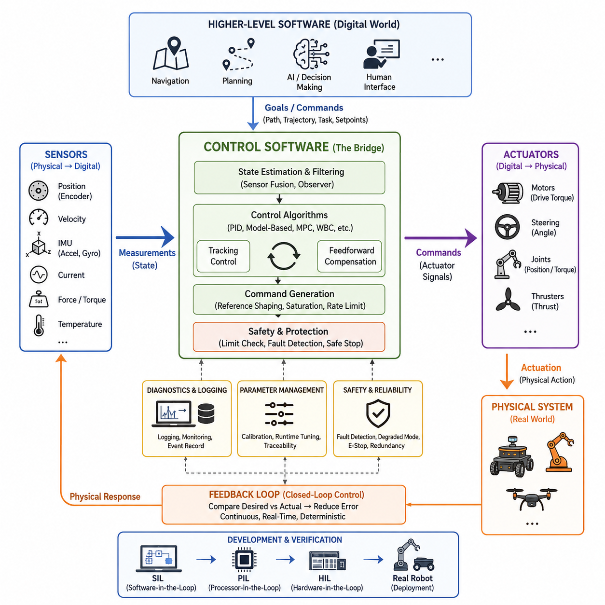
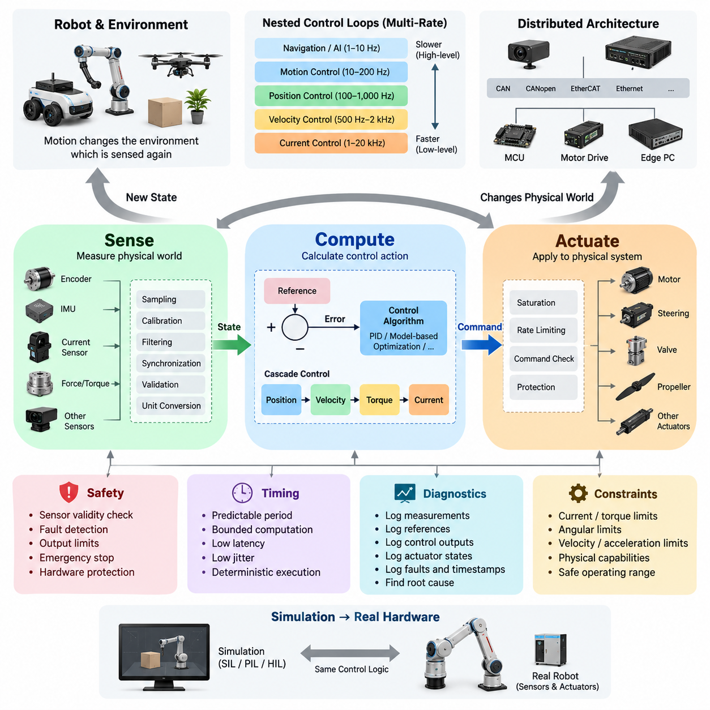
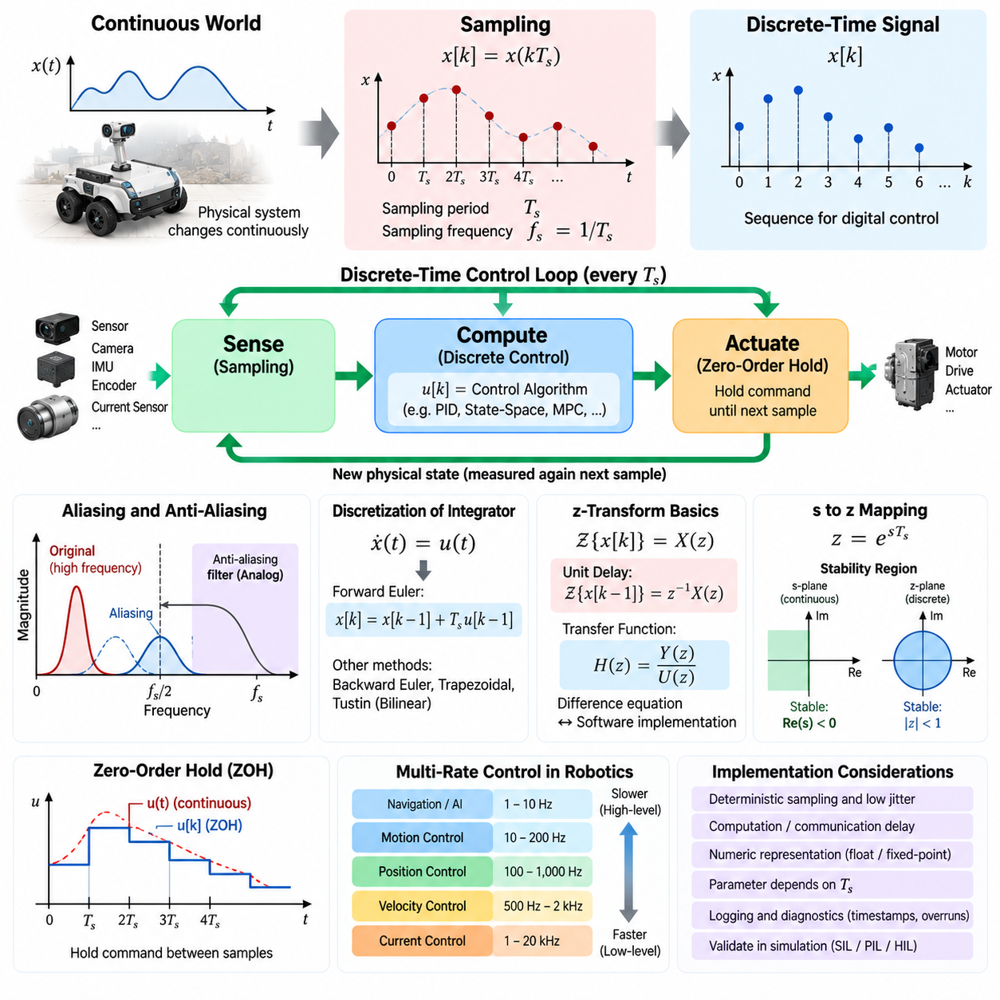
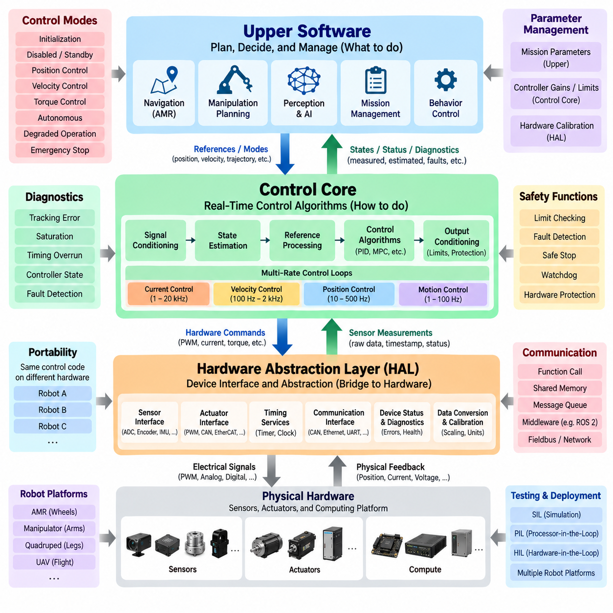
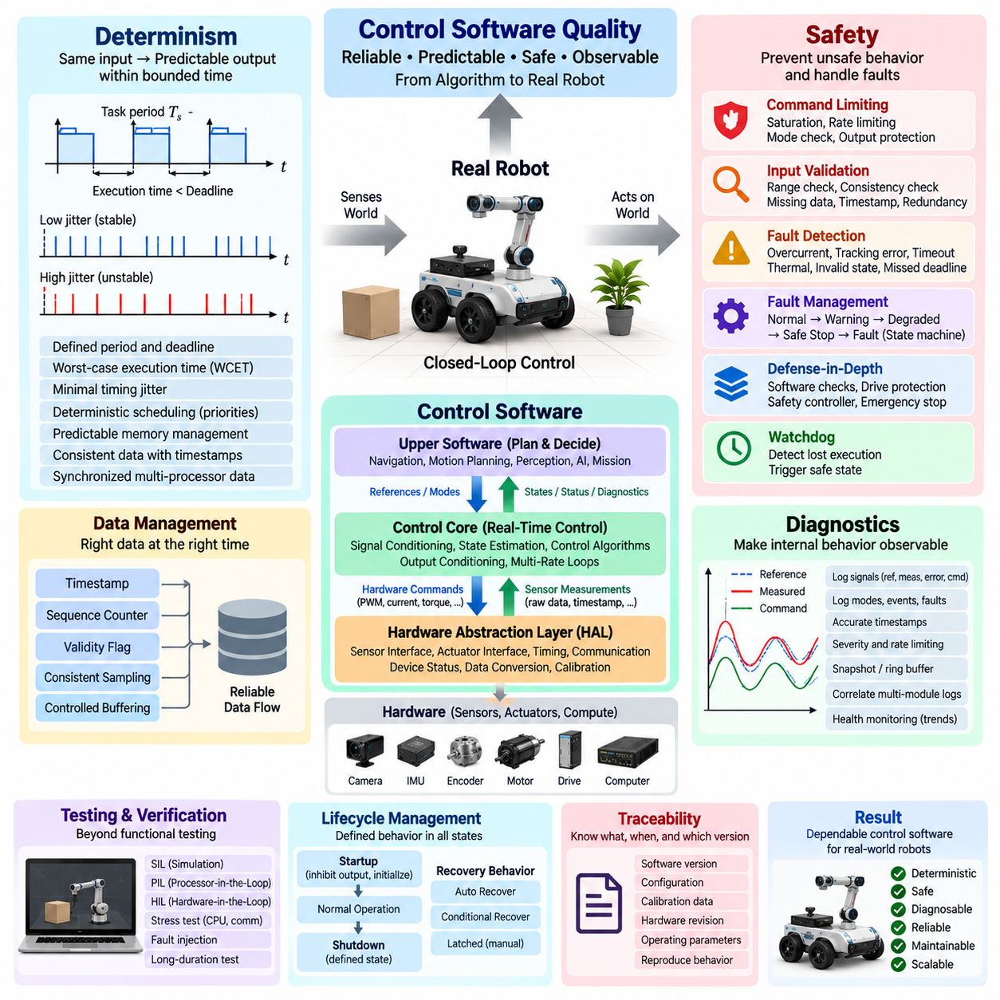
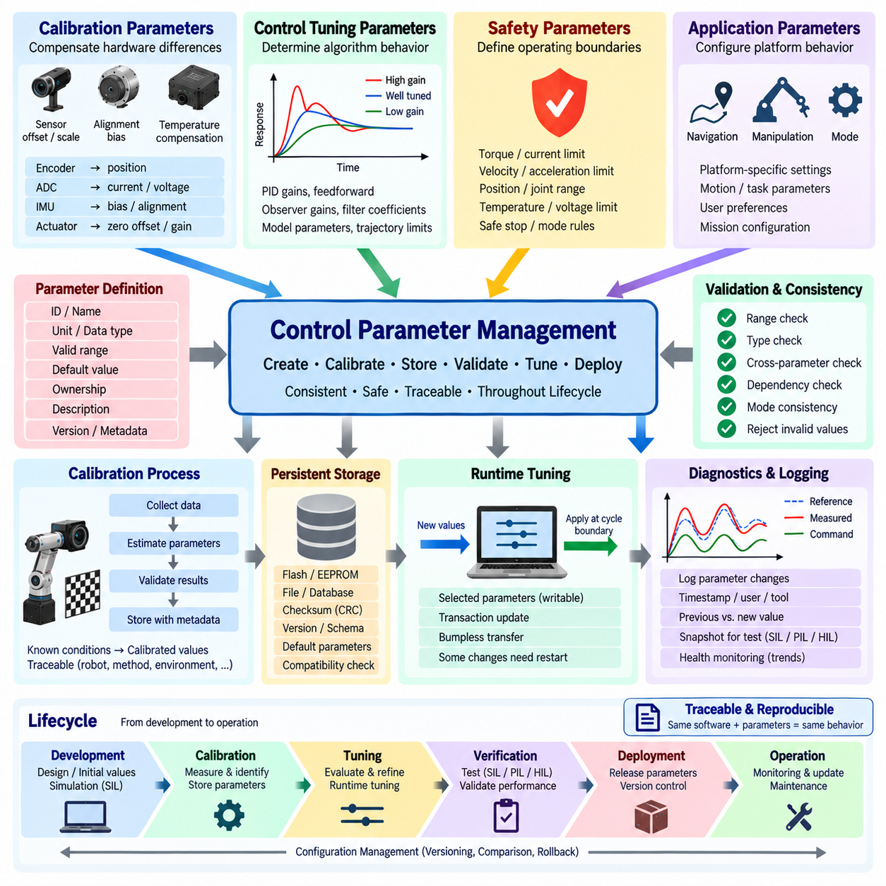
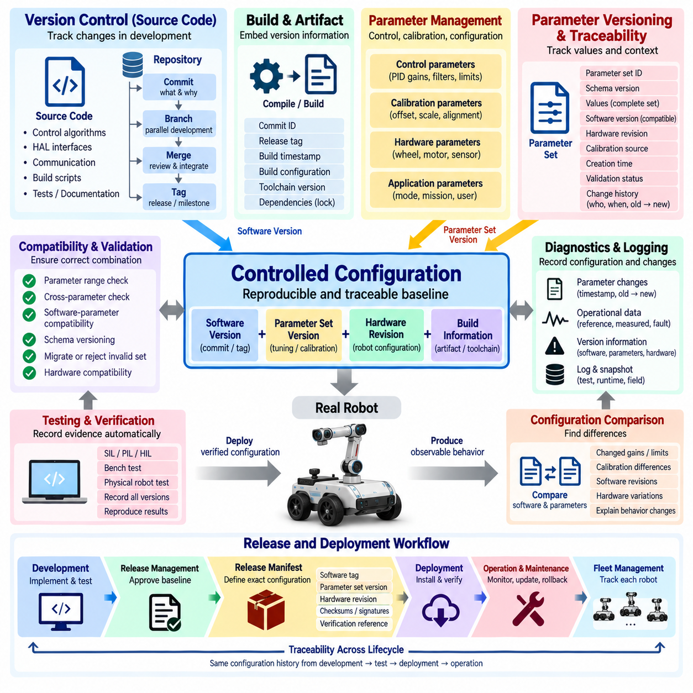
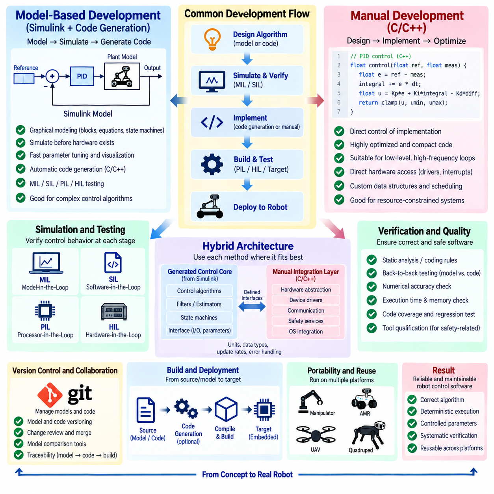
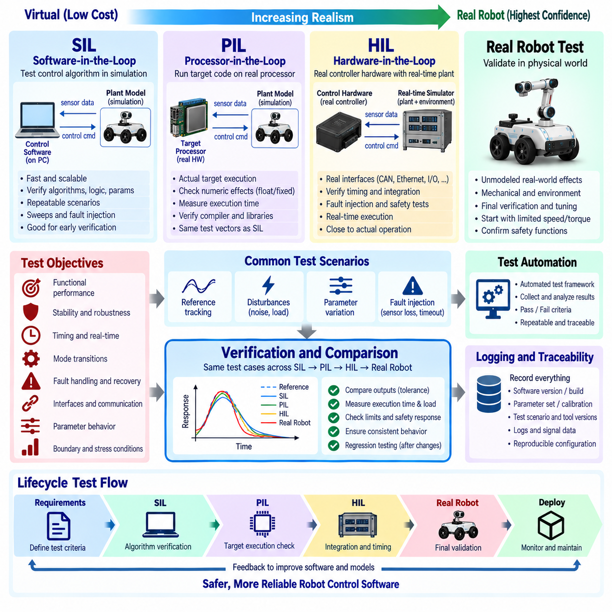
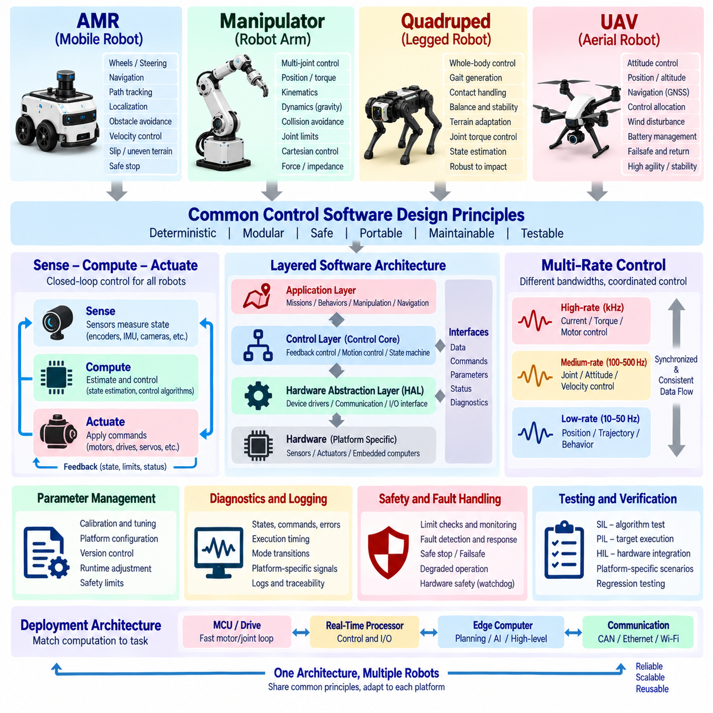

**Volume 04 Robot Control Software**


# 01. Control Software Fundamentals

##  

## 01.01 Role of Control Software: Bridging Physical and Digital

{width="7.268055555555556in" height="7.268055555555556in"}

Control software is the operational bridge between digital computation and physical behavior. A robot may receive goals from navigation, planning, autonomy, or human interfaces, but those goals remain abstract until control software converts them into commands that actuators can execute. It therefore connects software representations such as position, velocity, torque, and trajectory with motors, steering mechanisms, joints, and other physical devices.

The digital side of a robotic system describes the world through numerical states, models, commands, and constraints. The physical side consists of mechanisms whose motion is affected by inertia, friction, gravity, payload, disturbances, actuator limits, and environmental interaction. Control software continuously reconciles these two domains by observing physical responses, comparing them with desired behavior, and calculating corrective commands that reduce the difference.

This bridging function is fundamentally based on feedback. Sensors measure quantities such as position, velocity, acceleration, current, force, orientation, or steering angle and convert physical phenomena into digital signals. Control algorithms process these measurements together with reference commands and system models. Their outputs are then transformed into electrical or communication commands that drive actuators, completing a closed interaction between computation and physical motion.

Control software occupies a distinctive position in the overall robotics software architecture. Higher-level software determines what the robot should accomplish, while lower-level firmware and device drivers interact directly with hardware. The control layer translates objectives such as "move at this velocity," "follow this trajectory," or "maintain this joint position" into dynamically feasible actuator behavior. This makes control software an execution layer between intention and physical realization.

The bridge is not simply a conversion from one command format to another. Physical systems evolve continuously in time, whereas software normally executes calculations at discrete sampling intervals. Control software must therefore sample sensor information, estimate the current state, calculate control outputs, and update actuators rapidly enough to preserve stability and responsiveness. Timing accuracy, deterministic execution, latency, and jitter become part of the control problem itself rather than ordinary implementation details.

A useful conceptual distinction is between command generation and command realization. A motion planner may generate a desired path or trajectory without directly controlling motor currents or joint torques. Control software receives this desired behavior and progressively converts it into references appropriate for the physical system. Depending on the architecture, trajectory commands may become position references, velocity references, torque requests, motor-current commands, and finally switching or drive signals handled by lower hardware layers.

Feedback also allows the digital system to recognize that commanded behavior and actual behavior are rarely identical. Wheels can slip, steering mechanisms can exhibit backlash, manipulators can experience unexpected loads, and motors can produce different responses as temperature or battery voltage changes. Control software measures these deviations and continuously compensates for them. The robot therefore behaves as a closed-loop cyber-physical system rather than as a machine executing a fixed sequence of commands.

Different robotic platforms emphasize different physical variables, but the bridging principle remains consistent. A differential-drive AMR coordinates wheel velocities to produce translational and rotational motion. An Ackermann-steered outdoor robot coordinates propulsion and steering angle. A manipulator controls joint position, velocity, torque, and end-effector interaction, while a quadruped additionally manages contact forces, balance, and gait. UAV control must regulate attitude, thrust, altitude, position, and aerodynamic disturbances.

The control layer must also enforce physical constraints that higher-level software may not represent with sufficient detail. Actuators have maximum current, torque, speed, acceleration, temperature, and operating ranges. Mechanical systems have joint limits, steering limits, friction characteristics, and structural constraints. Control software incorporates these limits into command generation, saturation handling, trajectory shaping, protection logic, and constraint-aware algorithms so that digitally requested behavior remains physically achievable.

Because physical systems contain uncertainty, control software frequently relies on estimated rather than perfectly measured states. Sensor noise, quantization, communication delay, sampling differences, and unobservable variables can make raw measurements insufficient for stable control. Filtering, observers, sensor fusion, and state estimation can therefore become closely coupled with the controller. The resulting state representation provides a more reliable digital description of the physical system from which control decisions can be calculated.

Control software also establishes an important boundary between autonomy and deterministic machine behavior. AI, navigation, reinforcement learning, or planning algorithms may produce sophisticated decisions, but their outputs should not automatically bypass physical constraints. A control layer can convert high-level decisions into bounded references while enforcing rate limits, stability requirements, actuator capabilities, and safety conditions. This separation allows increasingly intelligent decision systems to coexist with predictable real-time execution.

The same principle becomes especially important in Physical AI systems. Learned policies may determine actions from images, language, maps, latent states, or multimodal observations, yet the final interaction with the physical world still occurs through actuators. Control software provides the structured interface through which learned actions become velocities, forces, torques, steering commands, or motion references. It can therefore isolate rapidly evolving AI models from hardware-specific execution requirements and deterministic control loops.

Safety is inseparable from this bridging role because an incorrect digital value can create immediate physical consequences. Control software must detect invalid commands, sensor failures, communication loss, excessive tracking error, actuator faults, and unsafe operating conditions. Depending on system requirements, it may limit motion, enter a degraded operating mode, execute a controlled stop, or request hardware-level shutdown. Digital fault handling thus becomes directly connected to physical risk reduction.

Diagnostics and observability provide the reverse bridge from the physical system back into engineering processes. Control software can record references, measured states, tracking errors, actuator outputs, timing information, saturation events, fault flags, and protection states. These data enable engineers to reconstruct physical behavior from software logs, compare simulation with real machines, tune parameters, identify failures, and validate modifications without treating hardware behavior as an opaque outcome.

Simulation further demonstrates the importance of maintaining a clear control interface. The same controller can often interact with a simulated plant during Software-in-the-Loop testing, with processor hardware during Processor-in-the-Loop testing, with real controllers and simulated mechanisms during Hardware-in-the-Loop testing, and eventually with the actual robot. A stable interface between controller and plant enables progressive verification while reducing the gap between digital development and physical deployment.

Ultimately, control software transforms computation into disciplined physical action while transforming physical response back into usable digital information. Its purpose is not merely to operate motors but to maintain a continuous, timed, constrained, observable, and safe relationship between desired behavior and actual behavior. This foundational role explains why control software precedes detailed topics such as PID, motor control, motion control, whole-body control, fault tolerance, and safety control in a robotics software architecture.

제어 소프트웨어(Control Software)는 디지털 연산(Digital Computation)과 물리적 동작(Physical Behavior)을 연결하는 실행적 가교(Operational Bridge)이다. 로봇은 내비게이션(Navigation), 계획(Planning), 자율 시스템(Autonomy), 인간 인터페이스(Human Interface)로부터 목표를 받을 수 있지만, 이러한 목표는 제어 소프트웨어가 액추에이터(Actuator)가 실행할 수 있는 명령으로 변환하기 전까지는 추상적인 상태로 남아 있다. 따라서 제어 소프트웨어는 위치(Position), 속도(Velocity), 토크(Torque), 궤적(Trajectory)과 같은 소프트웨어 표현을 모터(Motor), 조향 장치(Steering Mechanism), 관절(Joint) 등의 물리 장치와 연결한다.

로봇 시스템의 디지털 영역(Digital Domain)은 수치 상태(Numerical State), 모델(Model), 명령(Command), 제약 조건(Constraint)을 통해 세계를 표현한다. 반면 물리 영역(Physical Domain)은 관성(Inertia), 마찰(Friction), 중력(Gravity), 페이로드(Payload), 외란(Disturbance), 액추에이터 한계(Actuator Limit), 환경과의 상호작용(Environmental Interaction)에 영향을 받는 기계 시스템으로 구성된다. 제어 소프트웨어는 실제 물리 반응을 관찰하고 목표 동작과 비교한 후 그 차이를 줄이는 보정 명령(Corrective Command)을 계산함으로써 두 영역을 지속적으로 연결한다.

이러한 가교 기능은 근본적으로 피드백(Feedback)에 기반한다. 센서(Sensor)는 위치, 속도, 가속도, 전류, 힘, 자세, 조향각 등의 물리량을 측정하여 디지털 신호(Digital Signal)로 변환한다. 제어 알고리즘(Control Algorithm)은 이러한 측정값을 기준 명령(Reference Command) 및 시스템 모델(System Model)과 함께 처리한다. 그 결과는 액추에이터를 구동하는 전기적 명령 또는 통신 명령으로 변환되어 연산과 물리적 운동 사이의 폐루프 상호작용(Closed-Loop Interaction)을 완성한다.

제어 소프트웨어는 전체 로보틱스 소프트웨어 아키텍처(Robotics Software Architecture)에서 독특한 위치를 차지한다. 상위 수준 소프트웨어(Higher-Level Software)는 로봇이 무엇을 수행해야 하는지를 결정하고, 하위 수준 펌웨어(Firmware)와 디바이스 드라이버(Device Driver)는 하드웨어와 직접 상호작용한다. 제어 계층(Control Layer)은 "이 속도로 이동하라", "이 궤적을 따라가라", "이 관절 위치를 유지하라"와 같은 목표를 동역학적으로 실행 가능한 액추에이터 동작으로 변환한다. 따라서 제어 소프트웨어는 의도(Intention)와 물리적 실현(Physical Realization) 사이의 실행 계층(Execution Layer)이라고 할 수 있다.

이러한 가교는 단순히 하나의 명령 형식(Command Format)을 다른 형식으로 변환하는 과정이 아니다. 물리 시스템(Physical System)은 시간에 따라 연속적으로 변화하지만 소프트웨어는 일반적으로 이산적인 샘플링 주기(Sampling Interval)에 따라 계산을 수행한다. 따라서 제어 소프트웨어는 센서 정보를 샘플링하고 현재 상태를 추정하며 제어 출력을 계산한 뒤, 안정성(Stability)과 응답성(Responsiveness)을 유지할 수 있을 만큼 빠르게 액추에이터를 갱신해야 한다. 시간 정확도(Timing Accuracy), 결정성(Determinism), 지연시간(Latency), 지터(Jitter)는 단순한 구현 세부사항이 아니라 제어 문제 자체의 일부가 된다.

개념적으로는 명령 생성(Command Generation)과 명령 실현(Command Realization)을 구분하는 것이 유용하다. 모션 플래너(Motion Planner)는 모터 전류나 관절 토크를 직접 제어하지 않고도 원하는 경로(Path) 또는 궤적(Trajectory)을 생성할 수 있다. 제어 소프트웨어는 이러한 목표 동작을 받아 물리 시스템에 적합한 기준값으로 단계적으로 변환한다. 아키텍처에 따라 궤적 명령은 위치 기준(Position Reference), 속도 기준(Velocity Reference), 토크 요구(Torque Request), 모터 전류 명령(Motor-Current Command), 그리고 최종적으로 하위 하드웨어 계층에서 처리되는 스위칭 또는 구동 신호(Drive Signal)로 변환될 수 있다.

피드백(Feedback)은 디지털 시스템이 명령된 동작과 실제 동작이 거의 항상 완전히 동일하지 않다는 사실을 인식할 수 있게 한다. 바퀴에는 슬립(Slip)이 발생할 수 있고, 조향 장치에는 백래시(Backlash)가 존재할 수 있으며, 매니퓰레이터(Manipulator)는 예상하지 못한 하중을 받을 수 있다. 또한 모터의 응답은 온도나 배터리 전압에 따라 달라질 수 있다. 제어 소프트웨어는 이러한 편차(Deviation)를 측정하고 지속적으로 보상한다. 따라서 로봇은 고정된 명령 순서를 실행하는 기계가 아니라 폐루프 사이버 물리 시스템(Closed-Loop Cyber-Physical System)으로 동작한다.

로봇 플랫폼(Robot Platform)에 따라 중요하게 다루는 물리 변수가 달라지지만 기본적인 가교 원리는 동일하다. 차동구동 자율이동로봇(Differential-Drive AMR)은 좌우 바퀴 속도를 조정하여 병진 운동(Translational Motion)과 회전 운동(Rotational Motion)을 생성한다. 애커먼 조향(Ackermann Steering) 기반 실외 로봇은 추진력과 조향각을 조정한다. 매니퓰레이터는 관절 위치, 속도, 토크 및 말단장치(End-Effector)의 상호작용을 제어하며, 사족보행 로봇(Quadruped Robot)은 접촉력(Contact Force), 균형(Balance), 보행 패턴(Gait)까지 관리한다. 무인항공기(UAV) 제어에서는 자세(Attitude), 추력(Thrust), 고도(Altitude), 위치(Position), 공기역학적 외란(Aerodynamic Disturbance)을 조절해야 한다.

제어 계층(Control Layer)은 또한 상위 수준 소프트웨어가 충분히 세밀하게 표현하지 못할 수 있는 물리적 제약 조건(Physical Constraint)을 강제해야 한다. 액추에이터에는 최대 전류, 토크, 속도, 가속도, 온도 및 동작 범위가 존재한다. 기계 시스템에도 관절 한계(Joint Limit), 조향 한계(Steering Limit), 마찰 특성(Friction Characteristic), 구조적 제약(Structural Constraint)이 존재한다. 제어 소프트웨어는 이러한 한계를 명령 생성, 포화 처리(Saturation Handling), 궤적 형상화(Trajectory Shaping), 보호 로직(Protection Logic), 제약 인식 알고리즘(Constraint-Aware Algorithm)에 반영하여 디지털 영역에서 요구된 동작이 실제 물리적으로 실행 가능하도록 한다.

물리 시스템에는 불확실성(Uncertainty)이 존재하기 때문에 제어 소프트웨어는 완벽하게 측정된 상태가 아니라 추정된 상태(Estimated State)를 사용하는 경우가 많다. 센서 잡음(Sensor Noise), 양자화(Quantization), 통신 지연(Communication Delay), 샘플링 차이(Sampling Difference), 직접 관측할 수 없는 변수(Unobservable Variable)로 인해 원시 측정값만으로는 안정적인 제어가 어려울 수 있다. 따라서 필터링(Filtering), 관측기(Observer), 센서 융합(Sensor Fusion), 상태 추정(State Estimation)이 제어기와 밀접하게 결합된다. 이렇게 생성된 상태 표현(State Representation)은 제어 결정을 계산하기 위한 보다 신뢰성 높은 물리 시스템의 디지털 표현을 제공한다.

제어 소프트웨어는 자율 시스템(Autonomy)과 결정론적 기계 동작(Deterministic Machine Behavior) 사이의 중요한 경계도 형성한다. 인공지능(AI), 내비게이션, 강화학습(Reinforcement Learning), 계획 알고리즘(Planning Algorithm)이 정교한 결정을 생성하더라도 그 출력이 물리적 제약을 우회하여 직접 실행되어서는 안 된다. 제어 계층은 상위 수준의 결정을 제한된 기준값(Bounded Reference)으로 변환하면서 변화율 제한(Rate Limit), 안정성 요구사항(Stability Requirement), 액추에이터 성능 한계, 안전 조건(Safety Condition)을 적용할 수 있다. 이러한 분리는 점점 지능화되는 의사결정 시스템과 예측 가능한 실시간 실행(Real-Time Execution)이 함께 동작할 수 있도록 한다.

동일한 원리는 피지컬 AI(Physical AI) 시스템에서 더욱 중요해진다. 학습된 정책(Learned Policy)은 이미지(Image), 언어(Language), 지도(Map), 잠재 상태(Latent State), 다중모달 관측(Multimodal Observation)으로부터 행동(Action)을 결정할 수 있지만, 물리 세계와의 최종 상호작용은 여전히 액추에이터를 통해 이루어진다. 제어 소프트웨어는 학습된 행동을 속도, 힘(Force), 토크, 조향 명령 또는 모션 기준(Motion Reference)으로 변환하는 구조화된 인터페이스(Structured Interface)를 제공한다. 이를 통해 빠르게 발전하는 AI 모델을 하드웨어별 실행 요구사항과 결정론적 제어 루프(Deterministic Control Loop)로부터 분리할 수 있다.

안전(Safety)은 이러한 가교 역할과 분리할 수 없다. 잘못된 디지털 값 하나가 즉각적인 물리적 결과를 발생시킬 수 있기 때문이다. 제어 소프트웨어는 유효하지 않은 명령(Invalid Command), 센서 고장(Sensor Failure), 통신 두절(Communication Loss), 과도한 추종 오차(Tracking Error), 액추에이터 고장(Actuator Fault), 안전하지 않은 운전 조건을 탐지해야 한다. 시스템 요구사항에 따라 움직임을 제한하거나 성능 저하 운전 모드(Degraded Operating Mode)로 전환하고, 제어 정지(Controlled Stop)를 수행하거나 하드웨어 수준의 정지(Shutdown)를 요청할 수 있다. 따라서 디지털 고장 처리(Digital Fault Handling)는 물리적 위험 감소(Physical Risk Reduction)와 직접 연결된다.

진단(Diagnostics)과 관측 가능성(Observability)은 물리 시스템에서 엔지니어링 프로세스(Engineering Process)로 돌아오는 역방향 가교를 제공한다. 제어 소프트웨어는 기준값, 측정 상태, 추종 오차, 액추에이터 출력, 타이밍 정보, 포화 이벤트(Saturation Event), 고장 플래그(Fault Flag), 보호 상태(Protection State)를 기록할 수 있다. 이러한 데이터는 엔지니어가 소프트웨어 로그(Software Log)를 통해 실제 물리 동작을 재구성하고, 시뮬레이션과 실제 장비를 비교하며, 파라미터를 튜닝하고, 고장을 식별하며, 변경 사항을 검증할 수 있도록 한다.

시뮬레이션(Simulation)은 명확한 제어 인터페이스(Control Interface)를 유지하는 것이 왜 중요한지를 더욱 잘 보여준다. 동일한 제어기는 소프트웨어 인 더 루프(Software-in-the-Loop, SIL) 시험에서 시뮬레이션 플랜트(Simulated Plant)와 연결되고, 프로세서 인 더 루프(Processor-in-the-Loop, PIL)에서는 실제 프로세서 하드웨어와 연결될 수 있다. 하드웨어 인 더 루프(Hardware-in-the-Loop, HIL)에서는 실제 제어기와 시뮬레이션된 기계 시스템을 결합하고, 최종적으로 실제 로봇과 연결한다. 제어기와 플랜트 사이의 안정적인 인터페이스는 디지털 개발과 실제 물리 배치 사이의 간극을 줄이면서 단계적인 검증을 가능하게 한다.

궁극적으로 제어 소프트웨어(Control Software)는 계산 결과를 체계적인 물리적 행동으로 변환하는 동시에 물리 시스템의 반응을 다시 활용 가능한 디지털 정보로 변환한다. 그 목적은 단순히 모터를 작동시키는 것이 아니라 목표 동작(Desired Behavior)과 실제 동작(Actual Behavior) 사이에 지속적이고, 시간적으로 정확하며, 제약 조건을 준수하고, 관측 가능하며, 안전한 관계를 유지하는 것이다. 이러한 기반 역할 때문에 제어 소프트웨어는 로보틱스 소프트웨어 아키텍처에서 PID 제어(PID Control), 모터 제어(Motor Control), 모션 제어(Motion Control), 전신 제어(Whole-Body Control), 결함 허용 제어(Fault-Tolerant Control), 안전 제어(Safety Control)와 같은 세부 기술을 이해하기 위한 출발점이 된다.

##  

## 01.02 Control Loop Structure: Sense, Compute, Actuate

{width="7.268055555555556in" height="7.268055555555556in"}

A control loop is the fundamental execution pattern that allows a robot to interact continuously with the physical world. Its basic structure can be understood as Sense, Compute, and Actuate. Sensors observe the robot and its environment, computation determines the appropriate response, and actuators apply that response to the physical system. The resulting motion changes the next sensor measurements, creating a continuously repeating closed-loop process.

The Sense stage converts physical phenomena into information that software can process. Encoders measure position or velocity, IMUs measure acceleration and angular motion, current sensors observe electrical behavior, and force or torque sensors measure mechanical interaction. Each measurement represents only a partial observation of the physical system, so sensing is not simply reading values but constructing a usable digital description of the robot's current condition.

Sensor measurements are acquired at discrete moments determined by sampling rates and hardware timing. Before entering the controller, raw signals may require scaling, calibration, filtering, synchronization, validity checking, or conversion into engineering units. An encoder count may become an angular position, ADC data may become motor current, and multiple IMU measurements may contribute to an orientation estimate. This processing establishes reliable input for subsequent control calculations.

The Compute stage transforms sensed information and desired references into control decisions. A controller normally compares the desired state with the measured or estimated state and calculates the error between them. Control algorithms then determine how strongly the system should respond. Depending on the application, this computation may involve PID control, feedforward compensation, state-space methods, model-based control, optimization, or more advanced algorithms.

A simple conceptual relationship is reference minus measured state equals control error. If a wheel should rotate at a target velocity but is moving too slowly, the controller increases the command. If the measured velocity exceeds the target, the command is reduced. This repeated correction mechanism allows the robot to reject disturbances and compensate for differences between mathematical assumptions and actual physical behavior.

Computation may contain several layers rather than a single controller. A position controller can generate a velocity reference, a velocity controller can generate a torque reference, and a motor controller can convert torque demand into current commands. Such cascade control structures allow different physical dynamics to be handled at appropriate rates. Inner loops are commonly faster because electrical and mechanical actuator dynamics require more rapid correction than higher-level motion objectives.

The Actuate stage converts calculated control outputs into physical effects. Software commands may become PWM duty cycles, motor-current references, torque commands, steering angles, valve positions, or thrust requests. Motor drives and power electronics then transform these commands into voltage and current applied to actuators. The actuators generate force or torque, causing wheels, joints, steering systems, propellers, or other mechanisms to move.

Actuation is constrained by the capabilities of real hardware. A software controller may mathematically request an arbitrarily large output, but motors have current and torque limits, steering systems have angular limits, and mechanical structures have allowable velocity and acceleration ranges. Therefore, the Actuate stage commonly includes saturation, rate limiting, command validation, and protection logic so that calculated outputs remain within physically achievable and safe operating boundaries.

Once actuation changes the physical system, the resulting state is measured again by sensors. This closes the feedback loop: Sense produces measurements, Compute determines corrections, Actuate changes the physical system, and the changed physical system generates new measurements. Control is therefore not a one-time calculation. It is a continuous cyclic interaction in which each iteration depends on the physical consequences of previous control actions.

The timing of this cycle strongly influences control quality. If sensing, computation, and actuation occur too slowly, the controller responds to outdated information and may produce poor tracking or instability. If execution timing varies unpredictably, control behavior can also vary even when the algorithm itself is unchanged. Control software therefore requires predictable sampling periods, bounded computation time, controlled communication latency, and sufficiently low timing jitter.

Different control loops may operate at different frequencies within the same robot. Motor-current control may execute at several kilohertz or higher, velocity control at a lower rate, motion control at hundreds of hertz, and navigation or AI-based decision processes at tens of hertz or below. This multi-rate structure allows fast physical dynamics to remain locally controlled while slower upper layers generate increasingly abstract goals and references.

The Sense--Compute--Actuate structure also explains why communication architecture matters in distributed robotic systems. Sensors, controllers, motor drives, and edge computers may reside on different processors connected through CAN, CANopen, EtherCAT, Ethernet, or other communication mechanisms. When information crosses these boundaries, transmission delay, update frequency, message loss, synchronization, and timestamp accuracy become part of the effective control loop.

Not every control loop must pass through the robot's highest-performance computer. Fast actuator loops are often executed close to the hardware on motor controllers, microcontrollers, or dedicated real-time processors. Higher-level computers can operate slower loops for trajectory generation, navigation, perception, or AI decision making. This hierarchical arrangement prevents slow perception or planning cycles from directly determining the update rate required for stable low-level actuator control.

For example, an autonomous mobile robot may receive camera perception at tens of frames per second while wheel-current regulation executes thousands of times per second. The perception system does not need to generate every motor update. Instead, it provides higher-level state information or motion objectives, while local controllers continuously regulate the actuators between those updates. Sense--Compute--Actuate therefore exists simultaneously at several nested levels of the robot.

Safety mechanisms can also operate across the loop. Sensor validity checks can reject implausible measurements during Sense, computational monitors can detect excessive errors or unstable commands during Compute, and actuator limits can prevent unsafe outputs during Actuate. Independent emergency-stop or hardware protection mechanisms may operate outside the normal control path. Safe robotic control consequently requires protection throughout the entire information-to-action chain.

Diagnostics make the loop observable to engineers. Recording sensor measurements, reference values, control errors, controller outputs, actuator states, timestamps, and fault conditions allows developers to determine where undesirable behavior originates. A tracking problem may result from noisy sensing, delayed computation, incorrect controller parameters, actuator saturation, or physical disturbances. Structured logging makes these causes distinguishable rather than treating the robot as a black box.

The same Sense--Compute--Actuate abstraction can be preserved from simulation to real hardware. In simulation, the Sense stage reads a simulated robot state and the Actuate stage applies commands to a physics model. On the real robot, sensors and actuators replace these simulated interfaces while the control logic can remain largely unchanged. This separation supports SIL, PIL, HIL, and physical testing while maintaining a consistent conceptual control structure.

Ultimately, Sense--Compute--Actuate is more than a sequence of three software operations. It represents the continuous causal relationship between observation, decision, and physical action that defines closed-loop robotic control. Reliable sensing provides knowledge of the current state, deterministic computation determines an appropriate response, and constrained actuation changes the physical world. Repetition of this cycle enables a robot to regulate motion, reject disturbances, maintain stability, and execute higher-level objectives in real time.

제어 루프(Control Loop)는 로봇이 물리 세계(Physical World)와 지속적으로 상호작용할 수 있도록 하는 기본적인 실행 구조이다. 그 기본 구조는 감지(Sense), 연산(Compute), 구동(Actuate)으로 이해할 수 있다. 센서(Sensor)는 로봇과 주변 환경을 관찰하고, 연산 과정은 적절한 대응을 결정하며, 액추에이터(Actuator)는 그 대응을 물리 시스템에 적용한다. 그 결과 발생한 움직임은 다시 다음 센서 측정값을 변화시키면서 지속적으로 반복되는 폐루프 과정(Closed-Loop Process)을 형성한다.

감지 단계(Sense Stage)는 물리적 현상(Physical Phenomena)을 소프트웨어가 처리할 수 있는 정보로 변환한다. 엔코더(Encoder)는 위치 또는 속도를 측정하고, 관성측정장치(IMU)는 가속도와 각운동(Angular Motion)을 측정하며, 전류 센서(Current Sensor)는 전기적 동작을 관찰하고, 힘 또는 토크 센서(Force or Torque Sensor)는 기계적 상호작용을 측정한다. 각각의 측정값은 물리 시스템의 일부만을 관측하므로 감지는 단순히 값을 읽는 것이 아니라 로봇의 현재 상태를 활용 가능한 디지털 표현(Digital Representation)으로 구성하는 과정이다.

센서 측정값은 샘플링 주파수(Sampling Rate)와 하드웨어 타이밍(Hardware Timing)에 의해 결정되는 이산적인 시점에서 획득된다. 원시 신호(Raw Signal)는 제어기에 입력되기 전에 스케일링(Scaling), 보정(Calibration), 필터링(Filtering), 동기화(Synchronization), 유효성 검사(Validity Checking), 공학 단위(Engineering Unit) 변환 등이 필요할 수 있다. 엔코더 카운트(Encoder Count)는 각도 위치로 변환되고, ADC 데이터는 모터 전류로 변환되며, 여러 IMU 측정값은 자세 추정(Orientation Estimation)에 사용될 수 있다. 이러한 처리는 이후 제어 계산을 위한 신뢰성 높은 입력을 형성한다.

연산 단계(Compute Stage)는 감지된 정보와 목표 기준값(Desired Reference)을 제어 결정(Control Decision)으로 변환한다. 일반적으로 제어기(Controller)는 목표 상태(Desired State)와 측정 또는 추정된 상태(Measured or Estimated State)를 비교하여 두 상태 사이의 오차(Error)를 계산한다. 이후 제어 알고리즘(Control Algorithm)은 시스템이 어느 정도의 강도로 대응해야 하는지를 결정한다. 응용 분야에 따라 PID 제어(PID Control), 피드포워드 보상(Feedforward Compensation), 상태공간 기법(State-Space Method), 모델 기반 제어(Model-Based Control), 최적화(Optimization) 또는 더욱 발전된 알고리즘이 사용될 수 있다.

간단한 개념적 관계는 기준값(Reference)에서 측정 상태(Measured State)를 뺀 값이 제어 오차(Control Error)가 된다는 것이다. 바퀴가 목표 속도로 회전해야 하지만 실제 속도가 너무 느리다면 제어기는 명령을 증가시킨다. 반대로 측정된 속도가 목표값을 초과하면 명령을 감소시킨다. 이러한 반복적인 보정 메커니즘(Correction Mechanism)을 통해 로봇은 외란(Disturbance)을 억제하고 수학적 가정과 실제 물리적 동작 사이의 차이를 보상할 수 있다.

연산 과정은 하나의 제어기만으로 구성되지 않고 여러 계층으로 구성될 수 있다. 위치 제어기(Position Controller)는 속도 기준값(Velocity Reference)을 생성하고, 속도 제어기(Velocity Controller)는 토크 기준값(Torque Reference)을 생성하며, 모터 제어기(Motor Controller)는 토크 요구량을 전류 명령(Current Command)으로 변환할 수 있다. 이러한 캐스케이드 제어 구조(Cascade Control Structure)를 사용하면 서로 다른 물리적 동특성(Physical Dynamics)을 적절한 주기로 처리할 수 있다. 내부 루프(Inner Loop)는 전기적 및 기계적 액추에이터 동특성이 상위 수준의 모션 목표보다 빠른 보정을 요구하기 때문에 일반적으로 더 높은 주파수로 동작한다.

구동 단계(Actuate Stage)는 계산된 제어 출력을 실제 물리적 효과(Physical Effect)로 변환한다. 소프트웨어 명령은 PWM 듀티 사이클(PWM Duty Cycle), 모터 전류 기준값(Motor-Current Reference), 토크 명령(Torque Command), 조향각(Steering Angle), 밸브 위치(Valve Position), 추력 요구값(Thrust Request) 등으로 변환될 수 있다. 이후 모터 드라이브(Motor Drive)와 전력전자장치(Power Electronics)는 이러한 명령을 액추에이터에 인가되는 전압과 전류로 변환한다. 액추에이터는 힘 또는 토크를 발생시켜 바퀴, 관절, 조향 시스템, 프로펠러 등의 기계 장치를 움직인다.

구동(Actuation)은 실제 하드웨어의 성능에 의해 제한된다. 소프트웨어 제어기는 수학적으로 매우 큰 출력을 요구할 수 있지만 모터에는 전류와 토크 한계가 있고, 조향 시스템에는 각도 한계가 있으며, 기계 구조에는 허용 가능한 속도와 가속도 범위가 존재한다. 따라서 구동 단계에는 일반적으로 포화 처리(Saturation), 변화율 제한(Rate Limiting), 명령 유효성 검사(Command Validation), 보호 로직(Protection Logic)이 포함되어 계산된 출력이 물리적으로 구현 가능하고 안전한 운전 범위 안에 있도록 한다.

구동이 물리 시스템을 변화시키면 그 결과로 만들어진 상태는 다시 센서를 통해 측정된다. 이것이 피드백 루프(Feedback Loop)를 완성한다. 감지(Sense)는 측정값을 생성하고, 연산(Compute)은 보정량을 결정하며, 구동(Actuate)은 물리 시스템을 변화시키고, 변화된 물리 시스템은 새로운 측정값을 생성한다. 따라서 제어는 한 번 수행되는 계산이 아니라 이전 제어 동작의 물리적 결과에 따라 다음 반복 과정이 결정되는 지속적인 순환 상호작용(Cyclic Interaction)이다.

이러한 순환 과정의 타이밍(Timing)은 제어 품질에 큰 영향을 미친다. 감지, 연산, 구동이 지나치게 느리게 이루어지면 제어기는 오래된 정보에 대응하게 되어 추종 성능(Tracking Performance)이 저하되거나 시스템이 불안정해질 수 있다. 실행 타이밍이 예측할 수 없게 변하는 경우에도 알고리즘 자체가 동일하더라도 제어 동작이 달라질 수 있다. 따라서 제어 소프트웨어는 예측 가능한 샘플링 주기(Sampling Period), 제한된 연산 시간(Bounded Computation Time), 제어된 통신 지연(Communication Latency), 충분히 낮은 타이밍 지터(Timing Jitter)를 필요로 한다.

하나의 로봇 내부에서도 서로 다른 제어 루프가 서로 다른 주파수로 동작할 수 있다. 모터 전류 제어(Motor-Current Control)는 수 kHz 또는 그 이상의 주파수에서 실행될 수 있고, 속도 제어(Velocity Control)는 이보다 낮은 주파수에서 동작할 수 있다. 모션 제어(Motion Control)는 수백 Hz 수준에서 동작할 수 있으며, 내비게이션 또는 AI 기반 의사결정(AI-Based Decision Making)은 수십 Hz 이하에서 수행될 수 있다. 이러한 다중 주기 구조(Multi-Rate Structure)는 빠른 물리적 동특성을 로컬에서 안정적으로 제어하면서 상대적으로 느린 상위 계층이 점차 추상적인 목표와 기준값을 생성하도록 한다.

감지--연산--구동(Sense--Compute--Actuate) 구조는 분산 로봇 시스템(Distributed Robotic System)에서 통신 아키텍처(Communication Architecture)가 중요한 이유도 설명한다. 센서, 제어기, 모터 드라이브, 엣지 컴퓨터(Edge Computer)는 서로 다른 프로세서에 위치하면서 CAN, CANopen, EtherCAT, Ethernet 등의 통신 방식으로 연결될 수 있다. 정보가 이러한 경계를 통과하면 전송 지연(Transmission Delay), 갱신 주파수(Update Frequency), 메시지 손실(Message Loss), 동기화(Synchronization), 타임스탬프 정확도(Timestamp Accuracy)가 실질적인 제어 루프의 일부가 된다.

모든 제어 루프가 반드시 로봇의 최고 성능 컴퓨터를 거쳐야 하는 것은 아니다. 빠른 액추에이터 제어 루프(Fast Actuator Loop)는 모터 컨트롤러(Motor Controller), 마이크로컨트롤러(Microcontroller), 전용 실시간 프로세서(Dedicated Real-Time Processor)처럼 하드웨어와 가까운 위치에서 실행되는 경우가 많다. 상위 컴퓨터는 상대적으로 느린 주기로 궤적 생성(Trajectory Generation), 내비게이션, 인지(Perception), AI 의사결정을 수행할 수 있다. 이러한 계층적 구조(Hierarchical Structure)는 느린 인지 또는 계획 주기가 안정적인 저수준 액추에이터 제어에 필요한 갱신 주기를 직접 결정하지 않도록 한다.

예를 들어 자율이동로봇(Autonomous Mobile Robot)은 카메라 영상을 초당 수십 프레임으로 입력받는 동안 바퀴 전류 제어(Wheel-Current Regulation)는 초당 수천 번 수행될 수 있다. 인지 시스템(Perception System)이 모든 모터 갱신값을 직접 생성할 필요는 없다. 대신 인지 시스템은 상위 수준의 상태 정보 또는 모션 목표(Motion Objective)를 제공하고, 로컬 제어기(Local Controller)는 다음 상위 명령이 갱신될 때까지 액추에이터를 지속적으로 제어한다. 따라서 감지--연산--구동 구조는 로봇 내부의 여러 계층에서 서로 다른 주기로 중첩되어 동시에 존재한다.

안전 메커니즘(Safety Mechanism) 역시 전체 제어 루프에 걸쳐 동작할 수 있다. 감지 단계에서는 센서 유효성 검사(Sensor Validity Check)를 통해 비정상적인 측정값을 제거할 수 있고, 연산 단계에서는 모니터링 기능이 과도한 오차나 불안정한 명령을 탐지할 수 있으며, 구동 단계에서는 액추에이터 제한(Actuator Limit)을 통해 위험한 출력을 방지할 수 있다. 독립적인 비상 정지(Emergency Stop) 또는 하드웨어 보호 메커니즘(Hardware Protection Mechanism)은 정상적인 제어 경로 외부에서 동작할 수도 있다. 따라서 안전한 로봇 제어를 위해서는 정보에서 행동으로 이어지는 전체 체인에 보호 기능이 필요하다.

진단(Diagnostics)은 엔지니어가 제어 루프의 동작을 관측할 수 있도록 한다. 센서 측정값, 기준값, 제어 오차, 제어기 출력, 액추에이터 상태, 타임스탬프(Timestamp), 고장 상태(Fault Condition)를 기록하면 개발자는 바람직하지 않은 동작이 어디에서 발생했는지를 분석할 수 있다. 추종 문제(Tracking Problem)는 센서 잡음, 연산 지연, 잘못된 제어 파라미터(Control Parameter), 액추에이터 포화(Actuator Saturation), 물리적 외란 등 다양한 원인에서 발생할 수 있다. 구조화된 로깅(Structured Logging)은 이러한 원인을 구분하여 로봇을 하나의 블랙박스(Black Box)처럼 다루지 않도록 한다.

동일한 감지--연산--구동 추상화(Sense--Compute--Actuate Abstraction)는 시뮬레이션에서 실제 하드웨어까지 유지될 수 있다. 시뮬레이션에서는 감지 단계가 시뮬레이션된 로봇 상태를 읽고, 구동 단계가 물리 모델(Physics Model)에 명령을 적용한다. 실제 로봇에서는 이러한 시뮬레이션 인터페이스를 실제 센서와 액추에이터가 대체하면서 제어 로직(Control Logic)은 대부분 동일하게 유지될 수 있다. 이러한 분리는 소프트웨어 인 더 루프(SIL), 프로세서 인 더 루프(PIL), 하드웨어 인 더 루프(HIL), 실제 장비 시험(Physical Testing)을 지원하면서 일관된 제어 구조를 유지할 수 있도록 한다.

궁극적으로 감지--연산--구동(Sense--Compute--Actuate)은 단순한 세 가지 소프트웨어 작업의 순서 이상을 의미한다. 이것은 폐루프 로봇 제어(Closed-Loop Robotic Control)를 정의하는 관측(Observation), 결정(Decision), 물리적 행동(Physical Action) 사이의 지속적인 인과관계(Causal Relationship)를 나타낸다. 신뢰성 높은 감지는 현재 상태에 대한 정보를 제공하고, 결정론적 연산(Deterministic Computation)은 적절한 대응을 결정하며, 제약된 구동(Constrained Actuation)은 실제 물리 세계를 변화시킨다. 이러한 순환 과정의 반복을 통해 로봇은 움직임을 조절하고, 외란을 억제하며, 안정성을 유지하고, 상위 수준의 목표를 실시간으로 실행할 수 있다.

##  

## 01.03 Discrete-Time Control: Sampling Theory / z-Transform

{width="7.268055555555556in" height="7.268055555555556in"}

Digital control software operates on discrete samples rather than on continuously available signals. Although the physical robot evolves continuously, sensors are read, calculations are executed, and actuator commands are updated at specific time intervals. This conversion from continuous physical behavior to discrete numerical processing is fundamental to embedded and real-time robot control.

A continuous-time signal \\(x(t)\\) becomes a discrete sequence when it is observed at sampling instants separated by a sampling period \\(T_s\\). The resulting sequence can be written as \\(x[k]=x(kT_s)\\), where \\(k\\) represents the sample index. The corresponding sampling frequency is \\(f_s=1/T_s\\), linking software execution timing directly to the mathematical representation of the controlled system.

Sampling frequency must be selected according to the dynamics that the controller must observe and regulate. If sampling is too slow, important changes can occur between measurements and the digital representation no longer describes the physical behavior adequately. Faster sampling generally improves temporal resolution, but also increases processor load, communication traffic, sensor bandwidth requirements, and sensitivity to measurement noise.

The Nyquist sampling principle provides a basic theoretical boundary for representing frequency content in sampled signals. A sampling frequency should exceed twice the highest frequency that must be represented to avoid aliasing. Control engineering normally requires additional margin because merely satisfying the Nyquist boundary does not guarantee satisfactory closed-loop performance, phase margin, disturbance rejection, or practical filtering behavior.

Aliasing occurs when frequency components above the representable sampling range appear as incorrect lower-frequency components after sampling. Once aliasing enters the sampled data, software cannot reliably reconstruct the original information. Analog anti-aliasing filters are therefore commonly applied before analog-to-digital conversion, while digital filtering can subsequently reduce noise within the sampled signal bandwidth.

Discrete-time control also introduces the concept of delay. A measurement is sampled, processed, and eventually converted into an actuator command, so the physical plant responds after some finite interval. Sensor acquisition, task scheduling, computation, communication, and actuator update delays can accumulate. Even when individually small, these delays introduce phase lag and can reduce stability margins in fast control loops.

A deterministic sampling period is therefore as important as the nominal sampling frequency. If a controller is designed for a 1 ms period but actual execution varies unpredictably between samples, numerical calculations no longer correspond precisely to the assumed timing model. This timing variation, called jitter, can affect derivative calculations, numerical integration, state estimation, filtering, and ultimately closed-loop stability and performance.

Continuous control equations must be converted into forms suitable for execution at discrete sampling instants. For example, a continuous integrator cannot be evaluated directly by a processor as an uninterrupted operation. Numerical approximations such as forward Euler, backward Euler, or trapezoidal integration convert continuous relationships into difference equations that use present and previous sampled values.

A simple continuous integrator described by \\(\\dot{x}(t)=u(t)\\) can be approximated using \\(x[k]=x[k-1]+T_su[k-1]\\) with forward Euler integration. The equation demonstrates an important property of discrete control software: previous states must be stored in memory. Digital controllers are therefore inherently stateful because past measurements, errors, filter states, and controller outputs influence future calculations.

The z-transform provides a mathematical framework for analyzing these discrete-time sequences and difference equations. It plays a role in discrete-time control similar to the role of the Laplace transform in continuous-time analysis. A sequence \\(x[k]\\) can be represented in the z-domain, allowing delays, difference equations, digital filters, controllers, and sampled plant models to be expressed algebraically.

A one-sample delay has a particularly simple z-domain representation of \\(z\^{-1}\\). This makes the z-transform closely related to actual software implementation because storing a previous value effectively implements a unit delay. Expressions containing \\(z\^{-1}\\), \\(z\^{-2}\\), and higher powers can therefore be translated naturally into software variables containing values from previous execution cycles.

Discrete transfer functions can describe relationships between sampled inputs and outputs. A general controller may be represented as a ratio of polynomials in \\(z\^{-1}\\). When rearranged into a difference equation, the controller output becomes a weighted combination of current and previous inputs together with previous outputs. This form is directly implementable using arithmetic operations and stored state variables.

The relationship between the continuous s-domain and discrete z-domain depends on the sampling process and discretization method. For sampled systems, the mapping \\(z=e\^{sT_s}\\) provides an important conceptual connection. Continuous poles and system dynamics are transformed into corresponding locations in the z-plane, allowing engineers to evaluate how sampling changes stability and transient behavior.

Stability criteria also change when moving from continuous to discrete control. For a continuous linear system, stable poles lie in the left half of the s-plane. For a discrete system, stable poles must lie inside the unit circle of the z-plane. Poles approaching the unit circle generally correspond to slower decay or increased oscillatory persistence, while poles outside the unit circle indicate unstable sampled behavior.

Several methods can convert continuous controller models into discrete implementations. Forward Euler is computationally simple but can introduce significant approximation error. Backward Euler generally provides different stability characteristics, while the bilinear or Tustin transformation maps continuous dynamics into discrete form with useful frequency-domain properties. The appropriate method depends on sampling rate, controller bandwidth, numerical requirements, and system dynamics.

Zero-order hold behavior is also important because actuator commands are usually maintained between control updates. A digital controller calculates a command at one sample and the actuator interface commonly holds that value until the next update arrives. The physical plant therefore receives a piecewise-constant input rather than an ideal continuously changing command, and this behavior should be considered during controller modeling and simulation.

Sampling periods frequently differ across a robotic control architecture. Motor current regulation may operate at several or tens of kilohertz, velocity control at lower frequencies, position and motion loops at hundreds of hertz, and navigation or AI processes at still lower rates. Each loop should be designed according to the bandwidth and timing requirements of the physical dynamics under its responsibility.

Multi-rate control introduces communication and synchronization requirements between loops. A fast inner controller may execute many times before receiving a new reference from a slower outer controller. Software must define how references are held, interpolated, validated, timestamped, or rejected when updates are delayed. Without explicit timing semantics, independently correct control modules can interact incorrectly when integrated.

Real-time implementation must also consider numerical representation. Sampling periods, accumulated states, filter coefficients, and controller gains may be represented using floating-point or fixed-point arithmetic. Limited precision, overflow, quantization, and accumulated numerical error can alter theoretical controller behavior, especially on microcontrollers or safety-oriented processors with constrained computational resources.

The sampling period should consequently be treated as a controlled software parameter rather than an incidental scheduling result. Controller coefficients, filters, observers, trajectory generators, and diagnostic thresholds may all depend on \\(T_s\\). Changing task frequency without recalculating associated parameters can silently change system dynamics even when the control source code and nominal gains appear unchanged.

Simulation provides an effective way to evaluate these effects before hardware deployment. A continuous plant model can be combined with sampled sensors, discrete controllers, computation delays, zero-order holds, communication latency, quantization, and jitter. SIL, PIL, and HIL environments can progressively reveal whether the theoretical discrete-time design remains valid under increasingly realistic software and hardware timing conditions.

Diagnostics should record actual execution timing in addition to control variables. Timestamps, measured cycle periods, deadline overruns, computation duration, delayed sensor messages, and actuator update times allow engineers to distinguish control-algorithm problems from timing problems. A controller that appears unstable because of incorrect tuning may instead be operating with excessive latency, jitter, or missed samples.

Discrete-time theory therefore connects mathematical control design directly with real-time software architecture. Sampling determines when the physical world becomes visible to software, difference equations determine how sampled information evolves, and the z-transform provides a systematic framework for analyzing those relationships. Together they establish the theoretical foundation for implementing continuous robotic behavior on discrete digital computers.

디지털 제어 소프트웨어(Digital Control Software)는 연속적으로 이용 가능한 신호가 아니라 이산 표본(Discrete Sample)을 기반으로 동작한다. 실제 로봇의 물리적 상태는 연속적으로 변화하지만, 센서는 특정 시간 간격마다 읽히고 제어 계산이 수행되며 액추에이터 명령도 정해진 시점에 갱신된다. 이러한 연속적인 물리적 거동을 이산적인 수치 처리로 변환하는 과정은 임베디드(Embedded) 및 실시간 로봇 제어(Real-Time Robot Control)의 기본 원리이다.

연속시간 신호(Continuous-Time Signal) \\(x(t)\\)는 샘플링 주기(Sampling Period) \\(T_s\\)만큼 떨어진 샘플링 시점에서 관측될 때 이산 시퀀스(Discrete Sequence)로 변환된다. 생성된 시퀀스는 \\(x[k]=x(kT_s)\\)로 표현할 수 있으며, 여기서 \\(k\\)는 샘플 인덱스(Sample Index)를 의미한다. 이에 대응하는 샘플링 주파수(Sampling Frequency)는 \\(f_s=1/T_s\\)이며, 소프트웨어 실행 타이밍을 제어 대상 시스템의 수학적 표현과 직접 연결한다.

샘플링 주파수(Sampling Frequency)는 제어기가 관측하고 제어해야 하는 시스템 동특성(System Dynamics)에 따라 선정해야 한다. 샘플링이 지나치게 느리면 측정 사이에 중요한 상태 변화가 발생하여 디지털 표현이 실제 물리적 거동을 충분히 나타내지 못한다. 빠른 샘플링은 일반적으로 시간 해상도(Temporal Resolution)를 향상시키지만 프로세서 부하, 통신 트래픽, 센서 대역폭 요구사항 및 측정 노이즈에 대한 민감도도 증가시킨다.

나이퀴스트 샘플링 원리(Nyquist Sampling Principle)는 샘플링된 신호에서 주파수 성분을 표현하기 위한 기본적인 이론적 한계를 제공한다. 앨리어싱(Aliasing)을 방지하려면 샘플링 주파수가 표현해야 하는 최고 주파수의 두 배를 초과해야 한다. 그러나 제어공학에서는 단순히 나이퀴스트 경계를 만족하는 것만으로 폐루프 성능, 위상 여유(Phase Margin), 외란 제거(Disturbance Rejection), 실제 필터링 성능을 보장할 수 없으므로 일반적으로 추가적인 여유를 확보한다.

앨리어싱(Aliasing)은 샘플링으로 표현할 수 있는 주파수 범위를 초과한 성분이 샘플링 이후 잘못된 저주파 성분으로 나타나는 현상이다. 앨리어싱이 샘플 데이터에 포함되면 소프트웨어만으로 원래 정보를 신뢰성 있게 복원하기 어렵다. 따라서 아날로그-디지털 변환(Analog-to-Digital Conversion) 전에 아날로그 안티앨리어싱 필터(Analog Anti-Aliasing Filter)를 적용하고, 이후 디지털 필터링(Digital Filtering)을 통해 샘플링된 신호 대역 내의 노이즈를 추가로 감소시키는 것이 일반적이다.

이산시간 제어(Discrete-Time Control)에서는 지연(Delay) 개념도 중요하다. 측정값이 샘플링된 후 처리되고 최종적으로 액추에이터 명령으로 변환되므로 실제 물리 플랜트(Physical Plant)는 일정한 시간 지연 이후에 반응한다. 센서 획득, 태스크 스케줄링(Task Scheduling), 계산, 통신 및 액추에이터 갱신에서 발생하는 지연이 누적될 수 있으며, 각각의 지연이 작더라도 전체적으로 위상 지연(Phase Lag)을 발생시켜 빠른 제어 루프의 안정성 여유를 감소시킬 수 있다.

따라서 결정론적 샘플링 주기(Deterministic Sampling Period)는 명목 샘플링 주파수만큼 중요하다. 제어기가 1 ms 주기로 설계되었지만 실제 실행 간격이 샘플마다 불규칙하게 변하면 수치 계산은 더 이상 설계 시 가정한 시간 모델과 정확하게 일치하지 않는다. 이러한 타이밍 변동을 지터(Jitter)라고 하며, 미분 계산, 수치 적분, 상태 추정(State Estimation), 필터링 및 궁극적으로 폐루프 안정성과 성능에 영향을 줄 수 있다.

연속 제어 방정식(Continuous Control Equation)은 이산적인 샘플링 시점에서 실행할 수 있는 형태로 변환되어야 한다. 예를 들어 연속 적분기(Continuous Integrator)는 프로세서에서 중단 없이 연속적으로 계산되는 연산으로 직접 구현할 수 없다. 전진 오일러(Forward Euler), 후진 오일러(Backward Euler), 사다리꼴 적분(Trapezoidal Integration)과 같은 수치 근사 방법을 사용하여 연속적인 관계를 현재 및 이전 샘플 값을 이용하는 차분 방정식(Difference Equation)으로 변환한다.

\\(\\dot{x}(t)=u(t)\\)로 표현되는 단순한 연속 적분기는 전진 오일러 적분(Forward Euler Integration)을 사용하여 \\(x[k]=x[k-1]+T_su[k-1]\\)로 근사할 수 있다. 이 식은 이산 제어 소프트웨어의 중요한 특성을 보여준다. 즉, 이전 상태를 메모리에 저장해야 한다. 따라서 디지털 제어기(Digital Controller)는 과거 측정값, 오차, 필터 상태 및 제어기 출력이 이후 계산에 영향을 미치기 때문에 본질적으로 상태를 갖는 시스템(Stateful System)이다.

z-변환(z-Transform)은 이러한 이산시간 시퀀스와 차분 방정식을 분석하기 위한 수학적 프레임워크(Mathematical Framework)를 제공한다. 연속시간 해석에서 라플라스 변환(Laplace Transform)이 수행하는 역할과 유사한 역할을 이산시간 제어에서 수행한다. 시퀀스 \\(x[k]\\)를 z-도메인(z-Domain)으로 표현함으로써 지연, 차분 방정식, 디지털 필터, 제어기 및 샘플링된 플랜트 모델을 대수적으로 표현하고 분석할 수 있다.

1-샘플 지연(One-Sample Delay)은 z-도메인에서 \\(z\^{-1}\\)이라는 매우 단순한 형태로 표현된다. 이러한 특성으로 인해 z-변환은 실제 소프트웨어 구현과 밀접한 관계를 갖는다. 이전 값을 변수에 저장하는 동작은 사실상 단위 지연(Unit Delay)을 구현하는 것과 같기 때문이다. 따라서 \\(z\^{-1}\\), \\(z\^{-2}\\) 및 그 이상의 차수로 구성된 표현은 이전 실행 주기의 값을 저장하는 소프트웨어 변수로 자연스럽게 변환할 수 있다.

이산 전달함수(Discrete Transfer Function)는 샘플링된 입력과 출력 사이의 관계를 표현할 수 있다. 일반적인 제어기는 \\(z\^{-1}\\)에 대한 다항식의 비율로 나타낼 수 있다. 이를 차분 방정식 형태로 다시 정리하면 제어기 출력은 현재 및 이전 입력의 가중 조합과 이전 출력의 조합으로 표현된다. 이러한 형태는 산술 연산과 저장된 상태 변수를 이용하여 소프트웨어에서 직접 구현할 수 있다.

연속 s-도메인(s-Domain)과 이산 z-도메인(z-Domain)의 관계는 샘플링 과정과 이산화 방법(Discretization Method)에 따라 결정된다. 샘플링된 시스템에서 \\(z=e\^{sT_s}\\)라는 매핑은 두 영역 사이의 중요한 개념적 연결을 제공한다. 연속 시스템의 극점(Poles)과 동특성이 z-평면(z-Plane)의 대응 위치로 변환되므로 엔지니어는 샘플링이 안정성과 과도 응답(Transient Response)에 미치는 영향을 평가할 수 있다.

연속 제어에서 이산 제어로 이동하면 안정성 기준(Stability Criteria)도 변화한다. 연속 선형 시스템(Continuous Linear System)에서는 안정한 극점이 s-평면의 좌반면(Left Half-Plane)에 위치한다. 반면 이산 시스템에서는 안정한 극점이 z-평면의 단위원(Unit Circle) 내부에 존재해야 한다. 단위원에 가까워지는 극점은 일반적으로 감쇠가 느려지거나 진동이 오래 지속되는 특성을 나타내며, 단위원 외부에 위치한 극점은 불안정한 샘플링 시스템 거동을 의미한다.

연속 제어기 모델을 이산 구현으로 변환하기 위해 여러 가지 방법을 사용할 수 있다. 전진 오일러(Forward Euler)는 계산이 단순하지만 상당한 근사 오차를 발생시킬 수 있다. 후진 오일러(Backward Euler)는 서로 다른 안정성 특성을 제공하며, 쌍선형 변환(Bilinear Transform) 또는 터스틴 변환(Tustin Transform)은 유용한 주파수 영역 특성을 유지하면서 연속 동특성을 이산 형태로 매핑한다. 적절한 방법은 샘플링 속도, 제어기 대역폭, 수치 계산 요구사항 및 시스템 동특성에 따라 결정된다.

영차 유지(Zero-Order Hold) 거동도 중요하다. 액추에이터 명령은 일반적으로 제어 갱신 사이에서 일정하게 유지되기 때문이다. 디지털 제어기는 특정 샘플에서 명령을 계산하고, 액추에이터 인터페이스는 다음 갱신 명령이 도착할 때까지 해당 값을 유지하는 경우가 많다. 따라서 물리 플랜트는 이상적으로 연속 변화하는 명령이 아니라 구간별로 일정한 입력(Piecewise-Constant Input)을 받으며, 이러한 특성은 제어기 모델링과 시뮬레이션에서 고려되어야 한다.

로봇 제어 아키텍처(Robotic Control Architecture)에서는 서로 다른 제어 계층이 서로 다른 샘플링 주기로 동작하는 경우가 많다. 모터 전류 제어는 수 kHz에서 수십 kHz로 동작할 수 있고, 속도 제어는 이보다 낮은 주파수에서 수행되며, 위치 및 모션 제어는 수백 Hz, 내비게이션(Navigation)이나 인공지능(AI) 프로세스는 그보다 더 낮은 주파수로 동작할 수 있다. 각 루프는 담당하는 물리 동특성의 대역폭과 타이밍 요구사항에 맞추어 설계해야 한다.

다중 속도 제어(Multi-Rate Control)는 서로 다른 루프 사이의 통신과 동기화 요구사항을 발생시킨다. 빠른 내부 제어기(Inner Controller)는 느린 외부 제어기(Outer Controller)로부터 새로운 기준값을 받기 전에 여러 번 실행될 수 있다. 소프트웨어는 기준값을 어떻게 유지, 보간, 검증, 타임스탬프 처리하거나 갱신 지연 시 거부할 것인지 정의해야 한다. 명확한 타이밍 의미론(Timing Semantics)이 없으면 개별적으로 올바른 제어 모듈도 통합 시 잘못 상호작용할 수 있다.

실시간 구현(Real-Time Implementation)에서는 수치 표현(Numerical Representation)도 고려해야 한다. 샘플링 주기, 누적 상태, 필터 계수 및 제어기 게인은 부동소수점(Floating-Point) 또는 고정소수점(Fixed-Point) 연산으로 표현될 수 있다. 제한된 정밀도, 오버플로(Overflow), 양자화(Quantization), 누적 수치 오차는 이론적인 제어기 거동을 변화시킬 수 있으며, 특히 계산 자원이 제한된 마이크로컨트롤러(Microcontroller)나 안전 중심 프로세서에서 중요하다.

따라서 샘플링 주기(Sampling Period)는 단순히 스케줄링 결과로 발생하는 값이 아니라 관리되는 제어 소프트웨어 파라미터(Control Software Parameter)로 취급해야 한다. 제어기 계수, 필터, 관측기(Observer), 궤적 생성기(Trajectory Generator), 진단 임계값은 모두 \\(T_s\\)에 의존할 수 있다. 관련 파라미터를 다시 계산하지 않고 태스크 실행 주파수를 변경하면 소스 코드와 명목 제어 게인이 동일하더라도 시스템 동특성이 조용히 변화할 수 있다.

시뮬레이션(Simulation)은 하드웨어 배포 전에 이러한 영향을 평가하는 효과적인 방법을 제공한다. 연속 플랜트 모델(Continuous Plant Model)에 샘플링 센서, 이산 제어기, 계산 지연, 영차 유지, 통신 지연, 양자화 및 지터를 결합할 수 있다. 소프트웨어 인 더 루프(SIL), 프로세서 인 더 루프(PIL), 하드웨어 인 더 루프(HIL) 환경을 통해 이론적으로 설계된 이산시간 제어가 실제 소프트웨어 및 하드웨어 타이밍 조건에서도 유효한지 단계적으로 검증할 수 있다.

진단(Diagnostics)은 제어 변수뿐만 아니라 실제 실행 타이밍도 기록해야 한다. 타임스탬프(Timestamp), 측정된 사이클 주기, 데드라인 초과(Deadline Overrun), 계산 수행 시간, 지연된 센서 메시지 및 액추에이터 갱신 시간을 기록하면 엔지니어가 제어 알고리즘 문제와 타이밍 문제를 구분할 수 있다. 잘못된 튜닝으로 인해 불안정해 보이는 제어기가 실제로는 과도한 지연, 지터 또는 샘플 누락(Missed Sample) 때문에 문제를 일으키는 경우도 있다.

이산시간 이론(Discrete-Time Theory)은 수학적 제어 설계와 실시간 소프트웨어 아키텍처(Real-Time Software Architecture)를 직접 연결한다. 샘플링은 물리 세계가 언제 소프트웨어에 관측되는지를 결정하고, 차분 방정식은 샘플링된 정보가 어떻게 변화하는지를 정의하며, z-변환은 이러한 관계를 체계적으로 분석하기 위한 수학적 프레임워크를 제공한다. 이들은 함께 연속적인 로봇의 물리적 거동을 이산 디지털 컴퓨터에서 구현하기 위한 이론적 기반을 형성한다.

##  

## 01.04 Control SW Architecture: HAL, Control Core, Upper SW

{width="7.268055555555556in" height="7.268055555555556in"}

Control software architecture defines how hardware-specific interfaces, deterministic control algorithms, and higher-level robot functions are separated while still cooperating as one real-time system. A practical architecture commonly consists of a Hardware Abstraction Layer, a Control Core, and Upper Software. These layers establish clear responsibilities and reduce direct dependencies between control logic and specific hardware devices.

The Hardware Abstraction Layer, or HAL, forms the lowest software boundary between physical devices and control algorithms. It hides implementation details associated with sensors, motor drivers, communication peripherals, timers, ADCs, encoders, PWM generators, GPIO, and other hardware resources. The Control Core can therefore interact with standardized software interfaces rather than directly manipulating device registers or vendor-specific APIs.

A HAL does more than provide simple device access. Raw hardware values frequently require conversion into representations suitable for control software. Encoder counts may be converted into joint position, ADC values into current or voltage, and timer counts into velocity or elapsed time. Calibration coefficients, polarity conventions, scaling factors, unit conversion, validity information, and timestamps can be handled near this boundary.

Hardware abstraction improves portability because the control algorithm does not need to change whenever the underlying electronics are replaced. A controller originally connected to one encoder, motor drive, or MCU can be migrated to another implementation if the new HAL provides the same logical interface and behavioral contract. This separation is particularly valuable when one control software platform supports multiple robot products or hardware generations.

The HAL should expose deterministic and well-defined interfaces rather than allowing arbitrary hardware access from upper layers. Typical interfaces provide sensor acquisition, actuator command transmission, timing services, device status, and diagnostic information. Their behavior should define units, valid ranges, update rates, timestamps, error conditions, and expected execution characteristics so that higher software layers can use hardware information consistently.

Above the HAL, the Control Core contains the algorithms responsible for real-time regulation of the physical robot. This layer may include current, torque, velocity, position, steering, attitude, force, impedance, or motion controllers depending on the platform. It processes measured or estimated states together with references and calculates actuator commands while maintaining the timing behavior required for closed-loop stability.

The Control Core should remain focused on deterministic control rather than becoming a general-purpose application layer. Controller state, filters, observers, feedforward terms, feedback calculations, saturation logic, rate limits, and control-mode transitions belong naturally within this region. Keeping these functions together makes execution timing, data flow, parameter dependencies, and control-state transitions easier to analyze and verify.

A common internal structure separates signal conditioning, state estimation, reference processing, control calculation, and output conditioning. Measurements received through the HAL are validated and transformed into controller inputs. References arriving from upper software are checked and constrained. The control algorithm calculates the requested response, after which output limits and protection logic ensure that commands remain compatible with actuator capabilities.

Control Core execution is often organized as several nested loops operating at different rates. A fast motor-current loop may run at kilohertz frequencies while velocity and position loops execute more slowly. Motion or vehicle-level control may run at still lower frequencies. Scheduling must preserve these timing relationships because changing execution rates can alter controller behavior even when the mathematical algorithms themselves remain unchanged.

Upper Software provides higher-level objectives rather than directly controlling hardware at every cycle. Depending on the robot, this layer can include trajectory generation, motion planning, navigation, manipulation planning, mission management, behavior control, perception integration, or AI-based decision functions. Its primary responsibility is to determine what the robot should accomplish and provide suitable references or modes to the Control Core.

The interface between Upper Software and the Control Core is therefore an important architectural boundary. Upper layers may provide target position, velocity, acceleration, torque, steering angle, trajectory points, gait commands, or operating modes. The Control Core returns measured states, estimated states, execution status, limit conditions, faults, and diagnostic information so that higher-level functions can understand the result of requested actions.

Upper Software typically operates with weaker timing requirements than low-level control. A navigation planner may update at tens of hertz while an actuator controller runs thousands of times per second. The Control Core must continue operating safely and predictably between upper-level updates. Reference holding, interpolation, timeout detection, command freshness checking, and fallback behavior prevent irregular application timing from propagating directly into fast physical control loops.

Data ownership should be clearly defined across architectural boundaries. Sensor values originate from hardware interfaces, processed states belong to the appropriate estimation or control modules, and references originate from authorized upper-level components. Shared writable variables between unrelated modules should be minimized because uncontrolled data modification makes timing, debugging, safety analysis, and software integration increasingly difficult as system complexity grows.

Communication between layers can be implemented through function interfaces, shared-memory structures, message queues, middleware, fieldbus communication, or network protocols depending on processor distribution. When layers execute on different processors, communication latency and synchronization become architectural concerns. Timestamps, sequence counters, validity flags, timeout rules, and deterministic message periods help preserve the intended control behavior across distributed computing nodes.

The architecture must also define control modes and authority. A robot may support initialization, disabled, standby, position control, velocity control, torque control, autonomous operation, degraded operation, and emergency states. Mode transitions should occur through controlled state machines rather than arbitrary command changes. Each mode defines which references are accepted, which controllers are active, and which actuator outputs are permitted.

Safety functions cross all three architectural layers but should not depend entirely on normal application behavior. The HAL can report hardware faults and enforce low-level protection, the Control Core can detect excessive tracking errors or invalid states, and Upper Software can request controlled stops when mission conditions become unsafe. Independent safety controllers or hardware protection may additionally override normal commands when required.

Diagnostics should similarly extend across the complete architecture. HAL diagnostics identify communication errors, sensor failures, encoder problems, or actuator faults. Control Core diagnostics expose tracking error, saturation, timing overruns, unstable states, and controller mode. Upper Software records mission context and command history. Correlating these records through synchronized timestamps allows engineers to trace failures across layer boundaries.

Parameter management requires architectural separation from executable control logic. Hardware calibration parameters may belong near the HAL, controller gains and limits belong to the Control Core, and mission or behavior parameters belong to Upper Software. Each parameter should have defined units, ranges, defaults, ownership, and version information so that calibration changes do not become uncontrolled modifications to software behavior.

A well-designed architecture also improves testing. HAL interfaces can be replaced by simulated devices during Software-in-the-Loop testing, while the same Control Core executes against mathematical plant models. Processor-in-the-Loop and Hardware-in-the-Loop testing progressively replace simulated interfaces with actual processors and hardware. Clear layer boundaries make these substitutions possible without rewriting the controller for every validation environment.

The same separation supports multiple robot platforms. An AMR may connect the Control Core to wheel drives and steering actuators, a manipulator to joint servo drives, a quadruped to multiple joint motors, and a UAV to propulsion and flight-control hardware. Platform-specific HAL implementations and control modules can change while common interfaces, diagnostic mechanisms, timing concepts, and upper-level integration patterns remain reusable.

Deployment architecture may place these layers on one processor or distribute them across several computing units. A microcontroller can execute the HAL and fast motor control, a real-time processor can execute vehicle or joint control, and an edge computer can execute ROS 2, navigation, perception, or AI. The logical layering remains valuable even when physical deployment boundaries differ from software boundaries.

Fault containment is another benefit of architectural separation. A failure in perception or mission planning should not automatically stop the execution of a stable low-level control loop, while a hardware fault should be prevented from appearing as an ordinary valid measurement. Defined interfaces, validity states, watchdogs, command timeouts, and degraded modes allow faults to be detected and contained near the layer where they originate.

The architecture should avoid both excessive coupling and excessive abstraction. Direct hardware dependencies inside control algorithms make reuse and testing difficult, while overly generic interfaces can hide timing or physical characteristics that controllers genuinely require. Effective abstraction preserves important information such as timestamps, update rates, actuator limits, and sensor validity while hiding implementation details that are irrelevant to the control algorithm.

HAL, Control Core, and Upper Software consequently form a hierarchy from physical hardware toward increasingly abstract robot behavior. The HAL provides consistent access to devices, the Control Core converts references and measured states into deterministic physical control, and Upper Software generates goals and coordinates complex behavior. Clear interfaces between these layers create control software that is portable, testable, diagnosable, scalable, and suitable for real-time robotic systems.

제어 소프트웨어 아키텍처(Control Software Architecture)는 하드웨어 종속 인터페이스(Hardware-Specific Interface), 결정론적 제어 알고리즘(Deterministic Control Algorithm), 상위 수준 로봇 기능(Higher-Level Robot Function)을 서로 분리하면서 하나의 실시간 시스템(Real-Time System)으로 협력하도록 구성하는 방식을 정의한다. 실용적인 아키텍처는 일반적으로 하드웨어 추상화 계층(Hardware Abstraction Layer, HAL), 제어 코어(Control Core), 상위 소프트웨어(Upper Software)로 구성되며, 각 계층의 책임을 명확히 하고 제어 로직과 특정 하드웨어 장치 사이의 직접적인 의존성을 줄인다.

하드웨어 추상화 계층(Hardware Abstraction Layer, HAL)은 물리적 장치와 제어 알고리즘 사이에서 가장 낮은 수준의 소프트웨어 경계(Software Boundary)를 형성한다. 센서, 모터 드라이버, 통신 주변장치, 타이머, 아날로그-디지털 변환기(ADC), 엔코더, 펄스 폭 변조(PWM) 생성기, 범용 입출력(GPIO) 및 기타 하드웨어 자원과 관련된 구현 세부사항을 숨긴다. 따라서 제어 코어(Control Core)는 장치 레지스터나 제조사별 API를 직접 조작하지 않고 표준화된 소프트웨어 인터페이스를 사용할 수 있다.

하드웨어 추상화 계층(HAL)은 단순한 장치 접근 기능만 제공하는 것이 아니다. 원시 하드웨어 값(Raw Hardware Value)은 제어 소프트웨어에 적합한 표현으로 변환해야 하는 경우가 많다. 엔코더 카운트는 관절 위치로, ADC 값은 전류나 전압으로, 타이머 카운트는 속도나 경과 시간으로 변환할 수 있다. 캘리브레이션 계수(Calibration Coefficient), 극성 규칙, 스케일링 계수, 단위 변환, 유효성 정보 및 타임스탬프(Timestamp)도 이 경계 부근에서 처리할 수 있다.

하드웨어 추상화(Hardware Abstraction)는 기반 전자장치가 교체되더라도 제어 알고리즘을 변경할 필요성을 줄여 이식성(Portability)을 향상시킨다. 특정 엔코더, 모터 드라이브 또는 마이크로컨트롤러(MCU)에 연결되었던 제어기도 새로운 HAL이 동일한 논리 인터페이스와 동작 계약(Behavioral Contract)을 제공하면 다른 하드웨어 구현으로 이전할 수 있다. 이러한 분리는 하나의 제어 소프트웨어 플랫폼이 여러 로봇 제품이나 하드웨어 세대를 지원할 때 특히 유용하다.

HAL은 상위 계층이 하드웨어에 임의로 접근하도록 허용하기보다는 결정론적이고 명확하게 정의된 인터페이스를 제공해야 한다. 일반적인 인터페이스에는 센서 데이터 획득, 액추에이터 명령 전송, 타이밍 서비스(Timing Service), 장치 상태 및 진단 정보가 포함된다. 단위, 유효 범위, 갱신 주기, 타임스탬프, 오류 조건 및 예상 실행 특성을 정의함으로써 상위 소프트웨어 계층이 하드웨어 정보를 일관되게 사용할 수 있도록 해야 한다.

HAL 상위에 위치하는 제어 코어(Control Core)는 물리적 로봇의 실시간 제어를 담당하는 알고리즘을 포함한다. 플랫폼에 따라 전류, 토크, 속도, 위치, 조향, 자세, 힘, 임피던스(Impedance) 또는 모션 제어기(Motion Controller)가 포함될 수 있다. 제어 코어는 측정 또는 추정된 상태와 기준값(Reference)을 함께 처리하여 폐루프 안정성(Closed-Loop Stability)에 필요한 타이밍 특성을 유지하면서 액추에이터 명령을 계산한다.

제어 코어(Control Core)는 범용 애플리케이션 계층이 되기보다는 결정론적 제어(Deterministic Control)에 집중해야 한다. 제어기 상태, 필터, 관측기(Observer), 피드포워드(Feedforward) 항, 피드백 계산, 포화 로직(Saturation Logic), 변화율 제한(Rate Limit), 제어 모드 전환 등이 이 영역에 포함되는 것이 자연스럽다. 이러한 기능을 함께 구성하면 실행 타이밍, 데이터 흐름, 파라미터 의존성 및 제어 상태 전환을 보다 쉽게 분석하고 검증할 수 있다.

일반적인 내부 구조에서는 신호 조절(Signal Conditioning), 상태 추정(State Estimation), 기준값 처리(Reference Processing), 제어 계산(Control Calculation), 출력 조절(Output Conditioning)을 분리한다. HAL을 통해 전달된 측정값은 검증된 후 제어기 입력으로 변환되고, 상위 소프트웨어에서 전달되는 기준값은 검사 및 제한된다. 이후 제어 알고리즘이 요구 응답을 계산하고 출력 제한과 보호 로직이 명령을 액추에이터의 물리적 능력에 적합한 범위로 유지한다.

제어 코어(Control Core)는 서로 다른 속도로 동작하는 여러 개의 중첩 제어 루프(Nested Control Loop)로 구성되는 경우가 많다. 빠른 모터 전류 루프는 kHz 수준으로 실행되는 반면 속도 및 위치 루프는 더 낮은 주파수로 동작할 수 있다. 모션 또는 차량 수준 제어는 이보다 더 낮은 주파수로 실행될 수 있다. 실행 주기의 변경은 수학적 알고리즘이 동일하더라도 제어기 동작을 변화시킬 수 있으므로 스케줄링은 이러한 타이밍 관계를 유지해야 한다.

상위 소프트웨어(Upper Software)는 매 제어 주기마다 하드웨어를 직접 제어하기보다는 상위 수준의 목표를 제공한다. 로봇에 따라 궤적 생성(Trajectory Generation), 모션 계획(Motion Planning), 내비게이션(Navigation), 조작 계획(Manipulation Planning), 임무 관리(Mission Management), 행동 제어(Behavior Control), 인지 통합(Perception Integration), 인공지능 기반 의사결정(AI-Based Decision Function) 등이 포함될 수 있다. 주요 책임은 로봇이 무엇을 수행해야 하는지 결정하고 제어 코어에 적절한 기준값이나 모드를 제공하는 것이다.

따라서 상위 소프트웨어(Upper Software)와 제어 코어(Control Core) 사이의 인터페이스는 중요한 아키텍처 경계가 된다. 상위 계층은 목표 위치, 속도, 가속도, 토크, 조향각, 궤적 점(Trajectory Point), 보행 명령(Gait Command) 또는 동작 모드를 제공할 수 있다. 제어 코어는 측정 상태, 추정 상태, 실행 상태, 제한 조건, 고장 및 진단 정보를 반환하여 상위 기능이 요청한 동작의 실행 결과를 파악할 수 있도록 한다.

상위 소프트웨어(Upper Software)는 일반적으로 저수준 제어보다 완화된 타이밍 요구사항을 갖는다. 내비게이션 플래너(Navigation Planner)는 수십 Hz로 갱신되는 반면 액추에이터 제어기는 초당 수천 회 실행될 수 있다. 제어 코어는 상위 계층의 갱신 사이에서도 안전하고 예측 가능하게 계속 동작해야 한다. 기준값 유지, 보간(Interpolation), 타임아웃 감지, 명령 최신성 검사(Command Freshness Check), 폴백 동작(Fallback Behavior)을 통해 불규칙한 애플리케이션 타이밍이 빠른 물리 제어 루프에 직접 전달되는 것을 방지한다.

아키텍처 경계에서는 데이터 소유권(Data Ownership)을 명확하게 정의해야 한다. 센서 값은 하드웨어 인터페이스에서 발생하고, 처리된 상태는 적절한 추정 또는 제어 모듈이 소유하며, 기준값은 권한을 가진 상위 모듈에서 생성된다. 서로 관련되지 않은 모듈 사이에서 공유되는 쓰기 가능한 변수(Shared Writable Variable)는 최소화해야 한다. 통제되지 않은 데이터 수정은 시스템 복잡도가 증가할수록 타이밍, 디버깅, 안전 분석 및 소프트웨어 통합을 어렵게 만들기 때문이다.

계층 간 통신은 프로세서 배치 구조에 따라 함수 인터페이스, 공유 메모리 구조(Shared-Memory Structure), 메시지 큐(Message Queue), 미들웨어(Middleware), 필드버스(Fieldbus) 통신 또는 네트워크 프로토콜을 통해 구현할 수 있다. 계층이 서로 다른 프로세서에서 실행되는 경우 통신 지연과 동기화가 아키텍처의 주요 고려사항이 된다. 타임스탬프, 시퀀스 카운터(Sequence Counter), 유효성 플래그, 타임아웃 규칙 및 결정론적 메시지 주기를 이용하여 분산 컴퓨팅 노드 사이에서도 의도한 제어 동작을 유지할 수 있다.

아키텍처는 제어 모드(Control Mode)와 제어 권한(Control Authority)도 정의해야 한다. 로봇은 초기화, 비활성화, 대기, 위치 제어, 속도 제어, 토크 제어, 자율 운전, 성능 저하 운전(Degraded Operation), 비상 상태 등을 지원할 수 있다. 모드 전환은 임의적인 명령 변경이 아니라 제어된 상태 머신(State Machine)을 통해 수행되어야 한다. 각 모드는 허용되는 기준값, 활성화되는 제어기 및 사용 가능한 액추에이터 출력을 정의한다.

안전 기능(Safety Function)은 세 가지 아키텍처 계층 전체에 걸쳐 존재하지만 정상적인 애플리케이션 동작에만 의존해서는 안 된다. HAL은 하드웨어 고장을 보고하고 저수준 보호를 적용할 수 있으며, 제어 코어는 과도한 추종 오차(Tracking Error)나 유효하지 않은 상태를 감지할 수 있다. 상위 소프트웨어는 임무 조건이 안전하지 않을 때 제어된 정지를 요청할 수 있으며, 필요한 경우 독립적인 안전 제어기 또는 하드웨어 보호 기능이 정상 제어 명령보다 우선할 수 있다.

진단(Diagnostics) 역시 전체 아키텍처에 걸쳐 확장되어야 한다. HAL 진단은 통신 오류, 센서 고장, 엔코더 문제 또는 액추에이터 고장을 식별한다. 제어 코어 진단은 추종 오차, 포화, 타이밍 초과(Timing Overrun), 불안정 상태 및 제어기 모드를 제공한다. 상위 소프트웨어는 임무 상황과 명령 이력을 기록한다. 이러한 기록을 동기화된 타임스탬프로 연계하면 엔지니어가 계층 경계를 넘어 고장의 원인을 추적할 수 있다.

파라미터 관리(Parameter Management)는 실행 가능한 제어 로직과 아키텍처적으로 분리되어야 한다. 하드웨어 캘리브레이션 파라미터는 HAL 부근에, 제어기 게인과 제한값은 제어 코어에, 임무 또는 행동 파라미터는 상위 소프트웨어에 배치할 수 있다. 각 파라미터에는 단위, 범위, 기본값, 소유권 및 버전 정보를 정의하여 캘리브레이션 변경이 통제되지 않은 소프트웨어 동작 변경으로 이어지지 않도록 해야 한다.

잘 설계된 아키텍처는 테스트(Test)도 용이하게 한다. 소프트웨어 인 더 루프(Software-in-the-Loop, SIL) 테스트에서는 HAL 인터페이스를 시뮬레이션 장치로 교체하면서 동일한 제어 코어를 수학적 플랜트 모델과 함께 실행할 수 있다. 프로세서 인 더 루프(Processor-in-the-Loop, PIL)와 하드웨어 인 더 루프(Hardware-in-the-Loop, HIL) 테스트에서는 시뮬레이션 인터페이스를 실제 프로세서와 하드웨어로 단계적으로 대체한다. 명확한 계층 경계는 검증 환경마다 제어기를 다시 작성하지 않고 이러한 교체를 가능하게 한다.

동일한 계층 분리는 여러 로봇 플랫폼을 지원하는 데에도 활용할 수 있다. 자율이동로봇(AMR)은 제어 코어를 휠 드라이브와 조향 액추에이터에 연결하고, 매니퓰레이터(Manipulator)는 관절 서보 드라이브, 사족보행로봇(Quadruped Robot)은 다수의 관절 모터, 무인항공기(UAV)는 추진 및 비행 제어 하드웨어에 연결할 수 있다. 플랫폼별 HAL 구현과 제어 모듈은 달라질 수 있지만 공통 인터페이스, 진단 메커니즘, 타이밍 개념 및 상위 계층 통합 패턴은 재사용할 수 있다.

배포 아키텍처(Deployment Architecture)는 이러한 계층을 하나의 프로세서에 배치하거나 여러 컴퓨팅 장치에 분산할 수 있다. 마이크로컨트롤러는 HAL과 고속 모터 제어를 실행하고, 실시간 프로세서는 차량 또는 관절 제어를 수행하며, 엣지 컴퓨터(Edge Computer)는 ROS 2, 내비게이션, 인지 또는 AI를 실행할 수 있다. 물리적인 배포 경계가 소프트웨어 계층 경계와 다르더라도 논리적 계층화(Logical Layering)는 여전히 중요한 의미를 갖는다.

고장 격리(Fault Containment)는 아키텍처 분리가 제공하는 또 다른 장점이다. 인지 또는 임무 계획의 고장이 안정적인 저수준 제어 루프의 실행을 자동으로 중단시켜서는 안 되며, 하드웨어 고장이 정상적인 유효 측정값으로 전달되어서도 안 된다. 정의된 인터페이스, 유효성 상태, 워치독(Watchdog), 명령 타임아웃 및 성능 저하 모드를 통해 고장을 발생한 계층 가까이에서 감지하고 격리할 수 있다.

아키텍처는 과도한 결합(Excessive Coupling)과 과도한 추상화(Excessive Abstraction)를 모두 피해야 한다. 제어 알고리즘 내부의 직접적인 하드웨어 의존성은 재사용과 테스트를 어렵게 만들지만, 지나치게 일반화된 인터페이스는 제어기가 실제로 필요로 하는 타이밍 또는 물리적 특성을 숨길 수 있다. 효과적인 추상화는 구현 세부사항을 숨기는 동시에 타임스탬프, 갱신 주기, 액추에이터 제한 및 센서 유효성과 같은 중요한 정보를 보존한다.

결과적으로 하드웨어 추상화 계층(HAL), 제어 코어(Control Core), 상위 소프트웨어(Upper Software)는 물리적 하드웨어에서 점차 추상적인 로봇 동작으로 이어지는 계층 구조를 형성한다. HAL은 장치에 대한 일관된 접근을 제공하고, 제어 코어는 기준값과 측정 상태를 결정론적인 물리 제어로 변환하며, 상위 소프트웨어는 목표를 생성하고 복잡한 동작을 조정한다. 이러한 계층 사이의 명확한 인터페이스는 이식성, 테스트 가능성, 진단 가능성, 확장성을 갖추고 실시간 로봇 시스템에 적합한 제어 소프트웨어를 구성하는 기반이 된다.

##  

## 01.05 Control SW Quality: Determinism, Safety, Diagnostics

{width="7.268055555555556in" height="7.268055555555556in"}

Control software quality determines whether a mathematically correct controller can operate reliably in a real robotic system. High-quality control software must produce predictable outputs, respect timing constraints, handle abnormal conditions safely, and provide sufficient internal visibility for diagnosis. Determinism, safety, and diagnostics are therefore fundamental engineering properties rather than optional features added after controller implementation.

Determinism means that control software responds predictably when given defined inputs under defined operating conditions. In real-time systems, this includes not only obtaining the correct numerical result but also producing it within a bounded time. A control calculation that occasionally produces the correct output too late may be functionally correct from an algorithmic perspective but unacceptable for physical closed-loop control.

Execution timing should therefore have a defined period, deadline, and worst-case execution time. A task designed to execute every 1 ms must complete its required computation before the next scheduled cycle or before its specified deadline. Average execution time alone is insufficient because rare timing overruns can disturb control behavior. Worst-case conditions, interrupt interference, communication delays, and operating-system scheduling must also be considered.

Timing jitter is another important quality characteristic. Even when every control cycle meets its deadline, variation in the actual execution interval changes the effective sampling period. This can influence numerical integration, derivative calculations, filters, observers, trajectory interpolation, and feedback stability. Real-time control architectures consequently attempt to minimize jitter through deterministic scheduling, prioritized tasks, bounded communication, and predictable memory behavior.

Determinism also applies to data flow. A controller should know which sensor sample is being processed, when it was acquired, and whether all required inputs belong to a consistent time interval. Timestamps, sequence counters, synchronized clocks, validity flags, and controlled buffering help prevent old or mismatched data from entering control calculations. This becomes especially important when sensors and controllers are distributed across multiple processors.

Memory management can directly affect deterministic behavior. Dynamic allocation, unpredictable garbage collection, excessive copying, page faults, or uncontrolled resource contention can introduce variable latency into real-time execution. Critical control paths therefore commonly use preallocated memory, bounded data structures, fixed-size buffers, and carefully controlled synchronization mechanisms so that execution characteristics remain predictable during long-term operation.

Safety requires the control software to recognize that mathematically valid commands are not necessarily physically safe commands. Motors, joints, steering systems, batteries, structures, and payloads have finite operating limits. Control outputs should therefore be checked against current, torque, position, velocity, acceleration, temperature, voltage, and other relevant constraints before they are applied to physical hardware.

Command limiting should be designed as part of the control architecture rather than as an external patch. Saturation prevents commands from exceeding absolute limits, while rate limiting restricts how rapidly commands can change. Additional logic can verify command direction, mode compatibility, actuator availability, and system state. These mechanisms reduce the possibility that controller transients, corrupted references, or integration errors produce unsafe physical motion.

Input validation is equally important because unsafe behavior can originate from incorrect measurements rather than incorrect commands. Sensor values should be checked for range violations, impossible rates of change, missing updates, invalid timestamps, communication errors, and disagreement between redundant measurements. A controller should not automatically treat every received numerical value as a valid representation of the physical robot state.

Fault detection allows the software to distinguish normal disturbances from conditions requiring protective action. Examples include encoder loss, motor overcurrent, excessive tracking error, communication timeout, thermal overload, invalid state estimation, actuator saturation, and missed control deadlines. Detection thresholds should account for expected physical behavior so that genuine faults are identified without causing excessive false alarms during normal transient operation.

Once a fault is detected, the required response depends on its severity and the available system capability. Some faults may permit continued operation with reduced performance, while others require controlled deceleration, actuator disablement, or an immediate emergency response. The software should define explicit transitions between normal, warning, degraded, safe-stop, and fault states instead of allowing each module to respond independently.

A fault-management state machine provides a structured mechanism for these transitions. Faults can be classified by severity, persistence, affected subsystem, and recoverability. Temporary communication loss may require a timeout and controlled hold, while persistent sensor failure may force degraded operation. Critical actuator or safety faults may require immediate transition to a protected state that cannot be exited without defined recovery conditions.

Safety-related control should follow a defense-in-depth approach. Software limit checks provide one protection layer, local motor drives may provide current and temperature protection, safety controllers may monitor critical signals independently, and hardware circuits can implement emergency stop or Safe Torque Off functions. No single software component should be assumed capable of protecting the robot against every possible failure.

Watchdogs provide another mechanism for detecting loss of expected software execution. A hardware or software watchdog can monitor whether critical tasks continue to execute within defined timing boundaries. If a controller becomes blocked, crashes, or fails to refresh the watchdog, the system can enter a predetermined safe state. Watchdog behavior should itself be deterministic and independent enough to remain effective when normal control execution fails.

Diagnostics provide the observability required to understand both normal and abnormal control behavior. Useful diagnostic information includes references, sensor measurements, estimated states, control errors, controller outputs, actuator states, mode transitions, saturation events, faults, execution periods, and computation times. Without these records, complex robot behavior can become difficult to distinguish from unexplained physical malfunction.

Diagnostic data should include accurate timestamps so that events from different software modules and processors can be correlated. A motor fault may appear after a trajectory command, a communication delay, and increasing tracking error. If these events are recorded against synchronized time, engineers can reconstruct the sequence that produced the failure. Unsynchronized logs can make the same investigation ambiguous or misleading.

Logging must nevertheless be designed so that diagnostics do not damage real-time performance. Writing large amounts of data synchronously from a high-frequency control loop can introduce latency and jitter. Real-time tasks can instead place bounded diagnostic records into preallocated buffers, while lower-priority tasks transfer them to persistent storage, telemetry systems, or external analysis tools without blocking critical controller execution.

Diagnostic severity and reporting policy should distinguish informational events, warnings, recoverable faults, and critical faults. Repeated identical events may require rate limiting to prevent log flooding, while critical transitions should preserve sufficient context for post-event analysis. Snapshot buffers or ring buffers can retain measurements from before and after a fault, providing engineers with a time window around the event rather than only the final error code.

Control software quality also depends on traceability. A recorded fault should be associated with the software version, controller configuration, calibration data, hardware revision, and relevant operating parameters. Two robots running nominally identical software may behave differently if their calibration or parameter sets differ. Diagnostic records should therefore identify the complete configuration required to reproduce observed behavior.

Health monitoring extends diagnostics from individual faults to continuous assessment of system condition. The software can monitor communication quality, sensor update rates, actuator temperature, supply voltage, control error statistics, computational load, deadline margins, and resource usage. Trends in these values may reveal degradation before a hard failure occurs and can support preventive maintenance or controlled reduction of operating capability.

Quality requires clearly defined behavior during startup and shutdown as well as normal operation. Sensors may not yet be initialized during startup, actuator states may be unknown, and communication interfaces may become available at different times. Control output should remain inhibited until required initialization conditions are satisfied. Shutdown should similarly transition actuators and stored states into defined conditions rather than simply terminating software execution.

Recovery behavior must also be explicit. Automatically clearing every fault can cause repeated unsafe restart cycles, while requiring manual recovery for every temporary anomaly can unnecessarily reduce availability. Faults should therefore define whether they are automatically recoverable, conditionally recoverable, or latched until operator intervention. Recovery should verify that the original unsafe condition has actually disappeared before normal control authority is restored.

Verification of determinism, safety, and diagnostics requires more than normal functional testing. Stress tests can increase CPU load, communication traffic, and sensor update rates to evaluate timing margins. Fault injection can simulate disconnected sensors, delayed messages, corrupted data, actuator failures, and missed deadlines. SIL, PIL, and HIL environments allow these abnormal conditions to be reproduced systematically before field deployment.

Long-duration testing is particularly important because some quality problems do not appear during short demonstrations. Memory leaks, counter overflow, buffer accumulation, thermal changes, timing drift, and rare race conditions may emerge only after hours or days of continuous operation. Control software intended for industrial robots should therefore demonstrate stable timing, bounded resource usage, consistent diagnostics, and safe fault handling over representative operating durations.

Ultimately, control software quality is demonstrated by predictable behavior under both expected and unexpected conditions. Determinism ensures that calculations and data arrive when required, safety mechanisms constrain the physical consequences of faults or invalid commands, and diagnostics make internal behavior observable and traceable. Together these properties transform a control algorithm into dependable software suitable for real robotic operation.

제어 소프트웨어 품질(Control Software Quality)은 수학적으로 올바른 제어기가 실제 로봇 시스템에서 신뢰성 있게 동작할 수 있는지를 결정한다. 높은 품질의 제어 소프트웨어는 예측 가능한 출력을 생성하고, 타이밍 제약조건을 준수하며, 비정상적인 상황을 안전하게 처리하고, 진단을 위해 충분한 내부 가시성(Internal Visibility)을 제공해야 한다. 따라서 결정론(Determinism), 안전(Safety), 진단(Diagnostics)은 제어기 구현 이후 추가되는 선택 기능이 아니라 기본적인 엔지니어링 특성이다.

결정론(Determinism)은 정의된 입력과 운용 조건이 주어졌을 때 제어 소프트웨어가 예측 가능한 방식으로 응답하는 것을 의미한다. 실시간 시스템(Real-Time System)에서는 올바른 수치 결과를 얻는 것뿐만 아니라 제한된 시간 내에 결과를 생성하는 것까지 포함한다. 간헐적으로 올바른 출력을 너무 늦게 생성하는 제어 계산은 알고리즘 관점에서는 기능적으로 정확할 수 있지만 물리적 폐루프 제어(Closed-Loop Control)에서는 허용되지 않을 수 있다.

따라서 실행 타이밍(Execution Timing)에는 정의된 주기, 데드라인(Deadline), 최악 실행 시간(Worst-Case Execution Time)이 설정되어야 한다. 1 ms마다 실행되도록 설계된 태스크는 다음 실행 주기 또는 지정된 데드라인 이전에 필요한 계산을 완료해야 한다. 평균 실행 시간만으로는 충분하지 않으며, 드물게 발생하는 타이밍 초과도 제어 동작을 교란할 수 있다. 최악 조건, 인터럽트 간섭, 통신 지연 및 운영체제 스케줄링도 함께 고려해야 한다.

타이밍 지터(Timing Jitter)는 또 다른 중요한 품질 특성이다. 모든 제어 주기가 데드라인을 만족하더라도 실제 실행 간격의 변동은 유효 샘플링 주기(Effective Sampling Period)를 변화시킨다. 이는 수치 적분, 미분 계산, 필터, 관측기(Observer), 궤적 보간(Trajectory Interpolation), 피드백 안정성에 영향을 줄 수 있다. 따라서 실시간 제어 아키텍처는 결정론적 스케줄링, 우선순위 태스크, 제한된 통신 및 예측 가능한 메모리 동작을 통해 지터를 최소화한다.

결정론(Determinism)은 데이터 흐름(Data Flow)에도 적용된다. 제어기는 어떤 센서 샘플이 처리되고 있는지, 언제 획득되었는지, 필요한 모든 입력이 일관된 시간 구간에 속하는지를 알아야 한다. 타임스탬프(Timestamp), 시퀀스 카운터(Sequence Counter), 동기화된 클록, 유효성 플래그 및 제어된 버퍼링을 이용하면 오래되거나 시간적으로 일치하지 않는 데이터가 제어 계산에 입력되는 것을 방지할 수 있다. 이는 센서와 제어기가 여러 프로세서에 분산되어 있을 때 특히 중요하다.

메모리 관리(Memory Management)는 결정론적 동작에 직접적인 영향을 줄 수 있다. 동적 메모리 할당(Dynamic Allocation), 예측하기 어려운 가비지 컬렉션(Garbage Collection), 과도한 데이터 복사, 페이지 폴트(Page Fault), 통제되지 않은 자원 경합(Resource Contention)은 실시간 실행에 가변적인 지연을 발생시킬 수 있다. 따라서 핵심 제어 경로에서는 사전 할당된 메모리, 제한된 데이터 구조, 고정 크기 버퍼 및 통제된 동기화 메커니즘을 사용하여 장시간 운용에서도 실행 특성을 예측 가능하게 유지한다.

안전(Safety)은 수학적으로 유효한 명령이 반드시 물리적으로 안전한 명령을 의미하지 않는다는 점을 제어 소프트웨어가 인식하도록 요구한다. 모터, 관절, 조향 시스템, 배터리, 구조물 및 페이로드(Payload)는 제한된 운용 범위를 가진다. 따라서 제어 출력은 실제 하드웨어에 적용되기 전에 전류, 토크, 위치, 속도, 가속도, 온도, 전압 및 기타 관련 제약조건을 기준으로 검사되어야 한다.

명령 제한(Command Limiting)은 외부에서 추가되는 임시 보호 기능이 아니라 제어 아키텍처의 일부로 설계되어야 한다. 포화(Saturation)는 명령이 절대 제한값을 초과하지 않도록 하고, 변화율 제한(Rate Limiting)은 명령이 지나치게 빠르게 변화하는 것을 제한한다. 추가적인 로직을 통해 명령 방향, 모드 호환성, 액추에이터 가용성 및 시스템 상태를 검증함으로써 제어기 과도 응답, 손상된 기준값 또는 통합 오류가 위험한 물리적 움직임을 발생시키는 가능성을 줄일 수 있다.

입력 검증(Input Validation)도 마찬가지로 중요하다. 안전하지 않은 동작은 잘못된 명령뿐만 아니라 잘못된 측정값에서도 발생할 수 있기 때문이다. 센서 값은 범위 위반, 비현실적인 변화율, 갱신 누락, 유효하지 않은 타임스탬프, 통신 오류 및 중복 측정값 사이의 불일치 여부를 검사해야 한다. 제어기는 수신된 모든 수치 값을 실제 로봇 상태를 나타내는 유효한 정보로 자동 판단해서는 안 된다.

고장 감지(Fault Detection)는 소프트웨어가 정상적인 외란과 보호 조치가 필요한 상태를 구분할 수 있도록 한다. 대표적인 사례에는 엔코더 신호 손실, 모터 과전류, 과도한 추종 오차(Tracking Error), 통신 타임아웃, 열 과부하, 유효하지 않은 상태 추정, 액추에이터 포화 및 제어 데드라인 누락이 포함된다. 감지 임계값은 정상적인 과도 상태에서 과도한 오경보(False Alarm)를 발생시키지 않으면서 실제 고장을 식별할 수 있도록 예상되는 물리적 동작을 고려해야 한다.

고장이 감지된 이후 필요한 대응은 고장의 심각도와 시스템이 사용할 수 있는 기능에 따라 달라진다. 일부 고장은 성능을 낮춘 상태에서 운전을 계속할 수 있지만, 다른 고장은 제어된 감속, 액추에이터 비활성화 또는 즉각적인 비상 대응을 요구한다. 소프트웨어는 각 모듈이 독립적으로 대응하도록 하기보다 정상(Normal), 경고(Warning), 성능 저하(Degraded), 안전 정지(Safe Stop), 고장(Fault) 상태 사이의 명확한 전환을 정의해야 한다.

고장 관리 상태 머신(Fault-Management State Machine)은 이러한 상태 전환을 구조적으로 처리하는 메커니즘을 제공한다. 고장은 심각도, 지속성, 영향을 받는 서브시스템 및 복구 가능성에 따라 분류할 수 있다. 일시적인 통신 손실에는 타임아웃과 제어된 유지 동작이 필요할 수 있으며, 지속적인 센서 고장은 성능 저하 운전을 요구할 수 있다. 중요한 액추에이터 또는 안전 관련 고장은 정의된 복구 조건 없이는 해제할 수 없는 보호 상태로 즉시 전환해야 할 수 있다.

안전 관련 제어(Safety-Related Control)는 심층 방어(Defense-in-Depth) 방식으로 구성해야 한다. 소프트웨어 제한 검사는 하나의 보호 계층을 제공하고, 로컬 모터 드라이브는 전류 및 온도 보호 기능을 제공할 수 있으며, 안전 제어기(Safety Controller)는 중요한 신호를 독립적으로 감시할 수 있다. 또한 하드웨어 회로는 비상 정지(Emergency Stop) 또는 안전 토크 차단(Safe Torque Off, STO) 기능을 구현할 수 있다. 하나의 소프트웨어 구성요소가 모든 고장으로부터 로봇을 보호할 수 있다고 가정해서는 안 된다.

워치독(Watchdog)은 예상된 소프트웨어 실행이 중단되는 상황을 감지하기 위한 또 다른 메커니즘이다. 하드웨어 또는 소프트웨어 워치독은 중요한 태스크가 정의된 타이밍 범위 내에서 계속 실행되는지를 감시할 수 있다. 제어기가 블록(Block)되거나 충돌하거나 워치독을 갱신하지 못하면 시스템을 사전에 정의된 안전 상태로 전환할 수 있다. 워치독 자체도 결정론적으로 동작하고 정상 제어 실행이 실패한 상황에서도 기능할 수 있을 정도로 독립적이어야 한다.

진단(Diagnostics)은 정상 및 비정상 제어 동작을 이해하는 데 필요한 관측 가능성(Observability)을 제공한다. 유용한 진단 정보에는 기준값, 센서 측정값, 추정 상태, 제어 오차, 제어기 출력, 액추에이터 상태, 모드 전환, 포화 이벤트, 고장, 실행 주기 및 계산 시간이 포함된다. 이러한 기록이 없다면 복잡한 로봇 동작에서 발생한 문제와 설명되지 않는 물리적 고장을 구분하기 어려워질 수 있다.

진단 데이터에는 정확한 타임스탬프(Timestamp)를 포함하여 서로 다른 소프트웨어 모듈과 프로세서에서 발생한 이벤트를 상호 연관시킬 수 있어야 한다. 모터 고장은 궤적 명령, 통신 지연 및 증가하는 추종 오차 이후에 발생할 수 있다. 이러한 이벤트가 동기화된 시간을 기준으로 기록되면 엔지니어는 고장을 발생시킨 순서를 재구성할 수 있다. 반대로 동기화되지 않은 로그는 동일한 분석을 모호하거나 잘못된 방향으로 이끌 수 있다.

그러나 로깅(Logging)은 진단 기능 자체가 실시간 성능을 저하시키지 않도록 설계해야 한다. 고주파 제어 루프에서 대량의 데이터를 동기식으로 기록하면 지연과 지터가 발생할 수 있다. 대신 실시간 태스크는 제한된 진단 레코드를 사전 할당된 버퍼에 저장하고, 낮은 우선순위의 태스크가 핵심 제어기 실행을 차단하지 않으면서 이를 영구 저장장치, 텔레메트리 시스템 또는 외부 분석 도구로 전송하도록 구성할 수 있다.

진단 심각도(Diagnostic Severity)와 보고 정책은 정보성 이벤트, 경고, 복구 가능한 고장 및 치명적 고장을 구분해야 한다. 반복적으로 발생하는 동일한 이벤트는 로그 폭주(Log Flooding)를 방지하기 위해 발생률 제한(Rate Limiting)이 필요할 수 있으며, 중요한 상태 전환에서는 사후 분석에 충분한 상황 정보를 보존해야 한다. 스냅샷 버퍼(Snapshot Buffer) 또는 링 버퍼(Ring Buffer)를 사용하면 최종 오류 코드뿐만 아니라 고장 발생 전후의 측정 데이터를 일정 시간 구간 동안 보존할 수 있다.

제어 소프트웨어 품질은 추적성(Traceability)에도 의존한다. 기록된 고장은 소프트웨어 버전, 제어기 구성, 캘리브레이션 데이터, 하드웨어 리비전(Hardware Revision) 및 관련 운용 파라미터와 연결되어야 한다. 명목상 동일한 소프트웨어를 실행하는 두 로봇도 캘리브레이션 또는 파라미터 세트가 다르면 서로 다른 동작을 보일 수 있다. 따라서 진단 기록에는 관찰된 동작을 재현하는 데 필요한 전체 구성 정보를 식별할 수 있어야 한다.

상태 모니터링(Health Monitoring)은 개별 고장의 진단을 넘어 시스템 상태를 지속적으로 평가하도록 진단 기능을 확장한다. 소프트웨어는 통신 품질, 센서 갱신 주기, 액추에이터 온도, 공급 전압, 제어 오차 통계, 계산 부하, 데드라인 여유 및 자원 사용량을 감시할 수 있다. 이러한 값의 변화 추세는 명확한 고장이 발생하기 전에 성능 저하를 발견하는 데 활용할 수 있으며 예방 정비 또는 제어된 운용 성능 축소를 지원할 수 있다.

품질은 정상 운전뿐만 아니라 시작(Startup) 및 종료(Shutdown) 과정에서도 명확하게 정의된 동작을 요구한다. 시작 과정에서는 센서가 아직 초기화되지 않았거나 액추에이터 상태가 알려지지 않았을 수 있으며, 통신 인터페이스도 서로 다른 시점에 활성화될 수 있다. 필요한 초기화 조건이 만족될 때까지 제어 출력을 억제해야 한다. 종료 과정에서도 단순히 소프트웨어 실행을 끝내는 것이 아니라 액추에이터와 저장된 상태를 정의된 조건으로 전환해야 한다.

복구 동작(Recovery Behavior)도 명확하게 정의해야 한다. 모든 고장을 자동으로 해제하면 위험한 재시작이 반복될 수 있으며, 모든 일시적 이상에 수동 복구를 요구하면 시스템 가용성이 불필요하게 낮아질 수 있다. 따라서 고장마다 자동 복구 가능, 조건부 복구 가능 또는 작업자 개입 전까지 래치(Latch)되는 상태인지 정의해야 한다. 정상적인 제어 권한을 복원하기 전에 최초의 위험 조건이 실제로 제거되었는지도 확인해야 한다.

결정론, 안전 및 진단을 검증하려면 일반적인 기능 테스트(Functional Testing)만으로는 충분하지 않다. 스트레스 테스트(Stress Test)를 통해 CPU 부하, 통신 트래픽 및 센서 갱신 속도를 증가시켜 타이밍 여유를 평가할 수 있다. 고장 주입(Fault Injection)을 통해 센서 연결 해제, 메시지 지연, 데이터 손상, 액추에이터 고장 및 데드라인 누락을 모사할 수 있다. SIL, PIL 및 HIL 환경을 활용하면 현장 배포 전에 이러한 비정상 조건을 체계적으로 재현할 수 있다.

장시간 테스트(Long-Duration Testing)는 일부 품질 문제가 짧은 시연 과정에서는 나타나지 않기 때문에 특히 중요하다. 메모리 누수(Memory Leak), 카운터 오버플로, 버퍼 누적, 열 변화, 타이밍 드리프트(Timing Drift), 드물게 발생하는 경쟁 상태(Race Condition)는 수 시간 또는 수일 동안 연속 운전한 이후에만 나타날 수 있다. 따라서 산업용 로봇의 제어 소프트웨어는 대표적인 운용 시간 동안 안정적인 타이밍, 제한된 자원 사용, 일관된 진단 및 안전한 고장 처리를 입증해야 한다.

궁극적으로 제어 소프트웨어 품질(Control Software Quality)은 예상된 조건과 예상하지 못한 조건 모두에서 나타나는 예측 가능한 동작으로 입증된다. 결정론(Determinism)은 계산과 데이터가 필요한 시점에 도착하도록 보장하고, 안전 메커니즘(Safety Mechanism)은 고장이나 유효하지 않은 명령으로 발생할 수 있는 물리적 영향을 제한하며, 진단(Diagnostics)은 내부 동작을 관측하고 추적할 수 있도록 한다. 이러한 특성이 결합될 때 하나의 제어 알고리즘은 실제 로봇 운용에 적합한 신뢰성 높은 제어 소프트웨어로 발전한다.

##  

## 01.06 Control Parameter Management: Calibration / Runtime Tuning

{width="7.268055555555556in" height="7.268055555555556in"}

Control parameter management defines how numerical values that influence controller behavior are created, calibrated, stored, validated, modified, and deployed throughout the robot lifecycle. Parameters include controller gains, limits, offsets, scaling factors, filter coefficients, physical constants, and timing values. Managing them separately from executable code allows control behavior to evolve without uncontrolled source-code modification.

Parameters should be classified according to their purpose and ownership. Hardware calibration values describe physical devices, control parameters determine algorithm behavior, safety parameters define allowable operating boundaries, and application parameters configure platform-specific performance. This separation prevents a tuning change from unintentionally modifying hardware interpretation or safety constraints and clarifies which engineering function is authorized to modify each value.

Calibration parameters compensate for differences between ideal mathematical models and actual hardware. Sensors may contain offset, scale, alignment, bias, or temperature-dependent errors, while actuators can exhibit mechanical zero offsets, gain differences, dead zones, and nonlinear response. Calibration converts raw measurements and commands into physically meaningful quantities so that the Control Core operates on consistent engineering units.

Sensor calibration commonly establishes relationships between raw electrical values and physical measurements. Encoder counts may be mapped to angular position, ADC readings to current or voltage, and IMU measurements corrected for bias and alignment. Calibration data should normally be associated with the specific hardware configuration from which it was obtained because replacing a sensor, actuator, gearbox, or mechanical assembly may invalidate previous values.

Control tuning parameters determine how aggressively and accurately the robot responds to references and disturbances. PID gains, feedforward coefficients, observer gains, filter constants, model parameters, trajectory limits, and compensation terms are typical examples. These parameters affect stability and transient behavior directly, so their modification requires greater control than ordinary application settings such as user preferences or mission configuration.

Parameter definitions should contain more information than a numerical value alone. Each parameter should have a unique identifier, engineering unit, data type, valid range, default value, ownership, description, and applicable software or hardware version. Additional metadata may specify whether the parameter is writable during runtime, requires a controller restart, is safety related, or must be modified only through a controlled calibration procedure.

Range checking provides the first level of protection against invalid parameter values. A negative sampling period, impossible wheel radius, excessive torque limit, or controller gain far outside the validated range should not be accepted simply because it can be represented numerically. Parameter validation can include minimum and maximum limits, enumeration checks, consistency rules, dependency checks, and verification against the current operating mode.

Cross-parameter validation is important because individually valid values may form an invalid combination. Maximum velocity should be consistent with acceleration and braking capability, current limits should correspond to motor and drive ratings, and controller coefficients should match the configured sampling period. Validation therefore needs to evaluate relationships between parameters rather than treating every value as an independent configuration item.

Persistent storage allows calibrated and tuned values to survive power cycles. Parameters may be stored in flash memory, EEPROM, files, databases, or configuration packages depending on the computing platform. Stored data should include integrity information such as checksums or CRCs where appropriate, together with schema or version identifiers that allow software to determine whether a parameter set is compatible with the current implementation.

Default parameters provide a known configuration when persistent data is missing, corrupted, or incompatible. Defaults should represent intentionally defined behavior rather than arbitrary development values. Safety-critical limits should not silently fall back to permissive values. The startup process should identify whether parameters were loaded successfully, whether defaults were substituted, and whether the resulting configuration is authorized for normal operation.

Parameter versioning becomes essential as control software evolves. A new controller implementation may introduce additional parameters, change units, modify valid ranges, or reinterpret existing values. Parameter schemas should therefore evolve together with software versions. Migration logic can convert compatible older configurations, while incompatible configurations should be rejected rather than interpreted according to assumptions that may no longer be valid.

Calibration and tuning should be distinguished conceptually. Calibration attempts to identify or compensate for physical characteristics so that measurements and commands correspond correctly to the real system. Tuning adjusts controller behavior to achieve desired stability, response speed, damping, tracking accuracy, and disturbance rejection. Mixing these activities can hide hardware errors by compensating for them with inappropriate controller gains.

A structured calibration workflow typically begins with known physical conditions or reference measurements. The system collects raw data, estimates calibration coefficients, evaluates residual error, and stores validated results. The procedure should record which robot, sensor, actuator, software version, calibration method, reference equipment, and environmental conditions produced the resulting parameter set so that the calibration remains traceable.

Controller tuning should similarly follow a controlled engineering process. Initial values may originate from analytical models, simulation, system identification, previous platforms, or conservative baseline configurations. Engineers then evaluate response characteristics such as rise time, overshoot, settling time, steady-state error, oscillation, control effort, and disturbance rejection before accepting a new parameter set for deployment.

Runtime tuning allows selected parameters to be changed while the control software is executing. This capability can significantly accelerate controller development because engineers can observe the effect of gain or filter changes without rebuilding and restarting the complete system. However, unrestricted runtime modification can create unstable or unsafe behavior, so only explicitly designated parameters should be writable during operation.

Runtime parameter updates require transactional behavior when several values must change together. Updating one gain before another may temporarily create an inconsistent controller configuration. A safer mechanism receives a complete candidate parameter set, validates all values and dependencies, and then activates them together at a defined control-cycle boundary. The controller therefore observes either the old configuration or the complete new configuration, not an intermediate state.

Some parameter changes can be applied immediately, while others require controlled transitions. A small filter coefficient adjustment may be acceptable during operation, but changing control mode structure, sampling period, sensor scaling, or major gain values may require controller reset or actuator disablement. Parameter metadata should specify the permitted update policy so that software can enforce appropriate behavior automatically.

Bumpless parameter transfer is desirable when runtime tuning occurs during active control. A sudden gain or limit change can cause discontinuity in controller output even if both parameter sets are individually stable. Internal integrator states, filter states, feedforward terms, and output limits may require coordinated adjustment so that the actuator command changes smoothly rather than producing an unintended mechanical transient.

Safety parameters require stronger protection than ordinary tuning values. Maximum torque, velocity, steering angle, joint range, thermal threshold, or braking limit should not be freely modified through the same interface used for experimental gain tuning. Access control, restricted operating modes, authenticated tools, approval procedures, or immutable hardware limits may be used to prevent convenience-oriented tuning from weakening safety boundaries.

Parameter communication is important in distributed robot architectures. A tuning tool may execute on an engineering PC while controllers run on MCUs, real-time processors, motor drives, or edge computers. Parameter messages should identify the target device, parameter version, requested value, transaction state, and update result. Communication loss must not leave different processors with partially updated configurations.

A central parameter service can provide a consistent interface for reading, writing, validating, storing, and reporting parameters across software modules. Individual controllers should consume approved parameter sets rather than directly parsing arbitrary configuration files. This reduces duplicated validation logic and creates a clear location for version control, permissions, persistence, diagnostic reporting, and synchronization across distributed components.

Diagnostics should record parameter changes because tuning modifies the behavior of the robot without necessarily changing executable software. Logs should identify the previous value, new value, timestamp, parameter-set version, affected controller, and update result. When practical, the identity of the tool or engineering session that initiated the change should also be retained so that unexpected behavior can be correlated with configuration history.

Parameter snapshots improve reproducibility during testing. A test result is meaningful only when the software version, hardware configuration, calibration data, and active control parameters are known. SIL, PIL, HIL, bench, and vehicle tests should therefore preserve the parameter set used during execution. This allows engineers to reproduce a successful configuration or investigate why two nominally identical tests produced different behavior.

Configuration comparison tools can identify differences between robots, software releases, or tuning sessions. Instead of manually examining hundreds of values, engineers can compare parameter sets and highlight changed gains, limits, calibration coefficients, or versions. Such comparison is particularly valuable in fleet environments where small configuration differences can explain why one robot behaves differently from otherwise identical units.

Production deployment requires a controlled transition from development tuning to released parameters. Experimental values should not automatically become production configurations merely because they performed well during one test. Accepted parameter sets should pass defined verification, receive version identification, and be associated with compatible software and hardware releases. Production systems should load only configurations that satisfy the intended release policy.

Rollback capability provides protection when a new parameter set produces unexpected behavior. The system can retain a previously validated configuration and restore it if the new configuration fails validation or operational acceptance. Rollback should itself be controlled and traceable because returning to an older parameter set may be unsafe if the hardware or software architecture has changed since that configuration was created.

Ultimately, control parameter management connects physical calibration, controller tuning, runtime experimentation, verification, and production deployment into one controlled lifecycle. Calibration ensures that software represents the real hardware correctly, tuning shapes closed-loop behavior, runtime mechanisms support efficient engineering, and validation protects system integrity. Traceable parameter sets make robot behavior reproducible, diagnosable, maintainable, and safe.

제어 파라미터 관리(Control Parameter Management)는 제어기 동작에 영향을 주는 수치 값이 로봇의 전체 수명주기 동안 어떻게 생성, 캘리브레이션, 저장, 검증, 수정 및 배포되는지를 정의한다. 파라미터에는 제어기 게인, 제한값, 오프셋, 스케일링 계수, 필터 계수, 물리 상수 및 타이밍 값 등이 포함된다. 이를 실행 코드와 분리하여 관리하면 통제되지 않은 소스 코드 수정 없이 제어 동작을 변경하고 발전시킬 수 있다.

파라미터(Parameter)는 목적과 소유권(Ownership)에 따라 분류해야 한다. 하드웨어 캘리브레이션 값은 물리 장치를 설명하고, 제어 파라미터는 알고리즘 동작을 결정하며, 안전 파라미터는 허용 가능한 운용 경계를 정의하고, 애플리케이션 파라미터는 플랫폼별 성능을 구성한다. 이러한 분리는 튜닝 변경이 하드웨어 해석이나 안전 제약조건을 의도하지 않게 변경하는 것을 방지하고 각 값을 수정할 권한이 있는 엔지니어링 기능을 명확하게 한다.

캘리브레이션 파라미터(Calibration Parameter)는 이상적인 수학적 모델과 실제 하드웨어 사이의 차이를 보정한다. 센서는 오프셋, 스케일, 정렬, 바이어스 또는 온도 의존 오차를 가질 수 있으며, 액추에이터는 기계적 영점 오프셋, 게인 차이, 데드존(Dead Zone), 비선형 응답을 나타낼 수 있다. 캘리브레이션은 원시 측정값과 명령을 물리적으로 의미 있는 값으로 변환하여 제어 코어(Control Core)가 일관된 공학 단위(Engineering Unit)를 기반으로 동작하도록 한다.

센서 캘리브레이션(Sensor Calibration)은 일반적으로 원시 전기 신호와 물리적 측정값 사이의 관계를 설정한다. 엔코더 카운트는 각도 위치로, ADC 측정값은 전류 또는 전압으로 변환할 수 있으며, IMU 측정값은 바이어스와 정렬 오차를 보정할 수 있다. 캘리브레이션 데이터는 일반적으로 해당 값을 획득한 특정 하드웨어 구성과 연계해야 하며, 센서, 액추에이터, 기어박스 또는 기계 조립체가 교체되면 기존 값이 더 이상 유효하지 않을 수 있다.

제어 튜닝 파라미터(Control Tuning Parameter)는 로봇이 기준값과 외란에 얼마나 빠르고 정확하게 응답하는지를 결정한다. PID 게인, 피드포워드 계수, 관측기 게인, 필터 상수, 모델 파라미터, 궤적 제한값 및 보상 항이 대표적인 예이다. 이러한 파라미터는 안정성과 과도 응답(Transient Response)에 직접적인 영향을 주므로 사용자 환경설정이나 임무 구성과 같은 일반적인 애플리케이션 설정보다 엄격하게 관리해야 한다.

파라미터 정의(Parameter Definition)는 하나의 수치 값 이상의 정보를 포함해야 한다. 각 파라미터에는 고유 식별자, 공학 단위, 데이터 형식, 유효 범위, 기본값, 소유권, 설명 및 적용 가능한 소프트웨어 또는 하드웨어 버전이 있어야 한다. 추가적인 메타데이터(Metadata)를 통해 런타임 변경 가능 여부, 제어기 재시작 필요 여부, 안전 관련 여부 또는 통제된 캘리브레이션 절차를 통해서만 수정해야 하는지도 지정할 수 있다.

범위 검사(Range Checking)는 잘못된 파라미터 값에 대한 첫 번째 보호 계층을 제공한다. 음수 샘플링 주기, 비현실적인 휠 반경, 과도한 토크 제한 또는 검증 범위를 크게 벗어난 제어기 게인은 수치적으로 표현할 수 있다는 이유만으로 허용해서는 안 된다. 파라미터 검증에는 최소값과 최대값, 열거형 검사, 일관성 규칙, 의존성 검사 및 현재 운용 모드에 대한 적합성 확인이 포함될 수 있다.

교차 파라미터 검증(Cross-Parameter Validation)도 중요하다. 개별적으로는 유효한 값이라도 서로 결합되었을 때 잘못된 구성을 만들 수 있기 때문이다. 최대 속도는 가속 및 제동 성능과 일치해야 하고, 전류 제한값은 모터 및 드라이브 정격과 대응해야 하며, 제어기 계수는 설정된 샘플링 주기와 일치해야 한다. 따라서 검증은 각 값을 독립적인 구성 항목으로만 처리하지 않고 파라미터 사이의 관계까지 평가해야 한다.

영구 저장(Persistent Storage)을 사용하면 캘리브레이션 및 튜닝된 값을 전원이 꺼진 이후에도 유지할 수 있다. 컴퓨팅 플랫폼에 따라 파라미터를 플래시 메모리, EEPROM, 파일, 데이터베이스 또는 구성 패키지에 저장할 수 있다. 저장된 데이터에는 필요에 따라 체크섬(Checksum)이나 순환 중복 검사(CRC)와 같은 무결성 정보와 스키마 또는 버전 식별자를 포함하여 현재 소프트웨어와의 호환성을 판단할 수 있어야 한다.

기본 파라미터(Default Parameter)는 영구 데이터가 없거나 손상되었거나 호환되지 않을 때 알려진 구성을 제공한다. 기본값은 임의의 개발용 값이 아니라 의도적으로 정의된 동작을 나타내야 한다. 안전에 중요한 제한값이 자동으로 지나치게 허용적인 값으로 대체되어서는 안 된다. 시작 과정에서는 파라미터가 정상적으로 로드되었는지, 기본값으로 대체되었는지, 최종 구성이 정상 운용에 허용되는지를 식별해야 한다.

제어 소프트웨어가 발전함에 따라 파라미터 버전 관리(Parameter Versioning)가 필수적이 된다. 새로운 제어기 구현은 추가 파라미터를 도입하거나 단위와 유효 범위를 변경하고 기존 값의 의미를 재정의할 수 있다. 따라서 파라미터 스키마(Parameter Schema)는 소프트웨어 버전과 함께 발전해야 한다. 마이그레이션 로직(Migration Logic)은 호환 가능한 이전 구성을 변환할 수 있지만, 호환되지 않는 구성은 더 이상 유효하지 않은 가정에 따라 해석하지 않고 거부해야 한다.

캘리브레이션(Calibration)과 튜닝(Tuning)은 개념적으로 구분해야 한다. 캘리브레이션은 측정값과 명령이 실제 시스템에 올바르게 대응하도록 물리적 특성을 식별하거나 보정하는 과정이다. 튜닝은 원하는 안정성, 응답 속도, 감쇠, 추종 정확도 및 외란 제거 성능을 얻도록 제어기 동작을 조정하는 과정이다. 두 활동을 혼합하면 부적절한 제어기 게인을 이용해 하드웨어 오류를 감추는 문제가 발생할 수 있다.

구조화된 캘리브레이션 워크플로(Structured Calibration Workflow)는 일반적으로 알려진 물리적 조건이나 기준 측정값에서 시작한다. 시스템은 원시 데이터를 수집하고 캘리브레이션 계수를 추정하며 잔여 오차를 평가한 후 검증된 결과를 저장한다. 결과의 추적성을 확보하려면 어떤 로봇, 센서, 액추에이터, 소프트웨어 버전, 캘리브레이션 방법, 기준 장비 및 환경 조건에서 해당 파라미터 세트가 생성되었는지를 기록해야 한다.

제어기 튜닝(Controller Tuning)도 통제된 엔지니어링 프로세스를 따라야 한다. 초기 값은 해석 모델, 시뮬레이션, 시스템 식별(System Identification), 기존 플랫폼 또는 보수적인 기준 구성에서 얻을 수 있다. 이후 엔지니어는 상승 시간(Rise Time), 오버슈트(Overshoot), 정착 시간(Settling Time), 정상상태 오차, 진동, 제어 입력 및 외란 제거와 같은 응답 특성을 평가한 후 새로운 파라미터 세트를 배포 대상으로 승인한다.

런타임 튜닝(Runtime Tuning)을 사용하면 제어 소프트웨어가 실행되는 동안 선택된 파라미터를 변경할 수 있다. 엔지니어는 전체 시스템을 다시 빌드하고 재시작하지 않고도 게인이나 필터 변경의 영향을 관찰할 수 있으므로 제어기 개발 속도를 크게 높일 수 있다. 그러나 제한 없는 런타임 수정은 불안정하거나 위험한 동작을 발생시킬 수 있으므로 명시적으로 지정된 파라미터만 운용 중 쓰기가 가능하도록 해야 한다.

여러 값을 함께 변경해야 하는 경우 런타임 파라미터 갱신(Runtime Parameter Update)은 트랜잭션 동작(Transactional Behavior)을 지원해야 한다. 하나의 게인을 다른 게인보다 먼저 변경하면 일시적으로 일관되지 않은 제어기 구성이 발생할 수 있다. 보다 안전한 방식은 완전한 후보 파라미터 세트를 수신하여 모든 값과 의존성을 검증한 후 정의된 제어 주기 경계에서 동시에 활성화하는 것이다. 이를 통해 제어기는 기존 구성 또는 완전한 신규 구성만 사용하고 중간 상태를 사용하지 않는다.

일부 파라미터 변경은 즉시 적용할 수 있지만 다른 변경에는 통제된 전환이 필요하다. 작은 필터 계수 조정은 운전 중 허용될 수 있지만 제어 모드 구조, 샘플링 주기, 센서 스케일링 또는 큰 폭의 게인 변경은 제어기 리셋이나 액추에이터 비활성화를 요구할 수 있다. 파라미터 메타데이터에는 허용되는 갱신 정책(Update Policy)을 지정하여 소프트웨어가 적절한 동작을 자동으로 적용할 수 있도록 해야 한다.

활성 제어 중 런타임 튜닝이 수행되는 경우 무충격 파라미터 전환(Bumpless Parameter Transfer)이 바람직하다. 게인이나 제한값의 갑작스러운 변경은 두 파라미터 세트가 각각 안정적이더라도 제어기 출력에 불연속을 발생시킬 수 있다. 의도하지 않은 기계적 과도 현상을 방지하려면 내부 적분기 상태, 필터 상태, 피드포워드 항 및 출력 제한값을 함께 조정하여 액추에이터 명령이 부드럽게 변화하도록 해야 한다.

안전 파라미터(Safety Parameter)는 일반적인 튜닝 값보다 강력한 보호가 필요하다. 최대 토크, 속도, 조향각, 관절 범위, 열 임계값 또는 제동 제한값을 실험적인 게인 튜닝과 동일한 인터페이스를 통해 자유롭게 수정하도록 해서는 안 된다. 접근 제어, 제한된 운용 모드, 인증된 도구, 승인 절차 또는 변경할 수 없는 하드웨어 제한을 적용하여 편의를 위한 튜닝이 안전 경계를 약화시키는 것을 방지할 수 있다.

분산 로봇 아키텍처(Distributed Robot Architecture)에서는 파라미터 통신(Parameter Communication)도 중요하다. 튜닝 도구는 엔지니어링 PC에서 실행되고 제어기는 MCU, 실시간 프로세서, 모터 드라이브 또는 엣지 컴퓨터에서 실행될 수 있다. 파라미터 메시지는 대상 장치, 파라미터 버전, 요청 값, 트랜잭션 상태 및 갱신 결과를 식별해야 한다. 통신 손실로 인해 여러 프로세서가 부분적으로 서로 다른 구성으로 남아서는 안 된다.

중앙 파라미터 서비스(Central Parameter Service)는 소프트웨어 모듈 전체에서 파라미터 읽기, 쓰기, 검증, 저장 및 보고를 위한 일관된 인터페이스를 제공할 수 있다. 개별 제어기는 임의의 구성 파일을 직접 해석하기보다 승인된 파라미터 세트를 사용해야 한다. 이를 통해 중복된 검증 로직을 줄이고 버전 관리, 권한, 영구 저장, 진단 보고 및 분산 구성요소 간 동기화를 위한 명확한 관리 지점을 만들 수 있다.

튜닝은 실행 가능한 소프트웨어를 변경하지 않고도 로봇의 동작을 변화시키므로 진단(Diagnostics)에서는 파라미터 변경 이력을 기록해야 한다. 로그에는 이전 값, 새로운 값, 타임스탬프, 파라미터 세트 버전, 영향을 받는 제어기 및 갱신 결과가 포함되어야 한다. 가능하다면 변경을 요청한 도구나 엔지니어링 세션의 식별 정보도 보존하여 예상하지 못한 동작과 구성 변경 이력을 연계할 수 있도록 해야 한다.

파라미터 스냅샷(Parameter Snapshot)은 테스트의 재현성(Reproducibility)을 향상시킨다. 테스트 결과는 사용된 소프트웨어 버전, 하드웨어 구성, 캘리브레이션 데이터 및 활성 제어 파라미터를 알고 있을 때 의미가 있다. 따라서 SIL, PIL, HIL, 벤치 및 실제 차량 테스트에서는 실행 시 사용된 파라미터 세트를 보존해야 한다. 이를 통해 성공한 구성을 재현하거나 명목상 동일한 두 테스트가 서로 다른 결과를 보인 원인을 조사할 수 있다.

구성 비교 도구(Configuration Comparison Tool)를 사용하면 로봇, 소프트웨어 릴리스 또는 튜닝 세션 사이의 차이를 식별할 수 있다. 엔지니어가 수백 개의 값을 직접 검사하는 대신 파라미터 세트를 비교하여 변경된 게인, 제한값, 캘리브레이션 계수 또는 버전을 강조할 수 있다. 이러한 비교는 작은 구성 차이가 외형상 동일한 로봇들의 서로 다른 동작을 설명할 수 있는 플릿 환경(Fleet Environment)에서 특히 유용하다.

생산 배포(Production Deployment)에서는 개발 단계의 튜닝 값에서 공식 릴리스 파라미터로 통제된 전환이 필요하다. 하나의 테스트에서 좋은 성능을 보였다는 이유만으로 실험적 값을 자동으로 생산 구성에 포함해서는 안 된다. 승인된 파라미터 세트는 정의된 검증 절차를 통과하고 버전 식별 정보를 부여받아 호환되는 소프트웨어 및 하드웨어 릴리스와 연결되어야 한다. 생산 시스템은 의도된 릴리스 정책을 만족하는 구성만 로드해야 한다.

롤백 기능(Rollback Capability)은 새로운 파라미터 세트가 예상하지 못한 동작을 발생시키는 경우 보호 기능을 제공한다. 시스템은 이전에 검증된 구성을 유지하고 새로운 구성이 검증이나 운용 승인에 실패하면 이를 복원할 수 있다. 롤백 자체도 통제되고 추적 가능해야 한다. 해당 구성이 생성된 이후 하드웨어 또는 소프트웨어 아키텍처가 변경되었다면 이전 파라미터 세트로 복귀하는 것 자체가 안전하지 않을 수 있기 때문이다.

궁극적으로 제어 파라미터 관리(Control Parameter Management)는 물리적 캘리브레이션, 제어기 튜닝, 런타임 실험, 검증 및 생산 배포를 하나의 통제된 수명주기(Lifecycle)로 연결한다. 캘리브레이션은 소프트웨어가 실제 하드웨어를 올바르게 표현하도록 하고, 튜닝은 폐루프 동작을 조정하며, 런타임 메커니즘은 효율적인 엔지니어링을 지원하고, 검증은 시스템 무결성을 보호한다. 추적 가능한 파라미터 세트는 로봇 동작의 재현성, 진단 가능성, 유지보수성 및 안전성을 확보하는 기반이 된다.

##  

## 01.07 Control SW Version Control and Parameter Traceability

{width="7.268055555555556in" height="7.268055555555556in"}

Control software version control establishes a reproducible history of how source code, configuration, interfaces, and controller behavior evolve throughout development and deployment. In robotic systems, identifying the software version alone is not sufficient because behavior also depends on calibration values, controller gains, hardware revisions, and runtime configuration. Traceability must therefore connect code and parameters as one controlled configuration.

A version-controlled repository should contain the source files required to reconstruct a specific control software release. Control algorithms, Hardware Abstraction Layer interfaces, communication definitions, build scripts, configuration schemas, tests, and relevant documentation should evolve under the same configuration-management process. Each committed change creates a historical reference that allows engineers to determine when and why implementation behavior changed.

A commit represents a defined state of the software rather than merely a backup copy. Meaningful commit identifiers provide immutable references to particular source configurations, while commit messages describe the engineering purpose of each change. When a robot test reveals unexpected behavior, the recorded commit identifier allows the development team to return to the exact software baseline used during that experiment instead of approximating it from later code.

Branches support parallel development while protecting validated baselines. New control algorithms, hardware adaptations, diagnostic functions, and experimental features can be developed independently before integration. A controlled merge process allows reviewed changes to enter the main development baseline. Release branches may preserve production configurations while subsequent development continues, reducing the risk that unfinished modifications are introduced into deployed robot software.

Tags provide human-readable identifiers for important repository states such as validated builds, integration milestones, or production releases. A tag can associate a specific source commit with a software release such as a controller version or platform baseline. The release identifier should also be accessible from the running robot so that diagnostic tools can determine which executable software is actually operating without requiring access to the development repository.

Source version information should propagate into the build artifact. Firmware, executables, containers, or deployable packages can embed the commit identifier, release tag, build timestamp, build configuration, and toolchain information. This allows an installed binary to be traced back to its source. Without embedded build identity, a binary file copied between engineering computers can become disconnected from the code that originally produced it.

Build reproducibility strengthens version traceability. Given the same source revision, dependencies, compiler configuration, build options, and toolchain, engineers should be able to reproduce functionally equivalent software artifacts. Dependency versions should therefore be controlled rather than implicitly taking the newest available library. Containers, lock files, manifests, or documented toolchain environments can reduce variation between development and production builds.

Control behavior, however, cannot be reconstructed from executable software alone. PID gains, filter coefficients, limits, calibration offsets, wheel dimensions, sensor alignment, actuator constants, and sampling parameters may substantially alter physical behavior without changing source code. Parameter sets therefore require their own version identity and must be linked explicitly to the software versions with which they were validated.

A parameter-set version should identify a complete and internally consistent configuration rather than an arbitrary collection of individual values. The set can contain control parameters, calibration references, hardware-dependent constants, and configuration metadata. When one value changes, the resulting configuration should be distinguishable from the previous set so that test results can be associated with the exact parameters that were active during execution.

Parameter traceability should record both values and context. Useful metadata includes parameter-set identifier, schema version, creation time, compatible software version, hardware revision, robot identifier, calibration source, and validation status. For runtime tuning, the system should additionally record which parameter changed, its previous and new values, when the change occurred, and whether the update was temporary, persisted, or later reverted.

Software and parameter compatibility must be explicitly managed because parameter meaning can evolve with the code. A software update may introduce a new gain, remove an obsolete parameter, change units, modify valid ranges, or reinterpret an existing field. Schema versioning allows the software to recognize these differences. Compatible older configurations may be migrated, while incompatible parameter sets should be rejected rather than silently interpreted incorrectly.

Hardware configuration adds another dimension to traceability. The same control software and parameter set may not behave identically when motor type, gearbox ratio, encoder resolution, sensor installation, wheel diameter, or mechanical assembly differs. A reproducible control baseline should therefore identify the relevant hardware revision and calibration state together with software and parameters rather than assuming that all physical robots are equivalent.

The resulting configuration can be viewed as a controlled baseline composed of software version, parameter-set version, calibration data, hardware revision, and build information. This baseline represents the actual technical state of the robot at a specific point in time. Test reports and diagnostic records should reference this combined identity so that observed physical behavior can be associated with a reconstructable engineering configuration.

Runtime parameter tuning creates a particular traceability challenge because robot behavior can change without creating a new software build. A controller may begin a test with one gain set and finish with another after several tuning adjustments. Diagnostic logging should therefore record parameter-change events against synchronized timestamps, allowing measured responses and faults to be correlated with the configuration that was active at each moment.

Parameter snapshots provide a practical method for preserving runtime configuration. At important test boundaries, the system can capture the complete active parameter set together with software and hardware identity. A snapshot taken before and after tuning enables engineers to compare configurations directly. This is more reliable than recording only the values believed to have changed because unnoticed settings may also influence the result.

Configuration comparison should be supported as a normal engineering workflow. Two parameter sets can be compared to identify changed gains, limits, calibration coefficients, modes, or schema versions. Software revisions can similarly be compared through repository history. Combining these comparisons helps determine whether behavioral differences originate from source-code changes, parameter tuning, hardware calibration, or several factors acting together.

Testing should generate traceability evidence automatically whenever practical. SIL, PIL, HIL, bench, and physical robot tests can record the source revision, build identifier, parameter-set version, calibration revision, hardware configuration, and test scenario at startup. Automated collection reduces dependence on engineers manually entering configuration information and lowers the probability that important metadata is missing from a test report.

Release management converts a development configuration into an approved deployment baseline. A release should identify the exact source revision and approved parameter set, together with compatible hardware and calibration requirements. Verification results can then be associated with that baseline. Production deployment should use released artifacts rather than rebuilding source code independently on each robot or manually copying experimental parameter files.

A release manifest can provide the authoritative relationship between these elements. It may identify executable artifacts, checksums, software tag, parameter-set version, schema version, supported hardware revision, calibration requirements, and verification references. The manifest becomes a compact description of what constitutes the approved control configuration and can be used by deployment tools to verify that all required components belong together.

Integrity verification helps ensure that the deployed system actually matches the released configuration. Checksums, cryptographic hashes, package signatures, or secure update mechanisms can detect unintended modification or corruption of software and configuration data. At startup or during maintenance, the robot can compare installed artifacts with expected identifiers and report mismatches through diagnostics rather than operating under an unknown configuration.

Rollback is an important part of controlled version management. If a new software or parameter release produces unacceptable behavior, engineers should be able to restore a previously validated baseline. Rollback must restore compatible software and parameters together rather than reverting only one component. An older parameter set combined with newer software may create a configuration that was never tested and therefore cannot be assumed safe.

Field updates require the same traceability discipline as laboratory development. Before an update, the existing configuration should be recorded; during deployment, the target release should be verified; and after installation, the robot should report the active version information. If deployment fails, recovery procedures should return the system to a known state rather than leaving partially updated software or parameter components.

Fleet operation increases the importance of configuration identity because nominally identical robots can gradually diverge. Individual units may receive different repairs, calibrations, parameter updates, or software releases. A fleet-management system should therefore be able to determine which baseline each robot is running. Configuration differences can then be correlated with performance, failures, maintenance history, or environment without assuming fleet-wide uniformity.

Diagnostics should expose version and traceability information alongside operational data. Fault logs can include software build identity, parameter-set version, hardware revision, calibration revision, operating mode, and relevant parameter-change history. When a fault occurs in the field, this context allows engineers to determine whether the event is associated with a particular release or configuration instead of treating every failure as an isolated incident.

Change control should preserve the reason behind modifications, not only the modified values. A controller gain may change because of a new motor, improved system identification, stability testing, or compensation for a mechanical redesign. Linking commits, parameter revisions, issue records, test evidence, and release approvals creates an engineering history that explains both what changed and why the change was accepted.

Traceability also supports verification and regression testing. When a software or parameter change is proposed, engineers can identify affected functions and repeat the relevant tests against the new baseline. Results can be compared with previous validated configurations. This establishes evidence that intended improvements were achieved while previously acceptable control behavior, timing, diagnostics, and safety properties were not unintentionally degraded.

Ultimately, control software version control and parameter traceability establish a reproducible chain from engineering intent to physical robot behavior. Source revisions identify the implemented algorithms, build records identify the executable artifact, parameter sets define controller configuration, calibration represents physical hardware, and release records connect these elements to verification evidence. Together they allow robot behavior to be reproduced, compared, diagnosed, audited, and safely maintained throughout its lifecycle.

제어 소프트웨어 버전 관리(Control Software Version Control)는 소스 코드, 구성(Configuration), 인터페이스 및 제어기 동작이 개발과 배포 과정에서 어떻게 변화하는지 재현 가능한 이력으로 관리한다. 로봇 시스템에서는 소프트웨어 버전만 식별하는 것으로 충분하지 않다. 실제 동작은 캘리브레이션 값, 제어기 게인, 하드웨어 리비전 및 런타임 구성에도 영향을 받기 때문이다. 따라서 추적성(Traceability)은 코드와 파라미터를 하나의 통제된 구성으로 연결해야 한다.

버전 관리 저장소(Version-Controlled Repository)에는 특정 제어 소프트웨어 릴리스를 재구성하는 데 필요한 소스 파일이 포함되어야 한다. 제어 알고리즘, 하드웨어 추상화 계층(Hardware Abstraction Layer) 인터페이스, 통신 정의, 빌드 스크립트, 구성 스키마, 테스트 및 관련 문서는 동일한 구성 관리(Configuration Management) 프로세스 아래에서 발전해야 한다. 각각의 커밋(Commit)은 엔지니어가 구현 동작이 언제, 왜 변경되었는지를 확인할 수 있는 이력 기준을 생성한다.

커밋(Commit)은 단순한 백업 사본이 아니라 소프트웨어의 정의된 상태를 나타낸다. 의미 있는 커밋 식별자는 특정 소스 구성에 대한 변경 불가능한 참조를 제공하며, 커밋 메시지는 각 변경의 엔지니어링 목적을 설명한다. 로봇 테스트에서 예상하지 못한 동작이 발견되면 기록된 커밋 식별자를 이용하여 이후의 코드를 기준으로 추정하는 대신 해당 실험에서 사용된 정확한 소프트웨어 기준선(Baseline)으로 돌아갈 수 있다.

브랜치(Branch)는 검증된 기준선을 보호하면서 병렬 개발을 지원한다. 새로운 제어 알고리즘, 하드웨어 적용, 진단 기능 및 실험 기능을 통합 전에 독립적으로 개발할 수 있다. 통제된 병합(Merge) 프로세스를 통해 검토된 변경사항만 주요 개발 기준선에 반영할 수 있다. 릴리스 브랜치(Release Branch)는 이후 개발이 계속되는 동안 생산 구성을 보존하여 완성되지 않은 변경이 배포된 로봇 소프트웨어에 포함될 위험을 줄인다.

태그(Tag)는 검증된 빌드, 통합 마일스톤 또는 생산 릴리스와 같은 중요한 저장소 상태에 사람이 이해할 수 있는 식별자를 제공한다. 태그를 사용하면 특정 소스 커밋을 제어기 버전이나 플랫폼 기준선과 같은 소프트웨어 릴리스에 연결할 수 있다. 실행 중인 로봇에서도 릴리스 식별자를 확인할 수 있어야 하며, 이를 통해 진단 도구는 개발 저장소에 접근하지 않고도 실제로 실행 중인 소프트웨어를 식별할 수 있다.

소스 버전 정보(Source Version Information)는 빌드 산출물(Build Artifact)에도 전달되어야 한다. 펌웨어, 실행 파일, 컨테이너 또는 배포 패키지에는 커밋 식별자, 릴리스 태그, 빌드 타임스탬프, 빌드 구성 및 툴체인 정보를 포함할 수 있다. 이를 통해 설치된 바이너리를 원래의 소스까지 추적할 수 있다. 빌드 식별 정보가 없다면 엔지니어링 컴퓨터 사이에서 복사된 바이너리 파일은 이를 생성한 코드와의 연결 관계를 잃을 수 있다.

빌드 재현성(Build Reproducibility)은 버전 추적성을 강화한다. 동일한 소스 리비전, 의존성, 컴파일러 구성, 빌드 옵션 및 툴체인이 주어지면 엔지니어는 기능적으로 동일한 소프트웨어 산출물을 재생성할 수 있어야 한다. 따라서 최신 라이브러리를 암묵적으로 사용하는 대신 의존성 버전을 통제해야 한다. 컨테이너, 잠금 파일(Lock File), 매니페스트(Manifest) 또는 문서화된 툴체인 환경을 사용하면 개발 빌드와 생산 빌드 사이의 차이를 줄일 수 있다.

그러나 제어 동작(Control Behavior)은 실행 가능한 소프트웨어만으로 재구성할 수 없다. PID 게인, 필터 계수, 제한값, 캘리브레이션 오프셋, 휠 치수, 센서 정렬, 액추에이터 상수 및 샘플링 파라미터는 소스 코드를 변경하지 않고도 물리적 동작을 크게 변화시킬 수 있다. 따라서 파라미터 세트(Parameter Set)도 자체적인 버전 식별 정보를 가져야 하며, 해당 파라미터가 검증된 소프트웨어 버전과 명시적으로 연결되어야 한다.

파라미터 세트 버전(Parameter-Set Version)은 임의의 개별 값 집합이 아니라 완전하고 내부적으로 일관된 구성을 식별해야 한다. 해당 세트에는 제어 파라미터, 캘리브레이션 참조, 하드웨어 의존 상수 및 구성 메타데이터가 포함될 수 있다. 하나의 값이라도 변경되면 새로운 구성을 이전 세트와 구분할 수 있어야 하며, 이를 통해 테스트 결과를 실행 당시 활성화되어 있던 정확한 파라미터와 연결할 수 있다.

파라미터 추적성(Parameter Traceability)은 값뿐만 아니라 그 값의 맥락(Context)도 기록해야 한다. 유용한 메타데이터에는 파라미터 세트 식별자, 스키마 버전, 생성 시간, 호환 가능한 소프트웨어 버전, 하드웨어 리비전, 로봇 식별자, 캘리브레이션 출처 및 검증 상태가 포함된다. 런타임 튜닝의 경우 어떤 파라미터가 변경되었는지, 이전 값과 새로운 값, 변경 시점 및 변경이 임시 적용인지, 영구 저장인지 또는 이후 복원되었는지도 추가로 기록해야 한다.

소프트웨어와 파라미터의 호환성(Compatibility)은 파라미터의 의미가 코드와 함께 변화할 수 있으므로 명시적으로 관리해야 한다. 소프트웨어 업데이트는 새로운 게인을 추가하거나 오래된 파라미터를 제거하고, 단위를 변경하거나 유효 범위를 수정하며, 기존 필드의 의미를 재정의할 수 있다. 스키마 버전 관리(Schema Versioning)를 통해 소프트웨어는 이러한 차이를 인식할 수 있다. 호환되는 이전 구성은 마이그레이션할 수 있지만 호환되지 않는 파라미터 세트는 잘못 해석하지 않고 거부해야 한다.

하드웨어 구성(Hardware Configuration)은 추적성에 또 다른 차원을 추가한다. 모터 종류, 기어비, 엔코더 분해능, 센서 설치 상태, 휠 직경 또는 기계 조립체가 서로 다르면 동일한 제어 소프트웨어와 파라미터 세트를 사용하더라도 동일하게 동작하지 않을 수 있다. 따라서 재현 가능한 제어 기준선은 모든 물리적 로봇이 동일하다고 가정하지 않고 소프트웨어 및 파라미터와 함께 관련 하드웨어 리비전과 캘리브레이션 상태를 식별해야 한다.

결과적으로 구성(Configuration)은 소프트웨어 버전, 파라미터 세트 버전, 캘리브레이션 데이터, 하드웨어 리비전 및 빌드 정보로 구성된 통제된 기준선(Controlled Baseline)으로 볼 수 있다. 이 기준선은 특정 시점의 실제 로봇 기술 상태를 나타낸다. 테스트 보고서와 진단 기록에서는 이러한 통합 식별 정보를 참조하여 관찰된 물리적 동작을 재구성 가능한 엔지니어링 구성과 연결해야 한다.

런타임 파라미터 튜닝(Runtime Parameter Tuning)은 새로운 소프트웨어 빌드를 생성하지 않고도 로봇 동작을 변경할 수 있으므로 특별한 추적성 문제를 발생시킨다. 제어기는 하나의 게인 세트로 테스트를 시작한 후 여러 번의 튜닝 조정을 거쳐 다른 게인 세트로 테스트를 종료할 수 있다. 따라서 진단 로깅(Diagnostic Logging)은 파라미터 변경 이벤트를 동기화된 타임스탬프와 함께 기록하여 측정 응답과 고장을 각 시점에 활성화되어 있던 구성과 연계할 수 있어야 한다.

파라미터 스냅샷(Parameter Snapshot)은 런타임 구성을 보존하기 위한 실용적인 방법을 제공한다. 중요한 테스트 경계에서 시스템은 소프트웨어 및 하드웨어 식별 정보와 함께 현재 활성화된 전체 파라미터 세트를 캡처할 수 있다. 튜닝 전후의 스냅샷을 저장하면 엔지니어가 구성을 직접 비교할 수 있다. 이는 변경되었다고 생각하는 값만 기록하는 것보다 신뢰성이 높으며, 인식하지 못한 설정 역시 결과에 영향을 줄 수 있기 때문이다.

구성 비교(Configuration Comparison)는 일반적인 엔지니어링 워크플로로 지원되어야 한다. 두 파라미터 세트를 비교하여 변경된 게인, 제한값, 캘리브레이션 계수, 모드 또는 스키마 버전을 식별할 수 있다. 소프트웨어 리비전 역시 저장소 이력을 통해 비교할 수 있다. 이러한 비교를 결합하면 동작 차이가 소스 코드 변경, 파라미터 튜닝, 하드웨어 캘리브레이션 또는 여러 요인의 결합에서 발생했는지를 판단하는 데 도움이 된다.

테스트(Testing)는 가능한 경우 추적성 증거(Traceability Evidence)를 자동으로 생성해야 한다. SIL, PIL, HIL, 벤치 및 실제 로봇 테스트는 시작 시점에 소스 리비전, 빌드 식별자, 파라미터 세트 버전, 캘리브레이션 리비전, 하드웨어 구성 및 테스트 시나리오를 기록할 수 있다. 자동 수집은 엔지니어가 구성 정보를 수동으로 입력하는 작업에 대한 의존성을 줄이고 중요한 메타데이터가 테스트 보고서에서 누락될 가능성을 낮춘다.

릴리스 관리(Release Management)는 개발 구성을 승인된 배포 기준선으로 전환한다. 릴리스는 정확한 소스 리비전과 승인된 파라미터 세트뿐만 아니라 호환되는 하드웨어 및 캘리브레이션 요구사항도 식별해야 한다. 이후 검증 결과를 해당 기준선과 연결할 수 있다. 생산 배포에서는 각 로봇에서 소스 코드를 독립적으로 다시 빌드하거나 실험용 파라미터 파일을 수동으로 복사하는 대신 공식 릴리스 산출물을 사용해야 한다.

릴리스 매니페스트(Release Manifest)는 이러한 요소 사이의 공식적인 관계를 제공할 수 있다. 여기에는 실행 산출물, 체크섬, 소프트웨어 태그, 파라미터 세트 버전, 스키마 버전, 지원되는 하드웨어 리비전, 캘리브레이션 요구사항 및 검증 참조가 포함될 수 있다. 매니페스트는 승인된 제어 구성을 구성하는 요소를 간결하게 정의하며, 배포 도구가 필요한 모든 구성요소가 서로 호환되는지를 검증하는 데 사용할 수 있다.

무결성 검증(Integrity Verification)은 배포된 시스템이 실제로 릴리스된 구성과 일치하는지를 확인하는 데 도움이 된다. 체크섬, 암호학적 해시(Cryptographic Hash), 패키지 서명 또는 보안 업데이트 메커니즘을 통해 소프트웨어와 구성 데이터의 의도하지 않은 변경이나 손상을 탐지할 수 있다. 시작 또는 유지보수 과정에서 로봇은 설치된 산출물을 예상 식별자와 비교하고, 알 수 없는 구성으로 운전하는 대신 불일치를 진단 기능을 통해 보고할 수 있다.

롤백(Rollback)은 통제된 버전 관리의 중요한 요소이다. 새로운 소프트웨어 또는 파라미터 릴리스가 허용할 수 없는 동작을 발생시키면 이전에 검증된 기준선으로 복원할 수 있어야 한다. 롤백은 하나의 구성요소만 되돌리는 것이 아니라 호환되는 소프트웨어와 파라미터를 함께 복원해야 한다. 이전 파라미터 세트와 새로운 소프트웨어를 결합하면 테스트된 적이 없는 구성이 만들어질 수 있으므로 이를 안전하다고 가정할 수 없다.

현장 업데이트(Field Update)에도 실험실 개발과 동일한 추적성 원칙이 적용되어야 한다. 업데이트 전에 기존 구성을 기록하고, 배포 과정에서는 대상 릴리스를 검증하며, 설치 후에는 로봇이 활성화된 버전 정보를 보고해야 한다. 배포가 실패하면 복구 절차를 통해 시스템을 알려진 상태(Known State)로 되돌려야 하며, 소프트웨어나 파라미터 구성요소가 부분적으로만 업데이트된 상태로 남아서는 안 된다.

플릿 운용(Fleet Operation)에서는 명목상 동일한 로봇도 시간이 지나면서 서로 다른 상태로 변화할 수 있기 때문에 구성 식별(Configuration Identity)의 중요성이 더욱 커진다. 개별 로봇은 서로 다른 수리, 캘리브레이션, 파라미터 업데이트 또는 소프트웨어 릴리스를 적용받을 수 있다. 따라서 플릿 관리 시스템(Fleet Management System)은 각 로봇이 어떤 기준선을 실행하는지 확인할 수 있어야 한다. 이를 통해 전체 플릿이 동일하다고 가정하지 않고 구성 차이를 성능, 고장, 유지보수 이력 또는 환경과 연계할 수 있다.

진단(Diagnostics)은 운용 데이터와 함께 버전 및 추적성 정보를 제공해야 한다. 고장 로그에는 소프트웨어 빌드 식별 정보, 파라미터 세트 버전, 하드웨어 리비전, 캘리브레이션 리비전, 운용 모드 및 관련 파라미터 변경 이력이 포함될 수 있다. 현장에서 고장이 발생했을 때 이러한 정보는 모든 고장을 독립적인 사건으로 처리하는 대신 특정 릴리스 또는 구성과 관련되어 있는지를 엔지니어가 판단할 수 있도록 한다.

변경 관리(Change Control)는 수정된 값뿐만 아니라 변경 이유도 보존해야 한다. 제어기 게인은 새로운 모터 적용, 개선된 시스템 식별(System Identification), 안정성 테스트 또는 기계 설계 변경에 대한 보상으로 수정될 수 있다. 커밋, 파라미터 리비전, 이슈 기록, 테스트 증거 및 릴리스 승인을 서로 연결하면 무엇이 변경되었는지뿐만 아니라 왜 변경되었고 어떤 근거로 승인되었는지를 설명하는 엔지니어링 이력을 구축할 수 있다.

추적성(Traceability)은 검증(Verification)과 회귀 테스트(Regression Testing)도 지원한다. 소프트웨어 또는 파라미터 변경이 제안되면 엔지니어는 영향을 받는 기능을 식별하고 새로운 기준선에 대해 관련 테스트를 반복할 수 있다. 그 결과를 이전에 검증된 구성과 비교함으로써 의도한 개선이 달성되었는지 확인하는 동시에 기존에 허용되었던 제어 동작, 타이밍, 진단 및 안전 특성이 의도하지 않게 저하되지 않았다는 증거를 확보할 수 있다.

궁극적으로 제어 소프트웨어 버전 관리(Control Software Version Control)와 파라미터 추적성(Parameter Traceability)은 엔지니어링 의도에서 실제 로봇의 물리적 동작까지 이어지는 재현 가능한 연결 고리를 구축한다. 소스 리비전은 구현된 알고리즘을 식별하고, 빌드 기록은 실행 산출물을 식별하며, 파라미터 세트는 제어기 구성을 정의하고, 캘리브레이션은 실제 하드웨어 상태를 표현하며, 릴리스 기록은 이러한 요소를 검증 증거와 연결한다. 이를 통해 로봇의 전체 수명주기 동안 동작을 재현하고 비교하며 진단하고 감사하며 안전하게 유지관리할 수 있다.

##  

## 01.08 Control SW Dev Tools: Simulink Codegen vs Manual

{width="7.268055555555556in" height="7.268055555555556in"}

Control software development tools influence how control algorithms move from mathematical concepts to executable real-time software. Two common approaches are model-based development using environments such as Simulink with automatic code generation and manual implementation using languages such as C or C++. Both can produce high-quality robot controllers, but they differ in modeling workflow, verification, implementation control, maintainability, and deployment efficiency.

Model-based development represents controller behavior using graphical blocks, equations, state machines, signal connections, and parameterized subsystems. Engineers can express filters, PID controllers, state estimators, plant models, mode logic, and actuator dynamics within an executable model. Because the model can be simulated before target hardware exists, algorithm design and system-level behavior can be evaluated early in the development lifecycle.

Simulink-style environments are particularly effective when controller development depends heavily on dynamic-system analysis. A plant model can be connected directly to the controller model, allowing engineers to examine tracking response, stability, saturation, disturbances, sensor noise, and actuator limits. Parameters can be modified rapidly, and simulation results can be visualized without repeatedly rebuilding and deploying embedded software to physical hardware.

Executable models also create a common representation between control theory and software implementation. Equations developed during controller design can be converted into blocks and tested against simulated robot dynamics. This reduces the conceptual gap between algorithm engineers and implementation engineers. However, the model itself must be treated as an engineering artifact with architecture rules, naming conventions, interfaces, version control, reviews, and verification requirements.

Automatic code generation converts validated model elements into source code suitable for embedded or real-time targets. Generated code may implement mathematical operations, filters, state machines, lookup tables, controller equations, and signal interfaces according to configured generation rules. The resulting C or C++ can then be compiled for an MCU, real-time processor, or other control computer using the target platform\'s normal compiler and build environment.

Code generation can improve development efficiency when the same algorithm must be repeatedly modified, tested, and deployed. Changes made in the model can propagate systematically into implementation code, reducing the need to manually translate equations after every design iteration. This is valuable for controllers containing many states, lookup tables, filters, or mode transitions where hand conversion can introduce transcription errors and inconsistencies.

A major advantage of model-based development is the ability to build verification around the model. Model-in-the-Loop testing can evaluate control behavior entirely in simulation, while Software-in-the-Loop can execute generated software representations against simulated plants. Processor-in-the-Loop and Hardware-in-the-Loop testing progressively introduce target processors and physical interfaces, creating a continuous verification path from algorithm design to deployed implementation.

Generated code does not eliminate the need for software engineering. Engineers must configure data types, sample times, execution order, memory usage, interfaces, numerical precision, initialization, and target-specific behavior. Poorly structured models can generate poorly structured software, while inappropriate solver or data-type settings can produce incorrect real-time behavior. Code generation automates translation, not engineering judgment.

Generated code quality should therefore be evaluated for execution time, memory consumption, numerical behavior, readability where required, and compliance with project coding constraints. Optimization settings may trade readability for speed or code size. For resource-constrained controllers, engineers should inspect whether generated operations create unnecessary copies, conversions, intermediate variables, or computational overhead that could threaten real-time deadlines.

Manual control software development provides direct control over implementation details. Engineers write controller equations, filters, state machines, interfaces, memory structures, and scheduling logic explicitly in C, C++, or another target language. This approach can produce compact and highly optimized software, especially when hardware resources are limited or when precise control over memory layout, execution order, interrupts, and peripheral access is required.

Manual implementation is often appropriate for low-level control loops that execute at very high frequencies. Motor current control, PWM-related processing, encoder capture, interrupt-driven functions, and tightly coupled device logic may require direct interaction with MCU peripherals or specialized processor features. Handwritten software allows engineers to exploit hardware capabilities without introducing abstraction or generated structures that are unnecessary for the target.

The main challenge of manual implementation is maintaining consistency between control design and source code. Mathematical equations may exist in documents, MATLAB scripts, Python simulations, or engineering notebooks, while the deployed controller is implemented separately. Every algorithm modification must be transferred correctly into code. Without disciplined review and testing, differences can gradually develop between the analyzed controller and the controller actually running on the robot.

Manual code also places greater responsibility on the developer for numerical implementation. Continuous-time equations must be discretized correctly, state variables initialized, saturation handled, units maintained, and floating-point or fixed-point behavior understood. Indexing errors, sign mistakes, incorrect update order, and unintended integer conversions can produce failures that are difficult to identify from source inspection alone.

Model-based and manual development should not be viewed as mutually exclusive choices. A practical robot controller can use generated code for algorithm-intensive functions while retaining handwritten software for Hardware Abstraction Layers, communication drivers, operating-system integration, safety services, and device-specific optimization. Clearly defined interfaces allow each development method to be used where it provides the strongest engineering advantage.

A hybrid architecture commonly places the control algorithm inside a portable module with explicit inputs, outputs, states, and parameters. The algorithm may be modeled and generated independently of the target hardware, while handwritten integration software supplies sensor data and applies actuator commands. This separation allows the generated Control Core to remain reusable across platforms while hardware-specific software handles timing, drivers, communication, and deployment.

Interface design is critical in such hybrid systems. Generated and manual modules must agree on units, data types, update rates, memory ownership, initialization sequence, error handling, and parameter semantics. An interface mismatch can produce failures even when both modules are individually correct. Interface definitions should therefore be version controlled and verified with automated tests rather than relying on informal assumptions between development teams.

Version control presents different practical challenges for graphical models and text-based source code. Manual C or C++ changes can usually be reviewed through line-based differences, while graphical models may require specialized comparison tools to understand structural changes. Teams using model-based development should establish model-diff, merge, naming, hierarchy, and ownership practices so that models remain manageable as multiple engineers contribute.

Continuous integration can support both approaches. Each source or model change can trigger model checks, code generation, compilation, static analysis, unit tests, SIL simulations, and regression tests. Automated pipelines reduce dependence on individual engineering workstations and provide evidence that the control software remains buildable and behaviorally consistent after modifications. Generated artifacts should also be traceable to the exact model revision that produced them.

Testing strategy should compare behavior across development stages. The same input vectors and reference scenarios can be applied to the design model, generated implementation, handwritten implementation, and target processor. Outputs can then be compared within defined numerical tolerances. Back-to-back testing is particularly useful for demonstrating that generated or manually translated code preserves the intended behavior of the reference control algorithm.

Static analysis and coding-rule checks remain important regardless of implementation method. Handwritten code may contain memory errors, undefined behavior, or unsafe language constructs, while generated code may require configuration to satisfy project rules. Compiler warnings, static analyzers, runtime instrumentation, and code-coverage tools can complement simulation-based verification by examining software properties that are not visible from control response alone.

Debugging workflows also differ. Model-based tools provide signal visualization and simulation scopes that make internal controller behavior easy to inspect before deployment. Manual software typically relies more heavily on debuggers, trace buffers, telemetry, logging, and target instrumentation. On real robots, both approaches benefit from consistent diagnostic signals that expose references, measurements, states, errors, outputs, timing, and mode transitions.

Tool qualification and process control become more important when generated software is used in safety-related applications. Development teams need confidence that model transformations, code-generation settings, and verification tools behave as intended for the required assurance level. Even when formal qualification is not required, tool versions and generation configurations should be controlled because changing the toolchain can change the resulting software artifact.

Portability is another consideration. A well-designed model can generate algorithm code for multiple targets, but portability depends on avoiding unnecessary target-specific dependencies inside the model. Manual code can also be portable when hardware access is isolated behind clear abstraction layers. In either approach, separating control mathematics from device drivers, middleware, and operating-system services improves reuse across AMRs, manipulators, quadrupeds, UAVs, and other robot platforms.

The choice between code generation and manual implementation should therefore be based on system constraints rather than development ideology. Model-based development is attractive for rapid algorithm iteration, simulation, complex control logic, and systematic verification. Manual development is attractive for low-level optimization, specialized hardware interaction, compact runtime environments, and situations where engineers require precise control over implementation details.

Team capability and long-term maintenance should also influence the decision. A sophisticated model-based workflow provides little benefit if future engineers cannot maintain the models or toolchain, while highly optimized handwritten code can become equally difficult to maintain if its assumptions are undocumented. The selected workflow should preserve understandable architecture, reproducible builds, test evidence, parameter traceability, and sufficient documentation for engineers who inherit the controller.

Ultimately, the development tool is not the primary measure of control software quality. Reliable robot control results from correct algorithms, deterministic execution, controlled parameters, clear interfaces, systematic verification, and maintainable implementation. Simulink and automatic code generation can accelerate the path from model to software, while manual coding provides detailed implementation control. A disciplined hybrid strategy often combines both to create efficient, verifiable, and reusable robot control software.

제어 소프트웨어 개발 도구(Control Software Development Tools)는 제어 알고리즘이 수학적 개념에서 실행 가능한 실시간 소프트웨어(Real-Time Software)로 전환되는 방식에 영향을 준다. 대표적인 두 가지 접근 방식은 시뮬링크(Simulink)와 자동 코드 생성(Automatic Code Generation)을 활용하는 모델 기반 개발(Model-Based Development), 그리고 C 또는 C++와 같은 언어를 사용하는 수동 구현(Manual Implementation)이다. 두 방식 모두 고품질 로봇 제어기를 구현할 수 있지만 모델링 워크플로, 검증, 구현 제어, 유지보수성 및 배포 효율성 측면에서 차이가 있다.

모델 기반 개발(Model-Based Development)은 그래픽 블록, 방정식, 상태 머신(State Machine), 신호 연결 및 파라미터화된 서브시스템을 사용하여 제어기 동작을 표현한다. 엔지니어는 필터, PID 제어기, 상태 추정기(State Estimator), 플랜트 모델(Plant Model), 모드 로직 및 액추에이터 동역학을 실행 가능한 모델 내부에 표현할 수 있다. 대상 하드웨어가 존재하기 전에도 모델을 시뮬레이션할 수 있으므로 개발 수명주기 초기 단계에서 알고리즘 설계와 시스템 수준 동작을 평가할 수 있다.

시뮬링크 방식의 환경(Simulink-Style Environment)은 제어기 개발이 동적 시스템 분석(Dynamic-System Analysis)에 크게 의존할 때 특히 효과적이다. 플랜트 모델을 제어기 모델에 직접 연결하여 추종 응답, 안정성, 포화, 외란, 센서 노이즈 및 액추에이터 제한을 분석할 수 있다. 파라미터를 빠르게 변경하고 시뮬레이션 결과를 시각화할 수 있으므로 임베디드 소프트웨어를 반복적으로 다시 빌드하여 실제 하드웨어에 배포하는 작업을 줄일 수 있다.

실행 가능한 모델(Executable Model)은 제어 이론과 소프트웨어 구현 사이에 공통된 표현도 제공한다. 제어기 설계 과정에서 개발된 방정식을 블록으로 변환하고 시뮬레이션된 로봇 동역학을 대상으로 테스트할 수 있다. 이를 통해 알고리즘 엔지니어와 구현 엔지니어 사이의 개념적 간극을 줄일 수 있다. 그러나 모델 자체도 아키텍처 규칙, 명명 규칙, 인터페이스, 버전 관리, 검토 및 검증 요구사항을 갖는 엔지니어링 산출물(Engineering Artifact)로 관리해야 한다.

자동 코드 생성(Automatic Code Generation)은 검증된 모델 요소를 임베디드 또는 실시간 대상에 적합한 소스 코드로 변환한다. 생성된 코드는 설정된 생성 규칙에 따라 수학 연산, 필터, 상태 머신, 룩업 테이블(Lookup Table), 제어기 방정식 및 신호 인터페이스를 구현할 수 있다. 생성된 C 또는 C++ 코드는 대상 플랫폼의 일반적인 컴파일러와 빌드 환경을 사용하여 MCU, 실시간 프로세서 또는 기타 제어 컴퓨터용으로 컴파일할 수 있다.

코드 생성(Code Generation)은 동일한 알고리즘을 반복적으로 수정하고 테스트하며 배포해야 하는 경우 개발 효율성을 향상시킬 수 있다. 모델에서 수행된 변경사항을 구현 코드에 체계적으로 반영할 수 있으므로 설계가 변경될 때마다 방정식을 수동으로 코드로 변환하는 작업을 줄일 수 있다. 이는 많은 상태, 룩업 테이블, 필터 또는 모드 전환을 포함하는 제어기에서 특히 유용하며, 수동 변환 과정에서 발생할 수 있는 전사 오류(Transcription Error)와 불일치를 줄일 수 있다.

모델 기반 개발(Model-Based Development)의 주요 장점 중 하나는 모델을 중심으로 검증 체계를 구축할 수 있다는 것이다. 모델 인 더 루프(Model-in-the-Loop, MIL) 테스트는 전체 제어 동작을 시뮬레이션 환경에서 평가할 수 있으며, 소프트웨어 인 더 루프(Software-in-the-Loop, SIL)는 생성된 소프트웨어 표현을 시뮬레이션된 플랜트와 함께 실행할 수 있다. 프로세서 인 더 루프(Processor-in-the-Loop, PIL)와 하드웨어 인 더 루프(Hardware-in-the-Loop, HIL)는 대상 프로세서와 물리적 인터페이스를 단계적으로 도입하여 알고리즘 설계에서 실제 배포 구현까지 연속적인 검증 경로를 구성한다.

생성 코드(Generated Code)를 사용한다고 해서 소프트웨어 엔지니어링(Software Engineering)이 필요하지 않은 것은 아니다. 엔지니어는 데이터 형식, 샘플 시간, 실행 순서, 메모리 사용량, 인터페이스, 수치 정밀도, 초기화 및 대상별 동작을 설정해야 한다. 구조가 좋지 않은 모델에서는 구조가 좋지 않은 소프트웨어가 생성될 수 있으며, 부적절한 솔버(Solver) 또는 데이터 형식 설정은 잘못된 실시간 동작을 발생시킬 수 있다. 코드 생성은 변환을 자동화하는 것이지 엔지니어링 판단을 자동화하는 것은 아니다.

따라서 생성 코드 품질(Generated Code Quality)은 실행 시간, 메모리 소비량, 수치적 동작, 필요한 경우의 가독성 및 프로젝트 코딩 제약조건 준수 여부를 기준으로 평가해야 한다. 최적화 설정(Optimization Setting)은 가독성과 실행 속도 또는 코드 크기 사이의 절충을 발생시킬 수 있다. 자원이 제한된 제어기에서는 생성된 연산이 불필요한 복사, 형 변환, 중간 변수 또는 계산 오버헤드를 발생시켜 실시간 데드라인을 위협하는지를 검토해야 한다.

수동 제어 소프트웨어 개발(Manual Control Software Development)은 구현 세부사항에 대한 직접적인 제어를 제공한다. 엔지니어는 C, C++ 또는 다른 대상 언어를 사용하여 제어기 방정식, 필터, 상태 머신, 인터페이스, 메모리 구조 및 스케줄링 로직을 명시적으로 작성한다. 이 방식은 특히 하드웨어 자원이 제한되거나 메모리 배치, 실행 순서, 인터럽트 및 주변장치 접근을 정밀하게 제어해야 하는 경우 작고 고도로 최적화된 소프트웨어를 구현할 수 있다.

수동 구현(Manual Implementation)은 매우 높은 주파수로 실행되는 저수준 제어 루프(Low-Level Control Loop)에 적합한 경우가 많다. 모터 전류 제어, PWM 관련 처리, 엔코더 캡처, 인터럽트 기반 기능 및 장치와 밀접하게 연결된 로직은 MCU 주변장치나 특수 프로세서 기능과 직접 상호작용해야 할 수 있다. 수동 작성 소프트웨어(Handwritten Software)는 대상 시스템에 불필요한 추상화나 생성 구조를 추가하지 않고 하드웨어 기능을 직접 활용할 수 있도록 한다.

수동 구현의 주요 과제는 제어 설계와 소스 코드 사이의 일관성(Consistency)을 유지하는 것이다. 수학적 방정식은 문서, MATLAB 스크립트, Python 시뮬레이션 또는 엔지니어링 노트에 존재하는 반면 실제 배포되는 제어기는 별도로 구현될 수 있다. 알고리즘이 변경될 때마다 이를 코드에 정확하게 반영해야 한다. 체계적인 검토와 테스트가 없다면 분석된 제어기와 실제 로봇에서 실행되는 제어기 사이에 점차 차이가 발생할 수 있다.

수동 코드(Manual Code)는 수치 구현(Numerical Implementation)에 대해서도 개발자에게 더 큰 책임을 부여한다. 연속시간 방정식은 올바르게 이산화되어야 하고, 상태 변수는 적절하게 초기화되어야 하며, 포화 처리를 수행하고, 단위를 일관되게 유지하며, 부동소수점 또는 고정소수점 동작을 이해해야 한다. 인덱싱 오류, 부호 오류, 잘못된 갱신 순서 및 의도하지 않은 정수 형 변환은 소스 검사만으로 식별하기 어려운 고장을 발생시킬 수 있다.

모델 기반 개발과 수동 개발을 서로 배타적인 선택으로 볼 필요는 없다. 실제 로봇 제어기는 알고리즘 중심 기능에는 생성 코드를 사용하면서 하드웨어 추상화 계층(Hardware Abstraction Layer), 통신 드라이버, 운영체제 통합, 안전 서비스 및 장치별 최적화에는 수동 작성 소프트웨어를 사용할 수 있다. 명확하게 정의된 인터페이스를 통해 각 개발 방식을 가장 큰 엔지니어링 장점을 제공하는 영역에 적용할 수 있다.

하이브리드 아키텍처(Hybrid Architecture)는 일반적으로 명확한 입력, 출력, 상태 및 파라미터를 갖는 이식 가능한 모듈 내부에 제어 알고리즘을 배치한다. 알고리즘은 대상 하드웨어와 독립적으로 모델링하고 코드를 생성할 수 있으며, 수동으로 작성된 통합 소프트웨어가 센서 데이터를 제공하고 액추에이터 명령을 적용한다. 이러한 분리를 통해 생성된 제어 코어(Control Core)는 여러 플랫폼에서 재사용할 수 있고, 하드웨어별 소프트웨어는 타이밍, 드라이버, 통신 및 배포를 처리할 수 있다.

이러한 하이브리드 시스템에서는 인터페이스 설계(Interface Design)가 매우 중요하다. 생성 모듈과 수동 모듈은 단위, 데이터 형식, 갱신 주기, 메모리 소유권, 초기화 순서, 오류 처리 및 파라미터 의미에 대해 일치해야 한다. 두 모듈이 개별적으로 정확하더라도 인터페이스 불일치가 발생하면 고장으로 이어질 수 있다. 따라서 인터페이스 정의는 개발팀 사이의 비공식적인 가정에 의존하지 않고 버전 관리되고 자동화된 테스트를 통해 검증되어야 한다.

버전 관리(Version Control)는 그래픽 모델과 텍스트 기반 소스 코드에서 서로 다른 실무적 문제를 가진다. 수동 C 또는 C++ 변경은 일반적으로 라인 기반 차이(Line-Based Difference)를 통해 검토할 수 있지만 그래픽 모델은 구조적 변경을 이해하기 위해 전문적인 비교 도구가 필요할 수 있다. 모델 기반 개발을 사용하는 팀은 여러 엔지니어가 모델을 공동 개발하더라도 관리 가능성을 유지할 수 있도록 모델 차이 비교(Model Diff), 병합, 명명, 계층 구조 및 소유권에 관한 규칙을 수립해야 한다.

지속적 통합(Continuous Integration, CI)은 두 접근 방식을 모두 지원할 수 있다. 각 소스 또는 모델 변경은 모델 검사, 코드 생성, 컴파일, 정적 분석, 단위 테스트, SIL 시뮬레이션 및 회귀 테스트를 자동으로 실행하도록 구성할 수 있다. 자동화된 파이프라인은 개별 엔지니어링 워크스테이션에 대한 의존성을 줄이고 변경 이후에도 제어 소프트웨어가 정상적으로 빌드되고 동작적으로 일관성을 유지한다는 증거를 제공한다. 생성 산출물 역시 이를 생성한 정확한 모델 리비전까지 추적할 수 있어야 한다.

테스트 전략(Test Strategy)은 개발 단계 사이의 동작을 비교해야 한다. 동일한 입력 벡터와 기준 시나리오를 설계 모델, 생성된 구현, 수동 구현 및 대상 프로세서에 적용할 수 있다. 이후 정의된 수치 허용오차(Numerical Tolerance) 내에서 출력을 비교한다. 백투백 테스트(Back-to-Back Testing)는 생성 코드 또는 수동 변환 코드가 기준 제어 알고리즘의 의도된 동작을 유지하고 있음을 입증하는 데 특히 유용하다.

정적 분석(Static Analysis)과 코딩 규칙 검사(Coding-Rule Check)는 구현 방법과 관계없이 중요하다. 수동 코드는 메모리 오류, 정의되지 않은 동작 또는 안전하지 않은 언어 구조를 포함할 수 있으며, 생성 코드도 프로젝트 규칙을 만족하도록 설정이 필요할 수 있다. 컴파일러 경고, 정적 분석 도구, 런타임 계측(Runtime Instrumentation) 및 코드 커버리지(Code Coverage) 도구는 제어 응답만으로 확인하기 어려운 소프트웨어 특성을 분석하여 시뮬레이션 기반 검증을 보완할 수 있다.

디버깅 워크플로(Debugging Workflow)에도 차이가 있다. 모델 기반 도구는 신호 시각화와 시뮬레이션 스코프(Simulation Scope)를 제공하여 배포 전에 제어기 내부 동작을 쉽게 확인할 수 있다. 수동 소프트웨어는 일반적으로 디버거, 트레이스 버퍼(Trace Buffer), 텔레메트리, 로깅 및 대상 시스템 계측에 더 크게 의존한다. 실제 로봇에서는 두 방식 모두 기준값, 측정값, 상태, 오차, 출력, 타이밍 및 모드 전환을 노출하는 일관된 진단 신호를 통해 효과적인 분석이 가능하다.

생성 소프트웨어를 안전 관련 애플리케이션(Safety-Related Application)에 사용하는 경우 도구 적격성(Tool Qualification)과 프로세스 관리(Process Control)의 중요성이 더욱 커진다. 개발팀은 요구되는 보증 수준에 따라 모델 변환, 코드 생성 설정 및 검증 도구가 의도한 대로 동작한다는 신뢰를 확보해야 한다. 공식적인 도구 적격성이 요구되지 않는 경우에도 툴체인 변경에 따라 생성되는 소프트웨어 산출물이 달라질 수 있으므로 도구 버전과 코드 생성 구성을 통제해야 한다.

이식성(Portability)도 중요한 고려사항이다. 잘 설계된 모델은 여러 대상 시스템을 위한 알고리즘 코드를 생성할 수 있지만, 이식성은 모델 내부에서 불필요한 대상 종속성을 피하는 데 달려 있다. 수동 코드 역시 하드웨어 접근을 명확한 추상화 계층 뒤에 분리하면 높은 이식성을 확보할 수 있다. 두 방식 모두 제어 수학을 장치 드라이버, 미들웨어 및 운영체제 서비스와 분리하면 자율이동로봇(AMR), 매니퓰레이터(Manipulator), 사족보행로봇(Quadruped), 무인항공기(UAV) 및 기타 로봇 플랫폼 사이의 재사용성을 향상시킬 수 있다.

따라서 코드 생성(Code Generation)과 수동 구현(Manual Implementation) 사이의 선택은 개발 방식에 대한 선호가 아니라 시스템 제약조건을 기준으로 이루어져야 한다. 모델 기반 개발은 빠른 알고리즘 반복, 시뮬레이션, 복잡한 제어 로직 및 체계적인 검증에 유리하다. 수동 개발은 저수준 최적화, 특수 하드웨어 상호작용, 작은 런타임 환경 및 엔지니어가 구현 세부사항을 정밀하게 제어해야 하는 상황에 적합하다.

팀 역량(Team Capability)과 장기 유지보수(Long-Term Maintenance)도 결정에 영향을 주어야 한다. 향후 엔지니어가 모델이나 툴체인을 유지할 수 없다면 정교한 모델 기반 워크플로의 이점은 제한적이며, 고도로 최적화된 수동 코드 역시 내부 가정이 문서화되지 않으면 유지보수가 어려워질 수 있다. 선택한 워크플로는 이해 가능한 아키텍처, 재현 가능한 빌드, 테스트 증거, 파라미터 추적성 및 이후 제어기를 인수하는 엔지니어를 위한 충분한 문서를 유지해야 한다.

궁극적으로 개발 도구(Development Tool) 자체가 제어 소프트웨어 품질(Control Software Quality)을 판단하는 핵심 기준은 아니다. 신뢰성 높은 로봇 제어는 올바른 알고리즘, 결정론적 실행, 통제된 파라미터, 명확한 인터페이스, 체계적인 검증 및 유지보수 가능한 구현에서 나온다. 시뮬링크(Simulink)와 자동 코드 생성은 모델에서 소프트웨어로 전환되는 과정을 가속할 수 있으며, 수동 코딩은 세부 구현에 대한 직접적인 제어를 제공한다. 체계적인 하이브리드 전략(Hybrid Strategy)은 두 방식을 결합하여 효율적이고 검증 가능하며 재사용 가능한 로봇 제어 소프트웨어를 구축할 수 있다.

##  

## 01.09 Control SW Test Strategy: HIL, SIL, PIL

{width="7.268055555555556in" height="7.268055555555556in"}

Control software testing verifies that algorithms, implementation code, timing behavior, interfaces, parameters, and fault responses remain correct before a robot is exposed to physical risk. Because control software directly influences motors and mechanical motion, testing should progress from inexpensive virtual environments toward increasingly realistic hardware. SIL, PIL, and HIL provide complementary stages for reducing uncertainty before full robot testing.

A structured test strategy begins with requirements and expected behavior rather than with individual test tools. Each control function should have measurable criteria for reference tracking, stability, accuracy, timing, saturation, mode transitions, fault handling, and recovery. Tests should include nominal operation, boundary conditions, abnormal inputs, communication failures, and physical constraints so that verification covers more than successful demonstrations.

The test environment should reproduce the closed-loop relationship between controller and plant. A controller cannot be evaluated adequately by checking output calculations independently because its commands change the physical system, which then produces new sensor feedback. Robot dynamics, actuators, sensors, disturbances, delays, and environmental interactions should therefore be represented with sufficient fidelity for the objective of each verification stage.

Software-in-the-Loop testing executes the control software in a software-based simulation environment while the robot plant is represented mathematically. The controller receives simulated sensor data and produces actuator commands exactly as it would conceptually during real operation. SIL allows engineers to exercise large numbers of scenarios rapidly without damaging hardware and is therefore well suited to early functional verification and regression testing.

SIL can verify controller equations, discrete-time implementation, state machines, filters, estimators, saturation logic, and parameter behavior. Reference trajectories can be repeated exactly, disturbances can be injected at controlled times, and internal signals can be recorded without physical instrumentation limitations. Automated simulations can sweep gains, payloads, friction, sensor noise, initial conditions, or environmental parameters to explore a wide operating region efficiently.

The usefulness of SIL depends strongly on the quality of the plant model. A simple model may be sufficient for verifying control logic but may not predict real robot performance accurately when actuator dynamics, backlash, tire slip, structural flexibility, or sensor delays are important. Simulation fidelity should therefore match the test objective. Increasing model complexity without a clear verification purpose can increase maintenance cost without improving useful evidence.

Processor-in-the-Loop testing introduces the actual target processor or an equivalent execution target while the surrounding plant remains simulated. Instead of executing only a host-computer representation of the controller, the compiled target software runs using the processor architecture, numerical representation, compiler behavior, and execution environment closer to deployment. PIL therefore bridges the gap between software simulation and real embedded execution.

PIL is particularly useful for detecting implementation effects that may not appear in SIL. Floating-point differences, fixed-point quantization, compiler optimization, data alignment, processor-specific libraries, and execution-time limitations can influence controller behavior. The same test vectors used in SIL can be applied to PIL, and outputs can be compared within defined tolerances to determine whether target implementation preserves the intended algorithm.

Execution-time measurement becomes increasingly important during PIL. A controller that produces numerically correct outputs but exceeds its required control period cannot be considered valid for real-time operation. Engineers can measure average and worst-case execution time, processor load, memory usage, and timing variation. Stress conditions should also be considered because communication, interrupts, diagnostics, and other tasks may compete for processing resources.

Hardware-in-the-Loop testing connects the actual controller hardware to a real-time simulation of the robot and its environment. The controller operates through realistic electrical or communication interfaces while the simulator calculates plant response fast enough to close the control loop in real time. From the controller\'s perspective, simulated sensors and actuators appear similar to physical devices even though the mechanical robot is not moving.

HIL enables verification of software, processor, communication, I/O, timing, and hardware integration within one controlled environment. CAN, CANopen, EtherCAT, Ethernet, PWM, analog signals, digital I/O, encoder interfaces, or other target interfaces can be included according to the controller architecture. This makes HIL valuable for identifying integration problems that cannot be reproduced when controller functions are tested only as isolated software modules.

Real-time simulation is fundamental to HIL because the plant model must advance according to the same timing constraints experienced by the physical controller. If the simulator cannot complete calculations within its required step size, feedback timing becomes unrealistic. HIL models may therefore require simplification or specialized real-time hardware so that sufficient physical fidelity is maintained while deterministic execution deadlines are satisfied.

Fault injection is one of the strongest advantages of SIL and HIL. Tests can introduce encoder loss, frozen sensor values, communication timeout, excessive noise, actuator saturation, overtemperature signals, invalid messages, delayed packets, or power-related events in a repeatable manner. Dangerous conditions that would be difficult or unsafe to create on a physical robot can therefore be evaluated systematically without risking personnel or expensive equipment.

Fault tests should verify not only whether a fault is detected but also how the controller responds afterward. The software may need to issue a warning, reduce performance, hold position, stop motion, disable an actuator, or enter a latched fault state. Recovery behavior should also be tested to confirm that normal control authority is restored only after defined conditions are satisfied and that repeated faults do not create unsafe restart cycles.

Interface testing becomes progressively more realistic from SIL through PIL to HIL. SIL may verify logical software interfaces, PIL adds target data representation and processor behavior, and HIL introduces actual communication and electrical boundaries. This staged progression helps isolate defects. When a failure first appears in HIL after passing SIL and PIL, engineers can focus investigation on timing, communication, hardware interfaces, or integration rather than the basic algorithm.

Back-to-back testing provides continuity across these stages. Identical reference inputs and test scenarios can be executed against a model, SIL implementation, PIL target, and HIL system. Selected outputs are compared within defined numerical and temporal tolerances. Differences should be explained rather than simply accepted, because divergence may indicate discretization changes, numerical precision effects, interface conversions, timing delays, or implementation defects.

Regression testing ensures that previously verified behavior remains acceptable after software or parameter modifications. Automated SIL is particularly useful because large test suites can execute frequently as part of continuous integration. Selected PIL and HIL regression tests can then verify target-specific and integration behavior. This layered strategy balances execution cost with confidence instead of requiring every software change to begin with full physical robot testing.

Test coverage should include normal operating regions as well as boundaries. Maximum velocity, acceleration, torque, steering angle, joint range, payload, sensor rate, communication load, and controller saturation may expose behavior that does not appear during moderate operation. Boundary tests should verify that limits are enforced smoothly and that the controller remains stable when commands or measurements approach the edges of the validated operating envelope.

Robustness testing evaluates sensitivity to uncertainty rather than only one nominal model. Robot mass, inertia, friction, payload, battery voltage, sensor bias, latency, and environmental conditions may vary during actual operation. Simulation makes these variables relatively easy to sweep or randomize. Monte Carlo or parameter-variation tests can reveal combinations that reduce stability margins or tracking performance before those combinations occur in field operation.

Timing tests should evaluate sampling periods, jitter, deadline misses, communication latency, and synchronization between distributed controllers. Artificial delays can be inserted to determine how much latency the control loop tolerates before performance becomes unacceptable. Multi-rate architectures should verify that fast current or torque loops and slower position, motion, or supervisory loops exchange data consistently without using stale or temporally inconsistent information.

Test automation improves repeatability and enables objective comparison. A test framework can configure initial conditions, execute scenarios, collect signals, calculate performance metrics, and automatically determine pass or fail status. Rise time, overshoot, settling time, steady-state error, tracking error, control effort, deadline margin, and fault-response time can become quantitative acceptance criteria rather than judgments based only on plotted curves.

Logging and traceability are essential because test results are meaningful only when the tested configuration can be reconstructed. Every test should identify the software revision, build artifact, parameter-set version, calibration data, target hardware, plant-model version, test scenario, and relevant tool versions. Runtime parameter changes should also be recorded so that unexpected results can be correlated with the exact configuration active at the time.

Physical robot testing remains necessary because no simulation reproduces every real-world effect. Mechanical compliance, unmodeled friction, electromagnetic interference, thermal behavior, sensor installation errors, terrain interaction, and unexpected environmental conditions can reveal limitations not observed in virtual testing. However, physical tests should begin after lower-cost SIL, PIL, and HIL stages have already removed defects that do not require real hardware to discover.

The transition to physical testing should be incremental. Initial tests can use reduced velocity, torque, acceleration, workspace, or payload limits before expanding toward the intended operating envelope. Emergency-stop functions, communication loss responses, and safety limits should be verified before aggressive controller tuning. This approach reduces the consequence of remaining defects while engineers compare measured robot behavior with earlier simulation and HIL results.

Test failures should feed back into both software and models. If a physical robot behaves differently from HIL, the difference may reveal a controller defect, an interface problem, or an inaccurate plant model. Updating the simulation model using measured data improves future verification. The objective is not to force real behavior to match simulation but to understand why differences occur and continuously improve both implementation and test fidelity.

A mature control software strategy therefore forms a verification ladder from simulation toward reality. SIL provides fast and scalable software verification, PIL confirms target implementation and computational behavior, HIL validates real-time hardware and interface integration, and physical robot testing confirms operation in the actual mechanical environment. Each stage removes a different class of uncertainty and supplies evidence for the next.

Ultimately, SIL, PIL, and HIL are most effective when treated as connected parts of one lifecycle rather than independent test activities. Shared scenarios, measurable acceptance criteria, automated regression, fault injection, timing verification, and configuration traceability create continuity from algorithm design to field deployment. This layered strategy reduces physical risk while improving confidence that robot control software is correct, deterministic, robust, diagnosable, and safe.

제어 소프트웨어 테스트(Control Software Testing)는 로봇이 물리적 위험에 노출되기 전에 알고리즘, 구현 코드, 타이밍 동작, 인터페이스, 파라미터 및 고장 대응이 올바르게 유지되는지를 검증한다. 제어 소프트웨어는 모터와 기계적 움직임에 직접 영향을 주므로 테스트는 비용이 낮은 가상 환경에서 시작하여 점차 실제 하드웨어에 가까운 환경으로 진행해야 한다. SIL, PIL 및 HIL은 실제 로봇 테스트 이전에 불확실성을 줄이기 위한 상호 보완적인 검증 단계를 제공한다.

구조화된 테스트 전략(Structured Test Strategy)은 개별 테스트 도구가 아니라 요구사항과 예상 동작에서 시작한다. 각 제어 기능에는 기준값 추종, 안정성, 정확도, 타이밍, 포화, 모드 전환, 고장 처리 및 복구에 대한 측정 가능한 기준이 있어야 한다. 테스트에는 정상 운전뿐만 아니라 경계 조건, 비정상 입력, 통신 장애 및 물리적 제약조건도 포함하여 단순히 성공적인 시연 여부를 넘어 포괄적인 검증이 이루어지도록 해야 한다.

테스트 환경(Test Environment)은 제어기와 플랜트(Plant) 사이의 폐루프 관계(Closed-Loop Relationship)를 재현해야 한다. 제어기의 명령은 물리 시스템을 변화시키고 그 결과 새로운 센서 피드백이 생성되므로 출력 계산만 독립적으로 확인하는 것으로는 제어기를 충분히 평가할 수 없다. 따라서 각 검증 단계의 목적에 적합한 수준으로 로봇 동역학, 액추에이터, 센서, 외란, 지연 및 환경과의 상호작용을 표현해야 한다.

소프트웨어 인 더 루프(Software-in-the-Loop, SIL) 테스트는 로봇 플랜트를 수학적으로 표현하면서 소프트웨어 기반 시뮬레이션 환경에서 제어 소프트웨어를 실행한다. 제어기는 실제 운전에서와 개념적으로 동일하게 시뮬레이션된 센서 데이터를 수신하고 액추에이터 명령을 생성한다. SIL은 하드웨어 손상 없이 많은 시나리오를 빠르게 실행할 수 있으므로 초기 기능 검증과 회귀 테스트(Regression Testing)에 적합하다.

SIL은 제어기 방정식, 이산시간 구현, 상태 머신(State Machine), 필터, 추정기, 포화 로직 및 파라미터 동작을 검증할 수 있다. 기준 궤적을 정확하게 반복하고, 정해진 시점에 외란을 주입하며, 물리적 계측의 제약 없이 내부 신호를 기록할 수 있다. 자동화된 시뮬레이션을 통해 게인, 페이로드, 마찰, 센서 노이즈, 초기 조건 또는 환경 파라미터를 변화시키면서 넓은 운용 영역을 효율적으로 탐색할 수 있다.

SIL의 유용성은 플랜트 모델(Plant Model)의 품질에 크게 좌우된다. 단순한 모델은 제어 로직 검증에는 충분할 수 있지만 액추에이터 동역학, 백래시(Backlash), 타이어 슬립, 구조적 유연성 또는 센서 지연이 중요한 경우 실제 로봇의 성능을 정확하게 예측하지 못할 수 있다. 따라서 시뮬레이션 충실도(Simulation Fidelity)는 테스트 목적에 맞아야 하며, 명확한 검증 목적 없이 모델 복잡도만 높이면 유용한 증거는 늘지 않고 유지보수 비용만 증가할 수 있다.

프로세서 인 더 루프(Processor-in-the-Loop, PIL) 테스트는 주변 플랜트는 계속 시뮬레이션으로 유지하면서 실제 대상 프로세서(Target Processor) 또는 이에 상응하는 실행 대상을 도입한다. 호스트 컴퓨터에서 제어기를 표현한 소프트웨어만 실행하는 대신 컴파일된 대상 소프트웨어가 실제 배포 환경에 가까운 프로세서 아키텍처, 수치 표현, 컴파일러 동작 및 실행 환경에서 동작한다. 따라서 PIL은 소프트웨어 시뮬레이션과 실제 임베디드 실행 사이의 간극을 연결한다.

PIL은 SIL에서 나타나지 않을 수 있는 구현 효과(Implementation Effect)를 탐지하는 데 특히 유용하다. 부동소수점 차이, 고정소수점 양자화(Fixed-Point Quantization), 컴파일러 최적화, 데이터 정렬, 프로세서별 라이브러리 및 실행 시간 제한은 제어기 동작에 영향을 줄 수 있다. SIL에서 사용한 동일한 테스트 벡터를 PIL에 적용하고 정의된 허용오차 내에서 출력을 비교함으로써 대상 구현이 의도된 알고리즘을 유지하는지를 확인할 수 있다.

PIL 단계에서는 실행 시간 측정(Execution-Time Measurement)이 더욱 중요해진다. 수치적으로 올바른 출력을 생성하더라도 요구되는 제어 주기를 초과하는 제어기는 실시간 운용에 유효하다고 볼 수 없다. 엔지니어는 평균 및 최악 실행 시간, 프로세서 부하, 메모리 사용량 및 타이밍 변동을 측정할 수 있다. 통신, 인터럽트, 진단 및 다른 태스크가 처리 자원을 경쟁적으로 사용하는 스트레스 조건도 함께 고려해야 한다.

하드웨어 인 더 루프(Hardware-in-the-Loop, HIL) 테스트는 실제 제어기 하드웨어를 로봇 및 환경의 실시간 시뮬레이션(Real-Time Simulation)에 연결한다. 제어기는 실제와 유사한 전기적 또는 통신 인터페이스를 통해 동작하며, 시뮬레이터는 제어 루프를 실시간으로 폐쇄할 수 있을 정도로 빠르게 플랜트 응답을 계산한다. 제어기 관점에서는 기계적 로봇이 실제로 움직이지 않더라도 시뮬레이션된 센서와 액추에이터가 물리적 장치와 유사하게 보인다.

HIL은 소프트웨어, 프로세서, 통신, 입출력(I/O), 타이밍 및 하드웨어 통합을 하나의 통제된 환경에서 검증할 수 있도록 한다. 제어기 아키텍처에 따라 CAN, CANopen, EtherCAT, Ethernet, PWM, 아날로그 신호, 디지털 입출력, 엔코더 인터페이스 또는 기타 대상 인터페이스를 포함할 수 있다. 따라서 HIL은 제어 기능을 독립적인 소프트웨어 모듈로만 테스트할 때 재현하기 어려운 통합 문제를 식별하는 데 유용하다.

실시간 시뮬레이션(Real-Time Simulation)은 플랜트 모델이 실제 물리적 제어기가 경험하는 것과 동일한 타이밍 제약조건에 따라 진행되어야 하므로 HIL의 핵심 요소이다. 시뮬레이터가 요구되는 스텝 시간 내에 계산을 완료하지 못하면 피드백 타이밍이 현실과 달라진다. 따라서 충분한 물리적 충실도를 유지하면서 결정론적 실행 데드라인을 만족하기 위해 HIL 모델을 단순화하거나 전용 실시간 하드웨어를 사용해야 할 수 있다.

고장 주입(Fault Injection)은 SIL과 HIL의 가장 강력한 장점 중 하나이다. 테스트에서는 엔코더 손실, 센서 값 고정, 통신 타임아웃, 과도한 노이즈, 액추에이터 포화, 과열 신호, 잘못된 메시지, 패킷 지연 또는 전원 관련 이벤트를 반복 가능한 방식으로 발생시킬 수 있다. 실제 로봇에서 생성하기 어렵거나 위험한 조건을 인력이나 고가 장비의 위험 없이 체계적으로 평가할 수 있다.

고장 테스트(Fault Test)는 고장이 탐지되는지만 확인하는 것이 아니라 이후 제어기가 어떻게 대응하는지도 검증해야 한다. 소프트웨어는 경고를 발생시키거나 성능을 제한하고, 위치를 유지하거나 움직임을 정지시키며, 액추에이터를 비활성화하거나 래치 고장 상태(Latched Fault State)로 진입해야 할 수 있다. 복구 동작도 테스트하여 정의된 조건이 충족된 이후에만 정상 제어 권한이 복원되고 반복적인 고장이 위험한 재시작 주기를 만들지 않는지 확인해야 한다.

인터페이스 테스트(Interface Testing)는 SIL에서 PIL, HIL로 진행하면서 점차 실제 환경에 가까워진다. SIL에서는 논리적 소프트웨어 인터페이스를 검증하고, PIL에서는 대상 데이터 표현과 프로세서 동작이 추가되며, HIL에서는 실제 통신 및 전기적 경계가 도입된다. 이러한 단계적 진행은 결함을 분리하는 데 도움이 된다. SIL과 PIL을 통과한 후 HIL에서 처음 고장이 나타난다면 기본 알고리즘보다 타이밍, 통신, 하드웨어 인터페이스 또는 통합 영역에 조사 범위를 집중할 수 있다.

백투백 테스트(Back-to-Back Testing)는 이러한 단계 사이의 연속성을 제공한다. 동일한 기준 입력과 테스트 시나리오를 모델, SIL 구현, PIL 대상 및 HIL 시스템에 실행할 수 있다. 선택된 출력은 정의된 수치 및 시간 허용오차 내에서 비교한다. 차이는 단순히 허용하는 것이 아니라 원인을 설명해야 하며, 불일치는 이산화 변경, 수치 정밀도 효과, 인터페이스 변환, 타이밍 지연 또는 구현 결함을 나타낼 수 있다.

회귀 테스트(Regression Testing)는 소프트웨어 또는 파라미터가 변경된 이후에도 이전에 검증된 동작이 허용 가능한 상태로 유지되는지를 확인한다. 자동화된 SIL은 대규모 테스트 세트를 지속적 통합(Continuous Integration)의 일부로 자주 실행할 수 있어 특히 유용하다. 이후 선택된 PIL 및 HIL 회귀 테스트를 통해 대상별 특성과 통합 동작을 검증할 수 있다. 이러한 계층적 전략은 모든 변경마다 실제 로봇 전체 테스트를 수행하지 않고도 테스트 비용과 신뢰도 사이의 균형을 제공한다.

테스트 커버리지(Test Coverage)는 정상 운용 영역뿐만 아니라 경계 영역도 포함해야 한다. 최대 속도, 가속도, 토크, 조향각, 관절 범위, 페이로드, 센서 속도, 통신 부하 및 제어기 포화에서는 일반적인 운전 조건에서 나타나지 않는 동작이 발생할 수 있다. 경계 테스트는 명령이나 측정값이 검증된 운용 범위의 한계에 접근할 때 제한 기능이 부드럽게 적용되고 제어기가 안정성을 유지하는지를 검증해야 한다.

강건성 테스트(Robustness Testing)는 하나의 명목 모델만 확인하는 것이 아니라 불확실성에 대한 민감도를 평가한다. 실제 운용 중에는 로봇 질량, 관성, 마찰, 페이로드, 배터리 전압, 센서 바이어스, 지연 및 환경 조건이 변화할 수 있다. 시뮬레이션에서는 이러한 변수를 비교적 쉽게 변화시키거나 무작위화할 수 있다. 몬테카를로(Monte Carlo) 또는 파라미터 변화 테스트를 통해 현장에서 실제 조합이 발생하기 전에 안정성 여유나 추종 성능을 저하시키는 조건을 발견할 수 있다.

타이밍 테스트(Timing Test)는 샘플링 주기, 지터, 데드라인 누락, 통신 지연 및 분산 제어기 사이의 동기화를 평가해야 한다. 인위적인 지연을 삽입하여 제어 성능이 허용할 수 없는 수준으로 저하되기 전까지 제어 루프가 어느 정도의 지연을 견딜 수 있는지 확인할 수 있다. 다중 주기 아키텍처(Multi-Rate Architecture)에서는 빠른 전류 또는 토크 루프와 상대적으로 느린 위치, 모션 또는 감독 루프가 오래되거나 시간적으로 불일치한 데이터를 사용하지 않고 일관되게 정보를 교환하는지를 검증해야 한다.

테스트 자동화(Test Automation)는 반복성을 높이고 객관적인 비교를 가능하게 한다. 테스트 프레임워크는 초기 조건을 구성하고, 시나리오를 실행하며, 신호를 수집하고, 성능 지표를 계산하여 합격 또는 불합격 상태를 자동으로 판단할 수 있다. 상승 시간, 오버슈트, 정착 시간, 정상상태 오차, 추종 오차, 제어 입력, 데드라인 여유 및 고장 응답 시간을 단순한 그래프 판단이 아니라 정량적인 승인 기준(Quantitative Acceptance Criteria)으로 사용할 수 있다.

로깅(Logging)과 추적성(Traceability)은 테스트된 구성을 재구성할 수 있을 때만 테스트 결과가 의미를 가지므로 필수적이다. 모든 테스트에서는 소프트웨어 리비전, 빌드 산출물, 파라미터 세트 버전, 캘리브레이션 데이터, 대상 하드웨어, 플랜트 모델 버전, 테스트 시나리오 및 관련 도구 버전을 식별해야 한다. 런타임 파라미터 변경도 기록하여 예상하지 못한 결과를 해당 시점에 활성화되어 있던 정확한 구성과 연계할 수 있어야 한다.

어떠한 시뮬레이션도 현실 세계의 모든 영향을 완벽하게 재현할 수 없으므로 실제 로봇 테스트(Physical Robot Testing)는 여전히 필요하다. 기계적 유연성, 모델링되지 않은 마찰, 전자기 간섭, 열적 동작, 센서 설치 오차, 지형 상호작용 및 예상하지 못한 환경 조건은 가상 테스트에서 발견되지 않았던 한계를 드러낼 수 있다. 그러나 실제 테스트는 저비용의 SIL, PIL 및 HIL 단계에서 실제 하드웨어가 없어도 발견할 수 있는 결함을 충분히 제거한 이후에 시작해야 한다.

실제 테스트로의 전환(Transition to Physical Testing)은 점진적으로 이루어져야 한다. 초기 테스트에서는 속도, 토크, 가속도, 작업 공간 또는 페이로드 제한을 낮게 설정한 후 의도된 운용 영역으로 점차 확대할 수 있다. 적극적인 제어기 튜닝을 수행하기 전에 비상 정지 기능, 통신 손실 대응 및 안전 제한을 검증해야 한다. 이러한 접근 방식은 남아 있는 결함의 영향을 줄이는 동시에 엔지니어가 실제 로봇의 측정 동작을 이전의 시뮬레이션 및 HIL 결과와 비교할 수 있도록 한다.

테스트 실패(Test Failure)는 소프트웨어와 모델 모두에 피드백되어야 한다. 실제 로봇이 HIL과 다르게 동작한다면 그 차이는 제어기 결함, 인터페이스 문제 또는 부정확한 플랜트 모델을 나타낼 수 있다. 측정 데이터를 사용하여 시뮬레이션 모델을 갱신하면 이후의 검증 품질을 향상시킬 수 있다. 목적은 실제 동작을 억지로 시뮬레이션과 일치시키는 것이 아니라 차이가 발생한 이유를 이해하고 구현과 테스트 충실도를 지속적으로 개선하는 것이다.

성숙한 제어 소프트웨어 전략(Control Software Strategy)은 시뮬레이션에서 현실로 진행하는 검증 사다리(Verification Ladder)를 구성한다. SIL은 빠르고 확장 가능한 소프트웨어 검증을 제공하고, PIL은 대상 구현과 계산 동작을 확인하며, HIL은 실시간 하드웨어 및 인터페이스 통합을 검증하고, 실제 로봇 테스트는 실제 기계 환경에서의 동작을 확인한다. 각 단계는 서로 다른 종류의 불확실성을 제거하고 다음 단계로 진행하기 위한 검증 증거를 제공한다.

궁극적으로 SIL, PIL 및 HIL은 서로 독립적인 테스트 활동이 아니라 하나의 수명주기(Lifecycle)를 구성하는 연결된 단계로 사용할 때 가장 효과적이다. 공유된 시나리오, 측정 가능한 승인 기준, 자동화된 회귀 테스트, 고장 주입, 타이밍 검증 및 구성 추적성을 통해 알고리즘 설계에서 현장 배포까지 연속성을 구축할 수 있다. 이러한 계층적 테스트 전략(Layered Test Strategy)은 물리적 위험을 줄이는 동시에 로봇 제어 소프트웨어가 정확하고 결정론적이며 강건하고 진단 가능하며 안전하다는 신뢰도를 향상시킨다.

##  

## 01.10 Common Control SW Design Principles per Robot Platform

{width="7.268055555555556in" height="7.268055555555556in"}

Robot control software should preserve common architectural principles while adapting control functions to the physical characteristics of each robot platform. An AMR, manipulator, quadruped, and UAV differ greatly in dynamics, actuators, sensing, constraints, and failure consequences, yet all require deterministic feedback, explicit interfaces, controlled parameters, diagnostics, and safe state transitions. A reusable architecture separates these common principles from platform-specific control logic.

A common foundation begins with the Sense--Compute--Actuate control loop. Sensors measure physical state, the controller estimates relevant variables and calculates commands, and actuators apply forces or motion to the robot. Regardless of platform, this loop requires consistent units, synchronized data, bounded execution time, validated inputs, command limits, and feedback of actuator or system state. Platform differences mainly determine which signals and dynamics dominate the loop.

Layered software architecture improves portability across robot types. Hardware Abstraction Layers isolate encoders, IMUs, motor drives, force sensors, GNSS receivers, communication buses, and other devices from controller algorithms. The Control Core implements deterministic feedback functions, while upper software provides trajectories, navigation, manipulation goals, behaviors, or missions. Clear boundaries allow hardware and algorithms to evolve with reduced cross-layer coupling.

Multi-rate control is another common principle because physical processes operate at different bandwidths. Fast loops may regulate current, torque, or motor velocity, while slower loops control position, vehicle motion, body attitude, trajectory tracking, or supervisory behavior. Each loop should have a defined sampling period and data interface. Rate transitions must prevent stale, duplicated, or temporally inconsistent information from destabilizing nested control structures.

Mobile robots such as AMRs primarily control translational and rotational motion over a ground surface. Their control software typically converts path or velocity references into wheel, steering, or drive commands while considering kinematic constraints. Differential-drive, skid-steer, Ackermann, and omnidirectional platforms require different motion mappings, but each needs velocity regulation, localization feedback, path tracking, acceleration limiting, and controlled stopping behavior.

AMR control must account for interaction with the ground and operating environment. Wheel slip, uneven friction, payload changes, slopes, and localization errors can cause the measured vehicle state to differ from ideal kinematic predictions. Controllers should therefore combine encoder, IMU, LiDAR, GNSS, or other available feedback according to platform capability. Motion limits should also reflect braking distance, steering geometry, stability, and nearby obstacles.

Manipulator control focuses on coordinated motion of multiple joints and the resulting end-effector behavior. Joint position, velocity, torque, and current loops are commonly arranged hierarchically, while higher-level functions generate joint trajectories or Cartesian references. Kinematic transformations connect joint space and task space, and dynamic compensation may account for gravity, inertia, friction, payload, and coupling between joints.

Manipulator software must manage joint limits, singularities, collisions, and interaction forces explicitly. A trajectory that is geometrically valid at the end effector may require excessive joint velocity or approach a mechanical limit. Control functions should therefore enforce joint-level constraints while higher layers consider workspace constraints. Force, impedance, or admittance control may be added when the robot physically interacts with tools, objects, or humans.

Quadruped robots introduce strongly coupled whole-body dynamics. Control software must coordinate multiple legs while maintaining body stability, contact consistency, and locomotion objectives. Joint-level torque or position control operates beneath gait generation, foot trajectory control, state estimation, and whole-body control. Contact state becomes a critical variable because each foot alternates between supporting the body and moving through a swing phase.

Quadruped control depends heavily on accurate estimation of body orientation, velocity, joint state, and foot contact. IMU measurements, encoders, contact sensors, and kinematic constraints can be fused to estimate states that cannot be measured directly. Terrain uncertainty and impact forces require robust control and rapid feedback. Safety behavior should consider loss of balance, unexpected contact, actuator overload, and the possibility of controlled posture reduction or shutdown.

UAV control software must continuously maintain vehicle stability while simultaneously following position, velocity, altitude, or trajectory references. Multirotor architectures commonly use nested loops in which fast angular-rate control supports attitude control, while slower velocity and position loops generate attitude or thrust references. The timing and stability of inner loops are particularly important because loss of attitude control can rapidly lead to loss of the vehicle.

UAV state estimation commonly integrates IMU, barometer, GNSS, magnetometer, and other navigation sensors. Sensor quality, vibration, bias, delay, and synchronization directly affect flight-control performance. Control allocation converts desired forces and moments into individual motor or actuator commands while respecting saturation and actuator capability. Battery condition, payload, center of gravity, wind, and propulsion degradation can further modify the available control authority.

Despite these differences, actuator command management is common to every platform. Raw controller outputs should not be sent directly to hardware without validation. Saturation, rate limits, dead zones, command plausibility checks, and actuator availability should be considered. A manipulator torque command, AMR wheel-speed command, quadruped joint command, or UAV motor command differs physically, but each must remain inside a verified operating envelope.

State estimation should also follow common interface principles even when estimation algorithms differ. Controllers should receive states with defined units, coordinate frames, timestamps, validity information, and uncertainty where appropriate. AMRs may emphasize planar pose and velocity, manipulators joint and end-effector state, quadrupeds body and contact state, and UAVs six-degree-of-freedom motion. The interface contract should remain explicit and deterministic.

Coordinate-frame management becomes increasingly important as control software spans multiple subsystems. Sensor frames, body frames, joint frames, world frames, map frames, and task frames must be transformed consistently. A sign error or incorrect frame convention can produce physically dangerous commands even when the controller equations are correct. Frame definitions should therefore be documented, version controlled, and verified through tests.

Control modes should be represented explicitly for every platform. Robots may transition between initialization, standby, manual control, autonomous control, calibration, degraded operation, safe stop, and fault states. Platform-specific modes can be added, such as manipulator gravity compensation, quadruped stand mode, AMR docking, or UAV landing. Mode transitions should define control authority, valid references, initialization behavior, and permitted actuator outputs.

Safety architecture must reflect platform-specific physical risks while preserving common principles. AMRs require controlled braking and collision-related motion limits, manipulators require joint and workspace protection, quadrupeds require balance and contact-aware protection, and UAVs require flight-critical failsafe behavior. In every case, software safety checks should be combined with actuator protection, communication monitoring, watchdogs, and independent hardware safety where appropriate.

Fault handling should distinguish between faults that permit degraded operation and those requiring immediate protective action. Loss of one localization source may allow an AMR to reduce capability, while loss of critical attitude estimation may require a UAV failsafe response. A manipulator may stop affected joints after encoder disagreement, whereas a quadruped may need coordinated whole-body action. Fault response must therefore consider system-level physical consequences.

Parameter management should separate reusable controller structure from platform calibration and tuning. Wheel radius, track width, joint zero offsets, link parameters, motor constants, vehicle mass, inertia, thrust coefficients, controller gains, and safety limits should not be scattered through source code. Structured parameter sets allow the same software architecture to support variants while preserving validation, version compatibility, runtime tuning policies, and traceability.

Diagnostics should expose both common and platform-specific information. All platforms benefit from references, measurements, estimated states, control errors, outputs, execution timing, mode transitions, saturation events, and faults. Additional signals may include AMR localization quality, manipulator joint torque, quadruped contact state, or UAV attitude-estimator status. Consistent diagnostic conventions simplify testing and fleet-level maintenance across different robots.

Testing should reuse a common verification philosophy while adapting plant models and scenarios to each platform. SIL can verify algorithms against simulated dynamics, PIL can confirm target execution, and HIL can validate hardware interfaces and timing before physical operation. Platform-specific scenarios then evaluate wheel slip, manipulator payload, leg contact, wind disturbance, sensor failure, actuator saturation, or other conditions representative of the robot\'s physical environment.

Reusable software should be designed around capabilities rather than assumptions about one robot. Interfaces such as motion reference, actuator command, estimated state, fault status, and parameter service can remain common while platform adapters provide specific implementations. This approach supports shared infrastructure for scheduling, diagnostics, communication, logging, configuration, and testing without forcing fundamentally different robot dynamics into one universal controller.

Deployment architecture should also match computational requirements. Fast motor or joint loops may execute on MCUs or dedicated drives, deterministic motion control may run on real-time processors, and planning or AI functions may execute on edge computers. The exact distribution differs among AMRs, manipulators, quadrupeds, and UAVs, but communication latency, synchronization, failure isolation, and ownership of each control function must always be defined explicitly.

Platform adaptation should avoid both extremes of complete duplication and excessive generalization. Duplicating the entire control stack for every robot increases maintenance effort and causes common functions to diverge. Conversely, forcing every platform into identical abstractions can hide important physical differences. A better design shares infrastructure and architectural patterns while allowing specialized control algorithms, state definitions, safety logic, and dynamics where required.

Ultimately, common robot control software design is based on stable engineering principles applied to different physical systems. Deterministic execution, layered architecture, multi-rate feedback, explicit interfaces, controlled parameters, state estimation, diagnostics, safety, and systematic testing can be shared across platforms. AMRs, manipulators, quadrupeds, and UAVs then specialize these foundations according to their motion, dynamics, sensing, actuation, and failure characteristics.

로봇 제어 소프트웨어(Robot Control Software)는 각 로봇 플랫폼의 물리적 특성에 맞게 제어 기능을 조정하면서 공통적인 아키텍처 원칙(Common Architectural Principles)을 유지해야 한다. 자율이동로봇(AMR), 매니퓰레이터(Manipulator), 사족보행로봇(Quadruped), 무인항공기(UAV)는 동역학, 액추에이터, 센싱, 제약조건 및 고장 결과가 크게 다르지만 모두 결정론적 피드백, 명확한 인터페이스, 통제된 파라미터, 진단 및 안전한 상태 전환을 필요로 한다. 재사용 가능한 아키텍처는 이러한 공통 원칙과 플랫폼별 제어 로직을 분리한다.

공통적인 기반은 감지--연산--구동(Sense--Compute--Actuate) 제어 루프에서 시작한다. 센서는 물리적 상태를 측정하고, 제어기는 관련 변수를 추정하여 명령을 계산하며, 액추에이터는 로봇에 힘이나 움직임을 적용한다. 플랫폼과 관계없이 이 루프에는 일관된 단위, 동기화된 데이터, 제한된 실행 시간, 검증된 입력, 명령 제한 및 액추에이터 또는 시스템 상태의 피드백이 필요하다. 플랫폼별 차이는 주로 어떤 신호와 동역학이 제어 루프에서 지배적인 역할을 하는지에 따라 결정된다.

계층형 소프트웨어 아키텍처(Layered Software Architecture)는 서로 다른 로봇 유형 사이의 이식성(Portability)을 향상시킨다. 하드웨어 추상화 계층(Hardware Abstraction Layer)은 엔코더, IMU, 모터 드라이브, 힘 센서, GNSS 수신기, 통신 버스 및 기타 장치를 제어기 알고리즘과 분리한다. 제어 코어(Control Core)는 결정론적 피드백 기능을 구현하고, 상위 소프트웨어(Upper Software)는 궤적, 내비게이션, 조작 목표, 행동 또는 임무를 제공한다. 명확한 경계는 계층 간 결합을 줄이면서 하드웨어와 알고리즘이 독립적으로 발전할 수 있도록 한다.

다중 주기 제어(Multi-Rate Control)도 물리적 프로세스가 서로 다른 대역폭에서 동작하기 때문에 공통적으로 적용되는 원칙이다. 빠른 루프는 전류, 토크 또는 모터 속도를 제어하고, 상대적으로 느린 루프는 위치, 차량 움직임, 차체 자세, 궤적 추종 또는 감독 기능을 제어할 수 있다. 각 루프에는 정의된 샘플링 주기와 데이터 인터페이스가 필요하다. 주기 변환(Rate Transition)은 오래되거나 중복되거나 시간적으로 불일치한 정보가 중첩 제어 구조를 불안정하게 만드는 것을 방지해야 한다.

자율이동로봇(AMR)과 같은 이동 로봇은 주로 지면 위에서 병진 및 회전 운동을 제어한다. 제어 소프트웨어는 일반적으로 경로 또는 속도 기준값을 휠, 조향 또는 구동 명령으로 변환하면서 운동학적 제약조건을 고려한다. 차동 구동(Differential Drive), 스키드 스티어(Skid-Steer), 애커먼(Ackermann), 전방향(Omnidirectional) 플랫폼은 서로 다른 운동 변환을 필요로 하지만 모두 속도 제어, 위치추정 피드백, 경로 추종, 가속도 제한 및 통제된 정지 동작이 필요하다.

자율이동로봇 제어(AMR Control)는 지면 및 운용 환경과의 상호작용을 고려해야 한다. 휠 슬립, 불균일한 마찰, 페이로드 변화, 경사 및 위치추정 오류로 인해 측정된 차량 상태가 이상적인 운동학 예측과 달라질 수 있다. 따라서 제어기는 플랫폼 기능에 따라 엔코더, IMU, LiDAR, GNSS 또는 기타 이용 가능한 피드백을 결합해야 한다. 또한 움직임 제한은 제동 거리, 조향 기하학, 안정성 및 주변 장애물을 반영해야 한다.

매니퓰레이터 제어(Manipulator Control)는 여러 관절의 협조 운동과 그 결과로 나타나는 말단효과기(End-Effector)의 동작에 중점을 둔다. 관절 위치, 속도, 토크 및 전류 루프는 일반적으로 계층적으로 구성되며, 상위 기능에서는 관절 궤적 또는 데카르트 기준값(Cartesian Reference)을 생성한다. 운동학 변환(Kinematic Transformation)은 관절 공간과 작업 공간을 연결하며, 동역학 보상(Dynamic Compensation)은 중력, 관성, 마찰, 페이로드 및 관절 사이의 결합을 고려할 수 있다.

매니퓰레이터 소프트웨어는 관절 제한, 특이점(Singularity), 충돌 및 상호작용 힘을 명시적으로 관리해야 한다. 말단효과기에서 기하학적으로 유효한 궤적이라도 과도한 관절 속도를 요구하거나 기계적 제한에 접근할 수 있다. 따라서 제어 기능은 관절 수준의 제약조건을 적용하고 상위 계층에서는 작업공간 제약조건을 고려해야 한다. 로봇이 도구, 물체 또는 사람과 물리적으로 상호작용하는 경우 힘 제어(Force Control), 임피던스 제어(Impedance Control) 또는 어드미턴스 제어(Admittance Control)를 추가할 수 있다.

사족보행로봇(Quadruped Robot)은 강하게 결합된 전신 동역학(Whole-Body Dynamics)을 가진다. 제어 소프트웨어는 차체 안정성, 접촉 일관성 및 보행 목표를 유지하면서 여러 다리를 협조 제어해야 한다. 관절 수준의 토크 또는 위치 제어 아래에 보행 생성(Gait Generation), 발 궤적 제어, 상태 추정 및 전신 제어(Whole-Body Control)가 구성된다. 각 발은 차체를 지지하는 단계와 스윙 단계(Swing Phase)를 반복하므로 접촉 상태(Contact State)가 중요한 제어 변수가 된다.

사족보행로봇 제어(Quadruped Control)는 차체 자세, 속도, 관절 상태 및 발 접촉 상태의 정확한 추정에 크게 의존한다. IMU 측정값, 엔코더, 접촉 센서 및 운동학적 제약조건을 융합하여 직접 측정할 수 없는 상태를 추정할 수 있다. 지형의 불확실성과 충격력은 강건한 제어와 빠른 피드백을 요구한다. 안전 동작에서는 균형 상실, 예상하지 못한 접촉, 액추에이터 과부하 및 제어된 자세 낮춤이나 종료 가능성을 고려해야 한다.

무인항공기 제어 소프트웨어(UAV Control Software)는 위치, 속도, 고도 또는 궤적 기준값을 추종하면서 지속적으로 비행체의 안정성을 유지해야 한다. 멀티로터(Multirotor) 아키텍처는 일반적으로 빠른 각속도 제어가 자세 제어를 지원하고, 상대적으로 느린 속도 및 위치 루프가 자세 또는 추력 기준값을 생성하는 중첩 루프(Nested Loop)를 사용한다. 자세 제어 상실은 빠르게 기체 상실로 이어질 수 있으므로 내부 루프의 타이밍과 안정성이 특히 중요하다.

무인항공기 상태 추정(UAV State Estimation)은 일반적으로 IMU, 기압계, GNSS, 자력계 및 기타 항법 센서를 통합한다. 센서 품질, 진동, 바이어스, 지연 및 동기화는 비행 제어 성능에 직접적인 영향을 준다. 제어 할당(Control Allocation)은 요구되는 힘과 모멘트를 개별 모터 또는 액추에이터 명령으로 변환하면서 포화와 액추에이터 성능을 고려한다. 배터리 상태, 페이로드, 무게중심, 바람 및 추진계 성능 저하도 사용 가능한 제어 권한(Control Authority)을 변화시킬 수 있다.

이러한 차이에도 불구하고 액추에이터 명령 관리(Actuator Command Management)는 모든 플랫폼에 공통적으로 적용된다. 원시 제어기 출력은 검증 없이 하드웨어로 직접 전달해서는 안 된다. 포화, 변화율 제한, 데드존, 명령 타당성 검사 및 액추에이터 가용성을 고려해야 한다. 매니퓰레이터의 토크 명령, AMR의 휠 속도 명령, 사족보행로봇의 관절 명령 또는 UAV의 모터 명령은 물리적으로 서로 다르지만 모두 검증된 운용 범위 내에서 유지되어야 한다.

상태 추정(State Estimation) 역시 추정 알고리즘이 서로 다르더라도 공통적인 인터페이스 원칙을 따라야 한다. 제어기는 정의된 단위, 좌표계, 타임스탬프, 유효성 정보 및 필요한 경우 불확실성을 포함한 상태 정보를 받아야 한다. AMR은 평면상의 자세와 속도, 매니퓰레이터는 관절 및 말단효과기 상태, 사족보행로봇은 차체 및 접촉 상태, UAV는 6자유도 운동을 중점적으로 다룰 수 있다. 이러한 차이에도 인터페이스 계약(Interface Contract)은 명시적이고 결정론적으로 유지되어야 한다.

좌표계 관리(Coordinate-Frame Management)는 제어 소프트웨어가 여러 서브시스템에 걸쳐 구성될수록 더욱 중요해진다. 센서 좌표계, 차체 좌표계, 관절 좌표계, 월드 좌표계, 맵 좌표계 및 작업 좌표계는 일관되게 변환되어야 한다. 부호 오류나 잘못된 좌표계 규칙은 제어기 방정식이 올바르더라도 물리적으로 위험한 명령을 생성할 수 있다. 따라서 좌표계 정의는 문서화하고 버전 관리하며 테스트를 통해 검증해야 한다.

제어 모드(Control Mode)는 모든 플랫폼에서 명시적으로 표현되어야 한다. 로봇은 초기화, 대기, 수동 제어, 자율 제어, 캘리브레이션, 성능 저하 운전, 안전 정지 및 고장 상태 사이를 전환할 수 있다. 매니퓰레이터의 중력 보상, 사족보행로봇의 기립 모드, AMR의 도킹, UAV의 착륙과 같은 플랫폼별 모드를 추가할 수도 있다. 모드 전환에서는 제어 권한, 유효한 기준값, 초기화 동작 및 허용되는 액추에이터 출력을 정의해야 한다.

안전 아키텍처(Safety Architecture)는 공통 원칙을 유지하면서 플랫폼별 물리적 위험을 반영해야 한다. AMR에는 제어된 제동과 충돌 관련 움직임 제한이 필요하고, 매니퓰레이터에는 관절 및 작업공간 보호가 필요하며, 사족보행로봇에는 균형 및 접촉을 고려한 보호가 필요하고, UAV에는 비행에 중요한 페일세이프(Failsafe) 동작이 필요하다. 모든 경우에서 소프트웨어 안전 검사는 액추에이터 보호, 통신 모니터링, 워치독 및 필요한 경우 독립적인 하드웨어 안전 기능과 결합되어야 한다.

고장 처리(Fault Handling)는 성능 저하 상태에서 운전을 계속할 수 있는 고장과 즉각적인 보호 조치가 필요한 고장을 구분해야 한다. 하나의 위치추정 정보원이 손실된 경우 AMR은 기능을 제한하여 운전할 수 있지만, 중요한 자세 추정 기능을 상실한 UAV에는 페일세이프 대응이 필요할 수 있다. 매니퓰레이터는 엔코더 불일치 이후 영향을 받은 관절을 정지시킬 수 있으며, 사족보행로봇은 협조된 전신 동작이 필요할 수 있다. 따라서 고장 대응은 시스템 수준의 물리적 결과를 고려해야 한다.

파라미터 관리(Parameter Management)는 재사용 가능한 제어기 구조와 플랫폼 캘리브레이션 및 튜닝을 분리해야 한다. 휠 반경, 윤거, 관절 영점 오프셋, 링크 파라미터, 모터 상수, 차량 질량, 관성, 추력 계수, 제어기 게인 및 안전 제한값이 소스 코드 전체에 분산되어서는 안 된다. 구조화된 파라미터 세트(Parameter Set)를 사용하면 검증, 버전 호환성, 런타임 튜닝 정책 및 추적성을 유지하면서 동일한 소프트웨어 아키텍처로 다양한 플랫폼 변형을 지원할 수 있다.

진단(Diagnostics)은 공통 정보와 플랫폼별 정보를 모두 제공해야 한다. 모든 플랫폼에서는 기준값, 측정값, 추정 상태, 제어 오차, 출력, 실행 타이밍, 모드 전환, 포화 이벤트 및 고장 정보가 유용하다. 추가적으로 AMR에서는 위치추정 품질, 매니퓰레이터에서는 관절 토크, 사족보행로봇에서는 접촉 상태, UAV에서는 자세 추정기 상태를 제공할 수 있다. 일관된 진단 규칙은 서로 다른 로봇의 테스트와 플릿 수준 유지보수를 단순화한다.

테스트(Testing)는 각 플랫폼에 맞게 플랜트 모델과 시나리오를 조정하면서 공통된 검증 철학(Verification Philosophy)을 재사용해야 한다. 소프트웨어 인 더 루프(SIL)는 시뮬레이션 동역학을 대상으로 알고리즘을 검증하고, 프로세서 인 더 루프(PIL)는 대상 실행을 확인하며, 하드웨어 인 더 루프(HIL)는 실제 운용 전에 하드웨어 인터페이스와 타이밍을 검증할 수 있다. 이후 플랫폼별 시나리오를 통해 휠 슬립, 매니퓰레이터 페이로드, 다리 접촉, 바람 외란, 센서 고장, 액추에이터 포화 및 기타 실제 환경 조건을 평가한다.

재사용 가능한 소프트웨어(Reusable Software)는 하나의 특정 로봇에 대한 가정보다 기능(Capability)을 중심으로 설계해야 한다. 움직임 기준값, 액추에이터 명령, 추정 상태, 고장 상태 및 파라미터 서비스와 같은 인터페이스는 공통으로 유지하면서 플랫폼 어댑터(Platform Adapter)가 구체적인 구현을 제공할 수 있다. 이를 통해 서로 근본적으로 다른 로봇 동역학을 하나의 범용 제어기에 강제로 통합하지 않으면서 스케줄링, 진단, 통신, 로깅, 구성 및 테스트 인프라를 공유할 수 있다.

배포 아키텍처(Deployment Architecture)도 계산 요구사항에 맞아야 한다. 빠른 모터 또는 관절 루프는 MCU나 전용 드라이브에서 실행하고, 결정론적인 모션 제어는 실시간 프로세서에서 실행하며, 계획 또는 인공지능 기능은 엣지 컴퓨터에서 실행할 수 있다. 정확한 분산 구조는 AMR, 매니퓰레이터, 사족보행로봇 및 UAV에 따라 다르지만 통신 지연, 동기화, 고장 격리 및 각 제어 기능의 소유권은 항상 명시적으로 정의해야 한다.

플랫폼 적용(Platform Adaptation)은 완전한 복제와 과도한 일반화라는 두 극단을 모두 피해야 한다. 각 로봇마다 전체 제어 스택을 복제하면 유지보수 작업이 증가하고 공통 기능이 서로 다르게 발전할 수 있다. 반대로 모든 플랫폼을 동일한 추상화에 강제로 맞추면 중요한 물리적 차이가 감춰질 수 있다. 더 적절한 설계는 인프라와 아키텍처 패턴을 공유하면서 필요한 경우 전문화된 제어 알고리즘, 상태 정의, 안전 로직 및 동역학을 허용하는 것이다.

궁극적으로 공통 로봇 제어 소프트웨어 설계(Common Robot Control Software Design)는 서로 다른 물리 시스템에 안정적인 엔지니어링 원칙을 적용하는 것이다. 결정론적 실행, 계층형 아키텍처, 다중 주기 피드백, 명시적인 인터페이스, 통제된 파라미터, 상태 추정, 진단, 안전 및 체계적인 테스트는 여러 플랫폼에서 공유할 수 있다. 이후 AMR, 매니퓰레이터, 사족보행로봇 및 UAV는 각각의 운동, 동역학, 센싱, 구동 및 고장 특성에 맞게 이러한 공통 기반을 전문화한다.
