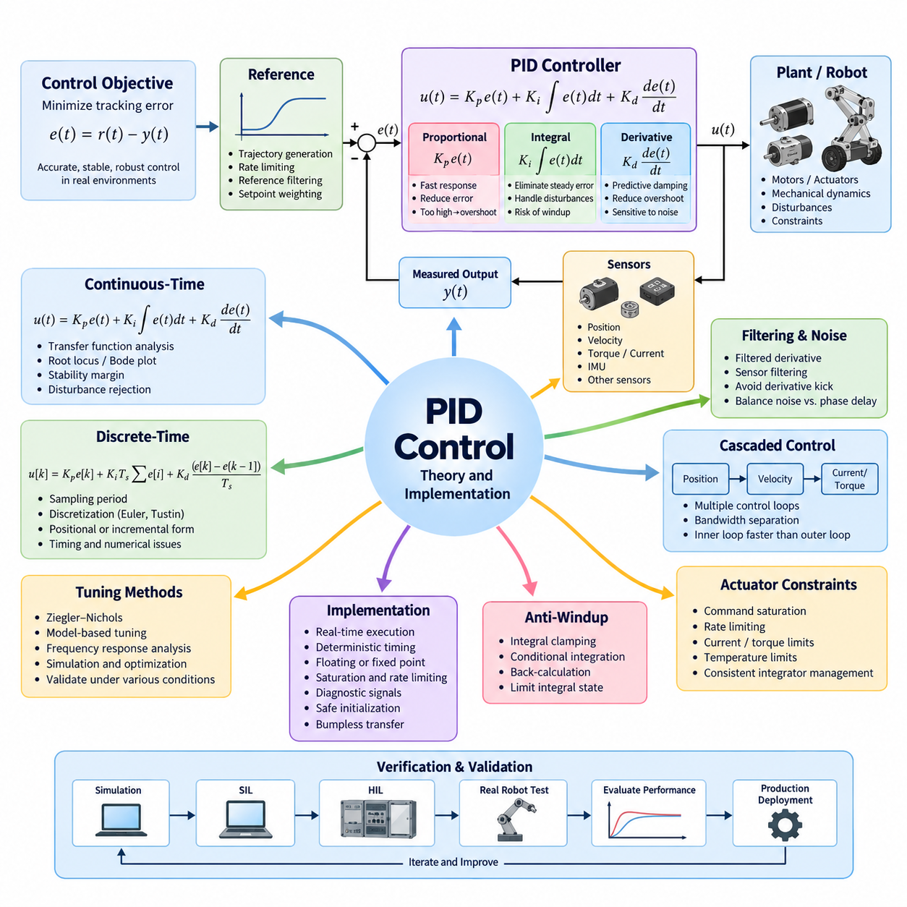
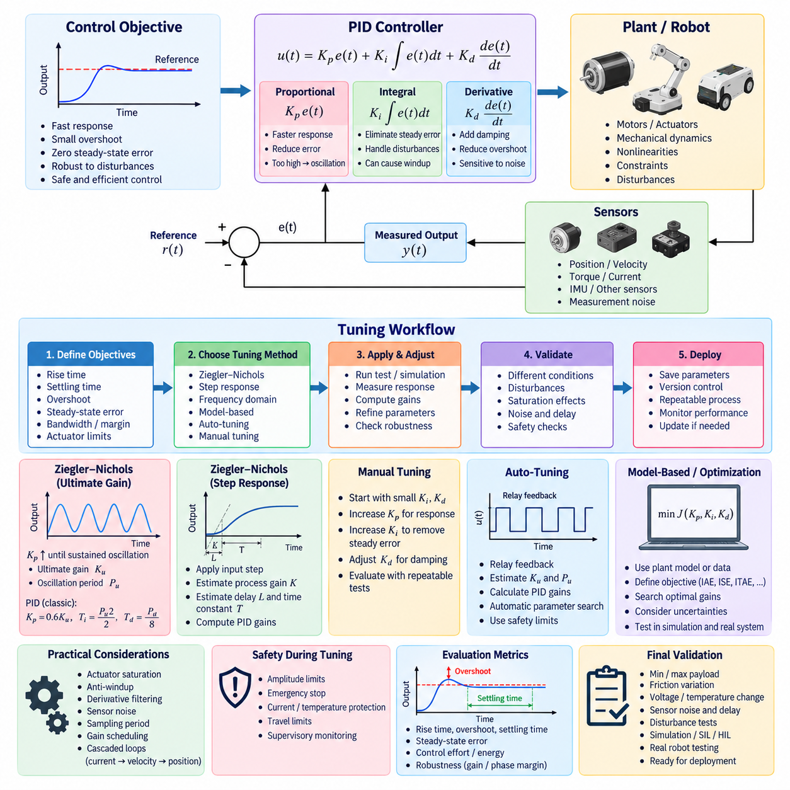
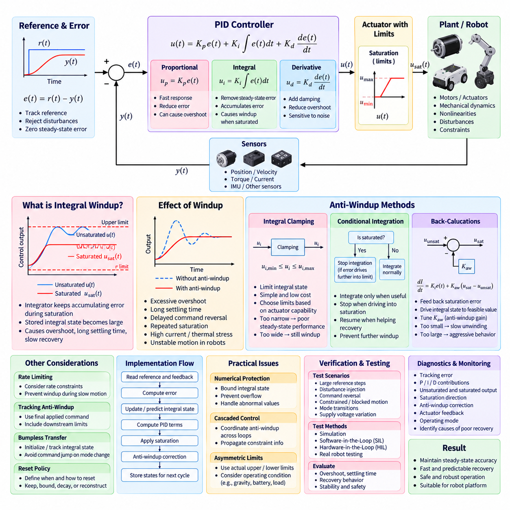
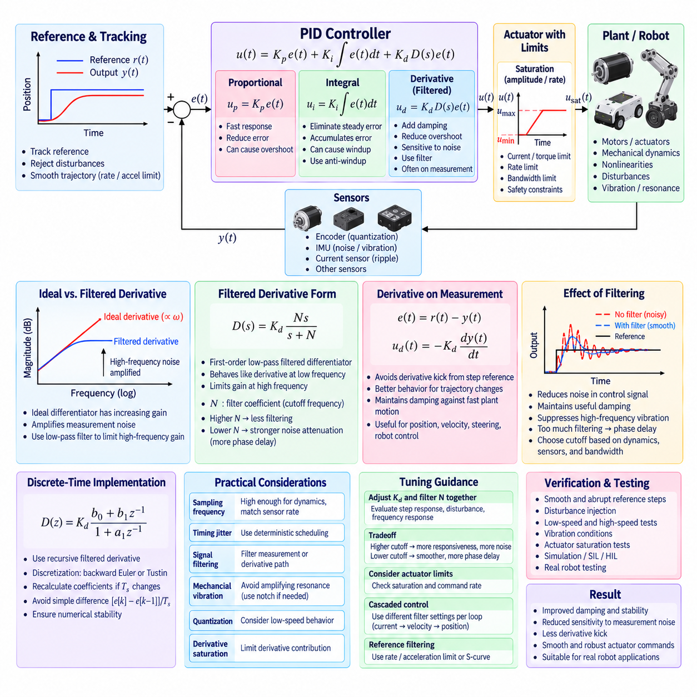
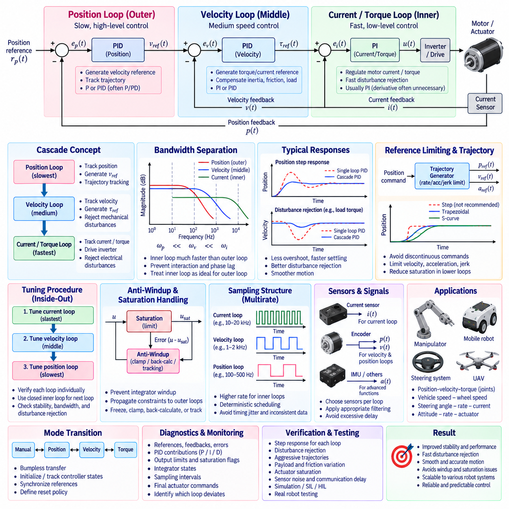
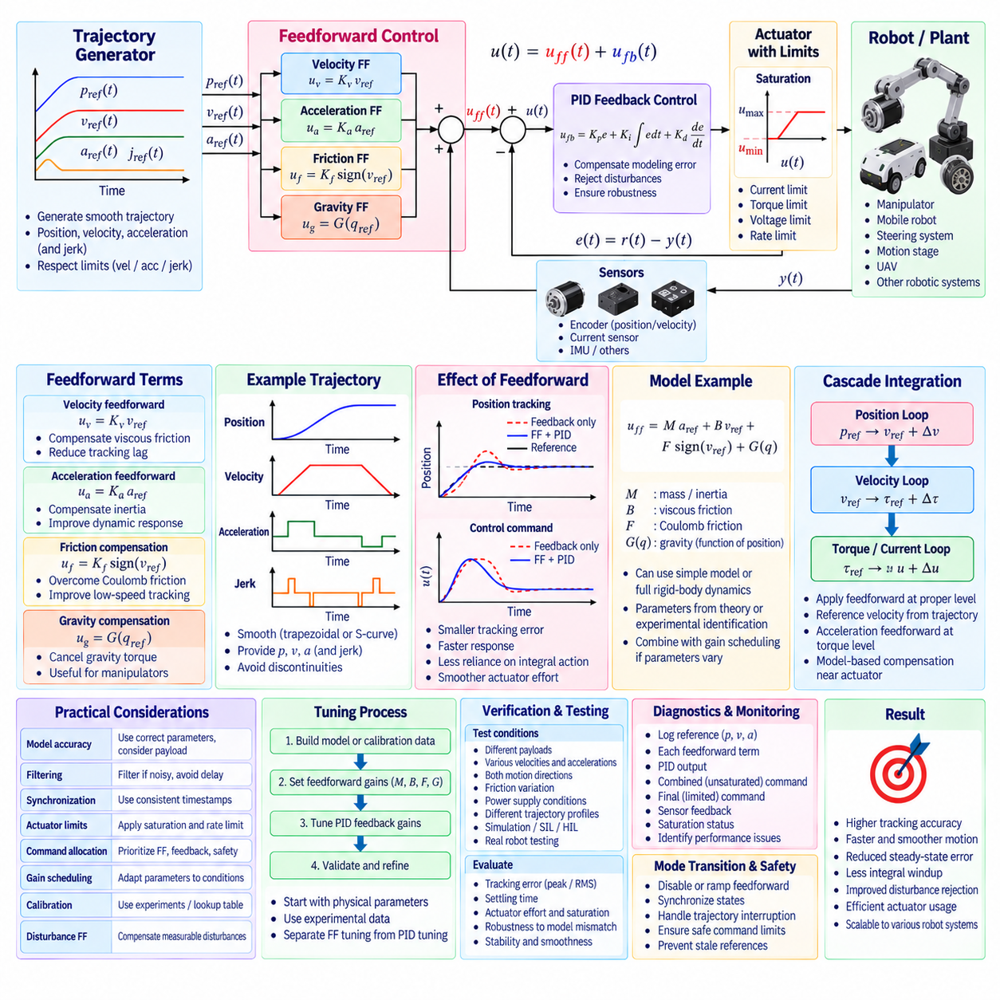
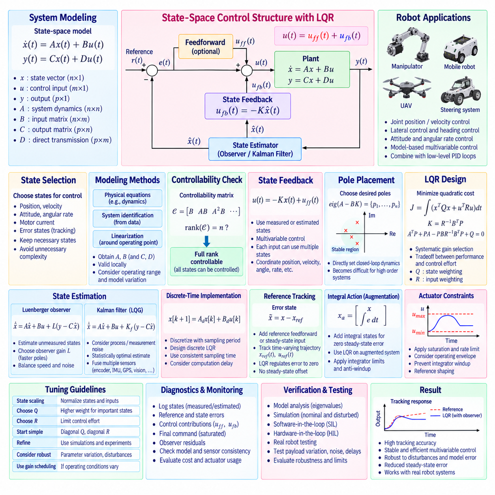
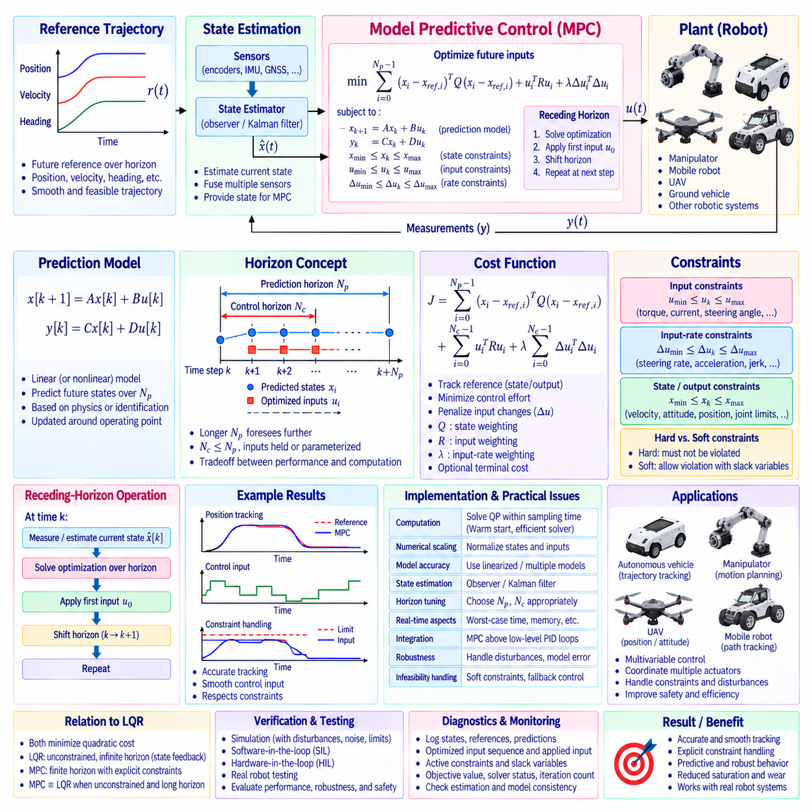
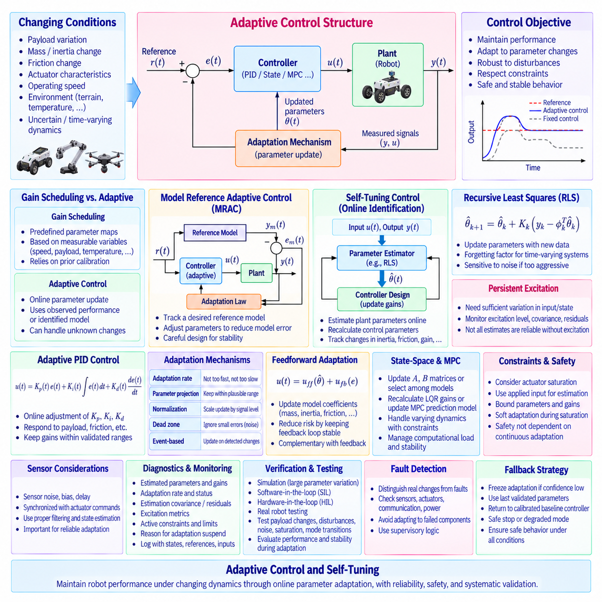
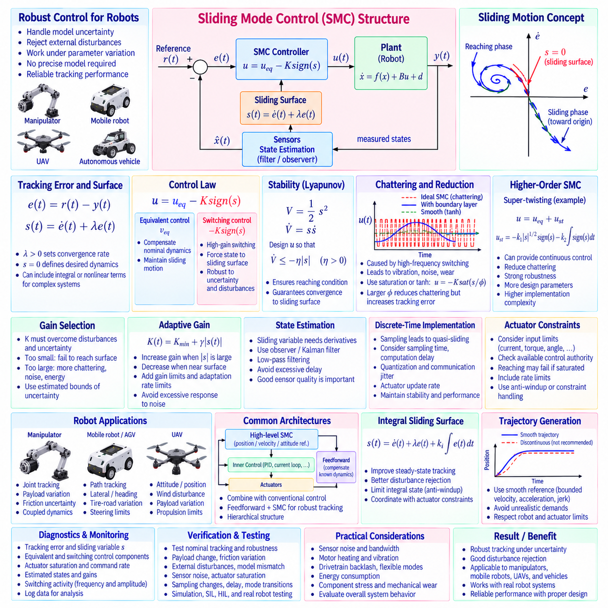

**Volume 04 Robot Control Software**

# 02. PID and Advanced Control

## 02.01 PID Control Theory: Continuous and Discrete Implementation [w/Code]

{width="7.268055555555556in" height="7.268055555555556in"}

비례--적분--미분 제어(Proportional--Integral--Derivative Control)는 로보틱스(Robotics), 산업 자동화(Industrial Automation), 모션 제어(Motion Control), 임베디드 시스템(Embedded Systems)에서 가장 널리 사용되는 피드백 제어(Feedback Control) 방식 중 하나이다. PID 제어기(PID Controller)는 목표 기준값과 측정된 시스템 출력 사이의 차이를 지속적으로 평가하고, 비례·적분·미분 동작을 결합하여 보정 명령을 생성한다. 단순한 수학적 구조로 효과적인 폐루프 성능(Closed-Loop Performance)을 구현할 수 있다는 것이 핵심적인 장점이다.

기본적인 제어 목적은 추종 오차(Tracking Error) e(t)=r(t)−y(t)를 감소시키는 것이다. 여기서 r(t)는 기준 명령(Reference Command)을, y(t)는 측정 출력(Measured Output)을 의미한다. 연속시간(Continuous Time)에서 제어기는 일반적으로 u(t)=Kp e(t)+Ki∫e(t)dt+Kd de(t)/dt로 표현된다. 세 가지 이득(Gain)은 현재 오차, 누적된 과거 오차, 그리고 오차의 순간적인 변화율에 제어기가 얼마나 강하게 반응하는지를 결정한다.

비례항(Proportional Term)은 현재 오차의 크기에 따라 즉각적인 응답을 제공한다. 일반적으로 Kp를 증가시키면 응답성이 향상되고 추종 편차가 감소하지만, 지나치게 큰 비례 이득(Proportional Gain)은 진동(Oscillation), 오버슈트(Overshoot), 액추에이터 포화(Actuator Saturation) 또는 불안정성(Instability)을 유발할 수 있다. 또한 비례 제어기만 사용하는 경우 목표 운전점을 유지하기 위해 지속적인 제어력이 필요한 시스템에서는 정상상태 오차(Steady-State Error)가 남을 수 있다.

적분항(Integral Term)은 시간에 따라 오차를 누적하여 지속적인 정상상태 오차를 제거하는 데 필요한 보정 동작을 제공한다. 이는 플랜트(Plant)가 일정한 외란(Disturbance), 페이로드 변화(Payload Variation), 마찰(Friction), 중력(Gravity), 모델링 불확실성(Modeling Uncertainty)의 영향을 받을 때 특히 중요하다. 그러나 과도한 적분 동작은 오버슈트와 정착시간(Settling Time)을 증가시킬 수 있다. 액추에이터가 물리적 한계에 도달한 상태에서 오차가 계속 누적되면 적분 와인드업(Integral Windup)이 발생할 수도 있다.

따라서 실제 PID 구현에서는 안티 와인드업(Anti-Windup) 메커니즘이 중요하다. 대표적인 방법에는 적분 클램핑(Integral Clamping), 조건부 적분(Conditional Integration), 그리고 요청된 명령과 포화된 액추에이터 명령의 차이를 이용하는 역계산(Back-Calculation)이 있다. 알려진 액추에이터 성능에 따라 적분 상태(Integral State)의 범위를 제한할 수도 있다. 이러한 기법은 과도한 적분값 저장을 방지하고 포화 상태가 해제된 이후 제어기가 더욱 빠르게 정상 동작으로 복귀하도록 한다.

미분항(Derivative Term)은 오차의 변화율에 반응하며, 오버슈트를 감소시키고 과도 응답(Transient Response)을 개선하는 예측성 감쇠(Predictive Damping)를 제공할 수 있다. 그러나 직접적인 미분 연산은 측정 잡음(Measurement Noise)을 크게 증폭시킨다. 따라서 실제 제어기에서는 이상적인 미분기(Ideal Differentiator) 대신 필터링된 미분(Filtered Derivative)을 사용하는 것이 일반적이다. 기준값이 급격하게 변경될 때 발생하는 큰 미분 킥(Derivative Kick)을 방지하기 위해 오차 대신 측정 출력에 미분 동작을 적용하기도 한다.

연속시간 PID 이론(Continuous-Time PID Theory)은 제어기 설계를 위한 유용한 해석적 기반을 제공한다. 플랜트와 제어기의 전달함수(Transfer Function)를 결합하여 폐루프 극점(Closed-Loop Pole), 주파수 응답(Frequency Response), 안정도 여유(Stability Margin), 외란 제거(Disturbance Rejection), 기준값 추종(Reference Tracking)을 분석할 수 있다. 근궤적(Root Locus), 보드 선도(Bode Plot), 상태공간(State Space) 분석을 이용하면 실제 하드웨어에 구현하기 전에 PID 이득이 대역폭(Bandwidth), 감쇠(Damping), 강인성(Robustness), 민감도(Sensitivity)에 미치는 영향을 평가할 수 있다.

디지털 제어기(Digital Controller)는 이산적인 샘플링 시점(Discrete Sampling Instant)에서 PID 계산을 수행한다. 샘플링 주기(Sampling Interval)가 Ts이면 연속 오차 e(t)는 수열 e[k]로 변환된다. 기본적인 이산 구현(Discrete Implementation)은 누적 샘플을 이용하여 적분을 근사하고 유한 차분(Finite Difference)을 이용하여 미분을 근사할 수 있다. 이에 따라 제어기는 u[k]=Kp e[k]+Ki Ts Σe[i]+Kd(e[k]−e[k−1])/Ts 형태로 표현할 수 있지만, 실제 구현에서는 일반적으로 필터링과 포화 처리 로직을 추가한다.

샘플링 주기(Sampling Period)는 단순한 소프트웨어 스케줄링 값이 아니라 핵심적인 설계 파라미터이다. 샘플링 속도가 지나치게 느리면 위상 지연(Phase Delay)이 발생하고 구현 가능한 대역폭이 감소하며, 연속시간 분석에서는 정상적으로 동작했던 제어기가 불안정해질 수도 있다. 반대로 지나치게 빠른 샘플링은 프로세서 부하를 증가시키고 센서 잡음에 대한 민감도를 높인다. 따라서 제어 주파수(Control Frequency)는 플랜트 동역학, 센서 갱신 주기, 액추에이터 대역폭, 통신 지연, 연산 실행시간을 종합적으로 고려하여 선정해야 한다.

연속 PID 제어기를 이산 형태로 변환하기 위해 여러 수학적 변환 방법을 사용할 수 있다. 전진 오일러(Forward Euler)는 간단한 근사 방법이지만 비교적 큰 수치 오차(Numerical Error)를 발생시킬 수 있다. 후진 오일러(Backward Euler)는 일반적으로 더 높은 수치적 강인성(Numerical Robustness)을 제공하며, 쌍선형 변환(Bilinear Transformation) 또는 터스틴 변환(Tustin Transformation)은 연속 및 이산 주파수 특성 사이의 유용한 대응 관계를 제공한다. 적절한 방법은 샘플링 주파수, 요구 정확도, 연산 제약조건, 제어 대역폭에 따라 결정된다.

PID 소프트웨어는 위치형(Positional Form) 또는 증분형(Incremental Form)으로 구현할 수 있다. 위치형은 비례항, 적분항, 미분항으로부터 전체 액추에이터 명령을 직접 계산한다. 증분형은 이전 제어 주기의 명령을 기준으로 명령 변화량을 계산한다. 증분형 구현은 일부 임베디드 액추에이터(Embedded Actuator) 및 레거시 제어 아키텍처(Legacy Control Architecture)에 유리할 수 있으며, 위치형 구현은 일반적으로 상태 관리(State Management)와 포화 처리(Saturation Handling)를 더욱 명확하게 구성할 수 있다.

실제 제어 소프트웨어(Real Control Software)는 타이밍 불확실성(Timing Uncertainty)과 수치적 제한(Numerical Limitation)을 고려해야 한다. 제어기는 가능한 한 알려진 샘플링 주기를 갖는 결정론적 주기 태스크(Deterministic Periodic Task)에서 실행되어야 한다. 타이밍 변동을 피할 수 없다면 실제 측정된 경과시간(Elapsed Time)을 적분 및 미분 계산에 사용할 수 있다. 현대 로봇 컴퓨터에서는 일반적으로 부동소수점 정밀도(Floating-Point Precision)가 충분하지만, 고정소수점(Fixed-Point) 구현에서는 스케일링, 오버플로 보호(Overflow Protection), 양자화 분석(Quantization Analysis)을 신중하게 수행해야 한다.

미분 동작을 튜닝하고 피드백 필터링(Feedback Filtering)을 선정할 때 센서 잡음(Sensor Noise)을 고려해야 한다. 과도한 필터링은 추가적인 위상 지연을 발생시키는 반면, 필터링이 부족하면 잡음이 액추에이터 명령까지 전달될 수 있다. 실제 설계에서는 센서 필터링, 미분 필터링(Derivative Filtering), 제어기 대역폭, 샘플링 주파수를 하나의 시스템으로 통합하여 조정해야 한다. 따라서 필터는 제어 알고리즘과 독립적으로 선정하기보다는 폐루프 동작을 기준으로 평가해야 한다.

액추에이터 제약조건(Actuator Constraints) 역시 명시적으로 반영되어야 한다. 모터, 유압 시스템, 조향 장치, 브레이크, 로봇 관절에는 명령 크기, 속도, 가속도, 전류, 토크, 온도에 대한 물리적 제한이 존재한다. PID 출력은 적절한 포화 함수(Saturation Function)와 변화율 제한 함수(Rate Limiting Function)를 통과해야 한다. 또한 내부 제어기 상태가 물리적으로 구현 가능한 시스템 동작을 지속적으로 나타낼 수 있도록 적분기 관리(Integrator Management)를 이러한 제약조건과 일관되게 구성해야 한다.

제어기 튜닝(Controller Tuning)은 응답 속도, 오버슈트, 정상상태 정확도, 외란 제거 성능, 강인성 사이의 균형을 결정한다. 지글러--니콜스(Ziegler--Nichols)와 같은 고전적인 방법으로 초기 이득을 설정할 수 있지만, 현대 로봇 시스템에서는 모델 기반 튜닝(Model-Based Tuning), 주파수 응답 분석, 시뮬레이션 또는 자동 최적화(Automated Optimization)가 자주 사용된다. 최종 튜닝 결과는 페이로드, 마찰, 배터리 전압, 온도, 노면 상태 및 예상되는 다양한 운전 조건에서 검증되어야 한다.

설정값 처리(Setpoint Processing)를 통해 실제 제어 성능을 더욱 향상시킬 수 있다. 급격한 기준값 변화를 모든 PID 항에 직접 적용하는 대신 명령을 궤적 생성(Trajectory Generation), 변화율 제한(Rate Limiting), 기준값 필터링(Reference Filtering)을 거쳐 전달할 수 있다. 설정값 가중치(Setpoint Weighting)는 외란 제거 특성을 유지하면서 기준값 변화에 대한 비례 및 미분 응답을 독립적으로 조절할 수 있다. 이러한 기법은 위치, 속도, 조향 및 이동 로봇의 모션 제어기(Motion Controller)에 특히 유용하다.

양산 수준의 PID 제어기(Production PID Controller)는 진단(Diagnostics)과 캘리브레이션(Calibration)을 위해 내부 상태를 외부에서 확인할 수 있도록 구성해야 한다. 유용한 신호에는 기준값, 측정값, 오차, 비례항 출력, 적분 상태, 미분항 출력, 포화 이전 명령, 최종 포화 명령, 샘플링 주기, 포화 상태 등이 포함된다. 이러한 데이터를 로깅(Logging)하면 튜닝 문제를 센서 잡음, 기계적 마찰, 액추에이터 한계, 통신 지연 또는 잘못된 시스템 모델링과 구분할 수 있다.

안전한 초기화(Safe Initialization)와 모드 전환(Mode Transition)도 중요하다. 제어 상태가 비활성화, 수동, 자율 또는 서로 다른 운전 모드 사이에서 변경될 때 내부 제어기 상태로 인해 액추에이터 명령이 불연속적으로 변해서는 안 된다. 범프리스 전환(Bumpless Transfer) 기법은 새로운 제어기의 출력이 기존 명령과 일치하도록 적분 상태를 초기화하거나 추종시킨다. 또한 고장, 비상 정지(Emergency Stop), 통신 손실 또는 기준값 변경 이후의 제어기 상태에 대한 리셋 정책(Reset Policy)을 명확하게 정의해야 한다.

로봇 시스템에서는 PID 제어가 종종 다중 루프의 캐스케이드 구조(Cascaded Loop Structure)로 구성된다. 위치 제어기(Position Controller)가 속도 기준값을 생성하고, 속도 제어기(Velocity Controller)는 내부 모터 루프(Inner Motor Loop)를 위한 토크 또는 전류 명령을 생성할 수 있다. 내부 루프는 일반적으로 외부 루프보다 높은 대역폭과 샘플링 주파수로 동작한다. 느린 외부 제어기가 빠른 내부 동역학을 거의 안정된 상태로 간주할 수 있도록 각 루프 사이에 충분한 대역폭 분리(Bandwidth Separation)를 확보해야 한다.

검증(Verification)은 수학적 정확성과 실시간 구현 동작을 모두 포함해야 한다. 시뮬레이션(Simulation)을 통해 정상적인 추종 및 외란 조건을 평가할 수 있으며, 소프트웨어 인 더 루프(Software-in-the-Loop, SIL)와 하드웨어 인 더 루프(Hardware-in-the-Loop, HIL) 시험을 통해 이산화, 포화, 타이밍, 통신 및 수치 연산의 영향을 확인할 수 있다. 실제 하드웨어 시험에서는 PID 파라미터를 양산용으로 확정하기 전에 액추에이터 한계, 센서 고장, 부하 변화, 잡음, 열적 조건 및 비상 전환 상황까지 추가로 평가해야 한다.

## 02.02 PID Tuning Methods: Ziegler-Nichols / Auto Tuning [w/Code]

{width="7.268055555555556in" height="7.268055555555556in"}

PID 튜닝(PID Tuning)은 응답성, 안정성, 오버슈트(Overshoot), 정착시간(Settling Time), 정상상태 정확도(Steady-State Accuracy), 외란 제거(Disturbance Rejection) 사이에서 요구되는 균형을 달성하도록 비례·적분·미분 이득을 선정하는 과정이다. PID 구조는 수학적으로 단순하지만 적절한 이득 선정은 플랜트 동역학(Plant Dynamics)에 크게 의존한다. 따라서 실제 튜닝에서는 해석적 지식, 실험적 방법, 시뮬레이션(Simulation), 그리고 점차 확대되고 있는 자동 최적화(Automated Optimization) 기법을 함께 활용한다.

비례 이득(Proportional Gain) Kp는 주로 제어기가 순간적인 오차에 얼마나 강하게 반응하는지를 결정한다. Kp를 증가시키면 일반적으로 응답이 빨라지고 추종 오차가 감소하지만, 과도한 이득은 진동(Oscillation)이나 불안정성(Instability)을 발생시킬 수 있다. 적분 이득(Integral Gain) Ki는 시간에 따라 오차를 누적하여 지속적인 정상상태 오차를 제거하는 반면, 지나친 적분 동작은 오버슈트와 와인드업(Windup)을 증가시킬 수 있다. 미분 이득(Derivative Gain) Kd는 감쇠(Damping)를 추가하지만 측정 잡음을 증폭시킬 수 있다.

유용한 튜닝 과정은 명확한 기준 없이 이득을 조정하는 것이 아니라 측정 가능한 제어 목표(Control Objective)를 정의하는 것에서 시작한다. 일반적인 요구사항에는 상승시간(Rise Time), 정착시간, 최대 오버슈트, 정상상태 오차, 제어 대역폭(Control Bandwidth), 위상 여유(Phase Margin), 외란 복구(Disturbance Recovery), 액추에이터 활용도(Actuator Utilization), 잡음 민감도(Noise Sensitivity)가 포함된다. 로봇 응용에서는 과도 동작 중 가속도, 저크(Jerk), 토크, 전류, 진동, 위치 정확도 및 기계적 응력에 대한 제한이 추가될 수 있다.

지글러--니콜스 방법(Ziegler--Nichols Method)은 실험적으로 관찰된 플랜트 동작으로부터 초기 PID 파라미터를 결정하는 고전적인 경험적 튜닝 기법(Empirical Tuning Technique)이다. 일반적인 방법 중 하나는 폐루프 한계 이득 방법(Closed-Loop Ultimate-Gain Method)이다. 먼저 적분 및 미분 동작을 비활성화한 후 폐루프 시스템에서 지속적인 진동이 발생할 때까지 비례 이득을 점진적으로 증가시킨다. 이때의 비례 이득을 한계 이득(Ultimate Gain) Ku로 정의하고, 진동 주기(Oscillation Period)를 Pu로 기록한다.

Ku와 Pu를 구하면 미리 정의된 지글러--니콜스 관계식(Ziegler--Nichols Relationship)을 이용하여 제어기 파라미터를 추정할 수 있다. 고전적인 PID 형태에서는 Kp=0.6Ku, Ti=Pu/2, Td=Pu/8이 자주 초기값으로 사용되며, 적분 및 미분 이득은 선택된 PID 파라미터화(PID Parameterization) 방식에 따라 계산된다. 이러한 값은 보편적인 최적 설정값이 아니라 초기 추정값이며, 실제 로봇이나 액추에이터에 적용하기 위해서는 일반적으로 추가적인 튜닝이 필요하다.

한계 이득 실험(Ultimate-Gain Experiment)은 물리적 시스템을 의도적으로 지속 진동에 가까운 상태까지 구동하기 때문에 신중하게 수행해야 한다. 로봇은 이론적인 한계 이득에 도달하기 전에 기계적 한계, 과도한 모터 전류, 진동, 열적 스트레스(Thermal Stress), 페이로드 불안정 또는 구조적 공진(Structural Resonance)을 경험할 수 있다. 따라서 실험 과정에서는 진폭 제한, 비상 정지(Emergency Stop) 로직, 전류 보호, 이동 한계 및 상위 감시(Supervisory Monitoring) 기능을 활성화해야 한다.

또 다른 지글러--니콜스 접근법은 플랜트의 개루프 계단 응답(Open-Loop Step Response)을 이용한다. 알려진 크기의 입력 스텝(Input Step)을 인가하고 그에 따른 프로세스 응답을 분석하여 프로세스 이득(Process Gain), 겉보기 지연(Apparent Delay), 지배적인 시정수(Dominant Time Constant)를 나타내는 파라미터를 추정한다. 이후 튜닝 관계식을 이용하여 이러한 특성을 제어기 이득으로 변환한다. 이 방법은 의도적인 폐루프 지속 진동을 피할 수 있지만 비선형, 적분형 또는 강하게 결합된 로봇 시스템에서는 정확한 식별이 어려울 수 있다.

고전적인 지글러--니콜스 튜닝은 비교적 공격적인 응답(Aggressive Response)을 생성하는 경향이 있으며 정밀 로보틱스(Precision Robotics)에서 요구되는 수준보다 큰 오버슈트를 발생시킬 수 있다. 이 방법은 현대 메카트로닉 시스템(Mechatronic System)을 위한 최적화 절차가 아니라 범용적인 실용 규칙으로 개발되었다. 따라서 이를 통해 얻은 이득은 부드러운 움직임, 낮은 진동, 에너지 효율, 액추에이터 보호, 페이로드 안정성 및 인간--로봇 상호작용(Human--Robot Interaction)과 같은 응용별 요구사항에 따라 추가적으로 조정해야 한다.

수동 튜닝(Manual Tuning)은 엔지니어가 물리적 시스템을 이해하고 그 응답을 직접 관찰할 수 있을 때 여전히 유용하다. 일반적인 실무 절차에서는 작은 적분 및 미분 이득에서 시작하여 적절한 응답성을 확보할 때까지 비례 동작을 조정한다. 이후 잔여 정상상태 오차를 제거하도록 적분 동작을 증가시키고, 감쇠 성능을 개선하도록 미분 동작을 조정한다. 각각의 변경 결과는 주관적인 관찰만으로 판단하지 않고 반복 가능한 기준값 및 외란 시나리오를 이용하여 평가해야 한다.

계단 응답 분석(Step-Response Analysis)은 이러한 조정 과정에 정량적인 정보를 제공한다. 기준 명령을 인가하면서 위치, 속도, 토크 또는 기타 제어 변수와 액추에이터 명령을 함께 기록할 수 있다. 이후 상승시간, 최대 오버슈트, 정착시간, 정상상태 오차, 진동 주파수 및 포화 지속시간(Saturation Duration)을 계산한다. 서로 다른 이득 조합에서 이러한 지표를 비교하면 보다 체계적인 튜닝 과정을 구축할 수 있으며 추적 가능한 엔지니어링 근거(Traceable Engineering Evidence)를 확보할 수 있다.

주파수 영역 튜닝(Frequency-Domain Tuning)은 또 다른 체계적인 접근법을 제공한다. 플랜트 모델이나 측정된 주파수 응답(Frequency Response)을 사용할 수 있다면 원하는 교차 주파수(Crossover Frequency), 이득 여유(Gain Margin), 위상 여유 및 민감도 특성(Sensitivity Characteristics)을 확보하도록 제어기 파라미터를 조정할 수 있다. 이는 페이로드, 관성, 마찰 또는 액추에이터 동역학 변화에서도 제어기가 안정적으로 동작해야 하는 경우 특히 유용하다. 이러한 설계를 통해 제어 대역폭과 강인성(Robustness), 측정 잡음 증폭 사이의 절충 관계를 명시적으로 다룰 수 있다.

모델 기반 튜닝(Model-Based Tuning)은 제어 대상 시스템의 해석적 또는 식별된 수학적 표현을 이용한다. 모터 전기 동역학, 기계적 관성, 감쇠, 변속기 특성, 조향 동역학 또는 로봇 관절 동작 등을 플랜트 모델에 포함할 수 있다. 이후 실제 하드웨어 시험 전에 시뮬레이션에서 PID 이득을 계산하거나 최적화할 수 있다. 모델이 모든 물리적 세부사항을 재현할 필요는 없지만 목표 제어 대역폭을 지배하는 주요 동역학은 충분히 표현해야 한다.

자동 튜닝(Auto-Tuning)은 플랜트를 자극하고 응답을 관찰하여 관련 동적 특성을 추정한 후 제어기 파라미터를 계산하는 과정의 일부 또는 전체를 자동화한다. 다수의 모터, 관절 또는 로봇에 유사한 캘리브레이션(Calibration)이 필요한 경우 시운전 시간을 줄일 수 있다. 자동 튜닝은 제어기를 반복적으로 설정해야 하는 제조 환경에서 특히 유용하지만, 시스템에 인가되는 자극 절차와 파라미터 제한은 반드시 하드웨어 안전 제약조건과 호환되어야 한다.

릴레이 피드백(Relay Feedback)은 널리 사용되는 자동 튜닝 기법으로, 비례 제어를 제어된 스위칭 자극(Controlled Switching Excitation)으로 대체하거나 보완한다. 이 과정에서 발생하는 진동을 이용하면 비례 이득을 수동으로 불안정 영역까지 증가시키지 않고도 한계 이득과 진동 주기를 추정할 수 있다. 이러한 측정값으로부터 튜닝 규칙을 적용하여 PID 파라미터를 생성할 수 있다. 유용한 식별 데이터를 안전하게 확보하기 위해서는 릴레이 진폭, 히스테리시스(Hysteresis), 자극 지속시간, 액추에이터 한계 및 종료 조건을 신중하게 설정해야 한다.

보다 발전된 자동 튜닝에서는 이득 선정을 최적화 문제(Optimization Problem)로 정의할 수 있다. Kp, Ki, Kd의 후보값을 추종 오차, 오버슈트, 정착시간, 제어 노력(Control Effort), 에너지 소비 또는 기타 성능 지표로 구성된 목적함수(Objective Function)에 따라 평가한다. IAE, ISE, ITAE와 같은 적분 성능 기준(Integral Performance Criteria) 또는 여러 지표의 조합을 이용하여 응답 품질을 정량화할 수 있다. 불안정, 포화 또는 허용할 수 없는 동작을 발생시키는 이득 조합은 제약조건을 이용하여 제외할 수 있다.

최적화는 수치 탐색(Numerical Search), 기울기 비사용 알고리즘(Gradient-Free Algorithm), 진화적 방법(Evolutionary Method), 베이지안 최적화(Bayesian Optimization) 또는 기타 파라미터 탐색 기법을 사용하여 시뮬레이션 환경에서 수행할 수 있다. 시뮬레이션을 이용하면 실제 하드웨어에 반복적으로 스트레스를 가하지 않고도 많은 이득 조합을 탐색할 수 있다. 그러나 공칭 시뮬레이션 모델(Nominal Simulation Model)에 대해서만 최적화된 이득은 실제 로봇에서 성능이 저하될 수 있으므로 질량, 마찰, 지연, 센서 잡음 및 액추에이터 특성의 불확실성을 평가 과정에 포함해야 한다.

이득 스케줄링(Gain Scheduling)은 하나의 고정된 파라미터 집합으로 전체 운전 영역에서 충분한 성능을 확보할 수 없는 경우 PID 튜닝을 확장하는 방법이다. 페이로드, 속도, 관절 구성, 배터리 전압, 조향각, 비행 조건 또는 기타 측정 가능한 운전 변수에 따라 서로 다른 이득을 선택할 수 있다. 불연속적인 액추에이터 명령이 발생하지 않도록 이득 집합 사이의 전환은 부드럽게 이루어져야 하며, 각각의 스케줄링 영역에서 안정성과 적절한 과도 응답 성능을 검증해야 한다.

액추에이터 한계가 PID 제어기의 겉보기 응답을 크게 변화시킬 수 있으므로 튜닝 과정에서는 포화(Saturation)와 안티 와인드업(Anti-Windup) 동작을 반드시 고려해야 한다. 느리게 보이는 이득 설정이 실제로는 최대 전류, 토크, 속도 또는 명령 제한 때문에 제약받고 있을 수 있다. 이러한 조건에서 이득을 증가시키면 포화 지속시간과 적분 누적만 증가할 수 있다. 따라서 튜닝 과정에서는 제어기 출력, 포화 상태 플래그(Saturation Flag), 적분 상태 및 물리적 액추에이터 변수를 함께 기록해야 한다.

미분 필터링(Derivative Filtering) 역시 독립적인 후처리 기능이 아니라 튜닝 문제의 일부로 다루어야 한다. 미분 이득을 증가시키면 감쇠 성능을 향상시킬 수 있지만 강한 미분 동작은 센서 잡음을 억제하기 위해 추가적인 필터링을 요구할 수 있다. 추가 필터링은 위상 지연(Phase Delay)을 발생시키고 안정도 여유를 감소시킬 수 있다. 따라서 제어기 캘리브레이션 과정에서는 Kd, 미분 필터 대역폭(Derivative-Filter Bandwidth), 샘플링 주파수 및 센서 특성을 함께 평가해야 한다.

캐스케이드 제어 아키텍처(Cascaded Control Architecture)에서는 일반적으로 가장 안쪽의 제어 루프부터 바깥쪽으로 순차적으로 튜닝한다. 먼저 모터 전류 또는 토크 루프(Current or Torque Loop)를 안정화한 후 속도 제어(Velocity Control), 그리고 위치 제어(Position Control)를 차례로 튜닝한다. 각 내부 루프는 외부 루프를 튜닝하기 전에 충분한 대역폭과 강인성을 확보해야 한다. 이러한 순서는 잘못 튜닝된 내부 동역학을 외부 루프 이득이 부적절하게 보상하는 것을 방지하고 제어 계층 사이에 명확한 대역폭 분리(Bandwidth Separation)를 유지하도록 한다.

양산 수준의 튜닝(Production Tuning)에서는 파라미터 추적성(Parameter Traceability)과 반복성(Repeatability)이 요구된다. 각 이득 집합은 제어기 소프트웨어 버전, 하드웨어 구성, 액추에이터 유형, 페이로드 조건, 샘플링 주기, 필터 파라미터 및 시험 결과와 연계되어야 한다. 파라미터는 소스 코드 내부에 문서화되지 않은 상수로 삽입하는 대신 통제된 캘리브레이션 메커니즘(Controlled Calibration Mechanism)을 통해 저장해야 한다. 이를 통해 성능을 재현하고, 개정 버전을 비교하며, 고장을 분석하고, 여러 로봇 플랫폼에 업데이트를 안전하게 배포할 수 있다.

최종 검증(Final Validation)은 공칭 튜닝 조건만을 대상으로 해서는 안 된다. 최소 및 최대 페이로드, 예상되는 마찰 변화, 배터리 또는 공급 전압 변화, 온도 변화, 센서 잡음, 통신 지연, 액추에이터 포화, 외부 외란 및 대표적인 궤적 조건에서 제어기를 평가해야 한다. 시뮬레이션, 소프트웨어 인 더 루프(Software-in-the-Loop, SIL), 하드웨어 인 더 루프(Hardware-in-the-Loop, HIL), 실제 로봇 시험(Physical Robot Testing)을 단계적으로 수행함으로써 튜닝된 파라미터를 실제 운용 환경에 배포하기 전에 충분한 신뢰성을 확보할 수 있다.

## 02.03 Anti-Windup Technique Implementation [w/Code]

{width="7.268055555555556in" height="7.268055555555556in"}

적분 와인드업(Integral Windup)은 PID 제어기(PID Controller)의 적분 성분이 액추에이터(Actuator)가 요청된 제어 동작을 수행할 수 없는 상황에서도 계속해서 오차를 누적할 때 발생한다. 이는 일반적으로 제어기 출력이 최대 모터 전류, 토크, 전압, 속도, 조향각 또는 밸브 위치와 같은 물리적 한계를 초과할 때 발생한다. 이렇게 저장된 적분 오차는 정상적인 폐루프 동작(Closed-Loop Operation)에 필요한 값보다 훨씬 커질 수 있다.

액추에이터 포화(Actuator Saturation)가 발생하면 명령된 제어값 u(t)와 실제로 적용되는 값이 더 이상 일치하지 않는다. 플랜트(Plant)는 포화된 명령만을 입력으로 받지만, 적분항(Integral Term)은 추가적인 제어 여력이 존재하는 것처럼 지속적인 추종 오차를 계속 적분할 수 있다. 이후 오차가 감소하거나 방향이 바뀌더라도 누적된 적분 상태가 액추에이터를 이전의 포화 한계 방향으로 계속 구동하여 정상 상태로의 복귀를 지연시킨다.

와인드업(Windup)은 과도 응답 성능(Transient Performance)을 크게 저하시킬 수 있다. 대표적인 증상에는 과도한 오버슈트(Overshoot), 긴 정착시간(Settling Time), 액추에이터 명령 반전 지연, 반복적인 포화 및 큰 기준값 변화나 외란 이후의 느린 복구가 포함된다. 로봇 시스템에서는 특히 높은 적분 이득을 사용할 경우 급격한 움직임, 모터 전류 증가, 불필요한 열 부하, 기계적 응력 또는 환경과의 불안정한 상호작용을 유발할 수도 있다.

안티 와인드업(Anti-Windup) 기법은 제어기 출력이 제한될 때 적분 동작을 수정한다. 정상상태 오차를 제거하는 데 적분 동작이 여전히 중요하므로 이를 제거하는 것이 목적이 아니라, 액추에이터가 물리적으로 제공할 수 없는 제어력을 적분 상태가 나타내지 않도록 방지하는 것이 목적이다. 따라서 실제 구현에서는 PID 계산, 액추에이터 포화, 적분 상태 관리(Integral-State Management), 운전 모드 로직(Operating-Mode Logic)을 상호 연계해야 한다.

가장 간단한 접근법은 적분 클램핑(Integral Clamping)이다. 누적되는 적분 상태를 미리 정의된 최소값과 최대값으로 제한하여 무한정 증가하지 못하도록 한다. 적분 기여분을 ui로 표현한다면 매 적분 연산 이후 ui,min ≤ ui ≤ ui,max와 같은 제한을 소프트웨어에서 적용할 수 있다. 이러한 한계값은 액추에이터 성능과 정상 운전 중 필요한 적분 제어 범위를 고려하여 선정해야 한다.

적분 클램핑은 구조가 단순하고 연산 비용이 낮기 때문에 임베디드 모터 제어기(Embedded Motor Controller)와 고주파 제어 루프(High-Frequency Control Loop)에 적합하다. 그러나 고정된 한계값은 액추에이터 포화가 비례, 적분 또는 미분 동작 중 어느 항에 의해 발생했는지를 명시적으로 고려하지 않는다. 클램프 범위가 지나치게 좁으면 정상상태 외란 제거 성능이 저하될 수 있으며, 지나치게 넓으면 적분 한계에 도달하기 전에 상당한 와인드업이 발생할 수 있다.

조건부 적분(Conditional Integration)은 보다 동적인 해결 방법을 제공한다. 액추에이터가 포화되지 않은 상태에서는 정상적으로 적분을 수행하지만, 출력이 한계에 도달하고 현재 오차가 제어기를 포화 방향으로 더욱 밀어 넣는 경우에는 적분 갱신을 중단한다. 반대로 오차가 포화 방향과 반대로 작용하여 명령을 실행 가능한 영역으로 복귀시키는 경우에는 적분을 다시 수행할 수 있다. 이를 통해 유용한 적분 동작을 유지하면서 유해한 방향으로의 추가적인 누적을 방지한다.

이산 조건부 적분기(Discrete Conditional Integrator)는 먼저 Icandidate[k]=I[k−1]+Ki Ts e[k]를 이용하여 후보 적분 상태를 계산할 수 있다. 이후 제어기는 이에 따른 비포화 출력(Unsaturated Output)을 평가하고 액추에이터 한계와 비교한다. 명령이 실행 가능한 범위에 있거나 적분이 포화 상태로부터의 복귀를 지원하는 경우 후보 상태를 적용한다. 그렇지 않으면 제어기가 포화 경계에서 벗어날 수 있을 때까지 이전 적분 상태를 유지한다.

역계산(Back-Calculation)은 포화에 의해 발생한 차이를 적분기에 명시적으로 피드백하는 널리 사용되는 안티 와인드업 방법이다. 제어기는 먼저 비포화 명령 uunsat를 계산한 후 액추에이터 제한을 적용하여 usat를 얻는다. usat−uunsat의 차이는 실제로 구현할 수 없는 제어 동작의 크기를 나타낸다. 이 차이에 안티 와인드업 이득(Anti-Windup Gain)을 곱하여 적분 상태를 실제 액추에이터가 구현 가능한 출력과 일치하는 방향으로 보정한다.

연속시간(Continuous-Time) 형태에서는 dI/dt=Ki e(t)+Kaw[usat(t)−uunsat(t)]와 같은 식을 이용하여 적분기를 수정할 수 있으며, 여기서 Kaw는 안티 와인드업 이득이다. 정상적인 비포화 운전에서는 usat가 uunsat와 동일하므로 추가 피드백 항은 0이 된다. 포화 상태에서는 보정항이 누적된 적분 상태를 감소시키는 언와인딩(Unwinding)을 수행한다. 이러한 복구 속도는 Kaw에 의해 결정되며 기본 제어 루프의 동역학과 조화를 이루도록 설정해야 한다.

역계산 이득(Back-Calculation Gain)은 신중하게 튜닝해야 한다. Kaw가 너무 작으면 적분기가 지나치게 느리게 언와인딩되어 기존의 와인드업 특성이 상당 부분 남게 된다. 반대로 지나치게 크면 적분 상태가 급격하게 변화하여 바람직하지 않은 과도 응답을 유발할 수 있다. 적분 상태의 보정이 충분히 빠르게 이루어지면서도 의도된 폐루프 동역학을 방해하지 않도록 안티 와인드업 시정수(Anti-Windup Time Constant)를 이용하여 이러한 응답을 설정하기도 한다.

추종 안티 와인드업(Tracking Anti-Windup)은 내부 제어기 상태가 실제 플랜트에 적용되는 제어값을 추종하도록 함으로써 이러한 개념을 일반화한다. 이는 최종 액추에이터 명령이 진폭 포화뿐만 아니라 변화율 제한(Rate Limiting), 토크 제한, 안전 감시(Safety Supervision), 트랙션 제어(Traction Control), 전력 관리(Power Management) 또는 다른 후단 기능에 의해 변경되는 경우 유용하다. 추종 신호는 관련된 모든 제한이 적용된 이후의 실질적인 명령을 나타내야 한다.

따라서 안티 와인드업 설계에서는 전체 액추에이터 명령 경로(Actuator Command Path)를 고려해야 한다. 제어기가 생성한 토크 요청은 이후 전류 제한, 속도 의존 토크 제한, 열 디레이팅(Thermal Derating), 배터리 전력 제한, 가속도 제한 또는 안전 오버라이드(Safety Override)를 통과할 수 있다. 적분기가 첫 번째 포화 블록만 감시한다면 이후 단계에서 발생하는 제약조건에 대해서는 계속 오차를 누적할 수 있다. 최종 적용 명령을 피드백하면 보다 일관된 동작을 구현할 수 있다.

변화율 포화(Rate Saturation)는 명령의 절대값이 진폭 한계 이내에 있는 경우에도 와인드업을 발생시킬 수 있다. 예를 들어 조향 또는 관절 액추에이터가 요청된 만큼 빠르게 위치나 토크를 변경하지 못할 수 있다. 이때 액추에이터가 명령을 따라가는 동안 제어기는 적분 오차를 계속 누적할 수 있다. 따라서 이러한 제한이 폐루프 동작에 실질적인 영향을 미치는 경우 안티 와인드업 로직은 명령 크기뿐만 아니라 변화율 제약조건도 고려해야 한다.

범프리스 전환(Bumpless Transfer)은 적분 상태 관리와 밀접하게 관련되어 있다. 제어가 수동, 자율, 비활성화, 위치, 속도 또는 기타 운전 모드 사이에서 전환될 때 기존 적분 상태가 새로운 액추에이터 명령과 호환되지 않을 수 있다. 적분기를 초기화하거나 추종하도록 구성하여 제어기 출력이 현재 적용되고 있는 명령과 가까운 값에서 시작하도록 할 수 있다. 이를 통해 폐루프 제어가 활성화되거나 제어기 모드가 전환될 때 갑작스러운 명령 변화를 방지한다.

적분기 리셋 정책(Integrator Reset Policy)은 무조건적인 초기화 방식으로 구현하기보다는 명시적으로 정의해야 한다. 일부 고장이나 초기화 이벤트 이후에는 적분 상태를 0으로 재설정하는 것이 적절할 수 있지만, 이 경우 중력, 마찰 또는 일정한 부하를 보상하는 데 필요한 제어력이 제거될 수도 있다. 응용 분야에 따라 적분 상태를 유지하거나 제한하고, 점진적으로 감소시키거나, 운전 조건으로부터 초기화하거나, 현재 액추에이터 명령을 기반으로 재구성할 수 있다.

이산시간 구현(Discrete-Time Implementation)에서는 샘플링 주기와 연산 순서를 일관되게 처리해야 한다. 일반적인 제어 주기는 기준값과 피드백을 읽고, 오차를 계산하며, 적분 상태를 갱신하거나 예측한 후 PID 각 항을 계산한다. 이후 비포화 출력을 계산하고 액추에이터 제약조건을 적용하며, 안티 와인드업 보정을 수행한 다음 다음 주기에 사용할 상태를 저장한다. 정확한 처리 순서는 결정론적(Deterministic)으로 유지되어야 시뮬레이션과 임베디드 소프트웨어에서 동일한 제어 동작을 재현할 수 있다.

수치적 보호(Numerical Protection)도 중요하다. 역계산이나 조건부 적분을 사용하는 경우에도 적분 상태에는 명시적인 한계값을 설정하여 소프트웨어 결함, 비정상 센서 값, 지나치게 긴 포화 상태 및 산술 오버플로(Arithmetic Overflow)에 대비해야 한다. 고정소수점 제어기(Fixed-Point Controller)는 스케일링과 누산기 범위(Accumulator Range)를 특히 주의해야 하며, 부동소수점 구현에서도 유효하지 않은 값을 검사하고 물리적으로 의미 있는 범위를 유지해야 한다.

캐스케이드 제어기(Cascaded Controller)는 내부 루프의 포화가 외부 루프에서 가정한 조건을 무효화할 수 있으므로 서로 연계된 안티 와인드업 처리가 필요하다. 예를 들어 위치 제어기(Position Controller)가 속도 또는 토크 루프에서 구현할 수 없는 속도를 요청할 수 있다. 이때 위치 적분기는 자체적인 소프트웨어 출력 한계에 도달하지 않았더라도 계속 오차를 누적하여 상당한 와인드업을 발생시킬 수 있다. 따라서 제어 계층 사이에서 제약조건 정보를 전달할 수 있다.

로봇 응용에서는 비대칭 한계(Asymmetric Limits)가 필요한 경우가 많다. 이동 로봇은 가속과 제동 능력이 서로 다를 수 있으며, 매니퓰레이터 관절(Manipulator Joint)은 중력의 영향으로 양의 방향과 음의 방향에서 서로 다른 토크 성능을 가질 수 있다. 항공기는 운전점에 따라 사용 가능한 추력 여유가 달라질 수 있다. 따라서 안티 와인드업 로직에서는 대칭적인 고정 포화 범위를 가정하지 않고 현재 운전 조건에 적용되는 실제 상한과 하한을 사용해야 한다.

진단(Diagnostics) 기능에서는 와인드업 동작을 식별하는 데 필요한 내부 변수들을 확인할 수 있어야 한다. 유용한 신호에는 추종 오차, 비례항 기여분, 적분 상태, 미분항 기여분, 비포화 출력, 포화 출력, 포화 방향, 안티 와인드업 보정값, 액추에이터 피드백 및 운전 모드가 포함된다. 이러한 신호를 기록하면 엔지니어가 불량한 복구 성능의 원인이 PID 튜닝, 액추에이터 제한, 잘못된 안티 와인드업 파라미터 또는 후단 명령 제약조건 중 어디에 있는지 판단할 수 있다.

검증(Verification)에서는 작은 신호의 추종 시험뿐만 아니라 의도적인 포화 시나리오도 포함해야 한다. 큰 기준값 스텝, 급격한 부하 외란, 차단되거나 제한된 액추에이터 동작, 명령 방향 반전, 모드 전환, 공급전압 감소 및 일시적인 안전 제한 등을 통해 와인드업 특성을 확인할 수 있다. 시뮬레이션과 소프트웨어 인 더 루프(Software-in-the-Loop, SIL) 시험으로 알고리즘 로직을 검증하고, 하드웨어 인 더 루프(Hardware-in-the-Loop, HIL)와 실제 로봇 시험을 통해 실제 액추에이터 한계와의 상호작용을 확인할 수 있다.

성공적인 안티 와인드업 구현은 PID 제어기가 정상상태 정확도를 유지하면서 액추에이터 제약조건으로부터 빠르고 예측 가능하게 복구할 수 있도록 해야 한다. 적분 클램핑은 단순성을 제공하고, 조건부 적분은 유해한 오차 누적을 방지하며, 역계산 또는 추종 방식은 실제 적용 명령과 더욱 명확하게 연계할 수 있다. 최종적으로 선택되는 기법은 로봇 플랫폼의 액추에이터 동역학, 제어기 아키텍처, 안전 요구사항 및 연산 제약조건에 적합해야 한다.

## 02.04 Filter-Based Derivative Improvement [w/Code]

{width="7.268055555555556in" height="7.268055555555556in"}

PID 제어기(PID Controller)에서 미분 동작(Derivative Action)은 제어 오차의 변화율에 반응하여 감쇠(Damping) 성능을 향상시킨다. 플랜트(Plant)가 빠르게 응답하는 경우 오버슈트(Overshoot)를 감소시키고 진동(Oscillation)을 억제하며 과도 안정성(Transient Stability)을 향상시킬 수 있다. 그러나 미분 연산은 본질적으로 고주파 성분을 강조하므로 미분항은 로봇 시스템에서 흔히 발생하는 센서 잡음, 양자화(Quantization), 진동, 통신 지터(Communication Jitter) 및 기타 외란에 특히 민감하다.

이상적인 미분항(Ideal Derivative Term)은 ud(t)=Kd de(t)/dt로 표현된다. 이론적으로 이는 오차의 순간적인 기울기에 비례하는 제어 성분을 제공한다. 그러나 실제로 이상적인 미분기(Ideal Differentiator)는 주파수가 증가할수록 이득이 커지므로 매우 작은 고주파 측정 변동도 큰 미분 출력을 발생시킬 수 있다. 그 결과 실제 로봇의 움직임이 비교적 부드러운 경우에도 액추에이터 명령이 잡음에 민감해지거나 진동하고 물리적으로 과도한 동작을 요구할 수 있다.

실제 제어 시스템에서는 측정 잡음(Measurement Noise)을 피할 수 없다. 엔코더(Encoder)에는 양자화 효과가 존재하고, 관성 측정 장치(IMU)는 진동과 전자적 잡음을 포함하며, 전류 센서(Current Sensor)에는 스위칭 리플(Switching Ripple)이 포함될 수 있다. 또한 위치 측정에는 통신이나 상태 추정 과정에서 발생하는 오차가 포함될 수 있다. 직접 미분은 샘플 사이의 빠른 변화를 큰 미분값으로 변환하므로 이러한 성분을 증폭한다. 따라서 필터링되지 않은 미분항은 양산 수준의 로봇 제어 소프트웨어에 거의 적합하지 않다.

실용적인 해결 방법은 이상적인 미분을 필터 기반 미분(Filtered Derivative)으로 대체하는 것이다. 일반적으로 사용되는 연속시간 형태는 D(s)=Kd Ns/(s+N)이며, 이는 1차 저역통과 필터 기반 미분기(First-Order Low-Pass Filtered Differentiator)로 표현할 수 있다. 낮은 주파수 영역에서는 원하는 미분 동작과 유사하게 작동하지만 높은 주파수 영역에서는 필터가 이득을 제한한다. 이를 통해 측정 잡음이 무한정 증폭되는 것을 방지하고 실제 하드웨어에서 미분 제어를 안정적으로 구현할 수 있다.

필터 파라미터(Filter Parameter)는 미분 효과와 잡음 감쇠(Noise Attenuation) 사이의 절충 관계를 결정한다. 높은 필터 차단 주파수(Filter Cutoff Frequency)를 사용하면 미분항이 빠른 변화를 더욱 정확하게 추종하지만 더 많은 고주파 잡음을 통과시킨다. 반대로 낮은 차단 주파수는 잡음을 강하게 억제하지만 추가적인 위상 지연(Phase Delay)을 발생시키고 제어 대역폭(Control Bandwidth) 내의 미분 동작을 약화시킨다. 따라서 필터는 플랜트 동역학, 센서 품질, 샘플링 주파수 및 요구되는 폐루프 대역폭과 함께 선정해야 한다.

미분 필터링(Derivative Filtering)은 미분 시정수(Derivative Time Constant) Td와 필터 계수(Filter Coefficient) N을 이용하여 표현할 수도 있다. 일반적인 PID 구성에서는 미분 요소를 Td s/(1+Td s/N) 형태로 나타낼 수 있다. N이 커지면 보다 넓은 주파수 영역에서 이상적인 미분기에 가까운 응답을 나타내고, N이 작아지면 더 강한 필터링 효과를 제공한다. 정확한 의미와 동작 특성은 제어기 구현에서 사용하는 PID 파라미터화(PID Parameterization) 방식에 따라 달라진다.

추종 오차에 직접 미분 동작을 적용하는 대신 측정 출력(Measured Output)에 미분을 적용하는 것도 중요한 개선 방법이다. e(t)=r(t)−y(t)이므로 기준값이 갑자기 변경되면 오차가 순간적으로 변화할 수 있다. 이 신호를 미분하면 실제 플랜트가 아직 움직이지 않았음에도 큰 미분 킥(Derivative Kick)이 발생한다. 측정값 미분(Derivative-on-Measurement)은 주로 y(t)의 변화율을 계산하기 때문에 기준값의 계단 변화로 발생하는 큰 명령 스파이크(Command Spike)를 방지할 수 있다.

측정값 미분을 사용하는 경우 미분 성분은 일반적으로 ud(t)=−Kd dy(t)/dt 형태로 표현된다. 음의 부호는 오차와 측정 출력 사이의 관계에서 발생한다. 이러한 구성은 빠른 플랜트 움직임에 대한 감쇠 효과를 유지하면서 기준값 불연속(Reference Discontinuity)에 대한 민감도를 크게 감소시킨다. 운전 중 궤적이나 설정값이 변경되는 위치, 속도, 조향, 매니퓰레이터 및 이동 로봇 제어기에서 특히 유용하다.

기준값 필터링(Reference Filtering)과 궤적 생성(Trajectory Generation)을 이용하면 미분과 관련된 과도 현상을 추가적으로 줄일 수 있다. 불연속적인 설정값을 PID 제어기에 직접 적용하는 대신 변화율 제한(Rate Limit), 가속도 제한, S-커브 프로파일(S-Curve Profile) 또는 저역통과 필터(Low-Pass Filter)를 이용하여 기준값을 처리할 수 있다. 이는 오차의 급격한 변화를 제어기에 입력되기 전에 감소시킨다. 이러한 처리는 미분 필터링을 보완하지만 적절한 측정 잡음 처리 자체를 대체해서는 안 된다.

이산시간 구현(Discrete-Time Implementation)에서는 필터링된 미분을 수치적으로 표현해야 한다. [e[k]−e[k−1]]/Ts와 같은 단순한 원시 차분(Raw Difference)은 잡음과 샘플링 변화에 매우 민감하다. 대신 새로운 미분 추정값이 이전에 필터링된 값과 최신 측정 차이를 결합하도록 미분 상태(Derivative State)를 재귀적으로 필터링할 수 있다. 계수는 선택한 연속시간 필터와 실제 샘플링 주기 Ts를 기준으로 일관성 있게 유도해야 한다.

이산화(Discretization)는 후진 오일러(Backward Euler) 또는 쌍선형 터스틴 변환(Bilinear Tustin Transformation)과 같은 방법으로 수행할 수 있다. 후진 오일러는 구현이 단순하고 수치적으로 강인한 특성을 제공하며, 터스틴 변환은 연속 및 이산 주파수 특성 사이에서 보다 우수한 대응 관계를 제공할 수 있다. 어떤 방법을 사용하더라도 샘플링 주기가 크게 변경되면 연속시간 파라미터를 디지털 소프트웨어에 그대로 적용하지 말고 필터 계수를 다시 계산해야 한다.

샘플링 주파수(Sampling Frequency)는 미분 성능에 큰 영향을 미친다. 제어 주기가 지나치게 길면 미분 추정에 지연이 발생하고 중요한 플랜트 동역학을 제대로 표현하지 못할 수 있다. 반대로 센서 품질에 비해 지나치게 빠르게 샘플링하면 작은 양자화 변화가 계산된 미분값을 지배할 수 있다. 따라서 제어 루프 주파수(Control-Loop Frequency)는 주요 동역학을 표현하기 위한 충분한 분해능을 제공하면서 센서 갱신 속도, 타임스탬프 정확도, 연산시간 및 액추에이터 대역폭과 일관성을 유지해야 한다.

타이밍 지터(Timing Jitter)는 센서 측정값 자체가 깨끗한 경우에도 미분 잡음을 발생시킬 수 있다. 실제 실행 간격이 변하는 상황에서 제어기가 고정된 Ts를 가정하면 동일한 측정 변화가 서로 다른 물리적 변화율에 해당할 수 있다. 따라서 실시간 제어 소프트웨어(Real-Time Control Software)는 가능한 한 결정론적 스케줄링(Deterministic Scheduling)을 사용해야 한다. 의미 있는 타이밍 변화가 남아 있다면 적절한 수치적 보호와 함께 실제 측정된 시간 간격을 미분 계산에 적용할 수 있다.

센서에 상당한 잡음이 포함되어 있다면 미분 계산 전에 추가적인 신호 필터링(Signal Filtering)이 필요할 수 있다. 측정 신호에 저역통과 필터를 적용할 수 있지만 과도한 필터링은 피드백 경로에 위상 지연을 추가하여 안정도 여유(Stability Margin)를 감소시킬 수 있다. 전체 피드백 신호를 강하게 필터링하는 것보다 미분 경로(Derivative Path)만 필터링하면 비례 및 적분 응답성을 더 잘 유지할 수 있다. 적절한 구조는 센서 특성과 제어 목표에 따라 결정해야 한다.

기계적 진동(Mechanical Vibration)은 미분 동작이 구조적 공진(Structural Resonance)을 고주파 액추에이터 명령으로 변환할 수 있기 때문에 특별히 고려해야 한다. 모터, 기어박스, 유연 링크(Flexible Link), 타이어, 조향 기구 및 로봇 구조물에는 센서 신호에 나타나는 공진 주파수가 존재할 수 있다. 미분 필터 차단 주파수는 이러한 모드를 불필요하게 증폭하지 않도록 선정해야 한다. 요구 수준이 높은 응용에서는 기본적인 미분 저역통과 필터와 함께 노치 필터(Notch Filter) 또는 전용 진동 필터(Vibration Filter)를 사용할 수 있다.

센서 양자화(Sensor Quantization)는 저속 영역의 미분 추정에도 영향을 미친다. 엔코더가 여러 샘플 동안 동일한 위치를 출력한 후 갑자기 한 카운트 증가하면 원시 미분값은 펄스 형태로 나타날 수 있다. 필터링을 통해 이러한 불연속적인 변화를 완화할 수 있지만 지연이 발생할 수 있다. 저해상도 위치 신호를 직접 미분하는 것보다 타임스탬프, 관측기 기법(Observer Method) 또는 전용 엔코더 처리(Dedicated Encoder Processing)를 기반으로 속도를 추정하는 것이 더 나은 미분 관련 신호를 제공할 수 있다.

미분 포화(Derivative Saturation)는 전체 PID 출력 포화와 독립적으로 고려해야 한다. 갑작스러운 측정 이상(Measurement Anomaly)은 비례항과 적분항이 정상인 상황에서도 큰 미분 성분을 생성할 수 있다. 미분 상태 또는 미분 기여분(Derivative Contribution)을 제한하면 비현실적인 액추에이터 명령을 방지할 수 있다. 이러한 제한은 임의의 수치가 아니라 물리적으로 의미 있는 속도, 가속도, 토크 또는 명령 변화율의 예상 범위를 기준으로 선정해야 한다.

미분 필터링과 액추에이터 제약조건(Actuator Constraints) 사이의 상호작용도 평가해야 한다. 고주파 미분 명령은 전류 제한, 토크 제한, 명령 변화율 제한 또는 액추에이터 대역폭 제약에 도달할 수 있다. 이러한 상황에서 Kd를 증가시키더라도 추가적인 감쇠 효과를 얻지 못하고 오히려 포화 동작만 증가할 수 있다. 따라서 튜닝 과정에서는 미분 기여분, 필터링된 미분 상태, 액추에이터 명령, 포화 상태 및 측정된 움직임을 함께 기록해야 한다.

필터 튜닝(Filter Tuning)은 PID 이득 튜닝(PID Gain Tuning)과 함께 수행해야 한다. 동일한 필터 파라미터를 유지하면서 Kd를 증가시키면 감쇠 특성과 잡음 응답이 동시에 변하며, 필터 차단 주파수를 변경하면 전체 주파수 영역에서 유효 미분 동작(Effective Derivative Behavior)이 달라진다. 따라서 Kd와 필터 파라미터를 독립적으로 선정하기보다 후보 조합별로 계단 응답, 외란 복구, 주파수 응답, 액추에이터 제어 노력 및 잡음 민감도를 평가해야 한다.

캐스케이드 제어기(Cascaded Controller)에서는 각각의 제어 계층 대역폭에 맞추어 미분 필터링을 설계해야 한다. 내부 전류 또는 속도 루프는 외부 위치 루프보다 훨씬 높은 주파수로 동작할 수 있으므로 서로 다른 필터 특성이 필요하다. 모든 루프에 동일한 미분 필터 파라미터를 적용하면 부적절한 위상 지연이나 불충분한 잡음 억제가 발생할 수 있다. 각 루프의 센서 입력, 동역학 및 샘플링 주파수에 따라 개별적으로 설계해야 한다.

진단(Diagnostics)은 미분 동작이 제어 성능에 유익한지 또는 해로운지를 판단하는 데 필수적이다. 유용한 신호에는 원시 측정값(Raw Measurement), 필터링된 측정값, 원시 미분 추정값, 필터링된 미분값, 미분 기여분, 기준값, 오차, 최종 액추에이터 명령, 샘플링 간격 및 포화 상태가 포함된다. 주파수 영역 분석(Frequency-Domain Analysis)이나 기록된 시계열 데이터(Time-Series Data)를 이용하면 미분 동작이 실제 플랜트 움직임, 센서 잡음, 기계적 공진 또는 타이밍 이상 중 무엇과 관련되어 있는지 확인할 수 있다.

검증(Verification)에는 부드러운 기준 궤적과 급격한 기준 궤적, 정지 상태의 센서 잡음 시험, 외란 주입(Disturbance Injection), 저속 운동, 고속 운동, 진동 조건 및 액추에이터 포화 상황을 모두 포함해야 한다. 소프트웨어 인 더 루프(Software-in-the-Loop, SIL) 시험에서는 필터 방정식과 이산화 방식을 검증할 수 있으며, 하드웨어 인 더 루프(Hardware-in-the-Loop, HIL) 시험에서는 타이밍과 센서 인터페이스 영향을 확인할 수 있다. 선택된 필터링이 과도한 지연 없이 유용한 감쇠 효과를 제공하는지는 실제 로봇 시험을 통해 최종적으로 확인해야 한다.

잘 설계된 필터 기반 미분(Filtered Derivative)은 고주파 외란에 대한 민감도를 제한하면서 미분 제어의 핵심적인 장점을 유지한다. 측정값 미분(Derivative-on-Measurement), 적절한 저역통과 필터링, 결정론적 샘플링, 수치적 제한 및 센서 특성을 고려한 튜닝을 결합하면 실제 로봇 소프트웨어에 적합한 미분항을 구현할 수 있다. 최종 설계는 불필요한 잡음, 액추에이터 스트레스 또는 안정도 여유 손실을 발생시키지 않으면서 향상된 감쇠와 과도 응답 성능을 달성해야 한다.

## 02.05 Cascade PID Structure Design [w/Code]

{width="7.268055555555556in" height="7.268055555555556in"}

캐스케이드 PID 제어(Cascade PID Control)는 여러 피드백 제어기(Feedback Controller)를 중첩된 루프(Nested Loop) 형태로 구성하여, 느린 상위 수준의 변수를 더 빠른 하위 수준의 동역학을 통해 제어하는 방식이다. 예를 들어 위치 오차로 액추에이터(Actuator)를 직접 명령하는 대신 외부 위치 제어기(Outer Position Controller)가 속도 기준값을 생성하고, 내부 속도 제어기(Inner Velocity Controller)가 토크 또는 전류 명령을 생성할 수 있다. 이러한 계층 구조는 많은 로봇 액추에이터와 모션 시스템(Motion System)의 물리적 구조에 잘 대응한다.

일반적인 캐스케이드 아키텍처(Cascade Architecture)는 두 개 또는 세 개의 제어 계층으로 구성된다. 위치 루프(Position Loop)는 외부 루프로, 속도 루프(Velocity Loop)는 중간 루프로, 전류 또는 토크 루프(Current or Torque Loop)는 가장 내부의 루프로 동작할 수 있다. 각 제어기는 상위 계층에서 기준값을 받아 하위 계층의 기준값을 생성한다. 가장 내부의 제어기는 최종적으로 모터 전압, PWM 듀티(PWM Duty), 인버터 전류(Inverter Current) 또는 액추에이터 제어력으로 변환할 수 있는 명령을 생성한다.

캐스케이드 제어의 주요 장점은 빠른 외란(Fast Disturbance)이 느린 외부 변수에 큰 영향을 미치기 전에 내부 루프에서 보정될 수 있다는 것이다. 전류 제어기(Current Controller)는 전기적 외란을 억제하고 모터 토크를 빠르게 제어하며, 속도 제어기는 기계적인 속도 동역학을 처리한다. 따라서 위치 제어기는 액추에이터 내부에서 발생하는 모든 빠른 전기적·기계적 영향을 직접 보상하지 않고 궤적 추종(Trajectory Tracking)에 집중할 수 있다.

대역폭 분리(Bandwidth Separation)는 성공적인 캐스케이드 설계의 핵심이다. 내부 루프는 해당 루프에 의존하는 외부 루프보다 충분히 빠르게 응답해야 한다. 내부 루프가 빠르게 안정되면 외부 제어기는 이를 거의 이상적으로 제어되는 하위 시스템으로 간주할 수 있다. 반대로 루프 사이의 대역폭이 지나치게 가까우면 제어기들이 강하게 상호작용하여 과도한 위상 지연(Phase Lag), 진동 증폭 또는 독립적으로 해석하기 어려운 튜닝 특성을 발생시킬 수 있다.

따라서 실제 설계는 가장 내부의 루프부터 시작한다. 전기 모터(Electric Motor)의 경우 전기적 동역학이 일반적으로 기계적인 속도 및 위치 동역학보다 빠르기 때문에 전류 또는 토크 제어기부터 튜닝한다. 내부 루프가 충분한 안정성, 대역폭 및 외란 제거 성능을 확보하면 폐루프 내부 시스템을 기준으로 속도 루프를 튜닝한다. 이후 속도 동역학이 충분히 예측 가능한 상태가 되면 마지막으로 위치 제어기를 튜닝한다.

전류 루프(Current Loop)는 일반적으로 측정된 상전류(Phase Current), q축 전류(q-Axis Current) 또는 이에 상응하는 모터 전류를 전류 기준값과 비교하여 제어한다. 많은 액추에이터에서 모터 토크는 전류와 밀접하게 관련되므로 이 루프는 빠른 토크 제어를 제공한다. 잡음이 포함된 전류 측정을 사용하는 빠른 전기 루프에서는 미분 동작이 불필요할 수 있기 때문에 PI 제어(PI Control)만으로 충분한 경우가 많다. 전류 제한, 인버터 포화, 샘플링 동기화 및 안티 와인드업(Anti-Windup)을 명시적으로 고려해야 한다.

속도 루프(Velocity Loop)는 속도 기준값을 입력받아 내부 제어기를 위한 토크 또는 전류 기준값을 생성한다. 이 루프는 관성(Inertia), 마찰(Friction), 부하 변화 및 기계적 외란을 보상하면서 원하는 속도 응답을 유지한다. 시스템 특성에 따라 PI 또는 PID 제어를 사용할 수 있다. 속도 제어기가 인버터를 직접 명령하지 않으므로 출력 제한은 내부 액추에이터 루프가 실제로 구현할 수 있는 토크 또는 전류 범위와 일치해야 한다.

외부 위치 루프(Outer Position Loop)는 명령된 위치와 측정된 위치를 비교하여 속도 기준값을 생성한다. 많은 로봇 응용에서는 내부 속도 루프가 이미 적분 제어(Integral Regulation)를 제공하는 경우 비례 또는 PD 동작(Proportional or PD Behavior)만으로 충분할 수 있다. 모든 캐스케이드 계층에 적분 동작을 추가하면 불필요한 상호작용과 와인드업(Windup)이 발생할 수 있다. 따라서 각 계층의 물리적 외란과 정상상태 정확도 요구사항에 따라 적분 동작을 적절하게 배치해야 한다.

캐스케이드 계층 사이에는 기준값 제한(Reference Limits)이 필수적이다. 위치 제어기는 로봇의 안전 운전 범위를 초과하는 속도를 요청해서는 안 되며, 속도 제어기는 모터나 변속기(Transmission)가 제공할 수 있는 범위를 초과하는 토크를 요청해서는 안 된다. 가속도, 저크(Jerk), 전류, 열 및 전력 제한도 중간 기준값을 제한할 수 있다. 이러한 제한은 물리적 하드웨어 성능을 명시적인 소프트웨어 제약조건으로 변환하고 외부 루프가 지속적으로 구현 불가능한 동작을 요청하는 것을 방지한다.

내부 루프의 포화(Saturation)는 외부 제어기에 적절하게 전달되거나 반영되어야 한다. 토크 루프가 전류 한계에 도달한 상태에서도 속도 및 위치 적분기가 계속 오차를 누적하면 심각한 캐스케이드 와인드업(Cascade Windup)이 발생할 수 있다. 안티 와인드업 전략을 이용하여 하위 계층의 포화 상태에 따라 외부 루프의 적분 상태를 정지, 클램핑(Clamping), 역계산(Back-Calculation) 또는 추종(Tracking)하도록 구성할 수 있다. 따라서 제약조건 전파(Constraint Propagation)는 양산 수준의 캐스케이드 제어 소프트웨어에서 중요한 요소이다.

샘플링 아키텍처(Sampling Architecture) 역시 동적 계층 구조를 따라야 한다. 전류 루프는 일반적으로 가장 높은 주파수로 실행되고, 속도 루프는 그보다 낮은 주파수에서, 위치 루프는 더욱 낮은 주파수에서 실행된다. 이러한 다중 주기 구조(Multirate Structure)는 각 물리적 프로세스에 필요한 충분한 분해능을 유지하면서 불필요한 연산을 줄인다. 각 루프의 주기는 결정론적(Deterministic)이어야 하며 서로 다른 주기 사이의 데이터 교환에서 불일치 샘플, 과도한 지연 또는 제어되지 않은 타이밍 지터(Timing Jitter)가 발생하지 않도록 해야 한다.

예를 들어 모터 전류 제어기는 수 kHz 또는 그 이상의 주파수에서 실행되고, 속도 루프는 이보다 낮은 주파수에서, 위치 루프는 더욱 느린 속도로 동작할 수 있다. 정확한 주파수는 모터의 전기적 동역학, 인버터 특성, 센서 대역폭, 기계적 공진(Mechanical Resonance), 프로세서 성능 및 통신 아키텍처에 따라 달라진다. 서로 다른 로봇 액추에이터는 상당히 다른 루프 주파수를 요구할 수 있으므로 고정된 수치 비율을 대역폭 분석 대신 사용해서는 안 된다.

센서 선정(Sensor Selection) 역시 동일한 계층적 구성을 따른다. 전류 센서는 가장 내부 루프에 피드백을 제공하고, 엔코더 기반 속도 또는 속도 추정기(Velocity Estimator)는 중간 루프를 지원하며, 엔코더 위치는 외부 루프의 피드백으로 사용된다. 각 신호에는 적절한 필터링과 타이밍 처리가 필요하다. 내부 루프에서 과도한 필터링은 위상 여유(Phase Margin)를 감소시킬 수 있으며, 잡음이 많은 속도 추정은 중간 루프의 진동을 발생시켜 위치 제어 동작까지 영향을 줄 수 있다.

피드포워드 항(Feedforward Term)은 피드백 제어를 대체하지 않으면서 캐스케이드 제어에 통합할 수 있다. 위치 궤적(Position Trajectory)으로부터 원하는 속도와 가속도를 제공하여 속도 피드포워드(Velocity Feedforward) 또는 토크 피드포워드(Torque Feedforward)를 통해 추종 오차를 줄일 수 있다. 매니퓰레이터(Manipulator)에서는 모델 기반 중력, 마찰 또는 관성 보상(Inertia Compensation)을 토크 기준값에 추가할 수 있다. 이후 피드백 제어기는 추종 오차만으로 전체 제어력을 생성하는 대신 모델링 오차와 외란을 보정한다.

궤적 생성(Trajectory Generation)은 캐스케이드 제한과 연계되어야 한다. 불연속적인 위치 명령은 하위 계층에 즉각적으로 과도한 속도, 가속도 및 토크를 요구할 수 있다. 사다리꼴 프로파일(Trapezoidal Profile) 또는 S-커브 모션 프로파일(S-Curve Motion Profile)을 사용하면 물리적 제약조건을 만족하는 위치, 속도 및 가속도 기준값을 생성할 수 있다. 적절한 기준값 형상화(Reference Shaping)는 포화를 줄이고 각 PID 루프가 튜닝된 동적 범위 내에서 동작하도록 한다.

모드 전환(Mode Transition)에서는 세심한 상태 관리가 필요하다. 위치, 속도, 토크, 수동 및 자율 제어 사이를 전환하면 활성화되는 캐스케이드 계층이 달라질 수 있다. 새로운 루프를 활성화할 때 갑작스러운 기준값이나 액추에이터 명령이 발생하지 않도록 제어기 상태를 초기화하거나 현재 상태를 추종하도록 해야 한다. 범프리스 전환(Bumpless Transfer), 적분기 추종(Integrator Tracking), 기준값 동기화(Reference Synchronization) 및 명시적인 리셋 정책(Reset Policy)을 통해 전환 과정에서 부드러운 동작을 유지할 수 있다.

캐스케이드 구조는 기존의 모터 드라이브뿐만 아니라 다양한 시스템에 적용할 수 있다. 조향 시스템(Steering System)은 조향각, 조향 속도 및 모터 전류 루프로 구성될 수 있다. 매니퓰레이터는 관절 위치, 속도 및 토크 제어를 결합할 수 있다. 이동 로봇(Mobile Robot)은 휠 속도 루프 상위에 차량 속도 제어를 구성할 수 있으며, UAV 비행 제어기는 점차 빨라지는 동역학에 따라 위치, 속도, 자세(Attitude), 각속도(Angular Rate) 및 액추에이터 관련 루프를 계층적으로 구성하는 경우가 일반적이다.

더 복잡한 로봇에서는 여러 소프트웨어 컴포넌트(Software Component)나 프로세서에 걸쳐 캐스케이드 관계가 구성될 수 있다. 상위 모션 제어기(High-Level Motion Controller)가 통신 네트워크를 통해 분산형 관절 제어기(Distributed Joint Controller)에 기준값을 전달할 수 있다. 이 경우 네트워크 지연, 패킷 지터(Packet Jitter), 동기화 및 명령 갱신 주파수도 실질적인 캐스케이드 동역학의 일부가 된다. 네트워크 불확실성이 가장 높은 대역폭의 제어 기능에 직접 영향을 미치지 않도록 빠른 내부 루프는 일반적으로 액추에이터 가까이에 배치한다.

고장 처리(Fault Handling)는 캐스케이드 아키텍처의 계층 구조를 고려해야 한다. 전류 센서 고장은 토크 루프를 무효화하고 결과적으로 이에 의존하는 모든 외부 제어기의 동작을 불가능하게 만들 수 있다. 속도 추정 고장은 위치 센서가 정상적으로 사용 가능하더라도 성능 저하 모드(Degraded Mode)로의 전환을 요구할 수 있다. 각 계층에서는 유효성(Validity), 포화, 고장 및 준비 상태(Readiness) 정보를 제공하여 상위 감시 소프트웨어가 상위 수준의 제어 명령을 계속 안전하게 실행할 수 있는지 판단하도록 해야 한다.

진단(Diagnostics)에서는 개별 루프의 동작뿐만 아니라 루프 사이의 상호작용도 확인할 수 있어야 한다. 유용한 신호에는 각 계층의 기준값, 피드백 값, 오차, PID 기여분, 출력 제한, 포화 플래그(Saturation Flag), 적분기 상태, 샘플링 간격 및 최종 액추에이터 명령이 포함된다. 위치 기준값에서 속도와 토크 명령으로 이어지는 전체 제어 체인을 로깅(Logging)하면 과도 상태나 외란 발생 시 어느 루프가 가장 먼저 예상 동작에서 벗어났는지 판단할 수 있다.

튜닝 검증(Tuning Validation)은 전체 캐스케이드 시스템을 평가하기 전에 각 루프를 개별적으로 시험해야 한다. 먼저 내부 루프의 계단 응답(Step Response), 외란 제거, 잡음 민감도 및 포화 동작이 요구사항을 만족하는지 확인한다. 이후 검증된 내부 루프를 활성화한 상태에서 다음 외부 루프를 추가하여 시험할 수 있다. 이러한 단계적 절차는 튜닝 복잡성을 줄이고 개별 제어기의 문제와 서로 다른 제어 계층 사이의 상호작용 문제를 구분하는 데 도움이 된다.

시스템 수준 시험(System-Level Testing)에는 급격한 궤적, 페이로드 변화, 마찰 변화, 액추에이터 포화, 명령 반전, 센서 잡음, 통신 지연 및 모드 전환이 포함되어야 한다. 시뮬레이션(Simulation)과 소프트웨어 인 더 루프(Software-in-the-Loop, SIL) 시험에서는 제어기 로직과 다중 주기 스케줄링을 검증할 수 있으며, 하드웨어 인 더 루프(Hardware-in-the-Loop, HIL) 시험에서는 실제와 유사한 인터페이스와 타이밍 영향을 확인할 수 있다. 최종적으로 실제 로봇 시험을 통해 가정한 대역폭 분리가 실제 기계적 조건에서도 유효한지 검증해야 한다.

잘 설계된 캐스케이드 PID 아키텍처(Cascade PID Architecture)는 복잡한 액추에이터 또는 로봇을 관리 가능한 동적 하위 시스템(Dynamic Subsystem)의 계층 구조로 변환한다. 빠른 내부 루프는 액추에이터 수준의 동작을 제어하고, 중간 루프는 기계적 운동을 제어하며, 느린 외부 루프는 작업 수준의 기준값을 추종한다. 적절한 대역폭 분리, 내부에서 외부로 진행하는 튜닝(Inside-Out Tuning), 제약조건 전파, 안티 와인드업, 결정론적 스케줄링 및 통합된 진단을 통해 이러한 중첩 제어기들이 하나의 안정적이고 예측 가능한 제어 시스템으로 동작하도록 할 수 있다.

## 02.06 Feedforward Control Integration [w/Code]

{width="7.268055555555556in" height="7.268055555555556in"}

피드포워드 제어(Feedforward Control)는 추종 오차(Tracking Error)가 발생하기 전에 원하는 시스템 동작을 기반으로 액추에이터 명령의 일부를 생성하여 모션 성능을 향상시킨다. 기준값과 측정 출력의 차이에 반응하는 피드백 제어(Feedback Control)와 달리, 피드포워드는 명령된 궤적을 추종하는 데 필요한 제어력을 예측한다. 로봇 시스템에서 피드포워드와 PID 피드백(PID Feedback)을 결합하면 추종 정확도, 응답 속도 및 외란 복구 성능을 향상시킬 수 있다.

기본적인 구조에서는 제어 명령을 피드포워드 성분과 피드백 성분으로 분리한다. 전체 명령은 u(t)=uff(t)+ufb(t)로 표현할 수 있으며, 여기서 uff는 예측된 제어력을 나타내고 ufb는 PID 제어기가 생성하는 보정값을 나타낸다. 피드포워드 경로(Feedforward Path)는 알려져 있거나 예측 가능한 동역학을 처리하고, 피드백 경로(Feedback Path)는 모델링 오차, 외부 외란, 센서 불확실성 및 정확하게 예측하기 어려운 기타 영향을 보상한다.

간단한 예로 위치 제어 시스템(Position-Control System)의 속도 피드포워드(Velocity Feedforward)를 들 수 있다. 궤적 생성기(Trajectory Generator)가 목표 위치와 목표 속도를 모두 제공하면, 모든 움직임을 위치 오차만으로 생성하도록 하지 않고 목표 속도를 액추에이터 또는 내부 루프 기준값에 직접 반영할 수 있다. 이후 피드백 제어기는 남아 있는 위치 편차를 보정한다. 이는 특히 비례 오차에만 의존할 경우 지속적인 추종 오차가 필요한 연속 운동에서 추종 지연을 줄여준다.

가속도 피드포워드(Acceleration Feedforward)는 메커니즘을 가속하는 데 필요한 관성 제어력을 보상함으로써 이러한 개념을 확장한다. 등가 질량 또는 관성 M을 갖는 단순화된 기계 시스템에서는 필요한 힘이나 토크에 목표 가속도에 비례하는 항이 포함된다. 따라서 uff=Maff ades와 같은 피드포워드 명령은 가속 요구량을 사전에 예측할 수 있다. 이는 동적 궤적을 추종하는 고성능 매니퓰레이터(Manipulator), 이동 로봇(Mobile Robot), 조향 액추에이터(Steering Actuator) 및 모션 스테이지(Motion Stage)에서 특히 유용하다.

속도 의존 피드포워드(Velocity-Dependent Feedforward)는 예측 가능한 점성 마찰(Viscous Friction) 또는 감쇠(Damping)를 보상할 수 있다. 시스템에 속도에 거의 비례하는 힘이 존재하면 Bff vdes와 같은 항을 명령에 추가할 수 있다. 쿨롱 마찰 보상(Coulomb Friction Compensation)은 명령된 운동 방향의 부호에 따라 방향 의존적인 오프셋을 제공할 수도 있다. 이러한 항들은 기계적 저항을 극복하기 위해 필요한 피드백 오차를 감소시키고 저속 및 정상 운동 상태에서 추종 성능을 향상시킬 수 있다.

중력 보상(Gravity Compensation)은 중력에 대항하여 동작하는 로봇 매니퓰레이터 및 기타 메커니즘에서 중요한 피드포워드 기능이다. 특정 자세를 유지하는 데 필요한 관절 토크(Joint Torque)는 로봇 형상, 링크 질량, 페이로드(Payload) 및 관절각을 기반으로 추정할 수 있다. 예측된 중력 토크를 액추에이터 명령에 추가하면 피드백 제어기가 정적 하중을 지지하기 위해 지속적으로 큰 적분 동작을 생성하는 대신 원하는 상태 주변의 편차를 제어하도록 할 수 있다.

기계적 축(Mechanical Axis)에서는 여러 피드포워드 항을 결합하여 uff=Mff ades+Bff vdes+Fff sign(vdes)+G(qdes)와 같은 모델을 구성할 수 있다. 정확한 형태는 시스템의 물리적 특성과 사용 가능한 궤적 정보에 따라 달라진다. 더 복잡한 로봇에서는 관성 행렬(Inertia Matrix), 코리올리 효과(Coriolis Effect), 원심력 효과(Centrifugal Effect), 중력, 마찰 및 알려진 외부 하중을 포함하는 전체 강체 동역학(Full Rigid-Body Dynamics)을 이용하여 공칭 액추에이터 힘 또는 토크를 계산할 수 있다.

피드포워드 정확도(Feedforward Accuracy)는 모델 품질(Model Quality)에 직접적으로 의존한다. 잘못된 질량, 관성, 마찰, 모터 상수, 변속비, 페이로드 추정 또는 액추에이터 특성은 지나치게 크거나 작은 명령을 생성할 수 있다. 따라서 피드포워드를 피드백의 대체 수단으로 간주해서는 안 된다. 강인한 아키텍처(Robust Architecture)는 모델이 예측 가능한 제어력의 대부분을 제공하면서도 불확실성과 변화하는 운전 조건을 보정할 수 있도록 충분한 피드백 제어 권한(Feedback Authority)을 유지해야 한다.

궤적 생성(Trajectory Generation)은 유용한 피드포워드 신호가 주로 궤적의 미분값에서 생성되기 때문에 피드포워드 제어와 밀접하게 연결된다. 모션 플래너(Motion Planner)는 동기화된 목표 위치, 속도, 가속도 및 경우에 따라 저크(Jerk)를 생성할 수 있다. 이러한 신호는 제어 시스템에 동시에 전달될 수 있다. 불연속적인 속도나 가속도 기준값은 비현실적인 피드포워드 명령을 발생시키고 액추에이터를 즉시 포화 상태로 만들 수 있으므로 부드러운 궤적(Smooth Trajectory)이 특히 중요하다.

캐스케이드 PID 아키텍처(Cascaded PID Architecture)에서는 서로 다른 계층에 피드포워드 항을 적용할 수 있다. 목표 궤적 속도는 위치 제어기가 생성한 속도 기준값에 추가할 수 있으며, 목표 가속도는 속도 제어기가 생성한 토크 기준값에 기여할 수 있다. 모델 기반 토크 보상(Model-Based Torque Compensation)은 액추에이터 명령과 가까운 계층에 적용할 수 있다. 각각의 항은 해당 항이 나타내는 물리량에 대응하는 제어 계층에 적용해야 한다.

이러한 계층적 통합(Layered Integration)은 외부 피드백 루프가 수행해야 하는 불필요한 제어 작업을 줄인다. 예를 들어 위치 제어기는 위치 오차를 제거하는 데 필요한 속도 보정값만 생성하고, 궤적 생성기가 공칭 목표 속도를 제공할 수 있다. 마찬가지로 속도 제어기는 보정 토크를 생성하고 가속도 피드포워드는 공칭 관성 토크를 제공할 수 있다. 그 결과 캐스케이드 구조는 계획된 운동과 오차 보정을 분리하여 해석 가능성과 튜닝 성능을 모두 향상시킬 수 있다.

기준값 피드포워드(Reference Feedforward)와 외란 피드포워드(Disturbance Feedforward)는 개념적으로 구분해야 한다. 기준값 피드포워드는 알려진 명령을 실행하는 데 필요한 제어력을 예측하며, 외란 피드포워드는 측정 가능한 외란이 제어 출력에 큰 영향을 미치기 전에 이를 보상한다. 페이로드 힘, 도로 경사, 공기역학적 하중 또는 기타 외란을 측정하거나 신뢰성 있게 추정할 수 있다면 적절한 보상항을 액추에이터 명령에 직접 추가할 수 있다.

완전한 물리 기반 모델링이 필요하지 않은 경우 정적 캘리브레이션(Static Calibration)을 통해 간단한 피드포워드 모델을 구성할 수 있다. 엔지니어는 서로 다른 속도, 하중 또는 운전점(Operating Point)을 유지하는 데 필요한 명령값을 실험적으로 결정하고 이러한 관계를 계수, 룩업 테이블(Lookup Table) 또는 맵(Map)으로 저장할 수 있다. 이후 보정된 지점 사이를 보간(Interpolation)하여 운전 중 피드포워드 명령을 생성할 수 있다. 이는 반복 가능하지만 모델링하기 어려운 비선형 특성을 가진 시스템에서 실용적이다.

시스템 파라미터가 운전 조건에 따라 변하는 경우 게인 스케줄링(Gain Scheduling)을 피드포워드와 결합할 수 있다. 서로 다른 페이로드, 배터리 전압, 관절 자세, 차량 속도, 온도 또는 변속 상태에 따라 서로 다른 피드포워드 계수가 필요할 수 있다. 스케줄링된 파라미터(Scheduled Parameter)는 부드럽게 변경되어야 하며 전환 과정에서 불연속적인 명령을 발생시켜서는 안 된다. 각 파라미터 집합은 해당 값이 도출된 하드웨어 구성과 캘리브레이션 조건까지 추적 가능해야 한다.

액추에이터 제약조건(Actuator Constraints)은 피드포워드와 피드백 성분을 결합한 이후에 고려해야 한다. 각각의 성분이 독립적으로 적절해 보이더라도 두 성분의 합은 전류, 토크, 전압, 속도 또는 전력 제한을 초과할 수 있다. 따라서 최종 명령에는 적절한 포화 제한(Saturation)과 변화율 제한(Rate Limiting)을 적용해야 한다. 특히 피드백 제어기의 적분기(Integrator)는 실제 적용된 명령을 인식해야 추가된 피드포워드가 간접적으로 적분 와인드업(Integral Windup)을 발생시키지 않는다.

포화가 발생하는 경우에는 명령 우선순위(Command Prioritization)가 중요할 수 있다. 일부 아키텍처에서는 피드포워드가 공칭 물리적 제어력을 나타내고 피드백은 안정성과 외란 제거에 필요한 보정 제어 권한을 나타낸다. 이들의 합을 단순히 제한하면 사용 가능한 보정 능력이 제어되지 않은 방식으로 감소할 수 있다. 응용 분야에 따라 제어 소프트웨어는 공칭 피드포워드, 피드백 보정, 안전 기능 및 기타 명령 소스 사이에 액추에이터 제어 권한을 명시적으로 할당할 수 있다.

피드포워드 신호의 필터링(Filtering)은 지연이 예측 제어의 장점을 감소시킬 수 있으므로 주의가 필요하다. 부드러운 궤적 플래너에서 직접 생성된 목표 속도와 가속도에는 잡음이 많은 측정 신호에 사용하는 것과 동일한 필터링이 필요하지 않을 수 있다. 그러나 추정 상태, 측정 외란 또는 수치적으로 미분한 기준값에서 생성된 피드포워드 항에는 잡음이 포함될 수 있다. 필터링은 피드포워드 동작과 실제 물리 운동 사이의 정렬을 손상시킬 정도의 지연을 발생시키지 않으면서 불필요한 성분을 억제해야 한다.

타이밍 동기화(Timing Synchronization)는 피드포워드 통합에서 특히 중요하다. 목표 위치, 속도, 가속도 및 모델 기반 액추에이터 명령은 동일한 궤적 타임스탬프(Trajectory Timestamp)에 대응해야 한다. 가속도 피드포워드가 관련 위치 명령보다 늦게 도착하면 예측 동작의 효과가 사라지거나 오히려 추종 성능이 저하될 수 있다. 따라서 분산형 로봇 제어기(Distributed Robot Controller)에서는 일관된 타임스탬프, 결정론적 스케줄링(Deterministic Scheduling), 제한된 통신 지연 및 명확하게 정의된 갱신 의미(Update Semantics)가 필요하다.

피드포워드 튜닝(Feedforward Tuning)은 가능한 경우 물리적으로 의미 있는 파라미터에서 시작해야 한다. 모터 토크 상수, 변속비, 등가 관성, 차량 질량, 마찰 계수 및 중력 모델은 유용한 초기값을 제공한다. 이후 대표적인 운동 조건에서 예측된 제어력과 실제 액추에이터 제어력을 비교하여 실험 데이터로 이러한 파라미터를 개선할 수 있다. 캘리브레이션 과정에서는 피드포워드 모델의 오차와 PID 피드백 튜닝의 문제를 구분해야 한다.

성능 평가(Performance Evaluation)에서는 동일한 궤적 조건에서 피드백 단독 제어와 피드포워드 및 피드백 결합 제어를 비교해야 한다. 유용한 지표에는 최대 및 RMS 추종 오차, 위상 지연, 정착 특성, 액추에이터 제어 노력, 적분 기여분, 포화 지속시간 및 에너지 소비가 포함된다. 성공적인 피드포워드 구현은 일반적으로 과도한 명령 피크, 진동 또는 모델 불확실성에 대한 과도한 민감도를 발생시키지 않으면서 피드백에 요구되는 보정량을 감소시켜야 한다.

진단(Diagnostics)에서는 각각의 명령 기여분을 개별적으로 확인할 수 있어야 한다. 목표 위치, 속도, 가속도, PID 출력, 개별 피드포워드 항, 결합된 비포화 명령(Unsaturated Command), 최종 제한 명령(Constrained Command), 액추에이터 피드백 및 포화 상태를 로깅(Logging)하면 제어력이 어떻게 생성되는지 이해할 수 있다. 이러한 가시성이 없으면 잘못된 피드포워드 계수로 발생한 문제가 PID 튜닝 불량이나 액추에이터 문제로 잘못 판단될 수 있다.

검증(Verification)은 공칭 모델 조건과 모델 불일치(Model Mismatch) 조건을 모두 포함해야 한다. 서로 다른 페이로드, 속도, 가속도, 운동 방향, 마찰 수준, 전원 조건 및 궤적 프로파일을 시험해야 한다. 피드포워드는 공칭 조건에서 성능을 향상시키면서도 모델이 부정확한 상황에서 피드백 시스템이 안정성을 유지하고 제어 능력을 확보하도록 해야 한다. 시뮬레이션(Simulation), 소프트웨어 인 더 루프(Software-in-the-Loop, SIL), 하드웨어 인 더 루프(Hardware-in-the-Loop, HIL) 및 실제 로봇 시험을 통해 이러한 동작을 단계적으로 검증할 수 있다.

안전 관련 전환(Safety-Related Transition)에서도 피드포워드 상태와 명령 생성을 고려해야 한다. 궤적이 중단되거나 제어 모드가 변경되거나 비상 동작이 활성화될 때 이전의 속도 또는 가속도 피드포워드가 계속 적용되어서는 안 된다. 기준값과 모델 상태를 새로운 운전 모드에 맞게 동기화하고, 명시적으로 정의된 전환 로직(Transition Logic)에 따라 피드포워드 기여분을 비활성화하거나 점진적으로 감소시키거나 다시 구성해야 한다.

잘 통합된 피드포워드 아키텍처(Feedforward Architecture)는 PID 피드백과 경쟁하는 것이 아니라 이를 보완한다. 피드포워드 경로는 계획된 운동에 필요한 액추에이터 제어력을 예측하고, 피드백 경로는 잔여 오차와 불확실성을 보정한다. 궤적 기반 속도 및 가속도 항, 물리 모델 보상, 제약조건 처리, 동기화된 실행, 캘리브레이션 및 진단을 결합함으로써 로봇 제어 소프트웨어는 추종 오차에 대한 의존성을 줄이면서 정확하고 빠른 응답의 운동 제어를 달성할 수 있다.

## 02.07 State Space Control and LQR Design [w/Code]

{width="7.268055555555556in" height="7.268055555555556in"}

상태공간 제어(State-Space Control)는 입력과 출력 사이의 관계만을 기술하는 대신 내부 상태 변수(State Variable)의 집합을 통해 동적 시스템을 표현한다. 이 접근법은 여러 개의 결합된 변수, 액추에이터(Actuator), 센서(Sensor)를 포함하는 로봇 시스템에 특히 유용하다. 위치, 속도, 자세(Attitude), 각속도(Angular Rate), 모터 전류 또는 기타 물리량을 상태 벡터(State Vector)로 결합함으로써 제어기는 시스템 동역학을 통합된 다변수 문제(Multivariable Problem)로 고려할 수 있다.

연속시간 선형 상태공간 모델(Continuous-Time Linear State-Space Model)은 일반적으로 ẋ(t)=Ax(t)+Bu(t) 및 y(t)=Cx(t)+Du(t)로 표현된다. 벡터 x는 시스템 상태(System State), u는 제어 입력(Control Input), y는 측정 또는 제어되는 출력을 나타낸다. 행렬 A는 시스템 내부 동역학을 나타내고, B는 액추에이터가 상태에 미치는 영향을 나타내며, C는 상태를 출력으로 매핑하고, D는 입력과 출력 사이의 직접적인 관계를 나타낸다.

상태 변수의 선택은 제어에 필요한 동역학을 충분히 표현해야 하므로 중요하다. 이동 로봇(Mobile Robot)의 경우 상태에는 횡방향 위치 오차, 헤딩 오차(Heading Error), 횡방향 속도 및 요 레이트(Yaw Rate)가 포함될 수 있다. 매니퓰레이터(Manipulator) 모델에는 관절 위치와 속도가 포함될 수 있으며, UAV 모델에는 위치, 속도, 자세 및 각속도가 포함될 수 있다. 선택된 상태는 불필요한 모델 복잡성을 추가하지 않으면서 의미 있는 수학적 표현을 제공해야 한다.

상태공간 모델은 물리 방정식(Physical Equation), 시스템 식별(System Identification) 또는 이 두 가지 방법의 조합을 통해 도출할 수 있다. 비선형 로봇 동역학(Nonlinear Robot Dynamics)은 일반적으로 운동 방정식으로 먼저 표현한 후 선택된 운전점(Operating Point)이나 궤적 주변에서 선형화(Linearization)한다. 이렇게 얻어진 선형 모델은 제어기 설계에 사용할 수 있는 A와 B 행렬을 제공한다. 선형화는 국부적으로 유효하므로 실제 로봇에 제어기를 적용할 때 운전 범위와 모델 변화를 고려해야 한다.

제어가능성(Controllability)은 사용 가능한 액추에이터를 통해 시스템 상태를 요구되는 방향으로 변화시킬 수 있는지를 나타낸다. 선형 시스템에서는 B, AB, A²B 및 이후의 항들을 이용하여 제어가능성 행렬(Controllability Matrix)을 구성한다. 이 행렬이 완전 계수(Full Rank)를 가지면 모델링된 모든 상태를 사용 가능한 입력을 통해 이론적으로 제어할 수 있다. 상태 피드백(State Feedback)을 설계하기 전에 제어가능성을 확인하면 액추에이터 구성이 영향을 미칠 수 없는 동적 모드(Dynamic Mode)를 제어하려는 시도를 방지할 수 있다.

상태 피드백은 추정되거나 측정된 상태 벡터를 직접 사용하여 제어 명령을 계산한다. 일반적인 형태는 u(t)=−Kx(t)+uff(t)이며, 여기서 K는 피드백 이득 행렬(Feedback Gain Matrix)이고 uff는 기준값 또는 피드포워드 항(Feedforward Term)을 포함할 수 있다. 독립적인 PID 루프와 달리 상태 피드백은 여러 상태 변수를 동시에 조정할 수 있다. 따라서 각각의 액추에이터 명령은 위치, 속도, 각도, 변화율 및 기타 동적 상태의 조합에 반응할 수 있다.

극 배치(Pole Placement)는 상태 피드백 이득 K를 선정하는 방법 중 하나이다. 설계자는 안정성과 과도 응답(Transient Response) 요구사항에 따라 원하는 폐루프 극(Closed-Loop Pole)의 위치를 지정하고, A−BK의 고유값(Eigenvalue)이 해당 목표와 일치하도록 K를 계산한다. 이를 통해 이론적인 폐루프 동역학을 직접 설정할 수 있지만 시스템 차원이 증가하고 상태 사이의 상호작용이 복잡해질수록 적절한 극을 선정하기 어려워진다.

선형 이차 레귤레이터(Linear Quadratic Regulator, LQR)는 상태 피드백 이득을 체계적으로 선정할 수 있는 대안을 제공한다. 모든 폐루프 극을 수동으로 지정하는 대신 LQR은 상태 제어 성능과 제어 노력(Control Effort) 사이의 균형을 나타내는 성능 목적함수(Performance Objective)를 정의한다. 연속시간의 경우 비용함수(Cost Function)는 일반적으로 J=∫(xᵀQx+uᵀRu)dt로 표현된다. 제어기는 모델링된 시스템 동역학을 만족하면서 이 이차 비용(Quadratic Cost)을 최소화하는 피드백 법칙을 구한다.

가중 행렬(Weighting Matrix) Q는 개별 상태의 편차에 얼마나 큰 페널티를 부여할 것인지를 결정한다. 위치 편차, 차체 각도, 헤딩 오차 또는 속도 오차처럼 특히 바람직하지 않은 상태 오차에는 큰 가중치를 적용할 수 있다. 비대각 성분(Off-Diagonal Term)을 이용하면 상태 사이의 관계를 표현할 수 있지만, 이해하기 쉬운 초기 설계에서는 대각 Q 행렬을 자주 사용한다. 서로 다른 상태는 매우 다른 물리 단위를 사용할 수 있으므로 상태 스케일링(State Scaling)도 고려해야 한다.

가중 행렬 R은 제어 노력에 페널티를 부여한다. 일반적으로 R을 증가시키면 액추에이터 명령이 덜 공격적으로 변하고, R을 감소시키면 상태 오차를 더 빠르게 줄이기 위해 강한 제어 동작을 허용한다. 따라서 Q와 R의 선정은 추종 성능, 액추에이터 성능, 에너지 소비, 부드러운 동작 및 강인성(Robustness) 사이의 공학적 절충 관계를 나타낸다. Q와 R은 PID 계수처럼 직접적인 물리적 이득이 아니라 설계 파라미터(Design Parameter)이다.

연속시간 LQR에서는 연속 대수 리카티 방정식(Continuous Algebraic Riccati Equation)을 통해 최적 이득을 구한다. 행렬 P를 계산한 후 피드백 이득은 K=R⁻¹BᵀP로 계산할 수 있다. 외부 기준값이 없는 경우 결과적인 폐루프 시스템은 ẋ=(A−BK)x로 표현된다. 일반적인 수치 제어 라이브러리(Numerical Control Library)는 리카티 방정식을 직접 계산하므로 엔지니어는 모델링, 가중치 선정 및 검증에 집중할 수 있다.

디지털 로봇 제어기(Digital Robot Controller)는 x[k+1]=Ad x[k]+Bd u[k]와 같은 이산시간 모델(Discrete-Time Model)을 필요로 한다. 연속 모델은 실제 샘플링 주기(Sampling Period)에 따라 이산화할 수 있으며, 데이터로부터 직접 이산 모델을 식별할 수도 있다. 이산 LQR(Discrete LQR)은 이에 대응하는 샘플 기반 비용함수를 최소화하고 이산 대수 리카티 방정식(Discrete Algebraic Riccati Equation)을 계산한다. 제어기 설계에서는 실제 배포되는 실시간 구현과 일치하는 샘플링 주기를 사용해야 한다.

기본적인 LQR은 상태를 0으로 조절하도록 설계되므로 기준값 추종(Reference Tracking)을 위해서는 추가적인 설계가 필요하다. 목표 운전 상태는 오차 상태(Error State) x̃=x−xref를 정의하고 이 오차에 피드백을 적용하여 반영할 수 있다. 시스템이 지속적인 오프셋 없이 0이 아닌 목표값에 도달하도록 기준값 피드포워드 또는 정상상태 입력(Steady-State Input)을 계산할 수도 있다. 궤적 추종에서는 xref와 공칭 제어 입력(Nominal Control Input)이 시간에 따라 연속적으로 변할 수 있다.

출력 또는 추종 오차를 적분하여 상태공간 모델에 추가하면 적분 동작(Integral Action)을 포함할 수 있다. 이를 통해 물리적 상태와 적분 상태(Integral State)를 모두 포함하는 확장 상태 벡터(Augmented State Vector)를 구성한다. 이러한 확장 시스템에 LQR을 적용하면 일정한 외란이나 모델 불일치가 존재할 때 정상상태 오차를 제거할 수 있다. 그러나 액추에이터가 포화되는 경우에는 기존 PID 제어와 마찬가지로 적분 상태 제한과 안티 와인드업(Anti-Windup)이 필요하다.

필요한 모든 상태를 직접 측정할 수 있는 것은 아니다. 위치는 엔코더(Encoder)를 통해 측정할 수 있지만 속도는 추정해야 할 수 있으며, 로봇이 가속도와 각속도를 측정하더라도 다른 동적 상태는 직접 관측할 수 없을 수 있다. 상태 관측기(State Observer)는 모델, 알려진 액추에이터 입력 및 측정 출력을 이용하여 직접 측정할 수 없는 상태를 추정한다. 이후 추정 상태 x̂를 완전히 측정된 상태 대신 피드백 법칙에 사용할 수 있다.

루엔버거 관측기(Luenberger Observer)는 일반적으로 x̂̇=Ax̂+Bu+L(y−Ĉy) 형태로 표현되는 결정론적 상태 추정기(Deterministic State Estimator)이다. 혁신항(Innovation Term)은 측정 오차를 이용하여 모델 예측을 보정하며, 관측기 이득(Observer Gain) L은 추정 동역학을 결정한다. 관측기 극은 일반적으로 주요 제어기 동역학보다 빠르게 선정하지만 지나치게 빠른 추정은 측정 잡음을 증폭할 수 있다. 따라서 관측기 대역폭에서도 응답성과 잡음 민감도 사이의 실질적인 균형이 필요하다.

칼만 필터링(Kalman Filtering)은 프로세스 불확실성(Process Uncertainty)과 측정 잡음(Measurement Noise)을 명시적으로 고려하여 상태 추정을 확장한다. 칼만 필터(Kalman Filter)는 공분산 가정(Covariance Assumption)을 기반으로 모델 예측과 센서 측정값을 결합하여 통계적으로 가중된 상태 추정값을 생성한다. 로봇에서는 엔코더, 관성 측정 장치(IMU), 위성항법시스템(GNSS), 비전(Vision) 등의 센서 정보를 결합할 수 있다. LQR과 칼만 추정기(Kalman Estimator)를 결합하면 고전적인 선형 이차 가우시안(Linear Quadratic Gaussian, LQG) 제어 아키텍처가 구성된다.

기본적인 LQR에는 액추에이터 제약조건(Actuator Constraints)이 본질적으로 포함되어 있지 않다. 수학적으로 최적인 명령이 실제 사용할 수 있는 전류, 토크, 조향각, 모터 전압 또는 명령 변화율 제한을 초과할 수 있다. 따라서 실제 구현에서는 상태 피드백을 계산한 후 포화 제한(Saturation)과 변화율 제한(Rate Constraint)을 적용한다. 지속적인 포화는 비제약 선형 설계에서 예측한 동작을 무효화할 수 있으므로 운전 영역, 명령 제한, 기준값 형상화(Reference Shaping) 및 확장 적분 상태의 안티 와인드업을 고려해야 한다.

모델 정확도(Model Accuracy)는 상태공간 제어 성능에 큰 영향을 미친다. 질량, 관성, 타이어 특성, 페이로드, 액추에이터 이득, 마찰, 무게중심(Center of Gravity) 또는 시간 지연의 오차는 실제 동역학을 A와 B 행렬로 표현된 모델과 다르게 만든다. 따라서 파라미터 변화와 외란 시험을 통해 강인성을 평가해야 한다. 하나의 고정된 선형화 모델로 충분히 표현할 수 없는 다양한 조건에서 로봇이 동작한다면 게인 스케줄링(Gain Scheduling)이나 다중 선형 모델(Multiple Linear Model)을 사용할 수 있다.

상태 및 입력 정규화(State and Input Normalization)를 이용하면 LQR 튜닝을 보다 직관적으로 수행할 수 있다. 실용적인 방법 중 하나는 각 상태와 입력에 허용 가능한 최대 편차를 정의하고 이 범위에 따라 Q와 R을 스케일링하는 것이다. 이를 통해 단순히 수치적 크기나 단위 때문에 특정 변수가 비용함수를 지배하는 것을 방지할 수 있다. 초기 설계 이후 과도 응답, 제어 노력, 안정도 여유 및 액추에이터 사용률을 분석하여 가중치를 조정할 수 있다.

상태공간 제어는 기존의 캐스케이드 PID 구조(Cascade PID Structure)와 함께 사용할 수 있다. LQR 제어기가 차량 수준의 횡방향 제어기(Lateral Controller)로 동작하는 동안 하위 수준의 조향각 및 모터 전류 루프는 PID로 제어할 수 있다. 매니퓰레이터에서는 모델 기반 상태 피드백(Model-Based State Feedback)을 사용하여 토크 기준값을 생성하고 임베디드 드라이브(Embedded Drive)가 모터 전류를 제어할 수 있다. 이러한 계층적 아키텍처는 고급 다변수 제어와 검증된 고대역폭 액추에이터 제어기를 함께 사용할 수 있도록 한다.

실시간 구현(Real-Time Implementation)에서는 결정론적인 상태 획득, 추정, 행렬 연산 및 액추에이터 출력이 필요하다. 특히 서로 다른 주기로 동작하는 센서로부터 측정값을 수신하는 경우 상태값이 일관된 타임스탬프(Timestamp)에 대응해야 한다. 연산 지연은 실질적으로 제어 대상 동역학을 변화시키고 안정도 여유를 감소시킬 수 있다. 따라서 목표 프로세서에 대해 행렬 차원, 수치 정밀도, 메모리 할당 및 최악 실행시간(Worst-Case Execution Time)을 평가해야 한다.

진단(Diagnostics)에서는 상태 벡터, 추정 상태, 기준 상태, 상태 오차, 제어 기여분, 액추에이터 명령, 포화 상태 및 관측기 잔차(Observer Residual)를 확인할 수 있어야 한다. 측정값과 추정값을 비교하면 모델링 문제나 센서 문제를 식별하는 데 도움이 된다. 비용함수와 관련된 상태 및 제어 노력을 기록하면 실제 운전 조건에서 LQR 동작이 의도한 Q와 R의 우선순위를 반영하고 있는지도 확인할 수 있다.

검증(Verification)은 수학적 모델에서 시작하여 시뮬레이션(Simulation), 소프트웨어 인 더 루프(Software-in-the-Loop, SIL), 하드웨어 인 더 루프(Hardware-in-the-Loop, HIL), 실제 로봇 시험으로 단계적으로 진행해야 한다. 시험에는 초기 상태 외란, 기준값 변화, 센서 잡음, 액추에이터 포화, 모델 불일치, 페이로드 변화, 지연 및 외부 외란이 포함되어야 한다. 고유값 분석(Eigenvalue Analysis)과 시간영역 응답(Time-Domain Response)은 실제적인 강인성 및 액추에이터 제한 평가와 함께 수행해야 한다.

잘 설계된 상태공간 및 LQR 제어기(State-Space and LQR Controller)는 서로 결합된 로봇 동역학을 제어하기 위한 통합된 프레임워크를 제공한다. 상태 피드백은 여러 변수를 동시에 조정하고, LQR은 성능 우선순위를 최적 피드백 이득 행렬로 변환하며, 관측기는 직접 측정할 수 없는 상태를 제공한다. 현실적인 모델, 기준값 추종, 제약조건 처리, 결정론적 실행, 상태 추정 및 체계적인 검증을 결합하면 안정적이고 효율적인 다변수 로봇 제어(Multivariable Robot Control)를 구현할 수 있다.

## 02.08 Model Predictive Control (MPC) Introduction [w/Code]

{width="7.268055555555556in" height="7.268055555555556in"}

모델 예측 제어(Model Predictive Control, MPC)는 유한한 시간 구간에 걸쳐 미래의 시스템 동작을 예측하고, 정의된 목표와 제약조건을 가장 잘 만족하는 제어 입력을 선택하는 최적화 기반 제어(Optimization-Based Control) 방법이다. 현재 오차에만 반응하는 제어기와 달리 MPC는 현재의 제어 결정이 미래 상태에 어떤 영향을 미치는지를 평가한다. 이러한 예측 능력은 물리적 한계를 준수하면서 여러 동적 변수를 동시에 조정해야 하는 로봇 시스템에서 특히 유용하다.

MPC의 기본 과정에서는 제어 대상 시스템의 수학적 모델(Mathematical Model)을 사용하여 일련의 미래 상태를 예측한다. 매 제어 주기마다 제어기는 현재 상태를 측정하거나 추정하고, 예측 구간(Prediction Horizon)에 걸쳐 시스템의 변화를 예측한 다음 미래 제어 입력 시퀀스에 대한 최적화 문제(Optimization Problem)를 해결한다. 최적화된 명령 중 첫 번째 명령만 실제로 적용하고, 새로운 상태 정보가 확보되면 전체 계산 과정을 다시 수행한다.

이러한 반복 절차를 이동 구간 원리(Receding-Horizon Principle)라고 한다. 최적화된 입력 시퀀스가 {u0,u1,...,uN−1}이라면 MPC는 이 가운데 u0만 플랜트(Plant)에 적용한다. 다음 샘플링 시점에서는 갱신된 측정값을 반영하여 새로운 최적화 문제를 해결한다. 이러한 반복 최적화(Re-Optimization)를 통해 미래 동작을 예측하는 능력을 유지하면서 외란, 모델링 오차 및 변화하는 운전 조건을 지속적으로 보상할 수 있다.

선형 이산시간 예측 모델(Linear Discrete-Time Prediction Model)은 x[k+1]=Ax[k]+Bu[k]로 표현할 수 있으며, 출력 방정식이 필요한 경우 y[k]=Cx[k]+Du[k]를 사용할 수 있다. 현재 상태 x[k]에서 시작하여 이 모델은 후보 제어 입력에 따른 미래 상태를 예측한다. 따라서 상태 피드백(State Feedback)과 선형 이차 레귤레이터(Linear Quadratic Regulator, LQR)에서 사용되는 상태공간 모델링(State-Space Modeling) 원리는 선형 MPC를 이해하기 위한 중요한 기반을 제공한다.

예측 구간(Prediction Horizon) Np는 제어기가 미래의 시스템 동작을 어느 정도까지 평가할 것인지를 결정한다. 긴 예측 구간을 사용하면 MPC가 더 먼 미래의 사건과 제약조건을 미리 고려할 수 있지만 연산량이 증가한다. 지나치게 짧은 예측 구간은 근시안적인 제어 결정을 만들 수 있으며, 불필요하게 긴 예측 구간은 성능 향상 없이 솔버 계산시간만 증가시킬 수 있다. 따라서 예측 구간은 주요 시스템 동역학과 사용 가능한 연산 성능을 고려하여 선정해야 한다.

제어 구간(Control Horizon) Nc를 사용하여 독립적으로 최적화되는 미래 제어 동작의 개수를 정의할 수도 있다. 이 구간 이후에는 선택한 구성에 따라 입력을 일정하게 유지하거나 특정 방식으로 파라미터화(Parameterization)할 수 있다. 짧은 제어 구간을 사용하면 최적화 변수의 수를 줄이고 실시간 연산 효율성을 향상시킬 수 있다. 따라서 예측 구간과 제어 구간은 제어 성능과 연산 비용 사이의 균형을 조정하는 중요한 설계 파라미터가 된다.

MPC의 목적은 일반적으로 예측된 추종 오차와 제어 노력(Control Effort)에 페널티를 부여하는 비용함수(Cost Function)로 표현된다. 단순화된 이차 목적함수(Quadratic Objective)는 Σ(xi−xref,i)ᵀQ(xi−xref,i)+ΣuiᵀRui와 같은 항을 포함할 수 있다. 행렬 Q는 상태 또는 추종 오차의 상대적인 중요도를 결정하고, R은 액추에이터 사용량에 페널티를 부여한다. 여기에 입력 변화, 종단 상태 오차(Terminal-State Error), 에너지 소비 또는 응용 분야별 목적을 추가할 수 있다.

제어 입력 변화(Control Input Change)에 페널티를 부여하는 것은 로봇 액추에이터에서 특히 유용하다. Δu를 기반으로 하는 항은 급격한 명령 변화를 억제하여 더욱 부드러운 조향, 토크, 속도 또는 가속도 명령을 생성할 수 있다. 이를 통해 기계적 충격, 타이어 슬립(Tire Slip), 구동계 스트레스 및 불필요한 에너지 소비를 줄일 수 있다. 추종 오차, 제어 크기 및 제어 변화율 사이의 상대적 가중치는 최적화기가 목표 궤적을 얼마나 적극적으로 추종할 것인지를 결정한다.

명시적인 제약조건 처리(Explicit Constraint Handling)는 MPC의 주요 장점 중 하나이다. 입력 제약조건(Input Constraint)은 모터 전류, 토크, 조향각, 전압, 추력 또는 제동 한계를 나타낼 수 있다. 입력 변화율 제약조건(Input-Rate Constraint)은 조향 속도, 토크 변화, 가속도 또는 저크(Jerk)를 제한할 수 있다. 상태 및 출력 제약조건은 속도 제한, 허용 자세, 횡방향 편차, 관절 범위, 장애물 관련 영역 또는 기타 물리적·운용상 제한을 표현할 수 있다.

제약조건은 하드 제약조건(Hard Constraint)과 소프트 제약조건(Soft Constraint)으로 구분할 수 있다. 하드 제약조건은 수학적 최적화 문제에서 반드시 만족되어야 하며, 소프트 제약조건은 슬랙 변수(Slack Variable)와 이에 대응하는 페널티를 도입하여 제한적인 위반을 허용한다. 엄격한 제약 적용으로 최적화 문제가 실행 불가능해질 수 있는 경우 소프트 제약조건이 유용하다. 그러나 안전에 중요한 한계는 신중한 아키텍처 설계가 필요하며 임의의 최적화 페널티에만 의존해서는 안 된다.

각 제어 주기에서는 예측 모델, 목적함수, 초기 상태, 기준 궤적 및 제약조건을 결합하여 최적화 문제를 구성한다. 이차 목적함수와 선형 제약조건을 사용하는 선형 MPC는 일반적으로 이차계획 문제(Quadratic Programming Problem)로 구성된다. 수치 솔버(Numerical Solver)는 지정된 제약조건을 만족하면서 목적함수를 최소화하는 제어 시퀀스를 계산한다. 실시간 실행 가능성(Real-Time Feasibility)은 문제의 차원과 솔버 효율성에 크게 좌우된다.

기준 궤적(Reference Trajectory)은 예측 구간 전체에 걸친 미래 위치, 속도, 헤딩(Heading), 자세 또는 기타 목표 상태를 포함할 수 있다. MPC는 이러한 미래 기준값을 실제로 도달하기 전에 확인할 수 있으므로 시스템을 사전에 조정할 수 있다. 이동 로봇은 곡선에 진입하기 전에 조향을 준비할 수 있으며, 매니퓰레이터는 어려운 궤적 구간에 도달하기 전에 관절 운동을 조정할 수 있다. 이러한 미리보기 동작(Preview Behavior)은 MPC를 순수한 반응형 제어와 구별하는 중요한 특성이다.

MPC는 하나의 최적화 문제에서 여러 상태와 액추에이터 입력을 동시에 조정할 수 있으므로 본질적으로 다변수 시스템(Multivariable System)에 적합하다. 지상 차량에서는 횡방향 위치, 헤딩, 요 레이트(Yaw Rate), 속도와 함께 조향 및 종방향 가속도를 동시에 고려할 수 있다. UAV에서는 위치와 속도 상태를 추력 및 자세 관련 입력과 함께 조정할 수 있다. 변수 사이의 결합 관계는 예측 모델을 통해 직접 표현된다.

MPC는 매 최적화 주기마다 초기 상태를 필요로 하므로 상태 추정(State Estimation)이 중요하다. 직접적인 센서 측정값을 관측기(Observer), 칼만 필터(Kalman Filter) 또는 다른 추정 방법과 결합하여 현재 상태 추정값을 생성할 수 있다. 예측 품질은 모델 정확도와 상태 추정 정확도 모두에 의존한다. 센서 지연, 비동기 측정(Asynchronous Measurement), 추정 지연 및 타임스탬프 불일치는 예측 궤적의 품질을 저하시킬 수 있다.

선형 MPC(Linear MPC)는 선택된 운전 조건 주변에서 유효한 선형화 모델(Linearized Model)을 기반으로 설계되는 경우가 많다. 로봇 동역학이 속도, 페이로드, 구성 또는 운전 영역에 따라 크게 변화한다면 다중 모델(Multiple Model)이나 게인 스케줄링 MPC(Gain-Scheduled MPC)를 사용할 수 있다. 순차 선형화(Successive Linearization)를 통해 현재 궤적 주변에서 모델을 갱신할 수도 있다. 더 발전된 비선형 MPC(Nonlinear MPC)는 비선형 동역학을 직접 사용하지만 일반적으로 훨씬 더 많은 연산량을 요구한다.

MPC는 LQR과 개념적으로 밀접한 관계를 가진다. 두 방법 모두 상태 편차와 제어 노력을 기반으로 하는 이차 비용함수를 최소화할 수 있다. LQR은 제약조건이 없는 선형 시스템에 대해 상태 피드백 이득(State-Feedback Gain)을 생성하는 반면, MPC는 유한 구간 최적화 문제를 반복적으로 해결하고 제약조건을 명시적으로 포함할 수 있다. 특정한 비제약 조건과 충분히 긴 예측 구간에서는 MPC의 동작이 이에 대응하는 최적 선형 상태 피드백과 유사해질 수 있다.

액추에이터 포화(Actuator Saturation)는 액추에이터 제한을 최적화 문제 내부에 직접 포함할 수 있기 때문에 비제약 상태 피드백보다 MPC에서 더욱 체계적으로 처리할 수 있다. 제어기는 미래의 명령이 제한을 초과할 것이라는 사실을 사전에 예측하고 이에 맞추어 이전의 제어 동작을 변경할 수 있다. 이러한 예측 기반 제약조건 관리(Predictive Constraint Management)는 비제약 제어기가 명령을 생성한 이후에만 제한을 적용할 때 발생하는 반복적인 포화 및 복구 동작을 감소시킬 수 있다.

그러나 제약조건 실행 가능성(Constraint Feasibility)은 신중하게 관리해야 한다. 외란, 모델 불일치 또는 비현실적인 기준값으로 인해 모든 제약조건을 만족하는 제어 시퀀스가 존재하지 않을 수 있다. 제약조건 우선순위(Constraint Prioritization), 소프트 제약조건, 종단 조건(Terminal Condition), 기준값 조정기(Reference Governor) 또는 대체 제어 전략(Fallback Control Strategy)을 사용하여 운전을 유지할 수 있다. 최적화 해가 존재하지 않는 상황을 일반적인 명령으로 처리하지 말고 솔버 실행 불가능(Solver Infeasibility) 상태를 명시적으로 검출해야 한다.

실시간 연산(Real-Time Computation)은 MPC의 주요 공학적 과제 중 하나이다. 전체 최적화 계산은 충분한 타이밍 여유를 확보하면서 제어 주기 내에 완료되어야 한다. 활성화되는 제약조건과 수치적 조건(Numerical Conditioning)에 따라 솔버 실행시간이 달라질 수 있으므로 평균 계산시간만으로는 충분하지 않다. 실제 구현에서는 최악 실행시간(Worst-Case Execution Time), 반복 횟수 제한, 프로세서 부하, 메모리 동작 및 솔버 종료 상태(Solver Termination Status)를 모니터링해야 한다.

웜 스타트(Warm Starting)는 이전 최적화 결과의 정보를 새로운 최적화의 초기값으로 사용하여 연산 효율성을 향상시킬 수 있다. 연속된 제어 문제는 일반적으로 서로 유사하므로 이전의 최적 궤적이 유용한 초기 추정값을 제공한다. 희소 행렬 기법(Sparse Matrix Method), 사전 계산된 모델 구조, 축소된 예측 구간, 효율적인 이차계획 솔버 및 적절한 수치 스케일링(Numerical Scaling)을 통해 임베디드 로봇 응용에서 실행시간을 더욱 줄일 수 있다.

상태와 입력이 서로 매우 다른 크기나 단위를 갖는 경우 수치 스케일링이 중요하다. 위치는 미터, 헤딩은 라디안, 속도는 초당 미터, 액추에이터 제어력은 암페어 또는 뉴턴미터 단위로 표현될 수 있다. 잘못된 스케일링은 최적화 문제의 수치적 계산을 어렵게 만들고 수렴 속도를 저하시킬 수 있다. 예상 운전 범위를 기반으로 한 정규화(Normalization)는 의미 있는 가중 행렬을 구성하고 솔버의 수치적 조건을 개선하는 데 도움이 된다.

MPC는 기존의 하위 제어 루프(Low-Level Control Loop) 상위에서 동작할 수 있다. 차량 수준 MPC는 조향각 및 가속도 기준값을 계산하고 임베디드 PID 제어기가 조향 모터와 휠 토크를 제어할 수 있다. 매니퓰레이터 MPC는 관절 토크 또는 속도 기준값을 생성하고 내부 모터 드라이브가 전류를 제어할 수 있다. 이러한 계층적 구성(Hierarchical Arrangement)은 고주파 액추에이터 제어와 연산량이 많은 예측 최적화를 분리할 수 있도록 한다.

진단(Diagnostics)에서는 추정 상태, 기준 궤적, 예측 상태 궤적(Predicted State Trajectory), 최적화된 입력 시퀀스, 실제 적용된 첫 번째 명령, 활성 제약조건(Active Constraint), 슬랙 변수, 목적함수 값, 솔버 상태, 반복 횟수 및 실행시간을 기록해야 한다. 이러한 신호를 통해 최적화기가 특정 동작을 선택한 이유를 파악할 수 있다. 특히 잘못된 모델 예측, 지나치게 제한적인 제약조건, 부적절한 가중치, 상태 추정 오류 및 솔버 성능 문제를 구분하는 데 유용하다.

검증(Verification)은 모델 동작과 제약조건을 직접 확인할 수 있는 결정론적 시뮬레이션(Deterministic Simulation)에서 시작해야 한다. 이후 외란, 센서 잡음, 모델 불일치, 페이로드 변화, 액추에이터 제한, 기준값 불연속, 통신 지연 및 연산 부하를 단계적으로 추가해야 한다. 소프트웨어 인 더 루프(Software-in-the-Loop, SIL) 및 하드웨어 인 더 루프(Hardware-in-the-Loop, HIL) 환경을 이용하면 실제 로봇 하드웨어에서 제어기를 활성화하기 전에 솔버 통합과 타이밍을 검증할 수 있다.

양산 수준의 제어기(Production Controller)에는 솔버 실패(Solver Failure) 또는 타이밍 초과(Timing Overrun)에 대한 명확한 대응 방법도 필요하다. 시스템은 이전에 검증된 명령을 짧은 시간 동안 유지하거나, 더 단순한 백업 제어기(Backup Controller)로 전환하거나, 제어된 정지를 수행하거나, 응용 요구사항에 따라 다른 안전 운전 모드로 진입할 수 있다. 따라서 최적화가 항상 유효한 해를 반환한다고 가정하지 말고 솔버 상태를 상위 감시 제어(Supervisory Control) 및 진단 기능과 통합해야 한다.

모델 예측 제어(Model Predictive Control)는 예측, 최적화, 다변수 조정 및 명시적인 제약조건 처리를 반복적인 실시간 프로세스에 결합함으로써 상태공간 제어(State-Space Control)를 확장한다. MPC의 핵심적인 강점은 현재 명령을 실제로 적용하기 전에 그 명령이 미래에 미칠 영향을 평가할 수 있다는 것이다. 적절한 모델, 신중하게 선정된 예측 구간과 가중치, 효율적인 최적화, 신뢰성 있는 상태 추정, 제약조건 관리 및 대체 제어 동작을 결합하면 MPC는 고급 로봇 모션 제어(Advanced Robotic Motion Control)를 위한 강력한 프레임워크를 제공한다.

## 02.09 Adaptive Control and Self-Tuning

{width="7.268055555555556in" height="7.268055555555556in"}

적응 제어(Adaptive Control)는 제어 대상 시스템이 변화함에 따라 제어기 파라미터 또는 내부 모델을 자동으로 변경할 수 있도록 기존 피드백 제어(Feedback Control)를 확장한 방식이다. 고정 제어기(Fixed Controller)는 가정된 동역학 범위를 기준으로 설계되는 반면, 적응 제어기는 질량, 페이로드(Payload), 마찰, 액추에이터 특성, 운전 속도 또는 환경 조건이 변화하더라도 적절한 성능을 유지하도록 한다. 이러한 능력은 하나의 고정된 파라미터 집합으로 동역학을 정확하게 표현하기 어려운 로봇에서 특히 유용하다.

기본적인 적응 제어 아키텍처(Adaptive-Control Architecture)는 플랜트(Plant), 피드백 제어기, 측정 신호 및 적응 메커니즘(Adaptation Mechanism)으로 구성된다. 제어기는 이득이나 모델 계수와 같은 파라미터를 사용하여 액추에이터 명령을 생성하고, 적응 메커니즘은 시스템 동작을 관찰하여 이러한 파라미터를 갱신한다. 따라서 적응 기능은 일반적인 제어 루프 주변의 상위 감독 계층(Supervisory Level)에서 동작하면서 기본적인 피드백 구조를 제거하지 않고 제어기의 동작 특성을 변경한다.

적응 제어는 단순한 게인 스케줄링(Gain Scheduling)과 구분해야 한다. 게인 스케줄링은 속도, 페이로드, 온도 또는 시스템 구성과 같이 측정 가능한 운전 변수에 따라 사전에 정의된 맵(Map)에서 제어기 파라미터를 선택한다. 반면 적응 제어는 관측된 제어 성능이나 식별된 시스템 동작을 이용하여 온라인으로 파라미터를 변경한다. 게인 스케줄링은 주로 사전 캘리브레이션(Prior Calibration)에 의존하지만 적응 제어는 개발 단계에서 완전히 특성화되지 않은 변화에도 대응할 수 있다.

중요한 아키텍처 중 하나는 모델 기준 적응 제어(Model Reference Adaptive Control, MRAC)이다. 기준 모델(Reference Model)은 원하는 동적 응답을 정의하고 실제 플랜트 출력은 해당 모델의 응답과 비교된다. 두 응답의 차이는 적응 신호(Adaptation Signal)를 생성하며, 이 신호를 이용하여 실제 플랜트가 기준 모델과 점차 유사하게 동작하도록 제어기 파라미터를 조정한다. 지나치게 공격적인 파라미터 갱신은 폐루프 시스템(Closed-Loop System)을 불안정하게 만들 수 있으므로 적응 법칙(Adaptation Law)을 신중하게 설계해야 한다.

또 다른 주요 접근법은 온라인 시스템 식별(Online System Identification)을 기반으로 하는 셀프 튜닝 제어(Self-Tuning Control)이다. 제어기는 측정된 입력과 출력으로부터 플랜트 파라미터를 추정하고 갱신된 모델을 기반으로 제어 파라미터를 다시 계산한다. 이러한 구조에서는 개념적으로 추정과 제어 설계를 분리할 수 있다. 재귀적 식별(Recursive Identification)은 관성, 감쇠, 액추에이터 이득 등의 변화를 추적하고, 제어기는 식별된 모델을 사용하여 PID 이득, 상태 피드백 이득 또는 관련 제어 계수를 갱신한다.

재귀 최소제곱법(Recursive Least Squares, RLS)은 온라인 파라미터 추정에 일반적으로 사용되는 기법이다. 고정된 데이터 집합으로부터 전체 모델을 한 번에 식별하는 대신 RLS는 새로운 측정값이 확보될 때마다 파라미터 추정값을 갱신한다. 망각 계수(Forgetting Factor)를 이용하면 최근 데이터에 더 높은 중요도를 부여하여 추정기가 천천히 변화하는 시스템 특성을 추종하도록 할 수 있다. 그러나 지나치게 강한 망각 특성은 파라미터 추정값을 잡음과 일시적인 외란에 민감하게 만들 수 있다.

지속적인 가진(Persistent Excitation)은 신뢰성 있는 온라인 식별에 중요하다. 로봇이 명령이나 상태 변화가 거의 없는 조건에서 장시간 동작하면 측정 데이터에 미지의 모델 파라미터를 구별하기 위한 충분한 정보가 포함되지 않을 수 있다. 적응 제어기는 추정기가 수치값을 생성한다는 이유만으로 모든 파라미터 추정값을 신뢰해서는 안 된다. 따라서 가진 수준, 공분산(Covariance), 잔차(Residual) 및 파라미터 신뢰도(Parameter Confidence)를 함께 모니터링해야 한다.

적응형 PID 제어(Adaptive PID Control)는 셀프 튜닝 제어의 실용적인 형태이다. 고정된 Kp, Ki, Kd 값을 사용하는 대신 시스템은 식별된 동역학이나 관측된 성능에 따라 이러한 이득을 조정한다. 예를 들어 페이로드 증가에 따라 서로 다른 비례 및 적분 동작이 필요할 수 있으며, 마찰 변화에 따라 정확한 저속 운동에 필요한 이득도 달라질 수 있다. 안전하지 않은 제어기 구성이 발생하지 않도록 적응 범위는 사전에 검증된 이득 범위(Validated Gain Range) 내로 제한해야 한다.

적응 속도(Adaptation Rate)는 제어기 파라미터가 변화하는 조건에 얼마나 빠르게 반응할 것인지를 결정한다. 지나치게 느린 적응은 빠른 시스템 변화를 보상하지 못할 수 있으며, 지나치게 빠른 적응은 측정 잡음이나 일시적인 외란을 플랜트 동역학의 영구적인 변화로 잘못 판단할 수 있다. 따라서 적응 동역학(Adaptation Dynamics)은 일반적으로 기본 피드백 루프보다 느리게 설계하여 제어기 갱신이 빠른 폐루프 안정화에 직접적으로 간섭하지 않도록 한다.

파라미터 투영(Parameter Projection)과 제한(Bounding)은 중요한 안전 메커니즘이다. 추정된 물리 파라미터는 현실적으로 가능한 범위로 제한할 수 있으며, 적응형 제어기 이득 역시 사전에 검증된 영역으로 제한할 수 있다. 추정기가 음의 질량, 비현실적인 액추에이터 이득 또는 극단적인 PID 계수를 생성하려는 경우 투영 로직(Projection Logic)을 통해 이러한 값이 제어기에 적용되는 것을 방지할 수 있다. 이러한 제약은 수치 오류, 센서 고장 및 불충분한 가진에 대한 실질적인 보호 기능을 제공한다.

정규화(Normalization)는 신호의 크기가 크게 변하는 경우 적응 성능을 향상시킬 수 있다. 큰 오차나 회귀 벡터(Regressor)에 직접 영향을 받는 적응 법칙은 지나친 파라미터 변화를 발생시킬 수 있으며, 반대로 매우 작은 신호에서는 갱신 효과가 충분하지 않을 수 있다. 정규화된 적응(Normalized Adaptation)은 사용 가능한 신호 에너지나 회귀 벡터 크기에 따라 갱신량을 조정한다. 이를 통해 서로 다른 속도, 페이로드, 궤적 및 운전 조건에서도 보다 일관된 적응 동작을 유지할 수 있다.

데드 존(Dead Zone)은 적응 기능이 작은 측정 잡음에 지속적으로 반응하는 것을 방지할 수 있다. 추종 오차 또는 추정 잔차가 설정된 임계값 이하에 유지되는 경우 파라미터 갱신을 중단할 수 있다. 오차가 의미 있는 모델 불일치를 나타낼 정도로 증가하면 적응을 다시 시작한다. 임계값은 센서 잡음과 예상 외란을 고려하여 설정해야 하며, 지나치게 큰 데드 존은 실제 시스템 변화에 대한 적응을 방해할 수 있다.

적응 기능은 지속적으로 실행하는 대신 이벤트(Event)에 의해 활성화할 수도 있다. 로봇은 페이로드 변화, 도구 교체, 배터리 상태 변화, 지형 전환 또는 상당한 성능 저하를 감지한 이후 파라미터를 갱신할 수 있다. 이벤트 기반 적응(Event-Based Adaptation)은 안정적인 운전 중 불필요한 파라미터 변화를 줄인다. 또한 각 파라미터 갱신을 식별 가능한 운전 조건의 변화와 연결할 수 있으므로 진단 및 추적성(Traceability)을 향상시킬 수 있다.

셀프 튜닝 제어는 캐스케이드 아키텍처(Cascade Architecture)의 서로 다른 계층에서 동작할 수 있다. 내부 전류 루프(Current Loop)는 전기적 동역학이 예측 가능하고 안전에 중요하기 때문에 고정된 상태로 유지하면서, 속도 또는 위치 이득을 기계적 부하 변화에 맞추어 적응시킬 수 있다. 또는 안정화 피드백 이득을 변경하지 않고 추정된 관성이나 마찰을 이용하여 피드포워드 항(Feedforward Term)을 갱신할 수도 있다. 어떤 파라미터의 적응을 허용할 것인지를 선정하는 것은 적응 변수의 수를 최대화하는 것보다 중요할 수 있다.

피드포워드 보상(Feedforward Compensation)과 적응 제어는 자연스럽게 상호 보완할 수 있다. 질량, 관성, 마찰, 중력 하중 또는 액추에이터 이득에 대한 온라인 추정값을 이용하여 피드포워드 모델 계수를 갱신하면서 고정된 피드백 루프가 안정성을 유지하도록 구성할 수 있다. 이러한 아키텍처는 안정화 이득을 지속적으로 변경하는 데 따른 위험을 줄인다. 적응 메커니즘은 필요한 제어력의 예측을 개선하고 피드백 제어기는 남아 있는 추정 오차와 외란을 보상한다.

상태공간 제어기(State-Space Controller)에서도 적응형 모델을 사용할 수 있다. 운전 조건이 변화함에 따라 추정된 A와 B 행렬을 갱신하고 이후 상태 피드백 또는 LQR 이득을 다시 계산할 수 있다. 그러나 다변수 제어기(Multivariable Controller)를 온라인에서 반복적으로 재설계하면 연산 및 안정성 문제가 발생할 수 있다. 실제 구현에서는 검증된 여러 모델 중 하나를 선택하거나 특정 물리 파라미터만 갱신하거나 더 느린 상위 감독 주기에서 제어기를 재설계하는 방법을 사용할 수 있다.

온라인 식별을 통해 예측 모델(Prediction Model)을 갱신하면 적응 개념을 모델 예측 제어(Model Predictive Control, MPC)와 통합할 수도 있다. 적응형 MPC(Adaptive MPC)는 명시적인 제약조건 처리를 유지하면서 차량 질량, 타이어 특성, 액추에이터 응답 또는 페이로드 변화 등을 보상할 수 있다. 부정확한 모델 갱신은 예측 궤적을 직접 변화시킬 수 있으므로 적응 범위를 제한하고 검증해야 한다. 모델 파라미터가 변화하는 동안에도 솔버 실행 가능성(Solver Feasibility)과 연산 타이밍이 적절하게 유지되어야 한다.

파라미터 갱신은 측정된 시스템 동작으로부터 계산되므로 센서 품질(Sensor Quality)은 적응 성능에 큰 영향을 미친다. 바이어스(Bias), 잡음, 지연, 타임스탬프 오류 또는 모델링되지 않은 필터링은 물리적 동역학의 변화로 잘못 해석될 수 있다. 따라서 적응 시스템에는 신뢰성 있는 신호 처리와 상태 추정(State Estimation)이 필요하다. 파라미터 추정에는 액추에이터 명령과 동기화되고 알려진 지연 특성을 갖는 실제 물리 응답 신호를 사용해야 한다.

액추에이터 포화(Actuator Saturation)를 명시적으로 인식하지 않으면 적응 과정이 왜곡될 수 있다. 전류, 토크, 전압 또는 변화율 제한으로 인해 명령된 제어 입력과 실제 적용된 입력이 서로 다른 상황에서 비제약 명령을 사용하는 추정기는 잘못된 플랜트 파라미터를 추론할 수 있다. 적응 알고리즘은 가능한 경우 실제 적용된 명령(Actual Applied Command)을 사용하고 포화 상태를 모니터링해야 한다. 심각한 포화 또는 안전 개입이 발생하는 동안에는 파라미터 갱신을 중단할 수도 있다.

모드 전환(Mode Transition)에서는 적응 상태(Adaptive State)를 명시적으로 관리해야 한다. 하나의 운전 모드에서 학습된 파라미터는 자율 제어에서 수동 제어로 전환하거나, 도구를 교체하거나, 페이로드를 변경하거나, 성능 저하 상태(Degraded State)에 진입한 이후에는 적절하지 않을 수 있다. 소프트웨어에서는 적응 파라미터를 유지, 리셋, 혼합 또는 보정된 기본값으로 교체할 것인지 정의해야 한다. 범프리스 파라미터 전환(Bumpless Parameter Transition)을 사용하면 적응 모드 변경 시 액추에이터 명령이 급격하게 변화하는 것을 방지할 수 있다.

적응 제어에는 기존 피드백 신호 이외의 추가적인 진단(Diagnostics)이 필요하다. 유용한 정보에는 현재 파라미터 추정값, 제어기 이득, 적응 속도, 추정기 공분산, 식별 잔차, 가진 지표(Excitation Metric), 파라미터 제한, 갱신 활성화 상태 및 적응 중단 원인이 포함된다. 이러한 신호를 기준값, 상태, 오차 및 액추에이터 명령과 함께 로깅(Logging)하면 개발 및 실제 운용 과정에서 적응 동작을 설명하고 분석할 수 있다.

고장 검출(Fault Detection)에서는 실제 플랜트 변화와 센서 또는 액추에이터 고장을 구분해야 한다. 모터 이득이 갑자기 변화한 것처럼 보이는 현상이 실제로는 센서 손상, 통신 문제, 기계적 구속 또는 전력 제한으로 인해 발생할 수 있다. 이러한 고장에 무조건 적응하면 근본적인 문제를 숨기고 잠재적으로 안전성을 저하시킬 수 있다. 따라서 상위 감독 로직(Supervisory Logic)은 크거나 지속적인 적응 파라미터 변화를 허용하기 전에 고장 지표를 평가해야 한다.

검증(Verification)에서는 제어 성능뿐만 아니라 파라미터 변화 과정(Parameter Evolution)도 평가해야 한다. 시험에는 정상 운전, 페이로드 변화, 마찰 변화, 액추에이터 노화, 배터리 전압 변화, 센서 잡음, 외란, 불충분한 가진, 포화 및 급격한 운전 조건 전환이 포함되어야 한다. 제어기는 적응이 수렴한 이후뿐만 아니라 파라미터가 갱신되는 과도 구간 전체에서도 안정성을 유지해야 한다.

시뮬레이션(Simulation)은 광범위한 파라미터 변화와 의도적으로 잘못 설정된 초기 추정값을 시험하기 위한 효과적인 환경을 제공한다. 소프트웨어 인 더 루프(Software-in-the-Loop, SIL) 시험에서는 추정기 방정식, 적응 로직, 파라미터 제한 및 갱신 타이밍을 검증할 수 있다. 하드웨어 인 더 루프(Hardware-in-the-Loop, HIL) 시험에서는 실제와 유사한 센서 잡음, 액추에이터 인터페이스 및 타이밍 특성을 적용할 수 있다. 이후 실제 로봇 시험을 통해 과도한 파라미터 드리프트(Parameter Drift)나 불안정한 과도 응답 없이 실제 기계적 변화에 적응하는지를 확인한다.

양산 수준의 적응 제어기(Production Adaptive Controller)는 항상 명확한 대체 전략(Fallback Strategy)을 갖추어야 한다. 추정 신뢰도가 낮아지거나, 파라미터가 의심스러운 한계에 도달하거나, 충분한 가진이 사라지거나, 적응 성능이 저하되면 시스템은 적응을 중지하고 마지막으로 검증된 파라미터를 유지하거나 보정된 기본 제어기(Baseline Controller)로 복귀할 수 있다. 안전성이 모든 운전 조건에서 추정기가 지속적으로 정확한 파라미터를 생성한다는 가정에 의존해서는 안 된다.

적응 제어와 셀프 튜닝(Adaptive Control and Self-Tuning)은 시스템 동역학이 변화하는 상황에서도 로봇 제어 성능을 유지하기 위한 프레임워크를 제공한다. 핵심 가치는 안정적인 피드백 제어와 모델 파라미터, 제어기 이득 또는 피드포워드 계수에 대한 제한된 온라인 학습(Controlled Online Learning)을 결합하는 데 있다. 제한된 적응, 신뢰성 있는 시스템 식별, 적절한 가진, 포화 인식, 진단, 대체 동작 및 체계적인 검증은 적응 제어 이론을 신뢰할 수 있는 실시간 로봇 소프트웨어로 구현하기 위한 필수 요소이다.

## 02.10 Sliding Mode Control (SMC) Robot Application [w/Code]

{width="7.268055555555556in" height="7.268055555555556in"}

슬라이딩 모드 제어(Sliding Mode Control, SMC)는 모델링 불확실성(Modeling Uncertainty)과 외부 외란(External Disturbance)이 존재하더라도 강인한 시스템 동작을 유지하도록 설계된 비선형 제어(Nonlinear Control) 방법이다. SMC는 정확한 공칭 플랜트 모델(Nominal Plant Model)에만 의존하는 대신 슬라이딩 면(Sliding Surface)이라고 하는 원하는 동적 조건을 정의하고 시스템 상태가 이 면으로 이동하도록 제어한다. 궤적이 슬라이딩 면에 도달하면 폐루프 동역학(Closed-Loop Dynamics)은 불확실한 플랜트 파라미터보다 설계된 슬라이딩 동작에 의해 주로 결정된다.

기본적인 SMC 설계는 목표 상태와 측정 상태 사이의 추종 오차(Tracking Error)를 정의하는 것에서 시작한다. 위치 제어 문제에서 오차는 e(t)=r(t)−y(t)로 표현할 수 있다. 일반적인 1차 슬라이딩 변수(Sliding Variable)는 s(t)=ė(t)+λe(t)로 정의할 수 있으며, λ\>0은 원하는 오차 수렴 특성을 결정한다. 제어 목적은 개념적으로 슬라이딩 면 s=0에 도달하는 단계와 해당 면을 따라 원하는 평형점으로 이동하는 단계로 구분된다.

시스템이 슬라이딩 면에 도달하면 s=0 관계에 의해 ė+λe=0이 성립한다. 적절한 양의 λ가 선택되면 이 방정식은 추종 오차가 지수적으로 감소하는 동작을 생성한다. 따라서 슬라이딩 면은 원래의 제어 목적을 더 낮은 차원의 동적 조건으로 변환한다. 보다 복잡한 슬라이딩 면은 로봇 시스템의 차수와 구조에 따라 추가적인 상태 오차, 적분 항, 비선형 함수 또는 결합 변수(Coupled Variable)를 포함할 수 있다.

일반적인 SMC 제어 법칙(Control Law)은 등가 제어(Equivalent Control) 성분과 스위칭 제어(Switching Control) 성분으로 구성된다. 등가 제어 항은 공칭 시스템 동역학을 보상하고 슬라이딩 면 부근에서 운동을 유지하며, 스위칭 항은 제한된 불확실성과 외란에도 불구하고 상태를 슬라이딩 면 방향으로 강제한다. 단순화된 구조는 u=ueq−K sign(s)로 표현할 수 있으며, K는 예상되는 외란과 모델링 오차를 극복할 수 있을 정도로 충분히 크게 선정된다.

부호 함수(Sign Function)는 시스템이 슬라이딩 면의 어느 쪽에 위치하는지에 따라 불연속적인 제어 동작을 생성한다. 이러한 고이득 스위칭 메커니즘(High-Gain Switching Mechanism)은 원하는 슬라이딩 조건으로부터의 편차에 강하게 대응하기 때문에 SMC의 강인성(Robustness)을 제공하는 핵심 요소가 된다. 불확실성과 외란의 경계가 알려져 있다면 도달 조건(Reaching Condition)이 만족되고 시스템 궤적이 지속적으로 슬라이딩 면을 향하도록 스위칭 이득을 선정할 수 있다.

안정성 분석(Stability Analysis)은 일반적으로 V=1/2 s²과 같은 리아푸노프 함수(Lyapunov Function)를 사용하여 수행한다. 이 함수의 미분은 V̇=sṡ이며, 제어기는 s≠0인 경우 V̇가 음수가 되도록 설계된다. η\>0에 대해 sṡ≤−η\|s\|와 같은 도달 조건을 만족시키면 시스템 궤적이 슬라이딩 면으로 접근하도록 할 수 있다. 이러한 리아푸노프 기반 구성(Lyapunov-Based Formulation)은 제어기 설계 파라미터와 폐루프 안정성 요구조건을 체계적으로 연결하는 방법을 제공한다.

이상적인 SMC의 주요 실용적 한계는 슬라이딩 면 주변에서 제어 명령이 빠르게 스위칭되는 채터링(Chattering) 현상이다. 실제 액추에이터는 무한히 빠르게 스위칭할 수 없으며, 고주파 명령은 구조적 공진(Structural Resonance)을 가진하고 모터 발열, 음향 잡음, 기계적 마모를 증가시키며 샘플링 기반 디지털 제어와 부정적인 상호작용을 일으킬 수 있다. 따라서 실제 로봇에 SMC를 구현할 때 채터링 감소(Chattering Reduction)는 핵심적인 요구사항이다.

일반적인 방법 중 하나는 경계층(Boundary Layer) 내부에서 불연속적인 부호 함수를 연속적인 포화 함수(Saturation Function)로 대체하는 것이다. 스위칭 항은 −K sat(s/ϕ)와 같이 표현할 수 있으며, 여기서 ϕ는 경계층 두께(Boundary-Layer Thickness)를 정의한다. 경계층 외부에서는 기존 SMC와 유사하게 동작하지만 슬라이딩 면 부근에서는 명령이 부드럽게 변화한다. ϕ를 증가시키면 채터링은 감소하지만 일반적으로 잔류 추종 오차(Residual Tracking Error)가 증가한다.

쌍곡 탄젠트 함수(Hyperbolic Tangent Function)와 같은 부드러운 근사 함수를 이상적인 스위칭 함수 대신 사용할 수도 있다. tanh(s/ϕ)와 같은 항은 슬라이딩 면 부근에서 연속적인 제어를 제공하며 디지털 구현에 편리하다. 그러나 이러한 평활화(Smoothing)는 이상적인 슬라이딩 모드 이론의 불변 특성(Invariance Property)을 변화시킨다. 따라서 강인성, 추종 정확도, 액추에이터 대역폭, 측정 잡음 및 허용 가능한 명령 활동 사이의 균형을 고려해야 한다.

고차 슬라이딩 모드(Higher-Order Sliding Mode)는 강한 강인성 특성을 유지하면서 채터링을 줄이기 위한 또 다른 접근법을 제공한다. 슈퍼 트위스팅 알고리즘(Super-Twisting Algorithm)은 널리 알려진 2차 기법으로, 적절한 가정 아래에서 연속적인 제어 신호를 생성하면서 슬라이딩 변수와 그 동역학을 원하는 조건으로 수렴시킬 수 있다. 이러한 방법은 실제 동작을 개선할 수 있지만 추가적인 설계 파라미터와 구현 복잡성을 수반한다.

스위칭 이득(Switching Gain)의 선정은 매우 중요하다. 이득이 너무 작으면 외란과 파라미터 불확실성을 극복하지 못하여 슬라이딩 면으로 안정적으로 수렴하지 못할 수 있다. 반대로 불필요하게 큰 이득은 채터링, 액추에이터 제어 노력, 잡음 민감도 및 에너지 소비를 증가시킨다. 따라서 강인 제어 설계(Robust Control Design)에서는 단순히 가능한 가장 큰 스위칭 이득을 선택하는 대신 현실적인 불확실성과 외란의 경계를 추정해야 한다.

외란의 경계를 알 수 없거나 운전 중 변화하는 경우 적응형 스위칭 이득(Adaptive Switching Gain)을 이용하여 이러한 상충관계를 줄일 수 있다. 시스템이 슬라이딩 면에서 멀어질 때 이득을 증가시키고 추종 조건이 안정되면 감소시키는 방법을 사용할 수 있다. 이를 통해 강인성을 유지하면서 과도한 제어 활동을 줄일 수 있다. 일시적인 센서 잡음이나 비정상 상태로 인해 극단적인 스위칭 이득이 생성되지 않도록 이득 제한과 적응 속도 제한(Adaptation-Rate Limit)을 적용해야 한다.

슬라이딩 변수에는 상태 미분이나 빠르게 변화하는 신호의 조합이 포함되는 경우가 많기 때문에 측정 품질(Measurement Quality)은 SMC에 큰 영향을 미친다. 잡음이 포함된 위치 측정값을 직접 수치 미분하면 심각한 스위칭 활동이 발생할 수 있다. 따라서 속도 관측기(Velocity Observer), 칼만 필터(Kalman Filter), 저역통과 필터(Low-Pass Filter) 또는 다른 상태 추정(State Estimation) 방법이 필요할 수 있다. 과도한 필터링에 따른 위상 지연은 도달 동작과 폐루프 안정성을 저하시킬 수 있으므로 주의해야 한다.

이산시간 구현(Discrete-Time Implementation)에서는 디지털 제어기가 샘플링 시점에서만 명령을 갱신하기 때문에 추가적인 고려가 필요하다. 이상적인 연속 슬라이딩 운동은 슬라이딩 면 주변의 유한한 영역에서 이루어지는 준슬라이딩 동작(Quasi-Sliding Behavior)으로 변한다. 샘플링 시간, 연산 지연, 양자화(Quantization), 통신 지터(Communication Jitter) 및 액추에이터 갱신 주기는 실제 구현이 이론적인 슬라이딩 조건에 얼마나 근접하는지를 결정한다.

실제 SMC 설계에서는 액추에이터 제한(Actuator Limit)을 반드시 고려해야 한다. 모터 전류, 토크, 조향각, 유압, 추력, 전압 및 명령 변화율 제한으로 인해 요구되는 스위칭 동작을 실제로 구현하지 못할 수 있다. 제어 법칙이 액추에이터가 제공할 수 있는 것보다 큰 제어 권한(Control Authority)을 요구하면 도달 조건이 더 이상 만족되지 않을 수 있다. 따라서 제어기 설계에서는 필요한 강인 제어 능력과 물리적으로 사용 가능한 액추에이터 능력을 비교해야 한다.

SMC는 상당한 파라미터 변화(Parameter Variation)의 영향을 받는 로봇 시스템에서 특히 유용하다. 매니퓰레이터(Manipulator)는 변화하는 페이로드와 불확실한 관절 마찰의 영향을 받을 수 있으며, 이동 로봇(Mobile Robot)은 타이어와 지면의 상호작용, 경사 및 차량 질량 변화에 영향을 받을 수 있다. UAV 동역학은 페이로드, 바람 및 공기역학적 불확실성에 따라 변화할 수 있다. 이러한 시스템에서 SMC는 모든 불확실한 파라미터를 온라인으로 정확하게 추정하지 않고도 강인한 추종 성능을 제공할 수 있다.

로봇 매니퓰레이터에서는 관절 위치 및 속도 오차로부터 슬라이딩 면을 구성할 수 있다. 등가 제어 성분은 공칭 관성, 코리올리(Coriolis), 원심력(Centrifugal Force) 및 중력 효과를 보상하고, 강인 스위칭 성분은 제한된 모델링 오차와 외란을 보상한다. 다관절 시스템(Multi-Joint System)에서는 결합 동역학, 액추에이터 제한, 센서 잡음 및 공격적인 스위칭으로 가진될 수 있는 유연 구조 효과(Flexible Structural Effect)를 신중하게 고려해야 한다.

이동 로봇 및 자율 지상 차량(Autonomous Ground Vehicle)에서는 헤딩, 횡방향 위치, 요 레이트(Yaw Rate), 속도 또는 경로 추종 오차에 SMC를 적용할 수 있다. 횡방향 오차와 헤딩 오차를 결합하여 슬라이딩 변수를 구성하면 슬라이딩 면으로의 수렴이 원하는 경로 추종 동역학을 생성하도록 할 수 있다. 타이어 포화, 마찰 변화, 조향 제한, 차량 속도 및 도로 곡률은 달성 가능한 제어 권한과 실제 강인성을 결정하므로 함께 고려해야 한다.

UAV 및 공중 로봇(Aerial Robot)에서는 공기역학적 불확실성과 바람과 같은 외부 외란이 존재하는 조건에서 자세, 각속도, 고도, 위치 또는 궤적 추종을 SMC로 제어할 수 있다. 스위칭 성분은 정확하게 모델링하기 어려운 제한된 불확실성을 보상할 수 있다. 그러나 추진 시스템 대역폭, 모터 동역학, 구조 진동, 센서 잡음 및 명령 포화는 스위칭 기반 제어를 얼마나 공격적으로 구현할 수 있는지를 제한한다.

SMC는 모든 제어 계층을 대체하는 대신 기존 제어 아키텍처(Conventional Control Architecture)와 결합하여 사용할 수 있다. 상위 슬라이딩 모드 제어기는 토크, 속도, 조향 또는 자세 기준값을 생성하고 더 빠른 내부 PID 루프가 액추에이터를 제어할 수 있다. 피드포워드 항(Feedforward Term)은 알려진 동역학을 보상하고 SMC가 나머지 불확실성을 처리하도록 구성할 수 있다. 이러한 계층적 구조(Hierarchical Structure)는 구현을 단순화하고 고주파 액추에이터 제어를 강인한 외부 루프 설계로부터 분리할 수 있다.

적분 슬라이딩 면(Integral Sliding Surface)은 누적 오차를 슬라이딩 변수에 포함하여 정상상태 추종과 외란 제거 성능을 개선할 수 있다. 그러나 적분 동작은 기존 적분 제어와 유사하게 액추에이터 포화 중 누적과 같은 문제를 발생시킬 수 있다. 따라서 적분 상태(Integral State)를 제한하거나 액추에이터 제약조건과 조정해야 한다. 기존 내부 루프를 고려하지 않고 단순히 적분 동작을 추가하기보다 전체 폐루프 아키텍처를 반영하여 슬라이딩 면을 설계해야 한다.

강인한 SMC를 사용하더라도 궤적 생성(Trajectory Generation)은 중요하다. 불연속적인 위치 또는 속도 기준값은 비현실적으로 큰 가속도와 스위칭 제어력을 요구할 수 있다. 속도, 가속도 및 저크가 제한된 부드러운 궤적은 제어 스트레스를 감소시키고 불확실성 경계를 만족하기 쉽게 만든다. 강인성은 로봇과 액추에이터의 능력을 고려한 물리적으로 실행 가능한 기준 궤적(Feasible Reference Trajectory) 생성을 대신하는 수단으로 사용되어서는 안 된다.

진단(Diagnostics)에서는 추종 오차, 슬라이딩 변수 s, 스위칭 또는 강인 제어 성분, 등가 제어 성분, 액추에이터 포화, 명령 변화율, 추정 상태 및 실행 타이밍을 모니터링해야 한다. 특히 스위칭 활동의 주파수와 진폭은 잘못된 튜닝, 과도한 센서 잡음, 불충분한 모델 보상 또는 기계적 공진을 파악하는 데 유용한 지표가 된다. 이러한 신호를 로깅하면 실제 외란 제거와 바람직하지 않은 채터링을 구분하는 데 도움이 된다.

검증(Verification)에서는 정상적인 추종 성능과 강인성 모두를 평가해야 한다. 시험에는 페이로드 변화, 마찰 변화, 외부 외란, 모델 불일치, 센서 잡음, 액추에이터 포화, 샘플링 변화, 지연 및 기준값 전환을 포함해야 한다. 시뮬레이션(Simulation)을 통해 불확실성 경계와 외란을 체계적으로 변화시킬 수 있으며, 소프트웨어 인 더 루프(Software-in-the-Loop, SIL) 및 하드웨어 인 더 루프(Hardware-in-the-Loop, HIL) 시험을 통해 실제 로봇 시험 전에 수치 구현, 타이밍, 인터페이스 및 액추에이터 제약조건을 검증할 수 있다.

실제 하드웨어 검증(Physical Validation)에서는 이상적인 시뮬레이션에서 나타나지 않을 수 있는 모터 발열, 진동, 구동계 백래시(Drivetrain Backlash), 유연 모드(Flexible Mode), 타이어 동역학, 전류 제한, 양자화 및 센서 대역폭의 영향을 특별히 평가해야 한다. 수학적으로 안정적으로 보이는 제어기라도 실제 기계 시스템에서는 허용할 수 없는 동작을 생성할 수 있다. 따라서 채터링 진폭, 에너지 소비, 열 부하, 추종 정확도 및 부품 스트레스를 함께 평가해야 한다.

슬라이딩 모드 제어(Sliding Mode Control)는 제한된 불확실성과 외란이 존재하는 상황에서도 원하는 동작을 유지할 수 있기 때문에 강인 비선형 로봇 제어(Robust Nonlinear Robot Control)를 위한 강력한 프레임워크를 제공한다. 실제 성공 여부는 이론적인 스위칭 법칙뿐만 아니라 슬라이딩 면 설계, 이득 선정, 채터링 감소, 상태 추정, 샘플링, 액추에이터 제약조건, 궤적 생성, 진단 및 체계적인 검증을 종합적으로 고려하는 데 달려 있다. 적절하게 설계된 SMC는 매니퓰레이터, 이동 로봇, 자율주행 차량 및 공중 로봇 시스템에서 신뢰성 높은 강인 추종 제어(Robust Tracking Control)를 제공할 수 있다.
