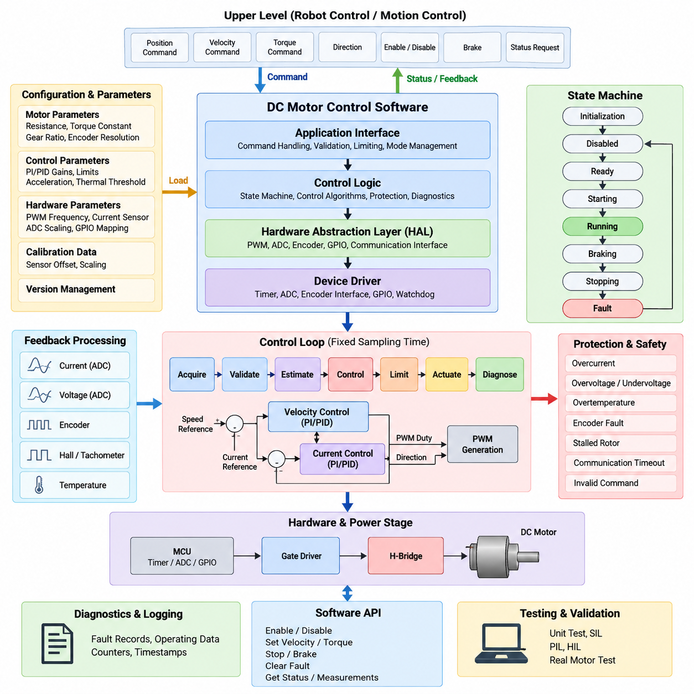
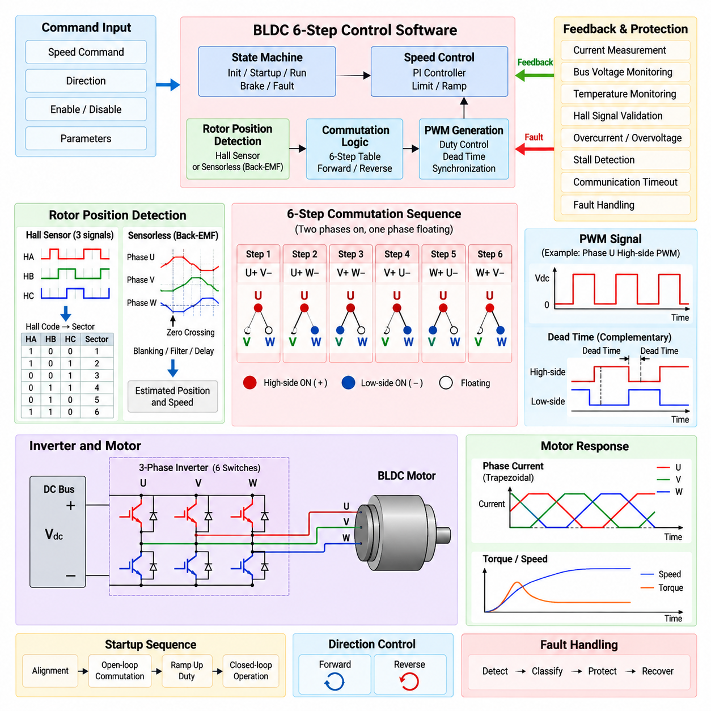
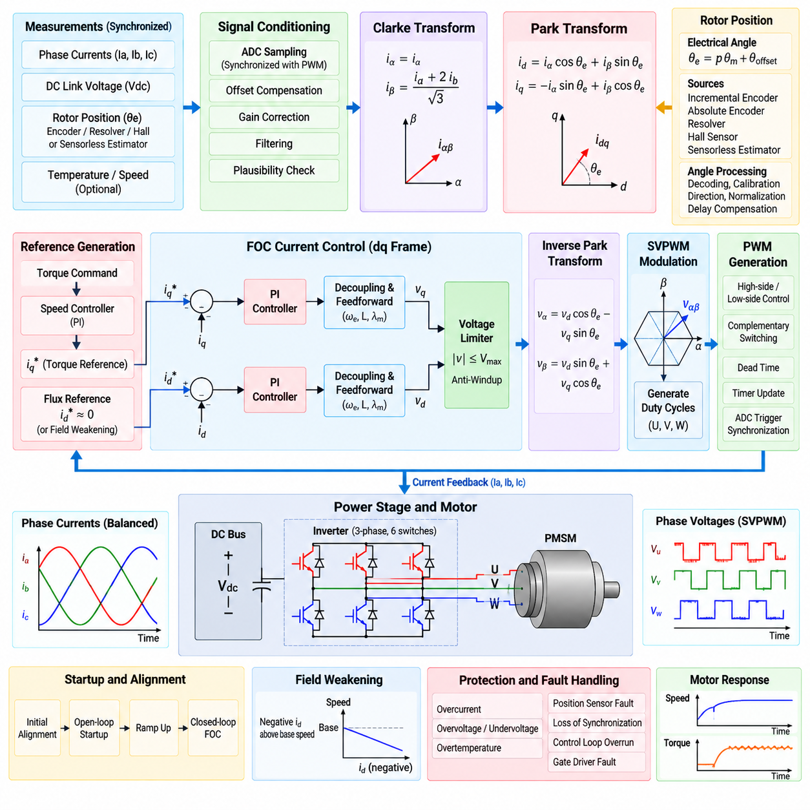
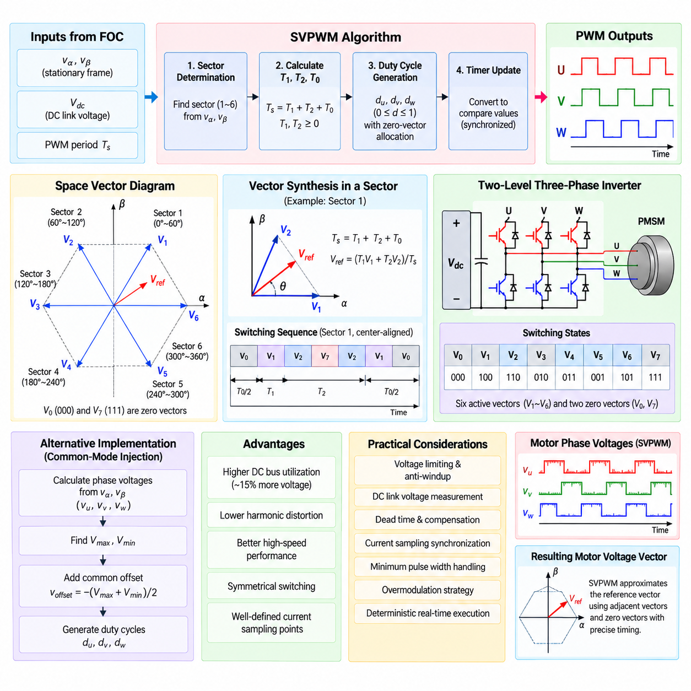
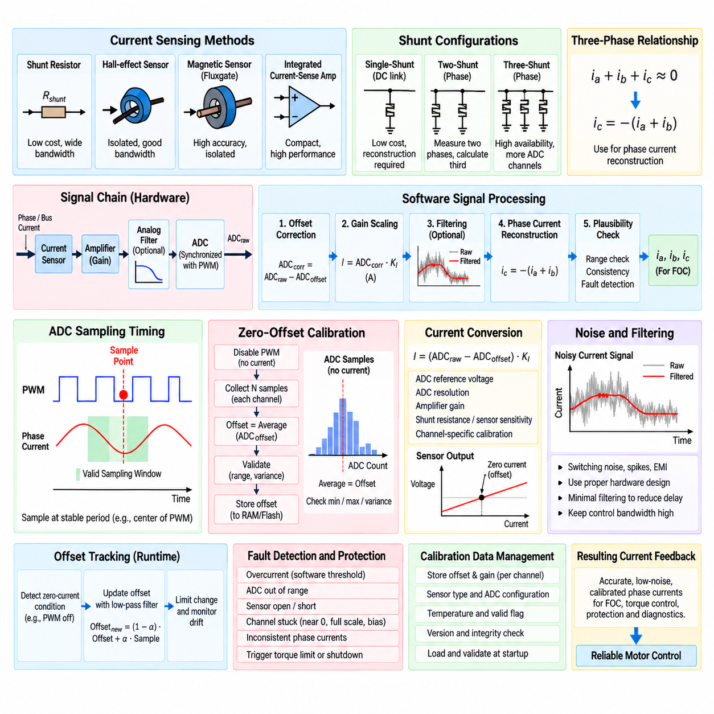
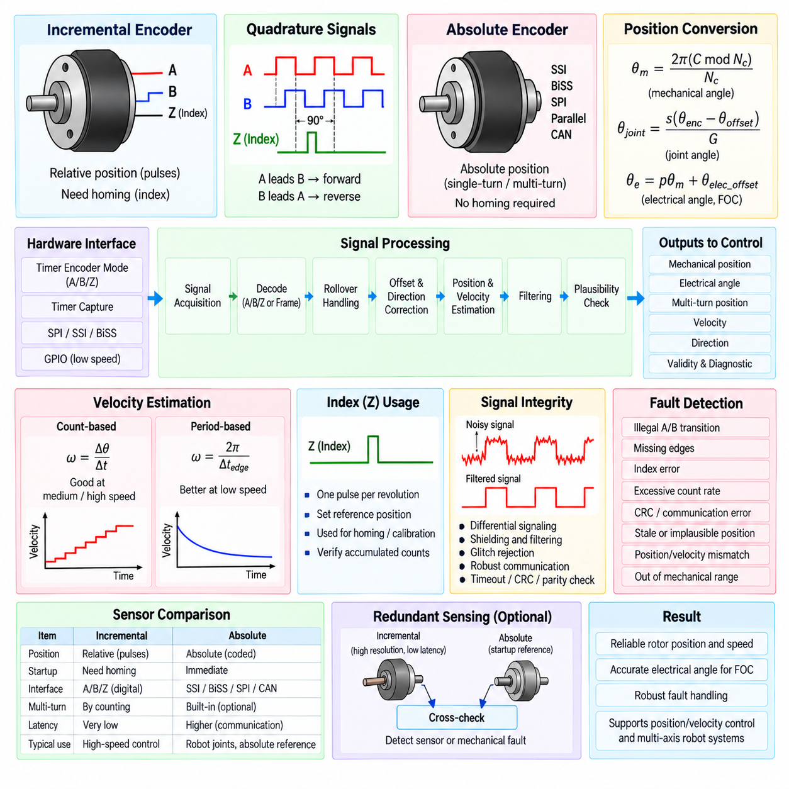
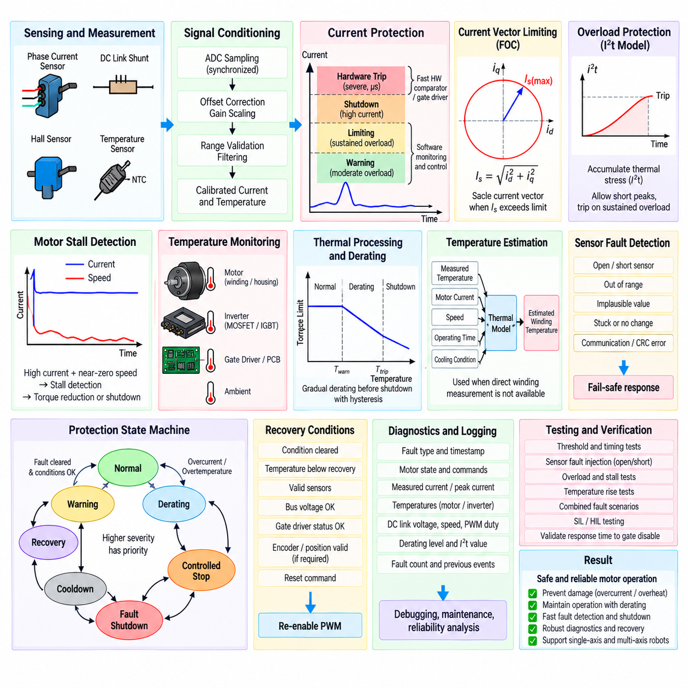
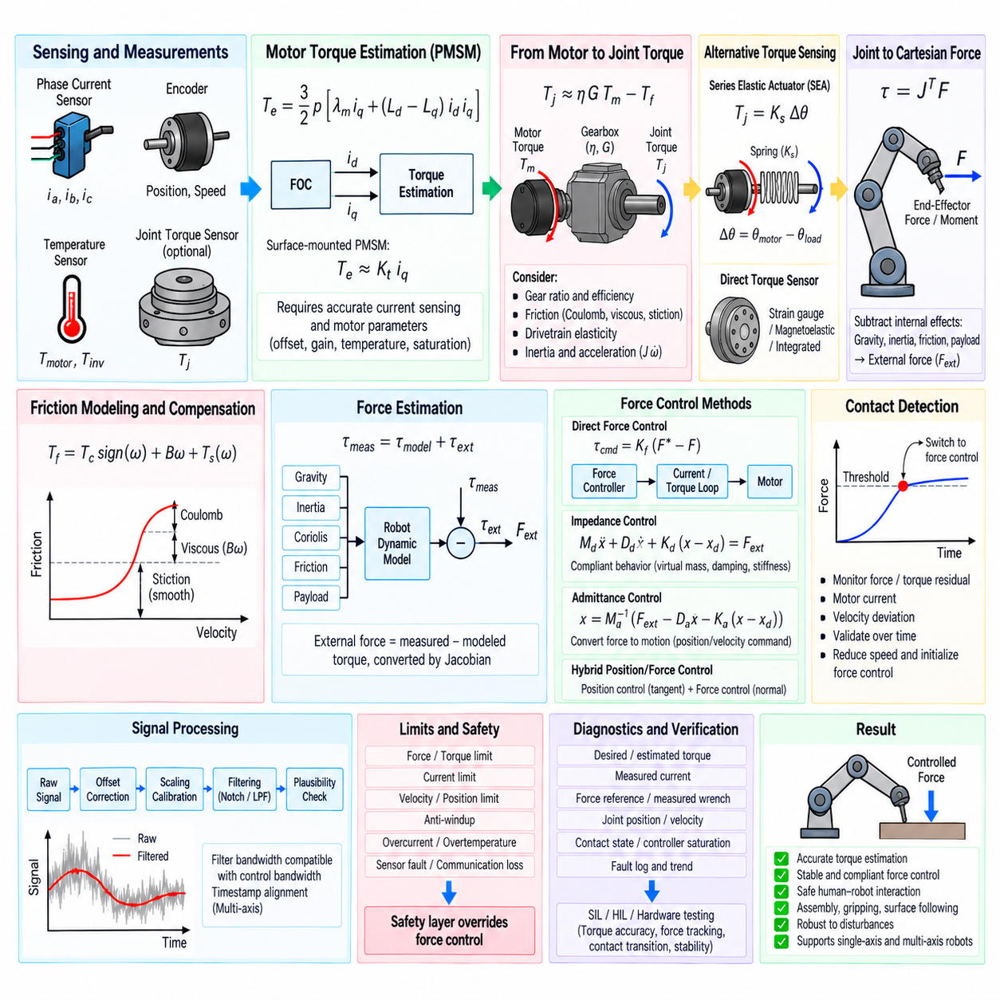
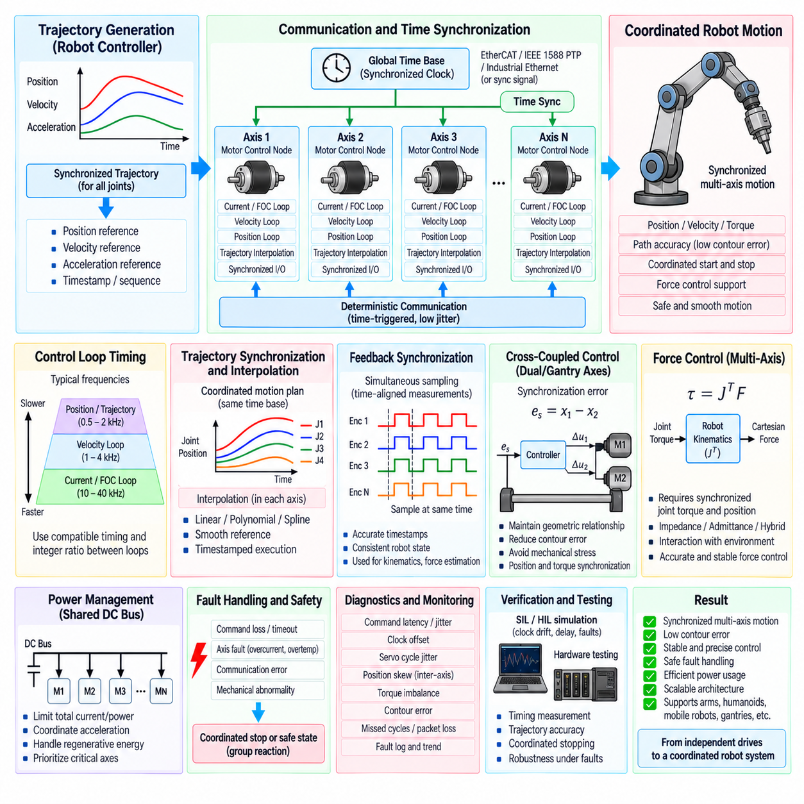
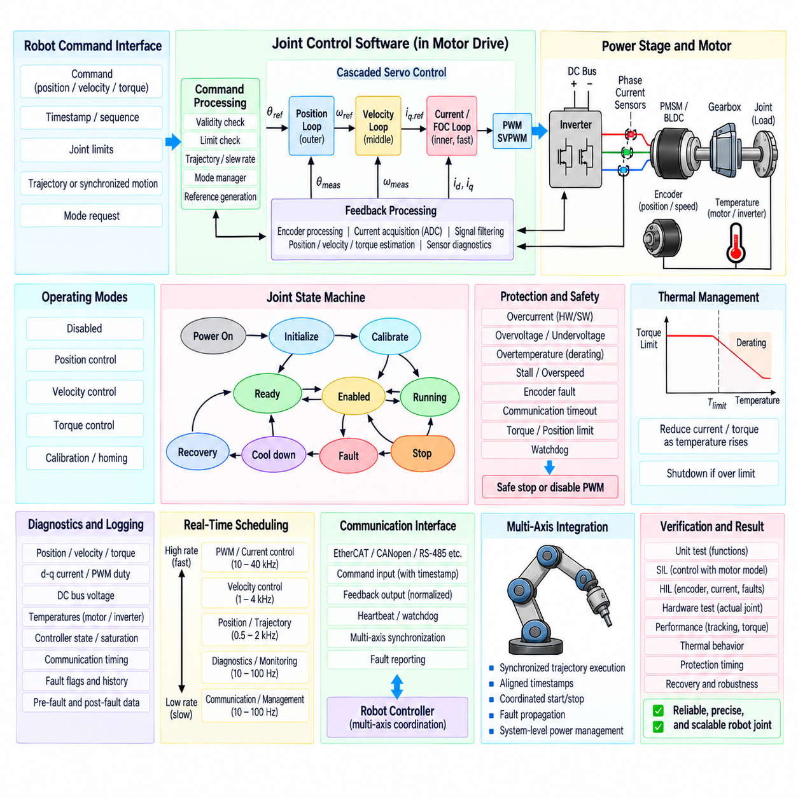

**Volume 04 Robot Control Software**


# 03. Motor Control Software

##  

## 03.01 DC Motor Control Software Structure [w/Code]

{width="7.268055555555556in" height="7.268055555555556in"}

DC motor control software forms the execution layer that converts motion or torque commands into deterministic electrical actuation. Within the robot control software hierarchy, it sits between higher-level motion controllers and hardware-dependent motor drivers. A practical implementation must coordinate command handling, feedback acquisition, control computation, PWM generation, protection logic, diagnostics, and state management while preserving predictable real-time behavior.

The software structure is commonly divided into application interfaces, control logic, hardware abstraction, and device-driver functions. The upper interface receives requested speed, torque, position, direction, enable, and braking commands from motion-control software. These commands should not directly manipulate PWM registers. Instead, they pass through validation, limiting, state checking, and control layers so that hardware behavior remains isolated from application-level decisions.

A motor-control state machine provides the supervisory framework for the complete execution sequence. Typical logical states include initialization, disabled, ready, starting, running, braking, stopping, and fault handling. Transitions are triggered by commands, measured operating conditions, diagnostic events, or safety signals. Explicit state management prevents conflicting actions such as simultaneously requesting forward drive and dynamic braking and makes abnormal transitions easier to detect.

At initialization, the software configures PWM timers, ADC channels, encoder or Hall interfaces, GPIO signals, communication peripherals, watchdogs, and protection inputs. Calibration values and motor parameters are loaded before actuator output is permitted. The control software should verify that measured voltage, current, temperature, and feedback signals are within acceptable startup ranges, while PWM outputs remain disabled until initialization and safety checks have completed successfully.

Command processing converts an external motor request into an internally consistent reference. A signed command can represent rotational direction while its magnitude represents requested voltage, current, torque, or velocity. The software applies saturation, dead-zone compensation, slew-rate limitation, and operating-mode constraints before forwarding the reference to the controller. This prevents abrupt command changes from producing excessive current or mechanical shock in the drivetrain.

For a basic brushed DC motor, actuator output is normally produced through an H-bridge controlled by PWM and direction signals. The software calculates a normalized duty-cycle command and maps it to timer compare values according to the configured PWM period. Direction changes require particular care because immediately reversing bridge polarity while substantial current is flowing can generate severe electrical and mechanical stress. A controlled transition through zero output is therefore normally required.

The control loop should execute at a fixed sampling interval rather than being driven by irregular application events. A timer interrupt or real-time task can trigger acquisition of current, voltage, speed, and position feedback followed by control calculation and PWM update. Fast electrical protection may execute directly in an interrupt or hardware-assisted path, while slower velocity control, thermal monitoring, diagnostics, and communication can operate at lower rates through scheduled tasks.

Feedback processing creates reliable control variables from raw hardware measurements. ADC samples for motor current and bus voltage require offset compensation, scaling, range checking, and often digital filtering. Encoder counts can be transformed into position and rotational velocity, while Hall or tachometer signals may provide lower-cost speed information. Timestamp consistency is important because measurement latency and variable sampling intervals directly affect closed-loop controller performance.

A velocity-controlled DC motor typically compares the requested speed with measured speed and processes the error through a PI or PID controller. The resulting command may represent voltage or PWM duty ratio. Anti-windup should be included because actuator saturation is unavoidable when the requested output exceeds available bus voltage. Feedforward terms can additionally compensate for expected back electromotive force, friction, or known load characteristics and reduce feedback error.

Current control can form a faster inner loop when torque regulation or actuator protection requires greater precision. Because DC motor torque is approximately proportional to armature current within the normal operating region, the current reference can represent a desired torque command. A cascaded structure may therefore use an outer velocity controller to generate the current reference and an inner current controller to regulate PWM, separating mechanical and electrical control dynamics.

The hardware abstraction layer separates control algorithms from MCU-specific peripherals. Functions such as setting PWM duty, enabling the bridge, reading current, obtaining encoder counts, or activating braking should be exposed through stable interfaces rather than scattered register operations. This structure allows the same controller logic to be reused across different microcontrollers, motor-driver ICs, simulation targets, and hardware revisions with limited modification to low-level software.

A representative control cycle can conceptually follow the sequence \`Acquire → Validate → Estimate → Control → Limit → Actuate → Diagnose\`. Sensor values are acquired first and checked for plausibility before being used to calculate velocity, current, or other derived states. The controller generates the requested actuator command, which is then constrained by electrical, thermal, mechanical, and safety limits before the final PWM and bridge-control outputs are written.

Protection logic must remain independent enough to override normal control commands whenever operation becomes unsafe. Overcurrent, overvoltage, undervoltage, excessive temperature, encoder failure, stalled rotor, communication timeout, and invalid command conditions can trigger output limitation or shutdown. Critical faults should disable bridge operation immediately, whereas recoverable conditions may request controlled deceleration or reduced-performance operation according to the defined safety strategy.

Diagnostics should preserve sufficient context to explain why motor behavior changed. Fault identifiers, operating state, requested command, measured speed, current, voltage, temperature, PWM duty, and timestamps can be captured when an abnormal event occurs. Counters for repeated overcurrent events, command timeouts, saturation duration, and startup failures provide useful information for maintenance and reliability analysis without requiring continuous storage of every high-frequency control sample.

Concurrency requires careful design because command interfaces, communication tasks, diagnostic services, and fast control loops may access the same motor state. Shared variables should use atomic operations, protected buffers, or deterministic message exchange where appropriate. The fast control path should avoid dynamic memory allocation, blocking communication, file operations, and unbounded computation. Execution time must remain comfortably below the control period under worst-case operating conditions.

The software API should expose motor behavior rather than hardware implementation details. Operations may include enable, disable, set velocity, set torque, stop, brake, clear recoverable fault, obtain status, and retrieve measurements. Each request should pass through state and range validation. Higher-level robot software can consequently treat the motor controller as a predictable actuator service while low-level switching details remain encapsulated inside the motor-control module.

Configuration data should distinguish immutable hardware characteristics from tunable control parameters. Motor resistance, torque constant, gear ratio, encoder resolution, current-sensor gain, PWM frequency, current limit, velocity limit, controller gains, acceleration limits, and thermal thresholds should be explicitly represented and version controlled. Parameter validation at startup prevents corrupted or incompatible calibration data from silently producing unstable or unsafe actuator behavior.

Testing should mirror the layered software structure. Pure control algorithms can first be verified with unit tests and numerical motor models, followed by software-in-the-loop testing of state transitions and saturation behavior. Processor-in-the-loop and hardware-in-the-loop environments can then verify timing, PWM generation, sensor interfaces, communication loss, and fault reactions before operation with the physical motor and mechanical load. This progression reduces debugging risk during integration.

A reusable implementation benefits from representing each motor as an explicit software object or context containing configuration, measurements, references, controller states, diagnostic flags, and operating state. Functions operate on this context rather than relying heavily on global variables. The same control implementation can then support multiple motors, provided scheduling and hardware resources are assigned deterministically, which becomes important in differential-drive robots and multi-axis systems.

The DC motor controller ultimately acts as a deterministic boundary between abstract robot motion and physical energy conversion. Its quality therefore depends not only on the mathematical controller but also on scheduling, state supervision, signal processing, hardware abstraction, fault containment, parameter traceability, and diagnostics. This layered foundation also prepares the software architecture for the more sophisticated BLDC, PMSM FOC, sensor-processing, protection, and multi-axis topics that follow in the motor-control chapter.

DC 모터 제어 소프트웨어(DC Motor Control Software)는 모션 또는 토크 명령을 결정론적 전기 구동으로 변환하는 실행 계층(Execution Layer)을 구성한다. 로봇 제어 소프트웨어(Robot Control Software) 계층에서 이는 상위 수준 모션 제어기(Motion Controller)와 하드웨어 종속적인 모터 드라이버(Motor Driver) 사이에 위치한다. 실용적인 구현에서는 명령 처리, 피드백 획득, 제어 연산, PWM 생성, 보호 로직, 진단 및 상태 관리를 조정하면서 예측 가능한 실시간 동작(Real-Time Behavior)을 보장해야 한다.

소프트웨어 구조(Software Structure)는 일반적으로 애플리케이션 인터페이스(Application Interface), 제어 로직(Control Logic), 하드웨어 추상화(Hardware Abstraction), 장치 드라이버(Device Driver) 기능으로 구분된다. 상위 인터페이스는 모션 제어 소프트웨어(Motion Control Software)로부터 요구 속도, 토크, 위치, 방향, 활성화 및 제동 명령을 수신한다. 이러한 명령은 PWM 레지스터를 직접 조작하지 않고 검증, 제한, 상태 확인 및 제어 계층을 통과하도록 구성하여 하드웨어 동작과 애플리케이션 수준의 의사결정을 분리해야 한다.

모터 제어 상태 머신(Motor-Control State Machine)은 전체 실행 시퀀스를 관리하는 감독 프레임워크(Supervisory Framework)를 제공한다. 일반적인 논리 상태에는 초기화(Initialization), 비활성화(Disabled), 준비(Ready), 기동(Starting), 운전(Running), 제동(Braking), 정지(Stopping), 고장 처리(Fault Handling)가 포함된다. 상태 전이는 명령, 측정된 운전 조건, 진단 이벤트 또는 안전 신호에 의해 발생한다. 명시적인 상태 관리는 정방향 구동과 동적 제동(Dynamic Braking)을 동시에 요구하는 것과 같은 상충 동작을 방지하고 비정상적인 상태 전이를 쉽게 검출할 수 있도록 한다.

초기화(Initialization) 단계에서 소프트웨어는 PWM 타이머, ADC 채널, 엔코더(Encoder) 또는 홀(Hall) 인터페이스, GPIO 신호, 통신 주변장치, 워치독(Watchdog), 보호 입력을 설정한다. 액추에이터 출력을 허용하기 전에 보정값(Calibration Value)과 모터 파라미터(Motor Parameter)를 로드한다. 제어 소프트웨어는 PWM 출력을 비활성 상태로 유지하면서 측정된 전압, 전류, 온도 및 피드백 신호가 허용 가능한 시작 범위에 있는지 확인해야 하며, 초기화와 안전 점검이 성공적으로 완료된 이후에만 출력을 활성화해야 한다.

명령 처리(Command Processing)는 외부 모터 요구값을 내부적으로 일관된 기준값(Reference)으로 변환한다. 부호가 있는 명령에서 부호는 회전 방향을 나타내고 크기는 요구 전압, 전류, 토크 또는 속도를 나타낼 수 있다. 소프트웨어는 기준값을 제어기에 전달하기 전에 포화(Saturation), 데드존 보상(Dead-Zone Compensation), 변화율 제한(Slew-Rate Limitation), 운전 모드 제약조건을 적용한다. 이를 통해 급격한 명령 변화로 인해 과도한 전류 또는 구동계의 기계적 충격이 발생하는 것을 방지할 수 있다.

기본적인 브러시 DC 모터(Brushed DC Motor)의 액추에이터 출력은 일반적으로 PWM 및 방향 신호로 제어되는 H-브리지(H-Bridge)를 통해 생성된다. 소프트웨어는 정규화된 듀티 사이클(Duty Cycle) 명령을 계산하고 설정된 PWM 주기에 따라 타이머 비교값(Timer Compare Value)으로 변환한다. 상당한 전류가 흐르는 동안 브리지 극성을 즉시 반전하면 심각한 전기적·기계적 스트레스가 발생할 수 있으므로 방향 전환에는 특별한 주의가 필요하다. 따라서 일반적으로 출력을 0으로 제어한 후 방향을 전환하는 절차가 필요하다.

제어 루프(Control Loop)는 불규칙한 애플리케이션 이벤트에 의해 구동되는 대신 고정된 샘플링 주기(Sampling Interval)로 실행되어야 한다. 타이머 인터럽트(Timer Interrupt) 또는 실시간 태스크(Real-Time Task)가 전류, 전압, 속도 및 위치 피드백 획득을 트리거하고 이후 제어 연산과 PWM 업데이트를 수행할 수 있다. 빠른 전기적 보호 기능은 인터럽트 또는 하드웨어 지원 경로에서 직접 실행할 수 있으며, 상대적으로 느린 속도 제어, 열 모니터링, 진단 및 통신은 스케줄링된 태스크를 통해 낮은 주기로 동작할 수 있다.

피드백 처리(Feedback Processing)는 원시 하드웨어 측정값으로부터 신뢰할 수 있는 제어 변수를 생성한다. 모터 전류 및 버스 전압에 대한 ADC 샘플에는 오프셋 보상(Offset Compensation), 스케일링(Scaling), 범위 검사(Range Checking), 그리고 필요한 경우 디지털 필터링(Digital Filtering)이 적용된다. 엔코더 카운트(Encoder Count)는 위치와 회전 속도로 변환할 수 있으며, 홀 센서 또는 타코미터(Tachometer) 신호는 저비용 속도 정보를 제공할 수 있다. 측정 지연과 가변 샘플링 간격은 폐루프 제어기(Closed-Loop Controller)의 성능에 직접적인 영향을 미치므로 타임스탬프 일관성(Timestamp Consistency)이 중요하다.

속도 제어 DC 모터(Velocity-Controlled DC Motor)는 일반적으로 요구 속도와 측정 속도를 비교하고 그 오차를 PI 또는 PID 제어기(PI/PID Controller)를 통해 처리한다. 그 결과로 생성되는 명령은 전압 또는 PWM 듀티 비율을 나타낼 수 있다. 요구 출력이 사용 가능한 버스 전압을 초과하면 액추에이터 포화가 불가피하므로 안티 와인드업(Anti-Windup)을 포함해야 한다. 또한 피드포워드(Feedforward) 항을 이용하여 예상되는 역기전력(Back Electromotive Force), 마찰 또는 알려진 부하 특성을 보상함으로써 피드백 오차를 줄일 수 있다.

토크 조절 또는 액추에이터 보호에 높은 정밀도가 필요한 경우 전류 제어(Current Control)를 더 빠른 내부 루프(Inner Loop)로 구성할 수 있다. 정상적인 동작 영역에서 DC 모터 토크는 전기자 전류(Armature Current)에 거의 비례하기 때문에 전류 기준값(Current Reference)은 요구 토크 명령을 나타낼 수 있다. 따라서 캐스케이드 구조(Cascaded Structure)에서는 외부 속도 제어기(Outer Velocity Controller)가 전류 기준값을 생성하고 내부 전류 제어기가 PWM을 조절하여 기계적 제어 동특성과 전기적 제어 동특성을 분리할 수 있다.

하드웨어 추상화 계층(Hardware Abstraction Layer, HAL)은 제어 알고리즘을 MCU 종속적인 주변장치로부터 분리한다. PWM 듀티 설정, 브리지 활성화, 전류 읽기, 엔코더 카운트 획득 또는 제동 활성화와 같은 기능은 레지스터 연산을 여러 위치에 분산시키는 대신 안정적인 인터페이스를 통해 제공해야 한다. 이러한 구조를 적용하면 저수준 소프트웨어(Low-Level Software)를 제한적으로 수정하는 것만으로 동일한 제어기 로직을 서로 다른 마이크로컨트롤러, 모터 드라이버 IC, 시뮬레이션 타깃 및 하드웨어 개정 버전에서 재사용할 수 있다.

대표적인 제어 사이클(Control Cycle)은 개념적으로 \`Acquire → Validate → Estimate → Control → Limit → Actuate → Diagnose\`의 순서로 구성할 수 있다. 먼저 센서 값을 획득(Acquire)하고 타당성을 검증(Validate)한 후 속도, 전류 또는 기타 파생 상태를 추정(Estimate)한다. 제어기(Control)는 요구 액추에이터 명령을 생성하며, 이 명령은 최종 PWM 및 브리지 제어 출력으로 기록되기 전에 전기적, 열적, 기계적 및 안전 제한조건에 따라 제한(Limit)된다. 이후 구동(Actuate) 결과와 시스템 상태를 진단(Diagnose)한다.

보호 로직(Protection Logic)은 동작이 안전하지 않은 상태가 될 경우 정상적인 제어 명령을 무시할 수 있도록 충분히 독립적으로 구성되어야 한다. 과전류(Overcurrent), 과전압(Overvoltage), 저전압(Undervoltage), 과도한 온도, 엔코더 고장, 로터 구속(Stalled Rotor), 통신 타임아웃(Communication Timeout), 잘못된 명령 조건은 출력 제한 또는 셧다운(Shutdown)을 발생시킬 수 있다. 치명적인 고장은 브리지 동작을 즉시 비활성화해야 하며, 복구 가능한 조건에서는 정의된 안전 전략에 따라 제어 감속 또는 성능 제한 운전을 요청할 수 있다.

진단(Diagnostics)은 모터 동작이 변경된 원인을 설명할 수 있도록 충분한 상황 정보를 보존해야 한다. 비정상 이벤트 발생 시 고장 식별자(Fault Identifier), 운전 상태, 요구 명령, 측정 속도, 전류, 전압, 온도, PWM 듀티 및 타임스탬프를 기록할 수 있다. 반복적인 과전류 이벤트, 명령 타임아웃, 포화 지속시간 및 기동 실패에 대한 카운터는 모든 고주파 제어 샘플을 지속적으로 저장하지 않고도 유지보수와 신뢰성 분석에 유용한 정보를 제공한다.

동시성(Concurrency)은 명령 인터페이스, 통신 태스크, 진단 서비스 및 고속 제어 루프가 동일한 모터 상태에 접근할 수 있기 때문에 신중하게 설계해야 한다. 공유 변수에는 필요에 따라 원자적 연산(Atomic Operation), 보호 버퍼(Protected Buffer) 또는 결정론적 메시지 교환(Deterministic Message Exchange)을 적용해야 한다. 고속 제어 경로에서는 동적 메모리 할당, 블로킹 통신(Blocking Communication), 파일 연산 및 실행시간이 제한되지 않은 연산을 피해야 한다. 최악 조건에서도 실행시간은 제어 주기보다 충분히 짧아야 한다.

소프트웨어 API(Software API)는 하드웨어 구현 세부사항이 아니라 모터 동작을 외부에 제공해야 한다. 대표적인 연산에는 활성화(Enable), 비활성화(Disable), 속도 설정(Set Velocity), 토크 설정(Set Torque), 정지(Stop), 제동(Brake), 복구 가능한 고장 해제(Clear Recoverable Fault), 상태 획득(Get Status), 측정값 획득(Retrieve Measurements)이 포함될 수 있다. 각 요청은 상태 및 범위 검증을 거쳐야 한다. 이를 통해 상위 로봇 소프트웨어는 모터 제어기를 예측 가능한 액추에이터 서비스(Actuator Service)로 취급하고 저수준 스위칭 세부사항은 모터 제어 모듈 내부에 캡슐화할 수 있다.

구성 데이터(Configuration Data)는 변경되지 않는 하드웨어 특성과 조정 가능한 제어 파라미터(Control Parameter)를 구분해야 한다. 모터 저항, 토크 상수(Torque Constant), 기어비(Gear Ratio), 엔코더 분해능(Encoder Resolution), 전류 센서 이득(Current-Sensor Gain), PWM 주파수, 전류 제한, 속도 제한, 제어기 게인(Controller Gain), 가속도 제한 및 열 임계값(Thermal Threshold)을 명시적으로 표현하고 버전 관리해야 한다. 시작 시 파라미터 검증을 수행하면 손상되거나 호환되지 않는 보정 데이터로 인해 불안정하거나 안전하지 않은 액추에이터 동작이 발생하는 것을 방지할 수 있다.

시험(Testing)은 계층화된 소프트웨어 구조를 반영해야 한다. 순수 제어 알고리즘은 먼저 단위 시험(Unit Test)과 수치 모터 모델(Numerical Motor Model)을 이용하여 검증하고, 이후 소프트웨어 인 더 루프(Software-in-the-Loop, SIL)를 통해 상태 전이와 포화 동작을 검증할 수 있다. 프로세서 인 더 루프(Processor-in-the-Loop, PIL)와 하드웨어 인 더 루프(Hardware-in-the-Loop, HIL)를 통해 실제 모터와 기계 부하를 연결하기 전에 타이밍, PWM 생성, 센서 인터페이스, 통신 손실 및 고장 대응을 검증할 수 있다. 이러한 단계적 접근은 통합 과정의 디버깅 위험을 줄인다.

재사용 가능한 구현에서는 각 모터를 구성 정보, 측정값, 기준값, 제어기 상태, 진단 플래그(Diagnostic Flag), 운전 상태를 포함하는 명시적인 소프트웨어 객체(Software Object) 또는 컨텍스트(Context)로 표현하는 것이 효과적이다. 함수는 전역 변수(Global Variable)에 과도하게 의존하지 않고 이러한 컨텍스트를 대상으로 동작한다. 스케줄링과 하드웨어 자원이 결정론적으로 할당된다면 동일한 제어 구현으로 여러 모터를 지원할 수 있으며, 이는 차동 구동 로봇(Differential-Drive Robot)과 다축 시스템(Multi-Axis System)에서 특히 중요하다.

DC 모터 제어기(DC Motor Controller)는 궁극적으로 추상적인 로봇 모션과 물리적 에너지 변환 사이의 결정론적 경계(Deterministic Boundary) 역할을 한다. 따라서 그 품질은 수학적 제어기뿐 아니라 스케줄링, 상태 감독, 신호 처리, 하드웨어 추상화, 고장 격리(Fault Containment), 파라미터 추적성(Parameter Traceability), 진단에 의해 결정된다. 이러한 계층형 기반은 이후 모터 제어 장에서 다루는 BLDC, PMSM 벡터 제어(Field-Oriented Control, FOC), 센서 신호 처리, 보호 기능 및 다축 제어(Multi-Axis Control)와 같은 보다 복잡한 기술을 위한 소프트웨어 아키텍처 기반을 제공한다.

##  

## 03.02 BLDC 6-Step Control Implementation [w/Code]

{width="7.268055555555556in" height="7.268055555555556in"}

Brushless DC (BLDC) six-step control is a commutation method that energizes two motor phases at a time while leaving the third phase electrically floating. The inverter advances through six discrete switching states during each electrical revolution, producing an approximately trapezoidal phase-current pattern. The software implementation must coordinate rotor-position detection, commutation sequencing, PWM generation, direction control, startup behavior, current regulation, protection, and timing with deterministic execution.

A three-phase BLDC drive normally consists of phases U, V, and W connected to a six-switch inverter containing three high-side and three low-side power devices. At each commutation step, one phase is connected toward the positive DC bus, another toward the negative bus, and the remaining phase is floating. Software selects the appropriate switch combination while ensuring that complementary devices in the same inverter leg are never simultaneously activated.

The six commutation states correspond to six 60-degree electrical sectors. A typical forward sequence can be represented conceptually as U+V−, U+W−, V+W−, V+U−, W+U−, and W+V−. After the sixth state, the sequence returns to the first state. Reverse rotation is obtained by traversing the commutation sequence in the opposite order rather than simply reversing a single output signal.

Rotor position determines when the controller should advance from one commutation state to the next. Hall-sensored BLDC motors commonly provide three digital Hall signals whose valid combinations identify rotor sectors. The software reads the three inputs as a compact Hall code, validates the code, maps it to the corresponding commutation state, and updates the inverter outputs. Invalid combinations such as all-zero or all-one states should be treated as diagnostic conditions.

Hall transitions can be processed using GPIO interrupts or captured by timer peripherals. Interrupt-driven processing minimizes commutation latency because the inverter state can be updated immediately after a rotor-sector transition. The software should nevertheless reject implausibly fast transitions, detect missing transitions, and verify that the observed Hall sequence agrees with the requested direction. These checks provide basic detection of wiring faults, sensor failures, and stalled operation.

Commutation output should be implemented through a predefined switching table rather than scattered conditional statements. Each table entry identifies the sourcing phase, sinking phase, floating phase, and associated PWM configuration for one electrical sector. A table-driven implementation improves execution-time predictability and makes forward and reverse sequences easier to inspect, test, and modify while keeping switching behavior separate from higher-level speed-control logic.

PWM controls the average voltage applied to the energized windings and therefore influences motor current, torque, and speed. Depending on the gate-driver and inverter strategy, PWM may be applied to the active high-side device, active low-side device, or both using complementary switching. The software converts a normalized voltage or torque request into timer compare values while respecting minimum and maximum duty-cycle limits and the characteristics of the power stage.

Dead time is required when complementary switches share the same inverter leg. During a switching transition, the conducting device must turn off before its complementary device is allowed to turn on. Without sufficient dead time, both devices can conduct simultaneously and create a destructive shoot-through current across the DC bus. Dead-time generation should preferably use dedicated timer hardware, while software configuration ensures that the value matches the switching-device and gate-driver characteristics.

The commutation process and PWM update must be synchronized carefully. Changing phase states at arbitrary points within a PWM cycle can produce unwanted switching pulses, current spikes, or inconsistent output timing. Advanced timers can preload compare and output-mode registers and apply them at defined update events. This allows the software to calculate the next switching configuration while hardware performs the actual transition at a deterministic PWM boundary.

Startup requires special handling because rotor motion may initially be absent and sensorless feedback may therefore be unavailable. With Hall sensors, the initial Hall state can identify the rotor sector and permit immediate selection of a valid commutation state. The controller can then increase duty cycle gradually using a startup ramp. Excessive initial duty should be avoided because a stationary motor has no back electromotive force and can draw substantial current.

For sensorless six-step control, startup generally begins with rotor alignment followed by an open-loop commutation sequence. The controller energizes a known phase combination to establish an initial rotor orientation and then advances the commutation states with progressively changing timing until sufficient speed is reached. Once reliable back electromotive force information becomes available, the software transitions from open-loop startup to closed-loop sensorless commutation.

Sensorless operation commonly observes the back electromotive force of the floating phase. During each commutation sector, the unenergized phase voltage changes as the rotor moves, and its crossing relative to a virtual or measured neutral reference can be used to estimate rotor position. Because the zero crossing does not directly represent the ideal commutation instant, the software normally applies an electrical-angle delay before advancing to the next switching state.

Back-EMF processing requires filtering and blanking because inverter switching produces substantial electrical noise. Immediately after commutation, the floating-phase measurement can contain switching transients that would cause false zero-crossing detection. A blanking interval temporarily suppresses detection, after which ADC or comparator measurements are evaluated. Digital filtering, hysteresis, and timing plausibility checks can further improve robustness without introducing excessive phase delay.

Speed estimation can be derived from Hall-transition periods, commutation intervals, or back-EMF events. The controller measures elapsed timer counts between valid rotor events and converts electrical frequency into mechanical rotational speed using the motor pole-pair count. At low speed, period measurement generally provides better resolution than counting transitions within a fixed interval. Filtering should balance noise reduction against the response required by the outer speed-control loop.

A closed-loop speed controller compares the requested rotational speed with the estimated speed and generates a duty-cycle or current reference. PI control is commonly sufficient for six-step drives, provided output saturation and anti-windup are implemented. Acceleration and deceleration limits should be applied to the reference so that large command steps do not produce abrupt torque changes, excessive current, wheel slip, or mechanical shock when the motor is integrated into a robot drivetrain.

Current measurement provides both control information and critical hardware protection. Depending on the inverter design, current may be measured using a DC-link shunt, low-side phase shunts, or individual phase sensors. Software performs offset correction, scaling, filtering, and plausibility checks before using the measurement. Because current sampling is affected by PWM switching states, ADC triggering should be synchronized to a region where the current signal is sufficiently stable.

Current limiting can operate independently of the slower speed loop. When measured current approaches the configured limit, the controller can reduce PWM duty or constrain the speed-controller output. Severe overcurrent should bypass normal regulation and activate a fast protection path implemented through hardware comparator logic or a high-priority interrupt. This distinction between control limiting and emergency shutdown prevents normal transient loads from being treated identically to dangerous electrical faults.

Direction reversal should be treated as a controlled state transition. Immediately changing from the forward commutation table to the reverse table while the rotor is spinning can produce large regenerative current and mechanical stress. The software should reduce torque, decelerate toward an acceptable speed, disable or brake the inverter according to system requirements, and only then enable the reverse commutation sequence. State-machine supervision makes this sequence deterministic.

Fault handling must cover invalid Hall states, incorrect Hall sequence, commutation timeout, motor stall, overcurrent, DC-bus overvoltage or undervoltage, excessive motor or inverter temperature, gate-driver faults, and command timeout. Each fault should be classified according to severity and recovery policy. Critical electrical faults immediately disable PWM, while recoverable conditions may permit controlled stopping, limited operation, or restart after explicit validation.

A reusable implementation separates the fast commutation path from supervisory and communication functions. High-priority interrupt routines handle Hall transitions, timer events, ADC synchronization, and immediate protection, while periodic control tasks calculate speed, PI output, thermal limits, and diagnostic status. Lower-priority software manages commands, parameter updates, logging, and external interfaces. This separation prevents communication latency from disturbing switching and control timing.

The resulting six-step controller forms a structured chain from command input through speed control, duty calculation, rotor-sector detection, commutation lookup, PWM generation, inverter switching, motor response, and feedback acquisition. Although six-step control is simpler than field-oriented control, robust robot deployment still requires precise timing, synchronized sensing, safe switching, deterministic state management, and comprehensive diagnostics. These principles provide the software foundation for subsequent PMSM FOC and SVPWM implementations.

브러시리스 DC(BLDC) 6-스텝 제어(Six-Step Control)는 한 번에 두 개의 모터 상(Phase)을 여자하고 나머지 하나의 상은 전기적으로 부유 상태(Floating)로 유지하는 정류 방식(Commutation Method)이다. 인버터(Inverter)는 한 번의 전기적 회전(Electrical Revolution) 동안 여섯 개의 개별 스위칭 상태를 순차적으로 진행하며, 대략적인 사다리꼴 형태의 상전류(Phase Current) 패턴을 생성한다. 소프트웨어 구현에서는 회전자 위치 검출, 정류 시퀀스, PWM 생성, 방향 제어, 기동 동작, 전류 조절, 보호 및 타이밍을 결정론적으로 조정해야 한다.

3상 BLDC 구동 시스템은 일반적으로 U, V, W 상과 세 개의 하이사이드(High-Side) 및 세 개의 로우사이드(Low-Side) 전력 소자로 구성된 6-스위치 인버터(Six-Switch Inverter)로 이루어진다. 각 정류 단계에서 하나의 상은 양의 DC 버스(Positive DC Bus)에 연결되고, 다른 하나는 음의 버스에 연결되며, 나머지 상은 부유 상태가 된다. 소프트웨어는 동일한 인버터 레그(Inverter Leg)의 상보 소자가 동시에 활성화되지 않도록 보장하면서 적절한 스위치 조합을 선택한다.

여섯 개의 정류 상태(Commutation State)는 각각 60도의 전기적 섹터(Electrical Sector)에 대응한다. 일반적인 정방향 시퀀스는 개념적으로 U+V−, U+W−, V+W−, V+U−, W+U−, W+V−로 표현할 수 있다. 여섯 번째 상태 이후에는 다시 첫 번째 상태로 돌아간다. 역방향 회전은 단순히 하나의 출력 신호를 반전하는 방식이 아니라 정류 시퀀스(Commutation Sequence)를 반대 순서로 진행하여 구현한다.

회전자 위치(Rotor Position)는 제어기가 하나의 정류 상태에서 다음 상태로 전환해야 하는 시점을 결정한다. 홀 센서 기반(Hall-Sensored) BLDC 모터는 일반적으로 세 개의 디지털 홀 신호(Digital Hall Signal)를 제공하며, 이들의 유효한 조합을 통해 회전자 섹터를 식별한다. 소프트웨어는 세 입력을 하나의 홀 코드(Hall Code)로 읽고 유효성을 검증한 후 해당 정류 상태로 매핑하여 인버터 출력을 갱신한다. 모든 신호가 0이거나 1인 것과 같은 잘못된 조합은 진단 조건(Diagnostic Condition)으로 처리해야 한다.

홀 전이(Hall Transition)는 GPIO 인터럽트(GPIO Interrupt) 또는 타이머 캡처(Timer Capture) 주변장치를 사용하여 처리할 수 있다. 인터럽트 기반 처리는 회전자 섹터가 변경된 직후 인버터 상태를 갱신할 수 있으므로 정류 지연(Commutation Latency)을 최소화한다. 소프트웨어는 비정상적으로 빠른 전이를 거부하고 누락된 전이를 검출하며 관측된 홀 시퀀스가 요구된 회전 방향과 일치하는지 확인해야 한다. 이러한 검사를 통해 배선 오류, 센서 고장 및 모터 구속 상태를 기본적으로 검출할 수 있다.

정류 출력(Commutation Output)은 여러 조건문을 분산하여 구현하기보다 사전에 정의된 스위칭 테이블(Switching Table)을 이용하여 구현하는 것이 바람직하다. 각 테이블 항목은 하나의 전기적 섹터에 대해 전류를 공급하는 상(Sourcing Phase), 전류를 흡수하는 상(Sinking Phase), 부유 상(Floating Phase), 관련 PWM 구성을 정의한다. 테이블 기반 구현은 실행시간의 예측 가능성을 높이고 정방향 및 역방향 시퀀스를 쉽게 검사, 시험 및 수정할 수 있도록 하며 스위칭 동작을 상위 속도 제어 로직과 분리한다.

PWM은 여자된 권선(Energized Winding)에 인가되는 평균 전압을 제어하므로 모터 전류, 토크 및 속도에 영향을 미친다. 게이트 드라이버(Gate Driver)와 인버터 전략에 따라 PWM은 활성 하이사이드 소자, 활성 로우사이드 소자 또는 상보 스위칭(Complementary Switching)을 이용하여 양쪽에 적용할 수 있다. 소프트웨어는 정규화된 전압 또는 토크 요구값을 타이머 비교값(Timer Compare Value)으로 변환하면서 최소 및 최대 듀티 사이클(Duty Cycle) 제한과 전력단(Power Stage)의 특성을 준수해야 한다.

동일한 인버터 레그에 상보 스위치가 존재하는 경우 데드타임(Dead Time)이 필요하다. 스위칭 전환 과정에서 현재 도통 중인 소자가 먼저 꺼진 후에 상보 소자가 켜져야 한다. 충분한 데드타임이 없으면 두 소자가 동시에 도통하여 DC 버스 양단에 파괴적인 관통 전류(Shoot-Through Current)가 발생할 수 있다. 데드타임 생성은 가능한 경우 전용 타이머 하드웨어를 사용하고, 소프트웨어는 스위칭 소자와 게이트 드라이버 특성에 적합한 값을 설정해야 한다.

정류 과정과 PWM 갱신은 주의 깊게 동기화(Synchronization)되어야 한다. PWM 사이클의 임의 시점에서 상 상태를 변경하면 원하지 않는 스위칭 펄스, 전류 스파이크 또는 불일치한 출력 타이밍이 발생할 수 있다. 고급 타이머(Advanced Timer)는 비교 레지스터와 출력 모드 레지스터를 사전 로드(Preload)한 후 정의된 업데이트 이벤트에서 적용할 수 있다. 이를 통해 소프트웨어는 다음 스위칭 구성을 미리 계산하고 하드웨어가 결정론적인 PWM 경계에서 실제 전환을 수행하도록 할 수 있다.

기동(Startup)은 초기에는 회전자 움직임이 없고 센서리스 피드백(Sensorless Feedback)을 사용할 수 없을 수 있기 때문에 별도의 처리가 필요하다. 홀 센서를 사용하는 경우 초기 홀 상태를 통해 회전자 섹터를 식별하여 즉시 유효한 정류 상태를 선택할 수 있다. 이후 제어기는 기동 램프(Startup Ramp)를 이용하여 듀티 사이클을 점진적으로 증가시킬 수 있다. 정지된 모터에는 역기전력(Back Electromotive Force)이 존재하지 않아 상당한 전류가 흐를 수 있으므로 과도한 초기 듀티는 피해야 한다.

센서리스 6-스텝 제어(Sensorless Six-Step Control)의 기동은 일반적으로 회전자 정렬(Rotor Alignment) 이후 개루프 정류 시퀀스(Open-Loop Commutation Sequence)를 수행하는 방식으로 시작한다. 제어기는 알려진 상 조합을 여자하여 초기 회전자 방향을 설정한 후 충분한 속도에 도달할 때까지 타이밍을 점진적으로 변경하면서 정류 상태를 진행한다. 신뢰할 수 있는 역기전력 정보가 확보되면 소프트웨어는 개루프 기동에서 폐루프 센서리스 정류(Closed-Loop Sensorless Commutation)로 전환한다.

센서리스 동작에서는 일반적으로 부유 상의 역기전력(Back-EMF)을 관측한다. 각 정류 섹터에서 비여자 상(Unenergized Phase)의 전압은 회전자의 움직임에 따라 변화하며, 가상 또는 측정된 중성점 기준(Virtual or Measured Neutral Reference)에 대한 전압 교차를 이용하여 회전자 위치를 추정할 수 있다. 영점 교차(Zero Crossing)는 이상적인 정류 시점을 직접 나타내지 않기 때문에 소프트웨어는 일반적으로 다음 스위칭 상태로 진행하기 전에 전기각 지연(Electrical-Angle Delay)을 적용한다.

역기전력 처리(Back-EMF Processing)에는 인버터 스위칭으로 상당한 전기적 노이즈가 발생하기 때문에 필터링(Filtering)과 블랭킹(Blanking)이 필요하다. 정류 직후 부유 상 측정값에는 잘못된 영점 교차 검출을 유발할 수 있는 스위칭 과도현상(Switching Transient)이 포함될 수 있다. 블랭킹 구간(Blanking Interval)에서는 일시적으로 검출을 억제하고 이후 ADC 또는 비교기(Comparator) 측정값을 평가한다. 디지털 필터링, 히스테리시스(Hysteresis), 타이밍 타당성 검사를 추가하여 과도한 위상 지연 없이 강건성을 향상할 수 있다.

속도 추정(Speed Estimation)은 홀 전이 주기, 정류 간격 또는 역기전력 이벤트를 이용하여 계산할 수 있다. 제어기는 유효한 회전자 이벤트 사이의 경과 타이머 카운트(Elapsed Timer Count)를 측정하고 모터의 극쌍 수(Pole-Pair Count)를 이용하여 전기적 주파수를 기계적 회전 속도로 변환한다. 저속 영역에서는 고정된 시간 동안 전이 횟수를 계산하는 방식보다 주기 측정(Period Measurement)이 일반적으로 더 높은 분해능을 제공한다. 필터링은 노이즈 감소와 외부 속도 제어 루프에 필요한 응답성 사이에서 균형을 유지해야 한다.

폐루프 속도 제어기(Closed-Loop Speed Controller)는 요구 회전 속도와 추정 속도를 비교하여 듀티 사이클 또는 전류 기준값(Current Reference)을 생성한다. 출력 포화(Output Saturation)와 안티 와인드업(Anti-Windup)을 구현한다면 PI 제어(PI Control)는 일반적인 6-스텝 구동에서 충분히 활용할 수 있다. 큰 명령 변화로 인해 급격한 토크 변화, 과전류, 휠 슬립 또는 로봇 구동계의 기계적 충격이 발생하지 않도록 기준값에 가속 및 감속 제한을 적용해야 한다.

전류 측정(Current Measurement)은 제어 정보뿐 아니라 중요한 하드웨어 보호 정보도 제공한다. 인버터 설계에 따라 전류는 DC 링크 션트(DC-Link Shunt), 로우사이드 상 션트(Low-Side Phase Shunt) 또는 개별 상 전류 센서를 이용하여 측정할 수 있다. 소프트웨어는 측정값을 사용하기 전에 오프셋 보정, 스케일링, 필터링 및 타당성 검사를 수행한다. 전류 샘플링은 PWM 스위칭 상태의 영향을 받기 때문에 ADC 트리거를 전류 신호가 충분히 안정적인 구간과 동기화해야 한다.

전류 제한(Current Limiting)은 상대적으로 느린 속도 루프와 독립적으로 동작할 수 있다. 측정 전류가 설정된 제한값에 접근하면 제어기는 PWM 듀티를 감소시키거나 속도 제어기의 출력을 제한할 수 있다. 심각한 과전류(Overcurrent)는 정상적인 제어 루프를 우회하여 하드웨어 비교기 로직 또는 높은 우선순위 인터럽트로 구현된 고속 보호 경로(Fast Protection Path)를 활성화해야 한다. 이러한 제어 제한과 비상 셧다운(Emergency Shutdown)의 구분은 정상적인 과도 부하와 위험한 전기적 고장을 서로 다르게 처리할 수 있도록 한다.

방향 전환(Direction Reversal)은 제어된 상태 전이(Controlled State Transition)로 처리해야 한다. 회전자가 회전 중인 상태에서 정방향 정류 테이블을 즉시 역방향 테이블로 변경하면 큰 회생 전류(Regenerative Current)와 기계적 스트레스가 발생할 수 있다. 소프트웨어는 토크를 감소시키고 허용 가능한 속도까지 감속한 후 시스템 요구사항에 따라 인버터를 비활성화하거나 제동하고, 그 이후에 역방향 정류 시퀀스를 활성화해야 한다. 상태 머신(State Machine)을 통한 감독은 이러한 절차를 결정론적으로 수행할 수 있도록 한다.

고장 처리(Fault Handling)는 잘못된 홀 상태, 잘못된 홀 시퀀스, 정류 타임아웃(Commutation Timeout), 모터 구속(Motor Stall), 과전류, DC 버스 과전압 또는 저전압, 과도한 모터 또는 인버터 온도, 게이트 드라이버 고장 및 명령 타임아웃을 포함해야 한다. 각 고장은 심각도와 복구 정책(Recovery Policy)에 따라 분류해야 한다. 치명적인 전기적 고장은 PWM을 즉시 비활성화하고, 복구 가능한 조건에서는 제어 정지, 제한 운전 또는 명시적인 검증 이후 재시작을 허용할 수 있다.

재사용 가능한 구현(Reusable Implementation)은 고속 정류 경로(Fast Commutation Path)를 감독 및 통신 기능과 분리한다. 높은 우선순위 인터럽트 루틴(High-Priority Interrupt Routine)은 홀 전이, 타이머 이벤트, ADC 동기화 및 즉각적인 보호 기능을 처리하고, 주기적 제어 태스크는 속도, PI 출력, 열 제한 및 진단 상태를 계산한다. 낮은 우선순위 소프트웨어는 명령, 파라미터 업데이트, 로깅 및 외부 인터페이스를 관리한다. 이러한 분리는 통신 지연이 스위칭 및 제어 타이밍에 영향을 주는 것을 방지한다.

최종적으로 6-스텝 제어기(Six-Step Controller)는 명령 입력에서 시작하여 속도 제어, 듀티 계산, 회전자 섹터 검출, 정류 테이블 조회(Commutation Lookup), PWM 생성, 인버터 스위칭, 모터 응답 및 피드백 획득으로 이어지는 구조적인 제어 체인(Control Chain)을 형성한다. 6-스텝 제어는 자속 기준 제어(Field-Oriented Control, FOC)보다 단순하지만, 로봇 시스템에 강건하게 적용하려면 정밀한 타이밍, 동기화된 센싱, 안전한 스위칭, 결정론적 상태 관리 및 포괄적인 진단이 필요하다. 이러한 원칙은 이후의 PMSM FOC 및 공간 벡터 PWM(Space Vector PWM, SVPWM) 구현을 위한 소프트웨어 기반을 제공한다.

##  

## 03.03 PMSM FOC Algorithm: Clark / Park Transform [w/Code]

{width="7.268055555555556in" height="7.268055555555556in"}

A Permanent Magnet Synchronous Motor (PMSM) controlled by Field-Oriented Control (FOC) is regulated by transforming three-phase electrical quantities into a rotating reference frame aligned with the rotor magnetic field. This approach converts the coupled AC motor-control problem into two approximately independent DC control channels. The direct-axis current controls magnetic flux, while the quadrature-axis current primarily controls electromagnetic torque.

The FOC software pipeline begins with synchronized acquisition of phase currents, DC-link voltage, rotor electrical position, and optional temperature or speed signals. Current measurements must be sampled at deterministic points relative to PWM switching because inverter transitions introduce noise and measurement distortion. Offset compensation, gain correction, plausibility checking, and filtering are normally completed before measured currents enter the coordinate transformations.

For a balanced three-phase PMSM, the phase currents satisfy approximately \\(i_a+i_b+i_c=0\\). Consequently, only two independent current components are required to represent the stator current vector. The Clarke transform converts the measured three-phase quantities from the stationary \\(abc\\) system into the two-axis stationary \\(\\alpha\\beta\\) reference frame, significantly simplifying subsequent vector calculations while preserving the electrical information needed for control.

A commonly used amplitude-invariant Clarke transform expresses the stationary components as \\(i_\\alpha=i_a\\) and \\(i_\\beta=(i_a+2i_b)/\\sqrt{3}\\), assuming the zero-sequence component is negligible. Equivalent matrix forms can use all three phase measurements. The implementation must maintain one consistent transform convention throughout current sensing, Park transformation, inverse transformation, modulation, and motor-model calculations.

The \\(\\alpha\\beta\\) current vector remains stationary with respect to the stator, while the PMSM rotor magnetic field rotates continuously. Direct regulation in this stationary frame would therefore require controllers to track sinusoidally varying quantities. The Park transform solves this problem by rotating the \\(\\alpha\\beta\\) coordinate system according to the instantaneous rotor electrical angle, producing the rotating direct-quadrature \\(dq\\) reference frame.

Using one common sign convention, the Park transform is expressed as \\(i_d=i_\\alpha\\cos\\theta_e+i_\\beta\\sin\\theta_e\\) and \\(i_q=-i_\\alpha\\sin\\theta_e+i_\\beta\\cos\\theta_e\\). Here, \\(\\theta_e\\) is the rotor electrical angle. When the reference frame is correctly aligned, \\(i_d\\) represents the current component parallel to rotor flux and \\(i_q\\) represents the perpendicular component responsible for producing useful electromagnetic torque.

The electrical rotor angle differs from the mechanical rotor angle according to the number of pole pairs. It is generally calculated as \\(\\theta_e=p\\theta_m+\\theta_{offset}\\), where \\(p\\) is the pole-pair count and \\(\\theta_{offset}\\) represents the calibrated electrical alignment offset. Incorrect pole-pair configuration, encoder direction, or offset produces incorrect \\(dq\\) alignment and can cause poor torque production, excessive current, vibration, or unstable control.

Rotor position can be obtained from incremental encoders, absolute encoders, resolvers, Hall sensors, or sensorless estimators. High-performance FOC requires sufficiently accurate electrical-angle information because transformation error directly couples the d-axis and q-axis quantities. Position acquisition therefore includes sensor decoding, angle normalization, direction handling, electrical-zero calibration, validity monitoring, and compensation for sampling or computational delay where necessary.

After the Park transform, the measured \\(i_d\\) and \\(i_q\\) values are compared with their references. For many surface-mounted PMSM applications below the field-weakening region, the d-axis reference is approximately zero while the q-axis reference is generated from the requested torque. Two independent PI current controllers then calculate the required \\(v_d\\) and \\(v_q\\) voltage commands, allowing flux and torque to be regulated independently.

The q-axis current reference can be generated directly from a torque request or indirectly by an outer velocity controller. In a cascaded speed-control structure, the velocity PI controller compares requested and measured rotor speed and produces \\(i_q\^\*\\). The current controller executes at a substantially higher frequency than the velocity loop so that electrical dynamics are regulated rapidly while the outer loop responds to slower mechanical dynamics.

Current-controller performance can be improved using decoupling and feedforward terms derived from the PMSM voltage equations. Rotating-frame dynamics contain cross-coupling terms involving electrical speed, inductance, current, and permanent-magnet flux. Compensating these terms reduces interaction between the d and q channels and improves dynamic response, particularly when the motor operates at higher electrical speeds where back electromotive force becomes significant.

The requested \\(v_d\\) and \\(v_q\\) cannot exceed the voltage that the inverter can generate from the available DC-link voltage. A voltage-vector limiter therefore constrains the command magnitude before modulation. When saturation occurs, PI integrators require anti-windup handling to prevent accumulated error from causing delayed recovery or excessive transient response. Voltage limiting becomes especially important as motor speed approaches the available inverter voltage boundary.

Once the rotating-frame voltage commands are determined, the inverse Park transform converts them back into stationary coordinates. Using the corresponding convention, \\(v_\\alpha=v_d\\cos\\theta_e-v_q\\sin\\theta_e\\) and \\(v_\\beta=v_d\\sin\\theta_e+v_q\\cos\\theta_e\\). The resulting stationary voltage vector can then be supplied to a modulation algorithm such as Space Vector PWM (SVPWM), which generates three-phase inverter duty cycles.

SVPWM or another modulation stage converts \\(v_\\alpha\\) and \\(v_\\beta\\) into duty ratios for the U, V, and W inverter legs. PWM timers then control the high-side and low-side switching devices while enforcing complementary switching and dead time. Current ADC triggering should be synchronized with these PWM timers so that sensing, transformation, control computation, and actuator update operate as one deterministic real-time sequence.

A typical fast FOC cycle can therefore be represented conceptually as current sampling, offset correction, Clarke transform, rotor-angle acquisition, Park transform, d-q current error calculation, PI regulation, decoupling, voltage limiting, inverse Park transform, modulation, and PWM update. The entire sequence must complete within the assigned control period, with bounded execution time and sufficiently low timing jitter to preserve current-loop stability.

The implementation should separate the high-frequency FOC interrupt from slower supervisory software. The fast interrupt performs ADC acquisition, coordinate transformations, current regulation, voltage limiting, and PWM generation. Lower-frequency tasks can execute velocity control, thermal derating, command processing, diagnostics, parameter management, communication, and logging. This multi-rate architecture prevents noncritical operations from disturbing current-control timing.

Numerical implementation requires particular attention on embedded processors. Floating-point MCUs can execute trigonometric and vector operations directly, while fixed-point systems may use lookup tables, coordinate rotation digital computer algorithms, or scaled integer arithmetic. Regardless of representation, angle wrapping, saturation, division protection, scaling consistency, numerical overflow, and execution-time bounds must be explicitly handled in production motor-control software.

Startup and electrical-angle alignment are essential before closed-loop FOC operation begins. The controller may apply a controlled d-axis current to align the rotor with a known stator field, establish the electrical zero offset, and then transition into torque-producing q-axis control. Systems using absolute position sensors may reduce this procedure, but sensor orientation and electrical alignment still require validation before significant torque is commanded.

Field weakening extends operation beyond the nominal base-speed region when the back electromotive force approaches the inverter voltage limit. The controller introduces an appropriate negative d-axis current to reduce effective air-gap flux and preserve voltage margin. This mode requires current and voltage constraints because additional d-axis current consumes part of the inverter and motor current capability that would otherwise be available for torque production.

Protection remains active independently of normal FOC calculations. Excessive phase current, DC-link overvoltage or undervoltage, inverter temperature, motor temperature, position-sensor failure, loss of synchronization, invalid current measurements, control-loop overrun, and gate-driver faults should trigger predefined responses. Critical faults must disable torque generation rapidly, while supervisory logic records diagnostic information and manages controlled recovery where permitted.

The resulting PMSM FOC implementation forms a continuous transformation and control chain from three-phase physical measurements to mathematically decoupled \\(dq\\) quantities and back to three-phase inverter actuation. Clarke and Park transformations are therefore not isolated mathematical operations but central interfaces connecting sensing, rotor position, current regulation, voltage control, and PWM generation. This architecture provides the foundation for the following SVPWM implementation and advanced robot joint motor-control functions.

영구자석 동기 모터(Permanent Magnet Synchronous Motor, PMSM)를 자속 기준 제어(Field-Oriented Control, FOC)로 제어할 때는 3상 전기량을 회전자 자기장(Rotor Magnetic Field)에 정렬된 회전 기준 좌표계(Rotating Reference Frame)로 변환하여 제어한다. 이 방식은 서로 결합된 교류 모터 제어 문제를 거의 독립적인 두 개의 직류 제어 채널로 변환한다. 직축 전류(Direct-Axis Current)는 자속을 제어하고, 횡축 전류(Quadrature-Axis Current)는 주로 전자기 토크를 제어한다.

FOC 소프트웨어 파이프라인(Software Pipeline)은 상전류(Phase Current), DC 링크 전압(DC-Link Voltage), 회전자 전기각(Rotor Electrical Position), 그리고 선택적으로 온도 또는 속도 신호를 동기화하여 획득하는 과정에서 시작한다. 인버터 전환은 노이즈와 측정 왜곡을 발생시키므로 전류는 PWM 스위칭에 대해 결정론적인 시점에서 샘플링해야 한다. 측정된 전류가 좌표 변환에 입력되기 전에 오프셋 보상(Offset Compensation), 이득 보정(Gain Correction), 타당성 검사(Plausibility Checking), 필터링(Filtering)을 수행한다.

평형 3상 PMSM(Balanced Three-Phase PMSM)의 상전류는 대략 \\(i_a+i_b+i_c=0\\)의 관계를 만족한다. 따라서 고정자 전류 벡터(Stator Current Vector)를 표현하는 데 두 개의 독립적인 전류 성분만 필요하다. 클라크 변환(Clarke Transform)은 측정된 3상 전기량을 정지 \\(abc\\) 좌표계에서 2축 정지 \\(\\alpha\\beta\\) 기준 좌표계로 변환하여, 제어에 필요한 전기적 정보를 유지하면서 이후의 벡터 연산을 크게 단순화한다.

일반적으로 사용되는 진폭 불변 클라크 변환(Amplitude-Invariant Clarke Transform)은 영순분(Zero-Sequence Component)을 무시할 수 있다고 가정할 때 \\(i_\\alpha=i_a\\), \\(i_\\beta=(i_a+2i_b)/\\sqrt{3}\\)로 표현할 수 있다. 세 개의 상전류 측정값을 모두 사용하는 동등한 행렬 형태도 적용할 수 있다. 구현 과정에서는 전류 센싱, 파크 변환(Park Transform), 역변환(Inverse Transform), 변조(Modulation), 모터 모델 계산 전체에 걸쳐 하나의 일관된 변환 규약(Transform Convention)을 유지해야 한다.

\\(\\alpha\\beta\\) 전류 벡터는 고정자에 대해 정지된 좌표계에 존재하지만 PMSM의 회전자 자기장은 지속적으로 회전한다. 따라서 이 정지 좌표계에서 직접 제어하면 제어기가 정현파 형태로 변화하는 전기량을 계속 추종해야 한다. 파크 변환(Park Transform)은 순간 회전자 전기각에 따라 \\(\\alpha\\beta\\) 좌표계를 회전시켜 이러한 문제를 해결하며, 그 결과 회전하는 직축-횡축 \\(dq\\) 기준 좌표계(Direct-Quadrature Reference Frame)를 생성한다.

일반적인 부호 규약(Sign Convention) 중 하나에서 파크 변환은 \\(i_d=i_\\alpha\\cos\\theta_e+i_\\beta\\sin\\theta_e\\), \\(i_q=-i_\\alpha\\sin\\theta_e+i_\\beta\\cos\\theta_e\\)로 표현된다. 여기서 \\(\\theta_e\\)는 회전자 전기각(Rotor Electrical Angle)이다. 기준 좌표계가 정확하게 정렬되면 \\(i_d\\)는 회전자 자속과 평행한 전류 성분을 나타내며, \\(i_q\\)는 회전자 자속에 수직이고 유효한 전자기 토크 생성에 기여하는 전류 성분을 나타낸다.

전기적 회전자 각(Electrical Rotor Angle)은 극쌍 수(Pole-Pair Count)에 따라 기계적 회전자 각(Mechanical Rotor Angle)과 달라진다. 일반적으로 \\(\\theta_e=p\\theta_m+\\theta_{offset}\\)으로 계산하며, 여기서 \\(p\\)는 극쌍 수이고 \\(\\theta_{offset}\\)은 보정된 전기적 정렬 오프셋(Electrical Alignment Offset)을 나타낸다. 잘못된 극쌍 설정, 엔코더 방향 또는 오프셋은 부정확한 \\(dq\\) 정렬을 발생시켜 토크 저하, 과도한 전류, 진동 또는 불안정한 제어를 유발할 수 있다.

회전자 위치(Rotor Position)는 증분형 엔코더(Incremental Encoder), 절대형 엔코더(Absolute Encoder), 리졸버(Resolver), 홀 센서(Hall Sensor) 또는 센서리스 추정기(Sensorless Estimator)를 통해 획득할 수 있다. 고성능 FOC에서는 전기각 정보의 정확도가 중요하다. 변환 각도의 오차가 d축과 q축 전기량 사이의 결합을 직접 발생시키기 때문이다. 따라서 위치 획득 과정에는 센서 디코딩, 각도 정규화, 방향 처리, 전기적 영점 보정, 유효성 감시 및 필요한 경우 샘플링 또는 계산 지연 보상이 포함된다.

파크 변환 이후 측정된 \\(i_d\\)와 \\(i_q\\)는 각각의 기준값과 비교된다. 자속 약화 영역(Field-Weakening Region) 이하에서 동작하는 많은 표면부착형 PMSM(Surface-Mounted PMSM)에서는 d축 기준값을 대략 0으로 설정하고 q축 기준값은 요구 토크로부터 생성한다. 두 개의 독립적인 PI 전류 제어기(PI Current Controller)는 필요한 \\(v_d\\)와 \\(v_q\\) 전압 명령을 계산하여 자속과 토크를 독립적으로 제어할 수 있도록 한다.

q축 전류 기준값(Q-Axis Current Reference)은 토크 요구값으로부터 직접 생성하거나 외부 속도 제어기(Outer Velocity Controller)를 통해 간접적으로 생성할 수 있다. 캐스케이드 속도 제어 구조(Cascaded Speed-Control Structure)에서는 속도 PI 제어기가 요구 회전 속도와 측정된 회전 속도를 비교하여 \\(i_q\^\*\\)를 생성한다. 전류 제어기는 속도 루프보다 훨씬 높은 주파수에서 실행하여 전기적 동특성을 빠르게 제어하고 외부 루프는 상대적으로 느린 기계적 동특성에 대응하도록 한다.

전류 제어기의 성능은 PMSM 전압 방정식에서 유도된 디커플링(Decoupling) 및 피드포워드(Feedforward) 항을 이용하여 향상할 수 있다. 회전 좌표계의 동특성에는 전기적 속도, 인덕턴스, 전류 및 영구자석 자속과 관련된 교차 결합 항(Cross-Coupling Term)이 존재한다. 이러한 항을 보상하면 d축과 q축 채널 사이의 상호작용을 줄이고, 특히 역기전력(Back Electromotive Force)이 증가하는 높은 전기적 속도에서 동적 응답을 향상할 수 있다.

요구되는 \\(v_d\\)와 \\(v_q\\)는 사용 가능한 DC 링크 전압으로 인버터가 생성할 수 있는 전압을 초과할 수 없다. 따라서 변조 전에 전압 벡터 제한기(Voltage-Vector Limiter)를 사용하여 명령 크기를 제한한다. 포화(Saturation)가 발생하면 누적된 오차가 복귀 지연이나 과도한 과도응답을 발생시키지 않도록 PI 적분기에 안티 와인드업(Anti-Windup)을 적용해야 한다. 모터 속도가 사용 가능한 인버터 전압 한계에 접근할수록 전압 제한은 더욱 중요해진다.

회전 좌표계의 전압 명령이 결정되면 역 파크 변환(Inverse Park Transform)을 이용하여 다시 정지 좌표계로 변환한다. 동일한 규약에 따르면 \\(v_\\alpha=v_d\\cos\\theta_e-v_q\\sin\\theta_e\\), \\(v_\\beta=v_d\\sin\\theta_e+v_q\\cos\\theta_e\\)로 표현할 수 있다. 생성된 정지 전압 벡터(Stationary Voltage Vector)는 이후 공간 벡터 PWM(Space Vector PWM, SVPWM)과 같은 변조 알고리즘으로 전달되어 3상 인버터 듀티 사이클을 생성한다.

SVPWM 또는 다른 변조 단계(Modulation Stage)는 \\(v_\\alpha\\)와 \\(v_\\beta\\)를 U, V, W 인버터 레그(Inverter Leg)의 듀티 비율로 변환한다. PWM 타이머는 상보 스위칭(Complementary Switching)과 데드타임(Dead Time)을 적용하면서 하이사이드 및 로우사이드 스위칭 소자를 제어한다. 전류 ADC 트리거는 PWM 타이머와 동기화하여 센싱, 좌표 변환, 제어 계산 및 액추에이터 갱신이 하나의 결정론적인 실시간 시퀀스(Deterministic Real-Time Sequence)로 동작하도록 해야 한다.

일반적인 고속 FOC 사이클(Fast FOC Cycle)은 개념적으로 전류 샘플링, 오프셋 보정, 클라크 변환, 회전자 각도 획득, 파크 변환, d-q 전류 오차 계산, PI 제어, 디커플링, 전압 제한, 역 파크 변환, 변조 및 PWM 갱신 순서로 구성할 수 있다. 전체 시퀀스는 할당된 제어 주기(Control Period) 내에서 완료되어야 하며, 전류 루프 안정성을 유지하기 위해 실행시간이 제한되어야 하고 타이밍 지터(Timing Jitter)는 충분히 작아야 한다.

구현에서는 고주파 FOC 인터럽트(High-Frequency FOC Interrupt)와 상대적으로 느린 감독 소프트웨어(Supervisory Software)를 분리해야 한다. 고속 인터럽트에서는 ADC 획득, 좌표 변환, 전류 제어, 전압 제한 및 PWM 생성을 수행한다. 낮은 주기의 태스크에서는 속도 제어, 열 디레이팅(Thermal Derating), 명령 처리, 진단, 파라미터 관리, 통신 및 로깅을 실행할 수 있다. 이러한 다중 주기 아키텍처(Multi-Rate Architecture)는 중요도가 낮은 연산이 전류 제어 타이밍을 방해하는 것을 방지한다.

임베디드 프로세서(Embedded Processor)에서 수치 구현(Numerical Implementation)을 수행할 때는 특별한 주의가 필요하다. 부동소수점 MCU(Floating-Point MCU)는 삼각함수와 벡터 연산을 직접 실행할 수 있지만, 고정소수점 시스템(Fixed-Point System)은 룩업 테이블(Lookup Table), 좌표 회전 디지털 컴퓨터(Coordinate Rotation Digital Computer, CORDIC) 알고리즘 또는 스케일된 정수 연산을 사용할 수 있다. 어떤 표현 방식을 사용하더라도 각도 래핑, 포화, 0 나눗셈 방지, 스케일 일관성, 수치 오버플로 및 실행시간 한계를 명시적으로 처리해야 한다.

폐루프 FOC 동작을 시작하기 전에 기동(Startup)과 전기각 정렬(Electrical-Angle Alignment)이 필수적이다. 제어기는 제어된 d축 전류를 인가하여 회전자를 알려진 고정자 자기장 방향에 정렬하고 전기적 영점 오프셋(Electrical Zero Offset)을 설정한 후 토크를 생성하는 q축 제어로 전환할 수 있다. 절대 위치 센서(Absolute Position Sensor)를 사용하는 시스템에서는 이러한 절차를 단순화할 수 있지만, 상당한 토크를 요구하기 전에 센서 방향과 전기적 정렬을 반드시 검증해야 한다.

자속 약화(Field Weakening)는 역기전력이 인버터 전압 한계에 접근할 때 정격 기본 속도(Base Speed) 이상의 운전 영역을 확장한다. 제어기는 적절한 음의 d축 전류(Negative D-Axis Current)를 인가하여 유효 공극 자속(Effective Air-Gap Flux)을 감소시키고 전압 여유를 확보한다. 추가적인 d축 전류가 토크 생성에 사용할 수 있는 인버터 및 모터 전류 용량의 일부를 소비하므로 이 운전 모드에서는 전류와 전압 제약조건을 함께 고려해야 한다.

보호 기능(Protection)은 정상적인 FOC 계산과 독립적으로 항상 활성화되어야 한다. 과도한 상전류, DC 링크 과전압 또는 저전압, 인버터 온도, 모터 온도, 위치 센서 고장, 동기 상실(Loss of Synchronization), 잘못된 전류 측정값, 제어 루프 오버런(Control-Loop Overrun), 게이트 드라이버 고장 등을 감지하여 사전에 정의된 대응을 수행해야 한다. 치명적인 고장은 토크 생성을 신속하게 비활성화하고, 감독 로직은 진단 정보를 기록하며 허용되는 경우 제어된 복구 절차를 관리한다.

최종적인 PMSM FOC 구현은 3상의 물리적 측정값을 수학적으로 디커플링된 \\(dq\\) 전기량으로 변환하고 다시 3상 인버터 구동으로 되돌리는 연속적인 변환 및 제어 체인(Transformation and Control Chain)을 형성한다. 따라서 클라크 변환과 파크 변환은 독립적인 수학 연산이 아니라 센싱, 회전자 위치, 전류 제어, 전압 제어 및 PWM 생성을 연결하는 핵심 인터페이스이다. 이러한 아키텍처는 이후의 SVPWM 구현과 고급 로봇 관절 모터 제어(Robot Joint Motor Control) 기능을 위한 기반을 제공한다.

##  

## 03.04 SVPWM Generation Algorithm [w/Code]

{width="7.268055555555556in" height="7.268055555555556in"}

Space Vector Pulse Width Modulation (SVPWM) converts a commanded stator voltage vector into three inverter duty cycles for a three-phase motor drive. In a PMSM Field-Oriented Control architecture, it normally receives the stationary-frame voltage references \\(v_\\alpha\\) and \\(v_\\beta\\) produced by the inverse Park transform. The algorithm determines how the inverter switching states should be combined during each PWM period to approximate the requested voltage vector.

A conventional two-level three-phase inverter contains six controlled switches arranged as three complementary legs for phases U, V, and W. Each leg can connect its phase approximately to the positive or negative DC bus, producing eight possible switching combinations. Six combinations generate nonzero active voltage vectors, while two combinations produce zero voltage vectors because all three upper or all three lower switching devices have equivalent states.

The six active vectors are separated by 60 electrical degrees and form a hexagonal space-vector diagram in the stationary \\(\\alpha\\beta\\) plane. The requested voltage vector rotates within this plane as the motor electrical angle evolves. SVPWM first identifies which of the six sectors contains the requested vector and then synthesizes that vector using the two adjacent active vectors together with one or both zero vectors during the current PWM period.

If the reference vector lies in sector \\(k\\), it can be represented over one switching period \\(T_s\\) by applying adjacent vectors \\(V_k\\) and \\(V_{k+1}\\) for durations \\(T_1\\) and \\(T_2\\), respectively. The remaining interval is assigned to the zero-vector duration \\(T_0\\), giving the fundamental timing relation \\(T_s=T_1+T_2+T_0\\). This time-domain decomposition is the central computational principle of SVPWM.

Sector identification can be implemented from the signs and relative magnitudes of \\(v_\\alpha\\), \\(v_\\beta\\), or from three intermediate phase-like quantities derived from the reference vector. A production implementation should avoid unnecessary inverse trigonometric calculations because only the sector and timing information are required. Sign tests, comparisons, or precomputed relationships generally provide deterministic execution with lower computational cost.

Within a sector, the active-vector times are determined by the magnitude and angular location of the requested voltage vector relative to the neighboring inverter vectors. Conceptually, \\(T_1\\) and \\(T_2\\) are proportional to the projections needed to reconstruct the reference vector. Their values must remain nonnegative and satisfy the available PWM-period constraint. Numerical clipping should prevent rounding errors from producing invalid negative or excessive timing values.

The zero-vector interval \\(T_0\\) is normally distributed symmetrically around the active-vector intervals. A center-aligned sequence may apply part of the zero-vector time, the first active vector, the second active vector, and the remaining zero-vector time before executing the mirrored sequence. Symmetrical switching reduces waveform asymmetry and provides predictable sampling locations for phase-current acquisition.

For example, a conceptual switching sequence in the first sector can progress through \\(V_0\\), \\(V_1\\), \\(V_2\\), \\(V_7\\), and then return through \\(V_2\\), \\(V_1\\), and \\(V_0\\). Adjacent switching states are selected so that only a limited number of inverter devices change state at each transition. This arrangement reduces unnecessary switching activity while maintaining a symmetrical voltage waveform over the PWM period.

After \\(T_1\\), \\(T_2\\), and \\(T_0\\) are calculated, the algorithm converts these durations into phase duty ratios \\(d_u\\), \\(d_v\\), and \\(d_w\\). The exact equations depend on the identified sector and selected switching sequence. The duty ratios are normalized to the PWM period and then converted into timer compare values used by the MCU PWM peripheral to generate the three inverter-leg commands.

Another practical SVPWM implementation calculates preliminary three-phase voltage references from \\(v_\\alpha\\) and \\(v_\\beta\\) and then injects an appropriate common-mode voltage. The maximum and minimum phase references are identified, and a common offset is added so that all three commands fit efficiently inside the available DC-bus range. This method can generate duty cycles equivalent to classical sector-based SVPWM while reducing explicit sector-dependent calculations.

One major advantage of SVPWM compared with simple sinusoidal PWM is improved utilization of the available DC-link voltage. By appropriately distributing zero-vector time and introducing common-mode voltage, SVPWM can generate a larger fundamental voltage magnitude before entering overmodulation. This additional voltage capability is valuable at higher motor speeds, where back electromotive force consumes an increasing fraction of the available inverter voltage.

The modulation index represents the relationship between the requested voltage magnitude and the voltage capability of the inverter. Within the linear modulation region, duty cycles vary continuously and the commanded fundamental voltage is reproduced predictably. When the requested vector exceeds the linear SVPWM boundary, the algorithm must limit the voltage vector or deliberately enter a defined overmodulation strategy rather than allowing uncontrolled duty-cycle saturation.

Voltage limiting should therefore occur before or as part of SVPWM generation. In a FOC system, the \\(v_d\\) and \\(v_q\\) command vector is typically constrained according to the measured DC-link voltage before the inverse Park transform or modulation stage. If saturation occurs, the current-controller integrators require coordinated anti-windup behavior so that unavailable voltage commands do not accumulate and degrade transient recovery.

DC-link voltage measurement is important because the conversion from requested phase voltage to PWM duty ratio depends on the actual supply voltage. Battery-powered robots can experience substantial bus-voltage variation as state of charge, load current, and regenerative operation change. Using a filtered and validated \\(V_{dc}\\) measurement allows the modulation stage to preserve the intended voltage command despite these operating variations.

PWM timer configuration strongly influences the software implementation. Center-aligned PWM is frequently used because it produces symmetrical switching patterns and offers useful current-sampling points. Timer preload registers allow newly calculated duty values to become active simultaneously at a defined update event. Without synchronized updates, different phases could temporarily use duty values from different control cycles and generate an unintended voltage vector.

Complementary gate signals require dead time between high-side and low-side switching transitions. SVPWM calculates ideal phase duty ratios, while the timer and gate-control layer translates them into physically safe switching signals. Dead time should normally be inserted by dedicated timer hardware. Excessive dead time causes voltage distortion, whereas insufficient dead time increases the risk of shoot-through, so configuration must reflect the actual inverter switching characteristics.

Dead-time distortion becomes more significant at low commanded voltage because the inserted delay represents a larger fraction of the effective pulse width. Its influence also depends on current direction. Advanced motor-control software may estimate this voltage error and apply dead-time compensation to the phase-voltage command or duty cycles. Compensation should be bounded carefully because incorrect current polarity information can otherwise increase distortion rather than reduce it.

Current sampling must be coordinated with the SVPWM switching pattern. Depending on the shunt topology, some switching states provide valid current-measurement windows while others make one or more phase currents difficult to reconstruct. The modulation software can expose timing information to the ADC scheduler so that samples are triggered near stable portions of the PWM cycle and away from switching edges, dead-time intervals, and transient noise.

At very small duty ratios, the available current-sampling window may become shorter than the ADC acquisition and conversion requirements. The software may then enforce minimum pulse widths, shift sampling points, modify the switching sequence, or reconstruct unavailable phase current from the other measurements using \\(i_u+i_v+i_w=0\\). These constraints make modulation and current sensing tightly coupled in practical FOC implementations.

A deterministic implementation places SVPWM inside the high-frequency motor-control loop. After current acquisition, Clarke and Park transforms, current PI control, voltage limiting, and inverse Park transformation, the SVPWM function receives \\(v_\\alpha\\), \\(v_\\beta\\), and \\(V_{dc}\\). It calculates the phase duties and writes them to PWM preload registers before the control deadline, allowing hardware to activate all updated values simultaneously.

The SVPWM function should validate all inputs before generating timer commands. Nonfinite voltage values, invalid DC-link measurements, arithmetic overflow, duty ratios outside the permitted range, or execution overruns must not propagate directly to the inverter. Output values should be saturated to defined safe limits, while serious calculation or synchronization failures should request controlled shutdown through the motor-control protection mechanism.

Software optimization is particularly important when many motor axes execute FOC simultaneously. Sector determination, duty calculation, saturation, and timer conversion should use bounded operations with predictable execution time. Floating-point processors can perform these calculations directly, while fixed-point implementations require carefully defined scaling and saturation. Avoiding unnecessary trigonometric functions is beneficial because the inverse Park stage has already produced the required stationary vector components.

Verification should include mathematical, software, and hardware behavior. Unit tests can sweep \\(v_\\alpha\\) and \\(v_\\beta\\) across all six sectors and verify continuity, sector transitions, duty bounds, zero-vector allocation, and voltage saturation. SIL and HIL tests can verify PWM timing, DC-link variation, current-sampling synchronization, dead time, and fault behavior before the modulation software is connected to a high-power inverter and physical PMSM.

SVPWM ultimately forms the actuator-side bridge between the continuous voltage vector calculated by FOC and the discrete switching states available from a three-phase inverter. Its quality depends on correct sector geometry, timing calculation, DC-bus normalization, synchronized timer updates, safe dead-time handling, and coordinated current sampling. A robust implementation therefore treats modulation, sensing, PWM hardware, and protection as one tightly synchronized real-time subsystem.

공간 벡터 펄스 폭 변조(Space Vector Pulse Width Modulation, SVPWM)는 요구된 고정자 전압 벡터(Stator Voltage Vector)를 3상 모터 구동을 위한 세 개의 인버터 듀티 사이클(Inverter Duty Cycle)로 변환한다. PMSM 자속 기준 제어(Field-Oriented Control, FOC) 아키텍처에서는 일반적으로 역 파크 변환(Inverse Park Transform)에서 생성된 정지 좌표계 전압 기준값 \\(v_\\alpha\\)와 \\(v_\\beta\\)를 입력으로 받는다. 알고리즘은 각 PWM 주기 동안 인버터 스위칭 상태를 어떻게 조합하여 요구 전압 벡터를 근사할 것인지 결정한다.

일반적인 2레벨 3상 인버터(Two-Level Three-Phase Inverter)는 U, V, W 상에 대응하는 세 개의 상보 레그(Complementary Leg)에 배치된 여섯 개의 제어 스위치로 구성된다. 각 레그는 해당 상을 양의 DC 버스 또는 음의 DC 버스에 연결할 수 있으므로 총 여덟 개의 스위칭 조합이 가능하다. 이 중 여섯 개의 조합은 0이 아닌 활성 전압 벡터(Active Voltage Vector)를 생성하고, 나머지 두 조합은 세 개의 상측 또는 하측 스위칭 소자가 동일한 상태를 가지므로 영 전압 벡터(Zero Voltage Vector)를 생성한다.

여섯 개의 활성 벡터는 서로 60 전기각(Electrical Degree) 간격으로 배치되어 정지 \\(\\alpha\\beta\\) 평면에서 육각형 공간 벡터 다이어그램(Hexagonal Space-Vector Diagram)을 형성한다. 요구 전압 벡터는 모터 전기각의 변화에 따라 이 평면에서 회전한다. SVPWM은 먼저 요구 벡터가 여섯 개 섹터 중 어느 곳에 위치하는지 판별하고, 해당 PWM 주기 동안 인접한 두 활성 벡터와 하나 또는 두 개의 영 벡터를 이용하여 요구 벡터를 합성한다.

기준 벡터(Reference Vector)가 섹터 \\(k\\)에 위치하면 하나의 스위칭 주기 \\(T_s\\) 동안 인접 벡터 \\(V_k\\)와 \\(V_{k+1}\\)를 각각 \\(T_1\\), \\(T_2\\) 시간 동안 인가하여 표현할 수 있다. 남은 시간은 영 벡터 시간(Zero-Vector Duration) \\(T_0\\)에 할당되며, 기본적인 타이밍 관계는 \\(T_s=T_1+T_2+T_0\\)가 된다. 이러한 시간 영역 분해(Time-Domain Decomposition)가 SVPWM 연산의 핵심 원리이다.

섹터 판별(Sector Identification)은 \\(v_\\alpha\\), \\(v_\\beta\\)의 부호와 상대적인 크기를 이용하거나 기준 벡터에서 유도한 세 개의 중간 상 전압 형태의 값을 이용하여 구현할 수 있다. 실제 제품 구현에서는 섹터와 타이밍 정보만 필요하므로 불필요한 역삼각함수(Inverse Trigonometric Function) 연산을 피하는 것이 바람직하다. 부호 검사, 비교 연산 또는 사전에 계산된 관계를 사용하면 더 낮은 계산 비용으로 결정론적인 실행이 가능하다.

각 섹터 내부에서 활성 벡터 시간 \\(T_1\\)과 \\(T_2\\)는 인접한 인버터 벡터에 대한 요구 전압 벡터의 크기와 각도 위치에 따라 결정된다. 개념적으로 \\(T_1\\)과 \\(T_2\\)는 기준 벡터를 재구성하는 데 필요한 투영 성분(Projections)에 비례한다. 두 값은 항상 0 이상이어야 하며 사용 가능한 PWM 주기 제약조건을 만족해야 한다. 수치 연산의 반올림 오차로 인해 음수 또는 과도한 타이밍 값이 생성되지 않도록 수치 제한(Numerical Clipping)을 적용해야 한다.

영 벡터 시간 \\(T_0\\)는 일반적으로 활성 벡터 구간을 중심으로 대칭적으로 분배한다. 중앙 정렬 시퀀스(Center-Aligned Sequence)는 영 벡터 시간의 일부, 첫 번째 활성 벡터, 두 번째 활성 벡터, 나머지 영 벡터 시간을 순서대로 인가한 후 반대 순서의 대칭 시퀀스를 실행할 수 있다. 대칭 스위칭(Symmetrical Switching)은 파형의 비대칭성을 감소시키며 상전류 획득을 위한 예측 가능한 샘플링 위치를 제공한다.

예를 들어 첫 번째 섹터의 개념적인 스위칭 시퀀스는 \\(V_0\\), \\(V_1\\), \\(V_2\\), \\(V_7\\) 순으로 진행한 후 \\(V_2\\), \\(V_1\\), \\(V_0\\) 순으로 되돌아갈 수 있다. 인접한 스위칭 상태는 각 전환에서 제한된 수의 인버터 소자만 상태가 변경되도록 선택한다. 이러한 구성은 PWM 주기 전체에서 대칭적인 전압 파형을 유지하면서 불필요한 스위칭 동작을 줄일 수 있다.

\\(T_1\\), \\(T_2\\), \\(T_0\\)가 계산되면 알고리즘은 이 시간들을 U, V, W 상의 듀티 비율 \\(d_u\\), \\(d_v\\), \\(d_w\\)로 변환한다. 정확한 계산식은 판별된 섹터와 선택된 스위칭 시퀀스에 따라 달라진다. 듀티 비율은 PWM 주기에 대해 정규화(Normalization)한 후 MCU의 PWM 주변장치에서 세 개의 인버터 레그 명령을 생성하는 데 사용되는 타이머 비교값(Timer Compare Value)으로 변환한다.

또 다른 실용적인 SVPWM 구현 방법에서는 \\(v_\\alpha\\)와 \\(v_\\beta\\)로부터 초기 3상 전압 기준값을 계산한 후 적절한 공통 모드 전압(Common-Mode Voltage)을 주입한다. 최대 및 최소 상전압 기준값을 식별하고 공통 오프셋(Common Offset)을 추가하여 세 개의 명령이 사용 가능한 DC 버스 범위에 효율적으로 포함되도록 한다. 이 방법은 명시적인 섹터별 계산을 줄이면서 기존 섹터 기반 SVPWM과 동등한 듀티 사이클을 생성할 수 있다.

단순한 정현파 PWM(Sinusoidal PWM)과 비교했을 때 SVPWM의 주요 장점 중 하나는 사용 가능한 DC 링크 전압(DC-Link Voltage)의 활용률을 향상시키는 것이다. 영 벡터 시간을 적절하게 분배하고 공통 모드 전압을 도입하면 과변조(Overmodulation)에 진입하기 전에 더 큰 기본파 전압(Fundamental Voltage)을 생성할 수 있다. 이러한 추가적인 전압 활용 능력은 역기전력(Back Electromotive Force)이 사용 가능한 인버터 전압의 더 큰 부분을 차지하게 되는 고속 모터 운전 영역에서 특히 중요하다.

변조 지수(Modulation Index)는 요구 전압 크기와 인버터의 전압 생성 능력 사이의 관계를 나타낸다. 선형 변조 영역(Linear Modulation Region)에서는 듀티 사이클이 연속적으로 변화하며 요구된 기본파 전압을 예측 가능하게 재현한다. 요구 벡터가 선형 SVPWM 경계를 초과하면 제어되지 않은 듀티 사이클 포화를 허용하는 대신 전압 벡터를 제한하거나 정의된 과변조 전략(Overmodulation Strategy)으로 의도적으로 전환해야 한다.

따라서 전압 제한(Voltage Limiting)은 SVPWM 생성 이전 또는 SVPWM 과정의 일부로 수행되어야 한다. FOC 시스템에서는 일반적으로 측정된 DC 링크 전압을 기준으로 \\(v_d\\)와 \\(v_q\\) 명령 벡터를 역 파크 변환 또는 변조 단계 이전에 제한한다. 포화가 발생하면 생성할 수 없는 전압 명령이 누적되어 과도응답 복구 성능을 저하시키지 않도록 전류 제어기 적분기에 연계된 안티 와인드업(Anti-Windup)을 적용해야 한다.

DC 링크 전압 측정(DC-Link Voltage Measurement)은 요구 상전압을 PWM 듀티 비율로 변환하는 과정이 실제 공급 전압에 의존하기 때문에 중요하다. 배터리 기반 로봇에서는 충전 상태(State of Charge), 부하 전류 및 회생 동작(Regenerative Operation)의 변화에 따라 버스 전압이 크게 변할 수 있다. 필터링되고 검증된 \\(V_{dc}\\) 측정값을 사용하면 이러한 운전 조건의 변화에도 변조 단계에서 의도한 전압 명령을 유지할 수 있다.

PWM 타이머 구성(PWM Timer Configuration)은 소프트웨어 구현에 큰 영향을 미친다. 중앙 정렬 PWM(Center-Aligned PWM)은 대칭적인 스위칭 패턴을 생성하고 유용한 전류 샘플링 시점을 제공하므로 자주 사용된다. 타이머 프리로드 레지스터(Preload Register)를 이용하면 새로 계산된 듀티 값을 정의된 업데이트 이벤트에서 동시에 활성화할 수 있다. 동기화된 업데이트가 없으면 각 상이 서로 다른 제어 주기의 듀티 값을 일시적으로 사용하여 의도하지 않은 전압 벡터를 생성할 수 있다.

상보 게이트 신호(Complementary Gate Signal)에는 하이사이드와 로우사이드 스위칭 전환 사이에 데드타임(Dead Time)이 필요하다. SVPWM은 이상적인 상 듀티 비율을 계산하고, 타이머 및 게이트 제어 계층은 이를 물리적으로 안전한 스위칭 신호로 변환한다. 데드타임은 일반적으로 전용 타이머 하드웨어에서 삽입해야 한다. 과도한 데드타임은 전압 왜곡을 발생시키고 부족한 데드타임은 관통 전류(Shoot-Through)의 위험을 증가시키므로 실제 인버터의 스위칭 특성에 맞게 설정해야 한다.

데드타임 왜곡(Dead-Time Distortion)은 요구 전압이 낮을 때 삽입된 지연 시간이 유효 펄스 폭에서 차지하는 비율이 커지므로 더욱 크게 나타난다. 그 영향은 전류 방향에 따라서도 달라진다. 고급 모터 제어 소프트웨어에서는 이러한 전압 오차를 추정하여 상전압 명령 또는 듀티 사이클에 데드타임 보상(Dead-Time Compensation)을 적용할 수 있다. 그러나 전류 극성 정보가 잘못된 경우 왜곡을 오히려 증가시킬 수 있으므로 보상값을 적절하게 제한해야 한다.

전류 샘플링(Current Sampling)은 SVPWM 스위칭 패턴과 연계되어야 한다. 션트 구성(Shunt Topology)에 따라 특정 스위칭 상태에서는 유효한 전류 측정 구간이 제공되지만 다른 상태에서는 하나 이상의 상전류를 재구성하기 어려울 수 있다. 변조 소프트웨어는 ADC 스케줄러에 타이밍 정보를 제공하여 PWM 사이클의 안정된 구간에서, 그리고 스위칭 에지, 데드타임 구간 및 과도 노이즈로부터 떨어진 위치에서 샘플이 트리거되도록 할 수 있다.

매우 작은 듀티 비율에서는 사용 가능한 전류 샘플링 구간이 ADC 획득 및 변환에 필요한 시간보다 짧아질 수 있다. 이 경우 소프트웨어는 최소 펄스 폭(Minimum Pulse Width)을 강제하거나 샘플링 위치를 이동하고, 스위칭 시퀀스를 변경하거나 \\(i_u+i_v+i_w=0\\)의 관계를 이용하여 다른 측정값으로부터 측정할 수 없는 상전류를 재구성할 수 있다. 이러한 제약조건으로 인해 실제 FOC 구현에서는 변조와 전류 센싱이 밀접하게 결합된다.

결정론적인 구현(Deterministic Implementation)에서는 SVPWM을 고주파 모터 제어 루프 내부에 배치한다. 전류 획득, 클라크 변환(Clarke Transform), 파크 변환(Park Transform), 전류 PI 제어, 전압 제한 및 역 파크 변환이 완료된 후 SVPWM 함수는 \\(v_\\alpha\\), \\(v_\\beta\\), \\(V_{dc}\\)를 입력받는다. 이후 상별 듀티를 계산하여 제어 마감시간 이전에 PWM 프리로드 레지스터에 기록하고, 하드웨어가 갱신된 모든 값을 동시에 활성화하도록 한다.

SVPWM 함수는 타이머 명령을 생성하기 전에 모든 입력값의 유효성을 검증해야 한다. 유효하지 않은 전압 값, 잘못된 DC 링크 측정값, 산술 오버플로(Arithmetic Overflow), 허용 범위를 벗어난 듀티 비율 또는 실행시간 초과(Execution Overrun)가 인버터로 직접 전달되어서는 안 된다. 출력값은 정의된 안전 범위로 포화시켜야 하며, 심각한 계산 또는 동기화 오류가 발생하면 모터 제어 보호 메커니즘을 통해 제어된 셧다운(Controlled Shutdown)을 요청해야 한다.

여러 모터 축에서 FOC를 동시에 실행하는 경우 소프트웨어 최적화(Software Optimization)가 특히 중요하다. 섹터 판별, 듀티 계산, 포화 및 타이머 변환은 예측 가능한 실행시간을 갖는 제한된 연산으로 구현해야 한다. 부동소수점 프로세서는 이러한 계산을 직접 수행할 수 있지만 고정소수점 구현에서는 명확한 스케일링과 포화 처리가 필요하다. 역 파크 변환 단계에서 이미 필요한 정지 벡터 성분을 생성했으므로 불필요한 삼각함수 연산을 피하는 것이 효과적이다.

검증(Verification)은 수학적 동작, 소프트웨어 동작 및 하드웨어 동작을 모두 포함해야 한다. 단위 시험(Unit Test)에서는 \\(v_\\alpha\\)와 \\(v_\\beta\\)를 여섯 개 섹터 전체에 걸쳐 변화시키면서 연속성, 섹터 전환, 듀티 제한, 영 벡터 할당 및 전압 포화를 검증할 수 있다. 소프트웨어 인 더 루프(Software-in-the-Loop, SIL)와 하드웨어 인 더 루프(Hardware-in-the-Loop, HIL) 시험에서는 고전력 인버터와 실제 PMSM을 연결하기 전에 PWM 타이밍, DC 링크 변동, 전류 샘플링 동기화, 데드타임 및 고장 동작을 검증할 수 있다.

SVPWM은 궁극적으로 FOC가 계산한 연속적인 전압 벡터와 3상 인버터가 실제로 구현할 수 있는 이산적인 스위칭 상태 사이를 연결하는 액추에이터 측 인터페이스(Actuator-Side Bridge)를 형성한다. SVPWM의 품질은 정확한 섹터 기하학, 타이밍 계산, DC 버스 정규화, 동기화된 타이머 갱신, 안전한 데드타임 처리 및 연계된 전류 샘플링에 의해 결정된다. 따라서 강건한 구현에서는 변조, 센싱, PWM 하드웨어 및 보호 기능을 하나의 긴밀하게 동기화된 실시간 서브시스템(Real-Time Subsystem)으로 다루어야 한다.

##  

## 03.05 Current Sensor Signal Processing and Zero Offset [w/Code]

{width="7.268055555555556in" height="7.268055555555556in"}

Current sensing is a fundamental feedback function in motor-control software because measured phase or bus current represents the electrical load applied to the motor and power inverter. Accurate current information is required for torque regulation, FOC current loops, current limiting, fault protection, and diagnostic monitoring. The signal-processing chain must convert noisy analog sensor outputs into deterministic, calibrated current values suitable for high-frequency real-time control.

Motor current can be measured using shunt resistors, Hall-effect sensors, magnetic current sensors, or integrated current-sense amplifiers. Shunt-based systems infer current from the voltage developed across a known resistance, while isolated magnetic sensors measure the magnetic field associated with conductor current. Sensor selection affects measurement bandwidth, isolation, offset behavior, noise, thermal drift, cost, and the software processing required to obtain reliable current feedback.

Shunt measurement architectures commonly use single-shunt, dual-shunt, or three-shunt configurations. A single DC-link shunt reduces hardware cost but requires current reconstruction according to inverter switching states. Two-shunt systems directly measure two phase currents and calculate the third using the balanced-current relationship. Three-shunt systems provide greater measurement availability but require additional analog channels and careful synchronization with PWM switching.

For a balanced three-phase motor, the relationship \\(i_a+i_b+i_c\\approx0\\) allows one phase current to be reconstructed when the other two are known. For example, \\(i_c=-(i_a+i_b)\\). This relationship is frequently used in PMSM FOC implementations because the Clarke transform requires phase-current information while practical inverter hardware may directly measure only two phases. Reconstruction should be performed only after sensor offset and gain corrections have been applied.

The analog signal normally passes through a current sensor, amplifier, optional analog filter, and ADC before entering software. Raw ADC counts do not directly represent amperes. Software converts them using the ADC reference voltage, resolution, amplifier gain, shunt resistance or sensor sensitivity, and calibrated zero-current offset. A general conversion can be represented as \\(I=(ADC_{raw}-ADC_{offset})K_I\\), where \\(K_I\\) is the calibrated current scaling factor.

Zero offset is the sensor output measured when actual motor current is zero. In bipolar current measurement, the analog circuit often biases zero current near the midpoint of the ADC input range so that positive and negative currents can both be represented by a unipolar ADC. Component tolerances, amplifier input offset, sensor characteristics, ADC error, temperature, and supply variation cause the actual zero-current value to differ from its theoretical midpoint.

Offset error directly appears as false current feedback. In FOC, even a small persistent phase-current offset can create incorrect \\(i_d\\) and \\(i_q\\) values after Clarke and Park transformation, producing unwanted torque, flux error, current-controller bias, acoustic noise, and additional heating. Offset calibration is therefore part of the functional control path rather than merely a measurement-quality improvement.

Startup zero-offset calibration should be performed while the inverter is guaranteed not to produce motor current. PWM outputs are disabled or the power stage is placed in a defined nonconducting state, after which multiple ADC samples are collected for each current channel. The arithmetic mean of these samples provides an initial offset estimate. Averaging many samples suppresses random ADC and analog noise and improves the repeatability of the zero-current estimate.

The calibration procedure should reject invalid operating conditions before accepting an offset. Bus voltage should be within an expected range, gate-driver status should be valid, and no braking or regenerative current should be present. The measured samples should also remain within a reasonable window around the expected sensor midpoint. Excessive deviation or variation may indicate damaged sensing hardware, incorrect ADC configuration, unstable supply voltage, or unintended current flow.

Statistical validation improves calibration robustness. In addition to the average offset, software can calculate the minimum, maximum, range, or variance of the collected samples. A large spread indicates excessive noise or an unstable measurement condition. Calibration should fail rather than storing an unreliable offset when the observed variation exceeds a defined threshold. The motor controller can then remain disabled and report a current-sensor calibration fault.

Once calibration is complete, every runtime current sample is corrected by subtracting its corresponding zero offset. The corrected ADC value is then multiplied by the channel scaling factor and converted into physical current units. Channel-specific calibration is important because amplifier gain, shunt resistance, PCB routing, and ADC characteristics can differ slightly between phases. Using one common offset for all channels can therefore introduce systematic phase-current imbalance.

Gain calibration compensates for errors in the conversion from corrected ADC counts to amperes. A known reference current can be applied during production or service calibration, and the measured response can be compared with an accurate external reference. The resulting gain correction coefficient is stored as calibration data. For higher accuracy, software may support both offset and gain coefficients independently for every current-sensing channel.

Current measurements contain high-frequency switching noise generated by the inverter, gate transitions, diode recovery, common-mode coupling, and PCB parasitics. Filtering can reduce this noise, but excessive digital filtering introduces phase delay into the current-control loop. Because FOC current regulation operates at high bandwidth, the preferred strategy is usually to obtain clean samples through proper hardware design and synchronized sampling, then apply only limited software filtering where necessary.

ADC sampling should be synchronized with PWM generation. Sampling near switching edges can capture transient spikes rather than representative winding current. Center-aligned PWM commonly provides predictable regions where current is relatively stable. A timer event can trigger the ADC automatically at a selected point within the PWM cycle, reducing software jitter and maintaining a consistent relationship between current measurement and the voltage vector applied by the inverter.

SVPWM makes current-sampling timing more complex because valid measurement windows depend on sector, duty cycle, and shunt topology. At very high or very low duty ratios, some active-vector intervals may be too short for amplifier settling and ADC conversion. The software may shift the sampling instant, enforce a minimum pulse width, select another measurable interval, or reconstruct the unavailable phase current from the remaining valid measurements.

ADC acquisition latency must also be considered. The trigger event, sample-and-hold time, conversion time, DMA transfer, interrupt latency, and control computation collectively determine the effective age of the current measurement used by the controller. A deterministic FOC implementation maintains this delay as consistently as possible. Excessive or variable measurement latency introduces phase error and can reduce current-loop stability at high control bandwidth.

Signal plausibility checking should execute before current values are accepted by the control algorithm. Raw ADC values must remain inside valid electrical ranges, corrected currents should remain within physically possible limits, and reconstructed phase currents should satisfy expected relationships. Sudden discontinuities or a channel permanently stuck near zero, full scale, or the bias voltage can indicate open circuits, short circuits, amplifier saturation, or ADC failures.

Software overcurrent detection complements dedicated hardware protection. A filtered or instantaneous current value can be compared against configurable warning and shutdown thresholds. Moderate current excursions may trigger torque limiting or derating, while severe current levels should disable PWM immediately. Hardware comparators or gate-driver protection remain preferable for destructive short-circuit events because software and ADC latency may be too slow to protect the power devices.

Offset changes with temperature and operating time because sensor electronics, amplifiers, ADC references, and shunt-related circuitry are not perfectly stable. Systems requiring high accuracy may therefore support controlled offset tracking. Offset adaptation must occur only when the controller can confidently determine that actual current should be zero. Updating the offset while real motor current is flowing would incorrectly absorb physical current into the calibration value.

A safe runtime offset-tracking strategy can use periods when PWM is disabled and the motor is electrically inactive. New zero-current samples can be combined slowly with the stored estimate using a bounded low-pass update. The software should limit the maximum allowed offset change and record excessive drift as a diagnostic event. This approach compensates for gradual thermal drift without allowing rapid or abnormal sensor behavior to corrupt calibration.

Calibration parameters should be managed as traceable data. Offset values, gain coefficients, sensor type, ADC configuration, calibration temperature, software version, and validity information can be stored in nonvolatile memory where appropriate. Startup software must validate stored data using range checks, version compatibility, and integrity mechanisms before applying it. Invalid calibration data should never silently enter a torque-control loop.

The fast current-processing path should remain compact and deterministic. A typical sequence is PWM-triggered ADC acquisition, raw-value validation, zero-offset subtraction, gain scaling, optional filtering, phase-current reconstruction, plausibility checking, and delivery to the Clarke transform or protection logic. Operations should use bounded arithmetic and explicit saturation so that numerical overflow or invalid sensor values cannot propagate into FOC calculations.

Testing should cover the entire measurement chain from analog input to software current value. Unit tests can verify offset subtraction, scaling, saturation, reconstruction, and fault thresholds. SIL and HIL environments can inject controlled offsets, noise, sensor saturation, missing channels, and PWM-dependent sampling conditions. Hardware tests should compare software-reported current against calibrated measurement equipment across positive and negative current, temperature, and operating voltage ranges.

Current-sensor signal processing ultimately defines the quality of the electrical feedback available to the motor controller. Accurate zero-offset estimation, synchronized ADC sampling, channel-specific scaling, current reconstruction, bounded filtering, drift management, and fault detection are therefore essential parts of reliable motor-control software. These processed measurements provide the trustworthy phase-current information required by FOC, torque estimation, protection, and subsequent multi-axis robot control functions.

전류 센싱(Current Sensing)은 측정된 상전류(Phase Current) 또는 버스 전류(Bus Current)가 모터와 전력 인버터에 인가되는 전기적 부하를 나타내기 때문에 모터 제어 소프트웨어의 핵심적인 피드백 기능이다. 정확한 전류 정보는 토크 제어, FOC 전류 루프, 전류 제한, 고장 보호 및 진단 모니터링에 필요하다. 신호 처리 체인(Signal-Processing Chain)은 노이즈가 포함된 아날로그 센서 출력을 고주파 실시간 제어에 적합한 결정론적이고 보정된 전류 값으로 변환해야 한다.

모터 전류는 션트 저항(Shunt Resistor), 홀 효과 센서(Hall-Effect Sensor), 자기식 전류 센서(Magnetic Current Sensor) 또는 통합형 전류 감지 증폭기(Integrated Current-Sense Amplifier)를 사용하여 측정할 수 있다. 션트 기반 시스템은 알려진 저항 양단에 발생하는 전압으로 전류를 계산하며, 절연형 자기 센서는 도체 전류에 의해 발생하는 자기장을 측정한다. 센서 선택은 측정 대역폭, 절연, 오프셋 특성, 노이즈, 열 드리프트, 비용 및 신뢰할 수 있는 전류 피드백을 얻기 위해 필요한 소프트웨어 처리에 영향을 미친다.

션트 측정 아키텍처(Shunt Measurement Architecture)는 일반적으로 단일 션트(Single-Shunt), 이중 션트(Dual-Shunt) 또는 3중 션트(Three-Shunt) 구성으로 구현된다. 단일 DC 링크 션트는 하드웨어 비용을 줄일 수 있지만 인버터 스위칭 상태에 따른 전류 재구성이 필요하다. 이중 션트 시스템은 두 상전류를 직접 측정하고 평형 전류 관계를 이용하여 세 번째 상전류를 계산한다. 3중 션트 시스템은 측정 가능성을 높이지만 추가적인 아날로그 채널과 PWM 스위칭과의 정밀한 동기화가 필요하다.

평형 3상 모터(Balanced Three-Phase Motor)에서는 \\(i_a+i_b+i_c\\approx0\\)의 관계를 이용하여 다른 두 상전류를 알고 있을 때 하나의 상전류를 재구성할 수 있다. 예를 들어 \\(i_c=-(i_a+i_b)\\)로 계산한다. 이러한 관계는 클라크 변환(Clarke Transform)에 상전류 정보가 필요하지만 실제 인버터 하드웨어에서는 두 상만 직접 측정하는 경우가 많은 PMSM FOC 구현에서 자주 사용된다. 전류 재구성은 센서 오프셋과 이득 보정을 적용한 이후에 수행해야 한다.

아날로그 신호는 일반적으로 전류 센서, 증폭기, 선택적인 아날로그 필터(Analog Filter), ADC를 거쳐 소프트웨어에 입력된다. 원시 ADC 카운트(Raw ADC Count)는 직접 암페어(Ampere)를 의미하지 않는다. 소프트웨어는 ADC 기준 전압, 분해능, 증폭기 이득, 션트 저항 또는 센서 감도, 보정된 영전류 오프셋을 이용하여 값을 변환한다. 일반적인 변환은 \\(I=(ADC_{raw}-ADC_{offset})K_I\\)로 표현할 수 있으며, 여기서 \\(K_I\\)는 보정된 전류 스케일링 계수(Current Scaling Factor)이다.

제로 오프셋(Zero Offset)은 실제 모터 전류가 0일 때 측정되는 센서 출력값이다. 양방향 전류 측정(Bipolar Current Measurement)에서는 양의 전류와 음의 전류를 단극성 ADC(Unipolar ADC)로 모두 표현하기 위해 아날로그 회로가 영전류 값을 ADC 입력 범위의 중간 지점 근처로 바이어스하는 경우가 많다. 부품 공차, 증폭기 입력 오프셋, 센서 특성, ADC 오차, 온도 및 전원 변동으로 인해 실제 영전류 값은 이론적인 중간값과 달라질 수 있다.

오프셋 오차(Offset Error)는 잘못된 전류 피드백으로 직접 나타난다. FOC에서는 작은 크기의 지속적인 상전류 오프셋도 클라크 및 파크 변환(Park Transform) 이후 잘못된 \\(i_d\\)와 \\(i_q\\) 값을 생성하여 원하지 않는 토크, 자속 오차, 전류 제어기 바이어스, 음향 노이즈 및 추가적인 발열을 발생시킬 수 있다. 따라서 오프셋 보정(Offset Calibration)은 단순히 측정 품질을 개선하는 기능이 아니라 기능적인 제어 경로(Functional Control Path)의 일부이다.

기동 시 제로 오프셋 보정(Startup Zero-Offset Calibration)은 인버터에서 모터 전류가 발생하지 않는 것이 보장된 상태에서 수행해야 한다. PWM 출력을 비활성화하거나 전력단(Power Stage)을 정의된 비도통 상태로 설정한 후 각 전류 채널에서 여러 개의 ADC 샘플을 수집한다. 이 샘플들의 산술 평균(Arithmetic Mean)을 초기 오프셋 추정값으로 사용한다. 많은 샘플을 평균화하면 무작위 ADC 및 아날로그 노이즈를 억제하여 영전류 추정의 반복성을 향상할 수 있다.

보정 절차(Calibration Procedure)는 오프셋 값을 승인하기 전에 유효하지 않은 운전 조건을 제거해야 한다. 버스 전압은 예상 범위에 있어야 하고 게이트 드라이버 상태가 정상이어야 하며 제동 또는 회생 전류(Regenerative Current)가 존재하지 않아야 한다. 측정된 샘플 또한 예상 센서 중간값 주변의 합리적인 범위에 있어야 한다. 과도한 편차 또는 변동은 센싱 하드웨어 손상, 잘못된 ADC 설정, 불안정한 공급 전압 또는 의도하지 않은 전류 흐름을 나타낼 수 있다.

통계적 검증(Statistical Validation)은 보정의 강건성을 향상한다. 소프트웨어는 평균 오프셋뿐만 아니라 수집된 샘플의 최솟값, 최댓값, 범위 또는 분산(Variance)을 계산할 수 있다. 값의 분산 범위가 크면 과도한 노이즈 또는 불안정한 측정 조건을 의미한다. 관측된 변동이 정의된 임계값을 초과하면 신뢰할 수 없는 오프셋을 저장하는 대신 보정을 실패로 처리해야 한다. 이후 모터 제어기는 비활성 상태를 유지하고 전류 센서 보정 고장(Current-Sensor Calibration Fault)을 보고할 수 있다.

보정이 완료되면 런타임(Runtime)의 모든 전류 샘플에서 해당 채널의 제로 오프셋을 차감한다. 보정된 ADC 값에는 해당 채널의 스케일링 계수를 곱하여 실제 전류 단위로 변환한다. 증폭기 이득, 션트 저항, PCB 배선 및 ADC 특성이 각 상에서 조금씩 다를 수 있으므로 채널별 보정(Channel-Specific Calibration)이 중요하다. 모든 채널에 하나의 공통 오프셋을 사용하면 체계적인 상전류 불균형(Phase-Current Imbalance)이 발생할 수 있다.

이득 보정(Gain Calibration)은 보정된 ADC 카운트를 암페어로 변환하는 과정에서 발생하는 오차를 보상한다. 생산 또는 서비스 보정 과정에서 알려진 기준 전류(Reference Current)를 인가하고 측정 결과를 정확한 외부 기준 장비와 비교할 수 있다. 그 결과 생성된 이득 보정 계수(Gain Correction Coefficient)는 보정 데이터로 저장된다. 높은 정확도가 필요한 경우 소프트웨어는 각 전류 센싱 채널에 대해 오프셋 계수와 이득 계수를 독립적으로 지원할 수 있다.

전류 측정값에는 인버터 스위칭, 게이트 전환, 다이오드 역회복(Diode Recovery), 공통 모드 결합(Common-Mode Coupling), PCB 기생 성분에 의해 발생하는 고주파 스위칭 노이즈가 포함된다. 필터링은 이러한 노이즈를 줄일 수 있지만 과도한 디지털 필터링(Digital Filtering)은 전류 제어 루프에 위상 지연을 발생시킨다. FOC 전류 제어는 높은 대역폭에서 동작하므로 적절한 하드웨어 설계와 동기화된 샘플링으로 깨끗한 신호를 획득한 후 필요한 최소 수준의 소프트웨어 필터링만 적용하는 것이 일반적으로 바람직하다.

ADC 샘플링(ADC Sampling)은 PWM 생성과 동기화되어야 한다. 스위칭 에지 근처에서 샘플링하면 대표적인 권선 전류가 아니라 과도 스파이크를 측정할 수 있다. 중앙 정렬 PWM(Center-Aligned PWM)은 일반적으로 전류가 비교적 안정적인 예측 가능한 영역을 제공한다. 타이머 이벤트를 이용하여 PWM 사이클 내의 선택된 시점에서 ADC를 자동으로 트리거하면 소프트웨어 지터를 줄이고 전류 측정과 인버터가 인가하는 전압 벡터 사이의 일관된 시간 관계를 유지할 수 있다.

SVPWM에서는 유효한 전류 측정 구간이 섹터, 듀티 사이클 및 션트 구성에 따라 달라지기 때문에 전류 샘플링 타이밍이 더욱 복잡해진다. 매우 높거나 낮은 듀티 비율에서는 일부 활성 벡터 구간이 증폭기 안정화 및 ADC 변환에 필요한 시간보다 짧을 수 있다. 소프트웨어는 샘플링 시점을 이동하거나 최소 펄스 폭(Minimum Pulse Width)을 적용하고, 다른 측정 가능 구간을 선택하거나 나머지 유효한 측정값으로 측정할 수 없는 상전류를 재구성할 수 있다.

ADC 획득 지연(ADC Acquisition Latency)도 고려해야 한다. 트리거 이벤트, 샘플 앤 홀드(Sample-and-Hold) 시간, 변환 시간, DMA 전송, 인터럽트 지연 및 제어 계산 시간이 결합되어 제어기가 사용하는 전류 측정값의 실질적인 지연을 결정한다. 결정론적인 FOC 구현에서는 이러한 지연을 가능한 한 일정하게 유지한다. 과도하거나 가변적인 측정 지연은 위상 오차를 발생시키고 높은 제어 대역폭에서 전류 루프의 안정성을 저하시킬 수 있다.

전류 값이 제어 알고리즘에서 사용되기 전에 신호 타당성 검사(Signal Plausibility Checking)를 수행해야 한다. 원시 ADC 값은 유효한 전기적 범위 안에 있어야 하고, 보정된 전류는 물리적으로 가능한 한계 내에 존재해야 하며, 재구성된 상전류는 예상되는 관계를 만족해야 한다. 갑작스러운 불연속 또는 특정 채널이 지속적으로 0, 풀 스케일(Full Scale), 바이어스 전압 근처에 고정되는 현상은 개방 회로, 단락, 증폭기 포화 또는 ADC 고장을 나타낼 수 있다.

소프트웨어 과전류 검출(Software Overcurrent Detection)은 전용 하드웨어 보호 기능을 보완한다. 필터링된 전류 또는 순간 전류 값을 설정 가능한 경고 및 셧다운 임계값과 비교할 수 있다. 중간 수준의 전류 초과는 토크 제한 또는 디레이팅(Derating)을 발생시킬 수 있으며, 심각한 전류 수준에서는 PWM을 즉시 비활성화해야 한다. 파괴적인 단락 사고의 경우 소프트웨어와 ADC의 지연이 전력 소자를 보호하기에 너무 느릴 수 있으므로 하드웨어 비교기 또는 게이트 드라이버 보호 기능을 사용하는 것이 바람직하다.

센서 전자회로, 증폭기, ADC 기준전압 및 션트 관련 회로는 완벽하게 안정적이지 않기 때문에 오프셋은 온도와 운전 시간에 따라 변화한다. 높은 정확도가 필요한 시스템에서는 제어된 오프셋 추적(Offset Tracking)을 지원할 수 있다. 오프셋 적응(Offset Adaptation)은 제어기가 실제 전류가 0이어야 한다고 확실하게 판단할 수 있는 경우에만 수행해야 한다. 실제 모터 전류가 흐르는 동안 오프셋을 갱신하면 물리적인 전류의 일부가 잘못 보정값에 포함된다.

안전한 런타임 오프셋 추적(Runtime Offset-Tracking) 전략에서는 PWM이 비활성화되고 모터가 전기적으로 동작하지 않는 구간을 이용할 수 있다. 새로운 영전류 샘플을 제한된 저역통과 갱신(Bounded Low-Pass Update)을 이용하여 기존 추정값과 천천히 결합할 수 있다. 소프트웨어는 허용 가능한 최대 오프셋 변화량을 제한하고 과도한 드리프트를 진단 이벤트로 기록해야 한다. 이러한 방법은 비정상적인 센서 동작이 보정값을 손상시키는 것을 방지하면서 점진적인 열 드리프트를 보상할 수 있다.

보정 파라미터(Calibration Parameter)는 추적 가능한 데이터(Traceable Data)로 관리해야 한다. 오프셋 값, 이득 계수, 센서 유형, ADC 설정, 보정 온도, 소프트웨어 버전 및 유효성 정보를 필요한 경우 비휘발성 메모리(Nonvolatile Memory)에 저장할 수 있다. 기동 소프트웨어는 저장된 데이터를 적용하기 전에 범위 검사, 버전 호환성 및 무결성 검증(Integrity Check)을 수행해야 한다. 유효하지 않은 보정 데이터가 토크 제어 루프에 조용히 적용되어서는 안 된다.

고속 전류 처리 경로(Fast Current-Processing Path)는 간결하고 결정론적으로 유지해야 한다. 일반적인 처리 순서는 PWM 트리거 기반 ADC 획득, 원시 값 검증, 제로 오프셋 차감, 이득 스케일링, 선택적 필터링, 상전류 재구성, 타당성 검사, 그리고 클라크 변환 또는 보호 로직으로의 전달이다. 수치 오버플로 또는 유효하지 않은 센서 값이 FOC 계산으로 전달되지 않도록 제한된 연산(Bounded Arithmetic)과 명시적인 포화 처리(Explicit Saturation)를 적용해야 한다.

시험(Testing)은 아날로그 입력부터 소프트웨어 전류 값까지 전체 측정 체인을 포함해야 한다. 단위 시험(Unit Test)에서는 오프셋 차감, 스케일링, 포화, 재구성 및 고장 임계값을 검증할 수 있다. 소프트웨어 인 더 루프(Software-in-the-Loop, SIL)와 하드웨어 인 더 루프(Hardware-in-the-Loop, HIL) 환경에서는 제어된 오프셋, 노이즈, 센서 포화, 채널 손실 및 PWM 종속적인 샘플링 조건을 주입할 수 있다. 하드웨어 시험에서는 양·음 전류, 온도 및 동작 전압 범위 전체에서 소프트웨어가 보고하는 전류와 보정된 측정 장비의 값을 비교해야 한다.

전류 센서 신호 처리(Current-Sensor Signal Processing)는 궁극적으로 모터 제어기가 사용할 수 있는 전기적 피드백의 품질을 결정한다. 정확한 제로 오프셋 추정, 동기화된 ADC 샘플링, 채널별 스케일링, 전류 재구성, 제한된 필터링, 드리프트 관리 및 고장 검출은 신뢰성 높은 모터 제어 소프트웨어의 필수 요소이다. 이렇게 처리된 측정값은 FOC, 토크 추정(Torque Estimation), 보호 기능 및 이후의 다축 로봇 제어(Multi-Axis Robot Control)에 필요한 신뢰할 수 있는 상전류 정보를 제공한다.

##  

## 03.06 Encoder Signal Processing: Incremental / Absolute [w/Code]

{width="7.268055555555556in" height="7.268055555555556in"}

Encoder signal processing provides the motor-control software with rotor position, rotational direction, speed, and motion information required for closed-loop control. Encoders are broadly classified as incremental or absolute devices. Incremental encoders report relative movement through pulse transitions, whereas absolute encoders provide a coded position value associated with a defined mechanical angle. The software architecture must convert either signal type into reliable, time-consistent motor states.

Encoder processing normally belongs to the sensing and estimation layer between hardware interfaces and motor-control algorithms. Raw signals are acquired through timer capture units, quadrature decoder peripherals, SPI, SSI, BiSS, or other communication interfaces. The software validates these measurements, applies scaling and direction conventions, handles counter rollover, estimates velocity, and provides normalized position information to position, velocity, and FOC control loops.

An incremental encoder commonly generates two periodic digital signals called channel A and channel B. These signals are displaced by approximately 90 electrical degrees, creating a quadrature relationship that allows both movement and direction to be determined. When A leads B, the software interprets rotation as one direction, while B leading A represents the opposite direction. The actual direction convention must remain consistent with the motor and coordinate-system definitions.

Quadrature decoding can evaluate one, two, or all four edges of the A and B signals. In x4 decoding, every rising and falling transition contributes to the position count, providing four count events per encoder pulse cycle. If an encoder specifies \\(N\\) pulses per revolution, the effective count resolution may therefore become \\(4N\\) counts per revolution, depending on the manufacturer\'s resolution definition and the selected decoding configuration.

Hardware timer peripherals are generally preferable to software GPIO polling for high-speed incremental encoders. A timer configured in encoder mode can automatically increment or decrement a counter according to A/B transitions without requiring an interrupt for every edge. Software periodically reads the counter and converts it into position. This reduces processor load and avoids lost counts that could occur when edge frequency exceeds software interrupt-processing capability.

Incremental encoders may also provide an index signal, commonly called Z or I, that occurs once per mechanical revolution. The index establishes a repeatable angular reference but does not by itself provide absolute position immediately after power-up. Software can use the index during a homing or calibration sequence to establish a known count reference, verify accumulated counts, or synchronize the mechanical position with the motor electrical-angle model.

Position calculation begins by converting encoder counts into mechanical angle. If the effective resolution is \\(N_c\\) counts per revolution, a normalized shaft angle can be expressed as \\(\\theta_m=2\\pi(C \\bmod N_c)/N_c\\). Multi-turn position is obtained by preserving accumulated counts beyond a single revolution. Gear ratio, encoder mounting location, and joint transmission geometry must be included when converting motor-shaft position into robot-joint position.

Counter rollover requires explicit handling when a finite-width hardware counter is used. For example, a 16-bit timer wraps from its maximum value to zero and vice versa. Simply subtracting consecutive raw counter values can therefore create an apparent large position jump. Software should calculate the signed modular difference between samples and accumulate that difference into a wider software position variable, preserving continuous motion across hardware counter boundaries.

Velocity can be estimated by measuring position change over a known sampling interval. The basic relation is \\(\\omega=\\Delta\\theta/\\Delta t\\). This method performs well at moderate and high speed because many encoder counts occur within each estimation interval. At very low speed, however, the small number of count transitions produces quantization and a staircase-like velocity estimate, requiring another estimation method or appropriate filtering.

Period-based velocity estimation measures the elapsed time between encoder edges rather than counting edges during a fixed interval. This approach provides higher resolution at low speed because the measured interval changes continuously even when pulses are sparse. A practical encoder module may combine count-based estimation at high speed with period-based estimation at low speed, using hysteresis or blending to avoid discontinuities when switching between methods.

Velocity filtering must balance measurement noise against control-loop delay. A low-pass filter can suppress quantization and edge-timing noise, but excessive filtering reduces phase margin and slows the velocity controller response. Filter coefficients should therefore be selected according to encoder resolution, control-loop frequency, expected motor speed, and mechanical dynamics. Position feedback generally requires less filtering because unnecessary smoothing introduces direct tracking error.

Absolute encoders provide a coded rotor or shaft position without requiring pulse accumulation from an unknown startup state. Single-turn absolute encoders identify angular position within one revolution, while multi-turn devices additionally retain or determine the number of completed revolutions. This capability is particularly valuable for robot joints where the controller must know mechanical configuration immediately after power-up without performing a large homing movement.

Absolute encoder interfaces can use parallel data, SPI, SSI, BiSS, CAN-based communication, or manufacturer-specific protocols. Unlike incremental edge counting, these interfaces normally deliver a complete position word during each transaction. The software must manage communication timing, frame format, bit ordering, resolution, status fields, parity or CRC verification, timeout detection, and conversion of the received code into the internal position representation.

A raw absolute position word is scaled according to encoder resolution. For an \\(n\\)-bit single-turn encoder, the nominal range contains \\(2\^n\\) angular states, and the mechanical angle can be calculated from the decoded position value. Software should normalize the result to the selected range, such as \\(0\\) to \\(2\\pi\\) or \\(-\\pi\\) to \\(+\\pi\\), while preserving a separate continuous representation when multi-turn motion or trajectory tracking requires it.

Absolute position does not automatically mean that the encoder coordinate system matches the motor or robot coordinate system. Mechanical installation can introduce an angular offset, reversed direction, or gear-related transformation. Calibration therefore establishes a relation such as \\(\\theta_{joint}=s(\\theta_{encoder}-\\theta_{offset})/G\\), where \\(s\\) represents the direction convention and \\(G\\) represents the relevant transmission ratio.

For PMSM FOC, the mechanical encoder position must be converted into rotor electrical angle. The electrical angle is related to mechanical angle by \\(\\theta_e=p\\theta_m+\\theta_{elec\\_offset}\\), where \\(p\\) is the motor pole-pair count. Accurate electrical offset calibration is essential because an angular error rotates the measured current vector into an incorrect dq frame and reduces the intended separation between flux-producing and torque-producing current.

Encoder sampling must be synchronized appropriately with the control architecture. The position used for FOC should correspond as closely as possible to the time at which phase currents are sampled. If position data are delayed by communication, filtering, or computation, the rotor can rotate significantly before the value is used. High-speed systems may compensate for known latency by extrapolating the measured angle using estimated rotor velocity.

Incremental and absolute encoder signals require different fault-detection strategies. Incremental processing can detect illegal A/B transitions, unexpected direction changes, missing edges, index inconsistency, excessive count rate, or motion that disagrees with commanded torque. Absolute interfaces can detect CRC errors, parity faults, communication timeout, invalid status bits, implausible position jumps, repeated stale values, or disagreement between position and estimated velocity.

Signal integrity is especially important because motor inverters generate substantial electromagnetic interference. Incremental encoder lines may require differential signaling, shielding, hardware input filtering, or digital glitch rejection. Software filtering should reject pulses shorter than physically plausible encoder transitions without suppressing valid high-speed edges. Communication-based absolute encoders similarly require robust timeout and integrity checking rather than assuming every received frame is valid.

Position plausibility can be evaluated using physical limits and temporal consistency. The change between consecutive samples should correspond to a velocity that the motor and mechanism can physically achieve. Estimated acceleration can provide another validation layer. In a robot joint, software can additionally compare encoder position against configured mechanical travel limits and detect movement beyond the expected operating region before it becomes a larger system-level fault.

Redundant sensing may combine incremental and absolute measurements or use two independent position sensors. The absolute encoder can provide startup reference and long-term position integrity, while the incremental channel can provide low-latency high-resolution motion information. Software can compare the two measurements after transforming them into the same coordinate system. Persistent disagreement beyond a defined tolerance indicates a sensor, coupling, calibration, or mechanical problem.

The encoder module should expose normalized information rather than raw hardware details to higher-level controllers. Typical outputs include mechanical position, electrical angle, continuous multi-turn position, velocity, direction, validity state, timestamp, and diagnostic flags. Position, velocity, and FOC algorithms can then consume a consistent interface regardless of whether the underlying sensor is an incremental quadrature encoder or a serial absolute encoder.

A deterministic processing sequence can be represented as signal acquisition, integrity validation, count or frame decoding, rollover handling, offset and direction correction, mechanical-angle calculation, velocity estimation, electrical-angle conversion, plausibility checking, and publication to the control loop. Fast operations should use bounded execution paths, while communication management, calibration storage, statistics, and extended diagnostics can execute in lower-priority tasks.

Testing should cover normal motion as well as boundary and fault conditions. Incremental encoder tests should verify forward and reverse counting, rollover, index behavior, missing or illegal transitions, low-speed estimation, and maximum edge frequency. Absolute encoder tests should verify scaling, wraparound, CRC or parity errors, communication loss, stale data, offset calibration, and multi-turn behavior. HIL testing can inject controlled encoder faults while the motor-control software remains operational.

Reliable encoder processing ultimately converts hardware-dependent position signals into trustworthy motion states for the entire motor-control hierarchy. Incremental encoders emphasize deterministic edge counting, rollover management, referencing, and velocity estimation, while absolute encoders emphasize frame integrity, position decoding, latency, and calibration. A unified software interface allows both technologies to support position control, speed regulation, PMSM FOC, diagnostics, and multi-axis robot coordination.

엔코더 신호 처리(Encoder Signal Processing)는 폐루프 제어(Closed-Loop Control)에 필요한 회전자 위치, 회전 방향, 속도 및 운동 정보를 모터 제어 소프트웨어에 제공한다. 엔코더는 크게 증분형 엔코더(Incremental Encoder)와 절대형 엔코더(Absolute Encoder)로 구분된다. 증분형 엔코더는 펄스 전이를 통해 상대적인 움직임을 제공하고, 절대형 엔코더는 정의된 기계적 각도에 대응하는 코드화된 위치값을 제공한다. 소프트웨어 아키텍처는 두 신호 유형을 모두 신뢰할 수 있고 시간적으로 일관된 모터 상태 정보로 변환해야 한다.

엔코더 처리는 일반적으로 하드웨어 인터페이스와 모터 제어 알고리즘 사이의 센싱 및 추정 계층(Sensing and Estimation Layer)에 위치한다. 원시 신호는 타이머 캡처 장치(Timer Capture Unit), 쿼드러처 디코더 주변장치(Quadrature Decoder Peripheral), SPI, SSI, BiSS 또는 기타 통신 인터페이스를 통해 획득한다. 소프트웨어는 측정값을 검증하고 스케일링과 방향 규약을 적용하며 카운터 롤오버(Counter Rollover)를 처리하고 속도를 추정하여 위치, 속도 및 FOC 제어 루프에 정규화된 위치 정보를 제공한다.

증분형 엔코더는 일반적으로 채널 A(Channel A)와 채널 B(Channel B)라고 하는 두 개의 주기적인 디지털 신호를 생성한다. 이 신호들은 약 90 전기각(Electrical Degree)의 위상차를 가지며 쿼드러처 관계(Quadrature Relationship)를 형성하여 이동량과 방향을 모두 결정할 수 있도록 한다. A가 B보다 앞서면 소프트웨어는 한 방향의 회전으로 해석하고, B가 A보다 앞서면 반대 방향으로 해석한다. 실제 방향 규약은 모터 및 좌표계 정의와 일관되게 유지해야 한다.

쿼드러처 디코딩(Quadrature Decoding)은 A와 B 신호의 하나, 두 개 또는 네 개의 모든 에지를 평가할 수 있다. x4 디코딩(X4 Decoding)에서는 모든 상승 및 하강 전이가 위치 카운트에 반영되므로 엔코더 펄스 한 주기당 네 번의 카운트 이벤트가 발생한다. 엔코더가 회전당 \\(N\\)개의 펄스를 제공한다면 제조업체의 분해능 정의와 선택된 디코딩 구성에 따라 유효 분해능은 회전당 \\(4N\\) 카운트가 될 수 있다.

고속 증분형 엔코더에서는 소프트웨어 GPIO 폴링보다 하드웨어 타이머 주변장치(Hardware Timer Peripheral)를 사용하는 것이 일반적으로 바람직하다. 엔코더 모드로 설정된 타이머는 각 에지마다 인터럽트를 발생시키지 않고 A/B 전이에 따라 자동으로 카운터를 증가 또는 감소시킬 수 있다. 소프트웨어는 주기적으로 카운터를 읽어 위치로 변환한다. 이를 통해 프로세서 부하를 줄이고 에지 주파수가 소프트웨어 인터럽트 처리 능력을 초과할 때 발생할 수 있는 카운트 손실을 방지한다.

증분형 엔코더는 기계적으로 한 바퀴 회전할 때 한 번 발생하는 인덱스 신호(Index Signal)를 제공할 수 있으며, 일반적으로 Z 또는 I 신호라고 한다. 인덱스는 반복 가능한 각도 기준을 제공하지만 전원을 켠 직후 절대 위치를 자체적으로 제공하지는 않는다. 소프트웨어는 호밍(Homing) 또는 보정 시퀀스에서 인덱스를 사용하여 알려진 카운트 기준을 설정하고 누적 카운트를 검증하거나 기계적 위치를 모터 전기각 모델과 동기화할 수 있다.

위치 계산(Position Calculation)은 엔코더 카운트를 기계적 각도(Mechanical Angle)로 변환하는 과정에서 시작한다. 유효 분해능이 회전당 \\(N_c\\) 카운트라면 정규화된 축 각도는 \\(\\theta_m=2\\pi(C \\bmod N_c)/N_c\\)로 표현할 수 있다. 다회전 위치(Multi-Turn Position)는 한 회전을 초과한 누적 카운트를 유지하여 계산한다. 모터 축 위치를 로봇 관절 위치로 변환할 때는 기어비, 엔코더 장착 위치 및 관절 전달 기구의 기하학적 관계를 포함해야 한다.

유한 비트 폭의 하드웨어 카운터를 사용하는 경우 카운터 롤오버(Counter Rollover)를 명시적으로 처리해야 한다. 예를 들어 16비트 타이머는 최댓값에서 0으로 또는 반대 방향으로 래핑(Wrapping)된다. 연속된 원시 카운터 값을 단순히 차감하면 매우 큰 위치 변화가 발생한 것처럼 보일 수 있다. 소프트웨어는 샘플 간 부호 있는 모듈러 차이(Signed Modular Difference)를 계산하고 이를 더 넓은 소프트웨어 위치 변수에 누적하여 하드웨어 카운터 경계를 통과하더라도 연속적인 움직임을 유지해야 한다.

속도(Velocity)는 알려진 샘플링 간격 동안 위치 변화량을 측정하여 추정할 수 있다. 기본 관계는 \\(\\omega=\\Delta\\theta/\\Delta t\\)이다. 이 방법은 각 추정 구간 동안 많은 엔코더 카운트가 발생하기 때문에 중속 및 고속 영역에서 효과적으로 동작한다. 그러나 매우 낮은 속도에서는 카운트 전이 횟수가 적어 양자화(Quantization)와 계단 형태의 속도 추정값이 발생하므로 다른 추정 방법 또는 적절한 필터링이 필요하다.

주기 기반 속도 추정(Period-Based Velocity Estimation)은 고정된 시간 동안 에지를 계산하는 대신 엔코더 에지 사이의 경과 시간을 측정한다. 이 방법은 펄스가 드문 저속 영역에서도 측정 시간 간격이 연속적으로 변화하기 때문에 더 높은 분해능을 제공한다. 실용적인 엔코더 모듈에서는 고속에서 카운트 기반 추정(Count-Based Estimation)을 사용하고 저속에서 주기 기반 추정을 사용하며, 두 방식 사이를 전환할 때 불연속이 발생하지 않도록 히스테리시스(Hysteresis) 또는 블렌딩(Blending)을 적용할 수 있다.

속도 필터링(Velocity Filtering)은 측정 노이즈와 제어 루프 지연 사이에서 균형을 유지해야 한다. 저역통과 필터(Low-Pass Filter)는 양자화 및 에지 타이밍 노이즈를 억제할 수 있지만 과도한 필터링은 위상 여유(Phase Margin)를 감소시키고 속도 제어기의 응답을 느리게 한다. 따라서 필터 계수는 엔코더 분해능, 제어 루프 주파수, 예상 모터 속도 및 기계적 동특성을 고려하여 선택해야 한다. 위치 피드백은 일반적으로 불필요한 평활화가 직접적인 추종 오차를 발생시키므로 상대적으로 적은 필터링을 필요로 한다.

절대형 엔코더(Absolute Encoder)는 알 수 없는 초기 상태에서 펄스를 누적할 필요 없이 코드화된 회전자 또는 축 위치를 제공한다. 단회전 절대형 엔코더(Single-Turn Absolute Encoder)는 한 회전 내의 각도 위치를 식별하며, 다회전 절대형 엔코더(Multi-Turn Absolute Encoder)는 완료된 회전 횟수까지 추가적으로 유지하거나 결정한다. 이러한 기능은 전원을 켠 직후 큰 호밍 동작을 수행하지 않고도 기계적 구성을 알아야 하는 로봇 관절에서 특히 유용하다.

절대형 엔코더 인터페이스는 병렬 데이터(Parallel Data), SPI, SSI, BiSS, CAN 기반 통신 또는 제조업체별 전용 프로토콜을 사용할 수 있다. 증분형 에지 카운팅과 달리 이러한 인터페이스는 일반적으로 각 통신 트랜잭션에서 완전한 위치 워드(Position Word)를 전달한다. 소프트웨어는 통신 타이밍, 프레임 형식, 비트 순서, 분해능, 상태 필드, 패리티(Parity) 또는 CRC 검증, 타임아웃 검출 및 수신된 코드를 내부 위치 표현으로 변환하는 과정을 관리해야 한다.

원시 절대 위치 워드(Raw Absolute Position Word)는 엔코더 분해능에 따라 스케일링된다. \\(n\\)비트 단회전 엔코더는 명목상 \\(2\^n\\)개의 각도 상태를 가지며 디코딩된 위치값으로부터 기계적 각도를 계산할 수 있다. 소프트웨어는 결과를 \\(0\\)에서 \\(2\\pi\\) 또는 \\(-\\pi\\)에서 \\(+\\pi\\)와 같은 선택된 범위로 정규화해야 하며, 다회전 운동 또는 궤적 추종에 필요한 경우 별도의 연속 위치 표현(Continuous Position Representation)을 유지해야 한다.

절대 위치를 제공한다고 해서 엔코더 좌표계가 자동으로 모터 또는 로봇 좌표계와 일치하는 것은 아니다. 기계적 설치 과정에서 각도 오프셋, 방향 반전 또는 기어와 관련된 변환이 발생할 수 있다. 따라서 보정(Calibration)을 통해 \\(\\theta_{joint}=s(\\theta_{encoder}-\\theta_{offset})/G\\)와 같은 관계를 설정하며, 여기서 \\(s\\)는 방향 규약을 나타내고 \\(G\\)는 관련 전달 기어비(Transmission Ratio)를 나타낸다.

PMSM 자속 기준 제어(Field-Oriented Control, FOC)에서는 기계적 엔코더 위치를 회전자 전기각(Rotor Electrical Angle)으로 변환해야 한다. 전기각은 \\(\\theta_e=p\\theta_m+\\theta_{elec\\_offset}\\)의 관계를 가지며, 여기서 \\(p\\)는 모터의 극쌍 수(Pole-Pair Count)이다. 전기적 오프셋 보정(Electrical Offset Calibration)이 부정확하면 측정된 전류 벡터가 잘못된 dq 좌표계로 회전하여 자속 생성 전류와 토크 생성 전류 사이의 의도된 분리가 저하되므로 정확한 보정이 필수적이다.

엔코더 샘플링(Encoder Sampling)은 제어 아키텍처와 적절하게 동기화해야 한다. FOC에 사용되는 위치값은 가능한 한 상전류가 샘플링된 시점과 일치해야 한다. 통신, 필터링 또는 계산으로 위치 데이터가 지연되면 해당 값이 실제로 사용되는 시점까지 회전자가 상당한 각도로 이동할 수 있다. 고속 시스템에서는 알려진 지연 시간을 보상하기 위해 추정된 회전자 속도를 이용하여 측정 각도를 외삽(Extrapolation)할 수 있다.

증분형 엔코더와 절대형 엔코더 신호에는 서로 다른 고장 검출 전략(Fault-Detection Strategy)이 필요하다. 증분형 처리에서는 잘못된 A/B 전이, 예상하지 않은 방향 변화, 누락된 에지, 인덱스 불일치, 과도한 카운트 속도 또는 요구 토크와 일치하지 않는 움직임을 검출할 수 있다. 절대형 인터페이스에서는 CRC 오류, 패리티 오류, 통신 타임아웃, 잘못된 상태 비트, 비정상적인 위치 점프, 반복되는 오래된 값(Stale Value) 또는 위치와 추정 속도 사이의 불일치를 검출할 수 있다.

모터 인버터는 상당한 전자기 간섭(Electromagnetic Interference, EMI)을 발생시키기 때문에 신호 무결성(Signal Integrity)이 특히 중요하다. 증분형 엔코더 라인에는 차동 신호(Differential Signaling), 차폐(Shielding), 하드웨어 입력 필터링 또는 디지털 글리치 제거(Digital Glitch Rejection)가 필요할 수 있다. 소프트웨어 필터링은 유효한 고속 에지를 억제하지 않으면서 물리적으로 발생할 수 없는 짧은 펄스를 제거해야 한다. 통신 기반 절대형 엔코더 역시 수신되는 모든 프레임이 유효하다고 가정하지 않고 강건한 타임아웃 및 무결성 검사를 수행해야 한다.

위치 타당성(Position Plausibility)은 물리적 한계와 시간적 일관성을 이용하여 평가할 수 있다. 연속된 샘플 사이의 변화량은 모터와 기구가 물리적으로 달성할 수 있는 속도 범위와 일치해야 한다. 추정 가속도(Estimated Acceleration)를 추가적인 검증 계층으로 사용할 수도 있다. 로봇 관절에서는 엔코더 위치를 설정된 기계적 이동 한계(Mechanical Travel Limit)와 비교하여 예상 운전 영역을 벗어난 움직임이 더 큰 시스템 수준의 고장으로 발전하기 전에 검출할 수 있다.

중복 센싱(Redundant Sensing)은 증분형 측정과 절대형 측정을 결합하거나 두 개의 독립적인 위치 센서를 사용할 수 있다. 절대형 엔코더는 기동 기준과 장기적인 위치 무결성을 제공하고, 증분형 채널은 지연이 짧고 분해능이 높은 운동 정보를 제공할 수 있다. 소프트웨어는 두 측정값을 동일한 좌표계로 변환한 후 비교할 수 있다. 정의된 허용오차를 초과하는 불일치가 지속되면 센서, 커플링, 보정 또는 기계적 문제를 나타낸다.

엔코더 모듈(Encoder Module)은 상위 제어기에 원시 하드웨어 세부정보가 아니라 정규화된 정보를 제공해야 한다. 일반적인 출력에는 기계적 위치, 전기각, 연속적인 다회전 위치, 속도, 방향, 유효성 상태(Validity State), 타임스탬프 및 진단 플래그(Diagnostic Flag)가 포함된다. 이를 통해 위치, 속도 및 FOC 알고리즘은 기반 센서가 증분형 쿼드러처 엔코더인지 직렬 절대형 엔코더인지와 관계없이 일관된 인터페이스를 사용할 수 있다.

결정론적 처리 시퀀스(Deterministic Processing Sequence)는 신호 획득, 무결성 검증, 카운트 또는 프레임 디코딩, 롤오버 처리, 오프셋 및 방향 보정, 기계각 계산, 속도 추정, 전기각 변환, 타당성 검사, 제어 루프로의 전달 순서로 구성할 수 있다. 고속 연산은 제한된 실행 경로(Bounded Execution Path)를 사용해야 하며, 통신 관리, 보정 데이터 저장, 통계 및 확장 진단 기능은 낮은 우선순위 태스크에서 실행할 수 있다.

시험(Testing)은 정상적인 운동뿐 아니라 경계 조건 및 고장 조건도 포함해야 한다. 증분형 엔코더 시험에서는 정방향 및 역방향 카운팅, 롤오버, 인덱스 동작, 누락되거나 잘못된 전이, 저속 추정 및 최대 에지 주파수를 검증해야 한다. 절대형 엔코더 시험에서는 스케일링, 랩어라운드(Wraparound), CRC 또는 패리티 오류, 통신 손실, 오래된 데이터, 오프셋 보정 및 다회전 동작을 검증해야 한다. 하드웨어 인 더 루프(Hardware-in-the-Loop, HIL) 시험에서는 모터 제어 소프트웨어가 동작하는 동안 제어된 엔코더 고장을 주입할 수 있다.

신뢰성 높은 엔코더 처리(Reliable Encoder Processing)는 궁극적으로 하드웨어 종속적인 위치 신호를 전체 모터 제어 계층에서 사용할 수 있는 신뢰할 수 있는 운동 상태(Motion State)로 변환한다. 증분형 엔코더는 결정론적인 에지 카운팅, 롤오버 관리, 기준점 설정 및 속도 추정이 중요하며, 절대형 엔코더는 프레임 무결성, 위치 디코딩, 지연 및 보정이 중요하다. 통합된 소프트웨어 인터페이스(Unified Software Interface)를 통해 두 기술 모두 위치 제어, 속도 제어, PMSM FOC, 진단 및 다축 로봇 협조 제어(Multi-Axis Robot Coordination)를 지원할 수 있다.

##  

## 03.07 Motor Overcurrent / Overtemp Protection SW [w/Code]

{width="7.268055555555556in" height="7.268055555555556in"}

Motor overcurrent and overtemperature protection software prevents electrical and thermal operating conditions from exceeding the safe capability of the motor, inverter, wiring, and power source. Protection must operate independently enough to override normal torque or speed commands whenever required. A robust architecture combines fast hardware protection, high-frequency software monitoring, thermal supervision, controlled derating, fault-state management, diagnostics, and recovery logic.

Overcurrent protection must distinguish between normal transient current, sustained overload, and destructive short-circuit current. Motor acceleration and sudden load changes can legitimately produce currents above the continuous rating for short periods, while semiconductor short circuits may require shutdown within microseconds. Software therefore uses multiple protection levels and time scales instead of treating every current threshold crossing as an identical fault condition.

Current information may originate from phase-current sensors, DC-link shunts, Hall-effect sensors, or gate-driver current monitoring. Before protection logic uses these values, the measurement chain should apply zero-offset correction, gain scaling, range validation, and synchronized sampling. Protection thresholds must correspond to calibrated physical current values so that ADC offsets, sensor tolerances, or conversion errors do not significantly alter the intended safety limits.

A typical current-protection architecture includes warning, limiting, shutdown, and hardware-trip thresholds. A moderate overload can request torque reduction, while a higher sustained current can initiate controlled stopping. A severe overcurrent condition should immediately disable PWM or activate the inverter shutdown path. The fastest destructive-current protection is normally implemented by hardware comparators or intelligent gate drivers because software execution and ADC conversion may be too slow.

Software current limiting can operate continuously inside the motor-control loop. When measured current approaches the configured operating limit, the controller constrains the torque-producing current reference, PWM command, or output of the velocity controller. In PMSM FOC, the magnitude of the d-q current vector can be limited according to the motor and inverter capability. This allows normal closed-loop control to continue without repeatedly entering a hard fault state.

Current-vector limiting should consider the combined magnitude rather than independently clipping each axis when appropriate. The relationship \\(I_s=\\sqrt{i_d\^2+i_q\^2}\\) represents the stator current magnitude in the rotating reference frame. If \\(I_s\\) exceeds the permitted value, the current references can be scaled while preserving the desired vector direction. Field-weakening operation requires additional consideration because negative d-axis current consumes part of the available current capability.

Time-dependent overload protection can represent the fact that motors and inverters tolerate elevated current for limited durations. Software can integrate an overload quantity or use an \\(I\^2t\\)-type model in which heating stress increases approximately with the square of current. Short current peaks may therefore be accepted, while repeated or sustained overload accumulates thermal stress and eventually causes derating or shutdown even if the instantaneous hard-trip threshold is never reached.

Motor stall detection complements overcurrent protection. A stalled motor may draw substantial current while producing little or no mechanical motion, causing rapid winding heating. Software can compare commanded torque or PWM, measured current, and encoder velocity over a defined time interval. High current combined with near-zero speed for longer than an allowed duration can be classified as a stall condition and trigger torque reduction or shutdown.

Temperature protection normally monitors several possible thermal locations, including motor windings or housing, inverter MOSFET or IGBT modules, gate-driver region, PCB, and ambient environment. Sensors may include NTC thermistors, PTC devices, semiconductor temperature sensors, or digital sensors. Each measurement channel requires conversion, plausibility checking, filtering, and sensor-specific calibration before it is used by the protection state machine.

Thermistor processing typically converts ADC voltage into resistance and then resistance into temperature using a lookup table, interpolation, the Beta equation, or a Steinhart-Hart model. Because temperature changes much more slowly than electrical current, thermal measurements can be processed at a lower task frequency. Filtering can also be stronger than in the current-control loop, provided genuine overheating conditions are still detected with adequate response time.

Direct motor temperature measurement may not accurately represent the hottest internal winding temperature because sensors are often mounted on the housing or stator structure. Software can therefore combine measured temperature with a thermal model that estimates internal temperature from current, operating time, speed, cooling conditions, and motor thermal parameters. The estimated winding temperature provides an additional protection variable when direct sensing of the thermal hotspot is impractical.

Thermal protection should preferably begin with derating before reaching the shutdown temperature. When temperature exceeds a warning threshold, the software gradually reduces the allowable torque or current command. A continuous derating function avoids abrupt changes in actuator behavior and allows the robot to continue operating at reduced performance. If temperature continues rising and reaches the shutdown threshold, torque generation must be disabled according to the defined safety strategy.

Separate temperature thresholds should normally include hysteresis. Without hysteresis, a measured temperature fluctuating around one threshold could repeatedly enable and disable the motor. For example, shutdown may occur at a high temperature while restart is prohibited until the motor or inverter cools below a significantly lower recovery threshold. Minimum cooldown time can also be applied to prevent rapid cycling when thermal inertia remains substantial.

Sensor fault detection is essential because an invalid temperature measurement must not be interpreted as a safe low temperature. Open-circuit or short-circuit thermistors often produce ADC values near electrical limits, while digital sensors can report communication or CRC errors. Software should identify out-of-range, implausible, frozen, or rapidly changing temperature values and apply a defined fail-safe response according to the importance of the affected sensor.

Protection logic should be organized by fault severity and reaction time. Warning conditions may only set diagnostic flags, while derating conditions modify allowable torque or current. Recoverable faults may request controlled stopping and require specific recovery conditions. Critical faults such as severe overcurrent, gate-driver failure, or extreme inverter temperature should transition directly to a safe state and inhibit PWM regardless of the normal controller output.

A dedicated protection state machine can coordinate transitions among normal operation, warning, derating, controlled stop, fault shutdown, cooldown, and recovery. Separating these states from the normal motion-control state machine makes protection behavior explicit and testable. Every transition should have defined entry conditions, exit conditions, timing requirements, output restrictions, and diagnostic consequences so that fault behavior remains deterministic.

Protection priority is important when several conditions occur simultaneously. A controlled thermal derating request must not delay a severe hardware overcurrent trip, and a normal stop command must not re-enable outputs after a critical fault. The final motor-enable and PWM-enable decisions should therefore pass through a centralized safety arbitration layer where the highest-severity active condition determines the permitted actuator state.

Hardware and software protection should cooperate rather than duplicate identical functions. Hardware comparators, gate-driver desaturation detection, or overcurrent inputs provide extremely fast shutdown for destructive electrical events. Software provides calibrated thresholds, temporal filtering, overload accumulation, derating, diagnostics, and system-level coordination. After a hardware trip, software should capture the event, maintain the safe state, and determine whether recovery is permitted.

Fault latching prevents dangerous conditions from disappearing from the controller merely because a measurement temporarily returns to normal. Critical faults can remain latched until PWM is disabled, the underlying condition is cleared, a defined cooldown or waiting period has elapsed, and an explicit reset request is accepted. Less severe warnings may clear automatically after hysteresis and validation conditions are satisfied.

Recovery logic must prevent immediate restart into the same fault condition. Before enabling the inverter again, software should verify acceptable bus voltage, current-sensor validity, safe temperatures, gate-driver status, encoder or rotor-position validity where required, and absence of active shutdown requests. Torque references and controller integrators should also be reset or initialized appropriately to prevent an abrupt command when PWM resumes.

Diagnostics should capture the context surrounding a protection event. Useful information includes fault type, timestamp, motor state, commanded torque, measured phase currents, current limit, motor and inverter temperatures, DC-link voltage, speed, PWM duty, and active derating level. Recording peak current, maximum temperature, accumulated overload, fault count, and previous recovery attempts supports debugging, maintenance, and reliability analysis.

Protection parameters should be stored as controlled configuration data rather than scattered constants throughout the source code. Continuous-current limits, peak-current limits, overload durations, warning temperatures, derating slopes, shutdown temperatures, recovery thresholds, hysteresis values, and sensor-validity ranges should be traceable to motor, inverter, and system requirements. Startup validation should reject incompatible or corrupted parameter sets.

The protection software must execute with deterministic timing. Fast current checks belong in the PWM or FOC control path, while thermal processing and long-duration overload models can execute in slower periodic tasks. Critical fault signals may enter through high-priority interrupts. Communication, logging, or user-interface activity must never block the execution of protection functions or delay a required PWM shutdown.

Verification should include threshold boundaries, timing behavior, sensor failures, and combined faults. SIL and HIL tests can inject current ramps, short overload pulses, sustained overload, stalled-rotor conditions, temperature ramps, sensor open circuits, communication failures, and simultaneous electrical and thermal faults. Hardware testing should verify that the complete path from physical fault detection to gate disable satisfies the required response time.

Motor overcurrent and overtemperature protection software ultimately forms a supervisory safety boundary around the normal motor-control algorithms. Current limiting and thermal derating preserve operation when possible, while fast shutdown prevents dangerous electrical or thermal stress when necessary. Coordinating calibrated sensing, hardware trips, software thresholds, state management, diagnostics, and controlled recovery provides the robust protection foundation required for reliable single-axis and multi-axis robot actuators.

모터 과전류 및 과온 보호 소프트웨어(Motor Overcurrent and Overtemperature Protection Software)는 전기적 및 열적 운전 조건이 모터, 인버터, 배선 및 전원의 안전 허용 범위를 초과하지 않도록 보호한다. 보호 기능은 필요한 경우 정상적인 토크 또는 속도 명령을 무시할 수 있을 정도로 독립적으로 동작해야 한다. 강건한 아키텍처는 고속 하드웨어 보호, 고주파 소프트웨어 감시, 열 상태 감독, 제어된 디레이팅(Derating), 고장 상태 관리, 진단 및 복구 로직을 결합한다.

과전류 보호(Overcurrent Protection)는 정상적인 과도 전류, 지속적인 과부하 및 파괴적인 단락 전류를 구분해야 한다. 모터 가속과 갑작스러운 부하 변화에서는 짧은 시간 동안 연속 정격보다 높은 전류가 정상적으로 발생할 수 있지만, 반도체 단락은 마이크로초 단위의 셧다운이 필요할 수 있다. 따라서 소프트웨어는 모든 전류 임계값 초과를 동일한 고장 조건으로 처리하지 않고 여러 보호 수준과 시간 척도(Time Scale)를 사용한다.

전류 정보는 상전류 센서(Phase-Current Sensor), DC 링크 션트(DC-Link Shunt), 홀 효과 센서(Hall-Effect Sensor) 또는 게이트 드라이버 전류 모니터링에서 얻을 수 있다. 보호 로직에서 이 값을 사용하기 전에 측정 체인은 제로 오프셋 보정, 이득 스케일링, 범위 검증 및 동기화된 샘플링을 적용해야 한다. ADC 오프셋, 센서 공차 또는 변환 오차가 의도한 안전 한계를 크게 변화시키지 않도록 보호 임계값은 보정된 실제 전류값을 기준으로 설정해야 한다.

일반적인 전류 보호 아키텍처(Current-Protection Architecture)는 경고(Warning), 제한(Limiting), 셧다운(Shutdown), 하드웨어 트립(Hardware Trip) 임계값을 포함한다. 중간 수준의 과부하는 토크 감소를 요청할 수 있으며, 더 높은 전류가 지속되면 제어 정지를 시작할 수 있다. 심각한 과전류 조건에서는 PWM을 즉시 비활성화하거나 인버터 셧다운 경로를 활성화해야 한다. 파괴적인 전류에 대한 가장 빠른 보호는 소프트웨어 실행과 ADC 변환이 충분히 빠르지 않을 수 있으므로 일반적으로 하드웨어 비교기 또는 지능형 게이트 드라이버(Intelligent Gate Driver)를 사용한다.

소프트웨어 전류 제한(Software Current Limiting)은 모터 제어 루프 내부에서 지속적으로 동작할 수 있다. 측정된 전류가 설정된 운전 한계에 접근하면 제어기는 토크 생성 전류 기준값, PWM 명령 또는 속도 제어기의 출력을 제한한다. PMSM FOC에서는 모터와 인버터의 허용 능력에 따라 d-q 전류 벡터의 크기를 제한할 수 있다. 이를 통해 반복적으로 하드 고장 상태에 진입하지 않으면서 정상적인 폐루프 제어를 계속 수행할 수 있다.

필요한 경우 전류 벡터 제한(Current-Vector Limiting)은 각 축을 독립적으로 제한하는 대신 결합된 크기를 고려해야 한다. \\(I_s=\\sqrt{i_d\^2+i_q\^2}\\) 관계는 회전 기준 좌표계에서 고정자 전류 크기를 나타낸다. \\(I_s\\)가 허용값을 초과하면 원하는 벡터 방향을 유지하면서 전류 기준값을 비례적으로 축소할 수 있다. 자속 약화(Field Weakening) 운전에서는 음의 d축 전류가 사용 가능한 전체 전류 용량의 일부를 소비하므로 이를 추가적으로 고려해야 한다.

시간 의존형 과부하 보호(Time-Dependent Overload Protection)는 모터와 인버터가 제한된 시간 동안 높은 전류를 허용할 수 있다는 특성을 반영한다. 소프트웨어는 과부하량을 적분하거나 발열 스트레스가 대략 전류의 제곱에 비례하여 증가하는 \\(I\^2t\\) 형태의 모델을 사용할 수 있다. 따라서 짧은 전류 피크는 허용할 수 있지만 반복되거나 지속되는 과부하는 열 스트레스를 누적시켜 순간적인 하드 트립 임계값에 도달하지 않더라도 결국 디레이팅 또는 셧다운을 발생시킬 수 있다.

모터 스톨 검출(Motor Stall Detection)은 과전류 보호를 보완한다. 정지된 모터는 기계적인 움직임이 거의 또는 전혀 없는 상태에서도 상당한 전류를 소비하여 권선 온도가 빠르게 상승할 수 있다. 소프트웨어는 정의된 시간 동안 요구 토크 또는 PWM, 측정 전류 및 엔코더 속도를 비교할 수 있다. 높은 전류와 거의 0에 가까운 속도가 허용 시간 이상 지속되면 스톨 조건으로 판단하여 토크 감소 또는 셧다운을 수행할 수 있다.

온도 보호(Temperature Protection)는 일반적으로 모터 권선 또는 하우징, 인버터 MOSFET 또는 IGBT 모듈, 게이트 드라이버 영역, PCB 및 주변 환경을 포함한 여러 열적 위치를 감시한다. 센서에는 NTC 서미스터(NTC Thermistor), PTC 소자, 반도체 온도 센서 또는 디지털 센서를 사용할 수 있다. 각 측정 채널은 보호 상태 머신(Protection State Machine)에서 사용되기 전에 변환, 타당성 검사, 필터링 및 센서별 보정을 수행해야 한다.

서미스터 처리(Thermistor Processing)는 일반적으로 ADC 전압을 저항값으로 변환하고 다시 룩업 테이블(Lookup Table), 보간(Interpolation), 베타 방정식(Beta Equation) 또는 스타인하트-하트 모델(Steinhart-Hart Model)을 사용하여 온도로 변환한다. 온도는 전류보다 훨씬 느리게 변화하므로 열 측정은 더 낮은 태스크 주파수에서 처리할 수 있다. 실제 과열 상태를 충분한 응답시간 내에 검출할 수 있다면 전류 제어 루프보다 강한 필터링을 적용할 수도 있다.

직접 측정된 모터 온도는 센서가 하우징이나 고정자 구조에 장착되는 경우가 많기 때문에 가장 뜨거운 내부 권선 온도를 정확하게 나타내지 못할 수 있다. 따라서 소프트웨어는 측정 온도와 함께 전류, 운전 시간, 속도, 냉각 조건 및 모터 열 파라미터를 이용하는 열 모델(Thermal Model)을 결합하여 내부 온도를 추정할 수 있다. 추정 권선 온도(Estimated Winding Temperature)는 열적 핫스폿(Hotspot)을 직접 측정하기 어려운 경우 추가적인 보호 변수로 활용할 수 있다.

열 보호(Thermal Protection)는 가능하면 셧다운 온도에 도달하기 전에 디레이팅을 시작해야 한다. 온도가 경고 임계값을 초과하면 소프트웨어는 허용 가능한 토크 또는 전류 명령을 점진적으로 감소시킨다. 연속적인 디레이팅 함수(Continuous Derating Function)는 액추에이터 동작의 급격한 변화를 방지하면서 로봇이 감소된 성능으로 계속 운전할 수 있도록 한다. 온도가 계속 상승하여 셧다운 임계값에 도달하면 정의된 안전 전략에 따라 토크 생성을 비활성화해야 한다.

각 온도 임계값에는 일반적으로 히스테리시스(Hysteresis)를 적용해야 한다. 히스테리시스가 없으면 측정 온도가 하나의 임계값 주변에서 변동할 때 모터가 반복적으로 활성화되고 비활성화될 수 있다. 예를 들어 높은 온도에서 셧다운한 후 모터 또는 인버터가 이보다 충분히 낮은 복구 임계값까지 냉각되기 전에는 재시작을 금지할 수 있다. 열 관성(Thermal Inertia)이 상당한 경우 빠른 반복 동작을 방지하기 위해 최소 냉각 시간(Minimum Cooldown Time)을 적용할 수도 있다.

센서 고장 검출(Sensor Fault Detection)은 잘못된 온도 측정값이 안전한 저온 상태로 해석되지 않도록 하기 위해 필수적이다. 개방 또는 단락된 서미스터는 전기적 측정 범위의 끝부분에 가까운 ADC 값을 생성하는 경우가 많으며, 디지털 센서는 통신 또는 CRC 오류를 보고할 수 있다. 소프트웨어는 범위를 벗어나거나 물리적으로 타당하지 않고, 값이 고정되거나 지나치게 빠르게 변화하는 온도 측정값을 식별하여 해당 센서의 중요도에 따라 정의된 페일세이프 대응(Fail-Safe Response)을 적용해야 한다.

보호 로직(Protection Logic)은 고장 심각도(Fault Severity)와 대응 시간에 따라 구성해야 한다. 경고 조건은 진단 플래그만 설정할 수 있으며, 디레이팅 조건은 허용 토크 또는 전류를 변경한다. 복구 가능한 고장은 제어 정지를 요청하고 특정 복구 조건을 요구할 수 있다. 심각한 과전류, 게이트 드라이버 고장 또는 극단적인 인버터 과온과 같은 치명적 고장은 정상 제어기의 출력과 관계없이 즉시 안전 상태로 전환하고 PWM을 차단해야 한다.

전용 보호 상태 머신(Protection State Machine)은 정상 운전(Normal Operation), 경고(Warning), 디레이팅(Derating), 제어 정지(Controlled Stop), 고장 셧다운(Fault Shutdown), 냉각(Cooldown), 복구(Recovery) 사이의 상태 전이를 관리할 수 있다. 이러한 상태를 정상적인 모션 제어 상태 머신과 분리하면 보호 동작을 명시적으로 정의하고 시험할 수 있다. 각 상태 전이는 진입 조건, 종료 조건, 타이밍 요구사항, 출력 제한 및 진단 결과를 정의하여 고장 동작을 결정론적으로 유지해야 한다.

여러 조건이 동시에 발생할 수 있으므로 보호 우선순위(Protection Priority)가 중요하다. 제어된 열 디레이팅 요청이 심각한 하드웨어 과전류 트립을 지연시켜서는 안 되며, 정상적인 정지 명령이 치명적인 고장 이후 출력을 다시 활성화해서도 안 된다. 따라서 최종적인 모터 활성화 및 PWM 활성화 결정은 중앙 집중형 안전 중재 계층(Centralized Safety Arbitration Layer)을 통과해야 하며, 가장 높은 심각도의 활성 조건이 허용되는 액추에이터 상태를 결정해야 한다.

하드웨어 보호와 소프트웨어 보호는 동일한 기능을 단순히 중복하는 것이 아니라 상호 협력해야 한다. 하드웨어 비교기, 게이트 드라이버 디새추레이션 검출(Desaturation Detection) 또는 과전류 입력은 파괴적인 전기적 이벤트에 대해 매우 빠른 셧다운을 제공한다. 소프트웨어는 보정된 임계값, 시간 필터링, 과부하 누적, 디레이팅, 진단 및 시스템 수준의 협조 제어를 제공한다. 하드웨어 트립 이후에는 소프트웨어가 이벤트를 기록하고 안전 상태를 유지하며 복구 가능 여부를 판단해야 한다.

고장 래칭(Fault Latching)은 측정값이 일시적으로 정상으로 돌아왔다는 이유만으로 위험한 상태가 제어기에서 사라지는 것을 방지한다. 치명적인 고장은 PWM이 비활성화되고 원인이 제거되며 정의된 냉각 또는 대기 시간이 경과하고 명시적인 리셋 요청이 승인될 때까지 래치 상태로 유지할 수 있다. 상대적으로 심각도가 낮은 경고는 히스테리시스와 검증 조건이 충족된 후 자동으로 해제할 수 있다.

복구 로직(Recovery Logic)은 동일한 고장 조건으로 즉시 재진입하는 것을 방지해야 한다. 인버터를 다시 활성화하기 전에 소프트웨어는 허용 가능한 버스 전압, 전류 센서 유효성, 안전한 온도, 게이트 드라이버 상태, 필요한 경우 엔코더 또는 회전자 위치 유효성, 활성화된 셧다운 요청이 없는지를 검증해야 한다. PWM이 다시 활성화될 때 급격한 명령이 발생하지 않도록 토크 기준값과 제어기 적분기(Controller Integrator)도 적절하게 리셋하거나 초기화해야 한다.

진단(Diagnostics)은 보호 이벤트가 발생한 시점의 주변 상황 정보를 기록해야 한다. 유용한 정보에는 고장 유형, 타임스탬프, 모터 상태, 요구 토크, 측정 상전류, 전류 제한값, 모터 및 인버터 온도, DC 링크 전압, 속도, PWM 듀티 및 활성 디레이팅 수준이 포함된다. 최대 전류, 최고 온도, 누적 과부하, 고장 발생 횟수 및 이전 복구 시도 기록은 디버깅, 유지보수 및 신뢰성 분석을 지원한다.

보호 파라미터(Protection Parameter)는 소스 코드 여러 위치에 분산된 상수가 아니라 제어된 구성 데이터(Controlled Configuration Data)로 저장해야 한다. 연속 전류 제한, 피크 전류 제한, 과부하 지속시간, 경고 온도, 디레이팅 기울기, 셧다운 온도, 복구 임계값, 히스테리시스 값 및 센서 유효 범위는 모터, 인버터 및 시스템 요구사항과 추적 가능해야 한다. 기동 시 검증을 통해 호환되지 않거나 손상된 파라미터 세트를 거부해야 한다.

보호 소프트웨어는 결정론적인 타이밍(Deterministic Timing)으로 실행되어야 한다. 고속 전류 검사는 PWM 또는 FOC 제어 경로에서 수행하고, 열 처리와 장시간 과부하 모델은 상대적으로 느린 주기 태스크에서 실행할 수 있다. 치명적인 고장 신호는 높은 우선순위 인터럽트(High-Priority Interrupt)를 통해 입력될 수 있다. 통신, 로깅 또는 사용자 인터페이스 동작이 보호 기능의 실행을 차단하거나 필요한 PWM 셧다운을 지연시켜서는 안 된다.

검증(Verification)은 임계값 경계, 타이밍 동작, 센서 고장 및 복합 고장 조건을 포함해야 한다. 소프트웨어 인 더 루프(Software-in-the-Loop, SIL)와 하드웨어 인 더 루프(Hardware-in-the-Loop, HIL) 시험에서는 전류 램프, 짧은 과부하 펄스, 지속 과부하, 회전자 구속 조건, 온도 상승, 센서 개방 회로, 통신 고장 및 전기적·열적 동시 고장을 주입할 수 있다. 하드웨어 시험에서는 실제 고장 검출부터 게이트 비활성화까지의 전체 경로가 요구되는 응답시간을 만족하는지 검증해야 한다.

모터 과전류 및 과온 보호 소프트웨어는 궁극적으로 정상적인 모터 제어 알고리즘을 둘러싸는 감독형 안전 경계(Supervisory Safety Boundary)를 형성한다. 전류 제한과 열 디레이팅은 가능한 경우 운전을 유지하고, 고속 셧다운은 필요한 경우 위험한 전기적 또는 열적 스트레스를 방지한다. 보정된 센싱, 하드웨어 트립, 소프트웨어 임계값, 상태 관리, 진단 및 제어된 복구를 연계함으로써 신뢰성 높은 단일축 및 다축 로봇 액추에이터에 필요한 강건한 보호 기반을 제공한다.

##  

## 03.08 Torque Estimation and Force Control [w/Code]

{width="7.268055555555556in" height="7.268055555555556in"}

Torque estimation converts electrical and mechanical measurements into an estimate of the torque generated by a motor or transmitted through a robot joint. Force control extends this information to interaction with the environment, allowing a robot to regulate contact force rather than only position or velocity. Together, torque estimation and force control provide the foundation for compliant manipulation, safe human interaction, assembly, gripping, walking, and disturbance rejection.

In a PMSM controlled by field-oriented control, electromagnetic torque can be estimated directly from the d-q current components and motor parameters. A general expression is \\(T_e=\\frac{3}{2}p[\\lambda_m i_q+(L_d-L_q)i_di_q]\\), where \\(p\\) is the pole-pair count, \\(\\lambda_m\\) is permanent-magnet flux linkage, and \\(L_d\\) and \\(L_q\\) are d- and q-axis inductances. This model connects measured motor current to generated electromagnetic torque.

For a surface-mounted PMSM, \\(L_d\\) and \\(L_q\\) are approximately equal, so the reluctance-torque term becomes small. The torque equation can then be simplified to \\(T_e\\approx K_t i_q\\), where \\(K_t\\) is the effective torque constant. This relationship makes q-axis current particularly useful for real-time torque estimation because the current is already available inside the FOC loop and requires little additional computation.

Current-based torque estimation depends strongly on accurate current sensing and motor parameters. Zero-offset error, gain error, inverter nonlinearity, magnetic saturation, temperature-dependent resistance, and uncertainty in the torque constant can introduce systematic estimation errors. The software should therefore use calibrated phase-current measurements and parameter sets corresponding to the actual motor, inverter, and operating temperature whenever higher torque accuracy is required.

The electromagnetic torque estimated from motor current is not necessarily equal to the torque available at the robot joint. Transmission ratio, gearbox efficiency, bearing friction, seal friction, belt or harmonic-drive losses, and drivetrain elasticity affect the relationship. A simplified joint estimate can be written as \\(T_j\\approx \\eta G T_m-T_f\\), where \\(G\\) is the transmission ratio, \\(\\eta\\) is efficiency, and \\(T_f\\) represents friction-related torque.

Friction compensation improves torque estimation at low velocity, where Coulomb friction and stiction may represent a significant fraction of actuator torque. A practical model can combine Coulomb friction, viscous friction, and a smooth transition around zero velocity. Because abrupt sign functions can create discontinuities, software often uses a continuous approximation so that compensation remains numerically stable when the joint repeatedly crosses zero speed.

Dynamic torque estimation can additionally account for rotor and drivetrain inertia. The motor torque is divided among load torque, friction torque, and acceleration torque, giving a conceptual relation such as \\(T_{load}=T_m-J\\dot{\\omega}-T_f\\). Reliable acceleration estimation is therefore important, but numerical differentiation of encoder velocity amplifies noise. Filtering or observer-based estimation is commonly required before acceleration is used in the torque model.

Direct torque sensors provide an alternative to model-based estimation. Strain-gauge torque sensors, magnetoelastic sensors, series elastic actuator deflection measurements, or integrated joint torque sensors can measure transmitted torque more directly. Their software interfaces require offset calibration, gain scaling, filtering, temperature compensation, plausibility checking, saturation detection, and communication diagnostics similar to other precision feedback sensors.

A series elastic actuator estimates force or torque from the deformation of a known elastic element. If the spring stiffness is \\(K_s\\) and measured deformation is \\(\\Delta\\theta\\), joint torque can be approximated as \\(T_j=K_s\\Delta\\theta\\). The difference between motor-side and load-side position measurements provides the deformation signal. Accurate stiffness characterization and synchronized position sensing are essential for reliable estimation.

Torque estimates from multiple sources can be combined when available. Current-based motor torque provides fast internal information, while a joint torque sensor measures transmitted load more directly. Comparing the two can identify friction changes, mechanical binding, unexpected contact, sensor faults, or transmission damage. Sensor fusion or observer techniques can provide a more robust estimate than relying on a single measurement channel.

Joint torque is converted into Cartesian force through robot kinematics. The fundamental static relationship is \\(\\tau=J\^T F\\), where \\(\\tau\\) is the vector of joint torques, \\(J\\) is the manipulator Jacobian, and \\(F\\) represents Cartesian force and moment at the end effector. Estimating external force from joint torque therefore requires the current robot configuration and an appropriate Jacobian transformation.

Force estimation must separate external interaction from torques caused by the robot itself. Gravity, link inertia, Coriolis and centrifugal effects, friction, and payload generate joint torques even without environmental contact. A model-based estimator can calculate these internal contributions and subtract them from measured or estimated joint torque. The remaining residual torque can then be interpreted as an indication of external contact or disturbance.

A six-axis force/torque sensor mounted near the wrist provides direct measurement of end-effector forces and moments. Software processing typically includes bias removal, coordinate transformation, gravity and tool-weight compensation, filtering, overload detection, and sensor-status validation. The measured wrench must be transformed from the sensor coordinate frame into the tool, base, or task frame required by the force-control algorithm.

Force control changes the actuator objective from following only a geometric trajectory to regulating physical interaction. The controller compares desired force \\(F\^\*\\) with measured or estimated force \\(F\\), producing the error \\(e_F=F\^\*-F\\). A force controller can then generate a position correction, velocity command, torque command, or joint-current reference depending on the robot architecture and the bandwidth of the inner actuator loops.

Direct force control commands actuator torque from the force error, typically through inner current or torque loops. This structure can achieve relatively high interaction bandwidth when the actuator and force sensor are sufficiently responsive. However, contact stiffness, communication delay, filtering, drivetrain elasticity, and sampling frequency strongly influence stability. Controller gains must therefore be selected for the expected environment and mechanical structure.

Impedance control regulates the dynamic relationship between motion and interaction force rather than enforcing force alone. A desired behavior can be represented conceptually by \\(M_d\\ddot{x}+D_d\\dot{x}+K_d(x-x_d)=F_{ext}\\). The parameters define virtual inertia, damping, and stiffness, allowing the robot to behave like a programmable mechanical system. Lower virtual stiffness produces more compliant interaction with uncertain environments.

Admittance control performs the complementary transformation by converting measured external force into commanded motion. It is particularly useful for robots with stiff position-controlled actuators because an outer admittance loop can generate position or velocity references for the existing servo system. The virtual mass, damping, and stiffness determine how the commanded motion responds to applied force and must be selected to maintain stable contact.

Hybrid position/force control assigns different control objectives to different Cartesian directions. A robot can regulate position along a surface while controlling contact force normal to that surface. Selection matrices or task-space projections separate the controlled directions so that position and force loops do not compete for the same degree of freedom. This approach is useful for polishing, grinding, inspection, insertion, and surface-following tasks.

Contact detection is an important transition mechanism between free-space motion and force-controlled operation. Software can monitor force, torque residuals, motor current, velocity deviation, or combinations of these signals. When the measured interaction exceeds a validated threshold for a defined duration, the controller can transition from approach mode to contact mode while reducing velocity and initializing force-control states to avoid an abrupt force transient.

Force and torque signals normally require filtering, but excessive filtering introduces delay that can destabilize contact control. The filter bandwidth should therefore remain compatible with the force-control bandwidth and mechanical resonance characteristics. Notch filters may suppress known structural resonances, while low-pass filtering can reduce sensor noise. Timestamp alignment is important when torque, position, velocity, and force measurements originate from different devices.

Command limiting remains necessary during force control. Desired force, torque, current, velocity, position correction, and rate of change should remain within actuator and mechanism limits. Anti-windup should be applied when force-controller outputs saturate. A separate safety layer must retain authority to override the force controller when overcurrent, overtemperature, excessive contact force, joint-limit violation, communication loss, or sensor failure occurs.

Multi-axis robots require coordinated torque and force processing across joints. Joint torque measurements must correspond to a common time base before they are transformed through the Jacobian. Delayed measurements from one axis can distort the reconstructed Cartesian wrench, especially during rapid motion. Deterministic communication, synchronized sampling, timestamping, and interpolation therefore become increasingly important as the number of controlled axes grows.

Diagnostics should record desired and estimated torque, measured current, force references, measured wrench, joint position and velocity, controller saturation, contact state, and safety-limit activation. Comparing these signals helps distinguish controller tuning problems from mechanical friction, sensor drift, unexpected payload, or environmental changes. Long-term trends can also reveal increasing gearbox friction or deterioration of an elastic transmission element.

Verification should progress from mathematical models to controlled physical contact. Unit tests can validate torque equations, coordinate transformations, Jacobian operations, saturation, and calibration. SIL and HIL environments can inject friction, payload changes, sensor offsets, contact stiffness, delays, and communication faults. Hardware testing should then verify torque accuracy, force tracking, contact transitions, stability, overload behavior, and safe release from contact.

Torque estimation and force control ultimately connect low-level motor current regulation with robot-level physical interaction. Calibrated current sensing and motor models provide electromagnetic torque, drivetrain models or torque sensors provide joint torque, and robot kinematics transform joint information into Cartesian force. Combined with impedance, admittance, hybrid control, synchronized sensing, protection, and diagnostics, this architecture enables robots to interact with their environment accurately, compliantly, and safely.

토크 추정(Torque Estimation)은 전기적 및 기계적 측정값을 모터에서 생성되거나 로봇 관절을 통해 전달되는 토크의 추정값으로 변환한다. 힘 제어(Force Control)는 이러한 정보를 환경과의 상호작용으로 확장하여 로봇이 위치나 속도뿐만 아니라 접촉력(Contact Force)을 조절할 수 있도록 한다. 토크 추정과 힘 제어는 함께 순응 조작(Compliant Manipulation), 안전한 인간 상호작용, 조립, 파지, 보행 및 외란 제거(Disturbance Rejection)를 위한 기반을 제공한다.

자속 기준 제어(Field-Oriented Control, FOC)로 제어되는 PMSM에서는 d-q 전류 성분과 모터 파라미터로부터 전자기 토크(Electromagnetic Torque)를 직접 추정할 수 있다. 일반적인 식은 \\(T_e=\\frac{3}{2}p[\\lambda_m i_q+(L_d-L_q)i_di_q]\\)이며, 여기서 \\(p\\)는 극쌍 수(Pole-Pair Count), \\(\\lambda_m\\)은 영구자석 쇄교 자속(Permanent-Magnet Flux Linkage), \\(L_d\\)와 \\(L_q\\)는 d축 및 q축 인덕턴스(Inductance)이다. 이 모델은 측정된 모터 전류를 생성된 전자기 토크와 연결한다.

표면 부착형 PMSM(Surface-Mounted PMSM)에서는 \\(L_d\\)와 \\(L_q\\)가 거의 같으므로 릴럭턴스 토크(Reluctance Torque) 항이 작아진다. 따라서 토크 방정식은 \\(T_e\\approx K_t i_q\\)로 단순화할 수 있으며, 여기서 \\(K_t\\)는 유효 토크 상수(Effective Torque Constant)이다. 이러한 관계는 q축 전류가 이미 FOC 루프 내부에서 사용 가능하고 추가적인 계산량이 적기 때문에 실시간 토크 추정에 특히 유용하게 만든다.

전류 기반 토크 추정(Current-Based Torque Estimation)은 정확한 전류 센싱과 모터 파라미터에 크게 의존한다. 제로 오프셋 오차, 이득 오차, 인버터 비선형성, 자기 포화, 온도에 따른 저항 변화 및 토크 상수의 불확실성은 체계적인 추정 오차를 발생시킬 수 있다. 따라서 높은 토크 정확도가 필요한 경우 소프트웨어는 보정된 상전류 측정값과 실제 모터, 인버터 및 운전 온도에 대응하는 파라미터 세트를 사용해야 한다.

모터 전류로부터 추정된 전자기 토크가 반드시 로봇 관절에서 사용할 수 있는 토크와 동일한 것은 아니다. 전달비, 기어박스 효율, 베어링 마찰, 씰 마찰, 벨트 또는 하모닉 드라이브 손실 및 구동계 탄성(Drivetrain Elasticity)이 그 관계에 영향을 준다. 단순화된 관절 토크 추정은 \\(T_j\\approx \\eta G T_m-T_f\\)로 나타낼 수 있으며, 여기서 \\(G\\)는 전달비, \\(\\eta\\)는 효율, \\(T_f\\)는 마찰 관련 토크를 나타낸다.

마찰 보상(Friction Compensation)은 쿨롱 마찰(Coulomb Friction)과 정지 마찰(Stiction)이 액추에이터 토크의 상당 부분을 차지할 수 있는 저속 영역에서 토크 추정 정확도를 향상시킨다. 실용적인 모델은 쿨롱 마찰, 점성 마찰(Viscous Friction) 및 영속도 주변의 부드러운 전이를 결합할 수 있다. 급격한 부호 함수는 불연속을 발생시킬 수 있으므로 소프트웨어는 관절이 반복적으로 영속도를 통과할 때도 보상이 수치적으로 안정되도록 연속적인 근사 함수를 사용하는 경우가 많다.

동적 토크 추정(Dynamic Torque Estimation)은 회전자 및 구동계 관성(Inertia)을 추가로 고려할 수 있다. 모터 토크는 부하 토크, 마찰 토크 및 가속 토크로 분배되므로 \\(T_{load}=T_m-J\\dot{\\omega}-T_f\\)와 같은 개념적 관계를 사용할 수 있다. 따라서 신뢰성 높은 가속도 추정이 중요하지만 엔코더 속도를 수치적으로 미분하면 노이즈가 증폭된다. 가속도를 토크 모델에 사용하기 전에 일반적으로 필터링 또는 관측기 기반 추정(Observer-Based Estimation)이 필요하다.

직접 토크 센서(Direct Torque Sensor)는 모델 기반 추정(Model-Based Estimation)의 대안이 될 수 있다. 스트레인 게이지 토크 센서(Strain-Gauge Torque Sensor), 자기탄성 센서(Magnetoelastic Sensor), 직렬 탄성 액추에이터 변형 측정 또는 통합형 관절 토크 센서는 전달 토크를 보다 직접적으로 측정할 수 있다. 이들의 소프트웨어 인터페이스에는 다른 정밀 피드백 센서와 마찬가지로 오프셋 보정, 이득 스케일링, 필터링, 온도 보상, 타당성 검사, 포화 검출 및 통신 진단이 필요하다.

직렬 탄성 액추에이터(Series Elastic Actuator, SEA)는 알려진 탄성 요소의 변형으로부터 힘 또는 토크를 추정한다. 스프링 강성이 \\(K_s\\)이고 측정된 변형이 \\(\\Delta\\theta\\)라면 관절 토크는 \\(T_j=K_s\\Delta\\theta\\)로 근사할 수 있다. 모터 측과 부하 측의 위치 측정값 차이가 변형 신호를 제공한다. 신뢰성 높은 추정을 위해서는 정확한 강성 특성화(Stiffness Characterization)와 동기화된 위치 센싱이 필수적이다.

여러 소스에서 토크 추정값을 얻을 수 있다면 이들을 결합할 수 있다. 전류 기반 모터 토크는 빠른 내부 정보를 제공하고, 관절 토크 센서는 전달되는 부하를 보다 직접적으로 측정한다. 두 값을 비교하면 마찰 변화, 기계적 구속, 예상하지 못한 접촉, 센서 고장 또는 전달계 손상을 식별할 수 있다. 센서 융합(Sensor Fusion) 또는 관측기(Observer) 기법은 하나의 측정 채널에만 의존하는 것보다 더욱 강건한 추정값을 제공할 수 있다.

관절 토크(Joint Torque)는 로봇 운동학(Robot Kinematics)을 통해 직교좌표계 힘(Cartesian Force)으로 변환된다. 기본적인 정적 관계는 \\(\\tau=J\^T F\\)이며, 여기서 \\(\\tau\\)는 관절 토크 벡터, \\(J\\)는 매니퓰레이터 자코비안(Manipulator Jacobian), \\(F\\)는 엔드 이펙터(End Effector)에서의 직교좌표계 힘과 모멘트를 나타낸다. 따라서 관절 토크로부터 외력을 추정하려면 현재 로봇 자세와 적절한 자코비안 변환이 필요하다.

힘 추정(Force Estimation)은 외부 상호작용을 로봇 자체에서 발생하는 토크와 분리해야 한다. 중력, 링크 관성, 코리올리 및 원심 효과, 마찰, 페이로드는 환경과 접촉하지 않는 상태에서도 관절 토크를 발생시킨다. 모델 기반 추정기(Model-Based Estimator)는 이러한 내부 기여분을 계산하여 측정되거나 추정된 관절 토크에서 제거할 수 있다. 이후 남은 잔차 토크(Residual Torque)를 외부 접촉 또는 외란의 지표로 해석할 수 있다.

손목 근처에 장착되는 6축 힘/토크 센서(Six-Axis Force/Torque Sensor)는 엔드 이펙터의 힘과 모멘트를 직접 측정한다. 소프트웨어 처리는 일반적으로 바이어스 제거, 좌표 변환, 중력 및 도구 무게 보상, 필터링, 과부하 검출 및 센서 상태 검증을 포함한다. 측정된 렌치(Wrench)는 센서 좌표계에서 힘 제어 알고리즘이 요구하는 도구, 베이스 또는 작업 좌표계로 변환해야 한다.

힘 제어(Force Control)는 액추에이터의 목표를 단순히 기하학적 궤적을 추종하는 것에서 물리적 상호작용을 조절하는 것으로 변경한다. 제어기는 목표 힘 \\(F\^\*\\)와 측정 또는 추정된 힘 \\(F\\)를 비교하여 오차 \\(e_F=F\^\*-F\\)를 생성한다. 이후 힘 제어기는 로봇 아키텍처와 내부 액추에이터 루프의 대역폭에 따라 위치 보정, 속도 명령, 토크 명령 또는 관절 전류 기준값을 생성할 수 있다.

직접 힘 제어(Direct Force Control)는 일반적으로 내부 전류 또는 토크 루프를 통해 힘 오차로부터 액추에이터 토크를 명령한다. 액추에이터와 힘 센서의 응답성이 충분하다면 비교적 높은 상호작용 대역폭을 달성할 수 있다. 그러나 접촉 강성, 통신 지연, 필터링, 구동계 탄성 및 샘플링 주파수는 안정성에 큰 영향을 준다. 따라서 제어기 이득은 예상되는 환경과 기계 구조를 고려하여 선정해야 한다.

임피던스 제어(Impedance Control)는 힘 자체만을 강제하기보다 운동과 상호작용 힘 사이의 동적 관계를 조절한다. 원하는 동작은 개념적으로 \\(M_d\\ddot{x}+D_d\\dot{x}+K_d(x-x_d)=F_{ext}\\)로 표현할 수 있다. 각 파라미터는 가상 관성(Virtual Inertia), 감쇠(Damping), 강성(Stiffness)을 정의하여 로봇이 프로그래밍 가능한 기계 시스템처럼 동작하도록 한다. 낮은 가상 강성은 불확실한 환경과 더욱 순응적인 상호작용을 가능하게 한다.

어드미턴스 제어(Admittance Control)는 측정된 외력을 명령 운동으로 변환하는 상보적인 변환을 수행한다. 특히 강성이 높은 위치 제어 액추에이터를 사용하는 로봇에서 유용하며, 외부 어드미턴스 루프가 기존 서보 시스템에 위치 또는 속도 기준값을 생성할 수 있다. 가상 질량, 감쇠 및 강성은 가해진 힘에 대한 명령 운동의 반응을 결정하며 안정적인 접촉을 유지하도록 설정해야 한다.

하이브리드 위치/힘 제어(Hybrid Position/Force Control)는 서로 다른 직교좌표계 방향에 서로 다른 제어 목표를 할당한다. 로봇은 표면을 따라 위치를 조절하면서 표면의 법선 방향으로는 접촉력을 제어할 수 있다. 선택 행렬(Selection Matrix) 또는 작업 공간 투영(Task-Space Projection)을 통해 제어 방향을 분리하여 위치 루프와 힘 루프가 동일한 자유도를 두고 경쟁하지 않도록 한다. 이 방식은 연마, 그라인딩, 검사, 삽입 및 표면 추종 작업에 유용하다.

접촉 검출(Contact Detection)은 자유 공간 운동과 힘 제어 운전 사이를 전환하는 중요한 메커니즘이다. 소프트웨어는 힘, 토크 잔차, 모터 전류, 속도 편차 또는 이러한 신호의 조합을 감시할 수 있다. 측정된 상호작용이 정의된 시간 동안 검증된 임계값을 초과하면 제어기는 접근 모드에서 접촉 모드로 전환하면서 속도를 낮추고 힘 제어 상태를 초기화하여 급격한 힘 과도현상(Force Transient)을 방지할 수 있다.

힘과 토크 신호에는 일반적으로 필터링이 필요하지만 과도한 필터링은 접촉 제어를 불안정하게 만들 수 있는 지연을 발생시킨다. 따라서 필터 대역폭은 힘 제어 대역폭 및 기계적 공진 특성과 호환되어야 한다. 노치 필터(Notch Filter)는 알려진 구조적 공진을 억제할 수 있으며 저역통과 필터(Low-Pass Filter)는 센서 노이즈를 감소시킬 수 있다. 토크, 위치, 속도 및 힘 측정값이 서로 다른 장치에서 생성되는 경우 타임스탬프 정렬(Timestamp Alignment)이 중요하다.

힘 제어 중에도 명령 제한(Command Limiting)은 필요하다. 목표 힘, 토크, 전류, 속도, 위치 보정 및 변화율은 액추에이터와 기구의 한계 범위 내에 있어야 한다. 힘 제어기의 출력이 포화될 때는 안티와인드업(Anti-Windup)을 적용해야 한다. 과전류, 과온, 과도한 접촉력, 관절 한계 위반, 통신 손실 또는 센서 고장이 발생하면 별도의 안전 계층(Safety Layer)이 힘 제어기를 무시할 수 있는 권한을 유지해야 한다.

다축 로봇(Multi-Axis Robot)은 여러 관절에 걸쳐 협조된 토크 및 힘 처리가 필요하다. 관절 토크 측정값은 자코비안을 통해 변환하기 전에 공통 시간 기준(Common Time Base)에 대응해야 한다. 한 축의 측정값이 지연되면 특히 빠른 운동 중에 복원된 직교좌표계 렌치가 왜곡될 수 있다. 따라서 제어 축 수가 증가할수록 결정론적 통신, 동기화된 샘플링, 타임스탬핑 및 보간(Interpolation)이 더욱 중요해진다.

진단(Diagnostics)은 목표 및 추정 토크, 측정 전류, 힘 기준값, 측정 렌치, 관절 위치 및 속도, 제어기 포화, 접촉 상태 및 안전 제한 활성화를 기록해야 한다. 이러한 신호를 비교하면 제어기 튜닝 문제를 기계적 마찰, 센서 드리프트, 예상하지 못한 페이로드 또는 환경 변화와 구분하는 데 도움이 된다. 장기적인 추세를 분석하면 기어박스 마찰 증가 또는 탄성 전달 요소의 열화도 식별할 수 있다.

검증(Verification)은 수학적 모델에서 시작하여 제어된 실제 접촉 시험으로 발전해야 한다. 단위 시험(Unit Test)은 토크 방정식, 좌표 변환, 자코비안 연산, 포화 및 보정 기능을 검증할 수 있다. 소프트웨어 인 더 루프(Software-in-the-Loop, SIL) 및 하드웨어 인 더 루프(Hardware-in-the-Loop, HIL) 환경에서는 마찰, 페이로드 변화, 센서 오프셋, 접촉 강성, 지연 및 통신 고장을 주입할 수 있다. 이후 하드웨어 시험에서 토크 정확도, 힘 추종, 접촉 전환, 안정성, 과부하 동작 및 안전한 접촉 해제를 검증해야 한다.

토크 추정 및 힘 제어(Torque Estimation and Force Control)는 궁극적으로 저수준 모터 전류 제어와 로봇 수준의 물리적 상호작용을 연결한다. 보정된 전류 센싱과 모터 모델은 전자기 토크를 제공하고, 구동계 모델 또는 토크 센서는 관절 토크를 제공하며, 로봇 운동학은 관절 정보를 직교좌표계 힘으로 변환한다. 임피던스 제어, 어드미턴스 제어, 하이브리드 제어, 동기화 센싱, 보호 및 진단과 결합된 이 아키텍처는 로봇이 환경과 정확하고 순응적이며 안전하게 상호작용할 수 있도록 한다.

##  

## 03.09 Multi-Axis Motor Control Synchronization [w/Code]

{width="7.268055555555556in" height="7.268055555555556in"}

Multi-axis motor control synchronization coordinates multiple actuators so that their position, velocity, torque, and timing relationships remain consistent during robot motion. Each motor may have an independent high-bandwidth servo loop, but robot-level motion depends on all axes executing coordinated references at the intended instant. Synchronization therefore connects individual motor controllers with trajectory generation, communication, shared timing, safety supervision, and system-level motion control.

A typical architecture separates centralized coordination from distributed axis control. A robot controller or motion coordinator generates synchronized trajectories for all joints, while individual motor-control nodes execute local position, velocity, torque, current, or FOC loops. This separation allows fast electrical control to remain close to the inverter while slower kinematic and trajectory calculations operate at the robot-controller level without compromising local control-loop determinism.

Synchronization begins with a common definition of time. If each motor controller uses an independent oscillator, clock drift gradually causes sampling and command execution to occur at different instants. Distributed systems therefore require clock synchronization or periodic time correction. Industrial Ethernet, EtherCAT distributed clocks, IEEE 1588 PTP, or dedicated synchronization signals can establish a shared time base with accuracy appropriate to the required motion performance.

A common time base does not automatically guarantee simultaneous control execution. Software must also align task activation, ADC sampling, encoder acquisition, control calculations, and PWM updates. A synchronized trigger can cause each axis to capture feedback at nearly the same physical instant, after which controllers compute their outputs and apply new PWM values at a defined update boundary. This reduces temporal skew between measured and commanded joint states.

Control-loop periods should be selected according to the dynamics of each layer. Current and FOC loops may execute at tens of kilohertz, velocity loops at lower rates, and position or trajectory loops at still lower frequencies. In a multi-axis system, axes participating in the same coordinated motion should normally use compatible servo-cycle timing. Integer relationships between loop periods simplify scheduling, data exchange, and deterministic synchronization across layers.

Trajectory synchronization ensures that joints with different travel distances begin and complete coordinated segments according to the same motion plan. The trajectory generator calculates position, velocity, and acceleration references as functions of a shared trajectory time. Rather than commanding each motor to reach its target independently, the system scales axis motion so that all participating joints follow the temporal relationship required by the robot path.

Interpolation is essential when the central trajectory update rate is slower than the local servo rate. A motion coordinator may transmit reference points every millisecond while local motor loops execute many times within that interval. Each axis can interpolate position, velocity, or torque references between received points using linear, polynomial, spline, or higher-order trajectory representations. This prevents staircase commands and preserves smooth synchronized motion.

Reference data should normally include timing information rather than relying only on packet arrival time. A command can contain a sequence number, generation timestamp, and intended execution time. Each motor node buffers the command and applies it when the synchronized local clock reaches the specified instant. Time-triggered execution reduces the effect of variable communication latency and allows multiple axes to act simultaneously even when packets arrive at slightly different times.

Communication jitter directly affects synchronization if commands are executed immediately upon reception. Variable network delay can create axis-to-axis phase error, which becomes visible as contour error, vibration, or mechanical stress during fast motion. Deterministic buses, scheduled communication, buffering, and timestamp-based execution reduce this sensitivity. The acceptable jitter should be derived from servo bandwidth, maximum velocity, mechanism stiffness, and required path accuracy.

Feedback synchronization is as important as command synchronization. Joint positions measured at different times do not represent one physically consistent robot configuration during motion. Encoder values should therefore be sampled simultaneously or accompanied by precise timestamps. The robot controller can then use time-aligned measurements, or interpolate measurements to a common timestamp, before performing forward kinematics, Jacobian calculations, force estimation, or coordinated control.

Multi-axis position control often evaluates not only individual joint errors but also coordination errors between axes. For mechanically coupled axes, gantry systems, dual-motor joints, or parallel mechanisms, the difference between paired positions can be explicitly controlled. A synchronization error such as \\(e_s=x_1-x_2\\) can feed a cross-coupling controller that generates corrective commands while preserving the primary motion objective.

Cross-coupled control improves coordinated tracking when independent servo loops alone cannot maintain the required geometric relationship. Instead of treating each axis error separately, the controller considers how one axis deviates relative to another or relative to the desired Cartesian path. Corrective torque or velocity terms can then reduce contour error. Coupling gains must remain compatible with individual servo stability and mechanical compliance.

Dual-motor mechanisms require especially careful synchronization because both actuators may drive the same load. Small position or torque differences can generate internal mechanical stress even when the external load follows the intended trajectory. Master-slave, average-position, torque-sharing, or symmetric cross-coupled structures can be used depending on the mechanism. Torque balance should be monitored in addition to position synchronization.

Torque synchronization is important for shared-load actuators and multi-contact robotic systems. If two motors contribute to one mechanical function, total demanded torque must be distributed according to motor capability, transmission ratio, temperature, and operating limits. Equal current does not necessarily produce equal output torque when actuator characteristics differ. Torque commands should therefore be normalized using calibrated motor and drivetrain parameters.

Multi-axis force control adds another synchronization requirement because Cartesian force is reconstructed from joint torques and robot configuration. The relationship \\(\\tau=J\^T F\\) assumes that joint torque and position values represent the same physical instant. Timestamp mismatch between axes can corrupt the calculated wrench during rapid motion. Synchronized torque sensing, encoder sampling, and deterministic data exchange are therefore essential for accurate force estimation.

Shared power constraints can influence coordinated motion even when axis timing is correct. Several motors accelerating simultaneously may exceed DC-link current, battery power, regenerative capability, or thermal limits. A system-level power manager can distribute available current or torque among axes while maintaining trajectory priorities. Regenerative energy from decelerating axes may also interact with accelerating axes through the common DC bus.

Synchronization software must handle command loss without allowing one axis to continue uncontrolled relative to the others. Sequence numbers, watchdog timers, timestamps, and validity flags can detect missing, duplicated, delayed, or out-of-order commands. When a reference becomes stale, the affected axis should enter a defined hold, controlled-stop, or fault state. Coordinated mechanisms may require all related axes to transition together rather than stopping only one motor.

Fault handling should consider the mechanical consequences of asymmetric actuator behavior. If one joint in a robot arm loses torque while others continue following their trajectories, the resulting motion may be unsafe. Similarly, one side of a dual-motor gantry stopping while the other continues can damage the structure. A synchronization supervisor should propagate critical axis faults to the appropriate motion group and initiate a coordinated reaction according to system requirements.

Coordinated stopping requires its own trajectory rather than simply disabling every motor at the same instant. Different axes have different velocities, inertias, loads, and braking capabilities. The motion controller can generate synchronized deceleration profiles that bring the robot to a safe state while respecting joint limits and maintaining mechanical coordination. Emergency hardware shutdown remains available when controlled stopping cannot provide adequate protection.

Real-time scheduling is fundamental to deterministic multi-axis control. High-priority current loops, synchronized servo tasks, communication processing, trajectory interpolation, and diagnostics must have defined execution budgets. Priority inversion, unbounded memory allocation, blocking I/O, or excessive logging can introduce timing jitter. Worst-case execution time and communication latency should therefore be considered when designing the multi-axis software architecture.

Scalability becomes important as the number of controlled axes increases. A six-axis robot arm may tolerate communication and computation structures that become inefficient for a humanoid or complex mobile manipulator with dozens of actuators. Axis software should use reusable motor-control objects, standardized command and feedback structures, grouped synchronization domains, and efficient data transport so that additional actuators do not fundamentally change the control architecture.

Each axis should expose a consistent interface containing commanded and measured position, velocity, torque, control mode, timestamp, sequence information, validity, and fault state. Standardized interfaces allow the synchronization layer to coordinate motors with different power ratings or transmission systems. Hardware-specific details remain inside the local drive, while the robot controller operates on normalized joint-level information.

Diagnostics should measure synchronization quality directly. Useful metrics include command latency, communication jitter, clock offset, servo-cycle jitter, timestamp age, missed cycles, position skew, torque imbalance, contour error, and maximum inter-axis timing difference. Recording these values with trajectory and fault information makes it possible to distinguish mechanical tuning problems from communication, scheduling, clock, or individual drive-control problems.

Verification should begin with simulated clocks, communication delay, and multiple virtual axes before progressing to physical hardware. SIL and HIL testing can inject clock drift, packet jitter, delayed commands, encoder timestamp errors, missed cycles, motor faults, and unequal actuator dynamics. Hardware tests should measure actual command-to-PWM timing, feedback alignment, trajectory error, coordinated stopping, and behavior under communication or axis failures.

Multi-axis motor control synchronization ultimately transforms independent motor drives into a coordinated robotic motion system. Shared time, synchronized feedback, timestamped commands, trajectory interpolation, cross-coupled control, deterministic communication, coordinated fault handling, and system-level power management preserve the intended relationship between actuators. These mechanisms provide the software foundation for precise robot arms, humanoids, mobile manipulators, gantries, and other tightly coordinated multi-axis machines.

다축 모터 제어 동기화(Multi-Axis Motor Control Synchronization)는 여러 액추에이터의 위치, 속도, 토크 및 타이밍 관계가 로봇 운동 중 일관되게 유지되도록 조정한다. 각 모터는 독립적인 고대역폭 서보 루프(High-Bandwidth Servo Loop)를 가질 수 있지만, 로봇 수준의 운동은 모든 축이 의도된 시점에 협조된 기준값을 실행하는 것에 의존한다. 따라서 동기화는 개별 모터 제어기를 궤적 생성, 통신, 공통 타이밍, 안전 감독 및 시스템 수준의 모션 제어와 연결한다.

일반적인 아키텍처는 중앙 집중형 협조 제어(Centralized Coordination)와 분산형 축 제어(Distributed Axis Control)를 분리한다. 로봇 제어기 또는 모션 코디네이터(Motion Coordinator)는 모든 관절에 대한 동기화된 궤적을 생성하고, 개별 모터 제어 노드는 로컬 위치, 속도, 토크, 전류 또는 FOC 루프를 실행한다. 이러한 분리를 통해 빠른 전기적 제어는 인버터 가까이에서 수행하고, 상대적으로 느린 운동학 및 궤적 계산은 로컬 제어 루프의 결정성(Determinism)을 저해하지 않으면서 로봇 제어기 수준에서 수행할 수 있다.

동기화는 공통 시간(Common Time)의 정의에서 시작한다. 각 모터 제어기가 독립적인 발진기(Oscillator)를 사용하면 클록 드리프트(Clock Drift)로 인해 샘플링과 명령 실행 시점이 점차 달라진다. 따라서 분산 시스템에서는 클록 동기화(Clock Synchronization) 또는 주기적인 시간 보정이 필요하다. 산업용 이더넷(Industrial Ethernet), EtherCAT 분산 클록(Distributed Clocks), IEEE 1588 PTP 또는 전용 동기화 신호를 이용하여 요구되는 운동 성능에 적합한 정확도의 공통 시간 기준을 설정할 수 있다.

공통 시간 기준(Common Time Base)이 있다고 해서 제어 실행이 자동으로 동시에 이루어지는 것은 아니다. 소프트웨어는 태스크 활성화, ADC 샘플링, 엔코더 획득, 제어 계산 및 PWM 업데이트도 정렬해야 한다. 동기화 트리거(Synchronized Trigger)를 사용하면 각 축이 거의 동일한 물리적 시점에 피드백을 획득하고, 이후 제어기가 출력을 계산하여 정의된 업데이트 경계에서 새로운 PWM 값을 적용할 수 있다. 이를 통해 측정된 관절 상태와 명령된 관절 상태 사이의 시간적 편차(Temporal Skew)를 줄일 수 있다.

제어 루프 주기(Control-Loop Period)는 각 계층의 동특성에 따라 선택해야 한다. 전류 및 FOC 루프는 수십 kHz에서 실행될 수 있고, 속도 루프는 더 낮은 주파수에서, 위치 또는 궤적 루프는 그보다 더 낮은 주파수에서 실행될 수 있다. 다축 시스템에서 동일한 협조 운동에 참여하는 축은 일반적으로 호환 가능한 서보 주기 타이밍(Servo-Cycle Timing)을 사용해야 한다. 루프 주기 사이에 정수배 관계를 사용하면 계층 간 스케줄링, 데이터 교환 및 결정론적 동기화를 단순화할 수 있다.

궤적 동기화(Trajectory Synchronization)는 이동 거리가 서로 다른 관절들이 동일한 모션 계획에 따라 협조된 구간을 시작하고 완료하도록 한다. 궤적 생성기(Trajectory Generator)는 공통 궤적 시간의 함수로 위치, 속도 및 가속도 기준값을 계산한다. 각 모터에 독립적으로 목표점에 도달하도록 명령하는 대신, 시스템은 모든 참여 관절이 로봇 경로에서 요구되는 시간적 관계를 따르도록 각 축의 운동을 조정한다.

중앙 궤적 업데이트 속도가 로컬 서보 속도보다 느린 경우 보간(Interpolation)이 필수적이다. 모션 코디네이터는 1밀리초마다 기준점을 전송할 수 있지만 로컬 모터 루프는 그 구간 내에서 여러 번 실행될 수 있다. 각 축은 선형, 다항식, 스플라인(Spline) 또는 고차 궤적 표현을 사용하여 수신된 기준점 사이의 위치, 속도 또는 토크 기준값을 보간할 수 있다. 이를 통해 계단 형태의 명령을 방지하고 부드러운 동기 운동을 유지할 수 있다.

기준 데이터(Reference Data)는 패킷 도착 시간에만 의존하기보다 일반적으로 타이밍 정보를 포함해야 한다. 명령에는 시퀀스 번호(Sequence Number), 생성 타임스탬프(Generation Timestamp) 및 예정 실행 시간(Intended Execution Time)을 포함할 수 있다. 각 모터 노드는 명령을 버퍼링하고 동기화된 로컬 클록이 지정된 시점에 도달할 때 이를 적용한다. 시간 트리거 실행(Time-Triggered Execution)은 가변적인 통신 지연의 영향을 감소시키며 패킷 도착 시점이 조금 다르더라도 여러 축이 동시에 동작할 수 있도록 한다.

명령을 수신하는 즉시 실행하는 경우 통신 지터(Communication Jitter)는 동기화에 직접적인 영향을 준다. 가변적인 네트워크 지연은 축 사이의 위상 오차를 발생시켜 빠른 운동에서 윤곽 오차(Contour Error), 진동 또는 기계적 응력으로 나타날 수 있다. 결정론적 버스, 스케줄된 통신, 버퍼링 및 타임스탬프 기반 실행을 통해 이러한 민감도를 감소시킬 수 있다. 허용 가능한 지터는 서보 대역폭, 최대 속도, 기구 강성 및 요구 경로 정확도로부터 결정해야 한다.

피드백 동기화(Feedback Synchronization)는 명령 동기화만큼 중요하다. 서로 다른 시점에 측정된 관절 위치는 운동 중 하나의 물리적으로 일관된 로봇 자세를 나타내지 않는다. 따라서 엔코더 값은 동시에 샘플링하거나 정밀한 타임스탬프와 함께 제공해야 한다. 이후 로봇 제어기는 순기구학, 자코비안 계산, 힘 추정 또는 협조 제어를 수행하기 전에 시간 정렬된 측정값을 사용하거나 측정값을 공통 타임스탬프로 보간할 수 있다.

다축 위치 제어(Multi-Axis Position Control)는 개별 관절 오차뿐만 아니라 축 사이의 협조 오차(Coordination Error)를 평가하는 경우가 많다. 기계적으로 결합된 축, 갠트리 시스템(Gantry System), 듀얼 모터 관절 또는 병렬 기구에서는 쌍을 이루는 위치 사이의 차이를 명시적으로 제어할 수 있다. \\(e_s=x_1-x_2\\)와 같은 동기화 오차(Synchronization Error)를 교차 결합 제어기(Cross-Coupling Controller)에 입력하여 기본 운동 목표를 유지하면서 보정 명령을 생성할 수 있다.

교차 결합 제어(Cross-Coupled Control)는 독립적인 서보 루프만으로 필요한 기하학적 관계를 유지하기 어려운 경우 협조 추종 성능을 향상시킨다. 각 축의 오차를 개별적으로 처리하는 대신 하나의 축이 다른 축 또는 목표 직교좌표 경로에 대해 얼마나 벗어나는지를 고려한다. 이후 보정 토크 또는 속도 항을 이용하여 윤곽 오차를 감소시킬 수 있다. 결합 이득(Coupling Gain)은 개별 서보 안정성과 기계적 순응성에 적합하도록 설정해야 한다.

듀얼 모터 메커니즘(Dual-Motor Mechanism)은 두 액추에이터가 동일한 부하를 구동할 수 있기 때문에 특히 정밀한 동기화가 필요하다. 작은 위치 또는 토크 차이도 외부 부하가 목표 궤적을 정상적으로 추종하는 상황에서 내부 기계적 응력을 발생시킬 수 있다. 기구 특성에 따라 마스터-슬레이브(Master-Slave), 평균 위치(Average-Position), 토크 분담(Torque-Sharing) 또는 대칭형 교차 결합 구조를 사용할 수 있다. 위치 동기화뿐만 아니라 토크 균형도 함께 감시해야 한다.

토크 동기화(Torque Synchronization)는 부하 공유 액추에이터와 다중 접촉 로봇 시스템에서 중요하다. 두 개의 모터가 하나의 기계적 기능에 기여한다면 전체 요구 토크는 모터 성능, 전달비, 온도 및 운전 제한에 따라 분배해야 한다. 액추에이터 특성이 서로 다른 경우 동일한 전류가 반드시 동일한 출력 토크를 발생시키는 것은 아니다. 따라서 보정된 모터 및 구동계 파라미터를 사용하여 토크 명령을 정규화해야 한다.

다축 힘 제어(Multi-Axis Force Control)는 직교좌표계 힘이 관절 토크와 로봇 자세로부터 복원되기 때문에 추가적인 동기화 요구사항을 갖는다. \\(\\tau=J\^T F\\) 관계는 관절 토크와 위치값이 동일한 물리적 시점을 나타낸다고 가정한다. 축 사이의 타임스탬프 불일치는 빠른 운동 중 계산된 렌치(Wrench)를 왜곡할 수 있다. 따라서 정확한 힘 추정을 위해 동기화된 토크 센싱, 엔코더 샘플링 및 결정론적 데이터 교환이 필수적이다.

공유 전력 제약(Shared Power Constraint)은 축 타이밍이 정확한 경우에도 협조 운동에 영향을 줄 수 있다. 여러 모터가 동시에 가속하면 DC 링크 전류, 배터리 전력, 회생 능력 또는 열적 한계를 초과할 수 있다. 시스템 수준 전력 관리자(System-Level Power Manager)는 궤적 우선순위를 유지하면서 사용 가능한 전류 또는 토크를 여러 축에 분배할 수 있다. 감속하는 축에서 발생한 회생 에너지(Regenerative Energy)는 공통 DC 버스를 통해 가속하는 다른 축과 상호작용할 수도 있다.

동기화 소프트웨어는 하나의 축이 다른 축에 비해 제어되지 않은 상태로 계속 동작하지 않도록 명령 손실(Command Loss)을 처리해야 한다. 시퀀스 번호, 워치독 타이머(Watchdog Timer), 타임스탬프 및 유효성 플래그를 이용하여 누락, 중복, 지연 또는 순서가 뒤바뀐 명령을 검출할 수 있다. 기준값이 오래되어 유효하지 않게 되면 해당 축은 정의된 유지(Hold), 제어 정지(Controlled Stop) 또는 고장 상태로 전환해야 한다. 협조 기구에서는 하나의 모터만 정지시키는 대신 관련된 모든 축을 함께 전환해야 할 수 있다.

고장 처리(Fault Handling)는 비대칭적인 액추에이터 동작이 초래할 수 있는 기계적 영향을 고려해야 한다. 로봇 팔의 한 관절이 토크를 상실한 상태에서 다른 관절들이 계속 궤적을 추종하면 위험한 운동이 발생할 수 있다. 마찬가지로 듀얼 모터 갠트리의 한쪽이 정지하고 다른 쪽이 계속 움직이면 구조물이 손상될 수 있다. 동기화 감독기(Synchronization Supervisor)는 치명적인 축 고장을 적절한 모션 그룹에 전파하고 시스템 요구사항에 따라 협조된 대응을 시작해야 한다.

협조 정지(Coordinated Stopping)는 모든 모터를 동일한 순간에 단순히 비활성화하는 것이 아니라 별도의 궤적을 필요로 한다. 각 축은 서로 다른 속도, 관성, 부하 및 제동 능력을 가진다. 모션 제어기는 관절 한계를 준수하고 기계적 협조 상태를 유지하면서 로봇을 안전 상태로 정지시키는 동기화된 감속 프로파일을 생성할 수 있다. 제어 정지로 충분한 보호가 불가능한 경우에는 비상 하드웨어 셧다운(Emergency Hardware Shutdown)을 사용할 수 있어야 한다.

실시간 스케줄링(Real-Time Scheduling)은 결정론적 다축 제어의 핵심 요소이다. 높은 우선순위의 전류 루프, 동기화된 서보 태스크, 통신 처리, 궤적 보간 및 진단 기능에는 정의된 실행 시간 예산이 있어야 한다. 우선순위 역전(Priority Inversion), 제한되지 않은 메모리 할당, 블로킹 입출력(Blocking I/O) 또는 과도한 로깅은 타이밍 지터를 발생시킬 수 있다. 따라서 다축 소프트웨어 아키텍처를 설계할 때 최악 조건 실행 시간(Worst-Case Execution Time)과 통신 지연을 고려해야 한다.

제어 축의 수가 증가할수록 확장성(Scalability)이 중요해진다. 6축 로봇 팔에서는 충분한 통신 및 계산 구조가 수십 개의 액추에이터를 사용하는 휴머노이드 또는 복잡한 모바일 매니퓰레이터에서는 비효율적일 수 있다. 축 소프트웨어는 재사용 가능한 모터 제어 객체, 표준화된 명령 및 피드백 구조, 그룹화된 동기화 도메인(Synchronization Domain) 및 효율적인 데이터 전송을 사용하여 액추에이터 추가가 전체 제어 아키텍처를 근본적으로 변경하지 않도록 해야 한다.

각 축은 명령 및 측정 위치, 속도, 토크, 제어 모드, 타임스탬프, 시퀀스 정보, 유효성 및 고장 상태를 포함하는 일관된 인터페이스(Consistent Interface)를 제공해야 한다. 표준화된 인터페이스를 사용하면 동기화 계층이 서로 다른 출력 정격이나 전달 시스템을 가진 모터를 협조 제어할 수 있다. 하드웨어 고유의 세부사항은 로컬 드라이브 내부에 유지하고 로봇 제어기는 정규화된 관절 수준 정보(Normalized Joint-Level Information)를 기반으로 동작한다.

진단(Diagnostics)은 동기화 품질(Synchronization Quality)을 직접 측정해야 한다. 유용한 지표에는 명령 지연, 통신 지터, 클록 오프셋, 서보 주기 지터, 타임스탬프 경과 시간, 누락된 주기, 위치 편차, 토크 불균형, 윤곽 오차 및 최대 축간 시간 차이가 포함된다. 이러한 값을 궤적 및 고장 정보와 함께 기록하면 기계적 튜닝 문제를 통신, 스케줄링, 클록 또는 개별 드라이브 제어 문제와 구분할 수 있다.

검증(Verification)은 물리적 하드웨어로 진행하기 전에 시뮬레이션된 클록, 통신 지연 및 여러 가상 축에서 시작해야 한다. 소프트웨어 인 더 루프(Software-in-the-Loop, SIL) 및 하드웨어 인 더 루프(Hardware-in-the-Loop, HIL) 시험에서는 클록 드리프트, 패킷 지터, 지연된 명령, 엔코더 타임스탬프 오류, 누락된 제어 주기, 모터 고장 및 서로 다른 액추에이터 동특성을 주입할 수 있다. 하드웨어 시험에서는 실제 명령-PWM 타이밍, 피드백 정렬, 궤적 오차, 협조 정지 및 통신 또는 축 고장 상황의 동작을 측정해야 한다.

다축 모터 제어 동기화(Multi-Axis Motor Control Synchronization)는 궁극적으로 독립적인 모터 드라이브를 하나의 협조된 로봇 모션 시스템으로 변환한다. 공통 시간, 동기화된 피드백, 타임스탬프 기반 명령, 궤적 보간, 교차 결합 제어, 결정론적 통신, 협조 고장 처리 및 시스템 수준 전력 관리를 통해 액추에이터 사이의 의도된 관계를 유지한다. 이러한 메커니즘은 정밀 로봇 팔, 휴머노이드, 모바일 매니퓰레이터, 갠트리 및 기타 긴밀하게 협조되는 다축 기계를 위한 소프트웨어 기반을 제공한다.

##  

## 03.10 Robot Joint Motor Control SW Integration Case [w/Code]

{width="7.268055555555556in" height="7.268055555555556in"}

Robot joint motor control software integration combines sensing, estimation, cascaded control, inverter actuation, protection, communication, and diagnostics into one deterministic actuator subsystem. The objective is not simply to operate a motor, but to convert robot-level joint commands into controlled mechanical position, velocity, and torque while continuously reporting joint state and maintaining electrical, thermal, and mechanical limits.

A representative joint actuator consists of a PMSM or BLDC motor, three-phase inverter, current sensors, rotor encoder, temperature sensors, gearbox, mechanical joint, and embedded motor-control processor. The software must treat these components as one coordinated control plant. Motor-side measurements are converted into physical joint quantities using encoder offsets, pole-pair count, transmission ratio, torque constants, and calibrated sensor parameters.

The software architecture can be divided into hardware abstraction, signal processing, fast motor control, joint servo control, protection, communication, and supervisory state management. Hardware-specific ADC, PWM, timer, encoder, SPI, and GPIO functions remain beneath stable software interfaces. This separation allows control algorithms to be developed and tested independently from a particular MCU, inverter, encoder, or joint hardware implementation.

Initialization begins before torque production is permitted. The software configures PWM timers, ADC triggering, encoder interfaces, communication, watchdogs, gate-driver inputs, and temperature channels. Current-sensor zero offsets and encoder validity are checked, configuration parameters are loaded, and protection status is evaluated. PWM remains disabled until the joint reaches a defined ready state and all mandatory initialization conditions are valid.

Rotor position processing provides both mechanical joint information and the electrical angle required by FOC. Incremental or absolute encoder data are validated, corrected for direction and offset, and converted into continuous motor position. Mechanical angle is multiplied by the motor pole-pair count to obtain electrical angle, while gearbox ratio converts motor-shaft position and velocity into joint-side position and velocity used by robot-level control.

Current acquisition is synchronized with PWM operation so that phase currents are sampled during valid measurement windows. Raw ADC values pass through offset correction, gain scaling, reconstruction, and plausibility checking before entering the Clarke and Park transformations. The resulting d-q currents form the high-bandwidth feedback variables for electromagnetic torque control and simultaneously support overcurrent protection and torque estimation.

The innermost FOC loop regulates d-axis and q-axis currents. Current errors pass through PI controllers, decoupling or feedforward terms, voltage limiting, inverse Park transformation, and SVPWM generation before new inverter duty cycles are applied. This loop executes at the highest periodic control rate because current dynamics and inverter switching require substantially faster response than mechanical position or robot trajectory control.

Above the current loop, a velocity controller converts velocity error into a torque-producing current reference. The q-axis reference is constrained by motor, inverter, thermal, and system limits, while the d-axis reference is normally near zero for a surface-mounted PMSM below the field-weakening region. Anti-windup prevents controller integrators from accumulating unrealistic commands when current or voltage limits become active.

The position loop forms the outer servo layer of the joint. Desired joint position is compared with measured joint position, and the resulting error generates a velocity reference for the inner velocity loop. Position, velocity, and current loops therefore form a cascaded structure in which each inner loop operates faster than the outer loop. Bandwidth separation helps preserve stability while providing precise trajectory tracking and disturbance rejection.

Joint torque can be estimated from q-axis current using the calibrated motor torque constant and then transformed through the gearbox model. Transmission efficiency, friction, inertia, and drivetrain elasticity can be included when greater joint-side accuracy is required. If the actuator includes a direct torque sensor or series elastic element, measured torque can supplement current-based estimation and provide an independent feedback or plausibility channel.

The integrated joint controller may support several operating modes, including disabled, position, velocity, torque, and calibration modes. A mode manager determines which reference enters the cascaded control structure and initializes controller states during transitions. Bumpless transfer is important because switching directly between controllers with inconsistent integrator states or references can generate abrupt current and torque commands.

Command processing occurs before references reach the servo loops. Robot-level commands are checked for validity, timestamp, sequence, joint limits, velocity limits, acceleration limits, and torque constraints. Slew-rate or trajectory limiting can prevent discontinuous requests from reaching the motor. When synchronized multi-axis operation is required, commands can include an intended execution time so that several joint controllers apply references using a common time base.

Feedback returned to the robot controller should use normalized joint-level quantities rather than raw motor hardware values. Typical information includes joint position, velocity, estimated or measured torque, motor current, motor and inverter temperature, operating mode, timestamp, validity, and fault state. This standardized interface allows the higher-level robot software to coordinate different joint actuators without depending on their internal motor or sensor implementation.

Protection logic operates across every control layer. Fast hardware overcurrent protection can disable inverter gates independently of normal software execution, while high-frequency software limits current and torque. Slower supervision evaluates motor and inverter temperature, overload accumulation, encoder faults, communication timeout, stall conditions, DC-link voltage, and mechanical limits. Protection always retains higher authority than normal position or torque commands.

Thermal derating allows the actuator to remain operational when possible rather than immediately entering shutdown. As motor or inverter temperature approaches its configured limit, the software reduces the allowable current or torque envelope. The servo controller then operates within this reduced capability. If temperature continues rising, a protection state transition disables torque and prevents restart until defined recovery conditions are satisfied.

A joint state machine coordinates initialization, calibration, ready, enabled, running, stopping, fault, cooldown, and recovery behavior. Control algorithms calculate actuator commands only when the current state permits torque generation. Critical faults transition directly toward a safe state, while recoverable conditions may request controlled stopping. Explicit state transitions make actuator behavior predictable during startup, normal operation, faults, and reset sequences.

Communication failure requires a defined joint-level reaction. A watchdog monitors command age or periodic heartbeat messages and detects stale references. Depending on the robot architecture, the actuator may hold position, ramp torque toward zero, execute a controlled stop, or disable the inverter. In a multi-axis robot, the local fault is also reported to the synchronization supervisor so that mechanically related joints can perform a coordinated response.

Real-time scheduling separates control functions according to required bandwidth and criticality. PWM-triggered current acquisition and FOC execute in the highest-priority periodic context, velocity control runs at a lower rate, and position or trajectory processing runs more slowly. Temperature supervision, diagnostics, parameter management, and communication services occupy slower tasks. Execution time must remain bounded so that lower-priority activity cannot disturb motor-control timing.

Data exchange between tasks should preserve temporal consistency. Position, current, velocity, torque, and command values used within one servo calculation should represent a coherent control cycle rather than an arbitrary mixture of old and new samples. Double buffering, atomic data structures, timestamps, sequence counters, or lock-free exchange mechanisms can be used to transfer state between interrupt-level control code and supervisory tasks.

Calibration data connects software algorithms to the physical actuator. Current offsets and gains, encoder zero position, electrical-angle offset, pole-pair count, gearbox ratio, torque constant, friction parameters, temperature conversion data, and protection thresholds should be stored with version and validity information. Invalid or incompatible calibration data should prevent normal torque-enabled operation rather than silently applying uncertain parameters.

Diagnostics provide visibility into the complete integrated control chain. Useful traces include commanded and measured position, velocity, d-q current, estimated torque, electrical angle, PWM duty, DC-link voltage, temperatures, controller saturation, communication timing, and fault flags. Capturing pre-fault and post-fault samples makes it possible to reconstruct the sequence leading to a joint failure instead of relying only on a final fault code.

Multi-axis integration extends the same joint architecture across the robot. Every actuator executes local deterministic loops while a higher-level controller distributes synchronized trajectory references. Shared timestamps and aligned feedback allow robot kinematics and force-control algorithms to operate on a consistent joint state. Fault propagation, coordinated stopping, and system-level power limits connect otherwise independent joint controllers into one robotic system.

Verification should proceed from individual software functions to the complete actuator. Unit tests validate transforms, scaling, limits, state transitions, and fault logic. SIL verifies the cascaded controller against a simulated motor and mechanism, while HIL introduces realistic encoder, current, communication, and fault signals. Hardware testing then confirms current regulation, position tracking, torque response, thermal behavior, protection timing, and recovery on the actual joint.

An integrated robot joint controller therefore forms a layered path from robot command to physical torque and back to validated joint feedback. Encoder and current processing support cascaded position, velocity, and FOC loops; SVPWM drives the inverter; torque estimation and protection supervise mechanical output; and communication connects the actuator to synchronized robot control. The resulting architecture provides a reusable foundation for reliable, precise, and scalable robot joints.

로봇 관절 모터 제어 소프트웨어 통합(Robot Joint Motor Control Software Integration)은 센싱, 추정, 캐스케이드 제어(Cascaded Control), 인버터 구동, 보호, 통신 및 진단 기능을 하나의 결정론적 액추에이터 서브시스템(Deterministic Actuator Subsystem)으로 통합한다. 목표는 단순히 모터를 구동하는 것이 아니라 로봇 수준의 관절 명령을 제어된 기계적 위치, 속도 및 토크로 변환하면서 지속적으로 관절 상태를 보고하고 전기적, 열적 및 기계적 제한을 유지하는 것이다.

대표적인 관절 액추에이터(Joint Actuator)는 PMSM 또는 BLDC 모터, 3상 인버터(Three-Phase Inverter), 전류 센서, 회전자 엔코더, 온도 센서, 기어박스, 기계적 관절 및 임베디드 모터 제어 프로세서(Embedded Motor-Control Processor)로 구성된다. 소프트웨어는 이러한 구성요소를 하나의 협조된 제어 플랜트(Coordinated Control Plant)로 다루어야 한다. 모터 측 측정값은 엔코더 오프셋, 극쌍 수, 전달비, 토크 상수 및 보정된 센서 파라미터를 이용하여 실제 관절 물리량으로 변환된다.

소프트웨어 아키텍처는 하드웨어 추상화(Hardware Abstraction), 신호 처리, 고속 모터 제어, 관절 서보 제어, 보호, 통신 및 감독 상태 관리(Supervisory State Management)로 구분할 수 있다. 하드웨어에 종속적인 ADC, PWM, 타이머, 엔코더, SPI 및 GPIO 기능은 안정적인 소프트웨어 인터페이스 아래에 유지된다. 이러한 분리를 통해 특정 MCU, 인버터, 엔코더 또는 관절 하드웨어 구현과 독립적으로 제어 알고리즘을 개발하고 시험할 수 있다.

초기화(Initialization)는 토크 생성을 허용하기 전에 시작된다. 소프트웨어는 PWM 타이머, ADC 트리거, 엔코더 인터페이스, 통신, 워치독(Watchdog), 게이트 드라이버 입력 및 온도 채널을 설정한다. 전류 센서 제로 오프셋과 엔코더 유효성을 확인하고 구성 파라미터를 로드하며 보호 상태를 평가한다. 관절이 정의된 준비 상태(Ready State)에 도달하고 모든 필수 초기화 조건이 유효해질 때까지 PWM은 비활성화 상태로 유지된다.

회전자 위치 처리(Rotor Position Processing)는 기계적 관절 정보와 FOC에 필요한 전기각(Electrical Angle)을 모두 제공한다. 증분형 또는 절대형 엔코더 데이터의 유효성을 검증하고 방향 및 오프셋을 보정한 후 연속적인 모터 위치로 변환한다. 기계각에 모터 극쌍 수를 곱하여 전기각을 계산하며, 기어비를 이용하여 모터 축 위치와 속도를 로봇 수준 제어에 사용되는 관절 측 위치 및 속도로 변환한다.

전류 획득(Current Acquisition)은 유효한 측정 구간에서 상전류를 샘플링할 수 있도록 PWM 동작과 동기화된다. 원시 ADC 값은 클라크 변환(Clarke Transform)과 파크 변환(Park Transform)에 입력되기 전에 오프셋 보정, 이득 스케일링, 전류 복원 및 타당성 검사를 거친다. 생성된 d-q 전류는 전자기 토크 제어를 위한 고대역폭 피드백 변수로 사용되는 동시에 과전류 보호와 토크 추정을 지원한다.

가장 안쪽의 FOC 루프는 d축 및 q축 전류를 제어한다. 전류 오차는 PI 제어기, 디커플링(Decoupling) 또는 피드포워드(Feedforward) 항, 전압 제한, 역 파크 변환(Inverse Park Transform) 및 공간 벡터 PWM(Space Vector PWM, SVPWM) 생성을 거쳐 새로운 인버터 듀티 사이클로 적용된다. 전류 동특성과 인버터 스위칭은 기계적 위치 또는 로봇 궤적 제어보다 훨씬 빠른 응답을 요구하므로 이 루프는 가장 높은 주기 제어 속도로 실행된다.

전류 루프 상위에서 속도 제어기(Velocity Controller)는 속도 오차를 토크 생성 전류 기준값으로 변환한다. q축 기준값은 모터, 인버터, 열 및 시스템 제한에 의해 제약되며, 표면 부착형 PMSM에서는 자속 약화 영역(Field-Weakening Region) 이하에서 d축 기준값을 일반적으로 0에 가깝게 유지한다. 전류 또는 전압 제한이 활성화될 때 제어기 적분기가 비현실적인 명령을 누적하지 않도록 안티와인드업(Anti-Windup)을 적용한다.

위치 루프(Position Loop)는 관절의 외부 서보 계층(Outer Servo Layer)을 구성한다. 목표 관절 위치를 측정된 관절 위치와 비교하고 그 결과로 발생한 오차를 이용하여 내부 속도 루프의 속도 기준값을 생성한다. 따라서 위치, 속도 및 전류 루프는 각각의 내부 루프가 외부 루프보다 빠르게 동작하는 캐스케이드 구조(Cascaded Structure)를 형성한다. 대역폭 분리(Bandwidth Separation)는 안정성을 유지하면서 정밀한 궤적 추종과 외란 제거를 제공한다.

관절 토크(Joint Torque)는 보정된 모터 토크 상수를 사용하여 q축 전류로부터 추정한 후 기어박스 모델을 통해 변환할 수 있다. 더 높은 관절 측 정확도가 필요한 경우 전달 효율, 마찰, 관성 및 구동계 탄성을 포함할 수 있다. 액추에이터에 직접 토크 센서(Direct Torque Sensor) 또는 직렬 탄성 요소(Series Elastic Element)가 포함된 경우 측정 토크를 전류 기반 추정값과 함께 사용하여 독립적인 피드백 또는 타당성 검증 채널을 제공할 수 있다.

통합 관절 제어기(Integrated Joint Controller)는 비활성화, 위치, 속도, 토크 및 보정 모드를 포함한 여러 운전 모드를 지원할 수 있다. 모드 관리자(Mode Manager)는 캐스케이드 제어 구조에 어떤 기준값을 입력할지 결정하고 모드 전환 과정에서 제어기 상태를 초기화한다. 서로 일치하지 않는 적분기 상태 또는 기준값을 가진 제어기 사이를 직접 전환하면 갑작스러운 전류와 토크 명령이 발생할 수 있으므로 무충격 전환(Bumpless Transfer)이 중요하다.

명령 처리(Command Processing)는 기준값이 서보 루프에 도달하기 전에 수행된다. 로봇 수준의 명령은 유효성, 타임스탬프, 시퀀스, 관절 제한, 속도 제한, 가속도 제한 및 토크 제약을 검사한다. 변화율 제한(Slew-Rate Limiting) 또는 궤적 제한을 적용하여 불연속적인 요구가 모터에 직접 전달되는 것을 방지할 수 있다. 동기화된 다축 운전이 필요한 경우 여러 관절 제어기가 공통 시간 기준으로 명령을 적용할 수 있도록 예정 실행 시간을 포함할 수 있다.

로봇 제어기로 반환되는 피드백은 원시 모터 하드웨어 값보다 정규화된 관절 수준 물리량(Normalized Joint-Level Quantity)을 사용해야 한다. 일반적인 정보에는 관절 위치, 속도, 추정 또는 측정 토크, 모터 전류, 모터 및 인버터 온도, 운전 모드, 타임스탬프, 유효성 및 고장 상태가 포함된다. 이러한 표준화된 인터페이스를 사용하면 상위 로봇 소프트웨어가 내부 모터 또는 센서 구현에 의존하지 않고 서로 다른 관절 액추에이터를 협조 제어할 수 있다.

보호 로직(Protection Logic)은 모든 제어 계층에 걸쳐 동작한다. 고속 하드웨어 과전류 보호는 정상적인 소프트웨어 실행과 독립적으로 인버터 게이트를 비활성화할 수 있으며, 고주파 소프트웨어 보호는 전류와 토크를 제한한다. 상대적으로 느린 감독 기능은 모터 및 인버터 온도, 과부하 누적, 엔코더 고장, 통신 타임아웃, 스톨 조건, DC 링크 전압 및 기계적 한계를 평가한다. 보호 기능은 항상 정상적인 위치 또는 토크 명령보다 높은 제어 권한을 유지한다.

열 디레이팅(Thermal Derating)은 액추에이터가 즉시 셧다운 상태로 진입하는 대신 가능한 경우 운전을 계속할 수 있도록 한다. 모터 또는 인버터 온도가 설정된 제한값에 접근하면 소프트웨어는 허용 가능한 전류 또는 토크 범위를 감소시킨다. 이후 서보 제어기는 감소된 성능 범위 내에서 동작한다. 온도가 계속 상승하면 보호 상태 전이(Protection State Transition)를 통해 토크를 비활성화하고 정의된 복구 조건이 충족될 때까지 재시작을 방지한다.

관절 상태 머신(Joint State Machine)은 초기화, 보정, 준비, 활성화, 운전, 정지, 고장, 냉각 및 복구 동작을 조정한다. 제어 알고리즘은 현재 상태가 토크 생성을 허용하는 경우에만 액추에이터 명령을 계산한다. 치명적인 고장은 즉시 안전 상태 방향으로 전환되고, 복구 가능한 조건은 제어 정지를 요청할 수 있다. 명시적인 상태 전이를 통해 기동, 정상 운전, 고장 및 리셋 시퀀스에서 액추에이터 동작을 예측 가능하게 만든다.

통신 고장(Communication Failure)에는 정의된 관절 수준의 대응이 필요하다. 워치독은 명령의 경과 시간 또는 주기적인 하트비트 메시지(Heartbeat Message)를 감시하여 오래된 기준값을 검출한다. 로봇 아키텍처에 따라 액추에이터는 위치 유지, 토크를 0으로 점진적으로 감소, 제어 정지 또는 인버터 비활성화를 수행할 수 있다. 다축 로봇에서는 로컬 고장을 동기화 감독기(Synchronization Supervisor)에 보고하여 기계적으로 관련된 관절들이 협조된 대응을 수행할 수 있도록 한다.

실시간 스케줄링(Real-Time Scheduling)은 요구되는 대역폭과 중요도에 따라 제어 기능을 분리한다. PWM 트리거 기반 전류 획득과 FOC는 가장 높은 우선순위의 주기적 실행 환경에서 동작하고, 속도 제어는 더 낮은 속도로 실행되며, 위치 또는 궤적 처리는 그보다 느리게 수행된다. 온도 감독, 진단, 파라미터 관리 및 통신 서비스는 상대적으로 느린 태스크에서 실행된다. 낮은 우선순위의 동작이 모터 제어 타이밍을 방해하지 않도록 실행 시간은 제한되어야 한다.

태스크 사이의 데이터 교환(Data Exchange)은 시간적 일관성(Temporal Consistency)을 유지해야 한다. 하나의 서보 계산에서 사용되는 위치, 전류, 속도, 토크 및 명령값은 오래된 샘플과 새로운 샘플이 임의로 혼합된 상태가 아니라 일관된 하나의 제어 주기를 나타내야 한다. 더블 버퍼링(Double Buffering), 원자적 데이터 구조(Atomic Data Structure), 타임스탬프, 시퀀스 카운터 또는 락프리 교환(Lock-Free Exchange) 방식을 사용하여 인터럽트 수준의 제어 코드와 감독 태스크 사이에서 상태를 전달할 수 있다.

보정 데이터(Calibration Data)는 소프트웨어 알고리즘과 실제 액추에이터를 연결한다. 전류 오프셋 및 이득, 엔코더 영점 위치, 전기각 오프셋, 극쌍 수, 기어비, 토크 상수, 마찰 파라미터, 온도 변환 데이터 및 보호 임계값을 버전 및 유효성 정보와 함께 저장해야 한다. 유효하지 않거나 호환되지 않는 보정 데이터가 존재하면 불확실한 파라미터를 조용히 적용하는 대신 정상적인 토크 활성화 운전을 금지해야 한다.

진단(Diagnostics)은 전체 통합 제어 체인을 가시화한다. 유용한 추적 데이터에는 명령 및 측정 위치, 속도, d-q 전류, 추정 토크, 전기각, PWM 듀티, DC 링크 전압, 온도, 제어기 포화, 통신 타이밍 및 고장 플래그가 포함된다. 고장 발생 전후의 샘플을 저장하면 최종 고장 코드만을 확인하는 대신 관절 고장으로 이어진 사건의 진행 순서를 재구성할 수 있다.

다축 통합(Multi-Axis Integration)은 동일한 관절 아키텍처를 로봇 전체로 확장한다. 각 액추에이터는 로컬 결정론적 제어 루프를 실행하고 상위 제어기는 동기화된 궤적 기준값을 분배한다. 공유 타임스탬프와 정렬된 피드백을 사용하면 로봇 운동학 및 힘 제어 알고리즘이 일관된 관절 상태를 기반으로 동작할 수 있다. 고장 전파, 협조 정지 및 시스템 수준 전력 제한은 서로 독립적인 관절 제어기를 하나의 로봇 시스템으로 연결한다.

검증(Verification)은 개별 소프트웨어 기능에서 완전한 액추에이터 수준으로 단계적으로 진행해야 한다. 단위 시험(Unit Test)은 변환, 스케일링, 제한, 상태 전이 및 고장 로직을 검증한다. 소프트웨어 인 더 루프(Software-in-the-Loop, SIL)는 시뮬레이션된 모터와 기구를 대상으로 캐스케이드 제어기를 검증하며, 하드웨어 인 더 루프(Hardware-in-the-Loop, HIL)는 실제와 유사한 엔코더, 전류, 통신 및 고장 신호를 제공한다. 이후 하드웨어 시험을 통해 실제 관절의 전류 제어, 위치 추종, 토크 응답, 열 동작, 보호 타이밍 및 복구를 확인한다.

통합 로봇 관절 제어기(Integrated Robot Joint Controller)는 궁극적으로 로봇 명령에서 물리적 토크로 이어지고 다시 검증된 관절 피드백으로 돌아오는 계층화된 경로를 형성한다. 엔코더 및 전류 처리는 캐스케이드 위치, 속도 및 FOC 루프를 지원하고, SVPWM은 인버터를 구동하며, 토크 추정과 보호 기능은 기계적 출력을 감독하고, 통신은 액추에이터를 동기화된 로봇 제어와 연결한다. 이러한 아키텍처는 신뢰성 높고 정밀하며 확장 가능한 로봇 관절을 위한 재사용 가능한 기반을 제공한다.
