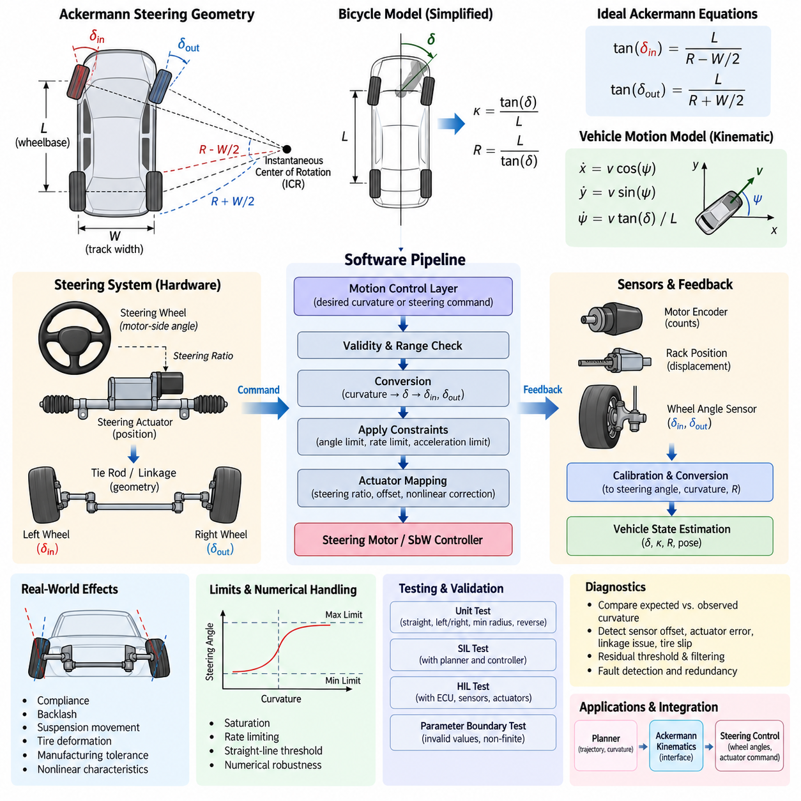
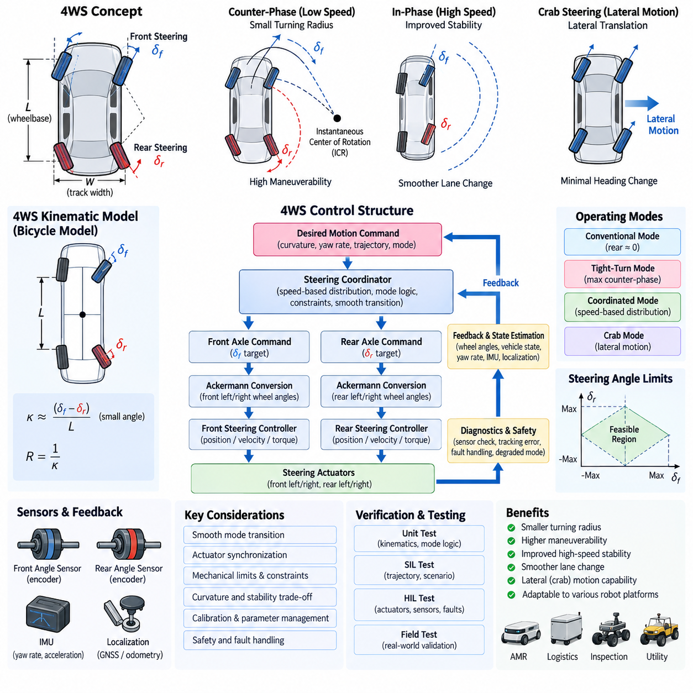
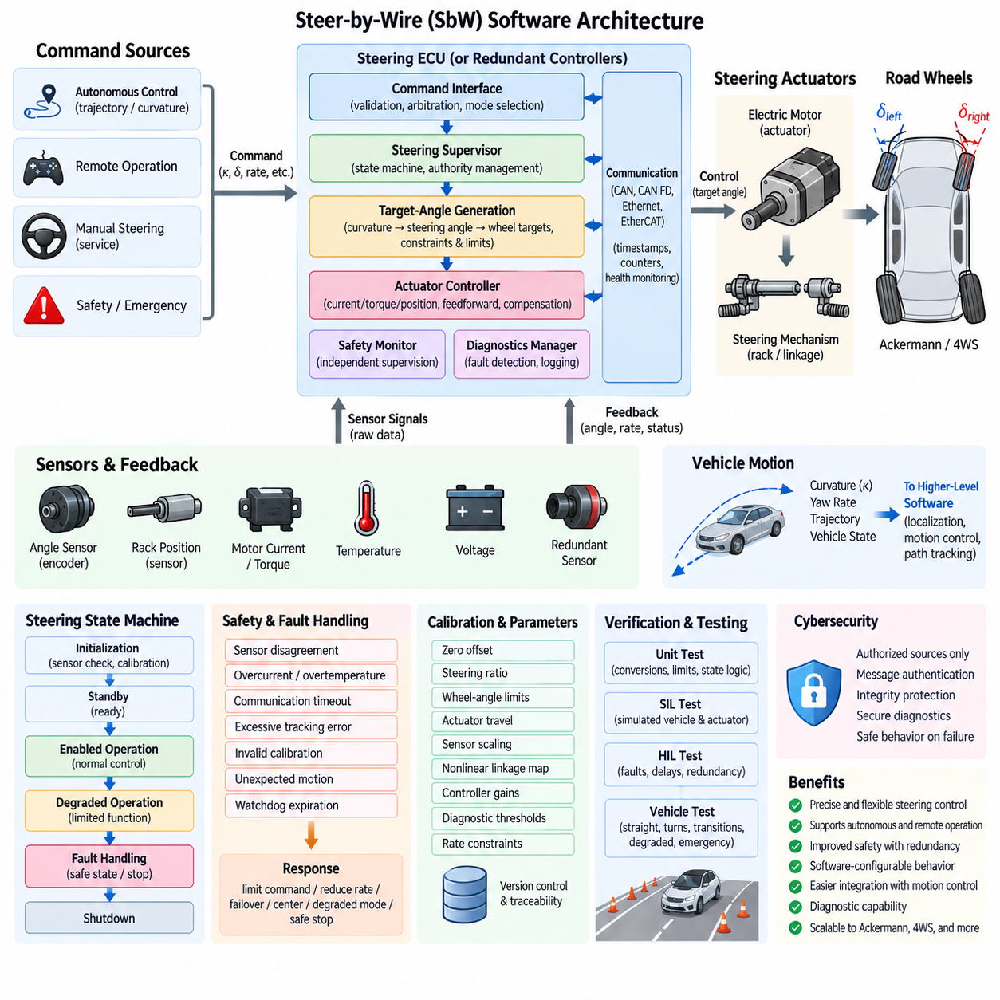
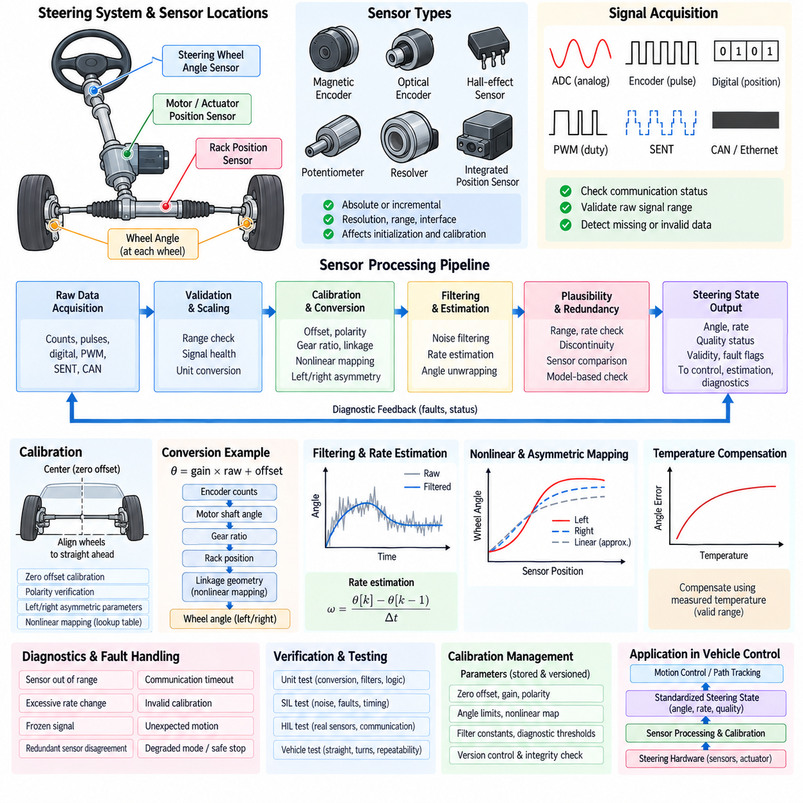
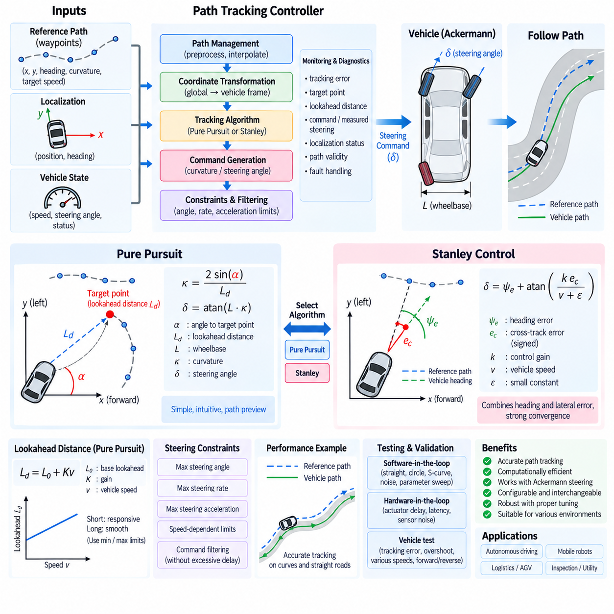
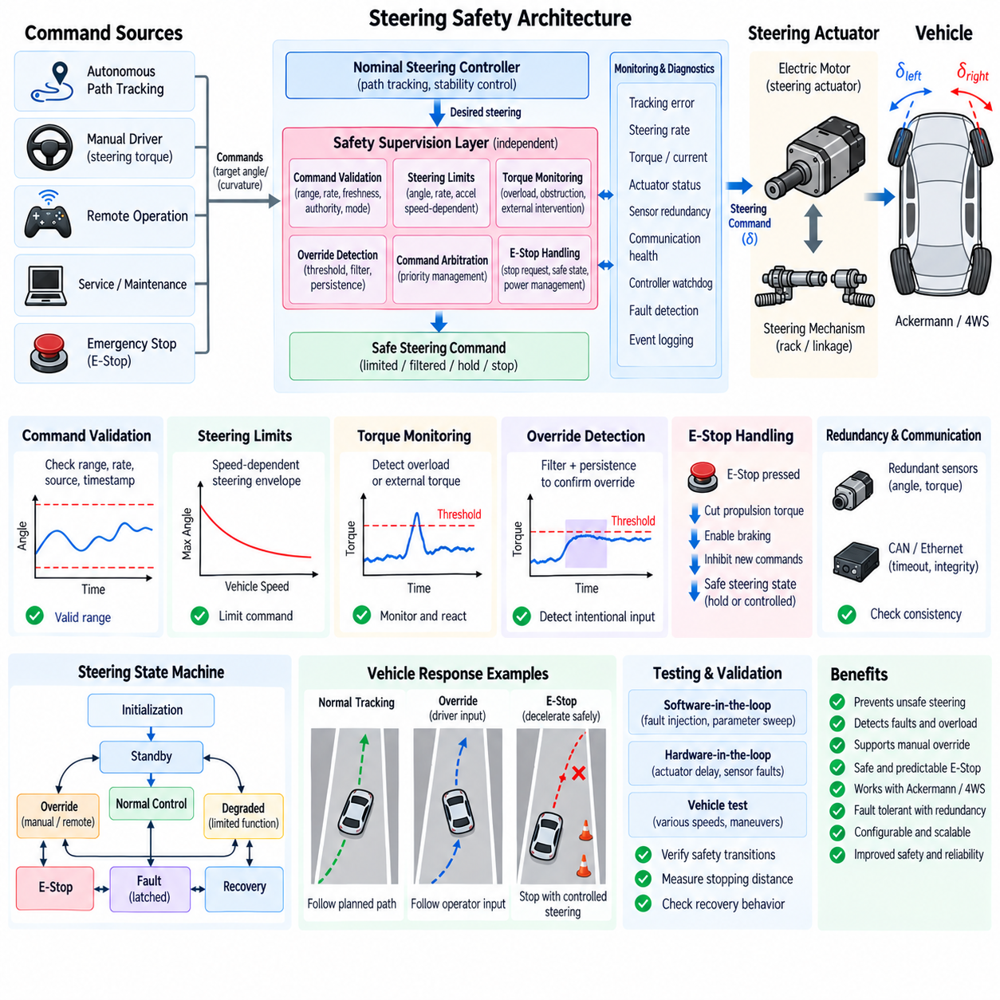
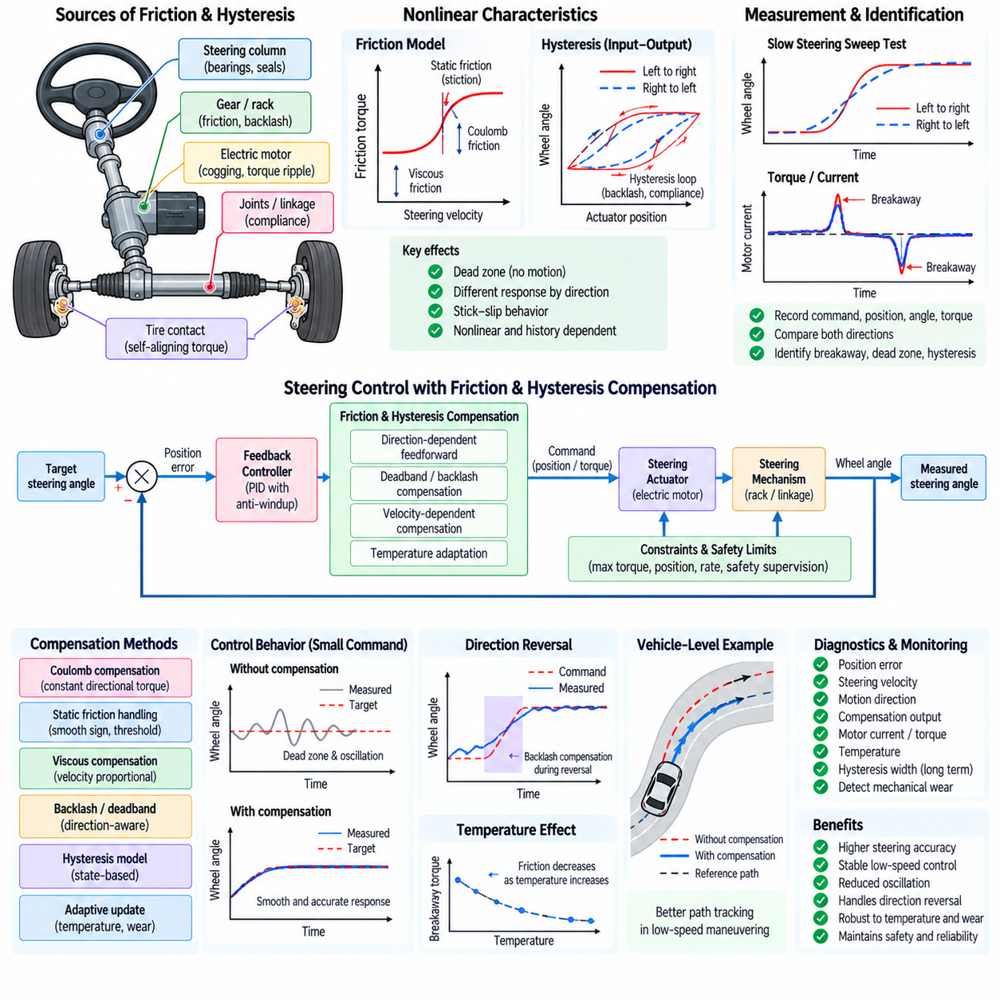
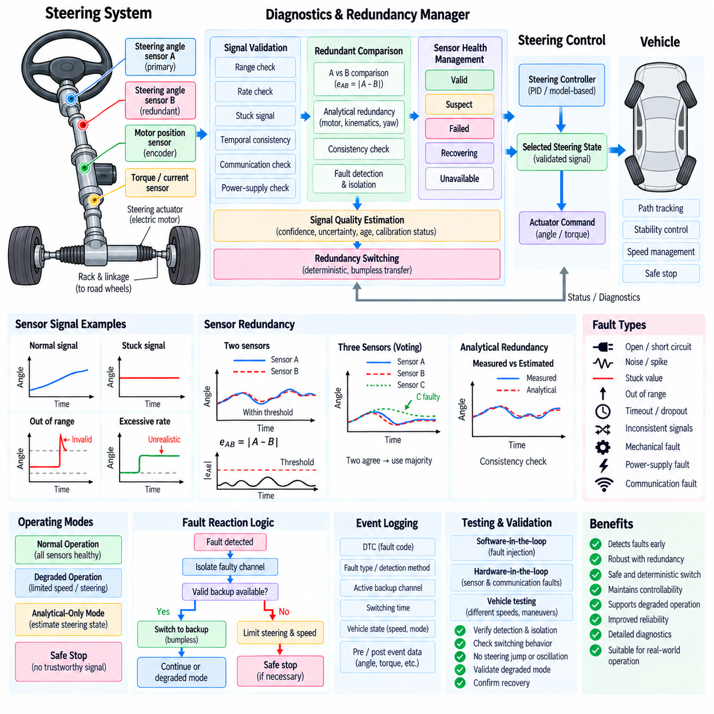
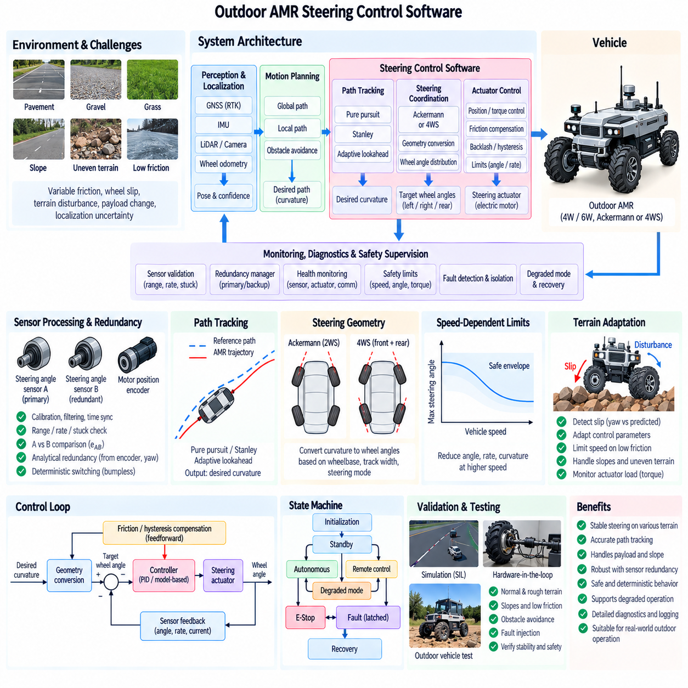
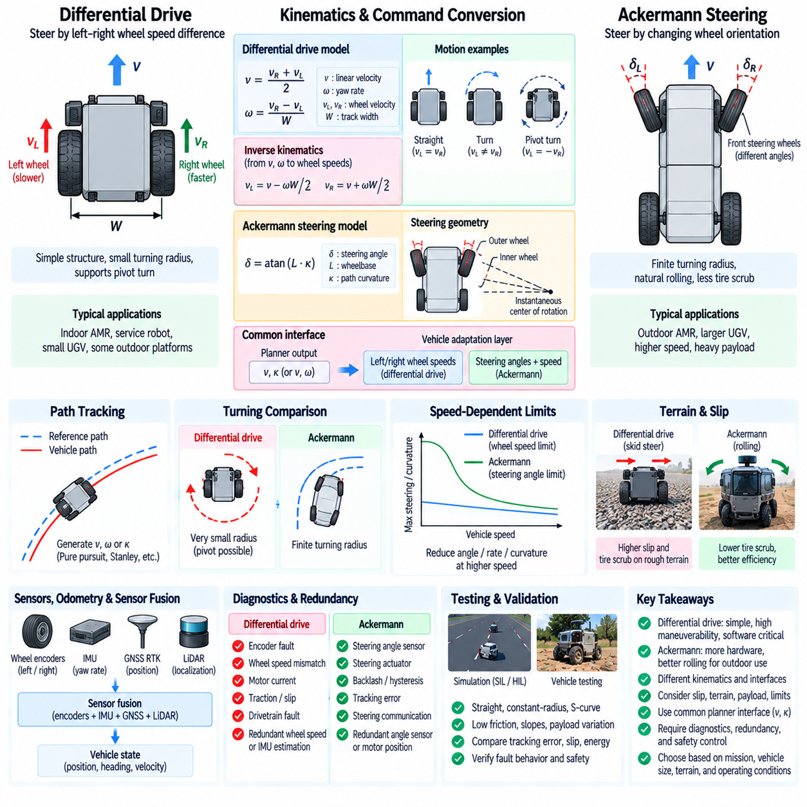

**Volume 04 Robot Control Software**

# 04. Steering Control Software

## 04.01 Ackermann Steering Kinematics and SW Model [w/Code]

{width="7.268055555555556in" height="7.268055555555556in"}

:::

Ackermann steering is a geometric steering principle used by wheeled vehicles and mobile robots to achieve smooth turning while minimizing lateral tire slip. During a turn, the inner and outer wheels travel along circles with different radii, so they cannot use identical steering angles. The Ackermann relationship determines the individual wheel angles required for their extended wheel axes to intersect near a common instantaneous center of rotation.

The basic kinematic model represents the vehicle using wheelbase, track width, steering angle, longitudinal velocity, and vehicle pose. Wheelbase is the distance between front and rear axle reference points, while track width describes the lateral separation between left and right wheels. These dimensions directly affect the steering geometry and must therefore be represented as calibrated parameters rather than fixed assumptions hidden inside the control software.

For an ideal front-wheel Ackermann configuration, the inner wheel requires a larger steering angle than the outer wheel. If the wheelbase is L, track width is W, and the turning radius measured from the rear axle center is R, the ideal relationships can be expressed as tan(delta_inner)=L/(R-W/2) and tan(delta_outer)=L/(R+W/2). These equations form the fundamental geometric conversion between requested curvature and physical wheel steering angles.

A convenient software abstraction is the bicycle model, which replaces the two front wheels with one equivalent steering wheel at the axle center. With equivalent steering angle delta, the path curvature can be approximated by kappa=tan(delta)/L and the corresponding turning radius by R=L/tan(delta). This simplification reduces computational complexity and is particularly useful for trajectory tracking, state estimation, simulation, and high-level motion-control interfaces.

The bicycle model describes planar vehicle motion through the vehicle position x and y and heading angle psi. Under low-speed kinematic assumptions, the state equations are commonly written as x_dot=v cos(psi), y_dot=v sin(psi), and psi_dot=v tan(delta)/L. A discrete software implementation evaluates these equations at a defined control period, allowing the predicted pose to be updated consistently with the real-time steering and velocity commands.

The software model should clearly distinguish path curvature, equivalent steering angle, road-wheel angle, steering actuator position, and steering-wheel or motor-side angle. These variables are related but are not interchangeable. Mechanical steering ratios, linkage geometry, actuator reduction ratios, offsets, and nonlinear characteristics can transform one representation into another, requiring explicit conversion functions between the planning, control, actuator, and feedback domains.

A practical steering software pipeline receives desired curvature or steering commands from the motion-control layer and first applies validity and range checks. The command is then converted into an equivalent center steering angle and subsequently into left and right Ackermann wheel angles. Steering limits, rate limits, acceleration constraints, and actuator-specific transformations are applied before target commands are transmitted to the steering motor or steering-by-wire controller.

The inverse transformation is equally important because measured steering positions must be converted back into a physically meaningful vehicle state. Sensor readings may represent motor encoder counts, actuator displacement, steering rack position, or individual wheel angles. Calibration parameters convert these measurements into normalized steering coordinates, after which the software can estimate equivalent steering angle, curvature, and instantaneous turning radius for feedback and diagnostics.

Real steering mechanisms rarely satisfy ideal Ackermann geometry across the entire operating range. Tie rods, steering arms, suspension movement, compliance, backlash, tire deformation, and manufacturing tolerances introduce nonlinear deviations. Production software can therefore supplement the analytical model with lookup tables, polynomial corrections, piecewise functions, or experimentally identified mappings while retaining the ideal kinematic equations as the reference model.

Steering angle saturation must be handled consistently because excessive requested curvature can generate physically impossible wheel commands. The software should determine allowable curvature from mechanical steering limits and vehicle geometry, then constrain commands before inverse kinematic conversion. Rate limiting is also necessary because an achievable steering angle does not imply that the steering actuator can reach that angle instantaneously during vehicle motion.

Low-speed Ackermann modeling assumes rolling without significant lateral slip, making it appropriate for many outdoor mobile robots, autonomous platforms, utility vehicles, and low-speed autonomous driving systems. As velocity increases, tire slip angles, lateral forces, load transfer, and transient dynamics become increasingly important. The software architecture should therefore define the operating region in which the kinematic model is valid and provide a clean interface for higher-fidelity dynamic models.

The sign convention used by the steering model must be defined unambiguously. A typical implementation assigns positive longitudinal velocity to forward motion, positive steering to a left turn, and positive yaw rate to counterclockwise rotation, but other conventions are possible. Coordinate-frame definitions, angle units, curvature signs, and wheel identifiers should be standardized across localization, planning, control, simulation, CAN communication, and diagnostic software.

Numerical robustness is important near the straight-driving condition because steering angle and curvature approach zero and the calculated turning radius approaches infinity. Software should avoid unnecessary division by very small curvature values and should use a defined straight-line threshold. Similar protection is required near steering limits, where tangent and inverse-tangent calculations can amplify numerical errors or produce discontinuities if ranges are not carefully constrained.

A maintainable implementation separates vehicle geometry from the kinematic algorithms. Parameters such as wheelbase, front and rear track width, maximum wheel angles, steering ratio, zero offset, and calibration coefficients should reside in a configuration or calibration structure. The kinematic functions can then operate on this parameter set, allowing the same software component to support multiple robot variants without modifying the core steering equations.

The steering model also provides useful diagnostic relationships. Given commanded steering, measured wheel angles, vehicle velocity, and estimated yaw rate, the software can compare expected and observed curvature. Persistent disagreement may indicate steering sensor offset, actuator tracking error, mechanical linkage problems, tire slip, or incorrect calibration. Residual thresholds and temporal filtering can convert these model inconsistencies into diagnostic information without coupling fault logic directly to actuator control.

Testing should begin with deterministic unit tests for straight driving, left and right turns, minimum-radius conditions, steering saturation, reverse motion, and near-zero numerical cases. Symmetry tests can verify that equal-magnitude left and right commands produce geometrically mirrored results. Parameter-boundary tests should confirm that invalid wheelbase, track width, steering limits, or non-finite command values are detected before they propagate into actuator commands.

Software-in-the-loop testing can connect the Ackermann model to trajectory generators and path-tracking controllers to verify curvature continuity and pose evolution. Hardware-in-the-loop testing extends validation to actual steering ECUs, motor controllers, sensors, communication delays, and actuator dynamics. Logged command and feedback signals can then be compared against the kinematic reference to identify latency, saturation, hysteresis, calibration error, and mechanical asymmetry.

In an integrated robot control architecture, Ackermann kinematics forms the mathematical boundary between vehicle-level motion intent and wheel-level steering actuation. The planner can operate primarily with trajectories and curvature, while the steering controller manages physical wheel angles and actuator commands. Maintaining this separation reduces dependencies between software layers and allows planners, controllers, steering hardware, and vehicle platforms to evolve independently.

A robust Ackermann steering software model therefore combines ideal geometry, explicit coordinate conventions, parameterized vehicle dimensions, actuator mappings, numerical protection, command constraints, feedback conversion, and model-based diagnostics. When these responsibilities are clearly separated, the same kinematic foundation can support simulation, real-time control, calibration, testing, and field diagnostics while providing a consistent interface for subsequent path-tracking and steering-safety functions.

## 04.02 Four-Wheel Steering (4WS) Control Structure

{width="7.268055555555556in" height="7.268055555555556in"}

Four-wheel steering (4WS) extends conventional steering control by independently or coordinately controlling the steering angles of both the front and rear axles. Unlike standard Ackermann systems in which the rear wheels remain fixed, a 4WS platform introduces rear steering as an additional control degree of freedom. This enables the vehicle to modify turning radius, yaw response, lateral motion, and maneuverability according to operating speed and motion requirements.

The fundamental 4WS software model represents the vehicle using front steering angle, rear steering angle, wheelbase, track width, longitudinal velocity, yaw rate, and vehicle pose. The front and rear steering commands jointly determine the instantaneous center of rotation and resulting path curvature. Consequently, the control software must treat steering as a coordinated vehicle-level function rather than as two independent axle actuators receiving unrelated angle commands.

At low vehicle speeds, the front and rear wheels are commonly commanded in opposite directions, often called counter-phase steering. When the front wheels steer left, the rear wheels steer right, reducing the effective turning radius and allowing the vehicle to negotiate narrow passages or confined workspaces. This operating mode is particularly useful for outdoor AMRs, logistics platforms, inspection vehicles, and other robots requiring high maneuverability despite relatively long wheelbases.

At higher speeds, the front and rear wheels can steer in the same direction, known as in-phase steering. The rear steering angle is generally smaller than the front angle and is coordinated to improve lateral response and vehicle stability. Instead of primarily reducing turning radius, this mode reduces excessive yaw motion and can make lane changes or gradual trajectory corrections smoother by distributing lateral motion between both axles.

A simplified 4WS bicycle model replaces each axle with an equivalent center wheel having steering angles delta_f and delta_r. Under kinematic assumptions, vehicle curvature depends approximately on the difference between the front and rear steering directions. For small angles, curvature can be represented approximately by kappa=(delta_f-delta_r)/L, showing directly why opposite-phase steering increases curvature while same-phase steering reduces rotational response.

For larger steering angles, tangent-based relationships provide a more accurate representation than the small-angle approximation. The software model should therefore use geometrically consistent transformations when calculating curvature, turning radius, or axle steering commands. The exact equations depend on the selected vehicle reference point and coordinate convention, making explicit definitions of wheelbase, axle locations, steering signs, and pose reference essential for consistent implementation.

A 4WS control structure can be divided into vehicle motion command, steering coordination, axle command generation, actuator control, and feedback monitoring layers. The upper motion-control layer provides desired curvature, yaw behavior, or trajectory information. A steering coordinator then determines how the required motion should be distributed between the front and rear axles before individual steering controllers convert those targets into actuator commands.

The steering coordinator is the central software component distinguishing 4WS from conventional front-wheel steering. It determines the front-to-rear steering ratio according to vehicle speed, requested curvature, maneuvering mode, stability requirements, and mechanical limitations. A configurable distribution factor can continuously transition the system from counter-phase behavior at low speed through predominantly front steering and eventually toward in-phase behavior at higher speed.

Mode transition must be continuous because an abrupt change in rear steering direction can generate undesirable yaw or lateral acceleration. The control software should therefore use interpolation, rate limiting, hysteresis, or smooth scheduling functions across defined speed regions. Transition logic should also prevent repeated mode switching when vehicle speed oscillates near a threshold, while ensuring that commanded rear steering remains dynamically achievable.

A production 4WS system may support several operating modes beyond speed-dependent automatic steering. Conventional mode can hold the rear wheels near zero while using front steering only. Tight-turn mode can maximize counter-phase steering for minimum turning radius, while coordinated mode can continuously distribute steering between axles. Specialized robotic platforms may additionally support lateral or crab-like motion when their mechanical steering configuration permits approximately parallel wheel orientation.

Crab steering differs fundamentally from ordinary same-phase 4WS trajectory control because the objective is lateral translation with limited heading change rather than conventional turning. All steerable wheels may be aligned toward a common direction while the drive system generates motion along that orientation. Software should represent this as an explicit motion mode with dedicated kinematic constraints instead of treating it merely as an extreme value of the normal rear steering ratio.

The front and rear axle commands must ultimately be converted into physical left and right wheel angles. Each axle can apply Ackermann geometry using its axle-specific equivalent steering target, track width, and geometric relationship to the instantaneous center of rotation. This produces four wheel-angle targets that minimize geometric tire scrub while preserving the vehicle-level curvature requested by the steering coordinator.

Mechanical steering limits are especially important in 4WS because feasible combinations of front and rear angles form a constrained operating region. A requested curvature may be achievable mathematically but impossible because one axle reaches its angle, rate, torque, or actuator-position limit. The coordinator should therefore calculate feasible commands jointly and redistribute steering demand when possible instead of saturating each axle independently.

Feedback processing should maintain separate measurements for front and rear steering positions while also estimating a combined vehicle steering state. Encoder counts, steering-angle sensors, rack positions, or actuator positions are converted through calibration models into physical wheel or equivalent axle angles. The resulting values can be used to estimate expected curvature and yaw rate and compared with localization, IMU, or vehicle-motion measurements.

Synchronization between the front and rear steering actuators is critical during rapid command changes. Different actuator bandwidths, communication delays, mechanical loads, or control-loop periods can temporarily produce an unintended steering geometry. The software can compensate using synchronized command timestamps, matched trajectory profiles, feedforward terms, or delay compensation so that both axles follow coordinated steering trajectories rather than simply reaching identical completion times.

The actuator-control layer normally contains position, velocity, or torque loops for each steering mechanism. These low-level loops should remain separated from vehicle-level 4WS coordination so that actuator hardware can be replaced without redesigning the kinematic controller. The coordinator generates physically meaningful axle targets, while hardware-specific controllers manage motor current, gear reduction, friction, backlash, steering torque, and local position tracking.

Safety supervision must consider both common and axle-specific failures. A front or rear steering sensor disagreement, actuator tracking error, communication timeout, excessive steering rate, or unexpected wheel position can invalidate the coordinated geometry. Depending on platform design and fault severity, the system may transition to front-steering-only operation, center the rear axle, limit vehicle speed, enter a degraded control mode, or command a controlled safe stop.

Rear steering return-to-center behavior deserves explicit treatment because an uncontrolled rear angle can significantly alter vehicle motion even when front steering appears normal. During startup, shutdown, fault recovery, emergency transitions, or mode changes, software should verify the rear steering position before allowing unrestricted motion. Position plausibility and actuator availability should therefore be part of the steering system readiness conditions.

Diagnostics can compare commanded and measured angles for all steerable wheels and evaluate whether the combined geometry produces the expected vehicle response. Residuals between predicted curvature, measured yaw rate, and estimated trajectory can reveal calibration drift, mechanical misalignment, actuator degradation, tire slip, or synchronization errors. Diagnostic thresholds should account for speed and operating mode because expected residual behavior differs between tight turns and normal travel.

Parameter management is essential because 4WS behavior depends strongly on vehicle geometry and steering hardware. Wheelbase, front and rear track widths, maximum steering angles, actuator rates, steering ratios, calibration offsets, speed thresholds, transition gains, and rear-steering distribution maps should be maintained as traceable calibration data. Separating these parameters from algorithm code allows one control architecture to support different vehicle dimensions and actuator configurations.

Verification should include straight motion, symmetric left and right turns, counter-phase steering, in-phase steering, transition regions, rear-steering saturation, actuator delays, reverse driving, and degraded modes. Software-in-the-loop testing can validate kinematic consistency and trajectory response, while hardware-in-the-loop testing can introduce sensor faults, communication delays, actuator saturation, and mismatched front-rear dynamics before field testing.

Within the overall robot control architecture, the 4WS module forms a coordinated interface between trajectory-level motion requirements and multiple steering actuators. The planner does not need to manage individual wheel angles directly; instead, it provides vehicle-level motion intent. The 4WS controller interprets that intent according to geometry, speed, operating mode, constraints, and safety state before distributing commands to the physical steering system.

A well-structured 4WS control system therefore combines vehicle kinematics, front-rear steering coordination, smooth mode scheduling, Ackermann wheel conversion, actuator synchronization, feedback estimation, constraint management, diagnostics, and fault handling. By separating these responsibilities into clear software layers, four-wheel steering can provide improved maneuverability and controllability while remaining testable, calibratable, and reusable across different autonomous mobile robot and robotic vehicle platforms.

## 04.03 Steer-By-Wire (SbW) Software Design

{width="7.268055555555556in" height="7.268055555555556in"}

Steer-by-Wire (SbW) replaces or supplements the mechanical steering connection between the steering command source and road wheels with electronic sensing, computation, communication, and electric actuation. In autonomous robots, the command source may be a trajectory controller rather than a human steering wheel. The SbW software therefore becomes the functional link that converts requested vehicle motion into controlled steering actuator movement.

A typical SbW architecture contains a command interface, steering supervisor, target-angle generator, actuator controller, sensor-processing layer, safety monitor, diagnostics manager, and communication interface. These functions may execute within one steering ECU or be distributed across redundant controllers. The software architecture should maintain clear boundaries between vehicle-level steering decisions, actuator-level closed-loop control, and independent safety supervision.

The command interface receives steering requests expressed as curvature, equivalent steering angle, wheel angle, steering rate, or actuator position. Autonomous platforms commonly receive curvature or trajectory-related commands from the motion-control layer. The SbW software validates command range, timestamp, source identity, operating mode, and freshness before accepting the request, preventing stale or malformed commands from directly influencing steering actuators.

Command arbitration becomes necessary when several sources can request steering simultaneously. Autonomous control, remote operation, manual service control, safety functions, and emergency logic may each produce steering requests. A deterministic priority mechanism should define which source has authority under each operating state. Authority transitions must be controlled so that switching between command sources does not introduce discontinuous steering-angle or steering-rate commands.

The target-generation layer converts the accepted vehicle-level request into a physical steering target. For Ackermann vehicles, requested curvature may first be converted into an equivalent steering angle and then into individual road-wheel targets. Four-wheel-steering platforms additionally require coordinated front and rear targets. Mechanical steering ratio, linkage geometry, actuator travel, calibration offsets, and nonlinear mappings are applied before generating the final actuator reference.

Target commands should pass through steering-angle, steering-rate, and steering-acceleration constraints before reaching the low-level controller. These limits protect mechanical components and prevent abrupt lateral vehicle motion. Limits can depend on vehicle speed, operating mode, payload, actuator temperature, or safety state. Dynamic constraints are especially important because an angle that is mechanically achievable at standstill may be unsafe or dynamically inappropriate at higher speed.

The actuator controller forms the real-time closed loop responsible for tracking the steering target. Depending on hardware architecture, the inner loops may regulate motor current or torque, while outer loops regulate actuator velocity and position. Feedforward compensation can improve response, while friction, backlash, and hysteresis compensation can reduce steady tracking errors. Controller gains may also be scheduled according to operating conditions and steering load.

Sensor processing converts raw measurements into trustworthy steering-state information. Typical signals include motor encoder position, steering-angle sensor output, rack displacement, motor current, torque, temperature, supply voltage, and actuator velocity. Filtering should suppress noise without introducing excessive phase delay, while calibration converts electrical or encoder measurements into physically meaningful angles and positions used by control and diagnostic functions.

Redundant sensing is commonly required because steering position is safety critical. Two independent angle measurements may be compared continuously using range, rate, correlation, and plausibility checks. Disagreement beyond calibrated limits should generate a fault rather than silently selecting an arbitrary signal. Where analytical redundancy is available, motor position, rack position, wheel angle, and vehicle yaw response can provide additional evidence about steering-system integrity.

Communication design is another critical part of SbW software because commands and feedback may cross CAN, CAN FD, Automotive Ethernet, EtherCAT, or other deterministic networks. Each message should contain sufficient information for freshness and integrity checking, such as counters, timestamps, state information, and error-detection fields where supported. Timeout monitoring ensures that loss of communication is recognized within a defined fault-tolerant time interval.

The steering state machine coordinates initialization, standby, enabled operation, degraded operation, fault handling, calibration, and shutdown. Steering torque or position control should not become active merely because software execution has started. Sensor plausibility, communication availability, actuator readiness, power condition, calibration validity, and safety authorization should be confirmed before transitioning into an operational state capable of producing vehicle motion.

Startup behavior requires particular attention because steering position may be unknown or offset after power cycling. The system may use absolute position sensing, stored calibration information, mechanical references, or controlled homing depending on hardware design. The software should avoid uncontrolled steering movement during initialization and should verify that the interpreted steering position is consistent with redundant sensors before normal command tracking is enabled.

Fault handling should distinguish between transient, recoverable, degraded, and critical failures. Examples include sensor disagreement, motor overcurrent, actuator overtemperature, communication timeout, excessive tracking error, invalid calibration, unexpected steering motion, or controller watchdog expiration. Each fault should map to a defined response such as command limitation, reduced steering rate, redundant-channel takeover, controlled centering, degraded operation, or safe vehicle stop.

A safety monitor should operate with sufficient independence from the nominal steering controller to detect unreasonable behavior. It can supervise commanded versus measured angle, maximum steering rate, actuator current, execution timing, communication status, and control-state transitions. Independent monitoring reduces the possibility that a single software defect simultaneously generates an incorrect command and incorrectly declares the resulting steering behavior valid.

Redundant SbW architectures may contain dual processing channels, duplicated sensors, separate power paths, or multiple steering actuators. Software must coordinate channel health, cross-check important states, and define deterministic rules for failover. Redundancy is useful only when common-cause failures and disagreement handling are considered; simply duplicating identical calculations without independent supervision does not automatically provide fault-tolerant steering.

Timing determinism directly affects steering stability and safety. Sensor acquisition, control computation, communication, actuator updates, and diagnostic supervision should execute with bounded periods and latency. Timestamped data helps distinguish physical steering errors from delayed measurements. Real-time scheduling should assign appropriate priorities so that logging, diagnostics, or noncritical communication cannot delay the steering control loop beyond its permitted execution window.

Steering feedback should also be supplied to higher-level vehicle software. Measured wheel angle, equivalent steering angle, actuator status, steering rate, fault state, and validity information can be consumed by localization, motion control, trajectory tracking, and safety functions. Publishing both the value and its quality state prevents upper layers from assuming that a numerically available steering measurement is necessarily trustworthy.

Calibration management connects the generic SbW software to the actual steering mechanism. Zero offsets, steering ratios, wheel-angle limits, actuator travel, sensor scaling, nonlinear linkage maps, controller gains, diagnostic thresholds, and rate constraints should be stored as version-controlled parameters. Software should verify parameter integrity at startup and maintain traceability between calibration versions, software releases, and vehicle configurations.

Diagnostics and logging should capture enough context to reconstruct abnormal steering events. Command source, requested angle, limited target, measured positions, actuator current, controller state, fault flags, timestamps, communication status, and safety transitions are particularly useful. High-rate signals may be stored in a circular buffer so that data immediately before and after a fault can be preserved without continuously recording excessive amounts of information.

Software verification should begin with unit tests covering conversions, limits, state transitions, sensor plausibility, command arbitration, timeout handling, and fault responses. Software-in-the-loop testing can evaluate closed-loop steering behavior with simulated vehicle and actuator models. Hardware-in-the-loop testing can introduce communication loss, sensor offsets, actuator delays, current limits, processor timing faults, and redundant-channel disagreement under repeatable conditions.

Vehicle-level validation should confirm not only actuator tracking accuracy but also the resulting motion behavior. Tests should include straight-line holding, gradual turns, maximum steering commands, rapid reversals, low- and high-speed operation, command-source transitions, startup and shutdown, degraded modes, and emergency responses. Measured yaw rate and trajectory curvature can be compared with values predicted from the steering kinematic model to detect system-level inconsistencies.

Cybersecurity should be considered because electronic steering commands create an attack surface that does not exist in purely mechanical steering links. Command interfaces should restrict unauthorized sources, communication should provide appropriate authenticity and integrity protection, and diagnostic or service functions should not bypass steering authority controls. Security mechanisms must be designed so that they preserve deterministic safety behavior during communication or authentication failures.

Within the robot control stack, SbW should present a stable interface between motion-control algorithms and hardware-specific steering mechanisms. Path-tracking software can request vehicle-level steering behavior without knowing motor encoder counts or rack geometry, while the SbW layer handles conversion, closed-loop actuation, monitoring, and fault management. This separation enables steering hardware and higher-level autonomy software to evolve with reduced mutual dependency.

A robust SbW software design therefore integrates command validation, authority management, steering kinematics, actuator control, redundant sensing, deterministic communication, state management, safety monitoring, diagnostics, calibration, and verification. Treating these elements as coordinated layers rather than isolated functions allows electronic steering to provide precise controllability while maintaining predictable behavior during normal operation, degraded conditions, and system faults.

## 04.04 Steering Angle Sensor Processing and Calibration [w/Code]

{width="7.268055555555556in" height="7.268055555555556in"}

Steering angle sensing provides the feedback required to determine the actual orientation of a vehicle or robot steering mechanism. Depending on the platform, the measured quantity may represent steering-wheel angle, motor-shaft position, rack displacement, axle steering angle, or individual road-wheel angle. Control software must therefore identify the physical meaning of each signal before using it for closed-loop steering, vehicle-state estimation, or diagnostics.

Common steering-angle sensing technologies include magnetic absolute encoders, optical encoders, Hall-effect sensors, potentiometric sensors, resolver-based devices, and actuator-integrated position sensors. Some provide an absolute angle immediately after power-up, while incremental devices require a known reference or homing procedure. Sensor selection influences initialization strategy, achievable resolution, measurement range, interface design, fault detection, and calibration requirements.

The sensor-processing pipeline begins with acquisition of raw electrical or digital measurements. Depending on the interface, input may consist of ADC counts, encoder pulses, absolute digital position words, PWM duty cycles, SENT data, CAN messages, or other encoded values. The software should validate communication status and raw signal range before applying scaling so that invalid electrical measurements are not converted into apparently plausible steering angles.

Raw measurements are converted into engineering units using sensor-specific scaling parameters. A simple linear conversion can be expressed as angle=gain×raw_value+offset, although practical steering mechanisms frequently require additional transformations. Encoder counts may first be converted into motor-shaft angle, followed by gear-ratio and linkage transformations that produce rack position or road-wheel angle. Each conversion stage should preserve units and sign conventions explicitly.

Zero-offset calibration establishes the measurement corresponding to the mechanical straight-ahead steering position. Manufacturing tolerances, sensor mounting variation, linkage assembly, and replacement components can shift the electrical zero away from the true vehicle center. The calibration procedure determines this difference and stores a zero-offset parameter so that a physically centered steering mechanism is reported consistently as the defined software zero position.

Center calibration should use a reliable mechanical or geometric reference rather than assuming that a raw sensor midpoint represents straight driving. Depending on the platform, technicians may align wheels using fixtures, mechanical stops, wheel-alignment equipment, or measured vehicle geometry. Autonomous platforms can supplement static calibration with motion-based observations, but such methods should not replace a defined reference procedure when safety-critical steering accuracy is required.

Steering polarity must also be verified during calibration. The software convention may define left steering as positive and right steering as negative, while the physical sensor or actuator can increase in the opposite direction. A polarity parameter or explicit coordinate transformation should normalize the measurement before it reaches higher-level software. Incorrect polarity can transform otherwise valid feedback into a destabilizing closed-loop control error.

Steering systems frequently contain nonlinear relationships between sensor position and actual road-wheel angle. Rack-and-pinion geometry, steering arms, tie rods, suspension geometry, and actuator linkages can cause the effective steering ratio to change across the travel range. A single constant ratio may therefore be insufficient. Lookup tables, piecewise-linear interpolation, polynomial functions, or experimentally identified mappings can represent this nonlinear conversion more accurately.

Left and right steering characteristics may not be perfectly symmetric. Mechanical tolerances, linkage geometry, stops, compliance, and sensor mounting can produce different maximum angles or conversion curves in each direction. Calibration software should permit asymmetric parameters where necessary rather than forcing mirrored behavior. Independent left and right calibration data can substantially improve wheel-angle estimation near large steering angles.

Filtering is required because steering sensor measurements contain electrical noise, quantization effects, mechanical vibration, and communication jitter. Low-pass filters, moving-average filters, or appropriately designed digital filters can reduce these disturbances, but excessive filtering introduces phase delay. Since steering feedback participates in real-time control, filter bandwidth should be selected according to actuator dynamics, control-loop frequency, vehicle speed, and required fault-detection response.

Angle-rate estimation can be derived from successive steering-angle measurements when a direct velocity sensor is unavailable. Simple differentiation amplifies measurement noise, so filtered differentiation or state-estimation methods are generally preferable. The estimated steering rate is useful for actuator control, steering-rate limitation, dynamic monitoring, and diagnostics. Accurate timestamps are necessary because variation in sampling intervals directly affects numerical derivative accuracy.

Angle unwrapping may be required for sensors that represent position cyclically or for steering mechanisms whose motor shaft rotates multiple revolutions. The software must distinguish a genuine wraparound transition from a large physical steering movement. Multi-turn tracking can combine absolute single-turn position with revolution counters or retained state, but startup behavior must account for whether previous revolution information can be trusted after a power interruption.

Sensor plausibility monitoring evaluates whether a measurement is physically possible and consistent with recent history. Typical checks include minimum and maximum angle, maximum rate of change, discontinuity detection, frozen-signal detection, and communication timeout. A value that lies within the legal angle range can still be faulty if it jumps faster than the steering mechanism can physically move or remains unchanged despite verified actuator motion.

Redundant steering sensors allow stronger fault detection by comparing independent measurements of the same or related physical quantity. Dual angle sensors may use different electrical channels, sensing technologies, or power supplies to reduce common-cause failures. Software can evaluate absolute disagreement, rate disagreement, correlation, and direction consistency. Persistent disagreement beyond calibrated thresholds should generate an explicit diagnostic state.

Analytical redundancy can supplement duplicated sensors by comparing measurements across different parts of the steering mechanism. Motor encoder angle, actuator position, rack displacement, road-wheel angle, commanded steering, and vehicle yaw response are physically related. A model-based residual between these signals can reveal sensor drift, mechanical disconnection, linkage deformation, excessive backlash, or actuator tracking errors that may not be detected by simple range checking.

Calibration data should be separated from executable control logic and managed as traceable configuration information. Typical parameters include zero offset, sensor gain, polarity, minimum and maximum raw values, mechanical angle limits, steering ratio, nonlinear mapping tables, filter constants, diagnostic thresholds, and temperature compensation coefficients. Parameter versioning allows calibration changes to be associated with a specific vehicle, steering hardware revision, and software release.

Calibration integrity must be verified whenever parameters are loaded. Checksums, range validation, version compatibility, and default-value handling can prevent corrupted or incompatible data from producing incorrect steering feedback. Safety-critical systems should avoid silently replacing invalid calibration with generic values if doing so could create an unsafe steering interpretation. Instead, invalid calibration should produce a defined startup restriction or diagnostic fault.

Temperature can influence magnetic sensors, analog electronics, mechanical dimensions, and steering friction. Where characterization shows meaningful temperature dependency, calibration can include compensation based on measured sensor or actuator temperature. Compensation should be derived from test data rather than assumed theoretically, and its valid temperature range should be defined so that extrapolation outside characterized conditions does not generate misleading corrections.

Calibration procedures should distinguish factory calibration, service calibration, and runtime adaptation. Factory calibration establishes baseline geometry and sensor characteristics during manufacturing. Service calibration restores correct parameters after sensor, actuator, linkage, or alignment work. Runtime adaptation may compensate slowly varying offsets or mechanical changes, but adaptive values should be bounded and monitored so that genuine hardware faults are not incorrectly learned as normal behavior.

The processed steering-angle signal should include quality information in addition to the numerical angle. Useful status fields include validity, calibration state, sensor health, redundancy agreement, timeout state, estimated uncertainty, and degradation status. Higher-level controllers can then determine whether the measurement is suitable for normal operation, restricted operation, or only diagnostic use instead of treating every available numeric value as equally trustworthy.

Diagnostics should preserve raw and processed data when abnormal behavior occurs. Raw sensor value, converted angle, filtered angle, zero offset, calibration version, actuator command, steering rate, redundant measurement, vehicle speed, yaw rate, timestamps, and fault flags provide valuable context for root-cause analysis. Capturing both pre-fault and post-fault samples helps distinguish sensor failure from mechanical or communication problems.

Verification should test the complete processing chain rather than only individual conversion functions. Unit tests can cover scaling, polarity, offset correction, interpolation, filtering, unwrapping, saturation, and fault thresholds. Software-in-the-loop testing can inject noise, drift, discontinuities, and timing variation, while hardware-in-the-loop testing can evaluate actual sensor interfaces, communication faults, power cycling, and redundant-channel disagreement.

Vehicle-level calibration validation should compare processed steering information with independent geometric or motion references. Tests can evaluate straight-ahead alignment, symmetric left and right steering, maximum travel, repeated center return, low-speed circular driving, and measured yaw response. Repetition is important because backlash and hysteresis may cause the same commanded position to produce different measurements depending on the direction of approach.

Within the steering-control architecture, sensor processing and calibration form the measurement boundary between physical steering hardware and software control functions. Low-level interfaces acquire raw signals, calibration converts them into physical coordinates, filtering and estimation improve usability, and diagnostic logic determines confidence. Higher-level controllers should consume this standardized steering state rather than directly interpreting hardware-specific sensor values.

A robust steering-angle processing and calibration design therefore combines reliable acquisition, explicit unit conversion, zero and polarity correction, nonlinear mapping, filtering, rate estimation, redundancy checking, parameter traceability, calibration integrity, and systematic validation. This structure provides accurate and trustworthy steering feedback for Ackermann steering, four-wheel steering, steer-by-wire control, path tracking, safety supervision, and vehicle diagnostics.

## 04.05 Path Tracking Control: Pure Pursuit / Stanley [w/Code]

{width="7.268055555555556in" height="7.268055555555556in"}

Path tracking control converts a planned geometric path into steering commands that continuously guide a mobile robot or autonomous vehicle toward the desired trajectory. The controller compares the current vehicle pose with reference path information and calculates a steering action that reduces tracking error. Pure Pursuit and Stanley control are widely used geometric methods because they are computationally efficient and integrate naturally with Ackermann steering platforms.

A path-tracking system typically receives a sequence of reference poses or waypoints containing position, heading, curvature, and sometimes target velocity. Localization provides the current vehicle position and orientation, while vehicle interfaces provide measured speed and steering state. The controller combines these inputs at a periodic update rate and generates desired curvature or steering angle for the lower steering-control layer.

Coordinate transformation is an important first step because the global path and vehicle control calculations may use different reference frames. Nearby path points are transformed from the map or odometry frame into a vehicle-centered coordinate frame. This allows lateral displacement, forward distance, heading difference, and target-point geometry to be evaluated consistently without embedding global-map assumptions inside the steering algorithm.

Pure Pursuit is based on selecting a target point located a specified lookahead distance ahead of the vehicle and calculating the circular arc that connects the current vehicle pose to that point. Instead of directly minimizing the nearest lateral error, the algorithm attempts to steer toward a moving point on the reference path. This geometric interpretation makes Pure Pursuit relatively simple, intuitive, and suitable for real-time robotic control.

If the target point in the vehicle coordinate frame is located at longitudinal distance x and lateral distance y, its heading relative to the vehicle can be represented by alpha. For a lookahead distance Ld, the desired curvature is commonly expressed as kappa=2 sin(alpha)/Ld. For an Ackermann vehicle with wheelbase L, the equivalent steering command can then be calculated as delta=atan(L×kappa).

The lookahead distance strongly determines Pure Pursuit behavior. A short lookahead generally produces aggressive correction and can reduce local tracking error, but it may also cause steering oscillation or sensitivity to localization noise. A long lookahead generates smoother steering and improved stability but can cut corners or respond slowly to sharp curvature. Lookahead selection is therefore one of the principal calibration tasks.

Adaptive lookahead improves performance across different operating speeds. A common implementation defines the lookahead distance as a base value plus a term proportional to vehicle speed, such as Ld=L0+Kv. Low-speed operation then uses a shorter preview distance for maneuverability, while higher-speed operation uses a longer preview distance for smoother response. Minimum and maximum limits prevent unreasonable lookahead values.

Target-point selection requires careful software design because a discrete waypoint path may contain irregular spacing, loops, sharp corners, or points behind the vehicle. The controller should identify the nearest valid path region and search forward along path progress until the required lookahead distance is reached. Interpolation between path samples can provide a smoother target point than simply selecting the first waypoint exceeding the lookahead threshold.

Stanley control approaches path tracking differently by explicitly combining cross-track error and heading error. Cross-track error represents the lateral distance between the vehicle reference point and the desired path, while heading error represents the angular difference between the vehicle orientation and path tangent. The steering command corrects both errors simultaneously, providing direct convergence toward the reference path.

A commonly used Stanley relationship can be written as delta=psi_e+atan(k e_c/(v+epsilon)), where psi_e is heading error, e_c is signed cross-track error, k is a positive control gain, v is vehicle speed, and epsilon prevents numerical problems near zero speed. The heading term aligns the vehicle with the path, while the cross-track term drives the vehicle laterally toward it.

The Stanley gain determines how strongly lateral displacement influences steering. A large gain produces stronger correction but can cause oscillatory steering, particularly when localization noise or actuator delay is significant. A small gain produces smoother behavior but may allow larger tracking errors. Gain calibration should therefore consider speed range, wheelbase, steering dynamics, localization quality, path curvature, and control-loop frequency.

Low-speed behavior requires special treatment in Stanley control because the cross-track correction contains vehicle speed in the denominator. Without protection, the correction can become excessively large as speed approaches zero. A positive softening constant, minimum effective speed, steering saturation, or speed-dependent gain can maintain numerical stability. Reverse driving additionally requires consistent definitions of heading, path direction, and error signs.

Cross-track error must be signed rather than represented only as an absolute distance. The sign indicates which side of the reference path contains the vehicle and therefore determines the required correction direction. A consistent coordinate convention should define positive lateral error, positive heading error, and positive steering angle across localization, path representation, controller calculations, and steering actuator interfaces.

Pure Pursuit and Stanley therefore use different geometric information. Pure Pursuit primarily responds to the geometry of a forward target point and naturally includes path preview. Stanley directly combines current lateral and heading errors and can provide strong convergence to the reference path. Neither method is universally superior; their practical behavior depends on speed, path geometry, vehicle dynamics, localization accuracy, and parameter tuning.

The path-tracking software should isolate algorithm-specific calculations from common control infrastructure. Path management, coordinate transformation, localization validation, command constraints, actuator interfaces, diagnostics, and logging can remain shared while Pure Pursuit and Stanley are implemented as interchangeable controller modules. This structure supports controlled comparison and allows a platform to select an algorithm according to operating mode.

Steering commands produced by either controller must be constrained before actuation. Maximum steering angle, curvature, steering rate, and steering acceleration should respect vehicle geometry and actuator capability. Speed-dependent limits can further prevent aggressive steering at high velocity. Command filtering may reduce noise, but excessive smoothing can introduce tracking delay, so filtering should be coordinated with controller tuning and actuator bandwidth.

Path curvature can also be used as a feedforward component. When reference curvature is known, the controller can generate a nominal steering angle from the vehicle kinematic model and use Pure Pursuit or Stanley feedback to correct residual tracking errors. This combination reduces the amount of feedback action required on predictable curves and can improve tracking smoothness when the path representation contains reliable curvature information.

Localization quality directly limits path-tracking performance. Position jumps, heading noise, delayed pose estimates, or inconsistent timestamps can generate unnecessary steering corrections even when the control algorithm is mathematically correct. The controller should therefore check pose freshness and validity, align measurements to an appropriate time reference, and avoid producing unrestricted steering commands when localization confidence becomes insufficient.

Vehicle speed and steering measurements should likewise be synchronized with the pose used for control computation. At higher speeds, even moderate communication or processing delay can shift the effective vehicle position significantly between measurement and actuation. Timestamp-based synchronization, short-horizon pose prediction, or latency compensation can reduce this error and make controller behavior more consistent with the intended geometric model.

Path discontinuities require explicit handling. Sudden waypoint jumps, duplicated points, extremely short segments, discontinuous headings, or unrealistic curvature can produce large steering commands. Path preprocessing can remove duplicates, resample points at consistent spacing, smooth geometry, calculate tangent directions, and estimate curvature. The tracking controller should still validate incoming path data because preprocessing cannot guarantee valid runtime inputs.

Controller state management should define behavior when no path exists, the vehicle reaches the path end, localization is invalid, speed is below a controllable threshold, or the steering system reports a fault. Rather than continuing to use stale targets, the controller should enter a defined hold, stop, or invalid-output state. Explicit validity information should accompany steering requests transmitted to lower control layers.

Diagnostics should monitor cross-track error, heading error, selected target point, lookahead distance, requested curvature, steering command, measured steering angle, vehicle speed, localization status, and command saturation. Persistent large error can indicate poor tuning, actuator limitations, localization problems, path defects, excessive speed, or unexpected tire slip. Logging these variables makes field behavior reproducible and supports systematic calibration.

Software-in-the-loop testing should evaluate both algorithms on straight paths, constant-radius curves, S-curves, sharp transitions, sparse waypoints, noisy localization, and different speeds. Parameter sweeps can quantify sensitivity to lookahead distance and Stanley gain. Hardware-in-the-loop testing can add steering actuator delay, angle saturation, communication latency, and sensor noise before the controller is deployed on the physical vehicle.

Vehicle testing should measure more than whether the robot completes a route. Useful metrics include mean and maximum cross-track error, heading error, steering-rate activity, command saturation frequency, settling behavior, overshoot, and path-completion consistency. Tests should cover forward and reverse operation where supported, low-speed tight turns, higher-speed smooth curves, transitions, and disturbances representative of the intended operating environment.

A robust path-tracking architecture therefore combines reliable path representation, synchronized localization, coordinate transformation, geometric error calculation, configurable Pure Pursuit or Stanley control, steering constraints, diagnostics, and systematic validation. These controllers form the software bridge between planned trajectories and steering actuation, enabling Ackermann and related mobile robot platforms to follow reference paths accurately while maintaining predictable real-time behavior.

## 04.06 Steering Safety: Torque Override / EStop [w/Code]

{width="7.268055555555556in" height="7.268055555555556in"}

Steering safety ensures that commanded wheel direction remains controllable and predictable during normal operation, degraded conditions, operator intervention, and system faults. Because unintended steering can immediately change vehicle trajectory, the steering subsystem requires independent supervision beyond nominal path-tracking or actuator control. Safety functions must detect abnormal commands, excessive torque, actuator faults, communication loss, and emergency requests within defined response times.

A steering safety architecture typically separates nominal control from safety supervision. The nominal controller calculates steering targets and actuator commands, while an independent safety layer evaluates command validity, measured angle, steering rate, torque, actuator status, communication health, and vehicle operating state. This separation reduces the possibility that one software failure can both generate an unsafe steering command and incorrectly classify the resulting behavior as acceptable.

Command validation forms the first protective boundary. Every steering request should be checked for numerical validity, permitted angle or curvature range, steering-rate limits, timestamp freshness, source authority, and consistency with the current operating mode. Commands containing invalid values, excessive discontinuities, expired timestamps, or unauthorized sources should be rejected before they propagate to the steering actuator or lower-level position controller.

Steering limits should reflect both mechanical capability and vehicle-level safety constraints. Maximum wheel angle, actuator travel, steering rate, and steering acceleration can be restricted according to vehicle speed, payload, operating mode, or surface condition. A command that is acceptable during low-speed maneuvering may produce excessive lateral acceleration at higher speed, so dynamic steering envelopes should become more restrictive as operating conditions demand.

Torque monitoring provides an additional safety channel because steering angle alone cannot reveal all abnormal conditions. Motor torque or current can indicate mechanical obstruction, steering linkage binding, collision forces, actuator saturation, or unexpected external intervention. The software should compare measured or estimated torque against operating-dependent thresholds and consider both magnitude and duration before declaring an overload or intervention condition.

Torque override allows an authorized external steering input to take precedence over automated steering under defined conditions. In a human-operated system, this may represent driver steering effort detected through a torque sensor. In robotic platforms, override may originate from a safety controller, remote operator, maintenance interface, or independent supervisory channel. The authority relationship must be explicitly defined so that competing commands cannot produce ambiguous actuator behavior.

Override detection should avoid responding to short noise spikes or normal steering disturbances. Thresholds, persistence timers, hysteresis, and filtered torque measurements can distinguish intentional intervention from transient loads. Once an override condition is confirmed, the transition from autonomous steering to the higher-priority source should be controlled to prevent abrupt angle changes, excessive steering rate, or unstable interaction between two simultaneously active controllers.

Command arbitration defines which steering source has control authority at any instant. Sources may include autonomous path tracking, manual control, remote operation, service functions, safety supervision, and emergency logic. A deterministic priority scheme should be associated with the steering state machine so that authority transitions are reproducible. Lower-priority commands may continue to be monitored but must not influence the actuator while a higher-priority source is active.

Emergency stop (E-Stop) handling requires careful coordination between propulsion, braking, and steering. An E-Stop should not automatically be interpreted as an instruction to instantaneously force the steering actuator to zero angle, because abrupt centering while the vehicle is moving can create an additional trajectory hazard. The required steering response depends on vehicle speed, mechanical design, braking behavior, operating environment, and the defined safe state.

A common E-Stop strategy removes propulsion torque, commands or enables braking, inhibits new autonomous motion commands, and places steering into a controlled safety state. Depending on the platform, steering may hold its current position, maintain controlled authority during deceleration, or return toward a predefined safe angle after vehicle speed has sufficiently decreased. The behavior should be explicitly specified rather than left as an unintended consequence of power removal.

Electrical power architecture strongly influences E-Stop behavior. If steering power is removed immediately, an electronically actuated steering system may lose the ability to maintain or safely change wheel direction. Some systems therefore retain safety-related steering power long enough to complete controlled deceleration or establish a safe wheel position. The software design must match the actual actuator, brake, power-distribution, and emergency circuit architecture.

E-Stop inputs should be treated as safety-critical signals with clearly defined detection and latching behavior. Physical emergency buttons, safety PLCs, remote safety devices, collision systems, or supervisory controllers may generate stop requests. Software should identify the active source, validate signal state where applicable, latch the emergency condition when required, and prevent normal motion from resuming merely because a transient stop signal disappears.

Reset behavior is as important as E-Stop activation. Releasing an emergency button should not automatically restore steering authority or vehicle motion. The system should require defined reset conditions such as valid sensors, healthy communication, acceptable actuator state, confirmed steering position, cleared critical faults, and explicit restart authorization. This prevents uncontrolled recovery when the original cause of the emergency condition has not been resolved.

The steering state machine can coordinate states such as initialization, standby, normal control, override, degraded operation, emergency stop, fault-latched state, and recovery. Each state should define permitted command sources, actuator behavior, steering limits, diagnostic requirements, and transition conditions. Explicit state logic makes safety behavior deterministic and prevents individual software modules from independently interpreting emergency or override conditions.

Tracking-error supervision compares commanded and measured steering positions. Excessive error may indicate actuator failure, mechanical blockage, sensor error, insufficient torque, or communication problems. Thresholds should consider steering velocity and actuator dynamics because temporary error during rapid motion can be normal. Persistent or unexpectedly growing error should trigger degradation or a safety response before the steering state becomes uncontrollable.

Steering-rate supervision detects unintended rapid wheel movement even when the measured angle remains inside its permitted range. The safety monitor can calculate steering rate from independent position measurements and compare it with commanded motion and physical actuator limits. Unexpected motion may indicate controller instability, corrupted commands, sensor faults, or actuator electronics failure and should therefore be treated independently from simple angle-limit monitoring.

Redundant sensing and computation can improve fault tolerance when required by the safety concept. Independent steering-angle sensors, motor position feedback, torque sensing, separate processors, watchdogs, or safety communication channels can cross-check nominal control behavior. Redundancy should include disagreement detection and defined fault responses; duplicating components without a strategy for determining which information remains trustworthy provides limited safety benefit.

Communication supervision is essential when steering commands or safety states are transmitted over CAN, CAN FD, Automotive Ethernet, EtherCAT, or similar networks. Sequence counters, timestamps, timeouts, message integrity checks, and source identification help detect stale, repeated, corrupted, or missing information. Safety-related communication faults should transition the steering subsystem to a predefined degraded or safe behavior within the required fault-tolerant time.

Watchdog supervision detects failures in software execution and controller timing. A steering controller that stops updating, executes too slowly, or becomes trapped in an invalid state can be as hazardous as an incorrect steering command. Independent watchdog mechanisms should therefore monitor task execution, communication activity, control-cycle timing, and critical state transitions, with defined reactions when timing requirements are violated.

Degraded steering operation can preserve limited mobility when a fault does not require immediate complete shutdown. Examples include reducing maximum speed, limiting steering angle or rate, disabling rear steering in a 4WS platform, or switching from autonomous control to a validated backup channel. Degraded operation should be explicitly authorized by the safety concept and should not be used to conceal faults whose consequences are insufficiently understood.

A safe-stop strategy should consider the combined vehicle motion rather than steering in isolation. Steering, drive torque, braking, vehicle speed, path curvature, terrain, and surrounding obstacles influence the safest achievable stop trajectory. The steering subsystem should therefore exchange status and safety requests with the vehicle motion supervisor so that deceleration and steering actions are coordinated instead of being independently commanded by unrelated controllers.

Diagnostics should record the sequence of events surrounding an override, E-Stop, or steering fault. Useful information includes command source, requested and measured angle, steering rate, motor current or torque, vehicle speed, safety state, communication status, fault flags, override thresholds, and timestamps. Pre-trigger and post-trigger buffering is particularly valuable for determining whether steering abnormality caused an emergency event or occurred as a consequence of it.

Verification should include nominal steering, command saturation, torque threshold crossing, intentional override, communication timeout, sensor disagreement, actuator blockage, excessive tracking error, unexpected steering motion, watchdog expiration, E-Stop activation, and reset sequences. Software-in-the-loop and hardware-in-the-loop environments allow these faults to be injected repeatedly before equivalent scenarios are evaluated on the physical vehicle.

Vehicle testing should verify that safety transitions produce predictable motion rather than merely confirming that software states change correctly. Tests should examine different steering angles and vehicle speeds when an override or E-Stop occurs, including straight travel and curved paths. Stopping distance, trajectory deviation, steering-rate response, actuator behavior, and recovery conditions should be measured against predefined acceptance criteria.

A robust steering safety design therefore combines command validation, dynamic limits, torque supervision, deterministic override arbitration, coordinated E-Stop behavior, redundant monitoring, communication supervision, state management, diagnostics, and systematic fault testing. By integrating steering safety with propulsion and braking supervision, an autonomous vehicle or mobile robot can transition predictably from normal control to degraded operation or a controlled safe stop when abnormal conditions occur.

## 04.07 Steering Friction Compensation and Hysteresis [w/Code]

{width="7.268055555555556in" height="7.268055555555556in"}

Steering friction and hysteresis are nonlinear effects that prevent the commanded actuator position or torque from producing an immediately proportional wheel-angle response. Friction originates from bearings, seals, gears, rack mechanisms, joints, tires, and actuator components, while hysteresis arises from backlash, elastic deformation, compliance, and direction-dependent mechanical behavior. These effects can degrade steering accuracy, especially during small corrections and direction reversals.

In an ideal steering model, a commanded actuator displacement produces a repeatable steering angle independent of motion history. Real mechanisms behave differently because static friction must be overcome before movement begins and mechanical clearances may be taken up before wheel motion appears. Consequently, identical commands can generate different measured steering angles depending on whether the mechanism approaches the target from the left or right direction.

Static friction, often called stiction, is particularly important near zero steering velocity. When actuator effort remains below the breakaway threshold, the steering mechanism may remain stationary even though the controller continues increasing its command. Once the threshold is exceeded, the mechanism can suddenly move, creating stick-slip behavior. This phenomenon can cause oscillation around small steering targets and reduce low-speed path-tracking precision.

Coulomb friction represents an approximately constant resisting force or torque acting opposite the direction of motion. Viscous friction increases with steering velocity and can often be represented by a velocity-proportional term. Practical steering mechanisms may exhibit combinations of static, Coulomb, viscous, and Stribeck-like friction, making a single linear damping coefficient insufficient for accurate compensation across the complete operating range.

Hysteresis describes the dependence of steering output on previous mechanical state and direction of approach. When steering direction reverses, actuator motion may initially remove gear clearance, rack backlash, joint compliance, or structural deformation before producing a corresponding wheel-angle change. The resulting input-output relationship forms a loop rather than a single-valued curve, meaning that steering angle cannot always be predicted from actuator position alone.

Friction and hysteresis can be characterized experimentally by applying slow steering sweeps across the operating range while recording command position, measured actuator position, wheel angle, motor current, torque, and direction of motion. Repeating sweeps in both directions reveals asymmetric behavior, breakaway forces, dead zones, and hysteresis width. Multiple repetitions help distinguish systematic nonlinear characteristics from sensor noise or temporary disturbances.

Steering calibration should therefore consider direction-dependent behavior rather than relying only on a single position-to-angle mapping. Separate left-to-right and right-to-left calibration curves can represent mechanical hysteresis more accurately. The software can select or interpolate between these maps according to motion direction and recent steering history, while maintaining continuous transitions when the steering velocity passes through zero.

A simple friction compensation strategy adds feedforward actuator effort based on the requested direction of motion. When positive steering motion is requested, a calibrated positive compensation torque is added, while negative motion receives compensation of the opposite sign. This offsets a portion of Coulomb friction before feedback error accumulates, improving response without requiring the position controller to generate the entire breakaway effort.

Static-friction compensation requires additional care because a discontinuous sign-based command near zero velocity can itself cause chatter. A deadband, smooth sign approximation, velocity threshold, or state-dependent compensation function can provide a gradual transition around zero. Compensation should be limited so that sensor noise or very small target changes do not repeatedly trigger alternating breakaway torque and unnecessary steering movement.

Velocity-dependent compensation can represent viscous and Stribeck-like behavior more accurately. The compensation model may combine a constant directional term with functions of measured or requested steering velocity. At very low speed, compensation can approach the identified breakaway requirement, while at higher speed the model can transition toward Coulomb and viscous terms. Parameters should be identified from actual actuator and steering-system measurements.

Position deadband compensation addresses mechanical regions where small actuator movements do not immediately change wheel angle. When direction reverses, the controller can account for a calibrated backlash distance before expecting proportional wheel response. However, deadband compensation should not simply command an abrupt position jump, because this can produce excessive motion once mechanical clearance is removed. Rate-limited compensation provides safer behavior.

Hysteresis compensation can also use stateful models that explicitly represent motion history. Instead of treating steering conversion as a memoryless function, the software maintains information about previous direction, reversal point, accumulated backlash, or elastic state. More advanced implementations may use identified hysteresis models, but their added complexity should be justified by measurable improvement in steering accuracy and robustness.

Closed-loop feedback remains necessary even when feedforward compensation is applied. Friction changes with temperature, wear, lubrication, payload, tire contact forces, road surface, and component aging, so a fixed compensation map cannot perfectly represent every condition. Feedforward should reduce predictable nonlinear effects, while the feedback controller corrects remaining errors and maintains accuracy when operating conditions differ from calibration conditions.

Integral control can overcome steady friction-induced error, but excessive integral action may create windup while the mechanism is stuck. The controller can accumulate a large command during stiction and then produce overshoot when movement suddenly begins. Anti-windup logic, conditional integration, integral limits, or friction-aware integrator activation can reduce this behavior and improve settling around small steering-angle targets.

Derivative or velocity feedback can improve damping after breakaway, but steering-rate estimates are sensitive to measurement noise. Filter design must balance noise rejection against control delay. Because friction compensation often depends on the sign and magnitude of steering velocity, noisy rate estimates can cause compensation switching. Hysteresis, filtering, and minimum-velocity thresholds can stabilize direction detection near zero speed.

Direction reversal deserves explicit software handling because it is where backlash and hysteresis become most visible. The controller can detect a reversal when requested or measured steering velocity changes sign and then enter a temporary compensation state. During this phase, the software may apply calibrated preload or backlash compensation while monitoring actual wheel response before returning to normal position tracking.

Compensation limits are necessary because model errors must not generate unsafe steering commands. Maximum additional torque, current, position offset, or feedforward contribution should be bounded independently from the nominal controller output. The combined command must still satisfy actuator and vehicle-level steering limits. Safety supervision should evaluate the final commanded motion rather than assuming that compensation terms are inherently safe.

Temperature monitoring can improve compensation because lubricant viscosity, seal friction, motor characteristics, and mechanical clearances can change significantly between cold startup and warmed operation. Calibration may include temperature-dependent friction parameters or separate operating regions. Any temperature compensation should remain bounded and should revert to a defined conservative behavior when temperature measurements are unavailable or invalid.

Mechanical wear can gradually change backlash and friction characteristics over the service life of the steering system. Diagnostic software can monitor long-term trends in breakaway current, position error during reversal, hysteresis width, or compensation demand. Increasing values may indicate lubrication degradation, gear wear, joint looseness, alignment problems, or actuator deterioration and can support predictive maintenance before tracking performance becomes unacceptable.

Adaptive compensation may update selected parameters during operation when sufficient observability exists. For example, repeated low-speed steering reversals can provide information about current backlash or breakaway torque. Adaptation should occur slowly, remain within validated bounds, and preserve baseline calibration values. A genuine mechanical failure must not be absorbed indefinitely into an adaptive model and incorrectly treated as normal aging.

The processed steering state should expose information relevant to friction compensation and diagnostics. Useful signals include requested angle, measured angle, position error, steering velocity, motion direction, reversal state, feedforward compensation, motor current, estimated torque, temperature, and saturation state. These signals help higher-level diagnostics distinguish ordinary tracking error from nonlinear mechanical behavior.

Software verification should test zero-speed behavior, small steering corrections, slow sweeps, direction reversals, large-angle motion, compensation saturation, temperature-dependent parameters, sensor noise, and actuator delay. Simulation models should include static friction, Coulomb friction, viscous effects, backlash, and hysteresis so that compensation algorithms can be evaluated systematically before physical vehicle testing.

Hardware-in-the-loop testing can reproduce actuator loading, sensor quantization, communication timing, and controller execution while injecting known friction or backlash characteristics. Physical bench testing should then measure breakaway torque, steady steering effort, reversal response, and repeatability. Comparing compensated and uncompensated results provides objective evidence that the algorithm improves tracking without creating oscillation or excessive actuator stress.

Vehicle-level validation should evaluate the effect of compensation on actual path-tracking performance. Straight-line corrections, low-speed curves, parking maneuvers, repeated S-turns, and small steering reversals are useful scenarios because friction and hysteresis are most visible when steering commands repeatedly cross small-error regions. Metrics can include cross-track error, steering error, oscillation, settling time, and actuator current.

A robust steering friction and hysteresis compensation design therefore combines mechanical characterization, direction-dependent calibration, feedforward friction compensation, backlash handling, closed-loop feedback, anti-windup protection, temperature awareness, bounded adaptation, diagnostics, and systematic validation. By compensating predictable nonlinearities without hiding mechanical faults, the steering system can achieve smoother and more repeatable control throughout its operating life.

## 04.08 Steering Diagnostics: Sensor Fault / Redundancy Switch [w/Code]

{width="7.268055555555556in" height="7.268055555555556in"}

Steering diagnostics continuously determine whether steering commands, sensors, actuators, communication channels, and control software remain trustworthy enough for the current operating mode. Because steering directly influences vehicle trajectory, diagnostic functions should detect faults before they develop into uncontrolled wheel motion. The diagnostic architecture therefore combines signal validation, cross-checking, fault classification, redundancy management, and controlled transitions to degraded operation.

Sensor diagnostics begin with basic electrical and numerical validation. Steering-angle, motor-position, torque, current, and steering-rate signals should be checked for valid range, supply or interface faults, impossible values, frozen data, excessive noise, and unexpected discontinuities. Digital signals additionally require monitoring of communication status, counters, timestamps, checksums, and diagnostic flags provided by the sensor itself.

Range checking determines whether a measured value remains within physically and electrically possible limits. A steering-angle value beyond the mechanical travel of the system is clearly invalid, but values inside the absolute range can still be incorrect. Diagnostic software should therefore combine absolute range checks with rate-of-change, temporal consistency, operating-state, and command-response checks rather than treating any numerically plausible value as trustworthy.

Rate and gradient monitoring detect signals that change faster than the physical steering mechanism can move. If a sensor reports a large angle transition within one control cycle while actuator position and motor motion remain nearly unchanged, the measurement may contain a communication error or sensor fault. Rate thresholds should include realistic actuator dynamics and sampling intervals so that valid high-rate steering maneuvers are not incorrectly classified as faults.

Stuck-signal detection identifies sensors that remain constant when the steering system is known to be moving. A fixed steering-angle measurement may initially appear valid because it remains inside the permitted range. By comparing the signal with actuator commands, motor position, torque, vehicle yaw response, or another steering sensor, the diagnostic function can determine whether the unchanged value is physically consistent with current vehicle behavior.

Redundant steering sensors provide independent information that can be compared for fault detection. Two steering-angle sensors may use different sensing elements, electrical channels, power supplies, communication paths, or mounting locations. Redundancy is most effective when common-cause failures are minimized, because two nominally redundant sensors that depend on the same power source or communication interface may fail simultaneously.

A basic redundancy monitor compares Sensor A and Sensor B and calculates disagreement as e_AB=\|angle_A-angle_B\|. If the difference remains below a calibrated threshold, both measurements may be considered consistent. A temporary threshold crossing can be filtered using persistence time or hysteresis, while sustained disagreement should initiate fault isolation. Thresholds should account for sensor accuracy, quantization, mechanical tolerance, and dynamic delay.

Two sensors alone can detect disagreement but cannot always identify which sensor is incorrect. Additional analytical information is therefore valuable. Motor encoder position, actuator displacement, steering kinematics, yaw rate, lateral acceleration, or estimated vehicle curvature can provide independent evidence. Diagnostic logic can compare multiple relationships and assign confidence to each sensor instead of arbitrarily selecting one channel whenever disagreement occurs.

Triple-redundant sensing can support majority voting when sufficiently independent measurements are available. If two channels agree within tolerance while the third deviates significantly, the inconsistent channel can be isolated and removed from control. Majority voting should still consider correlated faults and measurement quality, because numerical agreement between two channels does not automatically guarantee that both represent the true physical steering state.

Analytical redundancy uses mathematical relationships instead of additional identical hardware. For example, road-wheel angle can be estimated from motor encoder position and calibrated steering ratio, while vehicle yaw rate can provide a slower independent consistency check. Analytical estimates usually have different uncertainty and bandwidth from direct sensors, so they are particularly useful for fault confirmation and degraded operation rather than exact replacement in every condition.

Fault detection and fault isolation should be treated as separate functions. Detection determines that available information is inconsistent, while isolation determines which component or channel is most likely faulty. Immediate switching after the first mismatch can transfer control from a healthy sensor to a faulty backup. Diagnostic logic should collect sufficient evidence, consider fault persistence, and evaluate channel health before changing the active measurement source.

Each sensor channel can maintain a health state such as valid, suspect, failed, recovering, or unavailable. A suspect state allows temporary abnormalities to be observed without immediately removing the channel, while a failed state prevents its use in safety-critical control. Recovery should require stable valid measurements for a defined period so that an intermittent sensor cannot repeatedly enter and leave the active control path.

Redundancy switching transfers the steering controller from a primary measurement source to a validated backup source. The switch should be deterministic and should not introduce a discontinuity into the feedback signal. Before switching, the software can compare offsets, timestamps, rates, and validity states between channels. If necessary, bumpless-transfer logic can align the replacement signal with the previous control state while preserving the true physical steering angle.

A redundancy manager can centralize sensor selection and expose one validated steering state to the control software. The manager receives raw or processed channels, diagnostic states, quality information, and synchronization status, then selects the appropriate source according to predefined rules. This prevents individual controllers from implementing different fault-selection logic and creates a consistent interface between sensing, diagnostics, and steering control.

Signal quality can be represented explicitly rather than using only a binary valid or invalid flag. Quality information may include confidence level, estimated uncertainty, age, redundancy status, calibration validity, and current fault state. Higher-level controllers can then reduce speed or restrict steering authority when measurement quality deteriorates, even before the steering signal becomes completely unavailable.

Time synchronization is critical when redundant sensors are compared during dynamic steering. Two correct sensors sampled at different times can appear to disagree significantly during rapid wheel movement. Diagnostic processing should therefore consider timestamps, sensor latency, bus delay, and filtering delay. Signals may be time-aligned or compared using rate-dependent thresholds so that timing differences are not mistaken for physical sensor faults.

Communication faults must be distinguished from sensing-element faults when possible. A sensor may be healthy while CAN, CAN FD, Ethernet, or another communication path is interrupted. Sequence counters, timeout monitoring, message integrity checks, bus status, and interface diagnostics can identify transport-related failures. This distinction supports better service diagnostics and may allow switching to a redundant communication channel without replacing the sensor itself.

Power-supply monitoring is another important part of redundancy management. Sensors connected to a common supply can fail together when voltage is lost or becomes unstable. Safety-oriented architectures may use independent supply domains and monitor voltage, ground integrity, and power-good signals. Diagnostic software should understand these dependencies so that multiple simultaneous sensor faults are not incorrectly interpreted as unrelated component failures.

Fault reactions should depend on the remaining steering capability. If the primary angle sensor fails but an independent validated backup remains available, normal or limited operation may continue. If only an analytical estimate remains, vehicle speed and steering authority may need to be reduced. If no trustworthy steering-state information remains, the system should transition toward a controlled safe stop according to the vehicle safety concept.

A degraded mode should explicitly define allowable speed, steering angle, steering rate, control source, and duration of continued operation. Degradation is not simply the absence of a shutdown; it is a controlled operating configuration with reduced capability. The steering supervisor should communicate degraded status to the vehicle motion controller so that path planning, propulsion, braking, and steering constraints remain mutually consistent.

Diagnostic trouble codes and event records should identify the failed signal, fault type, detection method, active backup channel, switching time, vehicle state, and recovery status. A circular event buffer can preserve steering commands, measured angles, sensor disagreement, motor position, torque, speed, communication state, and timestamps before and after a fault. Such records are essential for root-cause analysis of intermittent field failures.

Fault recovery should be more conservative than initial fault detection. A sensor that returns to a valid numerical range immediately after a dropout should not automatically regain control authority. Recovery logic can require communication stability, acceptable disagreement, correct dynamic response, and a fault-free observation interval. Depending on the safety concept, restoration of the primary channel may also require a new operating cycle or service confirmation.

Software-in-the-loop testing should inject sensor bias, offset drift, frozen values, noise, spikes, dropouts, timing delays, corrupted messages, and disagreement between redundant channels. Tests should verify detection time, isolation accuracy, switching behavior, degraded-mode entry, recovery logic, and diagnostic recording. Boundary testing around thresholds is important because unstable fault-state transitions often occur near calibration limits.

Hardware-in-the-loop and vehicle testing should reproduce realistic sensor and communication failures while observing actual steering-controller behavior. Validation should confirm that redundancy switching does not create steering jumps, oscillation, excessive torque, or trajectory instability. Tests at different vehicle speeds and steering rates should verify that fault reactions remain predictable under both steady-state and dynamic conditions.

A robust steering diagnostic and redundancy architecture therefore combines signal validation, temporal monitoring, redundant comparison, analytical consistency checks, fault isolation, channel health management, bumpless switching, degraded control, recovery supervision, and detailed event logging. By selecting only trustworthy steering information and coordinating fault responses with vehicle-level safety control, the system can maintain predictable behavior even when individual sensors or communication channels fail.

## 04.09 Outdoor AMR Steering Control SW Case

{width="7.268055555555556in" height="7.268055555555556in"}

An outdoor autonomous mobile robot requires steering control software that remains stable across pavement, gravel, grass, slopes, uneven terrain, and transitions between surfaces. Unlike an indoor AMR operating on relatively flat floors, the outdoor platform experiences tire deformation, variable friction, wheel slip, steering resistance, payload variation, and localization disturbance. The steering software must therefore combine geometric control with actuator feedback, terrain awareness, diagnostics, and safety supervision.

A representative outdoor AMR may use four or six wheels with Ackermann-type front steering, four-wheel steering, or another mechanically coordinated steering configuration. The software should isolate vehicle-level motion commands from hardware-specific steering geometry. A desired path curvature or steering target is first generated by the motion controller and then converted into individual road-wheel commands according to wheelbase, track width, steering mechanism, and operating mode.

The steering software architecture can be divided into path-tracking control, steering coordination, actuator control, sensor processing, safety supervision, and diagnostics. Path tracking determines the required vehicle curvature, while the steering coordinator converts that request into feasible wheel angles. The actuator layer closes the position or torque loop, and independent monitoring verifies that commanded and measured steering behavior remain consistent with mechanical and safety limits.

Localization provides the vehicle pose required for outdoor path tracking. GNSS RTK, IMU, LiDAR, cameras, and wheel odometry may contribute to the localization solution depending on the environment. Steering control should not assume that localization quality is constant. GNSS blockage, multipath, vibration, wheel slip, dust, rain, or poor visual features can increase uncertainty, so localization confidence should influence speed, steering aggressiveness, and degraded-mode decisions.

Pure Pursuit, Stanley control, or another geometric controller can generate the nominal steering request from the reference path and estimated vehicle pose. Controller parameters should reflect outdoor vehicle dimensions and operating speed. Adaptive lookahead is particularly useful because a short lookahead improves low-speed maneuverability while a longer lookahead can reduce oscillation during faster travel over irregular surfaces or noisy localization.

The path-tracking output should preferably be represented as desired curvature before conversion to actuator-specific commands. This creates a stable software interface between motion planning and steering hardware. For a conventional Ackermann vehicle, curvature can be converted into an equivalent steering angle and then into left and right wheel angles. A 4WS platform additionally distributes the requested curvature between front and rear steering according to the selected steering mode.

Outdoor terrain introduces lateral and longitudinal tire slip that is not represented by ideal kinematic steering models. On loose gravel, wet grass, mud, or slopes, commanded wheel angle may not generate the expected vehicle curvature. The software should compare predicted motion with measured yaw rate, lateral response, and localization trajectory. Persistent differences can indicate reduced tire-road authority and justify lower speed or modified steering control parameters.

Uneven terrain also changes the mechanical load applied to the steering actuator. A wheel encountering a rut, stone, curb edge, or high-friction patch can require substantially more torque than during normal operation. Motor current or estimated steering torque should therefore be monitored together with steering-angle error. High torque with little wheel movement can indicate mechanical obstruction, terrain loading, actuator saturation, or steering linkage problems.

Steering friction compensation improves low-speed maneuvering when tire scrub and mechanical friction create a significant dead zone. Direction-dependent feedforward torque can help overcome predictable resistance before large position error accumulates. Compensation should remain bounded because outdoor tire forces vary greatly with terrain. Closed-loop feedback must correct residual error, while safety supervision prevents compensation from producing excessive motor current or rapid wheel motion.

Hysteresis and backlash become particularly visible during repeated steering reversals on rough surfaces. The controller can detect direction changes and apply calibrated backlash compensation or preload while monitoring actual wheel response. Because suspension movement and tire deformation can resemble mechanical hysteresis, compensation should not aggressively adapt to every temporary discrepancy. Long-term parameter adaptation should remain limited and diagnostically observable.

Vehicle speed should directly influence allowable steering behavior. At low speed, relatively large steering angles may be necessary for tight maneuvering around obstacles. As speed increases, maximum steering angle, steering rate, and curvature should normally be reduced to control lateral acceleration and improve stability. A speed-dependent steering envelope provides a simple supervisory boundary independent of the path-tracking algorithm.

Payload changes can also influence steering performance. A heavily loaded outdoor AMR may exhibit increased tire deformation, higher steering torque, different suspension geometry, and slower actuator response. If payload or axle-load information is available, the steering controller can select calibrated limits or parameter sets. Even without direct load measurement, motor current, steering response, and vehicle dynamics can provide diagnostic evidence that operating conditions have changed.

Slope operation requires coordination between steering, propulsion, and braking. On cross slopes, gravitational forces can produce lateral drift, while steep longitudinal slopes can change axle loads and available tire force. The steering controller should avoid attempting to correct every deviation using aggressive steering alone. The vehicle motion supervisor should coordinate speed reduction, traction management, braking, and steering to maintain a feasible trajectory.

Obstacle avoidance can generate rapid changes in desired path curvature, particularly in confined outdoor areas. The steering interface should therefore apply feasibility checks before commands reach the actuator. Curvature, angle, rate, and acceleration limits should prevent planners from demanding steering transitions that the mechanical system cannot achieve. When a path is dynamically infeasible, the appropriate response may be to reduce speed or request replanning rather than saturating continuously.

Sensor processing is critical because steering-angle measurements are exposed to vibration, temperature variation, electrical noise, and mechanical shock. Raw measurements should be calibrated, range-checked, filtered, and time synchronized before use in feedback control. Redundant steering-angle or motor-position information can provide additional confidence, while diagnostic logic detects stuck values, implausible rates, disagreement, communication timeout, and power-related faults.

A redundancy manager can provide the controller with one validated steering state instead of exposing multiple raw sensor channels. When the primary sensor becomes suspect or failed, a verified backup can be selected using deterministic switching logic. The transition should be bumpless so that changing measurement sources does not create an artificial steering command. If only lower-confidence analytical estimation remains, vehicle speed and steering authority should be reduced.

Communication between the vehicle computer and steering actuator should be monitored for freshness and integrity. CAN, CAN FD, Ethernet, or another field network may carry target angle, measured position, torque, status, and diagnostic information. Sequence counters, timestamps, timeouts, and message integrity checks help detect stale or missing data. Communication loss should lead to a predefined steering state rather than leaving the actuator with an indefinitely valid old command.

The steering state machine can coordinate initialization, standby, autonomous control, remote control, degraded operation, emergency stop, fault-latched state, and recovery. Each state defines the permitted command source and actuator behavior. Explicit state transitions are particularly important outdoors because remote intervention, localization degradation, obstacle events, communication loss, and terrain-related steering faults may occur during the same mission.

Emergency-stop behavior should be coordinated with propulsion and braking rather than simply forcing the steering angle to zero. If an E-Stop occurs while the AMR is turning, immediate steering centering can change the stopping trajectory. Depending on vehicle speed and system architecture, steering may hold its current angle or remain controlled during deceleration before transitioning to a safe state. The behavior must be deterministic and validated experimentally.

Diagnostics should preserve the context surrounding abnormal steering events. Useful data include requested curvature, commanded and measured wheel angles, steering rate, motor current, estimated torque, vehicle speed, localization quality, terrain-related status, active sensor channel, communication state, controller mode, and fault flags. Pre-event and post-event recording allows engineers to distinguish software faults from mechanical loading or environmental disturbances.

Software-in-the-loop testing should combine the steering controller with an outdoor vehicle model containing actuator delay, friction, backlash, tire slip, sensor noise, localization error, and terrain disturbances. Fault injection can evaluate sensor dropout, excessive torque, communication timeout, steering saturation, and degraded operation. Parameter sweeps across speed, curvature, friction, and payload help identify operating regions where controller margins become insufficient.

Hardware-in-the-loop testing should connect production steering software and electronic control hardware to simulated vehicle and sensor dynamics. The test environment can reproduce actuator delays, encoder faults, communication disturbances, and changing steering loads without risking the physical robot. Real steering actuators can later be incorporated into a bench setup to measure torque, tracking accuracy, thermal behavior, backlash, and response under representative loads.

Outdoor vehicle validation should include pavement, gravel, grass, slopes, uneven surfaces, low-friction regions, tight turns, long curves, repeated reversals, obstacle avoidance, and payload variation. Evaluation metrics can include cross-track error, heading error, steering error, yaw-rate response, actuator current, oscillation, path completion, fault-detection time, and safe-stop behavior. Testing should cover both nominal operation and controlled fault scenarios.

A practical outdoor AMR steering control software design therefore integrates path tracking, Ackermann or 4WS geometry, actuator feedback, friction compensation, terrain-aware limits, sensor redundancy, diagnostics, communication supervision, degraded modes, and coordinated safety control. This layered architecture allows the same motion-planning interface to support different outdoor platforms while preserving predictable steering behavior across changing terrain, payload, speed, and fault conditions.

## 04.10 Differential Drive Steering SW Comparison [w/Code]

{width="7.268055555555556in" height="7.268055555555556in"}

Differential-drive steering controls vehicle direction by creating a velocity difference between the left and right drive wheels rather than mechanically changing wheel orientation. This architecture is widely used in indoor AMRs, service robots, compact UGVs, and some outdoor platforms because the mechanical structure is simple. Steering behavior, however, depends directly on traction, wheel slip, motor synchronization, and accurate wheel-speed control.

For an ideal two-wheel differential-drive model, the vehicle is represented by left and right wheel linear velocities v_L and v_R separated by track width W. Vehicle longitudinal velocity and yaw rate can be expressed as v=(v_R+v_L)/2 and omega=(v_R-v_L)/W. These equations provide a simple interface for converting planner commands expressed as linear and angular velocity into individual wheel-speed targets.

Inverse kinematics converts a desired vehicle velocity v and yaw rate omega into wheel commands using v_L=v-omega W/2 and v_R=v+omega W/2. When both wheel velocities are equal, the vehicle travels straight. A velocity difference produces a curved trajectory, while equal magnitudes with opposite signs theoretically create zero-radius rotation. This direct relationship makes differential-drive command generation computationally simple.

Ackermann steering uses a fundamentally different mechanism. Instead of controlling heading through left-right wheel-speed difference, it changes the orientation of steerable wheels so that the wheel axes approximately intersect at a common instantaneous center of rotation. Propulsion and steering are therefore more physically separated, although traction and vehicle dynamics still couple their behavior during real operation.

The software interfaces consequently differ. A differential-drive controller naturally receives desired linear and angular velocity and converts them into left and right wheel speeds or torques. Ackermann software commonly receives desired curvature or steering angle together with vehicle speed. The steering subsystem then converts curvature into road-wheel angles and controls a dedicated steering actuator while the drive subsystem manages longitudinal velocity.

Differential drive can rotate within a very small area and may support pivot turns when the mechanical design and operating surface permit them. This is advantageous for indoor logistics and confined spaces. Ackermann vehicles require a finite turning radius but generally follow rolling constraints more naturally. For outdoor operation, avoiding pivot turns can reduce tire scrub, surface damage, drivetrain loading, and localization errors caused by severe slip.

Path tracking must account for these kinematic differences. For differential drive, a controller can generate v and omega directly from position and heading errors. Pure Pursuit or other geometric methods can also produce desired curvature, which can be transformed using omega=v\*kappa. The resulting angular velocity is then distributed into left and right wheel velocities through differential-drive inverse kinematics.

For Ackermann steering, path curvature is converted primarily into steering angle using relationships such as delta=atan(L\*kappa), where L is wheelbase. Detailed steering geometry then generates individual wheel angles if required. The path-tracking controller may therefore remain largely platform-independent when its output is desired curvature, while a lower vehicle-model layer performs either differential-drive or Ackermann-specific conversion.

Low-speed maneuverability is one of the strongest advantages of differential drive. Independent wheel control allows tight turning without a separate steering linkage, steering motor, rack, or steering-angle sensor. However, the apparent mechanical simplicity transfers important responsibilities into software because heading control depends on accurate synchronization of multiple drive motors and on sufficient tire-ground traction.

Wheel-speed feedback is therefore central to differential-drive steering. Encoder measurements from the left and right sides are compared with their targets and regulated using velocity controllers. Differences in motor characteristics, tire radius, loading, battery voltage, or rolling resistance can create heading error even when identical commands are issued. Per-wheel calibration and closed-loop control are necessary for repeatable straight-line motion.

Outdoor differential-drive platforms are strongly affected by wheel slip. Turning requires the wheels to follow different trajectories, and multi-wheel skid-steer arrangements may require lateral tire scrubbing because all wheels remain mechanically parallel. On high-friction pavement this can create large motor currents and tire wear, while loose terrain may generate substantial slip. The ideal kinematic model can therefore diverge significantly from actual vehicle motion.

Ackermann steering generally produces less lateral tire scrub because the wheels are oriented approximately along their local trajectories. This can improve energy efficiency, tire life, and directional stability for larger or faster outdoor vehicles. The tradeoff is additional mechanical complexity, including steering joints, linkages, actuators, angle sensors, calibration, backlash, and steering-specific diagnostic requirements.

A six-wheel platform illustrates the distinction clearly. A six-wheel differential or skid-steer AMR can steer by controlling left-side and right-side wheel groups, simplifying mechanical steering hardware. A six-wheel Ackermann or coordinated-steering platform requires suitable steering geometry but can reduce tire scrubbing. The appropriate architecture depends on vehicle mass, tire type, terrain, turning-radius requirements, speed, payload, and surface protection constraints.

Control saturation also differs between architectures. In differential drive, requested v and omega may generate wheel velocities exceeding motor limits. The command allocator must scale or prioritize the commands while preserving the intended curvature as closely as possible. In Ackermann steering, curvature may instead exceed maximum mechanical steering angle or steering-rate capability, requiring curvature limitation, speed reduction, or path replanning.

Actuator dynamics influence steering response in both systems. Differential drive changes yaw motion through wheel acceleration and tire forces, so motor torque limits and drivetrain response directly affect turning. Ackermann systems depend on the response of a dedicated steering actuator and linkage. Software models should include these dynamics when predicting whether a requested trajectory can be physically followed within the available distance and time.

Odometry behavior also differs significantly. Differential-drive odometry commonly integrates left and right wheel encoder increments to estimate translation and rotation. This approach works well on high-traction surfaces but accumulates large heading errors during wheel slip or skid turns. Ackermann odometry can use vehicle speed and steering angle, but it also suffers from tire slip, steering calibration errors, and imperfect geometric assumptions.

Sensor fusion reduces these limitations for both architectures. IMU yaw rate, GNSS RTK, LiDAR localization, visual localization, and wheel odometry can be combined to estimate vehicle motion. For differential drive, disagreement between encoder-predicted yaw and IMU-measured yaw is a useful slip indicator. For Ackermann steering, disagreement between steering-predicted curvature and measured yaw response can similarly indicate reduced traction or steering-system error.

Diagnostics for differential drive focus strongly on wheel encoders, motor current, wheel-speed disagreement, drivetrain faults, and traction conditions. A failed encoder or motor can directly compromise both propulsion and steering. Ackermann diagnostics additionally monitor steering-angle sensors, actuator position, steering torque, tracking error, backlash, and steering communication. The separation of drive and steering functions changes the fault propagation paths.

Redundancy strategies therefore differ. A differential-drive vehicle may require redundant wheel-speed information, motor-controller monitoring, or analytical estimation using IMU and vehicle motion. An Ackermann system can use redundant steering-angle sensors or motor-position feedback while retaining independent propulsion capability. In either architecture, redundancy must include fault detection and isolation rather than simply duplicating hardware.

Safety behavior must consider the physical steering principle. For differential drive, removing propulsion torque may simultaneously remove steering authority because steering is generated by drive-wheel torque. During an emergency stop, braking and left-right torque reduction must therefore be coordinated. An Ackermann vehicle may retain steering authority independently during deceleration if the steering actuator remains powered, allowing a controlled wheel orientation while braking.

Terrain and payload influence architecture selection and controller calibration. A lightweight indoor robot on smooth flooring may exploit differential drive efficiently, while a heavy outdoor AMR carrying substantial payload can experience excessive scrub torque during skid steering. Low-pressure tires, soft soil, grass, slopes, and high vehicle mass can amplify these effects, making steering architecture an important mechanical, energy, durability, and software decision.

Software abstraction can reduce platform dependence by representing motion requests through common quantities such as desired speed and curvature. A vehicle-adaptation layer can convert these requests into left-right wheel speeds for differential drive or individual steering angles for Ackermann and 4WS systems. Higher-level planning, obstacle avoidance, localization, and mission software can then remain largely unchanged across different mobile robot configurations.

Simulation should compare the architectures using identical paths, speeds, payloads, and terrain assumptions. Useful metrics include cross-track error, heading error, turning radius, wheel slip, motor current, energy consumption, steering response, tire scrub, and fault behavior. Software-in-the-loop and hardware-in-the-loop tests can reveal where ideal kinematic advantages disappear because of actuator limits, mechanical compliance, or surface interaction.

Vehicle testing should include straight tracking, constant-radius turns, S-curves, narrow maneuvers, emergency stops, slopes, low-friction surfaces, and representative payloads. Differential-drive tests should pay particular attention to wheel-speed synchronization and slip during rotation, while Ackermann tests should examine steering-angle accuracy, actuator response, hysteresis, and geometric consistency. Results should be evaluated under equivalent operating conditions.

Differential drive and Ackermann steering therefore represent different distributions of complexity rather than a simple distinction between easy and difficult steering. Differential drive simplifies mechanical steering but places strong demands on traction and wheel-speed control, while Ackermann adds steering hardware but can provide more natural rolling behavior for larger outdoor platforms. A modular software architecture allows both approaches to share planning and safety functions while retaining control logic appropriate to their physical steering principles.
