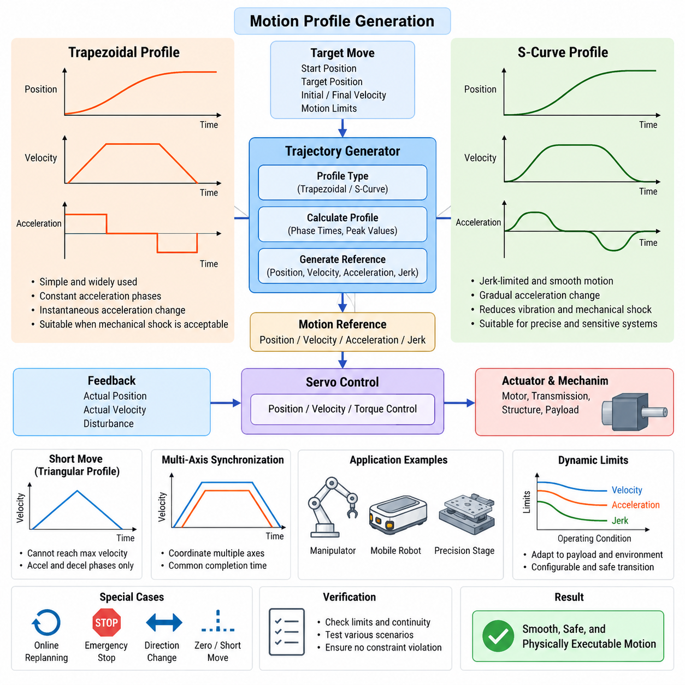
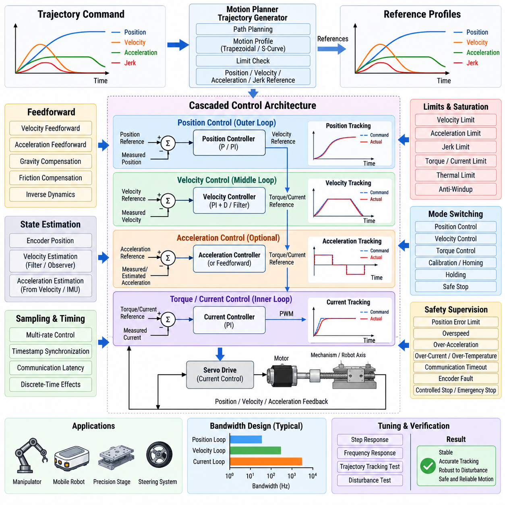
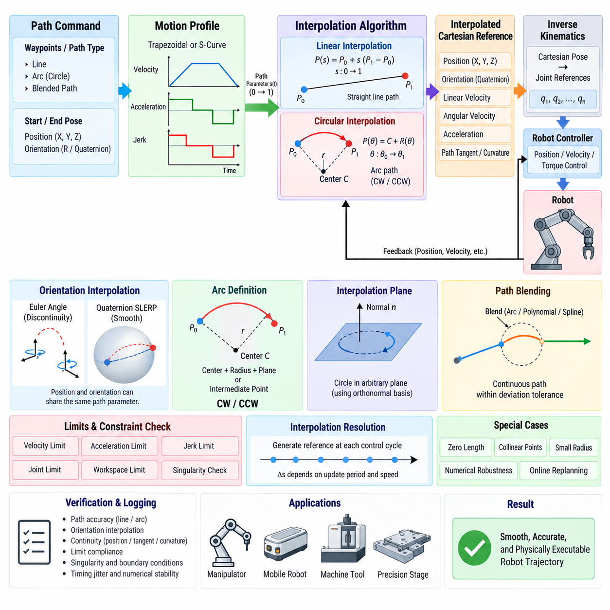
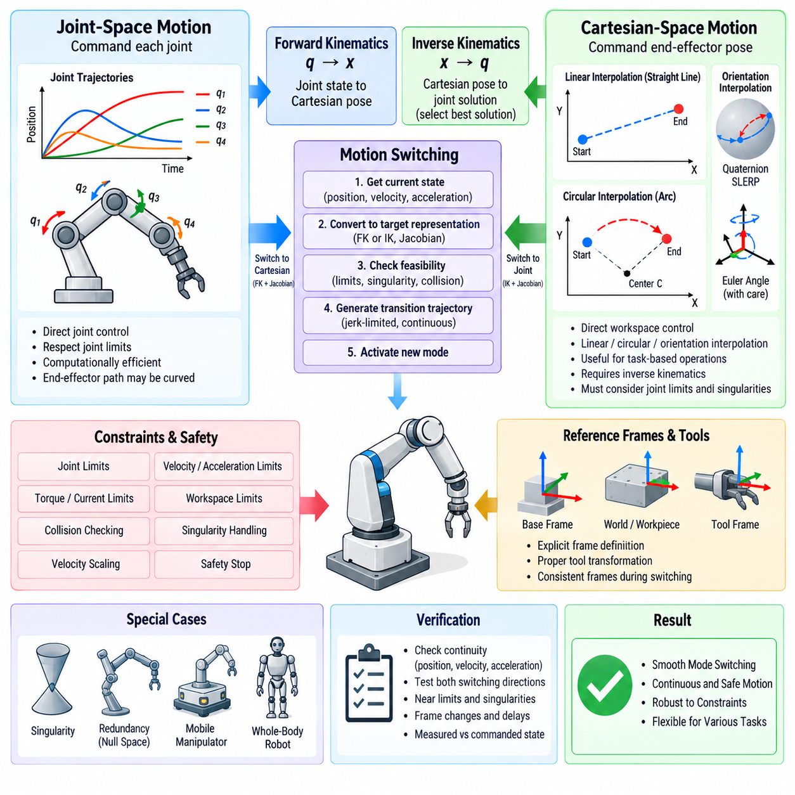
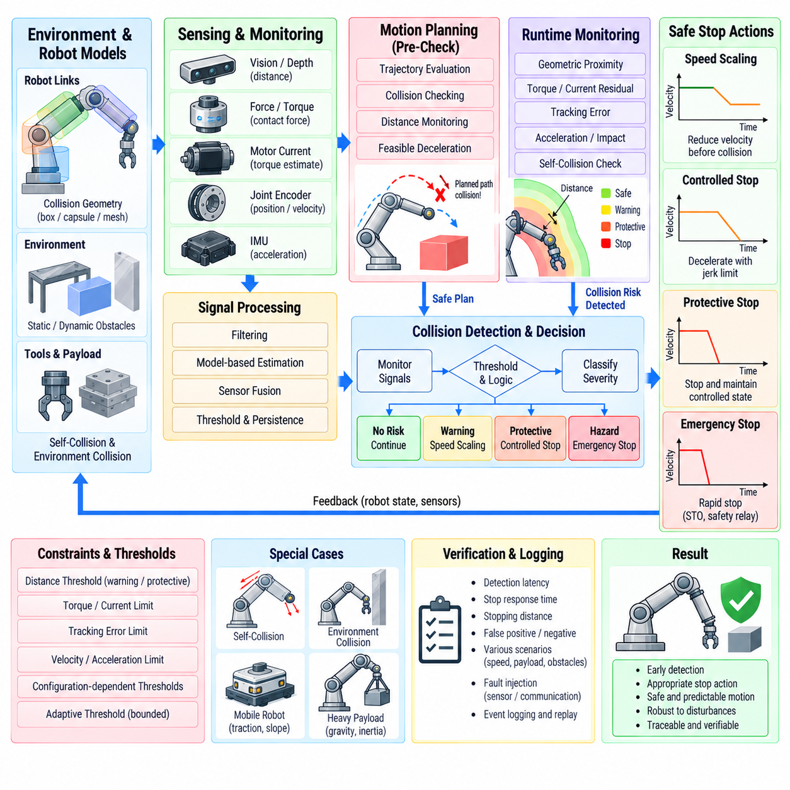
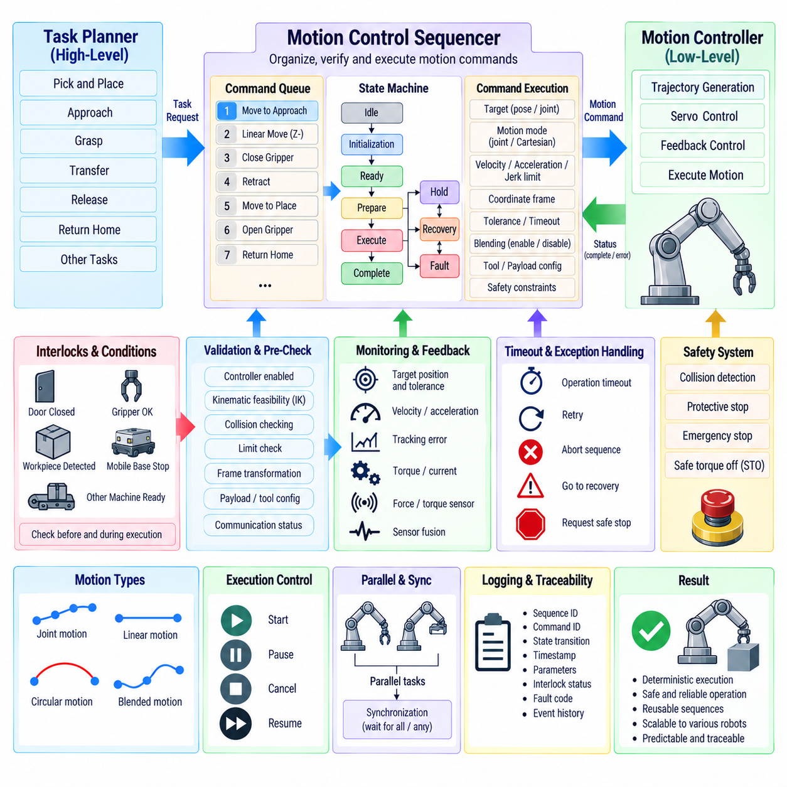
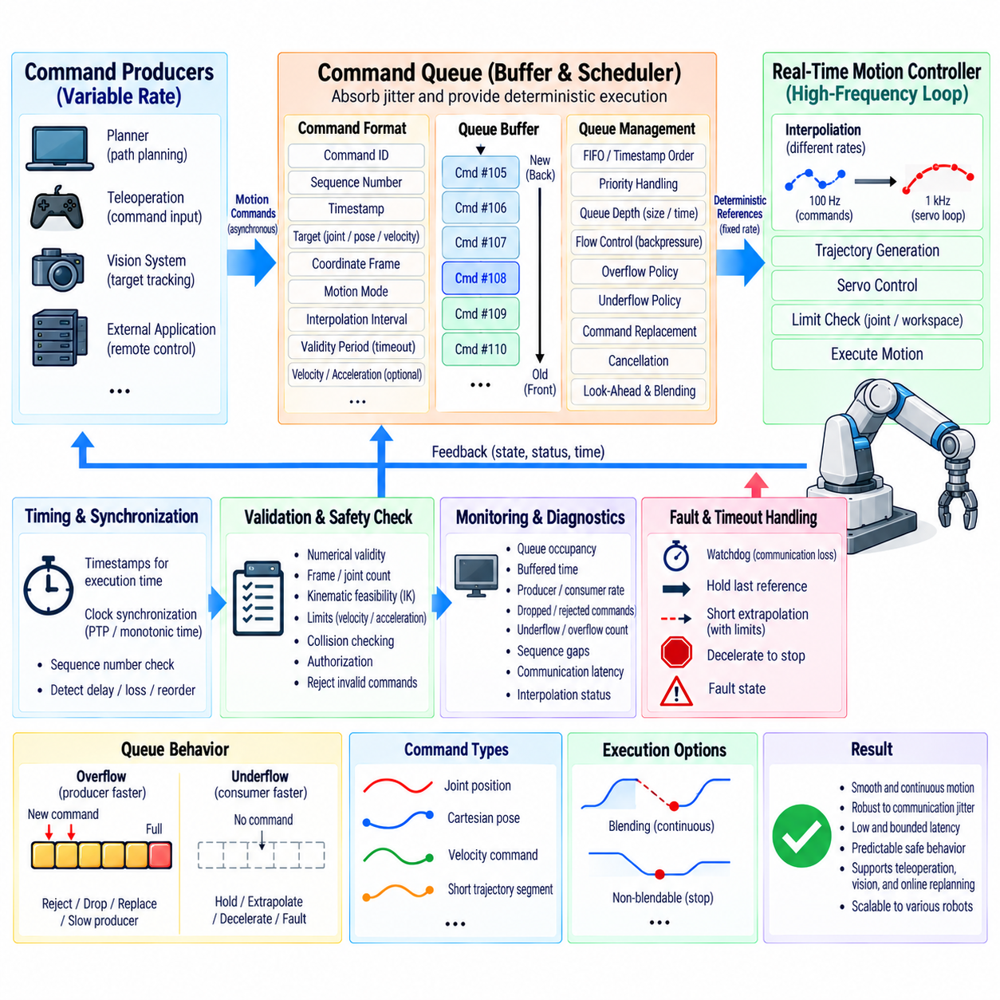
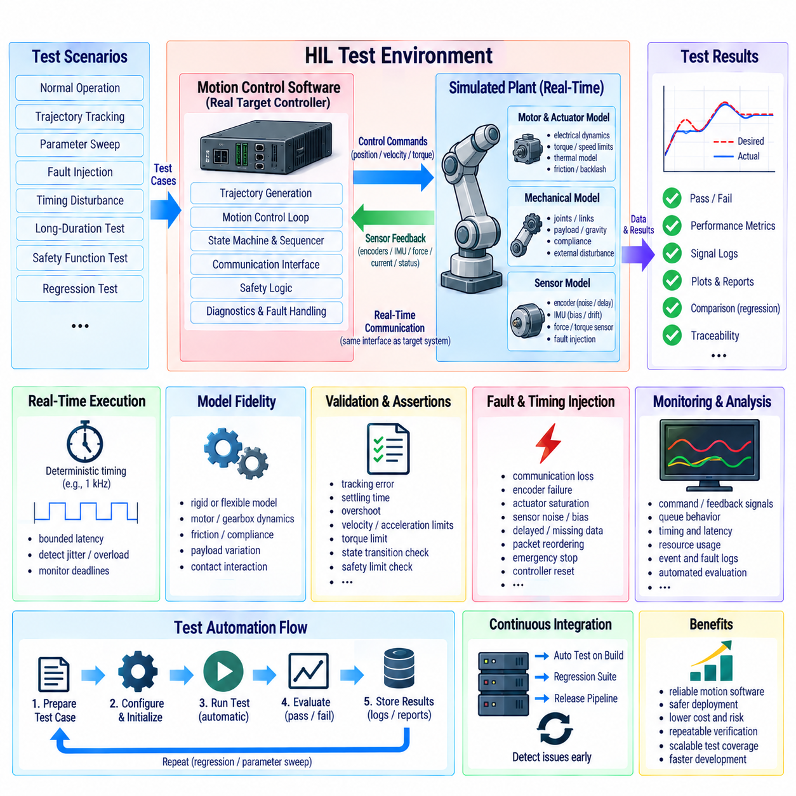
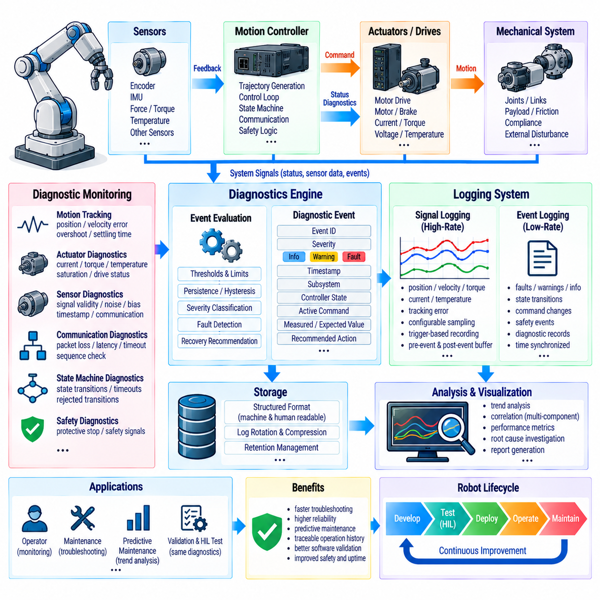
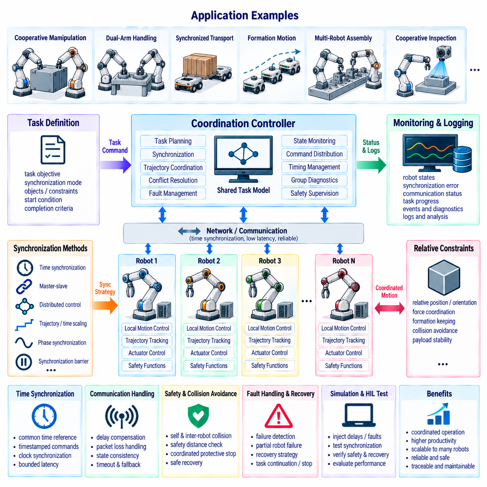

**Volume 04 Robot Control Software**


# 05. Motion Control Software

##  

## 05.01 Motion Profile Generation: Trapezoidal / S-Curve [w/Code]

{width="7.268055555555556in" height="7.268055555555556in"}

Motion profile generation converts a desired displacement into time-dependent position, velocity, acceleration, and sometimes jerk references that can be executed by a robot controller. Instead of commanding a joint or mobile axis to move instantly toward a target, the trajectory generator limits dynamic quantities so that motors, transmissions, structures, and payloads remain within their physical operating boundaries.

A trapezoidal velocity profile is one of the most widely used motion profiles because of its simplicity and deterministic execution. The motion is divided into acceleration, constant-velocity, and deceleration phases. During acceleration, velocity increases linearly under a constant acceleration command. After reaching the specified maximum velocity, the axis travels at constant speed until it must decelerate toward the final position.

The resulting velocity curve has a trapezoidal shape when the commanded displacement is sufficiently long. Position remains continuous and follows a piecewise quadratic or linear relationship with time, while acceleration changes between positive acceleration, zero acceleration, and negative acceleration. This structure makes the profile computationally inexpensive and suitable for embedded motor controllers that must generate references at high update rates.

Not every commanded displacement allows the axis to reach its configured maximum velocity. When the travel distance is short, the acceleration and deceleration portions intersect before the constant-velocity phase can occur. The resulting velocity trajectory becomes triangular rather than trapezoidal. A practical motion generator therefore calculates the required acceleration distance before deciding whether trapezoidal or triangular operation is physically feasible.

Although trapezoidal profiles provide bounded velocity and acceleration, their acceleration changes instantaneously at phase boundaries. These discontinuities correspond theoretically to very large jerk, where jerk represents the time derivative of acceleration. Real mechanical systems cannot reproduce instantaneous acceleration transitions, so such commands can excite structural vibration, transmission elasticity, wheel slip, payload oscillation, or audible mechanical shock.

S-curve motion profiles address this limitation by explicitly controlling jerk. Instead of switching acceleration immediately between fixed values, acceleration is gradually increased and decreased through finite-jerk segments. Velocity therefore changes smoothly, and the position trajectory acquires higher-order continuity. This approach reduces excitation of flexible structures and is particularly valuable for manipulators, precision stages, mobile robots, and systems carrying sensitive payloads.

A complete jerk-limited S-curve can contain several sequential phases: increasing acceleration, constant acceleration, decreasing acceleration, constant velocity, increasing deceleration, constant deceleration, and decreasing deceleration. Depending on travel distance and configured limits, some phases may disappear. The trajectory generator must therefore handle multiple profile configurations while preserving the requested displacement and final boundary conditions.

The fundamental constraints of profile generation are maximum velocity, maximum acceleration, and maximum jerk. These limits are normally derived from actuator capability, gear ratios, mechanical strength, traction conditions, payload characteristics, and control bandwidth. Software should treat them as coordinated constraints rather than independent parameters because changing one limit can alter the duration and feasibility of every subsequent trajectory segment.

For a single axis, the generator receives an initial position and target position together with initial and final velocity conditions. It calculates direction, displacement, phase durations, and peak dynamic values before producing references for the servo loop. At every control cycle, the trajectory state can be evaluated from analytical equations using elapsed time, avoiding the accumulation errors that can occur when references are generated only through repeated numerical integration.

Motion profile generation normally operates above the low-level position, velocity, or torque control loops. The profile generator determines what motion should occur over time, while the servo controller attempts to track that reference despite friction, disturbances, load variation, and modeling errors. Separating these responsibilities allows trajectory constraints and feedback-control parameters to be tuned independently while maintaining a clean software architecture.

In multi-axis manipulators, independently generated joint profiles can produce different completion times if each joint simply moves according to its own limits. Coordinated motion therefore requires synchronization. A common strategy calculates the minimum feasible duration for every participating axis, selects an appropriate common completion time, and scales individual profiles so that all joints reach their targets simultaneously without violating velocity, acceleration, or jerk constraints.

Synchronization becomes especially important when joint-space motion corresponds to an end-effector path. Poorly coordinated joint profiles can cause the Cartesian trajectory to deviate significantly from the intended geometry even though every individual joint reaches its final position correctly. For path-sensitive operations, motion profiling must therefore cooperate with trajectory interpolation, inverse kinematics, and Cartesian constraint management rather than operating as an isolated module.

Mobile robot applications use similar principles for longitudinal velocity and steering-related motion. Sudden changes in commanded speed can generate wheel slip, drivetrain shock, unstable payload behavior, or excessive current demand. Jerk-limited acceleration references improve traction and mechanical stability, particularly for heavy autonomous mobile robots, outdoor platforms, and robots operating on low-friction or irregular surfaces.

Motion limits may also need to change dynamically according to operating conditions. A manipulator can require lower acceleration while carrying a heavy payload, while an outdoor robot may reduce jerk and speed on slopes or rough terrain. The trajectory generator should therefore support configurable constraint sets and safe transitions between them instead of assuming that one fixed motion envelope is appropriate for every operating state.

Real-time implementation requires deterministic computation and predictable numerical behavior. Profile generation may occur once when a command is accepted, while profile evaluation occurs cyclically at the servo or motion-control rate. The software must correctly handle zero-distance commands, extremely short movements, reversed directions, nonzero initial velocity, command interruption, floating-point tolerances, and transitions near profile boundaries without producing discontinuous references.

Online replanning introduces additional complexity because a new target may arrive while the robot is already moving. Simply restarting a trajectory from zero velocity creates an artificial discontinuity. A robust generator instead uses the current commanded or measured motion state as the new initial condition and computes a dynamically feasible transition toward the updated target while respecting velocity, acceleration, and jerk limits.

Emergency stopping requires a different objective from normal trajectory generation. The priority becomes reducing kinetic energy and reaching a safe state within allowable mechanical and safety constraints. The motion software may therefore maintain separate controlled-stop and emergency-stop profiles, with different deceleration and jerk limits. These functions must coordinate with drive-level safety mechanisms rather than replacing certified hardware safety functions.

Profile quality should be evaluated using more than final positioning accuracy. Important software verification quantities include maximum velocity, acceleration, jerk, travel distance, completion time, continuity at segment boundaries, synchronization error, and constraint violations. Automated tests should cover long moves, short triangular profiles, direction reversals, interrupted commands, near-zero displacement, and parameter combinations close to physical limits.

Trapezoidal and S-curve profiles represent different engineering tradeoffs rather than universally superior and inferior solutions. Trapezoidal profiles provide simple equations, low computational cost, and fast responses when mechanical shock is acceptable. S-curves require additional calculations and potentially longer motion time but provide smoother force and torque transitions. The appropriate profile therefore depends on machine dynamics, precision requirements, payload sensitivity, and cycle-time objectives.

A well-designed motion-control software stack can expose both profile types through a common trajectory-generation interface. Higher-level planners specify target states and motion constraints, while the profile module selects or configures the required mathematical representation. The resulting position, velocity, acceleration, and jerk references are then delivered through a deterministic interface to the downstream control layer.

This abstraction also supports future extensions such as asymmetric acceleration and deceleration limits, velocity blending, waypoint transitions, time-optimal parameterization, Cartesian constraints, and model-based dynamic limits. The essential principle remains unchanged: geometric commands must be converted into physically executable time histories before they are sent to actuators. Motion profile generation therefore forms a critical bridge between planning and real-time robot control.

모션 프로파일 생성(Motion Profile Generation)은 원하는 변위(Displacement)를 시간에 따른 위치(Position), 속도(Velocity), 가속도(Acceleration), 그리고 경우에 따라 저크(Jerk) 기준값으로 변환하는 과정이다. 관절(Joint)이나 이동 축(Mobile Axis)을 목표 위치로 즉시 움직이도록 명령하는 대신, 궤적 생성기(Trajectory Generator)는 동적 물리량을 제한하여 모터(Motor), 변속기(Transmission), 기계 구조물(Structure), 탑재물(Payload)이 물리적인 동작 한계 내에서 유지되도록 한다.

사다리꼴 속도 프로파일(Trapezoidal Velocity Profile)은 구조가 단순하고 결정론적 실행(Deterministic Execution)이 가능하기 때문에 가장 널리 사용되는 모션 프로파일(Motion Profile) 중 하나이다. 모션은 가속(Acceleration), 정속(Constant-Velocity), 감속(Deceleration) 구간으로 구분된다. 가속 구간에서는 일정한 가속도 명령에 따라 속도가 선형적으로 증가하며, 지정된 최대 속도(Maximum Velocity)에 도달한 후에는 최종 위치를 향해 감속해야 하는 시점까지 일정한 속도로 이동한다.

명령된 변위가 충분히 긴 경우 결과적인 속도 곡선(Velocity Curve)은 사다리꼴 형태를 갖는다. 위치(Position)는 연속성을 유지하면서 시간에 대해 구간별 이차 또는 선형 관계(Piecewise Quadratic or Linear Relationship)를 따르며, 가속도는 양의 가속도, 0의 가속도, 음의 가속도 사이에서 변화한다. 이러한 구조는 계산 비용이 낮아 높은 갱신 주기(Update Rate)로 기준값을 생성해야 하는 임베디드 모터 제어기(Embedded Motor Controller)에 적합하다.

모든 명령 변위에서 축이 설정된 최대 속도에 도달할 수 있는 것은 아니다. 이동 거리가 짧으면 정속 구간이 형성되기 전에 가속 구간과 감속 구간이 서로 만나게 된다. 이 경우 속도 궤적(Velocity Trajectory)은 사다리꼴이 아니라 삼각형(Triangular) 형태가 된다. 따라서 실용적인 모션 생성기(Motion Generator)는 사다리꼴 또는 삼각형 동작 중 어떤 방식이 물리적으로 가능한지를 결정하기 전에 필요한 가속 거리(Acceleration Distance)를 계산해야 한다.

사다리꼴 프로파일(Trapezoidal Profile)은 속도와 가속도를 제한할 수 있지만, 각 구간의 경계에서 가속도가 순간적으로 변화한다. 이러한 불연속은 이론적으로 매우 큰 저크(Jerk)에 해당하며, 저크는 가속도의 시간 미분(Time Derivative of Acceleration)을 의미한다. 실제 기계 시스템은 순간적인 가속도 변화를 재현할 수 없으므로 이러한 명령은 구조 진동(Structural Vibration), 변속기 탄성(Transmission Elasticity), 바퀴 미끄러짐(Wheel Slip), 탑재물 진동(Payload Oscillation), 기계적 충격(Mechanical Shock)을 유발할 수 있다.

S-커브 모션 프로파일(S-Curve Motion Profile)은 저크(Jerk)를 명시적으로 제어함으로써 이러한 한계를 해결한다. 가속도를 고정된 값 사이에서 즉시 전환하는 대신, 유한한 저크 구간(Finite-Jerk Segment)을 통해 가속도를 점진적으로 증가시키고 감소시킨다. 이에 따라 속도 변화가 부드러워지고 위치 궤적(Position Trajectory)은 더 높은 차수의 연속성(Higher-Order Continuity)을 갖게 된다. 이러한 방식은 유연 구조물(Flexible Structure)의 진동 발생을 줄이며 매니퓰레이터(Manipulator), 정밀 스테이지(Precision Stage), 이동 로봇(Mobile Robot), 민감한 탑재물을 운반하는 시스템에서 특히 유용하다.

완전한 저크 제한 S-커브(Jerk-Limited S-Curve)는 가속도 증가, 일정 가속도, 가속도 감소, 정속, 감속도 증가, 일정 감속도, 감속도 감소와 같은 여러 연속적인 구간으로 구성될 수 있다. 이동 거리와 설정된 제한 조건에 따라 일부 구간은 사라질 수 있다. 따라서 궤적 생성기(Trajectory Generator)는 요구된 변위와 최종 경계 조건(Final Boundary Conditions)을 유지하면서 다양한 프로파일 구성(Profile Configuration)을 처리할 수 있어야 한다.

프로파일 생성(Profile Generation)의 기본적인 제약 조건은 최대 속도(Maximum Velocity), 최대 가속도(Maximum Acceleration), 최대 저크(Maximum Jerk)이다. 이러한 제한값은 일반적으로 액추에이터 성능(Actuator Capability), 기어비(Gear Ratio), 기계적 강도(Mechanical Strength), 접지 조건(Traction Condition), 탑재물 특성(Payload Characteristics), 제어 대역폭(Control Bandwidth)을 기반으로 결정된다. 하나의 제한값을 변경하면 이후 모든 궤적 구간의 지속 시간과 실행 가능성이 달라질 수 있으므로 소프트웨어는 이들을 독립적인 파라미터가 아니라 상호 연계된 제약 조건(Coordinated Constraints)으로 처리해야 한다.

단일 축(Single Axis)의 경우 생성기는 초기 위치(Initial Position)와 목표 위치(Target Position), 초기 및 최종 속도 조건(Velocity Conditions)을 입력받는다. 이후 방향(Direction), 변위, 각 구간의 지속 시간(Phase Duration), 최대 동적 값(Peak Dynamic Values)을 계산한 다음 서보 루프(Servo Loop)에 제공할 기준값을 생성한다. 각 제어 주기(Control Cycle)마다 경과 시간을 이용하여 해석적 방정식(Analytical Equation)으로 궤적 상태를 계산하면 반복적인 수치 적분(Numerical Integration)만으로 기준값을 생성할 때 발생할 수 있는 누적 오차를 방지할 수 있다.

모션 프로파일 생성은 일반적으로 저수준 위치(Position), 속도(Velocity), 토크 제어 루프(Torque Control Loop)의 상위 계층에서 동작한다. 프로파일 생성기는 시간에 따라 어떤 모션이 수행되어야 하는지를 결정하고, 서보 제어기(Servo Controller)는 마찰(Friction), 외란(Disturbance), 부하 변화(Load Variation), 모델링 오차(Modeling Error)가 존재하는 상황에서도 해당 기준값을 추종한다. 이러한 역할 분리는 궤적 제약 조건과 피드백 제어 파라미터(Feedback Control Parameter)를 독립적으로 조정할 수 있게 하면서 명확한 소프트웨어 아키텍처(Software Architecture)를 유지하도록 한다.

다축 매니퓰레이터(Multi-Axis Manipulator)에서는 각 관절이 자체 제한 조건에 따라 독립적으로 움직이면 관절별 완료 시간이 서로 달라질 수 있다. 따라서 협조 모션(Coordinated Motion)을 위해서는 동기화(Synchronization)가 필요하다. 일반적인 방법은 각 참여 축의 최소 실행 가능 시간(Minimum Feasible Duration)을 계산하고 적절한 공통 완료 시간을 선택한 후, 속도·가속도·저크 제한을 위반하지 않으면서 모든 관절이 동시에 목표 위치에 도달하도록 개별 프로파일을 조정하는 것이다.

관절 공간 모션(Joint-Space Motion)이 엔드 이펙터 경로(End-Effector Path)에 대응되는 경우 동기화는 더욱 중요하다. 관절 프로파일이 적절하게 협조되지 않으면 모든 관절이 최종 위치에 정확히 도달하더라도 카테시안 궤적(Cartesian Trajectory)이 의도된 기하학적 경로에서 크게 벗어날 수 있다. 따라서 경로 민감형 작업(Path-Sensitive Operation)에서는 모션 프로파일링(Motion Profiling)이 독립적인 모듈로 동작하기보다 궤적 보간(Trajectory Interpolation), 역기구학(Inverse Kinematics), 카테시안 제약 관리(Cartesian Constraint Management)와 연계되어야 한다.

이동 로봇(Mobile Robot)에서도 종방향 속도(Longitudinal Velocity)와 조향 관련 모션(Steering-Related Motion)에 유사한 원리가 적용된다. 명령 속도의 급격한 변화는 바퀴 미끄러짐, 구동계 충격(Drivetrain Shock), 탑재물의 불안정한 움직임, 과도한 전류 요구를 발생시킬 수 있다. 저크 제한 가속도 기준값(Jerk-Limited Acceleration Reference)은 특히 중량형 자율이동로봇(Autonomous Mobile Robot), 실외 플랫폼(Outdoor Platform), 저마찰 또는 불규칙 노면에서 운용되는 로봇의 접지력과 기계적 안정성을 향상시킨다.

모션 제한(Motion Limits)은 운용 조건에 따라 동적으로 변경되어야 할 수도 있다. 매니퓰레이터는 무거운 탑재물을 운반할 때 더 낮은 가속도가 필요할 수 있으며, 실외 로봇은 경사면이나 거친 지형에서 속도와 저크를 감소시킬 수 있다. 따라서 궤적 생성기는 모든 운용 상태에 하나의 고정된 모션 영역(Motion Envelope)을 적용하기보다 설정 가능한 제약 조건 집합(Configurable Constraint Set)과 이들 사이의 안전한 전환을 지원해야 한다.

실시간 구현(Real-Time Implementation)에서는 결정론적인 계산(Deterministic Computation)과 예측 가능한 수치적 동작(Numerical Behavior)이 요구된다. 프로파일 생성은 명령이 수락될 때 한 번 수행하고 프로파일 평가는 서보 또는 모션 제어 주기에 따라 반복적으로 수행할 수 있다. 소프트웨어는 0 거리 명령, 매우 짧은 이동, 방향 반전, 0이 아닌 초기 속도, 명령 중단, 부동소수점 허용오차(Floating-Point Tolerance), 프로파일 경계 부근의 전환을 불연속적인 기준값 없이 처리해야 한다.

온라인 재계획(Online Replanning)은 로봇이 이미 움직이는 동안 새로운 목표가 입력될 수 있기 때문에 추가적인 복잡성을 갖는다. 단순히 속도 0에서 새로운 궤적을 다시 시작하면 인위적인 불연속이 발생한다. 견고한 생성기(Robust Generator)는 현재 명령 또는 측정된 모션 상태를 새로운 초기 조건으로 사용하고, 속도·가속도·저크 제한을 준수하면서 변경된 목표를 향해 동적으로 실행 가능한 전환 궤적을 계산한다.

비상 정지(Emergency Stop)는 정상적인 궤적 생성과 다른 목적을 갖는다. 우선순위는 허용 가능한 기계적 및 안전 제약 조건 내에서 운동 에너지(Kinetic Energy)를 감소시키고 안전 상태(Safe State)에 도달하는 것이다. 따라서 모션 소프트웨어는 서로 다른 감속 및 저크 제한을 갖는 제어 정지(Controlled Stop)와 비상 정지 프로파일을 별도로 유지할 수 있다. 이러한 기능은 인증된 하드웨어 안전 기능(Certified Hardware Safety Function)을 대체하는 것이 아니라 드라이브 수준 안전 메커니즘(Drive-Level Safety Mechanism)과 협조되어야 한다.

프로파일 품질(Profile Quality)은 최종 위치 정확도만으로 평가해서는 안 된다. 중요한 소프트웨어 검증 항목에는 최대 속도, 가속도, 저크, 이동 거리, 완료 시간(Completion Time), 구간 경계에서의 연속성, 동기화 오차(Synchronization Error), 제약 조건 위반 여부가 포함된다. 자동화 시험(Automated Test)은 장거리 이동, 짧은 삼각형 프로파일, 방향 반전, 명령 중단, 거의 0에 가까운 변위, 물리적 한계에 근접한 파라미터 조합을 포함해야 한다.

사다리꼴 프로파일과 S-커브 프로파일은 어느 한쪽이 항상 우수한 방식이라기보다 서로 다른 공학적 절충(Engineering Tradeoff)을 제공한다. 사다리꼴 프로파일은 단순한 방정식, 낮은 계산 비용, 기계적 충격이 허용되는 조건에서 빠른 응답을 제공한다. S-커브는 추가적인 계산과 더 긴 이동 시간이 필요할 수 있지만 힘과 토크의 변화를 더욱 부드럽게 만든다. 따라서 적절한 프로파일은 기계 동역학(Machine Dynamics), 정밀도 요구사항, 탑재물 민감도, 사이클 시간(Cycle Time) 목표에 따라 결정되어야 한다.

잘 설계된 모션 제어 소프트웨어 스택(Motion-Control Software Stack)은 두 프로파일 방식을 공통 궤적 생성 인터페이스(Common Trajectory-Generation Interface)를 통해 제공할 수 있다. 상위 수준 플래너(High-Level Planner)는 목표 상태와 모션 제약 조건을 지정하고, 프로파일 모듈(Profile Module)은 필요한 수학적 표현을 선택하거나 설정한다. 생성된 위치, 속도, 가속도, 저크 기준값은 결정론적 인터페이스(Deterministic Interface)를 통해 하위 제어 계층(Downstream Control Layer)으로 전달된다.

이러한 추상화(Abstraction)는 비대칭 가속 및 감속 제한(Asymmetric Acceleration and Deceleration Limits), 속도 블렌딩(Velocity Blending), 웨이포인트 전환(Waypoint Transition), 시간 최적 파라미터화(Time-Optimal Parameterization), 카테시안 제약 조건, 모델 기반 동적 제한(Model-Based Dynamic Limits)과 같은 향후 확장도 지원한다. 핵심 원리는 동일하다. 기하학적 명령(Geometric Command)은 액추에이터에 전달되기 전에 물리적으로 실행 가능한 시간 이력(Time History)으로 변환되어야 하며, 모션 프로파일 생성은 계획(Planning)과 실시간 로봇 제어(Real-Time Robot Control)를 연결하는 핵심적인 가교 역할을 수행한다.

##  

## 05.02 Position, Velocity, Acceleration Control Layer Design

{width="7.268055555555556in" height="7.268055555555556in"}

Position, velocity, and acceleration control form a layered motion-control architecture that converts high-level trajectory commands into stable actuator behavior. Each layer operates on a different representation of motion and normally at a different control bandwidth. The design objective is to separate trajectory tracking, dynamic response, and actuator regulation while maintaining predictable information flow between the layers.

The position-control layer determines how accurately a robot axis follows a commanded position trajectory. It compares the desired position with the measured position and converts the resulting position error into a velocity or dynamic correction command. Because position represents the outermost motion state, this loop generally operates with lower bandwidth than the inner velocity and current or torque loops.

A proportional position controller is sufficient for many servo systems when the inner velocity loop provides strong damping and disturbance rejection. Increasing position gain reduces tracking error and improves responsiveness, but excessive gain can amplify mechanical resonance, encoder noise, communication delay, or structural flexibility. Position-loop tuning must therefore consider the dynamics of the complete actuator and mechanism rather than only the mathematical error.

The velocity-control layer receives a velocity reference from the position controller, trajectory generator, or direct velocity command. It compares this reference with measured or estimated velocity and generates a torque, current, or acceleration-related command. Since velocity control directly influences damping and disturbance rejection, its bandwidth is normally higher than that of the position loop and lower than the electrical current-control loop.

Velocity feedback may be obtained directly from a sensor or estimated from position measurements. Numerical differentiation of encoder position is simple but can significantly amplify quantization and measurement noise. Practical implementations therefore use filtering, observer-based estimation, or drive-provided velocity estimates. Filtering must be selected carefully because excessive smoothing introduces phase delay and can reduce the stability margin of the closed-loop system.

Acceleration control provides an additional dynamic layer when direct regulation of acceleration is useful. Acceleration may be measured using an inertial sensor, estimated from velocity, or predicted using a dynamic model. In many industrial servo systems acceleration is primarily used as a feedforward quantity rather than as an independent feedback loop, while advanced robotic systems can combine acceleration feedback with force, torque, or disturbance estimation.

Feedforward control is important because feedback alone reacts only after tracking error has developed. Velocity feedforward can compensate for motion-dependent behavior, while acceleration feedforward can generate torque proportional to the inertia required to execute a trajectory. When an adequate dynamic model is available, gravity, friction, Coriolis, and payload-dependent terms can also be added before the inner control loop.

A typical cascaded architecture therefore contains an outer position loop, an intermediate velocity loop, and an inner torque or current loop. The position controller produces a velocity reference, the velocity controller produces a torque or current reference, and the drive regulates motor current. Each inner loop should respond significantly faster than its outer loop so that the outer controller can treat the inner dynamics as approximately settled.

Bandwidth separation is a fundamental design principle for cascaded control. If neighboring loops operate at nearly identical bandwidths, their dynamic interactions can create oscillation, overshoot, or difficult tuning behavior. A practical design assigns the electrical current loop the highest bandwidth, the velocity loop an intermediate bandwidth, and the position loop a lower bandwidth while accounting for sampling frequency and mechanical resonances.

Acceleration commands generated by a trajectory planner should not bypass physical constraints simply because they are mathematically valid. Before reaching the actuator, commands must be checked against velocity, acceleration, torque, current, power, and thermal limits. Saturation management is especially important because an outer controller can continue accumulating error while an inner actuator is already operating at its physical limit.

Integral action is frequently used in velocity or position control to remove steady-state error caused by friction, constant disturbances, or load imbalance. However, actuator saturation can cause the integral state to accumulate excessively, producing windup and large overshoot after saturation ends. Anti-windup logic limits, freezes, or back-calculates the integrator so that recovery remains controlled and predictable.

Derivative action can improve damping but is sensitive to measurement noise. In practical robot controllers, derivative behavior is often implemented through filtered velocity feedback rather than direct differentiation of position error. This avoids severe amplification of encoder quantization and high-frequency disturbances. Controller structure should therefore be selected according to available sensors and signal quality rather than by applying a textbook PID equation unchanged.

Reference limiting should be clearly separated from feedback regulation. The trajectory generator defines feasible position, velocity, acceleration, and jerk references, while the control layers minimize tracking error relative to those references. Allowing feedback controllers to generate unrestricted commands can undermine trajectory constraints, so software interfaces should explicitly define saturation, rate limits, and authority boundaries between planning and control.

Sampling rates must be selected according to the dynamics of each layer. A high-speed motor current loop may execute inside the servo drive, while velocity and position control can execute at progressively slower rates in a motion controller or robot computer. Multi-rate architecture reduces computational load but requires careful synchronization, timestamp management, interpolation, and deterministic communication between components.

Discrete-time implementation introduces effects that do not appear in ideal continuous-time controller equations. Sampling delay, computation time, communication latency, quantization, and zero-order hold behavior all consume phase margin. A controller that appears stable in continuous simulation can therefore oscillate on actual hardware. Digital implementation should be evaluated using realistic update rates and measured end-to-end latency.

Command and feedback timing must also remain consistent. If a controller compares a newly generated reference with an old sensor measurement, the apparent tracking error contains timing error in addition to physical error. Timestamped data, synchronized clocks, bounded communication latency, and deterministic scheduling become increasingly important as control bandwidth increases or multiple distributed controllers cooperate over a network.

In a multi-axis robot, each joint may contain its own cascaded control structure, but the joints are dynamically coupled through the mechanism. Independent joint controllers can perform well at moderate speeds, while high-speed manipulators or heavy payload systems may require model-based compensation for coupling effects. Feedforward inverse dynamics can reduce the burden on individual feedback loops while preserving the modular joint-control architecture.

Mobile robots apply the same layered concept differently. A wheel position or velocity loop may run at the actuator level, while a chassis controller generates wheel references from desired linear and angular motion. Acceleration limiting above the wheel controller prevents abrupt traction demand. For steering systems, position control regulates steering angle while velocity and torque layers provide fast and stable actuator response.

Mode switching is another important software-design issue. Robots may transition among position control, velocity control, torque control, calibration, holding, and safe-stop modes. A direct switch between controllers with inconsistent internal states can create command discontinuities. Bumpless transfer techniques initialize references, integrators, filters, and controller states so that the transition occurs without an unintended mechanical impulse.

Safety supervision should remain distinct from normal motion regulation. Control layers manage tracking performance, whereas safety logic monitors limits such as excessive position error, overspeed, excessive acceleration, motor current, thermal state, communication timeout, and encoder faults. When a violation occurs, the supervisory layer can request controlled deceleration or escalate to drive-level safety functions according to system requirements.

The software architecture should make controller interfaces explicit. Each control layer should define its input reference, feedback signal, output command, execution period, units, coordinate frame, valid range, saturation behavior, and fault response. Such contracts prevent ambiguity when controllers are distributed across servo drives, embedded processors, real-time computers, or ROS-based higher-level software.

Controller tuning should proceed from the innermost loop outward. The torque or current loop is stabilized first, followed by the velocity loop and then the position loop. This sequence preserves the assumption that each inner loop behaves predictably when an outer loop is tuned. Frequency-response analysis, step responses, trajectory tracking tests, and disturbance tests can then be used to validate stability and performance.

Verification should examine both nominal and boundary conditions. Important cases include slow and high-speed trajectories, sudden load changes, command saturation, sensor noise, communication delay, direction reversal, zero-speed holding, and emergency deceleration. Logged position, velocity, acceleration, torque, tracking error, saturation state, and timing information provide evidence for identifying interactions that cannot be observed from final position accuracy alone.

A robust layered controller combines trajectory feasibility, feedforward prediction, feedback correction, saturation management, timing integrity, and safety supervision into one coherent motion-control pipeline. Position, velocity, and acceleration should not be treated as isolated variables; they are connected states of the same physical motion. Their software layers must therefore cooperate while preserving clear bandwidth, authority, and interface boundaries.

This layered architecture provides a scalable foundation for different robot platforms. The same principles can support individual motor axes, multi-joint manipulators, autonomous mobile robots, steering actuators, precision stages, and whole-body robotic systems. By separating motion generation from progressively faster control layers, the software can achieve accurate tracking, stable dynamic response, reusable interfaces, and physically consistent actuator commands.

위치(Position), 속도(Velocity), 가속도(Acceleration) 제어는 상위 수준의 궤적 명령(Trajectory Command)을 안정적인 액추에이터 동작(Actuator Behavior)으로 변환하는 계층형 모션 제어 아키텍처(Layered Motion-Control Architecture)를 구성한다. 각 계층은 서로 다른 모션 표현(Motion Representation)을 다루며 일반적으로 서로 다른 제어 대역폭(Control Bandwidth)에서 동작한다. 설계 목적은 궤적 추종(Trajectory Tracking), 동적 응답(Dynamic Response), 액추에이터 조절(Actuator Regulation)을 분리하면서 각 계층 사이에서 예측 가능한 정보 흐름을 유지하는 것이다.

위치 제어 계층(Position-Control Layer)은 로봇 축(Robot Axis)이 명령된 위치 궤적을 얼마나 정확하게 추종하는지를 결정한다. 원하는 위치와 측정된 위치를 비교하고, 그 결과로 발생하는 위치 오차(Position Error)를 속도 또는 동적 보정 명령(Dynamic Correction Command)으로 변환한다. 위치는 가장 바깥쪽의 모션 상태(Motion State)를 나타내므로 이 루프는 일반적으로 내부의 속도 및 전류 또는 토크 루프보다 낮은 대역폭에서 동작한다.

내부 속도 루프(Velocity Loop)가 충분한 감쇠(Damping)와 외란 제거(Disturbance Rejection)를 제공하는 경우 비례 위치 제어기(Proportional Position Controller)만으로도 많은 서보 시스템(Servo System)을 제어할 수 있다. 위치 이득(Position Gain)을 증가시키면 추종 오차가 감소하고 응답성이 향상되지만, 지나치게 높은 이득은 기계적 공진(Mechanical Resonance), 엔코더 잡음(Encoder Noise), 통신 지연(Communication Delay), 구조적 유연성(Structural Flexibility)의 영향을 증폭시킬 수 있다. 따라서 위치 루프 튜닝(Position-Loop Tuning)은 수학적인 오차뿐 아니라 전체 액추에이터와 기구부(Mechanism)의 동역학을 고려해야 한다.

속도 제어 계층(Velocity-Control Layer)은 위치 제어기, 궤적 생성기(Trajectory Generator), 또는 직접 속도 명령(Direct Velocity Command)으로부터 속도 기준값(Velocity Reference)을 입력받는다. 이 기준값을 측정 또는 추정된 속도와 비교하여 토크(Torque), 전류(Current), 또는 가속도 관련 명령을 생성한다. 속도 제어는 감쇠와 외란 제거에 직접적인 영향을 미치므로 일반적으로 위치 루프보다 높은 대역폭, 전기적 전류 제어 루프(Electrical Current-Control Loop)보다 낮은 대역폭에서 동작한다.

속도 피드백(Velocity Feedback)은 센서에서 직접 측정하거나 위치 측정값으로부터 추정할 수 있다. 엔코더 위치(Encoder Position)의 수치 미분(Numerical Differentiation)은 구현이 간단하지만 양자화(Quantization)와 측정 잡음을 크게 증폭시킬 수 있다. 따라서 실제 구현에서는 필터링(Filtering), 관측기 기반 추정(Observer-Based Estimation), 또는 드라이브에서 제공하는 속도 추정값을 사용한다. 과도한 필터링은 위상 지연(Phase Delay)을 발생시키고 폐루프 시스템(Closed-Loop System)의 안정 여유(Stability Margin)를 감소시킬 수 있으므로 신중하게 설정해야 한다.

가속도 제어(Acceleration Control)는 가속도를 직접 조절하는 것이 유용한 경우 추가적인 동적 계층(Dynamic Layer)을 제공한다. 가속도는 관성 센서(Inertial Sensor)를 이용하여 측정하거나 속도로부터 추정하거나 동역학 모델(Dynamic Model)을 이용하여 예측할 수 있다. 많은 산업용 서보 시스템에서 가속도는 독립적인 피드백 루프보다 주로 피드포워드 항(Feedforward Term)으로 사용되며, 고급 로봇 시스템에서는 가속도 피드백을 힘(Force), 토크, 외란 추정(Disturbance Estimation)과 결합할 수 있다.

피드포워드 제어(Feedforward Control)는 피드백만으로는 추종 오차가 발생한 이후에야 대응할 수 있기 때문에 중요하다. 속도 피드포워드(Velocity Feedforward)는 모션 의존적인 동작을 보상할 수 있으며, 가속도 피드포워드(Acceleration Feedforward)는 궤적 실행에 필요한 관성(Inertia)에 비례하는 토크를 생성할 수 있다. 적절한 동역학 모델이 존재하면 중력(Gravity), 마찰(Friction), 코리올리 효과(Coriolis Effect), 탑재물 의존 항(Payload-Dependent Term)도 내부 제어 루프에 전달되기 전에 추가할 수 있다.

일반적인 캐스케이드 제어 아키텍처(Cascaded Control Architecture)는 외부 위치 루프(Outer Position Loop), 중간 속도 루프(Intermediate Velocity Loop), 내부 토크 또는 전류 루프(Inner Torque or Current Loop)로 구성된다. 위치 제어기는 속도 기준값을 생성하고, 속도 제어기는 토크 또는 전류 기준값을 생성하며, 드라이브(Drive)는 모터 전류를 조절한다. 각 내부 루프는 외부 루프보다 충분히 빠르게 응답해야 하며, 이를 통해 외부 제어기는 내부 동역학이 거의 안정화된 것으로 간주할 수 있다.

대역폭 분리(Bandwidth Separation)는 캐스케이드 제어의 기본적인 설계 원칙이다. 인접한 제어 루프가 거의 동일한 대역폭에서 동작하면 동적 상호작용으로 인해 진동(Oscillation), 오버슈트(Overshoot), 튜닝의 어려움이 발생할 수 있다. 실제 설계에서는 샘플링 주파수(Sampling Frequency)와 기계적 공진을 고려하면서 전류 루프에 가장 높은 대역폭, 속도 루프에 중간 대역폭, 위치 루프에 상대적으로 낮은 대역폭을 할당한다.

궤적 플래너(Trajectory Planner)가 생성한 가속도 명령은 수학적으로 유효하다는 이유만으로 물리적 제약 조건을 우회해서는 안 된다. 액추에이터에 전달되기 전에 명령은 속도, 가속도, 토크, 전류, 전력(Power), 열적 한계(Thermal Limit)를 기준으로 검사되어야 한다. 특히 내부 액추에이터가 이미 물리적 한계에서 동작하고 있는 동안 외부 제어기가 계속 오차를 누적할 수 있으므로 포화 관리(Saturation Management)가 중요하다.

적분 동작(Integral Action)은 마찰, 일정한 외란, 부하 불균형(Load Imbalance)으로 발생하는 정상상태 오차(Steady-State Error)를 제거하기 위해 속도 또는 위치 제어에서 자주 사용된다. 그러나 액추에이터 포화(Actuator Saturation)가 발생하면 적분 상태가 과도하게 누적되어 포화가 해제된 이후 큰 오버슈트를 발생시킬 수 있다. 안티 와인드업(Anti-Windup) 로직은 적분기의 값을 제한하거나 정지시키거나 역계산(Back-Calculation)하여 복구 과정이 제어 가능하고 예측 가능하도록 한다.

미분 동작(Derivative Action)은 감쇠 성능을 향상시킬 수 있지만 측정 잡음에 민감하다. 실제 로봇 제어기에서는 위치 오차를 직접 미분하기보다 필터링된 속도 피드백(Filtered Velocity Feedback)을 이용하여 미분 동작을 구현하는 경우가 많다. 이를 통해 엔코더 양자화와 고주파 외란(High-Frequency Disturbance)의 심각한 증폭을 방지할 수 있다. 따라서 제어기 구조는 교과서적인 PID 방정식을 그대로 적용하기보다 사용 가능한 센서와 신호 품질(Signal Quality)에 따라 선택해야 한다.

기준값 제한(Reference Limiting)은 피드백 조절(Feedback Regulation)과 명확하게 분리되어야 한다. 궤적 생성기는 실행 가능한 위치, 속도, 가속도, 저크(Jerk) 기준값을 정의하고, 제어 계층은 해당 기준값에 대한 추종 오차를 최소화한다. 피드백 제어기가 제한되지 않은 명령을 생성하도록 허용하면 궤적 제약 조건이 무력화될 수 있으므로 소프트웨어 인터페이스는 계획(Planning)과 제어(Control) 사이의 포화, 변화율 제한(Rate Limit), 제어 권한 경계(Authority Boundary)를 명확하게 정의해야 한다.

샘플링 속도(Sampling Rate)는 각 계층의 동역학 특성에 따라 선택해야 한다. 고속 모터 전류 루프는 서보 드라이브 내부에서 실행될 수 있으며, 속도 및 위치 제어는 모션 제어기(Motion Controller) 또는 로봇 컴퓨터에서 점진적으로 낮은 속도로 실행될 수 있다. 다중 주기 아키텍처(Multi-Rate Architecture)는 계산 부하를 줄이지만 구성 요소 사이에서 정밀한 동기화(Synchronization), 타임스탬프 관리(Timestamp Management), 보간(Interpolation), 결정론적 통신(Deterministic Communication)을 요구한다.

이산시간 구현(Discrete-Time Implementation)은 이상적인 연속시간 제어기 방정식(Continuous-Time Controller Equation)에서는 나타나지 않는 영향을 발생시킨다. 샘플링 지연(Sampling Delay), 계산 시간(Computation Time), 통신 지연, 양자화, 영차 유지(Zero-Order Hold) 동작은 모두 위상 여유(Phase Margin)를 감소시킨다. 따라서 연속시간 시뮬레이션에서는 안정적인 제어기도 실제 하드웨어에서는 진동할 수 있으며, 디지털 구현은 실제 갱신 주기와 측정된 종단 간 지연(End-to-End Latency)을 이용하여 평가해야 한다.

명령과 피드백의 시간 정보도 일관성을 유지해야 한다. 제어기가 새롭게 생성된 기준값을 오래된 센서 측정값과 비교하면 실제 물리적 오차뿐 아니라 시간 오차(Timing Error)까지 추종 오차에 포함된다. 제어 대역폭이 증가하거나 여러 분산 제어기(Distributed Controller)가 네트워크를 통해 협조할수록 타임스탬프 데이터(Timestamped Data), 동기화된 클록(Synchronized Clock), 제한된 통신 지연(Bounded Communication Latency), 결정론적 스케줄링(Deterministic Scheduling)이 더욱 중요해진다.

다축 로봇(Multi-Axis Robot)에서는 각 관절이 자체적인 캐스케이드 제어 구조를 가질 수 있지만, 관절들은 기구부를 통해 동역학적으로 결합되어 있다. 독립 관절 제어기(Independent Joint Controller)는 중간 수준의 속도에서는 우수하게 동작할 수 있지만, 고속 매니퓰레이터 또는 중량 탑재 시스템에서는 결합 효과(Coupling Effect)에 대한 모델 기반 보상(Model-Based Compensation)이 필요할 수 있다. 피드포워드 역동역학(Feedforward Inverse Dynamics)은 개별 피드백 루프의 부담을 줄이면서 모듈화된 관절 제어 아키텍처를 유지할 수 있다.

이동 로봇(Mobile Robot)은 동일한 계층형 개념을 다른 방식으로 적용한다. 바퀴 위치 또는 속도 루프는 액추에이터 수준에서 실행되고, 차체 제어기(Chassis Controller)는 원하는 선속도(Linear Motion)와 각속도(Angular Motion)로부터 바퀴 기준값을 생성할 수 있다. 바퀴 제어기 상위에서 가속도를 제한하면 급격한 접지력 요구를 방지할 수 있다. 조향 시스템(Steering System)에서는 위치 제어가 조향각(Steering Angle)을 조절하고 속도 및 토크 계층이 빠르고 안정적인 액추에이터 응답을 제공한다.

모드 전환(Mode Switching)도 중요한 소프트웨어 설계 문제이다. 로봇은 위치 제어, 속도 제어, 토크 제어, 캘리브레이션(Calibration), 위치 유지(Holding), 안전 정지(Safe Stop) 모드 사이를 전환할 수 있다. 내부 상태가 일치하지 않는 제어기 사이에서 직접 전환하면 명령 불연속(Command Discontinuity)이 발생할 수 있다. 무충격 전환(Bumpless Transfer) 기법은 기준값, 적분기, 필터, 제어기 상태를 초기화하여 의도하지 않은 기계적 충격 없이 모드가 전환되도록 한다.

안전 감독(Safety Supervision)은 정상적인 모션 조절과 분리되어야 한다. 제어 계층은 추종 성능을 관리하는 반면 안전 로직(Safety Logic)은 과도한 위치 오차, 과속(Overspeed), 과도한 가속도, 모터 전류, 열 상태(Thermal State), 통신 타임아웃(Communication Timeout), 엔코더 고장(Encoder Fault) 등의 한계를 감시한다. 위반이 발생하면 감독 계층(Supervisory Layer)은 시스템 요구사항에 따라 제어 감속(Controlled Deceleration)을 요청하거나 드라이브 수준의 안전 기능으로 전환할 수 있다.

소프트웨어 아키텍처는 제어기 인터페이스(Controller Interface)를 명확하게 정의해야 한다. 각 제어 계층은 입력 기준값(Input Reference), 피드백 신호(Feedback Signal), 출력 명령(Output Command), 실행 주기(Execution Period), 단위(Units), 좌표계(Coordinate Frame), 유효 범위(Valid Range), 포화 동작(Saturation Behavior), 고장 대응(Fault Response)을 정의해야 한다. 이러한 인터페이스 계약(Interface Contract)은 제어기가 서보 드라이브, 임베디드 프로세서(Embedded Processor), 실시간 컴퓨터(Real-Time Computer), ROS 기반 상위 소프트웨어에 분산될 때 발생할 수 있는 모호성을 방지한다.

제어기 튜닝(Controller Tuning)은 가장 내부의 루프부터 외부 방향으로 진행해야 한다. 먼저 토크 또는 전류 루프를 안정화하고, 이후 속도 루프와 위치 루프를 순차적으로 조정한다. 이러한 순서는 외부 루프를 튜닝할 때 각 내부 루프가 예측 가능하게 동작한다는 가정을 유지한다. 이후 주파수 응답 분석(Frequency-Response Analysis), 계단 응답(Step Response), 궤적 추종 시험(Trajectory Tracking Test), 외란 시험(Disturbance Test)을 통해 안정성과 성능을 검증할 수 있다.

검증(Verification)은 정상적인 동작뿐 아니라 경계 조건(Boundary Condition)도 포함해야 한다. 중요한 시험 조건에는 저속 및 고속 궤적, 급격한 부하 변화, 명령 포화, 센서 잡음, 통신 지연, 방향 반전, 영속도 유지(Zero-Speed Holding), 비상 감속(Emergency Deceleration)이 포함된다. 기록된 위치, 속도, 가속도, 토크, 추종 오차, 포화 상태, 시간 정보를 이용하면 최종 위치 정확도만으로는 확인할 수 없는 제어 계층 간의 상호작용을 분석할 수 있다.

견고한 계층형 제어기(Robust Layered Controller)는 궤적 실행 가능성(Trajectory Feasibility), 피드포워드 예측(Feedforward Prediction), 피드백 보정(Feedback Correction), 포화 관리, 시간 무결성(Timing Integrity), 안전 감독을 하나의 일관된 모션 제어 파이프라인(Motion-Control Pipeline)으로 통합한다. 위치, 속도, 가속도는 서로 독립된 변수가 아니라 동일한 물리적 모션을 표현하는 연결된 상태이므로, 각 소프트웨어 계층은 명확한 대역폭, 제어 권한, 인터페이스 경계를 유지하면서 상호 협력해야 한다.

이러한 계층형 아키텍처는 다양한 로봇 플랫폼으로 확장 가능한 기반을 제공한다. 동일한 원리를 개별 모터 축, 다관절 매니퓰레이터(Multi-Joint Manipulator), 자율이동로봇(Autonomous Mobile Robot), 조향 액추에이터(Steering Actuator), 정밀 스테이지(Precision Stage), 전신 로봇 시스템(Whole-Body Robotic System)에 적용할 수 있다. 모션 생성(Motion Generation)과 점진적으로 빠르게 동작하는 제어 계층을 분리함으로써 소프트웨어는 정확한 추종, 안정적인 동적 응답, 재사용 가능한 인터페이스, 물리적으로 일관된 액추에이터 명령을 구현할 수 있다.

##  

## 05.03 Linear and Circular Interpolation Algorithm [w/Code]

{width="7.268055555555556in" height="7.268055555555556in"}

Linear and circular interpolation algorithms convert geometric path definitions into continuously updated reference points that a robot or motion controller can execute. While motion profiles determine how fast motion progresses with time, interpolation determines where the commanded point should lie along the geometric path. Separating these functions allows path geometry and temporal motion constraints to be designed and controlled independently.

Linear interpolation generates a straight-line path between a start point and an end point. A normalized path parameter, commonly ranging from zero to one, represents progress along the segment. Each intermediate position is calculated from the start position plus the scaled displacement vector toward the target. This simple formulation provides deterministic computation and guarantees that all generated points remain on the commanded line.

The interpolation parameter does not necessarily advance at a constant rate. It can be driven by a trapezoidal or S-curve motion profile so that path velocity, acceleration, and jerk satisfy physical constraints. When the scalar path parameter is combined with the geometric interpolation equation, the controller obtains a time-parameterized trajectory that preserves the straight-line geometry while providing smooth acceleration and deceleration.

For Cartesian robot motion, linear interpolation is usually performed on the end-effector position rather than independently on each joint. The interpolated Cartesian pose is converted into joint references using inverse kinematics. This approach preserves the desired tool path in workspace, whereas direct joint interpolation can cause the end effector to follow a curved and potentially unexpected Cartesian trajectory between the same start and target poses.

Orientation requires separate treatment because rotational coordinates cannot always be interpolated safely as ordinary linear values. Euler-angle interpolation can suffer from representation discontinuities and singularities. Quaternion-based interpolation, particularly spherical linear interpolation, provides a more consistent method for generating smooth orientation changes while preserving unit rotation representation throughout the commanded motion.

A complete Cartesian linear-motion command can therefore combine linear position interpolation with rotational interpolation. Position and orientation may share the same normalized progress parameter so that translation and rotation begin and end together. Alternatively, their constraints can be evaluated separately and synchronized to a common completion time, preventing either translational or rotational limits from being exceeded.

Circular interpolation generates points along an arc rather than a straight segment. The geometric definition normally requires a start point, an end point, and additional information describing the circle. This may be provided as a center point, radius and plane, or an intermediate point located on the desired arc. The controller uses these constraints to determine the circle center, radius, plane normal, and direction of travel.

Once the circle geometry is known, the motion can be parameterized using an angular variable. The commanded position is calculated by rotating a radius vector around the circle center as the angular parameter advances. As with linear interpolation, the angular or arc-length progress does not need to change uniformly with time. A motion profile can control progression while respecting velocity, acceleration, and jerk constraints.

Arc-length parameterization is especially useful because translational speed along a circular path is directly related to radius and angular velocity. For a circle of radius r, tangential velocity is proportional to r times angular velocity. This relationship allows Cartesian speed limits to be converted into appropriate angular limits and prevents the interpolation layer from generating path motion that exceeds the robot's dynamic capability.

Circular interpolation requires careful definition of the interpolation plane. In three-dimensional space, a circle exists within a plane characterized by its normal vector. The algorithm typically constructs an orthonormal basis within this plane and expresses the rotating radius vector using the basis vectors. This avoids restricting circular motion to predefined XY, YZ, or ZX planes and supports arbitrary spatial arc trajectories.

Direction selection must also be unambiguous. Depending on the application, the command may specify clockwise or counterclockwise travel relative to the interpolation plane, or the direction may be inferred from an intermediate point. Without a clear convention, the same start and end points can describe two possible arcs. Software interfaces should explicitly define coordinate frames, normal direction, and arc-selection rules.

Degenerate geometry must be detected before interpolation begins. Linear interpolation should handle nearly identical start and end points without division by a near-zero path length. Circular interpolation must reject or specially process collinear points, extremely small radii, inconsistent center definitions, and numerically unstable configurations. Geometry validation prevents invalid references from propagating into downstream control loops.

Interpolation resolution is determined primarily by the controller update period rather than by manually selecting a fixed number of geometric points. At every interpolation cycle, the current path parameter is evaluated and a new reference is generated. This online evaluation avoids storing large point arrays and provides consistent timing, while sufficiently high update rates ensure that the discretized trajectory approximates the continuous path accurately.

However, interpolation period and robot velocity jointly determine the spatial distance between consecutive references. At high speed, a slow update rate creates large position increments that can reduce tracking quality or excite the servo system. The interpolation frequency must therefore be selected according to maximum path speed, required geometric accuracy, controller bandwidth, communication timing, and the mechanical characteristics of the robot.

Interpolation and inverse kinematics must be coordinated carefully. A geometrically valid Cartesian point may correspond to an unreachable joint configuration or require joint velocities beyond their limits. The software should evaluate workspace boundaries, joint limits, singularity proximity, and joint-rate feasibility before or during execution. Cartesian path validity alone does not guarantee that the robot can physically follow the trajectory.

Near a kinematic singularity, small Cartesian movements can require extremely large joint velocities. A linear or circular interpolator may continue producing perfectly smooth Cartesian references while the joint controller becomes unable to track them. Singularity monitoring, velocity scaling, alternative inverse-kinematics solutions, or path modification may therefore be required to maintain feasible and stable robot motion.

Path blending extends interpolation beyond isolated line and arc segments. If a robot stops at every waypoint, cycle time increases and acceleration repeatedly returns to zero. Blending replaces sharp transitions with continuous connecting regions so that velocity can be maintained across neighboring segments. The blend must remain within an allowed path-deviation tolerance while respecting velocity, acceleration, and jerk constraints.

A common blending strategy shortens the original segments near a waypoint and inserts a smooth transition curve. Depending on system requirements, this transition may use circular arcs, polynomial curves, splines, or higher-order geometric constructions. The interpolation layer must coordinate the blend geometry with the motion-profile generator so that geometric continuity and dynamic continuity are satisfied simultaneously.

Continuous-path applications require particular attention to continuity order. Position continuity prevents geometric jumps, tangent continuity prevents abrupt direction changes, and curvature continuity reduces discontinuities in normal acceleration. For high-speed manipulators, machine tools, inspection robots, and precision stages, higher geometric continuity can significantly reduce vibration and tracking error compared with merely connecting segments at identical positions.

Real-time interpolation software should maintain a clear internal state containing the active segment, path parameter, elapsed time, geometric coefficients, motion direction, and completion status. Precomputing constant geometric terms when a command begins reduces cyclic computational load. The real-time update function can then evaluate only the equations required for the current control period, improving determinism and execution efficiency.

Online command modification introduces additional requirements. When a target or waypoint changes during motion, abruptly replacing the current segment can create discontinuities in position, velocity, or acceleration. A robust system uses the current trajectory state as the initial condition for replanning and constructs a feasible transition toward the new path. The geometry and motion profile must therefore be regenerated together rather than independently reset.

Numerical robustness is essential because interpolation algorithms execute repeatedly and small errors can accumulate or appear near geometric boundaries. Vector normalization, angle wrapping, floating-point tolerances, quaternion normalization, and stable trigonometric calculations should be handled consistently. Values close to zero or to geometric limits require explicit treatment instead of relying on exact floating-point comparisons.

Multi-axis synchronization is naturally integrated with interpolation through a common path parameter. Rather than advancing every Cartesian coordinate or joint independently, a single scalar progression variable can define the state of the entire path. All position and orientation components are evaluated from this shared parameter, ensuring synchronized completion while the motion-profile layer determines the maximum dynamically feasible progression rate.

The interpolation layer should expose clearly defined outputs to downstream control software. These can include commanded position, orientation, linear velocity, angular velocity, acceleration, path tangent, curvature, and completion status. Providing derivative information directly can improve feedforward control and avoid reconstructing velocity or acceleration by numerically differentiating discrete position commands in lower-level controllers.

Verification should compare generated trajectories against both geometric and dynamic requirements. Linear paths can be checked for deviation from the commanded line, while circular paths can be checked for radius and plane errors. Tests should also examine endpoint accuracy, direction, orientation interpolation, continuity, velocity and acceleration limits, degenerate inputs, singularity conditions, timing jitter, and numerical stability.

Visualization and logging are valuable during validation even when they are not part of the real-time control algorithm. Recorded reference and measured trajectories can reveal chord errors, path deviation, discontinuities, excessive curvature, or synchronization problems. Comparing Cartesian and joint-space data helps determine whether an observed error originates in interpolation, inverse kinematics, servo tracking, communication timing, or mechanical behavior.

Linear and circular interpolation therefore form a fundamental geometric layer between high-level path commands and low-level robot control. Combined with motion profiling, inverse kinematics, dynamic constraint checking, blending, and synchronized real-time execution, these algorithms transform abstract geometric instructions into continuous and physically executable robot trajectories suitable for manipulators, mobile systems, precision machines, and other automated platforms.

선형 및 원호 보간 알고리즘(Linear and Circular Interpolation Algorithm)은 기하학적으로 정의된 경로를 로봇 또는 모션 제어기(Motion Controller)가 실행할 수 있도록 연속적으로 갱신되는 기준점(Reference Point)으로 변환한다. 모션 프로파일(Motion Profile)이 시간에 따라 얼마나 빠르게 이동할지를 결정한다면, 보간(Interpolation)은 명령된 점이 기하학적 경로의 어느 위치에 있어야 하는지를 결정한다. 이러한 기능을 분리하면 경로 형상(Path Geometry)과 시간 기반 모션 제약(Temporal Motion Constraint)을 독립적으로 설계하고 제어할 수 있다.

선형 보간(Linear Interpolation)은 시작점(Start Point)과 종료점(End Point) 사이에 직선 경로를 생성한다. 일반적으로 0에서 1 사이의 값을 갖는 정규화된 경로 파라미터(Normalized Path Parameter)를 이용하여 선분을 따라 이동한 정도를 표현한다. 각 중간 위치는 시작 위치에 목표 방향의 변위 벡터(Displacement Vector)를 경로 파라미터만큼 곱하여 더하는 방식으로 계산된다. 이러한 단순한 계산 구조는 결정론적 연산(Deterministic Computation)을 제공하며 생성되는 모든 점이 명령된 직선 위에 위치하도록 보장한다.

보간 파라미터(Interpolation Parameter)가 반드시 일정한 속도로 증가할 필요는 없다. 사다리꼴(Trapezoidal) 또는 S-커브(S-Curve) 모션 프로파일을 이용하여 경로 속도(Path Velocity), 가속도(Acceleration), 저크(Jerk)가 물리적 제약 조건을 만족하도록 진행 속도를 제어할 수 있다. 스칼라 경로 파라미터(Scalar Path Parameter)를 기하학적 보간 방정식과 결합하면 직선 경로의 형상을 유지하면서 부드러운 가속과 감속을 제공하는 시간 파라미터화 궤적(Time-Parameterized Trajectory)을 얻을 수 있다.

카테시안 로봇 모션(Cartesian Robot Motion)에서 선형 보간은 일반적으로 각 관절을 독립적으로 보간하는 대신 엔드 이펙터 위치(End-Effector Position)를 기준으로 수행된다. 보간된 카테시안 자세(Cartesian Pose)는 역기구학(Inverse Kinematics)을 이용하여 관절 기준값(Joint Reference)으로 변환된다. 이러한 방식은 작업 공간(Workspace)에서 원하는 공구 경로(Tool Path)를 유지하지만, 직접적인 관절 보간(Joint Interpolation)은 동일한 시작 자세와 목표 자세 사이에서도 엔드 이펙터가 곡선 형태의 예상하지 못한 카테시안 궤적을 따라 이동하게 할 수 있다.

방향(Orientation)은 회전 좌표(Rotational Coordinate)를 일반적인 선형 값과 동일하게 항상 안전하게 보간할 수 없기 때문에 별도의 처리가 필요하다. 오일러 각 보간(Euler-Angle Interpolation)은 표현의 불연속성과 특이점(Singularity) 문제가 발생할 수 있다. 쿼터니언 기반 보간(Quaternion-Based Interpolation), 특히 구면 선형 보간(Spherical Linear Interpolation)은 명령된 모션 전체에서 단위 회전 표현(Unit Rotation Representation)을 유지하면서 부드러운 방향 변화를 생성하는 보다 일관된 방법을 제공한다.

따라서 완전한 카테시안 선형 모션 명령(Cartesian Linear-Motion Command)은 선형 위치 보간과 회전 보간(Rotational Interpolation)을 결합할 수 있다. 위치와 방향이 동일한 정규화 진행 파라미터(Normalized Progress Parameter)를 공유하도록 하면 병진 운동(Translation)과 회전 운동(Rotation)이 동시에 시작하고 종료된다. 또는 각각의 제약 조건을 별도로 평가한 후 공통 완료 시간(Common Completion Time)에 동기화하여 병진 또는 회전 제한을 초과하지 않도록 할 수 있다.

원호 보간(Circular Interpolation)은 직선 구간이 아니라 원호(Arc)를 따라 점을 생성한다. 기하학적 정의에는 일반적으로 시작점과 종료점 외에 원을 정의하기 위한 추가 정보가 필요하다. 이는 중심점(Center Point), 반지름과 평면(Radius and Plane), 또는 원하는 원호 위에 위치하는 중간점(Intermediate Point)으로 제공될 수 있다. 제어기는 이러한 제약 조건을 이용하여 원의 중심, 반지름, 평면 법선(Plane Normal), 이동 방향(Direction of Travel)을 결정한다.

원의 기하학적 형상이 결정되면 각도 변수(Angular Variable)를 이용하여 모션을 파라미터화할 수 있다. 명령 위치는 각도 파라미터가 증가함에 따라 원의 중심을 기준으로 반지름 벡터(Radius Vector)를 회전시켜 계산한다. 선형 보간과 마찬가지로 각도 또는 호 길이 진행량(Arc-Length Progress)이 시간에 대해 일정하게 변화할 필요는 없다. 모션 프로파일을 이용하여 속도, 가속도, 저크 제약 조건을 만족하면서 진행 속도를 제어할 수 있다.

호 길이 파라미터화(Arc-Length Parameterization)는 원호 경로를 따라 이동하는 병진 속도가 반지름과 각속도(Angular Velocity)에 직접적으로 관련되므로 특히 유용하다. 반지름이 r인 원에서 접선 속도(Tangential Velocity)는 r과 각속도의 곱에 비례한다. 이러한 관계를 이용하면 카테시안 속도 제한(Cartesian Speed Limit)을 적절한 각속도 제한으로 변환하여 보간 계층이 로봇의 동적 성능을 초과하는 경로 모션을 생성하는 것을 방지할 수 있다.

원호 보간에서는 보간 평면(Interpolation Plane)을 명확하게 정의해야 한다. 3차원 공간에서 원은 법선 벡터(Normal Vector)로 특징지어지는 하나의 평면 안에 존재한다. 알고리즘은 일반적으로 이 평면 내부에 정규직교 기저(Orthonormal Basis)를 구성하고 기저 벡터를 이용하여 회전하는 반지름 벡터를 표현한다. 이를 통해 원호 운동을 미리 정의된 XY, YZ, ZX 평면으로 제한하지 않고 임의의 공간 원호 궤적(Spatial Arc Trajectory)을 지원할 수 있다.

이동 방향 선택(Direction Selection) 역시 명확해야 한다. 응용 분야에 따라 명령은 보간 평면을 기준으로 시계 방향(Clockwise) 또는 반시계 방향(Counterclockwise)을 지정할 수 있으며, 중간점을 이용하여 이동 방향을 추론할 수도 있다. 명확한 규칙이 없으면 동일한 시작점과 종료점으로 두 가지 가능한 원호를 정의할 수 있다. 따라서 소프트웨어 인터페이스는 좌표계(Coordinate Frame), 법선 방향(Normal Direction), 원호 선택 규칙(Arc-Selection Rule)을 명시적으로 정의해야 한다.

보간을 시작하기 전에 퇴화 기하 조건(Degenerate Geometry)을 감지해야 한다. 선형 보간에서는 시작점과 종료점이 거의 동일한 경우 매우 작은 경로 길이로 나누는 연산이 발생하지 않도록 처리해야 한다. 원호 보간에서는 공선점(Collinear Point), 지나치게 작은 반지름, 일관되지 않은 중심 정의, 수치적으로 불안정한 구성을 거부하거나 별도로 처리해야 한다. 이러한 기하학적 유효성 검사(Geometry Validation)는 잘못된 기준값이 하위 제어 루프로 전달되는 것을 방지한다.

보간 해상도(Interpolation Resolution)는 고정된 개수의 기하학적 점을 수동으로 선택하기보다 주로 제어기의 갱신 주기(Update Period)에 의해 결정된다. 각 보간 주기마다 현재 경로 파라미터를 평가하여 새로운 기준값을 생성한다. 이러한 온라인 평가(Online Evaluation)는 대규모 점 배열을 저장할 필요가 없으며 일정한 타이밍을 제공한다. 충분히 높은 갱신 속도를 사용하면 이산화된 궤적(Discretized Trajectory)이 연속 경로를 높은 정확도로 근사할 수 있다.

그러나 보간 주기와 로봇 속도는 연속된 기준값 사이의 공간적 거리(Spatial Distance)를 함께 결정한다. 고속 이동 중에 갱신 속도가 낮으면 위치 증가량이 커져 추종 품질을 저하시키거나 서보 시스템을 가진할 수 있다. 따라서 보간 주파수(Interpolation Frequency)는 최대 경로 속도, 요구되는 기하학적 정확도, 제어기 대역폭, 통신 타이밍, 로봇의 기계적 특성을 고려하여 결정해야 한다.

보간과 역기구학은 신중하게 연계되어야 한다. 기하학적으로 유효한 카테시안 점이라도 도달할 수 없는 관절 구성(Joint Configuration)에 해당하거나 관절 속도 제한을 초과할 수 있다. 소프트웨어는 실행 전 또는 실행 중에 작업 공간 경계(Workspace Boundary), 관절 제한(Joint Limit), 특이점 근접도(Singularity Proximity), 관절 속도 실행 가능성(Joint-Rate Feasibility)을 평가해야 한다. 카테시안 경로가 유효하다는 것만으로 로봇이 해당 궤적을 물리적으로 추종할 수 있다는 것이 보장되지는 않는다.

기구학적 특이점(Kinematic Singularity) 근처에서는 작은 카테시안 이동에도 매우 큰 관절 속도가 필요할 수 있다. 선형 또는 원호 보간기가 완전히 부드러운 카테시안 기준값을 계속 생성하더라도 관절 제어기가 이를 추종하지 못할 수 있다. 따라서 실행 가능하고 안정적인 로봇 모션을 유지하기 위해 특이점 감시(Singularity Monitoring), 속도 스케일링(Velocity Scaling), 대체 역기구학 해(Alternative Inverse-Kinematics Solution), 경로 수정(Path Modification)이 필요할 수 있다.

경로 블렌딩(Path Blending)은 보간 기능을 개별적인 직선 및 원호 구간을 넘어 확장한다. 로봇이 모든 웨이포인트(Waypoint)에서 정지하면 사이클 시간(Cycle Time)이 증가하고 가속도가 반복적으로 0으로 감소한다. 블렌딩은 날카로운 전환부를 연속적인 연결 영역으로 대체하여 인접한 경로 구간 사이에서도 속도를 유지할 수 있도록 한다. 이때 블렌드 경로는 허용 가능한 경로 편차(Path-Deviation Tolerance) 내에 있으면서 속도, 가속도, 저크 제약 조건을 만족해야 한다.

일반적인 블렌딩 방법은 웨이포인트 주변에서 기존 경로 구간을 단축하고 그 사이에 부드러운 전환 곡선(Transition Curve)을 삽입하는 것이다. 시스템 요구사항에 따라 원호, 다항식 곡선(Polynomial Curve), 스플라인(Spline), 고차 기하학적 구성(Higher-Order Geometric Construction)을 사용할 수 있다. 보간 계층은 기하학적 연속성(Geometric Continuity)과 동적 연속성(Dynamic Continuity)을 동시에 만족하도록 블렌드 형상과 모션 프로파일 생성기를 연계해야 한다.

연속 경로 응용(Continuous-Path Application)에서는 연속성 차수(Continuity Order)가 특히 중요하다. 위치 연속성(Position Continuity)은 기하학적 점프를 방지하고, 접선 연속성(Tangent Continuity)은 급격한 방향 변화를 방지하며, 곡률 연속성(Curvature Continuity)은 법선 가속도(Normal Acceleration)의 불연속을 감소시킨다. 고속 매니퓰레이터, 공작기계(Machine Tool), 검사 로봇(Inspection Robot), 정밀 스테이지에서는 단순히 동일한 위치에서 경로를 연결하는 것보다 높은 수준의 기하학적 연속성이 진동과 추종 오차를 크게 줄일 수 있다.

실시간 보간 소프트웨어(Real-Time Interpolation Software)는 활성 구간(Active Segment), 경로 파라미터, 경과 시간(Elapsed Time), 기하학적 계수(Geometric Coefficient), 모션 방향, 완료 상태(Completion Status)를 포함하는 명확한 내부 상태를 유지해야 한다. 명령이 시작될 때 일정한 기하학적 항을 미리 계산하면 주기적인 계산 부하를 줄일 수 있다. 이후 실시간 갱신 함수는 현재 제어 주기에 필요한 방정식만 평가함으로써 결정론성과 실행 효율을 향상시킬 수 있다.

온라인 명령 변경(Online Command Modification)은 추가적인 요구사항을 발생시킨다. 모션 중 목표 또는 웨이포인트가 변경될 때 현재 경로 구간을 갑자기 새로운 구간으로 교체하면 위치, 속도, 가속도의 불연속이 발생할 수 있다. 견고한 시스템은 현재 궤적 상태를 재계획(Replanning)의 초기 조건으로 사용하고 새로운 경로를 향한 실행 가능한 전환을 구성한다. 따라서 기하학적 경로와 모션 프로파일은 독립적으로 초기화하는 것이 아니라 함께 재생성해야 한다.

수치적 견고성(Numerical Robustness)은 보간 알고리즘이 반복적으로 실행되고 작은 오차가 누적되거나 기하학적 경계 부근에서 나타날 수 있기 때문에 중요하다. 벡터 정규화(Vector Normalization), 각도 래핑(Angle Wrapping), 부동소수점 허용오차(Floating-Point Tolerance), 쿼터니언 정규화(Quaternion Normalization), 안정적인 삼각함수 계산(Trigonometric Calculation)을 일관되게 처리해야 한다. 0 또는 기하학적 한계에 가까운 값은 정확한 부동소수점 비교에 의존하지 않고 명시적으로 처리해야 한다.

다축 동기화(Multi-Axis Synchronization)는 공통 경로 파라미터(Common Path Parameter)를 통해 자연스럽게 보간 과정에 통합할 수 있다. 각 카테시안 좌표 또는 관절을 독립적으로 진행시키는 대신 하나의 스칼라 진행 변수(Scalar Progression Variable)를 사용하여 전체 경로의 상태를 정의할 수 있다. 모든 위치 및 방향 성분은 이 공통 파라미터를 이용하여 계산되므로 동기화된 완료가 가능하며, 모션 프로파일 계층은 동적으로 실행 가능한 최대 진행 속도를 결정한다.

보간 계층은 하위 제어 소프트웨어에 명확하게 정의된 출력값을 제공해야 한다. 여기에는 명령 위치(Commanded Position), 방향, 선속도(Linear Velocity), 각속도(Angular Velocity), 가속도, 경로 접선(Path Tangent), 곡률(Curvature), 완료 상태가 포함될 수 있다. 미분 정보를 직접 제공하면 피드포워드 제어 성능을 향상시키고 하위 제어기에서 이산 위치 명령을 수치 미분하여 속도나 가속도를 다시 계산할 필요를 줄일 수 있다.

검증(Verification)은 생성된 궤적을 기하학적 요구사항과 동적 요구사항 모두에 대해 비교해야 한다. 선형 경로는 명령된 직선으로부터의 편차를 검사할 수 있으며, 원호 경로는 반지름 및 평면 오차(Radius and Plane Error)를 검사할 수 있다. 또한 종료점 정확도(Endpoint Accuracy), 이동 방향, 방향 보간, 연속성, 속도 및 가속도 제한, 퇴화 입력, 특이점 조건, 타이밍 지터(Timing Jitter), 수치적 안정성을 시험해야 한다.

시각화(Visualization)와 로깅(Logging)은 실시간 제어 알고리즘 자체에 포함되지 않더라도 검증 과정에서 유용하다. 기록된 기준 궤적과 측정 궤적을 이용하면 현 오차(Chord Error), 경로 편차, 불연속, 과도한 곡률, 동기화 문제를 확인할 수 있다. 카테시안 공간과 관절 공간 데이터를 비교하면 관찰된 오차가 보간, 역기구학, 서보 추종(Servo Tracking), 통신 타이밍 또는 기계적 거동 중 어디에서 발생했는지를 판단하는 데 도움이 된다.

따라서 선형 및 원호 보간은 상위 수준의 경로 명령과 저수준 로봇 제어 사이에 위치하는 핵심적인 기하학적 계층(Geometric Layer)을 구성한다. 모션 프로파일링, 역기구학, 동적 제약 조건 검사(Dynamic Constraint Checking), 블렌딩, 동기화된 실시간 실행과 결합함으로써 이러한 알고리즘은 추상적인 기하학적 명령을 매니퓰레이터, 이동 시스템(Mobile System), 정밀 기계(Precision Machine), 기타 자동화 플랫폼에서 사용할 수 있는 연속적이고 물리적으로 실행 가능한 로봇 궤적으로 변환한다.

##  

## 05.04 Joint Space and Cartesian Space Motion Switching

{width="7.268055555555556in" height="7.268055555555556in"}

Joint-space and Cartesian-space motion represent two fundamental ways of commanding robotic systems. Joint-space motion describes the trajectory directly through individual joint coordinates, while Cartesian-space motion describes the desired position and orientation of an end effector or body frame. Motion switching allows a controller to transition between these representations while maintaining continuity, feasibility, and predictable robot behavior.

In joint space, each actuator or articulated joint is assigned a target position, velocity, or acceleration. A trajectory generator synchronizes the participating joints and produces time-dependent references within their individual limits. This representation maps naturally to servo controllers because the final commands are already expressed in actuator-related coordinates, reducing the amount of kinematic computation required during trajectory execution.

Joint-space motion is computationally efficient and usually provides straightforward enforcement of joint position, velocity, acceleration, and torque limits. However, synchronized joint trajectories do not generally produce a straight Cartesian path. Even when every joint moves smoothly from its initial value to its target, the end effector can follow a curved path whose geometry depends on robot kinematics and the selected joint-space interpolation strategy.

Cartesian-space motion instead specifies the desired motion of a tool center point, end effector, sensor frame, mobile manipulator base, or another task-related coordinate frame. Position is typically represented by three-dimensional translation, while orientation can be represented using rotation matrices, Euler angles, or quaternions. The commanded Cartesian trajectory must ultimately be converted into joint references before actuator-level execution.

This conversion is performed through inverse kinematics. For every Cartesian reference pose, the inverse-kinematics solver determines one or more joint configurations capable of realizing the desired pose. Because redundant robots can have multiple valid solutions, the solver may additionally optimize joint distance, manipulability, collision clearance, posture preference, energy consumption, or distance from joint limits when selecting the configuration.

Cartesian interpolation provides direct control over workspace geometry. Linear interpolation can maintain a straight tool path, circular interpolation can follow an arc, and orientation interpolation can independently control tool rotation. Such motion is essential for welding, machining, inspection, assembly, dispensing, grasping, and other tasks in which the path taken between two poses is as important as the final destination.

Switching between joint and Cartesian motion requires more than changing the active trajectory generator. Both representations describe the same physical robot state but use different coordinates and constraints. At the switching instant, the new controller must begin from a state consistent with the trajectory currently being executed. Otherwise, discontinuities can appear in commanded position, velocity, acceleration, or torque.

A basic switching procedure captures the current commanded or measured joint state and converts it into the representation required by the new mode. When switching from joint space to Cartesian space, forward kinematics computes the current end-effector pose. Joint velocities can be mapped into Cartesian linear and angular velocities using the robot Jacobian, providing initial conditions for a new Cartesian trajectory.

When switching from Cartesian space to joint space, the currently commanded Cartesian pose is converted into a valid joint configuration using inverse kinematics. The selected joint solution should remain close to the existing robot configuration to prevent sudden posture changes. If several inverse-kinematics branches are available, continuity with the current branch should normally be preserved unless an intentional configuration change has been planned.

Velocity consistency is especially important during motion switching. The Jacobian maps joint velocity into Cartesian velocity, while an inverse or pseudoinverse Jacobian can map Cartesian velocity into joint velocity. Simply matching position at the transition point while resetting velocity to zero can create an abrupt deceleration. Maintaining compatible velocity states enables smoother transitions without unnecessary stopping.

Acceleration continuity is more difficult because the relationship between Cartesian and joint acceleration includes both Jacobian and Jacobian-rate terms. At higher speeds, ignoring these terms can produce significant command discontinuities or unexpected torque demand. Smooth switching should therefore preserve position and velocity at minimum and, where dynamic performance requires it, construct a transition that also maintains acceleration and jerk continuity.

A practical system may use a dedicated transition trajectory rather than switching modes instantaneously. The transition generator starts from the current position, velocity, and acceleration state and gradually converges toward the reference required by the destination mode. Jerk-limited blending can reduce mechanical shock and prevent sudden changes in motor torque, particularly for heavy manipulators or systems carrying sensitive payloads.

Reference frames must remain explicit throughout Cartesian operation and switching. A pose may be expressed relative to the robot base, world frame, workpiece, mobile platform, or tool frame. Switching modes with inconsistent frame assumptions can create large unintended movements even when numerical coordinates appear reasonable. Frame identifiers, transforms, timestamps, and calibration validity should therefore be part of the motion-command interface.

Tool transformations introduce another consideration. The Cartesian pose controlled by the robot may represent the flange, tool center point, gripper, camera, or another attached device. Changing tools or active control frames changes the relationship between joint coordinates and task-space motion. The switching software should use the currently active kinematic chain and tool transform rather than assuming a fixed end-effector geometry.

Constraint handling differs between the two spaces. Joint-space control directly exposes joint limits and actuator capabilities, while Cartesian motion emphasizes workspace velocity, acceleration, orientation rate, and geometric path constraints. A Cartesian command that appears moderate can require excessive motion from one joint because of the robot configuration. Both Cartesian and joint constraints must therefore be checked during trajectory generation.

Kinematic singularities are a major concern during Cartesian motion. Near a singularity, a small Cartesian velocity can require very large joint velocities. A controller switching from a stable joint-space trajectory into Cartesian control must evaluate the Jacobian condition before enabling the new motion. Velocity scaling, damped pseudoinverse methods, path modification, or rejection of the command may be necessary when feasibility is insufficient.

Redundancy adds both flexibility and complexity. A robot with more degrees of freedom than required for a Cartesian task can move internally while maintaining the same end-effector pose. Null-space control can exploit this freedom to avoid joint limits, obstacles, or unfavorable configurations. During mode switching, however, the null-space objective must be initialized carefully to prevent sudden secondary joint motion.

Collision constraints must remain active regardless of the selected motion representation. Joint-space interpolation can create an unexpected Cartesian sweep, while Cartesian interpolation can require joint motions that bring links near obstacles. Self-collision checking, environment collision checking, joint-limit monitoring, and workspace restrictions should therefore supervise both modes rather than being associated with only one trajectory representation.

Mobile manipulators extend the switching problem because Cartesian motion can involve both the manipulator and the mobile base. A task command may initially use base motion for large displacement and later switch to arm-dominant Cartesian control for precise positioning. Coordinated control must determine which degrees of freedom participate in the task while preserving continuity when control authority is redistributed between subsystems.

Whole-body robots use an even more generalized version of this architecture. Joint-space commands remain useful for posture generation, initialization, and recovery, while Cartesian task commands regulate hands, feet, torso, head, or center of mass. A task-priority controller can combine multiple Cartesian objectives with joint-space posture objectives, allowing the system to move between representations without treating them as completely separate controllers.

Mode ownership should be explicitly defined in software. Only one component should have authority to generate the primary reference for a controlled degree of freedom at a given time unless a formally designed arbitration scheme is used. Without ownership management, simultaneous joint-space and Cartesian commands can conflict. A motion manager can validate requests, control transitions, and expose the currently active mode to higher-level planners.

The switching state machine typically includes request, validation, synchronization, transition, active, and fault states. Before accepting a switch, the system can verify kinematic feasibility, frame validity, controller readiness, safety conditions, and command limits. The transition becomes active only after the new reference has been initialized consistently with the current robot state, reducing the possibility of unintended motion.

Online switching must also consider whether measured or commanded state should define the transition point. Using the commanded trajectory preserves mathematical continuity, but the physical robot may have tracking error. Using measured state reflects actual configuration but can introduce a jump relative to the planned trajectory. Robust systems select the state source according to operating mode, tracking quality, safety requirements, and replanning strategy.

Fault handling should define behavior when the requested destination mode cannot be activated. An inverse-kinematics solution may not exist, a frame transform may be unavailable, or the target may violate limits. Instead of partially switching control authority, the motion manager should retain a known valid mode, request a controlled stop, or transition to a defined safe state according to the severity of the failure.

Real-time implementation requires deterministic transformations, kinematic calculations, and controller handover. Forward kinematics, Jacobian evaluation, inverse kinematics, constraint checking, and trajectory initialization must complete within bounded execution time. Expensive optimization-based calculations may operate at a slower planning rate, while high-frequency control loops consume already validated references through deterministic interfaces.

Verification should test stationary and moving transitions in both directions. Important cases include switching at zero velocity, switching during acceleration, high-speed motion, operation near joint limits, singularity proximity, multiple inverse-kinematics solutions, frame changes, communication delays, and interrupted commands. Logged joint and Cartesian states should be inspected for discontinuities in position, velocity, acceleration, and control effort.

The primary objective of joint-space and Cartesian-space motion switching is not merely to support multiple command types, but to provide one coherent motion-control system in which representation can change without violating physical continuity. Kinematic transformations, synchronized state initialization, constraint supervision, transition trajectories, frame management, and control ownership together make switching predictable and safe.

A well-designed switching architecture allows high-level planners to select the representation most appropriate for each phase of a task. Joint-space motion can provide efficient configuration changes, while Cartesian-space motion provides direct geometric control of task execution. Seamless transitions between them enable manipulators, mobile manipulators, and whole-body robots to combine efficient posture motion with precise workspace behavior within a unified software framework.

관절 공간(Joint Space)과 카테시안 공간(Cartesian Space) 모션은 로봇 시스템에 명령을 전달하는 두 가지 기본적인 방법을 나타낸다. 관절 공간 모션(Joint-Space Motion)은 개별 관절 좌표(Joint Coordinate)를 통해 궤적을 직접 표현하는 반면, 카테시안 공간 모션(Cartesian-Space Motion)은 엔드 이펙터(End Effector) 또는 바디 프레임(Body Frame)의 원하는 위치와 방향을 표현한다. 모션 전환(Motion Switching)은 연속성, 실행 가능성, 예측 가능한 로봇 동작을 유지하면서 이러한 표현 방식 사이를 전환할 수 있도록 한다.

관절 공간에서는 각 액추에이터(Actuator) 또는 관절에 목표 위치, 속도, 가속도가 지정된다. 궤적 생성기(Trajectory Generator)는 참여하는 관절들을 동기화하고 각각의 제한 조건 내에서 시간에 따른 기준값을 생성한다. 이러한 표현은 최종 명령이 이미 액추에이터와 관련된 좌표로 표현되어 있기 때문에 서보 제어기(Servo Controller)에 자연스럽게 연결되며, 궤적 실행 과정에서 필요한 기구학 계산(Kinematic Computation)을 줄일 수 있다.

관절 공간 모션은 계산 효율이 높으며 일반적으로 관절 위치, 속도, 가속도, 토크 제한을 직접적으로 적용하기 쉽다. 그러나 동기화된 관절 궤적이 반드시 직선 형태의 카테시안 경로(Cartesian Path)를 생성하는 것은 아니다. 모든 관절이 초기값에서 목표값까지 부드럽게 이동하더라도 엔드 이펙터는 로봇 기구학(Robot Kinematics)과 선택된 관절 공간 보간 방식(Joint-Space Interpolation Strategy)에 따라 곡선 형태의 경로를 따라 이동할 수 있다.

카테시안 공간 모션은 공구 중심점(Tool Center Point), 엔드 이펙터, 센서 프레임(Sensor Frame), 이동형 매니퓰레이터 베이스(Mobile Manipulator Base), 또는 다른 작업 관련 좌표 프레임(Task-Related Coordinate Frame)의 원하는 움직임을 지정한다. 위치는 일반적으로 3차원 병진(Three-Dimensional Translation)으로 표현되며 방향은 회전 행렬(Rotation Matrix), 오일러 각(Euler Angle), 쿼터니언(Quaternion)을 이용하여 표현할 수 있다. 명령된 카테시안 궤적은 최종적으로 액추에이터 수준에서 실행되기 전에 관절 기준값으로 변환되어야 한다.

이러한 변환은 역기구학(Inverse Kinematics)을 통해 수행된다. 각 카테시안 기준 자세(Cartesian Reference Pose)에 대해 역기구학 솔버(Inverse-Kinematics Solver)는 원하는 자세를 구현할 수 있는 하나 이상의 관절 구성을 결정한다. 여유 자유도 로봇(Redundant Robot)은 여러 개의 유효한 해를 가질 수 있으므로 솔버는 관절 이동 거리, 조작성(Manipulability), 충돌 여유(Collision Clearance), 자세 선호도(Posture Preference), 에너지 소비, 관절 제한으로부터의 거리 등을 추가로 최적화하여 관절 구성을 선택할 수 있다.

카테시안 보간(Cartesian Interpolation)은 작업 공간의 기하학적 형상을 직접 제어할 수 있도록 한다. 선형 보간(Linear Interpolation)은 직선 형태의 공구 경로를 유지할 수 있고, 원호 보간(Circular Interpolation)은 원호를 따라 이동하며, 방향 보간(Orientation Interpolation)은 공구의 회전을 독립적으로 제어할 수 있다. 이러한 모션은 용접(Welding), 가공(Machining), 검사(Inspection), 조립(Assembly), 디스펜싱(Dispensing), 파지(Grasping) 등 두 자세 사이에서 이동하는 경로 자체가 최종 목적지만큼 중요한 작업에 필수적이다.

관절 공간과 카테시안 공간 사이의 전환은 단순히 활성 궤적 생성기를 변경하는 것 이상의 처리가 필요하다. 두 표현 방식은 동일한 물리적 로봇 상태를 나타내지만 서로 다른 좌표와 제약 조건을 사용한다. 전환 순간 새로운 제어기는 현재 실행 중인 궤적과 일관된 상태에서 시작해야 한다. 그렇지 않으면 명령 위치, 속도, 가속도 또는 토크에서 불연속(Discontinuity)이 발생할 수 있다.

기본적인 전환 절차에서는 현재 명령 또는 측정된 관절 상태를 확보한 후 새로운 모드에서 요구하는 표현으로 변환한다. 관절 공간에서 카테시안 공간으로 전환할 때는 순기구학(Forward Kinematics)을 이용하여 현재 엔드 이펙터 자세를 계산한다. 관절 속도는 로봇 자코비안(Robot Jacobian)을 이용하여 카테시안 선속도 및 각속도(Cartesian Linear and Angular Velocity)로 변환할 수 있으며, 이는 새로운 카테시안 궤적의 초기 조건으로 사용된다.

카테시안 공간에서 관절 공간으로 전환할 때는 현재 명령된 카테시안 자세를 역기구학을 이용하여 유효한 관절 구성으로 변환한다. 선택된 관절 해(Joint Solution)는 갑작스러운 자세 변화를 방지하기 위해 현재 로봇 구성과 가까운 상태를 유지해야 한다. 여러 개의 역기구학 분기(Inverse-Kinematics Branch)가 존재하는 경우 의도적인 구성 변경이 계획되지 않았다면 현재 분기와의 연속성을 유지하는 것이 일반적이다.

모션 전환에서는 속도 일관성(Velocity Consistency)이 특히 중요하다. 자코비안은 관절 속도를 카테시안 속도로 변환하며, 역자코비안(Inverse Jacobian) 또는 의사역행렬 자코비안(Pseudoinverse Jacobian)은 카테시안 속도를 관절 속도로 변환할 수 있다. 전환 지점에서 위치만 일치시키고 속도를 0으로 초기화하면 갑작스러운 감속이 발생할 수 있다. 서로 호환되는 속도 상태를 유지하면 불필요한 정지 없이 더욱 부드러운 전환이 가능하다.

가속도 연속성(Acceleration Continuity)은 카테시안 가속도와 관절 가속도의 관계에 자코비안뿐만 아니라 자코비안 변화율(Jacobian-Rate) 항도 포함되기 때문에 더욱 어렵다. 고속 동작에서는 이러한 항을 무시하면 큰 명령 불연속이나 예상하지 못한 토크 요구가 발생할 수 있다. 따라서 부드러운 전환을 위해 최소한 위치와 속도의 연속성을 유지하고, 동적 성능이 요구되는 경우 가속도와 저크(Jerk)의 연속성까지 유지하는 전환 궤적을 구성해야 한다.

실제 시스템에서는 모드를 순간적으로 전환하기보다 전용 전환 궤적(Transition Trajectory)을 사용할 수 있다. 전환 생성기(Transition Generator)는 현재 위치, 속도, 가속도 상태에서 시작하여 목적 모드가 요구하는 기준값으로 점진적으로 수렴한다. 저크 제한 블렌딩(Jerk-Limited Blending)을 적용하면 특히 중량형 매니퓰레이터(Heavy Manipulator)나 민감한 탑재물을 운반하는 시스템에서 기계적 충격과 급격한 모터 토크 변화를 줄일 수 있다.

카테시안 동작과 모션 전환 과정에서는 기준 좌표계(Reference Frame)를 항상 명확하게 유지해야 한다. 자세는 로봇 베이스(Robot Base), 월드 프레임(World Frame), 작업물(Workpiece), 이동 플랫폼(Mobile Platform), 공구 프레임(Tool Frame)을 기준으로 표현될 수 있다. 서로 다른 프레임을 잘못 적용한 상태에서 모드를 전환하면 수치적인 좌표가 정상적으로 보이더라도 큰 비의도적 움직임이 발생할 수 있다. 따라서 프레임 식별자(Frame Identifier), 좌표 변환(Transform), 타임스탬프(Timestamp), 캘리브레이션 유효성(Calibration Validity)을 모션 명령 인터페이스에 포함해야 한다.

공구 변환(Tool Transformation) 역시 고려해야 한다. 로봇이 제어하는 카테시안 자세는 플랜지(Flange), 공구 중심점, 그리퍼(Gripper), 카메라(Camera), 또는 다른 부착 장치의 자세를 나타낼 수 있다. 공구 또는 활성 제어 프레임(Active Control Frame)이 변경되면 관절 좌표와 작업 공간 모션 사이의 관계도 변경된다. 따라서 전환 소프트웨어는 고정된 엔드 이펙터 형상을 가정하지 않고 현재 활성화된 기구학 체인(Kinematic Chain)과 공구 변환을 사용해야 한다.

제약 조건 처리(Constraint Handling)는 두 공간에서 서로 다른 특성을 갖는다. 관절 공간 제어는 관절 제한과 액추에이터 성능을 직접적으로 확인할 수 있는 반면, 카테시안 모션은 작업 공간 속도, 가속도, 방향 변화율(Orientation Rate), 기하학적 경로 제약에 중점을 둔다. 적당해 보이는 카테시안 명령이라도 로봇의 자세에 따라 특정 관절에서 과도한 움직임을 요구할 수 있다. 따라서 궤적 생성 과정에서는 카테시안 제약과 관절 제약을 모두 검사해야 한다.

기구학적 특이점(Kinematic Singularity)은 카테시안 모션에서 중요한 문제이다. 특이점 부근에서는 작은 카테시안 속도도 매우 큰 관절 속도를 요구할 수 있다. 안정적인 관절 공간 궤적에서 카테시안 제어로 전환하려는 제어기는 새로운 모션을 활성화하기 전에 자코비안 상태(Jacobian Condition)를 평가해야 한다. 실행 가능성이 부족한 경우 속도 스케일링(Velocity Scaling), 감쇠 의사역행렬(Damped Pseudoinverse), 경로 수정(Path Modification), 명령 거부(Command Rejection)가 필요할 수 있다.

여유 자유도(Redundancy)는 유연성과 복잡성을 동시에 증가시킨다. 카테시안 작업에 필요한 자유도보다 더 많은 자유도를 가진 로봇은 동일한 엔드 이펙터 자세를 유지하면서 내부적으로 움직일 수 있다. 널 공간 제어(Null-Space Control)는 이러한 자유도를 활용하여 관절 제한, 장애물, 불리한 자세를 회피할 수 있다. 그러나 모드 전환 과정에서는 갑작스러운 보조 관절 운동(Secondary Joint Motion)을 방지하기 위해 널 공간 목적함수(Null-Space Objective)를 신중하게 초기화해야 한다.

충돌 제약(Collision Constraint)은 선택된 모션 표현과 관계없이 항상 활성화되어야 한다. 관절 공간 보간은 예상하지 못한 카테시안 스윕(Cartesian Sweep)을 발생시킬 수 있으며, 카테시안 보간은 링크(Link)가 장애물에 접근하는 관절 운동을 요구할 수 있다. 따라서 자기 충돌 검사(Self-Collision Checking), 환경 충돌 검사(Environment Collision Checking), 관절 제한 감시, 작업 공간 제한은 특정 궤적 표현에만 연결하지 않고 두 모드 모두를 감독해야 한다.

이동형 매니퓰레이터(Mobile Manipulator)는 카테시안 모션에 매니퓰레이터와 이동 베이스가 모두 포함될 수 있기 때문에 전환 문제가 더욱 확장된다. 작업 명령은 큰 변위를 위해 초기에는 베이스 모션(Base Motion)을 사용하고 정밀 위치 결정 단계에서는 팔 중심의 카테시안 제어(Arm-Dominant Cartesian Control)로 전환할 수 있다. 협조 제어(Coordinated Control)는 어떤 자유도가 작업에 참여하는지를 결정하면서 하위 시스템 사이의 제어 권한이 재분배될 때 연속성을 유지해야 한다.

전신 로봇(Whole-Body Robot)은 이러한 아키텍처를 더욱 일반화된 형태로 사용한다. 관절 공간 명령은 자세 생성(Posture Generation), 초기화(Initialization), 복구(Recovery)에 유용하며, 카테시안 작업 명령은 손, 발, 몸통, 머리, 무게중심(Center of Mass)을 제어할 수 있다. 작업 우선순위 제어기(Task-Priority Controller)는 여러 카테시안 목적과 관절 공간 자세 목적을 결합하여 두 표현 방식을 완전히 독립된 제어기로 취급하지 않고 함께 사용할 수 있도록 한다.

소프트웨어에서는 모드 제어 권한(Mode Ownership)을 명확하게 정의해야 한다. 공식적으로 설계된 중재 방식(Arbitration Scheme)을 사용하지 않는 한 특정 시점에서 하나의 제어 자유도에 대한 주요 기준값을 생성하는 구성 요소는 하나여야 한다. 제어 권한 관리가 없으면 관절 공간 명령과 카테시안 명령이 동시에 충돌할 수 있다. 모션 관리자(Motion Manager)는 요청을 검증하고 전환을 제어하며 현재 활성화된 모드를 상위 수준 플래너(High-Level Planner)에 제공할 수 있다.

전환 상태 머신(Switching State Machine)은 일반적으로 요청(Request), 검증(Validation), 동기화(Synchronization), 전환(Transition), 활성(Active), 고장(Fault) 상태를 포함한다. 시스템은 전환을 승인하기 전에 기구학적 실행 가능성(Kinematic Feasibility), 프레임 유효성(Frame Validity), 제어기 준비 상태(Controller Readiness), 안전 조건, 명령 제한을 검증할 수 있다. 새로운 기준값이 현재 로봇 상태와 일관되도록 초기화된 이후에만 전환을 활성화함으로써 비의도적인 움직임의 가능성을 줄일 수 있다.

온라인 전환(Online Switching)에서는 측정 상태(Measured State)와 명령 상태(Commanded State) 중 어느 것을 전환 지점으로 사용할 것인지도 고려해야 한다. 명령된 궤적을 사용하면 수학적인 연속성을 유지할 수 있지만 실제 로봇에는 추종 오차(Tracking Error)가 존재할 수 있다. 측정 상태를 사용하면 실제 구성을 반영하지만 계획된 궤적과의 차이로 인해 점프가 발생할 수 있다. 견고한 시스템은 운용 모드, 추종 품질, 안전 요구사항, 재계획 전략(Replanning Strategy)에 따라 상태 정보의 출처를 선택한다.

고장 처리(Fault Handling)는 요청된 목적 모드를 활성화할 수 없는 경우의 동작을 정의해야 한다. 역기구학 해가 존재하지 않거나 좌표 변환을 사용할 수 없거나 목표가 제한 조건을 위반할 수 있다. 이러한 상황에서 제어 권한을 부분적으로 전환하는 대신 모션 관리자는 기존의 유효한 모드를 유지하거나 제어 정지(Controlled Stop)를 요청하거나 고장의 심각도에 따라 정의된 안전 상태(Safe State)로 전환해야 한다.

실시간 구현(Real-Time Implementation)에서는 결정론적인 좌표 변환, 기구학 계산, 제어기 인계(Controller Handover)가 요구된다. 순기구학, 자코비안 계산, 역기구학, 제약 조건 검사, 궤적 초기화는 제한된 실행 시간(Bounded Execution Time) 안에 완료되어야 한다. 계산량이 많은 최적화 기반 연산(Optimization-Based Computation)은 상대적으로 느린 계획 주기에서 실행할 수 있으며, 고주파 제어 루프는 이미 검증된 기준값을 결정론적 인터페이스를 통해 사용할 수 있다.

검증(Verification)은 정지 상태와 이동 상태에서 양방향 전환을 모두 시험해야 한다. 주요 시험 조건에는 영속도 전환(Zero-Velocity Switching), 가속 중 전환, 고속 모션, 관절 제한 부근 동작, 특이점 근접, 다중 역기구학 해, 좌표 프레임 변경, 통신 지연, 명령 중단이 포함된다. 기록된 관절 및 카테시안 상태를 이용하여 위치, 속도, 가속도, 제어 입력(Control Effort)의 불연속 여부를 검사해야 한다.

관절 공간과 카테시안 공간 모션 전환의 주요 목적은 단순히 여러 종류의 명령 방식을 지원하는 것이 아니라, 물리적인 연속성을 위반하지 않으면서 표현 방식을 변경할 수 있는 하나의 일관된 모션 제어 시스템을 구현하는 것이다. 기구학적 변환(Kinematic Transformation), 동기화된 상태 초기화, 제약 조건 감독(Constraint Supervision), 전환 궤적, 프레임 관리(Frame Management), 제어 권한 관리가 결합되어야 예측 가능하고 안전한 전환을 구현할 수 있다.

잘 설계된 전환 아키텍처(Switching Architecture)는 상위 수준 플래너가 작업의 각 단계에 가장 적합한 표현 방식을 선택할 수 있도록 한다. 관절 공간 모션은 효율적인 로봇 구성 변경(Configuration Change)을 제공하고, 카테시안 공간 모션은 작업 공간에서 직접적인 기하학적 제어를 제공한다. 두 방식 사이의 끊김 없는 전환(Seamless Transition)을 통해 매니퓰레이터, 이동형 매니퓰레이터, 전신 로봇은 하나의 통합 소프트웨어 프레임워크 안에서 효율적인 자세 이동과 정밀한 작업 공간 동작을 결합할 수 있다.

##  

## 05.05 Motion Control Collision Detection and Safe Stop [w/Code]

{width="7.268055555555556in" height="7.268055555555556in"}

Motion-control collision detection and safe stopping provide a protective layer between trajectory execution and physical interaction. The objective is to identify conditions that indicate an unexpected obstacle, contact, mechanical interference, or unsafe motion, then transition the robot toward an appropriate safe state. This function combines sensing, model-based monitoring, control supervision, and deterministic stop behavior.

Collision detection can occur before physical contact or after contact has begun. Pre-collision detection uses environmental sensing and geometric prediction to determine whether the planned or currently commanded trajectory approaches an obstacle. Contact-based detection instead observes changes in force, torque, motor current, acceleration, velocity, or tracking error that indicate the robot has encountered resistance inconsistent with expected motion.

Geometric collision checking uses models of the robot, payload, tools, and surrounding environment. Robot links are represented by collision geometries such as boxes, capsules, convex meshes, or simplified bounding volumes. During planning and execution, the software evaluates distances between these models to detect self-collision, contact with static structures, or intersection with dynamically updated obstacles.

A useful collision-monitoring architecture separates planning-time prediction from runtime supervision. The motion planner evaluates candidate trajectories before execution, while the runtime monitor continuously verifies that the actual and commanded robot states remain within a safe envelope. This layered approach prevents known collisions before motion begins while retaining the ability to respond to unexpected events during execution.

Distance-based monitoring can provide an early warning before physical collision occurs. When the minimum distance between the robot and an obstacle falls below configurable thresholds, the controller can progressively reduce velocity or acceleration. A warning zone can initiate speed scaling, a protective zone can request controlled stopping, and an immediate hazard condition can escalate to a faster safety response.

Self-collision detection is particularly important for articulated and whole-body robots because different links can enter the same region of space. The collision model should account for joint configuration, attached tools, payload dimensions, and configuration-dependent geometry. Adjacent links that are expected to remain close can be excluded selectively, while relevant link pairs are monitored throughout trajectory execution.

Model-based contact detection estimates the torque or force expected during normal motion and compares it with measured or estimated actuator behavior. Differences between predicted and observed values can be interpreted as external disturbance. A residual exceeding an appropriate threshold may indicate collision, unexpected contact, payload change, excessive friction, or another abnormal mechanical condition requiring supervisory evaluation.

Motor current provides a practical indicator of mechanical loading because motor torque is related to current. An unexpected current increase can therefore contribute to collision detection when direct force or torque sensors are unavailable. However, current alone is not a reliable collision signal because acceleration, gravity, friction, drivetrain efficiency, and payload changes also affect current demand. Context-aware thresholds or model compensation are required.

Force and torque sensors can provide more direct evidence of physical interaction, particularly at robot wrists, joints, or contact interfaces. Their signals can detect contact magnitude and direction, but sensor noise, bias, structural vibration, and intended task forces must be distinguished from hazardous collisions. Filtering and threshold logic should therefore consider the expected interaction characteristics of the current operating mode.

Tracking error is another important supervisory signal. If commanded position continues advancing while measured position stops or deviates substantially, the robot may be blocked by an obstacle or mechanical fault. Position and velocity error thresholds can detect this behavior, but thresholds must account for controller bandwidth, normal transient error, flexible structures, and high-acceleration motion to avoid unnecessary stop events.

Acceleration and inertial sensing can detect impacts that appear as rapid dynamic changes. An IMU mounted on a robot body or payload can identify shocks that may not immediately produce large position errors. Combining inertial measurements with joint torque, current, and trajectory information can improve detection robustness because multiple independent signals provide stronger evidence than any single measurement.

Sensor fusion allows collision confidence to be constructed from several indicators. Geometric proximity, joint torque residuals, motor current, force sensing, tracking error, and acceleration can contribute to a common supervisory decision. The system does not necessarily need a complex machine-learning model; deterministic logic with well-characterized thresholds and persistence conditions can provide transparent and verifiable behavior.

Threshold design is critical because overly sensitive detection produces false stops, while insensitive thresholds delay response to real collisions. Thresholds may depend on robot speed, payload, joint configuration, operating mode, expected contact forces, and environmental conditions. Adaptive thresholds can improve performance, but their allowed ranges and update logic should remain bounded so that protection cannot silently degrade.

Temporal persistence helps distinguish genuine abnormal behavior from short measurement spikes. A threshold may need to remain exceeded for a defined number of control cycles before a collision state is declared. Conversely, severe signals can bypass persistence and trigger an immediate response. This combination allows the software to reject transient noise while retaining rapid reaction to high-confidence hazardous events.

Collision response should be graded according to severity rather than treating every event identically. A distant obstacle may require only velocity scaling, while an unexpected contact can require controlled deceleration. A severe fault or safety-system request may require rapid removal of drive torque through an independent safety function. The response architecture should explicitly map detected conditions to defined stop categories.

A controlled stop attempts to reduce velocity while maintaining trajectory and actuator control. The motion generator creates a feasible deceleration profile from the current velocity and acceleration state, preferably with bounded jerk. This approach limits mechanical shock and helps maintain robot stability, which is especially important for heavy manipulators, mobile robots, high-inertia axes, and systems carrying unstable payloads.

A protective stop generally brings the robot to a monitored stationary condition while preserving the possibility of controlled recovery. Depending on system architecture and applicable safety design, motor power or torque capability may remain available under defined conditions. The distinction between normal controlled stopping, protective stopping, and emergency stopping should be explicit in software rather than represented by one generic stop command.

Emergency stopping serves a different purpose and may require safety-rated hardware independent of normal motion software. Standard control software can coordinate deceleration or request the stop, but it should not be assumed to replace certified safety functions where functional-safety requirements apply. Safety relays, safe drive functions, redundant channels, or dedicated safety controllers may ultimately enforce the required machine state.

Safe Torque Off, commonly abbreviated STO, disables torque-producing capability in a drive and is frequently used as a final safety action. STO does not inherently perform controlled deceleration; if activated while the robot is moving, motion can continue through inertia or gravity. For this reason, systems may first use a controlled or safety-monitored deceleration function before applying STO when the risk assessment permits.

Stopping distance depends strongly on current velocity, available deceleration, control delay, communication latency, mechanical response, and payload inertia. Collision monitoring should therefore consider not only present obstacle distance but also whether sufficient distance remains to stop safely. A dynamic protective envelope can expand as speed increases and contract during slow operation, improving both safety and operational efficiency.

Mobile robots additionally require consideration of traction and terrain. Commanding excessive deceleration on a low-friction surface can cause wheel slip and increase rather than reduce stopping uncertainty. Safe-stop generation should account for achievable tire-ground force, slope, vehicle mass, payload distribution, steering state, and braking capability when estimating a feasible deceleration profile.

Manipulators present different challenges because gravity and multi-link dynamics influence stopping behavior. Abruptly disabling actuator torque can allow a heavy arm or payload to move under gravity unless mechanical brakes or safety mechanisms intervene. Controlled stopping should therefore coordinate joint deceleration while respecting torque limits and maintaining a configuration that does not introduce additional instability or collision risk.

Once a collision or protective stop has occurred, automatic motion restart should generally require explicit recovery logic. The software should record the trigger source, robot state, active trajectory, relevant sensor values, and stop category. Recovery can then verify that the hazardous condition has cleared, controllers are synchronized, references are reinitialized, and the planned path remains valid before motion resumes.

False-positive and false-negative behavior must be evaluated systematically. False positives reduce availability and can encourage operators to weaken thresholds, while false negatives undermine protection. Validation should therefore use representative payloads, speeds, trajectories, contact directions, obstacle materials, environmental conditions, and sensor disturbances to characterize detection performance across the intended operating envelope.

Real-time implementation requires bounded detection and response latency. Collision-related signals should be sampled, processed, evaluated, and communicated within known timing limits. Timestamp synchronization becomes important when geometric sensors, joint controllers, force sensors, and supervisory computers operate at different rates. Stale measurements can cause the monitor to evaluate a robot configuration that no longer corresponds to the observed environment.

Software architecture should separate normal motion control, collision monitoring, and safety enforcement while defining clear interfaces among them. The motion controller provides commanded and measured states, the collision monitor evaluates risk, and the safety supervisor determines the required response. Independent safety-rated hardware can then enforce functions that must remain effective even if the main robot computer or application software fails.

Verification should include obstacle approach, self-collision, unexpected contact, actuator blockage, excessive tracking error, sensor failure, communication timeout, and high-speed stop scenarios. Tests should measure detection latency, stop-command latency, stopping time, stopping distance, peak acceleration, residual motion, and final state. Fault injection can further verify that unavailable or inconsistent sensors are handled predictably.

Logging and event reconstruction are essential for debugging and validation. A synchronized event record should capture commanded and measured position, velocity, acceleration, torque or current, collision residuals, proximity distances, threshold states, controller mode, stop request, and safety response. These records make it possible to determine whether an event originated from the environment, trajectory, controller, sensor, communication system, or mechanical hardware.

A robust collision-detection and safe-stop design therefore combines prediction, runtime observation, multi-signal detection, graded response, dynamically feasible deceleration, and independent safety enforcement. The objective is not simply to stop the robot whenever an anomaly appears, but to detect meaningful hazards early and transition the physical system into an appropriate state with controlled, predictable, and verifiable behavior.

모션 제어 충돌 감지(Motion-Control Collision Detection)와 안전 정지(Safe Stop)는 궤적 실행(Trajectory Execution)과 실제 물리적 상호작용 사이에 보호 계층(Protective Layer)을 제공한다. 목적은 예상하지 못한 장애물, 접촉, 기계적 간섭(Mechanical Interference), 또는 위험한 모션을 나타내는 상태를 식별한 후 로봇을 적절한 안전 상태(Safe State)로 전환하는 것이다. 이 기능은 센싱(Sensing), 모델 기반 감시(Model-Based Monitoring), 제어 감독(Control Supervision), 결정론적 정지 동작(Deterministic Stop Behavior)을 결합한다.

충돌 감지(Collision Detection)는 실제 접촉이 발생하기 전 또는 접촉이 시작된 이후에 수행할 수 있다. 사전 충돌 감지(Pre-Collision Detection)는 환경 센싱(Environmental Sensing)과 기하학적 예측(Geometric Prediction)을 이용하여 계획되었거나 현재 명령된 궤적이 장애물에 접근하는지를 판단한다. 반면 접촉 기반 감지(Contact-Based Detection)는 힘, 토크, 모터 전류, 가속도, 속도, 추종 오차(Tracking Error)의 변화를 관찰하여 로봇이 예상된 모션과 일치하지 않는 저항을 받는지를 판단한다.

기하학적 충돌 검사(Geometric Collision Checking)는 로봇, 탑재물(Payload), 공구(Tool), 주변 환경의 모델을 이용한다. 로봇 링크(Robot Link)는 박스(Box), 캡슐(Capsule), 볼록 메시(Convex Mesh), 단순화된 경계 체적(Bounding Volume) 등의 충돌 형상(Collision Geometry)으로 표현된다. 계획 및 실행 과정에서 소프트웨어는 이러한 모델 사이의 거리를 평가하여 자기 충돌(Self-Collision), 고정 구조물과의 접촉, 동적으로 갱신되는 장애물과의 교차를 감지한다.

효과적인 충돌 감시 아키텍처(Collision-Monitoring Architecture)는 계획 단계 예측(Planning-Time Prediction)과 실행시간 감독(Runtime Supervision)을 분리한다. 모션 플래너(Motion Planner)는 실행 전에 후보 궤적을 평가하고, 실행시간 감시기(Runtime Monitor)는 실제 및 명령된 로봇 상태가 안전 영역(Safe Envelope) 안에 유지되는지를 지속적으로 확인한다. 이러한 계층적 접근 방식은 모션 시작 전에 알려진 충돌을 방지하면서 실행 중 예상하지 못한 상황에도 대응할 수 있도록 한다.

거리 기반 감시(Distance-Based Monitoring)는 실제 충돌이 발생하기 전에 조기 경고(Early Warning)를 제공할 수 있다. 로봇과 장애물 사이의 최소 거리가 설정 가능한 임계값 이하로 감소하면 제어기는 속도 또는 가속도를 단계적으로 감소시킬 수 있다. 경고 영역(Warning Zone)에서는 속도 스케일링(Velocity Scaling)을 시작하고, 보호 영역(Protective Zone)에서는 제어 정지(Controlled Stop)를 요청하며, 즉각적인 위험 상태에서는 더욱 빠른 안전 대응으로 전환할 수 있다.

자기 충돌 감지는 서로 다른 링크가 동일한 공간 영역으로 진입할 수 있는 다관절 로봇(Articulated Robot)과 전신 로봇(Whole-Body Robot)에서 특히 중요하다. 충돌 모델은 관절 구성(Joint Configuration), 부착된 공구, 탑재물 크기, 구성에 따라 변화하는 기하학적 형상을 고려해야 한다. 정상적으로 서로 가까운 상태를 유지하는 인접 링크는 선택적으로 제외할 수 있으며, 충돌 가능성이 있는 링크 조합은 궤적 실행 전체에서 지속적으로 감시해야 한다.

모델 기반 접촉 감지(Model-Based Contact Detection)는 정상적인 모션에서 예상되는 토크 또는 힘을 추정하고 이를 측정되거나 추정된 액추에이터 동작과 비교한다. 예측값과 관측값 사이의 차이는 외부 외란(External Disturbance)으로 해석할 수 있다. 잔차(Residual)가 적절한 임계값을 초과하면 충돌, 예상하지 못한 접촉, 탑재물 변화, 과도한 마찰 또는 감독 계층의 평가가 필요한 기타 비정상적인 기계 상태를 의미할 수 있다.

모터 전류(Motor Current)는 모터 토크와 관련되어 있기 때문에 기계적 부하(Mechanical Loading)를 나타내는 실용적인 지표가 된다. 따라서 직접적인 힘 또는 토크 센서를 사용할 수 없는 경우 예상하지 못한 전류 증가를 충돌 감지에 활용할 수 있다. 그러나 가속도, 중력(Gravity), 마찰(Friction), 구동계 효율(Drivetrain Efficiency), 탑재물 변화도 전류 요구량에 영향을 주므로 전류만으로 신뢰성 있는 충돌 신호를 얻기는 어렵다. 상황 인식형 임계값(Context-Aware Threshold) 또는 모델 보상(Model Compensation)이 필요하다.

힘 및 토크 센서(Force and Torque Sensor)는 특히 로봇 손목, 관절, 접촉 인터페이스(Contact Interface)에서 물리적 상호작용에 대한 보다 직접적인 정보를 제공할 수 있다. 센서 신호를 이용하여 접촉의 크기와 방향을 감지할 수 있지만 센서 잡음, 바이어스(Bias), 구조 진동, 의도된 작업 힘을 위험한 충돌과 구분해야 한다. 따라서 필터링과 임계값 로직(Threshold Logic)은 현재 운용 모드에서 예상되는 상호작용 특성을 고려해야 한다.

추종 오차 역시 중요한 감독 신호(Supervisory Signal)이다. 명령 위치는 계속 진행하지만 측정 위치가 정지하거나 크게 벗어나는 경우 로봇이 장애물 또는 기계적 고장에 의해 차단되었을 가능성이 있다. 위치 및 속도 오차 임계값을 이용하여 이러한 상태를 감지할 수 있지만 불필요한 정지 이벤트를 방지하려면 제어기 대역폭(Control Bandwidth), 정상적인 과도 오차(Transient Error), 유연 구조물(Flexible Structure), 고가속 모션을 고려하여 임계값을 설정해야 한다.

가속도 및 관성 센싱(Inertial Sensing)은 급격한 동적 변화로 나타나는 충격(Impact)을 감지할 수 있다. 로봇 본체 또는 탑재물에 설치된 관성측정장치(IMU)는 즉시 큰 위치 오차를 발생시키지 않는 충격도 식별할 수 있다. 관성 측정값을 관절 토크, 전류, 궤적 정보와 결합하면 단일 측정값보다 여러 독립적인 신호를 이용할 수 있으므로 감지의 견고성(Detection Robustness)을 향상시킬 수 있다.

센서 융합(Sensor Fusion)을 이용하면 여러 지표를 기반으로 충돌 신뢰도(Collision Confidence)를 구성할 수 있다. 기하학적 근접도, 관절 토크 잔차, 모터 전류, 힘 센싱, 추종 오차, 가속도를 공통 감독 판단(Common Supervisory Decision)에 활용할 수 있다. 반드시 복잡한 머신러닝 모델(Machine-Learning Model)이 필요한 것은 아니며, 충분히 특성화된 임계값과 지속 조건(Persistence Condition)을 갖는 결정론적 로직(Deterministic Logic)만으로도 투명하고 검증 가능한 동작을 구현할 수 있다.

임계값 설계(Threshold Design)는 매우 중요하다. 지나치게 민감한 감지는 오검출 정지(False Stop)를 발생시키며, 반대로 둔감한 임계값은 실제 충돌에 대한 대응을 지연시킨다. 임계값은 로봇 속도, 탑재물, 관절 구성, 운용 모드, 예상 접촉력(Expected Contact Force), 환경 조건에 따라 달라질 수 있다. 적응형 임계값(Adaptive Threshold)은 성능을 향상시킬 수 있지만 보호 기능이 의도하지 않게 약화되지 않도록 허용 범위와 갱신 로직을 제한해야 한다.

시간 지속 조건(Temporal Persistence)은 실제 비정상 상태와 순간적인 측정 스파이크(Measurement Spike)를 구분하는 데 도움이 된다. 충돌 상태를 선언하기 전에 특정 임계값이 정해진 제어 주기 동안 지속적으로 초과되도록 설정할 수 있다. 반대로 심각한 신호는 지속 조건을 우회하여 즉각적인 대응을 발생시킬 수 있다. 이러한 조합은 순간적인 잡음을 제거하면서 높은 신뢰도의 위험 이벤트에는 빠르게 대응할 수 있도록 한다.

충돌 대응(Collision Response)은 모든 이벤트를 동일하게 처리하기보다 심각도에 따라 단계적으로 구성해야 한다. 멀리 있는 장애물은 속도 감소만 요구할 수 있지만 예상하지 못한 접촉은 제어된 감속(Controlled Deceleration)을 요구할 수 있다. 심각한 고장 또는 안전 시스템의 요청은 독립적인 안전 기능을 통해 구동 토크를 빠르게 제거해야 할 수도 있다. 대응 아키텍처는 감지된 상태와 정의된 정지 범주(Stop Category) 사이의 관계를 명확하게 정의해야 한다.

제어 정지는 액추에이터와 궤적에 대한 제어를 유지하면서 속도를 감소시키는 것을 목표로 한다. 모션 생성기(Motion Generator)는 현재 속도와 가속도 상태에서 실행 가능한 감속 프로파일(Deceleration Profile)을 생성하며 가능하면 저크를 제한한다. 이러한 방식은 기계적 충격을 줄이고 로봇의 안정성을 유지하는 데 도움이 되며, 특히 중량형 매니퓰레이터, 이동 로봇(Mobile Robot), 고관성 축(High-Inertia Axis), 불안정한 탑재물을 운반하는 시스템에서 중요하다.

보호 정지(Protective Stop)는 일반적으로 로봇을 감시 가능한 정지 상태(Monitored Stationary Condition)로 전환하면서 제어된 복구 가능성을 유지한다. 시스템 아키텍처와 적용되는 안전 설계에 따라 정의된 조건에서 모터 전원 또는 토크 발생 능력을 유지할 수도 있다. 정상적인 제어 정지, 보호 정지, 비상 정지(Emergency Stop)의 차이는 하나의 일반적인 정지 명령으로 표현하지 않고 소프트웨어에서 명확하게 구분해야 한다.

비상 정지는 정상적인 모션 소프트웨어와 독립된 안전 등급 하드웨어(Safety-Rated Hardware)를 요구할 수 있는 별도의 목적을 갖는다. 일반 제어 소프트웨어는 감속을 조정하거나 정지를 요청할 수 있지만 기능 안전(Functional Safety) 요구사항이 적용되는 시스템에서는 인증된 안전 기능을 대체하는 것으로 간주해서는 안 된다. 안전 릴레이(Safety Relay), 안전 드라이브 기능(Safe Drive Function), 이중화 채널(Redundant Channel), 전용 안전 제어기(Safety Controller)가 최종적으로 요구되는 기계 상태를 강제할 수 있다.

안전 토크 차단(Safe Torque Off, STO)은 드라이브에서 토크를 생성할 수 있는 기능을 비활성화하며 최종적인 안전 동작으로 널리 사용된다. STO 자체는 제어 감속을 수행하지 않는다. 로봇이 이동 중인 상태에서 STO가 활성화되면 관성(Inertia)이나 중력에 의해 모션이 계속될 수 있다. 따라서 위험성 평가(Risk Assessment)가 허용하는 경우 시스템은 STO를 적용하기 전에 제어된 감속 또는 안전 감시 감속(Safety-Monitored Deceleration)을 수행할 수 있다.

정지 거리(Stopping Distance)는 현재 속도, 사용 가능한 감속도, 제어 지연(Control Delay), 통신 지연(Communication Latency), 기계적 응답, 탑재물 관성에 크게 영향을 받는다. 따라서 충돌 감시는 현재 장애물 거리뿐 아니라 안전하게 정지할 수 있는 충분한 거리가 남아 있는지도 고려해야 한다. 동적 보호 영역(Dynamic Protective Envelope)은 속도가 증가하면 확대되고 저속 운전에서는 축소되도록 구성하여 안전성과 운용 효율을 함께 향상시킬 수 있다.

이동 로봇에서는 추가적으로 접지력(Traction)과 지형(Terrain)을 고려해야 한다. 저마찰 노면에서 과도한 감속을 명령하면 바퀴 미끄러짐(Wheel Slip)이 발생하여 오히려 정지 불확실성이 증가할 수 있다. 안전 정지 생성은 실행 가능한 감속 프로파일을 계산할 때 타이어와 지면 사이의 힘(Tire-Ground Force), 경사도(Slope), 차량 질량, 탑재물 분포(Payload Distribution), 조향 상태(Steering State), 제동 능력(Braking Capability)을 고려해야 한다.

매니퓰레이터는 중력과 다중 링크 동역학(Multi-Link Dynamics)이 정지 동작에 영향을 미치므로 다른 문제가 발생한다. 액추에이터 토크를 갑자기 제거하면 기계식 브레이크(Mechanical Brake) 또는 안전 메커니즘이 개입하지 않는 한 무거운 로봇 팔이나 탑재물이 중력에 의해 움직일 수 있다. 따라서 제어 정지는 토크 제한을 준수하면서 관절 감속을 협조시키고 추가적인 불안정성이나 충돌 위험을 발생시키지 않는 자세를 유지해야 한다.

충돌 또는 보호 정지가 발생한 이후 자동적인 모션 재시작(Motion Restart)은 일반적으로 명시적인 복구 로직(Recovery Logic)을 필요로 한다. 소프트웨어는 트리거 원인(Trigger Source), 로봇 상태, 활성 궤적, 관련 센서 값, 정지 범주를 기록해야 한다. 이후 위험 상태가 해제되었는지, 제어기가 동기화되었는지, 기준값이 다시 초기화되었는지, 계획된 경로가 여전히 유효한지를 검증한 후 모션을 재개할 수 있다.

오탐(False Positive)과 미탐(False Negative) 동작은 체계적으로 평가해야 한다. 오탐이 많으면 시스템 가용성(Availability)이 저하되고 운영자가 임계값을 약화시키려는 상황이 발생할 수 있으며, 미탐은 보호 성능 자체를 저하시킨다. 따라서 검증에서는 대표적인 탑재물, 속도, 궤적, 접촉 방향, 장애물 재질, 환경 조건, 센서 외란을 이용하여 의도된 운용 영역(Operating Envelope) 전체에서 감지 성능을 특성화해야 한다.

실시간 구현에서는 제한된 감지 및 대응 지연(Bounded Detection and Response Latency)이 요구된다. 충돌 관련 신호는 알려진 시간 범위 안에서 샘플링, 처리, 평가, 전달되어야 한다. 기하학 센서(Geometric Sensor), 관절 제어기, 힘 센서, 감독 컴퓨터가 서로 다른 주기로 동작하는 경우 타임스탬프 동기화(Timestamp Synchronization)가 중요하다. 오래된 측정값은 현재 관측된 환경과 더 이상 일치하지 않는 로봇 구성을 기준으로 위험을 평가하게 만들 수 있다.

소프트웨어 아키텍처는 정상 모션 제어(Normal Motion Control), 충돌 감시(Collision Monitoring), 안전 기능 실행(Safety Enforcement)을 분리하면서 이들 사이에 명확한 인터페이스를 정의해야 한다. 모션 제어기는 명령 및 측정 상태를 제공하고, 충돌 감시기는 위험도를 평가하며, 안전 감독기(Safety Supervisor)는 필요한 대응을 결정한다. 독립적인 안전 등급 하드웨어는 주 로봇 컴퓨터나 응용 소프트웨어가 고장난 경우에도 유지되어야 하는 안전 기능을 실행할 수 있다.

검증에서는 장애물 접근, 자기 충돌, 예상하지 못한 접촉, 액추에이터 차단(Actuator Blockage), 과도한 추종 오차, 센서 고장, 통신 타임아웃, 고속 정지 상황을 포함해야 한다. 시험에서는 감지 지연(Detection Latency), 정지 명령 지연(Stop-Command Latency), 정지 시간, 정지 거리, 최대 가속도(Peak Acceleration), 잔류 모션(Residual Motion), 최종 상태를 측정해야 한다. 고장 주입(Fault Injection)을 이용하면 센서를 사용할 수 없거나 센서 정보가 일관되지 않는 상황에서도 시스템이 예측 가능하게 대응하는지 추가로 검증할 수 있다.

로깅(Logging)과 이벤트 재구성(Event Reconstruction)은 디버깅과 검증에 필수적이다. 동기화된 이벤트 기록에는 명령 및 측정 위치, 속도, 가속도, 토크 또는 전류, 충돌 잔차, 근접 거리(Proximity Distance), 임계값 상태, 제어기 모드, 정지 요청, 안전 대응을 포함해야 한다. 이러한 기록을 이용하면 이벤트가 환경, 궤적, 제어기, 센서, 통신 시스템 또는 기계 하드웨어 중 어디에서 발생했는지를 판단할 수 있다.

따라서 견고한 충돌 감지 및 안전 정지 설계는 예측(Prediction), 실행시간 관측(Runtime Observation), 다중 신호 감지(Multi-Signal Detection), 단계적 대응(Graded Response), 동적으로 실행 가능한 감속(Dynamically Feasible Deceleration), 독립적인 안전 기능 실행을 통합해야 한다. 목적은 단순히 이상 상태가 나타날 때마다 로봇을 정지시키는 것이 아니라 의미 있는 위험을 조기에 감지하고 물리적 시스템을 제어 가능하고 예측 가능하며 검증 가능한 방식으로 적절한 상태로 전환하는 것이다.

##  

## 05.06 Motion Control Sequencer Design [w/Code]

{width="7.268055555555556in" height="7.268055555555556in"}

A motion-control sequencer coordinates individual motion commands into an ordered and deterministic execution flow. While trajectory generators calculate position, velocity, and acceleration references, the sequencer determines which motion should execute, when it may start, what conditions must be satisfied, and how the system should proceed after completion, interruption, or failure.

The sequencer operates between high-level task planning and low-level motion generation. A task planner may request actions such as move to approach pose, descend, grasp, retract, and return home. The sequencer converts these requests into controlled execution stages and activates the appropriate motion functions while monitoring completion conditions, interlocks, controller status, and safety permissions.

A state-machine architecture is commonly used because robot motion naturally consists of discrete operational phases. Typical states include idle, initialization, ready, motion preparation, execution, completion, hold, recovery, and fault. Each state defines permitted actions and transition conditions, allowing the sequence logic to remain explicit rather than being distributed across unrelated software callbacks or control loops.

State transitions should depend on verified conditions rather than elapsed time alone. A movement should normally advance to the next stage only after target position, velocity, settling tolerance, controller status, and required external conditions have been confirmed. Fixed delays may still be useful for specific physical processes, but they should not substitute for feedback when measurable completion information is available.

Each motion step can be represented as a structured command containing the target, motion mode, coordinate frame, velocity limit, acceleration limit, jerk limit, tolerance, timeout, and completion behavior. Additional fields can identify tool configuration, payload information, blending parameters, or safety constraints. A standardized command structure allows different motion types to use the same sequencing framework.

Before a motion step becomes active, the sequencer should validate its prerequisites. The controller must be enabled, the robot state must be appropriate, required coordinate transforms must be valid, and the target must satisfy configured limits. Depending on the system, inverse kinematics, collision checking, trajectory feasibility, payload configuration, and communication status may also be verified before execution begins.

The sequencer should distinguish command acceptance from command execution. A command can be syntactically valid yet temporarily unable to run because another motion owns the controller or an interlock is not satisfied. Separating accepted, queued, armed, executing, completed, rejected, and aborted conditions makes command behavior observable and prevents ambiguous interpretation by higher-level software.

A motion queue allows several commands to be prepared before execution. Commands can be processed sequentially while the next trajectory is validated or partially prepared in advance. This reduces gaps between motions and supports continuous operation. Queue management should define capacity, ordering, cancellation behavior, priority rules, and what happens to pending commands when an active motion fails.

Continuous-path applications require the sequencer to support blending between neighboring commands. Instead of waiting for one segment to reach zero velocity before starting the next, the sequencer can authorize transition through a blending region. This requires advance knowledge of the following command so that the trajectory generator can maintain position, velocity, acceleration, and preferably jerk continuity across the boundary.

Not every command can be blended safely. Changes in control mode, tool state, coordinate frame, payload configuration, or safety condition may require an explicit stop before the next step. The sequencer should therefore classify boundaries as blendable or non-blendable and prevent higher-level programs from accidentally creating continuous motion across transitions that require synchronization or physical confirmation.

Interlocks provide conditional permission for motion. Examples include a door being closed, a gripper reporting a valid state, a mobile base being stationary, a workpiece being detected, or another machine completing its operation. The sequencer should evaluate interlocks before motion begins and, where necessary, continuously during execution so that loss of permission produces a defined response.

Interlocks should be separated from general task conditions according to their importance. A missing process condition may simply pause the sequence, while a safety-related condition can require immediate protective action through a safety system. Keeping these concepts distinct prevents ordinary application logic from being mistaken for safety-rated protection and supports clearer verification of system behavior.

Timeout handling prevents the sequence from remaining indefinitely in a state that cannot complete. Every external wait or motion operation should have a defined timeout where appropriate. When the timeout expires, the sequencer can retry, enter recovery, abort the current sequence, or request a controlled stop. The selected behavior should depend on the operation and the consequences of incomplete execution.

Pause and resume functions require preservation of execution context. When a sequence is paused, the system should record the active command, progress state, controller mode, trajectory status, and relevant process conditions. Resuming cannot always mean continuing from the original command parameter because the physical robot may have stopped at an intermediate position requiring trajectory regeneration from its actual state.

Command cancellation is similarly different from emergency stopping. Cancellation is normally an application-level request to terminate or replace a motion in a controlled manner. The sequencer can request a feasible deceleration, wait for confirmed standstill, invalidate the remaining trajectory, and update the command state. Emergency stopping belongs to a separate safety path and may override normal sequencing immediately.

Recovery logic determines how the system returns from an interrupted or failed sequence to a known operational condition. Some faults allow continuation from the current state, while others require retracting the robot, returning to a reference pose, reinitializing an actuator, or requesting operator intervention. Recovery should therefore be represented as explicit sequence logic rather than improvised after a failure occurs.

Idempotent sequence design can improve recovery reliability. Where practical, repeating a command or initialization step should produce the same safe state rather than causing additional unintended motion or process action. This is particularly useful when communication interruptions make it uncertain whether a previous command was received, executed, or acknowledged by another subsystem.

Synchronization becomes important when multiple axes, manipulators, mobile platforms, or peripheral devices participate in one operation. The sequencer may need to wait until several components reach defined states before continuing. Barrier-style synchronization can ensure that all participants complete their assigned actions before the next coordinated phase begins, preventing one subsystem from advancing prematurely.

Parallel execution may also be required. For example, a manipulator can move while a vision system processes data or while a peripheral mechanism prepares for the next operation. The sequencer should represent parallel branches explicitly and define how they join. Completion may require all branches, any one branch, or a specific condition, depending on the intended task behavior.

Resource ownership prevents conflicting commands from controlling the same hardware simultaneously. A motion resource such as an arm, mobile base, lift, or gripper can be reserved by the active sequence. Requests from other tasks are queued, rejected, or arbitrated according to defined policies. Explicit ownership becomes increasingly important when autonomous planners and operator interfaces can issue commands concurrently.

Hierarchical sequencing improves scalability for complex robots. A high-level sequence can represent an operation such as pick-and-place, while lower-level subsequences handle approach, grasp, transfer, and release. Each subsequence exposes clear start, completion, failure, and cancellation semantics. This decomposition allows reusable motion procedures to be combined without placing the entire robot workflow inside one large state machine.

Parameterization further increases reuse. A generic transfer sequence can accept source pose, destination pose, speed class, payload, tool, and approach distance as parameters instead of embedding fixed values. The same sequencing logic can then support different workpieces or robot configurations while the motion-control layer continues to enforce platform-specific dynamic and geometric limits.

Deterministic execution is essential when the sequencer interacts with real-time motion control. High-level sequence decisions do not necessarily need to execute at servo-loop frequency, but command handover and state transitions must occur predictably. The real-time controller should continue generating valid references even if the higher-level sequencer experiences temporary scheduling jitter or communication delay.

The interface between the sequencer and motion controller should use explicit handshake semantics. A typical interaction includes command request, validation result, accepted state, execution start, progress, completion, and final acknowledgment. Sequence logic should not infer completion merely because a command message was transmitted. Positive confirmation from the responsible controller prevents race conditions and synchronization errors.

Sequence identifiers and command identifiers improve traceability. Every motion request can carry a unique identifier that remains associated with status updates, faults, logs, and completion events. When commands are retried or replaced, identifiers allow software to distinguish new requests from delayed messages related to previous execution, which is particularly important in distributed robot architectures.

Fault propagation should preserve both local detail and system-level meaning. A servo drive may report following error, a trajectory generator may report infeasible motion, and a collision monitor may report protective stop. The sequencer translates these subsystem events into defined sequence outcomes without discarding their original diagnostic information, allowing higher-level task management to choose an appropriate recovery strategy.

Logging should capture state transitions as well as continuous motion data. Important records include sequence identifier, command identifier, previous and next states, transition reason, timestamps, active motion parameters, interlock status, timeout events, controller responses, and fault codes. This event-oriented history makes complex execution failures much easier to reconstruct than motion traces alone.

Simulation provides an effective method for verifying sequence logic before hardware operation. A simulated controller can generate completion, timeout, rejection, collision, communication-loss, and recovery events while the sequencer executes realistic workflows. Fault injection is especially useful for confirming that every state has a defined exit path and that unexpected events cannot leave the robot in an ambiguous execution state.

Hardware verification should include normal sequences, blended transitions, pauses, resumes, cancellations, interlock changes, communication delays, actuator faults, collision stops, and recovery procedures. Testing should verify not only whether the final task succeeds but also whether every transition preserves valid controller ownership, motion continuity, command status, and safe behavior under abnormal conditions.

A robust motion-control sequencer therefore acts as the execution coordinator of the motion software architecture. It does not replace trajectory generation, servo control, collision detection, or functional safety. Instead, it organizes these capabilities into a deterministic operational flow by managing states, commands, interlocks, queues, synchronization, recovery, and communication with higher-level task software.

Well-designed sequencing allows complex robot behavior to be constructed from smaller and verifiable motion primitives. By clearly separating task intent, sequence execution, trajectory generation, and actuator control, the architecture remains scalable from a single-axis machine to manipulators, autonomous mobile robots, mobile manipulators, and whole-body systems while providing predictable execution and traceable recovery behavior.

모션 제어 시퀀서(Motion-Control Sequencer)는 개별 모션 명령(Motion Command)을 순서가 있고 결정론적인 실행 흐름(Deterministic Execution Flow)으로 조정한다. 궤적 생성기(Trajectory Generator)가 위치, 속도, 가속도 기준값을 계산하는 반면, 시퀀서는 어떤 모션을 실행할 것인지, 언제 시작할 수 있는지, 어떤 조건을 만족해야 하는지, 완료·중단·고장 이후 시스템이 어떻게 진행해야 하는지를 결정한다.

시퀀서는 상위 수준 작업 계획(High-Level Task Planning)과 하위 수준 모션 생성(Low-Level Motion Generation) 사이에서 동작한다. 작업 플래너(Task Planner)는 접근 자세로 이동, 하강, 파지, 후퇴, 홈 위치 복귀와 같은 동작을 요청할 수 있다. 시퀀서는 이러한 요청을 제어 가능한 실행 단계로 변환하고 완료 조건, 인터록(Interlock), 제어기 상태, 안전 허가(Safety Permission)를 감시하면서 적절한 모션 기능을 활성화한다.

상태 머신 아키텍처(State-Machine Architecture)는 로봇 모션이 본질적으로 개별적인 운용 단계로 구성되기 때문에 일반적으로 사용된다. 대표적인 상태에는 유휴(Idle), 초기화(Initialization), 준비(Ready), 모션 준비(Motion Preparation), 실행(Execution), 완료(Completion), 보류(Hold), 복구(Recovery), 고장(Fault)이 포함된다. 각 상태는 허용되는 동작과 전환 조건을 정의하여 시퀀스 로직이 서로 관련 없는 소프트웨어 콜백(Callback)이나 제어 루프에 분산되지 않고 명확하게 유지되도록 한다.

상태 전환(State Transition)은 단순한 경과 시간보다 검증된 조건을 기반으로 수행해야 한다. 일반적으로 이동 동작은 목표 위치, 속도, 안정화 허용오차(Settling Tolerance), 제어기 상태, 필요한 외부 조건이 확인된 이후에만 다음 단계로 진행해야 한다. 특정 물리적 공정에서는 고정 지연(Fixed Delay)이 유용할 수 있지만 측정 가능한 완료 정보가 존재하는 경우 피드백(Feedback)을 대신해서는 안 된다.

각 모션 단계(Motion Step)는 목표값, 모션 모드(Motion Mode), 좌표 프레임(Coordinate Frame), 속도 제한, 가속도 제한, 저크 제한(Jerk Limit), 허용오차(Tolerance), 타임아웃(Timeout), 완료 동작(Completion Behavior)을 포함하는 구조화된 명령(Structured Command)으로 표현할 수 있다. 추가 필드에는 공구 구성(Tool Configuration), 탑재물 정보(Payload Information), 블렌딩 파라미터(Blending Parameter), 안전 제약 조건(Safety Constraint)을 포함할 수 있다. 표준화된 명령 구조는 서로 다른 모션 유형이 동일한 시퀀싱 프레임워크(Sequencing Framework)를 사용할 수 있도록 한다.

모션 단계가 활성화되기 전에 시퀀서는 선행 조건(Prerequisite)을 검증해야 한다. 제어기가 활성화되어 있어야 하고 로봇 상태가 적절해야 하며 필요한 좌표 변환(Coordinate Transform)이 유효하고 목표값이 설정된 제한 조건을 만족해야 한다. 시스템에 따라 역기구학(Inverse Kinematics), 충돌 검사(Collision Checking), 궤적 실행 가능성(Trajectory Feasibility), 탑재물 구성, 통신 상태도 실행 시작 전에 검증할 수 있다.

시퀀서는 명령 승인(Command Acceptance)과 명령 실행(Command Execution)을 구분해야 한다. 명령의 문법적 형식이 유효하더라도 다른 모션이 제어기를 점유하고 있거나 인터록 조건이 충족되지 않으면 일시적으로 실행할 수 없다. 승인(Accepted), 대기열 등록(Queued), 실행 준비(Armed), 실행 중(Executing), 완료(Completed), 거부(Rejected), 중단(Aborted) 상태를 구분하면 명령 동작을 명확하게 관찰할 수 있으며 상위 수준 소프트웨어에서 발생할 수 있는 모호한 해석을 방지할 수 있다.

모션 큐(Motion Queue)를 이용하면 여러 명령을 실행 전에 미리 준비할 수 있다. 명령은 순차적으로 처리하면서 다음 궤적을 사전에 검증하거나 부분적으로 준비할 수 있다. 이를 통해 모션 사이의 공백을 줄이고 연속적인 운용을 지원할 수 있다. 큐 관리(Queue Management)는 용량, 실행 순서, 취소 동작, 우선순위 규칙, 활성 모션 실패 시 대기 중인 명령의 처리 방법을 정의해야 한다.

연속 경로 응용(Continuous-Path Application)에서는 시퀀서가 인접한 명령 사이의 블렌딩(Blending)을 지원해야 한다. 하나의 구간이 영속도(Zero Velocity)에 도달할 때까지 기다린 후 다음 구간을 시작하는 대신 시퀀서는 블렌딩 영역(Blending Region)을 통과하는 전환을 허용할 수 있다. 이를 위해 다음 명령을 미리 파악하여 궤적 생성기가 경계 구간에서 위치, 속도, 가속도, 가능하면 저크의 연속성을 유지할 수 있도록 해야 한다.

모든 명령을 안전하게 블렌딩할 수 있는 것은 아니다. 제어 모드(Control Mode), 공구 상태(Tool State), 좌표 프레임, 탑재물 구성, 안전 조건이 변경되는 경우 다음 단계 전에 명시적인 정지가 필요할 수 있다. 따라서 시퀀서는 경계를 블렌딩 가능(Blendable) 또는 블렌딩 불가(Non-Blendable)로 분류하고 동기화 또는 물리적 확인이 필요한 전환 구간에서 상위 수준 프로그램이 실수로 연속 모션을 생성하지 못하도록 해야 한다.

인터록은 모션 실행을 위한 조건부 허가(Conditional Permission)를 제공한다. 예를 들어 도어가 닫혀 있는 상태, 그리퍼(Gripper)가 유효한 상태를 보고하는 경우, 이동 베이스(Mobile Base)가 정지한 경우, 작업물(Workpiece)이 감지된 경우, 또는 다른 장비가 작업을 완료한 경우 등이 있다. 시퀀서는 모션 시작 전에 인터록을 평가하고 필요한 경우 실행 중에도 지속적으로 감시하여 허가 조건이 사라졌을 때 정의된 대응을 수행해야 한다.

인터록은 중요도에 따라 일반적인 작업 조건(Task Condition)과 구분해야 한다. 공정 조건(Process Condition)이 충족되지 않으면 단순히 시퀀스를 일시 정지할 수 있지만 안전 관련 조건(Safety-Related Condition)이 해제되면 안전 시스템을 통한 즉각적인 보호 동작이 필요할 수 있다. 이러한 개념을 분리하면 일반적인 응용 로직(Application Logic)이 안전 등급 보호 기능(Safety-Rated Protection)으로 잘못 인식되는 것을 방지하고 시스템 동작을 보다 명확하게 검증할 수 있다.

타임아웃 처리(Timeout Handling)는 완료될 수 없는 상태에서 시퀀스가 무한정 머무르는 것을 방지한다. 필요한 경우 모든 외부 대기 또는 모션 동작에는 정의된 타임아웃을 설정해야 한다. 타임아웃이 만료되면 시퀀서는 재시도(Retry), 복구 상태 진입, 현재 시퀀스 중단, 제어 정지(Controlled Stop) 요청 등을 수행할 수 있다. 선택되는 동작은 해당 작업의 특성과 실행 미완료에 따른 영향을 고려하여 결정해야 한다.

일시 정지 및 재개(Pause and Resume) 기능은 실행 컨텍스트(Execution Context)의 보존을 요구한다. 시퀀스가 일시 정지되면 시스템은 활성 명령, 진행 상태, 제어 모드, 궤적 상태, 관련 공정 조건을 기록해야 한다. 실제 로봇이 중간 위치에서 정지하여 현재 상태를 기준으로 궤적을 다시 생성해야 할 수 있으므로 재개 동작이 항상 기존 명령 파라미터에서 그대로 계속하는 것을 의미하지는 않는다.

명령 취소(Command Cancellation) 역시 비상 정지(Emergency Stop)와는 다르다. 취소는 일반적으로 모션을 제어된 방식으로 종료하거나 교체하기 위한 응용 수준 요청(Application-Level Request)이다. 시퀀서는 실행 가능한 감속(Feasible Deceleration)을 요청하고 정지 상태를 확인한 다음 남아 있는 궤적을 무효화하고 명령 상태를 갱신할 수 있다. 비상 정지는 별도의 안전 경로(Safety Path)에 속하며 정상적인 시퀀싱을 즉시 무시할 수 있다.

복구 로직(Recovery Logic)은 중단되거나 실패한 시퀀스에서 시스템이 알려진 운용 상태(Known Operational Condition)로 어떻게 복귀하는지를 결정한다. 일부 고장은 현재 상태에서 계속 진행할 수 있지만 다른 고장은 로봇 후퇴(Retract), 기준 자세 복귀(Reference Pose Return), 액추에이터 재초기화, 작업자 개입(Operator Intervention)을 요구할 수 있다. 따라서 복구는 고장 발생 이후 즉흥적으로 처리하는 것이 아니라 명시적인 시퀀스 로직으로 표현해야 한다.

멱등성 시퀀스 설계(Idempotent Sequence Design)는 복구 신뢰성(Recovery Reliability)을 향상시킬 수 있다. 가능한 경우 명령이나 초기화 단계를 반복 실행해도 추가적인 비의도적 모션 또는 공정 동작을 발생시키지 않고 동일한 안전 상태를 만들어야 한다. 이는 통신 중단으로 인해 이전 명령이 수신, 실행 또는 다른 하위 시스템에서 확인되었는지 불확실한 경우 특히 유용하다.

여러 축, 매니퓰레이터, 이동 플랫폼, 주변 장치(Peripheral Device)가 하나의 작업에 참여하면 동기화(Synchronization)가 중요해진다. 시퀀서는 여러 구성 요소가 정의된 상태에 도달할 때까지 기다린 후 다음 단계로 진행해야 할 수 있다. 배리어 방식 동기화(Barrier-Style Synchronization)는 모든 참여 구성 요소가 할당된 동작을 완료한 후 다음 협조 단계(Coordinated Phase)가 시작되도록 하여 특정 하위 시스템이 조기에 진행하는 것을 방지한다.

병렬 실행(Parallel Execution)이 필요한 경우도 있다. 예를 들어 매니퓰레이터가 이동하는 동안 비전 시스템(Vision System)이 데이터를 처리하거나 주변 메커니즘이 다음 작업을 준비할 수 있다. 시퀀서는 병렬 분기(Parallel Branch)를 명확하게 표현하고 이들이 다시 결합되는 방법을 정의해야 한다. 작업의 의도된 동작에 따라 모든 분기의 완료, 특정 하나의 분기 완료, 또는 특정 조건 충족을 전체 완료 조건으로 사용할 수 있다.

자원 소유권(Resource Ownership)은 동일한 하드웨어를 여러 명령이 동시에 제어하는 충돌을 방지한다. 로봇 팔, 이동 베이스, 리프트(Lift), 그리퍼와 같은 모션 자원(Motion Resource)은 활성 시퀀스가 예약할 수 있다. 다른 작업의 요청은 정의된 정책에 따라 대기열에 추가하거나 거부하거나 중재(Arbitration)한다. 자율 플래너(Autonomous Planner)와 작업자 인터페이스가 동시에 명령을 발생시킬 수 있는 시스템에서는 명시적인 자원 소유권 관리가 더욱 중요해진다.

계층형 시퀀싱(Hierarchical Sequencing)은 복잡한 로봇 시스템의 확장성을 향상시킨다. 상위 수준 시퀀스는 픽앤플레이스(Pick-and-Place)와 같은 하나의 작업을 표현하고 하위 수준 서브시퀀스(Subsequence)는 접근, 파지, 이송, 해제를 처리할 수 있다. 각 서브시퀀스는 명확한 시작, 완료, 실패, 취소 의미론(Semantics)을 제공한다. 이러한 분해를 통해 전체 로봇 작업 흐름을 하나의 거대한 상태 머신에 배치하지 않고 재사용 가능한 모션 절차를 조합할 수 있다.

파라미터화(Parameterization)는 재사용성을 더욱 높인다. 일반적인 이송 시퀀스(Transfer Sequence)는 고정값을 내부에 포함하는 대신 출발 자세(Source Pose), 목적 자세(Destination Pose), 속도 등급(Speed Class), 탑재물, 공구, 접근 거리(Approach Distance)를 파라미터로 입력받을 수 있다. 동일한 시퀀싱 로직으로 서로 다른 작업물이나 로봇 구성을 지원하면서 모션 제어 계층은 플랫폼별 동적 및 기하학적 제한을 계속 적용할 수 있다.

시퀀서가 실시간 모션 제어(Real-Time Motion Control)와 상호작용할 때는 결정론적 실행(Deterministic Execution)이 필수적이다. 상위 수준의 시퀀스 판단 자체가 반드시 서보 루프(Servo Loop) 주기로 실행될 필요는 없지만 명령 인계(Command Handover)와 상태 전환은 예측 가능한 방식으로 수행되어야 한다. 상위 수준 시퀀서에서 일시적인 스케줄링 지터(Scheduling Jitter)나 통신 지연이 발생하더라도 실시간 제어기는 유효한 기준값을 계속 생성해야 한다.

시퀀서와 모션 제어기 사이의 인터페이스에는 명시적인 핸드셰이크 의미론(Handshake Semantics)을 사용해야 한다. 일반적인 상호작용은 명령 요청(Command Request), 검증 결과(Validation Result), 승인 상태, 실행 시작, 진행 상태(Progress), 완료, 최종 확인(Final Acknowledgment)으로 구성된다. 시퀀스 로직은 단순히 명령 메시지가 전송되었다는 이유만으로 실행이 완료되었다고 판단해서는 안 된다. 담당 제어기의 명확한 완료 확인을 통해 경쟁 상태(Race Condition)와 동기화 오류를 방지할 수 있다.

시퀀스 식별자(Sequence Identifier)와 명령 식별자(Command Identifier)는 추적성(Traceability)을 향상시킨다. 모든 모션 요청에 고유한 식별자를 부여하고 상태 갱신, 고장, 로그, 완료 이벤트까지 동일한 식별자를 유지할 수 있다. 명령이 재시도되거나 교체될 때 식별자를 이용하면 새로운 요청과 이전 실행에서 지연되어 도착한 메시지를 구분할 수 있으며, 이는 분산형 로봇 아키텍처(Distributed Robot Architecture)에서 특히 중요하다.

고장 전파(Fault Propagation)는 하위 시스템의 세부 정보와 시스템 수준 의미를 모두 보존해야 한다. 서보 드라이브(Servo Drive)는 추종 오차를 보고하고, 궤적 생성기는 실행 불가능한 모션을 보고하며, 충돌 감시기는 보호 정지(Protective Stop)를 보고할 수 있다. 시퀀서는 원래의 진단 정보(Diagnostic Information)를 제거하지 않으면서 이러한 하위 시스템 이벤트를 정의된 시퀀스 결과로 변환하여 상위 수준 작업 관리가 적절한 복구 전략을 선택할 수 있도록 한다.

로깅(Logging)은 연속적인 모션 데이터뿐 아니라 상태 전환도 기록해야 한다. 중요한 기록에는 시퀀스 식별자, 명령 식별자, 이전 및 다음 상태, 전환 이유, 타임스탬프(Timestamp), 활성 모션 파라미터, 인터록 상태, 타임아웃 이벤트, 제어기 응답, 고장 코드(Fault Code)가 포함된다. 이러한 이벤트 중심 이력(Event-Oriented History)은 모션 궤적 데이터만 사용하는 것보다 복잡한 실행 실패의 원인을 훨씬 쉽게 재구성할 수 있도록 한다.

시뮬레이션(Simulation)은 실제 하드웨어에서 운용하기 전에 시퀀스 로직을 검증하는 효과적인 방법을 제공한다. 시뮬레이션 제어기(Simulated Controller)는 현실적인 작업 흐름을 실행하면서 완료, 타임아웃, 거부, 충돌, 통신 손실, 복구 이벤트를 발생시킬 수 있다. 특히 고장 주입(Fault Injection)은 모든 상태에 정의된 종료 경로가 존재하고 예상하지 못한 이벤트가 로봇을 모호한 실행 상태에 남겨두지 않는지를 확인하는 데 유용하다.

하드웨어 검증(Hardware Verification)은 정상 시퀀스, 블렌딩 전환, 일시 정지, 재개, 취소, 인터록 변경, 통신 지연, 액추에이터 고장, 충돌 정지, 복구 절차를 포함해야 한다. 시험에서는 최종 작업의 성공 여부뿐 아니라 모든 전환 과정에서 유효한 제어기 소유권(Controller Ownership), 모션 연속성(Motion Continuity), 명령 상태, 비정상 조건에서의 안전 동작이 유지되는지도 검증해야 한다.

따라서 견고한 모션 제어 시퀀서(Motion-Control Sequencer)는 모션 소프트웨어 아키텍처(Motion Software Architecture)의 실행 조정기(Execution Coordinator) 역할을 한다. 시퀀서는 궤적 생성, 서보 제어, 충돌 감지 또는 기능 안전(Functional Safety)을 대체하지 않는다. 대신 상태, 명령, 인터록, 큐, 동기화, 복구, 상위 수준 작업 소프트웨어와의 통신을 관리하여 이러한 기능들을 결정론적인 운용 흐름으로 구성한다.

잘 설계된 시퀀싱(Sequencing)은 복잡한 로봇 동작을 작고 검증 가능한 모션 프리미티브(Motion Primitive)로 구성할 수 있도록 한다. 작업 의도(Task Intent), 시퀀스 실행(Sequence Execution), 궤적 생성, 액추에이터 제어를 명확하게 분리하면 단일 축 장비부터 매니퓰레이터, 자율 이동 로봇(Autonomous Mobile Robot), 이동형 매니퓰레이터(Mobile Manipulator), 전신 로봇(Whole-Body System)까지 확장 가능한 아키텍처를 구축하면서 예측 가능한 실행과 추적 가능한 복구 동작을 제공할 수 있다.

##  

## 05.07 Real-Time Motion Streaming: Command Queue Management [w/Code]

{width="7.268055555555556in" height="7.268055555555556in"}

Real-time motion streaming allows a robot controller to receive continuously updated motion references rather than executing only complete trajectories prepared in advance. Commands may contain joint positions, Cartesian poses, velocities, accelerations, or short trajectory segments. Queue management provides the buffering and scheduling required to convert this asynchronous command stream into deterministic references for the real-time control loop.

The architecture normally separates the command producer from the real-time consumer. A planner, teleoperation interface, vision system, or external application generates motion commands at its own update rate, while the servo controller executes at a fixed high-frequency cycle. A bounded command queue between these components absorbs timing variation without allowing communication jitter to directly disturb actuator control.

Each streaming command should contain sufficient information for deterministic interpretation. Typical fields include command identifier, sequence number, timestamp, target state, coordinate frame, motion mode, interpolation interval, validity period, and optional velocity or acceleration information. Explicit metadata allows the receiver to detect delayed, duplicated, reordered, expired, or incompatible commands before they reach the trajectory execution stage.

A queue can be implemented as a first-in-first-out buffer when every command must preserve arrival order. More advanced systems may use timestamp ordering, priority classes, or separate queues for different command categories. Regardless of implementation, ordering semantics must be defined precisely so that the same input stream produces predictable execution and old commands cannot unexpectedly overwrite newer robot intentions.

Queue depth represents a fundamental tradeoff between robustness and latency. A deeper queue can tolerate larger communication jitter or temporary delays because several future references are already available. However, excessive buffering increases the time between command generation and physical execution. Teleoperation and reactive control usually favor low latency, while remotely generated trajectories may benefit from a larger look-ahead buffer.

The queue should therefore be sized using command frequency, expected jitter, network delay, computation time, and required reaction time. Buffer duration is often more meaningful than the number of entries because command rates can vary between applications. Monitoring both queue occupancy and estimated buffered execution time gives the controller a clearer indication of how much future motion is currently available.

A producer-consumer model provides a useful abstraction. The producer inserts commands into the queue while the real-time consumer removes references at deterministic intervals. These operations should avoid unpredictable blocking inside the servo thread. Lock-free queues, ring buffers, preallocated memory, or carefully bounded synchronization mechanisms are commonly used to reduce scheduling uncertainty and dynamic memory activity.

Memory allocation should generally be minimized during real-time execution. Repeated heap allocation, object construction, or container resizing can introduce nondeterministic delays. A fixed-capacity ring buffer allows command storage to be allocated during initialization and reused throughout operation. When the capacity is reached, the overflow policy must already be defined rather than relying on uncontrolled memory expansion.

Queue overflow occurs when commands arrive faster than they can be consumed. Possible responses include rejecting new commands, dropping selected obsolete commands, replacing future references, slowing the producer, or entering a controlled hold state. The appropriate policy depends on command semantics. Silently discarding arbitrary trajectory points can create discontinuities and should not be treated as a general solution.

Queue underflow occurs when the real-time consumer requires a new reference but none is available. This can result from network interruption, planner delay, computation overload, or producer failure. The controller should never respond by consuming uninitialized data. Instead, it should apply a predefined behavior such as holding the last valid reference, extrapolating briefly within limits, decelerating to a stop, or entering a fault state.

Holding the last reference can be appropriate for position commands when the robot can safely remain at the current target. It is less appropriate for streaming velocity commands because maintaining the last velocity after communication loss may continue robot motion indefinitely. Command type must therefore influence the underflow policy, with velocity or force-related streaming typically requiring explicit watchdog and timeout behavior.

A watchdog monitors whether valid commands continue arriving within the required interval. The watchdog should use a monotonic time source so that system-clock corrections do not corrupt timeout calculations. If the stream becomes stale, the controller can first stop accepting extrapolated motion and then initiate a controlled deceleration according to the configured communication-loss response.

Timestamps allow commands to be associated with intended execution times rather than simple arrival times. This is particularly important when commands travel across networks or originate from multiple computing nodes. The controller can buffer references and release them according to synchronized time, reducing the influence of variable packet arrival delay while maintaining a consistent temporal relationship between trajectory points.

Clock synchronization becomes important when timestamps originate outside the real-time controller. Precision Time Protocol, synchronized monotonic clocks, or another bounded synchronization mechanism can establish a common time reference. The required accuracy depends on command period and motion dynamics. Timestamp synchronization should be monitored because a clock offset can appear to the controller as trajectory delay or premature execution.

Sequence numbers complement timestamps by detecting missing or reordered commands. If the receiver expects sequence 125 but receives 127, it can recognize that at least one command was lost even if timestamps appear plausible. The response can depend on whether the missing information is recoverable through interpolation or whether trajectory integrity requires the stream to be rejected and safely stopped.

Streaming references often require interpolation because the producer and servo controller operate at different frequencies. A planner may send commands at 100 Hz while a servo loop runs at 1 kHz. The motion layer can interpolate between buffered samples to produce references at every servo cycle. Position, velocity, acceleration, and orientation interpolation should preserve the continuity required by the downstream controller.

Interpolation should not be confused with unrestricted prediction. Interpolation operates between known buffered samples, while extrapolation estimates motion beyond the newest available command. Short bounded extrapolation may improve tolerance to minor communication jitter, but long extrapolation can move the robot according to increasingly uncertain intent. Maximum extrapolation duration and dynamic limits should therefore be explicitly constrained.

Look-ahead processing allows future commands to be inspected before execution. The controller can evaluate velocity, acceleration, jerk, joint limits, workspace limits, collision risk, or discontinuities between adjacent samples. Invalid commands can then be rejected before they become active. Look-ahead also supports blending and smoother transitions because the controller knows the direction of upcoming motion.

Incoming commands should pass through a validation stage before entering the executable queue. Validation can check numerical validity, coordinate frame, joint count, timestamp range, sequence consistency, motion mode, limits, and authorization. Cartesian commands may additionally require inverse-kinematics and workspace checks. Separating reception from validation prevents malformed network data from becoming real-time control references.

Command replacement is useful for reactive planning. A perception system may generate a new trajectory because an obstacle appears or a target moves. Replacing queued motion must define exactly which commands remain valid. Common strategies retain the currently executing segment and replace only future segments, or generate a transition from the current predicted state into the newly supplied trajectory to preserve continuity.

Cancellation similarly requires deterministic semantics. A cancel request can identify one command, a sequence, or all queued motion. Removing future commands is straightforward, but canceling the active command requires a controlled transition. The motion layer should capture the current reference state and generate an appropriate deceleration or replacement trajectory instead of abruptly deleting the reference currently driving the robot.

Priority handling may be required when multiple producers submit commands. Normal trajectory updates, operator requests, recovery actions, and supervisory commands can have different precedence. Priority should not permit arbitrary discontinuous takeover of actuator references. A higher-priority request should acquire motion ownership through a defined arbitration and transition mechanism before its trajectory becomes active.

Flow control prevents a fast producer from continuously overflowing the receiver. The controller can expose queue capacity, accepted sequence number, buffered duration, or recommended transmission rate to the producer. Backpressure allows upstream software to regulate command generation according to actual consumption rather than assuming that every transmitted packet can be stored and executed immediately.

Distributed streaming also requires careful network behavior. Reliable transports can retransmit lost data but may increase latency when old packets block newer information. Low-latency transports can deliver recent data quickly but may lose or reorder packets. Motion protocols should therefore define freshness, sequence, timeout, and recovery behavior independently of assumptions about the underlying communication transport.

Real-time execution should isolate network communication from the servo loop. A communication thread receives and validates messages, a queue transfers accepted references, and the deterministic control thread consumes prepared data. This separation prevents packet parsing, operating-system scheduling, network retransmission, or serialization overhead from directly delaying high-frequency actuator control.

Monitoring should expose queue health as part of robot diagnostics. Useful values include queue occupancy, buffered duration, producer rate, consumer rate, oldest and newest timestamps, dropped commands, rejected commands, underflow count, overflow count, sequence gaps, communication latency, and interpolation status. Trends in these metrics can reveal problems before they become visible as motion instability.

Logging should preserve enough information to reconstruct streaming behavior. Command identifiers, sequence numbers, source timestamps, receive timestamps, execution timestamps, queue depth, validation results, and controller states can be correlated with measured robot motion. This makes it possible to distinguish trajectory-generation errors from network delay, queue-management problems, or servo tracking limitations.

Testing should intentionally introduce jitter, packet loss, duplication, reordering, delayed commands, burst traffic, producer stalls, clock offsets, queue overflow, and queue underflow. Verification should confirm that motion remains continuous where expected and that unsafe or stale streams lead to the defined hold, deceleration, cancellation, or fault behavior without unbounded execution latency.

A robust real-time streaming architecture therefore treats the command queue as an active control boundary rather than a simple message container. Timestamp management, bounded buffering, interpolation, validation, flow control, watchdogs, ownership, and deterministic failure handling collectively protect the servo loop from asynchronous computation and communication behavior.

When these mechanisms are integrated correctly, high-level planners and external systems can continuously modify robot motion while the low-level controller retains deterministic execution. The result is a scalable interface for teleoperation, visual servoing, autonomous navigation, manipulation, coordinated robotics, and online replanning that combines responsiveness with continuity, bounded latency, and predictable safe behavior.

실시간 모션 스트리밍(Real-Time Motion Streaming)은 로봇 제어기가 사전에 완성된 전체 궤적만 실행하는 대신 지속적으로 갱신되는 모션 기준값(Motion Reference)을 수신할 수 있도록 한다. 명령에는 관절 위치, 카테시안 자세(Cartesian Pose), 속도, 가속도 또는 짧은 궤적 구간이 포함될 수 있다. 명령 큐 관리(Command Queue Management)는 이러한 비동기 명령 스트림(Asynchronous Command Stream)을 실시간 제어 루프에서 사용할 수 있는 결정론적 기준값(Deterministic Reference)으로 변환하기 위한 버퍼링(Buffering)과 스케줄링(Scheduling)을 제공한다.

아키텍처는 일반적으로 명령 생성자(Command Producer)와 실시간 소비자(Real-Time Consumer)를 분리한다. 플래너(Planner), 원격조작 인터페이스(Teleoperation Interface), 비전 시스템(Vision System), 외부 응용 프로그램은 각각의 갱신 주기에 따라 모션 명령을 생성하며, 서보 제어기(Servo Controller)는 고정된 고주파 제어 주기로 실행된다. 두 구성 요소 사이에 배치된 제한된 명령 큐(Bounded Command Queue)는 통신 지터(Communication Jitter)를 액추에이터 제어에 직접 전달하지 않으면서 시간 변동을 흡수한다.

각 스트리밍 명령(Streaming Command)은 결정론적인 해석에 필요한 충분한 정보를 포함해야 한다. 대표적인 필드에는 명령 식별자(Command Identifier), 시퀀스 번호(Sequence Number), 타임스탬프(Timestamp), 목표 상태(Target State), 좌표 프레임(Coordinate Frame), 모션 모드(Motion Mode), 보간 주기(Interpolation Interval), 유효 기간(Validity Period), 선택적인 속도 또는 가속도 정보가 포함된다. 명시적인 메타데이터(Metadata)를 이용하면 수신기가 지연, 중복, 순서 변경, 만료 또는 호환되지 않는 명령을 궤적 실행 단계에 도달하기 전에 감지할 수 있다.

모든 명령이 도착 순서를 유지해야 하는 경우 큐는 선입선출 버퍼(First-In-First-Out Buffer, FIFO)로 구현할 수 있다. 보다 발전된 시스템에서는 타임스탬프 기반 정렬(Timestamp Ordering), 우선순위 클래스(Priority Class), 또는 명령 종류별 독립 큐를 사용할 수 있다. 구현 방식과 관계없이 동일한 입력 스트림이 예측 가능한 실행 결과를 생성하고 오래된 명령이 새로운 로봇 동작 의도를 예기치 않게 덮어쓰지 않도록 순서 처리 의미론(Ordering Semantics)을 명확하게 정의해야 한다.

큐 깊이(Queue Depth)는 견고성과 지연시간(Latency) 사이의 기본적인 절충 관계를 나타낸다. 깊은 큐는 여러 개의 미래 기준값을 미리 확보할 수 있으므로 큰 통신 지터나 일시적인 지연을 견딜 수 있다. 그러나 과도한 버퍼링은 명령 생성과 실제 물리적 실행 사이의 시간을 증가시킨다. 원격조작과 반응형 제어(Reactive Control)는 일반적으로 낮은 지연시간을 선호하는 반면 원격에서 생성된 궤적은 더 큰 선행 버퍼(Look-Ahead Buffer)를 활용할 수 있다.

따라서 큐는 명령 주파수(Command Frequency), 예상 지터, 네트워크 지연(Network Delay), 계산 시간, 요구되는 반응 시간을 고려하여 크기를 결정해야 한다. 명령 전송 주기가 응용 프로그램마다 달라질 수 있기 때문에 큐 항목의 개수보다 버퍼 지속시간(Buffer Duration)이 더 의미 있는 지표가 되는 경우가 많다. 큐 점유율(Queue Occupancy)과 예상 버퍼 실행시간(Buffered Execution Time)을 함께 감시하면 현재 얼마나 많은 미래 모션이 확보되어 있는지 보다 명확하게 판단할 수 있다.

생산자-소비자 모델(Producer-Consumer Model)은 유용한 추상화 구조를 제공한다. 생산자는 명령을 큐에 삽입하고 실시간 소비자는 결정론적인 주기로 기준값을 제거하여 사용한다. 이러한 동작은 서보 스레드(Servo Thread) 내부에서 예측할 수 없는 블로킹(Blocking)을 발생시키지 않아야 한다. 락프리 큐(Lock-Free Queue), 링 버퍼(Ring Buffer), 사전 할당 메모리(Preallocated Memory), 또는 엄격하게 제한된 동기화 메커니즘을 사용하여 스케줄링 불확실성과 동적 메모리 동작을 줄일 수 있다.

실시간 실행 중에는 일반적으로 메모리 할당(Memory Allocation)을 최소화해야 한다. 반복적인 힙 할당(Heap Allocation), 객체 생성(Object Construction), 컨테이너 크기 변경(Container Resizing)은 비결정론적인 지연을 발생시킬 수 있다. 고정 용량 링 버퍼(Fixed-Capacity Ring Buffer)를 사용하면 초기화 단계에서 명령 저장 공간을 할당한 후 운용 중 반복적으로 재사용할 수 있다. 용량 한계에 도달했을 때 제어되지 않은 메모리 확장에 의존하지 않도록 오버플로 정책(Overflow Policy)을 사전에 정의해야 한다.

큐 오버플로(Queue Overflow)는 명령이 소비되는 속도보다 빠르게 도착할 때 발생한다. 대응 방법으로는 새로운 명령 거부, 선택적으로 오래된 명령 제거, 미래 기준값 교체, 생산자 속도 감소, 제어된 홀드 상태(Controlled Hold State) 진입 등이 있다. 적절한 정책은 명령의 의미에 따라 달라진다. 임의의 궤적 지점을 조용히 삭제하면 불연속이 발생할 수 있으므로 이를 일반적인 해결 방법으로 사용해서는 안 된다.

큐 언더플로(Queue Underflow)는 실시간 소비자가 새로운 기준값을 필요로 하지만 사용할 수 있는 명령이 없는 경우 발생한다. 네트워크 중단, 플래너 지연, 계산 과부하, 생산자 고장 등이 원인이 될 수 있다. 제어기는 초기화되지 않은 데이터를 사용해서는 안 된다. 대신 마지막 유효 기준값 유지(Hold), 제한된 짧은 외삽(Extrapolation), 정지까지의 감속(Deceleration to Stop), 또는 고장 상태(Fault State) 진입과 같은 사전에 정의된 동작을 수행해야 한다.

마지막 기준값 유지(Holding the Last Reference)는 로봇이 현재 목표 위치에서 안전하게 유지될 수 있는 위치 명령(Position Command)에 적합할 수 있다. 그러나 통신이 끊어진 이후에도 마지막 속도를 유지하면 로봇이 무기한 계속 움직일 수 있으므로 스트리밍 속도 명령(Streaming Velocity Command)에는 적합하지 않다. 따라서 명령 유형에 따라 언더플로 정책을 다르게 적용해야 하며 속도 또는 힘 관련 스트리밍에서는 명시적인 감시 타이머(Watchdog)와 타임아웃(Timeout) 동작이 일반적으로 필요하다.

감시 타이머는 필요한 시간 간격 내에 유효한 명령이 계속 도착하는지를 감시한다. 시스템 시계 보정(System-Clock Correction)이 타임아웃 계산을 방해하지 않도록 감시 타이머는 단조 시간원(Monotonic Time Source)을 사용해야 한다. 스트림이 오래되어 유효하지 않은 상태(Stale)가 되면 제어기는 먼저 외삽된 모션의 사용을 중단한 후 설정된 통신 손실 대응(Communication-Loss Response)에 따라 제어된 감속을 시작할 수 있다.

타임스탬프를 이용하면 명령을 단순한 도착 시간 대신 의도된 실행 시간(Intended Execution Time)에 연결할 수 있다. 이는 명령이 네트워크를 통해 전달되거나 여러 컴퓨팅 노드에서 생성될 때 특히 중요하다. 제어기는 기준값을 버퍼에 저장한 후 동기화된 시간에 따라 실행하여 가변적인 패킷 도착 지연(Packet Arrival Delay)의 영향을 줄이면서 궤적 지점 사이의 일관된 시간 관계를 유지할 수 있다.

타임스탬프가 실시간 제어기 외부에서 생성되는 경우 시계 동기화(Clock Synchronization)가 중요해진다. 정밀 시간 프로토콜(Precision Time Protocol, PTP), 동기화된 단조 시계(Synchronized Monotonic Clock), 또는 다른 제한된 동기화 메커니즘을 이용하여 공통 시간 기준(Common Time Reference)을 구성할 수 있다. 요구되는 정확도는 명령 주기와 모션 동역학에 따라 달라진다. 시계 오프셋(Clock Offset)은 제어기에 궤적 지연 또는 조기 실행으로 나타날 수 있으므로 시간 동기화 상태도 감시해야 한다.

시퀀스 번호는 타임스탬프를 보완하여 누락되거나 순서가 변경된 명령을 감지한다. 수신기가 시퀀스 125를 예상했지만 127을 수신한 경우 타임스탬프가 정상적으로 보이더라도 하나 이상의 명령이 손실되었다는 사실을 확인할 수 있다. 누락된 정보를 보간으로 복구할 수 있는지 또는 궤적 무결성(Trajectory Integrity)을 위해 스트림을 거부하고 안전하게 정지해야 하는지에 따라 대응 방법을 결정할 수 있다.

스트리밍 기준값은 생산자와 서보 제어기가 서로 다른 주파수에서 동작하기 때문에 보간(Interpolation)이 필요한 경우가 많다. 플래너는 100 Hz로 명령을 전송하지만 서보 루프는 1 kHz로 실행될 수 있다. 모션 계층(Motion Layer)은 버퍼링된 샘플 사이를 보간하여 각 서보 주기마다 기준값을 생성할 수 있다. 위치, 속도, 가속도, 방향 보간(Orientation Interpolation)은 하위 제어기에서 요구되는 연속성을 유지해야 한다.

보간을 제한 없는 예측(Unrestricted Prediction)과 혼동해서는 안 된다. 보간은 이미 알려진 버퍼 샘플 사이에서 동작하는 반면 외삽은 가장 최근에 수신한 명령 이후의 모션을 추정한다. 짧고 제한된 외삽은 작은 통신 지터에 대한 내성을 높일 수 있지만 장시간 외삽은 점점 불확실해지는 의도에 따라 로봇을 움직이게 할 수 있다. 따라서 최대 외삽 시간(Maximum Extrapolation Duration)과 동적 제한(Dynamic Limit)을 명확하게 제한해야 한다.

선행 처리(Look-Ahead Processing)를 사용하면 미래 명령을 실행 전에 검사할 수 있다. 제어기는 속도, 가속도, 저크(Jerk), 관절 제한(Joint Limit), 작업 공간 제한(Workspace Limit), 충돌 위험(Collision Risk), 인접 샘플 사이의 불연속을 평가할 수 있다. 유효하지 않은 명령은 활성화되기 전에 거부할 수 있다. 선행 처리는 향후 모션의 방향을 미리 알 수 있기 때문에 블렌딩(Blending)과 보다 부드러운 전환도 지원한다.

수신된 명령은 실행 가능한 큐(Executable Queue)에 들어가기 전에 검증 단계(Validation Stage)를 통과해야 한다. 검증에서는 수치 유효성(Numerical Validity), 좌표 프레임, 관절 개수, 타임스탬프 범위, 시퀀스 일관성, 모션 모드, 제한 조건, 권한(Authorization)을 확인할 수 있다. 카테시안 명령은 추가적으로 역기구학(Inverse Kinematics)과 작업 공간 검사를 요구할 수 있다. 수신과 검증을 분리하면 잘못 구성된 네트워크 데이터가 실시간 제어 기준값으로 직접 사용되는 것을 방지할 수 있다.

명령 교체(Command Replacement)는 반응형 계획(Reactive Planning)에 유용하다. 인식 시스템(Perception System)은 장애물이 나타나거나 목표가 이동하면 새로운 궤적을 생성할 수 있다. 대기 중인 모션을 교체할 때는 어떤 명령까지 유효한 상태로 유지할 것인지 명확하게 정의해야 한다. 일반적으로 현재 실행 중인 구간은 유지하고 미래 구간만 교체하거나, 현재 예측 상태에서 새로 입력된 궤적으로 연결되는 전환 궤적을 생성하여 연속성을 유지할 수 있다.

취소(Cancellation) 역시 결정론적인 의미론을 필요로 한다. 취소 요청은 하나의 명령, 하나의 시퀀스, 또는 큐에 저장된 모든 모션을 지정할 수 있다. 미래 명령을 제거하는 것은 비교적 간단하지만 활성 명령을 취소하려면 제어된 전환이 필요하다. 모션 계층은 현재 로봇을 구동하고 있는 기준값을 갑자기 삭제하는 대신 현재 기준 상태를 확보하고 적절한 감속 또는 대체 궤적을 생성해야 한다.

여러 생산자가 명령을 제출하는 시스템에서는 우선순위 처리(Priority Handling)가 필요할 수 있다. 정상 궤적 갱신, 작업자 요청, 복구 동작, 감독 명령(Supervisory Command)은 서로 다른 우선순위를 가질 수 있다. 그러나 높은 우선순위가 액추에이터 기준값을 임의로 불연속적으로 탈취하도록 해서는 안 된다. 우선순위가 높은 요청은 정의된 중재(Arbitration)와 전환 메커니즘을 통해 모션 소유권(Motion Ownership)을 획득한 후 해당 궤적을 활성화해야 한다.

흐름 제어(Flow Control)는 빠른 생산자가 수신기의 큐를 지속적으로 오버플로시키는 것을 방지한다. 제어기는 큐 용량, 승인된 시퀀스 번호, 버퍼 지속시간, 권장 전송률(Recommended Transmission Rate)을 생산자에게 제공할 수 있다. 역압(Backpressure)을 이용하면 상위 소프트웨어가 전송된 모든 패킷이 즉시 저장되고 실행될 것이라고 가정하지 않고 실제 소비 속도에 맞추어 명령 생성을 조절할 수 있다.

분산 스트리밍(Distributed Streaming)에서는 네트워크 동작도 신중하게 고려해야 한다. 신뢰성 있는 전송 방식(Reliable Transport)은 손실된 데이터를 재전송할 수 있지만 오래된 패킷이 새로운 정보를 차단하면 지연시간이 증가할 수 있다. 저지연 전송 방식(Low-Latency Transport)은 최신 데이터를 빠르게 전달할 수 있지만 패킷이 손실되거나 순서가 변경될 수 있다. 따라서 모션 프로토콜은 기반 통신 방식에 대한 가정과 독립적으로 신선도(Freshness), 순서, 타임아웃, 복구 동작을 정의해야 한다.

실시간 실행에서는 네트워크 통신을 서보 루프로부터 격리해야 한다. 통신 스레드(Communication Thread)는 메시지를 수신하고 검증하며, 큐는 승인된 기준값을 전달하고, 결정론적 제어 스레드(Deterministic Control Thread)는 준비된 데이터를 소비한다. 이러한 분리는 패킷 파싱(Packet Parsing), 운영체제 스케줄링, 네트워크 재전송, 직렬화(Serialization) 오버헤드가 고주파 액추에이터 제어를 직접 지연시키는 것을 방지한다.

감시 기능(Monitoring)은 로봇 진단(Robot Diagnostics)의 일부로 큐 상태(Queue Health)를 제공해야 한다. 유용한 정보에는 큐 점유율, 버퍼 지속시간, 생산자 속도, 소비자 속도, 가장 오래된 타임스탬프와 최신 타임스탬프, 삭제된 명령, 거부된 명령, 언더플로 횟수, 오버플로 횟수, 시퀀스 누락(Sequence Gap), 통신 지연, 보간 상태가 포함된다. 이러한 지표의 변화 추세를 이용하면 모션 불안정으로 나타나기 전에 문제를 발견할 수 있다.

로깅(Logging)은 스트리밍 동작을 재구성할 수 있을 만큼 충분한 정보를 보존해야 한다. 명령 식별자, 시퀀스 번호, 송신측 타임스탬프(Source Timestamp), 수신 타임스탬프(Receive Timestamp), 실행 타임스탬프(Execution Timestamp), 큐 깊이, 검증 결과, 제어기 상태를 실제 측정된 로봇 모션과 연관시킬 수 있다. 이를 통해 궤적 생성 오류를 네트워크 지연, 큐 관리 문제, 서보 추종 성능 한계와 구분할 수 있다.

시험에서는 의도적으로 지터, 패킷 손실(Packet Loss), 중복(Duplication), 순서 변경(Reordering), 지연된 명령, 버스트 트래픽(Burst Traffic), 생산자 정지, 시계 오프셋, 큐 오버플로, 큐 언더플로를 발생시켜야 한다. 검증에서는 필요한 경우 모션 연속성이 유지되는지 확인하고 위험하거나 오래된 스트림이 무제한적인 실행 지연 없이 정의된 홀드, 감속, 취소 또는 고장 동작으로 이어지는지를 확인해야 한다.

따라서 견고한 실시간 스트리밍 아키텍처(Real-Time Streaming Architecture)는 명령 큐를 단순한 메시지 저장 공간이 아니라 능동적인 제어 경계(Active Control Boundary)로 취급한다. 타임스탬프 관리, 제한된 버퍼링, 보간, 검증, 흐름 제어, 감시 타이머, 소유권 관리, 결정론적 고장 처리(Deterministic Failure Handling)가 결합되어 비동기 계산과 통신 동작으로부터 서보 루프를 보호한다.

이러한 메커니즘을 올바르게 통합하면 상위 수준 플래너와 외부 시스템이 로봇 모션을 지속적으로 수정하면서도 하위 수준 제어기는 결정론적 실행을 유지할 수 있다. 그 결과 원격조작, 비주얼 서보잉(Visual Servoing), 자율주행(Autonomous Navigation), 매니퓰레이션(Manipulation), 협조 로보틱스(Coordinated Robotics), 온라인 재계획(Online Replanning)을 지원하면서 응답성, 연속성, 제한된 지연시간(Bounded Latency), 예측 가능한 안전 동작을 결합한 확장 가능한 인터페이스를 구축할 수 있다.

##  

## 05.08 Motion Control SW HIL Test Automation

{width="7.268055555555556in" height="7.268055555555556in"}

Hardware-in-the-loop (HIL) testing provides a controlled environment for validating motion-control software against realistic hardware interfaces without requiring the complete physical robot for every test. The motion controller executes its actual software while simulated motors, sensors, mechanical dynamics, loads, and environmental conditions provide the surrounding system behavior. This allows control algorithms, communication interfaces, fault handling, and timing behavior to be evaluated before full-system deployment.

A typical HIL architecture places the motion-control software on the target controller or an equivalent embedded computer while a real-time simulation platform models the plant. The plant model can represent motors, gearboxes, joints, links, payloads, friction, gravity, backlash, compliance, and external disturbances. Sensor models generate encoder, IMU, force, current, and other feedback signals, while actuator models receive the actual control outputs generated by the motion software.

The central advantage of HIL testing is that the software interacts with simulated hardware through interfaces that closely resemble the final system. Position commands, velocity commands, torque requests, sensor measurements, timestamps, diagnostic signals, and safety states can therefore pass through the same communication paths used during physical operation. This exposes integration problems that purely mathematical simulation may not reveal while avoiding the cost and risk of repeatedly operating the complete robot.

Real-time execution is essential because the simulated plant must respond within the timing constraints expected by the controller. If the motion-control loop operates at 1 kHz, the HIL environment must provide corresponding plant and sensor updates with sufficiently bounded latency. Computational overload, scheduling jitter, delayed sensor data, or missed simulation deadlines should be detected explicitly because timing behavior can be as important as numerical control accuracy.

The plant model should provide an appropriate balance between physical fidelity and real-time computational cost. A simple rigid-body model may be sufficient for basic trajectory and controller verification, while high-performance applications may require motor electrical dynamics, gearbox elasticity, joint friction, structural compliance, payload variation, and contact interaction. Model complexity should be increased when test objectives require it rather than reproducing every physical phenomenon unnecessarily.

Motor and actuator models are particularly important because the controller normally assumes a relationship between its commands and resulting mechanical motion. The HIL model can represent torque constants, current limits, voltage saturation, speed limits, thermal constraints, inertia, friction, transmission ratios, and actuator delays. Fault conditions such as saturation, encoder failure, excessive current, stalled motion, or reduced actuator capability can then be introduced systematically.

Sensor simulation should reproduce both nominal measurements and realistic imperfections. Encoder quantization, bias, noise, delay, sampling-rate differences, dropped samples, saturation, and intermittent faults can be injected into the feedback path. For inertial sensors, the model can include bias drift, noise, axis misalignment, vibration, and dynamic acceleration. This enables the motion software to be evaluated under conditions that are difficult to reproduce consistently with physical hardware.

Automated test scenarios can be defined as executable test cases containing initial robot state, target commands, payload parameters, environmental conditions, expected responses, timing limits, and pass or fail criteria. The test runner initializes the simulation, loads the required configuration, starts the target controller, injects the command sequence, records relevant signals, and evaluates the results automatically. This transforms HIL from an interactive debugging tool into a repeatable verification platform.

Assertions should evaluate both final results and dynamic behavior during execution. A trajectory may reach its final target while violating velocity, acceleration, torque, tracking-error, or safety limits along the way. Automated assertions can therefore monitor maximum position error, settling time, overshoot, control effort, jerk, actuator saturation, queue behavior, state transitions, collision responses, and fault-recovery timing. Continuous criteria provide much stronger verification than checking only the final position.

Regression testing becomes especially valuable as motion-control software evolves. Every change to trajectory generation, interpolation, controller gains, sequencing, communication, collision detection, or fault handling can potentially affect existing behavior. A stored HIL test suite can automatically execute previously validated scenarios and compare current results against defined acceptance limits. Changes that produce unexpected deviations can then be identified before integration with physical robots.

Parameter-sweep testing extends regression testing by evaluating many operating conditions automatically. The same motion sequence can be executed with different payload masses, joint configurations, friction coefficients, command velocities, acceleration limits, communication delays, and sensor noise levels. Instead of testing only one nominal operating point, the automation framework can characterize the region in which the controller remains stable and compliant with its specified performance requirements.

Fault injection is a major capability of automated HIL testing. Communication loss, encoder dropout, actuator saturation, excessive tracking error, stale commands, queue underflow, sensor bias, emergency-stop requests, collision signals, and controller resets can be introduced at controlled times. The expected response can then be verified against the defined safety and recovery architecture. Because the fault is repeatable, the same condition can be tested across multiple software versions.

Timing faults should also be treated as explicit test conditions. A controller may behave correctly with accurate sensor data but become unstable when measurements arrive late or when the control loop experiences excessive jitter. HIL automation can introduce controlled delays, timestamp offsets, packet reordering, computation load, and missed cycles. The resulting behavior can be compared with defined latency budgets and timeout policies to verify that the system fails in a predictable manner.

The HIL framework should maintain a synchronized signal-acquisition system. Commanded positions, measured positions, velocities, accelerations, torques, currents, sensor values, controller states, sequence identifiers, timestamps, and fault events should be recorded using a common or traceable time base. Synchronization allows engineers to correlate a control response with the exact simulated physical event that caused it, which is essential when investigating transient failures.

Automated pass and fail evaluation should use quantitative acceptance criteria. Examples include maximum tracking error, final position tolerance, settling time, maximum actuator torque, velocity limit compliance, absence of unexpected state transitions, correct fault detection latency, and safe-stop distance. Criteria should be derived from system requirements rather than arbitrary values. Where a requirement defines a range, the automation system should report both the measured result and the applicable limit.

Test results should be stored as structured artifacts rather than only screenshots or manually written observations. Each result can contain software version, controller configuration, plant-model version, test identifier, input parameters, environmental conditions, execution timestamps, pass or fail status, and diagnostic summaries. This creates traceability between a software build and the exact HIL evidence used to validate it.

Continuous integration can connect HIL automation with the software development workflow. When a new motion-control build is generated, selected HIL tests can execute automatically before the software is accepted for further integration. Fast tests can run on every change, while longer dynamic, fault-injection, and parameter-sweep tests can run on scheduled or release-oriented pipelines. This allows verification to become part of the normal development process rather than a final manual activity.

Not every HIL test needs the same execution frequency. Smoke tests can verify basic controller startup, command acceptance, state transitions, and simple motion within a short execution time. More comprehensive suites can evaluate trajectory continuity, multiple operating points, fault recovery, collision response, and long-duration stability. Organizing tests into levels helps control computational cost while maintaining broad automated coverage.

Long-duration testing is useful for identifying problems that do not appear during short trajectories. Memory growth, queue accumulation, numerical drift, timing degradation, repeated state transitions, and gradual estimator errors may become visible only after thousands or millions of control cycles. Automated endurance tests can execute repetitive motion patterns and monitor resource usage, timing statistics, numerical states, and controller health throughout the run.

Coverage should be considered at several levels. Software coverage evaluates which implementation paths have executed, while functional coverage evaluates whether important motion behaviors and requirements have been exercised. State-machine coverage can verify that every relevant state and transition has been tested, while fault coverage evaluates whether defined failure modes have produced the expected responses. Combining these measures provides stronger evidence than relying on source-code coverage alone.

HIL automation should also support reproducibility. Random disturbances can be useful for robustness testing, but each test should retain the random seed and configuration required to reproduce a failure. Deterministic initialization, fixed model versions, controlled timing, and recorded input parameters allow an intermittent failure to be converted into a repeatable debugging case. Reproducibility is particularly important for diagnosing rare timing and numerical problems.

The HIL environment should distinguish model faults from software faults. An intentionally injected sensor failure should be marked differently from an unexpected numerical exception in the controller. Test infrastructure must therefore record both the events it intentionally introduced and the responses generated by the target software. This separation prevents a correctly handled injected fault from being incorrectly classified as a controller failure.

Safety-related behavior requires additional attention because HIL testing alone does not replace certification or physical validation of safety mechanisms. HIL can verify logical responses such as protective-stop requests, watchdog activation, fault-state transitions, and command inhibition. However, hardware safety paths, actual braking performance, Safe Torque Off behavior, mechanical stopping characteristics, and other physical properties must ultimately be validated on the intended hardware according to the applicable safety process.

The final purpose of automated HIL testing is to establish a repeatable bridge between software development and physical robot validation. By combining realistic plant simulation, actual control software, deterministic timing, automated scenarios, fault injection, quantitative assertions, regression testing, and traceable results, the system can detect many motion-control problems before they reach expensive hardware trials. HIL therefore becomes an important verification layer for reliable and maintainable robot motion software.

하드웨어 인 더 루프(Hardware-in-the-Loop, HIL) 테스트는 전체 로봇을 매번 실제로 구동하지 않고도 현실적인 하드웨어 인터페이스에 대해 모션 제어 소프트웨어(Motion-Control Software)를 검증할 수 있는 제어된 환경을 제공한다. 모션 제어기는 실제 소프트웨어를 실행하고, 시뮬레이션된 모터, 센서, 기계 동역학(Mechanical Dynamics), 부하(Load), 환경 조건이 주변 시스템의 동작을 제공한다. 이를 통해 제어 알고리즘, 통신 인터페이스, 고장 처리, 타이밍 동작을 전체 시스템 배치 전에 검증할 수 있다.

일반적인 HIL 아키텍처에서는 모션 제어 소프트웨어가 대상 제어기(Target Controller) 또는 이에 상응하는 임베디드 컴퓨터에서 실행되는 동안 실시간 시뮬레이션 플랫폼(Real-Time Simulation Platform)이 플랜트(Plant)를 모델링한다. 플랜트 모델은 모터, 감속기(Gearbox), 관절, 링크, 탑재물(Payload), 마찰(Friction), 중력(Gravity), 백래시(Backlash), 유연성(Compliance), 외란(External Disturbance)을 표현할 수 있다. 센서 모델은 엔코더, IMU, 힘, 전류 및 기타 피드백 신호를 생성하고 액추에이터 모델은 모션 소프트웨어가 생성한 실제 제어 출력을 수신한다.

HIL 테스트의 핵심적인 장점은 소프트웨어가 최종 시스템과 매우 유사한 인터페이스를 통해 시뮬레이션된 하드웨어와 상호작용한다는 것이다. 위치 명령, 속도 명령, 토크 요청, 센서 측정값, 타임스탬프, 진단 신호, 안전 상태가 실제 운용에서 사용하는 것과 동일한 통신 경로를 통해 전달될 수 있다. 이를 통해 순수한 수학적 시뮬레이션에서는 발견하기 어려운 통합 문제를 확인하면서도 완전한 로봇을 반복적으로 운용하는 데 필요한 비용과 위험을 줄일 수 있다.

실시간 실행(Real-Time Execution)은 시뮬레이션된 플랜트가 제어기가 요구하는 타이밍 제약 조건 안에서 응답해야 하므로 필수적이다. 모션 제어 루프가 1 kHz로 동작한다면 HIL 환경 역시 충분히 제한된 지연시간(Bounded Latency)을 가지고 이에 상응하는 플랜트 및 센서 갱신을 제공해야 한다. 계산 과부하, 스케줄링 지터(Scheduling Jitter), 센서 데이터 지연, 시뮬레이션 데드라인 누락은 명시적으로 감지해야 한다. 타이밍 동작은 수치적인 제어 정확도만큼 중요할 수 있기 때문이다.

플랜트 모델은 물리적 충실도(Physical Fidelity)와 실시간 계산 비용 사이에서 적절한 균형을 제공해야 한다. 단순한 강체 모델(Rigid-Body Model)은 기본적인 궤적 및 제어기 검증에 충분할 수 있지만 고성능 응용에서는 모터 전기 동역학(Electrical Dynamics), 감속기 탄성(Gearbox Elasticity), 관절 마찰, 구조적 유연성(Structural Compliance), 탑재물 변화, 접촉 상호작용(Contact Interaction)이 필요할 수 있다. 모델의 복잡도는 모든 물리 현상을 불필요하게 재현하기보다 테스트 목적에 따라 증가시켜야 한다.

모터와 액추에이터 모델은 제어기가 일반적으로 명령과 실제 기계적 움직임 사이의 관계를 가정하기 때문에 특히 중요하다. HIL 모델은 토크 상수(Torque Constant), 전류 제한, 전압 포화(Voltage Saturation), 속도 제한, 열 제약(Thermal Constraint), 관성(Inertia), 마찰, 전달비(Transmission Ratio), 액추에이터 지연을 표현할 수 있다. 또한 포화, 엔코더 고장, 과도한 전류, 모션 정지, 액추에이터 성능 저하와 같은 고장 조건을 체계적으로 주입할 수 있다.

센서 시뮬레이션은 정상적인 측정값뿐 아니라 현실적인 불완전성도 재현해야 한다. 엔코더 양자화(Quantization), 바이어스(Bias), 잡음(Noise), 지연, 샘플링 주기 차이, 샘플 손실, 포화, 간헐적 고장을 피드백 경로에 주입할 수 있다. 관성 센서의 경우 바이어스 드리프트(Bias Drift), 잡음, 축 정렬 오차(Axis Misalignment), 진동, 동적 가속도를 포함할 수 있다. 이를 통해 실제 하드웨어에서는 일관되게 재현하기 어려운 조건에서 모션 소프트웨어를 평가할 수 있다.

자동화된 테스트 시나리오(Automated Test Scenario)는 초기 로봇 상태, 목표 명령, 탑재물 파라미터, 환경 조건, 예상 응답, 타이밍 제한, 통과 또는 실패 기준을 포함하는 실행 가능한 테스트 케이스(Test Case)로 정의할 수 있다. 테스트 실행기(Test Runner)는 시뮬레이션을 초기화하고 필요한 구성을 불러온 후 대상 제어기를 시작하고 명령 시퀀스를 주입하며 관련 신호를 기록하고 결과를 자동으로 평가한다. 이를 통해 HIL은 대화형 디버깅 도구에서 반복 가능한 검증 플랫폼으로 발전할 수 있다.

어설션(Assertion)은 최종 결과뿐 아니라 실행 중 동적 동작도 평가해야 한다. 궤적이 최종 목표에 도달하더라도 이동 과정에서 속도, 가속도, 토크, 추종 오차 또는 안전 제한을 위반할 수 있다. 따라서 자동화된 어설션은 최대 위치 오차, 정착 시간(Settling Time), 오버슈트(Overshoot), 제어 입력(Control Effort), 저크, 액추에이터 포화, 큐 동작, 상태 전환, 충돌 대응, 고장 복구 시간을 감시할 수 있다. 연속적인 평가 기준은 최종 위치만 검사하는 것보다 훨씬 강력한 검증을 제공한다.

모션 제어 소프트웨어가 발전함에 따라 회귀 테스트(Regression Testing)는 특히 중요해진다. 궤적 생성, 보간(Interpolation), 제어기 게인, 시퀀싱(Sequencing), 통신, 충돌 감지, 고장 처리에 대한 변경은 기존 동작에 영향을 줄 수 있다. 저장된 HIL 테스트 스위트(Test Suite)는 이전에 검증된 시나리오를 자동으로 실행하고 현재 결과를 정의된 허용 범위와 비교할 수 있다. 이를 통해 실제 로봇과 통합하기 전에 예상하지 못한 동작 변화를 식별할 수 있다.

파라미터 스윕 테스트(Parameter-Sweep Testing)는 회귀 테스트를 확장하여 다양한 운용 조건을 자동으로 평가한다. 동일한 모션 시퀀스를 서로 다른 탑재물 질량, 관절 구성, 마찰 계수, 명령 속도, 가속도 제한, 통신 지연, 센서 잡음 조건에서 실행할 수 있다. 하나의 정상 운용점만 검사하는 대신 자동화 프레임워크를 이용하여 제어기가 안정성을 유지하고 지정된 성능 요구사항을 만족하는 운용 영역을 특성화할 수 있다.

고장 주입(Fault Injection)은 자동화된 HIL 테스트의 핵심 기능이다. 통신 손실, 엔코더 데이터 누락, 액추에이터 포화, 과도한 추종 오차, 오래된 명령(Stale Command), 큐 언더플로, 센서 바이어스, 비상 정지 요청, 충돌 신호, 제어기 리셋 등을 지정된 시점에 주입할 수 있다. 이후 정의된 안전 및 복구 아키텍처에 따라 예상된 대응이 수행되는지를 검증할 수 있다. 고장을 반복 가능하게 만들 수 있기 때문에 동일한 조건을 여러 소프트웨어 버전에서 비교할 수 있다.

타이밍 고장(Timing Fault)도 명시적인 테스트 조건으로 취급해야 한다. 제어기가 정확한 센서 데이터에서는 정상적으로 동작하더라도 측정값이 지연되거나 제어 루프에서 과도한 지터가 발생하면 불안정해질 수 있다. HIL 자동화는 제어된 지연, 타임스탬프 오프셋, 패킷 순서 변경(Packet Reordering), 계산 부하, 제어 주기 누락(Missed Cycle)을 주입할 수 있다. 그 결과를 정의된 지연시간 예산(Latency Budget)과 타임아웃 정책(Timeout Policy)과 비교하여 시스템이 예측 가능한 방식으로 고장 상태에 진입하는지를 검증할 수 있다.

HIL 프레임워크는 동기화된 신호 획득 시스템(Synchronized Signal Acquisition System)을 유지해야 한다. 명령 위치, 측정 위치, 속도, 가속도, 토크, 전류, 센서값, 제어기 상태, 시퀀스 식별자, 타임스탬프, 고장 이벤트를 공통 또는 추적 가능한 시간 기준(Time Base)을 이용하여 기록해야 한다. 시간 동기화를 통해 제어 응답을 해당 응답을 발생시킨 정확한 시뮬레이션 물리 이벤트와 연결할 수 있으며, 이는 과도 상태에서 발생하는 고장을 분석할 때 필수적이다.

자동 통과 및 실패 평가(Automated Pass/Fail Evaluation)는 정량적인 승인 기준(Quantitative Acceptance Criteria)을 사용해야 한다. 예를 들어 최대 추종 오차, 최종 위치 허용오차, 정착 시간, 최대 액추에이터 토크, 속도 제한 준수, 예상하지 못한 상태 전환의 부재, 고장 감지 지연시간, 안전 정지 거리 등을 사용할 수 있다. 기준은 임의의 값이 아니라 시스템 요구사항에서 도출해야 한다. 요구사항이 범위로 정의된 경우 자동화 시스템은 측정 결과와 적용 가능한 제한값을 함께 보고해야 한다.

테스트 결과는 단순한 스크린샷이나 수동으로 작성된 관찰 기록이 아니라 구조화된 산출물(Structured Artifact)로 저장해야 한다. 각 결과에는 소프트웨어 버전, 제어기 구성, 플랜트 모델 버전, 테스트 식별자, 입력 파라미터, 환경 조건, 실행 타임스탬프, 통과 또는 실패 상태, 진단 요약을 포함할 수 있다. 이를 통해 특정 소프트웨어 빌드(Software Build)와 해당 빌드를 검증하는 데 사용된 정확한 HIL 증거(Evidence) 사이의 추적성을 확보할 수 있다.

지속적 통합(Continuous Integration, CI)은 HIL 자동화를 소프트웨어 개발 워크플로에 연결할 수 있다. 새로운 모션 제어 빌드가 생성되면 선택된 HIL 테스트를 자동으로 실행하여 추가 통합 단계로 넘어가기 전에 검증할 수 있다. 빠르게 실행되는 테스트는 모든 변경 사항에 대해 수행할 수 있으며, 장시간 동적 테스트, 고장 주입, 파라미터 스윕 테스트는 예약된 실행 또는 릴리스 중심 파이프라인(Release-Oriented Pipeline)에서 수행할 수 있다. 이를 통해 검증을 최종 단계의 수동 작업이 아니라 일반적인 개발 프로세스의 일부로 만들 수 있다.

모든 HIL 테스트가 동일한 실행 빈도를 필요로 하는 것은 아니다. 스모크 테스트(Smoke Test)는 제어기 시작, 명령 승인, 상태 전환, 간단한 모션이 정상적으로 동작하는지를 짧은 실행 시간으로 확인할 수 있다. 보다 포괄적인 테스트 스위트는 궤적 연속성, 여러 운용점, 고장 복구, 충돌 대응, 장시간 안정성을 평가할 수 있다. 테스트를 여러 수준으로 구성하면 계산 비용을 관리하면서도 폭넓은 자동화 범위를 유지할 수 있다.

장시간 테스트(Long-Duration Testing)는 짧은 궤적에서는 나타나지 않는 문제를 식별하는 데 유용하다. 메모리 증가, 큐 누적, 수치적 드리프트(Numerical Drift), 타이밍 성능 저하, 반복적인 상태 전환, 점진적인 추정기 오차(Estimator Error)는 수천 또는 수백만 번의 제어 주기 이후에만 나타날 수 있다. 자동화된 내구성 테스트(Endurance Test)는 반복적인 모션 패턴을 실행하면서 자원 사용량, 타이밍 통계, 수치 상태, 제어기 상태를 전체 실행 과정에서 감시할 수 있다.

커버리지(Coverage)는 여러 수준에서 고려해야 한다. 소프트웨어 커버리지는 어떤 구현 경로가 실행되었는지를 평가하고, 기능 커버리지(Functional Coverage)는 중요한 모션 동작과 요구사항이 실제로 시험되었는지를 평가한다. 상태 머신 커버리지(State-Machine Coverage)는 관련된 모든 상태와 전환이 테스트되었는지를 확인할 수 있으며, 고장 커버리지(Fault Coverage)는 정의된 고장 모드가 예상된 대응을 발생시켰는지를 평가한다. 이러한 측정값을 결합하면 소스 코드 커버리지만 사용하는 것보다 훨씬 강력한 검증 근거를 확보할 수 있다.

HIL 자동화는 재현성(Reproducibility)도 지원해야 한다. 무작위 외란(Random Disturbance)은 강건성 테스트(Robustness Testing)에 유용하지만 모든 테스트는 실패를 재현하는 데 필요한 랜덤 시드(Random Seed)와 설정을 보존해야 한다. 결정론적인 초기화, 고정된 모델 버전, 제어된 타이밍, 기록된 입력 파라미터를 이용하면 간헐적인 실패를 반복 가능한 디버깅 사례로 변환할 수 있다. 재현성은 드물게 발생하는 타이밍 및 수치 문제를 분석할 때 특히 중요하다.

HIL 환경은 모델 고장(Model Fault)과 소프트웨어 고장(Software Fault)을 구분해야 한다. 의도적으로 주입한 센서 고장은 제어기 내부에서 예상하지 못한 수치 예외(Numerical Exception)와 다르게 표시되어야 한다. 따라서 테스트 인프라는 의도적으로 주입한 이벤트와 대상 소프트웨어가 생성한 대응을 모두 기록해야 한다. 이러한 분리를 통해 정상적으로 처리된 주입 고장이 잘못하여 제어기 고장으로 분류되는 것을 방지할 수 있다.

안전 관련 동작(Safety-Related Behavior)은 HIL 테스트에 특별한 주의가 필요하다. HIL만으로 인증(Certification)이나 안전 메커니즘의 물리적 검증을 대체할 수는 없다. HIL은 보호 정지 요청(Protective-Stop Request), 감시 타이머 활성화(Watchdog Activation), 고장 상태 전환, 명령 억제(Command Inhibition)와 같은 논리적 대응을 검증할 수 있다. 그러나 하드웨어 안전 경로(Hardware Safety Path), 실제 제동 성능, 안전 토크 차단(Safe Torque Off, STO) 동작, 기계적 정지 특성 및 기타 물리적 특성은 적용 가능한 안전 프로세스에 따라 최종적으로 실제 대상 하드웨어에서 검증해야 한다.

자동화된 HIL 테스트의 최종 목적은 소프트웨어 개발과 실제 로봇 검증 사이에 반복 가능한 연결 계층(Repeatable Bridge)을 구축하는 것이다. 현실적인 플랜트 시뮬레이션, 실제 제어 소프트웨어, 결정론적 타이밍, 자동화된 시나리오, 고장 주입, 정량적 어설션, 회귀 테스트, 추적 가능한 결과를 결합함으로써 많은 모션 제어 문제를 비용이 많이 드는 실제 하드웨어 시험에 도달하기 전에 발견할 수 있다. 따라서 HIL은 신뢰성과 유지보수성을 갖춘 로봇 모션 소프트웨어를 구축하기 위한 중요한 검증 계층(Verification Layer)이 된다.

##  

## 05.09 Motion Control Diagnostics and Logging [w/Code]

{width="7.268055555555556in" height="7.268055555555556in"}

Motion-control diagnostics and logging provide the observability layer required to understand how a robot control system behaves during normal operation, degraded operation, and failure conditions. Diagnostics identify abnormal states, classify their severity, and provide information for corrective action, while logging preserves the time-ordered evidence required for analysis. Together, they connect controller behavior, robot motion, sensor feedback, actuator status, and software events into a traceable operational record.

A diagnostic architecture should operate across multiple levels of the motion-control stack. Low-level diagnostics can monitor motor current, encoder feedback, temperature, communication status, and servo errors. The motion-control layer can evaluate trajectory tracking, controller saturation, kinematic validity, and state-machine conditions. Higher-level diagnostics can interpret these signals as motion faults, subsystem faults, or system-level conditions and provide a consistent status to supervisory software.

Diagnostic information should distinguish normal status from warnings and faults. A normal status indicates that the controller is operating within expected conditions, while a warning identifies a condition that may require attention but does not yet prevent operation. A fault indicates that continued operation is unsafe, invalid, or technically unreliable. Severity levels should be explicitly defined so that software and operators can respond consistently instead of interpreting arbitrary diagnostic messages differently.

Each diagnostic event should contain sufficient context to explain what occurred. Typical information includes a diagnostic identifier, severity, subsystem, timestamp, controller state, active motion command, measured state, expected state, relevant sensor values, and recovery recommendation. The event should also indicate whether the condition is active, cleared, acknowledged, or latched. Structured diagnostic records are more useful for automated analysis than free-form text messages alone.

Real-time diagnostics must be designed so that monitoring does not interfere with the control loop. High-frequency control calculations should remain deterministic, while diagnostic processing that does not require servo-cycle execution can operate in a lower-priority task. Critical limits may be evaluated directly inside the real-time loop, but detailed formatting, storage, and transmission should normally be separated from time-critical control operations.

Motion tracking diagnostics are particularly important because a controller can remain numerically active while the physical robot fails to follow the intended trajectory. Position error, velocity error, acceleration deviation, following error, settling time, overshoot, and oscillation can be monitored continuously. Persistent or rapidly increasing errors can indicate actuator limitations, incorrect gains, mechanical resistance, communication delay, or an invalid trajectory.

Actuator diagnostics provide information about the physical drive system. Motor current, estimated torque, command saturation, temperature, voltage, encoder state, brake status, and drive communication can be monitored. A persistent difference between commanded and achieved actuator behavior may indicate mechanical loading, friction changes, transmission problems, sensor faults, or drive degradation. These signals should be correlated with motion state before a final fault classification is made.

Sensor diagnostics verify that feedback used by the controller remains trustworthy. Encoder continuity, sensor range, update rate, timestamp freshness, bias, noise level, and communication integrity can be checked continuously. A sensor that remains within its numerical range may still be invalid if its timestamp is stale or its value does not respond to expected motion. Diagnostic logic should therefore evaluate both signal validity and behavioral consistency.

Communication diagnostics are increasingly important in distributed robot architectures. Motion controllers may exchange data with motor drives, sensor nodes, perception computers, planning systems, safety controllers, and fleet-management software. Packet loss, sequence gaps, communication latency, timeout events, synchronization errors, and unexpected message rates should be monitored. Communication failures should be associated with defined fallback behavior rather than being treated as generic software errors.

State-machine diagnostics provide visibility into the operational logic of the motion controller. The system should record state transitions, transition causes, rejected transitions, unexpected states, timeout events, and recovery actions. This is especially useful when a robot appears to stop without an obvious hardware fault. The diagnostic history can reveal whether the controller intentionally entered a hold, protective stop, recovery, or fault state because a required condition was not satisfied.

Diagnostic thresholds should be carefully designed to avoid both excessive false alarms and delayed fault detection. A single transient measurement spike may not justify a fault, while a slowly increasing deviation may indicate an emerging mechanical problem. Persistence timers, hysteresis, rate-of-change limits, and operating-mode-dependent thresholds can improve diagnostic quality. However, threshold adaptation should remain bounded and traceable so that important protection limits cannot silently weaken.

Event logging should use a consistent time base across the motion-control system. Command timestamps, sensor timestamps, controller timestamps, actuator responses, and diagnostic events should be synchronized or at least traceably related. Accurate timing makes it possible to determine whether a fault was caused by a sensor event, delayed command, controller response, mechanical reaction, or communication problem. Monotonic timing should be used for duration measurements and timeout calculations.

A useful logging system separates high-rate signal recording from event logging. Continuous signals such as position, velocity, torque, current, and tracking error may require substantial storage and can be sampled according to the analysis objective. Discrete events such as faults, state transitions, command changes, and safety actions should be recorded with precise timestamps and contextual information. Keeping these two categories separate allows detailed analysis without unnecessarily increasing storage requirements.

Trigger-based logging can capture high-resolution information around important events without continuously storing every high-frequency signal at maximum resolution. The system can maintain a rolling pre-event buffer and preserve it when a fault or significant diagnostic condition occurs, together with a post-event recording period. This provides information about what happened immediately before and after the event, which is often more useful than a large undifferentiated log.

Diagnostic logging should also support correlation across multiple software components. A single motion event may involve the planner, sequencer, trajectory generator, controller, actuator driver, communication layer, collision monitor, and safety supervisor. Common command identifiers, sequence numbers, timestamps, and correlation identifiers allow records from these components to be associated with the same physical operation. This is particularly important for distributed or multi-controller robot architectures.

Log storage should be structured to support both human investigation and automated processing. Machine-readable formats can contain timestamps, identifiers, numerical values, states, severity levels, and diagnostic codes, while human-readable summaries can provide concise descriptions of significant events. Log rotation, compression, retention periods, and storage limits should be defined so that long-duration operation does not exhaust available storage or unexpectedly remove important evidence.

Diagnostics should support fault lifecycle management rather than only fault detection. A fault can progress through detected, confirmed, active, acknowledged, cleared, and recovered states. Some faults should remain latched until an explicit reset, while others can clear automatically when the abnormal condition disappears. The lifecycle rules should be deterministic so that the same physical condition produces consistent software behavior across repeated operations.

Recovery information is an important part of diagnostic design. When a fault occurs, the system should indicate whether the motion can continue, whether a controlled stop is required, whether the current command must be canceled, or whether operator intervention is necessary. Recovery actions should be linked to the fault classification rather than implemented as generic responses. This prevents minor warnings from unnecessarily stopping the robot while ensuring serious conditions receive an appropriate response.

Diagnostic data can also support predictive maintenance when collected over long operating periods. Trends in motor temperature, current, tracking error, vibration, communication errors, and settling time may reveal gradual degradation before a hard failure occurs. Statistical analysis can identify changes from established operating baselines, while maintenance systems can associate these trends with operating hours, payload conditions, motion patterns, and specific hardware components.

Automated diagnostic evaluation can continuously compare measured behavior against configured limits and expected operating envelopes. The system can calculate maximum tracking error, average error, settling time, actuator utilization, fault frequency, communication latency, queue health, and controller execution time. These metrics provide objective evidence for software validation, commissioning, maintenance, and performance improvement rather than relying only on subjective operator observations.

Logging and diagnostics should be integrated with simulation and HIL testing. The same diagnostic identifiers, event structures, timestamps, and severity definitions used during physical operation should be available in automated test environments. This allows injected faults and abnormal conditions to produce records comparable to those generated by real hardware. Test automation can then verify not only the physical control response but also whether the correct diagnostic event was generated and cleared.

Security and access control may also be relevant when diagnostic data is transmitted over networks. Diagnostic interfaces should prevent unauthorized modification of controller parameters, fault states, or stored evidence. Read-only monitoring, engineering access, and service-level control can be separated according to system requirements. Important diagnostic records should preserve their integrity so that later analysis can distinguish original operational evidence from manually modified information.

A robust motion-control diagnostic and logging architecture therefore provides continuous visibility into controller state, motion quality, actuator health, sensor integrity, communication behavior, safety responses, and software execution. Diagnostics determine what is happening and how serious the condition is, while logging preserves the evidence required to understand why it happened. When these capabilities are designed together, robot motion software becomes easier to validate, debug, maintain, and improve throughout its operational lifecycle.

모션 제어 진단(Motion-Control Diagnostics)과 로깅(Logging)은 로봇 제어 시스템이 정상 운용, 성능 저하 운용, 고장 조건에서 어떻게 동작하는지를 이해하는 데 필요한 관측성 계층(Observability Layer)을 제공한다. 진단(Diagnostics)은 비정상 상태를 식별하고 심각도를 분류하며 적절한 대응 정보를 제공하고, 로깅은 분석에 필요한 시간 순서의 증거를 보존한다. 이 두 기능은 제어기 동작, 로봇 모션, 센서 피드백, 액추에이터 상태, 소프트웨어 이벤트를 하나의 추적 가능한 운용 기록으로 연결한다.

진단 아키텍처(Diagnostic Architecture)는 모션 제어 스택(Motion-Control Stack)의 여러 계층에서 동작해야 한다. 저수준 진단(Low-Level Diagnostics)은 모터 전류, 엔코더 피드백, 온도, 통신 상태, 서보 오류를 감시할 수 있다. 모션 제어 계층에서는 궤적 추종, 제어기 포화(Controller Saturation), 기구학적 유효성(Kinematic Validity), 상태 머신 조건(State-Machine Condition)을 평가할 수 있다. 상위 수준 진단은 이러한 신호를 모션 고장, 하위 시스템 고장, 시스템 수준 상태로 해석하고 감독 소프트웨어에 일관된 상태 정보를 제공한다.

진단 정보는 정상 상태(Status), 경고(Warning), 고장(Fault)을 구분해야 한다. 정상 상태는 제어기가 예상된 조건 안에서 동작하고 있음을 의미하며, 경고는 즉시 운용을 중단할 필요는 없지만 주의가 필요한 상태를 나타낸다. 고장은 계속 운용하는 것이 안전하지 않거나 유효하지 않거나 기술적으로 신뢰할 수 없는 상태를 의미한다. 심각도 수준(Severity Level)을 명시적으로 정의하면 소프트웨어와 작업자가 임의의 진단 메시지를 서로 다르게 해석하는 것을 방지할 수 있다.

각 진단 이벤트(Diagnostic Event)는 발생한 상황을 설명하기에 충분한 컨텍스트(Context)를 포함해야 한다. 일반적인 정보에는 진단 식별자(Diagnostic Identifier), 심각도, 하위 시스템, 타임스탬프, 제어기 상태, 활성 모션 명령, 측정 상태, 예상 상태, 관련 센서값, 복구 권고(Recovery Recommendation)가 포함된다. 또한 조건이 활성화되어 있는지, 해제되었는지, 확인되었는지, 래치(Latched) 상태인지를 나타내야 한다. 구조화된 진단 기록(Structured Diagnostic Record)은 단순한 자유 형식 텍스트 메시지보다 자동화된 분석에 더욱 유용하다.

실시간 진단(Real-Time Diagnostics)은 감시 기능이 제어 루프를 방해하지 않도록 설계해야 한다. 고주파 제어 계산은 결정론적 상태를 유지해야 하며 서보 주기 실행이 필요하지 않은 진단 처리는 낮은 우선순위의 작업으로 실행할 수 있다. 중요한 제한 조건은 실시간 루프에서 직접 평가할 수 있지만 상세한 형식화, 저장, 전송은 일반적으로 시간에 민감한 제어 동작과 분리해야 한다.

모션 추종 진단(Motion Tracking Diagnostics)은 제어기가 수치적으로 정상 동작하는 것처럼 보여도 실제 로봇이 의도된 궤적을 제대로 추종하지 못할 수 있기 때문에 특히 중요하다. 위치 오차, 속도 오차, 가속도 편차, 추종 오차, 정착 시간, 오버슈트(Overshoot), 진동(Oscillation)을 지속적으로 감시할 수 있다. 지속되거나 빠르게 증가하는 오차는 액추에이터 제한, 잘못된 게인, 기계적 저항, 통신 지연, 유효하지 않은 궤적을 나타낼 수 있다.

액추에이터 진단(Actuator Diagnostics)은 실제 구동 시스템의 상태에 대한 정보를 제공한다. 모터 전류, 추정 토크, 명령 포화(Command Saturation), 온도, 전압, 엔코더 상태, 브레이크 상태, 드라이브 통신을 감시할 수 있다. 명령된 액추에이터 동작과 실제 달성된 동작 사이에 지속적인 차이가 발생하면 기계적 부하, 마찰 변화, 전달계 문제, 센서 고장 또는 드라이브 성능 저하를 나타낼 수 있다. 최종 고장 분류를 수행하기 전에 이러한 신호를 현재 모션 상태와 연계하여 분석해야 한다.

센서 진단(Sensor Diagnostics)은 제어기가 사용하는 피드백이 신뢰할 수 있는 상태로 유지되는지를 확인한다. 엔코더 연속성, 센서 범위, 갱신 속도, 타임스탬프 최신성(Freshness), 바이어스, 잡음 수준, 통신 무결성(Communication Integrity)을 지속적으로 검사할 수 있다. 센서가 수치적으로 허용 범위 안에 있더라도 타임스탬프가 오래되었거나 예상된 모션에 반응하지 않는다면 유효하지 않을 수 있다. 따라서 진단 로직은 신호의 수치적 유효성과 동작의 일관성(Behavioral Consistency)을 모두 평가해야 한다.

분산형 로봇 아키텍처(Distributed Robot Architecture)에서는 통신 진단(Communication Diagnostics)이 더욱 중요하다. 모션 제어기는 모터 드라이브, 센서 노드, 인식 컴퓨터, 계획 시스템, 안전 제어기, 플릿 관리 소프트웨어와 데이터를 교환할 수 있다. 패킷 손실, 시퀀스 누락, 통신 지연, 타임아웃 이벤트, 동기화 오류, 비정상적인 메시지 발생률을 감시해야 한다. 통신 고장은 단순한 일반 소프트웨어 오류로 처리하지 않고 정의된 대체 동작(Fallback Behavior)과 연결해야 한다.

상태 머신 진단(State-Machine Diagnostics)은 모션 제어기의 운용 로직에 대한 가시성을 제공한다. 시스템은 상태 전환, 전환 원인, 거부된 전환, 예상하지 못한 상태, 타임아웃 이벤트, 복구 동작을 기록해야 한다. 이는 명확한 하드웨어 고장이 없는데도 로봇이 정지한 것처럼 보이는 상황에서 특히 유용하다. 진단 이력(Diagnostic History)을 이용하면 필요한 조건이 충족되지 않아 제어기가 의도적으로 홀드(Hold), 보호 정지(Protective Stop), 복구 또는 고장 상태에 진입했는지를 확인할 수 있다.

진단 임계값(Diagnostic Threshold)은 과도한 오탐(False Alarm)과 고장 감지 지연을 모두 방지하도록 신중하게 설계해야 한다. 단 한 번 발생한 측정값의 순간적인 스파이크는 고장을 의미하지 않을 수 있지만 서서히 증가하는 편차는 초기 기계적 문제를 나타낼 수 있다. 지속 시간 타이머(Persistence Timer), 히스테리시스(Hysteresis), 변화율 제한(Rate-of-Change Limit), 운용 모드별 임계값을 사용하면 진단 품질을 향상시킬 수 있다. 그러나 임계값 조정은 범위와 변경 이력을 추적할 수 있도록 제한해야 하며 중요한 보호 한계가 의도하지 않게 약화되어서는 안 된다.

이벤트 로깅(Event Logging)은 모션 제어 시스템 전체에서 일관된 시간 기준(Time Base)을 사용해야 한다. 명령 타임스탬프, 센서 타임스탬프, 제어기 타임스탬프, 액추에이터 응답, 진단 이벤트는 동기화되거나 최소한 서로의 시간 관계를 추적할 수 있어야 한다. 정확한 시간 정보가 있으면 센서 이벤트, 지연된 명령, 제어기 응답, 기계적 반응, 통신 문제 중 어떤 원인이 고장을 발생시켰는지 판단할 수 있다. 지속시간 측정과 타임아웃 계산에는 단조 시간(Monotonic Time)을 사용하는 것이 적절하다.

효과적인 로깅 시스템은 고속 신호 기록(High-Rate Signal Recording)과 이벤트 로깅을 분리한다. 위치, 속도, 토크, 전류, 추종 오차와 같은 연속 신호는 상당한 저장 공간을 요구할 수 있으며 분석 목적에 따라 샘플링 주기를 결정할 수 있다. 고장, 상태 전환, 명령 변경, 안전 동작과 같은 이산 이벤트(Discrete Event)는 정확한 타임스탬프와 컨텍스트 정보와 함께 기록해야 한다. 이 두 범주를 분리하면 저장 공간을 불필요하게 증가시키지 않으면서 상세한 분석을 수행할 수 있다.

트리거 기반 로깅(Trigger-Based Logging)은 모든 고주파 신호를 항상 최대 해상도로 저장하지 않고도 중요한 이벤트 주변의 고해상도 정보를 확보할 수 있도록 한다. 시스템은 사전 이벤트 버퍼(Pre-Event Buffer)를 순환적으로 유지하고 고장 또는 중요한 진단 상태가 발생하면 이를 보존하면서 이벤트 이후 일정 기간의 데이터를 추가로 기록할 수 있다. 이를 통해 이벤트 직전과 직후에 무엇이 발생했는지를 확인할 수 있으며, 이는 대규모의 구분되지 않은 로그보다 훨씬 유용할 수 있다.

진단 로깅은 여러 소프트웨어 구성 요소 사이의 상관관계(Correlation) 분석도 지원해야 한다. 하나의 모션 이벤트에는 플래너, 시퀀서, 궤적 생성기, 제어기, 액추에이터 드라이버, 통신 계층, 충돌 감시기, 안전 감독기가 동시에 관련될 수 있다. 공통 명령 식별자, 시퀀스 번호, 타임스탬프, 상관 식별자(Correlation Identifier)를 사용하면 이러한 구성 요소의 기록을 동일한 물리적 작업과 연결할 수 있다. 이는 분산형 또는 다중 제어기 로봇 아키텍처에서 특히 중요하다.

로그 저장(Log Storage)은 사람의 분석과 자동화된 처리를 모두 지원할 수 있도록 구조화해야 한다. 기계 판독 가능 형식(Machine-Readable Format)은 타임스탬프, 식별자, 수치값, 상태, 심각도 수준, 진단 코드를 포함할 수 있으며, 사람이 읽을 수 있는 요약은 중요한 이벤트에 대한 간결한 설명을 제공할 수 있다. 장시간 운용에서도 저장 공간이 고갈되거나 중요한 증거가 예상하지 못하게 삭제되지 않도록 로그 순환(Log Rotation), 압축, 보존 기간(Retention Period), 저장 한계를 정의해야 한다.

진단은 단순히 고장을 감지하는 것이 아니라 고장 생명주기 관리(Fault Lifecycle Management)를 지원해야 한다. 고장은 감지(Detected), 확인(Confirmed), 활성(Active), 승인(Acknowledged), 해제(Cleared), 복구(Recovered) 상태를 거칠 수 있다. 일부 고장은 명시적인 리셋이 수행될 때까지 래치 상태로 유지해야 하며, 다른 고장은 비정상 조건이 사라지면 자동으로 해제할 수 있다. 이러한 생명주기 규칙은 결정론적으로 정의하여 동일한 물리적 조건이 반복될 때 일관된 소프트웨어 동작을 생성해야 한다.

복구 정보(Recovery Information)는 진단 설계의 중요한 부분이다. 고장이 발생하면 시스템은 모션을 계속할 수 있는지, 제어 정지가 필요한지, 현재 명령을 취소해야 하는지, 작업자 개입이 필요한지를 표시해야 한다. 복구 동작은 일반적인 대응 방식으로 구현하기보다 고장 분류(Fault Classification)에 연결해야 한다. 이를 통해 경미한 경고 때문에 로봇이 불필요하게 정지하는 것을 방지하면서 심각한 상태에는 적절한 대응을 제공할 수 있다.

진단 데이터는 장기간 수집하면 예측 유지보수(Predictive Maintenance)를 지원할 수도 있다. 모터 온도, 전류, 추종 오차, 진동, 통신 오류, 정착 시간의 추세는 심각한 고장이 발생하기 전에 점진적인 성능 저하를 나타낼 수 있다. 통계 분석을 이용하여 기존 운용 기준값(Operating Baseline)에서의 변화를 식별할 수 있으며, 유지보수 시스템은 이러한 추세를 운용 시간, 탑재물 조건, 모션 패턴, 특정 하드웨어 구성 요소와 연계할 수 있다.

자동화된 진단 평가(Automated Diagnostic Evaluation)는 측정된 동작을 설정된 제한값과 예상 운용 영역(Expected Operating Envelope)과 지속적으로 비교할 수 있다. 시스템은 최대 추종 오차, 평균 오차, 정착 시간, 액추에이터 사용률, 고장 발생 빈도, 통신 지연, 큐 상태, 제어기 실행 시간을 계산할 수 있다. 이러한 지표는 주관적인 작업자 관찰에만 의존하지 않고 소프트웨어 검증, 시운전(Commissioning), 유지보수, 성능 개선을 위한 객관적인 근거를 제공한다.

로깅과 진단은 시뮬레이션 및 HIL 테스트(Hardware-in-the-Loop Test)와 통합해야 한다. 실제 운용에서 사용하는 동일한 진단 식별자, 이벤트 구조, 타임스탬프, 심각도 정의를 자동화된 테스트 환경에서도 사용할 수 있어야 한다. 이를 통해 주입된 고장과 비정상 조건이 실제 하드웨어에서 발생하는 것과 동일한 형태의 기록을 생성하도록 할 수 있다. 테스트 자동화는 물리적 제어 응답뿐 아니라 올바른 진단 이벤트가 생성되고 해제되었는지도 검증할 수 있다.

진단 데이터가 네트워크를 통해 전송되는 경우 보안 및 접근 제어(Security and Access Control)도 중요할 수 있다. 진단 인터페이스는 제어기 파라미터, 고장 상태, 저장된 증거를 권한 없이 변경하지 못하도록 보호해야 한다. 시스템 요구사항에 따라 읽기 전용 감시(Read-Only Monitoring), 엔지니어링 접근(Engineering Access), 서비스 수준 제어(Service-Level Control)를 분리할 수 있다. 중요한 진단 기록은 무결성(Integrity)을 유지하여 이후 분석에서 원래 운용 증거와 수동으로 수정된 정보를 구분할 수 있어야 한다.

견고한 모션 제어 진단 및 로깅 아키텍처는 제어기 상태, 모션 품질, 액추에이터 상태, 센서 무결성, 통신 동작, 안전 대응, 소프트웨어 실행 상태를 지속적으로 파악할 수 있도록 한다. 진단은 무엇이 발생하고 있는지와 그 상태가 얼마나 심각한지를 결정하며, 로깅은 왜 그러한 일이 발생했는지를 이해하는 데 필요한 증거를 보존한다. 이러한 기능을 함께 설계하면 로봇 모션 소프트웨어는 전체 운용 수명주기(Operational Lifecycle)에 걸쳐 검증, 디버깅, 유지보수, 개선이 더욱 용이해진다.

##  

## 05.10 Multi-Robot Synchronized Motion Control Case

{width="7.268055555555556in" height="7.268055555555556in"}

Multi-robot synchronized motion control coordinates the movement of multiple robots so that their individual actions satisfy a shared temporal, spatial, and task-level objective. Each robot may have its own controller, trajectory generator, sensors, and communication interface, but coordinated operation requires them to behave as one distributed motion system. Typical applications include cooperative manipulation, dual-arm handling, mobile manipulation, synchronized transport, formation motion, and multi-robot assembly.

The fundamental architecture separates local motion control from coordination control. Each robot retains a local real-time controller responsible for its own actuator dynamics, trajectory tracking, limits, and safety functions. A coordination layer exchanges state information and generates shared references, synchronization conditions, or task constraints. This separation allows individual robots to maintain deterministic local control while the coordination layer manages relationships between robots.

Synchronization can be defined in several ways depending on the task. Robots may need to reach their targets at the same time, maintain a fixed relative pose, follow a common velocity profile, preserve a geometric formation, or coordinate forces applied to a shared object. The synchronization objective should therefore be expressed explicitly rather than assuming that identical command timing automatically produces coordinated physical behavior.

A common method is master-slave synchronization, in which one robot or controller provides the primary motion reference and other robots follow it with defined offsets. This structure is relatively simple and can work well when one robot naturally determines the task progression. However, the master can become a single point of dependency, so communication loss, master failure, and transition to another coordination mode should be considered in the system architecture.

A distributed synchronization architecture allows every robot to exchange state information with neighboring robots and calculate its own coordinated command. Relative position, velocity, acceleration, orientation, and task progress can be compared continuously. Distributed control can improve scalability and fault tolerance, but it requires carefully defined communication timing, state consistency, ownership rules, and convergence behavior to prevent individual robots from making incompatible decisions.

For cooperative manipulation, synchronization is often defined in object space rather than only in individual joint space. Two or more robots may grasp the same payload and jointly move it along a Cartesian trajectory. Each robot converts the shared object motion into its own joint trajectory according to its kinematic configuration. The coordination system must ensure that the resulting individual motions remain compatible with the object\'s desired position, orientation, and dynamic constraints.

Relative motion constraints are important when robots carry or manipulate a common object. The relative transformation between end effectors should remain within specified position and orientation tolerances. If one robot moves faster than another, the resulting relative error can generate unwanted forces on the payload. Therefore, synchronization monitoring should evaluate both absolute trajectory error and relative error between participating robots.

Time synchronization is equally important. Distributed robots may generate commands on separate computing nodes with different clocks and communication delays. A common time reference allows trajectory samples and state measurements to be interpreted consistently. Timestamped commands, synchronized clocks, and bounded communication latency help ensure that a robot does not respond to information that represents an outdated state of another robot.

Communication delay must be treated as part of the control problem rather than simply as a networking issue. If one robot receives another robot\'s state late, direct feedback using that information may produce phase lag or unstable coordination. Prediction, buffered trajectories, time-stamped state estimates, or bounded synchronization windows can compensate for moderate delay. The system should also define safe behavior when communication quality falls outside the validated operating range.

A coordination cycle typically collects robot states, evaluates synchronization conditions, calculates coordinated references, and distributes updated commands. The update frequency does not necessarily have to equal the local servo frequency. A local controller may execute at a high deterministic rate while the coordination layer operates more slowly, provided that interpolation, prediction, buffering, and timeout behavior maintain smooth local execution between coordination updates.

Trajectory synchronization can use a common normalized progress variable. Instead of comparing only absolute time, each robot can report progress from zero to one through its assigned trajectory. The coordinator can then determine whether robots are ahead or behind the desired shared progress. This approach is useful when individual trajectories have different lengths or dynamic characteristics but must complete a common task phase together.

Time scaling provides another method for maintaining synchronization. Individual trajectories can be generated separately and then adjusted so that their execution durations match a common task duration. Velocity and acceleration limits must be considered when changing the time scale because simply increasing or decreasing execution speed can violate actuator constraints. Feasible time scaling therefore requires dynamic validation before synchronized execution begins.

Phase synchronization is useful for repetitive or continuous motion. Instead of requiring identical positions, robots maintain a defined phase relationship within a periodic motion pattern. This can support synchronized inspection, coordinated wheel or conveyor motion, repetitive manipulation, or formation movement. Phase error can be measured continuously and corrected through bounded adjustments to velocity or trajectory progress.

A synchronization barrier can coordinate discrete task stages. For example, several robots may move independently toward their assigned positions and then wait until all participants report readiness before starting a shared lifting operation. The barrier prevents one robot from entering the next phase prematurely. Timeouts and failure handling must be defined because one robot that never reaches the barrier should not leave the entire system waiting indefinitely.

Shared-object manipulation requires additional dynamic coordination. When multiple robots exert forces on the same payload, small trajectory differences can create internal forces even when the payload appears stationary. Force or torque sensing can therefore complement position synchronization. The controller can regulate relative force distribution while maintaining the desired object trajectory, subject to actuator, contact, and payload constraints.

Collision avoidance must operate at both individual and group levels. Each robot should perform local self-collision and environment collision checking, while the coordination layer evaluates potential collisions between robots. Predicted future positions can be compared using time-aware safety distances. If the predicted separation becomes insufficient, the system can reduce speed, modify trajectories, introduce waiting conditions, or initiate a coordinated protective stop.

A coordinated protective stop should consider the state of all participating robots. Stopping only one robot may create additional forces or collisions if the robots are physically coupled through a payload. The coordination system should therefore define whether all robots stop simultaneously, whether specific robots maintain support forces, or whether a controlled release sequence is required. Safety-rated functions must remain independent where required by the applicable safety architecture.

Robot ownership and command arbitration become important when multiple tasks compete for the same robot. A coordination controller may require temporary control authority over several robots while an operator interface or another autonomous task is also requesting motion. Explicit ownership, priority, reservation, and handover rules prevent two independent controllers from simultaneously generating incompatible commands.

A synchronized motion command should include more than a target position. It may contain a group identifier, robot identifier, synchronization mode, common start time, trajectory identifier, phase information, relative constraints, velocity and acceleration limits, and expiration time. These fields allow each robot to determine whether a command belongs to the current coordination session and whether it remains valid for execution.

The system should distinguish synchronization failure from ordinary motion error. A robot may accurately follow its own trajectory while still violating the group relationship because another robot has deviated. Diagnostic logic should therefore monitor local tracking error, relative position error, relative velocity, synchronization phase error, communication latency, and group-level task progress. This provides enough information to determine whether the problem originates locally or from coordination.

Recovery behavior should be predefined for partial robot failure. If one robot becomes unavailable, the remaining robots may need to stop, hold position, release a payload, retreat, or switch to a reduced-participant strategy. Automatic continuation should only occur when the task remains physically and logically valid. Recovery decisions should account for payload stability, contact conditions, remaining actuator capability, and the safety state of the complete group.

Simulation and HIL testing are particularly valuable for synchronized motion because many failures depend on timing relationships that are difficult to reproduce manually. Communication delays, packet loss, clock offsets, asynchronous updates, trajectory mismatch, actuator saturation, and robot dropout can be introduced systematically. The test system can then verify synchronization error, recovery timing, collision margins, and final task accuracy across many operating conditions.

Logging should preserve both individual and group-level information. Each robot should record its local state, commanded trajectory, measured motion, controller status, and diagnostic events, while the coordination layer records group commands, synchronization errors, communication timing, barrier states, and coordination decisions. Common timestamps, robot identifiers, sequence numbers, and group identifiers allow distributed records to be reconstructed as one physical event.

A robust multi-robot synchronization architecture therefore combines local deterministic control with coordinated trajectory management, common timing, communication monitoring, relative-state feedback, collision avoidance, task barriers, and defined recovery behavior. The objective is not to make every robot execute identical commands, but to ensure that independent robots maintain the spatial, temporal, and dynamic relationships required by the shared task.

When these principles are integrated, multi-robot systems can perform coordinated manipulation, synchronized transport, formation movement, cooperative inspection, and other complex operations while preserving local controller autonomy. Clear interfaces between coordination, motion control, diagnostics, communication, and safety functions make the system scalable from two cooperating robots to larger distributed robotic teams while maintaining predictable motion and traceable fault recovery.

다중 로봇 동기화 모션 제어(Multi-Robot Synchronized Motion Control)는 여러 로봇의 움직임을 조정하여 각각의 동작이 공통된 시간적, 공간적, 작업 수준의 목표를 만족하도록 한다. 각 로봇은 자체 제어기, 궤적 생성기, 센서, 통신 인터페이스를 가질 수 있지만, 협조 운용(Coordinated Operation)을 위해서는 여러 로봇이 하나의 분산 모션 시스템(Distributed Motion System)처럼 동작해야 한다. 대표적인 응용에는 협조 매니퓰레이션(Cooperative Manipulation), 양팔 작업(Dual-Arm Handling), 이동 작업물 이송(Synchronized Transport), 포메이션 이동(Formation Motion), 다중 로봇 조립(Multi-Robot Assembly)이 있다.

기본 아키텍처는 로컬 모션 제어(Local Motion Control)와 협조 제어(Coordinated Control)를 분리한다. 각 로봇은 자체 액추에이터 동역학, 궤적 추종, 제한 조건, 안전 기능을 담당하는 로컬 실시간 제어기(Local Real-Time Controller)를 유지한다. 협조 계층(Coordinator Layer)은 상태 정보를 교환하고 공유 기준값, 동기화 조건, 작업 제약 조건을 생성한다. 이러한 분리를 통해 개별 로봇은 결정론적인 로컬 제어를 유지하면서 협조 계층은 로봇 사이의 관계를 관리할 수 있다.

동기화(Synchronization)는 작업에 따라 여러 방식으로 정의할 수 있다. 로봇들이 동일한 시간에 목표에 도달해야 할 수도 있고, 일정한 상대 자세(Relative Pose)를 유지하거나, 공통 속도 프로파일(Common Velocity Profile)을 따르거나, 일정한 기하학적 포메이션을 유지하거나, 공유된 물체에 가해지는 힘을 협조해야 할 수도 있다. 따라서 동기화 목표는 명시적으로 표현해야 하며, 동일한 명령 타이밍이 자동으로 협조된 물리적 동작을 만든다고 가정해서는 안 된다.

일반적인 방법은 마스터-슬레이브 동기화(Master-Slave Synchronization)로, 하나의 로봇 또는 제어기가 주 모션 기준값(Primary Motion Reference)을 제공하고 다른 로봇들이 정의된 오프셋(Offset)을 가지고 이를 추종한다. 이 구조는 비교적 단순하며 하나의 로봇이 작업 진행을 자연스럽게 결정하는 경우 효과적으로 사용할 수 있다. 그러나 마스터가 단일 의존점(Single Point of Dependency)이 될 수 있으므로 통신 손실, 마스터 고장, 다른 협조 모드로의 전환을 시스템 아키텍처에서 고려해야 한다.

분산 동기화 아키텍처(Distributed Synchronization Architecture)에서는 모든 로봇이 이웃 로봇과 상태 정보를 교환하고 자체적으로 협조 명령을 계산한다. 상대 위치, 속도, 가속도, 방향, 작업 진행률을 지속적으로 비교할 수 있다. 분산 제어는 확장성과 고장 허용성(Fault Tolerance)을 향상시킬 수 있지만, 개별 로봇이 서로 양립할 수 없는 결정을 내리지 않도록 통신 타이밍, 상태 일관성(State Consistency), 소유권 규칙, 수렴 동작(Convergence Behavior)을 명확하게 정의해야 한다.

협조 매니퓰레이션에서는 동기화를 개별 관절 공간(Joint Space)뿐만 아니라 물체 공간(Object Space)에서 정의하는 경우가 많다. 두 대 이상의 로봇이 동일한 탑재물을 파지하고 하나의 카테시안 궤적(Cartesian Trajectory)을 따라 이동시킬 수 있다. 각 로봇은 자신의 기구학적 구성(Kinematic Configuration)에 따라 공유된 물체 모션을 개별 관절 궤적으로 변환한다. 협조 시스템은 결과적으로 생성되는 개별 모션이 물체의 원하는 위치, 자세, 동적 제약 조건과 일치하도록 해야 한다.

공유 물체를 운반하거나 조작할 때 상대 모션 제약(Relative Motion Constraint)이 중요하다. 엔드 이펙터(End Effector) 사이의 상대 변환(Relative Transformation)은 지정된 위치 및 방향 허용오차 안에 유지되어야 한다. 한 로봇이 다른 로봇보다 빠르게 이동하면 상대 오차가 발생하여 탑재물에 원하지 않는 힘이 발생할 수 있다. 따라서 동기화 감시는 절대 궤적 오차뿐만 아니라 참여 로봇 사이의 상대 오차도 평가해야 한다.

시간 동기화(Time Synchronization) 역시 중요하다. 분산된 로봇은 서로 다른 컴퓨팅 노드에서 서로 다른 클록(Clock)과 통신 지연을 가지고 명령을 생성할 수 있다. 공통 시간 기준(Common Time Reference)을 사용하면 궤적 샘플과 상태 측정값을 일관되게 해석할 수 있다. 타임스탬프 명령, 동기화된 클록, 제한된 통신 지연을 사용하면 한 로봇이 다른 로봇의 오래된 상태 정보에 기반하여 반응하는 것을 방지할 수 있다.

통신 지연은 단순한 네트워크 문제가 아니라 제어 문제의 일부로 취급해야 한다. 한 로봇이 다른 로봇의 상태 정보를 늦게 수신하면 해당 정보를 직접 피드백에 사용할 경우 위상 지연(Phase Lag)이나 불안정한 협조 동작이 발생할 수 있다. 예측(Prediction), 버퍼링된 궤적, 타임스탬프 기반 상태 추정, 제한된 동기화 윈도우(Synchronization Window)를 이용하여 중간 정도의 지연을 보상할 수 있다. 또한 통신 품질이 검증된 운용 범위를 벗어나는 경우 안전한 동작으로 전환하는 방법을 정의해야 한다.

일반적인 협조 제어 주기(Coordinated Control Cycle)는 로봇 상태를 수집하고, 동기화 조건을 평가하며, 협조 기준값을 계산하고, 갱신된 명령을 배포하는 과정으로 구성된다. 이 갱신 주기가 반드시 로컬 서보 주기와 동일할 필요는 없다. 로컬 제어기가 높은 주파수의 결정론적 주기로 실행되고 협조 계층이 더 느린 주기로 동작하더라도 보간, 예측, 버퍼링, 타임아웃 동작을 이용하면 협조 갱신 사이에서 부드러운 로컬 실행을 유지할 수 있다.

궤적 동기화(Trajectory Synchronization)는 공통 정규화 진행 변수(Common Normalized Progress Variable)를 사용할 수 있다. 단순히 절대 시간만 비교하는 대신 각 로봇이 자신의 궤적 진행률을 0에서 1까지 보고할 수 있다. 협조기는 각 로봇이 원하는 공통 진행률보다 앞서 있는지 또는 뒤처져 있는지를 판단할 수 있다. 이 방법은 개별 궤적의 길이나 동적 특성이 서로 다르지만 하나의 작업 단계를 함께 완료해야 하는 경우 유용하다.

시간 스케일링(Time Scaling)은 동기화를 유지하는 또 다른 방법이다. 개별 궤적을 각각 생성한 후 실행 시간을 공통 작업 시간(Common Task Duration)에 맞도록 조정할 수 있다. 그러나 실행 속도를 단순히 증가 또는 감소시키면 액추에이터 제한을 초과할 수 있으므로 속도 및 가속도 제한을 고려해야 한다. 따라서 실행 가능한 시간 스케일링(Feasible Time Scaling)은 동기화된 실행 전에 동적 검증을 수행해야 한다.

위상 동기화(Phase Synchronization)는 반복적 또는 연속적인 모션에 유용하다. 동일한 위치를 요구하는 대신 로봇들이 주기적인 모션 패턴에서 정의된 위상 관계를 유지하도록 한다. 이는 동기화된 검사, 협조 휠 또는 컨베이어 모션, 반복적인 매니퓰레이션, 포메이션 이동 등에 적용할 수 있다. 위상 오차(Phase Error)는 지속적으로 측정하고 속도 또는 궤적 진행률을 제한된 범위에서 조정하여 보정할 수 있다.

동기화 배리어(Synchronization Barrier)는 이산적인 작업 단계를 조정할 수 있다. 예를 들어 여러 로봇이 각각의 위치로 독립적으로 이동한 후 모든 로봇이 준비 상태를 보고할 때까지 대기하고, 이후 공동 인양 작업을 시작할 수 있다. 배리어는 한 로봇이 다른 로봇보다 먼저 다음 단계로 진입하는 것을 방지한다. 그러나 특정 로봇이 배리어에 도달하지 않는 경우 전체 시스템이 무한정 대기하지 않도록 타임아웃과 고장 처리(Failure Handling)를 정의해야 한다.

공유 물체 조작에는 추가적인 동적 협조가 필요하다. 여러 로봇이 동일한 탑재물에 힘을 가하면 작은 궤적 차이만으로도 탑재물이 정지해 있는 것처럼 보여도 내부 힘(Internal Force)이 발생할 수 있다. 따라서 힘 또는 토크 센싱을 위치 동기화와 함께 사용하는 것이 효과적이다. 제어기는 원하는 물체 궤적을 유지하면서 액추에이터, 접촉, 탑재물 제약 조건을 고려하여 로봇 사이의 상대적인 힘 분포를 조절할 수 있다.

충돌 회피(Collision Avoidance)는 개별 로봇과 그룹 수준 모두에서 수행되어야 한다. 각 로봇은 자기 충돌과 환경 충돌을 로컬에서 검사하고, 협조 계층은 로봇 간 잠재적인 충돌을 평가해야 한다. 미래 예측 위치를 시간 정보를 포함한 안전 거리(Time-Aware Safety Distance)와 비교할 수 있다. 예상 분리가 충분하지 않으면 시스템은 속도를 감소시키거나 궤적을 수정하거나 대기 조건을 삽입하거나 협조 보호 정지(Coordinated Protective Stop)를 시작할 수 있다.

협조 보호 정지는 모든 참여 로봇의 상태를 고려해야 한다. 하나의 로봇만 정지시키면 탑재물을 통해 물리적으로 연결된 다른 로봇에 추가적인 힘이나 충돌이 발생할 수 있다. 따라서 협조 시스템은 모든 로봇을 동시에 정지할 것인지, 특정 로봇이 지지력을 유지할 것인지, 제어된 해제 순서(Controlled Release Sequence)가 필요한지를 정의해야 한다. 적용되는 안전 아키텍처에 따라 안전 등급 기능(Safety-Rated Function)은 독립적으로 유지되어야 한다.

여러 작업이 동일한 로봇을 사용하려 할 때 로봇 소유권(Robot Ownership)과 명령 중재(Command Arbitration)가 중요해진다. 협조 제어기가 여러 로봇에 대한 일시적인 제어 권한을 필요로 하는 동안 작업자 인터페이스 또는 다른 자율 작업도 모션을 요청할 수 있다. 명시적인 소유권, 우선순위, 예약(Reservation), 제어권 인계(Handover) 규칙은 서로 다른 두 제어기가 동시에 호환되지 않는 명령을 생성하는 것을 방지한다.

동기화된 모션 명령(Synchronized Motion Command)은 단순한 목표 위치 이상의 정보를 포함해야 한다. 그룹 식별자(Group Identifier), 로봇 식별자, 동기화 모드, 공통 시작 시간, 궤적 식별자, 위상 정보, 상대 제약 조건, 속도 및 가속도 제한, 만료 시간을 포함할 수 있다. 이러한 필드를 사용하면 각 로봇이 명령이 현재 협조 세션에 속하는지와 실행하기에 아직 유효한지를 판단할 수 있다.

시스템은 동기화 고장(Synchronization Failure)과 일반적인 모션 오차를 구분해야 한다. 한 로봇이 자신의 궤적을 정확하게 추종하더라도 다른 로봇이 이탈하면 그룹 관계를 위반할 수 있다. 따라서 진단 로직은 로컬 추종 오차, 상대 위치 오차, 상대 속도 오차, 동기화 위상 오차, 통신 지연, 그룹 수준 작업 진행률을 감시해야 한다. 이를 통해 문제가 개별 로봇에서 발생했는지 협조 제어에서 발생했는지를 판단할 수 있다.

부분적인 로봇 고장(Partial Robot Failure)에 대한 복구 동작을 사전에 정의해야 한다. 하나의 로봇이 사용할 수 없게 되면 나머지 로봇은 정지, 위치 유지, 탑재물 해제, 후퇴, 참여 로봇 수를 줄인 협조 전략으로 전환해야 할 수 있다. 작업이 물리적·논리적으로 여전히 유효한 경우에만 자동적인 계속 실행을 허용해야 한다. 복구 결정은 탑재물 안정성, 접촉 조건, 잔여 액추에이터 성능, 전체 그룹의 안전 상태를 고려해야 한다.

시뮬레이션과 HIL 테스트(Hardware-in-the-Loop Testing)는 동기화된 모션에서 특히 유용하다. 많은 고장이 수동으로 재현하기 어려운 시간 관계에 의해 발생하기 때문이다. 통신 지연, 패킷 손실, 클록 오프셋, 비동기 갱신, 궤적 불일치, 액추에이터 포화, 로봇 이탈을 체계적으로 주입할 수 있다. 테스트 시스템은 다양한 운용 조건에서 동기화 오차, 복구 시간, 충돌 여유 거리(Collision Margin), 최종 작업 정확도를 검증할 수 있다.

로깅은 개별 로봇 수준과 그룹 수준의 정보를 모두 보존해야 한다. 각 로봇은 로컬 상태, 명령된 궤적, 측정 모션, 제어기 상태, 진단 이벤트를 기록하고, 협조 계층은 그룹 명령, 동기화 오차, 통신 타이밍, 배리어 상태, 협조 결정을 기록해야 한다. 공통 타임스탬프, 로봇 식별자, 시퀀스 번호, 그룹 식별자를 이용하면 분산된 기록을 하나의 물리적 이벤트로 재구성할 수 있다.

견고한 다중 로봇 동기화 아키텍처(Multi-Robot Synchronization Architecture)는 로컬 결정론적 제어와 협조 궤적 관리, 공통 시간 기준, 통신 감시, 상대 상태 피드백, 충돌 회피, 작업 배리어, 정의된 복구 동작을 결합한다. 목적은 모든 로봇이 동일한 명령을 실행하도록 만드는 것이 아니라 독립적으로 동작하는 로봇들이 공유 작업에 필요한 공간적, 시간적, 동적 관계를 유지하도록 하는 것이다.

이러한 원칙을 통합하면 다중 로봇 시스템은 협조 매니퓰레이션, 동기화된 이송, 포메이션 이동, 협조 검사 및 기타 복잡한 작업을 수행하면서 로컬 제어기의 자율성을 유지할 수 있다. 협조 제어, 모션 제어, 진단, 통신, 안전 기능 사이의 명확한 인터페이스를 구축하면 두 대의 협조 로봇부터 대규모 분산 로봇 팀까지 시스템을 확장하면서 예측 가능한 모션과 추적 가능한 고장 복구를 유지할 수 있다.
