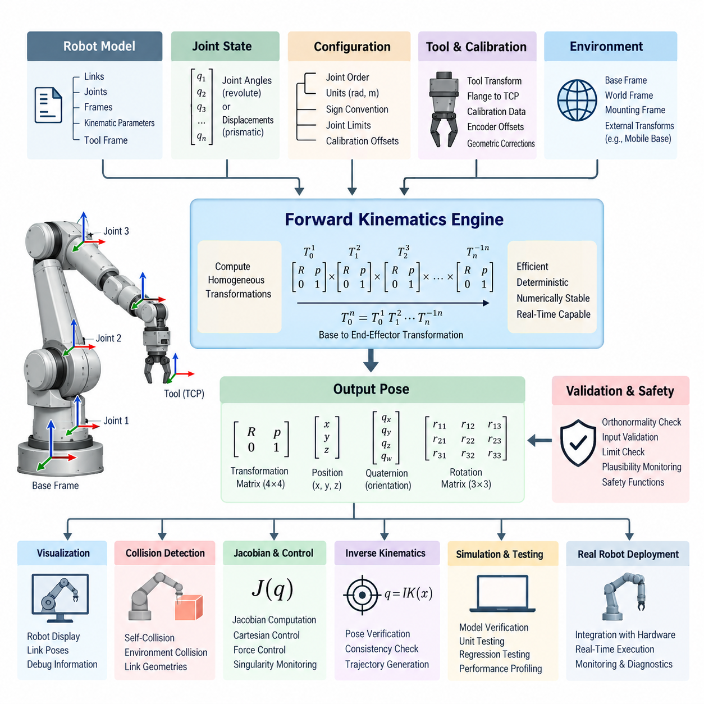
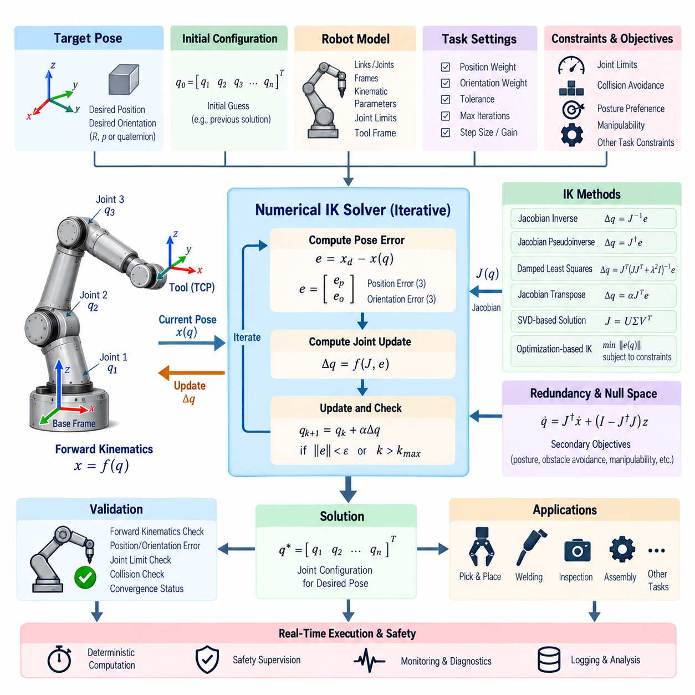
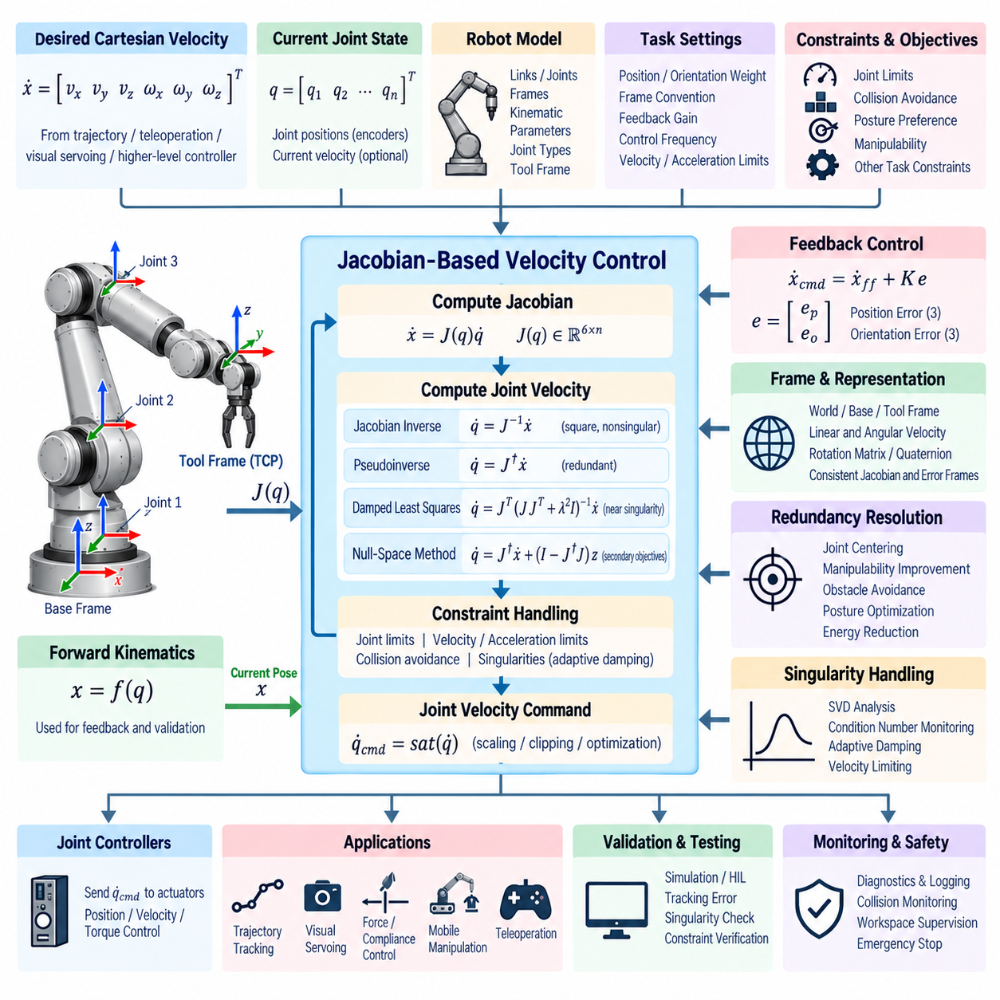
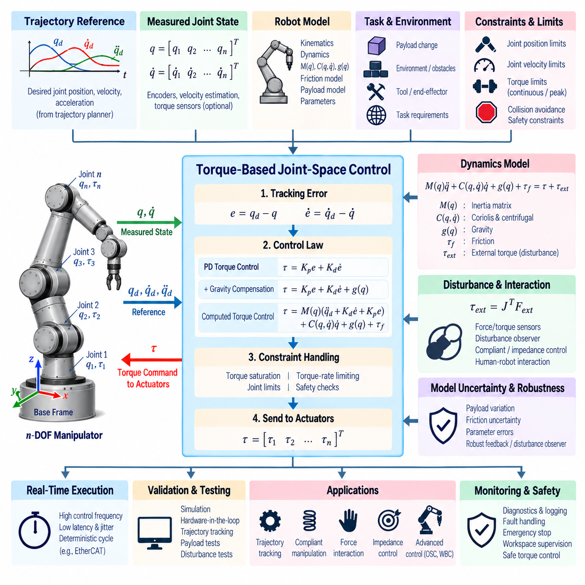
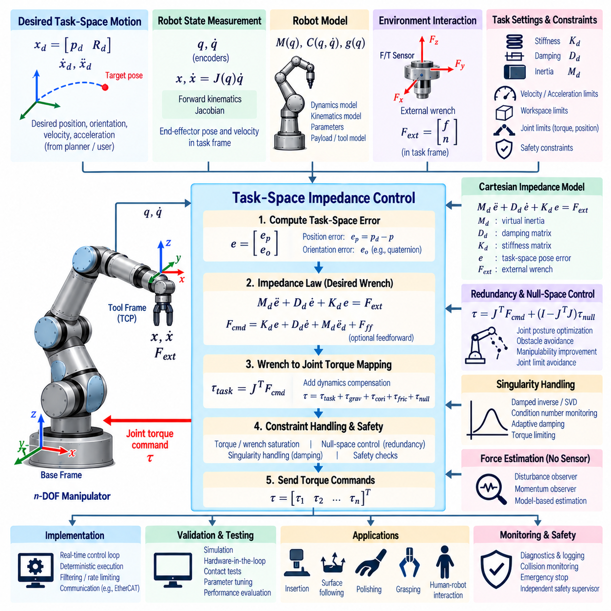
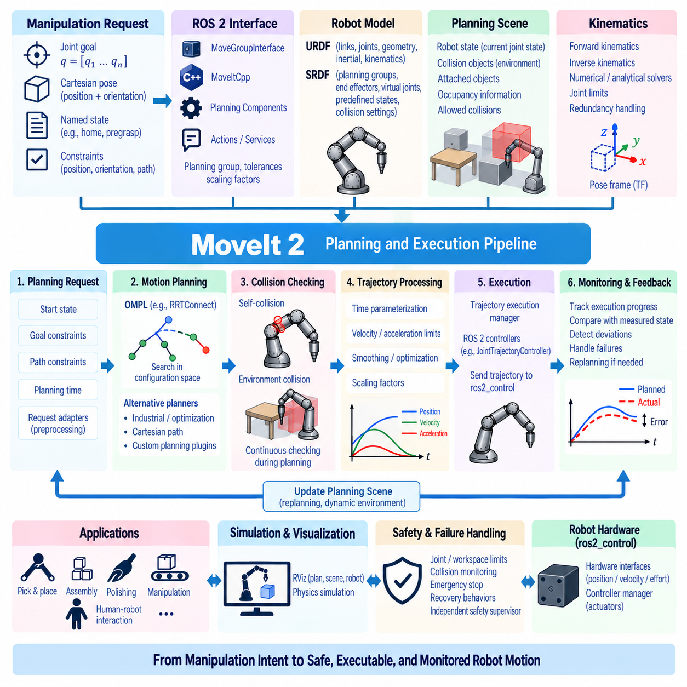
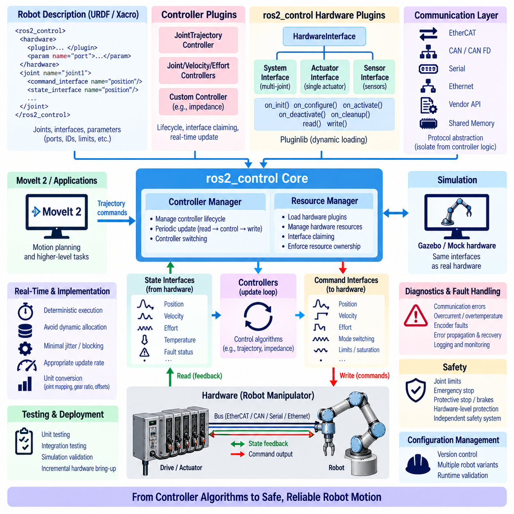
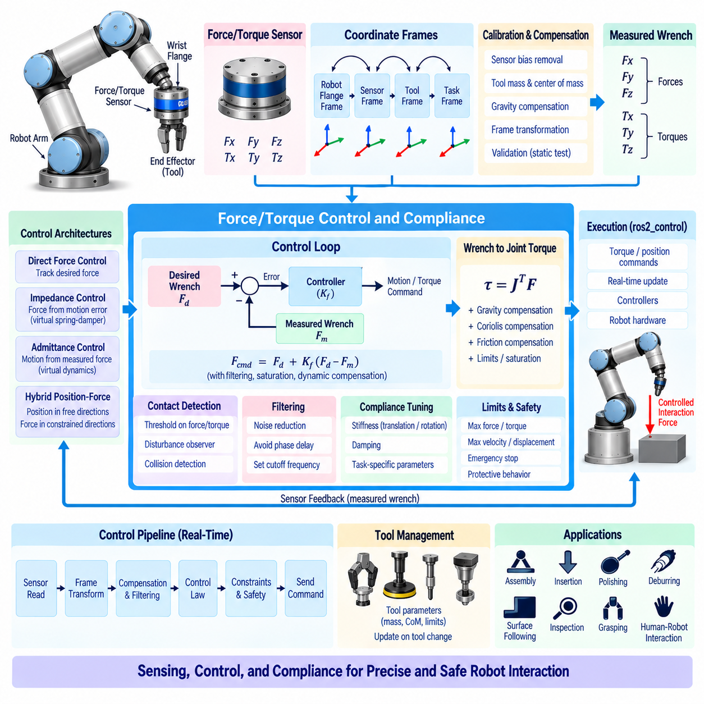
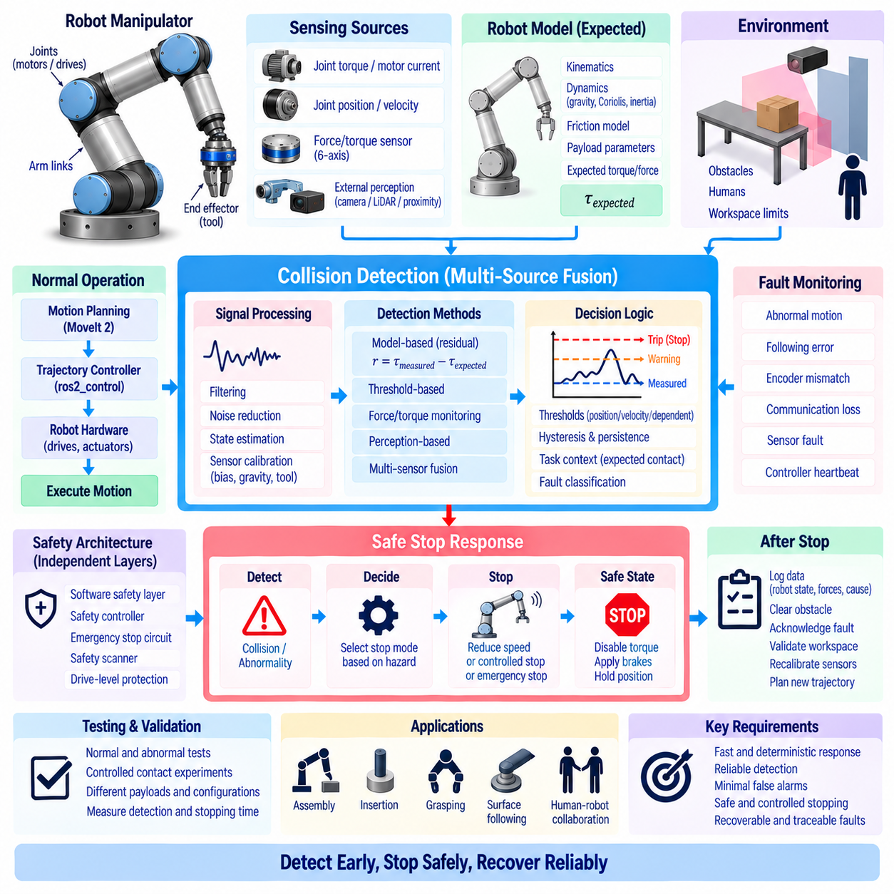
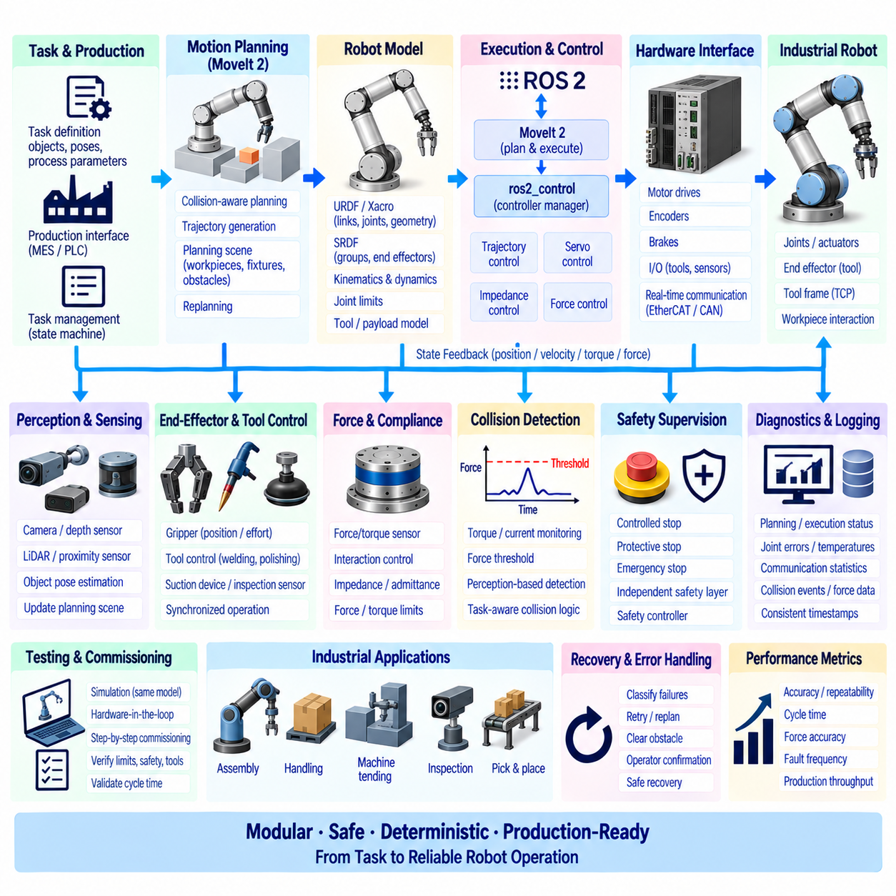

**Volume 04 Robot Control Software**


# 06. Manipulator Control

##  

## 06.01 Manipulator Forward Kinematics SW Implementation [w/Code]

{width="7.268055555555556in" height="7.268055555555556in"}

Forward kinematics software computes the pose of a robot manipulator's end effector from the measured or commanded joint configuration. In a control system, it provides the geometric bridge between joint-space variables and Cartesian-space quantities. The implementation must therefore represent the robot structure accurately while remaining deterministic, numerically stable, and efficient enough for real-time execution.

A manipulator is normally modeled as an ordered kinematic chain consisting of links connected by revolute, prismatic, or fixed joints. Each joint defines a transformation between adjacent coordinate frames. The software stores joint axes, frame offsets, link relationships, joint types, and configuration conventions so that the complete chain can be reconstructed consistently from the base frame to any selected link or tool frame.

A common implementation represents each relationship using a homogeneous transformation matrix containing a 3 × 3 rotation matrix and a three-dimensional translation vector. The transformation combines orientation and position within a single mathematical representation. Sequential multiplication of these matrices propagates the coordinate frame through the manipulator and produces the final transformation from the robot base to the end effector.

For a revolute joint, the variable component of the transformation is determined by the joint angle, while a prismatic joint changes translation along its defined axis. Fixed geometric parameters describe link lengths, offsets, and mounting orientations. Software should clearly separate these constant parameters from runtime joint states because this improves maintainability, calibration management, and computational efficiency.

Denavit--Hartenberg parameters provide one traditional method for constructing serial manipulator transformations. Each link is represented through a compact set of geometric parameters describing rotation and translation between successive frames. Although convenient for analytical implementations, the selected standard or modified DH convention must be documented explicitly because mixing conventions can produce geometrically plausible but incorrect end-effector poses.

Modern robotics software frequently uses direct frame definitions, URDF-based models, or rigid-body transformation libraries instead of manually coded DH equations. In these implementations, the robot description defines the kinematic tree while the forward kinematics engine traverses the relevant parent-child relationships. This approach supports manipulators containing branches, auxiliary sensors, grippers, and additional tool frames more naturally.

The software input is normally a joint-state vector associated with uniquely identified joints. Correct ordering is essential because a mismatch between the numerical vector and the model joint sequence can generate severe pose errors without producing an obvious software exception. Robust implementations therefore maintain explicit mappings between joint names, indices, units, limits, and the corresponding model objects.

At runtime, the forward kinematics calculation begins with the base transformation and successively applies the transformation associated with each joint and link. Intermediate transformations can be retained when poses of multiple links are required by collision checking, visualization, force control, or whole-body coordination. Caching invariant transforms can reduce repeated calculations, particularly when the control loop operates at high frequency.

The resulting end-effector pose may be exposed as a transformation matrix, position plus quaternion, position plus rotation matrix, or another orientation representation required by downstream modules. Internally, rotation matrices and quaternions are often preferred because Euler-angle representations contain singularities and convention ambiguities. Conversion functions should specify axis order, frame convention, and quaternion component ordering explicitly.

Frame semantics are as important as numerical computation. Software must distinguish the world frame, robot base frame, manipulator mounting frame, individual link frames, flange frame, and tool center point. An otherwise correct transformation becomes unusable when its source and destination frames are ambiguous. Frame identifiers should therefore be treated as part of the interface contract rather than informal metadata.

Tool geometry requires particular attention because the manipulator's mechanical flange is rarely identical to the operational tool center point. A gripper, welding torch, camera, probe, or other end-effector device introduces an additional fixed or configurable transformation. Forward kinematics should support this tool transformation independently so that tools can be exchanged without modifying the fundamental robot kinematic model.

Calibration parameters must also be separated from nominal mechanical definitions. Manufacturing tolerances, assembly errors, encoder offsets, and tool installation errors can create measurable discrepancies between theoretical and physical poses. A production implementation may therefore apply calibrated joint zero offsets and corrected geometric parameters while preserving the nominal model for configuration management, simulation, and diagnostic comparison.

Joint measurements entering the calculation require consistent units and sign conventions. Angular quantities should normally use radians internally, while linear quantities should use a defined metric unit such as meters. Encoder direction, mechanical zero position, gear relationships, and software-positive rotation must agree with the robot model. Unit conversion should occur at clearly defined boundaries instead of being scattered throughout the kinematics code.

Numerical validation is essential even though forward kinematics itself does not normally require iterative optimization. Rotation matrices should remain orthonormal within acceptable floating-point tolerance, quaternions should be normalized when required, and transformation matrices should retain valid homogeneous structure. Invalid joint values, NaN data, infinities, missing states, and out-of-range inputs should be detected before they propagate into motion-control functions.

Software architecture should separate the mathematical kinematics engine from communication and hardware interfaces. Encoder acquisition, fieldbus processing, robot model loading, transformation computation, and publication of Cartesian states are distinct responsibilities. This separation allows the same forward kinematics implementation to operate with simulation data, recorded logs, hardware-in-the-loop environments, and physical manipulators without rewriting the mathematical core.

Real-time control introduces additional implementation constraints. Dynamic memory allocation, unpredictable locking, unnecessary string processing, and repeated model parsing should be avoided inside deterministic control loops. The robot model and transformation structures can be initialized before execution, while runtime processing updates only joint-dependent terms. This architecture reduces latency variation and makes execution time easier to verify.

Forward kinematics also supports Jacobian computation because link positions, orientations, and joint axes expressed in common coordinate frames are required to construct the manipulator Jacobian. Maintaining intermediate transformations during the forward pass can therefore reduce duplicated computation. The resulting data can support Cartesian velocity control, force control, singularity monitoring, inverse kinematics, and operational-space control.

Integration with inverse kinematics requires strict agreement on frames and joint conventions. The inverse solver produces a candidate joint configuration, and forward kinematics can immediately reconstruct the resulting Cartesian pose. Comparing that pose with the requested target provides a fundamental consistency check. Position and orientation residuals can be evaluated independently to identify convergence, modeling, or convention errors.

Forward kinematics is also closely coupled with collision detection. Once the transformations of individual links are known, their collision geometries can be positioned in the robot base or world frame. The collision subsystem can then evaluate self-collision and environmental interaction. For this reason, efficient computation of all link poses may be more useful in practical software than calculating only the final end-effector pose.

Simulation provides an important verification environment for the implementation. Known joint configurations can be evaluated independently by the kinematics software and a trusted simulator, and the resulting link and tool poses can be compared numerically. Test configurations should include the home position, joint limits, asymmetric poses, combinations of positive and negative angles, and configurations that expose frame-axis or sign errors.

Unit testing should validate individual joint transformations as well as complete chains. Tests can compare calculated transformations against analytically derived reference values and verify translation, rotation, quaternion normalization, and frame composition independently. Regression tests are particularly valuable after robot-description, calibration, tool, or software-library changes because small geometric modifications can affect every downstream Cartesian function.

Diagnostic software should expose enough information to trace unexpected pose results. Useful runtime information includes the received joint vector, mapped joint names, active model version, calibration set, base transform, tool transform, and selected intermediate link poses. These signals allow developers to distinguish mathematical defects from stale robot descriptions, incorrect encoder offsets, frame mismatches, or communication problems.

For manipulators integrated into mobile robots, the arm transformation is only one part of a larger transform hierarchy. The final world-referenced tool pose may combine world-to-mobile-base localization, mobile-base-to-manipulator mounting geometry, manipulator forward kinematics, and flange-to-tool calibration. Keeping these transformations modular allows navigation and manipulation subsystems to evolve independently while preserving a coherent spatial model.

In ROS 2-based systems, robot descriptions, joint states, and transform frameworks can provide standardized interfaces around the kinematics implementation. However, middleware integration should not replace mathematical verification. Frame names, timestamps, transform direction, joint ordering, and synchronization remain application responsibilities, especially when manipulator states are combined with cameras, mobile platforms, or external localization systems.

Time consistency becomes increasingly important when forward kinematics supports perception or dynamic manipulation. A Cartesian pose calculated from joint measurements at one timestamp should not be combined blindly with sensor data captured at another. Joint-state timestamps, interpolation policies, sensor synchronization, and transform buffering should therefore be considered when software reconstructs the manipulator pose associated with a particular observation.

Performance optimization should focus on measurable bottlenecks rather than premature mathematical simplification. Fixed-size matrix operations, precomputed constant transforms, efficient trigonometric evaluation, cached frame paths, and reduced copying can improve execution time. Profiling should verify both average and worst-case latency, particularly when forward kinematics shares a real-time processor with trajectory generation and actuator control.

Safety-related software should avoid treating forward kinematics output as inherently trustworthy. The calculated pose depends on the validity of the robot model, calibration, joint sensors, communication path, and tool configuration. Independent limit checks, plausibility monitoring, redundant sensing where required, and safety-certified mechanisms may therefore be necessary when Cartesian position contributes to protective functions or restricted workspaces.

A well-designed implementation exposes a stable interface while allowing the underlying robot configuration to evolve. Different manipulators, additional joints, interchangeable tools, and updated calibration sets should be accommodated primarily through model data rather than extensive source-code changes. This model-driven approach reduces platform-specific duplication and supports reuse across industrial arms, collaborative robots, mobile manipulators, and humanoid systems.

Ultimately, manipulator forward kinematics software is more than a direct implementation of transformation equations. It forms a foundational spatial service connecting mechanical geometry, joint sensing, Cartesian control, perception, simulation, collision checking, diagnostics, and safety supervision. Accuracy in frame definitions, disciplined software architecture, systematic validation, and deterministic execution are therefore as important as the underlying kinematic mathematics.

매니퓰레이터 순기구학(Forward Kinematics) 소프트웨어는 측정되거나 명령된 관절 구성(Joint Configuration)으로부터 로봇 매니퓰레이터(Manipulator)의 말단장치(End Effector) 자세(Pose)를 계산한다. 제어 시스템(Control System)에서는 관절 공간 변수(Joint-Space Variable)와 카테시안 공간 물리량(Cartesian-Space Quantity)을 연결하는 기하학적 연결고리를 제공한다. 따라서 구현 과정에서는 로봇 구조를 정확하게 표현하는 동시에 실시간 실행(Real-Time Execution)에 적합한 결정성(Determinism), 수치적 안정성(Numerical Stability), 계산 효율성을 확보해야 한다.

매니퓰레이터(Manipulator)는 일반적으로 회전 관절(Revolute Joint), 직동 관절(Prismatic Joint), 고정 관절(Fixed Joint)로 연결된 링크(Link)들의 순차적인 운동학 체인(Kinematic Chain)으로 모델링된다. 각 관절은 인접한 좌표 프레임(Coordinate Frame) 사이의 변환(Transformation)을 정의한다. 소프트웨어는 관절 축(Joint Axis), 프레임 오프셋(Frame Offset), 링크 관계(Link Relationship), 관절 유형(Joint Type), 구성 규약(Configuration Convention)을 저장하여 베이스 프레임(Base Frame)에서 선택된 링크 또는 도구 프레임(Tool Frame)까지 전체 체인을 일관되게 재구성할 수 있도록 한다.

일반적인 구현에서는 각 관계를 3 × 3 회전 행렬(Rotation Matrix)과 3차원 병진 벡터(Translation Vector)를 포함하는 동차 변환 행렬(Homogeneous Transformation Matrix)로 표현한다. 이 변환은 방향(Orientation)과 위치(Position)를 하나의 수학적 표현으로 통합한다. 이러한 행렬을 순차적으로 곱하면 매니퓰레이터를 따라 좌표 프레임이 전파되고, 최종적으로 로봇 베이스(Robot Base)에서 말단장치(End Effector)까지의 변환을 얻을 수 있다.

회전 관절(Revolute Joint)의 경우 변환의 가변 요소는 관절 각도(Joint Angle)에 의해 결정되며, 직동 관절(Prismatic Joint)은 정의된 축을 따라 병진 위치를 변화시킨다. 고정된 기하학적 파라미터(Geometric Parameter)는 링크 길이(Link Length), 오프셋(Offset), 장착 방향(Mounting Orientation)을 표현한다. 소프트웨어에서는 이러한 상수 파라미터와 런타임 관절 상태(Runtime Joint State)를 명확히 분리해야 하며, 이를 통해 유지보수성(Maintainability), 캘리브레이션 관리(Calibration Management), 계산 효율성을 향상시킬 수 있다.

데나비트-하텐버그 파라미터(Denavit--Hartenberg Parameters)는 직렬 매니퓰레이터(Serial Manipulator)의 변환을 구성하는 전통적인 방법 중 하나이다. 각 링크는 연속된 프레임 사이의 회전과 병진 관계를 설명하는 간결한 기하학적 파라미터 집합으로 표현된다. 해석적 구현(Analytical Implementation)에 편리하지만, 표준 DH(Standard DH) 또는 수정 DH(Modified DH) 규약 중 어떤 방식을 사용하는지 명확하게 문서화해야 한다. 서로 다른 규약을 혼합하면 외형적으로는 타당해 보이지만 실제로는 잘못된 말단장치 자세가 생성될 수 있다.

현대 로보틱스 소프트웨어(Robotics Software)에서는 수작업으로 작성한 DH 방정식 대신 직접적인 프레임 정의(Frame Definition), URDF 기반 모델(URDF-Based Model), 강체 변환 라이브러리(Rigid-Body Transformation Library)를 자주 사용한다. 이러한 구현에서 로봇 기술 모델(Robot Description)은 운동학 트리(Kinematic Tree)를 정의하고, 순기구학 엔진(Forward Kinematics Engine)은 필요한 부모-자식 관계(Parent-Child Relationship)를 순회한다. 이러한 방식은 분기 구조, 보조 센서, 그리퍼(Gripper), 추가 도구 프레임을 포함하는 매니퓰레이터를 보다 자연스럽게 지원한다.

소프트웨어 입력은 일반적으로 고유하게 식별된 관절과 연계된 관절 상태 벡터(Joint-State Vector)이다. 수치 벡터와 모델의 관절 순서가 일치하지 않으면 명확한 소프트웨어 예외(Exception)가 발생하지 않으면서도 심각한 자세 오차가 생성될 수 있으므로 올바른 순서 지정이 중요하다. 따라서 견고한 구현에서는 관절 이름(Joint Name), 인덱스(Index), 단위(Unit), 제한값(Limit), 대응되는 모델 객체(Model Object) 사이의 명시적인 매핑(Mapping)을 유지한다.

런타임(Runtime)에서 순기구학 계산은 베이스 변환(Base Transformation)으로 시작하여 각 관절 및 링크에 해당하는 변환을 순차적으로 적용한다. 충돌 검사(Collision Checking), 시각화(Visualization), 힘 제어(Force Control), 전신 협조 제어(Whole-Body Coordination) 등에서 여러 링크의 자세가 필요한 경우 중간 변환(Intermediate Transformation)을 유지할 수 있다. 특히 제어 루프(Control Loop)가 높은 주파수로 동작하는 경우 변하지 않는 변환을 캐싱(Caching)하면 반복 계산을 줄일 수 있다.

계산된 말단장치 자세는 변환 행렬(Transformation Matrix), 위치와 쿼터니언(Position plus Quaternion), 위치와 회전 행렬(Position plus Rotation Matrix), 또는 하위 모듈이 요구하는 다른 방향 표현(Orientation Representation)으로 제공될 수 있다. 내부적으로는 오일러 각(Euler Angle)이 특이점(Singularity)과 규약의 모호성을 포함하기 때문에 회전 행렬과 쿼터니언(Quaternion)이 자주 사용된다. 변환 함수는 축 순서(Axis Order), 프레임 규약(Frame Convention), 쿼터니언 성분 순서(Quaternion Component Ordering)를 명확하게 정의해야 한다.

프레임 의미론(Frame Semantics)은 수치 계산만큼 중요하다. 소프트웨어는 월드 프레임(World Frame), 로봇 베이스 프레임(Robot Base Frame), 매니퓰레이터 장착 프레임(Manipulator Mounting Frame), 개별 링크 프레임(Link Frame), 플랜지 프레임(Flange Frame), 도구 중심점(Tool Center Point, TCP)을 구분해야 한다. 수학적으로 정확한 변환이라도 출발 프레임(Source Frame)과 목적 프레임(Destination Frame)이 모호하면 사용할 수 없다. 따라서 프레임 식별자(Frame Identifier)는 단순한 메타데이터가 아니라 인터페이스 계약(Interface Contract)의 일부로 관리해야 한다.

매니퓰레이터의 기계적 플랜지(Mechanical Flange)는 실제 작업에 사용되는 도구 중심점(Tool Center Point)과 거의 일치하지 않으므로 도구 형상(Tool Geometry)을 특별히 고려해야 한다. 그리퍼(Gripper), 용접 토치(Welding Torch), 카메라(Camera), 프로브(Probe) 등의 말단장치에는 추가적인 고정 또는 설정 가능한 변환이 존재한다. 순기구학은 이러한 도구 변환(Tool Transformation)을 독립적으로 지원하여 기본 로봇 운동학 모델을 수정하지 않고도 도구를 교체할 수 있도록 해야 한다.

캘리브레이션 파라미터(Calibration Parameter) 역시 공칭 기계 정의(Nominal Mechanical Definition)와 분리해야 한다. 제조 공차(Manufacturing Tolerance), 조립 오차(Assembly Error), 엔코더 오프셋(Encoder Offset), 도구 장착 오차(Tool Installation Error)는 이론적인 자세와 실제 자세 사이에 측정 가능한 차이를 발생시킬 수 있다. 따라서 양산 수준의 구현에서는 보정된 관절 영점 오프셋(Joint Zero Offset)과 수정된 기하학적 파라미터를 적용하면서도 구성 관리(Configuration Management), 시뮬레이션(Simulation), 진단 비교(Diagnostic Comparison)를 위해 공칭 모델을 유지할 수 있다.

계산에 입력되는 관절 측정값(Joint Measurement)은 일관된 단위와 부호 규약(Sign Convention)을 사용해야 한다. 각도 값은 내부적으로 일반적으로 라디안(Radian)을 사용하고, 선형 값은 미터(Meter)와 같이 명확하게 정의된 미터법 단위를 사용해야 한다. 엔코더 방향(Encoder Direction), 기계적 영점(Mechanical Zero Position), 기어 관계(Gear Relationship), 소프트웨어의 양의 회전 방향(Software-Positive Rotation)은 로봇 모델과 일치해야 한다. 단위 변환(Unit Conversion)은 운동학 코드 전체에 분산시키지 않고 명확하게 정의된 경계에서 수행하는 것이 바람직하다.

순기구학 자체는 일반적으로 반복 최적화(Iterative Optimization)를 필요로 하지 않지만 수치 검증(Numerical Validation)은 필수적이다. 회전 행렬은 허용 가능한 부동소수점 오차(Floating-Point Tolerance) 범위에서 직교성(Orthonormality)을 유지해야 하며, 필요한 경우 쿼터니언을 정규화(Normalization)해야 한다. 또한 변환 행렬은 유효한 동차 구조(Homogeneous Structure)를 유지해야 한다. 잘못된 관절 값, NaN 데이터, 무한대(Infinity), 누락된 상태, 범위를 벗어난 입력은 모션 제어(Motion Control) 기능으로 전달되기 전에 검출해야 한다.

소프트웨어 아키텍처(Software Architecture)는 수학적 운동학 엔진(Mathematical Kinematics Engine)을 통신 및 하드웨어 인터페이스(Communication and Hardware Interface)와 분리해야 한다. 엔코더 획득(Encoder Acquisition), 필드버스 처리(Fieldbus Processing), 로봇 모델 로딩(Robot Model Loading), 변환 계산(Transformation Computation), 카테시안 상태 발행(Cartesian State Publication)은 서로 다른 책임을 가진다. 이러한 분리를 통해 동일한 순기구학 구현을 수학적 핵심 부분의 재작성 없이 시뮬레이션 데이터, 기록 로그, 하드웨어 인 더 루프(Hardware-in-the-Loop), 실제 매니퓰레이터에 적용할 수 있다.

실시간 제어(Real-Time Control)는 추가적인 구현 제약을 요구한다. 동적 메모리 할당(Dynamic Memory Allocation), 예측할 수 없는 잠금(Locking), 불필요한 문자열 처리(String Processing), 반복적인 모델 파싱(Model Parsing)은 결정적 제어 루프(Deterministic Control Loop) 내부에서 피해야 한다. 로봇 모델과 변환 구조는 실행 전에 초기화하고, 런타임 처리에서는 관절에 따라 변화하는 항목만 갱신할 수 있다. 이러한 구조는 지연 시간 변동(Latency Variation)을 감소시키고 실행 시간을 보다 쉽게 검증할 수 있도록 한다.

순기구학은 링크 위치, 방향, 공통 좌표 프레임에서 표현된 관절 축이 매니퓰레이터 자코비안(Manipulator Jacobian)을 구성하는 데 필요하기 때문에 자코비안 계산(Jacobian Computation)도 지원한다. 따라서 순방향 계산 과정에서 중간 변환을 유지하면 중복 계산을 감소시킬 수 있다. 생성된 데이터는 카테시안 속도 제어(Cartesian Velocity Control), 힘 제어, 특이점 모니터링(Singularity Monitoring), 역기구학(Inverse Kinematics), 작업 공간 제어(Operational-Space Control)를 지원할 수 있다.

역기구학(Inverse Kinematics)과 통합하려면 프레임 및 관절 규약이 엄격하게 일치해야 한다. 역기구학 솔버(Inverse Solver)는 후보 관절 구성을 생성하고, 순기구학은 즉시 해당 구성으로부터 결과 카테시안 자세를 재구성할 수 있다. 이 자세를 요구된 목표 자세(Target Pose)와 비교하면 기본적인 일관성 검사(Consistency Check)가 가능하다. 위치 및 방향 잔차(Position and Orientation Residual)를 독립적으로 평가하여 수렴 문제, 모델링 오류, 규약 오류를 식별할 수 있다.

순기구학은 충돌 감지(Collision Detection)와도 밀접하게 연결된다. 개별 링크의 변환을 계산하면 각 링크의 충돌 형상(Collision Geometry)을 로봇 베이스 또는 월드 프레임에 배치할 수 있다. 이후 충돌 서브시스템(Collision Subsystem)은 자기 충돌(Self-Collision)과 주변 환경과의 상호작용을 평가할 수 있다. 이러한 이유로 실제 소프트웨어에서는 최종 말단장치 자세만 계산하는 것보다 모든 링크 자세를 효율적으로 계산하는 것이 더 유용할 수 있다.

시뮬레이션(Simulation)은 구현을 검증하기 위한 중요한 환경을 제공한다. 알려진 관절 구성을 운동학 소프트웨어와 신뢰할 수 있는 시뮬레이터(Trusted Simulator)에서 각각 계산하고 결과 링크 및 도구 자세를 수치적으로 비교할 수 있다. 시험 구성(Test Configuration)은 홈 위치(Home Position), 관절 제한 위치(Joint Limit), 비대칭 자세(Asymmetric Pose), 양수와 음수 각도의 조합, 프레임 축 또는 부호 오류를 쉽게 드러낼 수 있는 구성을 포함해야 한다.

단위 시험(Unit Testing)은 개별 관절 변환뿐만 아니라 전체 운동학 체인도 검증해야 한다. 계산된 변환을 해석적으로 도출한 기준값(Reference Value)과 비교하고 병진, 회전, 쿼터니언 정규화, 프레임 합성(Frame Composition)을 독립적으로 검증할 수 있다. 회귀 시험(Regression Test)은 로봇 기술 모델, 캘리브레이션, 도구 또는 소프트웨어 라이브러리가 변경된 이후 특히 중요하다. 작은 기하학적 변경도 모든 하위 카테시안 기능에 영향을 줄 수 있기 때문이다.

진단 소프트웨어(Diagnostic Software)는 예상하지 못한 자세 결과를 추적할 수 있을 정도로 충분한 정보를 제공해야 한다. 유용한 런타임 정보에는 수신된 관절 벡터, 매핑된 관절 이름, 활성 모델 버전(Active Model Version), 캘리브레이션 세트(Calibration Set), 베이스 변환, 도구 변환, 선택된 중간 링크 자세가 포함된다. 이러한 정보는 개발자가 수학적 결함과 오래된 로봇 기술 정보, 잘못된 엔코더 오프셋, 프레임 불일치, 통신 문제를 구분하는 데 도움을 준다.

이동 로봇(Mobile Robot)에 통합된 매니퓰레이터의 경우 팔(Arm)의 변환은 더 큰 변환 계층(Transform Hierarchy)의 일부에 불과하다. 최종적인 월드 기준 도구 자세(World-Referenced Tool Pose)는 월드에서 모바일 베이스까지의 위치추정(Localization), 모바일 베이스에서 매니퓰레이터까지의 장착 형상, 매니퓰레이터 순기구학, 플랜지에서 도구까지의 캘리브레이션을 결합하여 계산할 수 있다. 이러한 변환을 모듈화하면 내비게이션(Navigation)과 조작(Manipulation) 서브시스템을 독립적으로 발전시키면서 일관된 공간 모델을 유지할 수 있다.

ROS 2 기반 시스템에서는 로봇 기술 정보(Robot Description), 관절 상태(Joint State), 변환 프레임워크(Transform Framework)를 통해 운동학 구현에 표준화된 인터페이스를 제공할 수 있다. 그러나 미들웨어 통합(Middleware Integration)이 수학적 검증을 대신할 수는 없다. 특히 매니퓰레이터 상태를 카메라, 모바일 플랫폼, 외부 위치추정 시스템과 결합하는 경우 프레임 이름, 타임스탬프(Timestamp), 변환 방향, 관절 순서, 동기화(Synchronization)는 여전히 응용 소프트웨어에서 책임져야 한다.

순기구학이 인지(Perception) 또는 동적 조작(Dynamic Manipulation)을 지원할 경우 시간 일관성(Time Consistency)은 더욱 중요해진다. 특정 타임스탬프의 관절 측정값으로 계산한 카테시안 자세를 다른 시점에서 획득한 센서 데이터와 무분별하게 결합해서는 안 된다. 따라서 특정 관측 시점의 매니퓰레이터 자세를 재구성하는 경우 관절 상태 타임스탬프, 보간 정책(Interpolation Policy), 센서 동기화(Sensor Synchronization), 변환 버퍼링(Transform Buffering)을 고려해야 한다.

성능 최적화(Performance Optimization)는 성급한 수학적 단순화보다 실제 측정된 병목 구간(Bottleneck)에 집중해야 한다. 고정 크기 행렬 연산(Fixed-Size Matrix Operation), 상수 변환의 사전 계산(Precomputation), 효율적인 삼각함수 계산(Trigonometric Evaluation), 프레임 경로 캐싱(Frame Path Caching), 데이터 복사 감소를 통해 실행 시간을 개선할 수 있다. 특히 순기구학이 궤적 생성(Trajectory Generation) 및 액추에이터 제어(Actuator Control)와 실시간 프로세서를 공유하는 경우 평균 지연뿐만 아니라 최악 조건 지연(Worst-Case Latency)도 프로파일링해야 한다.

안전 관련 소프트웨어(Safety-Related Software)는 순기구학 출력을 본질적으로 신뢰할 수 있는 값으로 간주해서는 안 된다. 계산된 자세는 로봇 모델, 캘리브레이션, 관절 센서, 통신 경로, 도구 구성의 유효성에 의존한다. 따라서 카테시안 위치가 보호 기능(Protective Function)이나 제한 작업 공간(Restricted Workspace)에 사용되는 경우 독립적인 제한 검사(Limit Check), 타당성 모니터링(Plausibility Monitoring), 필요한 경우 중복 센싱(Redundant Sensing), 안전 인증 메커니즘(Safety-Certified Mechanism)이 요구될 수 있다.

잘 설계된 구현은 기본 인터페이스를 안정적으로 유지하면서 내부 로봇 구성이 발전할 수 있도록 해야 한다. 서로 다른 매니퓰레이터, 추가 관절, 교환 가능한 도구, 갱신된 캘리브레이션 세트는 광범위한 소스 코드 변경보다는 모델 데이터(Model Data)를 통해 적용할 수 있어야 한다. 이러한 모델 기반 접근법(Model-Driven Approach)은 플랫폼별 코드 중복을 줄이고 산업용 로봇 팔(Industrial Robot Arm), 협동 로봇(Collaborative Robot), 모바일 매니퓰레이터(Mobile Manipulator), 휴머노이드 시스템(Humanoid System) 전반에서 소프트웨어 재사용을 지원한다.

궁극적으로 매니퓰레이터 순기구학(Manipulator Forward Kinematics) 소프트웨어는 단순히 변환 방정식을 구현하는 기능을 넘어선다. 이는 기계적 형상(Mechanical Geometry), 관절 센싱(Joint Sensing), 카테시안 제어(Cartesian Control), 인지, 시뮬레이션, 충돌 검사, 진단, 안전 감독(Safety Supervision)을 연결하는 핵심 공간 서비스(Spatial Service)를 형성한다. 따라서 정확한 프레임 정의, 체계적인 소프트웨어 아키텍처, 지속적인 검증, 결정적 실행은 기반이 되는 운동학 수학 자체만큼 중요하다.

##  

## 06.02 Inverse Kinematics (IK) Numerical Methods [w/Code]

{width="7.268055555555556in" height="7.268055555555556in"}

Inverse kinematics (IK) computes the joint configuration required for a manipulator to achieve a desired end-effector pose. Unlike forward kinematics, which directly maps joint variables to Cartesian pose, IK reverses this relationship. For many robot geometries, a closed-form solution is unavailable or impractical, making numerical IK a fundamental software component for general-purpose manipulation.

A numerical IK solver begins with a target pose expressed relative to a clearly defined reference frame and an initial joint configuration used as the starting estimate. Forward kinematics evaluates the current end-effector pose, and the difference between the current and desired poses forms a Cartesian error. The solver repeatedly converts this error into joint corrections until a convergence criterion is satisfied.

Position error can be represented directly as a three-dimensional displacement between the current and target tool positions. Orientation error requires greater care because orientation does not belong to a simple Euclidean vector space. Rotation matrices, quaternions, or Lie-group representations can be used to construct a three-dimensional rotational error that remains consistent with the coordinate convention adopted by the controller.

The manipulator Jacobian provides the local relationship between joint motion and Cartesian motion. For a joint vector q and end-effector velocity ẋ, the differential relationship is commonly expressed as ẋ = J(q)q̇. Numerical IK uses this local mapping in reverse, estimating a joint displacement that reduces the Cartesian pose error. The Jacobian must therefore use the same frames and conventions as the pose-error calculation.

The Jacobian inverse method provides a straightforward solution when the Jacobian is square and nonsingular. A Cartesian correction can be transformed directly into a joint correction through the inverse matrix. However, many practical manipulators are redundant, underactuated, or close to singular configurations, so a conventional matrix inverse cannot provide a robust general-purpose implementation.

The Jacobian pseudoinverse method extends numerical IK to non-square Jacobians and redundant manipulators. Using the Moore--Penrose pseudoinverse, the solver obtains a least-squares joint update that attempts to minimize Cartesian error. For redundant robots, the solution generally corresponds to a minimum-norm joint motion unless additional null-space objectives are introduced to influence the configuration.

Near kinematic singularities, pseudoinverse solutions can generate excessively large joint velocities or configuration changes. Small Cartesian corrections may require large joint motion because one or more singular values of the Jacobian approach zero. A production IK solver must therefore monitor numerical conditioning and apply stabilization rather than relying on an unconstrained pseudoinverse throughout the workspace.

Damped least squares (DLS) is widely used to improve numerical stability near singularities. A damping term regularizes the inverse calculation and limits extreme joint corrections when the Jacobian becomes poorly conditioned. Larger damping improves robustness but may reduce tracking accuracy, while smaller damping provides more precise motion away from singularities. Adaptive damping can balance these requirements according to the current configuration.

Singular value decomposition (SVD) provides a useful foundation for analyzing and solving Jacobian-based IK. Decomposing the Jacobian exposes singular values associated with available Cartesian motion directions. Very small singular values identify poorly controllable directions and can be truncated or regularized. SVD therefore supports pseudoinverse computation, singularity detection, condition monitoring, and adaptive damping strategies.

The Jacobian transpose method offers another numerical approach that avoids explicit matrix inversion. Joint corrections are generated by projecting Cartesian error through the transpose of the Jacobian, typically combined with an appropriate gain or step size. Although convergence can be slower than pseudoinverse-based methods, the method is computationally simple and can be useful when robustness and implementation simplicity are more important than rapid convergence.

Numerical IK can also be formulated as an optimization problem. The desired pose becomes an objective function, while joint limits, collision avoidance, posture preferences, velocity limits, and other requirements can be represented as constraints or additional costs. Gradient-based optimization, sequential quadratic programming, nonlinear least squares, and related techniques allow IK to incorporate requirements that are difficult to represent using a single Jacobian inversion.

Redundant manipulators contain more joint degrees of freedom than are required for the primary Cartesian task. This redundancy allows the robot to achieve the same tool pose using multiple joint configurations. Null-space projection can preserve the primary end-effector objective while using the remaining freedom for secondary goals such as joint-centering, obstacle avoidance, manipulability improvement, posture optimization, or energy reduction.

Joint limits should be considered during the iterative solution rather than checked only after convergence. A mathematically valid Cartesian solution may require a joint to exceed its physical range. Numerical implementations can clamp candidate updates, introduce joint-limit penalties, apply weighted pseudoinverses, or formulate explicit inequality constraints. Smooth limit avoidance is preferable to abrupt clipping because discontinuous corrections can degrade convergence.

The initial configuration strongly influences numerical IK because the solution process is generally local. Different initial guesses may converge to different valid configurations, fail to converge, or enter undesirable regions of the workspace. For trajectory execution, the previous control-cycle solution is often an effective initial guess because it preserves configuration continuity and reduces the number of iterations required for nearby targets.

Step-size management is another important aspect of solver stability. Applying the full calculated joint correction can overshoot the target or destabilize iterations when the local Jacobian approximation is inaccurate. Scaling the update, limiting individual joint increments, or using line-search techniques can improve convergence. Maximum angular and linear increments should also be consistent with actuator and control-loop constraints.

Convergence criteria normally evaluate both translational and rotational errors. Because these quantities use different physical units, their relative weighting must be explicitly defined. A solver may terminate when position and orientation errors fall below independent tolerances, when the total weighted error becomes sufficiently small, or when successive iterations produce negligible improvement. A maximum iteration count prevents uncontrolled computation.

Failure detection is as important as successful convergence. A target may be outside the reachable workspace, blocked by joint constraints, incompatible with the available degrees of freedom, or numerically difficult because of a singularity. The solver should distinguish convergence, timeout, joint-limit conflict, invalid input, numerical failure, and unreachable-target conditions rather than returning only a joint vector with an ambiguous success flag.

Pose weighting allows applications to prioritize selected Cartesian dimensions. Some tasks require accurate tool position but permit orientation freedom, while others constrain only a tool axis or require precise six-degree-of-freedom alignment. A weighted error vector or task Jacobian can represent these differences. This enables the same numerical IK framework to support grasping, inspection, welding, insertion, camera positioning, and mobile manipulation.

Whole-body and mobile-manipulator systems extend the IK variable vector beyond arm joints. Torso joints, mobile-base motion, redundant wrist joints, or other controllable degrees of freedom can participate in solving the Cartesian task. Weighting and constraints can determine how motion is distributed among subsystems, allowing the software to favor arm movement for small corrections while introducing base motion when targets approach the arm workspace boundary.

Collision avoidance can be integrated into numerical IK through constraints, penalty functions, or secondary objectives. Distances between robot links and environmental obstacles can generate repulsive gradients that modify the joint update while preserving the primary task. Self-collision constraints require similar treatment. These mechanisms transform IK from a purely geometric solver into a component capable of producing practically executable configurations.

Manipulability measures can help the solver avoid configurations where Cartesian motion capability deteriorates. Metrics derived from the Jacobian indicate how effectively joint motion can generate motion in different Cartesian directions. A redundant solver can optimize such measures in the null space while maintaining the primary task, improving configuration quality and reducing the likelihood of approaching singular regions during subsequent motion.

Software implementation should separate the numerical solver from the robot model, forward kinematics engine, Jacobian computation, and application interface. The solver requests poses and derivatives through stable APIs rather than embedding robot-specific equations. This modular architecture allows different algorithms, such as pseudoinverse, DLS, or optimization-based IK, to operate on the same manipulator description and be compared under identical conditions.

Real-time implementations require predictable computational behavior. Matrix dimensions should preferably be known in advance, memory allocation should be minimized inside the control loop, and iteration counts should be bounded. Expensive decomposition or optimization procedures must be evaluated against timing requirements. When IK runs within a high-frequency controller, worst-case execution time is often more important than average solver speed.

Trajectory-level IK differs from solving isolated target poses. Consecutive Cartesian commands should generate smooth joint trajectories without sudden branch changes or discontinuities. Using the previous solution as the next initial state, penalizing large joint changes, maintaining null-space continuity, and respecting velocity and acceleration limits can prevent configuration jumps that would otherwise be mathematically valid but physically undesirable.

Numerical validation should compare the solved configuration through independent forward kinematics. After convergence, the resulting joint vector is passed through the forward model and the reconstructed tool pose is compared with the requested target. Position and orientation residuals, joint-limit margins, Jacobian conditioning, and collision status can then be recorded as quantitative indicators of solution quality.

Testing should cover more than nominal reachable poses. Test sets should include workspace boundaries, singular and near-singular configurations, joint-limit regions, redundant solutions, unreachable targets, orientation-dominant tasks, and small incremental trajectories. Randomized target generation and regression testing can reveal numerical weaknesses that remain hidden when only a small collection of manually selected configurations is evaluated.

Simulation provides a safe environment for verifying solver behavior before deployment. The calculated joint configurations can be applied to a digital robot model while monitoring pose accuracy, convergence time, joint continuity, collisions, and singularity proximity. Hardware-in-the-loop testing can subsequently introduce realistic controller timing and communication behavior before the numerical IK software commands physical actuators.

Diagnostics should expose the information required to understand solver decisions. Useful values include iteration count, initial and final error, damping coefficient, Jacobian condition indicators, active constraints, joint-limit margins, termination reason, and computation time. Recording these quantities enables developers to distinguish unreachable geometry from poor initialization, excessive damping, incorrect frame definitions, or numerical instability.

In ROS 2 or comparable robotic software frameworks, IK may operate as a planning service, motion-control component, or reusable kinematics library. Regardless of middleware, frame identifiers, timestamps, joint ordering, tool definitions, and robot-model versions must remain consistent. A solver that is mathematically correct can still generate invalid commands when its coordinate conventions differ from those of the surrounding motion stack.

Safety supervision should remain independent of numerical IK convergence. A converged solution does not guarantee that the resulting motion is dynamically feasible, collision-free, safe for nearby humans, or acceptable to the actuator system. Joint position, velocity, acceleration, torque, workspace, and collision constraints should therefore be checked by appropriate control and safety layers before commands reach the physical robot.

A robust numerical IK implementation combines geometric modeling, differential kinematics, numerical linear algebra, optimization, constraints, and real-time software engineering. Its objective is not merely to minimize Cartesian error, but to produce stable, continuous, physically valid joint configurations under practical robot limitations. This makes numerical IK a central software layer connecting task-level manipulation commands with executable joint-space motion.

역기구학(Inverse Kinematics, IK)은 매니퓰레이터(Manipulator)가 원하는 말단장치 자세(End-Effector Pose)를 달성하기 위해 필요한 관절 구성(Joint Configuration)을 계산한다. 관절 변수(Joint Variable)를 카테시안 자세(Cartesian Pose)로 직접 변환하는 순기구학(Forward Kinematics)과 달리 역기구학은 이 관계를 반대로 계산한다. 많은 로봇 구조에서는 폐형식 해(Closed-Form Solution)를 구할 수 없거나 실용적으로 적용하기 어렵기 때문에 수치적 역기구학(Numerical IK)은 범용 로봇 조작을 위한 핵심 소프트웨어 구성요소가 된다.

수치적 역기구학 솔버(Numerical IK Solver)는 명확하게 정의된 기준 프레임(Reference Frame)을 기준으로 표현된 목표 자세(Target Pose)와 계산의 시작 추정값으로 사용되는 초기 관절 구성(Initial Joint Configuration)으로부터 동작을 시작한다. 순기구학은 현재 말단장치 자세를 계산하며, 현재 자세와 목표 자세 사이의 차이를 이용하여 카테시안 오차(Cartesian Error)를 생성한다. 솔버는 수렴 조건(Convergence Criterion)이 만족될 때까지 이 오차를 반복적으로 관절 보정값(Joint Correction)으로 변환한다.

위치 오차(Position Error)는 현재 도구 위치와 목표 도구 위치 사이의 3차원 변위(Three-Dimensional Displacement)로 직접 표현할 수 있다. 반면 방향(Orientation)은 단순한 유클리드 벡터 공간(Euclidean Vector Space)에 속하지 않으므로 방향 오차(Orientation Error)는 더욱 신중하게 처리해야 한다. 회전 행렬(Rotation Matrix), 쿼터니언(Quaternion), 리 군 표현(Lie-Group Representation)을 이용하여 제어기가 사용하는 좌표 규약과 일관된 3차원 회전 오차를 구성할 수 있다.

매니퓰레이터 자코비안(Manipulator Jacobian)은 관절 운동(Joint Motion)과 카테시안 운동(Cartesian Motion) 사이의 국소적인 관계를 제공한다. 관절 벡터를 q, 말단장치 속도를 ẋ라고 할 때 미분 관계는 일반적으로 ẋ = J(q)q̇로 표현된다. 수치적 역기구학은 이러한 국소 매핑(Local Mapping)을 역으로 이용하여 카테시안 자세 오차를 감소시키는 관절 변위(Joint Displacement)를 추정한다. 따라서 자코비안은 자세 오차 계산과 동일한 프레임 및 규약을 사용해야 한다.

자코비안 역행렬 방법(Jacobian Inverse Method)은 자코비안이 정방 행렬(Square Matrix)이고 비특이 상태(Nonsingular State)에 있을 때 직접적인 해법을 제공한다. 카테시안 보정값을 역행렬을 통해 관절 보정값으로 직접 변환할 수 있다. 그러나 실제 매니퓰레이터는 여유 자유도(Redundancy)를 가지거나 부족 구동(Underactuated) 구조일 수 있으며 특이 구성(Singular Configuration)에 접근할 수도 있으므로 일반적인 행렬 역산만으로는 견고한 범용 구현을 제공하기 어렵다.

자코비안 의사역행렬 방법(Jacobian Pseudoinverse Method)은 수치적 역기구학을 비정방 자코비안(Non-Square Jacobian)과 여유 자유도 매니퓰레이터(Redundant Manipulator)까지 확장한다. 무어-펜로즈 의사역행렬(Moore--Penrose Pseudoinverse)을 이용하면 솔버는 카테시안 오차를 최소화하려는 최소제곱 관절 갱신값(Least-Squares Joint Update)을 계산한다. 여유 자유도 로봇에서는 추가적인 영공간 목표(Null-Space Objective)가 적용되지 않는 한 일반적으로 최소 노름 관절 운동(Minimum-Norm Joint Motion)에 해당하는 해가 생성된다.

운동학적 특이점(Kinematic Singularity) 부근에서는 의사역행렬 해가 지나치게 큰 관절 속도 또는 구성 변화를 생성할 수 있다. 자코비안의 하나 이상의 특이값(Singular Value)이 0에 가까워지면 작은 카테시안 보정에도 매우 큰 관절 운동이 필요할 수 있기 때문이다. 따라서 실제 적용을 위한 역기구학 솔버는 전체 작업 공간에서 제약 없는 의사역행렬에 의존하지 않고 수치적 조건 상태(Numerical Conditioning)를 감시하면서 안정화 기법을 적용해야 한다.

감쇠 최소제곱법(Damped Least Squares, DLS)은 특이점 부근에서 수치적 안정성을 향상시키기 위해 널리 사용된다. 감쇠항(Damping Term)은 역산 계산을 정규화(Regularization)하고 자코비안의 조건이 나빠질 때 과도한 관절 보정값을 제한한다. 큰 감쇠값은 안정성을 향상시키지만 추종 정확도(Tracking Accuracy)를 감소시킬 수 있고, 작은 감쇠값은 특이점에서 떨어진 영역에서 높은 정확도를 제공한다. 적응형 감쇠(Adaptive Damping)를 사용하면 현재 구성에 따라 이러한 요구사항의 균형을 조절할 수 있다.

특이값 분해(Singular Value Decomposition, SVD)는 자코비안 기반 역기구학을 분석하고 계산하기 위한 유용한 기반을 제공한다. 자코비안을 분해하면 사용 가능한 카테시안 운동 방향과 관련된 특이값을 확인할 수 있다. 매우 작은 특이값은 제어하기 어려운 운동 방향을 나타내며 절단(Truncation)하거나 정규화할 수 있다. 따라서 SVD는 의사역행렬 계산, 특이점 검출(Singularity Detection), 조건 상태 모니터링(Condition Monitoring), 적응형 감쇠 전략을 지원한다.

자코비안 전치 방법(Jacobian Transpose Method)은 명시적인 행렬 역산을 피할 수 있는 또 다른 수치적 접근법이다. 일반적으로 적절한 이득(Gain) 또는 스텝 크기(Step Size)를 적용하면서 자코비안의 전치 행렬을 통해 카테시안 오차를 투영하여 관절 보정값을 생성한다. 의사역행렬 기반 방법보다 수렴 속도가 느릴 수 있지만 계산 구조가 단순하여 빠른 수렴보다 견고성과 구현 단순성이 중요한 환경에서 유용하게 사용할 수 있다.

수치적 역기구학은 최적화 문제(Optimization Problem)로도 구성할 수 있다. 원하는 자세를 목적 함수(Objective Function)로 정의하고 관절 제한(Joint Limit), 충돌 회피(Collision Avoidance), 자세 선호도(Posture Preference), 속도 제한(Velocity Limit) 등의 요구사항을 제약조건(Constraint) 또는 추가 비용 함수(Cost Function)로 표현할 수 있다. 경사 기반 최적화(Gradient-Based Optimization), 순차 이차 계획법(Sequential Quadratic Programming), 비선형 최소제곱법(Nonlinear Least Squares) 등을 이용하면 단일 자코비안 역산으로 표현하기 어려운 요구사항까지 역기구학에 통합할 수 있다.

여유 자유도 매니퓰레이터(Redundant Manipulator)는 기본 카테시안 작업에 필요한 것보다 더 많은 관절 자유도(Degree of Freedom)를 갖는다. 이러한 여유 자유도를 이용하면 동일한 도구 자세를 여러 관절 구성으로 구현할 수 있다. 영공간 투영(Null-Space Projection)은 기본적인 말단장치 목표를 유지하면서 남는 자유도를 관절 중심화(Joint-Centering), 장애물 회피(Obstacle Avoidance), 조작성 향상(Manipulability Improvement), 자세 최적화(Posture Optimization), 에너지 감소(Energy Reduction)와 같은 보조 목표에 활용할 수 있다.

관절 제한(Joint Limit)은 수렴이 완료된 이후에만 검사하는 것이 아니라 반복 계산 과정에서 고려해야 한다. 수학적으로 유효한 카테시안 해가 물리적인 관절 범위를 초과하는 값을 요구할 수 있기 때문이다. 수치적 구현에서는 후보 갱신값을 제한하거나 관절 제한 페널티(Joint-Limit Penalty), 가중 의사역행렬(Weighted Pseudoinverse), 명시적 부등식 제약조건(Inequality Constraint)을 적용할 수 있다. 불연속적인 보정은 수렴 성능을 저하시킬 수 있으므로 갑작스러운 클리핑(Clipping)보다 부드러운 제한 회피가 바람직하다.

초기 구성(Initial Configuration)은 수치적 역기구학의 해 계산 과정이 일반적으로 국소적(Local)이기 때문에 결과에 큰 영향을 준다. 서로 다른 초기 추정값은 서로 다른 유효 구성으로 수렴하거나 수렴에 실패하거나 작업 공간의 바람직하지 않은 영역으로 진입할 수 있다. 궤적 실행(Trajectory Execution)에서는 이전 제어 주기의 해를 다음 계산의 초기 추정값으로 사용하는 것이 효과적이며, 이를 통해 구성 연속성(Configuration Continuity)을 유지하고 인접한 목표에 필요한 반복 횟수를 줄일 수 있다.

스텝 크기 관리(Step-Size Management) 역시 솔버 안정성에서 중요한 요소이다. 계산된 관절 보정값 전체를 한 번에 적용하면 국소 자코비안 근사가 부정확한 영역에서 목표를 지나치거나 반복 계산이 불안정해질 수 있다. 갱신값의 크기를 조절하거나 개별 관절 증가량을 제한하고 선 탐색(Line Search) 기법을 사용하면 수렴성을 향상시킬 수 있다. 최대 각도 및 선형 증가량 역시 액추에이터와 제어 루프의 제약조건에 부합해야 한다.

수렴 조건(Convergence Criteria)은 일반적으로 병진 오차(Translational Error)와 회전 오차(Rotational Error)를 모두 평가한다. 두 물리량은 서로 다른 단위를 사용하기 때문에 상대적인 가중치(Relative Weighting)를 명확하게 정의해야 한다. 위치와 방향 오차가 각각 독립적인 허용오차(Tolerance)보다 작아질 때, 전체 가중 오차가 충분히 작아질 때, 또는 연속된 반복 계산에서 개선량이 매우 작아질 때 계산을 종료할 수 있다. 최대 반복 횟수(Maximum Iteration Count)는 계산이 무제한으로 지속되는 것을 방지한다.

실패 검출(Failure Detection)은 성공적인 수렴만큼 중요하다. 목표가 도달 가능 작업 공간(Reachable Workspace)을 벗어나거나 관절 제약으로 차단되거나 사용 가능한 자유도와 호환되지 않거나 특이점으로 인해 수치적으로 계산하기 어려울 수 있다. 따라서 솔버는 단순히 모호한 성공 플래그(Success Flag)와 관절 벡터만 반환하지 않고 수렴, 시간 초과(Timeout), 관절 제한 충돌, 잘못된 입력, 수치 계산 실패, 도달 불가능 목표(Unreachable Target)를 구분해야 한다.

자세 가중치(Pose Weighting)를 이용하면 응용 프로그램이 특정 카테시안 차원을 우선시할 수 있다. 일부 작업은 정확한 도구 위치를 요구하지만 방향에는 자유도를 허용하고, 다른 작업은 특정 도구 축만 제한하거나 정확한 6자유도 정렬(Six-Degree-of-Freedom Alignment)을 요구한다. 가중 오차 벡터(Weighted Error Vector) 또는 작업 자코비안(Task Jacobian)을 통해 이러한 차이를 표현하면 동일한 수치적 역기구학 프레임워크를 파지(Grasping), 검사(Inspection), 용접(Welding), 삽입(Insertion), 카메라 위치 결정(Camera Positioning), 모바일 조작(Mobile Manipulation)에 활용할 수 있다.

전신 시스템(Whole-Body System)과 모바일 매니퓰레이터(Mobile Manipulator)는 역기구학 변수 벡터를 로봇 팔의 관절 이상으로 확장한다. 몸통 관절(Torso Joint), 모바일 베이스 운동(Mobile-Base Motion), 여유 손목 관절(Redundant Wrist Joint) 등의 제어 가능한 자유도가 카테시안 작업 해결에 참여할 수 있다. 가중치와 제약조건을 이용하여 서브시스템 사이의 운동 분배를 결정하면 작은 보정에서는 로봇 팔 운동을 우선하고 목표가 팔의 작업 공간 경계에 접근할 때 모바일 베이스 운동을 추가할 수 있다.

충돌 회피(Collision Avoidance)는 제약조건, 페널티 함수(Penalty Function), 보조 목표를 통해 수치적 역기구학에 통합할 수 있다. 로봇 링크와 주변 장애물 사이의 거리를 이용하여 반발 경사(Repulsive Gradient)를 생성하고 기본 작업을 유지하면서 관절 갱신값을 수정할 수 있다. 자기 충돌(Self-Collision) 제약도 유사한 방식으로 처리할 수 있다. 이러한 메커니즘을 통해 역기구학은 순수한 기하학적 솔버를 넘어 실제 실행 가능한 구성을 생성하는 구성요소로 확장된다.

조작성 지표(Manipulability Measure)는 카테시안 운동 능력이 저하되는 구성을 회피하는 데 도움을 줄 수 있다. 자코비안에서 도출되는 지표를 통해 관절 운동이 서로 다른 카테시안 방향의 운동을 얼마나 효과적으로 생성할 수 있는지 평가할 수 있다. 여유 자유도 솔버는 기본 작업을 유지하면서 영공간에서 이러한 지표를 최적화하여 구성 품질(Configuration Quality)을 향상시키고 이후 동작 과정에서 특이 영역에 접근할 가능성을 줄일 수 있다.

소프트웨어 구현에서는 수치 솔버(Numerical Solver)를 로봇 모델(Robot Model), 순기구학 엔진(Forward Kinematics Engine), 자코비안 계산(Jacobian Computation), 응용 인터페이스(Application Interface)와 분리해야 한다. 솔버는 로봇별 방정식을 내부에 직접 포함하는 대신 안정적인 API를 통해 자세와 미분 정보를 요청한다. 이러한 모듈형 아키텍처(Modular Architecture)를 사용하면 의사역행렬, DLS, 최적화 기반 역기구학 등의 서로 다른 알고리즘을 동일한 매니퓰레이터 모델에 적용하고 동일한 조건에서 비교할 수 있다.

실시간 구현(Real-Time Implementation)에서는 예측 가능한 계산 동작이 요구된다. 행렬 크기는 가능한 한 사전에 결정하고 제어 루프 내부의 메모리 할당을 최소화하며 반복 횟수에 상한을 설정해야 한다. 계산 비용이 높은 행렬 분해(Matrix Decomposition) 또는 최적화 절차는 시간 요구사항과 함께 평가해야 한다. 역기구학이 고주파 제어기(High-Frequency Controller) 내부에서 실행되는 경우 평균 솔버 속도보다 최악 조건 실행 시간(Worst-Case Execution Time)이 더욱 중요할 수 있다.

궤적 수준 역기구학(Trajectory-Level IK)은 서로 독립된 목표 자세를 계산하는 것과 차이가 있다. 연속적인 카테시안 명령은 갑작스러운 해 분기 변경(Solution Branch Change)이나 불연속 없이 부드러운 관절 궤적을 생성해야 한다. 이전 해를 다음 초기 상태로 사용하고 큰 관절 변화를 억제하며 영공간 연속성을 유지하고 속도 및 가속도 제한을 적용하면 수학적으로는 유효하지만 물리적으로 바람직하지 않은 구성 점프(Configuration Jump)를 방지할 수 있다.

수치 검증(Numerical Validation)은 계산된 구성을 독립적인 순기구학을 통해 확인해야 한다. 수렴 후 결과 관절 벡터를 순기구학 모델에 입력하여 도구 자세를 다시 계산하고 요청된 목표 자세와 비교한다. 위치 및 방향 잔차, 관절 제한 여유도(Joint-Limit Margin), 자코비안 조건 상태, 충돌 상태(Collision Status)를 기록하여 해의 품질(Solution Quality)을 정량적으로 평가할 수 있다.

시험(Testing)은 일반적인 도달 가능 자세만을 대상으로 해서는 안 된다. 시험 세트에는 작업 공간 경계(Workspace Boundary), 특이 및 준특이 구성(Near-Singular Configuration), 관절 제한 영역, 여유 자유도 해, 도달 불가능 목표, 방향 중심 작업(Orientation-Dominant Task), 작은 증분 궤적(Incremental Trajectory)이 포함되어야 한다. 무작위 목표 생성(Randomized Target Generation)과 회귀 시험(Regression Testing)을 사용하면 소수의 수동 선택 구성만으로는 발견하기 어려운 수치적 취약성을 확인할 수 있다.

시뮬레이션(Simulation)은 실제 시스템에 배포하기 전에 솔버 동작을 검증할 수 있는 안전한 환경을 제공한다. 계산된 관절 구성을 디지털 로봇 모델(Digital Robot Model)에 적용하면서 자세 정확도, 수렴 시간, 관절 연속성, 충돌, 특이점 근접도를 모니터링할 수 있다. 이후 하드웨어 인 더 루프 시험(Hardware-in-the-Loop Testing)을 통해 실제 액추에이터를 구동하기 전에 현실적인 제어기 타이밍과 통신 동작을 추가하여 검증할 수 있다.

진단 기능(Diagnostics)은 솔버의 계산 결과와 의사결정 과정을 이해하는 데 필요한 정보를 제공해야 한다. 유용한 값에는 반복 횟수, 초기 및 최종 오차, 감쇠 계수(Damping Coefficient), 자코비안 조건 지표(Jacobian Condition Indicator), 활성 제약조건(Active Constraint), 관절 제한 여유도, 종료 원인(Termination Reason), 계산 시간이 포함된다. 이러한 값을 기록하면 도달 불가능한 기하학 문제와 잘못된 초기화, 과도한 감쇠, 잘못된 프레임 정의, 수치적 불안정성을 구분할 수 있다.

ROS 2 또는 유사한 로봇 소프트웨어 프레임워크(Robotic Software Framework)에서 역기구학은 계획 서비스(Planning Service), 모션 제어 구성요소(Motion-Control Component), 재사용 가능한 운동학 라이브러리(Kinematics Library)로 동작할 수 있다. 미들웨어 종류와 관계없이 프레임 식별자, 타임스탬프, 관절 순서, 도구 정의, 로봇 모델 버전은 일관성을 유지해야 한다. 수학적으로 정확한 솔버라도 주변 모션 스택(Motion Stack)과 좌표 규약이 다르면 잘못된 명령을 생성할 수 있다.

안전 감독(Safety Supervision)은 수치적 역기구학의 수렴 여부와 독립적으로 수행되어야 한다. 역기구학 해가 수렴했다는 사실만으로 결과 동작이 동역학적으로 실행 가능하거나 충돌이 없으며 주변 사람에게 안전하고 액추에이터 시스템에서 허용 가능하다는 것을 보장하지 않는다. 따라서 명령이 실제 로봇에 전달되기 전에 적절한 제어 및 안전 계층에서 관절 위치, 속도, 가속도, 토크, 작업 공간, 충돌 제약조건을 검사해야 한다.

견고한 수치적 역기구학(Robust Numerical IK) 구현은 기하학적 모델링(Geometric Modeling), 미분 운동학(Differential Kinematics), 수치 선형대수학(Numerical Linear Algebra), 최적화(Optimization), 제약조건, 실시간 소프트웨어 공학(Real-Time Software Engineering)을 통합한다. 그 목적은 단순히 카테시안 오차를 최소화하는 것이 아니라 실제 로봇의 제약조건 아래에서 안정적이고 연속적이며 물리적으로 유효한 관절 구성을 생성하는 것이다. 따라서 수치적 역기구학은 작업 수준 조작 명령(Task-Level Manipulation Command)을 실제 실행 가능한 관절 공간 운동(Joint-Space Motion)으로 연결하는 핵심 소프트웨어 계층이다.

##  

## 06.03 Jacobian-Based Velocity Control [w/Code]

{width="7.268055555555556in" height="7.268055555555556in"}

Jacobian-based velocity control provides a differential mapping between manipulator joint motion and end-effector motion in Cartesian space. Instead of solving directly for a complete joint configuration, the controller determines joint velocities that produce a desired linear and angular tool velocity. This approach is fundamental to Cartesian servoing, trajectory tracking, teleoperation, and reactive robot manipulation.

For a manipulator with joint vector q, the differential kinematic relationship is commonly written as ẋ = J(q)q̇, where q̇ represents joint velocities, ẋ represents the Cartesian twist of the end effector, and J(q) is the manipulator Jacobian. The twist normally combines three linear velocity components and three angular velocity components, providing a compact six-dimensional representation of instantaneous tool motion.

The Jacobian depends on the current joint configuration and therefore changes continuously as the manipulator moves. Each Jacobian column describes how motion of a particular joint contributes to the instantaneous Cartesian motion of the selected tool frame. Revolute joints contribute both linear and angular components, while prismatic joints primarily contribute translation along their corresponding joint axes.

A velocity controller normally receives a desired Cartesian velocity from a trajectory generator, teleoperation interface, visual-servoing module, or higher-level manipulation controller. The current joint state is used to calculate the Jacobian, and an inverse differential mapping converts the desired Cartesian velocity into joint velocity commands. These commands are then constrained and transmitted to lower-level joint controllers.

When the Jacobian is square and sufficiently far from singularity, direct inversion can produce q̇ = J⁻¹ẋ. This formulation is conceptually simple but has limited applicability because practical manipulators may contain redundant degrees of freedom or operate near singular configurations. Numerical conditioning must therefore be considered before direct inversion is used in a production motion-control system.

The Moore--Penrose pseudoinverse provides a general solution for non-square Jacobians and is widely used for redundant manipulators. The relationship q̇ = J†ẋ produces a least-squares velocity solution and, under common conditions, minimizes the norm of the joint velocity vector. This enables a robot with more joints than task dimensions to execute the desired Cartesian velocity without requiring a unique joint-space solution.

Singularities represent a major challenge in Jacobian-based control. Near a singular configuration, one or more Cartesian motion directions become difficult or impossible to generate, and the pseudoinverse may request extremely large joint velocities. Such commands can violate actuator limits and destabilize the control system. Singularity detection and regularization are therefore essential parts of practical velocity-control software.

Damped least squares provides a robust alternative near singularities by introducing a regularization parameter into the inverse calculation. The damping term prevents very small singular values from producing excessively large joint velocities. Adaptive damping can increase stabilization as the robot approaches a singular region and reduce damping in well-conditioned configurations, preserving both robustness and Cartesian tracking accuracy.

Singular value decomposition can be used to evaluate the numerical condition of the Jacobian. The singular values reveal how effectively joint motion can generate Cartesian motion along different directions. The smallest singular value, condition number, or related manipulability measures can be monitored in real time. These indicators allow the controller to modify damping, velocity limits, or trajectory behavior before severe singularity effects occur.

Cartesian velocity commands frequently contain both linear and angular components with different units and practical significance. A controller should therefore define appropriate scaling or weighting between translation and rotation. Task-dependent weighting can emphasize position motion, tool-axis orientation, or selected Cartesian dimensions. Without explicit weighting, the numerical solution may not reflect the physical priorities of the manipulation task.

Velocity control can also incorporate Cartesian feedback rather than relying only on feedforward trajectory commands. A desired velocity may be combined with a pose-error correction term, producing a command such as ẋcmd = ẋff + K e. Here, the feedforward component follows the reference trajectory while the feedback component reduces position and orientation errors caused by modeling uncertainty, disturbances, or finite controller bandwidth.

The Cartesian pose error used for feedback must follow the same frame convention as the Jacobian. Position error is relatively straightforward, but orientation error requires a consistent representation based on rotation matrices, quaternions, or rotation vectors. Mixing body-frame and spatial-frame quantities can produce incorrect motion even when each individual calculation appears mathematically valid.

Reference frames must therefore be defined explicitly throughout the velocity-control pipeline. Cartesian twists may be expressed in the world frame, robot base frame, tool frame, or another task frame. The Jacobian must correspond to the same representation, or an appropriate adjoint transformation must convert velocities between frames. Clear frame semantics prevent subtle direction and rotation errors during integrated operation.

Redundant manipulators allow additional motion to be generated without disturbing the primary Cartesian task. A common formulation adds a null-space term to the pseudoinverse solution. The primary component generates the required end-effector velocity, while the null-space component can optimize secondary objectives such as joint centering, collision avoidance, manipulability, posture preference, or reduced actuator effort.

Joint-limit avoidance is particularly important during continuous velocity control because a locally valid command can gradually drive a joint toward its mechanical boundary. Gradient-based secondary objectives can generate corrective null-space motion before a limit is reached. Weighted pseudoinverse methods can also reduce the use of joints approaching restricted regions, providing smoother behavior than abrupt saturation at the joint boundary.

Collision avoidance can be integrated through velocity constraints or repulsive secondary objectives. Distances between robot links and obstacles can be converted into joint-space gradients or Cartesian inequality constraints. As an obstacle approaches, the allowable velocity space can be modified to prevent further penetration while retaining as much of the commanded task motion as possible. Similar methods can address self-collision.

Joint velocity limits must always be enforced before commands reach actuator controllers. Scaling the entire joint velocity vector can preserve the commanded motion direction while satisfying the most restrictive joint limit. Independent clipping is simpler but can distort the resulting Cartesian direction because different joints are modified by different amounts. The selected saturation strategy should therefore match the task requirements.

Acceleration and jerk constraints are also relevant even though the Jacobian relationship is formulated at the velocity level. Large changes in calculated joint velocity between control cycles can exceed actuator capabilities or excite mechanical vibration. Rate limiting, trajectory filtering, command smoothing, or acceleration-aware optimization can ensure that differential kinematic commands remain compatible with the physical robot dynamics.

The Jacobian itself can be derived analytically from the robot geometry or computed using a rigid-body kinematics library. Analytical expressions may provide high computational efficiency for fixed robot structures, while model-based implementations improve portability and maintainability. Regardless of method, the calculated Jacobian should be validated against numerical differentiation of forward kinematics during software verification.

Numerical differentiation provides a useful independent test by perturbing each joint slightly and observing the resulting change in end-effector pose. The finite-difference result can be compared with the corresponding analytical Jacobian column. Appropriate perturbation size is important because excessively large steps introduce approximation error, while extremely small steps can amplify floating-point noise.

Software architecture should isolate robot modeling, Jacobian calculation, Cartesian command generation, inverse differential mapping, constraint handling, and joint command output. Such separation allows the same controller framework to support different manipulators and inverse algorithms. It also simplifies unit testing because each stage can be validated independently before the complete velocity-control loop is executed.

A typical real-time execution cycle reads synchronized joint positions, calculates the current Jacobian, receives or generates the desired Cartesian twist, applies feedback corrections, computes joint velocities, enforces constraints, and sends the final command to the actuator layer. Diagnostic values should be generated during the same cycle without introducing unpredictable blocking or memory allocation into the real-time path.

Control frequency has a direct effect on Cartesian tracking performance. High-frequency updates improve responsiveness and reduce the distance traveled between Jacobian evaluations, but they also increase computational requirements. The controller must complete Jacobian calculation, matrix operations, constraint processing, and communication within a bounded execution time that remains below the available control-cycle period.

Sensor and command timestamps become important when the manipulator moves rapidly. A Jacobian calculated from delayed joint positions may no longer represent the configuration associated with the desired command. State estimation, interpolation, synchronized sampling, and timestamp validation can reduce this inconsistency. Communication latency should also be monitored when Cartesian commands originate from remote planning or teleoperation systems.

Jacobian-based velocity control is particularly useful for visual servoing, where image-based or pose-based perception continuously generates Cartesian corrections. Rather than repeatedly solving complete inverse-kinematics problems, the controller can convert small Cartesian corrections directly into joint velocities. This supports smooth reactive behavior when tracking objects, aligning cameras, approaching grasp targets, or compensating for moving targets.

Force and interaction control also rely heavily on Jacobian relationships. The transpose relationship between Cartesian wrench and joint torque allows forces measured or commanded at the tool to be related to actuator torques. Although velocity and force control have different objectives, maintaining consistent Jacobian definitions enables them to coexist in hybrid position-force control, impedance control, and compliant manipulation architectures.

For mobile manipulators and humanoid robots, the generalized Jacobian can include arm joints, torso motion, mobile-base velocity, or other controllable degrees of freedom. The velocity solver can distribute a Cartesian task across these subsystems according to weights and constraints. This enables coordinated whole-body motion while maintaining a common mathematical framework for task-space control.

Testing should include nominal trajectories, near-singular motion, workspace boundaries, joint-limit approaches, redundant configurations, abrupt command changes, and intentionally infeasible Cartesian velocities. Tests should verify not only tracking error but also joint velocity magnitude, numerical conditioning, constraint activation, continuity, computation time, and the controller's response to invalid or stale state data.

Simulation allows developers to visualize Cartesian and joint-space behavior before commanding physical hardware. Recorded trajectories can be replayed while comparing desired and achieved twists, singularity metrics, joint-limit margins, and collision distances. Hardware-in-the-loop testing can subsequently verify communication timing, actuator interfaces, and command saturation under realistic execution conditions.

Safety supervision must remain separate from the mathematical velocity solver. Even a numerically valid joint velocity may be unsafe because of unexpected obstacles, sensor faults, excessive Cartesian speed, actuator limitations, or incorrect robot calibration. Independent monitoring should enforce joint, Cartesian, collision, workspace, and emergency-stop constraints before or while commands are executed by the physical robot.

Diagnostics and logging are essential for tuning and troubleshooting. Useful signals include desired and measured Cartesian velocities, calculated joint velocities, Jacobian condition metrics, damping values, active constraints, pose errors, saturation ratios, computation time, and control-cycle overruns. These records help distinguish kinematic limitations from controller tuning problems, timing faults, and model inconsistencies.

A robust Jacobian-based velocity controller therefore combines differential kinematics with numerical stabilization, Cartesian feedback, redundancy resolution, constraint management, timing discipline, and safety supervision. Its purpose is not merely to invert a matrix, but to transform task-space motion commands into smooth, feasible, and predictable joint motion suitable for real-time robotic manipulation.

자코비안 기반 속도 제어(Jacobian-Based Velocity Control)는 매니퓰레이터(Manipulator)의 관절 운동(Joint Motion)과 카테시안 공간(Cartesian Space)의 말단장치 운동(End-Effector Motion) 사이에 미분 매핑(Differential Mapping)을 제공한다. 완전한 관절 구성(Joint Configuration)을 직접 계산하는 대신, 제어기는 원하는 선형 및 각속도(Linear and Angular Velocity)를 생성하는 관절 속도(Joint Velocity)를 결정한다. 이 방식은 카테시안 서보 제어(Cartesian Servoing), 궤적 추종(Trajectory Tracking), 원격조작(Teleoperation), 반응형 로봇 조작(Reactive Robot Manipulation)의 핵심 기반이다.

관절 벡터(Joint Vector)를 q로 나타내는 매니퓰레이터에서 미분 운동학 관계(Differential Kinematic Relationship)는 일반적으로 ẋ = J(q)q̇로 표현된다. 여기서 q̇는 관절 속도, ẋ는 말단장치의 카테시안 트위스트(Cartesian Twist), J(q)는 매니퓰레이터 자코비안(Manipulator Jacobian)을 나타낸다. 트위스트는 일반적으로 세 개의 선형 속도 성분과 세 개의 각속도 성분을 결합하여 순간적인 도구 운동을 간결한 6차원 형태로 표현한다.

자코비안(Jacobian)은 현재 관절 구성에 따라 결정되므로 매니퓰레이터가 움직이는 동안 지속적으로 변화한다. 자코비안의 각 열(Column)은 특정 관절의 운동이 선택된 도구 프레임(Tool Frame)의 순간적인 카테시안 운동에 어떻게 기여하는지를 나타낸다. 회전 관절(Revolute Joint)은 선형 및 각운동 성분에 모두 영향을 주며, 직동 관절(Prismatic Joint)은 주로 해당 관절 축 방향의 병진 운동(Translation)에 기여한다.

속도 제어기(Velocity Controller)는 일반적으로 궤적 생성기(Trajectory Generator), 원격조작 인터페이스(Teleoperation Interface), 비주얼 서보잉 모듈(Visual-Servoing Module), 상위 조작 제어기(Higher-Level Manipulation Controller)로부터 원하는 카테시안 속도를 입력받는다. 현재 관절 상태를 이용하여 자코비안을 계산하고, 역미분 매핑(Inverse Differential Mapping)을 통해 원하는 카테시안 속도를 관절 속도 명령으로 변환한다. 이후 이러한 명령은 제약조건을 적용한 뒤 하위 관절 제어기(Lower-Level Joint Controller)로 전달된다.

자코비안이 정방 행렬(Square Matrix)이고 특이점(Singularity)에서 충분히 떨어져 있는 경우 직접 역산(Direct Inversion)을 통해 q̇ = J⁻¹ẋ를 계산할 수 있다. 이 공식은 개념적으로 단순하지만 실제 매니퓰레이터는 여유 자유도(Redundant Degree of Freedom)를 포함하거나 특이 구성(Singular Configuration) 근처에서 동작할 수 있으므로 적용 범위가 제한된다. 따라서 실제 모션 제어 시스템(Motion-Control System)에서 직접 역산을 사용하기 전에 수치적 조건 상태(Numerical Conditioning)를 고려해야 한다.

무어-펜로즈 의사역행렬(Moore--Penrose Pseudoinverse)은 비정방 자코비안(Non-Square Jacobian)에 대한 일반적인 해법을 제공하며 여유 자유도 매니퓰레이터에 널리 사용된다. q̇ = J†ẋ 관계는 최소제곱 속도 해(Least-Squares Velocity Solution)를 생성하고 일반적인 조건에서 관절 속도 벡터의 노름(Norm)을 최소화한다. 이를 통해 작업 차원보다 많은 관절을 가진 로봇이 고유한 관절 공간 해를 요구하지 않고 원하는 카테시안 속도를 실행할 수 있다.

특이점은 자코비안 기반 제어에서 주요한 문제를 발생시킨다. 특이 구성 근처에서는 하나 이상의 카테시안 운동 방향을 생성하기 어렵거나 불가능해지고, 의사역행렬이 지나치게 큰 관절 속도를 요구할 수 있다. 이러한 명령은 액추에이터 제한(Actuator Limit)을 초과하고 제어 시스템을 불안정하게 만들 수 있다. 따라서 특이점 검출(Singularity Detection)과 정규화(Regularization)는 실제 속도 제어 소프트웨어의 필수적인 구성요소이다.

감쇠 최소제곱법(Damped Least Squares)은 역산 계산에 정규화 파라미터(Regularization Parameter)를 추가하여 특이점 근처에서 보다 견고한 해를 제공한다. 감쇠항(Damping Term)은 매우 작은 특이값(Singular Value)이 과도한 관절 속도를 생성하는 것을 방지한다. 적응형 감쇠(Adaptive Damping)는 로봇이 특이 영역에 접근하면 안정화 정도를 높이고 조건이 양호한 구성에서는 감쇠를 줄여 견고성과 카테시안 추종 정확도(Cartesian Tracking Accuracy)를 함께 확보할 수 있다.

특이값 분해(Singular Value Decomposition, SVD)는 자코비안의 수치적 조건을 평가하는 데 사용할 수 있다. 특이값은 관절 운동이 서로 다른 방향의 카테시안 운동을 얼마나 효과적으로 생성할 수 있는지를 보여준다. 최소 특이값(Smallest Singular Value), 조건수(Condition Number), 조작성 지표(Manipulability Measure)를 실시간으로 모니터링할 수 있다. 이러한 지표를 이용하면 심각한 특이점 영향이 발생하기 전에 감쇠, 속도 제한, 궤적 동작을 조정할 수 있다.

카테시안 속도 명령(Cartesian Velocity Command)은 서로 다른 단위와 실제적인 중요도를 가진 선형 속도와 각속도 성분을 함께 포함하는 경우가 많다. 따라서 제어기는 병진(Translation)과 회전(Rotation) 사이에 적절한 스케일링(Scaling) 또는 가중치(Weighting)를 정의해야 한다. 작업별 가중치를 적용하면 위치 운동, 도구 축 방향 또는 선택된 카테시안 차원을 우선할 수 있다. 명확한 가중치가 없으면 수치적 해가 실제 조작 작업의 물리적 우선순위를 반영하지 못할 수 있다.

속도 제어는 피드포워드 궤적 명령(Feedforward Trajectory Command)에만 의존하지 않고 카테시안 피드백(Cartesian Feedback)을 통합할 수도 있다. 원하는 속도에 자세 오차 보정항(Pose-Error Correction Term)을 결합하여 ẋcmd = ẋff + K e와 같은 명령을 구성할 수 있다. 여기서 피드포워드 성분은 기준 궤적을 추종하고 피드백 성분은 모델링 불확실성, 외란(Disturbance), 제한된 제어기 대역폭(Controller Bandwidth)으로 발생한 위치 및 방향 오차를 감소시킨다.

피드백에 사용되는 카테시안 자세 오차(Cartesian Pose Error)는 자코비안과 동일한 프레임 규약(Frame Convention)을 따라야 한다. 위치 오차는 비교적 직접적으로 계산할 수 있지만 방향 오차는 회전 행렬(Rotation Matrix), 쿼터니언(Quaternion), 회전 벡터(Rotation Vector)를 기반으로 일관성 있게 표현해야 한다. 바디 프레임(Body Frame)과 공간 프레임(Spatial Frame)의 물리량을 혼합하면 개별 계산이 수학적으로 올바르게 보이더라도 잘못된 운동이 생성될 수 있다.

따라서 속도 제어 파이프라인(Velocity-Control Pipeline) 전체에서 기준 프레임(Reference Frame)을 명시적으로 정의해야 한다. 카테시안 트위스트는 월드 프레임(World Frame), 로봇 베이스 프레임(Robot Base Frame), 도구 프레임 또는 다른 작업 프레임(Task Frame)에서 표현할 수 있다. 자코비안 역시 동일한 표현을 사용해야 하며, 그렇지 않은 경우 적절한 수반 변환(Adjoint Transformation)을 이용하여 프레임 사이의 속도를 변환해야 한다. 명확한 프레임 의미론(Frame Semantics)은 통합 동작 과정에서 미묘한 방향 및 회전 오류를 방지한다.

여유 자유도 매니퓰레이터는 기본적인 카테시안 작업에 영향을 주지 않으면서 추가적인 운동을 생성할 수 있다. 일반적인 공식에서는 의사역행렬 해에 영공간 항(Null-Space Term)을 추가한다. 기본 성분은 필요한 말단장치 속도를 생성하고, 영공간 성분은 관절 중심화(Joint Centering), 충돌 회피(Collision Avoidance), 조작성(Manipulability), 자세 선호도(Posture Preference), 액추에이터 노력 감소(Reduced Actuator Effort) 등의 보조 목표를 최적화할 수 있다.

관절 제한 회피(Joint-Limit Avoidance)는 연속적인 속도 제어에서 특히 중요하다. 국소적으로 유효한 명령이라도 지속적으로 적용하면 관절을 기계적 경계(Mechanical Boundary)까지 이동시킬 수 있기 때문이다. 경사 기반 보조 목표(Gradient-Based Secondary Objective)를 이용하면 제한에 도달하기 전에 영공간 보정 운동을 생성할 수 있다. 가중 의사역행렬(Weighted Pseudoinverse)을 이용하여 제한 영역에 접근하는 관절의 사용을 감소시키면 관절 경계에서 갑작스럽게 포화시키는 것보다 부드러운 동작을 구현할 수 있다.

충돌 회피는 속도 제약(Velocity Constraint) 또는 반발형 보조 목표(Repulsive Secondary Objective)를 통해 통합할 수 있다. 로봇 링크와 장애물 사이의 거리를 관절 공간 경사(Joint-Space Gradient) 또는 카테시안 부등식 제약(Cartesian Inequality Constraint)으로 변환할 수 있다. 장애물이 가까워지면 허용 가능한 속도 공간을 수정하여 명령된 작업 운동을 최대한 유지하면서 추가 접근을 방지할 수 있다. 자기 충돌(Self-Collision)도 유사한 방법으로 처리할 수 있다.

관절 속도 제한(Joint Velocity Limit)은 명령이 액추에이터 제어기에 전달되기 전에 반드시 적용되어야 한다. 전체 관절 속도 벡터를 동일한 비율로 스케일링하면 가장 제한적인 관절의 속도 한계를 만족하면서 명령된 운동 방향을 유지할 수 있다. 개별 클리핑(Independent Clipping)은 구현이 단순하지만 각 관절이 서로 다른 비율로 변경되므로 결과적인 카테시안 운동 방향을 왜곡할 수 있다. 따라서 작업 요구사항에 적합한 포화 전략(Saturation Strategy)을 선택해야 한다.

자코비안 관계가 속도 수준에서 정의되더라도 가속도(Acceleration)와 저크(Jerk) 제약도 중요하다. 제어 주기 사이에서 계산된 관절 속도가 크게 변화하면 액추에이터의 성능 한계를 초과하거나 기계적 진동을 발생시킬 수 있다. 변화율 제한(Rate Limiting), 궤적 필터링(Trajectory Filtering), 명령 평활화(Command Smoothing), 가속도 인식 최적화(Acceleration-Aware Optimization)를 사용하여 미분 운동학 명령이 실제 로봇 동역학과 호환되도록 할 수 있다.

자코비안 자체는 로봇의 기하학적 구조로부터 해석적으로 도출하거나 강체 운동학 라이브러리(Rigid-Body Kinematics Library)를 사용하여 계산할 수 있다. 해석적 표현(Analytical Expression)은 고정된 로봇 구조에서 높은 계산 효율을 제공할 수 있고, 모델 기반 구현(Model-Based Implementation)은 이식성과 유지보수성을 향상시킨다. 어떤 방법을 사용하더라도 소프트웨어 검증 과정에서는 계산된 자코비안을 순기구학의 수치 미분(Numerical Differentiation) 결과와 비교하여 검증해야 한다.

수치 미분은 각 관절을 작은 크기로 변화시키고 그에 따른 말단장치 자세 변화를 관찰함으로써 독립적인 검증 방법을 제공한다. 유한 차분(Finite Difference) 결과를 해당 해석적 자코비안 열과 비교할 수 있다. 이때 적절한 섭동 크기(Perturbation Size)를 선택하는 것이 중요하다. 지나치게 큰 변화량은 근사 오차(Approximation Error)를 발생시키고, 지나치게 작은 변화량은 부동소수점 잡음(Floating-Point Noise)을 증폭시킬 수 있다.

소프트웨어 아키텍처는 로봇 모델링(Robot Modeling), 자코비안 계산, 카테시안 명령 생성(Cartesian Command Generation), 역미분 매핑, 제약조건 처리(Constraint Handling), 관절 명령 출력을 분리해야 한다. 이러한 구조를 통해 동일한 제어기 프레임워크가 서로 다른 매니퓰레이터와 역산 알고리즘을 지원할 수 있다. 또한 전체 속도 제어 루프를 실행하기 전에 각 단계를 독립적으로 검증할 수 있으므로 단위 시험(Unit Testing)이 단순해진다.

일반적인 실시간 실행 주기(Real-Time Execution Cycle)는 동기화된 관절 위치를 읽고 현재 자코비안을 계산한 다음, 원하는 카테시안 트위스트를 입력받거나 생성한다. 이후 피드백 보정을 적용하고 관절 속도를 계산하며 제약조건을 적용한 후 최종 명령을 액추에이터 계층(Actuator Layer)에 전달한다. 진단 데이터는 실시간 경로에 예측할 수 없는 블로킹(Blocking)이나 메모리 할당을 발생시키지 않으면서 동일한 주기에서 생성되어야 한다.

제어 주파수(Control Frequency)는 카테시안 추종 성능에 직접적인 영향을 준다. 높은 주파수의 갱신은 응답성을 향상시키고 자코비안 평가 사이에서 로봇이 이동하는 거리를 감소시키지만 계산 요구량을 증가시킨다. 제어기는 자코비안 계산, 행렬 연산(Matrix Operation), 제약조건 처리, 통신을 제한된 실행 시간 내에 완료해야 하며, 이 시간은 사용 가능한 제어 주기(Control-Cycle Period)보다 항상 짧아야 한다.

매니퓰레이터가 빠르게 움직이는 경우 센서 및 명령 타임스탬프(Timestamp)가 중요해진다. 지연된 관절 위치로 계산한 자코비안은 원하는 명령이 적용되는 시점의 실제 구성과 더 이상 일치하지 않을 수 있다. 상태 추정(State Estimation), 보간(Interpolation), 동기화된 샘플링(Synchronized Sampling), 타임스탬프 검증을 통해 이러한 불일치를 줄일 수 있다. 카테시안 명령이 원격 계획 또는 원격조작 시스템에서 생성되는 경우 통신 지연(Communication Latency)도 모니터링해야 한다.

자코비안 기반 속도 제어는 영상 기반 또는 자세 기반 인지(Perception)가 지속적으로 카테시안 보정값을 생성하는 비주얼 서보잉(Visual Servoing)에 특히 유용하다. 완전한 역기구학 문제를 반복적으로 해결하는 대신 작은 카테시안 보정값을 직접 관절 속도로 변환할 수 있다. 이를 통해 객체 추적(Object Tracking), 카메라 정렬(Camera Alignment), 파지 목표 접근(Grasp Target Approach), 움직이는 목표 보상에서 부드러운 반응형 동작을 구현할 수 있다.

힘 및 상호작용 제어(Force and Interaction Control) 역시 자코비안 관계에 크게 의존한다. 카테시안 렌치(Cartesian Wrench)와 관절 토크(Joint Torque) 사이의 전치 관계(Transpose Relationship)를 이용하면 도구에서 측정되거나 명령된 힘을 액추에이터 토크와 연계할 수 있다. 속도 제어와 힘 제어의 목적은 다르지만 일관된 자코비안 정의를 유지하면 하이브리드 위치-힘 제어(Hybrid Position-Force Control), 임피던스 제어(Impedance Control), 순응 조작(Compliant Manipulation) 아키텍처에서 함께 사용할 수 있다.

모바일 매니퓰레이터(Mobile Manipulator)와 휴머노이드 로봇(Humanoid Robot)에서는 일반화 자코비안(Generalized Jacobian)에 로봇 팔 관절, 몸통 운동(Torso Motion), 모바일 베이스 속도(Mobile-Base Velocity), 기타 제어 가능한 자유도를 포함할 수 있다. 속도 솔버는 가중치와 제약조건에 따라 카테시안 작업을 이러한 서브시스템에 분배할 수 있다. 이를 통해 작업 공간 제어(Task-Space Control)를 위한 공통 수학적 프레임워크를 유지하면서 협조 전신 운동(Coordinated Whole-Body Motion)을 구현할 수 있다.

시험은 일반적인 궤적뿐만 아니라 특이점 근처의 운동, 작업 공간 경계, 관절 제한 접근, 여유 자유도 구성, 급격한 명령 변화, 의도적으로 실행 불가능한 카테시안 속도를 포함해야 한다. 시험에서는 추종 오차뿐만 아니라 관절 속도 크기, 수치적 조건 상태, 제약조건 활성화, 연속성, 계산 시간, 유효하지 않거나 오래된 상태 데이터에 대한 제어기의 반응까지 검증해야 한다.

시뮬레이션(Simulation)을 이용하면 실제 하드웨어를 구동하기 전에 카테시안 공간과 관절 공간의 동작을 시각적으로 검증할 수 있다. 기록된 궤적을 재생하면서 목표 및 실제 트위스트, 특이점 지표, 관절 제한 여유도, 충돌 거리를 비교할 수 있다. 이후 하드웨어 인 더 루프 시험(Hardware-in-the-Loop Testing)을 통해 실제 실행 조건에서 통신 타이밍, 액추에이터 인터페이스, 명령 포화(Command Saturation)를 검증할 수 있다.

안전 감독(Safety Supervision)은 수학적인 속도 솔버와 독립적으로 유지되어야 한다. 수치적으로 유효한 관절 속도라도 예상하지 못한 장애물, 센서 고장, 과도한 카테시안 속도, 액추에이터 제한, 잘못된 로봇 캘리브레이션으로 인해 위험할 수 있다. 독립적인 모니터링 기능을 통해 실제 로봇이 명령을 실행하기 전 또는 실행하는 동안 관절, 카테시안, 충돌, 작업 공간, 비상 정지(Emergency Stop) 제약조건을 적용해야 한다.

진단 및 로깅(Diagnostics and Logging)은 제어기 튜닝과 문제 해결에 필수적이다. 유용한 신호에는 목표 및 측정 카테시안 속도, 계산된 관절 속도, 자코비안 조건 지표, 감쇠값(Damping Value), 활성 제약조건, 자세 오차, 포화 비율(Saturation Ratio), 계산 시간, 제어 주기 초과(Control-Cycle Overrun)가 포함된다. 이러한 기록을 통해 운동학적 한계와 제어기 튜닝 문제, 타이밍 오류, 모델 불일치를 구분할 수 있다.

견고한 자코비안 기반 속도 제어기(Robust Jacobian-Based Velocity Controller)는 미분 운동학(Differential Kinematics)에 수치적 안정화(Numerical Stabilization), 카테시안 피드백, 여유 자유도 해석(Redundancy Resolution), 제약조건 관리, 시간 결정성(Timing Discipline), 안전 감독을 통합한다. 그 목적은 단순히 행렬을 역산하는 것이 아니라 작업 공간의 운동 명령을 실시간 로봇 조작에 적합한 부드럽고 실행 가능하며 예측 가능한 관절 운동으로 변환하는 것이다.

##  

## 06.04 Torque-Based Joint Space Control [w/Code]

{width="7.268055555555556in" height="7.268055555555556in"}

Torque-based joint-space control directly determines actuator torque commands required to regulate manipulator joint motion. Unlike position or velocity interfaces that rely heavily on embedded servo loops, torque control exposes the robot dynamics to the control software. This enables precise dynamic compensation, compliant behavior, force interaction, and high-performance trajectory tracking when the actuator system supports reliable torque command execution.

The dynamic behavior of an n-degree-of-freedom manipulator is commonly represented by M(q)q̈ + C(q,q̇)q̇ + g(q) + τf = τ + τext. The inertia matrix M(q), Coriolis and centrifugal effects C(q,q̇)q̇, gravity vector g(q), friction torque τf, commanded actuator torque τ, and external torque τext together describe how joint forces generate manipulator acceleration.

A basic joint-space torque controller begins with desired joint position, velocity, and possibly acceleration references generated by a trajectory planner. Measured joint positions and velocities are compared with these references to form tracking errors. The controller then converts the errors and available model information into torque commands that are applied to individual actuators through motor drives or embedded joint-control electronics.

The simplest implementation can use proportional-derivative torque feedback, expressed conceptually as τ = Kp(qd − q) + Kd(q̇d − q̇). The proportional term generates restoring torque according to position error, while the derivative term provides damping based on velocity error. Although simple and effective for moderate motion, this controller does not explicitly compensate for configuration-dependent manipulator dynamics.

Gravity compensation is often added because the torque required to maintain a stationary manipulator can vary substantially with configuration and payload. The model calculates g(q) from the current joint state and adds it to the feedback command. Accurate gravity compensation reduces steady-state position error and allows lower feedback gains, which can improve compliance and reduce unnecessary actuator effort.

Computed torque control extends this approach by explicitly compensating for manipulator dynamics. Desired joint acceleration and feedback terms are transformed through the inertia matrix, while Coriolis, centrifugal, gravity, and possibly friction effects are added as feedforward components. With an accurate model, the nonlinear robot dynamics can be approximately transformed into decoupled linear error dynamics for controller design.

A representative computed-torque structure can be written as τ = M(q)[q̈d + Kd(q̇d − q̇) + Kp(qd − q)] + C(q,q̇)q̇ + g(q). This formulation combines feedforward dynamics with feedback stabilization. Its practical performance depends strongly on the accuracy of inertial parameters, payload estimates, friction models, sensor measurements, and actuator torque calibration.

The inertia matrix describes how difficult it is to accelerate each joint and how motion at one joint dynamically affects other joints. Unlike independent joint controllers, model-based torque control can account for these coupling effects. This becomes increasingly important for high-speed manipulators, heavy payloads, long links, and configurations where the effective reflected inertia changes significantly throughout the workspace.

Coriolis and centrifugal terms become important as joint velocities increase. Ignoring these terms may be acceptable during slow motion but can cause tracking errors and additional feedback effort during aggressive trajectories. Model-based compensation predicts these velocity-dependent torques and applies them before large errors develop, improving trajectory tracking without requiring excessively high feedback gains.

Friction introduces another source of uncertainty. Joint transmissions may exhibit viscous friction, Coulomb friction, stiction, gearbox hysteresis, or nonlinear effects that vary with temperature and wear. A friction model can provide feedforward compensation, but aggressive compensation may amplify noise or produce undesirable behavior near zero velocity. Practical implementations therefore combine modeling with robust feedback and carefully tuned transition behavior.

Payload changes directly affect the manipulator dynamics. A robot carrying an unknown object can experience different gravity torques, inertia, and coupling forces from those predicted by the nominal model. Payload mass, center of mass, and inertia can be configured from known tool data or estimated online. Accurate payload modeling is particularly important when manipulating heavy objects or executing high-acceleration trajectories.

Trajectory references should be dynamically feasible before entering the torque controller. Desired positions, velocities, and accelerations must respect joint limits and actuator capabilities. Discontinuous acceleration references can produce sharp torque commands, while excessive desired acceleration can immediately saturate the actuators. Smooth trajectory generation with bounded velocity, acceleration, and jerk improves both tracking performance and mechanical behavior.

Torque saturation must be enforced at the actuator interface. Each joint has continuous and peak torque limits determined by motor capability, transmission design, thermal state, drive electronics, and safety constraints. When saturation occurs, the commanded dynamics can no longer be achieved exactly. Controllers should detect saturation and prevent secondary effects such as integral windup, unstable compensation, or excessive commands at other joints.

Torque-rate limiting can also be important because rapidly changing commands may excite structural vibration, gearbox compliance, or current-control limitations. Filtering or rate limiting can produce smoother actuator behavior, but excessive filtering introduces phase delay and reduces control bandwidth. The selected strategy should therefore balance mechanical protection, noise sensitivity, and dynamic tracking requirements.

Sensor quality strongly influences torque-control performance. Joint encoders provide position measurements, while velocity may be measured directly or estimated through differentiation and filtering. Differentiating encoder signals can amplify measurement noise, which then enters derivative feedback. Velocity observers, low-pass filtering, or state estimation can provide cleaner signals, but filtering delay must be considered when tuning the controller.

Some manipulators include joint torque sensors, motor current sensing, or strain-based measurements that provide additional feedback. Motor current can estimate actuator torque when motor constants and transmission efficiencies are known, while dedicated torque sensors can measure interaction more directly. These signals support disturbance detection, collision monitoring, compliant control, and validation of model-predicted torques.

External forces applied to the end effector appear as joint torques through the Jacobian transpose relationship τext = JᵀFext. This relationship connects joint-space torque control with Cartesian interaction control. Force sensors or disturbance observers can estimate external loads, enabling the controller to distinguish commanded dynamic torque from contact forces and support compliant manipulation or human-robot interaction.

Joint-space impedance control can be implemented by defining virtual stiffness and damping around a desired joint configuration. Instead of enforcing position with extremely high gain, the controller generates restoring torque proportional to displacement and velocity error. The resulting mechanical behavior can be tuned from rigid tracking to compliant response, making impedance control useful for contact-rich manipulation and collaborative robotics.

Disturbance observers can improve robustness against unmodeled dynamics, friction, payload uncertainty, and external disturbances. The observer compares expected dynamic behavior with measured actuator or motion responses and estimates an equivalent disturbance torque. This estimate can be compensated or used for monitoring. Observer bandwidth must be selected carefully to avoid interpreting measurement noise as physical disturbance.

Model uncertainty prevents perfect cancellation of manipulator dynamics. Link masses, centers of mass, inertia tensors, gearbox efficiencies, cable forces, and payload properties may differ from their nominal values. Robust torque control therefore combines feedforward model compensation with feedback rather than relying entirely on inverse dynamics. Feedback preserves stability and tracking performance when the model is imperfect.

Inverse dynamics computation should be implemented efficiently for real-time operation. Recursive Newton--Euler algorithms can calculate required joint torques with computational complexity suitable for manipulators containing many joints. Rigid-body dynamics libraries can also provide inertia, gravity, Coriolis, and inverse-dynamics calculations from a common robot model, reducing the need for manually maintained symbolic equations.

Software architecture should separate trajectory input, robot state acquisition, dynamics computation, feedback control, torque limiting, safety supervision, and actuator communication. The dynamics engine should expose well-defined interfaces so that different control laws can reuse the same robot model. This modularity also allows simulation and physical hardware to share most of the torque-control software.

A real-time torque-control cycle typically acquires synchronized joint position and velocity measurements, evaluates the robot dynamics, calculates tracking errors, generates feedforward and feedback torque components, applies constraints, and transmits the final torque command to the drives. All operations in the critical path should execute deterministically within the available control period.

Control frequency is especially important because torque control interacts closely with the mechanical dynamics of the robot. High-bandwidth control generally requires fast and low-jitter execution, reliable communication, and responsive motor current loops. Delayed or irregular torque commands can reduce damping margins and destabilize the system. Worst-case latency and jitter should therefore be measured rather than inferred from average execution time.

Communication architecture must support deterministic delivery of joint states and torque commands. EtherCAT or comparable real-time fieldbus technologies are commonly used where tightly synchronized multi-axis control is required. Timestamping and distributed clock synchronization help ensure that measurements from different joints represent the same physical instant and that torque commands are applied consistently across the manipulator.

Simulation is essential before enabling direct torque control on physical hardware. A dynamic simulator can verify controller gains, gravity compensation, trajectory tracking, saturation behavior, payload sensitivity, and contact response without risking equipment. However, simulation models should include realistic actuator limits, delays, friction, and sensor noise because idealized models can conceal problems that appear immediately on hardware.

Hardware-in-the-loop testing provides an intermediate validation stage between simulation and full robot deployment. Real controller software, communication interfaces, and timing behavior can be evaluated while the robot dynamics are partially or completely simulated. This helps identify unit errors, sign mistakes, delayed signals, incorrect joint mappings, and command saturation before unrestricted actuator torque is enabled.

Safety requirements are particularly strict for torque-controlled robots because software commands directly influence actuator effort. Independent limits should supervise joint position, velocity, torque, Cartesian workspace, collision state, communication health, and controller timing. Emergency-stop mechanisms and safety-rated functions must remain capable of overriding the normal torque-control software when hazardous conditions occur.

Fault handling should define safe behavior for invalid sensor values, stale state data, model failures, communication loss, control-cycle overruns, excessive tracking error, and actuator faults. Simply setting torque to zero is not always equivalent to a safe state because gravity can cause an unsupported manipulator to fall. Depending on hardware architecture, controlled braking, gravity support, drive disable, or a dedicated safety controller may be required.

Diagnostics should expose the individual torque components rather than only the final command. Logging desired acceleration torque, gravity compensation, Coriolis compensation, friction compensation, feedback torque, estimated disturbance, saturation status, and measured actuator torque makes controller behavior much easier to interpret. These signals are also valuable for parameter identification and maintenance analysis.

Testing should include static holding, slow trajectories, high-speed motion, payload variation, near-limit configurations, torque saturation, external disturbances, communication delay, and sensor faults. Tracking error alone is insufficient as a validation metric. Peak torque, RMS torque, thermal load, timing jitter, model residuals, oscillation, settling behavior, and safety-limit activation should also be evaluated.

A robust torque-based joint-space controller therefore combines accurate robot dynamics, feedback stabilization, actuator constraints, deterministic real-time execution, diagnostics, and independent safety supervision. When implemented correctly, it provides a powerful foundation for high-performance trajectory tracking, compliant manipulation, force interaction, impedance control, and more advanced operational-space and whole-body control systems.

토크 기반 관절 공간 제어(Torque-Based Joint-Space Control)는 매니퓰레이터(Manipulator)의 관절 운동(Joint Motion)을 제어하는 데 필요한 액추에이터 토크 명령(Actuator Torque Command)을 직접 결정한다. 내장된 서보 루프(Embedded Servo Loop)에 크게 의존하는 위치 또는 속도 인터페이스와 달리 토크 제어는 로봇 동역학(Robot Dynamics)을 제어 소프트웨어에 직접 노출한다. 이를 통해 액추에이터 시스템이 신뢰할 수 있는 토크 명령 실행을 지원할 경우 정밀한 동역학 보상(Dynamic Compensation), 순응 동작(Compliant Behavior), 힘 상호작용(Force Interaction), 고성능 궤적 추종(Trajectory Tracking)을 구현할 수 있다.

n자유도 매니퓰레이터(n-Degree-of-Freedom Manipulator)의 동적 거동은 일반적으로 M(q)q̈ + C(q,q̇)q̇ + g(q) + τf = τ + τext로 표현된다. 관성 행렬(Inertia Matrix) M(q), 코리올리 및 원심 효과(Coriolis and Centrifugal Effects) C(q,q̇)q̇, 중력 벡터(Gravity Vector) g(q), 마찰 토크(Friction Torque) τf, 명령 액추에이터 토크(Commanded Actuator Torque) τ, 외부 토크(External Torque) τext가 결합되어 관절에 작용하는 힘이 매니퓰레이터 가속도를 어떻게 생성하는지를 설명한다.

기본적인 관절 공간 토크 제어기(Joint-Space Torque Controller)는 궤적 계획기(Trajectory Planner)가 생성한 목표 관절 위치, 속도, 그리고 필요한 경우 가속도 기준값으로부터 동작을 시작한다. 측정된 관절 위치와 속도를 이러한 기준값과 비교하여 추종 오차(Tracking Error)를 계산한다. 이후 제어기는 오차와 사용 가능한 모델 정보를 토크 명령으로 변환하고 이를 모터 드라이브(Motor Drive) 또는 내장형 관절 제어 전자장치(Embedded Joint-Control Electronics)를 통해 개별 액추에이터에 적용한다.

가장 단순한 구현에서는 τ = Kp(qd − q) + Kd(q̇d − q̇) 형태로 표현되는 비례-미분 토크 피드백(Proportional-Derivative Torque Feedback)을 사용할 수 있다. 비례항(Proportional Term)은 위치 오차에 따라 복원 토크(Restoring Torque)를 생성하고, 미분항(Derivative Term)은 속도 오차를 기반으로 감쇠(Damping)를 제공한다. 단순하면서 중간 수준의 운동에서는 효과적이지만, 이러한 제어기는 구성에 따라 변화하는 매니퓰레이터 동역학을 명시적으로 보상하지 않는다.

정지 상태의 매니퓰레이터를 유지하는 데 필요한 토크는 구성과 페이로드(Payload)에 따라 크게 달라질 수 있으므로 중력 보상(Gravity Compensation)이 자주 추가된다. 모델은 현재 관절 상태로부터 g(q)를 계산하여 피드백 명령에 추가한다. 정확한 중력 보상은 정상상태 위치 오차(Steady-State Position Error)를 감소시키고 더 낮은 피드백 이득(Feedback Gain)을 사용할 수 있게 하므로 순응성(Compliance)을 향상시키고 불필요한 액추에이터 출력을 줄일 수 있다.

계산 토크 제어(Computed Torque Control)는 매니퓰레이터 동역학을 명시적으로 보상함으로써 이러한 접근법을 확장한다. 목표 관절 가속도와 피드백 항을 관성 행렬을 통해 변환하고, 코리올리, 원심력, 중력, 필요한 경우 마찰 효과를 피드포워드 성분(Feedforward Component)으로 추가한다. 모델이 정확하면 비선형 로봇 동역학(Nonlinear Robot Dynamics)을 제어기 설계가 용이한 분리된 선형 오차 동역학(Decoupled Linear Error Dynamics)으로 근사 변환할 수 있다.

대표적인 계산 토크 구조는 τ = M(q)[q̈d + Kd(q̇d − q̇) + Kp(qd − q)] + C(q,q̇)q̇ + g(q)로 표현할 수 있다. 이 구조는 피드포워드 동역학(Feedforward Dynamics)과 피드백 안정화(Feedback Stabilization)를 결합한다. 실제 성능은 관성 파라미터(Inertial Parameter), 페이로드 추정(Payload Estimation), 마찰 모델(Friction Model), 센서 측정값, 액추에이터 토크 캘리브레이션(Actuator Torque Calibration)의 정확도에 크게 의존한다.

관성 행렬은 각 관절을 가속하는 데 필요한 힘과 특정 관절의 운동이 다른 관절에 동적으로 미치는 영향을 설명한다. 독립 관절 제어기(Independent Joint Controller)와 달리 모델 기반 토크 제어(Model-Based Torque Control)는 이러한 동적 결합 효과(Dynamic Coupling Effect)를 고려할 수 있다. 이는 고속 매니퓰레이터, 무거운 페이로드, 긴 링크, 그리고 작업 공간 전반에서 유효 반사 관성(Effective Reflected Inertia)이 크게 변화하는 구성에서 더욱 중요해진다.

관절 속도가 증가하면 코리올리 및 원심항(Coriolis and Centrifugal Terms)의 중요성이 커진다. 저속 운동에서는 이러한 항을 무시할 수 있지만 빠른 궤적에서는 추종 오차와 추가적인 피드백 출력을 발생시킬 수 있다. 모델 기반 보상은 이러한 속도 의존 토크(Velocity-Dependent Torque)를 예측하여 큰 오차가 발생하기 전에 적용함으로써 과도하게 높은 피드백 이득 없이 궤적 추종 성능을 향상시킨다.

마찰(Friction)은 또 다른 불확실성 요인이다. 관절 전달계(Joint Transmission)는 점성 마찰(Viscous Friction), 쿨롱 마찰(Coulomb Friction), 정지 마찰(Stiction), 기어박스 히스테리시스(Gearbox Hysteresis), 온도와 마모에 따라 변화하는 비선형 효과를 나타낼 수 있다. 마찰 모델을 통해 피드포워드 보상을 수행할 수 있지만 과도한 보상은 잡음을 증폭시키거나 영속도 근처에서 바람직하지 않은 동작을 발생시킬 수 있다. 따라서 실제 구현에서는 모델링과 견고한 피드백(Robust Feedback), 신중하게 조정된 전이 동작(Transition Behavior)을 결합한다.

페이로드 변화(Payload Change)는 매니퓰레이터 동역학에 직접적인 영향을 미친다. 알려지지 않은 물체를 운반하는 로봇에서는 공칭 모델(Nominal Model)이 예측한 값과 다른 중력 토크, 관성, 결합력이 발생할 수 있다. 페이로드 질량(Payload Mass), 무게중심(Center of Mass), 관성(Inertia)은 알려진 도구 데이터를 이용하여 설정하거나 온라인으로 추정할 수 있다. 정확한 페이로드 모델링은 무거운 물체를 조작하거나 높은 가속도의 궤적을 실행할 때 특히 중요하다.

궤적 기준값(Trajectory Reference)은 토크 제어기에 입력되기 전에 동역학적으로 실행 가능해야 한다. 목표 위치, 속도, 가속도는 관절 제한과 액추에이터 성능을 만족해야 한다. 불연속적인 가속도 기준값은 급격한 토크 명령을 발생시키며 과도한 목표 가속도는 즉시 액추에이터 포화(Actuator Saturation)를 유발할 수 있다. 속도, 가속도, 저크(Jerk)가 제한된 부드러운 궤적 생성(Smooth Trajectory Generation)은 추종 성능과 기계적 동작을 모두 향상시킨다.

토크 포화(Torque Saturation)는 액추에이터 인터페이스에서 반드시 적용되어야 한다. 각 관절에는 모터 성능, 전달계 설계, 열 상태(Thermal State), 드라이브 전자장치, 안전 제약조건에 의해 결정되는 연속 및 최대 토크 제한이 존재한다. 포화가 발생하면 명령된 동역학을 정확하게 구현할 수 없다. 제어기는 포화를 감지하고 적분기 와인드업(Integral Windup), 불안정한 보상, 다른 관절에서의 과도한 명령과 같은 2차적인 문제를 방지해야 한다.

빠르게 변화하는 토크 명령은 구조 진동(Structural Vibration), 기어박스 순응성(Gearbox Compliance), 전류 제어(Current Control) 한계를 자극할 수 있으므로 토크 변화율 제한(Torque-Rate Limiting)도 중요하다. 필터링(Filtering) 또는 변화율 제한을 통해 액추에이터 동작을 부드럽게 만들 수 있지만 과도한 필터링은 위상 지연(Phase Delay)을 발생시키고 제어 대역폭(Control Bandwidth)을 감소시킨다. 따라서 기계적 보호, 잡음 민감도, 동적 추종 요구사항 사이에서 적절한 균형을 설정해야 한다.

센서 품질(Sensor Quality)은 토크 제어 성능에 큰 영향을 미친다. 관절 엔코더(Joint Encoder)는 위치를 측정하며 속도는 직접 측정하거나 미분과 필터링을 통해 추정할 수 있다. 엔코더 신호를 미분하면 측정 잡음이 증폭되어 미분 피드백에 유입될 수 있다. 속도 관측기(Velocity Observer), 저역통과 필터(Low-Pass Filter), 상태 추정(State Estimation)을 통해 보다 깨끗한 신호를 얻을 수 있지만 제어기 튜닝 과정에서는 필터링 지연을 고려해야 한다.

일부 매니퓰레이터는 관절 토크 센서(Joint Torque Sensor), 모터 전류 센싱(Motor Current Sensing), 변형 기반 측정(Strain-Based Measurement)을 포함하여 추가적인 피드백을 제공한다. 모터 상수와 전달 효율을 알고 있다면 모터 전류로 액추에이터 토크를 추정할 수 있으며 전용 토크 센서는 상호작용을 보다 직접적으로 측정할 수 있다. 이러한 신호는 외란 검출(Disturbance Detection), 충돌 모니터링(Collision Monitoring), 순응 제어(Compliant Control), 모델 예측 토크 검증에 활용된다.

말단장치에 가해지는 외력(External Force)은 자코비안 전치 관계(Jacobian Transpose Relationship) τext = JᵀFext를 통해 관절 토크로 나타난다. 이 관계는 관절 공간 토크 제어와 카테시안 상호작용 제어(Cartesian Interaction Control)를 연결한다. 힘 센서(Force Sensor) 또는 외란 관측기(Disturbance Observer)를 이용하여 외부 하중을 추정하면 명령된 동적 토크와 접촉력을 구분하고 순응 조작(Compliant Manipulation)이나 인간-로봇 상호작용(Human-Robot Interaction)을 지원할 수 있다.

관절 공간 임피던스 제어(Joint-Space Impedance Control)는 원하는 관절 구성 주변에 가상의 강성(Virtual Stiffness)과 감쇠(Virtual Damping)를 정의하여 구현할 수 있다. 매우 높은 이득으로 위치를 강제하는 대신 변위와 속도 오차에 비례하는 복원 토크를 생성한다. 이에 따라 기계적 거동을 강체 추종(Rigid Tracking)에서 순응 응답(Compliant Response)까지 조절할 수 있으므로 접촉이 많은 조작과 협동 로봇(Collaborative Robotics)에 유용하다.

외란 관측기(Disturbance Observer)는 모델링되지 않은 동역학, 마찰, 페이로드 불확실성, 외부 외란에 대한 견고성을 향상시킬 수 있다. 관측기는 예상되는 동적 거동과 측정된 액추에이터 또는 운동 응답을 비교하여 등가 외란 토크(Equivalent Disturbance Torque)를 추정한다. 이 추정값을 보상 또는 모니터링에 사용할 수 있다. 측정 잡음을 실제 외란으로 잘못 판단하지 않도록 관측기 대역폭(Observer Bandwidth)을 신중하게 설정해야 한다.

모델 불확실성(Model Uncertainty)으로 인해 매니퓰레이터 동역학을 완벽하게 상쇄하는 것은 불가능하다. 링크 질량, 무게중심, 관성 텐서(Inertia Tensor), 기어박스 효율, 케이블 힘, 페이로드 특성은 공칭값과 다를 수 있다. 따라서 견고한 토크 제어는 역동역학(Inverse Dynamics)에 전적으로 의존하지 않고 피드포워드 모델 보상과 피드백을 결합한다. 피드백은 모델이 불완전한 상황에서도 안정성과 추종 성능을 유지한다.

역동역학 계산은 실시간 동작을 위해 효율적으로 구현해야 한다. 재귀 뉴턴-오일러 알고리즘(Recursive Newton--Euler Algorithm)은 많은 관절을 포함하는 매니퓰레이터에서도 적절한 계산 복잡도로 필요한 관절 토크를 계산할 수 있다. 강체 동역학 라이브러리(Rigid-Body Dynamics Library)를 이용하면 공통 로봇 모델로부터 관성, 중력, 코리올리 효과와 역동역학을 계산할 수 있어 수작업으로 유지해야 하는 기호 방정식(Symbolic Equation)을 줄일 수 있다.

소프트웨어 아키텍처는 궤적 입력(Trajectory Input), 로봇 상태 획득(Robot State Acquisition), 동역학 계산(Dynamics Computation), 피드백 제어, 토크 제한, 안전 감독(Safety Supervision), 액추에이터 통신을 분리해야 한다. 동역학 엔진(Dynamics Engine)은 서로 다른 제어 법칙(Control Law)이 동일한 로봇 모델을 재사용할 수 있도록 명확한 인터페이스를 제공해야 한다. 이러한 모듈성(Modularity)은 시뮬레이션과 실제 하드웨어가 대부분의 토크 제어 소프트웨어를 공유할 수 있도록 한다.

일반적인 실시간 토크 제어 주기(Real-Time Torque-Control Cycle)는 동기화된 관절 위치 및 속도 측정값을 획득하고 로봇 동역학을 계산한 다음 추종 오차를 산출한다. 이후 피드포워드 및 피드백 토크 성분을 생성하고 제약조건을 적용한 뒤 최종 토크 명령을 드라이브에 전달한다. 중요 실행 경로(Critical Path)의 모든 연산은 사용 가능한 제어 주기 내에서 결정적(Deterministic)으로 완료되어야 한다.

토크 제어는 로봇의 기계 동역학과 직접적으로 상호작용하기 때문에 제어 주파수(Control Frequency)가 특히 중요하다. 높은 대역폭 제어(High-Bandwidth Control)는 일반적으로 빠르고 지터(Jitter)가 낮은 실행, 신뢰할 수 있는 통신, 빠르게 응답하는 모터 전류 루프(Motor Current Loop)를 필요로 한다. 지연되거나 불규칙한 토크 명령은 감쇠 여유(Damping Margin)를 감소시키고 시스템을 불안정하게 만들 수 있으므로 평균 실행 시간뿐만 아니라 최악 조건 지연(Worst-Case Latency)과 지터를 측정해야 한다.

통신 아키텍처(Communication Architecture)는 관절 상태와 토크 명령을 결정적으로 전달할 수 있어야 한다. 다축 동기 제어(Multi-Axis Synchronized Control)가 필요한 환경에서는 이더캣(EtherCAT) 또는 이에 준하는 실시간 필드버스(Real-Time Fieldbus) 기술이 일반적으로 사용된다. 타임스탬프와 분산 클록 동기화(Distributed Clock Synchronization)를 이용하면 서로 다른 관절의 측정값이 동일한 물리적 시점을 나타내고 토크 명령이 매니퓰레이터 전체에 일관되게 적용되도록 할 수 있다.

실제 하드웨어에서 직접 토크 제어를 활성화하기 전에 시뮬레이션(Simulation)을 수행하는 것이 필수적이다. 동역학 시뮬레이터(Dynamic Simulator)를 이용하면 장비 손상의 위험 없이 제어기 이득, 중력 보상, 궤적 추종, 포화 동작, 페이로드 민감도, 접촉 응답을 검증할 수 있다. 그러나 이상적인 모델은 실제 하드웨어에서 즉시 나타나는 문제를 숨길 수 있으므로 시뮬레이션 모델에는 현실적인 액추에이터 제한, 지연, 마찰, 센서 잡음을 포함해야 한다.

하드웨어 인 더 루프 시험(Hardware-in-the-Loop Testing)은 시뮬레이션과 실제 로봇 배포 사이의 중간 검증 단계를 제공한다. 실제 제어 소프트웨어, 통신 인터페이스, 타이밍 동작을 사용하면서 로봇 동역학의 일부 또는 전체를 시뮬레이션할 수 있다. 이를 통해 제한되지 않은 액추에이터 토크를 활성화하기 전에 단위 오류(Unit Error), 부호 오류(Sign Error), 지연 신호, 잘못된 관절 매핑, 명령 포화 문제를 식별할 수 있다.

토크 제어 로봇에서는 소프트웨어 명령이 액추에이터 출력에 직접적인 영향을 미치므로 안전 요구사항(Safety Requirement)이 특히 엄격하다. 독립적인 제한 기능을 통해 관절 위치, 속도, 토크, 카테시안 작업 공간, 충돌 상태, 통신 상태, 제어기 타이밍을 감독해야 한다. 위험한 조건이 발생하면 비상 정지 메커니즘(Emergency-Stop Mechanism)과 안전 등급 기능(Safety-Rated Function)이 정상적인 토크 제어 소프트웨어보다 우선하여 시스템을 제어할 수 있어야 한다.

고장 처리(Fault Handling)는 잘못된 센서 값, 오래된 상태 데이터, 모델 실패, 통신 손실, 제어 주기 초과(Control-Cycle Overrun), 과도한 추종 오차, 액추에이터 고장에 대한 안전 동작을 정의해야 한다. 단순히 토크를 0으로 설정하는 것이 항상 안전 상태를 의미하지는 않는다. 중력으로 인해 지지되지 않는 매니퓰레이터가 낙하할 수 있기 때문이다. 하드웨어 구조에 따라 제어 제동(Controlled Braking), 중력 지지(Gravity Support), 드라이브 비활성화(Drive Disable), 전용 안전 제어기(Dedicated Safety Controller)가 필요할 수 있다.

진단 기능(Diagnostics)은 최종 명령값뿐만 아니라 개별 토크 성분을 확인할 수 있도록 해야 한다. 목표 가속도 토크(Desired Acceleration Torque), 중력 보상, 코리올리 보상, 마찰 보상, 피드백 토크, 추정 외란(Estimated Disturbance), 포화 상태, 측정 액추에이터 토크를 기록하면 제어기의 동작을 훨씬 쉽게 분석할 수 있다. 이러한 신호는 파라미터 식별(Parameter Identification)과 유지보수 분석(Maintenance Analysis)에도 유용하다.

시험(Testing)은 정적 유지(Static Holding), 저속 궤적, 고속 운동, 페이로드 변화, 제한 근처의 구성, 토크 포화, 외부 외란, 통신 지연, 센서 고장을 포함해야 한다. 추종 오차만으로는 충분한 검증 지표가 되지 않는다. 최대 토크(Peak Torque), 실효 토크(RMS Torque), 열 부하(Thermal Load), 타이밍 지터, 모델 잔차(Model Residual), 진동, 정착 동작(Settling Behavior), 안전 제한 활성화도 함께 평가해야 한다.

견고한 토크 기반 관절 공간 제어기(Robust Torque-Based Joint-Space Controller)는 정확한 로봇 동역학, 피드백 안정화, 액추에이터 제약조건, 결정적인 실시간 실행(Deterministic Real-Time Execution), 진단, 독립적인 안전 감독을 통합한다. 올바르게 구현하면 고성능 궤적 추종, 순응 조작, 힘 상호작용, 임피던스 제어뿐만 아니라 더욱 발전된 작업 공간 제어(Operational-Space Control)와 전신 제어(Whole-Body Control)를 위한 강력한 기반을 제공한다.

##  

## 06.05 Task Space Impedance Control Implementation [w/Code]

{width="7.268055555555556in" height="7.268055555555556in"}

Task-space impedance control regulates the dynamic relationship between a manipulator's end-effector motion and external interaction forces. Rather than forcing the tool to follow a Cartesian trajectory with very high stiffness, the controller defines a desired mechanical behavior resembling a virtual mass, spring, and damper. This enables accurate motion while allowing controlled compliance during physical contact.

The desired Cartesian impedance is commonly expressed as Md ë + Dd ė + Kd e = Fext, where e represents the difference between desired and actual end-effector pose. Md, Dd, and Kd define the virtual inertia, damping, and stiffness. By selecting these parameters, software can determine how strongly the robot resists displacement and how quickly it responds to external disturbances.

Task-space control requires an accurate estimate of the current end-effector pose and velocity. Joint positions are processed through forward kinematics, while joint velocities are mapped through the manipulator Jacobian to obtain the Cartesian twist. The resulting state must use coordinate frames consistent with the desired trajectory, force measurements, and impedance parameters to avoid incorrect interaction behavior.

Position error is normally calculated from the difference between desired and measured Cartesian positions. Orientation error requires a representation that respects rotational geometry, such as rotation matrices, quaternions, or rotation vectors. Translational and rotational errors are then combined into a six-dimensional task-space error, allowing the controller to regulate both tool position and orientation within a unified formulation.

A practical impedance controller often computes a desired Cartesian wrench from pose and velocity errors. A simplified relationship can be written as Fcmd = Kd e + Dd ė, with optional feedforward terms for desired acceleration or external force. The commanded wrench represents the virtual restoring and damping forces that should act at the tool when it deviates from the desired task-space behavior.

The commanded Cartesian wrench must ultimately be converted into actuator commands. The Jacobian transpose provides the fundamental mapping τtask = JᵀFcmd from Cartesian wrench to joint torque. Additional torque components may compensate for gravity, Coriolis effects, friction, or other robot dynamics. The final actuator torque therefore combines task-space impedance behavior with model-based dynamic compensation.

Operational-space dynamics can provide a more complete formulation by explicitly considering the effective inertia of the manipulator at the end effector. The task-space inertia matrix depends on the joint configuration and Jacobian. Incorporating this information allows the controller to shape Cartesian acceleration and interaction behavior more consistently across configurations where the apparent inertia of the robot changes significantly.

The stiffness matrix determines how strongly the robot attempts to return toward the desired pose after displacement. High stiffness produces accurate tracking but increases contact forces and sensitivity to model errors. Low stiffness provides greater compliance but permits larger deviations. Translational and rotational stiffness can be tuned independently, and anisotropic stiffness can assign different behavior to individual task directions.

Anisotropic impedance is particularly useful for constrained manipulation. During surface following, for example, the robot may require high stiffness along tangential directions to preserve trajectory accuracy while maintaining lower stiffness normal to the surface. Assembly tasks may similarly require directional compliance so that mechanical features can guide the tool into alignment without generating excessive contact forces.

Damping determines how oscillatory motion is dissipated. Insufficient damping can cause vibration or repeated contact oscillation, while excessive damping can make the robot sluggish and increase resistance to intentional motion. Damping values are commonly selected relative to stiffness and effective inertia, but practical tuning must also account for communication delay, actuator dynamics, filtering, and contact characteristics.

Virtual inertia affects how rapidly the commanded Cartesian behavior responds to applied forces. A low apparent inertia can create highly responsive motion, while larger inertia produces slower and more resistant behavior. Implementing inertia shaping requires careful consideration because aggressive cancellation of the robot's natural dynamics can become sensitive to modeling uncertainty and numerical errors.

Gravity compensation is frequently combined with impedance control so that the manipulator does not need large virtual stiffness merely to support its own weight. The dynamics model estimates configuration-dependent gravitational torque and adds it independently to the task-space command. Accurate compensation allows the robot to remain compliant while maintaining its nominal pose against gravity.

External force and torque sensing improves interaction control by providing direct information about contact. A six-axis force/torque sensor mounted near the wrist can measure the wrench applied to the tool, while joint torque sensors or motor-current estimates can provide alternative interaction information. Sensor bias, tool weight, coordinate transformation, and filtering must be handled before these measurements are used by the controller.

Force measurements must be transformed into the same task frame used by the impedance law. A wrench measured at the wrist sensor may need to be compensated for the mass and center of gravity of the attached tool and then transformed to the tool center point. Incorrect moment-arm calculations or frame conventions can create artificial forces and torques that degrade stability during contact.

When dedicated force sensors are unavailable, disturbance observers or momentum observers can estimate external interaction from robot dynamics and measured joint behavior. These approaches compare expected actuator effort with measured or inferred torque. Their accuracy depends on the quality of the dynamics model, friction compensation, sensor noise, and actuator calibration, but they can provide useful contact information without additional hardware.

Null-space control can be combined with task-space impedance when the manipulator has redundant degrees of freedom. The primary task regulates the end-effector behavior, while remaining joint freedom can maintain a preferred posture, avoid joint limits, increase manipulability, or move away from obstacles. Null-space torques must be projected carefully so that secondary objectives do not significantly disturb the primary Cartesian impedance.

Singularities require special treatment because the Jacobian and operational-space dynamics become poorly conditioned. Near singular configurations, Cartesian wrench commands can result in undesirable joint torques or reduced controllability in certain directions. Damped inverses, singular-value monitoring, torque limiting, and trajectory adaptation can maintain stable behavior while preventing excessive actuator commands.

Joint torque limits remain active regardless of the desired Cartesian impedance. A high stiffness combined with a large pose error can generate wrench commands that exceed actuator capability. Wrench saturation, torque saturation, or optimization-based allocation can keep commands within physical limits. Saturation behavior should be designed carefully because uncontrolled clipping may distort the intended Cartesian impedance.

Cartesian velocity, acceleration, and workspace limits should also constrain the controller. Compliance does not imply unrestricted motion, especially when the robot interacts with people or uncertain environments. Supervisory limits can restrict tool speed, allowed displacement from the reference pose, workspace boundaries, and maximum interaction wrench while preserving compliant behavior within the permitted operating region.

Contact transitions are among the most challenging phases of impedance control. A robot moving freely may suddenly encounter a rigid surface, producing a rapid force transient. Smooth approach velocity, appropriate stiffness, sufficient damping, filtered force measurements, and contact-state detection can reduce impact. Controller parameters may also transition between free-space and contact-specific impedance profiles.

Variable impedance control changes stiffness, damping, or other parameters according to the task state. A robot can remain relatively stiff during free-space trajectory tracking and become compliant as it approaches an object or human. Parameter transitions should be smooth because abrupt stiffness changes can generate discontinuous torque commands or inject unwanted energy into the mechanical system.

Passivity and energy behavior are important considerations when the robot physically interacts with an uncertain environment. Communication delay, discretization, filtering, model compensation, and rapidly changing impedance parameters can introduce energy that destabilizes contact. Passivity observers, energy tanks, conservative gain selection, or related techniques can be used when strict interaction stability is required.

Control frequency strongly influences achievable impedance bandwidth. The controller must acquire synchronized joint states, compute kinematics and dynamics, process force measurements, evaluate the impedance law, enforce constraints, and transmit torque commands within a bounded period. High stiffness generally demands faster and more deterministic execution because delay reduces the stability margin of the closed-loop interaction.

Filtering requires a compromise between noise suppression and phase delay. Force sensors, estimated velocities, and torque measurements may contain substantial high-frequency noise, but excessive low-pass filtering delays feedback and can destabilize stiff contact. Filter cutoff frequencies should therefore be selected together with controller bandwidth, mechanical resonance, sampling rate, and expected contact dynamics.

Software architecture should separate robot-state estimation, Cartesian reference generation, kinematics, dynamics, force processing, impedance computation, constraint handling, and actuator communication. This modular structure allows the same task-space controller to operate with different robot models, force sensors, simulation environments, and hardware interfaces while keeping the fundamental impedance law independent of platform-specific communication.

A real-time implementation should avoid dynamic memory allocation, blocking communication, and unpredictable computation inside the control loop. Matrices and buffers can be initialized before execution, while runtime operations use fixed-size structures whenever practical. Worst-case execution time, scheduling jitter, sensor latency, and actuator-command delay should be measured under realistic processor and communication loads.

Simulation provides an essential environment for tuning impedance parameters before physical deployment. Contact stiffness, friction, payload changes, sensor noise, and communication delay can be varied systematically while monitoring interaction forces and motion. Simulations should include realistic contact dynamics because an idealized environment may produce stable behavior that does not transfer directly to physical hardware.

Hardware-in-the-loop testing can validate controller timing, force-sensor interfaces, actuator communication, and fault handling before unrestricted contact experiments. Initial physical tests should use conservative stiffness, limited velocity, restricted workspace, and low-energy interaction conditions. Parameters can then be increased progressively while monitoring stability, tracking accuracy, and peak contact forces.

Task-space impedance control supports applications such as insertion, polishing, surface following, grasping, collaborative manipulation, and human-guided robot motion. Each task requires a different relationship between accuracy and compliance. Software should therefore support configurable impedance profiles rather than assuming a single set of stiffness and damping values for every manipulation operation.

Diagnostics should record desired and actual Cartesian pose, Cartesian velocity, pose error, commanded wrench, measured external wrench, task torque, gravity compensation, null-space torque, saturation state, and impedance parameters. Logging these quantities together with timestamps makes it possible to distinguish poor tuning from model errors, force-sensor problems, communication delay, or unexpected environmental contact.

Safety supervision must remain independent of the nominal impedance controller. A compliant controller can still generate hazardous forces when parameters, sensors, models, or commands are incorrect. Independent limits should monitor joint torque, Cartesian wrench, tool velocity, workspace, collision state, communication health, and controller timing, with safety-rated mechanisms capable of overriding normal control when necessary.

A robust task-space impedance implementation therefore combines Cartesian motion control, force interaction, robot dynamics, Jacobian mappings, redundancy management, constraint enforcement, deterministic execution, and independent safety supervision. Its central objective is to make the manipulator behave like a programmable mechanical system whose apparent stiffness, damping, and inertia can be shaped to match the physical requirements of each task.

작업 공간 임피던스 제어(Task-Space Impedance Control)는 매니퓰레이터(Manipulator)의 말단장치 운동(End-Effector Motion)과 외부 상호작용 힘(External Interaction Force) 사이의 동적 관계를 제어한다. 도구가 매우 높은 강성으로 카테시안 궤적(Cartesian Trajectory)을 강제 추종하도록 하는 대신, 제어기는 가상의 질량(Virtual Mass), 스프링(Spring), 댐퍼(Damper)와 유사한 원하는 기계적 거동(Desired Mechanical Behavior)을 정의한다. 이를 통해 정밀한 운동을 유지하면서 물리적 접촉 과정에서 제어된 순응성(Controlled Compliance)을 구현할 수 있다.

원하는 카테시안 임피던스(Cartesian Impedance)는 일반적으로 Md ë + Dd ė + Kd e = Fext로 표현되며, 여기서 e는 목표 말단장치 자세와 실제 말단장치 자세 사이의 차이를 나타낸다. Md, Dd, Kd는 각각 가상 관성(Virtual Inertia), 감쇠(Damping), 강성(Stiffness)을 정의한다. 이러한 파라미터를 선택함으로써 외부 외란에 대해 로봇이 변위를 얼마나 강하게 저항하고 얼마나 빠르게 반응할지를 소프트웨어적으로 결정할 수 있다.

작업 공간 제어(Task-Space Control)를 위해서는 현재 말단장치 자세와 속도를 정확하게 추정해야 한다. 관절 위치는 순기구학(Forward Kinematics)을 통해 처리되고, 관절 속도는 매니퓰레이터 자코비안(Manipulator Jacobian)을 통해 변환되어 카테시안 트위스트(Cartesian Twist)를 계산한다. 생성된 상태 정보는 잘못된 상호작용 동작을 방지하기 위해 목표 궤적, 힘 측정값, 임피던스 파라미터와 일관된 좌표 프레임(Coordinate Frame)을 사용해야 한다.

위치 오차(Position Error)는 일반적으로 목표 카테시안 위치와 측정된 카테시안 위치 사이의 차이로 계산한다. 방향 오차(Orientation Error)는 회전 기하학(Rotational Geometry)을 올바르게 표현할 수 있는 회전 행렬(Rotation Matrix), 쿼터니언(Quaternion), 회전 벡터(Rotation Vector) 등을 사용해야 한다. 병진 및 회전 오차를 6차원 작업 공간 오차(Six-Dimensional Task-Space Error)로 결합하면 도구의 위치와 방향을 통합된 형태로 제어할 수 있다.

실제 임피던스 제어기(Impedance Controller)는 자세와 속도 오차를 이용하여 원하는 카테시안 렌치(Cartesian Wrench)를 계산하는 경우가 많다. 단순화된 관계는 Fcmd = Kd e + Dd ė로 표현할 수 있으며, 필요하면 목표 가속도 또는 외력에 대한 피드포워드 항(Feedforward Term)을 추가할 수 있다. 명령 렌치는 도구가 원하는 작업 공간 거동에서 벗어났을 때 작용해야 하는 가상의 복원력(Restoring Force)과 감쇠력을 나타낸다.

명령된 카테시안 렌치는 최종적으로 액추에이터 명령(Actuator Command)으로 변환되어야 한다. 자코비안 전치(Jacobian Transpose)는 카테시안 렌치를 관절 토크로 변환하는 기본 관계 τtask = JᵀFcmd를 제공한다. 추가적인 토크 성분을 이용하여 중력, 코리올리 효과(Coriolis Effect), 마찰 등의 로봇 동역학을 보상할 수 있다. 따라서 최종 액추에이터 토크는 작업 공간 임피던스 거동과 모델 기반 동역학 보상(Model-Based Dynamic Compensation)을 결합한다.

작업 공간 동역학(Operational-Space Dynamics)을 사용하면 말단장치에서 나타나는 매니퓰레이터의 유효 관성(Effective Inertia)을 명시적으로 고려하여 보다 완전한 형태의 제어를 구현할 수 있다. 작업 공간 관성 행렬(Task-Space Inertia Matrix)은 관절 구성과 자코비안에 따라 달라진다. 이러한 정보를 포함하면 로봇의 겉보기 관성(Apparent Inertia)이 크게 변화하는 여러 구성에서도 카테시안 가속도와 상호작용 거동을 보다 일관되게 형성할 수 있다.

강성 행렬(Stiffness Matrix)은 로봇이 변위된 이후 목표 자세로 복귀하려는 힘의 크기를 결정한다. 높은 강성은 정확한 추종을 제공하지만 접촉력을 증가시키고 모델 오차에 대한 민감도를 높인다. 낮은 강성은 더 큰 순응성을 제공하지만 더 큰 위치 편차를 허용한다. 병진 강성(Translational Stiffness)과 회전 강성(Rotational Stiffness)은 독립적으로 조정할 수 있으며, 이방성 강성(Anisotropic Stiffness)을 통해 각 작업 방향에 서로 다른 거동을 부여할 수 있다.

이방성 임피던스(Anisotropic Impedance)는 구속된 조작(Constrained Manipulation)에 특히 유용하다. 예를 들어 표면 추종(Surface Following)에서는 궤적 정확도를 유지하기 위해 접선 방향에는 높은 강성을 적용하면서 표면 법선 방향에는 낮은 강성을 유지할 수 있다. 조립 작업에서도 방향성 순응성(Directional Compliance)을 적용하면 과도한 접촉력을 발생시키지 않으면서 기계적 형상이 도구를 올바른 위치로 유도하도록 할 수 있다.

감쇠(Damping)는 진동 운동이 얼마나 빠르게 소멸되는지를 결정한다. 감쇠가 부족하면 진동 또는 반복적인 접촉 진동(Contact Oscillation)이 발생할 수 있으며, 지나치게 높은 감쇠는 로봇의 응답을 느리게 만들고 의도된 운동에 대한 저항을 증가시킬 수 있다. 감쇠값은 일반적으로 강성과 유효 관성에 따라 선택하지만 실제 튜닝에서는 통신 지연, 액추에이터 동역학, 필터링, 접촉 특성도 함께 고려해야 한다.

가상 관성(Virtual Inertia)은 외력이 가해졌을 때 명령된 카테시안 거동이 얼마나 빠르게 반응하는지를 결정한다. 낮은 겉보기 관성은 매우 민감한 운동을 생성할 수 있으며, 큰 관성은 보다 느리고 저항성이 높은 거동을 만든다. 관성 형성(Inertia Shaping)은 로봇의 자연 동역학을 적극적으로 상쇄하는 과정에서 모델 불확실성(Model Uncertainty)과 수치 오차에 민감해질 수 있으므로 신중하게 구현해야 한다.

중력 보상(Gravity Compensation)은 매니퓰레이터가 자체 무게를 지탱하기 위해 높은 가상 강성을 사용할 필요가 없도록 임피던스 제어와 함께 적용되는 경우가 많다. 동역학 모델(Dynamics Model)은 현재 구성에 따른 중력 토크를 추정하여 작업 공간 명령과 독립적으로 추가한다. 정확한 중력 보상을 적용하면 로봇이 중력에 대항하여 기준 자세를 유지하면서도 순응성을 확보할 수 있다.

외부 힘 및 토크 센싱(External Force and Torque Sensing)은 접촉 상태에 대한 직접적인 정보를 제공하여 상호작용 제어 성능을 향상시킨다. 손목 부근에 장착된 6축 힘/토크 센서(Six-Axis Force/Torque Sensor)는 도구에 가해지는 렌치를 측정할 수 있으며, 관절 토크 센서 또는 모터 전류 추정값을 대체적인 상호작용 정보로 사용할 수도 있다. 이러한 측정값을 제어기에 사용하기 전에 센서 바이어스(Sensor Bias), 도구 무게, 좌표 변환, 필터링을 처리해야 한다.

힘 측정값은 임피던스 제어 법칙에서 사용하는 동일한 작업 프레임(Task Frame)으로 변환해야 한다. 손목 센서에서 측정한 렌치는 장착된 도구의 질량과 무게중심을 보상한 다음 도구 중심점(Tool Center Point, TCP)으로 변환해야 할 수 있다. 모멘트 암(Moment Arm) 계산이나 프레임 규약(Frame Convention)이 잘못되면 실제로 존재하지 않는 인공적인 힘과 토크가 생성되어 접촉 과정의 안정성을 저하시킬 수 있다.

전용 힘 센서가 없는 경우 외란 관측기(Disturbance Observer) 또는 운동량 관측기(Momentum Observer)를 이용하여 로봇 동역학과 측정된 관절 거동으로부터 외부 상호작용을 추정할 수 있다. 이러한 방법은 예상되는 액추에이터 출력과 측정되거나 추정된 토크를 비교한다. 정확도는 동역학 모델, 마찰 보상, 센서 잡음, 액추에이터 캘리브레이션에 의존하지만 추가적인 하드웨어 없이 유용한 접촉 정보를 제공할 수 있다.

매니퓰레이터가 여유 자유도(Redundant Degree of Freedom)를 갖는 경우 영공간 제어(Null-Space Control)를 작업 공간 임피던스와 결합할 수 있다. 기본 작업은 말단장치의 거동을 제어하고, 남아 있는 관절 자유도를 이용하여 선호 자세(Preferred Posture)를 유지하거나 관절 제한을 회피하고 조작성(Manipulability)을 향상시키며 장애물에서 멀어질 수 있다. 보조 목표가 기본 카테시안 임피던스를 크게 방해하지 않도록 영공간 토크를 신중하게 투영해야 한다.

특이점(Singularity)에서는 자코비안과 작업 공간 동역학의 수치적 조건이 나빠지므로 특별한 처리가 필요하다. 특이 구성 근처에서 카테시안 렌치 명령은 바람직하지 않은 관절 토크를 발생시키거나 특정 방향의 제어 가능성을 감소시킬 수 있다. 감쇠 역행렬(Damped Inverse), 특이값 모니터링(Singular-Value Monitoring), 토크 제한, 궤적 조정을 통해 과도한 액추에이터 명령을 방지하면서 안정적인 동작을 유지할 수 있다.

원하는 카테시안 임피던스와 관계없이 관절 토크 제한(Joint Torque Limit)은 항상 활성화되어야 한다. 높은 강성과 큰 자세 오차가 결합되면 액추에이터 성능을 초과하는 렌치 명령이 생성될 수 있다. 렌치 포화(Wrench Saturation), 토크 포화(Torque Saturation), 최적화 기반 할당(Optimization-Based Allocation)을 이용하여 명령을 물리적 제한 범위에 유지할 수 있다. 무분별한 클리핑(Clipping)은 의도한 카테시안 임피던스를 왜곡할 수 있으므로 포화 동작을 신중하게 설계해야 한다.

카테시안 속도, 가속도, 작업 공간 제한(Workspace Limit) 역시 제어기에 적용되어야 한다. 순응성이 있다고 해서 무제한적인 운동이 허용되는 것은 아니며, 특히 로봇이 사람 또는 불확실한 환경과 상호작용하는 경우 더욱 중요하다. 감독 제한(Supervisory Limit)을 통해 도구 속도, 기준 자세에서 허용되는 변위, 작업 공간 경계, 최대 상호작용 렌치를 제한하면서 허용된 동작 영역 내부에서는 순응 거동을 유지할 수 있다.

접촉 전환(Contact Transition)은 임피던스 제어에서 가장 어려운 단계 중 하나이다. 자유 공간(Free Space)을 이동하던 로봇이 갑자기 단단한 표면과 접촉하면 급격한 힘 과도응답(Force Transient)이 발생할 수 있다. 부드러운 접근 속도, 적절한 강성, 충분한 감쇠, 필터링된 힘 측정값, 접촉 상태 검출(Contact-State Detection)을 통해 충격을 감소시킬 수 있다. 또한 자유 공간과 접촉 상태에 따라 서로 다른 임피던스 프로파일(Impedance Profile)을 적용할 수 있다.

가변 임피던스 제어(Variable Impedance Control)는 작업 상태에 따라 강성, 감쇠 또는 다른 파라미터를 변경한다. 로봇은 자유 공간에서 궤적을 추종하는 동안 비교적 높은 강성을 유지하고 물체나 사람에게 접근할 때 더 높은 순응성을 갖도록 설정할 수 있다. 급격한 강성 변화는 불연속적인 토크 명령을 발생시키거나 기계 시스템에 불필요한 에너지를 주입할 수 있으므로 파라미터 전환(Parameter Transition)은 부드럽게 이루어져야 한다.

로봇이 불확실한 환경과 물리적으로 상호작용할 때 수동성(Passivity)과 에너지 거동(Energy Behavior)은 중요한 고려사항이다. 통신 지연, 이산화(Discretization), 필터링, 모델 보상, 급격하게 변화하는 임피던스 파라미터는 접촉을 불안정하게 만드는 에너지를 시스템에 추가할 수 있다. 엄격한 상호작용 안정성이 필요한 경우 수동성 관측기(Passivity Observer), 에너지 탱크(Energy Tank), 보수적인 이득 설정 등의 기법을 사용할 수 있다.

제어 주파수(Control Frequency)는 구현 가능한 임피던스 대역폭(Impedance Bandwidth)에 큰 영향을 미친다. 제어기는 동기화된 관절 상태를 획득하고 운동학 및 동역학을 계산하며 힘 측정값을 처리하고 임피던스 제어 법칙을 계산한 뒤 제약조건을 적용하고 토크 명령을 제한된 시간 내에 전송해야 한다. 일반적으로 높은 강성은 지연이 폐루프 상호작용(Closed-Loop Interaction)의 안정성 여유를 감소시키므로 더욱 빠르고 결정적인 실행을 요구한다.

필터링(Filtering)은 잡음 억제와 위상 지연 사이의 절충을 요구한다. 힘 센서, 추정 속도, 토크 측정값에는 상당한 고주파 잡음이 포함될 수 있지만 지나친 저역통과 필터링(Low-Pass Filtering)은 피드백을 지연시키고 강성이 높은 접촉을 불안정하게 만들 수 있다. 따라서 필터 차단 주파수(Filter Cutoff Frequency)는 제어기 대역폭, 기계적 공진(Mechanical Resonance), 샘플링 주파수, 예상 접촉 동역학과 함께 결정해야 한다.

소프트웨어 아키텍처(Software Architecture)는 로봇 상태 추정(Robot-State Estimation), 카테시안 기준 생성(Cartesian Reference Generation), 운동학, 동역학, 힘 처리(Force Processing), 임피던스 계산, 제약조건 처리, 액추에이터 통신을 분리해야 한다. 이러한 모듈형 구조를 통해 기본 임피던스 제어 법칙을 플랫폼별 통신으로부터 독립적으로 유지하면서 서로 다른 로봇 모델, 힘 센서, 시뮬레이션 환경, 하드웨어 인터페이스에서 동일한 작업 공간 제어기를 사용할 수 있다.

실시간 구현(Real-Time Implementation)은 제어 루프 내부에서 동적 메모리 할당(Dynamic Memory Allocation), 블로킹 통신(Blocking Communication), 예측할 수 없는 계산을 피해야 한다. 행렬과 버퍼(Buffer)는 실행 전에 초기화하고 런타임에서는 가능한 경우 고정 크기 구조(Fixed-Size Structure)를 사용해야 한다. 실제 프로세서 및 통신 부하 조건에서 최악 조건 실행 시간(Worst-Case Execution Time), 스케줄링 지터(Scheduling Jitter), 센서 지연, 액추에이터 명령 지연을 측정해야 한다.

시뮬레이션(Simulation)은 실제 시스템에 적용하기 전에 임피던스 파라미터를 조정할 수 있는 필수적인 환경을 제공한다. 접촉 강성(Contact Stiffness), 마찰, 페이로드 변화, 센서 잡음, 통신 지연을 체계적으로 변화시키면서 상호작용 힘과 운동을 모니터링할 수 있다. 이상화된 환경은 실제 하드웨어에서 재현되지 않는 안정적인 동작을 나타낼 수 있으므로 시뮬레이션에는 현실적인 접촉 동역학(Contact Dynamics)을 포함해야 한다.

하드웨어 인 더 루프 시험(Hardware-in-the-Loop Testing)을 이용하면 제한되지 않은 접촉 시험을 수행하기 전에 제어기 타이밍, 힘 센서 인터페이스, 액추에이터 통신, 고장 처리를 검증할 수 있다. 초기 실제 시험에서는 보수적인 강성, 제한된 속도, 제한된 작업 공간, 낮은 에너지의 상호작용 조건을 사용해야 한다. 이후 안정성, 추종 정확도, 최대 접촉력을 모니터링하면서 파라미터를 점진적으로 증가시킬 수 있다.

작업 공간 임피던스 제어는 삽입(Insertion), 연마(Polishing), 표면 추종(Surface Following), 파지(Grasping), 협동 조작(Collaborative Manipulation), 사람 유도 로봇 운동(Human-Guided Robot Motion) 등의 응용을 지원한다. 각각의 작업에는 정확성과 순응성 사이에 서로 다른 관계가 요구된다. 따라서 소프트웨어는 모든 조작 작업에 하나의 강성 및 감쇠값을 적용하는 대신 설정 가능한 임피던스 프로파일(Configurable Impedance Profile)을 지원해야 한다.

진단 기능(Diagnostics)은 목표 및 실제 카테시안 자세, 카테시안 속도, 자세 오차, 명령 렌치, 측정 외부 렌치, 작업 토크(Task Torque), 중력 보상, 영공간 토크(Null-Space Torque), 포화 상태, 임피던스 파라미터를 기록해야 한다. 이러한 물리량을 타임스탬프(Timestamp)와 함께 기록하면 잘못된 튜닝과 모델 오류, 힘 센서 문제, 통신 지연, 예상하지 못한 환경 접촉을 구분할 수 있다.

안전 감독(Safety Supervision)은 기본 임피던스 제어기와 독립적으로 유지되어야 한다. 순응 제어기라고 하더라도 파라미터, 센서, 모델 또는 명령이 잘못되면 위험한 힘을 생성할 수 있다. 독립적인 제한 기능을 통해 관절 토크, 카테시안 렌치, 도구 속도, 작업 공간, 충돌 상태, 통신 상태, 제어기 타이밍을 모니터링해야 하며, 필요한 경우 안전 등급 메커니즘(Safety-Rated Mechanism)이 정상 제어를 우선하여 개입할 수 있어야 한다.

견고한 작업 공간 임피던스 제어(Robust Task-Space Impedance Control) 구현은 카테시안 운동 제어, 힘 상호작용, 로봇 동역학, 자코비안 매핑(Jacobian Mapping), 여유 자유도 관리(Redundancy Management), 제약조건 적용, 결정적인 실행(Deterministic Execution), 독립적인 안전 감독을 통합한다. 핵심 목적은 매니퓰레이터가 각 작업의 물리적 요구사항에 맞게 겉보기 강성, 감쇠, 관성을 조절할 수 있는 프로그래밍 가능한 기계 시스템(Programmable Mechanical System)처럼 동작하도록 만드는 것이다.

##  

## 06.06 MoveIt2 Integration: Planning and Execution Pipeline [w/Code]

{width="7.268055555555556in" height="7.268055555555556in"}

MoveIt 2 integration provides a structured software pipeline that connects high-level manipulation objectives with collision-aware motion planning and executable robot trajectories. Within a ROS 2 manipulator system, MoveIt 2 coordinates robot models, planning algorithms, scene information, kinematics, trajectory processing, controllers, and execution monitoring so application software can request motion without implementing every planning function independently.

A typical manipulation request begins with a target expressed as a joint configuration, Cartesian pose, named robot state, or constrained motion objective. Application software can submit the request through MoveGroupInterface, MoveItCpp, planning components, or ROS 2 actions and services. The request is combined with planning-group information, tolerances, constraints, scaling factors, and the current robot state before entering the planning pipeline.

The robot model provides the structural foundation of the planning system. URDF describes links, joints, geometry, inertial properties, and basic kinematic relationships, while SRDF supplements this information with semantic definitions such as planning groups, end effectors, virtual joints, predefined states, and collision settings. Consistency between these models and the physical robot is essential for meaningful planning and execution.

RobotState represents a particular configuration of the modeled robot and supports forward kinematics, joint-limit checking, transforms, and state-dependent calculations. The current state is normally obtained from joint-state feedback and updated continuously during operation. Planning should begin from a state that accurately represents the physical manipulator, because stale or inconsistent joint information can produce trajectories that begin from an invalid configuration.

The PlanningScene combines the robot state with information about the surrounding environment. Collision objects, attached objects, occupancy information, allowed collision relationships, and world geometry are maintained within this representation. When perception detects a table, fixture, workpiece, or obstacle, the corresponding geometry can be inserted or updated so that motion planning evaluates candidate trajectories against the current environment.

Collision checking is integrated throughout the planning process rather than treated only as a final verification step. Candidate robot states and trajectory segments are evaluated for self-collision and environmental collision. Collision geometry should approximate the physical robot accurately enough for safety while remaining computationally efficient. Padding and scaling can provide additional margins when calibration or perception uncertainty exists.

The planning pipeline receives a MotionPlanRequest containing the start state, goal constraints, path constraints, planning group, allowed planning time, and other parameters. Planning request adapters or preprocessing stages can modify or validate the request before the core planner executes. This architecture allows common operations such as start-state correction, constraint handling, or trajectory processing to be inserted without changing the planner itself.

Sampling-based planners from OMPL are frequently used for manipulator motion planning. Algorithms such as RRTConnect explore configuration space to identify collision-free paths between the initial and goal states. Different planners provide different tradeoffs among planning time, path quality, repeatability, and performance in constrained spaces. The planning configuration should therefore be selected according to the robot and task rather than treated as a universal setting.

MoveIt 2 can also integrate alternative planning approaches for specialized motion requirements. Industrial trajectory generation, optimization-based planning, Cartesian path generation, and custom planning plugins can coexist within the architecture. A system may use different planners for free-space transfer, constrained insertion, repetitive industrial motion, or optimization-intensive tasks while maintaining a common application-level interface.

Kinematics plugins provide inverse and forward kinematics capabilities required by planning and goal processing. Numerical solvers can support general robot structures, while specialized analytical solvers can provide faster or more deterministic solutions for suitable manipulators. Solver timeout, search resolution, joint limits, redundancy behavior, and consistency limits should be configured according to the manipulator geometry and planning requirements.

Pose goals require careful treatment of coordinate frames. A target may originate from a camera, world model, mobile base, fixture frame, or tool-relative coordinate system. ROS 2 TF transformations must convert these poses consistently into frames understood by the planning model. Timestamp mismatches or incorrect frame definitions can create planning failures that appear to be kinematic problems even when the target itself is valid.

Planning constraints allow the motion request to express requirements beyond reaching a final pose. Position constraints can restrict the end effector to a region, orientation constraints can maintain tool alignment, and joint constraints can limit selected joint motion. Path constraints are especially important for tasks such as carrying liquids, maintaining sensor orientation, or moving a tool through a constrained workspace.

Cartesian path generation can be used when the end effector should follow a sequence of Cartesian waypoints more directly than a general configuration-space planner provides. The system interpolates between waypoints and repeatedly solves kinematics while checking motion validity. The resulting path fraction should be evaluated because failure to achieve the entire Cartesian sequence can indicate singularities, collisions, unreachable poses, or excessive waypoint spacing.

Once a geometric path has been found, it must be converted into a time-parameterized trajectory suitable for execution. Joint velocity and acceleration limits are applied to assign timestamps to trajectory points. Depending on configuration, trajectory-processing algorithms can improve timing and smoothness. A geometrically valid path is not automatically executable unless its dynamic limits are compatible with the manipulator and controller.

Velocity and acceleration scaling factors provide application-level control over trajectory aggressiveness. Reduced scaling is useful during initial testing, operation near obstacles, manipulation of uncertain payloads, or human-shared environments. However, scaling should not be considered a substitute for correct joint limits and controller configuration. The underlying robot model must represent realistic actuator capabilities.

Trajectory validation should occur before execution. The planned trajectory can be checked for joint limits, collisions, discontinuities, timing consistency, and agreement with the expected starting state. If the physical robot has moved significantly since planning began, execution of the original trajectory may no longer be appropriate. Start-state tolerance and trajectory monitoring help prevent commands from being applied to an inconsistent configuration.

Execution is typically coordinated through MoveIt's trajectory execution infrastructure and ROS 2 controller interfaces. Joint trajectories are forwarded to controllers such as a JointTrajectoryController, which converts timestamped joint references into lower-level actuator commands. Controller names, joint ordering, interfaces, namespaces, and action endpoints must match the MoveIt configuration and ros2_control hardware description.

The ros2_control framework commonly provides the connection between trajectory-level commands and robot hardware. Hardware interfaces expose joint position, velocity, effort, or command resources, while controller managers activate the appropriate control modules. MoveIt 2 should remain responsible for planning and trajectory coordination, whereas deterministic low-level servo behavior remains within the robot controller and hardware interface layers.

Execution monitoring compares commanded trajectory progress with measured robot state. Deviations may occur because of actuator saturation, controller tuning, communication delays, collisions, or unexpected external forces. Monitoring allows the system to detect when actual motion no longer follows the planned trajectory within acceptable tolerances and to stop or report failure rather than assuming successful completion.

Planning-scene updates must remain synchronized with execution. An object that moves after a trajectory has been planned can invalidate the collision assumptions used during planning. Dynamic applications therefore require perception and scene-management software to update relevant obstacles while coordinating replanning or execution interruption. The required update rate depends on environmental dynamics and robot speed.

Replanning can be triggered when the original plan becomes invalid or execution cannot proceed as expected. The current measured robot state should become the new planning start state, and updated environmental information should be incorporated. Replanning policies require careful design because repeated planning attempts can introduce latency or unpredictable motion if goals, constraints, or environmental conditions remain infeasible.

MoveIt Servo provides a complementary approach for high-rate local Cartesian or joint-space commands. Instead of computing a complete trajectory to a distant target, Servo continuously converts incremental commands into safe robot motion while considering limits and collision proximity. This is useful for teleoperation, visual servoing, joystick control, and reactive manipulation where targets change faster than conventional global replanning can respond.

A practical system can combine global planning and local servo control. MoveIt planning may generate collision-free motion to an approach region, after which MoveIt Servo or a dedicated task-space controller performs precise alignment or contact interaction. Explicit mode transitions are important so multiple control components do not simultaneously command the same joints or create discontinuities when control authority changes.

Manipulation pipelines often include grasp generation, pre-grasp motion, approach, gripper actuation, object attachment, transfer, placement, and retreat. The PlanningScene should update the object state when a grasp succeeds so collision checking treats the object as attached to the robot. Allowed collision settings may also be modified for intentional contact between the gripper and the grasped object.

Planning quality depends heavily on configuration rather than only on planner selection. Joint limits, collision meshes, kinematic solver parameters, planning time, goal tolerances, sampling settings, and scene resolution all affect behavior. Configuration should therefore be version-controlled together with the robot software so planning results can be reproduced and changes can be traced across development releases.

Software architecture should separate application logic from MoveIt-specific integration where practical. A manipulation task layer can request operations such as move-to-pose, approach-object, or place-object through a stable interface, while a motion-planning adapter translates these operations into MoveIt requests. This reduces coupling and allows planners, robot models, or execution backends to evolve without rewriting task-level behavior.

ROS 2 lifecycle management and startup sequencing are important for reliable integration. Robot description parameters, TF publishers, joint-state sources, controller managers, planning-scene monitors, MoveIt nodes, and application components must become available in a predictable order. Readiness checks are preferable to fixed startup delays because initialization time can vary across computers, simulation environments, and physical hardware.

Simulation provides the first environment for validating the complete planning and execution pipeline. RViz can visualize robot states, planning scenes, collision geometry, goals, and planned trajectories, while physics simulators can test controller execution and interaction with the environment. Simulation should verify frame definitions, joint ordering, controller mappings, collision models, and trajectory behavior before physical deployment.

Hardware validation should begin with reduced velocity and acceleration scaling and generous clearance from obstacles. Planned and measured trajectories should be compared while monitoring controller errors, communication latency, joint limits, and emergency-stop behavior. Progressive testing can then introduce tighter spaces, higher speeds, payloads, perception updates, and more complex manipulation sequences after the basic pipeline is verified.

Diagnostics should capture planning request parameters, selected planner, planning duration, start and goal states, failure codes, collision information, trajectory duration, execution status, controller feedback, and scene-update timestamps. Structured logging makes it possible to distinguish failures caused by kinematics, planning, collision geometry, controller configuration, communication, or changing environmental conditions.

Failure handling should provide meaningful recovery behavior rather than repeatedly issuing the same request. Invalid goals, unavailable IK solutions, planning timeout, collision conflicts, controller rejection, execution deviation, stale robot state, and communication failures require different responses. The application layer should receive explicit failure information so it can retry with modified parameters, replan, select another strategy, or enter a safe state.

Safety supervision must remain independent of successful MoveIt planning. A collision-free planned trajectory is based on the robot model and available environment information and cannot guarantee that the physical world exactly matches those assumptions. Hardware limits, safety-rated monitoring, emergency stopping, protective zones, and application-specific checks should remain capable of overriding trajectory execution whenever unsafe conditions are detected.

A robust MoveIt 2 integration therefore connects task commands, robot models, kinematics, planning scenes, collision checking, motion planners, trajectory processing, ros2_control, execution monitoring, and recovery logic into one coherent pipeline. The objective is not merely to generate a collision-free path, but to transform manipulation intent into validated, executable, monitored, and recoverable robot motion suitable for real robotic systems.

MoveIt 2 통합(MoveIt 2 Integration)은 상위 수준의 조작 목표(Manipulation Objective)를 충돌 인식 모션 계획(Collision-Aware Motion Planning) 및 실행 가능한 로봇 궤적(Executable Robot Trajectory)과 연결하는 구조화된 소프트웨어 파이프라인(Software Pipeline)을 제공한다. ROS 2 매니퓰레이터 시스템에서 MoveIt 2는 로봇 모델, 계획 알고리즘, 장면 정보, 운동학, 궤적 처리, 제어기, 실행 모니터링을 조정하여 응용 소프트웨어가 모든 계획 기능을 독립적으로 구현하지 않고도 로봇의 운동을 요청할 수 있도록 한다.

일반적인 조작 요청(Manipulation Request)은 관절 구성(Joint Configuration), 카테시안 자세(Cartesian Pose), 명명된 로봇 상태(Named Robot State), 또는 제약조건이 적용된 운동 목표(Constrained Motion Objective)로 표현된 목표에서 시작한다. 응용 소프트웨어는 MoveGroupInterface, MoveItCpp, 계획 컴포넌트(Planning Component), ROS 2 액션(Action) 및 서비스(Service)를 통해 요청을 전달할 수 있다. 요청은 계획 그룹(Planning Group), 허용오차, 제약조건, 스케일링 계수(Scaling Factor), 현재 로봇 상태와 결합된 후 계획 파이프라인으로 전달된다.

로봇 모델(Robot Model)은 계획 시스템의 구조적 기반을 제공한다. URDF는 링크, 관절, 형상, 관성 특성, 기본 운동학 관계를 기술하고, SRDF는 계획 그룹, 말단장치(End Effector), 가상 관절(Virtual Joint), 사전 정의 상태(Predefined State), 충돌 설정과 같은 의미론적 정의(Semantic Definition)를 추가한다. 이러한 모델과 실제 로봇 사이의 일관성은 의미 있는 계획과 실행을 위해 필수적이다.

로봇 상태(RobotState)는 모델링된 로봇의 특정 구성을 표현하며 순기구학(Forward Kinematics), 관절 제한 검사(Joint-Limit Checking), 좌표 변환(Transform), 상태 의존 계산을 지원한다. 현재 상태는 일반적으로 관절 상태 피드백(Joint-State Feedback)으로부터 획득되어 동작 중 지속적으로 갱신된다. 오래되거나 일관되지 않은 관절 정보는 잘못된 구성에서 시작하는 궤적을 생성할 수 있으므로 계획은 실제 매니퓰레이터를 정확하게 나타내는 상태에서 시작해야 한다.

계획 장면(PlanningScene)은 로봇 상태와 주변 환경 정보를 결합한다. 충돌 객체(Collision Object), 부착 객체(Attached Object), 점유 정보(Occupancy Information), 허용 충돌 관계(Allowed Collision Relationship), 월드 형상(World Geometry)이 이 표현 내부에서 관리된다. 인지 시스템(Perception System)이 테이블, 고정구, 작업물 또는 장애물을 감지하면 해당 형상을 추가하거나 갱신하여 모션 계획 과정에서 현재 환경을 기준으로 후보 궤적을 평가할 수 있다.

충돌 검사(Collision Checking)는 최종 검증 단계에서만 수행되는 것이 아니라 전체 계획 과정에 통합된다. 후보 로봇 상태와 궤적 구간은 자체 충돌(Self-Collision)과 환경 충돌(Environmental Collision)에 대해 평가된다. 충돌 형상(Collision Geometry)은 안전성을 확보할 만큼 실제 로봇을 정확하게 근사하면서 계산 효율성도 유지해야 한다. 캘리브레이션 또는 인지 불확실성이 존재하는 경우 패딩(Padding)과 스케일링(Scaling)을 통해 추가적인 안전 여유를 제공할 수 있다.

계획 파이프라인(Planning Pipeline)은 시작 상태, 목표 제약조건, 경로 제약조건(Path Constraint), 계획 그룹, 허용 계획 시간 및 기타 파라미터를 포함하는 모션 계획 요청(MotionPlanRequest)을 수신한다. 계획 요청 어댑터(Planning Request Adapter) 또는 전처리 단계(Preprocessing Stage)는 핵심 계획기가 실행되기 전에 요청을 수정하거나 검증할 수 있다. 이러한 구조를 통해 시작 상태 보정, 제약조건 처리, 궤적 처리와 같은 공통 작업을 계획기 자체를 변경하지 않고 추가할 수 있다.

OMPL의 샘플링 기반 계획기(Sampling-Based Planner)는 매니퓰레이터 모션 계획에서 자주 사용된다. RRTConnect와 같은 알고리즘은 구성 공간(Configuration Space)을 탐색하여 초기 상태와 목표 상태 사이의 충돌 없는 경로(Collision-Free Path)를 찾는다. 계획기마다 계획 시간, 경로 품질, 반복 재현성(Repeatability), 제한된 공간에서의 성능 사이에 서로 다른 특성이 있으므로 계획 설정은 하나의 범용 설정으로 간주하기보다 로봇과 작업 특성에 맞추어 선택해야 한다.

MoveIt 2는 특수한 운동 요구사항을 위한 다른 계획 방식도 통합할 수 있다. 산업용 궤적 생성(Industrial Trajectory Generation), 최적화 기반 계획(Optimization-Based Planning), 카테시안 경로 생성(Cartesian Path Generation), 사용자 정의 계획 플러그인(Custom Planning Plugin)을 하나의 아키텍처 안에서 함께 사용할 수 있다. 시스템은 자유 공간 이동, 제한된 삽입 작업, 반복적인 산업 동작, 최적화 중심 작업에 서로 다른 계획기를 사용하면서 공통 응용 수준 인터페이스를 유지할 수 있다.

운동학 플러그인(Kinematics Plugin)은 계획 및 목표 처리에 필요한 역기구학(Inverse Kinematics)과 순기구학 기능을 제공한다. 수치해석 기반 솔버(Numerical Solver)는 일반적인 로봇 구조를 지원할 수 있으며, 특화된 해석적 솔버(Analytical Solver)는 적합한 매니퓰레이터에서 더욱 빠르고 결정적인 해를 제공할 수 있다. 솔버 제한시간, 검색 해상도(Search Resolution), 관절 제한, 여유 자유도 동작(Redundancy Behavior), 일관성 제한(Consistency Limit)은 매니퓰레이터 형상과 계획 요구사항에 따라 설정해야 한다.

자세 목표(Pose Goal)를 처리할 때는 좌표 프레임(Coordinate Frame)을 신중하게 관리해야 한다. 목표는 카메라, 월드 모델(World Model), 모바일 베이스(Mobile Base), 고정구 프레임(Fixture Frame), 또는 도구 상대 좌표계에서 생성될 수 있다. ROS 2 TF 변환은 이러한 자세를 계획 모델이 이해하는 프레임으로 일관되게 변환해야 한다. 타임스탬프 불일치나 잘못된 프레임 정의는 실제 목표가 유효한 경우에도 운동학 문제처럼 보이는 계획 실패를 발생시킬 수 있다.

계획 제약조건(Planning Constraint)을 이용하면 최종 자세에 도달하는 것 이상의 요구사항을 운동 요청에 표현할 수 있다. 위치 제약조건(Position Constraint)은 말단장치를 특정 영역으로 제한하고, 방향 제약조건(Orientation Constraint)은 도구 정렬을 유지하며, 관절 제약조건(Joint Constraint)은 특정 관절의 운동을 제한할 수 있다. 경로 제약조건은 액체 운반, 센서 방향 유지, 제한된 작업 공간을 통한 도구 이동과 같은 작업에서 특히 중요하다.

카테시안 경로 생성(Cartesian Path Generation)은 일반적인 구성 공간 계획기보다 말단장치가 일련의 카테시안 경유점(Cartesian Waypoint)을 직접적으로 추종해야 할 때 사용할 수 있다. 시스템은 경유점 사이를 보간(Interpolation)하고 반복적으로 운동학을 계산하면서 운동 유효성을 검사한다. 전체 카테시안 경로의 달성 비율(Path Fraction)을 평가해야 하며, 경로를 완전히 생성하지 못하는 경우 특이점, 충돌, 도달 불가능한 자세 또는 과도한 경유점 간격이 원인일 수 있다.

기하학적 경로(Geometric Path)가 생성되면 실제 실행이 가능한 시간 매개변수화 궤적(Time-Parameterized Trajectory)으로 변환해야 한다. 관절 속도와 가속도 제한을 적용하여 각 궤적 지점에 타임스탬프를 할당한다. 설정에 따라 궤적 처리 알고리즘(Trajectory-Processing Algorithm)을 사용하여 시간 특성과 부드러움을 개선할 수 있다. 기하학적으로 유효한 경로라도 동적 제한이 매니퓰레이터와 제어기 성능에 적합하지 않으면 자동으로 실행 가능한 것은 아니다.

속도 및 가속도 스케일링 계수(Velocity and Acceleration Scaling Factor)는 응용 수준에서 궤적의 공격성(Trajectory Aggressiveness)을 조절할 수 있도록 한다. 낮은 스케일링 값은 초기 시험, 장애물 근처의 동작, 불확실한 페이로드 조작, 사람과 공유하는 환경에서 유용하다. 그러나 스케일링을 올바른 관절 제한과 제어기 설정의 대체 수단으로 사용해서는 안 되며 기본 로봇 모델은 실제 액추에이터 성능을 반영해야 한다.

궤적 검증(Trajectory Validation)은 실행 전에 수행되어야 한다. 계획된 궤적은 관절 제한, 충돌, 불연속성, 타이밍 일관성, 예상 시작 상태와의 일치 여부를 검사할 수 있다. 계획이 시작된 이후 실제 로봇이 크게 움직였다면 기존 궤적을 실행하는 것이 더 이상 적절하지 않을 수 있다. 시작 상태 허용오차(Start-State Tolerance)와 궤적 모니터링(Trajectory Monitoring)은 일관되지 않은 구성에서 명령이 실행되는 것을 방지하는 데 도움이 된다.

실행(Execution)은 일반적으로 MoveIt의 궤적 실행 인프라(Trajectory Execution Infrastructure)와 ROS 2 제어기 인터페이스를 통해 조정된다. 관절 궤적은 JointTrajectoryController와 같은 제어기로 전달되고, 제어기는 시간 정보가 포함된 관절 기준값을 하위 수준 액추에이터 명령으로 변환한다. 제어기 이름, 관절 순서, 인터페이스, 네임스페이스(Namespace), 액션 엔드포인트(Action Endpoint)는 MoveIt 설정 및 ros2_control 하드웨어 기술과 일치해야 한다.

ros2_control 프레임워크는 일반적으로 궤적 수준 명령과 로봇 하드웨어 사이의 연결을 제공한다. 하드웨어 인터페이스(Hardware Interface)는 관절 위치, 속도, 노력(Effort) 또는 명령 리소스(Command Resource)를 노출하고, 제어기 관리자(Controller Manager)는 적절한 제어 모듈을 활성화한다. MoveIt 2는 계획과 궤적 조정을 담당하고, 결정적인 하위 수준 서보 동작(Deterministic Low-Level Servo Behavior)은 로봇 제어기와 하드웨어 인터페이스 계층에서 담당하는 것이 적절하다.

실행 모니터링(Execution Monitoring)은 명령된 궤적 진행 상태와 측정된 로봇 상태를 비교한다. 액추에이터 포화, 제어기 튜닝, 통신 지연, 충돌, 예상하지 못한 외력으로 인해 편차가 발생할 수 있다. 모니터링을 통해 실제 운동이 허용된 범위 내에서 계획된 궤적을 더 이상 추종하지 못하는 상황을 감지하고, 성공했다고 가정하는 대신 실행을 중단하거나 실패 상태를 보고할 수 있다.

계획 장면 갱신(Planning-Scene Update)은 실행 과정과 동기화되어야 한다. 궤적 계획 이후 객체가 이동하면 계획 과정에서 사용된 충돌 가정이 더 이상 유효하지 않을 수 있다. 따라서 동적 응용에서는 인지 및 장면 관리 소프트웨어가 관련 장애물을 갱신하면서 재계획(Replanning) 또는 실행 중단과 연계되어야 한다. 필요한 갱신 주기는 환경의 동적 특성과 로봇 속도에 따라 달라진다.

기존 계획이 유효하지 않게 되거나 예상대로 실행할 수 없는 경우 재계획을 수행할 수 있다. 현재 측정된 로봇 상태를 새로운 계획 시작 상태로 사용하고 갱신된 환경 정보를 반영해야 한다. 목표, 제약조건 또는 환경 조건이 계속 실행 불가능한 상태라면 반복적인 계획 시도로 인해 지연이나 예측하기 어려운 운동이 발생할 수 있으므로 재계획 정책(Replanning Policy)을 신중하게 설계해야 한다.

MoveIt Servo는 높은 주파수의 국부 카테시안 또는 관절 공간 명령을 위한 보완적인 접근법을 제공한다. 멀리 떨어진 목표까지 완전한 궤적을 계산하는 대신 Servo는 증분 명령(Incremental Command)을 지속적으로 안전한 로봇 운동으로 변환하면서 제한과 충돌 근접성(Collision Proximity)을 고려한다. 이는 기존의 전역 재계획보다 빠르게 목표가 변경되는 원격조작(Teleoperation), 비주얼 서보잉(Visual Servoing), 조이스틱 제어, 반응형 조작(Reactive Manipulation)에 유용하다.

실제 시스템에서는 전역 계획(Global Planning)과 국부 서보 제어(Local Servo Control)를 결합할 수 있다. MoveIt 계획을 이용하여 접근 영역까지 충돌 없는 운동을 생성한 다음 MoveIt Servo 또는 전용 작업 공간 제어기를 이용하여 정밀한 정렬이나 접촉 상호작용을 수행할 수 있다. 여러 제어 컴포넌트가 동일한 관절에 동시에 명령을 내리거나 제어 권한이 변경될 때 불연속성이 발생하지 않도록 명확한 모드 전환(Mode Transition)이 중요하다.

조작 파이프라인(Manipulation Pipeline)은 일반적으로 파지 생성(Grasp Generation), 파지 전 운동(Pre-Grasp Motion), 접근, 그리퍼 작동(Gripper Actuation), 객체 부착(Object Attachment), 이동, 배치, 후퇴를 포함한다. 파지가 성공하면 계획 장면에서 객체 상태를 갱신하여 충돌 검사 과정에서 해당 객체를 로봇에 부착된 것으로 처리해야 한다. 그리퍼와 파지된 객체 사이의 의도된 접촉을 위해 허용 충돌 설정(Allowed Collision Setting)을 변경할 수도 있다.

계획 품질(Planning Quality)은 계획기의 선택뿐만 아니라 설정에 크게 의존한다. 관절 제한, 충돌 메시(Collision Mesh), 운동학 솔버 파라미터, 계획 시간, 목표 허용오차, 샘플링 설정, 장면 해상도(Scene Resolution)가 모두 동작에 영향을 준다. 따라서 설정 파일은 로봇 소프트웨어와 함께 버전 관리(Version Control)하여 계획 결과를 재현하고 개발 릴리스 간 변경 사항을 추적할 수 있도록 해야 한다.

소프트웨어 아키텍처는 가능한 경우 응용 로직(Application Logic)을 MoveIt 전용 통합 코드로부터 분리해야 한다. 조작 작업 계층(Manipulation Task Layer)은 안정적인 인터페이스를 통해 자세 이동(Move-to-Pose), 객체 접근(Approach-Object), 객체 배치(Place-Object)와 같은 동작을 요청하고, 모션 계획 어댑터(Motion-Planning Adapter)가 이를 MoveIt 요청으로 변환할 수 있다. 이러한 구조는 결합도(Coupling)를 낮추어 계획기, 로봇 모델 또는 실행 백엔드가 변경되어도 작업 수준 동작을 다시 작성할 필요를 줄여준다.

ROS 2 수명주기 관리(Lifecycle Management)와 시작 순서(Startup Sequencing)는 안정적인 통합을 위해 중요하다. 로봇 기술 파라미터(Robot Description Parameter), TF 퍼블리셔(Publisher), 관절 상태 소스, 제어기 관리자, 계획 장면 모니터(Planning-Scene Monitor), MoveIt 노드, 응용 컴포넌트가 예측 가능한 순서로 사용 가능 상태가 되어야 한다. 초기화 시간은 컴퓨터, 시뮬레이션 환경, 실제 하드웨어에 따라 달라질 수 있으므로 고정된 시작 지연보다 준비 상태 검사(Readiness Check)를 사용하는 것이 적절하다.

시뮬레이션(Simulation)은 전체 계획 및 실행 파이프라인을 검증하는 첫 번째 환경을 제공한다. RViz를 이용하여 로봇 상태, 계획 장면, 충돌 형상, 목표, 계획된 궤적을 시각화할 수 있으며 물리 시뮬레이터(Physics Simulator)를 통해 제어기 실행과 환경 상호작용을 시험할 수 있다. 실제 하드웨어에 적용하기 전에 프레임 정의, 관절 순서, 제어기 매핑, 충돌 모델, 궤적 동작을 시뮬레이션에서 검증해야 한다.

하드웨어 검증(Hardware Validation)은 낮은 속도 및 가속도 스케일링과 장애물로부터 충분한 안전거리를 확보한 상태에서 시작해야 한다. 계획된 궤적과 측정된 궤적을 비교하면서 제어기 오차, 통신 지연, 관절 제한, 비상 정지(Emergency Stop) 동작을 모니터링해야 한다. 기본 파이프라인이 검증된 이후 더 좁은 공간, 높은 속도, 페이로드, 인지 정보 갱신, 복잡한 조작 시퀀스를 점진적으로 도입할 수 있다.

진단 기능(Diagnostics)은 계획 요청 파라미터, 선택된 계획기, 계획 소요시간, 시작 및 목표 상태, 실패 코드(Failure Code), 충돌 정보, 궤적 지속시간, 실행 상태, 제어기 피드백, 장면 갱신 타임스탬프를 기록해야 한다. 구조화된 로깅(Structured Logging)을 사용하면 운동학, 계획, 충돌 형상, 제어기 설정, 통신 또는 변화하는 환경 조건으로 인해 발생하는 실패를 서로 구분할 수 있다.

고장 처리(Failure Handling)는 동일한 요청을 단순히 반복하는 대신 의미 있는 복구 동작(Recovery Behavior)을 제공해야 한다. 잘못된 목표, 사용할 수 없는 역기구학 해, 계획 시간 초과(Planning Timeout), 충돌 충돌(Conflict), 제어기 거부(Controller Rejection), 실행 편차, 오래된 로봇 상태, 통신 장애는 각각 서로 다른 대응이 필요하다. 응용 계층은 명확한 실패 정보를 전달받아 수정된 파라미터로 재시도하거나 재계획하고, 다른 전략을 선택하거나 안전 상태로 전환할 수 있어야 한다.

안전 감독(Safety Supervision)은 MoveIt 계획의 성공 여부와 독립적으로 유지되어야 한다. 충돌 없는 계획 궤적은 로봇 모델과 사용 가능한 환경 정보를 기반으로 생성되므로 실제 물리적 환경이 이러한 가정과 정확히 일치한다고 보장할 수 없다. 하드웨어 제한, 안전 등급 모니터링(Safety-Rated Monitoring), 비상 정지, 보호 영역(Protective Zone), 응용별 안전 검사는 위험한 조건이 감지될 때 언제든지 궤적 실행보다 우선하여 개입할 수 있어야 한다.

견고한 MoveIt 2 통합(Robust MoveIt 2 Integration)은 작업 명령, 로봇 모델, 운동학, 계획 장면, 충돌 검사, 모션 계획기, 궤적 처리, ros2_control, 실행 모니터링, 복구 로직(Recovery Logic)을 하나의 일관된 파이프라인으로 연결한다. 핵심 목적은 단순히 충돌 없는 경로를 생성하는 것이 아니라 조작 의도(Manipulation Intent)를 실제 로봇 시스템에 적합한 검증 가능하고 실행 가능하며 모니터링 및 복구 가능한 로봇 운동으로 변환하는 것이다.

##  

## 06.07 ros2.control Plugin Development [w/Code]

{width="7.268055555555556in" height="7.268055555555556in"}

ros2_control plugin development provides the software interface that connects ROS 2 controllers with physical robot actuators, sensors, and communication buses. Instead of embedding hardware-specific code inside motion applications, ros2_control separates controller algorithms from device access through standardized interfaces. This architecture allows the same manipulator software to operate with simulation, prototype hardware, and production robots while changing primarily the hardware plugin and configuration.

The core architecture consists of the Controller Manager, Resource Manager, hardware components, controllers, and state or command interfaces. The Controller Manager coordinates controller lifecycle and periodic execution, while the Resource Manager loads hardware plugins and manages access to their resources. Controllers consume state interfaces and claim command interfaces without needing to understand the communication protocol used by the underlying actuator hardware.

Hardware plugins are commonly implemented using the SystemInterface, ActuatorInterface, or SensorInterface abstractions. A SystemInterface is appropriate when multiple joints and sensors belong to one coordinated hardware system, while ActuatorInterface represents a more isolated actuator and SensorInterface exposes sensing resources. Manipulators frequently use SystemInterface because synchronized communication and shared buses naturally span multiple joints.

A plugin is typically implemented as a C++ class derived from the appropriate ros2_control hardware interface. The class processes hardware information from the robot description, initializes internal resources, exports state and command interfaces, manages lifecycle transitions, and performs cyclic read and write operations. Pluginlib registration allows the Resource Manager to instantiate the implementation dynamically from its configured class name.

The robot description defines the hardware component through the ros2_control section of the URDF or Xacro model. Each joint specifies available command interfaces such as position, velocity, or effort and state interfaces such as position, velocity, or effort feedback. Hardware parameters can describe communication ports, device addresses, reduction ratios, encoder resolutions, limits, or other implementation-specific settings required by the plugin.

Interface definitions must reflect actual hardware capability rather than desired application behavior. A motor drive accepting only velocity commands should not be exposed as a native torque interface unless a reliable lower-level torque controller exists. Similarly, state interfaces should clearly represent measured or estimated quantities. Incorrect abstraction can produce control behavior that appears valid at the ROS level but cannot be realized safely by the hardware.

Initialization parses configuration data and prepares internal structures without beginning uncontrolled device motion. The plugin should validate joint names, expected interfaces, required parameters, communication settings, and device configuration. Invalid hardware descriptions should generate explicit errors and prevent activation rather than allowing execution with incomplete mappings or default values that may command the wrong actuator.

Lifecycle management provides controlled transitions between initialization, configuration, activation, deactivation, cleanup, and error handling. Communication resources can be opened during configuration, while actuator commands should generally become active only after the hardware reaches a verified operational state. Deactivation should place the system into a defined safe condition instead of simply terminating software communication.

The read operation transfers physical hardware state into ros2_control state interfaces. Depending on the system, this may include encoder positions, velocities, measured torque, motor current, temperature, fault status, or sensor values. The read path should minimize unnecessary computation and blocking because it executes as part of the real-time control cycle and directly affects controller timing.

The write operation transfers controller outputs from command interfaces to the hardware. Position, velocity, or effort commands may require conversion into encoder counts, motor current, drive-specific units, or network messages. Unit conversion, gear ratios, sign conventions, offsets, and joint ordering must be defined consistently because a single mapping error can produce incorrect motion despite correct controller calculations.

A manipulator with multiple actuators requires deterministic correspondence between ROS joint names and physical drive identifiers. Software should not depend on accidental ordering in configuration files or network discovery. Explicit mappings between joint names, actuator IDs, bus addresses, and interface indices improve reproducibility and reduce the risk that a valid command for one joint is transmitted to another.

Communication may use EtherCAT, CAN, CAN FD, serial links, Ethernet, vendor APIs, or shared-memory interfaces. The hardware plugin should isolate protocol-specific operations from controller logic. A transport abstraction can further separate packet encoding and bus access from joint-level conversion, making it easier to test communication independently or migrate the robot to different drive electronics.

Real-time behavior is a central requirement for high-performance control. The cyclic read-update-write sequence should execute with bounded latency and minimal jitter. Dynamic memory allocation, blocking file operations, console output, unpredictable network calls, and long mutex waits should be avoided in the critical path. Buffers and message structures should be prepared before activation whenever practical.

The Controller Manager typically performs the repeated sequence of reading hardware state, updating active controllers, and writing new commands. The update rate should match actuator dynamics, communication bandwidth, and controller requirements. Position-controlled industrial manipulators may tolerate lower rates than direct torque-control systems, which can require substantially tighter timing and lower latency.

Asynchronous hardware execution can be useful when a device operates at a different rate from the main controller loop. A slow sensor or network interface should not necessarily block high-rate joint control. Separate execution rates require carefully designed data exchange so controllers always receive coherent state information while avoiding races between real-time and non-real-time threads.

Command-mode switching becomes important when a robot supports multiple control modes such as position, velocity, and effort. The hardware plugin may need to prepare and perform transitions when controllers claim different command interfaces. Mode switching should verify drive capability, reset incompatible internal states, and prevent discontinuous commands when control authority moves from one interface to another.

Controller plugins provide another extension layer within ros2_control. A custom controller can derive from the appropriate controller interface and implement lifecycle callbacks, interface configuration, and periodic update logic. This is useful when standard controllers do not provide the required behavior, such as specialized joint control, coordinated multi-axis algorithms, impedance control, or application-specific actuator coordination.

A custom controller should explicitly declare which command and state interfaces it requires. Resource claiming prevents incompatible controllers from commanding the same hardware resource simultaneously. Controller switching can then activate or deactivate control strategies while preserving ownership rules. Clear interface declarations are especially important when combining trajectory control, torque control, gripper control, and sensor broadcasting.

Real-time communication between ROS 2 callbacks and controller update loops requires special care. Commands arriving through topics, actions, or services originate in non-real-time execution contexts. Real-time buffers or lock-minimized data structures can transfer the latest command into the deterministic update loop without introducing unbounded synchronization delays.

Joint limits should be enforced close to the actuator command path. Position, velocity, acceleration, effort, and rate limits can originate from robot descriptions, controller configuration, or hardware specifications. The software should define which layer owns each limit and avoid inconsistent duplicate implementations. Hardware-level protection should remain available even when higher-level software already constrains trajectories.

Fault information from drives and sensors should propagate through the hardware layer in a structured manner. Overcurrent, overtemperature, encoder faults, communication loss, following error, emergency-stop state, or amplifier faults may require immediate action. The plugin should distinguish recoverable communication problems from conditions requiring controller deactivation or hardware shutdown.

Returning an error from read or write operations should correspond to a deliberate recovery strategy. Repeatedly continuing after corrupted state data can be more dangerous than stopping the controller. Error handling should define whether the system retries communication, transitions lifecycle state, disables actuators, engages brakes, or transfers authority to an independent safety system.

Diagnostics should be separated from the real-time critical path whenever possible. Communication statistics, bus errors, temperatures, voltages, controller timing, packet loss, and actuator status are valuable for maintenance and debugging, but formatting and publishing large diagnostic messages inside the control loop can introduce jitter. Non-real-time threads can consume snapshots of diagnostic data for publication.

Time synchronization is important when state information originates from distributed devices. Encoder measurements, force sensors, IMUs, and external sensing systems may operate on different clocks. Hardware timestamps or synchronized clocks can improve temporal alignment, while the plugin should clearly define whether state values represent acquisition time, reception time, or the most recent available sample.

Simulation plugins allow the same controller architecture to operate without physical hardware. Mock components, Gazebo integrations, or custom simulated systems can expose interfaces identical to those of the production robot. This allows controller logic, launch configuration, lifecycle behavior, and higher-level MoveIt 2 integration to be tested before connecting to actual actuators.

A useful development strategy is to separate hardware-independent conversion logic from device I/O. Encoder conversion, joint offsets, gear ratios, command saturation, and state validation can be unit-tested without a physical bus. Transport code can then be tested using recorded packets, loopback devices, or simulated drives, reducing the amount of debugging that must occur on an energized robot.

Integration testing should verify startup, controller activation, command execution, controller switching, communication interruption, sensor faults, limit violations, and shutdown behavior. Testing only nominal trajectory execution is insufficient because many serious failures occur during initialization or transitions. Automated tests can repeatedly verify interface mappings and lifecycle behavior after software changes.

Hardware commissioning should proceed incrementally. Communication can first be validated with actuator power disabled, followed by state reading, individual low-energy joint commands, limit verification, and coordinated motion. Position, velocity, and torque directions should be checked independently. Conservative command limits reduce risk while joint mappings and sign conventions are being verified.

MoveIt 2 integration usually occurs above ros2_control. MoveIt generates and supervises trajectories, while controllers such as JointTrajectoryController execute the requested joint motion through ros2_control hardware interfaces. Maintaining this separation allows motion planning to remain independent of motor protocol details and allows the hardware layer to evolve without changing the planning application.

Direct torque and impedance controllers require additional attention because they expose more of the physical dynamics to software. High-rate effort commands depend on reliable state feedback, deterministic bus timing, calibrated torque conversion, saturation handling, and independent safety limits. The hardware plugin should avoid hiding delays or filtering that materially change the dynamic behavior assumed by the controller.

Configuration management is essential when one software stack supports several robot variants. Joint names, drive IDs, reductions, limits, control modes, bus parameters, and calibration values should be version-controlled and associated with specific hardware revisions. Runtime validation can reject incompatible combinations rather than allowing a configuration intended for one manipulator to operate another.

Logging should capture controller lifecycle events, hardware state transitions, communication failures, interface claims, mode switches, timing statistics, and safety-related faults. High-rate numerical data should be recorded through efficient mechanisms rather than excessive console output. Consistent timestamps allow hardware behavior to be correlated with controller commands, planner events, and external sensor data.

Independent safety mechanisms remain necessary even when the plugin performs extensive validation. ros2_control is part of the functional control architecture and should not be assumed to replace safety-rated torque limits, emergency stops, protective stops, brake control, or certified monitoring devices. The hardware plugin should cooperate with these mechanisms and expose their state without bypassing their authority.

A robust ros2_control plugin therefore combines standardized interfaces, deterministic hardware access, lifecycle management, explicit resource ownership, correct unit conversion, fault propagation, controller integration, testing, and safety coordination. Properly designed plugins create a stable boundary between robot-specific electronics and reusable ROS 2 control software, enabling manipulators to progress from simulation to real hardware without redesigning the complete control architecture.

ros2_control 플러그인 개발(ros2_control Plugin Development)은 ROS 2 제어기(Controller)를 실제 로봇 액추에이터(Actuator), 센서(Sensor), 통신 버스(Communication Bus)와 연결하는 소프트웨어 인터페이스를 제공한다. 하드웨어별 코드를 모션 응용 프로그램 내부에 직접 구현하는 대신 ros2_control은 표준화된 인터페이스(Standardized Interface)를 통해 제어 알고리즘과 장치 접근을 분리한다. 이러한 구조를 통해 주로 하드웨어 플러그인과 설정만 변경하면서 동일한 매니퓰레이터 소프트웨어를 시뮬레이션, 프로토타입 하드웨어, 양산 로봇에서 사용할 수 있다.

핵심 아키텍처는 제어기 관리자(Controller Manager), 리소스 관리자(Resource Manager), 하드웨어 컴포넌트(Hardware Component), 제어기, 상태 및 명령 인터페이스(State and Command Interface)로 구성된다. 제어기 관리자는 제어기 수명주기(Controller Lifecycle)와 주기적인 실행을 조정하고, 리소스 관리자는 하드웨어 플러그인을 로드하여 해당 리소스에 대한 접근을 관리한다. 제어기는 하위 액추에이터 하드웨어가 사용하는 통신 프로토콜을 알 필요 없이 상태 인터페이스를 사용하고 명령 인터페이스를 점유(Claim)한다.

하드웨어 플러그인(Hardware Plugin)은 일반적으로 SystemInterface, ActuatorInterface 또는 SensorInterface 추상화(Abstraction)를 사용하여 구현한다. 여러 관절과 센서가 하나의 통합된 하드웨어 시스템에 속하는 경우 SystemInterface가 적합하며, ActuatorInterface는 보다 독립적인 액추에이터를 표현하고 SensorInterface는 센싱 리소스(Sensing Resource)를 제공한다. 매니퓰레이터에서는 동기화된 통신과 공유 버스가 여러 관절에 걸쳐 사용되는 경우가 많으므로 SystemInterface가 자주 사용된다.

플러그인은 일반적으로 적절한 ros2_control 하드웨어 인터페이스를 상속한 C++ 클래스(Class)로 구현한다. 클래스는 로봇 기술(Robot Description)로부터 하드웨어 정보를 처리하고 내부 리소스를 초기화하며 상태 및 명령 인터페이스를 내보내고 수명주기 전환(Lifecycle Transition)을 관리하며 주기적인 읽기(Read)와 쓰기(Write) 연산을 수행한다. Pluginlib 등록(Registration)을 사용하면 리소스 관리자가 설정된 클래스 이름을 통해 구현체를 동적으로 생성할 수 있다.

로봇 기술은 URDF 또는 Xacro 모델의 ros2_control 섹션을 통해 하드웨어 컴포넌트를 정의한다. 각 관절은 위치, 속도, 노력(Effort) 등의 사용 가능한 명령 인터페이스와 위치, 속도, 노력 피드백 등의 상태 인터페이스를 정의한다. 하드웨어 파라미터는 통신 포트, 장치 주소, 감속비(Reduction Ratio), 엔코더 분해능(Encoder Resolution), 제한값 또는 플러그인에 필요한 기타 구현별 설정을 기술할 수 있다.

인터페이스 정의는 응용 프로그램이 원하는 동작이 아니라 실제 하드웨어 기능을 반영해야 한다. 속도 명령만을 수신하는 모터 드라이브를 신뢰할 수 있는 하위 수준 토크 제어기 없이 기본 토크 인터페이스(Native Torque Interface)로 노출해서는 안 된다. 마찬가지로 상태 인터페이스는 측정값과 추정값을 명확하게 표현해야 한다. 잘못된 추상화는 ROS 수준에서는 정상적으로 보이지만 실제 하드웨어에서는 안전하게 구현할 수 없는 제어 동작을 발생시킬 수 있다.

초기화(Initialization)는 제어되지 않은 장치 운동을 시작하지 않은 상태에서 설정 데이터를 해석하고 내부 구조를 준비한다. 플러그인은 관절 이름, 예상 인터페이스, 필수 파라미터, 통신 설정, 장치 구성을 검증해야 한다. 잘못된 하드웨어 기술은 명확한 오류를 발생시키고 활성화를 방지해야 하며, 불완전한 매핑 또는 기본값으로 실행되어 잘못된 액추에이터에 명령을 전달해서는 안 된다.

수명주기 관리(Lifecycle Management)는 초기화, 구성(Configuration), 활성화(Activation), 비활성화(Deactivation), 정리(Cleanup), 오류 처리 사이의 제어된 전환을 제공한다. 통신 리소스는 구성 단계에서 열 수 있으며 액추에이터 명령은 일반적으로 하드웨어가 검증된 동작 상태에 도달한 이후에만 활성화해야 한다. 비활성화 과정에서는 단순히 소프트웨어 통신을 종료하는 대신 시스템을 정의된 안전 상태(Safe State)로 전환해야 한다.

읽기 연산(Read Operation)은 실제 하드웨어 상태를 ros2_control 상태 인터페이스로 전달한다. 시스템에 따라 엔코더 위치, 속도, 측정 토크, 모터 전류, 온도, 고장 상태(Fault Status), 센서 값 등이 포함될 수 있다. 읽기 경로(Read Path)는 실시간 제어 주기의 일부로 실행되고 제어기 타이밍에 직접 영향을 미치므로 불필요한 계산과 블로킹(Blocking)을 최소화해야 한다.

쓰기 연산(Write Operation)은 제어기 출력을 명령 인터페이스에서 하드웨어로 전달한다. 위치, 속도 또는 노력 명령은 엔코더 카운트(Encoder Count), 모터 전류, 드라이브별 단위 또는 네트워크 메시지로 변환해야 할 수 있다. 하나의 매핑 오류만으로도 제어기 계산이 정확한 상황에서 잘못된 운동이 발생할 수 있으므로 단위 변환(Unit Conversion), 기어비(Gear Ratio), 부호 규약(Sign Convention), 오프셋(Offset), 관절 순서를 일관되게 정의해야 한다.

여러 액추에이터를 사용하는 매니퓰레이터에서는 ROS 관절 이름과 실제 드라이브 식별자 사이에 결정적인 대응 관계(Deterministic Correspondence)가 필요하다. 소프트웨어가 설정 파일의 우연한 순서나 네트워크 검색 순서에 의존해서는 안 된다. 관절 이름, 액추에이터 ID, 버스 주소, 인터페이스 인덱스 사이에 명시적인 매핑을 사용하면 재현성을 향상시키고 특정 관절을 위한 정상 명령이 다른 관절로 전달되는 위험을 줄일 수 있다.

통신에는 이더캣(EtherCAT), CAN, CAN FD, 직렬 통신(Serial Link), 이더넷(Ethernet), 제조사 API(Vendor API), 공유 메모리 인터페이스(Shared-Memory Interface) 등을 사용할 수 있다. 하드웨어 플러그인은 프로토콜별 연산을 제어기 로직으로부터 분리해야 한다. 전송 추상화(Transport Abstraction)를 추가하면 패킷 인코딩과 버스 접근을 관절 수준 변환에서 다시 분리할 수 있으므로 통신을 독립적으로 시험하거나 다른 드라이브 전자장치로 쉽게 전환할 수 있다.

실시간 동작(Real-Time Behavior)은 고성능 제어의 핵심 요구사항이다. 주기적인 읽기-갱신-쓰기(Read-Update-Write) 시퀀스는 제한된 지연시간과 최소한의 지터(Jitter)로 실행되어야 한다. 동적 메모리 할당(Dynamic Memory Allocation), 블로킹 파일 연산, 콘솔 출력, 예측하기 어려운 네트워크 호출, 긴 뮤텍스 대기(Mutex Wait)는 중요 실행 경로에서 피해야 한다. 가능하면 버퍼와 메시지 구조는 활성화 전에 준비해야 한다.

제어기 관리자는 일반적으로 하드웨어 상태 읽기, 활성 제어기 갱신, 새로운 명령 쓰기를 반복적으로 수행한다. 갱신 주기(Update Rate)는 액추에이터 동역학, 통신 대역폭, 제어기 요구사항에 맞추어야 한다. 위치 제어 기반 산업용 매니퓰레이터는 상대적으로 낮은 주파수를 허용할 수 있지만 직접 토크 제어 시스템(Direct Torque-Control System)은 훨씬 엄격한 타이밍과 낮은 지연시간을 요구할 수 있다.

비동기 하드웨어 실행(Asynchronous Hardware Execution)은 장치가 기본 제어 루프와 서로 다른 주기로 동작하는 경우 유용할 수 있다. 느린 센서 또는 네트워크 인터페이스가 고주파 관절 제어를 반드시 차단할 필요는 없다. 서로 다른 실행 주기를 사용할 때는 실시간 스레드와 비실시간 스레드 사이의 경쟁 상태(Race Condition)를 방지하면서 제어기가 항상 일관된 상태 정보를 받을 수 있도록 데이터 교환 구조를 신중하게 설계해야 한다.

명령 모드 전환(Command-Mode Switching)은 로봇이 위치, 속도, 노력과 같은 여러 제어 모드를 지원할 때 중요해진다. 서로 다른 명령 인터페이스를 제어기가 점유할 때 하드웨어 플러그인은 모드 전환을 준비하고 실행해야 할 수 있다. 모드 전환 과정에서는 드라이브의 기능을 검증하고 호환되지 않는 내부 상태를 초기화하며 제어 권한이 한 인터페이스에서 다른 인터페이스로 이동할 때 불연속적인 명령이 발생하지 않도록 해야 한다.

제어기 플러그인(Controller Plugin)은 ros2_control 내부에 또 다른 확장 계층(Extension Layer)을 제공한다. 사용자 정의 제어기(Custom Controller)는 적절한 제어기 인터페이스를 상속하고 수명주기 콜백(Lifecycle Callback), 인터페이스 구성, 주기적인 갱신 로직을 구현할 수 있다. 표준 제어기가 특수 관절 제어, 다축 협조 알고리즘(Coordinated Multi-Axis Algorithm), 임피던스 제어, 응용별 액추에이터 협조와 같은 필요한 기능을 제공하지 못할 때 유용하다.

사용자 정의 제어기는 필요한 명령 및 상태 인터페이스를 명시적으로 선언해야 한다. 리소스 점유(Resource Claiming)는 호환되지 않는 여러 제어기가 동일한 하드웨어 리소스에 동시에 명령을 전달하는 것을 방지한다. 이후 제어기 전환(Controller Switching)을 통해 소유권 규칙을 유지하면서 제어 전략을 활성화하거나 비활성화할 수 있다. 명확한 인터페이스 선언은 궤적 제어, 토크 제어, 그리퍼 제어, 센서 브로드캐스팅을 함께 사용하는 경우 특히 중요하다.

ROS 2 콜백과 제어기 갱신 루프 사이의 실시간 통신(Real-Time Communication)은 특별한 주의가 필요하다. 토픽(Topic), 액션(Action), 서비스(Service)를 통해 들어오는 명령은 비실시간 실행 컨텍스트(Non-Real-Time Execution Context)에서 발생한다. 실시간 버퍼(Real-Time Buffer) 또는 잠금을 최소화한 데이터 구조를 사용하면 제한되지 않은 동기화 지연을 발생시키지 않으면서 최신 명령을 결정적인 갱신 루프로 전달할 수 있다.

관절 제한(Joint Limit)은 액추에이터 명령 경로와 가까운 계층에서 적용해야 한다. 위치, 속도, 가속도, 노력, 변화율 제한은 로봇 기술, 제어기 설정 또는 하드웨어 사양에서 정의될 수 있다. 소프트웨어는 각 제한을 어느 계층에서 담당하는지 명확하게 정의하고 서로 일치하지 않는 중복 구현을 피해야 한다. 상위 수준 소프트웨어에서 이미 궤적을 제한하더라도 하드웨어 수준 보호(Hardware-Level Protection)는 유지되어야 한다.

드라이브와 센서의 고장 정보(Fault Information)는 구조화된 형태로 하드웨어 계층을 통해 전달되어야 한다. 과전류(Overcurrent), 과열(Overtemperature), 엔코더 고장, 통신 손실, 추종 오차(Following Error), 비상 정지 상태(Emergency-Stop State), 증폭기 고장(Amplifier Fault) 등은 즉각적인 조치를 요구할 수 있다. 플러그인은 복구 가능한 통신 문제와 제어기 비활성화 또는 하드웨어 정지가 필요한 상태를 구분해야 한다.

읽기 또는 쓰기 연산에서 오류를 반환할 때는 의도적으로 설계된 복구 전략(Recovery Strategy)과 연결되어야 한다. 손상된 상태 데이터를 사용하면서 반복적으로 실행을 계속하는 것은 제어기를 중지하는 것보다 위험할 수 있다. 오류 처리에서는 통신을 재시도할지, 수명주기 상태를 전환할지, 액추에이터를 비활성화할지, 브레이크를 작동할지 또는 독립적인 안전 시스템으로 제어 권한을 넘길지를 정의해야 한다.

진단 기능(Diagnostics)은 가능한 한 실시간 중요 경로(Real-Time Critical Path)와 분리해야 한다. 통신 통계, 버스 오류, 온도, 전압, 제어기 타이밍, 패킷 손실, 액추에이터 상태는 유지보수와 디버깅에 유용하지만 제어 루프 내부에서 대규모 진단 메시지를 포맷하고 발행하면 지터를 발생시킬 수 있다. 비실시간 스레드가 진단 데이터의 스냅샷(Snapshot)을 받아 발행하도록 구성할 수 있다.

상태 정보가 분산된 장치에서 생성되는 경우 시간 동기화(Time Synchronization)가 중요하다. 엔코더 측정값, 힘 센서, 관성 측정 장치(IMU), 외부 센싱 시스템은 서로 다른 클록(Clock)으로 동작할 수 있다. 하드웨어 타임스탬프(Hardware Timestamp) 또는 동기화된 클록을 사용하면 시간 정렬(Temporal Alignment)을 개선할 수 있으며, 플러그인은 상태 값이 획득 시간, 수신 시간 또는 가장 최근 샘플 중 어느 시점을 나타내는지 명확하게 정의해야 한다.

시뮬레이션 플러그인(Simulation Plugin)을 사용하면 실제 하드웨어 없이 동일한 제어기 아키텍처를 실행할 수 있다. 모의 컴포넌트(Mock Component), Gazebo 통합 또는 사용자 정의 시뮬레이션 시스템은 실제 로봇과 동일한 인터페이스를 제공할 수 있다. 이를 통해 실제 액추에이터에 연결하기 전에 제어기 로직, 실행 설정(Launch Configuration), 수명주기 동작, 상위 수준 MoveIt 2 통합을 시험할 수 있다.

효과적인 개발 전략은 하드웨어 독립적인 변환 로직(Hardware-Independent Conversion Logic)을 장치 입출력(Device I/O)과 분리하는 것이다. 엔코더 변환, 관절 오프셋, 기어비, 명령 포화(Command Saturation), 상태 검증은 실제 버스 없이 단위 시험(Unit Test)을 수행할 수 있다. 이후 기록된 패킷, 루프백 장치(Loopback Device), 시뮬레이션 드라이브를 이용하여 전송 코드를 시험함으로써 전원이 인가된 실제 로봇에서 수행해야 하는 디버깅을 줄일 수 있다.

통합 시험(Integration Testing)은 시작, 제어기 활성화, 명령 실행, 제어기 전환, 통신 중단, 센서 고장, 제한 위반, 종료 동작을 검증해야 한다. 정상적인 궤적 실행만 시험하는 것으로는 충분하지 않으며 심각한 고장 중 상당수가 초기화 또는 상태 전환 과정에서 발생한다. 자동화 시험(Automated Test)을 이용하면 소프트웨어 변경 이후에도 인터페이스 매핑과 수명주기 동작을 반복적으로 검증할 수 있다.

하드웨어 시운전(Hardware Commissioning)은 단계적으로 수행해야 한다. 먼저 액추에이터 전원을 비활성화한 상태에서 통신을 검증하고, 이후 상태 읽기, 개별 관절의 저에너지 명령, 제한 검증, 협조 운동(Coordinated Motion)의 순서로 진행할 수 있다. 위치, 속도, 토크 방향을 각각 독립적으로 확인해야 하며 관절 매핑과 부호 규약을 검증하는 동안에는 보수적인 명령 제한을 사용하여 위험을 줄여야 한다.

MoveIt 2 통합은 일반적으로 ros2_control보다 상위 계층에서 이루어진다. MoveIt은 궤적을 생성하고 감독하며 JointTrajectoryController와 같은 제어기는 요청된 관절 운동을 ros2_control 하드웨어 인터페이스를 통해 실행한다. 이러한 계층 분리를 유지하면 모션 계획(Motion Planning)을 모터 프로토콜 세부사항으로부터 독립적으로 유지할 수 있고 계획 응용 프로그램을 변경하지 않고도 하드웨어 계층을 발전시킬 수 있다.

직접 토크 제어(Direct Torque Control)와 임피던스 제어기(Impedance Controller)는 물리적 동역학을 소프트웨어에 더 직접적으로 노출하므로 추가적인 주의가 필요하다. 고주파 노력 명령(High-Rate Effort Command)은 신뢰할 수 있는 상태 피드백, 결정적인 버스 타이밍, 캘리브레이션된 토크 변환, 포화 처리, 독립적인 안전 제한에 의존한다. 하드웨어 플러그인은 제어기가 가정하는 동적 거동을 실질적으로 변경하는 지연이나 필터링을 숨겨서는 안 된다.

하나의 소프트웨어 스택이 여러 로봇 변형(Robot Variant)을 지원하는 경우 설정 관리(Configuration Management)가 필수적이다. 관절 이름, 드라이브 ID, 감속비, 제한값, 제어 모드, 버스 파라미터, 캘리브레이션 값을 버전 관리하고 특정 하드웨어 개정판(Hardware Revision)과 연결해야 한다. 런타임 검증(Runtime Validation)을 통해 한 매니퓰레이터용 설정이 다른 매니퓰레이터에서 잘못 실행되는 것을 방지할 수 있다.

로깅(Logging)은 제어기 수명주기 이벤트, 하드웨어 상태 전환, 통신 장애, 인터페이스 점유, 모드 전환, 타이밍 통계, 안전 관련 고장을 기록해야 한다. 고주파 수치 데이터는 과도한 콘솔 출력 대신 효율적인 기록 메커니즘을 사용해야 한다. 일관된 타임스탬프를 사용하면 하드웨어 동작을 제어기 명령, 계획기 이벤트, 외부 센서 데이터와 시간적으로 연계하여 분석할 수 있다.

플러그인이 광범위한 검증 기능을 수행하더라도 독립적인 안전 메커니즘(Independent Safety Mechanism)은 여전히 필요하다. ros2_control은 기능적 제어 아키텍처(Functional Control Architecture)의 일부이며 안전 등급 토크 제한(Safety-Rated Torque Limit), 비상 정지, 보호 정지(Protective Stop), 브레이크 제어 또는 인증된 모니터링 장치를 대체하는 것으로 간주해서는 안 된다. 하드웨어 플러그인은 이러한 안전 메커니즘의 권한을 우회하지 않으면서 상태 정보를 제공하고 상호 협력해야 한다.

견고한 ros2_control 플러그인(Robust ros2_control Plugin)은 표준화된 인터페이스, 결정적인 하드웨어 접근(Deterministic Hardware Access), 수명주기 관리, 명확한 리소스 소유권(Resource Ownership), 정확한 단위 변환, 고장 전파(Fault Propagation), 제어기 통합, 시험, 안전 협조(Safety Coordination)를 결합한다. 적절하게 설계된 플러그인은 로봇별 전자장치와 재사용 가능한 ROS 2 제어 소프트웨어 사이에 안정적인 경계를 형성하여 전체 제어 아키텍처를 다시 설계하지 않고도 매니퓰레이터를 시뮬레이션에서 실제 하드웨어로 확장할 수 있도록 한다.

##  

## 06.08 End Effector Force/Torque Control and Compliance [w/Code]

{width="7.268055555555556in" height="7.268055555555556in"}

End-effector force and torque control regulates the physical interaction between a robot tool and its environment by controlling the wrench applied at the tool center point. A wrench consists of three-dimensional force and three-dimensional torque, allowing the controller to manage both translational and rotational interaction. This capability is essential for assembly, insertion, polishing, surface following, grasping, contact inspection, and collaborative manipulation.

A six-axis force/torque sensor is commonly mounted between the robot wrist and the end effector to measure interaction forces and moments. The sensor provides Fx, Fy, Fz, Tx, Ty, and Tz in its measurement frame. These measurements must be calibrated for sensor bias, tool mass, gravity, mounting orientation, and center-of-mass effects before being interpreted as external environmental forces.

Force and torque measurements are meaningful only when their coordinate frames are correctly defined. A sensor frame, tool frame, robot flange frame, and task frame may all have different orientations and origins. The measured wrench therefore requires appropriate rotation and moment transformations before being used by the controller. Incorrect frame transformations can create apparent forces or torques that do not physically exist.

Tool gravity compensation is particularly important because the force sensor measures both environmental interaction and the weight of the attached tool. If the tool mass and center of mass are known, its gravitational wrench can be calculated from the current orientation and removed from the sensor measurement. Accurate compensation allows the controller to distinguish actual contact forces from forces generated simply by holding the tool against gravity.

A basic force-control loop compares a desired wrench with the measured external wrench and generates a corrective command from the error. The control objective can be represented conceptually as Fcmd = Fd + Kf(Fd − Fm), where Fd is the desired wrench and Fm is the measured wrench. Practical implementations normally include filtering, saturation, dynamic compensation, and carefully selected control gains to maintain stable interaction.

Direct force control attempts to regulate the measured interaction force toward a specified target. This approach is useful when maintaining a known contact force is more important than exact position. For example, a polishing tool may need to maintain a nearly constant normal force while following a surface. The controller continuously modifies robot motion so that environmental resistance remains close to the desired value.

Compliance control provides a related but different behavior by allowing controlled displacement in response to external force. Instead of attempting to eliminate every positional deviation, the robot intentionally yields when an external force is applied. Compliance can be implemented through impedance or admittance control, depending on whether the robot generates a force response from motion errors or generates motion commands from measured forces.

Impedance control defines a desired mechanical relationship between displacement, velocity, acceleration, and interaction force. A virtual spring and damper can cause the end effector to resist displacement while remaining compliant. The apparent stiffness and damping can be independently configured for translational and rotational directions, allowing the robot to behave rigidly in some directions while remaining flexible in others.

Admittance control uses measured external force or torque as an input to a virtual dynamic model that produces a desired motion response. This approach is particularly useful when the robot has a position-controlled interface but requires force-responsive behavior. The measured wrench is transformed into a desired velocity, displacement, or acceleration, which is then executed through the existing motion-control hierarchy.

Hybrid position-force control separates task directions according to their physical requirements. Position control can maintain accurate motion along directions where free-space tracking is required, while force control regulates contact along constrained directions. For surface interaction, for example, tangential motion may be controlled primarily by position while the normal direction is controlled according to a desired contact force.

The Jacobian provides the mathematical connection between Cartesian wrench and joint torque. A Cartesian wrench can be mapped into joint space using τ = JᵀF. This relationship allows an end-effector force-control objective to influence individual joint actuators. Gravity, Coriolis effects, friction, and other dynamic compensation terms may then be added before the final torque command is transmitted to the robot hardware.

Contact detection can be implemented by monitoring measured force, torque, or estimated external disturbances. When the measured wrench exceeds expected free-space values, the system can identify a possible collision or contact event. Thresholds should account for sensor noise, robot acceleration, gravity compensation errors, and expected dynamic loads. More advanced methods can use residual models or observers to improve detection reliability.

Force and torque signals normally require filtering because sensors contain electrical noise, mechanical vibration, quantization effects, and structural resonances. However, excessive filtering introduces phase delay that can reduce control stability, especially during stiff contact. Filter parameters must therefore be selected together with the control frequency, mechanical dynamics, expected contact bandwidth, and desired interaction response.

Saturation and safety limits are essential because environmental contact can generate forces that exceed the mechanical capability of the robot or tool. Maximum allowable force, torque, velocity, joint effort, and Cartesian displacement should be enforced independently of the nominal control law. When a limit is reached, the system should enter a defined protective behavior rather than continuing to increase the commanded interaction effort.

End-effector compliance is strongly influenced by mechanical transmission characteristics. Gearbox elasticity, harmonic-drive compliance, structural flexibility, tool deformation, and mounting stiffness can affect the relationship between actuator torque and actual tool motion. A controller designed using an ideal rigid-body model may therefore produce unexpected interaction behavior unless these mechanical characteristics are considered during calibration and tuning.

Tool changes require corresponding updates to the force-control model. Different tools can have different masses, centers of gravity, contact geometries, stiffness, and allowable force limits. A practical system should load tool-specific parameters and verify them before activating force control. Incorrect tool parameters can cause gravity-compensation errors and may produce unintended contact forces.

Real-time execution is critical for stable force interaction. Sensor acquisition, coordinate transformation, filtering, force-control calculation, kinematic or dynamic compensation, constraint processing, and actuator command transmission must occur within predictable timing limits. Communication delays and jitter reduce the effective control bandwidth and can destabilize interaction, particularly when high stiffness or rapid force changes are required.

Force-control software should separate sensor processing, wrench transformation, contact estimation, control-law calculation, safety supervision, and hardware communication. This modular architecture allows different force sensors and control strategies to share common infrastructure. The same framework can support direct force control, impedance control, admittance control, hybrid position-force control, and contact-event detection without duplicating the complete hardware interface.

Calibration should include sensor zeroing, tool mass identification, center-of-mass estimation, coordinate-frame verification, and force-direction validation. Calibration results should be stored with the corresponding tool and robot configuration. Before operation, the system should verify that measured static forces and moments are consistent with expected values. Large residual errors can indicate incorrect mounting, sensor drift, or an invalid tool model.

Testing should begin with free-space motion before introducing physical contact. The controller can first verify sensor readings, gravity compensation, coordinate transformations, and command limits. Contact experiments should then use low velocity, low target force, compliant surfaces, and restricted workspace conditions. Gradually increasing contact force and motion speed provides a controlled method for evaluating stability and interaction performance.

Applications such as insertion, connector mating, grinding, polishing, deburring, surface inspection, and human-guided manipulation require different combinations of force accuracy and compliance. A robust system should therefore support task-specific force profiles rather than relying on a single fixed force-control configuration. Directional force limits, variable stiffness, contact-state transitions, and tool-specific parameters can be combined according to the physical requirements of each operation.

A reliable end-effector force and torque control system integrates accurate sensing, frame transformation, gravity compensation, force regulation, compliance behavior, dynamic compensation, real-time execution, constraint handling, and independent safety supervision. The objective is not simply to measure contact forces, but to make the robot respond to physical interaction in a predictable and programmable manner while maintaining stable motion, protecting hardware, and supporting precise manipulation in uncertain environments.

말단장치 힘 및 토크 제어(End-Effector Force and Torque Control)는 도구 중심점(Tool Center Point, TCP)에서 로봇 도구와 환경 사이에 작용하는 렌치(Wrench)를 제어함으로써 물리적 상호작용(Physical Interaction)을 조절한다. 렌치는 3차원 힘(Three-Dimensional Force)과 3차원 토크(Three-Dimensional Torque)로 구성되므로 도구의 병진 및 회전 상호작용을 모두 제어할 수 있다. 이러한 기능은 조립(Assembly), 삽입(Insertion), 연마(Polishing), 표면 추종(Surface Following), 파지(Grasping), 접촉 검사(Contact Inspection), 협동 조작(Collaborative Manipulation)에 필수적이다.

6축 힘/토크 센서(Six-Axis Force/Torque Sensor)는 일반적으로 로봇 손목과 말단장치 사이에 장착되어 상호작용 힘과 모멘트를 측정한다. 센서는 측정 프레임(Measurement Frame)에서 Fx, Fy, Fz, Tx, Ty, Tz를 제공한다. 이러한 측정값은 외부 환경의 힘으로 해석되기 전에 센서 바이어스(Sensor Bias), 도구 질량(Tool Mass), 중력(Gravity), 장착 방향(Mounting Orientation), 무게중심 효과(Center-of-Mass Effect)에 대해 보정되어야 한다.

힘 및 토크 측정값은 좌표 프레임(Coordinate Frame)이 정확하게 정의된 경우에만 의미를 갖는다. 센서 프레임(Sensor Frame), 도구 프레임(Tool Frame), 로봇 플랜지 프레임(Robot Flange Frame), 작업 프레임(Task Frame)은 서로 다른 방향과 원점을 가질 수 있다. 따라서 측정된 렌치는 제어기에 사용되기 전에 적절한 회전 및 모멘트 변환(Rotation and Moment Transformation)을 수행해야 한다. 잘못된 프레임 변환은 실제로 존재하지 않는 힘이나 토크가 존재하는 것처럼 만드는 문제를 발생시킬 수 있다.

도구 중력 보상(Tool Gravity Compensation)은 힘 센서가 부착된 도구의 무게와 환경 상호작용을 동시에 측정하기 때문에 특히 중요하다. 도구 질량과 무게중심을 알고 있다면 현재 도구 방향에 따른 중력 렌치(Gravitational Wrench)를 계산하고 센서 측정값에서 제거할 수 있다. 정확한 보상을 적용하면 제어기는 단순히 중력에 의해 발생하는 힘과 실제 접촉력을 구분할 수 있다.

기본적인 힘 제어 루프(Force-Control Loop)는 원하는 렌치와 측정된 외부 렌치를 비교하고 그 오차를 이용하여 보정 명령을 생성한다. 제어 목적은 개념적으로 Fcmd = Fd + Kf(Fd − Fm)으로 표현할 수 있으며, 여기서 Fd는 원하는 렌치이고 Fm은 측정된 렌치이다. 실제 구현에서는 안정적인 상호작용을 유지하기 위해 일반적으로 필터링(Filtering), 포화(Saturation), 동역학 보상(Dynamic Compensation), 적절한 제어 이득(Control Gain)이 함께 사용된다.

직접 힘 제어(Direct Force Control)는 측정된 상호작용 힘을 지정된 목표값으로 직접 조절한다. 이 방법은 정확한 위치보다 일정한 접촉력을 유지하는 것이 중요한 경우 유용하다. 예를 들어 연마 도구(Polishing Tool)는 표면을 따라 이동하면서 법선 방향의 힘(Normal Force)을 거의 일정하게 유지해야 할 수 있다. 제어기는 환경의 저항력이 원하는 값에 가까워지도록 로봇 운동을 지속적으로 수정한다.

순응 제어(Compliance Control)는 외부 힘에 대한 제어된 변위를 허용함으로써 관련된 동작을 제공한다. 모든 위치 편차를 제거하려고 하는 대신 외력이 가해지면 로봇이 의도적으로 양보하도록 한다. 순응성은 임피던스 제어(Impedance Control) 또는 어드미턴스 제어(Admittance Control)를 통해 구현할 수 있으며, 어떤 방식을 사용할지는 로봇이 운동 오차로부터 힘 응답을 생성하는지 또는 측정된 힘으로부터 운동 명령을 생성하는지에 따라 달라진다.

임피던스 제어는 변위, 속도, 가속도와 상호작용 힘 사이의 원하는 기계적 관계를 정의한다. 가상의 스프링과 댐퍼(Virtual Spring and Damper)를 사용하면 말단장치가 변위에 저항하면서도 순응적으로 움직일 수 있다. 겉보기 강성(Apparent Stiffness)과 감쇠(Damping)는 병진 방향과 회전 방향에 대해 독립적으로 설정할 수 있으므로 일부 방향에서는 강체처럼 동작하고 다른 방향에서는 유연하게 동작하도록 구성할 수 있다.

어드미턴스 제어는 측정된 외부 힘 또는 토크를 가상 동역학 모델(Virtual Dynamic Model)의 입력으로 사용하여 원하는 운동 응답을 생성한다. 이 방식은 위치 제어 인터페이스(Position-Controlled Interface)를 사용하지만 힘에 반응하는 동작이 필요한 로봇에 특히 유용하다. 측정된 렌치는 원하는 속도, 변위 또는 가속도로 변환되고 이후 기존 운동 제어 계층(Motion-Control Hierarchy)을 통해 실행된다.

하이브리드 위치-힘 제어(Hybrid Position-Force Control)는 작업 방향을 물리적 요구사항에 따라 분리한다. 자유 공간 추종이 필요한 방향에서는 위치 제어(Position Control)를 사용하고, 구속된 방향에서는 접촉력을 조절하기 위해 힘 제어(Force Control)를 사용할 수 있다. 예를 들어 표면 상호작용에서는 접선 방향 운동(Tangential Motion)을 주로 위치로 제어하면서 법선 방향(Normal Direction)은 원하는 접촉력에 따라 제어할 수 있다.

자코비안(Jacobian)은 카테시안 렌치와 관절 토크 사이의 수학적 연결을 제공한다. 카테시안 렌치는 τ = JᵀF를 사용하여 관절 공간으로 변환할 수 있다. 이 관계를 통해 말단장치의 힘 제어 목표가 개별 관절 액추에이터에 영향을 미치도록 할 수 있다. 이후 최종 토크 명령이 로봇 하드웨어로 전달되기 전에 중력, 코리올리 효과(Coriolis Effect), 마찰(Friction) 및 기타 동역학 보상 항을 추가할 수 있다.

접촉 검출(Contact Detection)은 측정된 힘, 토크 또는 추정된 외란(Estimated Disturbance)을 모니터링하여 구현할 수 있다. 측정된 렌치가 예상되는 자유 공간 값보다 크게 증가하면 시스템은 잠재적인 충돌 또는 접촉 이벤트를 식별할 수 있다. 임계값은 센서 잡음, 로봇 가속도, 중력 보상 오차, 예상되는 동적 하중을 고려하여 설정해야 한다. 보다 발전된 방법에서는 잔차 모델(Residual Model)이나 관측기(Observer)를 사용하여 검출 신뢰도를 향상시킬 수 있다.

힘 및 토크 신호는 센서에 포함된 전기적 잡음(Electrical Noise), 기계적 진동(Mechanical Vibration), 양자화 효과(Quantization Effect), 구조 공진(Structural Resonance) 때문에 일반적으로 필터링이 필요하다. 그러나 과도한 필터링은 위상 지연(Phase Delay)을 발생시켜 특히 높은 강성의 접촉에서 제어 안정성을 감소시킬 수 있다. 따라서 필터 파라미터는 제어 주파수(Control Frequency), 기계 동역학, 예상되는 접촉 대역폭(Contact Bandwidth), 원하는 상호작용 응답을 함께 고려하여 결정해야 한다.

포화 및 안전 제한(Saturation and Safety Limits)은 환경과의 접촉으로 인해 로봇이나 도구의 기계적 성능을 초과하는 힘이 발생할 수 있으므로 필수적이다. 최대 허용 힘, 토크, 속도, 관절 노력(Joint Effort), 카테시안 변위(Cartesian Displacement)는 정상적인 제어 법칙과 독립적으로 적용되어야 한다. 제한에 도달하면 시스템은 명령된 상호작용 출력을 계속 증가시키는 대신 정의된 보호 동작(Protective Behavior)으로 전환해야 한다.

말단장치 순응성(End-Effector Compliance)은 기계적 전달계 특성(Mechanical Transmission Characteristic)에 크게 영향을 받는다. 기어박스 탄성(Gearbox Elasticity), 하모닉 드라이브 순응성(Harmonic-Drive Compliance), 구조 유연성(Structural Flexibility), 도구 변형(Tool Deformation), 장착 강성(Mounting Stiffness)은 액추에이터 토크와 실제 도구 운동 사이의 관계에 영향을 줄 수 있다. 따라서 이상적인 강체 모델(Rigid-Body Model)을 기반으로 설계된 제어기는 이러한 기계적 특성을 캘리브레이션 및 튜닝 과정에서 고려하지 않으면 예상하지 못한 상호작용 동작을 발생시킬 수 있다.

도구 변경(Tool Change)은 힘 제어 모델의 해당 업데이트를 요구한다. 서로 다른 도구는 질량, 무게중심, 접촉 형상(Contact Geometry), 강성, 허용 가능한 힘 제한이 서로 다를 수 있다. 실제 시스템은 힘 제어를 활성화하기 전에 도구별 파라미터(Tool-Specific Parameter)를 불러오고 검증해야 한다. 잘못된 도구 파라미터는 중력 보상 오차를 발생시키며 의도하지 않은 접촉력을 만들 수 있다.

안정적인 힘 상호작용을 위해서는 실시간 실행(Real-Time Execution)이 중요하다. 센서 획득, 렌치 변환, 필터링, 힘 제어 계산, 운동학 또는 동역학 보상, 제약조건 처리, 액추에이터 명령 전달은 예측 가능한 시간 제한 내에서 수행되어야 한다. 통신 지연과 지터(Jitter)는 유효 제어 대역폭(Effective Control Bandwidth)을 감소시키고, 특히 높은 강성이나 빠른 힘 변화가 필요한 경우 상호작용을 불안정하게 만들 수 있다.

힘 제어 소프트웨어는 센서 처리(Sensor Processing), 렌치 변환(Wrench Transformation), 접촉 추정(Contact Estimation), 제어 법칙 계산(Control-Law Calculation), 안전 감독(Safety Supervision), 하드웨어 통신(Hardware Communication)을 분리해야 한다. 이러한 모듈형 아키텍처는 서로 다른 힘 센서와 제어 전략이 공통 인프라를 공유할 수 있도록 한다. 동일한 프레임워크에서 직접 힘 제어, 임피던스 제어, 어드미턴스 제어, 하이브리드 위치-힘 제어, 접촉 이벤트 검출을 지원할 수 있으므로 전체 하드웨어 인터페이스를 중복하여 구현할 필요가 없다.

캘리브레이션(Calibration)은 센서 영점 조정(Sensor Zeroing), 도구 질량 식별(Tool Mass Identification), 무게중심 추정(Center-of-Mass Estimation), 좌표 프레임 검증(Coordinate-Frame Verification), 힘 방향 검증(Force-Direction Validation)을 포함해야 한다. 캘리브레이션 결과는 해당 도구 및 로봇 구성과 함께 저장해야 한다. 운용 전에 시스템은 측정된 정적 힘과 모멘트가 예상값과 일치하는지 검증해야 한다. 큰 잔차 오차(Residual Error)는 잘못된 장착, 센서 드리프트(Sensor Drift), 잘못된 도구 모델을 나타낼 수 있다.

시험은 물리적 접촉을 도입하기 전에 자유 공간 운동(Free-Space Motion)부터 시작해야 한다. 먼저 센서 측정값, 중력 보상, 좌표 변환, 명령 제한을 검증할 수 있다. 이후 접촉 시험에서는 낮은 속도, 낮은 목표 힘, 순응적인 표면(Compliant Surface), 제한된 작업 공간 조건을 사용해야 한다. 접촉력과 운동 속도를 점진적으로 증가시키면 안정성과 상호작용 성능을 제어된 방식으로 평가할 수 있다.

삽입, 커넥터 결합(Connector Mating), 연삭(Grinding), 연마, 디버링(Deburring), 표면 검사(Surface Inspection), 사람 유도 조작(Human-Guided Manipulation)과 같은 응용은 힘 정확도와 순응성의 서로 다른 조합을 요구한다. 따라서 견고한 시스템은 하나의 고정된 힘 제어 설정에 의존하기보다 작업별 힘 프로파일(Task-Specific Force Profile)을 지원해야 한다. 방향별 힘 제한(Directional Force Limit), 가변 강성(Variable Stiffness), 접촉 상태 전환(Contact-State Transition), 도구별 파라미터를 각 작업의 물리적 요구사항에 따라 결합할 수 있다.

신뢰할 수 있는 말단장치 힘 및 토크 제어 시스템(Reliable End-Effector Force and Torque Control System)은 정확한 센싱, 프레임 변환, 중력 보상, 힘 조절, 순응 거동, 동역학 보상, 실시간 실행, 제약조건 처리, 독립적인 안전 감독을 통합한다. 목표는 단순히 접촉력을 측정하는 것이 아니라 로봇이 물리적 상호작용에 예측 가능하고 프로그래밍 가능한 방식으로 반응하도록 만드는 것이다. 이를 통해 안정적인 운동을 유지하고 하드웨어를 보호하면서 불확실한 환경에서도 정밀한 조작을 수행할 수 있다.

##  

## 06.09 Manipulator Collision Detection and Safe Stop SW [w/Code]

{width="7.268055555555556in" height="7.268055555555556in"}

Manipulator collision detection and safe-stop software provides a protective layer between robot motion commands and physical interaction with the environment. Its purpose is to detect unexpected contact, excessive external force, abnormal motion, or hazardous operating conditions and then transition the manipulator into a controlled protective state. The software should operate independently from normal motion planning so that a valid trajectory cannot prevent protective intervention when the physical situation differs from the planning assumptions.

Collision detection can use several complementary sources of information. Joint torque, motor current, force/torque sensor measurements, joint position error, velocity deviation, and external perception can each provide evidence of contact. A robust system combines these signals according to the robot architecture instead of depending on one measurement alone. Sensor-based detection can respond directly to contact, while model-based methods can identify unexpected disturbances even when a dedicated force/torque sensor is not installed.

Model-based collision detection estimates the torque or force that should occur during normal motion and compares it with the measured actuator response. A simplified residual can be expressed as r = τmeasured − τexpected, where the expected value may include gravity, friction, inertial, and Coriolis effects. A sufficiently large residual can indicate an external disturbance. The model must be calibrated carefully because inaccurate dynamics, friction, payload parameters, or sensor offsets can otherwise produce false collision detections.

Joint torque sensing or motor-current estimation provides a useful low-level collision signal. When an actuator encounters an unexpected obstacle, the required torque or motor current can increase rapidly. However, acceleration and dynamic motion can also produce legitimate torque changes, so a fixed threshold is usually insufficient. Thresholds should consider joint position, velocity, acceleration, direction of motion, payload, and expected dynamic load to distinguish normal operation from abnormal contact.

A six-axis force/torque sensor at the wrist provides direct information about external interaction at the end effector. The measured wrench can be transformed into the appropriate task frame after removing sensor bias and compensating for tool gravity. Force and torque thresholds can then be applied according to the task. This approach is particularly effective for contact-sensitive manipulation, although sensor saturation, vibration, calibration errors, and tool-specific loads must be considered.

Perception-based collision detection complements internal robot sensing by monitoring the external environment. Cameras, depth sensors, LiDAR, proximity sensors, or safety scanners can detect obstacles before physical contact occurs. A perception system can update the planning scene and trigger a protective response when an object enters a restricted region. Because perception has latency and uncertainty, it should not be treated as the only safety mechanism for stopping fast-moving machinery.

Collision detection should distinguish expected contact from unexpected collision. In assembly, insertion, grasping, surface following, and tool interaction, physical contact may be part of the normal task. The software therefore needs a task state that defines when contact is permitted and what force or torque range is acceptable. A force exceeding the expected range during an authorized insertion can trigger recovery, while the same force during free-space motion may require an immediate protective stop.

Threshold design is a critical part of collision detection. Excessively low thresholds can generate nuisance stops caused by sensor noise, friction variation, acceleration, or normal contact. Excessively high thresholds may allow damaging forces to develop before the system reacts. Thresholds should therefore be evaluated using measured robot dynamics and task requirements, with separate limits for warning, protective response, and emergency intervention where appropriate.

Signal filtering is necessary because force, torque, current, and position signals contain noise and mechanical vibration. Low-pass filters, moving averages, observer-based estimation, or adaptive filtering can improve detection reliability. However, excessive filtering introduces delay between physical contact and detection. The collision-detection path should therefore use a predictable and sufficiently high update rate, with filter characteristics selected according to the required reaction time.

A safe-stop mechanism should define what happens immediately after collision detection. Depending on the hazard and robot architecture, the system may reduce commanded velocity, stop trajectory execution, apply controlled deceleration, disable a controller, remove actuator torque, engage brakes, or transfer control to an independent safety system. These responses should be deterministic and clearly associated with defined fault classes rather than being improvised by application-level code.

Controlled stopping and emergency stopping are different functions. A controlled stop attempts to reduce robot motion in a managed manner while preserving system integrity, whereas an emergency stop is intended for situations requiring rapid removal of hazardous motion. The selected response depends on kinetic energy, payload, robot speed, workspace conditions, and safety requirements. Software should never assume that a conventional trajectory cancellation is equivalent to a safety-rated stop.

The safe-stop architecture should remain effective even when higher-level software fails. MoveIt 2, task planners, perception nodes, and application processes may become unavailable, but the protective mechanism should still be capable of stopping the robot when required. Hardware-level limits, safety controllers, emergency-stop circuits, protective scanners, and drive-level functions can provide independent layers. This layered architecture reduces dependence on a single software component.

After a protective stop, the system should enter a defined fault or protective state rather than automatically resuming motion. The robot state, detected cause, measured forces, joint positions, controller status, and environmental information should be recorded. Recovery may require clearing the obstacle, acknowledging the fault, validating the workspace, recalibrating sensors, and generating a new trajectory from the current physical state. Automatic recovery should only be permitted when the conditions are explicitly defined as safe.

Collision detection and safe stop must account for communication failures. Loss of Ethernet, CAN, EtherCAT, ROS 2 communication, controller heartbeat, or sensor data can leave the software without reliable knowledge of robot state. Timeouts and watchdog mechanisms should detect stale information and transition the system to an appropriate protective condition. A missing update should never be interpreted as evidence that the robot is stationary or operating normally.

Real-time implementation is essential because collision detection must react within a predictable time. Sensor acquisition, state estimation, residual calculation, threshold evaluation, and protective command generation should execute with bounded latency. Non-real-time logging, visualization, parameter services, and diagnostic processing should remain outside the critical path. Measured reaction time should include sensing delay, computation time, communication delay, controller response, and actuator stopping behavior.

The collision detector should support hysteresis and persistence logic to avoid repeated triggering around a threshold. A single noisy sample should not necessarily cause a protective stop, while a rapidly increasing residual should be detected immediately when the risk is significant. Different detection strategies can use persistence time, rate-of-change thresholds, direction-dependent limits, or multi-sensor agreement. These mechanisms should be tuned without compromising the required protective response time.

Safe-stop software should also monitor abnormal robot motion that may not correspond to physical collision. Excessive following error, unexpected joint velocity, encoder disagreement, actuator saturation, position drift, or motion outside the commanded workspace can indicate a control or hardware problem. These conditions should be treated as safety-relevant faults because uncontrolled motion can create a hazardous situation even when no obstacle has yet been detected.

The software architecture should separate detection, decision, stopping, diagnostics, and recovery functions. A collision detector produces structured events containing the affected joint or Cartesian direction, estimated force or residual, confidence, timestamp, and fault classification. A safety decision layer determines the appropriate response, while the execution layer applies the stop command. This separation makes the system easier to validate and allows different sensing methods to share a common protective framework.

Integration with ros2_control requires clear ownership of stopping authority. A normal trajectory controller may stop by cancelling its command, but a safety layer should be capable of overriding ordinary trajectory execution. Controller switching, command-interface release, hardware fault handling, and drive disable functions must be coordinated so that stopping one controller does not unintentionally activate another motion source. The final state of every actuator should be explicitly defined.

Testing should include both nominal and abnormal operating conditions. Free-space motion can be used to establish normal residual and force ranges, followed by controlled contact experiments using compliant targets and conservative velocities. Tests should progressively evaluate different payloads, joint configurations, directions of contact, communication delays, sensor faults, controller failures, and obstacle locations. Measured detection and stopping times should be compared with the system requirements.

A robust manipulator collision-detection and safe-stop system combines model-based monitoring, force and torque sensing, actuator feedback, environmental perception, real-time threshold evaluation, deterministic stopping, independent safety mechanisms, fault management, and controlled recovery. The objective is not simply to detect that a collision has occurred, but to identify abnormal interaction early, limit hazardous energy, stop the robot predictably, preserve diagnostic information, and provide a controlled path toward safe recovery and continued operation.

매니퓰레이터 충돌 검출 및 안전 정지 소프트웨어(Manipulator Collision Detection and Safe-Stop Software)는 로봇 운동 명령(Robot Motion Command)과 물리적 환경 사이에 보호 계층(Protective Layer)을 제공한다. 그 목적은 예상하지 못한 접촉, 과도한 외력, 비정상적인 운동 또는 위험한 운용 조건을 검출하고 매니퓰레이터를 제어된 보호 상태(Protective State)로 전환하는 것이다. 소프트웨어는 정상적인 운동 계획과 독립적으로 동작해야 하며, 계획된 궤적이 유효하더라도 실제 환경이 계획 조건과 다를 경우 보호 개입(Protective Intervention)이 가능해야 한다.

충돌 검출(Collision Detection)은 여러 상호 보완적인 정보원을 사용할 수 있다. 관절 토크(Joint Torque), 모터 전류(Motor Current), 힘/토크 센서 측정값(Force/Torque Sensor Measurement), 관절 위치 오차(Joint Position Error), 속도 편차(Velocity Deviation), 외부 인지(External Perception)는 각각 접촉에 대한 정보를 제공할 수 있다. 견고한 시스템은 하나의 측정값에만 의존하기보다 로봇 아키텍처에 맞게 이러한 신호를 결합한다. 센서 기반 검출은 접촉에 직접 반응할 수 있으며, 모델 기반 방법은 전용 힘/토크 센서가 없는 경우에도 예상하지 못한 외란을 식별할 수 있다.

모델 기반 충돌 검출(Model-Based Collision Detection)은 정상적인 운동에서 발생해야 하는 토크 또는 힘을 추정하고 이를 측정된 액추에이터 응답과 비교한다. 단순화된 잔차(Residual)는 r = τmeasured − τexpected로 표현할 수 있으며, 예상값에는 중력, 마찰, 관성, 코리올리 효과(Coriolis Effect) 등이 포함될 수 있다. 충분히 큰 잔차는 외부 외란을 나타낼 수 있다. 그러나 동역학 모델, 마찰, 페이로드 파라미터 또는 센서 오프셋이 부정확하면 잘못된 충돌 검출이 발생할 수 있으므로 모델을 신중하게 보정해야 한다.

관절 토크 센싱(Joint Torque Sensing) 또는 모터 전류 추정(Motor-Current Estimation)은 유용한 저수준 충돌 신호(Low-Level Collision Signal)를 제공한다. 액추에이터가 예상하지 못한 장애물에 접촉하면 필요한 토크 또는 모터 전류가 급격하게 증가할 수 있다. 그러나 가속도와 동적 운동 역시 정상적인 토크 변화를 발생시키므로 고정된 임계값(Fixed Threshold)만으로는 충분하지 않은 경우가 많다. 임계값은 정상 운동과 비정상 접촉을 구분하기 위해 관절 위치, 속도, 가속도, 운동 방향, 페이로드, 예상 동적 하중을 고려해야 한다.

손목에 장착된 6축 힘/토크 센서(Six-Axis Force/Torque Sensor)는 말단장치에서 발생하는 외부 상호작용에 대한 직접적인 정보를 제공한다. 측정된 렌치는 센서 바이어스를 제거하고 도구 중력을 보상한 후 적절한 작업 프레임(Task Frame)으로 변환할 수 있다. 이후 작업에 적합한 힘 및 토크 임계값을 적용할 수 있다. 이 방법은 접촉에 민감한 조작에 특히 효과적이지만 센서 포화, 진동, 캘리브레이션 오차, 도구별 하중을 함께 고려해야 한다.

인지 기반 충돌 검출(Perception-Based Collision Detection)은 외부 환경을 감시하여 내부 로봇 센싱을 보완한다. 카메라, 깊이 센서(Depth Sensor), LiDAR, 근접 센서(Proximity Sensor), 안전 스캐너(Safety Scanner)는 물리적 접촉 이전에 장애물을 검출할 수 있다. 인지 시스템은 계획 장면(Planning Scene)을 갱신하고 객체가 제한 영역(Restricted Region)에 진입하면 보호 동작을 시작할 수 있다. 그러나 인지에는 지연과 불확실성이 존재하므로 빠르게 움직이는 기계의 유일한 안전 메커니즘으로 사용해서는 안 된다.

충돌 검출은 예상된 접촉(Expected Contact)과 예상하지 못한 충돌(Unexpected Collision)을 구분해야 한다. 조립, 삽입, 파지, 표면 추종, 도구 상호작용에서는 물리적 접촉 자체가 정상적인 작업의 일부일 수 있다. 따라서 소프트웨어는 접촉이 허용되는 작업 상태(Task State)와 허용 가능한 힘 또는 토크 범위를 정의해야 한다. 승인된 삽입 작업 중 예상 범위를 초과하는 힘은 복구 동작을 유발할 수 있지만, 자유 공간 운동 중 동일한 힘이 발생하면 즉각적인 보호 정지가 필요할 수 있다.

임계값 설계(Threshold Design)는 충돌 검출의 핵심 부분이다. 지나치게 낮은 임계값은 센서 잡음, 마찰 변화, 가속도 또는 정상적인 접촉으로 인해 불필요한 정지(Nuisance Stop)를 발생시킬 수 있다. 반대로 지나치게 높은 임계값은 시스템이 반응하기 전에 손상을 유발할 수 있는 힘이 발생하도록 허용할 수 있다. 따라서 임계값은 측정된 로봇 동역학과 작업 요구사항을 기반으로 평가하고, 필요한 경우 경고(Warning), 보호 응답(Protective Response), 비상 개입(Emergency Intervention)을 위한 서로 다른 제한값을 설정해야 한다.

신호 필터링(Signal Filtering)은 힘, 토크, 전류, 위치 신호에 포함된 잡음과 기계적 진동을 처리하기 위해 필요하다. 저역통과 필터(Low-Pass Filter), 이동 평균(Moving Average), 관측기 기반 추정(Observer-Based Estimation), 적응형 필터링(Adaptive Filtering)을 사용하여 검출 신뢰도를 향상시킬 수 있다. 그러나 과도한 필터링은 물리적 접촉과 검출 사이에 지연을 발생시킨다. 따라서 충돌 검출 경로는 예측 가능하면서 충분히 높은 갱신 주기로 실행되어야 하며, 필터 특성은 필요한 반응 시간에 맞추어 선택해야 한다.

안전 정지 메커니즘(Safe-Stop Mechanism)은 충돌이 검출된 직후 무엇을 수행할 것인지 정의해야 한다. 위험 수준과 로봇 아키텍처에 따라 명령 속도를 감소시키거나, 궤적 실행을 중지하거나, 제어된 감속(Controlled Deceleration)을 적용하거나, 제어기를 비활성화하거나, 액추에이터 토크를 제거하거나, 브레이크를 작동하거나, 독립적인 안전 시스템으로 제어 권한을 넘길 수 있다. 이러한 응답은 결정적이어야 하며 응용 수준 코드에서 임의로 처리하기보다 명확하게 정의된 고장 등급(Fault Class)에 연결되어야 한다.

제어 정지(Controlled Stop)와 비상 정지(Emergency Stop)는 서로 다른 기능이다. 제어 정지는 시스템의 무결성을 유지하면서 로봇 운동을 관리된 방식으로 감소시키는 것을 목표로 하는 반면, 비상 정지는 위험한 운동을 신속하게 제거해야 하는 상황을 대상으로 한다. 적절한 응답은 운동 에너지, 페이로드, 로봇 속도, 작업 공간 조건, 안전 요구사항에 따라 결정된다. 일반적인 궤적 취소(Trajectory Cancellation)를 안전 등급 정지(Safety-Rated Stop)와 동일한 것으로 간주해서는 안 된다.

안전 정지 아키텍처(Safe-Stop Architecture)는 상위 수준 소프트웨어가 고장난 경우에도 효과적으로 동작해야 한다. MoveIt 2, 작업 계획기(Task Planner), 인지 노드(Perception Node), 응용 프로그램 프로세스가 사용할 수 없게 되더라도 필요한 경우 보호 메커니즘은 여전히 로봇을 정지시킬 수 있어야 한다. 하드웨어 수준 제한(Hardware-Level Limit), 안전 제어기(Safety Controller), 비상 정지 회로, 보호 스캐너, 드라이브 수준 기능(Drive-Level Function)은 독립적인 계층을 제공할 수 있다. 이러한 다중 계층 구조(Layered Architecture)는 하나의 소프트웨어 컴포넌트에 대한 의존성을 줄인다.

보호 정지 이후에는 시스템이 자동으로 운동을 재개하기보다 정의된 고장 상태(Fault State) 또는 보호 상태로 전환되어야 한다. 로봇 상태, 검출된 원인, 측정된 힘, 관절 위치, 제어기 상태, 환경 정보는 기록되어야 한다. 복구에는 장애물 제거, 고장 승인(Acknowledgement), 작업 공간 검증, 센서 재보정, 현재 물리적 상태를 기준으로 한 새로운 궤적 생성이 필요할 수 있다. 자동 복구는 조건이 명시적으로 안전하다고 정의된 경우에만 허용해야 한다.

충돌 검출 및 안전 정지는 통신 장애(Communication Failure)를 고려해야 한다. 이더넷(Ethernet), CAN, EtherCAT, ROS 2 통신, 제어기 하트비트(Controller Heartbeat), 센서 데이터가 손실되면 소프트웨어는 로봇 상태에 대한 신뢰할 수 있는 정보를 확보하지 못할 수 있다. 타임아웃(Timeout)과 워치독(Watchdog) 메커니즘은 오래된 정보를 검출하고 적절한 보호 상태로 시스템을 전환해야 한다. 업데이트가 없다는 사실을 로봇이 정지했거나 정상적으로 동작하고 있다는 의미로 해석해서는 안 된다.

실시간 구현(Real-Time Implementation)은 충돌 검출이 예측 가능한 시간 내에 반응해야 하므로 필수적이다. 센서 획득, 상태 추정, 잔차 계산, 임계값 평가, 보호 명령 생성은 제한된 지연시간 내에 실행되어야 한다. 비실시간 로깅, 시각화, 파라미터 서비스, 진단 처리는 중요 실행 경로(Critical Path)에서 분리해야 한다. 측정되는 반응 시간에는 센싱 지연, 계산 시간, 통신 지연, 제어기 응답, 액추에이터 정지 동작을 모두 포함해야 한다.

충돌 검출기는 임계값 주변에서 반복적으로 작동하는 것을 방지하기 위해 히스테리시스(Hysteresis)와 지속성 로직(Persistence Logic)을 지원해야 한다. 단일 잡음 샘플이 반드시 보호 정지를 발생시킬 필요는 없지만, 위험이 높은 상황에서 빠르게 증가하는 잔차는 즉시 검출되어야 한다. 서로 다른 검출 전략은 지속 시간(Persistence Time), 변화율 임계값(Rate-of-Change Threshold), 방향 의존 제한(Direction-Dependent Limit), 다중 센서 일치(Multi-Sensor Agreement)를 사용할 수 있다. 이러한 기능은 필요한 보호 반응 시간을 저해하지 않는 범위에서 조정해야 한다.

안전 정지 소프트웨어는 물리적 충돌과 직접적인 관계가 없는 비정상적인 로봇 운동도 감시해야 한다. 과도한 추종 오차, 예상하지 못한 관절 속도, 엔코더 불일치, 액추에이터 포화, 위치 드리프트(Position Drift), 명령된 작업 공간을 벗어난 운동은 제어 또는 하드웨어 문제를 나타낼 수 있다. 이러한 조건은 아직 장애물이 검출되지 않았더라도 제어되지 않은 운동이 위험한 상황을 만들 수 있으므로 안전 관련 고장(Safety-Relevant Fault)으로 처리해야 한다.

소프트웨어 아키텍처는 검출(Detection), 판단(Decision), 정지(Stopping), 진단(Diagnostics), 복구(Recovery) 기능을 분리해야 한다. 충돌 검출기는 영향을 받은 관절 또는 카테시안 방향, 추정된 힘 또는 잔차, 신뢰도(Confidence), 타임스탬프, 고장 분류(Fault Classification)를 포함하는 구조화된 이벤트(Structured Event)를 생성한다. 안전 판단 계층(Safety Decision Layer)은 적절한 응답을 결정하고 실행 계층(Execution Layer)은 정지 명령을 적용한다. 이러한 분리는 시스템 검증을 쉽게 하고 서로 다른 센싱 방법이 공통 보호 프레임워크를 공유할 수 있도록 한다.

ros2_control과의 통합에서는 정지 권한(Stopping Authority)을 명확하게 정의해야 한다. 일반적인 궤적 제어기는 명령을 취소하여 정지할 수 있지만 안전 계층은 일반적인 궤적 실행을 우선하여 개입할 수 있어야 한다. 제어기 전환(Controller Switching), 명령 인터페이스 해제(Command-Interface Release), 하드웨어 고장 처리, 드라이브 비활성화 기능은 하나의 제어기를 정지시킨 후 다른 운동 소스가 의도하지 않게 활성화되지 않도록 협조되어야 한다. 모든 액추에이터의 최종 상태는 명시적으로 정의해야 한다.

시험(Test)은 정상 운용 조건과 비정상 운용 조건을 모두 포함해야 한다. 자유 공간 운동을 이용하여 정상적인 잔차와 힘 범위를 설정한 다음, 순응성 있는 대상과 보수적인 속도를 사용하여 제어된 접촉 시험을 수행할 수 있다. 이후 서로 다른 페이로드, 관절 구성, 접촉 방향, 통신 지연, 센서 고장, 제어기 고장, 장애물 위치를 점진적으로 평가해야 한다. 측정된 검출 시간과 정지 시간은 시스템 요구사항과 비교해야 한다.

견고한 매니퓰레이터 충돌 검출 및 안전 정지 시스템(Robust Manipulator Collision Detection and Safe-Stop System)은 모델 기반 모니터링, 힘 및 토크 센싱, 액추에이터 피드백, 환경 인지, 실시간 임계값 평가, 결정적인 정지(Deterministic Stopping), 독립적인 안전 메커니즘, 고장 관리(Fault Management), 제어된 복구를 통합한다. 목적은 단순히 충돌이 발생했다는 사실을 검출하는 것이 아니라 비정상적인 상호작용을 조기에 식별하고 위험한 에너지를 제한하며 로봇을 예측 가능한 방식으로 정지시키고 진단 정보를 보존하여 안전한 복구와 지속적인 운용으로 이어지는 제어된 경로를 제공하는 것이다.

##  

## 06.10 Industrial Manipulator Control SW Integration Case

{width="7.268055555555556in" height="7.268055555555556in"}

An industrial manipulator control software integration case combines motion planning, robot modeling, real-time control, hardware interfaces, safety supervision, and production-level diagnostics into one coordinated system. The objective is to transform a manufacturing task such as assembly, handling, machine tending, or inspection into deterministic robot motion while maintaining synchronization between high-level planning and low-level actuator control. The integrated architecture must remain modular so that individual components can be tested, replaced, and maintained without redesigning the complete control stack.

The system typically begins with a task application that defines the required operation using objects, poses, trajectories, process parameters, and execution conditions. A task-management layer converts these requirements into motion requests and process states. MoveIt 2 can provide collision-aware planning and trajectory generation, while ROS 2 nodes coordinate perception, planning, execution, diagnostics, and production interfaces. The application should not directly manipulate motor commands because doing so would bypass the control and safety hierarchy.

The robot model provides the common representation shared by planning and control software. URDF or Xacro describes links, joints, geometry, inertial properties, and coordinate relationships, while SRDF defines semantic groups, end effectors, virtual joints, and collision relationships. The model must correspond closely to the physical manipulator, including joint limits, tool geometry, payload assumptions, and transmission characteristics. Errors in the model can propagate into inverse kinematics, collision checking, trajectory generation, and dynamic compensation.

A typical industrial execution sequence starts by acquiring the current robot state and validating the task conditions. The system checks joint positions, controller availability, safety status, tool configuration, payload information, and relevant production signals before motion begins. The planner then generates a valid trajectory from the measured starting state toward the required target. Before execution, the trajectory is checked against joint limits, collision constraints, velocity and acceleration limits, and the expected controller capabilities.

The motion trajectory is transferred to a trajectory controller through ros2_control. MoveIt 2 remains responsible for high-level planning and execution coordination, while the controller converts timestamped joint trajectories into real-time actuator commands. The hardware interface manages communication with motor drives, encoders, brakes, and other devices. This separation allows the same planning software to operate with different robot hardware while maintaining a stable interface between application-level motion and device-level control.

For applications requiring precise joint regulation, the controller can use position or velocity feedback to reduce trajectory error. More advanced manipulators may provide effort or torque interfaces that allow dynamic compensation, impedance control, or direct interaction control. The selected control mode must correspond to the actual actuator capabilities and real-time performance of the hardware. Control software should not expose an interface that suggests capabilities unavailable in the underlying drive system.

Industrial manipulation often requires accurate tool-center-point control. The software maintains the relationship between the robot flange, tool frame, workpiece frame, and manufacturing station. A camera or external sensor may provide an object pose in another coordinate frame, requiring TF-based transformation before planning. Calibration data must be managed as configuration rather than embedded in application code so that tool changes, fixture changes, and station recalibration can be handled systematically.

Production environments introduce objects and constraints that may change during operation. Workpieces, fixtures, conveyors, pallets, and temporary obstacles can be represented in the PlanningScene. Perception software can update relevant objects before planning or during selected execution states. If a critical environmental change invalidates the planned path, the system should stop or replan according to the task policy rather than blindly executing a trajectory generated from outdated assumptions.

Industrial cycle performance depends on more than planning speed. The system must coordinate perception, planning, controller activation, robot motion, gripper operation, process equipment, and completion confirmation. A state-machine or task-execution framework can represent transitions such as ready, approach, grasp, transfer, place, verify, retreat, and complete. Each transition should define entry conditions, expected results, timeout behavior, and recovery actions so that abnormal production states do not become uncontrolled motion.

End-effector control is closely integrated with the manipulation sequence. A gripper may require position, velocity, or effort commands, while a welding torch, polishing tool, suction device, or inspection sensor may require specialized interfaces. The task layer should treat these devices as coordinated resources rather than independent accessories. Tool activation, robot motion, process timing, and verification signals must be synchronized to prevent operations from occurring in the wrong sequence.

Force and compliance control can extend the industrial manipulator beyond rigid trajectory tracking. During insertion, fitting, surface contact, or polishing, the robot may need to maintain a controlled force while allowing small positional deviations. A force/torque sensor, joint torque estimate, or disturbance observer can provide interaction information. The controller can then use impedance, admittance, or hybrid position-force control while maintaining independent force, torque, velocity, and workspace limits.

Collision detection provides another protection layer during industrial operation. Expected actuator torque can be compared with measured torque or motor current to identify abnormal interaction, while force sensors and external perception can provide complementary evidence. Collision thresholds should depend on configuration, velocity, payload, and task state. A contact that is normal during insertion may represent a fault during free-space transfer, so collision logic must understand the current operating mode.

Safe-stop behavior must be independent of normal trajectory execution. When a hazardous condition is detected, the system may perform a controlled stop, protective stop, drive disable, or emergency stop depending on the severity and safety architecture. The final stopping authority should not depend solely on MoveIt 2 or an application node. ros2_control, hardware protection, safety controllers, emergency-stop circuits, and certified monitoring devices may provide independent layers that remain active when high-level software fails.

Real-time performance becomes increasingly important as the system moves from planning into physical control. The controller cycle must acquire state data, update the control law, enforce limits, and transmit actuator commands within a bounded period. Dynamic memory allocation, blocking operations, excessive logging, and unpredictable communication should be removed from the critical control path. Worst-case execution time, jitter, sensor latency, communication delay, and actuator response should be measured rather than estimated.

Industrial systems also require deterministic startup and shutdown behavior. Robot descriptions, hardware interfaces, controller managers, MoveIt nodes, TF publishers, sensors, and task-management nodes should become ready in a controlled sequence. The system should verify hardware availability and safety state before enabling motion. During shutdown, active trajectories should be terminated safely, actuators should enter their defined state, and communication resources should be released without leaving a partially active controller.

Controller switching is particularly important when a manipulator supports multiple operating modes. A production system may use trajectory control for normal transport, servo control for visual alignment, impedance control for contact operations, and specialized controllers for tools. Only the intended controller should own the corresponding command interfaces at a given time. Mode transitions must avoid discontinuous commands and should verify that the newly activated controller has valid state information before it receives authority.

Diagnostics should be integrated across all layers of the system. Planning duration, planner results, trajectory status, joint tracking error, controller timing, actuator temperature, drive faults, communication statistics, collision events, force measurements, and safety transitions should be recorded with consistent timestamps. This information allows engineers to distinguish production-process failures from planning failures, controller problems, hardware faults, calibration errors, and environmental changes.

A practical industrial integration should also provide structured recovery behavior. A failed grasp may require reopening the gripper and retrying, while an invalid path may require replanning. A controller fault may require hardware inspection rather than another motion attempt. A detected collision may require operator confirmation and workspace verification. Recovery logic should therefore classify failures instead of applying one generic retry mechanism to every abnormal condition.

Simulation and hardware-in-the-loop testing provide an important bridge to production deployment. The same robot model, controller configuration, task logic, and planning pipeline should be exercised in simulation before physical operation. Hardware-in-the-loop testing can additionally verify communication timing, interface mappings, controller lifecycle behavior, and fault handling. The purpose is to detect configuration and integration errors before they can cause mechanical damage or production downtime.

Commissioning should proceed from low-risk operations toward full production cycles. Initial tests can verify joint directions, encoder mappings, limits, tool frames, controller interfaces, and emergency-stop behavior. Subsequent tests can introduce low-speed trajectories, tool operation, payloads, collision detection, and process synchronization. Only after these functions are verified should the system operate at production velocity and cycle time.

Industrial performance should be evaluated using both control and production metrics. Position and orientation accuracy, trajectory tracking error, force accuracy, cycle time, repeatability, actuator temperature, communication latency, fault frequency, recovery time, and production throughput provide complementary information. Optimizing only cycle time can hide excessive actuator stress or poor process quality, while optimizing only motion accuracy may produce unnecessarily slow production.

A robust software architecture separates task planning, motion planning, robot control, hardware communication, tool control, safety supervision, diagnostics, and production integration while maintaining well-defined interfaces between them. ROS 2 provides communication and lifecycle mechanisms, MoveIt 2 provides manipulation planning, ros2_control provides standardized hardware and controller integration, and dedicated safety mechanisms protect the physical system. The resulting architecture can support both conventional industrial automation and more advanced force-aware, perception-driven manipulation.

The complete industrial manipulator integration case therefore forms a closed operational loop from production intent to task planning, perception, motion planning, trajectory execution, actuator control, physical interaction, monitoring, fault detection, safe stopping, and recovery. The essential design principle is to keep each layer responsible for its proper function while allowing measured robot state and safety conditions to propagate upward and protective commands to propagate downward. This creates an industrial control system that is reusable, diagnosable, deterministic, and capable of operating safely under changing production conditions.

산업용 매니퓰레이터 제어 소프트웨어 통합 사례(Industrial Manipulator Control Software Integration Case)는 모션 계획(Motion Planning), 로봇 모델링(Robot Modeling), 실시간 제어(Real-Time Control), 하드웨어 인터페이스(Hardware Interface), 안전 감독(Safety Supervision), 생산 수준 진단(Production-Level Diagnostics)을 하나의 통합된 시스템으로 결합한다. 목적은 조립, 핸들링, 머신 텐딩(Machine Tending), 검사와 같은 제조 작업을 결정적인 로봇 운동으로 변환하면서 상위 수준 계획과 하위 수준 액추에이터 제어 사이의 동기화를 유지하는 것이다. 통합 아키텍처는 개별 구성요소를 독립적으로 시험, 교체, 유지보수할 수 있도록 모듈성을 유지해야 하며 전체 제어 스택을 다시 설계하지 않아도 되어야 한다.

시스템은 일반적으로 작업 애플리케이션(Task Application)이 객체, 자세, 궤적, 공정 파라미터, 실행 조건을 이용하여 필요한 작업을 정의하는 것으로 시작한다. 작업 관리 계층(Task-Management Layer)은 이러한 요구사항을 모션 요청(Motion Request)과 공정 상태(Process State)로 변환한다. MoveIt 2는 충돌을 고려한 계획(Collision-Aware Planning)과 궤적 생성을 제공할 수 있으며, ROS 2 노드는 인지, 계획, 실행, 진단, 생산 인터페이스를 조정한다. 애플리케이션은 모터 명령을 직접 조작해서는 안 되며, 이는 제어 계층과 안전 계층을 우회하기 때문이다.

로봇 모델(Robot Model)은 계획 및 제어 소프트웨어가 공유하는 공통 표현을 제공한다. URDF 또는 Xacro는 링크, 관절, 형상, 관성 특성, 좌표 관계를 정의하고, SRDF는 의미론적 그룹(Semantic Group), 말단장치(End Effector), 가상 관절(Virtual Joint), 충돌 관계를 정의한다. 모델은 관절 제한, 도구 형상, 페이로드 가정(Payload Assumption), 전달 특성(Transmission Characteristic)을 포함하여 실제 매니퓰레이터와 밀접하게 일치해야 한다. 모델의 오류는 역기구학, 충돌 검사, 궤적 생성, 동역학 보상으로 전파될 수 있다.

일반적인 산업용 실행 시퀀스(Industrial Execution Sequence)는 현재 로봇 상태를 획득하고 작업 조건을 검증하는 것에서 시작한다. 운동을 시작하기 전에 시스템은 관절 위치, 제어기 사용 가능 상태, 안전 상태, 도구 구성, 페이로드 정보, 관련 생산 신호를 확인한다. 이후 계획기는 측정된 시작 상태에서 필요한 목표까지 유효한 궤적을 생성한다. 실행 전에 궤적은 관절 제한, 충돌 제약조건, 속도 및 가속도 제한, 예상되는 제어기 성능을 기준으로 검증된다.

모션 궤적(Motion Trajectory)은 ros2_control을 통해 궤적 제어기(Trajectory Controller)로 전달된다. MoveIt 2는 상위 수준의 계획과 실행 조정을 담당하고, 제어기는 시간 정보가 포함된 관절 궤적을 실시간 액추에이터 명령으로 변환한다. 하드웨어 인터페이스(Hardware Interface)는 모터 드라이브, 엔코더, 브레이크 및 기타 장치와의 통신을 관리한다. 이러한 분리를 통해 모션 계획 소프트웨어는 서로 다른 로봇 하드웨어에서 사용할 수 있으며 응용 프로그램 수준 모션과 장치 수준 제어 사이의 안정적인 인터페이스를 유지할 수 있다.

정밀한 관절 제어가 필요한 응용에서는 제어기가 위치 또는 속도 피드백을 이용하여 궤적 오차를 감소시킬 수 있다. 더욱 발전된 매니퓰레이터는 동역학 보상(Dynamic Compensation), 임피던스 제어(Impedance Control), 직접 상호작용 제어(Direct Interaction Control)를 위해 노력(Effort) 또는 토크 인터페이스(Torque Interface)를 제공할 수 있다. 선택된 제어 모드는 실제 액추에이터 성능과 하드웨어의 실시간 성능에 대응해야 한다. 하위 수준 드라이브 시스템에서 사용할 수 없는 기능을 제공하는 것처럼 보이는 인터페이스를 제어 소프트웨어에 노출해서는 안 된다.

산업용 조작(Industrial Manipulation)은 정확한 도구 중심점(Tool Center Point, TCP) 제어를 요구하는 경우가 많다. 소프트웨어는 로봇 플랜지(Robot Flange), 도구 프레임(Tool Frame), 작업물 프레임(Workpiece Frame), 제조 스테이션(Manufacturing Station) 사이의 관계를 관리한다. 카메라 또는 외부 센서는 다른 좌표 프레임에서 객체 자세(Object Pose)를 제공할 수 있으며, 계획 전에 TF 기반 변환(TF-Based Transformation)이 필요하다. 캘리브레이션 데이터(Calibration Data)는 애플리케이션 코드에 직접 삽입하지 않고 설정 정보로 관리하여 도구 변경, 고정구 변경, 스테이션 재보정을 체계적으로 처리할 수 있도록 해야 한다.

생산 환경에서는 운용 중 객체와 제약조건이 변경될 수 있다. 작업물, 고정구, 컨베이어, 팔레트, 임시 장애물은 계획 장면(PlanningScene)에 표현할 수 있다. 인지 소프트웨어는 계획 전에 또는 선택된 실행 상태에서 관련 객체를 갱신할 수 있다. 중요한 환경 변화가 계획된 경로를 무효화하는 경우 시스템은 오래된 가정으로 생성된 궤적을 무조건 실행하는 대신 작업 정책에 따라 정지하거나 재계획해야 한다.

산업용 사이클 성능(Industrial Cycle Performance)은 계획 속도만으로 결정되지 않는다. 시스템은 인지, 계획, 제어기 활성화, 로봇 운동, 그리퍼 동작, 공정 장비, 완료 확인을 조정해야 한다. 상태 머신(State Machine) 또는 작업 실행 프레임워크(Task-Execution Framework)는 준비, 접근, 파지, 이동, 배치, 검증, 후퇴, 완료와 같은 전환을 표현할 수 있다. 각 전환은 진입 조건, 예상 결과, 타임아웃 동작, 복구 동작을 정의하여 비정상적인 생산 상태가 제어되지 않은 운동으로 이어지지 않도록 해야 한다.

말단장치 제어(End-Effector Control)는 조작 시퀀스와 밀접하게 통합된다. 그리퍼는 위치, 속도 또는 노력 명령을 필요로 할 수 있으며, 용접 토치(Welding Torch), 연마 도구(Polishing Tool), 흡착 장치(Suction Device), 검사 센서는 특수한 인터페이스를 요구할 수 있다. 작업 계층은 이러한 장치를 독립적인 부속품이 아니라 협조되어야 하는 리소스로 취급해야 한다. 잘못된 순서로 작업이 실행되는 것을 방지하기 위해 도구 활성화, 로봇 운동, 공정 타이밍, 검증 신호를 동기화해야 한다.

힘 및 순응 제어(Force and Compliance Control)는 산업용 매니퓰레이터를 강체 궤적 추종 이상의 기능으로 확장할 수 있다. 삽입, 결합, 표면 접촉 또는 연마 과정에서는 작은 위치 편차를 허용하면서 제어된 힘을 유지해야 할 수 있다. 힘/토크 센서(Force/Torque Sensor), 관절 토크 추정(Joint Torque Estimation), 외란 관측기(Disturbance Observer)를 통해 상호작용 정보를 얻을 수 있다. 이후 제어기는 독립적인 힘, 토크, 속도, 작업 공간 제한을 유지하면서 임피던스, 어드미턴스(Admittance), 하이브리드 위치-힘 제어(Hybrid Position-Force Control)를 사용할 수 있다.

충돌 검출(Collision Detection)은 산업 운용 과정에서 또 하나의 보호 계층을 제공한다. 예상되는 액추에이터 토크를 측정된 토크 또는 모터 전류와 비교하여 비정상적인 상호작용을 식별할 수 있으며, 힘 센서와 외부 인지를 통해 추가적인 정보를 얻을 수 있다. 충돌 임계값은 구성, 속도, 페이로드, 작업 상태에 따라 달라져야 한다. 삽입 작업 중에는 정상적인 접촉일 수 있는 힘이 자유 공간 이동 중에는 고장을 의미할 수 있으므로 충돌 로직은 현재 운용 모드를 이해해야 한다.

안전 정지 동작(Safe-Stop Behavior)은 정상적인 궤적 실행과 독립적이어야 한다. 위험한 조건이 검출되면 위험 수준과 안전 아키텍처에 따라 제어 정지(Controlled Stop), 보호 정지(Protective Stop), 드라이브 비활성화(Drive Disable), 비상 정지(Emergency Stop)를 수행할 수 있다. 최종 정지 권한(Stopping Authority)은 MoveIt 2 또는 애플리케이션 노드에만 의존해서는 안 된다. ros2_control, 하드웨어 보호, 안전 제어기, 비상 정지 회로, 인증된 모니터링 장치는 상위 수준 소프트웨어가 고장난 경우에도 유지되는 독립적인 계층을 제공할 수 있다.

시스템이 계획 단계에서 실제 물리적 제어 단계로 이동할수록 실시간 성능(Real-Time Performance)의 중요성이 증가한다. 제어 주기는 상태 데이터를 획득하고, 제어 법칙(Control Law)을 갱신하고, 제한을 적용하고, 액추에이터 명령을 제한된 시간 내에 전달해야 한다. 동적 메모리 할당, 블로킹 연산, 과도한 로깅, 예측하기 어려운 통신은 중요 제어 경로(Critical Control Path)에서 제거해야 한다. 최악 조건 실행 시간(Worst-Case Execution Time), 지터, 센서 지연, 통신 지연, 액추에이터 응답을 추정하지 않고 직접 측정해야 한다.

산업용 시스템은 결정적인 시작 및 종료 동작(Deterministic Startup and Shutdown Behavior)도 요구한다. 로봇 기술, 하드웨어 인터페이스, 제어기 관리자, MoveIt 노드, TF 퍼블리셔, 센서, 작업 관리 노드는 통제된 순서로 준비되어야 한다. 시스템은 운동을 활성화하기 전에 하드웨어 사용 가능 상태와 안전 상태를 검증해야 한다. 종료 과정에서는 활성 궤적을 안전하게 종료하고 액추에이터를 정의된 상태로 전환하며 통신 리소스를 해제해야 하고 부분적으로 활성화된 제어기를 남겨서는 안 된다.

매니퓰레이터가 여러 운용 모드를 지원하는 경우 제어기 전환(Controller Switching)이 특히 중요하다. 생산 시스템은 일반적인 운반 작업에는 궤적 제어(Trajectory Control), 비전 정렬에는 서보 제어(Servo Control), 접촉 작업에는 임피던스 제어, 도구에는 특수 제어기를 사용할 수 있다. 특정 시점에는 의도된 제어기만 해당 명령 인터페이스의 소유권을 가져야 한다. 모드 전환은 불연속적인 명령을 방지해야 하며 새롭게 활성화되는 제어기가 제어 권한을 받기 전에 유효한 상태 정보를 가지고 있는지 검증해야 한다.

진단 기능(Diagnostics)은 시스템의 모든 계층에 통합되어야 한다. 계획 시간, 계획 결과, 궤적 상태, 관절 추종 오차, 제어기 타이밍, 액추에이터 온도, 드라이브 고장, 통신 통계, 충돌 이벤트, 힘 측정값, 안전 전환 상태를 일관된 타임스탬프와 함께 기록해야 한다. 이러한 정보는 생산 공정의 실패와 계획 실패, 제어기 문제, 하드웨어 고장, 캘리브레이션 오류, 환경 변화로 인한 문제를 구분할 수 있도록 한다.

실제 산업용 통합 시스템은 구조화된 복구 동작(Structured Recovery Behavior)도 제공해야 한다. 파지가 실패하면 그리퍼를 다시 열고 재시도해야 할 수 있으며, 유효하지 않은 경로는 재계획이 필요할 수 있다. 제어기 고장은 추가적인 운동 시도보다 하드웨어 검사가 필요할 수 있다. 충돌이 검출된 경우 작업자 승인과 작업 공간 검증이 필요할 수 있다. 따라서 복구 로직은 모든 비정상 조건에 하나의 일반적인 재시도 메커니즘을 적용하기보다 고장을 분류해야 한다.

시뮬레이션(Simulation)과 하드웨어 인 더 루프 시험(Hardware-in-the-Loop Testing)은 생산 시스템 배포를 위한 중요한 연결 단계이다. 실제 하드웨어에 적용하기 전에 동일한 로봇 모델, 제어기 설정, 작업 로직, 계획 파이프라인을 시뮬레이션에서 시험해야 한다. 하드웨어 인 더 루프 시험을 통해 통신 타이밍, 인터페이스 매핑, 제어기 수명주기 동작, 고장 처리도 추가로 검증할 수 있다. 목적은 기계적 손상이나 생산 중단을 일으키기 전에 설정 및 통합 오류를 발견하는 것이다.

시운전(Commissioning)은 위험도가 낮은 작업에서 전체 생산 사이클로 단계적으로 진행해야 한다. 초기 시험에서는 관절 방향, 엔코더 매핑, 제한값, 도구 프레임, 제어기 인터페이스, 비상 정지 동작을 검증할 수 있다. 이후 저속 궤적, 도구 동작, 페이로드, 충돌 검출, 공정 동기화를 단계적으로 도입할 수 있다. 이러한 기능이 검증된 이후에만 생산 속도와 사이클 타임(Cycle Time)으로 시스템을 운용해야 한다.

산업용 성능(Industrial Performance)은 제어 성능과 생산 성능 지표를 함께 사용하여 평가해야 한다. 위치 및 방향 정확도, 궤적 추종 오차, 힘 정확도, 사이클 타임, 반복정밀도(Repeatability), 액추에이터 온도, 통신 지연, 고장 빈도, 복구 시간, 생산 처리량(Production Throughput)은 서로 보완적인 정보를 제공한다. 사이클 타임만 최적화하면 과도한 액추에이터 부하나 낮은 공정 품질을 숨길 수 있으며, 운동 정확도만 최적화하면 생산 속도가 불필요하게 느려질 수 있다.

견고한 소프트웨어 아키텍처(Robust Software Architecture)는 작업 계획(Task Planning), 모션 계획, 로봇 제어, 하드웨어 통신, 도구 제어, 안전 감독, 진단, 생산 통합을 분리하면서 이들 사이에 명확하게 정의된 인터페이스를 유지한다. ROS 2는 통신과 수명주기 메커니즘을 제공하고, MoveIt 2는 조작 계획을 제공하며, ros2_control은 표준화된 하드웨어 및 제어기 통합을 제공한다. 전용 안전 메커니즘은 물리적 시스템을 보호한다. 이러한 구조는 기존 산업 자동화뿐만 아니라 더욱 발전된 힘 인식 조작(Force-Aware Manipulation)과 인지 기반 조작(Perception-Driven Manipulation)을 지원할 수 있다.

전체 산업용 매니퓰레이터 통합 사례(Industrial Manipulator Integration Case)는 생산 의도(Production Intent)에서 작업 계획, 인지, 모션 계획, 궤적 실행, 액추에이터 제어, 물리적 상호작용, 모니터링, 고장 검출, 안전 정지, 복구에 이르는 폐루프 운용(Closed Operational Loop)을 형성한다. 핵심 설계 원칙은 각 계층이 자신의 기능을 명확하게 담당하도록 유지하면서 측정된 로봇 상태와 안전 조건은 상위 계층으로 전달하고 보호 명령은 하위 계층으로 전달하는 것이다. 이를 통해 변화하는 생산 조건에서도 재사용 가능하고 진단 가능하며 결정적으로 동작하고 안전하게 운용할 수 있는 산업용 제어 시스템을 구축할 수 있다.
