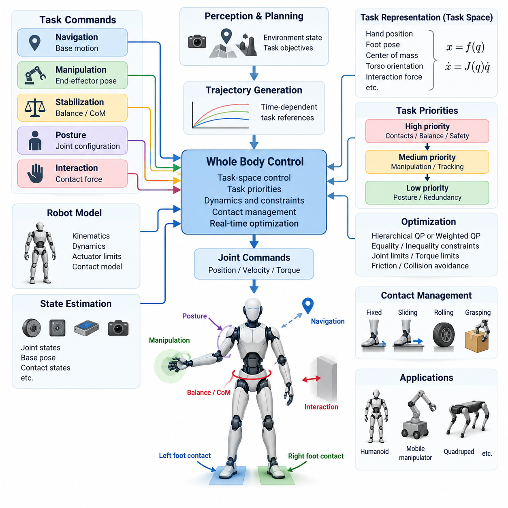
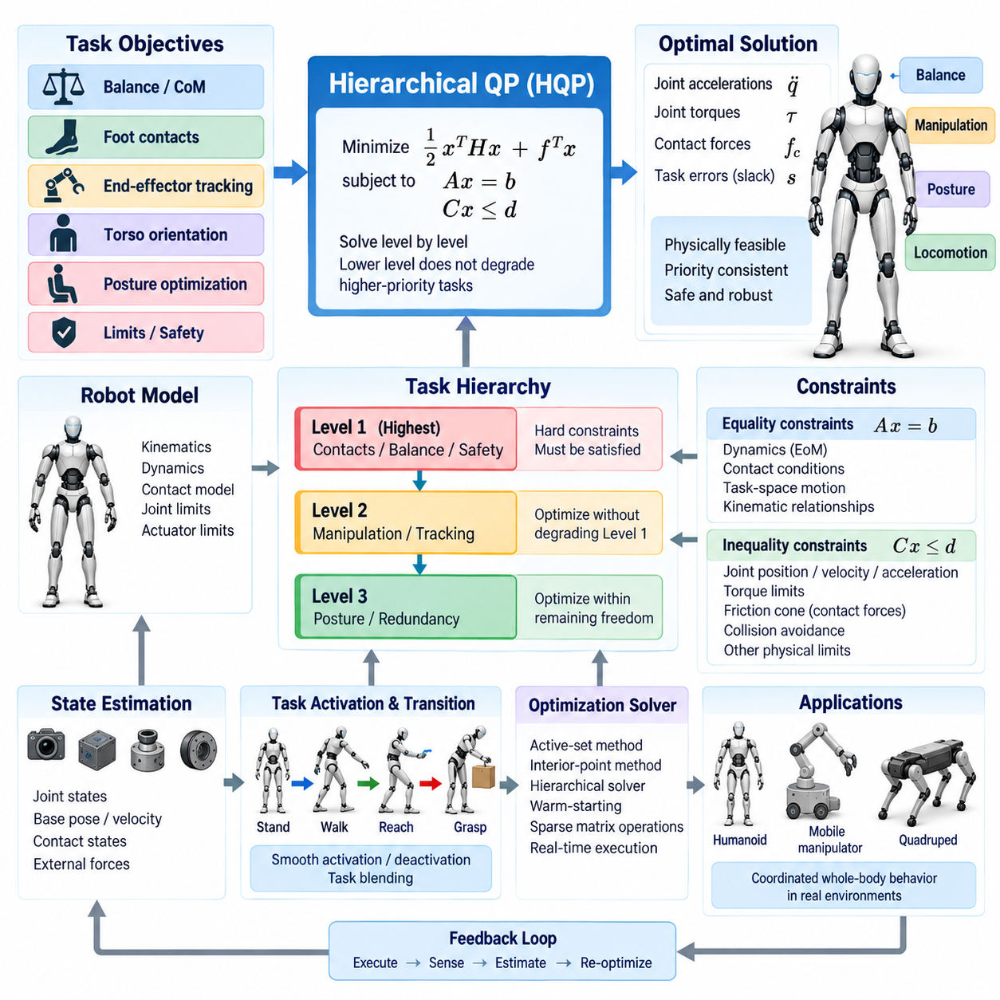
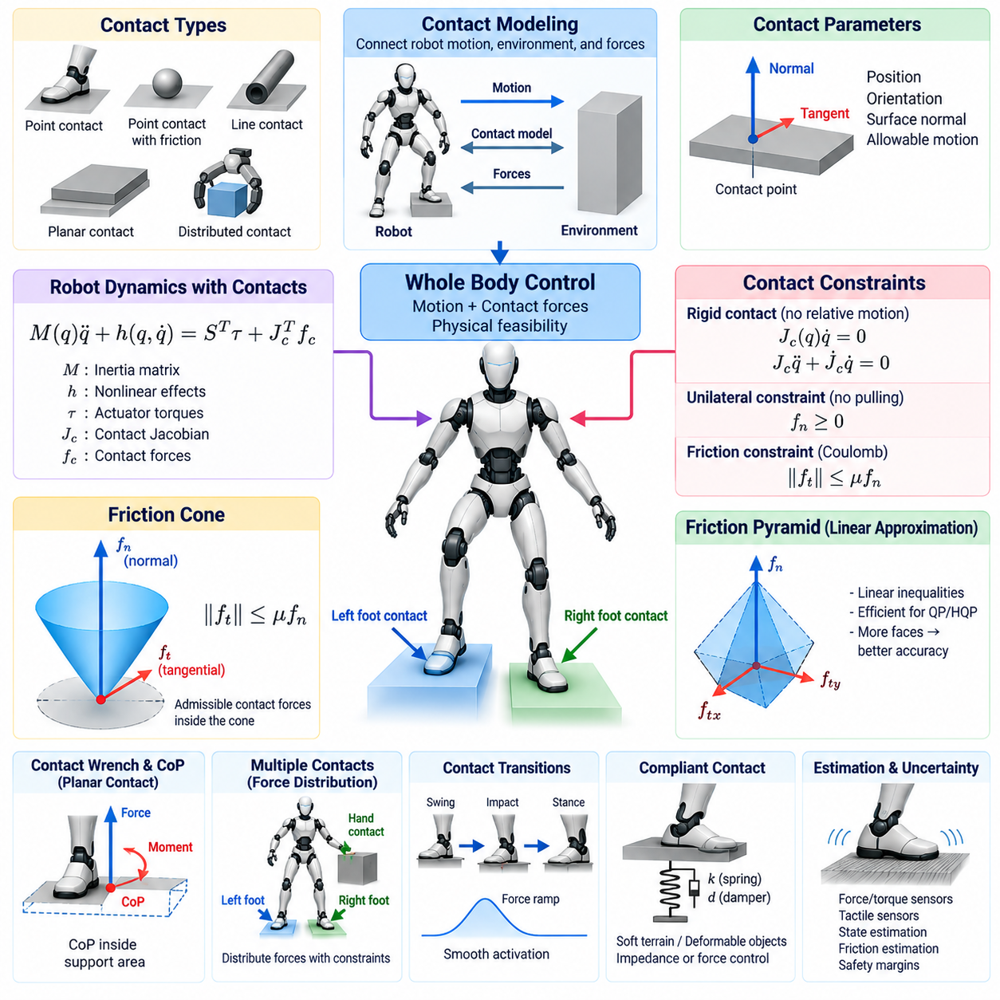
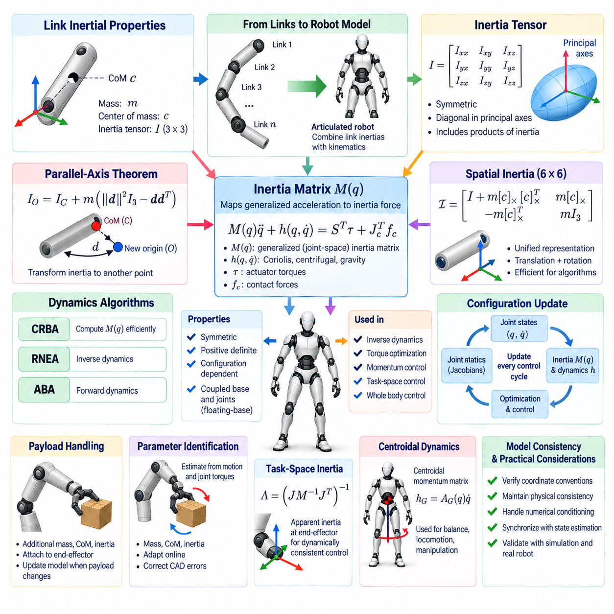
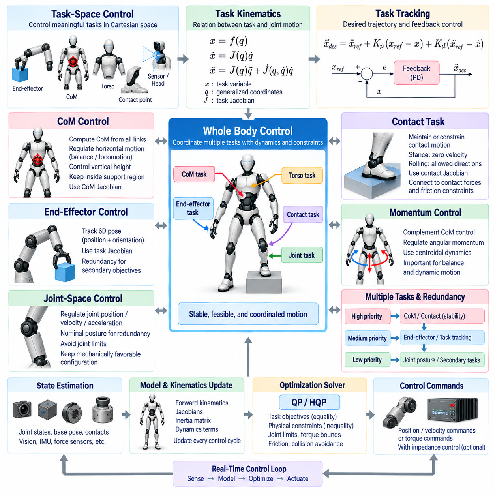
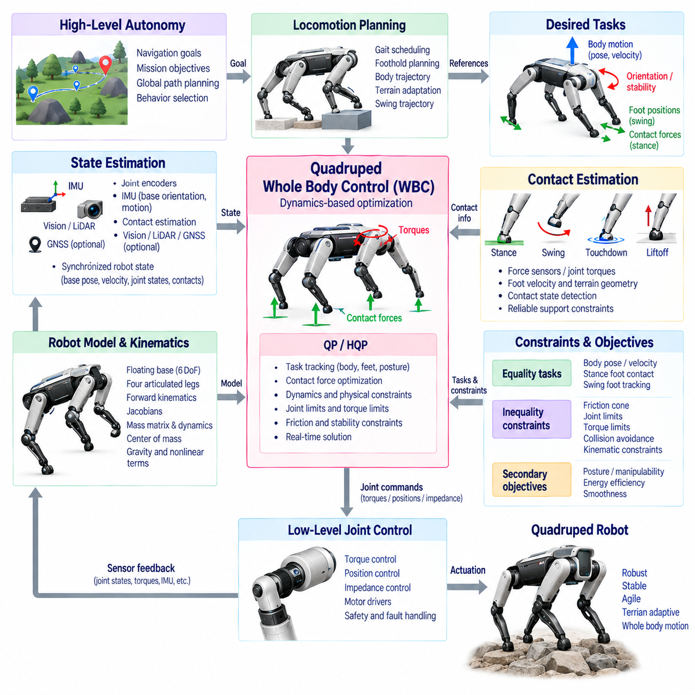
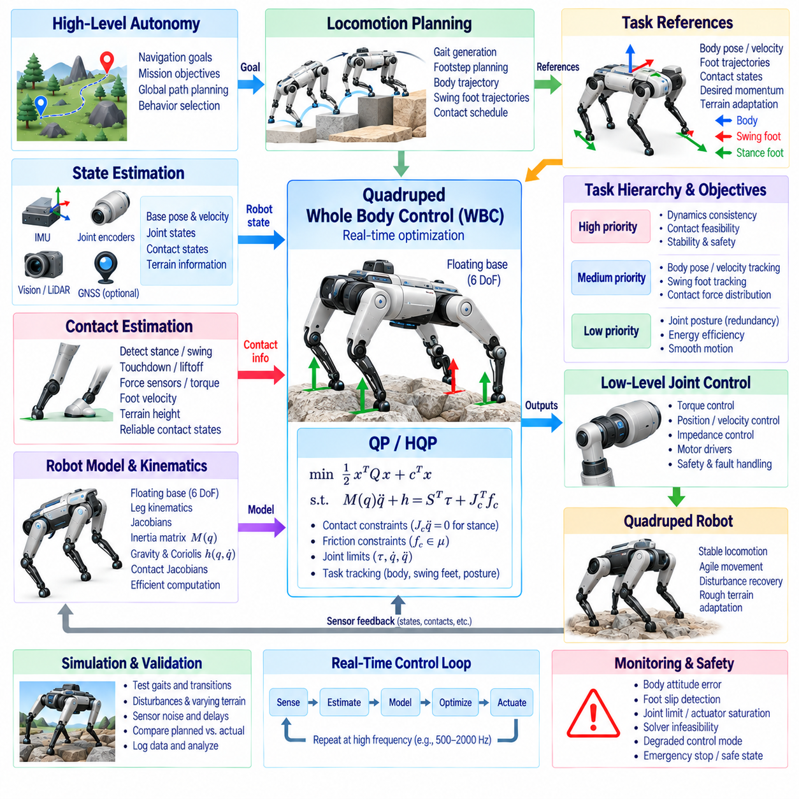
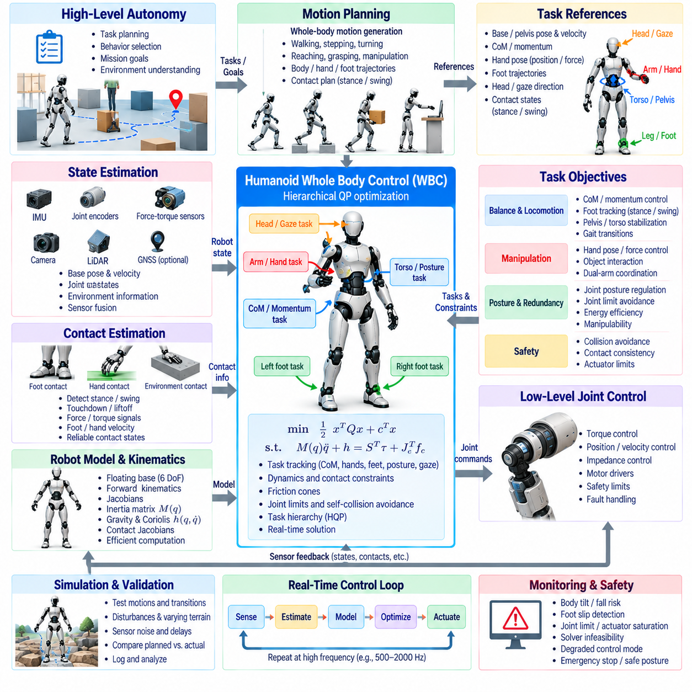
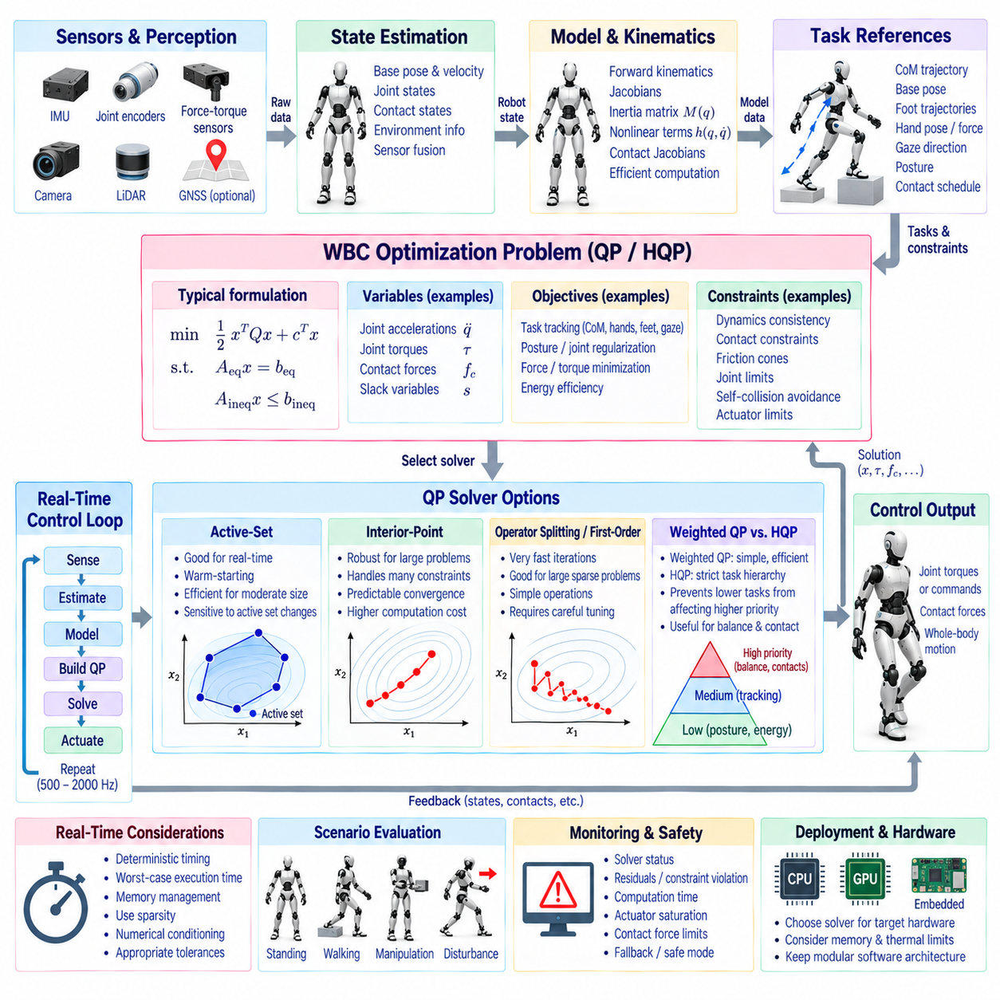
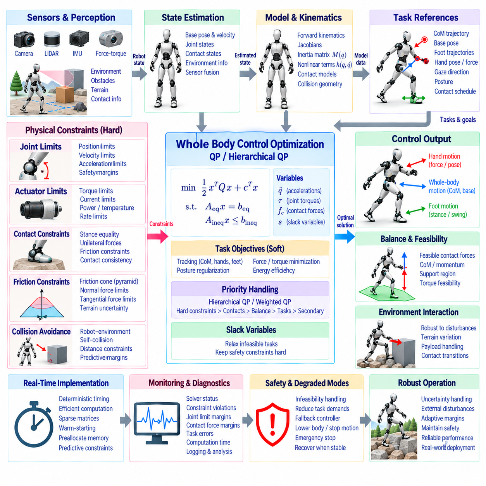

**Volume 04 Robot Control Software**


# 07. Whole Body Control

##  

## 07.01 Whole Body Control (WBC) Concept: Task Space Priorities

{width="7.268055555555556in" height="7.268055555555556in"}

Whole Body Control (WBC) is a unified control framework that coordinates all available degrees of freedom of a robot to achieve multiple motion and interaction objectives simultaneously. Instead of controlling the base, torso, arms, and legs as independent subsystems, WBC treats the robot as one coupled mechanical system. This approach is especially important for humanoids, mobile manipulators, quadrupeds, and other robots whose tasks require coordinated motion across several joints and contact points.

The central idea of WBC is to convert high-level behavioral objectives into consistent commands for the complete robot. A navigation module may request base motion while a manipulation module specifies an end-effector pose, and a stabilization module simultaneously requires balance. Whole Body Control combines these objectives while respecting the robot\'s kinematic structure, dynamic behavior, actuator capabilities, joint limits, and environmental contact conditions.

Task space provides a natural representation for expressing many WBC objectives. Rather than specifying every joint angle directly, the controller describes desired quantities such as hand position, foot pose, center-of-mass location, torso orientation, or interaction force. These quantities are defined in Cartesian or other operational spaces that correspond directly to physical behaviors. The controller then determines the joint-level motion or torque required to realize them.

A task can generally be represented by a function of the robot configuration, such as x = f(q), where q denotes generalized coordinates and x represents a task-space variable. The differential relationship is commonly written as x_dot = J(q)q_dot, where J is the task Jacobian. Through this mapping, desired task-space velocities or accelerations can be transformed into coordinated commands involving many joints rather than a single actuator.

Because a robot often needs to satisfy several objectives simultaneously, WBC requires a mechanism for managing competing tasks. For example, a humanoid reaching toward an object must preserve balance while moving its hand, maintaining suitable foot contacts, and avoiding joint limits. These requirements cannot always be satisfied perfectly at the same time. Task priorities therefore define which objectives must be preserved when conflicts occur.

A strict hierarchical approach assigns different priority levels to individual tasks. Safety-critical constraints such as maintaining valid contacts, preventing joint-limit violations, or preserving balance typically occupy higher levels, while manipulation accuracy, posture optimization, or secondary configuration objectives may occupy lower levels. Lower-priority tasks are executed only within motion directions that do not interfere with the solutions established by higher-priority tasks.

Null-space projection is a common method for implementing this hierarchy in kinematic controllers. After a high-priority task determines part of the robot motion, the remaining degrees of freedom can be used for secondary objectives. A lower-priority command is projected into the null space of the higher-priority task Jacobian. Consequently, redundant joints can improve posture or manipulability without significantly disturbing the primary end-effector or balance objective.

Task priorities may also be implemented through hierarchical quadratic programming. In this formulation, each control level solves an optimization problem subject to constraints inherited from higher levels. Equality constraints can represent desired motion or contact relationships, while inequalities describe joint limits, torque bounds, friction cones, collision margins, or acceleration limits. Hierarchical optimization provides a systematic mechanism for coordinating complex robots under numerous physical restrictions.

Not every application requires strict priorities. Weighted optimization combines several objectives into a common cost function and assigns numerical weights according to their relative importance. This method can provide smooth compromises when objectives compete, but the resulting behavior depends strongly on weight selection and scaling. Strict hierarchy is preferable when one task must never be degraded by another, whereas weighted formulations are useful when controlled trade-offs are acceptable.

Dynamic Whole Body Control extends the task-space concept beyond geometry by explicitly considering robot dynamics. A typical rigid-body model relates generalized acceleration, inertia, Coriolis and centrifugal effects, gravity, actuator forces, and external contact forces. The controller solves for quantities such as joint torques, accelerations, and contact forces that produce the requested task behavior while remaining dynamically feasible.

Contact management is particularly important for legged and physically interactive robots. Feet, wheels, grippers, or support surfaces create constraints that modify the available motion of the entire body. WBC must account for whether contacts are fixed, sliding, rolling, or transitioning between states. Contact forces must also remain physically valid, including requirements associated with unilateral contact and friction limits, otherwise the mathematically calculated motion may not be executable.

For humanoid and legged robots, balance-related tasks frequently occupy high positions in the control hierarchy. Center-of-mass regulation, centroidal momentum control, support-region constraints, and foot-contact conditions can be coordinated with manipulation tasks. The robot may therefore move its torso and unused joints to compensate for arm motion, allowing an end-effector to reach a target while maintaining dynamically consistent whole-body stability.

Mobile manipulators introduce another form of redundancy because both the mobile base and manipulator contribute to end-effector motion. WBC can distribute a Cartesian command between these subsystems according to task requirements. Small adjustments may primarily use arm joints, while distant targets can cause coordinated base movement. Secondary objectives can maintain favorable arm configurations, improve manipulability, reduce energy consumption, or keep the platform away from obstacles.

Task activation and transition management are essential for practical implementations. Robotic behavior frequently changes between standing, walking, reaching, grasping, carrying, and releasing. Abruptly adding or removing tasks can generate discontinuities in velocity, acceleration, or torque commands. Smooth activation functions, trajectory blending, and controlled priority transitions help maintain stable behavior as the active task set changes during operation.

Whole Body Control usually operates within a layered software architecture. Perception and planning modules determine environmental state and desired behavior, while trajectory generators convert those decisions into time-dependent references. WBC receives these references together with estimated robot state and produces joint-level commands. Fast motor controllers then execute position, velocity, or torque targets while sensors continuously provide feedback for the next control cycle.

State estimation quality directly affects WBC performance because task-space calculations depend on accurate knowledge of joint states, body pose, velocity, and contacts. Encoders, inertial sensors, force-torque sensors, vision, and other measurements may be fused to estimate the current configuration. Errors in base orientation or contact state can propagate through the whole-body model, making robust estimation and synchronized sensor data important components of the control system.

Real-time implementation requires careful management of computational complexity and numerical conditioning. Jacobians, dynamic matrices, constraint equations, and optimization problems may need to be updated hundreds or thousands of times per second. Singular configurations and nearly dependent tasks can make numerical solutions unstable. Regularization, damping, task scaling, solver warm-starting, and appropriate matrix factorization techniques are therefore important for reliable execution.

The practical value of WBC lies in separating behavioral intent from actuator coordination. Higher software layers can request meaningful objectives such as "keep the torso upright," "move the hand to this pose," or "maintain support," while the whole-body controller determines how available joints and contact forces should cooperate. This abstraction reduces the need for every application module to understand the detailed coordination of the complete mechanical system.

A robust WBC design ultimately combines task-space control, priority management, robot dynamics, physical constraints, contact reasoning, state estimation, and real-time optimization. Task priorities provide the structure needed to resolve conflicts, while redundancy allows unused degrees of freedom to support secondary objectives. Together, these mechanisms enable complex robots to perform coordinated motion and interaction while preserving feasibility, stability, and safety across the entire body.

전신 제어(Whole Body Control, WBC)는 로봇이 사용할 수 있는 모든 자유도(Degrees of Freedom, DoF)를 통합적으로 조정하여 여러 동작 및 상호작용 목표를 동시에 달성하는 제어 프레임워크(Control Framework)이다. 베이스(Base), 몸통(Torso), 팔(Arm), 다리(Leg)를 독립적인 하위 시스템(Subsystem)으로 제어하는 대신, WBC는 로봇 전체를 하나의 결합된 기계 시스템(Coupled Mechanical System)으로 취급한다. 이러한 접근 방식은 여러 관절과 접촉 지점(Contact Point)의 협조 동작이 필요한 휴머노이드(Humanoid), 모바일 매니퓰레이터(Mobile Manipulator), 사족보행 로봇(Quadruped) 등에 특히 중요하다.

WBC의 핵심 개념은 상위 수준의 행동 목표(Behavioral Objective)를 로봇 전체에 대해 일관된 명령으로 변환하는 것이다. 내비게이션 모듈(Navigation Module)이 베이스 이동을 요구하는 동시에 매니퓰레이션 모듈(Manipulation Module)은 말단장치 자세(End-Effector Pose)를 지정할 수 있으며, 안정화 모듈(Stabilization Module)은 동시에 균형 유지를 요구할 수 있다. 전신 제어는 로봇의 운동학적 구조(Kinematic Structure), 동역학적 거동(Dynamic Behavior), 액추에이터 성능(Actuator Capability), 관절 제한(Joint Limit), 환경 접촉 조건(Environmental Contact Condition)을 고려하면서 이러한 목표를 통합한다.

작업 공간(Task Space)은 다양한 WBC 목표를 표현하기 위한 자연스러운 방법을 제공한다. 모든 관절 각도(Joint Angle)를 직접 지정하는 대신, 제어기는 손의 위치, 발의 자세, 질량중심(Center of Mass, CoM) 위치, 몸통 방향(Torso Orientation), 상호작용 힘(Interaction Force)과 같은 원하는 물리량을 정의한다. 이러한 물리량은 실제 로봇의 행동과 직접적으로 대응되는 직교 좌표 공간(Cartesian Space) 또는 기타 운용 공간(Operational Space)에서 정의된다. 이후 제어기는 이를 실현하기 위해 필요한 관절 수준의 운동이나 토크(Torque)를 결정한다.

작업(Task)은 일반적으로 로봇 구성(Configuration)의 함수인 x = f(q)로 표현할 수 있으며, 여기서 q는 일반화 좌표(Generalized Coordinates), x는 작업 공간 변수(Task-Space Variable)를 나타낸다. 미분 관계는 일반적으로 x_dot = J(q)q_dot 형태로 표현되며, 여기서 J는 작업 자코비안(Task Jacobian)이다. 이러한 매핑(Mapping)을 통해 원하는 작업 공간 속도 또는 가속도를 단일 액추에이터가 아니라 여러 관절이 협조하는 명령으로 변환할 수 있다.

로봇은 여러 목표를 동시에 만족해야 하는 경우가 많기 때문에 WBC에는 서로 경쟁하는 작업을 관리하는 메커니즘이 필요하다. 예를 들어 휴머노이드가 물체를 향해 손을 뻗을 때에는 손을 이동시키는 동시에 균형을 유지하고, 적절한 발 접촉(Foot Contact)을 보존하며, 관절 제한을 회피해야 한다. 이러한 요구 조건을 항상 완벽하게 동시에 만족할 수 있는 것은 아니다. 따라서 작업 우선순위(Task Priority)는 충돌이 발생할 때 어떤 목표를 우선적으로 유지해야 하는지를 정의한다.

엄격한 계층적 접근 방식(Strict Hierarchical Approach)은 각각의 작업에 서로 다른 우선순위 수준(Priority Level)을 할당한다. 유효한 접촉 유지, 관절 제한 위반 방지, 균형 유지와 같은 안전 중요 제약조건(Safety-Critical Constraint)은 일반적으로 높은 수준에 배치되며, 매니퓰레이션 정확도(Manipulation Accuracy), 자세 최적화(Posture Optimization), 보조 구성 목표(Secondary Configuration Objective)는 낮은 수준에 배치될 수 있다. 낮은 우선순위 작업은 높은 우선순위 작업에서 이미 결정된 해를 방해하지 않는 운동 방향 내에서만 수행된다.

널 공간 투영(Null-Space Projection)은 운동학 기반 제어기(Kinematic Controller)에서 이러한 계층 구조를 구현하는 대표적인 방법이다. 높은 우선순위 작업이 로봇 운동의 일부를 결정한 이후에는 남아 있는 자유도를 보조 목표에 사용할 수 있다. 낮은 우선순위 명령은 높은 우선순위 작업 자코비안의 널 공간(Null Space)으로 투영된다. 이에 따라 여유 관절(Redundant Joint)은 주요 말단장치 또는 균형 목표를 크게 방해하지 않으면서 자세나 조작성(Manipulability)을 개선할 수 있다.

작업 우선순위는 계층적 이차계획법(Hierarchical Quadratic Programming, HQP)을 통해 구현할 수도 있다. 이 방식에서는 각각의 제어 수준이 상위 수준에서 전달된 제약조건을 만족하면서 최적화 문제(Optimization Problem)를 해결한다. 등식 제약조건(Equality Constraint)은 원하는 운동이나 접촉 관계를 표현할 수 있으며, 부등식 제약조건(Inequality Constraint)은 관절 제한, 토크 한계, 마찰 원뿔(Friction Cone), 충돌 여유(Collision Margin), 가속도 제한 등을 나타낼 수 있다. 계층적 최적화(Hierarchical Optimization)는 수많은 물리적 제약조건 아래에서 복잡한 로봇을 체계적으로 조정할 수 있는 방법을 제공한다.

모든 응용 분야에서 엄격한 우선순위가 필요한 것은 아니다. 가중 최적화(Weighted Optimization)는 여러 목표를 하나의 공통 비용 함수(Cost Function)로 결합하고 상대적인 중요도에 따라 수치적 가중치(Weight)를 부여한다. 이 방법은 목표가 충돌할 때 부드러운 절충안을 제공할 수 있지만, 결과적인 동작은 가중치 선택과 스케일링(Scaling)에 크게 영향을 받는다. 하나의 작업이 다른 작업으로 인해 절대 저하되어서는 안 되는 경우에는 엄격한 계층 구조가 적합하며, 제어된 절충이 허용되는 경우에는 가중 방식이 유용하다.

동역학 기반 전신 제어(Dynamic Whole Body Control)는 로봇 동역학(Robot Dynamics)을 명시적으로 고려함으로써 작업 공간 개념을 기하학적 관계 이상으로 확장한다. 일반적인 강체 동역학 모델(Rigid-Body Dynamics Model)은 일반화 가속도(Generalized Acceleration), 관성(Inertia), 코리올리 및 원심 효과(Coriolis and Centrifugal Effects), 중력(Gravity), 액추에이터 힘(Actuator Force), 외부 접촉력(External Contact Force)의 관계를 표현한다. 제어기는 요구되는 작업 동작을 생성하면서 동역학적으로 실행 가능한 관절 토크, 가속도 및 접촉력 등을 계산한다.

접촉 관리(Contact Management)는 보행 로봇과 물리적 상호작용 로봇에서 특히 중요하다. 발, 바퀴, 그리퍼(Gripper), 지지 표면(Support Surface)은 로봇 전체가 사용할 수 있는 운동을 변화시키는 제약조건을 생성한다. WBC는 접촉 상태가 고정(Fixed), 미끄러짐(Sliding), 구름(Rolling) 또는 상태 전환 중인지 고려해야 한다. 또한 접촉력은 단방향 접촉(Unilateral Contact) 및 마찰 제한(Friction Limit)과 관련된 조건을 포함하여 물리적으로 유효해야 하며, 그렇지 않으면 수학적으로 계산된 운동을 실제 로봇에서 실행할 수 없다.

휴머노이드와 보행 로봇에서는 균형 관련 작업(Balance-Related Task)이 제어 계층에서 높은 우선순위를 차지하는 경우가 많다. 질량중심 조절(Center-of-Mass Regulation), 중심 운동량 제어(Centroidal Momentum Control), 지지 영역 제약조건(Support-Region Constraint), 발 접촉 조건을 매니퓰레이션 작업과 함께 조정할 수 있다. 이에 따라 로봇은 팔의 움직임을 보상하기 위해 몸통과 사용되지 않는 관절을 움직일 수 있으며, 동역학적으로 일관된 전신 안정성(Whole-Body Stability)을 유지하면서 말단장치가 목표 지점에 도달하도록 할 수 있다.

모바일 매니퓰레이터(Mobile Manipulator)는 이동 베이스와 매니퓰레이터가 모두 말단장치의 운동에 기여하기 때문에 또 다른 형태의 여유성(Redundancy)을 제공한다. WBC는 작업 요구 조건에 따라 직교 좌표 명령(Cartesian Command)을 두 하위 시스템 사이에 분배할 수 있다. 작은 위치 조정에는 주로 팔 관절을 사용할 수 있으며, 멀리 떨어진 목표에는 베이스의 협조 이동이 포함될 수 있다. 보조 목표를 통해 적절한 팔 형상을 유지하고, 조작성을 개선하며, 에너지 소비를 줄이거나 플랫폼이 장애물로부터 안전한 거리를 유지하도록 할 수 있다.

작업 활성화(Task Activation)와 전환 관리(Transition Management)는 실제 WBC 구현에서 필수적이다. 로봇의 행동은 정지, 보행, 접근, 파지, 운반, 해제 등의 상태 사이에서 빈번하게 변화한다. 작업을 갑작스럽게 추가하거나 제거하면 속도, 가속도 또는 토크 명령에 불연속성(Discontinuity)이 발생할 수 있다. 부드러운 활성화 함수(Smooth Activation Function), 궤적 블렌딩(Trajectory Blending), 제어된 우선순위 전환(Controlled Priority Transition)을 사용하면 동작 중 활성 작업 집합(Active Task Set)이 변경될 때 안정적인 거동을 유지할 수 있다.

전신 제어는 일반적으로 계층화된 소프트웨어 아키텍처(Layered Software Architecture) 내에서 동작한다. 인지 및 계획 모듈(Perception and Planning Module)은 환경 상태와 원하는 행동을 결정하고, 궤적 생성기(Trajectory Generator)는 이러한 결정을 시간에 따른 기준값(Time-Dependent Reference)으로 변환한다. WBC는 추정된 로봇 상태와 함께 이러한 기준값을 입력받아 관절 수준 명령을 생성한다. 이후 고속 모터 제어기(Motor Controller)가 위치, 속도 또는 토크 목표를 실행하며 센서는 다음 제어 주기를 위해 지속적으로 피드백을 제공한다.

상태 추정(State Estimation)의 품질은 작업 공간 계산이 정확한 관절 상태, 몸체 자세, 속도 및 접촉 정보에 의존하기 때문에 WBC 성능에 직접적인 영향을 준다. 엔코더(Encoder), 관성 센서(Inertial Sensor), 힘-토크 센서(Force-Torque Sensor), 비전(Vision) 및 기타 측정값을 융합하여 현재 로봇 구성을 추정할 수 있다. 베이스 방향이나 접촉 상태의 오차는 전신 모델 전체로 전파될 수 있으므로 강건한 상태 추정(Robust State Estimation)과 동기화된 센서 데이터(Synchronized Sensor Data)는 제어 시스템의 중요한 구성 요소이다.

실시간 구현(Real-Time Implementation)을 위해서는 계산 복잡도(Computational Complexity)와 수치적 조건성(Numerical Conditioning)을 세심하게 관리해야 한다. 자코비안, 동역학 행렬(Dynamic Matrix), 제약 방정식(Constraint Equation), 최적화 문제를 초당 수백 회 또는 수천 회 갱신해야 할 수 있다. 특이 구성(Singular Configuration)이나 서로 거의 종속적인 작업은 수치 해를 불안정하게 만들 수 있다. 따라서 정규화(Regularization), 감쇠(Damping), 작업 스케일링(Task Scaling), 솔버 웜 스타팅(Solver Warm-Starting), 적절한 행렬 분해(Matrix Factorization) 기법이 안정적인 실행을 위해 중요하다.

WBC의 실질적인 가치는 행동 의도(Behavioral Intent)와 액추에이터 협조(Actuator Coordination)를 분리하는 데 있다. 상위 소프트웨어 계층은 "몸통을 똑바로 유지", "손을 이 자세로 이동", "지지 상태 유지"와 같이 의미 있는 목표를 요청할 수 있으며, 전신 제어기는 사용 가능한 관절과 접촉력이 어떻게 협력해야 하는지를 결정한다. 이러한 추상화(Abstraction)를 통해 각 응용 모듈이 전체 기계 시스템의 세부적인 협조 제어 방법을 직접 이해해야 하는 필요성을 줄일 수 있다.

강건한 전신 제어 설계(Robust WBC Design)는 궁극적으로 작업 공간 제어(Task-Space Control), 우선순위 관리(Priority Management), 로봇 동역학, 물리적 제약조건(Physical Constraint), 접촉 추론(Contact Reasoning), 상태 추정 및 실시간 최적화(Real-Time Optimization)를 통합한다. 작업 우선순위는 충돌을 해결하는 데 필요한 구조를 제공하며, 여유성은 사용되지 않는 자유도를 보조 목표 달성에 활용할 수 있도록 한다. 이러한 메커니즘을 통해 복잡한 로봇은 전신에 걸쳐 실행 가능성(Feasibility), 안정성(Stability), 안전성(Safety)을 유지하면서 협조된 운동과 물리적 상호작용을 수행할 수 있다.

##  

## 07.02 Hierarchical Quadratic Programming (HQP) [w/Code]

{width="7.268055555555556in" height="7.268055555555556in"}

Hierarchical Quadratic Programming (HQP) is an optimization framework widely used in Whole Body Control to coordinate multiple robot objectives while preserving explicit priority relationships. Unlike a single weighted optimization problem, HQP organizes tasks and constraints into ordered levels. A solution at a lower level is permitted only when it does not degrade objectives already established at higher-priority levels.

The motivation for HQP arises from the fact that complex robots must satisfy many objectives simultaneously. A humanoid may need to maintain balance, preserve foot contacts, track hand motion, regulate torso orientation, and optimize posture at the same time. When these objectives conflict, simply assigning numerical weights may produce undesirable compromises. HQP instead represents importance directly through a mathematical hierarchy.

At each hierarchy level, a quadratic program minimizes a cost function subject to equality and inequality constraints. A typical quadratic objective can be written as minimizing 1/2 xᵀHx + fᵀx, where x contains decision variables and H and f define the optimization objective. Depending on the controller architecture, x may include generalized accelerations, joint torques, contact forces, task errors, or slack variables.

Equality constraints are commonly used to represent relationships that should be satisfied precisely or with controlled relaxation. Examples include rigid contact conditions, equations of motion, desired Cartesian acceleration, and kinematic relationships between robot bodies. These constraints can be expressed in a linearized form such as Ax = b, allowing the quadratic programming solver to incorporate them directly into the optimization problem.

Inequality constraints are particularly important because physical robots operate within finite limits. Joint positions, velocities, accelerations, actuator torques, contact forces, friction conditions, and collision distances all impose admissible ranges on the solution. These conditions can typically be represented as lower and upper bounds or linear inequalities, enabling HQP to prevent commands that violate physical or safety-related restrictions.

The hierarchy distinguishes HQP from ordinary Quadratic Programming (QP). Suppose balance preservation is assigned to the highest task level, end-effector tracking to the second level, and posture optimization to the third. The controller first obtains the best feasible balance solution. The manipulation task is then optimized without worsening that result, and posture is finally improved only within the remaining freedom available after both higher levels are protected.

This structure is closely related to the concept of null-space control. In classical redundancy resolution, a secondary task is projected into the null space of a higher-priority Jacobian. HQP generalizes this idea by handling equality constraints, inequality constraints, actuator limits, contacts, and dynamically feasible quantities within a common optimization framework. It therefore supports control problems that are difficult to manage through Jacobian projection alone.

HQP can operate at the kinematic level using joint velocities or accelerations as optimization variables. A desired task-space motion is mapped through a Jacobian relationship, and the optimization determines robot motion that best satisfies the ordered objectives. This formulation is useful for trajectory generation, posture control, and manipulation when detailed force dynamics are not the primary concern or are handled by lower control layers.

Dynamic HQP incorporates the full equations of motion and is particularly useful for humanoids, quadrupeds, and robots interacting strongly with their environment. Generalized acceleration, actuator torque, and contact force may be optimized simultaneously. The resulting solution must satisfy rigid-body dynamics while also respecting contact conditions, friction constraints, torque limits, and task-space acceleration requirements.

Contact constraints introduce an important set of inequalities into dynamic HQP. A supporting foot or wheel cannot generally pull on the ground, and tangential contact forces must remain consistent with available friction. Friction cones are therefore represented directly or approximated using linear friction pyramids. These constraints allow the optimizer to calculate contact forces that support desired whole-body motion without requesting physically impossible interactions.

Slack variables provide controlled relaxation when a task cannot be satisfied exactly. Instead of declaring the complete optimization problem infeasible, the controller introduces an error variable and minimizes its magnitude at the corresponding priority level. High-priority safety constraints may remain hard constraints, while tracking objectives can use bounded slack. This distinction enables the system to continue operating gracefully when environmental or mechanical limitations prevent perfect execution.

Constraint feasibility must be considered carefully because conflicting hard constraints can make an HQP level unsolvable. For example, a requested acceleration may be incompatible with joint limits, torque limits, and fixed contact conditions simultaneously. Controller designers therefore distinguish immutable physical constraints from behavioral objectives that may be relaxed. Feasibility restoration strategies can progressively modify noncritical requirements while preserving essential safety conditions.

Task scaling provides another method for maintaining feasibility. When a desired motion exceeds the robot\'s available velocity, acceleration, or torque capability, the controller can reduce the magnitude of the task while preserving its direction or geometric intent. In hierarchical control, scaling must respect priority relationships so that modifying a lower-level task does not alter the solution quality guaranteed to higher-priority objectives.

The ordering of tasks strongly influences robot behavior and should reflect functional requirements rather than arbitrary software structure. Physical feasibility, collision avoidance, critical contact constraints, and balance commonly receive high priority. Manipulation or locomotion tracking may occupy intermediate levels, while posture, manipulability, energy reduction, and preferred joint configurations are often placed lower. The exact hierarchy depends on the robot and operating scenario.

HQP is especially valuable for redundant robots because additional degrees of freedom can be systematically allocated to secondary objectives. A humanoid can maintain foot contacts and center-of-mass behavior while using its arms for manipulation and its torso for additional reach. A mobile manipulator can coordinate base and arm motion while preserving obstacle clearance. Remaining redundancy can then improve posture, joint-limit margins, or manipulability.

Task activation must be handled smoothly when the hierarchy changes during robot operation. Walking introduces and removes foot-contact constraints, grasping establishes new interaction relationships, and manipulation tasks may appear or disappear according to mission state. Abrupt changes in active constraints can produce discontinuous acceleration or torque commands. Transition functions and task blending are therefore commonly used around contact and behavioral transitions.

Real-time execution is a major engineering requirement because HQP problems may need to be solved at high control frequencies. Every control cycle can require updated Jacobians, dynamic matrices, contact models, constraint bounds, and task references. Efficient sparse matrix operations, warm-starting, active-set methods, interior-point methods, and specialized hierarchical solvers can reduce computation time while maintaining sufficiently accurate solutions.

Numerical conditioning also affects controller reliability. Tasks with substantially different physical units or magnitudes can create poorly scaled optimization matrices. Nearly singular Jacobians and redundant constraints may further degrade solver performance. Appropriate normalization, regularization, damping, constraint preprocessing, and rank detection help prevent numerical problems from becoming unstable robot commands, particularly near singular configurations.

State estimation and model accuracy remain essential even when the optimization itself is mathematically correct. HQP depends on estimated joint states, floating-base motion, contact states, inertial parameters, and external forces. Errors in these quantities can cause the optimizer to solve the wrong physical problem. Robust estimators, synchronized sensing, model calibration, and feedback control are therefore required around the optimization layer.

In a practical Whole Body Control architecture, planners provide desired task trajectories while the HQP layer converts them into dynamically or kinematically consistent commands. The optimizer receives the current robot state, model information, contact configuration, task hierarchy, and physical limits. Its output may consist of desired joint acceleration, torque, and contact force commands that are subsequently executed by high-frequency actuator controllers.

HQP provides a systematic bridge between high-level robotic intent and low-level physical feasibility. Its primary strength is not merely solving several optimization objectives, but guaranteeing that their priority structure remains explicit during conflict resolution. By combining hierarchy, constraints, redundancy resolution, feasibility management, and real-time optimization, HQP enables sophisticated robots to coordinate whole-body behavior while respecting safety and physical limitations.

계층적 이차계획법(Hierarchical Quadratic Programming, HQP)은 명시적인 우선순위 관계(Priority Relationship)를 유지하면서 여러 로봇 제어 목표를 조정하기 위해 전신 제어(Whole Body Control, WBC)에서 널리 사용되는 최적화 프레임워크(Optimization Framework)이다. 하나의 가중 최적화 문제(Weighted Optimization Problem)를 사용하는 방식과 달리 HQP는 작업(Task)과 제약조건(Constraint)을 순서가 정해진 여러 계층으로 구성한다. 낮은 우선순위 수준의 해는 상위 우선순위에서 이미 결정된 목표를 저하시키지 않는 경우에만 허용된다.

HQP가 필요한 이유는 복잡한 로봇이 여러 목표를 동시에 만족해야 하기 때문이다. 휴머노이드(Humanoid)는 균형을 유지하고, 발 접촉(Foot Contact)을 보존하며, 손의 움직임을 추종하고, 몸통 방향(Torso Orientation)을 조절하며, 동시에 자세(Posture)를 최적화해야 할 수 있다. 이러한 목표가 서로 충돌할 때 단순히 수치적 가중치(Weight)를 부여하면 바람직하지 않은 절충이 발생할 수 있다. HQP는 중요도를 수학적인 계층 구조(Mathematical Hierarchy)를 통해 직접 표현한다.

각 계층 수준(Hierarchy Level)에서는 등식 및 부등식 제약조건(Equality and Inequality Constraints)을 만족하면서 비용 함수(Cost Function)를 최소화하는 이차계획법(Quadratic Programming, QP)을 수행한다. 일반적인 이차 목적함수(Quadratic Objective)는 1/2 xᵀHx + fᵀx의 최소화 형태로 표현할 수 있으며, 여기서 x는 결정 변수(Decision Variable)를 포함하고 H와 f는 최적화 목적을 정의한다. 제어기 구조에 따라 x에는 일반화 가속도(Generalized Acceleration), 관절 토크(Joint Torque), 접촉력(Contact Force), 작업 오차(Task Error), 슬랙 변수(Slack Variable) 등이 포함될 수 있다.

등식 제약조건(Equality Constraint)은 정확하게 만족하거나 제어된 범위에서 완화되어야 하는 관계를 표현하는 데 일반적으로 사용된다. 대표적인 예로 강체 접촉 조건(Rigid Contact Condition), 운동 방정식(Equation of Motion), 원하는 직교 좌표 가속도(Cartesian Acceleration), 로봇 몸체 사이의 운동학적 관계(Kinematic Relationship)가 있다. 이러한 제약조건은 Ax = b와 같은 선형화된 형태로 표현할 수 있으며, 이를 통해 이차계획 솔버(Quadratic Programming Solver)가 최적화 문제에 직접 포함할 수 있다.

부등식 제약조건(Inequality Constraint)은 실제 로봇이 유한한 물리적 한계 내에서 동작하기 때문에 특히 중요하다. 관절 위치, 속도, 가속도, 액추에이터 토크(Actuator Torque), 접촉력, 마찰 조건(Friction Condition), 충돌 거리(Collision Distance)는 모두 해가 만족해야 하는 허용 범위를 형성한다. 이러한 조건은 일반적으로 하한 및 상한(Lower and Upper Bounds) 또는 선형 부등식(Linear Inequality)으로 표현할 수 있으며, HQP가 물리적 또는 안전 관련 제한을 위반하는 명령을 생성하지 않도록 한다.

계층 구조(Hierarchy)는 HQP를 일반적인 이차계획법(QP)과 구분하는 핵심 요소이다. 예를 들어 균형 유지(Balance Preservation)를 가장 높은 작업 수준에 배치하고, 말단장치 추종(End-Effector Tracking)을 두 번째 수준, 자세 최적화(Posture Optimization)를 세 번째 수준에 배치할 수 있다. 제어기는 먼저 실행 가능한 최적의 균형 해를 구하고, 이후 그 결과를 악화시키지 않는 범위에서 매니퓰레이션 작업을 최적화하며, 마지막으로 두 상위 수준을 모두 보호하면서 남아 있는 자유도 내에서 자세를 개선한다.

이러한 구조는 널 공간 제어(Null-Space Control) 개념과 밀접하게 관련된다. 전통적인 여유도 해석(Redundancy Resolution)에서는 보조 작업(Secondary Task)을 상위 우선순위 자코비안(Jacobian)의 널 공간(Null Space)에 투영한다. HQP는 등식 제약조건, 부등식 제약조건, 액추에이터 제한, 접촉 조건 및 동역학적으로 실행 가능한 물리량을 하나의 공통 최적화 프레임워크에서 처리함으로써 이러한 개념을 일반화한다. 따라서 단순한 자코비안 투영(Jacobian Projection)만으로 처리하기 어려운 제어 문제를 지원할 수 있다.

HQP는 관절 속도(Joint Velocity) 또는 관절 가속도(Joint Acceleration)를 최적화 변수로 사용하는 운동학적 수준(Kinematic Level)에서 동작할 수 있다. 원하는 작업 공간 운동(Task-Space Motion)은 자코비안 관계를 통해 매핑되며, 최적화 과정은 우선순위가 지정된 목표를 가장 효과적으로 만족하는 로봇 운동을 결정한다. 이러한 방식은 상세한 힘 동역학(Force Dynamics)이 주요 관심 대상이 아니거나 하위 제어 계층에서 처리되는 경우 궤적 생성(Trajectory Generation), 자세 제어(Posture Control), 매니퓰레이션(Manipulation)에 유용하다.

동역학 기반 HQP(Dynamic HQP)는 전체 운동 방정식을 포함하며 휴머노이드, 사족보행 로봇(Quadruped), 환경과 강하게 상호작용하는 로봇에 특히 유용하다. 일반화 가속도, 액추에이터 토크 및 접촉력을 동시에 최적화할 수 있다. 계산된 해는 강체 동역학(Rigid-Body Dynamics)을 만족하면서 접촉 조건, 마찰 제약조건(Friction Constraint), 토크 제한(Torque Limit), 작업 공간 가속도 요구조건(Task-Space Acceleration Requirement)을 동시에 충족해야 한다.

접촉 제약조건(Contact Constraint)은 동역학 기반 HQP에 중요한 부등식 조건을 추가한다. 지면을 지지하는 발이나 바퀴는 일반적으로 지면을 당기는 방향의 힘을 생성할 수 없으며, 접선 방향 접촉력(Tangential Contact Force)은 사용 가능한 마찰 범위를 만족해야 한다. 따라서 마찰 원뿔(Friction Cone)을 직접 표현하거나 선형 마찰 피라미드(Linear Friction Pyramid)로 근사한다. 이를 통해 최적화기는 물리적으로 불가능한 상호작용을 요구하지 않으면서 원하는 전신 운동을 지지하는 접촉력을 계산할 수 있다.

슬랙 변수(Slack Variable)는 작업을 정확하게 만족할 수 없는 경우 제어된 완화(Controlled Relaxation)를 제공한다. 전체 최적화 문제를 실행 불가능(Infeasible)한 것으로 처리하는 대신, 제어기는 오차 변수(Error Variable)를 추가하고 해당 우선순위 수준에서 그 크기를 최소화한다. 높은 우선순위의 안전 제약조건은 강성 제약조건(Hard Constraint)으로 유지할 수 있으며, 추종 목표(Tracking Objective)에는 제한된 슬랙을 적용할 수 있다. 이러한 구분을 통해 환경적 또는 기계적 제한 때문에 완벽한 수행이 불가능한 상황에서도 시스템이 안정적으로 동작을 지속할 수 있다.

서로 충돌하는 강성 제약조건은 HQP 수준 자체를 해결할 수 없게 만들 수 있기 때문에 제약조건 실행 가능성(Constraint Feasibility)을 신중하게 고려해야 한다. 예를 들어 요구되는 가속도가 관절 제한, 토크 제한 및 고정 접촉 조건(Fixed Contact Condition)과 동시에 양립하지 않을 수 있다. 따라서 제어기 설계자는 변경할 수 없는 물리적 제약조건과 완화할 수 있는 행동 목표(Behavioral Objective)를 구분해야 한다. 실행 가능성 복원 전략(Feasibility Restoration Strategy)은 필수적인 안전 조건을 유지하면서 중요도가 낮은 요구사항을 단계적으로 수정할 수 있다.

작업 스케일링(Task Scaling)은 실행 가능성을 유지하기 위한 또 다른 방법을 제공한다. 원하는 운동이 로봇에서 사용할 수 있는 속도, 가속도 또는 토크 성능을 초과하면 제어기는 운동 방향이나 기하학적 의도(Geometric Intent)를 유지하면서 작업 크기를 감소시킬 수 있다. 계층적 제어에서는 낮은 수준의 작업을 수정하는 과정이 높은 우선순위 목표에 보장된 해의 품질을 변경하지 않도록 우선순위 관계를 유지해야 한다.

작업 순서(Task Ordering)는 로봇의 행동에 큰 영향을 미치므로 임의적인 소프트웨어 구조가 아니라 기능적 요구조건(Functional Requirement)을 반영해야 한다. 물리적 실행 가능성(Physical Feasibility), 충돌 회피(Collision Avoidance), 중요 접촉 제약조건 및 균형은 일반적으로 높은 우선순위를 갖는다. 매니퓰레이션 또는 이동 추종(Locomotion Tracking)은 중간 수준에 배치할 수 있으며, 자세, 조작성(Manipulability), 에너지 감소(Energy Reduction), 선호 관절 구성(Preferred Joint Configuration)은 낮은 수준에 배치되는 경우가 많다. 구체적인 계층 구조는 로봇과 운용 시나리오에 따라 결정된다.

HQP는 추가적인 자유도(Degrees of Freedom, DoF)를 보조 목표에 체계적으로 할당할 수 있기 때문에 여유 로봇(Redundant Robot)에 특히 유용하다. 휴머노이드는 발 접촉과 질량중심(Center of Mass, CoM)의 거동을 유지하면서 팔을 이용하여 매니퓰레이션을 수행하고 몸통을 이용해 추가적인 도달 범위를 확보할 수 있다. 모바일 매니퓰레이터(Mobile Manipulator)는 장애물과의 안전거리를 유지하면서 베이스와 팔의 운동을 조정할 수 있다. 이후 남아 있는 여유도를 자세, 관절 제한 여유(Joint-Limit Margin), 조작성 개선에 사용할 수 있다.

로봇이 동작하는 동안 계층 구조가 변경될 때에는 작업 활성화(Task Activation)를 부드럽게 처리해야 한다. 보행 과정에서는 발 접촉 제약조건이 추가되거나 제거되고, 파지(Grasping)는 새로운 상호작용 관계를 형성하며, 매니퓰레이션 작업은 임무 상태(Mission State)에 따라 활성화되거나 비활성화될 수 있다. 활성 제약조건의 갑작스러운 변화는 불연속적인 가속도 또는 토크 명령을 발생시킬 수 있다. 따라서 접촉 및 행동 전환 과정에서는 전환 함수(Transition Function)와 작업 블렌딩(Task Blending)이 일반적으로 사용된다.

HQP 문제는 높은 제어 주파수(Control Frequency)에서 반복적으로 해결해야 할 수 있기 때문에 실시간 실행(Real-Time Execution)은 중요한 엔지니어링 요구사항이다. 각각의 제어 주기마다 자코비안, 동역학 행렬(Dynamic Matrix), 접촉 모델(Contact Model), 제약조건 경계(Constraint Bound), 작업 기준값(Task Reference)을 갱신해야 할 수 있다. 효율적인 희소 행렬 연산(Sparse Matrix Operation), 웜 스타팅(Warm-Starting), 활성 집합 방법(Active-Set Method), 내부점 방법(Interior-Point Method), 전용 계층형 솔버(Hierarchical Solver)를 통해 충분한 해의 정확도를 유지하면서 계산 시간을 줄일 수 있다.

수치적 조건성(Numerical Conditioning) 역시 제어기의 신뢰성에 영향을 준다. 물리적 단위나 크기가 크게 다른 작업은 스케일이 불균형한 최적화 행렬을 생성할 수 있다. 거의 특이한 자코비안(Nearly Singular Jacobian)과 중복 제약조건(Redundant Constraint)은 솔버 성능을 더욱 저하시킬 수 있다. 적절한 정규화(Normalization), 정규화 기법(Regularization), 감쇠(Damping), 제약조건 전처리(Constraint Preprocessing), 랭크 검출(Rank Detection)은 특히 특이 구성(Singular Configuration) 부근에서 수치 문제가 불안정한 로봇 명령으로 이어지는 것을 방지하는 데 도움이 된다.

최적화 자체가 수학적으로 정확하더라도 상태 추정(State Estimation)과 모델 정확도(Model Accuracy)는 여전히 필수적이다. HQP는 추정된 관절 상태, 부동 베이스 운동(Floating-Base Motion), 접촉 상태, 관성 파라미터(Inertial Parameter), 외력(External Force)에 의존한다. 이러한 물리량의 오차는 최적화기가 실제 상황과 다른 물리 문제를 해결하도록 만들 수 있다. 따라서 최적화 계층 주변에는 강건한 추정기(Robust Estimator), 동기화된 센싱(Synchronized Sensing), 모델 보정(Model Calibration), 피드백 제어(Feedback Control)가 필요하다.

실제 전신 제어(Whole Body Control) 아키텍처에서는 계획기(Planner)가 원하는 작업 궤적(Task Trajectory)을 제공하고 HQP 계층이 이를 동역학적 또는 운동학적으로 일관된 명령으로 변환한다. 최적화기는 현재 로봇 상태, 모델 정보, 접촉 구성(Contact Configuration), 작업 계층(Task Hierarchy), 물리적 제한을 입력받는다. 출력은 원하는 관절 가속도, 토크 및 접촉력 명령으로 구성될 수 있으며, 이후 고주파 액추에이터 제어기(High-Frequency Actuator Controller)가 이를 실제 로봇에서 실행한다.

HQP는 상위 수준의 로봇 행동 의도(Robotic Intent)와 하위 수준의 물리적 실행 가능성(Physical Feasibility)을 체계적으로 연결한다. HQP의 핵심적인 강점은 단순히 여러 최적화 목표를 동시에 해결하는 것이 아니라, 목표 간 충돌을 해결하는 과정에서도 우선순위 구조를 명시적으로 보장한다는 점이다. 계층 구조, 제약조건, 여유도 해석, 실행 가능성 관리(Feasibility Management), 실시간 최적화를 통합함으로써 HQP는 복잡한 로봇이 안전 및 물리적 제한을 준수하면서 정교한 전신 행동을 협조적으로 수행할 수 있도록 한다.

##  

## 07.03 Contact Modeling and Friction Cone Constraints [w/Code]

{width="7.268055555555556in" height="7.268055555555556in"}

Contact modeling is a fundamental component of Whole Body Control because robots frequently exchange forces with their environment through feet, wheels, hands, grippers, or other surfaces. A controller must determine not only how the robot should move but also whether the required interaction forces can physically exist. Contact models provide mathematical relationships that connect robot motion, environmental geometry, and admissible forces.

A contact is usually characterized by its position, orientation, surface normal, and allowable relative motion. Depending on the application, it may be modeled as a point contact, point contact with friction, line contact, planar surface contact, or more complex distributed contact. The selected representation determines which forces and moments can be transmitted between the robot and environment and therefore directly affects the control solution.

For a rigid contact, the contacting robot body is assumed to have no relative motion with respect to the environment along constrained directions. At the velocity level, this condition can be expressed using a contact Jacobian as Jc(q)q_dot = 0. At the acceleration level, the corresponding relationship includes both Jc q_ddot and its time derivative, providing a constraint that can be incorporated into inverse dynamics or optimization-based control.

Contact forces enter the robot equations of motion through the transpose of the contact Jacobian. A common floating-base dynamic model can be expressed as M(q)q_ddot + h(q,q_dot) = Sᵀτ + Jcᵀfc, where M is the inertia matrix, h represents nonlinear effects, τ contains actuator torques, and fc represents contact forces. Whole Body Control must find these quantities consistently with the desired robot motion.

A fundamental property of ordinary ground contact is unilateral behavior. A rigid floor can push against a robot but cannot normally pull its foot toward the surface. If the contact normal points outward from the surface, the normal force must therefore remain nonnegative. This unilateral contact condition distinguishes environmental support from mechanically attached joints and becomes an essential inequality constraint in optimization-based controllers.

Tangential contact forces are limited by friction. Under the classical Coulomb friction model, the magnitude of the tangential force must not exceed the coefficient of friction multiplied by the normal force. This relationship is commonly expressed as \|\|ft\|\| ≤ μfn, where ft is the tangential force, fn is the normal force, and μ is the friction coefficient. The resulting admissible force region forms the friction cone.

The friction cone provides an intuitive physical interpretation of contact feasibility. A contact force vector lying inside the cone can theoretically be supported without sliding under the assumed friction coefficient. A force vector reaching the cone boundary corresponds to impending slip, while a vector outside the cone requires more tangential friction than the surface can provide. Whole Body Control therefore constrains optimized contact forces to remain inside this region.

The exact Coulomb friction cone is nonlinear because its cross section is circular. Real-time optimization systems often approximate it using a polyhedral friction cone or friction pyramid composed of linear inequalities. For example, tangential force components may be bounded independently according to the normal force. This approximation converts friction requirements into linear constraints that can be handled efficiently by Quadratic Programming and Hierarchical Quadratic Programming.

The quality of a friction-pyramid approximation depends on the number and orientation of its faces. A small number of faces reduces computational cost but may conservatively restrict feasible forces or approximate the true cone poorly. Increasing the number of faces improves geometric accuracy at the expense of additional inequalities. Controller design therefore balances physical fidelity against the computational requirements of the real-time optimization loop.

Planar contacts, such as a humanoid foot resting on the ground, can transmit both forces and moments. In this case, friction constraints alone are insufficient. The resultant wrench must also satisfy conditions related to the finite support area. Center of pressure, allowable moments, and support polygon boundaries can be incorporated into the contact wrench constraints so that the calculated interaction remains physically realizable across the contact surface.

The center of pressure represents the effective location at which the resultant ground reaction force acts on a support surface. For stable planar contact, this point generally needs to remain within the valid support region of the foot or contact patch. Optimization-based Whole Body Control can impose corresponding inequalities on contact forces and moments, preventing solutions that would require the foot to generate an impossible rotational support condition.

Contact modeling becomes more complex when multiple contacts are active simultaneously. A standing humanoid may distribute its weight between two feet, while a robot climbing or manipulating heavy objects may use hands and feet together. The optimizer must determine how total forces and moments should be distributed among contacts while satisfying individual friction cones, unilateral conditions, actuator limits, and whole-body dynamic equations.

Force distribution is not unique when several contacts provide redundant support. This redundancy can be exploited to improve stability, reduce actuator effort, increase friction margins, or avoid excessive loading at a particular contact. Optimization objectives may therefore regulate contact-force distribution in addition to motion tracking. Such objectives are usually assigned priorities that preserve fundamental feasibility and balance requirements.

The assumed coefficient of friction strongly influences the feasible contact-force region. An optimistic value may allow the controller to request forces that cause real-world slipping, whereas an excessively conservative value can unnecessarily reduce robot capability. Practical systems may use experimentally identified coefficients, environment-dependent estimates, or conservative design values. Some advanced controllers can adapt friction estimates from measured contact behavior.

Contact state estimation is equally important because the controller must know which constraints are currently valid. Force-torque sensors, joint torque estimates, tactile sensors, inertial measurements, and kinematic consistency can help determine whether a foot is firmly supported, beginning to slip, or losing contact. Incorrect contact classification can cause significant control errors because the optimization model may assume forces or constraints that do not physically exist.

Contact transitions require special handling in locomotion and manipulation. During walking, a foot changes from swing motion to impact and then to stance, while another foot may later leave the ground. Similarly, a hand transitions from free motion to grasping or pushing. Instantly switching between unconstrained and rigid-contact models can create discontinuities, so controllers often use planned transition phases, force ramps, and smooth task activation.

Impact introduces dynamics that differ from continuous contact. When a moving body establishes contact, velocity can change rapidly and impulsive forces may occur over a short interval. Although high-level Whole Body Control often treats the post-impact state as a new constrained phase, trajectory planning should reduce excessive impact velocity. More advanced systems may explicitly model impact impulses and momentum changes during contact establishment.

Rigid-contact assumptions are useful but do not represent every environment accurately. Soft terrain, compliant feet, deformable objects, tires, and elastic grippers can exhibit measurable displacement under load. Compliance may be modeled using spring-damper relationships or more detailed contact mechanics. Controllers can also incorporate impedance or force-control behavior so that interaction remains stable despite uncertainty in environmental stiffness and contact geometry.

Contact constraints interact directly with task priorities in Hierarchical Quadratic Programming. Maintaining a valid support contact and satisfying friction limits typically receive higher priority than end-effector tracking or posture optimization. If a requested manipulation motion would require a ground reaction force outside the friction cone, the controller should modify the lower-priority motion rather than violate the physical contact condition.

Real-time implementation requires the contact model to remain computationally manageable. Contact Jacobians, surface frames, friction inequalities, support constraints, and force bounds must be updated as the robot moves. Sparse matrix structures and linearized constraints are widely used because they allow optimization solvers to process multiple contacts at high frequency. Numerical scaling is also important because forces, moments, positions, and accelerations have different units.

Robust contact control must account for uncertainty in friction, surface orientation, state estimation, and robot parameters. Safety margins can shrink the nominal friction cone so that optimized forces remain away from the predicted slip boundary. Similar margins may be applied to center-of-pressure limits and contact-force bounds. Although conservative margins reduce the theoretical operating envelope, they can improve reliability when the physical environment is imperfectly known.

Contact modeling ultimately provides the physical foundation that connects Whole Body Control calculations to real environmental interaction. By combining kinematic contact constraints, unilateral force conditions, friction cones, support-region limits, contact-state estimation, and dynamic equations, the controller can distinguish mathematically attractive motions from physically executable ones. This enables humanoids, legged robots, and mobile manipulators to move and interact while maintaining stable, feasible contact with their surroundings.

접촉 모델링(Contact Modeling)은 로봇이 발, 바퀴, 손, 그리퍼(Gripper) 또는 기타 표면을 통해 환경과 빈번하게 힘을 주고받기 때문에 전신 제어(Whole Body Control, WBC)의 핵심 구성 요소이다. 제어기는 로봇이 어떻게 움직여야 하는지를 결정할 뿐만 아니라 필요한 상호작용 힘(Interaction Force)이 물리적으로 존재할 수 있는지도 판단해야 한다. 접촉 모델(Contact Model)은 로봇 운동, 환경의 기하학적 구조(Environmental Geometry), 허용 가능한 힘 사이의 관계를 수학적으로 표현한다.

접촉(Contact)은 일반적으로 위치, 방향, 표면 법선(Surface Normal), 허용되는 상대 운동(Relative Motion)을 기준으로 정의된다. 응용 분야에 따라 점 접촉(Point Contact), 마찰을 포함한 점 접촉(Point Contact with Friction), 선 접촉(Line Contact), 평면 접촉(Planar Surface Contact), 또는 보다 복잡한 분포 접촉(Distributed Contact)으로 모델링할 수 있다. 선택된 표현 방식은 로봇과 환경 사이에서 전달할 수 있는 힘과 모멘트(Force and Moment)를 결정하므로 제어 해에 직접적인 영향을 미친다.

강체 접촉(Rigid Contact)에서는 접촉하고 있는 로봇 몸체가 구속된 방향에서 환경에 대해 상대 운동을 하지 않는다고 가정한다. 속도 수준(Velocity Level)에서 이러한 조건은 접촉 자코비안(Contact Jacobian)을 이용하여 Jc(q)q_dot = 0으로 표현할 수 있다. 가속도 수준(Acceleration Level)에서는 Jc q_ddot과 시간 미분 항이 함께 포함되며, 이를 역동역학(Inverse Dynamics) 또는 최적화 기반 제어(Optimization-Based Control)에 포함되는 제약조건으로 사용할 수 있다.

접촉력(Contact Force)은 접촉 자코비안의 전치행렬(Transpose)을 통해 로봇의 운동 방정식(Equation of Motion)에 포함된다. 일반적인 부동 베이스 동역학 모델(Floating-Base Dynamic Model)은 M(q)q_ddot + h(q,q_dot) = Sᵀτ + Jcᵀfc와 같이 표현할 수 있다. 여기서 M은 관성 행렬(Inertia Matrix), h는 비선형 효과(Nonlinear Effects), τ는 액추에이터 토크(Actuator Torque), fc는 접촉력을 나타낸다. 전신 제어는 원하는 로봇 운동과 일관성을 유지하면서 이러한 물리량을 결정해야 한다.

일반적인 지면 접촉(Ground Contact)의 기본적인 특성 중 하나는 단방향 거동(Unilateral Behavior)이다. 강체 바닥은 로봇을 밀어낼 수 있지만 일반적으로 로봇의 발을 바닥 방향으로 잡아당길 수는 없다. 따라서 접촉 법선(Contact Normal)이 표면 바깥쪽을 향한다고 정의하면 법선력(Normal Force)은 음수가 될 수 없다. 이러한 단방향 접촉 조건(Unilateral Contact Condition)은 환경 지지와 기계적으로 결합된 관절을 구분하며 최적화 기반 제어기에서 중요한 부등식 제약조건(Inequality Constraint)이 된다.

접선 방향 접촉력(Tangential Contact Force)은 마찰(Friction)에 의해 제한된다. 고전적인 쿨롱 마찰 모델(Coulomb Friction Model)에서는 접선력의 크기가 마찰계수(Coefficient of Friction)와 법선력의 곱을 초과할 수 없다. 이 관계는 일반적으로 \|\|ft\|\| ≤ μfn으로 표현되며, 여기서 ft는 접선력, fn은 법선력, μ는 마찰계수를 의미한다. 이러한 조건에 의해 형성되는 허용 가능한 힘의 영역이 마찰 원뿔(Friction Cone)이다.

마찰 원뿔은 접촉 실행 가능성(Contact Feasibility)을 직관적으로 설명한다. 접촉력 벡터(Contact Force Vector)가 원뿔 내부에 있으면 가정된 마찰계수에서 이론적으로 미끄러짐 없이 힘을 지지할 수 있다. 힘 벡터가 원뿔 경계에 도달하면 미끄러짐이 발생하기 직전의 상태를 의미하며, 원뿔 외부의 벡터는 표면이 제공할 수 있는 것보다 더 큰 접선 마찰력을 요구한다. 따라서 전신 제어는 최적화된 접촉력이 이 영역 내부에 유지되도록 제한한다.

정확한 쿨롱 마찰 원뿔(Coulomb Friction Cone)은 단면이 원형이므로 비선형(Nonlinear) 특성을 갖는다. 실시간 최적화 시스템(Real-Time Optimization System)에서는 이를 선형 부등식으로 구성된 다면체 마찰 원뿔(Polyhedral Friction Cone) 또는 마찰 피라미드(Friction Pyramid)로 근사하는 경우가 많다. 예를 들어 접선력 성분을 법선력에 따라 각각 제한할 수 있다. 이러한 근사는 마찰 조건을 이차계획법(Quadratic Programming, QP)과 계층적 이차계획법(Hierarchical Quadratic Programming, HQP)에서 효율적으로 처리할 수 있는 선형 제약조건으로 변환한다.

마찰 피라미드 근사(Friction-Pyramid Approximation)의 품질은 면(Face)의 개수와 방향에 따라 달라진다. 적은 수의 면을 사용하면 계산 비용(Computational Cost)을 줄일 수 있지만 실행 가능한 힘의 범위를 지나치게 보수적으로 제한하거나 실제 마찰 원뿔을 부정확하게 근사할 수 있다. 면의 수를 증가시키면 기하학적 정확도(Geometric Accuracy)가 향상되지만 추가적인 부등식 제약조건이 필요하다. 따라서 제어기 설계에서는 물리적 충실도(Physical Fidelity)와 실시간 최적화 루프의 계산 요구량 사이에서 균형을 고려해야 한다.

휴머노이드의 발이 지면에 놓여 있는 경우와 같은 평면 접촉(Planar Contact)은 힘뿐만 아니라 모멘트도 전달할 수 있다. 이 경우 마찰 제약조건만으로는 충분하지 않다. 합성 렌치(Resultant Wrench)는 유한한 지지 면적(Finite Support Area)과 관련된 조건도 만족해야 한다. 압력중심(Center of Pressure, CoP), 허용 모멘트(Allowable Moment), 지지 다각형(Support Polygon)의 경계를 접촉 렌치 제약조건(Contact Wrench Constraint)에 포함하여 계산된 상호작용이 접촉 표면에서 물리적으로 실현 가능하도록 할 수 있다.

압력중심(Center of Pressure)은 합성 지면 반력(Resultant Ground Reaction Force)이 지지 표면에 실질적으로 작용하는 위치를 나타낸다. 안정적인 평면 접촉을 위해서는 일반적으로 이 지점이 발 또는 접촉 패치(Contact Patch)의 유효 지지 영역 내부에 유지되어야 한다. 최적화 기반 전신 제어는 접촉력과 모멘트에 대응하는 부등식 조건을 적용하여 발이 물리적으로 생성할 수 없는 회전 지지 조건을 요구하는 해가 계산되는 것을 방지할 수 있다.

여러 접촉이 동시에 활성화되면 접촉 모델링은 더욱 복잡해진다. 서 있는 휴머노이드는 두 발 사이에 체중을 분배할 수 있으며, 등반하거나 무거운 물체를 조작하는 로봇은 손과 발을 동시에 사용할 수 있다. 최적화기는 각각의 마찰 원뿔, 단방향 접촉 조건, 액추에이터 제한(Actuator Limit), 전신 동역학 방정식(Whole-Body Dynamic Equation)을 만족하면서 전체 힘과 모멘트를 여러 접촉 지점에 어떻게 분배할지를 결정해야 한다.

여러 접촉이 중복된 지지(Redundant Support)를 제공하면 힘 분배(Force Distribution)의 해는 하나로 결정되지 않을 수 있다. 이러한 여유성(Redundancy)을 이용하여 안정성을 향상시키고, 액추에이터 부하를 감소시키며, 마찰 여유(Friction Margin)를 증가시키거나 특정 접촉 지점에 과도한 하중이 집중되는 것을 방지할 수 있다. 따라서 최적화 목적에는 운동 추종(Motion Tracking)뿐만 아니라 접촉력 분배 조절도 포함될 수 있다. 이러한 목적에는 기본적인 실행 가능성과 균형 조건을 보존할 수 있도록 적절한 우선순위가 할당된다.

가정된 마찰계수는 실행 가능한 접촉력 영역에 직접적인 영향을 미친다. 지나치게 낙관적인 값은 제어기가 실제 환경에서 미끄러짐을 발생시키는 힘을 요구하게 할 수 있으며, 지나치게 보수적인 값은 로봇의 성능을 불필요하게 제한할 수 있다. 실제 시스템에서는 실험적으로 식별된 마찰계수, 환경에 따라 추정된 값 또는 보수적으로 설정된 설계 값을 사용할 수 있다. 일부 고급 제어기(Advanced Controller)는 측정된 접촉 거동으로부터 마찰 추정값(Friction Estimate)을 적응적으로 갱신할 수도 있다.

접촉 상태 추정(Contact State Estimation) 역시 매우 중요하다. 제어기는 현재 어떤 제약조건이 실제로 유효한지를 알아야 하기 때문이다. 힘-토크 센서(Force-Torque Sensor), 관절 토크 추정(Joint Torque Estimation), 촉각 센서(Tactile Sensor), 관성 측정(Inertial Measurement), 운동학적 일관성(Kinematic Consistency)을 이용하여 발이 안정적으로 지지되고 있는지, 미끄러지기 시작했는지, 또는 접촉을 잃고 있는지를 판단할 수 있다. 잘못된 접촉 상태 분류는 최적화 모델이 실제로 존재하지 않는 힘이나 제약조건을 가정하도록 만들어 심각한 제어 오차를 발생시킬 수 있다.

접촉 전환(Contact Transition)은 이동(Locomotion)과 매니퓰레이션에서 특별한 처리가 필요하다. 보행 중에는 발이 스윙 운동(Swing Motion)에서 충돌(Impact)을 거쳐 지지 상태(Stance)로 전환되고, 이후 다른 발이 지면에서 떨어질 수 있다. 마찬가지로 손은 자유 운동(Free Motion)에서 파지(Grasping) 또는 밀기(Pushing) 상태로 전환된다. 비구속 상태와 강체 접촉 모델을 순간적으로 전환하면 불연속성이 발생할 수 있으므로 계획된 전환 단계(Transition Phase), 힘 램핑(Force Ramping), 부드러운 작업 활성화(Smooth Task Activation)를 사용하는 경우가 많다.

충돌(Impact)은 연속적인 접촉과 다른 동역학 특성을 갖는다. 움직이는 물체가 새로운 접촉을 형성하면 속도가 매우 빠르게 변화하고 짧은 시간 동안 충격력(Impulsive Force)이 발생할 수 있다. 상위 수준의 전신 제어에서는 충돌 이후 상태를 새로운 구속 단계(Constrained Phase)로 처리하는 경우가 많지만, 궤적 계획(Trajectory Planning)에서는 과도한 충돌 속도를 줄여야 한다. 보다 고급 시스템에서는 접촉이 형성되는 과정의 충격량(Impact Impulse)과 운동량 변화(Momentum Change)를 명시적으로 모델링할 수 있다.

강체 접촉 가정은 유용하지만 모든 환경을 정확하게 표현하지는 못한다. 연약 지형(Soft Terrain), 유연한 발(Compliant Foot), 변형 가능한 물체(Deformable Object), 타이어(Tire), 탄성 그리퍼(Elastic Gripper)는 하중에 따라 측정 가능한 변위를 발생시킬 수 있다. 이러한 순응성(Compliance)은 스프링-댐퍼 관계(Spring-Damper Relationship) 또는 보다 상세한 접촉 역학(Contact Mechanics)을 이용하여 모델링할 수 있다. 또한 제어기는 환경 강성(Environmental Stiffness)과 접촉 형상의 불확실성에도 안정적인 상호작용을 유지하도록 임피던스 제어(Impedance Control) 또는 힘 제어(Force Control)를 통합할 수 있다.

접촉 제약조건은 계층적 이차계획법(Hierarchical Quadratic Programming, HQP)의 작업 우선순위(Task Priority)와 직접적으로 상호작용한다. 유효한 지지 접촉을 유지하고 마찰 제한을 만족하는 조건은 일반적으로 말단장치 추종(End-Effector Tracking)이나 자세 최적화(Posture Optimization)보다 높은 우선순위를 갖는다. 요청된 매니퓰레이션 운동이 마찰 원뿔 외부의 지면 반력(Ground Reaction Force)을 요구한다면 제어기는 물리적 접촉 조건을 위반하는 대신 낮은 우선순위의 운동을 수정해야 한다.

실시간 구현(Real-Time Implementation)을 위해서는 접촉 모델의 계산 복잡도를 관리 가능한 수준으로 유지해야 한다. 로봇이 움직이는 동안 접촉 자코비안, 표면 좌표계(Surface Frame), 마찰 부등식(Friction Inequality), 지지 제약조건(Support Constraint), 힘 제한(Force Bound)을 지속적으로 갱신해야 한다. 희소 행렬 구조(Sparse Matrix Structure)와 선형화된 제약조건(Linearized Constraint)은 최적화 솔버가 여러 접촉을 높은 주파수에서 처리할 수 있도록 하기 때문에 널리 사용된다. 또한 힘, 모멘트, 위치, 가속도가 서로 다른 단위를 사용하므로 수치 스케일링(Numerical Scaling)도 중요하다.

강건한 접촉 제어(Robust Contact Control)는 마찰, 표면 방향, 상태 추정 및 로봇 파라미터의 불확실성을 고려해야 한다. 안전 여유(Safety Margin)를 적용하여 명목 마찰 원뿔(Nominal Friction Cone)을 축소하면 최적화된 힘이 예상되는 미끄러짐 경계에서 충분히 떨어져 있도록 할 수 있다. 압력중심 제한과 접촉력 경계에도 유사한 여유를 적용할 수 있다. 보수적인 여유는 이론적으로 가능한 동작 범위를 감소시키지만 실제 환경을 완벽하게 알 수 없는 상황에서는 신뢰성을 향상시킬 수 있다.

접촉 모델링은 궁극적으로 전신 제어 계산과 실제 환경과의 물리적 상호작용을 연결하는 기반을 제공한다. 운동학적 접촉 제약조건(Kinematic Contact Constraint), 단방향 힘 조건(Unilateral Force Condition), 마찰 원뿔, 지지 영역 제한(Support-Region Limit), 접촉 상태 추정, 동역학 방정식을 통합함으로써 제어기는 수학적으로 매력적인 운동과 실제로 실행 가능한 운동을 구분할 수 있다. 이를 통해 휴머노이드, 보행 로봇(Legged Robot), 모바일 매니퓰레이터는 주변 환경과 안정적이고 실행 가능한 접촉을 유지하면서 이동하고 물리적으로 상호작용할 수 있다.

##  

## 07.04 Inertia Property Matrix Computation and Update [w/Code]

{width="7.268055555555556in" height="7.268055555555556in"}

Inertia property computation is a fundamental part of Whole Body Control because dynamic control depends on an accurate representation of how robot mass is distributed throughout the mechanism. Each link contributes mass, center-of-mass position, and rotational inertia to the complete system. These properties determine how strongly the robot responds to joint torques, external forces, gravity, acceleration, and changes in contact configuration.

For each rigid link, the basic inertial parameters consist of mass m, center of mass c, and a 3 × 3 rotational inertia tensor I. The inertia tensor describes resistance to angular acceleration about different axes and includes both moments and products of inertia. These quantities are normally defined in a link-fixed reference frame and transformed appropriately when constructing the dynamics of the complete articulated robot.

The rotational inertia tensor is symmetric and can be expressed using three diagonal moments of inertia and three independent products of inertia. When the coordinate frame is aligned with the principal inertia axes, the off-diagonal terms become zero and the tensor becomes diagonal. Robot CAD models frequently provide these properties, but their coordinate conventions and reference points must be verified before they are transferred into the control model.

When inertia is known about one point but required about another, the parallel-axis theorem is used. If the inertia tensor is specified about the center of mass, it can be translated to another reference point using the link mass and displacement between the two locations. Correct application of this transformation is essential because even accurate CAD inertia values become incorrect if they are associated with the wrong origin.

Spatial vector formulations provide a convenient representation for modern rigid-body dynamics algorithms. A spatial inertia matrix combines translational mass properties, center-of-mass offset, and rotational inertia into a unified 6 × 6 matrix. This representation allows linear and angular quantities to be processed consistently and supports efficient recursive algorithms for inverse dynamics, forward dynamics, and composite rigid-body calculations.

For an articulated robot, individual link inertias are combined according to the current kinematic configuration. The resulting generalized mass matrix M(q), sometimes called the joint-space inertia matrix, maps generalized acceleration to inertial generalized force. Because the relative orientation and position of robot links change with joint configuration q, the numerical values of M(q) generally change continuously as the robot moves.

The Composite Rigid Body Algorithm (CRBA) is widely used to compute the generalized mass matrix efficiently. Starting from the outer links and moving toward the base, the algorithm recursively accumulates the spatial inertias of connected bodies. These composite inertias are then projected through joint motion subspaces to construct M(q). CRBA avoids repeatedly evaluating dynamics independently for every generalized coordinate.

Alternative dynamics algorithms may obtain equivalent information without explicitly constructing every intermediate matrix. The Recursive Newton-Euler Algorithm efficiently computes inverse dynamics, while the Articulated Body Algorithm is commonly used for forward dynamics. Whole Body Control software may select among these algorithms depending on whether it requires the full inertia matrix, inverse dynamics terms, acceleration prediction, or combinations of these quantities.

The generalized inertia matrix has important mathematical properties. For a physically valid rigid-body model, M(q) should be symmetric and positive definite for independent generalized coordinates. Symmetry reflects the energy structure of mechanical systems, while positive definiteness ensures positive kinetic energy for nonzero generalized velocity. Violations often indicate modeling errors, numerical problems, or invalid inertial parameters.

Floating-base robots require special treatment because the base is not rigidly attached to the world. Humanoids, quadrupeds, and many mobile robots therefore include six unactuated base degrees of freedom together with actuated joints. Their generalized inertia matrix represents coupling between base translation, base rotation, and internal joint motion. This coupling is essential for predicting whole-body reactions to limb movement and contact forces.

The inertia matrix is closely related to other terms in the rigid-body equations of motion, commonly represented as M(q)q_ddot + h(q,q_dot) = Sᵀτ + Jcᵀfc. Here h includes Coriolis, centrifugal, and gravitational effects, while contact forces enter through the contact Jacobian. Accurate computation of M(q) is therefore necessary for inverse dynamics, torque optimization, momentum regulation, and dynamically consistent task control.

Whole Body Control generally updates configuration-dependent dynamic quantities during every control cycle. Joint encoders and state estimation provide the latest generalized configuration and velocity, after which forward kinematics, transforms, Jacobians, inertia quantities, and nonlinear dynamic terms are recomputed. At high control frequencies, these calculations must be efficient enough that optimization and actuator command generation still complete within the available cycle time.

Not all inertial properties change at the same rate. The intrinsic mass and inertia tensor of a rigid robot link remain constant unless hardware changes, whereas their representation in a common coordinate frame changes continuously with robot configuration. Separating constant model parameters from configuration-dependent transformations avoids unnecessary computation and provides a cleaner software architecture for real-time dynamics updates.

Payload handling introduces an important exception to fixed inertial parameters. When a manipulator grasps a tool, package, or other object, the effective mass distribution of the robot changes. The payload mass, center of mass, and inertia tensor should therefore be incorporated into the dynamic model. Ignoring a substantial payload can cause incorrect torque prediction, degraded tracking, unstable interaction, or inaccurate contact-force allocation.

Payload inertia can be represented as an additional rigid body attached to the end-effector or merged into the inertial parameters of the terminal link. The appropriate transformation must account for the payload pose relative to the attachment frame. If the payload moves internally or changes configuration, its inertia cannot be treated as a single constant addition and a more detailed articulated or time-varying model may be required.

Online payload estimation can improve performance when object properties are not known beforehand. Measurements of joint torque, acceleration, force-torque sensing, and robot motion can be used to estimate payload mass and center-of-mass location. More advanced identification methods can estimate additional inertial parameters. Updated estimates can then be introduced gradually into the controller to prevent sudden changes in commanded torque.

Inertial parameter identification is also useful for correcting differences between CAD models and manufactured robots. Motors, cables, covers, fasteners, sensors, batteries, and assembly tolerances can cause the actual mass distribution to differ from nominal design data. Excitation trajectories and measured joint responses can be used to identify dynamically relevant parameter combinations and improve agreement between predicted and observed behavior.

Physical consistency must be preserved when inertial parameters are estimated or modified. Mass must remain positive, and the inertia tensor must correspond to a realizable mass distribution. Its principal moments must satisfy appropriate relationships, while the combined spatial inertia should remain physically valid. Constrained identification methods are often preferable because unconstrained numerical estimation can produce parameters that fit data but violate mechanical physics.

Numerical conditioning is important when computing and using inertia matrices. Robots may contain links whose masses and inertias differ by several orders of magnitude, producing poorly scaled dynamic equations. Near-singular kinematic configurations can further complicate task-space calculations derived from M(q). Proper units, matrix factorization, regularization where appropriate, and careful avoidance of unnecessary explicit matrix inversion improve numerical reliability.

Task-space control often requires an operational-space inertia matrix that describes the apparent inertia observed at an end-effector or another task coordinate. In simplified form, this quantity is related to the joint-space inertia and task Jacobian through expressions involving J M⁻¹ Jᵀ. It captures how the complete robot configuration affects resistance to acceleration in task space and is important for dynamically consistent control and force interaction.

Centroidal dynamics also depend directly on the distribution of link inertias. The centroidal momentum matrix maps generalized velocity to the robot\'s total linear and angular momentum about the center of mass. As the configuration changes, limb motion redistributes inertia and modifies momentum behavior. Humanoid and legged controllers use these relationships to coordinate balance, locomotion, manipulation, and recovery motions across the complete body.

Model updates must be synchronized with state estimation and the optimization cycle. Using joint states from one timestamp with inertia or Jacobian quantities computed from another can introduce inconsistency, especially during fast motion. Real-time control architectures therefore maintain coherent state snapshots and deterministic update sequences so that kinematics, dynamics, contact models, and optimization constraints represent approximately the same physical instant.

Software implementations frequently use established rigid-body dynamics libraries to calculate inertia matrices and related quantities. Regardless of the library, model validation remains necessary. Unit tests can verify matrix symmetry, positive definiteness, conservation properties, known static configurations, and agreement between alternative dynamics calculations. Simulation comparisons and measured robot responses provide additional validation before deployment on physical hardware.

Efficient inertia computation and update ultimately provide the dynamic foundation required by Whole Body Control. Accurate link parameters are transformed and assembled into configuration-dependent whole-body quantities, while payload and identification updates adapt the model to changing physical conditions. By maintaining physically consistent and computationally efficient inertia information, the controller can generate feasible torques, contact forces, accelerations, and coordinated motions across the entire robot.

관성 특성 계산(Inertia Property Computation)은 동적 제어(Dynamic Control)가 로봇 전체에 질량이 어떻게 분포되어 있는지를 정확하게 표현하는 모델에 의존하기 때문에 전신 제어(Whole Body Control, WBC)의 핵심 요소이다. 각각의 링크(Link)는 질량(Mass), 질량중심 위치(Center-of-Mass Position), 회전 관성(Rotational Inertia)을 전체 시스템에 제공한다. 이러한 특성은 로봇이 관절 토크(Joint Torque), 외력(External Force), 중력(Gravity), 가속도(Acceleration), 접촉 구성(Contact Configuration)의 변화에 어떻게 반응하는지를 결정한다.

각각의 강체 링크(Rigid Link)에 대한 기본 관성 파라미터(Inertial Parameter)는 질량 m, 질량중심(Center of Mass, CoM) c, 그리고 3 × 3 회전 관성 텐서(Rotational Inertia Tensor) I로 구성된다. 관성 텐서는 서로 다른 축에 대한 각가속도(Angular Acceleration)의 저항을 나타내며 관성 모멘트(Moment of Inertia)와 관성곱(Product of Inertia)을 모두 포함한다. 이러한 물리량은 일반적으로 링크 고정 좌표계(Link-Fixed Reference Frame)에서 정의되고 전체 다관절 로봇(Articulated Robot)의 동역학을 구성할 때 적절하게 변환된다.

회전 관성 텐서는 대칭 행렬(Symmetric Matrix)이며 세 개의 대각 관성 모멘트와 세 개의 독립적인 관성곱으로 표현할 수 있다. 좌표계가 주관성축(Principal Inertia Axis)에 정렬되면 비대각 성분(Off-Diagonal Term)은 0이 되고 텐서는 대각 행렬(Diagonal Matrix)이 된다. 로봇 CAD 모델은 이러한 특성을 제공하는 경우가 많지만, 제어 모델로 전달하기 전에 좌표계 규약(Coordinate Convention)과 기준점(Reference Point)을 반드시 확인해야 한다.

한 지점에 대한 관성값을 알고 있지만 다른 지점을 기준으로 한 관성이 필요한 경우 평행축 정리(Parallel-Axis Theorem)를 사용한다. 관성 텐서가 질량중심을 기준으로 정의되어 있다면 링크 질량과 두 위치 사이의 변위(Displacement)를 이용하여 다른 기준점으로 이동시킬 수 있다. 정확한 CAD 관성값이라도 잘못된 원점(Origin)에 연결되면 잘못된 동역학 정보를 생성하므로 이러한 변환을 정확하게 적용하는 것이 중요하다.

공간 벡터 공식화(Spatial Vector Formulation)는 현대적인 강체 동역학 알고리즘(Rigid-Body Dynamics Algorithm)을 위한 편리한 표현 방식을 제공한다. 공간 관성 행렬(Spatial Inertia Matrix)은 병진 질량 특성(Translational Mass Property), 질량중심 오프셋(Center-of-Mass Offset), 회전 관성을 하나의 6 × 6 행렬로 통합한다. 이러한 표현을 사용하면 선형 및 각 물리량을 일관된 방식으로 처리할 수 있으며 역동역학(Inverse Dynamics), 순동역학(Forward Dynamics), 복합 강체 계산(Composite Rigid-Body Computation)을 위한 효율적인 재귀 알고리즘(Recursive Algorithm)을 구성할 수 있다.

다관절 로봇에서는 개별 링크의 관성이 현재 운동학적 구성(Kinematic Configuration)에 따라 결합된다. 그 결과 생성되는 일반화 질량 행렬(Generalized Mass Matrix) M(q)는 관절 공간 관성 행렬(Joint-Space Inertia Matrix)이라고도 하며 일반화 가속도(Generalized Acceleration)를 관성 일반화 힘(Inertial Generalized Force)으로 매핑한다. 로봇 링크의 상대적인 방향과 위치가 관절 구성 q에 따라 변하기 때문에 M(q)의 수치값 역시 로봇이 움직이는 동안 지속적으로 변화한다.

복합 강체 알고리즘(Composite Rigid Body Algorithm, CRBA)은 일반화 질량 행렬을 효율적으로 계산하기 위해 널리 사용된다. 가장 바깥쪽 링크에서 시작하여 베이스(Base) 방향으로 이동하면서 연결된 몸체의 공간 관성(Spatial Inertia)을 재귀적으로 누적한다. 이후 이러한 복합 관성(Composite Inertia)을 관절 운동 부분공간(Joint Motion Subspace)에 투영하여 M(q)를 구성한다. CRBA는 각각의 일반화 좌표에 대해 동역학을 독립적으로 반복 계산하는 과정을 피할 수 있다.

다른 동역학 알고리즘(Dynamics Algorithm)은 모든 중간 행렬을 명시적으로 구성하지 않고도 동등한 동역학 정보를 계산할 수 있다. 재귀 뉴턴-오일러 알고리즘(Recursive Newton-Euler Algorithm, RNEA)은 역동역학을 효율적으로 계산하며, 관절체 알고리즘(Articulated Body Algorithm, ABA)은 일반적으로 순동역학 계산에 사용된다. 전신 제어 소프트웨어는 전체 관성 행렬, 역동역학 항, 가속도 예측 또는 이러한 물리량의 조합 중 어떤 정보가 필요한지에 따라 적절한 알고리즘을 선택할 수 있다.

일반화 관성 행렬은 중요한 수학적 특성을 갖는다. 물리적으로 유효한 강체 모델에서 M(q)는 독립적인 일반화 좌표에 대해 대칭(Symmetric)이면서 양의 정부호(Positive Definite)여야 한다. 대칭성은 기계 시스템의 에너지 구조(Energy Structure)를 반영하며, 양의 정부호 특성은 0이 아닌 일반화 속도에 대해 운동 에너지(Kinetic Energy)가 양수가 되도록 보장한다. 이러한 특성이 만족되지 않으면 모델링 오류(Modeling Error), 수치 문제(Numerical Problem), 또는 잘못된 관성 파라미터가 존재할 가능성이 있다.

부동 베이스 로봇(Floating-Base Robot)은 베이스가 월드(World)에 강체로 고정되어 있지 않기 때문에 특별한 처리가 필요하다. 휴머노이드(Humanoid), 사족보행 로봇(Quadruped), 많은 모바일 로봇(Mobile Robot)은 액추에이터가 적용되는 관절과 함께 6개의 비구동 베이스 자유도(Unactuated Base Degrees of Freedom)를 포함한다. 일반화 관성 행렬은 베이스 병진, 베이스 회전, 내부 관절 운동 사이의 결합(Coupling)을 표현하며, 이러한 결합은 팔다리 운동과 접촉력에 대한 전신 반응을 예측하는 데 필수적이다.

관성 행렬은 강체 운동 방정식(Rigid-Body Equation of Motion)의 다른 항들과 밀접하게 관련되며 일반적으로 M(q)q_ddot + h(q,q_dot) = Sᵀτ + Jcᵀfc 형태로 표현된다. 여기서 h는 코리올리 효과(Coriolis Effect), 원심 효과(Centrifugal Effect), 중력 효과(Gravitational Effect)를 포함하고, 접촉력(Contact Force)은 접촉 자코비안(Contact Jacobian)을 통해 포함된다. 따라서 M(q)의 정확한 계산은 역동역학, 토크 최적화(Torque Optimization), 운동량 조절(Momentum Regulation), 동역학적으로 일관된 작업 제어(Dynamically Consistent Task Control)에 필수적이다.

전신 제어는 일반적으로 각각의 제어 주기(Control Cycle)마다 구성 의존적 동역학 물리량(Configuration-Dependent Dynamic Quantity)을 갱신한다. 관절 엔코더(Joint Encoder)와 상태 추정(State Estimation)을 통해 최신 일반화 구성 및 속도를 얻은 다음, 순운동학(Forward Kinematics), 좌표 변환(Transform), 자코비안(Jacobian), 관성 물리량, 비선형 동역학 항(Nonlinear Dynamic Term)을 다시 계산한다. 높은 제어 주파수에서는 최적화와 액추에이터 명령 생성까지 주어진 주기 내에 완료할 수 있도록 이러한 계산을 충분히 효율적으로 수행해야 한다.

모든 관성 특성이 동일한 속도로 변화하는 것은 아니다. 강체 로봇 링크 자체의 질량과 관성 텐서는 하드웨어가 변경되지 않는 한 일정하게 유지되지만, 공통 좌표계(Common Coordinate Frame)에서 표현되는 관성은 로봇 구성에 따라 지속적으로 변화한다. 일정한 모델 파라미터(Constant Model Parameter)와 구성에 따라 변화하는 좌표 변환(Configuration-Dependent Transformation)을 분리하면 불필요한 계산을 방지하고 실시간 동역학 갱신을 위한 보다 명확한 소프트웨어 아키텍처(Software Architecture)를 구성할 수 있다.

페이로드 취급(Payload Handling)은 고정된 관성 파라미터라는 가정에 대한 중요한 예외이다. 매니퓰레이터가 공구, 화물 또는 기타 물체를 파지하면 로봇의 유효 질량 분포(Effective Mass Distribution)가 변화한다. 따라서 페이로드의 질량, 질량중심, 관성 텐서를 동역학 모델에 포함해야 한다. 상당한 크기의 페이로드를 무시하면 부정확한 토크 예측(Torque Prediction), 추종 성능 저하(Tracking Degradation), 불안정한 상호작용, 부정확한 접촉력 분배(Contact-Force Allocation)가 발생할 수 있다.

페이로드 관성(Payload Inertia)은 말단장치(End-Effector)에 부착된 추가 강체로 표현하거나 마지막 링크의 관성 파라미터에 통합할 수 있다. 적절한 변환에서는 부착 좌표계(Attachment Frame)에 대한 페이로드의 자세(Payload Pose)를 고려해야 한다. 페이로드 내부가 움직이거나 자체 구성이 변화한다면 하나의 일정한 추가 관성으로 처리할 수 없으며, 보다 상세한 다관절 모델(Articulated Model) 또는 시변 모델(Time-Varying Model)이 필요할 수 있다.

물체의 특성을 사전에 알 수 없는 경우 온라인 페이로드 추정(Online Payload Estimation)을 통해 제어 성능을 향상시킬 수 있다. 관절 토크, 가속도, 힘-토크 센싱(Force-Torque Sensing), 로봇 운동 측정값을 이용하여 페이로드 질량과 질량중심 위치를 추정할 수 있다. 보다 발전된 식별 방법(Identification Method)은 추가적인 관성 파라미터까지 추정할 수 있다. 이후 갱신된 추정값을 제어기에 점진적으로 반영하여 명령 토크(Commanded Torque)가 갑작스럽게 변화하는 것을 방지할 수 있다.

관성 파라미터 식별(Inertial Parameter Identification)은 CAD 모델과 실제 제작된 로봇 사이의 차이를 보정하는 데에도 유용하다. 모터, 케이블, 커버, 체결 부품, 센서, 배터리 및 조립 공차(Assembly Tolerance)로 인해 실제 질량 분포가 설계 데이터와 달라질 수 있다. 가진 궤적(Excitation Trajectory)과 측정된 관절 응답을 이용하여 동역학적으로 중요한 파라미터 조합을 식별하면 예측된 동작과 실제 관측된 동작 사이의 일치도를 향상시킬 수 있다.

관성 파라미터를 추정하거나 수정할 때에는 물리적 일관성(Physical Consistency)을 유지해야 한다. 질량은 반드시 양수여야 하며 관성 텐서는 실제로 구현 가능한 질량 분포를 나타내야 한다. 주관성 모멘트(Principal Moment of Inertia)는 적절한 물리적 관계를 만족해야 하고 결합된 공간 관성 역시 물리적으로 유효해야 한다. 제약조건을 적용하지 않은 수치 추정은 데이터에는 잘 맞지만 기계적 물리 법칙을 위반하는 파라미터를 생성할 수 있으므로 제약 기반 식별 방법(Constrained Identification Method)이 일반적으로 더 적합하다.

관성 행렬을 계산하고 사용하는 과정에서는 수치적 조건성(Numerical Conditioning)이 중요하다. 로봇은 질량과 관성이 몇 자릿수 이상 차이 나는 링크를 포함할 수 있으며, 이로 인해 동역학 방정식의 스케일이 불균형해질 수 있다. 특이점에 가까운 운동학적 구성(Near-Singular Kinematic Configuration)은 M(q)에서 유도되는 작업 공간 계산(Task-Space Computation)을 더욱 어렵게 만들 수 있다. 올바른 단위, 행렬 분해(Matrix Factorization), 필요한 경우 정규화(Regularization), 불필요한 명시적 역행렬 계산(Explicit Matrix Inversion)의 회피는 수치적 신뢰성을 향상시킨다.

작업 공간 제어(Task-Space Control)에서는 말단장치 또는 다른 작업 좌표에서 관찰되는 겉보기 관성(Apparent Inertia)을 나타내는 운용 공간 관성 행렬(Operational-Space Inertia Matrix)이 필요한 경우가 많다. 단순화된 형태에서 이 물리량은 J M⁻¹ Jᵀ를 포함하는 관계를 통해 관절 공간 관성과 작업 자코비안(Task Jacobian)에 연결된다. 이는 전체 로봇 구성이 작업 공간의 가속도에 대한 저항에 어떠한 영향을 미치는지를 나타내며 동역학적으로 일관된 제어와 힘 상호작용(Force Interaction)에 중요하다.

중심 동역학(Centroidal Dynamics) 역시 링크 관성의 분포에 직접적으로 의존한다. 중심 운동량 행렬(Centroidal Momentum Matrix)은 일반화 속도를 로봇 질량중심을 기준으로 한 전체 선형 및 각 운동량(Total Linear and Angular Momentum)으로 매핑한다. 로봇 구성이 변화하면 팔다리 운동에 의해 관성이 재분배되고 운동량 거동도 변화한다. 휴머노이드와 보행 로봇 제어기는 이러한 관계를 이용하여 균형, 이동(Locomotion), 매니퓰레이션, 복구 동작(Recovery Motion)을 전신에 걸쳐 조정한다.

모델 갱신(Model Update)은 상태 추정 및 최적화 주기(Optimization Cycle)와 동기화되어야 한다. 한 시점의 관절 상태와 다른 시점에서 계산된 관성 또는 자코비안 정보를 함께 사용하면 특히 빠른 운동 중에 불일치가 발생할 수 있다. 따라서 실시간 제어 아키텍처(Real-Time Control Architecture)는 일관된 상태 스냅샷(State Snapshot)과 결정론적 갱신 순서(Deterministic Update Sequence)를 유지하여 운동학, 동역학, 접촉 모델(Contact Model), 최적화 제약조건이 가능한 한 동일한 물리적 시점을 나타내도록 한다.

소프트웨어 구현에서는 관성 행렬 및 관련 물리량을 계산하기 위해 검증된 강체 동역학 라이브러리(Rigid-Body Dynamics Library)를 사용하는 경우가 많다. 어떤 라이브러리를 사용하더라도 모델 검증(Model Validation)은 필요하다. 단위 테스트(Unit Test)를 통해 행렬의 대칭성, 양의 정부호 특성, 보존 특성(Conservation Property), 알려진 정적 구성(Static Configuration), 서로 다른 동역학 계산 방법 사이의 일치성을 검증할 수 있다. 실제 하드웨어에 적용하기 전에 시뮬레이션 비교와 측정된 로봇 응답을 이용한 추가적인 검증도 수행할 수 있다.

효율적인 관성 계산 및 갱신은 궁극적으로 전신 제어에 필요한 동역학적 기반(Dynamic Foundation)을 제공한다. 정확한 링크 파라미터는 좌표 변환되고 구성 의존적인 전신 물리량으로 결합되며, 페이로드 및 식별 정보의 갱신을 통해 변화하는 물리적 조건에 모델을 적응시킬 수 있다. 물리적으로 일관되고 계산 효율적인 관성 정보를 유지함으로써 제어기는 로봇 전체에 걸쳐 실행 가능한 토크, 접촉력, 가속도 및 협조 운동(Coordinated Motion)을 생성할 수 있다.

##  

## 07.05 Task Space Control: CoM and Joint Control [w/Code]

{width="7.268055555555556in" height="7.268055555555556in"}

Task-space control allows a robot to express motion objectives in coordinates that directly represent useful physical behavior rather than controlling every joint independently. Typical task variables include end-effector position, orientation, center of mass, torso pose, and contact-point motion. Whole Body Control combines these objectives and converts them into coordinated joint commands while respecting the robot\'s kinematic and dynamic structure.

A task variable is generally defined as a function of the generalized robot configuration, x = f(q). Its velocity is related to generalized velocity through x_dot = J(q)q_dot, where J is the task Jacobian. At the acceleration level, x_ddot = J(q)q_ddot + J_dot(q,q_dot)q_dot. These relationships form the basic mathematical interface between desired Cartesian behavior and joint-space motion.

Task-space tracking commonly begins by defining a reference trajectory containing desired position, velocity, and acceleration. A feedback controller can then generate a commanded task acceleration using position and velocity errors. A typical form combines feedforward acceleration with proportional and derivative feedback, allowing the robot to follow planned motion while correcting deviations caused by disturbances, modeling errors, or imperfect actuator response.

Position and orientation tasks require different mathematical representations. Cartesian position can be described directly using three coordinates, whereas orientation may be represented by rotation matrices, quaternions, or other minimal coordinates. Orientation error must be computed consistently with the chosen representation because simple subtraction of orientation parameters can produce incorrect behavior. The resulting translational and rotational errors are then mapped through the corresponding Jacobian.

Center-of-mass control is particularly important for humanoids and legged robots because whole-body stability depends strongly on mass distribution relative to environmental contacts. The robot CoM is calculated from the masses and positions of all links. Its velocity and acceleration can be related to generalized motion through a CoM Jacobian, allowing the controller to regulate global body motion using coordinated contributions from many joints.

A CoM task may command horizontal motion for balance or locomotion while regulating vertical height according to the desired posture and gait. During standing, the controller can keep the CoM within an appropriate support region. During walking, the reference may move according to a planned dynamic trajectory. The resulting joint and contact-force commands coordinate the legs, torso, and other body segments to achieve the requested global motion.

CoM control alone does not completely describe dynamic balance. Angular momentum generated by arm, torso, and leg motion can significantly influence whole-body behavior. Centroidal dynamics therefore complement CoM regulation by considering total linear and angular momentum. Advanced Whole Body Control can simultaneously track CoM acceleration and regulate centroidal momentum while satisfying foot-contact and friction constraints.

End-effector task-space control is used when a robot must position or orient a hand, foot, tool, sensor, or other body frame. A manipulator may track a six-dimensional pose consisting of three translational and three rotational components. For redundant robots, many joint configurations can produce the same end-effector pose, allowing the remaining degrees of freedom to support balance, posture, collision avoidance, or manipulability objectives.

Joint-space control remains essential even when primary behavior is expressed in task space. Joint tasks can regulate individual positions, velocities, or accelerations and provide a preferred configuration for redundant degrees of freedom. A nominal posture task is often placed at a lower priority than Cartesian manipulation or balance tasks, allowing unused motion capability to keep joints away from limits and maintain mechanically favorable configurations.

The relationship between task-space and joint-space objectives is managed through task priorities or optimization. A high-priority CoM or contact task can first reserve the motion necessary for stability, while an end-effector task uses the remaining feasible freedom. A lower-priority joint posture task then shapes the residual configuration. This hierarchy prevents secondary joint preferences from interfering with essential whole-body behavior.

Null-space projection provides one classical method for combining prioritized tasks. After solving a primary task, a secondary joint command can be projected into the null space of the primary Jacobian. Motion inside this null space does not affect the primary task to first order. This approach is computationally attractive for kinematic control, although inequality constraints and complex contact conditions are often handled more naturally through optimization.

Optimization-based Whole Body Control formulates task-space and joint-space objectives within Quadratic Programming or Hierarchical Quadratic Programming. Desired task accelerations become equality objectives, while joint limits, torque bounds, friction conditions, and collision constraints can be represented as inequalities. The optimizer determines generalized accelerations, torques, or contact forces that best satisfy the requested tasks within physical limits.

Dynamically consistent task-space control incorporates the generalized inertia matrix rather than relying only on geometric Jacobian relationships. The operational-space inertia describes the apparent resistance of the complete robot to acceleration in a selected task coordinate. This allows task forces and joint torques to be mapped in a way that respects robot dynamics, which becomes particularly important for high-speed motion and physical interaction.

Joint limits require explicit consideration because task-space commands can otherwise drive redundant joints toward mechanically unavailable configurations. Position limits can be converted into velocity or acceleration bounds over the control horizon, while soft avoidance objectives can begin acting before a hard boundary is reached. This combination preserves task performance when possible while preventing the optimizer from requesting unsafe joint motion.

Singularities occur when a task Jacobian loses rank and the robot cannot generate arbitrary motion in some task directions. Near singular configurations, small task-space commands can require very large joint velocities or torques. Damped pseudoinverses, regularization, manipulability objectives, and optimization constraints can reduce this sensitivity and guide the robot toward configurations with better control authority.

Multiple task-space objectives frequently operate simultaneously. A humanoid may regulate CoM position, maintain both foot poses, orient the torso, move one hand toward an object, and keep the head directed toward a visual target. Whole Body Control assembles the corresponding Jacobians and references while resolving competition among them. The resulting motion emerges from coordinated use of the entire available kinematic structure.

Mobile manipulators provide another important example of task-space coordination. The same end-effector displacement may be generated by the arm, mobile base, or a combination of both. A task-space controller can distribute motion according to available redundancy, while secondary objectives regulate base orientation, arm posture, obstacle clearance, or manipulability. This avoids treating navigation and manipulation as completely independent control problems.

Contact tasks require special treatment because a body frame touching the environment may need to remain stationary or follow a constrained motion. A stance foot can be assigned zero velocity or acceleration relative to the ground, while a rolling wheel allows motion in selected directions. Contact Jacobians therefore define allowable motion subspaces and connect task-space control directly to contact-force and friction constraints.

Task transitions must be smooth when objectives appear, disappear, or change priority. During walking, a swing-foot tracking task becomes a contact constraint after touchdown. During grasping, a free hand transitions into a force or pose-constrained interaction task. Abrupt switching can create discontinuous joint acceleration or torque commands, so activation weights, reference interpolation, and transition trajectories are used to maintain continuity.

State estimation provides the configuration and motion information required to evaluate every task. Joint encoders supply internal coordinates, while inertial sensing, vision, force sensors, and contact estimation may determine floating-base pose and environmental interaction. Since task-space errors and Jacobians depend on these states, estimation delays or inconsistencies can directly degrade CoM regulation, end-effector accuracy, and contact stability.

Real-time implementation requires all task quantities to be updated in a deterministic sequence. Forward kinematics determines body poses, Jacobians map generalized motion, dynamics provide inertia and force relationships, and the task controller computes references before optimization. These calculations may execute hundreds or thousands of times per second, making efficient model updates and predictable solver execution essential for stable control.

The final output of task-space Whole Body Control depends on the actuator interface. Position-controlled robots may receive joint position or velocity references, while torque-controlled platforms can execute dynamically optimized torque commands directly. Hybrid architectures may combine task-space acceleration generation with joint-level impedance control, providing compliance and disturbance rejection while preserving coordinated whole-body objectives.

Effective task-space, CoM, and joint control therefore form complementary layers rather than competing approaches. Task coordinates express meaningful external behavior, CoM and momentum objectives organize global body stability, and joint-space tasks manage internal configuration. Integrated through priorities, dynamics, constraints, and feedback, these mechanisms allow complex robots to transform high-level motion intent into stable and physically feasible whole-body action.

작업 공간 제어(Task-Space Control)는 모든 관절을 독립적으로 제어하는 대신 실제 물리적 동작을 직접 나타내는 좌표를 이용하여 로봇의 운동 목표를 표현할 수 있도록 한다. 대표적인 작업 변수(Task Variable)에는 말단장치 위치(End-Effector Position), 방향(Orientation), 질량중심(Center of Mass, CoM), 몸통 자세(Torso Pose), 접촉점 운동(Contact-Point Motion) 등이 포함된다. 전신 제어(Whole Body Control, WBC)는 이러한 목표를 통합하고 로봇의 운동학적 및 동역학적 구조를 고려하여 협조된 관절 명령으로 변환한다.

작업 변수는 일반적으로 일반화된 로봇 구성(Generalized Robot Configuration)의 함수인 x = f(q)로 정의된다. 작업 속도는 x_dot = J(q)q_dot을 통해 일반화 속도(Generalized Velocity)와 연결되며, 여기서 J는 작업 자코비안(Task Jacobian)이다. 가속도 수준에서는 x_ddot = J(q)q_ddot + J_dot(q,q_dot)q_dot으로 표현된다. 이러한 관계는 원하는 직교 좌표계 동작(Cartesian Behavior)과 관절 공간 운동(Joint-Space Motion)을 연결하는 기본적인 수학적 인터페이스를 형성한다.

작업 공간 추종(Task-Space Tracking)은 일반적으로 원하는 위치, 속도, 가속도를 포함하는 기준 궤적(Reference Trajectory)을 정의하는 것에서 시작한다. 이후 피드백 제어기(Feedback Controller)는 위치 및 속도 오차를 이용하여 명령 작업 가속도(Commanded Task Acceleration)를 생성할 수 있다. 일반적인 형태는 피드포워드 가속도(Feedforward Acceleration)에 비례 및 미분 피드백(Proportional and Derivative Feedback)을 결합하여 외란(Disturbance), 모델링 오차(Modeling Error), 불완전한 액추에이터 응답으로 발생하는 편차를 보정하면서 계획된 운동을 추종하도록 한다.

위치 작업(Position Task)과 방향 작업(Orientation Task)은 서로 다른 수학적 표현을 필요로 한다. 직교 좌표 위치(Cartesian Position)는 세 개의 좌표로 직접 표현할 수 있지만, 방향은 회전 행렬(Rotation Matrix), 쿼터니언(Quaternion) 또는 기타 최소 좌표(Minimal Coordinate)를 이용하여 표현할 수 있다. 방향 파라미터를 단순히 빼는 방식은 잘못된 거동을 발생시킬 수 있으므로 선택된 표현 방식에 맞게 방향 오차(Orientation Error)를 일관성 있게 계산해야 한다. 이후 병진 및 회전 오차(Translational and Rotational Error)는 해당 자코비안을 통해 매핑된다.

질량중심 제어(Center-of-Mass Control)는 전신 안정성(Whole-Body Stability)이 환경과의 접촉에 대한 질량 분포에 크게 의존하기 때문에 휴머노이드(Humanoid)와 보행 로봇(Legged Robot)에서 특히 중요하다. 로봇의 질량중심은 모든 링크(Link)의 질량과 위치를 이용하여 계산한다. 질량중심의 속도와 가속도는 질량중심 자코비안(CoM Jacobian)을 통해 일반화 운동(Generalized Motion)과 연결될 수 있으며, 이를 통해 제어기는 여러 관절의 협조 동작을 이용하여 전역적인 몸체 운동(Global Body Motion)을 조절할 수 있다.

질량중심 작업(CoM Task)은 균형이나 이동(Locomotion)을 위해 수평 방향 운동을 명령하면서 원하는 자세와 보행 패턴(Gait)에 따라 수직 높이를 조절할 수 있다. 정지 상태에서는 제어기가 적절한 지지 영역(Support Region) 내에 질량중심을 유지할 수 있다. 보행 중에는 계획된 동적 궤적(Dynamic Trajectory)에 따라 기준 위치가 이동할 수 있다. 결과적으로 생성되는 관절 및 접촉력 명령(Contact-Force Command)은 다리, 몸통 및 다른 신체 부분을 조정하여 요구된 전역 운동을 구현한다.

질량중심 제어만으로는 동적 균형(Dynamic Balance)을 완전히 표현할 수 없다. 팔, 몸통, 다리의 운동으로 생성되는 각운동량(Angular Momentum)은 전신 거동에 상당한 영향을 미칠 수 있다. 따라서 중심 동역학(Centroidal Dynamics)은 전체 선형 및 각운동량(Total Linear and Angular Momentum)을 고려함으로써 질량중심 조절을 보완한다. 고급 전신 제어는 발 접촉 및 마찰 제약조건(Friction Constraint)을 만족하면서 질량중심 가속도를 추종하고 중심 운동량(Centroidal Momentum)을 동시에 조절할 수 있다.

말단장치 작업 공간 제어(End-Effector Task-Space Control)는 로봇이 손, 발, 공구, 센서 또는 기타 몸체 좌표계(Body Frame)의 위치나 방향을 제어해야 할 때 사용된다. 매니퓰레이터(Manipulator)는 세 개의 병진 성분과 세 개의 회전 성분으로 구성된 6차원 자세(Six-Dimensional Pose)를 추종할 수 있다. 여유 로봇(Redundant Robot)에서는 여러 관절 구성이 동일한 말단장치 자세를 생성할 수 있으므로 남아 있는 자유도(Degrees of Freedom, DoF)를 균형, 자세, 충돌 회피(Collision Avoidance), 조작성(Manipulability) 등의 목표에 사용할 수 있다.

주요 행동이 작업 공간에서 표현되더라도 관절 공간 제어(Joint-Space Control)는 여전히 필수적이다. 관절 작업(Joint Task)은 개별 위치, 속도 또는 가속도를 조절하고 여유 자유도에 대해 선호되는 관절 구성(Preferred Joint Configuration)을 제공할 수 있다. 기준 자세 작업(Nominal Posture Task)은 일반적으로 직교 좌표 매니퓰레이션(Cartesian Manipulation) 또는 균형 작업보다 낮은 우선순위에 배치되며, 이를 통해 사용되지 않는 운동 능력을 활용하여 관절 제한에서 벗어나고 기계적으로 유리한 구성을 유지할 수 있다.

작업 공간 목표와 관절 공간 목표 사이의 관계는 작업 우선순위(Task Priority) 또는 최적화(Optimization)를 통해 관리된다. 높은 우선순위의 질량중심 또는 접촉 작업(Contact Task)이 안정성에 필요한 운동을 먼저 확보하고, 말단장치 작업은 남아 있는 실행 가능한 자유도를 사용할 수 있다. 이후 낮은 우선순위의 관절 자세 작업(Joint Posture Task)이 잔여 구성을 조정한다. 이러한 계층 구조(Hierarchy)는 보조적인 관절 선호도가 필수적인 전신 거동을 방해하는 것을 방지한다.

널 공간 투영(Null-Space Projection)은 우선순위가 지정된 작업을 결합하는 전통적인 방법 중 하나이다. 주요 작업(Primary Task)을 해결한 후 보조 관절 명령(Secondary Joint Command)을 주요 작업 자코비안의 널 공간(Null Space)으로 투영할 수 있다. 이 널 공간 내부의 운동은 일차 근사(First-Order Approximation)에서 주요 작업에 영향을 주지 않는다. 이 방법은 운동학적 제어(Kinematic Control)에서 계산 효율성이 높지만, 부등식 제약조건(Inequality Constraint)이나 복잡한 접촉 조건은 일반적으로 최적화 기반 방법을 통해 더욱 자연스럽게 처리할 수 있다.

최적화 기반 전신 제어(Optimization-Based Whole Body Control)는 작업 공간 및 관절 공간 목표를 이차계획법(Quadratic Programming, QP) 또는 계층적 이차계획법(Hierarchical Quadratic Programming, HQP)으로 구성한다. 원하는 작업 가속도는 등식 목적(Equality Objective)으로 표현할 수 있으며, 관절 제한(Joint Limit), 토크 경계(Torque Bound), 마찰 조건(Friction Condition), 충돌 제약조건(Collision Constraint)은 부등식으로 표현할 수 있다. 최적화기는 물리적 한계 내에서 요구된 작업을 가장 적절하게 만족하는 일반화 가속도, 토크 또는 접촉력을 결정한다.

동역학적으로 일관된 작업 공간 제어(Dynamically Consistent Task-Space Control)는 단순히 기하학적인 자코비안 관계만 사용하는 대신 일반화 관성 행렬(Generalized Inertia Matrix)을 포함한다. 운용 공간 관성(Operational-Space Inertia)은 선택된 작업 좌표에서 전체 로봇이 가속도에 대해 나타내는 겉보기 저항(Apparent Resistance)을 표현한다. 이를 통해 로봇 동역학을 고려하여 작업 힘(Task Force)과 관절 토크를 매핑할 수 있으며, 이는 특히 고속 운동과 물리적 상호작용(Physical Interaction)에서 중요하다.

작업 공간 명령은 여유 관절을 기계적으로 사용할 수 없는 구성으로 이동시킬 수 있으므로 관절 제한을 명시적으로 고려해야 한다. 위치 제한(Position Limit)은 제어 구간(Control Horizon) 동안 속도 또는 가속도 경계로 변환할 수 있으며, 강성 경계(Hard Boundary)에 도달하기 전에 연성 회피 목표(Soft Avoidance Objective)가 작동하도록 구성할 수 있다. 이러한 조합은 가능한 경우 작업 성능을 유지하면서 최적화기가 안전하지 않은 관절 운동을 요구하는 것을 방지한다.

특이점(Singularity)은 작업 자코비안이 랭크(Rank)를 잃어 로봇이 특정 작업 방향으로 임의의 운동을 생성할 수 없을 때 발생한다. 특이 구성(Singular Configuration) 부근에서는 작은 작업 공간 명령에도 매우 큰 관절 속도나 토크가 필요할 수 있다. 감쇠 의사역행렬(Damped Pseudoinverse), 정규화(Regularization), 조작성 목표(Manipulability Objective), 최적화 제약조건을 이용하면 이러한 민감도를 줄이고 로봇을 보다 우수한 제어 능력(Control Authority)을 갖는 구성으로 유도할 수 있다.

여러 작업 공간 목표가 동시에 동작하는 경우가 많다. 휴머노이드는 질량중심 위치를 조절하고, 양쪽 발의 자세를 유지하며, 몸통의 방향을 제어하고, 한쪽 손을 물체 방향으로 이동시키면서 머리가 시각적 목표(Visual Target)를 향하도록 유지할 수 있다. 전신 제어는 각각의 자코비안과 기준값을 통합하고 작업 사이의 경쟁을 해결한다. 최종적인 운동은 사용 가능한 전체 운동학적 구조(Kinematic Structure)를 협조적으로 활용함으로써 생성된다.

모바일 매니퓰레이터(Mobile Manipulator)는 작업 공간 협조(Task-Space Coordination)의 또 다른 중요한 사례이다. 동일한 말단장치 변위(End-Effector Displacement)를 팔, 이동 베이스(Mobile Base), 또는 두 시스템의 조합을 통해 생성할 수 있다. 작업 공간 제어기는 사용 가능한 여유도에 따라 운동을 분배하고, 보조 목표를 통해 베이스 방향, 팔 자세, 장애물 여유(Obstacle Clearance), 조작성을 조절할 수 있다. 이를 통해 내비게이션(Navigation)과 매니퓰레이션을 완전히 독립적인 제어 문제로 취급하지 않고 통합할 수 있다.

환경과 접촉하고 있는 몸체 좌표계는 정지 상태를 유지하거나 제한된 운동만 수행해야 할 수 있으므로 접촉 작업(Contact Task)은 특별한 처리가 필요하다. 지지 발(Stance Foot)은 지면에 대해 속도 또는 가속도가 0이 되도록 설정할 수 있으며, 구름 바퀴(Rolling Wheel)는 특정 방향의 운동을 허용한다. 따라서 접촉 자코비안(Contact Jacobian)은 허용 가능한 운동 부분공간(Allowable Motion Subspace)을 정의하고 작업 공간 제어를 접촉력 및 마찰 제약조건과 직접 연결한다.

작업이 새롭게 활성화되거나 제거되거나 우선순위가 변경될 때에는 작업 전환(Task Transition)을 부드럽게 처리해야 한다. 보행 중에는 스윙 발 추종 작업(Swing-Foot Tracking Task)이 착지(Touchdown) 이후 접촉 제약조건으로 전환된다. 파지 과정에서는 자유롭게 움직이던 손이 힘 또는 자세가 제한된 상호작용 작업(Interaction Task)으로 전환된다. 갑작스러운 전환은 불연속적인 관절 가속도나 토크 명령을 생성할 수 있으므로 활성화 가중치(Activation Weight), 기준값 보간(Reference Interpolation), 전환 궤적(Transition Trajectory)을 이용하여 연속성을 유지한다.

상태 추정(State Estimation)은 모든 작업을 계산하는 데 필요한 로봇 구성과 운동 정보를 제공한다. 관절 엔코더(Joint Encoder)는 내부 좌표를 제공하며, 관성 센싱(Inertial Sensing), 비전(Vision), 힘 센서(Force Sensor), 접촉 추정(Contact Estimation)은 부동 베이스 자세(Floating-Base Pose)와 환경 상호작용 상태를 결정하는 데 사용될 수 있다. 작업 공간 오차와 자코비안은 이러한 상태에 의존하기 때문에 추정 지연이나 불일치는 질량중심 조절, 말단장치 정확도 및 접촉 안정성을 직접적으로 저하시킬 수 있다.

실시간 구현(Real-Time Implementation)을 위해서는 모든 작업 관련 물리량을 결정론적인 순서(Deterministic Sequence)로 갱신해야 한다. 순운동학(Forward Kinematics)은 몸체 자세를 계산하고, 자코비안은 일반화 운동을 매핑하며, 동역학은 관성 및 힘의 관계를 제공하고, 작업 제어기는 최적화 이전에 기준값을 계산한다. 이러한 계산은 초당 수백 회 또는 수천 회 수행될 수 있으므로 안정적인 제어를 위해서는 효율적인 모델 갱신과 예측 가능한 솔버 실행(Predictable Solver Execution)이 필수적이다.

작업 공간 기반 전신 제어의 최종 출력은 액추에이터 인터페이스(Actuator Interface)에 따라 달라진다. 위치 제어형 로봇(Position-Controlled Robot)은 관절 위치 또는 속도 기준값을 받을 수 있으며, 토크 제어형 플랫폼(Torque-Controlled Platform)은 동역학적으로 최적화된 토크 명령을 직접 실행할 수 있다. 하이브리드 아키텍처(Hybrid Architecture)는 작업 공간 가속도 생성과 관절 수준 임피던스 제어(Joint-Level Impedance Control)를 결합하여 전신 목표의 협조성을 유지하면서 순응성(Compliance)과 외란 억제(Disturbance Rejection)를 제공할 수 있다.

효과적인 작업 공간 제어, 질량중심 제어, 관절 제어는 서로 경쟁하는 접근 방식이 아니라 상호 보완적인 계층을 형성한다. 작업 좌표(Task Coordinate)는 의미 있는 외부 행동을 표현하고, 질량중심 및 운동량 목표(Momentum Objective)는 전역적인 몸체 안정성을 구성하며, 관절 공간 작업은 내부 구성을 관리한다. 이러한 메커니즘을 우선순위, 동역학, 제약조건 및 피드백을 통해 통합함으로써 복잡한 로봇은 상위 수준의 운동 의도(Motion Intent)를 안정적이고 물리적으로 실행 가능한 전신 동작(Whole-Body Action)으로 변환할 수 있다.

##  

## 07.06 Mobile Manipulator Simultaneous Loco-Manipulation WBC [w/Code]

{width="7.268055555555556in" height="7.268055555555556in"}

A mobile manipulator combines a mobile base and one or more robotic manipulators into a single physical system capable of locomotion and manipulation. Simultaneous locomotion-manipulation Whole Body Control treats base motion and arm motion as coordinated degrees of freedom rather than independent subsystems. This enables the robot to move through the environment while continuously positioning, orienting, or interacting with objects using its end-effector.

Traditional mobile manipulation often separates navigation and manipulation into sequential phases. The robot first drives to a selected base pose, stops, and then executes an arm trajectory. Although this simplifies planning and control, it restricts the usable workspace and can introduce unnecessary stopping and repositioning. Simultaneous loco-manipulation instead allows the base and arm to move together, increasing reachability, continuity, and operational efficiency.

The complete robot configuration can be represented by generalized coordinates containing both base and manipulator states. For a planar mobile platform, these coordinates may include base position and heading together with arm joint angles. The end-effector pose is therefore a function of the entire configuration, x_e = f(q_b,q_a), where q_b represents base coordinates and q_a represents manipulator coordinates. Both subsystems contribute to the same task-space motion.

Differential kinematics expresses this coupling through a whole-body Jacobian. End-effector velocity can be written as x_dot_e = J_b q_dot_b + J_a q_dot_a, where J_b describes the effect of base motion and J_a represents arm motion. The controller can therefore distribute a desired Cartesian end-effector velocity across the base and manipulator instead of requiring the arm alone to generate the complete motion.

Mobile-base kinematics introduce constraints that depend on the platform architecture. An omnidirectional base may generate planar translation and rotation relatively independently, whereas differential-drive and Ackermann-steered platforms have nonholonomic constraints that restrict instantaneous lateral motion. Whole Body Control must preserve these mobility constraints so that optimized generalized velocities or accelerations correspond to commands the physical base can actually execute.

Task allocation between the base and arm is central to simultaneous loco-manipulation. Small and rapid end-effector corrections may be assigned primarily to the arm because of its responsiveness, while large workspace changes can be supported by base motion. The controller may continuously redistribute contributions according to joint configuration, base accessibility, actuator capability, obstacle geometry, manipulability, and the dynamics of the requested task.

Redundancy provides an important advantage because the same end-effector pose can often be achieved using many combinations of base position and arm configuration. Whole Body Control can exploit this redundancy to avoid joint limits, maintain favorable manipulator posture, improve manipulability, reduce energy consumption, or keep the base in a safe region. Secondary objectives can be optimized without significantly disturbing higher-priority manipulation tasks.

A common hierarchy places physical feasibility and safety constraints above motion-tracking objectives. Collision avoidance, actuator limits, mobile-base constraints, and required environmental contacts must remain valid before accurate end-effector tracking is considered. Manipulation and locomotion objectives can occupy intermediate priority levels, while preferred base orientation, arm posture, energy efficiency, and manipulability can be treated as secondary optimization goals.

Hierarchical Quadratic Programming provides a systematic method for solving these coupled objectives. Generalized base and arm velocities, accelerations, or torques can be optimized subject to equality and inequality constraints. High-priority requirements are solved first, and lower-priority objectives use the remaining feasible freedom. This structure is particularly useful when environmental obstacles, joint limits, and interaction forces change continuously during robot motion.

Dynamic Whole Body Control becomes important when the mobile manipulator performs rapid motion, carries heavy payloads, or applies significant forces to the environment. The dynamic model must represent inertia and coupling between the base, manipulator, payload, and contact forces. Arm acceleration can generate reaction forces on the base, while base acceleration changes the motion observed at the end-effector. Ignoring these effects can reduce tracking accuracy and stability.

For wheeled mobile manipulators, wheel-ground interaction forms part of the whole-body model. Rolling constraints define allowable wheel motion, while friction limits determine the forces that can be transmitted without slipping. If the platform uses independently driven wheels, the controller must map desired base forces or velocities into wheel commands. Wheel saturation, steering limits, traction conditions, and uneven surfaces can further constrain feasible motion.

End-effector control can involve position, orientation, velocity, force, or combinations of these quantities. During free-space motion, Cartesian pose tracking may dominate the manipulation objective. Once contact with an object or surface occurs, force or impedance control may become necessary. Whole Body Control can coordinate base motion with compliant arm behavior so that the robot maintains desired interaction forces while repositioning its mobile platform.

Simultaneous loco-manipulation is especially useful for tasks involving extended trajectories. A robot wiping a large surface, inspecting equipment, opening a long cabinet, handling material along a production line, or following an object may need to move beyond the static workspace of its arm. Continuous base motion effectively extends the manipulator workspace while avoiding repeated stop-plan-move-manipulate sequences.

Trajectory planning must consider the complete mobile-manipulator system rather than generating unrelated base and arm trajectories. A whole-body planner can produce desired end-effector paths together with suitable base motion, while the controller handles local tracking and constraint enforcement. Alternatively, a higher-level planner may specify task-space goals and allow the WBC optimizer to determine how much motion should be produced by each subsystem in real time.

Collision avoidance becomes more challenging because both the base and manipulator move simultaneously. The controller must consider robot-environment collisions as well as self-collision between links. Distance constraints can be constructed from selected collision points or geometric primitives and converted into velocity or acceleration inequalities. These constraints allow the optimizer to modify redundant motion before the robot reaches unsafe configurations.

Manipulability is often used to guide base positioning relative to the task. If the base remains too far from an object, the arm may approach full extension and lose directional control authority. If it moves too close, joints may become folded or collision risk may increase. A manipulability objective can encourage configurations in which the arm retains useful motion capability, while base movement continuously maintains a favorable working relationship with the target.

Joint-limit avoidance serves a similar purpose. During long manipulation trajectories, an arm-only controller may gradually drive one or more joints toward their mechanical limits. Simultaneous base motion can relieve this condition by shifting the entire manipulator relative to the task. The controller can use joint-limit margins as secondary objectives, causing the base to reposition before the arm reaches a configuration that restricts further task execution.

Base motion must also account for localization and environmental perception. Odometry, inertial sensing, LiDAR, cameras, and other sensors estimate the mobile platform pose and surrounding geometry. Manipulator encoders provide joint states, while force-torque sensing may characterize interaction. These measurements must be synchronized because end-effector pose depends jointly on the estimated base state and the measured arm configuration.

Navigation and manipulation planners often operate at slower rates than Whole Body Control. Global navigation may determine a collision-free route, while a manipulation planner specifies object-related goals or desired tool trajectories. WBC operates at a higher frequency and reconciles these references with current robot state and local constraints. This layered architecture allows global planning intent to coexist with fast physical corrections and coordinated actuator behavior.

Task transitions require careful management. The robot may change from navigation-dominant motion to approach, reaching, grasping, carrying, placing, or physical interaction. Stopping the base at every transition is not always necessary, but abruptly changing task priorities can generate discontinuous commands. Smooth activation functions, trajectory blending, velocity matching, and controlled priority transitions allow locomotion and manipulation to evolve continuously.

Payload handling changes the dynamics of the complete system. A heavy object modifies manipulator inertia, center of mass, actuator loading, and potentially the traction requirements of the mobile base. If the payload is known, its inertial properties can be incorporated into the robot model. If it is uncertain, online estimation or conservative bounds can help maintain feasible acceleration, torque, and stability limits during transportation.

Real-time computational performance is essential because the controller may need to update whole-body kinematics, collision constraints, dynamics, contact models, and optimization variables every cycle. Efficient Jacobian computation, sparse optimization, warm-starting, and predictable solver timing reduce latency. The control frequency must be sufficient to coordinate the faster manipulator dynamics with the typically slower but larger-scale motion of the mobile platform.

Failure handling should preserve safe behavior across both locomotion and manipulation. Wheel slip, localization degradation, joint saturation, unexpected contact, obstacle intrusion, or solver infeasibility can invalidate planned motion. The controller should detect these conditions and reduce task demands, freeze selected degrees of freedom, retreat from contact, or transition to a safe state according to system-level safety requirements.

Simultaneous locomotion-manipulation WBC ultimately transforms the mobile base and robotic arm from two cooperating devices into one integrated redundant mechanism. By combining whole-body kinematics, dynamics, task priorities, mobility constraints, collision avoidance, contact control, state estimation, and real-time optimization, the robot can continuously reposition itself while manipulating. This capability significantly expands the workspace and flexibility of autonomous mobile manipulation in complex environments.

모바일 매니퓰레이터(Mobile Manipulator)는 이동 베이스(Mobile Base)와 하나 이상의 로봇 매니퓰레이터(Robotic Manipulator)를 하나의 물리적 시스템으로 결합하여 이동(Locomotion)과 조작(Manipulation)을 수행할 수 있도록 구성한 로봇이다. 동시 이동-조작 전신 제어(Simultaneous Locomotion-Manipulation Whole Body Control)는 베이스 운동과 팔 운동을 독립적인 하위 시스템이 아니라 협조된 자유도(Coordinated Degrees of Freedom)로 취급한다. 이를 통해 로봇은 환경을 이동하면서 말단장치(End-Effector)를 지속적으로 위치시키거나 방향을 조절하고 물체와 상호작용할 수 있다.

전통적인 모바일 매니퓰레이션(Mobile Manipulation)은 내비게이션(Navigation)과 매니퓰레이션을 순차적인 단계로 분리하는 경우가 많다. 로봇은 먼저 선택된 베이스 자세(Base Pose)까지 이동하고 정지한 다음 팔 궤적(Arm Trajectory)을 실행한다. 이러한 방식은 계획과 제어를 단순화하지만 사용 가능한 작업 공간(Workspace)을 제한하고 불필요한 정지와 재배치를 발생시킬 수 있다. 동시 이동-조작(Simultaneous Loco-Manipulation)은 베이스와 팔이 함께 움직이도록 하여 도달 가능성(Reachability), 동작 연속성(Continuity), 운용 효율성(Operational Efficiency)을 향상시킨다.

전체 로봇 구성(Robot Configuration)은 베이스와 매니퓰레이터의 상태를 모두 포함하는 일반화 좌표(Generalized Coordinates)로 표현할 수 있다. 평면 이동 플랫폼(Planar Mobile Platform)의 경우 이러한 좌표에는 베이스 위치와 방향각(Heading), 그리고 팔 관절 각도가 포함될 수 있다. 따라서 말단장치 자세는 전체 구성의 함수인 x_e = f(q_b,q_a)로 표현되며, 여기서 q_b는 베이스 좌표, q_a는 매니퓰레이터 좌표를 나타낸다. 두 하위 시스템은 동일한 작업 공간 운동(Task-Space Motion)에 함께 기여한다.

미분 운동학(Differential Kinematics)은 이러한 결합 관계를 전신 자코비안(Whole-Body Jacobian)을 통해 표현한다. 말단장치 속도는 x_dot_e = J_b q_dot_b + J_a q_dot_a로 나타낼 수 있으며, 여기서 J_b는 베이스 운동의 영향을, J_a는 팔 운동의 영향을 나타낸다. 따라서 제어기는 원하는 직교 좌표계 말단장치 속도(Cartesian End-Effector Velocity)를 팔만으로 생성하도록 요구하는 대신 베이스와 매니퓰레이터 사이에 분배할 수 있다.

이동 베이스 운동학(Mobile-Base Kinematics)은 플랫폼 구조에 따라 서로 다른 제약조건을 갖는다. 전방향 베이스(Omnidirectional Base)는 평면 병진과 회전을 비교적 독립적으로 생성할 수 있지만, 차동 구동(Differential Drive) 및 애커먼 조향(Ackermann Steering) 플랫폼은 순간적인 횡방향 운동을 제한하는 비홀로노믹 제약조건(Nonholonomic Constraint)을 갖는다. 전신 제어는 최적화된 일반화 속도나 가속도가 실제 베이스에서 실행 가능한 명령이 되도록 이러한 이동성 제약조건(Mobility Constraint)을 유지해야 한다.

베이스와 팔 사이의 작업 할당(Task Allocation)은 동시 이동-조작의 핵심이다. 작고 빠른 말단장치 보정은 높은 응답성을 갖는 팔에 주로 할당할 수 있으며, 큰 작업 공간 변화는 베이스 운동을 이용하여 지원할 수 있다. 제어기는 관절 구성, 베이스 접근성(Base Accessibility), 액추에이터 성능(Actuator Capability), 장애물 형상(Obstacle Geometry), 조작성(Manipulability), 요구되는 작업의 동역학에 따라 두 시스템의 기여도를 지속적으로 재분배할 수 있다.

동일한 말단장치 자세를 여러 베이스 위치와 팔 구성의 조합으로 구현할 수 있기 때문에 여유성(Redundancy)은 중요한 장점을 제공한다. 전신 제어는 이러한 여유성을 활용하여 관절 제한(Joint Limit)을 회피하고, 유리한 매니퓰레이터 자세를 유지하며, 조작성을 향상시키고, 에너지 소비를 줄이거나 베이스를 안전한 영역에 유지할 수 있다. 보조 목표(Secondary Objective)는 높은 우선순위의 매니퓰레이션 작업을 크게 방해하지 않는 범위에서 최적화할 수 있다.

일반적인 계층 구조(Hierarchy)에서는 물리적 실행 가능성(Physical Feasibility)과 안전 제약조건(Safety Constraint)을 운동 추종 목표보다 높은 우선순위에 배치한다. 충돌 회피(Collision Avoidance), 액추에이터 제한(Actuator Limit), 이동 베이스 제약조건, 필수적인 환경 접촉(Environmental Contact)이 먼저 만족되어야 하며, 이후 정확한 말단장치 추종을 고려한다. 매니퓰레이션과 이동 목표는 중간 우선순위에 배치하고, 선호 베이스 방향, 팔 자세, 에너지 효율성 및 조작성은 보조 최적화 목표로 설정할 수 있다.

계층적 이차계획법(Hierarchical Quadratic Programming, HQP)은 이러한 결합 목표를 해결하기 위한 체계적인 방법을 제공한다. 일반화된 베이스 및 팔 속도, 가속도 또는 토크를 등식 및 부등식 제약조건(Equality and Inequality Constraints) 아래에서 최적화할 수 있다. 높은 우선순위 요구사항을 먼저 해결하고 낮은 우선순위 목표는 남아 있는 실행 가능한 자유도를 사용한다. 이러한 구조는 로봇이 움직이는 동안 환경 장애물, 관절 제한 및 상호작용 힘이 지속적으로 변화하는 경우 특히 유용하다.

동역학 기반 전신 제어(Dynamic Whole Body Control)는 모바일 매니퓰레이터가 빠르게 움직이거나 무거운 페이로드(Payload)를 운반하거나 환경에 상당한 힘을 가할 때 중요해진다. 동역학 모델(Dynamic Model)은 베이스, 매니퓰레이터, 페이로드 및 접촉력(Contact Force) 사이의 관성과 결합 효과(Coupling Effect)를 표현해야 한다. 팔의 가속도는 베이스에 반력을 발생시킬 수 있으며, 베이스 가속도는 말단장치에서 관찰되는 운동을 변화시킨다. 이러한 효과를 무시하면 추종 정확도와 안정성이 저하될 수 있다.

바퀴형 모바일 매니퓰레이터(Wheeled Mobile Manipulator)에서는 바퀴-지면 상호작용(Wheel-Ground Interaction)이 전신 모델의 일부를 구성한다. 구름 제약조건(Rolling Constraint)은 허용 가능한 바퀴 운동을 정의하며, 마찰 제한(Friction Limit)은 미끄러짐 없이 전달할 수 있는 힘을 결정한다. 플랫폼이 독립적으로 구동되는 바퀴를 사용하는 경우 제어기는 원하는 베이스 힘이나 속도를 바퀴 명령으로 변환해야 한다. 바퀴 포화(Wheel Saturation), 조향 제한(Steering Limit), 접지 조건(Traction Condition), 불균일한 지면도 실행 가능한 운동을 추가적으로 제한할 수 있다.

말단장치 제어(End-Effector Control)는 위치, 방향, 속도, 힘 또는 이러한 물리량의 조합을 대상으로 할 수 있다. 자유 공간 운동(Free-Space Motion)에서는 직교 좌표계 자세 추종(Cartesian Pose Tracking)이 주요 매니퓰레이션 목표가 될 수 있다. 물체나 표면과 접촉한 이후에는 힘 제어(Force Control) 또는 임피던스 제어(Impedance Control)가 필요할 수 있다. 전신 제어는 순응적인 팔 동작(Compliant Arm Behavior)과 베이스 운동을 조정하여 이동 플랫폼을 재배치하면서 원하는 상호작용 힘을 유지할 수 있다.

동시 이동-조작은 긴 궤적(Extended Trajectory)을 포함하는 작업에서 특히 유용하다. 로봇이 넓은 표면을 닦거나, 설비를 검사하거나, 긴 캐비닛을 열거나, 생산 라인을 따라 자재를 취급하거나, 움직이는 물체를 추종하는 경우 팔의 정적 작업 공간(Static Workspace)을 넘어 이동해야 할 수 있다. 연속적인 베이스 운동은 매니퓰레이터의 작업 공간을 실질적으로 확장하면서 반복적인 정지-계획-이동-조작(Stop-Plan-Move-Manipulate) 과정을 줄일 수 있다.

궤적 계획(Trajectory Planning)은 서로 독립적인 베이스 및 팔 궤적을 생성하는 대신 전체 모바일 매니퓰레이터 시스템을 고려해야 한다. 전신 계획기(Whole-Body Planner)는 적절한 베이스 운동과 함께 원하는 말단장치 경로를 생성하고 제어기가 국부적인 추종과 제약조건 준수를 담당하도록 구성할 수 있다. 또는 상위 수준 계획기(High-Level Planner)가 작업 공간 목표를 지정하고 WBC 최적화기가 각 하위 시스템이 담당할 운동량을 실시간으로 결정하도록 할 수 있다.

베이스와 매니퓰레이터가 동시에 움직이기 때문에 충돌 회피는 더욱 복잡해진다. 제어기는 로봇과 환경 사이의 충돌뿐만 아니라 링크 사이의 자기 충돌(Self-Collision)도 고려해야 한다. 선택된 충돌 지점(Collision Point)이나 기하학적 기본 형상(Geometric Primitive)을 이용하여 거리 제약조건(Distance Constraint)을 구성하고 이를 속도 또는 가속도 부등식으로 변환할 수 있다. 이러한 제약조건을 통해 최적화기는 로봇이 위험한 구성에 도달하기 전에 여유 운동(Redundant Motion)을 수정할 수 있다.

조작성은 작업에 대한 베이스 위치를 결정하는 데 자주 활용된다. 베이스가 물체에서 지나치게 멀리 떨어져 있으면 팔이 완전히 펴진 상태에 가까워져 특정 방향에 대한 제어 능력(Control Authority)을 잃을 수 있다. 반대로 너무 가까이 접근하면 관절이 과도하게 접히거나 충돌 위험이 증가할 수 있다. 조작성 목표(Manipulability Objective)는 팔이 유용한 운동 능력을 유지하는 구성을 유도하고, 베이스 운동은 목표와의 유리한 작업 관계를 지속적으로 유지하도록 할 수 있다.

관절 제한 회피(Joint-Limit Avoidance)도 유사한 역할을 수행한다. 긴 매니퓰레이션 궤적을 수행하는 동안 팔만 사용하는 제어기는 하나 이상의 관절을 점차 기계적 한계로 이동시킬 수 있다. 동시 베이스 운동은 전체 매니퓰레이터의 위치를 작업 대상에 대해 이동시켜 이러한 상태를 완화할 수 있다. 제어기는 관절 제한 여유(Joint-Limit Margin)를 보조 목표로 사용하여 팔이 추가적인 작업 수행을 제한하는 구성에 도달하기 전에 베이스를 재배치할 수 있다.

베이스 운동에서는 위치 추정(Localization)과 환경 인지(Environmental Perception)도 고려해야 한다. 오도메트리(Odometry), 관성 센싱(Inertial Sensing), 라이다(LiDAR), 카메라(Camera) 등의 센서는 이동 플랫폼의 자세와 주변 환경 형상을 추정한다. 매니퓰레이터 엔코더(Manipulator Encoder)는 관절 상태를 제공하며, 힘-토크 센싱(Force-Torque Sensing)은 상호작용 상태를 파악하는 데 사용될 수 있다. 말단장치 자세는 추정된 베이스 상태와 측정된 팔 구성에 공동으로 의존하므로 이러한 측정값을 동기화해야 한다.

내비게이션 및 매니퓰레이션 계획기는 일반적으로 전신 제어보다 낮은 주파수에서 동작한다. 전역 내비게이션(Global Navigation)은 충돌 없는 경로를 결정하고, 매니퓰레이션 계획기(Manipulation Planner)는 물체 관련 목표나 원하는 공구 궤적(Tool Trajectory)을 지정할 수 있다. WBC는 더 높은 주파수에서 동작하면서 이러한 기준값을 현재 로봇 상태 및 국부 제약조건(Local Constraint)과 조정한다. 이러한 계층형 아키텍처(Layered Architecture)를 통해 전역 계획 의도와 빠른 물리적 보정 및 협조된 액추에이터 동작을 함께 구현할 수 있다.

작업 전환(Task Transition)은 세심하게 관리해야 한다. 로봇은 내비게이션 중심 운동에서 접근(Approach), 뻗기(Reaching), 파지(Grasping), 운반(Carrying), 배치(Placing), 물리적 상호작용 상태로 전환할 수 있다. 모든 전환에서 베이스를 정지시킬 필요는 없지만 작업 우선순위를 갑작스럽게 변경하면 불연속적인 명령이 발생할 수 있다. 부드러운 활성화 함수(Smooth Activation Function), 궤적 블렌딩(Trajectory Blending), 속도 정합(Velocity Matching), 제어된 우선순위 전환을 통해 이동과 매니퓰레이션을 연속적으로 변화시킬 수 있다.

페이로드 취급(Payload Handling)은 전체 시스템의 동역학을 변화시킨다. 무거운 물체는 매니퓰레이터 관성, 질량중심(Center of Mass, CoM), 액추에이터 부하 및 이동 베이스에 필요한 접지력(Traction Requirement)을 변화시킨다. 페이로드가 알려져 있다면 관성 특성(Inertial Property)을 로봇 모델에 포함할 수 있다. 불확실한 경우에는 온라인 추정(Online Estimation)이나 보수적인 경계(Conservative Bound)를 이용하여 운반 과정에서 실행 가능한 가속도, 토크 및 안정성 제한을 유지할 수 있다.

제어기는 각각의 주기마다 전신 운동학(Whole-Body Kinematics), 충돌 제약조건, 동역학, 접촉 모델(Contact Model), 최적화 변수를 갱신해야 할 수 있으므로 실시간 계산 성능(Real-Time Computational Performance)이 필수적이다. 효율적인 자코비안 계산, 희소 최적화(Sparse Optimization), 웜 스타팅(Warm-Starting), 예측 가능한 솔버 실행 시간(Predictable Solver Timing)은 지연 시간을 감소시킨다. 제어 주파수는 일반적으로 더 빠른 매니퓰레이터 동역학과 상대적으로 느리지만 이동 범위가 큰 모바일 플랫폼 운동을 협조할 수 있을 만큼 충분해야 한다.

고장 처리(Failure Handling)는 이동과 매니퓰레이션 모두에서 안전한 동작을 유지해야 한다. 바퀴 미끄러짐(Wheel Slip), 위치 추정 성능 저하(Localization Degradation), 관절 포화(Joint Saturation), 예상하지 못한 접촉, 장애물 침입(Obstacle Intrusion), 솔버 실행 불가능성(Solver Infeasibility)은 계획된 운동을 무효화할 수 있다. 제어기는 이러한 상태를 감지하고 시스템 수준의 안전 요구조건에 따라 작업 요구량을 감소시키거나 특정 자유도를 고정하고, 접촉에서 후퇴하거나 안전 상태(Safe State)로 전환해야 한다.

동시 이동-조작 전신 제어(Simultaneous Locomotion-Manipulation WBC)는 궁극적으로 이동 베이스와 로봇 팔을 서로 협력하는 두 개의 장치가 아니라 하나의 통합된 여유 메커니즘(Integrated Redundant Mechanism)으로 변환한다. 전신 운동학, 동역학, 작업 우선순위, 이동성 제약조건, 충돌 회피, 접촉 제어, 상태 추정 및 실시간 최적화를 통합함으로써 로봇은 매니퓰레이션을 수행하면서 자신의 위치를 지속적으로 재조정할 수 있다. 이러한 능력은 복잡한 환경에서 자율 모바일 매니퓰레이션(Autonomous Mobile Manipulation)의 작업 공간과 운용 유연성을 크게 확장한다.

##  

## 07.07 Quadruped WBC Software Structure [w/Code]

{width="7.268055555555556in" height="7.268055555555556in"}

Quadruped Whole Body Control software coordinates the floating body, four articulated legs, ground contacts, and joint actuators as one dynamically coupled system. Unlike fixed-base manipulation, the robot body is not directly constrained to the environment and must be stabilized through intermittent foot contacts. The WBC software therefore converts locomotion objectives into feasible joint and contact-force commands while continuously maintaining balance and physical consistency.

A typical software structure separates high-level behavior generation from real-time whole-body control. Navigation and mission software determine where the robot should travel, while locomotion planning generates gait patterns, body trajectories, footholds, and swing-leg references. The WBC layer receives these references and reconciles them with measured robot state, active contacts, actuator limits, terrain conditions, and the dynamic model.

The robot state is commonly represented using a floating-base formulation. Generalized coordinates contain the six-degree-of-freedom base pose together with all leg joint coordinates, while generalized velocity contains base linear and angular velocity plus joint velocities. Because the floating base has no direct actuator, body motion must be produced indirectly through forces transmitted between the feet and the environment.

State estimation is therefore a fundamental WBC software service. Joint encoders provide leg configuration, an IMU measures body angular velocity and acceleration, and kinematic contact information constrains base motion relative to supporting feet. Vision, LiDAR, GNSS, or external localization may provide additional corrections. The estimator combines these measurements to deliver synchronized base pose, velocity, joint state, and contact information.

Contact estimation determines which feet can safely be treated as supporting constraints. A gait scheduler may predict stance and swing phases, but actual touchdown or liftoff can differ because of terrain height, compliance, or disturbances. Force sensors, joint torque estimates, foot velocity, and terrain observations can refine contact state. Reliable contact information prevents the WBC solver from applying physically invalid support assumptions.

The robot-model module maintains the kinematic and dynamic quantities required by control. Forward kinematics computes body and foot poses, while Jacobians relate generalized motion to individual task frames. The generalized inertia matrix, gravity vector, Coriolis and centrifugal terms, and contact Jacobians are updated from the current state. Efficient rigid-body algorithms are important because these calculations execute every control cycle.

The floating-base dynamics can be expressed as M(q)q_ddot + h(q,q_dot) = Sᵀτ + J_cᵀf_c. Here, M is the generalized inertia matrix, h contains gravity and nonlinear dynamic terms, τ represents actuated joint torques, and f_c contains contact forces. The selection matrix S reflects the fact that only the leg joints are directly actuated while the floating base is controlled through environmental reaction forces.

Locomotion planning provides references that define the intended whole-body behavior. These references may include desired body position, orientation, linear and angular velocity, footstep locations, swing-foot trajectories, and contact schedules. More advanced planners may also provide desired momentum or ground reaction forces. WBC transforms these planner-level quantities into commands compatible with instantaneous robot dynamics and constraints.

Body control regulates the pose and motion of the floating trunk. Desired body acceleration can be generated from position, orientation, linear-velocity, and angular-velocity tracking errors. Since the body has no direct actuator, the optimizer determines combinations of stance-foot forces and joint torques that produce the required body acceleration. This mechanism forms the core relationship between locomotion objectives and physical actuation.

Swing-foot control manages legs that are temporarily disconnected from the ground. A swing trajectory specifies foot position, velocity, and acceleration from liftoff to touchdown. The corresponding foot Jacobian maps this task into generalized motion. Tracking accuracy is important for terrain clearance and precise foothold placement, but the controller must avoid excessive accelerations near touchdown that could produce large impact forces.

Stance feet are treated differently because they define the robot\'s support structure. Under a rigid-contact assumption, stance-foot acceleration relative to the terrain is constrained near zero. The corresponding contact forces become optimization variables or are computed from the dynamic solution. These forces must remain physically feasible while producing the body accelerations and moments required for balance and locomotion.

Friction constraints prevent the optimizer from requesting impossible ground reaction forces. The normal component of each stance force must remain compressive, while tangential forces are bounded according to the available coefficient of friction. The nonlinear friction cone is commonly approximated by linear inequalities forming a friction pyramid, allowing the constraints to be incorporated efficiently into real-time Quadratic Programming.

Contact-force distribution becomes especially important when several feet simultaneously support the body. Multiple combinations of forces can produce the same net wrench on the robot. WBC can distribute these forces according to stability margins, actuator capability, friction utilization, terrain geometry, or energy objectives. Smooth force redistribution also reduces abrupt loading changes when feet enter or leave the support set.

Quadratic Programming provides a practical computational framework for quadruped WBC. Decision variables may include generalized accelerations, joint torques, contact forces, or combinations of these quantities. Tracking objectives are represented as quadratic costs, while dynamics, stance contacts, friction limits, torque limits, and acceleration bounds are expressed as equality or inequality constraints. The solver selects a physically feasible compromise among competing objectives.

Hierarchical Quadratic Programming can be used when strict task priorities are required. Dynamic consistency, contact feasibility, and safety constraints can occupy the highest levels, followed by body stabilization and essential foot tasks. Posture regulation, force regularization, energy reduction, and other secondary objectives can operate at lower priorities. This prevents convenience objectives from degrading critical balance or contact requirements.

Joint-space posture control provides internal configuration regulation that complements body and foot tasks. A nominal posture can keep the legs away from joint limits and configurations with poor mechanical leverage. During redundant support phases, posture objectives use remaining degrees of freedom without significantly changing higher-priority body motion. Joint velocity, acceleration, and torque bounds provide additional protection for the actuators.

Different gaits produce different WBC constraint structures. During a trot, diagonal pairs of feet alternate between stance and swing, whereas a crawl gait may maintain three supporting feet for much of the cycle. Bounding and running introduce shorter contact periods and potentially aerial phases. The controller must update contact Jacobians, force variables, and task activation according to the current gait phase without destabilizing the optimization problem.

Transitions between contact states require careful software handling. At touchdown, a swing foot changes from a motion-tracking task into a support constraint and begins carrying ground reaction force. At liftoff, its force must decrease before the foot becomes unconstrained. Reference interpolation, force ramping, task activation functions, and impact-aware control can reduce discontinuities in acceleration and torque commands during these transitions.

Terrain adaptation introduces additional constraints and references. Foot orientation may need to align with local surface geometry, while contact-force limits depend on estimated friction and terrain quality. Rough terrain can also cause unexpected contact timing or body disturbances. The WBC software must accept updated footholds, terrain normals, and contact estimates without requiring a complete restructuring of the real-time control architecture.

Low-level joint control executes the commands generated by WBC. Torque-controlled robots can apply optimized joint torques directly, while other platforms may use position, velocity, or impedance interfaces. Joint-level impedance control is frequently combined with feedforward torque to provide compliance and disturbance rejection. Motor drivers then translate these commands into electrical actuation while enforcing hardware-level current, temperature, and safety limits.

Real-time scheduling is critical because estimation, model computation, optimization, and actuator communication must remain synchronized. A typical cycle reads sensor data, updates state and contacts, computes kinematics and dynamics, refreshes task references and constraints, solves the WBC optimization, and sends actuator commands. Predictable execution time is often more important than maximizing average computational throughput because missed deadlines can directly affect stability.

Software architecture should isolate mathematical control logic from hardware-specific communication. Sensor interfaces, state estimation, robot modeling, locomotion planning, WBC optimization, joint control, and diagnostics can be implemented as clearly defined modules with explicit data interfaces. This modularity allows the same control concepts to be tested in simulation and transferred to different quadruped platforms with limited changes to hardware abstraction layers.

Simulation provides an essential environment for validating the WBC software before deployment. Developers can test gait transitions, external disturbances, friction changes, sensor noise, actuator saturation, and contact uncertainty without risking hardware. Logging generalized states, task errors, contact forces, solver status, and execution time enables systematic comparison between planned behavior, optimization results, and simulated or measured robot response.

Runtime monitoring should detect failures that cannot be resolved by normal optimization. Excessive body attitude error, persistent foot slip, joint limit approach, actuator saturation, estimator divergence, solver infeasibility, or missed real-time deadlines can trigger degraded control modes. Depending on severity, the system may reduce velocity, increase support duration, lower the body, stop locomotion, or enter a controlled safe state.

A robust Quadruped WBC software structure therefore forms a closed real-time loop connecting autonomy, locomotion planning, estimation, robot modeling, contact reasoning, optimization, and low-level actuation. Its purpose is not merely to compute joint commands, but to preserve dynamically feasible whole-body behavior as contacts and terrain continuously change. This architecture enables stable standing, agile locomotion, disturbance recovery, and adaptable movement across complex environments.

사족보행 로봇 전신 제어(Quadruped Whole Body Control) 소프트웨어는 부유 베이스(Floating Base), 네 개의 관절형 다리(Articulated Leg), 지면 접촉(Ground Contact), 관절 액추에이터(Joint Actuator)를 하나의 동역학적으로 결합된 시스템으로 협조 제어한다. 고정 베이스 매니퓰레이션(Fixed-Base Manipulation)과 달리 로봇 몸체는 환경에 직접 구속되지 않으며 간헐적인 발 접촉(Foot Contact)을 통해 안정화되어야 한다. 따라서 WBC 소프트웨어는 균형과 물리적 일관성(Physical Consistency)을 지속적으로 유지하면서 이동 목표를 실행 가능한 관절 및 접촉력 명령으로 변환한다.

일반적인 소프트웨어 구조는 상위 수준 행동 생성(High-Level Behavior Generation)과 실시간 전신 제어(Real-Time Whole Body Control)를 분리한다. 내비게이션(Navigation) 및 임무 소프트웨어(Mission Software)는 로봇이 이동해야 할 위치를 결정하고, 이동 계획(Locomotion Planning)은 보행 패턴(Gait Pattern), 몸체 궤적(Body Trajectory), 발 디딤 위치(Foothold), 스윙 다리 기준값(Swing-Leg Reference)을 생성한다. WBC 계층은 이러한 기준값을 받아 측정된 로봇 상태, 활성 접촉, 액추에이터 제한, 지형 조건 및 동역학 모델과 조정한다.

로봇 상태는 일반적으로 부유 베이스 공식화(Floating-Base Formulation)를 사용하여 표현한다. 일반화 좌표(Generalized Coordinates)는 6자유도(Six-Degree-of-Freedom) 베이스 자세와 모든 다리 관절 좌표를 포함하며, 일반화 속도(Generalized Velocity)는 베이스 선속도와 각속도 및 관절 속도를 포함한다. 부유 베이스에는 직접적인 액추에이터가 없으므로 몸체 운동은 발과 환경 사이에서 전달되는 힘을 통해 간접적으로 생성되어야 한다.

따라서 상태 추정(State Estimation)은 WBC 소프트웨어의 핵심적인 기능이다. 관절 엔코더(Joint Encoder)는 다리 구성을 제공하고, 관성측정장치(Inertial Measurement Unit, IMU)는 몸체 각속도와 가속도를 측정하며, 운동학적 접촉 정보(Kinematic Contact Information)는 지지하는 발에 대한 베이스 운동을 구속한다. 비전(Vision), 라이다(LiDAR), 위성항법시스템(Global Navigation Satellite System, GNSS) 또는 외부 위치 추정(External Localization)을 이용하여 추가적인 보정을 제공할 수도 있다. 추정기는 이러한 측정값을 결합하여 동기화된 베이스 자세, 속도, 관절 상태 및 접촉 정보를 제공한다.

접촉 추정(Contact Estimation)은 어떤 발을 안전하게 지지 제약조건(Support Constraint)으로 취급할 수 있는지를 결정한다. 보행 스케줄러(Gait Scheduler)는 지지 단계(Stance Phase)와 스윙 단계(Swing Phase)를 예측할 수 있지만, 실제 착지(Touchdown) 또는 이륙(Liftoff) 시점은 지형 높이, 순응성(Compliance), 외란(Disturbance)에 따라 달라질 수 있다. 힘 센서(Force Sensor), 관절 토크 추정(Joint Torque Estimation), 발 속도 및 지형 관측을 이용하여 접촉 상태를 정교화할 수 있다. 신뢰할 수 있는 접촉 정보는 WBC 솔버가 물리적으로 유효하지 않은 지지 조건을 적용하는 것을 방지한다.

로봇 모델(Robot Model) 모듈은 제어에 필요한 운동학적 및 동역학적 물리량을 유지한다. 순기구학(Forward Kinematics)은 몸체와 발의 자세를 계산하고, 자코비안(Jacobian)은 일반화 운동을 각각의 작업 좌표계(Task Frame)와 연결한다. 일반화 관성 행렬(Generalized Inertia Matrix), 중력 벡터(Gravity Vector), 코리올리 및 원심력 항(Coriolis and Centrifugal Terms), 접촉 자코비안(Contact Jacobian)은 현재 상태를 기반으로 갱신된다. 이러한 계산은 매 제어 주기마다 수행되므로 효율적인 강체 알고리즘(Rigid-Body Algorithm)이 중요하다.

부유 베이스 동역학(Floating-Base Dynamics)은 M(q)q_ddot + h(q,q_dot) = Sᵀτ + J_cᵀf_c로 표현할 수 있다. 여기서 M은 일반화 관성 행렬, h는 중력 및 비선형 동역학 항(Nonlinear Dynamic Terms), τ는 구동 관절 토크(Actuated Joint Torque), f_c는 접촉력(Contact Force)을 나타낸다. 선택 행렬(Selection Matrix) S는 다리 관절만 직접 구동되고 부유 베이스는 환경 반력(Environmental Reaction Force)을 통해 제어된다는 사실을 나타낸다.

이동 계획(Locomotion Planning)은 의도된 전신 거동을 정의하는 기준값을 제공한다. 이러한 기준값에는 원하는 몸체 위치, 방향, 선속도와 각속도, 발 디딤 위치, 스윙 발 궤적(Swing-Foot Trajectory), 접촉 스케줄(Contact Schedule)이 포함될 수 있다. 보다 고도화된 계획기는 원하는 운동량(Momentum)이나 지면 반력(Ground Reaction Force)을 제공할 수도 있다. WBC는 이러한 계획기 수준의 물리량을 순간적인 로봇 동역학 및 제약조건과 호환되는 명령으로 변환한다.

몸체 제어(Body Control)는 부유 몸체(Floating Trunk)의 자세와 운동을 조절한다. 원하는 몸체 가속도는 위치, 방향, 선속도 및 각속도 추종 오차를 기반으로 생성할 수 있다. 몸체에는 직접적인 액추에이터가 없으므로 최적화기(Optimizer)는 필요한 몸체 가속도를 생성할 수 있는 지지 발 힘(Stance-Foot Force)과 관절 토크의 조합을 결정한다. 이러한 메커니즘은 이동 목표와 실제 물리적 구동 사이의 핵심적인 관계를 형성한다.

스윙 발 제어(Swing-Foot Control)는 일시적으로 지면과 분리된 다리를 관리한다. 스윙 궤적(Swing Trajectory)은 이륙부터 착지까지 발의 위치, 속도 및 가속도를 지정한다. 해당 발 자코비안(Foot Jacobian)은 이러한 작업을 일반화 운동으로 변환한다. 추종 정확도는 지형과의 간격 확보(Terrain Clearance)와 정확한 발 디딤 배치에 중요하지만, 제어기는 착지 부근에서 큰 충격력을 발생시킬 수 있는 과도한 가속도를 방지해야 한다.

지지 발(Stance Foot)은 로봇의 지지 구조를 형성하기 때문에 다르게 처리된다. 강체 접촉 가정(Rigid-Contact Assumption)에서는 지형에 대한 지지 발의 가속도를 거의 0으로 구속한다. 해당 접촉력은 최적화 변수(Optimization Variable)가 되거나 동역학 해를 통해 계산된다. 이러한 힘은 균형과 이동에 필요한 몸체 가속도 및 모멘트를 생성하면서 동시에 물리적으로 실행 가능한 범위에 있어야 한다.

마찰 제약조건(Friction Constraint)은 최적화기가 실현 불가능한 지면 반력을 요구하는 것을 방지한다. 각 지지력의 법선 성분(Normal Component)은 압축 방향으로 유지되어야 하며, 접선력(Tangential Force)은 사용 가능한 마찰계수(Coefficient of Friction)에 따라 제한된다. 비선형 마찰 원뿔(Friction Cone)은 일반적으로 마찰 피라미드(Friction Pyramid)를 형성하는 선형 부등식으로 근사되며, 이를 통해 제약조건을 실시간 이차계획법(Quadratic Programming, QP)에 효율적으로 포함할 수 있다.

여러 발이 동시에 몸체를 지지할 때 접촉력 분배(Contact-Force Distribution)는 특히 중요하다. 여러 가지 힘의 조합이 로봇에 동일한 순 렌치(Net Wrench)를 생성할 수 있다. WBC는 안정성 여유(Stability Margin), 액추에이터 성능, 마찰 활용도(Friction Utilization), 지형 형상 또는 에너지 목표에 따라 이러한 힘을 분배할 수 있다. 부드러운 힘 재분배(Smooth Force Redistribution)는 발이 지지 집합(Support Set)에 진입하거나 이탈할 때 발생하는 급격한 하중 변화도 감소시킨다.

이차계획법(Quadratic Programming)은 사족보행 로봇 WBC를 구현하기 위한 실용적인 계산 프레임워크를 제공한다. 결정 변수(Decision Variable)는 일반화 가속도, 관절 토크, 접촉력 또는 이들의 조합을 포함할 수 있다. 추종 목표는 이차 비용함수(Quadratic Cost)로 표현하고, 동역학, 지지 접촉, 마찰 제한, 토크 제한 및 가속도 경계는 등식 또는 부등식 제약조건으로 표현한다. 솔버는 서로 경쟁하는 목표 사이에서 물리적으로 실행 가능한 절충안을 선택한다.

엄격한 작업 우선순위(Task Priority)가 필요한 경우 계층적 이차계획법(Hierarchical Quadratic Programming, HQP)을 사용할 수 있다. 동역학적 일관성(Dynamic Consistency), 접촉 실행 가능성(Contact Feasibility), 안전 제약조건을 가장 높은 계층에 배치하고, 그다음 몸체 안정화(Body Stabilization)와 필수 발 작업을 배치할 수 있다. 자세 조절(Posture Regulation), 힘 정규화(Force Regularization), 에너지 감소 및 기타 보조 목표는 낮은 우선순위에서 동작할 수 있다. 이를 통해 편의성을 위한 목표가 핵심적인 균형이나 접촉 요구조건을 저해하는 것을 방지한다.

관절 공간 자세 제어(Joint-Space Posture Control)는 몸체 및 발 작업을 보완하는 내부 구성 조절 기능을 제공한다. 기준 자세(Nominal Posture)는 다리가 관절 제한 및 기계적으로 불리한 지렛대 조건(Poor Mechanical Leverage)에 접근하지 않도록 유지할 수 있다. 여유 지지 단계(Redundant Support Phase)에서는 자세 목표가 높은 우선순위의 몸체 운동을 크게 변화시키지 않으면서 남아 있는 자유도를 활용한다. 관절 속도, 가속도 및 토크 제한은 액추에이터를 추가적으로 보호한다.

서로 다른 보행 패턴(Gait)은 서로 다른 WBC 제약 구조를 생성한다. 트로트 보행(Trot)에서는 대각선 방향의 두 발이 지지와 스윙을 교대로 수행하는 반면, 크롤 보행(Crawl Gait)은 주기의 상당 부분 동안 세 개의 발을 지지 상태로 유지할 수 있다. 바운딩(Bounding)과 달리기(Running)는 더 짧은 접촉 구간과 공중 단계(Aerial Phase)를 포함할 수 있다. 제어기는 최적화 문제를 불안정하게 만들지 않으면서 현재 보행 단계에 따라 접촉 자코비안, 힘 변수 및 작업 활성화(Task Activation)를 갱신해야 한다.

접촉 상태(Contact State) 사이의 전환은 소프트웨어에서 세심하게 처리해야 한다. 착지 시 스윙 발은 운동 추종 작업(Motion-Tracking Task)에서 지지 제약조건으로 변경되고 지면 반력을 전달하기 시작한다. 이륙 시에는 발이 구속되지 않은 상태가 되기 전에 접촉력을 감소시켜야 한다. 기준값 보간(Reference Interpolation), 힘 램핑(Force Ramping), 작업 활성화 함수(Task Activation Function), 충격 인지 제어(Impact-Aware Control)를 사용하면 이러한 전환 과정에서 발생하는 가속도 및 토크 명령의 불연속성을 줄일 수 있다.

지형 적응(Terrain Adaptation)은 추가적인 제약조건과 기준값을 도입한다. 발 방향은 국부 표면 형상(Local Surface Geometry)에 맞추어야 할 수 있으며, 접촉력 제한은 추정된 마찰과 지형 품질에 따라 달라진다. 험지(Rough Terrain)는 예상하지 못한 접촉 타이밍이나 몸체 외란을 발생시킬 수도 있다. WBC 소프트웨어는 실시간 제어 아키텍처를 완전히 재구성하지 않고도 갱신된 발 디딤 위치, 지형 법선(Terrain Normal), 접촉 추정값을 받아들일 수 있어야 한다.

저수준 관절 제어(Low-Level Joint Control)는 WBC가 생성한 명령을 실행한다. 토크 제어 로봇(Torque-Controlled Robot)은 최적화된 관절 토크를 직접 적용할 수 있으며, 다른 플랫폼은 위치, 속도 또는 임피던스 인터페이스(Impedance Interface)를 사용할 수 있다. 관절 수준 임피던스 제어(Joint-Level Impedance Control)는 순응성과 외란 억제(Disturbance Rejection)를 제공하기 위해 피드포워드 토크(Feedforward Torque)와 함께 사용되는 경우가 많다. 모터 드라이버(Motor Driver)는 하드웨어 수준의 전류, 온도 및 안전 제한을 적용하면서 이러한 명령을 전기적 구동으로 변환한다.

상태 추정, 모델 계산, 최적화 및 액추에이터 통신이 동기화된 상태로 유지되어야 하므로 실시간 스케줄링(Real-Time Scheduling)이 매우 중요하다. 일반적인 제어 주기에서는 센서 데이터를 읽고, 상태와 접촉을 갱신하고, 운동학 및 동역학을 계산하고, 작업 기준값과 제약조건을 갱신한 다음 WBC 최적화를 해결하여 액추에이터 명령을 전송한다. 마감시간 누락(Missed Deadline)은 안정성에 직접적인 영향을 줄 수 있으므로 평균적인 계산 처리량을 극대화하는 것보다 예측 가능한 실행 시간(Predictable Execution Time)을 확보하는 것이 더 중요할 수 있다.

소프트웨어 아키텍처(Software Architecture)는 수학적 제어 로직(Mathematical Control Logic)을 하드웨어별 통신(Hardware-Specific Communication)으로부터 분리해야 한다. 센서 인터페이스(Sensor Interface), 상태 추정, 로봇 모델링(Robot Modeling), 이동 계획, WBC 최적화, 관절 제어 및 진단(Diagnostics)을 명확한 데이터 인터페이스를 갖는 모듈로 구현할 수 있다. 이러한 모듈성(Modularity)을 통해 동일한 제어 개념을 시뮬레이션에서 시험하고 하드웨어 추상화 계층(Hardware Abstraction Layer)을 제한적으로 변경하여 서로 다른 사족보행 로봇 플랫폼에 적용할 수 있다.

시뮬레이션(Simulation)은 실제 로봇에 배포하기 전에 WBC 소프트웨어를 검증하기 위한 필수적인 환경을 제공한다. 개발자는 하드웨어 손상 위험 없이 보행 전환, 외부 외란, 마찰 변화, 센서 잡음, 액추에이터 포화, 접촉 불확실성을 시험할 수 있다. 일반화 상태, 작업 오차, 접촉력, 솔버 상태(Solver Status), 실행 시간을 기록하면 계획된 동작, 최적화 결과, 시뮬레이션 또는 실제 측정된 로봇 응답을 체계적으로 비교할 수 있다.

런타임 모니터링(Runtime Monitoring)은 일반적인 최적화 과정만으로 해결할 수 없는 고장을 감지해야 한다. 과도한 몸체 자세 오차, 지속적인 발 미끄러짐(Foot Slip), 관절 제한 접근, 액추에이터 포화, 추정기 발산(Estimator Divergence), 솔버 실행 불가능성(Solver Infeasibility), 실시간 마감시간 누락이 발생하면 성능 저하 제어 모드(Degraded Control Mode)를 활성화할 수 있다. 심각도에 따라 시스템은 속도를 감소시키거나 지지 시간을 증가시키고, 몸체를 낮추거나 이동을 정지하거나 제어된 안전 상태(Controlled Safe State)로 전환할 수 있다.

강건한 사족보행 로봇 WBC 소프트웨어 구조(Robust Quadruped WBC Software Structure)는 결과적으로 자율 기능(Autonomy), 이동 계획, 상태 추정, 로봇 모델링, 접촉 판단(Contact Reasoning), 최적화 및 저수준 구동을 연결하는 폐루프 실시간 제어 구조(Closed Real-Time Control Loop)를 형성한다. 그 목적은 단순히 관절 명령을 계산하는 것이 아니라 접촉과 지형이 지속적으로 변화하는 상황에서도 동역학적으로 실행 가능한 전신 거동을 유지하는 것이다. 이러한 아키텍처는 안정적인 정지, 민첩한 이동, 외란 복구(Disturbance Recovery), 복잡한 환경에 적응하는 움직임을 가능하게 한다.

##  

## 07.08 Humanoid WBC Software Structure [w/Code]

{width="7.268055555555556in" height="7.268055555555556in"}

Humanoid Whole Body Control software coordinates the floating torso, articulated arms, articulated legs, head, and multiple environmental contacts as one dynamically coupled system. Unlike fixed-base manipulators, a humanoid must continuously regulate balance while its support configuration changes during standing, walking, reaching, carrying, and physical interaction. The WBC software therefore transforms high-level motion objectives into coordinated joint torques, accelerations, and contact forces while respecting kinematic, dynamic, and safety constraints.

A typical humanoid control architecture separates mission-level behavior, motion planning, whole-body optimization, state estimation, and low-level actuator control. High-level software determines behaviors such as standing, walking, reaching, grasping, carrying, or recovery. Motion planners generate body, hand, foot, and gaze references, while the WBC layer resolves these references against the current robot state, active contacts, dynamics, actuator limits, and environmental constraints.

The humanoid state is commonly represented using a floating-base model. Generalized coordinates contain the six-degree-of-freedom torso or pelvis pose together with all actuated joint coordinates. Generalized velocity contains base linear and angular velocity and all joint velocities. Because the floating base is not directly actuated, its motion must be generated through coordinated joint torques and reaction forces transmitted through the feet, hands, or other contact surfaces.

State estimation is a central software service because accurate whole-body control depends on consistent knowledge of the floating-base state. Joint encoders provide internal configuration, while IMUs measure body angular motion and acceleration. Foot contacts, force-torque sensors, cameras, LiDAR, GNSS when available, and external localization can provide additional information. Sensor fusion produces synchronized estimates of base pose, velocity, joint state, contact state, and environmental information.

Contact estimation determines which parts of the humanoid are physically constrained by the environment. During standing, both feet may provide support, while walking may involve one or two supporting feet. During manipulation, a hand can establish an additional environmental or object contact. Contact detection can use force-torque measurements, joint torque estimates, foot velocity, tactile sensing, and motion consistency. Reliable contact information is essential because incorrect contact assumptions can make the WBC optimization physically inconsistent.

The robot-model module provides the kinematic and dynamic quantities required by the controller. Forward kinematics determines the pose of the pelvis, feet, hands, head, and other important frames. Jacobians map generalized motion to task frames, while the generalized inertia matrix, gravity vector, Coriolis and centrifugal terms, and contact Jacobians describe whole-body dynamics. These quantities must be updated efficiently at every control cycle because humanoid configurations change continuously.

Humanoid dynamics can be represented by M(q)q_ddot + h(q,q_dot) = Sᵀτ + J_cᵀf_c. The generalized inertia matrix M describes the configuration-dependent inertial behavior, while h contains gravity and nonlinear velocity-dependent effects. The actuator torque vector τ acts only on the actuated joints, whereas contact forces f_c act through the contact Jacobian J_c. The floating-base dynamics are therefore controlled indirectly through the combination of joint actuation and environmental reaction forces.

Task-space control provides the main interface between behavior planning and whole-body motion. Typical tasks include pelvis pose, center-of-mass position, hand pose, foot pose, head orientation, gaze direction, and torso orientation. Each task can define desired position, velocity, acceleration, or force behavior. The WBC optimizer combines these tasks according to priority while ensuring that the resulting motion remains compatible with contact, dynamics, joint limits, and actuator capabilities.

Center-of-mass and momentum control are particularly important for humanoid balance. The controller can regulate the horizontal and vertical CoM trajectory while simultaneously controlling centroidal linear and angular momentum. During standing, these objectives help maintain the body within a dynamically feasible support region. During walking, they coordinate trunk and limb motion with foot placement so that the humanoid can generate appropriate momentum while transitioning between support configurations.

Foot control changes according to gait phase. A stance foot is treated as a constrained contact frame whose motion relative to the ground is approximately zero. A swing foot follows a planned trajectory with specified position, velocity, and acceleration. At touchdown, the swing task must smoothly transition into a contact constraint, while at liftoff the corresponding contact force must decrease before the foot becomes unconstrained. The software must manage these transitions without producing excessive acceleration, torque, or impact forces.

Hand and arm control introduces additional redundancy and interaction capability. A humanoid may simultaneously maintain balance, walk, and move one or both hands toward objects. Hand tasks can specify Cartesian pose, velocity, force, or impedance behavior. If a hand grasps an object or contacts a surface, the corresponding interaction becomes part of the whole-body constraint structure. The controller can then use leg, torso, and free-arm motion to support the manipulation objective without sacrificing balance.

Task priorities are essential because humanoid objectives can conflict. Physical feasibility, contact consistency, collision avoidance, and actuator safety generally need to be preserved while body stabilization and essential manipulation or locomotion tasks are maintained. Lower-priority objectives can regulate posture, joint-limit margins, arm configuration, gaze, energy consumption, or manipulability. Hierarchical Quadratic Programming provides a practical framework for enforcing these priorities while preserving feasible solutions.

Contact-force optimization is required whenever the humanoid interacts strongly with the environment. Ground reaction forces must remain within friction limits, while hand contact forces must remain compatible with the contact geometry and object interaction. When several contacts are active, multiple force distributions may produce the same whole-body wrench. The WBC optimizer can select a distribution based on stability margins, actuator capability, friction utilization, force smoothness, and task requirements.

Humanoid joint limits and self-collision constraints require continuous monitoring. Large arm movements, deep squatting, crouching, or unusual recovery motions can bring joints close to mechanical boundaries or cause links to approach one another. Joint position, velocity, and acceleration limits can be incorporated into the optimization, while geometric distance constraints can prevent self-collision and environmental collision. Secondary posture objectives can further guide the robot away from undesirable configurations.

Walking introduces a continuously changing contact structure and therefore requires dynamic task management. A gait planner may specify footstep locations, support phases, swing trajectories, body motion, and desired walking velocity. The WBC software converts these references into dynamically consistent joint and contact commands. During single-support phases, the remaining stance foot carries the main support load; during double support, forces can be redistributed while both feet contribute to stabilization and motion generation.

Humanoid locomotion also requires careful handling of transitions between standing, walking, stopping, turning, stepping over obstacles, and recovery. Abrupt changes in task activation can produce discontinuous acceleration or torque commands. Reference interpolation, task blending, force ramping, and smooth priority transitions allow the controller to change behaviors without destabilizing the robot. Recovery behaviors may temporarily increase balance-related priorities while reducing nonessential manipulation objectives.

Physical interaction extends WBC beyond locomotion and free-space manipulation. A humanoid may push, pull, open a door, lift an object, support itself with a hand, or manipulate a tool. In such cases, force and motion objectives must be coordinated. Impedance control allows the robot to regulate the relationship between displacement and interaction force, while force constraints prevent the optimizer from requesting physically excessive contact loads.

Payload handling modifies the dynamic behavior of the complete humanoid. Holding an object changes the mass distribution, center of mass, inertia, required joint torques, and potentially the friction demand at the feet. The payload can be modeled explicitly when its properties are known, or estimated online when they are uncertain. WBC should update the dynamic model and task constraints so that lifting and carrying remain feasible without excessive actuator loading or loss of balance.

Real-time execution requires a deterministic control pipeline. A typical cycle reads sensors, estimates state and contacts, updates the robot model, generates or receives task references, constructs constraints and costs, solves the WBC optimization, and sends commands to the actuator layer. The entire process must complete within a predictable control period. Efficient rigid-body dynamics, Jacobian computation, sparse optimization, solver warm-starting, and memory-conscious software design are important for maintaining high control rates.

Low-level joint control executes the commands produced by the WBC layer. Torque-controlled humanoids can directly apply optimized joint torques, while position- or velocity-oriented platforms may use impedance or cascaded servo control. Feedforward dynamics can be combined with feedback control to improve tracking and disturbance rejection. Motor drivers and safety controllers enforce hardware-level current, temperature, communication, and emergency limits independently of the higher-level WBC optimization.

A modular software architecture separates hardware interfaces from estimation, modeling, planning, optimization, and control logic. Sensor drivers provide standardized measurements, the estimator produces a coherent robot state, the model layer computes kinematics and dynamics, and the WBC solver consumes these quantities through explicit interfaces. Diagnostics and logging operate alongside the real-time loop to monitor task errors, contact forces, solver status, actuator saturation, and execution timing without disturbing deterministic control execution.

Simulation and hardware-in-the-loop testing are essential for validating humanoid WBC software. Standing, walking, stepping, manipulation, external disturbances, contact transitions, payload changes, actuator saturation, and sensor failures can be tested before physical deployment. Recorded state trajectories and controller outputs allow developers to compare planned behavior with simulated and measured responses. Systematic testing is particularly important because many WBC failures occur at transitions between otherwise valid operating modes.

Runtime safety monitoring should detect conditions that cannot be resolved through normal optimization. Excessive body tilt, unexpected contact loss, persistent foot slip, actuator saturation, joint-limit proximity, estimator divergence, collision risk, solver infeasibility, or missed real-time deadlines can trigger degraded control modes. Depending on the failure condition, the robot may reduce motion speed, increase support, lower the body, release a manipulation task, stop walking, or enter a controlled safe posture.

A robust humanoid WBC software structure therefore forms a closed-loop architecture connecting behavior planning, locomotion and manipulation references, state estimation, contact reasoning, whole-body modeling, hierarchical optimization, and low-level actuation. Its purpose is to continuously reconcile multiple competing objectives within the physical capabilities of the robot. By treating the humanoid as one dynamically integrated mechanism rather than a collection of independent limbs, the architecture supports balanced locomotion, coordinated manipulation, physical interaction, disturbance recovery, and adaptive whole-body behavior.

휴머노이드 전신 제어(Humanoid Whole Body Control, WBC) 소프트웨어는 부유 몸통(Floating Torso), 관절형 팔(Articulated Arm), 관절형 다리(Articulated Leg), 머리(Head), 그리고 여러 환경 접촉(Environmental Contact)을 하나의 동역학적으로 결합된 시스템으로 협조 제어한다. 고정 베이스 매니퓰레이터(Fixed-Base Manipulator)와 달리 휴머노이드는 서 있기, 걷기, 뻗기, 운반, 물리적 상호작용(Physical Interaction) 과정에서 지지 구성이 변화하는 동안 지속적으로 균형을 조절해야 한다. 따라서 WBC 소프트웨어는 운동학적, 동역학적, 안전 제약조건을 준수하면서 상위 수준의 운동 목표를 협조된 관절 토크, 가속도 및 접촉력으로 변환한다.

일반적인 휴머노이드 제어 아키텍처(Humanoid Control Architecture)는 임무 수준 행동(Mission-Level Behavior), 운동 계획(Motion Planning), 전신 최적화(Whole-Body Optimization), 상태 추정(State Estimation), 저수준 액추에이터 제어(Low-Level Actuator Control)를 분리한다. 상위 수준 소프트웨어는 서기, 걷기, 뻗기, 파지, 운반 또는 복구와 같은 행동을 결정한다. 운동 계획기는 몸체, 손, 발, 시선에 대한 기준 궤적을 생성하며, WBC 계층은 현재 로봇 상태, 활성 접촉, 동역학, 액추에이터 제한 및 환경 제약조건을 고려하여 이러한 기준값을 조정한다.

휴머노이드 상태는 일반적으로 부유 베이스 모델(Floating-Base Model)을 사용하여 표현한다. 일반화 좌표(Generalized Coordinates)는 6자유도(Six-Degree-of-Freedom) 몸통 또는 골반 자세와 모든 구동 관절 좌표를 포함한다. 일반화 속도(Generalized Velocity)는 베이스 선속도와 각속도 및 모든 관절 속도를 포함한다. 부유 베이스는 직접 구동되지 않기 때문에 그 운동은 발, 손 또는 다른 접촉면을 통해 전달되는 반력(Reaction Force)과 협조된 관절 토크에 의해 간접적으로 생성되어야 한다.

상태 추정(State Estimation)은 정확한 전신 제어가 일관된 부유 베이스 상태에 의존하기 때문에 핵심적인 소프트웨어 기능이다. 관절 엔코더(Joint Encoder)는 내부 구성을 제공하고, IMU는 몸체의 각운동과 가속도를 측정한다. 발 접촉, 힘-토크 센서(Force-Torque Sensor), 카메라(Camera), 라이다(LiDAR), 사용 가능한 경우 GNSS 및 외부 위치 추정(External Localization)을 추가 정보로 사용할 수 있다. 센서 융합(Sensor Fusion)은 베이스 자세, 속도, 관절 상태, 접촉 상태 및 환경 정보를 동기화된 형태로 추정한다.

접촉 추정(Contact Estimation)은 휴머노이드의 어떤 부분이 환경에 의해 물리적으로 구속되어 있는지를 결정한다. 정지 상태에서는 양발이 지지를 제공할 수 있고, 보행 중에는 하나 또는 두 발이 지지 상태가 될 수 있다. 매니퓰레이션 과정에서는 손이 환경이나 물체와 추가적인 접촉을 형성할 수 있다. 접촉 검출(Contact Detection)은 힘-토크 측정값, 관절 토크 추정, 발 속도, 촉각 센싱(Tactile Sensing), 운동학적 일관성(Motion Consistency)을 이용할 수 있다. 신뢰할 수 있는 접촉 정보는 WBC 최적화가 물리적으로 일관되지 않은 접촉 조건을 사용하는 것을 방지하는 데 필수적이다.

로봇 모델 모듈(Robot Model Module)은 제어에 필요한 운동학적 및 동역학적 물리량을 제공한다. 순운동학(Forward Kinematics)은 골반, 발, 손, 머리 및 기타 주요 좌표계의 자세를 계산한다. 자코비안(Jacobian)은 일반화 운동을 작업 좌표계(Task Frame)와 연결하며, 일반화 관성 행렬(Generalized Inertia Matrix), 중력 벡터(Gravity Vector), 코리올리 및 원심력 항(Coriolis and Centrifugal Terms), 접촉 자코비안(Contact Jacobian)은 전신 동역학을 표현한다. 휴머노이드의 구성은 지속적으로 변화하므로 이러한 물리량은 모든 제어 주기에서 효율적으로 갱신되어야 한다.

휴머노이드 동역학(Humanoid Dynamics)은 M(q)q_ddot + h(q,q_dot) = Sᵀτ + J_cᵀf_c로 표현할 수 있다. 일반화 관성 행렬 M은 구성에 따라 변화하는 관성 거동을 나타내며, h는 중력 및 비선형 속도 의존 효과를 포함한다. 액추에이터 토크 벡터 τ는 구동 관절에만 작용하고, 접촉력 f_c는 접촉 자코비안 J_c를 통해 작용한다. 따라서 부유 베이스 동역학은 관절 구동과 환경 반력의 조합을 통해 간접적으로 제어된다.

작업 공간 제어(Task-Space Control)는 행동 계획과 전신 운동 사이의 주요 인터페이스를 제공한다. 일반적인 작업에는 골반 자세, 질량중심 위치, 손 자세, 발 자세, 머리 방향, 시선 방향(Gaze Direction), 몸통 방향(Torso Orientation)이 포함된다. 각각의 작업은 원하는 위치, 속도, 가속도 또는 힘 거동을 정의할 수 있다. WBC 최적화기는 이러한 작업을 우선순위에 따라 결합하면서 결과적인 운동이 접촉, 동역학, 관절 제한 및 액추에이터 성능과 호환되도록 한다.

질량중심 및 운동량 제어(Center-of-Mass and Momentum Control)는 휴머노이드 균형에 특히 중요하다. 제어기는 수평 및 수직 질량중심 궤적을 조절하는 동시에 중심 선형 및 각운동량(Centroidal Linear and Angular Momentum)을 제어할 수 있다. 정지 상태에서는 이러한 목표가 동역학적으로 실행 가능한 지지 영역(Support Region) 내에서 몸체를 유지하는 데 도움을 준다. 보행 중에는 발 디딤 위치와 몸통 운동을 조정하여 지지 구성 사이를 전환하면서 적절한 운동량을 생성할 수 있도록 한다.

보행 단계에 따라 발 제어(Foot Control)는 변화한다. 지지 발(Stance Foot)은 지면에 대해 거의 정지된 접촉 좌표계로 취급한다. 스윙 발(Swing Foot)은 지정된 위치, 속도 및 가속도를 갖는 계획 궤적을 추종한다. 착지 시에는 스윙 작업이 접촉 제약조건으로 부드럽게 전환되어야 하며, 이륙 시에는 발이 구속되지 않기 전에 해당 접촉력이 감소해야 한다. 소프트웨어는 과도한 가속도, 토크 또는 충격력을 발생시키지 않으면서 이러한 전환을 처리해야 한다.

손과 팔 제어(Hand and Arm Control)는 추가적인 여유도(Redundancy)와 상호작용 능력을 제공한다. 휴머노이드는 균형을 유지하고 보행하면서 한쪽 또는 양쪽 손을 물체 방향으로 동시에 이동시킬 수 있다. 손 작업은 직교 좌표계 자세, 속도, 힘 또는 임피던스 거동을 지정할 수 있다. 손이 물체를 파지하거나 표면과 접촉하면 해당 상호작용이 전신 제약 구조의 일부가 된다. 이후 제어기는 균형을 유지하면서 다리, 몸통 및 사용하지 않는 팔의 운동을 이용하여 매니퓰레이션 목표를 지원할 수 있다.

휴머노이드의 여러 목표가 서로 충돌할 수 있기 때문에 작업 우선순위(Task Priority)가 필수적이다. 물리적 실행 가능성, 접촉 일관성, 충돌 회피, 액추에이터 안전은 일반적으로 몸체 안정화와 필수적인 매니퓰레이션 또는 이동 작업보다 우선적으로 보존되어야 한다. 낮은 우선순위 목표는 자세, 관절 제한 여유, 팔 구성, 시선, 에너지 소비 또는 조작성을 조절할 수 있다. 계층적 이차계획법(Hierarchical Quadratic Programming, HQP)은 실행 가능한 해를 유지하면서 이러한 우선순위를 적용하기 위한 실용적인 프레임워크를 제공한다.

휴머노이드가 환경과 강하게 상호작용하는 경우 접촉력 최적화(Contact-Force Optimization)가 필요하다. 지면 반력(Ground Reaction Force)은 마찰 제한 내에 있어야 하며, 손 접촉력은 접촉 형상과 물체 상호작용 조건에 부합해야 한다. 여러 접촉이 동시에 활성화되면 동일한 전신 렌치(Whole-Body Wrench)를 생성할 수 있는 여러 힘 분배가 존재할 수 있다. WBC 최적화기는 안정성 여유, 액추에이터 성능, 마찰 활용도, 힘의 연속성 및 작업 요구조건에 따라 적절한 분배를 선택할 수 있다.

휴머노이드의 관절 제한(Joint Limit)과 자기 충돌(Self-Collision) 제약조건은 지속적으로 모니터링해야 한다. 큰 팔 동작, 깊은 스쿼트, 웅크림(Crouching), 비정상적인 복구 동작은 관절을 기계적 경계에 접근시키거나 링크 사이의 거리를 지나치게 감소시킬 수 있다. 관절 위치, 속도 및 가속도 제한은 최적화에 포함할 수 있으며, 기하학적 거리 제약조건(Geometric Distance Constraint)은 자기 충돌과 환경 충돌을 방지할 수 있다. 보조 자세 목표(Secondary Posture Objective)는 로봇이 바람직하지 않은 구성에서 멀어지도록 추가로 유도할 수 있다.

보행(Walking)은 지속적으로 변화하는 접촉 구조를 생성하므로 동적 작업 관리(Dynamic Task Management)가 필요하다. 보행 계획기는 발 디딤 위치, 지지 단계, 스윙 궤적, 몸체 운동 및 원하는 보행 속도를 지정할 수 있다. WBC 소프트웨어는 이러한 기준값을 동역학적으로 일관된 관절 및 접촉 명령으로 변환한다. 단일 지지 단계(Single-Support Phase)에서는 남아 있는 지지 발이 주요 지지 하중을 담당하고, 이중 지지 단계(Double-Support Phase)에서는 두 발이 모두 안정화와 운동 생성에 기여하면서 힘을 재분배할 수 있다.

휴머노이드 이동에서는 서기, 걷기, 정지, 회전, 장애물 넘기(Stepping Over Obstacles), 복구 사이의 전환도 신중하게 처리해야 한다. 작업 활성화가 갑자기 변경되면 불연속적인 가속도 또는 토크 명령이 발생할 수 있다. 기준값 보간(Reference Interpolation), 작업 블렌딩(Task Blending), 힘 램핑(Force Ramping), 부드러운 우선순위 전환을 이용하면 로봇의 안정성을 유지하면서 행동을 변경할 수 있다. 복구 행동에서는 비필수적인 매니퓰레이션 목표의 우선순위를 낮추면서 균형 관련 목표의 우선순위를 일시적으로 높일 수도 있다.

물리적 상호작용(Physical Interaction)은 WBC의 범위를 이동 및 자유 공간 매니퓰레이션을 넘어 확장한다. 휴머노이드는 밀기, 당기기, 문 열기, 물체 들어 올리기, 손으로 몸을 지지하기, 공구 조작 등의 작업을 수행할 수 있다. 이러한 경우 힘과 운동 목표를 함께 조정해야 한다. 임피던스 제어는 변위와 상호작용 힘 사이의 관계를 조절할 수 있으며, 힘 제약조건은 최적화기가 물리적으로 과도한 접촉 하중을 요구하지 않도록 한다.

페이로드 취급(Payload Handling)은 휴머노이드 전체의 동역학적 거동을 변화시킨다. 물체를 들고 있으면 질량 분포, 질량중심, 관성, 필요한 관절 토크, 발에서 요구되는 마찰력이 변화한다. 페이로드 특성을 알고 있다면 명시적으로 모델링할 수 있으며, 불확실한 경우에는 온라인 추정(Online Estimation)을 적용할 수 있다. WBC는 동역학 모델과 작업 제약조건을 갱신하여 과도한 액추에이터 부하나 균형 손실 없이 들어 올리기와 운반이 실행 가능하도록 해야 한다.

실시간 실행(Real-Time Execution)을 위해서는 결정론적인 제어 파이프라인(Control Pipeline)이 필요하다. 일반적인 제어 주기에서는 센서를 읽고, 상태와 접촉을 추정하고, 로봇 모델을 갱신하고, 작업 기준값을 생성하거나 수신한 다음, 제약조건과 비용함수(Cost Function)를 구성하고, WBC 최적화를 해결하여 액추에이터 계층에 명령을 전달한다. 전체 과정은 예측 가능한 제어 주기 내에서 완료되어야 한다. 효율적인 강체 동역학, 자코비안 계산, 희소 최적화(Sparse Optimization), 솔버 웜 스타팅(Solver Warm-Starting), 메모리 효율적인 소프트웨어 설계가 높은 제어 주파수를 유지하는 데 중요하다.

저수준 관절 제어(Low-Level Joint Control)는 WBC 계층에서 생성된 명령을 실행한다. 토크 제어형 휴머노이드는 최적화된 관절 토크를 직접 적용할 수 있으며, 위치 또는 속도 중심 플랫폼(Position- or Velocity-Oriented Platform)은 임피던스 제어 또는 다중 루프 서보 제어(Cascaded Servo Control)를 사용할 수 있다. 피드포워드 동역학(Feedforward Dynamics)은 피드백 제어와 결합하여 추종 성능과 외란 억제를 향상시킬 수 있다. 모터 드라이버(Motor Driver)와 안전 제어기는 상위 WBC 최적화와 독립적으로 하드웨어 수준의 전류, 온도, 통신 및 비상 제한을 적용한다.

모듈형 소프트웨어 아키텍처(Modular Software Architecture)는 하드웨어 인터페이스를 상태 추정, 모델링, 계획, 최적화 및 제어 로직과 분리한다. 센서 드라이버는 표준화된 측정값을 제공하고, 상태 추정기는 일관된 로봇 상태를 생성하며, 모델 계층은 운동학과 동역학을 계산하고, WBC 솔버는 명시적인 인터페이스를 통해 이러한 물리량을 사용한다. 진단(Diagnostics)과 로깅(Logging)은 실시간 제어 루프와 병렬로 동작하면서 작업 오차, 접촉력, 솔버 상태, 액추에이터 포화 및 실행 시간을 모니터링할 수 있으며 결정론적인 제어 실행을 방해하지 않아야 한다.

시뮬레이션(Simulation)과 하드웨어 인 더 루프(Hardware-in-the-Loop, HIL) 시험은 휴머노이드 WBC 소프트웨어를 검증하는 데 필수적이다. 서기, 걷기, 발 디딤, 매니퓰레이션, 외부 외란, 접촉 전환, 페이로드 변화, 액추에이터 포화 및 센서 고장을 실제 하드웨어에 적용하기 전에 시험할 수 있다. 기록된 상태 궤적과 제어기 출력을 이용하면 계획된 거동과 시뮬레이션 및 실제 측정 응답을 비교할 수 있다. 많은 WBC 고장이 각각의 운용 모드 자체보다 서로 다른 모드 사이의 전환에서 발생하기 때문에 체계적인 시험이 특히 중요하다.

런타임 안전 모니터링(Runtime Safety Monitoring)은 일반적인 최적화만으로 해결할 수 없는 상태를 감지해야 한다. 과도한 몸체 기울기, 예상하지 못한 접촉 손실, 지속적인 발 미끄러짐, 액추에이터 포화, 관절 제한 접근, 추정기 발산, 충돌 위험, 솔버 실행 불가능성 또는 실시간 마감시간 누락은 성능 저하 제어 모드(Degraded Control Mode)를 활성화할 수 있다. 고장 상태에 따라 로봇은 운동 속도를 낮추거나 지지력을 증가시키고, 몸체를 낮추거나, 매니퓰레이션 작업을 해제하거나, 보행을 정지하거나, 제어된 안전 자세(Controlled Safe Posture)로 전환할 수 있다.

강건한 휴머노이드 WBC 소프트웨어 구조(Robust Humanoid WBC Software Structure)는 결과적으로 행동 계획, 이동 및 매니퓰레이션 기준값, 상태 추정, 접촉 판단, 전신 모델링, 계층적 최적화 및 저수준 구동을 연결하는 폐루프 아키텍처(Closed-Loop Architecture)를 형성한다. 그 목적은 여러 경쟁적인 목표를 로봇의 물리적 능력 범위 안에서 지속적으로 조정하는 것이다. 휴머노이드를 서로 독립적인 팔다리의 집합이 아니라 하나의 동역학적으로 통합된 메커니즘으로 취급함으로써 이 아키텍처는 균형 잡힌 이동, 협조된 매니퓰레이션, 물리적 상호작용, 외란 복구 및 적응형 전신 행동을 지원한다.

##  

## 07.09 WBC Real-Time Implementation: QP Solver Selection [w/Code]

{width="7.268055555555556in" height="7.268055555555556in"}

Real-time implementation is one of the most important engineering aspects of Whole Body Control because an optimization problem that is mathematically correct but cannot be solved within the required control period is not suitable for a physical robot. WBC must repeatedly process sensor measurements, update kinematics and dynamics, construct task objectives and constraints, solve the optimization problem, and transmit actuator commands with predictable latency. Solver selection must therefore consider not only solution quality but also execution time, determinism, numerical robustness, memory usage, and hardware resources.

A typical WBC control cycle begins with synchronized sensor acquisition and state estimation. Joint positions and velocities, floating-base motion, contact states, force measurements, and external perception are converted into a coherent robot state. Forward kinematics and Jacobians are then updated, followed by dynamic quantities such as the inertia matrix, nonlinear force terms, and contact relationships. Task references and constraint boundaries are generated from this state before the optimization problem is assembled and passed to the selected QP solver.

The optimization variables depend on the WBC architecture and robot type. A kinematic controller may optimize joint velocities or accelerations, while a dynamic controller may include generalized accelerations, joint torques, and contact forces. Some implementations introduce slack variables to relax selected task constraints when exact tracking becomes infeasible. The variable dimension directly affects solver complexity, so unnecessary variables should be avoided without removing physical quantities required for dynamic consistency or safety.

Quadratic Programming is widely used because many WBC objectives and constraints can be represented in a form that is computationally efficient. A standard problem can be expressed as minimizing one-half xᵀHx plus fᵀx subject to equality and inequality constraints. Tracking errors, posture objectives, force regularization, and energy-related terms can be included in the quadratic cost, while dynamics, contact conditions, friction limits, joint bounds, torque limits, and collision constraints can be represented through appropriate constraints.

The choice between a conventional QP and Hierarchical Quadratic Programming depends on how strictly task priorities must be preserved. Weighted QP combines multiple objectives through numerical weights, which can be computationally efficient but requires careful weight selection. HQP explicitly preserves priority levels and prevents lower-priority objectives from degrading higher-priority solutions. For humanoid and quadruped systems with strict contact and balance requirements, hierarchical treatment can provide a clearer relationship between control requirements and solver behavior.

Active-set QP solvers are attractive for real-time WBC because consecutive control problems are usually similar. The active constraints from the previous cycle can provide useful information for the next optimization, allowing warm-starting and rapid convergence when the active constraint set changes slowly. Active-set methods can be particularly effective for moderate problem sizes with many inequality constraints, although frequent contact transitions or rapidly changing active sets may reduce this advantage.

Interior-point methods provide another important solver family. Instead of explicitly identifying the active constraint set, they solve a sequence of barrier-regularized problems and can provide robust performance for larger, dense optimization problems. Their computational requirements may be higher than those of an active-set method for small WBC problems, but their predictable treatment of many constraints can become attractive when the optimization dimension grows substantially.

Operator-splitting and first-order optimization methods can also be considered when extremely fast iterations or large sparse problems are involved. These methods may provide useful solutions with relatively simple numerical operations and can exploit problem sparsity effectively. However, they often require careful tuning of convergence tolerances and iteration limits. For safety-critical WBC, the controller should define acceptable residual thresholds and verify whether the returned solution satisfies the required physical constraints.

Warm-starting is an important technique regardless of solver family. The previous control-cycle solution is usually close to the next solution because robot states, task references, and constraints change continuously. Supplying this previous solution to the solver can substantially reduce computation. Warm-starting can be applied to primal variables, dual variables, active constraints, or other solver-specific internal states, provided that changes in contact configuration and problem dimensions are handled correctly.

Problem sparsity should be exploited whenever possible. Whole-body dynamics, contact relationships, and task Jacobians often produce structured matrices containing many zero or repeated patterns. Sparse matrix storage and sparse linear algebra can reduce memory consumption and computation time. However, excessive matrix transformations or repeated allocation can eliminate these benefits. Real-time implementations therefore commonly preallocate memory, reuse matrix structures, and update only values that change between control cycles.

Numerical conditioning has a direct influence on solver reliability. WBC problems combine quantities with different physical units and magnitudes, including positions, accelerations, forces, torques, and moments. Poor scaling can cause the solver to spend excessive effort resolving numerical errors rather than optimizing the physical problem. Appropriate variable scaling, constraint normalization, regularization, and consistent unit conventions can significantly improve convergence and solution quality.

Solver tolerances must be selected according to the physical requirements of the robot. Excessively tight tolerances may increase computation time without providing meaningful improvement in actuator commands, while overly loose tolerances can produce constraint violations or inaccurate task tracking. Practical systems often distinguish between feasibility tolerances, optimality tolerances, and termination criteria. These values should be validated against the actual dynamic and safety margins of the robot rather than chosen solely from theoretical numerical considerations.

Deterministic timing is often more important than average solver speed. A solver that normally completes in a very short time but occasionally requires several times longer may be unsuitable for a high-frequency balance controller. The WBC implementation should therefore monitor worst-case execution time, not only mean execution time. Maximum iteration limits, bounded memory allocation, fixed computational paths where practical, and graceful handling of solver timeouts help maintain predictable real-time behavior.

The required control frequency depends on the robot and application. A slow manipulation platform may tolerate a lower WBC frequency, whereas a dynamic humanoid or quadruped may require substantially faster updates for balance and contact regulation. The solver itself is only one part of the timing budget. Sensor communication, state estimation, model computation, collision processing, optimization assembly, solver execution, actuator communication, and operating-system scheduling must all fit within the complete control period.

Contact transitions create special challenges for real-time QP solving. When a foot touches or leaves the ground, the number of contact constraints and force variables can change. An implementation can either dynamically resize the optimization problem or maintain a fixed-size problem and deactivate unused contacts through bounds or activation parameters. Fixed-size structures can simplify memory management and improve timing determinism, while dynamic structures may reduce unnecessary computations. The appropriate choice depends on the solver and robot architecture.

Infeasibility handling is essential because a WBC optimization problem may become impossible to satisfy. Conflicting contact assumptions, excessive task demands, actuator saturation, unrealistic friction estimates, or sudden disturbances can make the nominal problem infeasible. Robust systems use slack variables for selected soft objectives, constraint relaxation strategies, task-priority degradation, or predefined fallback controllers. Hard safety constraints should not be relaxed merely to obtain a mathematically feasible solution.

Solver selection should therefore be evaluated using representative robot scenarios rather than a single nominal test. Standing, walking, turning, reaching, manipulation, contact transitions, external disturbances, joint-limit proximity, payload changes, and degraded sensing can produce very different optimization behavior. Benchmarking should measure solve time, worst-case latency, iteration count, constraint residuals, tracking performance, failure frequency, and sensitivity to changing active constraints.

Hardware architecture also influences solver selection. CPU-based implementations are common because modern CPUs provide strong floating-point performance, large memory capacity, and mature sparse linear-algebra libraries. GPU acceleration can become attractive for large batches or highly parallel numerical operations, but data-transfer latency and synchronization overhead can reduce its benefit for small, tightly coupled WBC problems. Dedicated embedded processors require additional attention to memory footprint, thermal limits, and deterministic execution.

Software architecture should isolate the optimization formulation from the solver backend. A WBC application can define tasks, constraints, variables, and priorities through a solver-independent interface and then select different QP engines for simulation, development, benchmarking, or deployment. This separation makes it easier to compare solvers without rewriting the control architecture. It also allows fallback solvers or simplified control modes to be introduced when the primary solver fails.

Real-time monitoring should continuously evaluate solver status and the physical validity of its output. Important indicators include optimization termination status, primal and dual residuals, constraint violations, iteration count, computation time, actuator saturation, contact-force limits, and task errors. A solver reporting numerical convergence does not automatically guarantee that the resulting robot command is safe. The control layer should therefore perform independent sanity checks before sending commands to the actuators.

A practical WBC system may use different optimization configurations for different operating modes. Standing can use a relatively compact problem with strong balance and contact priorities, while walking introduces changing foot constraints and swing tasks. Manipulation may add hand pose and force objectives, and recovery mode may reduce nonessential tasks to preserve balance. Solver settings, tolerances, task priorities, and iteration limits can be adapted while maintaining a common underlying real-time architecture.

The final solver-selection decision should therefore consider the complete control system rather than optimization performance alone. A suitable solver must provide sufficiently accurate solutions within the available control period, remain numerically stable under changing robot configurations, handle equality and inequality constraints efficiently, support warm-starting where beneficial, and provide reliable failure information. The best practical configuration is the one that consistently converts WBC objectives into physically valid commands under the timing and safety requirements of the target robot.

실시간 구현(Real-Time Implementation)은 전신 제어(Whole Body Control, WBC)에서 가장 중요한 엔지니어링 요소 중 하나이다. 수학적으로는 정확하지만 요구되는 제어 주기 안에 해결할 수 없는 최적화 문제는 실제 로봇에 적합하지 않다. WBC는 센서 측정값을 반복적으로 처리하고, 운동학과 동역학을 갱신하며, 작업 목표와 제약조건을 구성하고, 최적화 문제를 해결한 다음, 예측 가능한 지연시간으로 액추에이터 명령을 전달해야 한다. 따라서 솔버 선택은 해의 품질뿐만 아니라 실행 시간, 결정론성(Determinism), 수치적 강건성(Numerical Robustness), 메모리 사용량 및 하드웨어 자원까지 고려해야 한다.

일반적인 WBC 제어 주기(Control Cycle)는 동기화된 센서 획득과 상태 추정에서 시작한다. 관절 위치와 속도, 부유 베이스 운동, 접촉 상태, 힘 측정값 및 외부 인지 정보를 일관된 로봇 상태로 변환한다. 이후 순운동학(Forward Kinematics)과 자코비안(Jacobian)을 갱신하고, 관성 행렬, 비선형 힘 항(Nonlinear Force Term), 접촉 관계와 같은 동역학 물리량을 계산한다. 작업 기준값(Task Reference)과 제약조건 경계(Constraint Boundary)는 이러한 상태를 기반으로 생성된 후 최적화 문제가 구성되어 선택된 QP 솔버에 전달된다.

최적화 변수(Optimization Variable)는 WBC 아키텍처와 로봇 유형에 따라 달라진다. 운동학적 제어기(Kinematic Controller)는 관절 속도나 가속도를 최적화할 수 있으며, 동역학적 제어기(Dynamic Controller)는 일반화 가속도, 관절 토크 및 접촉력을 포함할 수 있다. 일부 구현에서는 정확한 추종이 불가능해지는 경우 선택된 작업 제약조건을 완화하기 위해 슬랙 변수(Slack Variable)를 도입한다. 변수의 차원은 솔버 복잡도에 직접적인 영향을 미치므로 동역학적 일관성이나 안전에 필요한 물리량을 제거하지 않는 범위에서 불필요한 변수는 줄여야 한다.

이차계획법(Quadratic Programming, QP)은 많은 WBC 목표와 제약조건을 계산 효율적인 형태로 표현할 수 있기 때문에 널리 사용된다. 일반적인 문제는 제약조건 아래에서 1/2 xᵀHx + fᵀx를 최소화하는 형태로 표현할 수 있다. 추종 오차, 자세 목표, 힘 정규화(Force Regularization), 에너지 관련 항은 이차 비용함수(Quadratic Cost)에 포함할 수 있으며, 동역학, 접촉 조건, 마찰 제한, 관절 경계, 토크 제한 및 충돌 제약조건은 적절한 제약식으로 표현할 수 있다.

일반적인 QP와 계층적 이차계획법(Hierarchical Quadratic Programming, HQP) 사이의 선택은 작업 우선순위를 얼마나 엄격하게 유지해야 하는지에 따라 달라진다. 가중 QP(Weighted QP)는 수치적 가중치를 이용하여 여러 목표를 결합하므로 계산 효율성이 높을 수 있지만 적절한 가중치 선택이 필요하다. HQP는 우선순위 계층을 명시적으로 유지하여 낮은 우선순위 목표가 높은 우선순위 해를 저해하지 않도록 한다. 엄격한 접촉 및 균형 요구조건을 갖는 휴머노이드와 사족보행 로봇에서는 계층적 처리가 제어 요구조건과 솔버 동작 사이의 관계를 더욱 명확하게 제공할 수 있다.

활성 집합 QP 솔버(Active-Set QP Solver)는 연속적인 제어 주기의 최적화 문제가 일반적으로 서로 유사하기 때문에 실시간 WBC에 매력적이다. 이전 주기의 활성 제약조건(Active Constraint)은 다음 최적화에 유용한 정보를 제공할 수 있으며, 활성 제약조건 집합이 천천히 변화하는 경우 웜 스타팅(Warm-Starting)을 통해 빠른 수렴을 유도할 수 있다. 활성 집합 방법은 많은 부등식 제약조건을 갖는 중간 규모 문제에서 특히 효과적일 수 있지만, 빈번한 접촉 전환이나 빠르게 변화하는 활성 집합은 이러한 장점을 감소시킬 수 있다.

내부점 방법(Interior-Point Method)은 또 다른 중요한 솔버 계열이다. 활성 제약조건 집합을 명시적으로 식별하는 대신 장벽 정규화(Barrier Regularization)가 적용된 일련의 문제를 해결하여 더 큰 밀집 최적화 문제에서도 강건한 성능을 제공할 수 있다. 작은 WBC 문제에서는 활성 집합 방법보다 계산 요구량이 높을 수 있지만, 최적화 차원이 크게 증가하고 많은 제약조건을 처리해야 하는 경우 예측 가능한 제약조건 처리가 장점이 될 수 있다.

연산자 분할(Operator-Splitting) 및 1차 최적화(First-Order Optimization) 방법도 매우 빠른 반복이나 대규모 희소 문제를 다루어야 하는 경우 고려할 수 있다. 이러한 방법은 비교적 단순한 수치 연산을 통해 유용한 해를 제공할 수 있으며 문제의 희소성(Sparsity)을 효과적으로 활용할 수 있다. 그러나 수렴 허용오차(Convergence Tolerance)와 반복 횟수 제한(Iteration Limit)을 신중하게 조정해야 하는 경우가 많다. 안전이 중요한 WBC에서는 허용 가능한 잔차(Residual) 기준을 정의하고 반환된 해가 필요한 물리적 제약조건을 만족하는지 검증해야 한다.

웜 스타팅(Warm-Starting)은 솔버 종류와 관계없이 중요한 기법이다. 로봇 상태, 작업 기준값 및 제약조건은 연속적으로 변화하기 때문에 이전 제어 주기의 해는 일반적으로 다음 주기의 해와 가깝다. 이전 해를 솔버에 제공하면 계산량을 상당히 줄일 수 있다. 웜 스타팅은 원시 변수(Primal Variable), 쌍대 변수(Dual Variable), 활성 제약조건 또는 솔버별 내부 상태에 적용할 수 있지만, 접촉 구성과 문제 차원이 변경되는 경우 이를 적절하게 처리해야 한다.

가능한 경우 문제의 희소성(Sparsity)을 활용해야 한다. 전신 동역학, 접촉 관계 및 작업 자코비안은 많은 0 또는 반복적인 구조를 갖는 행렬을 생성하는 경우가 많다. 희소 행렬 저장(Sparse Matrix Storage)과 희소 선형대수(Sparse Linear Algebra)를 사용하면 메모리 사용량과 계산 시간을 줄일 수 있다. 그러나 과도한 행렬 변환이나 반복적인 메모리 할당은 이러한 장점을 제거할 수 있다. 따라서 실시간 구현에서는 일반적으로 메모리를 미리 할당하고, 행렬 구조를 재사용하며, 제어 주기 사이에서 변경되는 값만 갱신한다.

수치적 조건성(Numerical Conditioning)은 솔버의 신뢰성에 직접적인 영향을 미친다. WBC 문제는 위치, 가속도, 힘, 토크 및 모멘트와 같이 서로 다른 물리 단위와 크기를 갖는 물리량을 결합한다. 잘못된 스케일링(Scaling)은 솔버가 물리적 문제를 최적화하기보다 수치 오차를 해결하는 데 과도한 계산을 수행하도록 만들 수 있다. 적절한 변수 스케일링, 제약조건 정규화(Constraint Normalization), 정규화(Regularization), 일관된 단위 규약을 적용하면 수렴성과 해의 품질을 크게 향상시킬 수 있다.

솔버 허용오차(Solver Tolerance)는 로봇의 실제 물리적 요구조건에 따라 선택해야 한다. 지나치게 엄격한 허용오차는 액추에이터 명령에 의미 있는 개선을 제공하지 않으면서 계산 시간을 증가시킬 수 있으며, 지나치게 느슨한 허용오차는 제약조건 위반이나 부정확한 작업 추종을 발생시킬 수 있다. 실제 시스템에서는 실행 가능성 허용오차(Feasibility Tolerance), 최적성 허용오차(Optimality Tolerance), 종료 기준(Termination Criteria)을 구분하는 경우가 많다. 이러한 값은 단순히 이론적 수치 기준으로 선택하기보다 실제 로봇의 동역학 및 안전 여유를 기준으로 검증해야 한다.

결정론적 타이밍(Deterministic Timing)은 평균적인 솔버 속도보다 중요한 경우가 많다. 일반적으로 매우 빠르게 종료하지만 때때로 평소보다 몇 배 긴 시간이 필요한 솔버는 고주파 균형 제어기에 적합하지 않을 수 있다. 따라서 WBC 구현에서는 평균 실행 시간뿐만 아니라 최악 실행 시간(Worst-Case Execution Time)을 모니터링해야 한다. 최대 반복 횟수 제한, 제한된 메모리 할당, 가능한 경우 고정된 계산 경로, 솔버 타임아웃에 대한 안전한 처리 등을 통해 예측 가능한 실시간 동작을 유지할 수 있다.

필요한 제어 주파수는 로봇과 응용 분야에 따라 달라진다. 느린 매니퓰레이션 플랫폼은 낮은 WBC 주파수를 허용할 수 있지만, 동적인 휴머노이드나 사족보행 로봇은 균형과 접촉 조절을 위해 훨씬 빠른 갱신이 필요할 수 있다. 솔버는 전체 타이밍 예산의 일부에 불과하다. 센서 통신, 상태 추정, 모델 계산, 충돌 처리, 최적화 문제 구성, 솔버 실행, 액추에이터 통신 및 운영체제 스케줄링이 모두 전체 제어 주기 안에 포함되어야 한다.

접촉 전환(Contact Transition)은 실시간 QP 해결에서 특별한 문제를 발생시킨다. 발이 지면에 접촉하거나 지면에서 떨어지면 접촉 제약조건과 힘 변수의 수가 변경될 수 있다. 구현 방식에 따라 최적화 문제의 크기를 동적으로 변경하거나, 고정 크기 문제를 유지하면서 경계값이나 활성화 파라미터를 통해 사용하지 않는 접촉을 비활성화할 수 있다. 고정 크기 구조는 메모리 관리와 타이밍 결정성을 단순화할 수 있지만, 동적 구조는 불필요한 계산을 줄일 수 있다. 적절한 선택은 사용하는 솔버와 로봇 아키텍처에 따라 결정된다.

실행 불가능성 처리(Infeasibility Handling)는 WBC 최적화 문제가 만족 가능한 해를 갖지 못할 수 있기 때문에 필수적이다. 서로 충돌하는 접촉 가정, 과도한 작업 요구, 액추에이터 포화, 비현실적인 마찰 추정값 또는 갑작스러운 외란은 정상적인 문제를 실행 불가능하게 만들 수 있다. 강건한 시스템은 선택된 소프트 작업에 대한 슬랙 변수, 제약조건 완화 전략, 작업 우선순위 저하, 사전에 정의된 대체 제어기(Fallback Controller)를 사용한다. 안전과 관련된 하드 제약조건(Hard Safety Constraint)은 단순히 수학적으로 실행 가능한 해를 얻기 위해 완화해서는 안 된다.

따라서 솔버 선택은 하나의 정상적인 테스트가 아니라 대표적인 로봇 시나리오를 이용하여 평가해야 한다. 서기, 걷기, 회전, 뻗기, 매니퓰레이션, 접촉 전환, 외부 외란, 관절 제한 접근, 페이로드 변화 및 센싱 성능 저하는 서로 매우 다른 최적화 거동을 발생시킬 수 있다. 벤치마킹에서는 해결 시간, 최악 지연시간, 반복 횟수, 제약조건 잔차, 추종 성능, 실패 빈도 및 변화하는 활성 제약조건에 대한 민감도를 측정해야 한다.

하드웨어 아키텍처 역시 솔버 선택에 영향을 미친다. CPU 기반 구현은 강력한 부동소수점 성능, 충분한 메모리 용량 및 성숙한 희소 선형대수 라이브러리를 제공하기 때문에 일반적으로 사용된다. GPU 가속(GPU Acceleration)은 대규모 배치나 높은 병렬성을 갖는 수치 연산에서 매력적일 수 있지만, 데이터 전송 지연과 동기화 오버헤드가 작은 규모의 긴밀하게 결합된 WBC 문제에서는 그 장점을 감소시킬 수 있다. 임베디드 프로세서(Embedded Processor)를 사용하는 경우에는 메모리 사용량, 열 제한(Thermal Limit), 결정론적 실행에 추가적인 주의를 기울여야 한다.

소프트웨어 아키텍처는 최적화 문제의 구성과 솔버 백엔드(Solver Backend)를 분리해야 한다. WBC 애플리케이션은 솔버와 독립적인 인터페이스를 통해 작업, 제약조건, 변수 및 우선순위를 정의한 다음 시뮬레이션, 개발, 벤치마킹 또는 실제 배포를 위해 서로 다른 QP 엔진을 선택할 수 있다. 이러한 분리를 통해 제어 아키텍처를 다시 작성하지 않고도 여러 솔버를 비교할 수 있다. 또한 주 솔버에 문제가 발생했을 때 대체 솔버나 단순화된 제어 모드를 도입할 수 있다.

실시간 모니터링(Real-Time Monitoring)은 솔버 상태와 그 결과가 물리적으로 유효한지를 지속적으로 평가해야 한다. 중요한 지표에는 최적화 종료 상태, 원시 및 쌍대 잔차(Primal and Dual Residual), 제약조건 위반, 반복 횟수, 계산 시간, 액추에이터 포화, 접촉력 제한 및 작업 오차가 포함된다. 솔버가 수치적 수렴을 보고한다고 해서 결과적인 로봇 명령이 자동으로 안전하다는 의미는 아니다. 따라서 제어 계층은 액추에이터에 명령을 전달하기 전에 독립적인 정상성 검증(Sanity Check)을 수행해야 한다.

실제 WBC 시스템은 운용 모드에 따라 서로 다른 최적화 구성을 사용할 수 있다. 정지 상태에서는 강한 균형 및 접촉 우선순위를 갖는 비교적 작은 문제를 사용할 수 있으며, 보행에서는 변화하는 발 접촉 제약조건과 스윙 작업이 추가된다. 매니퓰레이션에서는 손 자세 및 힘 목표가 추가될 수 있고, 복구 모드에서는 균형을 유지하기 위해 비필수적인 작업의 우선순위를 낮출 수 있다. 솔버 설정, 허용오차, 작업 우선순위 및 반복 횟수 제한은 공통된 실시간 아키텍처를 유지하면서 변경할 수 있다.

최종적인 솔버 선택은 최적화 성능만이 아니라 전체 제어 시스템을 기준으로 결정해야 한다. 적합한 솔버는 사용 가능한 제어 주기 내에서 충분히 정확한 해를 제공하고, 변화하는 로봇 구성에서도 수치적으로 안정적이며, 등식 및 부등식 제약조건을 효율적으로 처리하고, 필요한 경우 웜 스타팅을 지원하며, 신뢰할 수 있는 고장 정보를 제공해야 한다. 실질적으로 가장 적합한 구성은 대상 로봇의 시간 및 안전 요구조건 아래에서 WBC 목표를 지속적으로 물리적으로 유효한 명령으로 변환할 수 있는 구성이다.

##  

## 07.10 WBC Safety and Constraint Handling Methods

{width="7.268055555555556in" height="7.268055555555556in"}

Whole Body Control safety depends on treating physical limits and environmental conditions as integral parts of the control problem rather than as independent checks performed after optimization. A WBC controller must generate commands that satisfy actuator capabilities, joint limits, contact conditions, collision restrictions, balance requirements, and task objectives simultaneously. Constraint handling therefore determines not only whether a requested motion is mathematically achievable but also whether it can be executed safely by the physical robot.

A typical WBC safety architecture separates hard constraints from soft objectives. Hard constraints represent conditions that must not be violated, such as actuator torque limits, joint position boundaries, contact consistency, friction limits, and collision avoidance margins. Soft objectives represent behaviors that may be degraded when necessary, such as posture preferences, trajectory accuracy, energy efficiency, or secondary manipulation tasks. This distinction allows the optimizer to sacrifice less critical objectives before violating fundamental physical safety conditions.

Joint position limits are among the most basic constraints in whole-body control. A controller should not wait until a joint reaches its mechanical stop before responding. Position limits can be converted into velocity and acceleration constraints using the current joint state and the remaining control horizon. Safety margins can also be introduced so that the controller begins reducing motion as a joint approaches its boundary. This predictive treatment helps prevent sudden saturation and allows smooth redirection of redundant motion.

Joint velocity and acceleration limits provide additional protection against mechanically aggressive commands. A desired task-space acceleration may mathematically require extremely high joint velocity or acceleration near a singular configuration. The WBC optimizer must therefore constrain these quantities according to actuator and transmission capabilities. Rate limits on command changes can also be applied to prevent abrupt torque or acceleration transitions that could excite structural vibration or produce undesirable mechanical loads.

Actuator torque and current constraints are essential because optimized whole-body motion must remain executable by the installed hardware. Each motor has limits related to continuous torque, peak torque, current, temperature, gearbox capability, and available electrical power. The controller can represent these limits directly in the optimization or derive conservative operating boundaries from actuator models. Maintaining sufficient margin below absolute hardware limits can improve reliability during disturbances and modeling uncertainty.

Contact constraints are particularly important for floating-base robots because environmental forces provide the support required to control the body. A stance foot may be constrained to remain stationary relative to the ground, while the corresponding contact force must satisfy unilateral and friction conditions. Hand contacts, wheel contacts, or other support surfaces require similarly appropriate models. Incorrect contact assumptions can cause the optimizer to generate forces or accelerations that cannot physically occur.

Friction constraints limit the tangential force that can be transmitted through a contact. The physical friction cone is commonly approximated by a linear friction pyramid so that it can be incorporated into a real-time QP. The normal force must remain consistent with the contact model, while tangential components are bounded by the estimated coefficient of friction. Conservative friction estimates can improve safety on uncertain terrain, although excessively conservative values may unnecessarily reduce mobility and task performance.

Collision avoidance can be formulated using geometric distance constraints between robot links and the environment. When the distance between two bodies approaches a safety threshold, the controller can impose a velocity or acceleration inequality that prevents further motion toward the obstacle. Self-collision constraints can be treated similarly between selected pairs of robot links. The safety margin should account for perception uncertainty, model error, control latency, and the physical dimensions of the robot.

Constraint margins should therefore reflect uncertainty rather than relying exclusively on nominal geometry. Sensor noise, localization error, calibration differences, flexible structures, actuator backlash, and unmodeled payloads can cause the actual robot state to differ from the estimated state. A nominal collision distance or joint limit may therefore be insufficient. Adaptive or conservative margins provide additional protection by accounting for the uncertainty associated with each constraint.

Balance constraints are closely related to contact and whole-body dynamics. For a standing or walking robot, the available contact forces must generate a feasible body wrench while remaining inside friction and support limitations. The controller may use center-of-mass, centroidal momentum, zero-moment, or support-region related constraints depending on the robot and control formulation. Balance should generally be protected as a higher-priority objective than secondary posture or manipulation preferences.

Torque feasibility and contact-force feasibility are strongly coupled. A contact-force distribution that produces the desired body acceleration may require joint torques beyond actuator capability. Conversely, torque limitations may restrict the amount of contact force that a particular leg or arm can generate. Whole Body Control should therefore solve these quantities together whenever dynamic consistency is important rather than optimizing contact forces independently from actuator commands.

Task constraints may need to be relaxed when the requested motion becomes physically impossible. A hand trajectory, body pose, or gaze target can become infeasible because of joint limits, obstacles, contact geometry, or actuator saturation. Slack variables allow selected task equations to be violated by a controlled amount while preserving higher-priority safety constraints. The resulting task error should be monitored so that the system recognizes when the commanded behavior cannot be fully achieved.

Constraint prioritization provides a systematic way to resolve conflicts. Safety-critical physical constraints normally occupy the highest level, followed by required contacts, balance, essential task tracking, and secondary objectives. Hierarchical Quadratic Programming can preserve these distinctions explicitly, while weighted QP can approximate them through carefully selected cost weights. The choice depends on the required strictness of the priorities and the computational characteristics of the target system.

Soft constraints are useful when temporary violation is preferable to complete controller failure, but they must be selected carefully. A posture preference can normally be relaxed, whereas a collision boundary or absolute torque limit should generally remain hard. Excessive use of soft constraints can make the optimizer produce apparently successful solutions that violate important physical requirements. Safety architecture should therefore define clearly which constraints are never relaxable.

Constraint activation and deactivation must also be handled smoothly. A foot that is approaching touchdown changes from a swing task to a contact constraint, while a hand releasing an object changes from a constrained interaction to free motion. Abruptly introducing or removing constraints can cause discontinuities in optimization variables and actuator commands. Activation weights, gradual force transitions, reference blending, and contact-state confirmation can reduce these effects.

Constraint feasibility should be checked independently of task performance. A solver may report mathematical convergence even though the solution contains physically unacceptable residuals, excessive forces, or numerical errors. The control layer should therefore examine equality residuals, inequality violations, torque margins, contact-force margins, joint-limit distances, collision distances, and solver status before commands are transmitted. These checks provide a second layer of protection beyond the optimization algorithm itself.

Real-time constraint generation requires efficient geometric and dynamic computation. Collision distances, Jacobians, friction limits, contact normals, joint boundaries, and actuator constraints may change every control cycle. Recomputing all quantities from scratch can consume a significant portion of the available timing budget. Efficient updates, preallocated memory, cached model structures, incremental collision processing, and sparse matrix operations help maintain deterministic execution.

Safety constraints should also account for control latency. A collision constraint based only on the current position may be insufficient if the robot can travel a significant distance before the next command takes effect. Predictive constraints can incorporate estimated velocity, acceleration, communication delay, and solver execution time. This approach creates a larger effective safety margin and reduces the probability that a rapidly moving link crosses a boundary before the next control update.

Emergency and degraded modes provide additional protection when normal WBC operation becomes unreliable. Solver infeasibility, estimator divergence, unexpected contact, actuator saturation, communication loss, excessive body tilt, or severe sensor disagreement may require a transition to a simpler control mode. Depending on the platform, the robot may reduce velocity, lower the body, increase support, release a manipulation task, stop locomotion, or execute a predefined safe posture.

Fallback control should be designed as part of the architecture rather than added after a failure occurs. A fallback mode may use conservative impedance control, predefined joint configurations, reduced task sets, or a simpler optimization problem. The transition conditions should be deterministic and based on measurable quantities such as solver timeout, constraint violation, state-estimation quality, or actuator status. Recovery to normal WBC should also require stable conditions rather than immediate automatic switching.

External disturbances require constraints to remain feasible under rapidly changing conditions. A push, unexpected collision, payload shift, foot slip, or terrain deformation can suddenly alter the forces available to the robot. Robust WBC can respond by reducing nonessential task demands and reallocating contact forces or joint motion. Disturbance handling should preserve critical constraints while allowing the robot to temporarily deviate from nominal trajectories.

Uncertainty-aware constraint handling becomes increasingly important for robots operating outside controlled environments. Terrain friction may be estimated with uncertainty, object mass may be unknown, and perception may provide incomplete geometry. Robust or conservative optimization can represent uncertain parameters through bounded constraints, safety margins, or worst-case approximations. The objective is not to eliminate all uncertainty but to prevent reasonable estimation errors from producing unsafe commands.

Constraint handling should be validated through systematic scenario testing. Normal operation should be evaluated together with joint-limit approaches, actuator saturation, friction reduction, contact loss, collision proximity, payload changes, external disturbances, sensor noise, and solver delays. Testing should measure not only whether the optimizer returns a solution but also whether physical safety margins remain positive and whether the controller transitions correctly when constraints become active.

Logging and diagnostics are essential for understanding safety behavior. Each control cycle can record active constraints, minimum joint-limit margin, minimum collision distance, contact-force margin, actuator saturation, solver residuals, computation time, and task errors. These records allow engineers to identify whether a failure originated from estimation, modeling, planning, optimization, hardware saturation, or insufficient safety margins. Historical logs also provide valuable data for improving constraint parameters.

The final safety layer should be independent enough to detect failures within the WBC implementation itself. Hardware emergency systems, actuator protection, communication watchdogs, thermal monitoring, and independent limit checks can prevent a software optimization error from becoming a physical hazard. WBC should operate inside this broader safety architecture rather than being treated as the sole protection mechanism.

A robust WBC safety and constraint-handling architecture therefore combines hard physical limits, prioritized objectives, contact and friction models, collision margins, uncertainty handling, real-time feasibility checks, degraded modes, and independent safety supervision. The central principle is that optimization should search only within the physically acceptable region whenever possible, while controlled relaxation should be reserved for objectives that are genuinely negotiable. This approach allows Whole Body Control to remain effective during normal operation while maintaining predictable and safe behavior when the robot encounters limits, disturbances, uncertainty, or unexpected environmental conditions.

전신 제어(Whole Body Control, WBC)의 안전성은 물리적 제한과 환경 조건을 최적화 이후에 별도로 검사하는 것이 아니라 제어 문제의 필수적인 일부로 취급하는 데서 시작된다. WBC 제어기는 액추에이터 성능, 관절 제한, 접촉 조건, 충돌 제한, 균형 요구사항 및 작업 목표를 동시에 만족하는 명령을 생성해야 한다. 따라서 제약조건 처리(Constraint Handling)는 요청된 운동이 수학적으로 가능한지뿐만 아니라 실제 로봇이 안전하게 실행할 수 있는지도 결정한다.

일반적인 WBC 안전 아키텍처(Safety Architecture)는 하드 제약조건(Hard Constraint)과 소프트 목표(Soft Objective)를 분리한다. 하드 제약조건은 액추에이터 토크 제한, 관절 위치 경계, 접촉 일관성, 마찰 제한 및 충돌 회피 여유(Collision Avoidance Margin)와 같이 위반되어서는 안 되는 조건을 나타낸다. 소프트 목표는 필요할 경우 성능을 낮출 수 있는 자세 선호도, 궤적 정확도, 에너지 효율성 또는 보조 매니퓰레이션 작업 등을 나타낸다. 이러한 구분을 통해 최적화기는 근본적인 물리적 안전 조건을 위반하기 전에 중요도가 낮은 목표를 먼저 희생할 수 있다.

관절 위치 제한(Joint Position Limit)은 전신 제어에서 가장 기본적인 제약조건 중 하나이다. 제어기는 관절이 기계적 정지점(Mechanical Stop)에 도달할 때까지 기다렸다가 대응해서는 안 된다. 위치 제한은 현재 관절 상태와 남아 있는 제어 시간 구간(Control Horizon)을 이용하여 속도 및 가속도 제약조건으로 변환할 수 있다. 또한 안전 여유(Safety Margin)를 도입하여 관절이 경계에 접근할 때부터 운동을 감소시키도록 할 수 있다. 이러한 예측적 처리는 갑작스러운 포화를 방지하고 여유 자유도의 운동을 부드럽게 재지정할 수 있도록 한다.

관절 속도 및 가속도 제한(Joint Velocity and Acceleration Limit)은 기계적으로 과도한 명령에 대한 추가적인 보호 기능을 제공한다. 원하는 작업 공간 가속도(Task-Space Acceleration)는 특이 구성(Singular Configuration) 근처에서 매우 높은 관절 속도나 가속도를 요구할 수 있다. 따라서 WBC 최적화기는 액추에이터 및 전달장치(Transmission)의 성능에 따라 이러한 물리량을 제한해야 한다. 명령 변화율 제한(Command Rate Limit)을 추가하면 구조적 진동을 유발하거나 바람직하지 않은 기계적 하중을 발생시킬 수 있는 갑작스러운 토크 또는 가속도 변화를 방지할 수 있다.

액추에이터 토크 및 전류 제한(Actuator Torque and Current Constraint)은 최적화된 전신 운동이 실제 장착된 하드웨어에서 실행 가능하도록 하기 위해 필수적이다. 각 모터는 연속 토크, 피크 토크, 전류, 온도, 감속기 성능 및 사용 가능한 전력과 관련된 제한을 갖는다. 제어기는 이러한 제한을 최적화 문제에 직접 표현하거나 액추에이터 모델에서 보수적인 운용 경계를 도출할 수 있다. 절대적인 하드웨어 제한보다 충분한 여유를 유지하면 외란과 모델링 불확실성이 존재하는 상황에서 신뢰성을 향상시킬 수 있다.

부유 베이스 로봇에서는 환경력이 몸체를 제어하는 데 필요한 지지를 제공하기 때문에 접촉 제약조건(Contact Constraint)이 특히 중요하다. 지지 발(Stance Foot)은 지면에 대해 정지하도록 구속할 수 있으며, 해당 접촉력은 단방향성(Unilateral) 및 마찰 조건을 만족해야 한다. 손 접촉, 바퀴 접촉 또는 기타 지지면 역시 적절한 모델을 필요로 한다. 잘못된 접촉 가정은 최적화기가 실제로 발생할 수 없는 힘이나 가속도를 생성하도록 만들 수 있다.

마찰 제약조건(Friction Constraint)은 접촉을 통해 전달할 수 있는 접선력(Tangential Force)을 제한한다. 실제 마찰 원뿔(Friction Cone)은 실시간 QP에 포함하기 위해 일반적으로 선형 마찰 피라미드(Linear Friction Pyramid)로 근사한다. 법선력(Normal Force)은 접촉 모델과 일관된 범위에 있어야 하며, 접선 성분은 추정된 마찰계수(Coefficient of Friction)에 의해 제한된다. 보수적인 마찰 추정값은 불확실한 지형에서 안전성을 향상시킬 수 있지만, 지나치게 보수적인 값은 이동성과 작업 성능을 불필요하게 감소시킬 수 있다.

충돌 회피(Collision Avoidance)는 로봇 링크와 환경 사이의 기하학적 거리를 이용한 제약조건으로 구성할 수 있다. 두 물체 사이의 거리가 안전 임계값에 접근하면 제어기는 장애물 방향으로 추가적인 운동을 방지하는 속도 또는 가속도 부등식(Velocity or Acceleration Inequality)을 적용할 수 있다. 자기 충돌(Self-Collision) 제약조건도 선택된 로봇 링크 쌍 사이에서 유사한 방식으로 처리할 수 있다. 안전 여유는 인지 불확실성, 모델 오차, 제어 지연 및 로봇의 실제 물리적 크기를 고려해야 한다.

따라서 제약조건 여유(Constraint Margin)는 공칭 형상(Nominal Geometry)에만 의존하지 않고 불확실성을 반영해야 한다. 센서 잡음, 위치 추정 오차, 보정 오차, 유연 구조, 액추에이터 백래시(Backlash), 모델링되지 않은 페이로드는 실제 로봇 상태와 추정 상태 사이에 차이를 발생시킬 수 있다. 따라서 공칭 충돌 거리나 관절 제한만으로는 충분하지 않을 수 있다. 적응형 또는 보수적인 여유를 적용하면 각 제약조건과 관련된 불확실성을 고려하여 추가적인 보호 기능을 제공할 수 있다.

균형 제약조건(Balance Constraint)은 접촉 및 전신 동역학과 밀접하게 관련된다. 정지 또는 보행 중인 로봇에서는 사용 가능한 접촉력이 마찰 및 지지 제한을 만족하면서 실행 가능한 몸체 렌치(Body Wrench)를 생성해야 한다. 제어기는 로봇과 제어 방식에 따라 질량중심(CoM), 중심 운동량(Centroidal Momentum), 영 모멘트(Zero-Moment) 또는 지지 영역(Support Region) 관련 제약조건을 사용할 수 있다. 균형은 일반적으로 보조 자세나 매니퓰레이션 선호도보다 높은 우선순위의 목표로 보호되어야 한다.

토크 실행 가능성(Torque Feasibility)과 접촉력 실행 가능성(Contact-Force Feasibility)은 강하게 결합되어 있다. 원하는 몸체 가속도를 생성하는 접촉력 분배가 액추에이터 성능을 초과하는 관절 토크를 요구할 수 있다. 반대로 토크 제한은 특정 다리나 팔이 생성할 수 있는 접촉력의 크기를 제한할 수 있다. 따라서 동역학적 일관성이 중요한 경우 전신 제어는 이러한 물리량을 서로 독립적으로 최적화하기보다 함께 해결해야 한다.

요청된 운동이 물리적으로 불가능해지는 경우 작업 제약조건(Task Constraint)을 완화할 필요가 있다. 관절 제한, 장애물, 접촉 형상 또는 액추에이터 포화로 인해 손 궤적, 몸체 자세 또는 시선 목표를 실행할 수 없게 될 수 있다. 슬랙 변수(Slack Variable)를 사용하면 선택된 작업 방정식을 제어된 크기만큼 위반하면서도 높은 우선순위의 안전 제약조건을 유지할 수 있다. 결과적인 작업 오차(Task Error)는 로봇이 명령된 동작을 완전히 달성할 수 없는 상황을 인식할 수 있도록 지속적으로 모니터링해야 한다.

제약조건 우선순위(Constraint Prioritization)는 서로 충돌하는 요구사항을 체계적으로 해결하는 방법을 제공한다. 안전에 중요한 물리적 제약조건은 일반적으로 가장 높은 계층에 배치하고, 그다음 필수 접촉, 균형, 핵심 작업 추종, 보조 목표 순으로 배치한다. 계층적 이차계획법(Hierarchical Quadratic Programming, HQP)은 이러한 구분을 명시적으로 유지할 수 있으며, 가중 QP(Weighted QP)는 신중하게 선택된 비용 가중치를 이용하여 이를 근사할 수 있다. 선택 방법은 우선순위를 얼마나 엄격하게 유지해야 하는지와 대상 시스템의 계산 특성에 따라 달라진다.

소프트 제약조건(Soft Constraint)은 일시적인 위반이 제어기 전체의 실패보다 바람직한 경우 유용하지만 신중하게 선택해야 한다. 자세 선호도는 일반적으로 완화할 수 있지만 충돌 경계나 절대적인 토크 제한은 일반적으로 하드 제약조건으로 유지해야 한다. 소프트 제약조건을 과도하게 사용하면 중요한 물리적 요구사항을 위반하면서도 겉보기에는 성공적인 해를 생성할 수 있다. 따라서 안전 아키텍처는 어떤 제약조건도 완화해서는 안 되는지를 명확하게 정의해야 한다.

제약조건의 활성화와 비활성화(Constraint Activation and Deactivation)도 부드럽게 처리해야 한다. 착지에 접근하는 발은 스윙 작업에서 접촉 제약조건으로 전환되며, 물체를 놓는 손은 구속된 상호작용에서 자유 운동으로 전환된다. 제약조건을 갑자기 추가하거나 제거하면 최적화 변수와 액추에이터 명령에 불연속성이 발생할 수 있다. 활성화 가중치(Activation Weight), 점진적인 힘 전환, 기준값 블렌딩(Reference Blending), 접촉 상태 확인을 사용하면 이러한 영향을 줄일 수 있다.

제약조건 실행 가능성(Constraint Feasibility)은 작업 성능과 독립적으로 확인해야 한다. 솔버가 수학적 수렴을 보고하더라도 결과에 물리적으로 허용할 수 없는 잔차, 과도한 힘 또는 수치적 오류가 포함될 수 있다. 따라서 제어 계층은 명령을 전달하기 전에 등식 잔차, 부등식 위반, 토크 여유, 접촉력 여유, 관절 제한까지의 거리, 충돌 거리 및 솔버 상태를 검사해야 한다. 이러한 검사는 최적화 알고리즘 자체에 추가적인 보호 계층을 제공한다.

실시간 제약조건 생성(Real-Time Constraint Generation)을 위해서는 효율적인 기하학 및 동역학 계산이 필요하다. 충돌 거리, 자코비안, 마찰 제한, 접촉 법선, 관절 경계 및 액추에이터 제약조건은 매 제어 주기마다 변화할 수 있다. 모든 물리량을 처음부터 다시 계산하면 사용 가능한 시간 예산의 상당 부분을 소비할 수 있다. 효율적인 갱신, 사전 할당 메모리(Preallocated Memory), 캐시된 모델 구조, 증분 충돌 처리(Incremental Collision Processing), 희소 행렬 연산을 이용하면 결정론적인 실행을 유지할 수 있다.

안전 제약조건은 제어 지연(Control Latency)도 고려해야 한다. 현재 위치만을 기반으로 한 충돌 제약조건은 다음 명령이 적용될 때까지 로봇이 상당한 거리를 이동할 수 있다면 충분하지 않을 수 있다. 예측적 제약조건(Predictive Constraint)은 추정 속도, 가속도, 통신 지연 및 솔버 실행 시간을 포함할 수 있다. 이러한 방법은 실질적인 안전 여유를 확대하고 다음 제어 갱신 전에 빠르게 움직이는 링크가 경계를 통과할 가능성을 감소시킨다.

비상 및 성능 저하 모드(Emergency and Degraded Mode)는 정상적인 WBC 동작을 신뢰할 수 없게 되었을 때 추가적인 보호 기능을 제공한다. 솔버 실행 불가능성, 추정기 발산, 예상하지 못한 접촉, 액추에이터 포화, 통신 손실, 과도한 몸체 기울기 또는 심각한 센서 불일치는 보다 단순한 제어 모드로의 전환을 필요로 할 수 있다. 플랫폼에 따라 로봇은 속도를 감소시키거나 몸체를 낮추고, 지지력을 증가시키거나, 매니퓰레이션 작업을 해제하거나, 이동을 정지하거나, 사전에 정의된 안전 자세를 실행할 수 있다.

대체 제어(Fallback Control)는 고장이 발생한 이후에 추가하는 기능이 아니라 아키텍처의 일부로 설계해야 한다. 대체 모드는 보수적인 임피던스 제어, 사전에 정의된 관절 구성, 축소된 작업 집합 또는 더 단순한 최적화 문제를 사용할 수 있다. 전환 조건은 결정론적이어야 하며 솔버 타임아웃, 제약조건 위반, 상태 추정 품질 또는 액추에이터 상태와 같은 측정 가능한 물리량을 기반으로 해야 한다. 정상 WBC로의 복귀 역시 즉시 자동 전환하기보다는 안정적인 상태가 확인된 이후에 수행해야 한다.

외부 외란(External Disturbance)이 발생하더라도 제약조건이 실행 가능한 상태로 유지되어야 한다. 외부에서 가해지는 힘, 예상하지 못한 충돌, 페이로드 이동, 발 미끄러짐 또는 지형 변형은 로봇이 사용할 수 있는 힘을 갑자기 변화시킬 수 있다. 강건한 WBC(Robust WBC)는 비필수적인 작업 요구를 감소시키고 접촉력 또는 관절 운동을 재분배하여 대응할 수 있다. 외란 처리 과정에서는 핵심 제약조건을 유지하면서 로봇이 일시적으로 공칭 궤적(Nominal Trajectory)에서 벗어나는 것을 허용할 수 있어야 한다.

불확실성을 고려한 제약조건 처리(Uncertainty-Aware Constraint Handling)는 통제된 환경을 벗어나 운용되는 로봇에서 더욱 중요해진다. 지형 마찰은 불확실하게 추정될 수 있고, 물체 질량은 알려지지 않을 수 있으며, 인지 시스템은 불완전한 형상 정보를 제공할 수 있다. 강건 또는 보수적 최적화(Robust or Conservative Optimization)는 경계 제약조건, 안전 여유 또는 최악 상황 근사를 이용하여 불확실한 파라미터를 표현할 수 있다. 목표는 모든 불확실성을 제거하는 것이 아니라 합리적인 추정 오차가 안전하지 않은 명령을 생성하지 않도록 하는 것이다.

제약조건 처리는 체계적인 시나리오 시험(Systematic Scenario Testing)을 통해 검증해야 한다. 정상 운전뿐만 아니라 관절 제한 접근, 액추에이터 포화, 마찰 감소, 접촉 손실, 충돌 근접, 페이로드 변화, 외부 외란, 센서 잡음 및 솔버 지연도 함께 평가해야 한다. 시험에서는 최적화기가 해를 반환하는지만 확인해서는 안 되며, 실제 안전 여유가 양수로 유지되는지와 제약조건이 활성화될 때 제어기가 적절하게 전환되는지도 측정해야 한다.

로깅과 진단(Logging and Diagnostics)은 안전 거동을 이해하는 데 필수적이다. 각 제어 주기에서 활성 제약조건, 최소 관절 제한 여유, 최소 충돌 거리, 접촉력 여유, 액추에이터 포화, 솔버 잔차, 계산 시간 및 작업 오차를 기록할 수 있다. 이러한 기록을 이용하면 고장의 원인이 상태 추정, 모델링, 계획, 최적화, 하드웨어 포화 또는 불충분한 안전 여유 중 어디에서 발생했는지 분석할 수 있다. 과거 로그는 제약조건 파라미터를 개선하기 위한 중요한 데이터도 제공한다.

최종 안전 계층(Final Safety Layer)은 WBC 구현 자체에서 발생하는 고장을 감지할 수 있을 정도로 독립적이어야 한다. 하드웨어 비상 시스템, 액추에이터 보호, 통신 감시 장치(Communication Watchdog), 열 모니터링 및 독립적인 제한 검사는 소프트웨어 최적화 오류가 실제 물리적 위험으로 발전하는 것을 방지할 수 있다. WBC는 유일한 보호 수단으로 취급해서는 안 되며 이러한 보다 광범위한 안전 아키텍처 내부에서 동작해야 한다.

강건한 WBC 안전 및 제약조건 처리 아키텍처는 하드 물리적 제한, 우선순위가 지정된 목표, 접촉 및 마찰 모델, 충돌 여유, 불확실성 처리, 실시간 실행 가능성 검사, 성능 저하 모드 및 독립적인 안전 감독을 결합한다. 핵심 원칙은 가능한 경우 최적화가 물리적으로 허용 가능한 영역 안에서만 해를 탐색하도록 하고, 제어된 완화(Controlled Relaxation)는 실제로 협상이 가능한 목표에만 사용하는 것이다. 이러한 접근 방식은 정상 운전에서는 전신 제어의 성능을 유지하면서도 로봇이 제한, 외란, 불확실성 또는 예상하지 못한 환경 조건을 만났을 때 예측 가능하고 안전한 거동을 유지하도록 한다.
