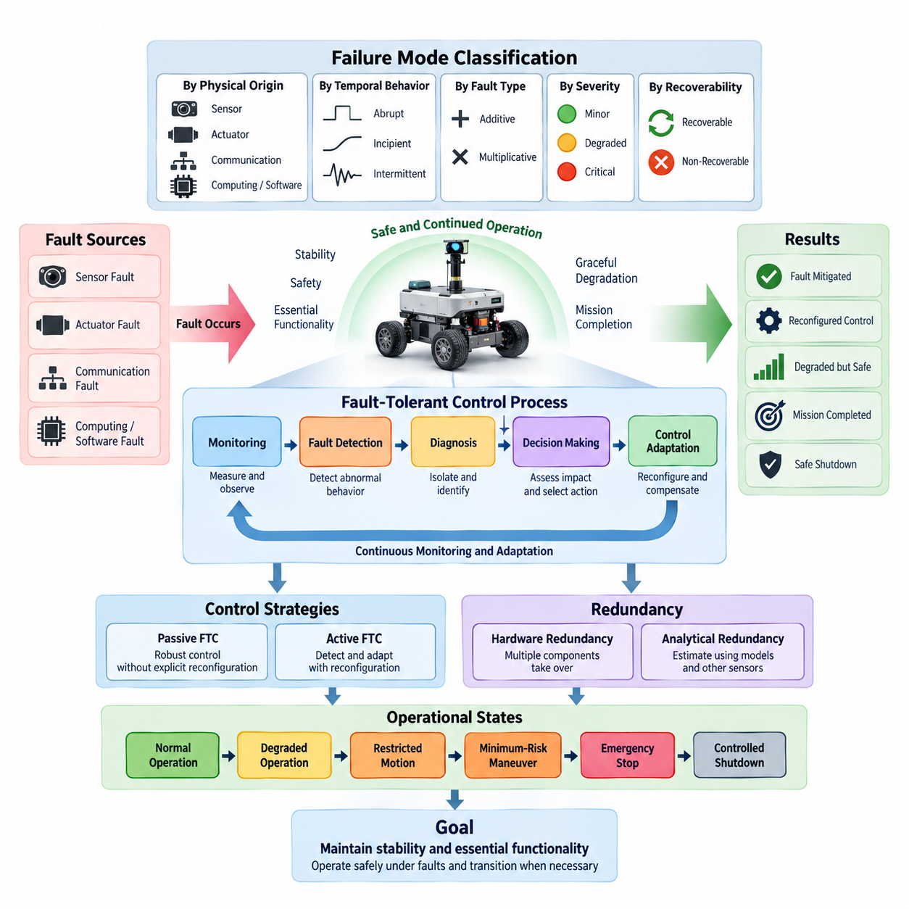
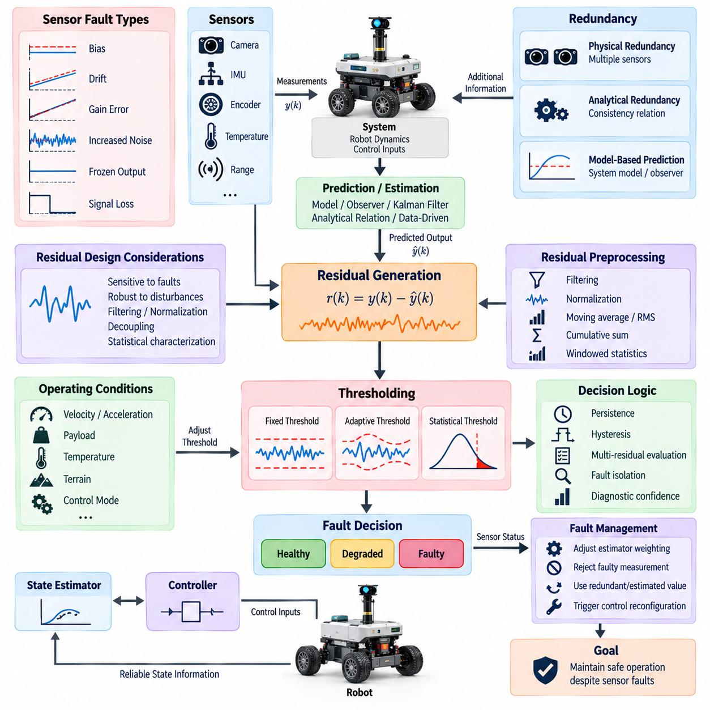
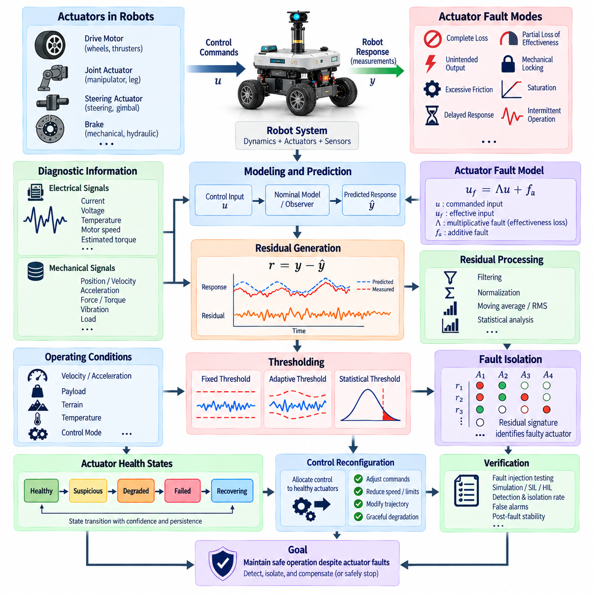
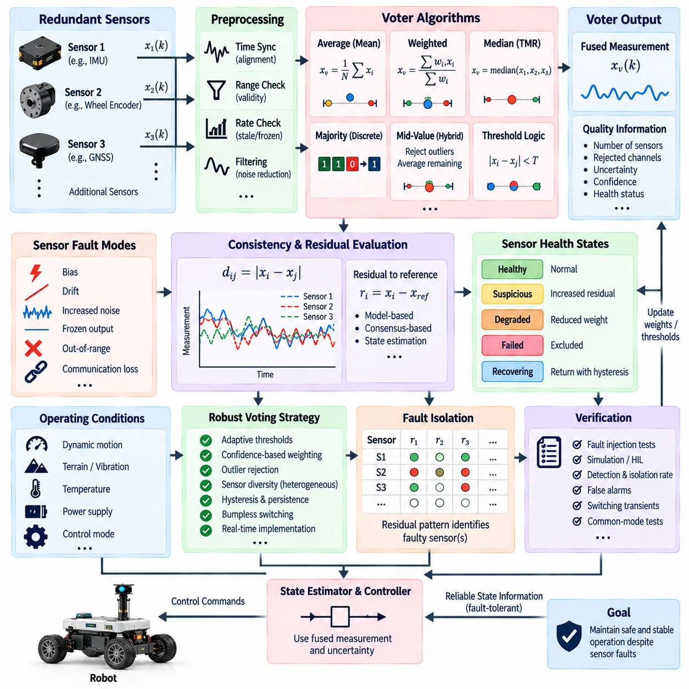
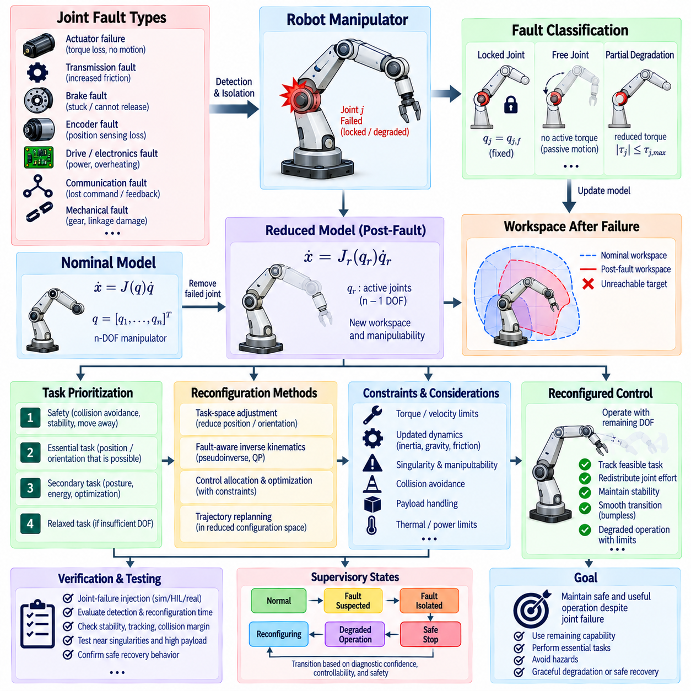
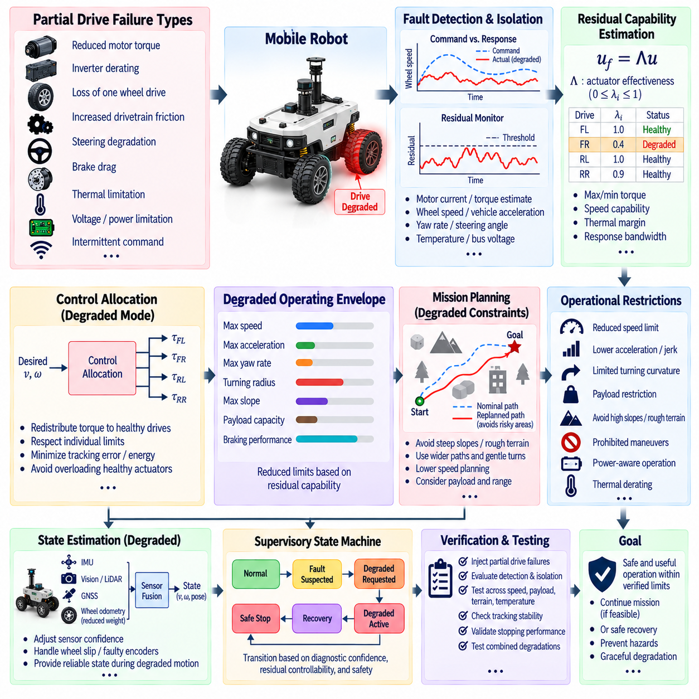
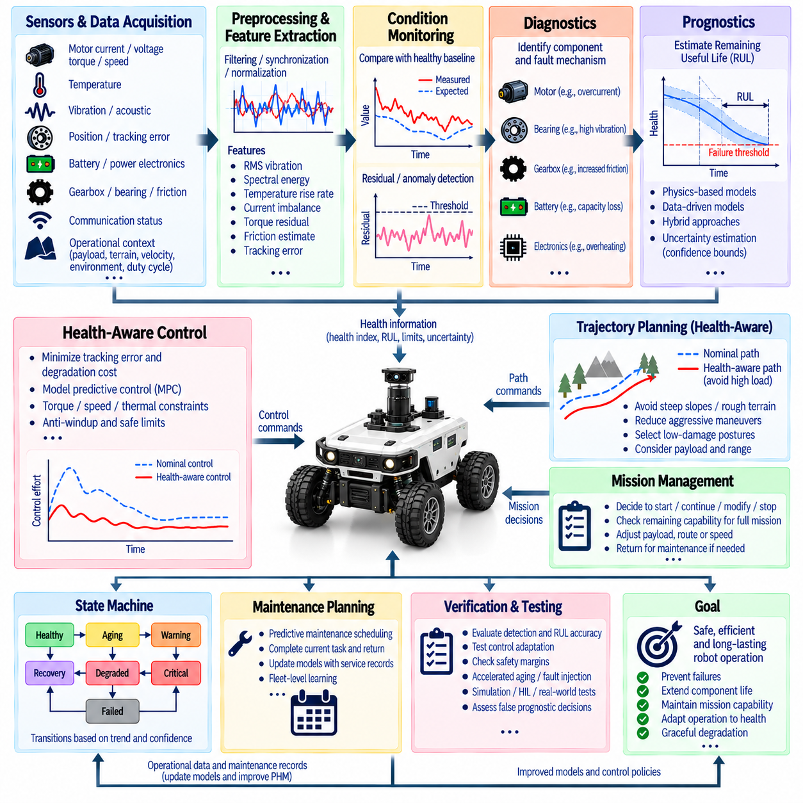
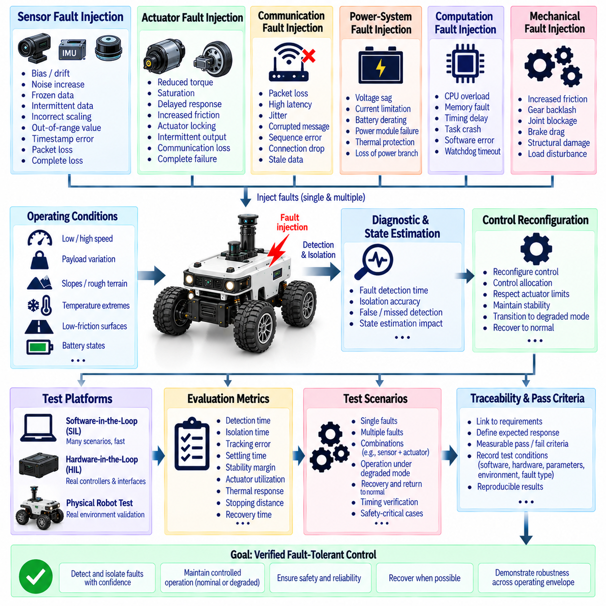
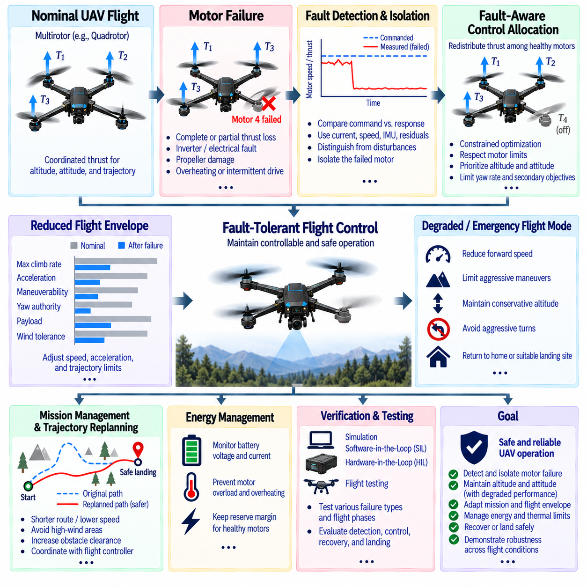
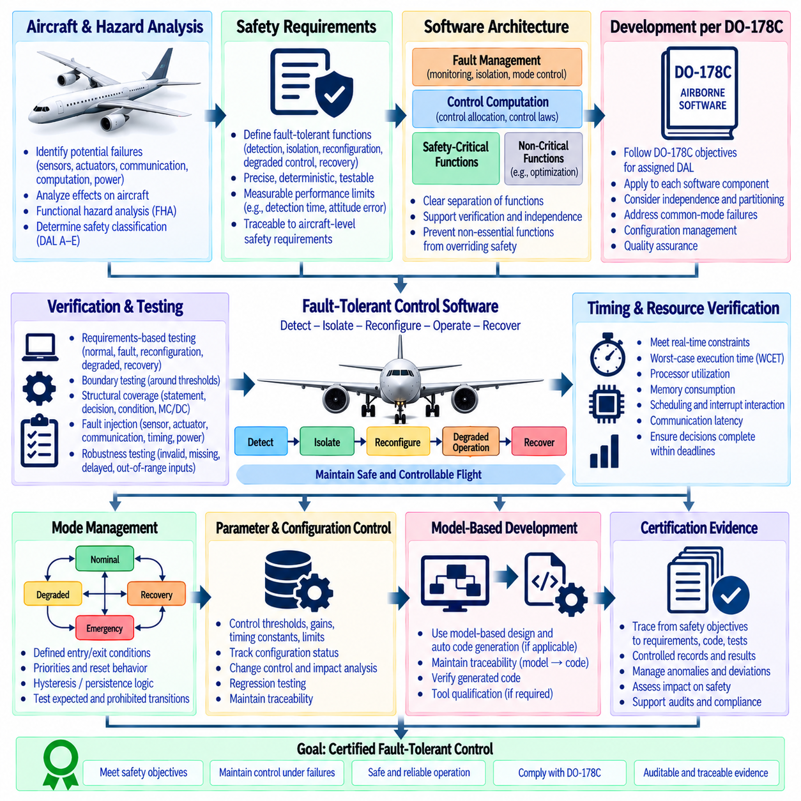

**Volume 04 Robot Control Software**

# 08. Fault Tolerant Control

## 08.01 Fault Tolerant Control Concepts: Failure Mode Classification

{width="7.268055555555556in" height="7.268055555555556in"}

Fault-tolerant control is a control-system design approach that allows a robot or autonomous machine to continue operating safely when components, sensors, actuators, communication links, or software functions experience faults. Unlike conventional control, which generally assumes that system components operate within predefined conditions, fault-tolerant control explicitly considers abnormal behavior and incorporates mechanisms that preserve stability, safety, and essential functionality.

A fault should be distinguished from a failure. A fault represents an abnormal condition or deviation within a component, signal, or function, while a failure occurs when the affected element can no longer perform its required function within specified limits. Fault-tolerant control therefore attempts to detect and manage faults before they propagate into system-level failures that could compromise motion stability, operational safety, or mission completion.

The basic fault-tolerant control process can be understood as a continuous loop connecting monitoring, fault detection, diagnosis, decision making, and control adaptation. Sensor measurements and internal controller information are monitored during operation, and observed behavior is compared with expected system behavior. When significant deviations occur, diagnostic mechanisms determine whether the deviation originates from normal uncertainty, environmental disturbance, or an actual system fault.

Fault detection identifies whether abnormal behavior exists, while fault isolation determines the location or component responsible for that behavior. Fault identification may additionally estimate properties such as fault magnitude, type, and temporal evolution. These functions are commonly grouped under fault detection and diagnosis, or FDD. Reliable FDD is important because incorrect diagnosis can cause unnecessary controller reconfiguration or conceal a developing safety-critical condition.

Faults can first be classified according to their physical origin. Sensor faults affect the information used by controllers to estimate system states and environmental conditions. Examples include encoder offsets, IMU bias drift, LiDAR degradation, corrupted force measurements, and complete sensor loss. Because feedback control depends directly on measurement quality, even a functioning actuator may generate inappropriate motion when the controller receives inaccurate sensor information.

Actuator faults directly affect the system\'s ability to generate commanded forces, torques, velocities, or positions. Typical cases include motor degradation, reduced torque capability, steering actuator malfunction, brake failure, joint locking, and unexpected actuator saturation. An actuator may remain partially functional rather than fail completely, making fault estimation particularly important when determining whether degraded operation can safely continue.

Communication faults occur when information exchanged among sensors, controllers, computing nodes, and actuators becomes unavailable, delayed, corrupted, duplicated, or temporally inconsistent. Network congestion, packet loss, connector damage, synchronization errors, and communication-interface failures can therefore influence closed-loop control. Distributed robots are especially sensitive because control functions may depend on several networked computing and sensing devices.

Computing and software faults form another important category in modern robotic systems. Processor overload, memory corruption, task deadline violations, numerical instability, software exceptions, incorrect state transitions, and failed control processes can disrupt system behavior even when mechanical hardware remains healthy. Watchdogs, process supervision, execution-time monitoring, redundant computation, and safe-state management are therefore closely connected with fault-tolerant control architecture.

Faults may also be classified according to their temporal behavior. Abrupt faults appear suddenly, such as a disconnected encoder, broken communication cable, or failed motor driver. Incipient faults develop gradually through wear, thermal degradation, calibration drift, contamination, or mechanical deterioration. Intermittent faults appear and disappear irregularly, making diagnosis difficult because the affected component may behave normally during portions of operation.

Another useful classification distinguishes additive and multiplicative faults. An additive fault introduces an unwanted value into a signal, such as a sensor bias or disturbance-like error. A multiplicative fault changes the effective relationship between input and output, such as reduced actuator effectiveness or altered sensor gain. Mathematical fault models based on these categories allow observers, estimators, and controllers to represent abnormal behavior systematically.

Fault severity can be classified according to its effect on available functionality. Minor faults may have negligible influence on mission execution, while degraded faults reduce performance without immediately violating safety constraints. Critical faults threaten system stability or safety and may require immediate reconfiguration or controlled shutdown. The classification threshold should reflect the robot\'s dynamics, operating environment, payload, and potential consequences of incorrect motion.

Faults can additionally be categorized as recoverable or non-recoverable. A recoverable fault can be compensated for through redundancy, estimation, controller adaptation, or subsystem restart. A non-recoverable fault removes capabilities that cannot be restored during operation. Fault-tolerant control must therefore determine not only what has failed but also what remaining control authority and sensing capability are available after the fault occurs.

Redundancy provides one of the fundamental mechanisms for tolerating faults. Hardware redundancy uses multiple sensors, actuators, processors, communication channels, or power sources so that another component can assume a required function. Analytical redundancy instead uses mathematical relationships, observers, physical models, or information from other sensors to estimate quantities that would otherwise depend on the faulty component.

Passive fault-tolerant control uses a controller designed to remain stable and sufficiently robust for a predefined range of faults without explicitly changing its control structure. This approach can provide rapid response because fault diagnosis and controller switching are not necessarily required. However, its tolerance is limited to faults considered during design, and maintaining robustness over a broad fault range may reduce nominal control performance.

Active fault-tolerant control explicitly detects or estimates faults and modifies control behavior according to the diagnosed condition. Reconfiguration may involve changing controller parameters, switching control laws, redistributing actuator commands, replacing faulty measurements with estimated values, modifying motion constraints, or transitioning to a degraded operating mode. Active approaches can handle broader fault scenarios but depend strongly on diagnostic accuracy and response time.

In redundant robotic systems, control allocation becomes important after an actuator fault. When several actuators can contribute to the same motion objective, the controller may redistribute force or torque commands among the remaining healthy actuators. A mobile robot with multiple independently driven wheels, for example, may preserve limited mobility after losing one drive unit if sufficient controllability and traction remain.

Sensor faults can similarly be addressed through information reconfiguration. If one sensor becomes unreliable, the state estimator may reduce its weighting, reject its measurements, or substitute information derived from other sensors and system models. This approach requires explicit consideration of observability because removing a sensor can make certain system states impossible to estimate accurately even when the remaining sensors themselves are healthy.

A central concept in fault-tolerant design is graceful degradation. The objective is not always to maintain full nominal performance after a fault. Instead, the controller may progressively reduce speed, acceleration, payload handling, workspace, autonomy level, or mission complexity while preserving safety-critical capabilities. Graceful degradation prevents the unrealistic assumption that every fault must be completely masked without affecting system performance.

Safety-oriented fault handling therefore requires defined operational states. A system may transition from normal operation to degraded operation, restricted motion, minimum-risk maneuver, emergency stop, or controlled shutdown depending on fault severity and available redundancy. These transitions should be coordinated with the motion controller so that a safety response does not itself introduce excessive acceleration, instability, collision risk, or uncontrolled mechanical loading.

Fault propagation must also be considered because a local defect can generate secondary abnormalities elsewhere in the system. A damaged wheel encoder may produce erroneous velocity estimates, which can cause incorrect motor commands, trajectory deviation, and eventually localization errors. Effective diagnosis therefore distinguishes the original fault from downstream symptoms and prevents multiple alarms from being incorrectly interpreted as independent failures.

Model-based fault diagnosis commonly uses residual signals representing differences between measured and predicted behavior. Observers, Kalman filters, parameter estimators, parity relations, and physical models can generate these residuals. Threshold logic then evaluates whether residual patterns are consistent with normal disturbances or specific faults. Robust threshold design is necessary because modeling uncertainty and sensor noise can otherwise create false alarms.

Data-driven diagnosis complements model-based methods when accurate analytical models are difficult to construct. Statistical learning, machine learning, neural networks, anomaly detection, and temporal pattern recognition can identify abnormal operating signatures from historical or simulated data. In safety-critical control, however, data-driven outputs should be integrated with physical constraints, confidence measures, validation procedures, and deterministic fallback behavior.

Fault-tolerant control must distinguish faults from disturbances and normal operating variability. Terrain irregularities, payload changes, wheel slip, external forces, temperature variation, and sensor noise may temporarily produce signals similar to component faults. Diagnosis therefore requires temporal consistency, multi-sensor correlation, model-based reasoning, and contextual information to reduce both false-positive fault declarations and dangerous missed detections.

The timing of fault response is as important as detection accuracy. A rapidly developing actuator or steering fault may require intervention within milliseconds, whereas gradual battery degradation can be managed over a much longer interval. Fault-tolerant architectures consequently use different monitoring rates and response mechanisms according to fault dynamics, control-loop frequency, system inertia, and the time available before safety margins are violated.

Designing fault-tolerant control also requires analysis of controllability and observability under fault conditions. A robot that is controllable and observable during normal operation may lose these properties after actuator or sensor removal. Engineers must therefore evaluate whether the remaining system can still regulate critical states, estimate necessary variables, and execute a safe maneuver for each fault configuration considered credible.

Failure-mode classification provides the systematic foundation for this analysis. Each relevant failure mode can be associated with its source, symptoms, severity, detectability, propagation path, remaining functionality, and required control response. Methods such as failure mode and effects analysis can support this process by connecting component-level faults with system-level consequences and helping define diagnostic coverage and mitigation requirements.

The resulting architecture should integrate fault management across sensing, estimation, planning, control, actuation, communication, and safety supervision rather than treating fault tolerance as an isolated controller feature. A diagnostic decision may alter state estimation, constrain trajectory generation, change actuator allocation, and trigger a safety state simultaneously. Clear interfaces between these functions are essential for deterministic and verifiable behavior.

Verification must evaluate both nominal performance and behavior during representative fault scenarios. Testing can include sensor disconnection, biased measurements, delayed communication, reduced actuator effectiveness, processor overload, and combinations of faults when relevant. Simulation, software-in-the-loop, hardware-in-the-loop, fault injection, and controlled physical testing provide progressively stronger evidence that the intended mitigation mechanisms operate correctly.

Ultimately, fault-tolerant control transforms failure management from an emergency reaction into an integrated control-system capability. By classifying failure modes, detecting abnormal behavior, determining remaining system capability, and adapting control objectives accordingly, robotic systems can maintain stability and essential functionality under degraded conditions while transitioning safely when continued operation is no longer technically justified.

## 08.02 Sensor Fault Detection: Residual Generation / Thresholding [w/Code]

{width="7.268055555555556in" height="7.268055555555556in"}

Sensor fault detection is a fundamental function of fault-tolerant control because feedback controllers depend on reliable measurements of position, velocity, acceleration, force, orientation, temperature, pressure, and environmental conditions. A faulty sensor can generate physically plausible but incorrect information, making detection more difficult than recognizing complete signal loss. The objective is therefore to identify abnormal measurement behavior before it significantly affects estimation or control.

A common sensor fault detection architecture compares measured sensor outputs with independently predicted or reconstructed values. The difference between these quantities is called a residual. Under normal operating conditions, the residual should remain close to an expected statistical or deterministic range. When a sensor develops a bias, drift, gain error, excessive noise, frozen output, or complete failure, the residual changes in a characteristic manner that can provide evidence of abnormal behavior.

For a measured output y(k) and predicted output ŷ(k), a basic residual can be represented as r(k) = y(k) − ŷ(k). Although this expression is simple, effective residual generation requires the prediction to represent normal system behavior accurately. The predicted value may be obtained from a physical model, state observer, Kalman filter, redundant sensor, analytical relationship, or data-driven estimator depending on the available system information.

Model-based residual generation uses mathematical knowledge of system dynamics to predict sensor measurements. A state-space model can estimate internal states from control inputs and available measurements, after which predicted sensor outputs are calculated. If the model represents normal behavior sufficiently well, discrepancies between predictions and measurements reveal possible faults. Model uncertainty must nevertheless be considered because imperfect dynamics can generate residuals even when every sensor is healthy.

Observers are widely used for residual generation because they reconstruct system states from measured inputs and outputs. A Luenberger observer, nonlinear observer, disturbance observer, or specialized fault detection observer may be designed so that estimation errors remain small during normal operation but become sensitive to particular sensor faults. Observer design can also reduce sensitivity to disturbances and modeling errors while preserving sensitivity to faults that must be detected.

Kalman-filter-based residual generation is especially useful when measurements contain stochastic noise. The filter predicts the system state and measurement distribution and then compares the actual measurement with its prediction. This difference, commonly called an innovation, behaves as a statistically characterized residual under valid modeling assumptions. Changes in innovation magnitude, mean, variance, or correlation can therefore indicate sensor degradation or unexpected measurement behavior.

Analytical redundancy provides another mechanism for generating residuals without installing physically duplicated sensors. Known relationships among system variables are used to test whether measurements remain mutually consistent. For example, wheel velocity, vehicle acceleration, motor speed, and estimated displacement may provide overlapping information about robot motion. A violation of these relationships can reveal a sensor fault even when no identical backup sensor is available.

Physical redundancy instead compares measurements from multiple sensors observing the same or closely related quantity. Dual encoders, redundant IMUs, multiple temperature sensors, or overlapping ranging sensors can provide direct consistency checks. Simple voting can detect an outlier when sufficient redundancy exists, while weighted fusion can account for different sensor accuracies. The major limitation is additional hardware cost, weight, power consumption, communication load, and common-mode failure risk.

Residual generation should ideally produce signals that are sensitive to faults but insensitive to normal disturbances. This requirement creates a fundamental design tradeoff. Increasing residual sensitivity can improve early detection but may also increase false alarms caused by noise, model mismatch, terrain changes, payload variation, or transient motion. Robust residual design therefore attempts to separate fault signatures from uncertainty through filtering, normalization, decoupling, and statistical characterization.

Residual preprocessing can substantially improve detection reliability. Raw residuals may be filtered to suppress high-frequency measurement noise, normalized according to expected variance, or transformed into energy and statistical indicators over a time window. Techniques such as moving averages, root-mean-square values, cumulative sums, and exponentially weighted statistics allow weak but persistent faults to become more visible than they would be in individual instantaneous samples.

Thresholding converts residual information into a fault decision. The simplest approach uses a fixed threshold, declaring a fault when \|r(k)\| exceeds a predetermined value. Fixed thresholds are computationally inexpensive and easy to verify, making them useful for embedded robotic controllers. However, a threshold that is sufficiently large to avoid false alarms during aggressive motion may become too insensitive to detect smaller faults during steady operation.

Adaptive thresholds address this limitation by changing detection boundaries according to operating conditions. Thresholds may depend on robot velocity, acceleration, payload, temperature, estimated noise variance, terrain condition, controller mode, or model uncertainty. During highly dynamic operation, a wider threshold may tolerate expected residual variation, while during stable operation a narrower threshold can improve sensitivity to small biases or gradual sensor degradation.

Statistical thresholding treats residuals as random variables characterized during healthy operation. If the expected residual distribution is known or estimated, confidence intervals can define acceptable regions. Normalized innovation squared, chi-square tests, likelihood ratios, and related statistical measures can determine whether observed residual behavior is sufficiently improbable under the healthy hypothesis to justify a fault indication. This provides a systematic relationship between sensitivity and false-alarm probability.

Single-sample threshold violations should not always trigger an immediate fault declaration. Short disturbances, communication jitter, electromagnetic interference, or abrupt robot motion can temporarily produce large residuals. Persistence logic requires the residual to remain abnormal for a specified duration or number of samples. Debouncing and hysteresis similarly prevent repeated transitions between healthy and faulty states when residual values fluctuate near the threshold boundary.

Different sensor fault modes create different residual signatures. A constant bias tends to shift the residual mean, while a slowly developing drift produces a progressive trend. Increased measurement noise raises residual variance, a frozen sensor can generate increasing disagreement as the physical state changes, and complete signal loss may produce invalid values or communication timeouts. Fault detection algorithms can exploit these characteristics rather than relying exclusively on residual magnitude.

Detecting incipient faults is particularly challenging because their initial residual magnitude may remain below conventional thresholds. Trend analysis, cumulative sum methods, sequential probability tests, parameter estimation, and temporal machine-learning models can accumulate evidence over time. The objective is to detect persistent degradation early enough for maintenance or control adaptation without interpreting ordinary long-term variations as faults.

Residual evaluation can also use multiple residual channels simultaneously. A residual vector may contain inconsistencies associated with several sensors, state variables, or physical relationships. The pattern of activated residuals forms a fault signature that supports fault isolation. If one encoder fault affects a specific subset of residuals while an IMU fault affects another subset, the diagnostic system can distinguish the likely source rather than merely reporting a generic sensor anomaly.

Fault isolation requires residuals with appropriate structural properties. Ideally, each residual responds strongly to selected faults while remaining insensitive to others. Structured residual sets, dedicated observers, parity-space methods, and directional residual analysis can create distinguishable signatures. In complex robotic systems, complete isolation may not always be possible, so the diagnostic system should represent uncertainty instead of forcing an unsupported classification.

Multi-sensor consistency checking is especially valuable for autonomous robots. Wheel odometry can be compared with visual odometry, LiDAR localization, GNSS velocity, and inertial measurements. A disagreement does not automatically identify which sensor is faulty, but consistency relationships provide evidence that can be combined over time. Context is essential because wheel slip, GNSS multipath, visual degradation, or LiDAR occlusion may temporarily alter sensor reliability without hardware failure.

Sensor fault detection should therefore interact closely with state estimation. Once a measurement is suspected of being unreliable, the estimator may reduce its weighting, increase its measurement covariance, reject it temporarily, or replace it with an analytical estimate. This transition should be gradual when appropriate because immediately removing a sensor after a weak diagnostic indication can destabilize estimation or reduce observability more severely than the original measurement fault.

Diagnostic confidence provides a useful interface between detection and control. Instead of generating only a binary healthy-or-faulty decision, the detection system can estimate fault probability, confidence, residual severity, or sensor health level. The controller and estimator can then select responses proportional to diagnostic certainty. Low confidence may initiate enhanced monitoring, while high-confidence critical faults may trigger sensor exclusion and immediate operational restrictions.

Threshold design must explicitly consider false positives and false negatives. A false positive incorrectly declares a healthy sensor faulty and can unnecessarily reduce system capability. A false negative allows corrupted measurements to continue influencing estimation and control. The acceptable balance depends on safety consequences, available redundancy, sensor criticality, robot dynamics, and whether the system can safely operate after removing the suspected sensor.

Fault detection latency is another important design parameter. Filtering and persistence logic improve robustness but delay detection. For a fast steering, joint-position, or stabilization loop, excessive delay may allow a sensor fault to destabilize the robot before mitigation begins. Conversely, extremely aggressive detection may react to harmless transients. Detection time must therefore be designed relative to system dynamics and the maximum tolerable duration of erroneous feedback.

Real-time implementation requires deterministic computational behavior. Residual generation and threshold evaluation often execute at the same rate as estimation or control loops, ranging from relatively slow environmental monitoring to high-frequency motor and inertial sensing. Algorithms should have bounded execution time, defined numerical behavior, timestamp consistency, and clear handling of missing or stale data so that the diagnostic function itself does not introduce control uncertainty.

Communication integrity is closely related to sensor fault detection in distributed architectures. A valid sensor may appear faulty if packets are delayed, reordered, duplicated, or lost. Timestamp checks, sequence counters, timeout monitoring, data-validity flags, and synchronization diagnostics help distinguish sensor hardware faults from communication faults. This distinction is important because replacing a healthy sensor measurement does not correct a network problem affecting the underlying data path.

Common-mode failures require additional consideration when redundant sensors share power supplies, mounting structures, clocks, communication buses, environmental exposure, or software drivers. Two sensors may agree with each other while both produce incorrect measurements. Independent physical principles, diverse sensing technologies, separate communication paths, and analytical consistency checks can reduce dependence on simple agreement between nominally redundant devices.

Sensor health management should maintain diagnostic state across time rather than treating every sample independently. A sensor may progress through states such as healthy, suspicious, degraded, failed, and recovering. State transitions can incorporate residual magnitude, persistence, confidence, communication status, and recovery evidence. Recovery should normally require stronger evidence than a single valid measurement to prevent unstable switching between faulty and healthy classifications.

Verification of sensor fault detection requires controlled fault injection across representative operating conditions. Bias, drift, gain changes, increased noise, frozen values, intermittent loss, delayed measurements, and complete disconnection can be introduced in simulation, software-in-the-loop, hardware-in-the-loop, or physical testing. Performance should be evaluated using detection rate, false-alarm rate, isolation accuracy, detection latency, and the resulting effect on state estimation and control.

The final objective is not merely to generate an alarm but to provide trustworthy information for fault-tolerant control. Residual generation converts sensor behavior into diagnostic evidence, while thresholding determines when that evidence is sufficiently significant to require action. When combined with robust estimation, temporal reasoning, redundancy, and appropriate control reconfiguration, sensor fault detection allows a robotic system to preserve reliable state information and maintain safe operation despite measurement degradation.

## 08.03 Actuator Fault Detection and Isolation [w/Code]

{width="7.268055555555556in" height="7.268055555555556in"}

Actuator fault detection and isolation is a critical function in robotic fault-tolerant control because actuators directly convert control commands into physical forces, torques, velocities, and motion. A failure in a motor, drive electronics, steering mechanism, brake, hydraulic element, or robotic joint can immediately reduce control authority. The diagnostic system must therefore detect abnormal actuation rapidly and determine which actuator or subsystem is responsible.

Unlike many sensor faults, actuator faults influence both internal measurements and the physical response of the robot. A controller may command a specific torque or velocity while the actuator produces a smaller, delayed, saturated, or completely different response. Detection therefore requires comparison between commanded behavior and observed system dynamics rather than relying only on electrical status signals from the actuator hardware.

Common actuator fault modes include complete loss of actuation, partial loss of effectiveness, unintended output, mechanical locking, excessive friction, saturation, delayed response, and intermittent operation. Electric drives can additionally experience winding faults, inverter faults, encoder-related commutation problems, thermal derating, or power-supply limitations. Each mode produces different consequences for controllability and requires different diagnostic evidence.

A useful mathematical representation models actuator effectiveness through the relationship u_f = Λu + f_a, where u is the commanded actuator input, u_f is the effective input applied to the plant, Λ represents multiplicative effectiveness loss, and f_a represents an additive actuator fault. A healthy actuator has effectiveness close to its nominal value, while reduced coefficients indicate partial degradation and values approaching zero represent severe loss of authority.

Residual generation provides the basic mechanism for identifying discrepancies caused by actuator faults. The expected robot response is calculated using control commands and a nominal dynamic model, while the actual response is obtained from sensors. Differences in acceleration, velocity, position, force, current, or torque can then form residual signals. Persistent residuals inconsistent with expected disturbances provide evidence that commanded actuation is not being correctly realized.

Model-based observers are particularly useful because actuator faults enter system dynamics through control inputs. An observer predicts state evolution from commanded inputs and measured outputs. If an actuator loses effectiveness, the measured motion begins to diverge from the predicted trajectory. Observer residuals can therefore reveal the presence of abnormal actuation even when the actuator controller itself continues reporting apparently valid command execution.

Unknown input observers and disturbance observers can improve discrimination between actuator faults and external disturbances. A mobile robot encountering a slope, collision force, or increased rolling resistance may exhibit motion similar to reduced motor torque. Diagnostic observers can be structured to reject or estimate selected disturbances while retaining sensitivity to actuator abnormalities, reducing the probability that environmental effects are incorrectly classified as hardware faults.

Electrical measurements provide another important diagnostic channel for motor-driven systems. Commanded torque, motor current, phase current, bus voltage, rotor speed, temperature, and estimated torque can be compared for physical consistency. High current combined with unexpectedly low acceleration may indicate mechanical resistance or drivetrain damage, whereas low current despite a large torque command may suggest inverter, power-stage, communication, or motor-control failure.

Mechanical information complements electrical diagnostics. Joint position, wheel velocity, shaft acceleration, load-cell measurements, force-torque sensors, vibration, and temperature can reveal actuator degradation that electrical measurements alone cannot isolate. Combining electrical and mechanical residuals allows the diagnostic system to distinguish whether abnormal behavior originates in the motor, transmission, brake, bearing, wheel-ground interface, or external load.

Fault isolation determines which actuator has produced the detected abnormal behavior. In multi-actuator robots, one fault may influence several measured states, causing residuals throughout the system. Structured residuals can be designed so that different actuator faults produce distinct activation patterns. A residual signature matrix then maps combinations of residual responses to candidate faulty actuators or failure modes.

Dedicated observers provide another isolation method. Each observer can be configured to be insensitive to one actuator fault while remaining sensitive to others, or alternatively to monitor a specific actuator independently. Comparing observer residuals enables the diagnostic system to identify the fault location. This approach is particularly useful when a robot has repeated actuator structures such as multiple wheels, legs, joints, thrusters, or distributed drive modules.

Parameter estimation can detect gradual actuator degradation by estimating quantities such as motor torque constant, friction coefficient, transmission efficiency, actuator gain, or time delay. Changes from nominal parameter ranges provide evidence of wear or performance loss before complete failure occurs. Such estimates can support predictive maintenance while simultaneously providing the controller with updated information about remaining actuator capability.

Partial loss of effectiveness is especially important because an actuator may continue responding while delivering only a fraction of the requested output. This condition can remain hidden when motion demand is low but become critical during acceleration, braking, climbing, or disturbance rejection. Fault detection should therefore evaluate actuator capability over relevant operating envelopes rather than assuming that successful low-load motion demonstrates full health.

Actuator saturation must be distinguished from hardware failure. A healthy actuator operating at voltage, current, torque, velocity, or thermal limits cannot follow commands beyond its physical capability. If the controller does not account for these limits, saturation can generate residuals similar to actuator degradation. Diagnostic logic should therefore incorporate commanded limits, available supply voltage, temperature-dependent derating, and operating constraints when interpreting residuals.

Mechanical locking represents a particularly hazardous failure mode in mobile and articulated robots. A locked wheel or joint can generate large reaction forces and alter the system\'s kinematic constraints. Continued command application may increase current, temperature, structural load, or instability. Detection should combine motion inconsistency with current, torque, or force evidence so that the controller can rapidly stop commanding the affected actuator and reconfigure motion.

Intermittent actuator faults are difficult to diagnose because normal behavior may return before conventional persistence thresholds are satisfied. Loose connectors, thermal protection, damaged wiring, communication interruptions, or unstable power electronics can create short recurring failures. Event counters, temporal pattern analysis, health-state memory, and fault recurrence statistics allow the diagnostic system to accumulate evidence across separated abnormal events.

Fault detection thresholds should account for operating conditions. Expected residual magnitudes vary with acceleration, payload, terrain, contact forces, battery voltage, temperature, and robot configuration. Adaptive thresholds can increase tolerance during highly dynamic operation and become more sensitive during stable conditions. This reduces false alarms while preserving the ability to identify small but persistent actuator performance losses.

Multi-actuator consistency provides useful analytical redundancy. In a differential-drive robot, left and right wheel velocities should correspond to commanded vehicle motion and measured yaw rate. In a manipulator, joint torques and accelerations should remain consistent with rigid-body dynamics. In a legged robot, contact forces, joint motion, and body acceleration provide overlapping information that can expose abnormal actuator behavior without identical backup actuators.

Fault isolation must consider coupling between actuators. A malfunctioning joint can change loads on neighboring joints, while one damaged wheel can cause other motors to increase torque to maintain trajectory tracking. These secondary responses should not be mistaken for additional independent faults. Dynamic models and causal reasoning help identify the originating actuator by examining the sequence and physical consistency of residual changes.

Diagnostic confidence is important when fault signatures are ambiguous. Rather than immediately assigning a single failure mode, the system can maintain candidate faults with confidence values based on residual magnitude, temporal persistence, operating context, and cross-sensor consistency. Low-confidence anomalies may trigger enhanced monitoring, while high-confidence faults can initiate actuator exclusion, control reallocation, speed reduction, or a safe-stop procedure.

Once an actuator fault is isolated, the controller must determine the remaining control authority. A redundant robot may continue operating by redistributing commands among healthy actuators. Control allocation can solve for a new set of actuator commands that achieves the required generalized forces while respecting reduced capabilities, saturation limits, thermal constraints, and mechanical restrictions. The achievable motion envelope may become smaller after reconfiguration.

For a mobile robot, loss of one drive or steering actuator may require reduced speed, modified curvature limits, or a restricted route. For a manipulator, a failed joint may reduce reachable workspace or eliminate certain orientations. A legged robot may modify gait and contact strategy. Fault isolation therefore should provide not only the identity of the failed actuator but also an estimate of residual capability useful for motion planning and control.

If sufficient redundancy does not remain, graceful degradation becomes necessary. The system may abandon the original mission and transition toward a minimum-risk condition. Depending on the robot, this may involve stopping on a stable surface, lowering a payload, locking mechanical brakes, reducing joint torque, moving away from people, or entering a controlled shutdown state. Fault diagnosis and safety-state management must therefore operate as coordinated functions.

Actuator health states can be represented as healthy, suspicious, degraded, failed, and recovering. State transitions should combine residual evidence, electrical and mechanical measurements, persistence logic, and self-test information. Recovery from a fault should require sustained evidence of normal behavior because prematurely restoring an unreliable actuator to active control can cause repeated reconfiguration and destabilize the overall system.

Real-time requirements depend strongly on actuator dynamics. High-bandwidth joint, steering, or stabilization actuators may require fault detection within only a few control cycles, while thermal degradation can be evaluated over seconds or minutes. Diagnostic algorithms must therefore be partitioned by criticality and time scale, ensuring that rapidly dangerous failures receive deterministic low-latency responses without sacrificing slower health-monitoring functions.

Verification should include systematic actuator fault injection across the intended operating envelope. Tests can reproduce reduced torque effectiveness, delayed response, stuck actuators, unexpected saturation, intermittent command loss, increased friction, electrical faults, and communication failures. Simulation, software-in-the-loop, hardware-in-the-loop, dynamometer testing, and controlled robot experiments can measure detection latency, isolation accuracy, false alarms, and post-fault stability.

Combined faults should also be considered when their probability or consequence justifies analysis. A single-actuator diagnostic architecture may produce misleading conclusions when multiple actuators degrade simultaneously or when an actuator fault occurs together with a sensor or communication fault. Multiple-hypothesis reasoning, redundancy analysis, and system-level safety supervision can help prevent unsupported isolation decisions under these complex conditions.

Ultimately, actuator fault detection and isolation connects low-level component health with system-level motion safety. By comparing commanded and realized behavior, generating robust residuals, identifying fault signatures, estimating remaining actuator effectiveness, and communicating diagnostic confidence to the controller, the system can respond proportionally to degradation. This enables reconfiguration when control authority remains and a safe transition when continued operation can no longer be guaranteed.

## 08.04 Redundant Sensor Voter Algorithm [w/Code]

{width="7.268055555555556in" height="7.268055555555556in"}

Redundant sensor voter algorithms provide fault tolerance by combining measurements from multiple sensors that observe the same or closely related physical quantity. Instead of allowing a single sensor to determine the feedback signal, the voter evaluates consistency among redundant measurements and selects or synthesizes a trusted output. This architecture is widely applicable to position, velocity, attitude, force, temperature, range, and other safety-relevant measurements.

The fundamental assumption is that independent sensor faults are less likely to affect all redundant channels simultaneously. If three sensors measure the same variable and one produces an abnormal value, the two mutually consistent measurements can provide evidence about the correct state. This principle enables the system to detect an outlier and continue operating without immediately losing the measured quantity, provided that sufficient healthy redundancy remains.

Triple modular redundancy, or TMR, is a classical voting structure using three independent measurement channels. For scalar measurements x1, x2, and x3, a median voter can produce x_v = median(x1, x2, x3). When one sensor deviates substantially while the other two remain consistent, the median naturally rejects the extreme value. This method is computationally simple and does not require explicit identification of the faulty channel before producing a usable output.

Majority voting is suitable when sensor outputs are discrete states rather than continuous measurements. If redundant channels report values such as active/inactive, locked/unlocked, or valid/invalid, the state reported by the majority can be selected. Majority voting is easy to verify, but its reliability depends on independence assumptions and the number of simultaneous faults that the redundant architecture is designed to tolerate.

Continuous-valued sensors require additional consistency logic because their outputs rarely match exactly. Pairwise differences such as d12 = \|x1 − x2\|, d13 = \|x1 − x3\|, and d23 = \|x2 − x3\| can be compared with predefined tolerances. If two measurements remain mutually consistent while the third differs significantly, the inconsistent channel can be marked as suspicious and excluded or assigned reduced confidence.

A simple average voter computes the mean of available sensor measurements and can reduce independent zero-mean noise when all sensors are healthy. However, ordinary averaging is vulnerable to large biases or extreme outliers because one faulty measurement can significantly distort the fused result. Average voting is therefore most appropriate when fault detection has already validated the channels or when additional robust weighting limits the influence of abnormal measurements.

Weighted voting improves fusion by assigning each sensor a weight according to accuracy, uncertainty, health, or operating condition. A fused value can be expressed as x_v = Σw_i x_i / Σw_i. High-confidence sensors receive greater influence, while degraded channels receive smaller weights. Weights may be fixed from calibration data or dynamically updated using residual statistics, estimated covariance, environmental conditions, and diagnostic health indicators.

Median voting is more robust to isolated outliers than simple averaging. With an odd number of redundant scalar measurements, sorting the measurements and selecting the middle value prevents one extreme sensor from dominating the result. The method is particularly attractive for embedded systems because it is deterministic and inexpensive. However, it does not fully exploit differences in sensor precision and becomes less effective when multiple channels fail coherently.

Mid-value selection can also be extended with averaging. A voter may first reject measurements outside an acceptable consistency region and then average the remaining healthy channels. This combines the robustness of outlier rejection with the noise-reduction advantage of averaging. Such hybrid voting is useful when sensors have similar characteristics but occasional biases, spikes, communication corruption, or intermittent failures must be tolerated.

Threshold selection is central to voter performance. If the allowable disagreement threshold is too narrow, normal measurement noise and calibration differences can cause healthy sensors to be rejected. If it is too wide, significant sensor faults may remain undetected. Thresholds should therefore reflect measurement accuracy, expected noise, dynamic response, synchronization error, environmental sensitivity, and the consequences of accepting an incorrect measurement.

Adaptive voting thresholds can improve performance across changing operating conditions. Sensor disagreement may naturally increase during rapid acceleration, vibration, high angular velocity, temperature transitions, or difficult environmental conditions. A voter can modify its tolerance using operating state, estimated covariance, signal quality, or dynamic model uncertainty. This allows high sensitivity during stable operation without excessive false rejection during demanding maneuvers.

Time synchronization is essential when comparing redundant sensor measurements. Two healthy sensors sampled at different times can appear inconsistent when the measured state changes rapidly. Hardware triggering, synchronized clocks, timestamp alignment, interpolation, or prediction to a common reference time can reduce this problem. Voting logic should distinguish true measurement disagreement from errors caused by latency, jitter, or asynchronous data acquisition.

Sensor diversity can improve protection against common-mode failures. Redundancy based on identical sensors provides straightforward comparison but may expose all channels to the same design defect, environmental limitation, or software error. Diverse redundancy combines different sensing principles, such as wheel odometry, IMU, vision, LiDAR, and GNSS, so that a single physical phenomenon is less likely to corrupt every measurement source in the same manner.

Voting among heterogeneous sensors requires transformation into a common representation. Sensors may measure different quantities, coordinate frames, bandwidths, or noise characteristics. State estimation and physical models can convert these measurements into comparable predictions, such as velocity, orientation, or position. The voter then evaluates consistency at the state or residual level rather than directly comparing incompatible raw sensor outputs.

Residual-based voting integrates naturally with fault detection. For each sensor, a residual can be calculated against a reference estimate, dynamic model, or consensus measurement. Sensors with small residuals receive high confidence, while channels with persistent large residuals are downgraded. This approach allows the voter to combine redundancy with model-based reasoning rather than relying only on agreement between sensors.

A critical challenge occurs when two sensors disagree and no third independent reference exists. With only dual redundancy, disagreement identifies inconsistency but cannot determine which sensor is correct without additional information. A model prediction, another sensing modality, physical constraint, or historical health information is required for isolation. Triple or higher redundancy therefore provides stronger voting capability but increases cost and system complexity.

Voter algorithms should maintain sensor health states over time. A channel may transition through healthy, suspicious, degraded, failed, and recovering states according to consistency tests and diagnostic evidence. Persistence logic prevents a single transient disagreement from immediately removing a sensor. Likewise, recovery should require sustained agreement before a previously faulty channel is allowed to regain significant influence over the fused measurement.

Hysteresis is useful for preventing unstable switching near decision thresholds. A sensor may require a relatively strong inconsistency to transition from healthy to degraded, while a stricter period of sustained consistency may be required for recovery. Separate entry and exit criteria prevent measurement noise from repeatedly enabling and disabling a channel, which could otherwise introduce discontinuities into state estimation and feedback control.

Confidence-based voting provides a continuous alternative to hard inclusion or exclusion. Each sensor is assigned a confidence value between low and high reliability, and the fused output changes gradually as confidence evolves. This is useful for sensors whose performance deteriorates progressively rather than failing abruptly. Confidence can incorporate residual magnitude, noise variance, signal quality, temperature, communication health, and environmental suitability.

The voter should also detect frozen or stale measurements. A sensor that repeatedly transmits the same numerically valid value may pass simple range checks while no longer representing the changing physical state. Timestamp monitoring, rate-of-change checks, sequence counters, and comparison with predicted dynamics help identify stale data. This is especially important in networked robots where communication failures may preserve the last valid measurement.

Out-of-range and plausibility checks provide an initial diagnostic layer before voting. Measurements violating physical limits, impossible rates of change, invalid status flags, or known sensor constraints can be rejected immediately. These checks reduce the probability that obviously corrupted data influences consensus calculations. More subtle faults that remain physically plausible must then be detected through redundancy, temporal consistency, or model-based residuals.

Voting algorithms must consider correlated errors. Redundant sensors mounted on the same structure may experience identical vibration, thermal gradients, electromagnetic interference, or mechanical deformation. Their measurements can agree closely even while all are biased. Common power supplies, clocks, buses, calibration procedures, and software drivers create additional shared dependencies. Agreement alone should therefore not be interpreted as absolute evidence of correctness.

The fused voter output should include quality information in addition to the measurement value. Useful metadata can include the number of participating sensors, rejected channels, estimated uncertainty, confidence level, diagnostic state, and degradation flags. Downstream state estimators and controllers can use this information to modify covariance, reduce motion limits, or trigger additional safety actions when redundancy has been reduced.

Loss of redundancy is itself a significant system event. A three-sensor architecture may continue producing a valid output after one channel fails, but it no longer possesses the same ability to tolerate another fault. The system should therefore distinguish between measurement availability and redundancy availability. Continued operation may be permitted while speed, mission duration, environmental exposure, or other operational limits are reduced.

Voter design must avoid abrupt output discontinuities during sensor switching. Selecting a new channel with a different calibration offset can introduce a step into the feedback signal and cause undesirable control action. Bumpless transfer techniques, blending, offset compensation, filtering, or estimator-based transitions can provide continuity when sensors are excluded or restored. The transition dynamics should remain compatible with the control-loop bandwidth.

Real-time implementation should be deterministic and computationally bounded. Voting may execute at high rates for IMUs, encoders, joint sensors, or flight-control measurements. The algorithm must handle missing packets, invalid timestamps, delayed channels, numerical exceptions, and changing sensor membership without blocking the control loop. Defined execution order and bounded memory use are particularly important for safety-critical embedded implementations.

Verification should include nominal operation as well as systematic sensor fault injection. Tests can introduce biases, drift, noise increases, frozen outputs, spikes, timing offsets, packet loss, gain changes, and simultaneous faults. Evaluation should measure false rejection, missed detection, isolation accuracy, voter output error, switching transients, recovery behavior, and the ability to preserve stable closed-loop control after redundancy is reduced.

Common-mode scenarios should be tested separately because conventional single-fault voting may not expose them. Examples include multiple sensors sharing an incorrect calibration, simultaneous communication corruption, environmental interference affecting identical devices, or a common software conversion error. Diverse references and analytical checks should demonstrate that the architecture does not rely exclusively on majority agreement when the majority itself may be wrong.

The redundant sensor voter ultimately acts as a trusted interface between raw sensing and state estimation or control. By evaluating agreement, uncertainty, health, timing, and physical plausibility, it transforms multiple potentially imperfect measurements into a more dependable representation of system state. Effective voting does not merely choose the majority; it manages sensor confidence and redundancy so that safe operation can continue while sufficient trustworthy information remains.

## 08.05 Manipulator Reconfiguration on Joint Failure [w/Code]

{width="7.268055555555556in" height="7.268055555555556in"}

Manipulator reconfiguration on joint failure is a fault-tolerant control strategy that allows a robotic arm to preserve safe and useful motion after one or more joints lose normal functionality. Because each joint contributes to the manipulator's position, orientation, force capability, and reachable workspace, a failure can change the robot's kinematic and dynamic properties immediately. Reconfiguration adapts control objectives to the capabilities that remain.

Joint failures can occur in actuators, transmissions, brakes, encoders, motor drives, power electronics, communication interfaces, or mechanical structures. Their effects range from reduced torque and increased friction to uncontrolled motion, position-sensing loss, or complete locking. Effective reconfiguration therefore begins with fault detection and isolation that determines not only which joint is affected but also the physical behavior imposed by the failure.

A joint failure is commonly classified according to the remaining degree of control authority. A free-swinging joint may lose active torque while retaining passive motion, whereas a locked joint becomes fixed at a particular angle. A partially degraded joint may still generate limited torque or velocity. These cases produce different post-fault kinematics, so the controller must represent the failed joint condition explicitly rather than simply disabling its command.

For an n-degree-of-freedom manipulator, the nominal joint vector q contains all active coordinates. If joint j becomes locked at q_j = q_j,f, that coordinate becomes a fixed parameter and the effective number of controllable degrees of freedom decreases. The forward kinematic model must then be recalculated using the remaining active joints. This produces a reduced configuration space and a new mapping between joint motion and end-effector motion.

The manipulator Jacobian is central to post-fault reconfiguration. Under normal operation, end-effector velocity can be represented by ẋ = J(q)q̇. When a joint becomes unavailable, the corresponding Jacobian column can no longer contribute freely to commanded motion. A reduced Jacobian J_r is formed from the healthy controllable joints, and feasible Cartesian velocity commands must lie within the range space of this reduced mapping.

Loss of a joint does not always imply complete loss of the task. A redundant manipulator may have more joints than required for a particular end-effector objective. For example, a seven-degree-of-freedom arm performing a six-dimensional pose task may retain substantial capability after one joint is immobilized, depending on configuration. Reconfiguration exploits this kinematic redundancy to preserve the highest-priority task whenever sufficient independent motion directions remain.

The reachable workspace changes after joint failure and should be evaluated explicitly. Some Cartesian positions may remain reachable while particular orientations become impossible, and other regions may disappear entirely from the feasible workspace. A post-fault controller should avoid commanding unreachable targets because persistent attempts to achieve infeasible poses can cause saturation, excessive internal forces, unstable optimization, or unnecessary stress on healthy joints.

Task prioritization becomes essential when full motion capability cannot be maintained. Safety-critical objectives such as collision avoidance, payload stabilization, maintaining support, or moving away from a person should receive higher priority than exact trajectory tracking. Lower-priority objectives such as preferred posture, energy optimization, or precise orientation can be relaxed when the remaining degrees of freedom are insufficient to satisfy every requirement simultaneously.

Task-space reconfiguration can modify the commanded end-effector objective according to the available mobility. If full six-dimensional position and orientation control is no longer possible, the controller may preserve three-dimensional position while relaxing one or more orientation axes. Alternatively, maintaining tool orientation may be more important than exact position for some processes. The selected reduced task should reflect mission requirements and safety consequences.

Inverse kinematics must be reformulated after a joint failure. A conventional inverse solution that assumes all joints are controllable may repeatedly command the failed coordinate or generate infeasible joint velocities. Fault-aware inverse kinematics removes or constrains the affected joint and solves for the remaining variables. Pseudoinverse, damped least-squares, constrained optimization, or quadratic programming methods can calculate feasible post-fault motion.

Near singular configurations, joint loss can dramatically reduce manipulability. Even if the remaining degrees of freedom appear sufficient numerically, the reduced Jacobian may become poorly conditioned and require very large joint velocities to produce small Cartesian motions. Singularity measures, condition numbers, and manipulability indices should therefore be reevaluated after failure and incorporated into trajectory modification and motion constraints.

Null-space control changes significantly when redundancy is reduced. During nominal operation, redundant joint motion can be used for obstacle avoidance, joint-limit avoidance, posture optimization, or energy reduction without disturbing the primary end-effector task. After a joint failure, the available null space may shrink or disappear. Secondary objectives must therefore be reprioritized so that they do not consume motion authority needed for essential tasks.

Dynamic reconfiguration must consider more than kinematics. Removing or locking a joint changes the manipulator's effective inertia, Coriolis and centrifugal terms, gravity compensation, friction behavior, and actuator loading. A controller that continues using the nominal dynamic model may generate inaccurate torque commands. The post-fault model should therefore incorporate the failed joint constraint and updated dynamics whenever model-based torque control is used.

A locked joint can transmit substantial reaction torque through neighboring links. Healthy actuators may consequently experience higher loads than during nominal operation, particularly when carrying a payload. Reconfiguration must verify that redistributed joint torques remain within continuous and peak limits. Thermal constraints, gearbox ratings, brake capacity, structural loads, and power availability should be considered before allowing continued operation.

Partial actuator degradation requires a different strategy from complete joint removal. If a joint retains limited torque, it may remain useful within a constrained operating region. The controller can represent its available torque as \|τ_j\| ≤ τ_j,max,fault and distribute motion or force demands accordingly. This preserves more capability than complete exclusion while preventing the degraded actuator from being commanded beyond its verified residual capacity.

Control allocation and optimization provide a systematic way to redistribute demands among healthy joints. A constrained optimizer can minimize tracking error, joint effort, or energy while respecting torque limits, velocity limits, joint ranges, collision constraints, and the failed joint condition. Priority-weighted objectives allow essential end-effector behavior to dominate while less important performance goals are progressively relaxed as available control authority decreases.

Trajectory replanning is often required because the original path may pass through configurations that are no longer feasible after failure. A fault-aware planner can search for a new path within the reduced configuration space while avoiding obstacles, singularities, joint limits, and excessive actuator loads. Replanning may target the original destination, an intermediate recovery pose, a payload release location, or a predefined minimum-risk configuration.

Collision avoidance becomes more challenging because joint failure changes both reachable motion and the geometry of possible escape paths. A locked joint may prevent the manipulator from retracting along its normal trajectory. The planner should evaluate self-collision, environmental collision, and human proximity using the post-fault kinematic model. Conservative safety margins may be appropriate because motion capability and prediction accuracy have been reduced.

Payload handling requires special attention during reconfiguration. If the manipulator is carrying an object when a joint fails, gravity and inertial loads can make some recovery motions unsafe. The system should determine whether the remaining joints can support the payload statically and dynamically. Depending on capability, the safest response may be to maintain position, lower the payload, transfer it to a support surface, or activate a mechanical holding mechanism.

Joint brakes can provide valuable fault-containment capability. When an actuator loses torque generation but the joint remains mechanically controllable, engaging a brake can transform an uncontrolled or free-moving joint into a known locked constraint. The manipulator can then reconfigure around the fixed joint. Brake engagement must be coordinated carefully to avoid impact loads or sudden configuration changes during motion.

Sensor failure at a joint should be distinguished from actuator failure because the mechanical degree of freedom may remain controllable. Redundant encoders, motor-side sensing, observers, or kinematic estimation may reconstruct joint position or velocity sufficiently for degraded operation. If trustworthy state estimation cannot be maintained, however, the joint may need to be immobilized or excluded even though its actuator hardware remains functional.

Communication failure can similarly create an apparent joint failure. A distributed servo may stop receiving commands or transmitting feedback while its mechanical hardware remains healthy. Timeout monitoring, sequence counters, network diagnostics, and local drive status help distinguish communication loss from actuator or sensor faults. Local safe behavior at the joint controller can prevent uncontrolled motion while higher-level reconfiguration is performed.

The transition from nominal control to fault-reconfigured control must be smooth. Abruptly changing the active joint set, dynamic model, or task objective can introduce discontinuities in velocity and torque commands. Bumpless transfer, command blending, state initialization, acceleration limiting, and temporary damping can reduce transients. The transition should preserve stability even when diagnosis occurs during high-speed or loaded motion.

A useful supervisory architecture can represent operation through states such as normal, fault suspected, fault isolated, reconfiguring, degraded operation, and safe stop. Transitions depend on diagnostic confidence, remaining controllability, payload state, collision risk, and actuator margins. Separating supervisory decisions from low-level servo loops allows safety policy to coordinate trajectory planning, inverse kinematics, dynamics, and joint controllers consistently.

Reconfiguration feasibility should be evaluated before continued operation is authorized. The system must determine whether the remaining joints provide sufficient rank, workspace, torque capability, sensing, and braking authority for the intended degraded task. A successful numerical inverse-kinematics solution alone is not sufficient. Dynamic loads, uncertainty, collision margins, and the ability to reach a safe state after another disturbance must also be considered.

Graceful degradation provides an appropriate strategy when full task recovery is impossible. The manipulator may reduce speed and acceleration, restrict workspace, simplify orientation requirements, lower payload limits, disable high-force operations, or execute only predefined recovery motions. These restrictions preserve useful functionality without assuming that a mechanically degraded arm retains the same operational envelope as a healthy system.

Verification requires systematic joint-failure injection across representative manipulator configurations. Tests should include locked joints, free joints, reduced torque, increased friction, encoder loss, delayed servo response, communication interruption, and brake activation. Simulation, software-in-the-loop, hardware-in-the-loop, and controlled physical experiments can evaluate detection latency, reconfiguration time, trajectory feasibility, stability, collision margins, and residual actuator loads.

Testing should also examine failures near singularities, joint limits, obstacles, and high-payload configurations because these conditions can expose limitations that are hidden during nominal poses. The ability to achieve a safe configuration is often more important than maintaining the original task. Verification should therefore demonstrate that the controller recognizes infeasible recovery attempts and transitions to an alternative minimum-risk strategy rather than persisting with unsafe commands.

Ultimately, manipulator reconfiguration on joint failure transforms a fixed nominal controller into a capability-aware fault-tolerant system. By identifying the failed joint, constructing reduced kinematic and dynamic models, evaluating remaining controllability, reprioritizing tasks, and replanning feasible motion, the manipulator can use its surviving degrees of freedom intelligently. Continued operation is permitted only within verified residual capability, while safe recovery takes priority when the original task can no longer be maintained.

## 08.06 Degraded Mode Operation on Partial Drive Failure [w/Code]

{width="7.268055555555556in" height="7.268055555555556in"}

Degraded mode operation on partial drive failure allows a robot to continue operating safely when part of its propulsion or drive system loses performance but sufficient control authority remains. Instead of treating every drive anomaly as a complete system failure, fault-tolerant control evaluates residual capability and establishes a reduced operating envelope. The objective is controlled continuation or safe recovery rather than preservation of nominal performance.

Partial drive failure can include reduced motor torque, inverter derating, loss of one wheel drive, increased drivetrain friction, limited steering authority, brake drag, thermal restriction, voltage limitation, or intermittent command execution. These failures differ from complete propulsion loss because useful actuation remains available. The control system must identify both the affected drive channel and the magnitude of remaining force, torque, speed, and directional capability.

A convenient representation describes the effective actuator command as u_f = Λu, where u is the requested drive input and Λ contains actuator effectiveness factors. A healthy channel has an effectiveness factor near one, while a degraded channel lies between zero and one. Complete loss approaches zero. Estimating Λ allows the controller to reason quantitatively about remaining propulsion capability instead of using only binary healthy-or-failed classifications.

Detection typically begins by comparing commanded drive behavior with measured response. Motor current, wheel speed, torque estimate, vehicle acceleration, yaw rate, steering angle, temperature, and bus voltage provide complementary evidence. If commanded torque increases while wheel acceleration remains unexpectedly low, the system may infer reduced effectiveness. Persistent residuals help distinguish genuine degradation from short disturbances such as terrain variation or wheel slip.

Fault isolation is important because the appropriate degraded strategy depends on the location of the failure. Reduced torque on one side of a differential-drive robot creates asymmetric propulsion, while equal derating across all motors mainly reduces acceleration and climbing capability. A steering actuator fault affects curvature authority differently from a propulsion fault. The controller therefore requires a fault map that connects diagnosed components to resulting motion constraints.

Residual capability estimation converts diagnosis into usable control limits. For each drive channel, the system can estimate maximum positive and negative torque, achievable wheel speed, acceleration capability, thermal margin, and response bandwidth. These values form a post-fault actuator envelope. Control commands should remain inside this verified envelope because repeatedly requesting unavailable torque can cause integrator windup, overheating, instability, or further component damage.

The degraded operating envelope should also be expressed at vehicle level. Reduced wheel torque may limit longitudinal acceleration, maximum grade, payload capacity, and stopping performance. Asymmetric drive capability may restrict yaw rate or turning curvature. Steering degradation may increase minimum turning radius. Translating component-level faults into vehicle-level constraints allows motion planners and supervisory controllers to make decisions using physically meaningful limits.

Speed reduction is one of the most effective degraded-mode measures. Lower velocity reduces required acceleration, kinetic energy, stopping distance, lateral force, and disturbance sensitivity. A robot with reduced propulsion or steering authority may therefore remain controllable at a substantially lower speed even when nominal-speed operation is unsafe. Speed limits should be derived from remaining actuation and braking capability rather than selected as arbitrary fixed percentages.

Acceleration and jerk limits should normally be reduced together with speed. Rapid command changes can demand peak torque that a degraded drive can no longer produce, causing tracking errors and further saturation. Smooth reference generation limits transient load and provides additional margin for control correction. This is especially important for robots carrying payloads because aggressive acceleration can shift load distribution and increase demand on already weakened drive channels.

Control allocation redistributes propulsion demands among available actuators. In a multi-wheel platform, healthy motors can provide additional torque while a degraded motor contributes only within its verified capability. The allocation problem can minimize tracking error or energy while respecting individual torque, current, thermal, and speed limits. Redistribution should avoid simply overloading healthy actuators, because secondary failures can convert a manageable degraded condition into total loss of mobility.

For differential-drive and skid-steer robots, asymmetric drive degradation directly affects yaw control. The commanded linear velocity v and angular velocity ω must be mapped to wheel commands that remain feasible under unequal left and right drive limits. If one side cannot generate nominal torque, the feasible combinations of v and ω shrink. The motion controller should therefore constrain curvature and acceleration before issuing wheel commands rather than relying on saturation afterward.

Four-wheel-drive and six-wheel-drive robots provide additional redundancy but also introduce load-distribution complexity. Loss of one motor may be compensated by other driven wheels, depending on traction, terrain, suspension geometry, and drivetrain configuration. Torque redistribution should account for normal force and available tire-ground friction. Increasing torque on a lightly loaded wheel may produce slip instead of useful propulsion and can degrade localization based on wheel odometry.

Traction estimation becomes increasingly important during degraded operation. A weak drive channel and a slipping wheel can produce similar relationships between motor speed and vehicle acceleration. IMU measurements, wheel-speed comparisons, motor current, visual or LiDAR odometry, and estimated ground velocity can help distinguish these conditions. The controller should not compensate for apparent torque loss by increasing command if the underlying problem is insufficient traction.

Braking capability must be evaluated independently from propulsion capability. A motor may lose positive drive torque while regenerative or mechanical braking remains available, or a brake fault may reduce stopping authority even when propulsion is normal. Degraded-mode decisions should therefore use a verified deceleration envelope. Maximum permitted speed may need to be determined primarily by the distance and reliability with which the robot can stop under the current fault condition.

Steering degradation requires its own operational restrictions. If steering rate or maximum steering angle is reduced, the robot may still travel safely along paths with gentle curvature but cannot execute tight turns. The planner should enlarge turning radii, avoid narrow passages, and eliminate maneuvers requiring rapid steering reversal. For independently steered wheels, remaining steering actuators may support alternative steering geometries if the mechanical configuration permits.

Thermal derating is a common form of partial drive degradation. Motor windings, inverters, gearboxes, and batteries may remain functional but require reduced continuous output as temperature approaches allowable limits. Unlike abrupt hardware failure, thermal capability changes gradually. The controller can use temperature models and measured thermal margins to reduce torque proactively, preventing protective shutdown while preserving enough propulsion for mission completion or return to a safe location.

Battery and power-system limitations can produce system-wide drive degradation. Low state of charge, voltage sag, current limiting, or a weakened power module may reduce the torque simultaneously available from several actuators. Power-aware control allocation should therefore consider a shared electrical power constraint in addition to individual motor limits. Independent motor commands that are feasible separately may become infeasible when their combined electrical demand exceeds available system power.

Mission planning should respond to the degraded envelope rather than merely modifying low-level control gains. Routes containing steep slopes, loose terrain, narrow turns, high-speed segments, or long distances may no longer be appropriate. A fault-aware planner can select flatter terrain, wider corridors, lower-speed paths, shorter recovery routes, or designated service locations. This prevents the planner from repeatedly requesting motions that the degraded controller cannot reliably execute.

Payload constraints may also need to change after partial drive failure. A loaded robot requires greater propulsion and braking force, particularly on slopes or during acceleration. The system should determine whether the current payload remains compatible with the residual drive envelope. Depending on the application, the robot may continue at reduced speed, deliver the payload through a safer route, transfer it at an intermediate location, or stop until assistance is available.

State estimation must remain reliable during degraded motion. Wheel-speed measurements from a damaged drivetrain may no longer represent vehicle velocity accurately because of slip, drag, or mechanical decoupling. The estimator can reduce confidence in affected wheel odometry and rely more strongly on IMU, vision, LiDAR, GNSS, or other independent sources. Diagnostic information should therefore modify both control allocation and sensor-fusion weighting.

Integral action requires careful management when actuators lose capability. A controller that continues integrating tracking error while the degraded drive is saturated may accumulate a large internal command and generate severe transients when conditions change. Anti-windup mechanisms, command projection, and explicit actuator constraints should be activated during degraded operation. Controller internal states may also require bumpless initialization when switching between nominal and degraded modes.

Transition into degraded mode should be smooth and deterministic. Abrupt changes in torque distribution, speed limits, steering constraints, or controller gains can themselves destabilize the vehicle. A supervisory controller can ramp commands toward the reduced envelope, blend control parameters, and coordinate braking or steering adjustments. Transition timing should be fast enough to contain the fault while avoiding unnecessary discontinuities in vehicle motion.

A degraded-mode state machine can distinguish normal operation, fault suspected, degraded mode requested, degraded mode active, recovery, and safe stop. Entry conditions should include diagnostic confidence and verified residual controllability. The system should not continue simply because some actuators still respond. It must establish that the remaining drive, steering, braking, sensing, communication, and power capabilities are sufficient for the intended reduced operation.

Operational restrictions should be communicated beyond the low-level controller. The motion planner, mission manager, remote operator, fleet-management system, and safety supervisor may need information about maximum speed, allowable curvature, prohibited terrain, payload restrictions, remaining range, and fault status. A common capability interface prevents higher-level software from assuming nominal vehicle performance after the drive system has entered a degraded state.

Recovery from degraded mode should require evidence that the original capability has been restored. Intermittent thermal, communication, or electrical faults can disappear temporarily and then recur. Hysteresis, persistence logic, self-tests, and health-history information can prevent repeated switching between nominal and degraded states. In some cases, a detected hardware degradation should remain latched until inspection even if the immediate residual returns to normal.

A safe stop remains necessary when residual capability becomes insufficient. Triggers may include loss of minimum braking authority, excessive steering asymmetry, unstable yaw response, thermal limits, insufficient power, inability to follow the constrained path, or a second drive failure. The transition should seek a minimum-risk condition by reducing speed, selecting a stable stopping location when possible, applying available brakes, and preventing unintended restart.

Verification should inject representative partial drive failures across speed, payload, terrain, temperature, and battery conditions. Tests can emulate reduced motor effectiveness, torque saturation, inverter derating, brake drag, steering limitation, wheel slip, intermittent drive loss, and power restrictions. Simulation, SIL, HIL, dynamometer testing, and physical robot trials can evaluate fault detection, residual capability estimation, reconfiguration latency, tracking stability, and stopping performance.

Testing should also examine combinations of degradation and environmental disturbances. A robot that remains controllable with one weakened motor on level pavement may fail to maintain trajectory on a slope or low-friction surface. Validation should therefore establish a multidimensional degraded operating envelope rather than a single reduced-speed value. Safety margins should account for model uncertainty, payload variation, tire condition, and diagnostic estimation error.

Ultimately, degraded mode operation transforms partial drive failure from an uncontrolled performance loss into a managed change of system capability. Diagnosis identifies the affected drive element, residual capability estimation determines what remains physically achievable, and fault-aware control restricts commands to that envelope. By coordinating control allocation, planning, state estimation, power management, and safety supervision, the robot can continue useful operation when justified and transition to a safe state when it is not.

## 08.07 Predictive Health Monitoring (PHM) and Control Integration

{width="7.268055555555556in" height="7.268055555555556in"}

Predictive Health Monitoring (PHM) extends fault-tolerant control from reacting to detected failures toward anticipating degradation before functional loss occurs. Instead of representing components only as healthy or failed, PHM estimates evolving condition, degradation rate, and future capability. Integrating these estimates with robot control enables motion, workload, and mission decisions to consider both immediate performance and expected component health.

A PHM architecture begins with continuous acquisition of health-relevant signals from actuators, sensors, power electronics, batteries, transmissions, brakes, bearings, and computing hardware. Motor current, voltage, temperature, vibration, torque, speed, position error, communication statistics, and energy consumption can reveal gradual degradation. Operational context such as payload, terrain, velocity, ambient temperature, and duty cycle is also required to interpret these signals correctly.

Raw measurements usually require preprocessing before they can support reliable health assessment. Filtering removes irrelevant noise, synchronization aligns signals from distributed devices, and normalization accounts for operating conditions. Features such as RMS vibration, spectral energy, temperature rise rate, current imbalance, torque residual, friction estimate, and tracking error can then provide compact indicators of component condition while preserving information related to degradation.

Condition monitoring determines whether current behavior differs meaningfully from an expected healthy baseline. The baseline may be obtained from physical models, commissioning data, fleet statistics, or learned representations. Residuals between measured and expected behavior can reveal abnormal trends even when the robot still satisfies its control objectives. This distinction is important because early degradation often appears in internal health indicators before visible task performance deteriorates.

Health indicators should reflect degradation continuously rather than only triggering binary alarms. A normalized health index may range from healthy operation to a critical condition and can combine multiple features using statistical models, state observers, machine learning, or physics-informed estimation. Confidence should accompany the health estimate because sensor noise, changing environments, limited training data, and uncertain degradation mechanisms can make an apparently precise health value misleading.

Diagnostics identifies the component and probable fault mechanism associated with abnormal health indicators. For a drive system, increased current and temperature together with reduced acceleration may indicate mechanical resistance, while elevated vibration at characteristic frequencies may suggest bearing or gearbox deterioration. Combining multiple signals improves isolation because individual symptoms can otherwise be explained by payload variation, terrain resistance, thermal conditions, or temporary disturbances.

Prognostics estimates how component health is expected to evolve in the future. A central quantity is Remaining Useful Life (RUL), which represents the predicted time, cycles, distance, or accumulated workload before a defined performance or safety threshold is reached. RUL is not an absolute failure time; it is an estimate conditioned on current measurements, assumed future usage, degradation models, and uncertainty about operating conditions.

Physics-based prognostics uses knowledge of wear, thermal stress, fatigue, battery aging, lubrication, or mechanical loading to predict degradation. Data-driven methods instead learn relationships between historical sensor patterns and future health outcomes. Hybrid approaches combine physical constraints with learned models, often providing better interpretability than purely data-driven methods while adapting more effectively than fixed analytical models to complex real-world behavior.

Uncertainty management is essential in prognostics. An RUL estimate should ideally be represented with confidence bounds or a probability distribution rather than as a single deterministic number. Uncertainty can arise from sensor errors, incomplete fault knowledge, variation between components, future mission conditions, and model approximation. Control decisions can then become more conservative as uncertainty increases, especially when consequences of unexpected failure are severe.

PHM becomes operationally powerful when its outputs are integrated directly with control. A conventional controller attempts to minimize tracking error using available actuator capability, whereas a health-aware controller can also consider how control effort affects degradation. High torque, rapid acceleration, repeated thermal cycling, excessive vibration, or sustained operation near actuator limits may achieve immediate performance while accelerating wear and reducing future capability.

Health-aware control can therefore introduce degradation cost into an optimization objective. A model predictive controller, for example, may minimize tracking error and energy consumption while penalizing predicted thermal stress or component damage. The resulting command may be slightly slower than the nominal optimum but can reduce cumulative degradation. This creates a systematic tradeoff between mission performance and preservation of component life.

Control allocation can use health information to distribute workload across redundant actuators. If several motors can produce the required force, a component showing early degradation can receive less torque while healthier actuators assume additional load within their limits. The objective is not necessarily to eliminate use of the degraded component, because excessive redistribution may accelerate wear elsewhere. Instead, allocation should balance performance, thermal margins, efficiency, and fleet-level maintenance objectives.

Health-aware trajectory planning extends this principle beyond individual actuator commands. A robot with declining drivetrain health may avoid steep slopes, rough terrain, aggressive turns, or long high-speed segments. A manipulator with a degrading joint may choose configurations that reduce torque on that joint. By selecting paths and postures with lower predicted damage accumulation, the planner can preserve useful life while still satisfying essential mission requirements.

Mission management can use predicted health to determine whether a task should begin, continue, be modified, or terminate. A robot may have enough capability to complete its current action but insufficient predicted margin for the entire planned mission and safe return. PHM allows the mission manager to evaluate expected workload against remaining health, enabling earlier decisions such as shortened routes, reduced payload, intermediate charging, maintenance return, or controlled task handover.

The integration should distinguish health state from instantaneous fault state. A component can be functional but degrading, degraded but stable, or apparently healthy with high prognostic uncertainty. Suitable states may include healthy, aging, warning, degraded, critical, and failed. Transitions should consider trend persistence and confidence so that temporary operating disturbances do not cause unnecessary mission changes or repeated switching between health modes.

Thresholds for health intervention should depend on operational risk. A low-risk indoor transport robot may tolerate greater degradation before restricting operation, while a heavy manipulator carrying a suspended payload may require larger safety margins. Intervention thresholds can incorporate component criticality, redundancy availability, stopping capability, environmental exposure, human proximity, and the time required to reach a safe maintenance location.

PHM and fault-tolerant control operate on different but complementary time scales. Fault detection may respond within milliseconds to an abrupt actuator failure, while prognostics can evaluate degradation over hours, days, months, or accumulated cycles. A unified architecture should allow fast protection functions to override long-term optimization whenever immediate safety is threatened, while slower health-aware planning shapes operation when sufficient time remains for preventive action.

Digital twins can support PHM by maintaining a continuously updated representation of component condition and expected behavior. Measured loads, temperatures, operating cycles, and environmental exposure can update model parameters over time. The twin can simulate future mission scenarios to estimate health consumption under alternative routes or control policies, allowing the system to compare not only whether a mission is feasible but also how strongly it may consume remaining life.

Fleet-level PHM provides additional information unavailable to a single robot. Similar robots operating under different workloads can contribute degradation histories, failure signatures, and maintenance outcomes. Population statistics can improve anomaly thresholds and RUL models, while individual adaptation accounts for unit-specific behavior. Fleet learning should preserve traceability so that changes in health models can be validated before influencing safety-related control decisions.

Maintenance planning is a natural extension of PHM-control integration. Instead of servicing components only at fixed intervals or after failure, maintenance can be scheduled according to predicted condition and mission demand. A robot approaching a health threshold may complete a low-risk task and then return for inspection. Maintenance records can subsequently update prognostic models, closing the loop between field operation, service actions, and future health estimation.

Communication of health information should use standardized and interpretable interfaces. Controllers and planners need quantities such as available torque, thermal margin, health index, uncertainty, predicted RUL, and recommended operating limits rather than unstructured diagnostic messages. Each estimate should include timestamps, validity, confidence, and source information so that stale or low-quality health predictions do not silently influence safety-critical decisions.

Cybersecurity and data integrity are also relevant because PHM increasingly depends on networked sensors, logs, cloud analytics, and fleet databases. Corrupted health data could cause unnecessary derating or conceal actual degradation. Authentication, integrity checks, secure updates, diagnostic plausibility tests, and local fallback models help ensure that control decisions remain safe when external health services or communication links are unavailable.

Fail-safe behavior remains necessary when prognostic confidence becomes insufficient. If health estimates disagree, critical sensors are unavailable, degradation accelerates unexpectedly, or remaining capability falls below a verified threshold, the controller should transition from life-extending optimization to immediate risk reduction. Depending on the robot, this may involve reduced speed, payload stabilization, movement to a safe area, controlled shutdown, or activation of redundant hardware.

Verification of PHM-control integration requires more than demonstrating accurate fault classification. Tests should evaluate health-index tracking, degradation detection latency, RUL accuracy, uncertainty calibration, control adaptation, and resulting safety margins. Accelerated aging experiments, fault injection, simulation, SIL, HIL, and long-duration field data can expose interactions between diagnostic errors and control actions that short nominal tests may not reveal.

Validation should also examine false prognostic decisions. Overly pessimistic health estimates can reduce productivity and cause unnecessary maintenance, while optimistic estimates can allow operation beyond safe capability. Experiments should therefore measure how prediction errors propagate into speed limits, workload allocation, route selection, mission completion, and safe-stop decisions. Robust integration requires acceptable behavior even when the prognostic model is imperfect.

A key design principle is that PHM should provide decision support rather than unrestricted authority over low-level safety functions. Prognostic information can optimize how remaining capability is used, but independently verified limits for torque, temperature, speed, braking, and collision avoidance should remain enforceable. This separation prevents uncertain long-term predictions from overriding deterministic protections required for immediate robot safety.

Ultimately, PHM and control integration creates a feedback loop between component condition and robot behavior. Sensors and operational data estimate current health, prognostic models predict future capability, and controllers adapt workload and motion to reduce risk and manage degradation. The resulting operating history then becomes new evidence for subsequent health estimation. This closed-loop relationship enables robots to move from reactive fault handling toward condition-aware, predictive, and progressively self-managing operation.

## 08.08 Fault Tolerant Control Verification: Fault Injection Test

{width="7.268055555555556in" height="7.268055555555556in"}

Fault-tolerant control verification establishes whether a robotic system can detect, isolate, and safely respond to failures while maintaining defined levels of control performance. Verification must demonstrate more than nominal operation because fault-tolerant behavior is specifically intended for abnormal conditions. The test process therefore evaluates the complete chain from fault occurrence and detection through diagnosis, control reconfiguration, degraded operation, and safe recovery.

Fault injection testing intentionally introduces controlled failures into the robot system to reproduce realistic abnormal conditions. Faults may be injected at the sensor, actuator, communication, power, computation, or mechanical levels. The objective is not simply to make the robot fail, but to verify that the diagnostic and control architecture recognizes the injected condition, limits its consequences, and transitions to an appropriate operating state within the required response time.

Sensor fault injection can reproduce bias, drift, noise increase, frozen measurements, intermittent data, incorrect scaling, out-of-range values, timestamp errors, packet loss, and complete sensor loss. The injected fault should be applied under representative operating conditions because detection performance can depend strongly on vehicle speed, acceleration, payload, vibration, temperature, and environmental complexity. Verification should measure detection latency, false alarms, isolation accuracy, and the resulting effect on state estimation.

Actuator fault injection evaluates the ability to maintain control when commanded and realized motion become inconsistent. Reduced torque effectiveness, saturation, delayed response, increased friction, actuator locking, intermittent output, communication loss, and complete drive failure can be reproduced. For redundant systems, the test should verify that control allocation redistributes commands within the remaining actuator limits and that healthy actuators are not driven beyond their verified thermal, electrical, mechanical, or dynamic capabilities.

Communication fault injection is important for distributed robotic architectures in which sensors, actuators, controllers, and supervisory computers exchange time-sensitive information. Packet loss, excessive latency, jitter, corrupted messages, sequence errors, connection interruption, and stale data can be introduced deliberately. The verification process should confirm that timeout handling, data validity checks, local fallback behavior, and safe-state transitions prevent communication abnormalities from becoming uncontrolled robot motion.

Power-system fault injection evaluates behavior under reduced or unstable electrical capability. Voltage sag, current limitation, battery derating, power-module failure, thermal protection, and controlled loss of an electrical branch can be reproduced. The controller should recognize reduced available power and adapt actuator commands accordingly. Tests should verify that power limitations do not cause unexpected actuator saturation, excessive battery stress, loss of braking authority, or unstable transitions between operating modes.

Fault injection should cover multiple operating points rather than a single laboratory condition. Representative tests should include low and high speed, different payloads, slopes, rough surfaces, low-friction conditions, temperature extremes, and varying battery states. For manipulators, representative joint configurations, payload positions, singularity proximity, and workspace boundaries should also be considered. This ensures that fault-tolerant behavior is evaluated across the actual operating envelope.

The verification process should evaluate both detection performance and post-fault control performance. Important measures include fault detection time, isolation time, false detection rate, missed detection rate, residual tracking error, settling time, stability margin, actuator utilization, thermal response, stopping distance, and recovery time. A system should not be considered successful merely because it identifies the correct fault if the subsequent control response produces unsafe motion or violates remaining actuator limits.

Fault injection should also test fault combinations when system safety analysis identifies them as relevant. A sensor fault combined with an actuator fault, or a communication failure occurring during degraded operation, can produce diagnostic ambiguity that is not visible during single-fault testing. Multiple-fault scenarios should be selected according to system architecture and safety requirements rather than being generated without a defined purpose. The objective is to identify credible combinations that could invalidate assumed redundancy.

Hardware-in-the-loop and software-in-the-loop testing provide important intermediate verification stages. Software-in-the-loop allows large numbers of fault scenarios to be executed rapidly using simulated plant dynamics, while hardware-in-the-loop introduces real controllers, interfaces, timing behavior, and communication hardware. Physical robot testing is then used to validate the most important scenarios under real mechanical, electrical, sensing, and environmental conditions.

Fault injection must include timing verification because a correct response that occurs too late may still be unsafe. The complete latency from fault occurrence to detection, isolation, reconfiguration, and stabilization should be measured. High-criticality faults may require deterministic responses within a small number of control cycles, whereas slowly developing thermal or health-monitoring faults can operate on longer time scales. Timing requirements should therefore be linked to the physical consequences of each failure mode.

Verification should examine recovery and return-to-normal behavior as carefully as fault entry. Intermittent faults may temporarily disappear, and thermal or communication conditions may recover without repairing the underlying problem. The controller should use persistence, hysteresis, self-test results, and health history before restoring full control authority. Tests should confirm that repeated switching between nominal and degraded modes does not create instability, excessive actuator stress, or unnecessary mission interruptions.

A complete fault-tolerant verification process should maintain traceability between requirements, fault models, injection mechanisms, expected responses, measured results, and acceptance criteria. Each safety-relevant fault should have a defined expected system response and measurable pass condition. Test results should be reproducible and linked to software versions, hardware configurations, parameter sets, environmental conditions, and injected fault characteristics so that unexpected behavior can be investigated systematically.

Ultimately, fault injection verification demonstrates whether fault-tolerant control functions as an integrated safety mechanism rather than as a collection of independent diagnostic features. A robust system should detect credible failures, isolate them with sufficient confidence, estimate remaining capability, reconfigure control within verified limits, and transition to degraded or safe operation when necessary. Verification therefore provides evidence that the robot can maintain controlled behavior not only during normal operation but also when components, communication paths, sensors, actuators, or power systems behave abnormally.

## 08.09 UAV Motor Failure Fault Tolerant Control Case [w/Code]

{width="7.268055555555556in" height="7.268055555555556in"}

A UAV motor failure is a representative fault-tolerant control case because multirotor aircraft depend on coordinated thrust generation to maintain altitude, attitude, and trajectory. When one motor loses part or all of its thrust capability, the aircraft experiences an immediate change in total vertical force and control moment. A fault-tolerant flight-control system must detect the failure, estimate the remaining control authority, redistribute thrust among healthy motors, and modify the flight envelope to maintain controllable and safe operation.

For a multirotor UAV, each motor contributes not only vertical thrust but also a specific roll, pitch, and yaw moment according to its location and rotation direction. Under nominal conditions, the flight controller distributes the required total thrust and moments through a motor mixing or control-allocation matrix. When one motor fails, the original allocation becomes invalid because one control input can no longer generate the expected force. The controller must therefore construct a fault-aware allocation that reflects the actual remaining actuator effectiveness.

Motor failure can occur in several forms, including complete thrust loss, reduced thrust, excessive motor resistance, inverter failure, propeller damage, motor overheating, electrical disconnection, or intermittent drive behavior. These conditions have different effects on controllability. A partially degraded motor may still contribute useful thrust, whereas a completely failed motor may provide no positive thrust and may introduce aerodynamic drag. Fault classification should therefore estimate the remaining thrust capability rather than using only a binary failed or healthy state.

Failure detection can combine motor command, electrical current, estimated thrust, rotational speed, inertial measurements, and vehicle response. If a commanded motor speed increases but the expected vehicle acceleration or attitude response does not occur, a motor or propeller fault may be suspected. A residual can be calculated between predicted and measured aircraft behavior. Persistent residuals that cannot be explained by wind, payload changes, aggressive maneuvering, or sensor errors provide stronger evidence of an actual motor fault.

The flight controller should isolate the failed motor before performing aggressive reconfiguration. Sensor faults, aerodynamic disturbances, actuator saturation, and motor failures can produce similar short-term deviations in attitude or acceleration. Cross-checking motor speed, current, commanded thrust, IMU measurements, and estimated angular acceleration improves isolation confidence. Once the affected motor is identified, its available thrust can be reduced in the control-allocation model, and the controller can calculate the feasible range of remaining force and moments.

A critical consequence of single-motor failure is loss of independent control authority. In a conventional quadrotor, four motors normally provide sufficient independent actuation for three rotational axes and collective thrust. Removing one motor generally prevents the aircraft from maintaining the complete nominal four-axis control objective because the remaining actuators cannot independently reproduce every required combination of thrust and moment. The control strategy must therefore prioritize the most important states and accept controlled degradation of less critical objectives.

For example, maintaining sufficient altitude and controlling roll and pitch may receive higher priority than maintaining nominal yaw authority. Depending on motor arrangement and failure location, the aircraft may require a controlled yaw rotation caused by an unavoidable residual moment. The controller can compensate partially by redistributing thrust among the remaining motors while limiting the resulting rotational rate. The objective is not necessarily to maintain perfect attitude, but to keep the aircraft within a stable and recoverable flight condition.

Control allocation after motor failure can be formulated as a constrained optimization problem. The optimizer receives desired total thrust and moments together with the available thrust limits of the healthy motors and zero or reduced authority for the failed motor. It then determines feasible motor commands while respecting maximum thrust, minimum thrust, motor response limits, battery current, and thermal constraints. Priority weights can ensure that altitude and attitude stability receive greater importance than secondary trajectory objectives.

The reduced actuator set also changes the UAV flight envelope. Maximum climb rate, acceleration, maneuverability, yaw authority, and allowable payload may decrease after failure. Wind tolerance can also be reduced because the aircraft has less control margin for rejecting external disturbances. The flight-control system should therefore establish degraded limits for velocity, acceleration, angular rate, and commanded trajectory curvature instead of allowing the navigation system to continue requesting nominal performance.

Energy management becomes particularly important because the healthy motors may need to operate closer to their maximum thrust. Higher motor loading increases current consumption and thermal stress, while the battery may experience greater voltage sag. A controller that compensates for the failed motor by maximizing all remaining motors can therefore create a secondary power or thermal failure. Thrust redistribution must maintain sufficient reserve margin so that healthy motors remain capable of responding to additional disturbances.

The UAV should transition into a predefined degraded or emergency flight mode after the motor failure is confirmed. Depending on vehicle architecture and mission requirements, the response may include reducing forward velocity, limiting maneuvering, maintaining a conservative altitude, avoiding aggressive turns, and initiating a return or landing procedure. The selected response must account for the remaining controllability, available landing area, battery energy, wind conditions, payload, and proximity of people or obstacles.

Trajectory replanning is required when the original mission path cannot be safely maintained. A fault-aware planner can select a shorter route, reduce speed, avoid high-wind regions, increase clearance from obstacles, or proceed directly toward a suitable landing or recovery location. For autonomous UAVs, this decision should be coordinated between the flight controller and mission manager so that the navigation system does not continue issuing commands that exceed the degraded aircraft capability.

Motor failure during different flight phases produces different levels of risk. A failure during hover immediately changes thrust balance and may cause rapid attitude deviation, while a failure during forward flight interacts with aerodynamic forces and existing control moments. Failure during takeoff, landing, aggressive maneuvering, or high-altitude operation may require different emergency responses. Verification should therefore evaluate motor failures across representative phases rather than assuming that a single failure response is valid for every flight condition.

A robust UAV architecture should also consider the possibility of a second failure after the initial motor loss. Once one motor has failed, the remaining motors operate with reduced margin, making another actuator failure potentially unrecoverable. The controller should continuously monitor residual thrust capability and determine whether continued flight remains justified. If the remaining control authority falls below a verified threshold, the system should transition from degraded flight to an emergency landing or other minimum-risk procedure.

Verification of the motor-failure case should combine simulation, software-in-the-loop, hardware-in-the-loop, and controlled flight testing. Test scenarios should include complete thrust loss, partial thrust reduction, delayed motor response, intermittent operation, motor overheating, propeller damage, and power interruption. Evaluation should measure detection time, isolation accuracy, altitude deviation, attitude error, angular-rate response, motor utilization, battery current, recovery time, and landing performance.

Ultimately, the UAV motor-failure case demonstrates how fault-tolerant control converts actuator failure into a managed reduction of aircraft capability. The system detects abnormal motor behavior, isolates the affected actuator, estimates remaining thrust authority, reallocates available control effort, restricts the flight envelope, and coordinates degraded flight or emergency recovery. The essential principle is to avoid demanding unavailable control authority and instead use the remaining actuators within verified limits while continuously evaluating whether controlled flight remains possible.

## 08.10 Fault Tolerant Control Certification: DO-178C

{width="7.268055555555556in" height="7.268055555555556in"}

Fault-tolerant control certification for airborne systems requires demonstrating that failure detection, isolation, reconfiguration, degraded operation, and recovery functions satisfy their assigned safety objectives. DO-178C provides a development assurance framework for airborne software, but it does not prescribe a specific fault-tolerant control architecture. The development process must therefore translate aircraft-level safety requirements into verifiable software requirements for monitoring, control allocation, mode transitions, and failure response.

The certification process begins with system safety assessment and functional hazard analysis. Potential failures such as sensor loss, actuator degradation, communication interruption, computational errors, and power-system abnormalities are analyzed according to their effects on aircraft behavior. The resulting safety classification determines the required development assurance level and influences the rigor applied to requirements, architecture, implementation, verification, configuration management, and quality assurance activities.

Fault-tolerant control functions should be decomposed into clearly defined software requirements. Requirements may specify fault detection thresholds, detection latency, fault isolation conditions, actuator reconfiguration logic, degraded control laws, mode-transition criteria, and safe-state behavior. Each requirement should be precise, deterministic, traceable, and testable. Ambiguous statements such as "maintain sufficient control" should be converted into measurable limits for attitude error, response time, actuator authority, speed, or other relevant parameters.

The software architecture should separate safety-critical monitoring, fault management, control computation, and non-critical optimization where practical. A fault-management function can supervise sensor validity, actuator availability, control-mode status, and residual capability while the control law performs the required vehicle stabilization. This separation supports verification and helps prevent uncertain diagnostic information or non-essential optimization functions from overriding independently established safety protections.

Independence and partitioning are important when fault-tolerant functions depend on redundant resources. If multiple software channels are intended to provide independent protection, common-mode failures must be considered. DO-178C objectives should be satisfied for each applicable software component, while system-level safety analysis demonstrates that the overall architecture achieves the required independence. Shared software, common data, common parameters, and common computational resources require particular attention.

Requirements-based testing should demonstrate that every safety-relevant fault response behaves as specified. Test cases should cover normal operation, fault detection, fault isolation, reconfiguration, degraded control, recovery, and safe-state transitions. Boundary conditions are particularly important because thresholds often determine when the system changes modes. Tests should demonstrate correct behavior immediately below, at, and above critical thresholds rather than validating only typical operating conditions.

Structural coverage provides additional evidence that implemented software has been adequately exercised. Depending on the assigned design assurance level, coverage objectives may include statement, decision, condition, modified condition/decision coverage, and related analysis as applicable. Fault-tolerant control software requires special attention because defensive branches, fault-handling paths, and degraded-mode logic may not execute during normal flight testing. Unexecuted code must be justified, removed, or adequately addressed according to the applicable certification objectives.

Model-based development and automatic code generation may be used for control algorithms when their development and verification processes satisfy applicable DO-178C objectives. Generated code should not be treated as automatically correct merely because the model has been validated. Requirements, model behavior, generated source code, object code, and verification evidence must maintain appropriate traceability. Tool qualification may also be required when a development or verification tool can eliminate or reduce otherwise necessary certification activities.

Fault injection is an important verification technique for fault-tolerant control. Simulated or hardware-injected sensor failures, actuator effectiveness reductions, communication faults, timing errors, and power limitations can demonstrate that the software enters the required control state. The injected condition, expected response, timing constraints, and pass criteria should be defined before execution. Results should be recorded as controlled verification evidence rather than informal demonstrations.

Timing and resource verification is essential because fault-tolerant control often operates within strict real-time constraints. Fault detection, isolation, reconfiguration, and control execution must complete within their allocated execution windows. Worst-case execution time, processor utilization, memory consumption, scheduling behavior, interrupt interactions, and communication latency should be evaluated. A function that produces the correct control decision after its required deadline may still represent a certification failure.

Robustness testing should evaluate invalid, abnormal, missing, delayed, and out-of-range inputs. Sensor data may become frozen, intermittent, corrupted, or inconsistent with other measurements. Actuator feedback may indicate impossible states or remain unchanged despite commands. The software should reject invalid information, prevent unsafe propagation of corrupted values, and transition according to defined requirements. Defensive programming must remain consistent with the verified architecture rather than introducing undocumented behavior.

Mode management requires particularly strong traceability because fault-tolerant systems frequently transition between nominal, degraded, recovery, and emergency states. Every transition should have defined entry conditions, exit conditions, priorities, reset behavior, and protection against unintended oscillation. Hysteresis or persistence logic may be required to prevent transient disturbances from repeatedly switching control modes. Verification should test both expected transitions and prohibited transitions under representative fault combinations.

Configuration management and change control are critical throughout certification. Fault-tolerant control parameters such as thresholds, actuator effectiveness limits, timing constants, control gains, and degraded-mode constraints can directly affect safety behavior. Each parameter should have controlled ownership, identification, configuration status, and verification evidence. Changes to safety-relevant software or parameters should trigger appropriate impact analysis and regression testing before being incorporated into the certified baseline.

Certification evidence should connect system safety objectives to aircraft requirements, software requirements, architecture, source code, tests, analyses, and results. Traceability should demonstrate that each applicable safety requirement is implemented and verified and that verification results correspond to the approved software baseline. Anomalies, deviations, unresolved issues, and derived requirements must be controlled and assessed for their potential impact on safety and certification.

Ultimately, DO-178C certification of fault-tolerant control is not achieved simply by demonstrating that a robot or aircraft continues flying after a simulated failure. Certification requires objective evidence that the software was systematically specified, designed, implemented, verified, configured, and controlled according to the applicable development assurance objectives. The fault-tolerant function must therefore be treated as part of an integrated safety architecture in which failure behavior, degraded control authority, timing, mode transitions, verification coverage, and recovery actions are all explicitly defined and supported by auditable evidence.
