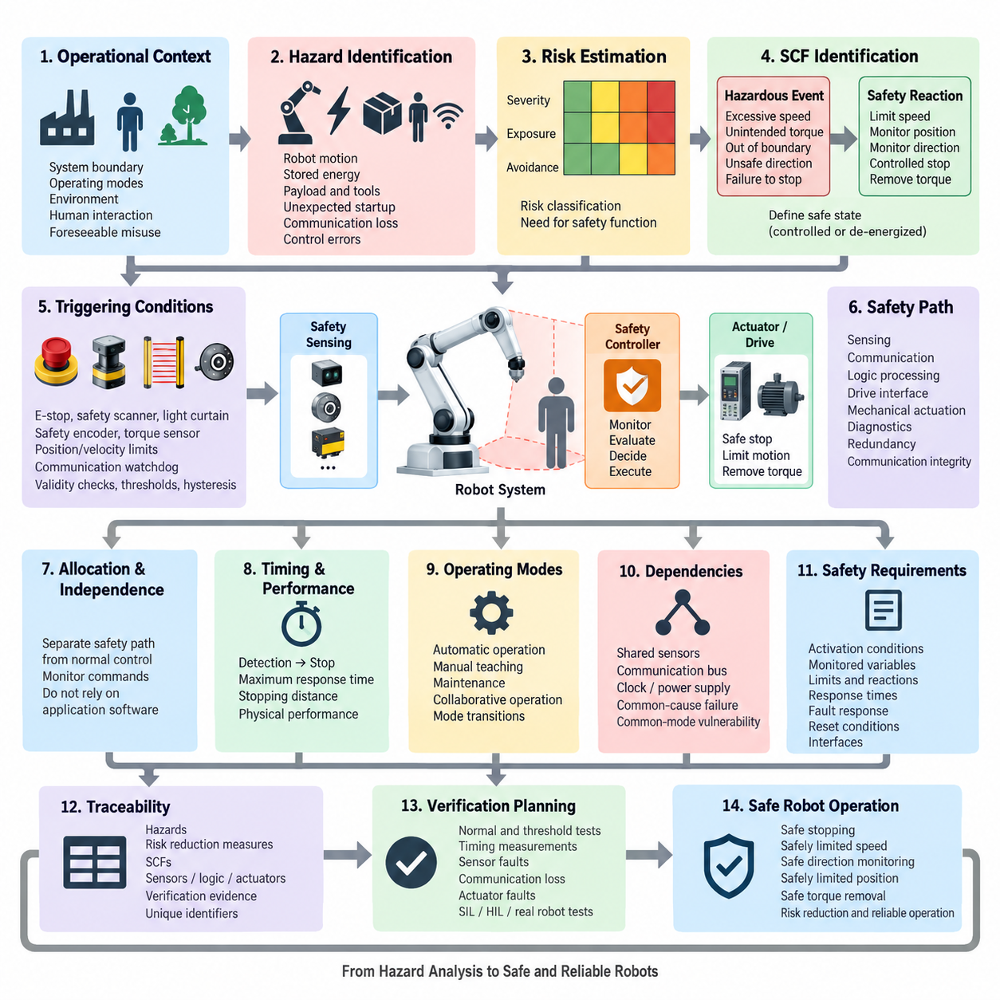
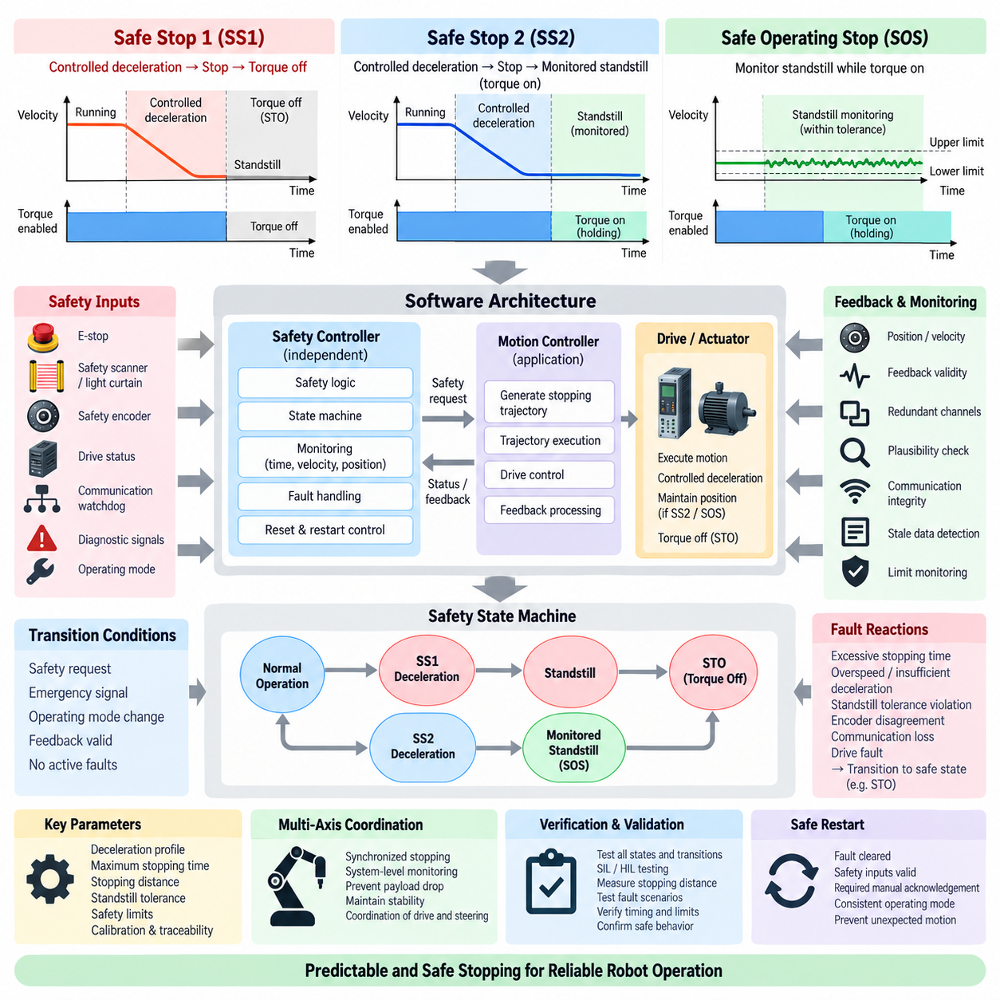
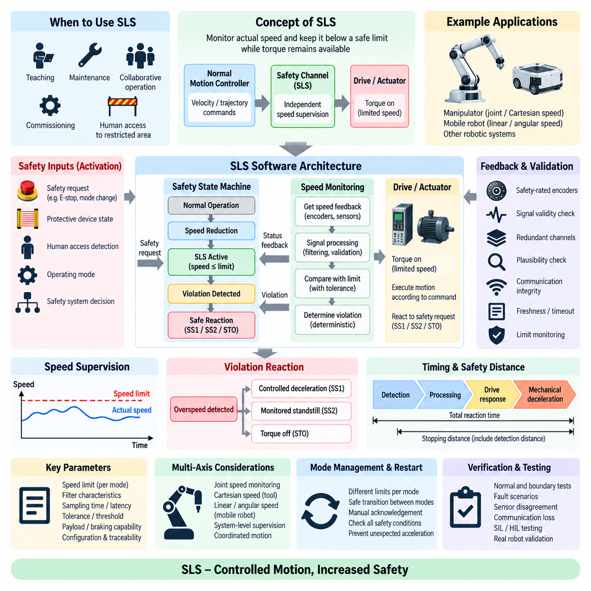
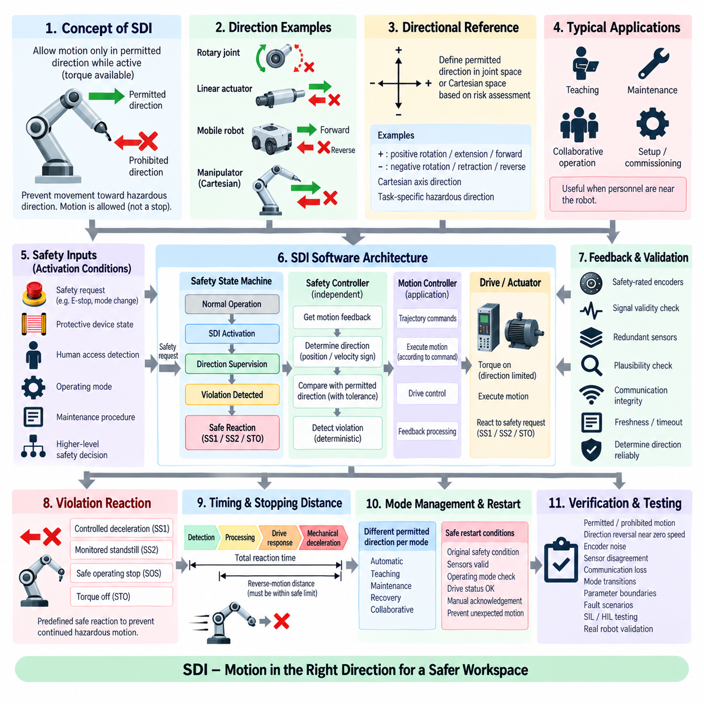
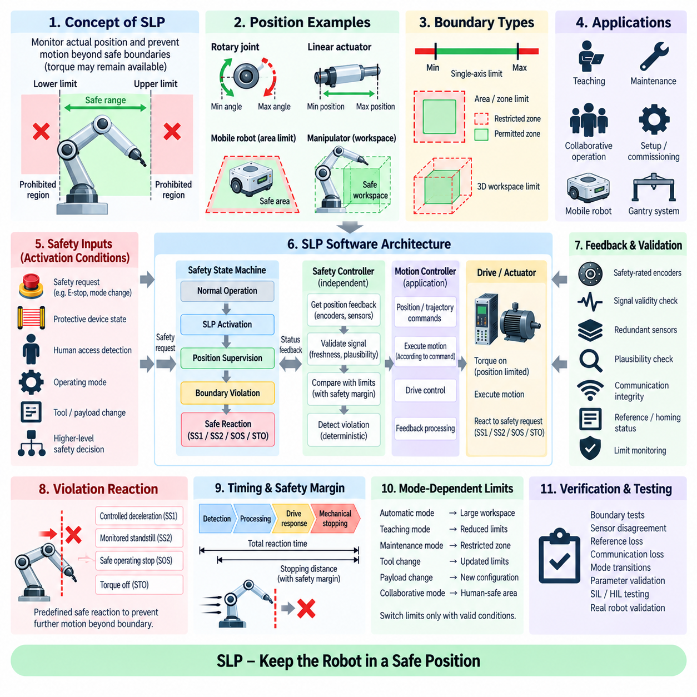
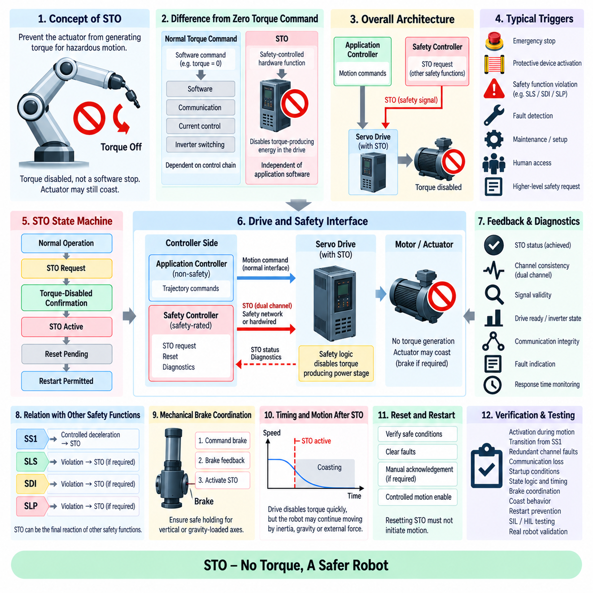
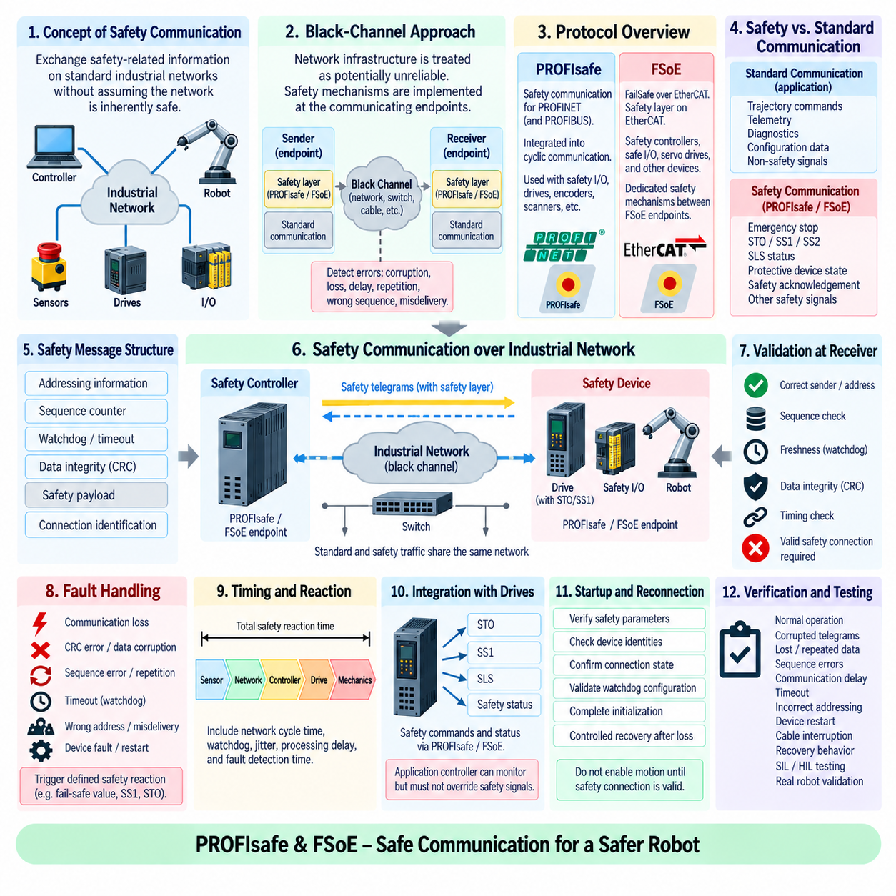
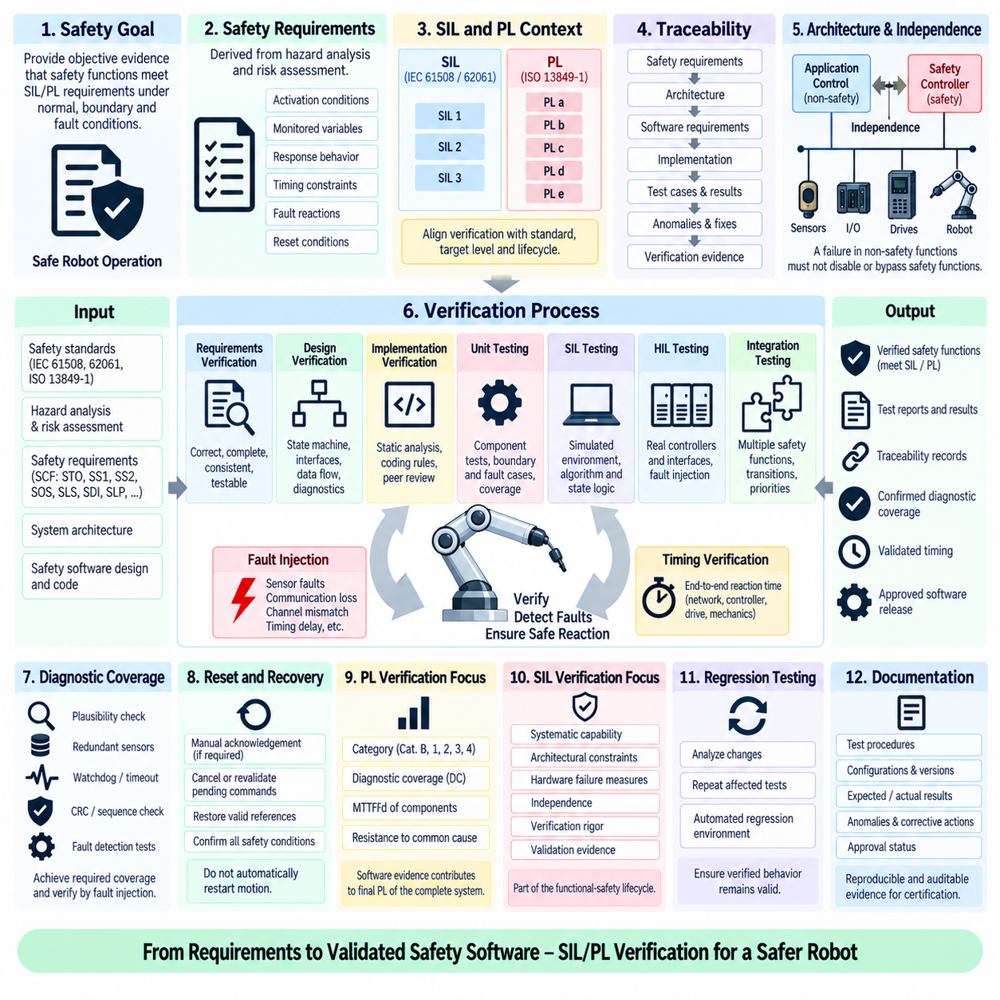
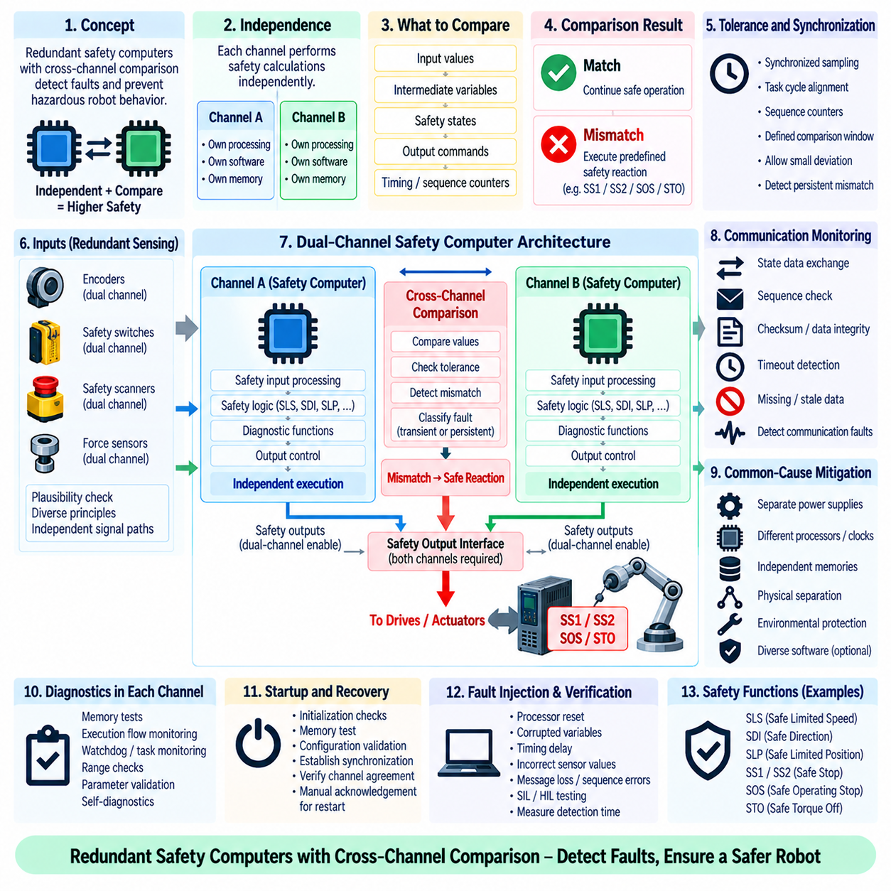
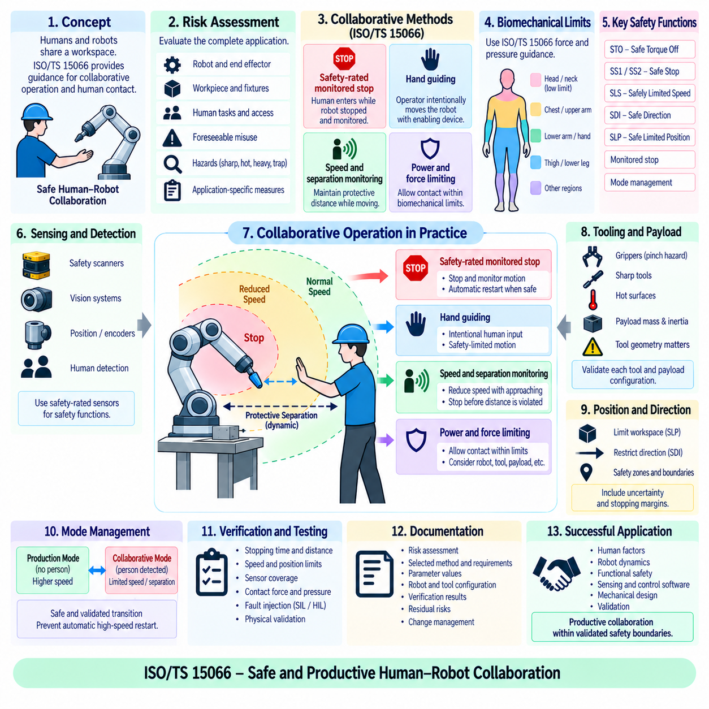

**Volume 04 Robot Control Software**


# 09. Safety Control

##  

## 09.01 Safety Control Function (SCF) Identification Methodology

{width="7.268055555555556in" height="7.268055555555556in"}

Safety Control Function identification begins by translating system-level hazards into explicit control behaviors that prevent unacceptable physical outcomes. In robot control software, an SCF is not simply an emergency routine but a function whose correct execution contributes directly to maintaining or reaching a safe state. Identification therefore starts from intended operation, foreseeable misuse, operating modes, human interaction, environmental conditions, and possible failures.

The first analytical step is to define the system boundary and operational context before individual safety functions are selected. Engineers identify actuators, sensors, power stages, communication interfaces, control computers, mechanical transmission elements, external equipment, and human access zones. Operating states such as initialization, automatic motion, manual control, maintenance, charging, recovery, and shutdown must be considered separately because the same physical hazard can require different protective behavior in each state.

Hazard identification examines how robot motion, stored energy, payloads, tools, electrical power, unexpected startup, communication loss, and control errors can produce hazardous situations. Each hazard should be connected to a concrete operating scenario rather than recorded only as an abstract failure. For example, excessive mobile-robot velocity becomes safety-relevant when a person can enter the stopping path, while manipulator motion becomes critical when an operator can access the workspace during teaching or collaborative operation.

Risk estimation provides the bridge between identified hazards and required safety control behavior. The analysis considers the severity of possible harm, frequency or duration of exposure, and the possibility of avoiding or limiting the hazardous event. The resulting risk classification determines whether ordinary functional control is sufficient or whether an independently monitored safety function is required. The methodology should preserve traceability from the hazardous scenario through the risk evaluation to the selected SCF and its implementation requirements.

A useful SCF identification process separates the hazardous event from the protective reaction. The hazardous event may be excessive speed, unintended torque, motion beyond an authorized boundary, movement in an unsafe direction, or failure to stop. The corresponding safety reaction is then expressed independently as a measurable function, such as safely limiting speed, supervising position, monitoring direction, initiating a controlled stop, or removing actuator torque. This separation prevents vague requirements such as "make the robot safe."

The required safe state must be defined for every relevant hazardous scenario. A safe state does not always mean immediate removal of motor torque because uncontrolled stopping can itself create additional hazards. A suspended manipulator carrying a payload, a mobile robot on a slope, or a legged robot maintaining balance may require controlled deceleration or stabilization before torque is removed. SCF identification must therefore distinguish between maintaining a safely controlled operating condition and transitioning the system toward a de-energized state.

Once the required safety reaction is understood, engineers define the triggering conditions for the SCF. Inputs may include emergency-stop devices, protective scanners, light curtains, safety encoders, torque sensors, position limits, speed estimates, communication watchdogs, drive status, or redundant state information. Trigger conditions should specify thresholds, timing constraints, validity checks, hysteresis, and sensor disagreement behavior so that the safety function can be implemented and verified without relying on ambiguous interpretation.

The methodology must also determine which signals and components belong to the safety-related control path. A safety function may span sensing, communication, logic processing, drive interfaces, and mechanical actuation. Therefore, identification cannot stop at the application software layer. Engineers must trace the complete chain from the initiating condition to the final physical risk reduction, including diagnostic coverage, redundant channels, communication integrity, power-stage behavior, and the ability of the actuator or brake to achieve the commanded safe response.

Safety functions should be allocated according to independence and criticality. Normal motion control may generate velocity, position, or torque commands, while a separate safety path supervises whether those commands remain inside validated limits. This architecture reduces dependence on the correctness of complex application software. The safety controller should not assume that trajectory planning, AI perception, navigation, or the primary control loop is always correct; instead, it should monitor safety-relevant physical quantities through appropriately trusted information paths.

Timing is a fundamental part of SCF definition because safety is determined by both logical correctness and response time. The total reaction interval includes hazard detection, sensor processing, communication, safety logic execution, drive response, mechanical braking, and physical stopping. A function that eventually stops a robot may still be inadequate if the stopping distance exceeds the protected separation distance. SCF requirements should consequently contain maximum response times and measurable physical performance criteria.

Operating-mode analysis is necessary because safety requirements often change with robot state. Automatic production may permit full performance only when access is restricted, whereas manual teaching may require reduced speed and enabling-device supervision. Maintenance may require prevention of unexpected startup, while collaborative operation may rely on continuously monitored speed, separation, force, or position constraints. Mode transitions themselves must be analyzed because inconsistent state information can temporarily disable otherwise valid safety protections.

Dependencies among safety functions should be explicitly identified. Safe stopping may depend on valid speed feedback, while safely limited position may depend on redundant position measurement and calibrated mechanical references. A failure in a shared sensor, communication bus, clock, power supply, or software service can therefore disable several SCFs simultaneously. Dependency analysis reveals common-cause and common-mode vulnerabilities that may remain hidden when each safety function is evaluated independently.

The identified SCFs are converted into precise safety requirements containing activation conditions, monitored variables, limits, required reactions, response times, fault responses, reset conditions, and interfaces. Requirements should state what the safety function must accomplish without prematurely prescribing a particular software implementation. This allows architectural alternatives to be evaluated while maintaining a stable connection between the original hazard analysis and the eventual safety control design.

Traceability is maintained through a safety function matrix linking hazards, hazardous scenarios, risk reduction measures, SCFs, sensors, logic channels, actuators, diagnostics, and verification evidence. Each SCF receives a unique identifier so that later software requirements, test cases, calibration parameters, fault-injection scenarios, and certification artifacts can refer to the same function consistently. This structure is especially important when safety behavior is distributed across a robot controller, safety PLC, network, and intelligent servo drives.

Verification planning should begin during SCF identification rather than after implementation. Every safety function must be expressed so that its triggering condition and resulting physical behavior can be tested. Engineers define normal boundary tests, threshold tests, timing measurements, sensor-failure cases, communication interruptions, actuator faults, and combinations of faults that could compromise the function. SIL, HIL, and physical robot testing can then provide progressively stronger evidence that the implemented SCF satisfies its safety intent.

SCF identification ultimately creates the foundation for subsequent safety-control implementation. Functions such as safe stopping, safely limited speed, safe direction monitoring, safely limited position, and safe torque removal should emerge from a structured analysis of hazards rather than being added as isolated features. A disciplined methodology connects physical risk, operating context, safety state, monitoring logic, hardware interfaces, diagnostics, and verification into one traceable engineering chain, enabling safety control software to remain understandable as robot complexity increases.

안전 제어 기능(Safety Control Function, SCF) 식별은 시스템 수준의 위험요소(hazard)를 허용할 수 없는 물리적 결과를 방지하는 명확한 제어 동작으로 변환하는 과정에서 시작된다. 로봇 제어 소프트웨어에서 안전 제어 기능(SCF)은 단순한 비상 루틴이 아니라, 올바르게 수행될 경우 안전 상태(safe state)를 유지하거나 안전 상태에 도달하는 데 직접적으로 기여하는 기능이다. 따라서 식별 과정은 의도된 운용, 예측 가능한 오사용(foreseeable misuse), 운용 모드, 인간과의 상호작용, 환경 조건 및 발생 가능한 고장을 분석하는 것에서 시작된다.

첫 번째 분석 단계는 개별 안전 기능을 선정하기 전에 시스템 경계(system boundary)와 운용 환경(operational context)을 정의하는 것이다. 엔지니어는 액추에이터(actuator), 센서(sensor), 전력단(power stage), 통신 인터페이스(communication interface), 제어 컴퓨터, 기계식 전달 요소, 외부 장비 및 인간 접근 영역을 식별한다. 초기화, 자동 동작, 수동 제어, 유지보수, 충전, 복구 및 종료와 같은 운용 상태는 각각 별도로 고려해야 한다. 동일한 물리적 위험이라도 각 상태에서 서로 다른 보호 동작이 필요할 수 있기 때문이다.

위험요소 식별(hazard identification)은 로봇의 움직임, 저장 에너지(stored energy), 탑재물(payload), 도구, 전력, 의도하지 않은 기동(unexpected startup), 통신 손실 및 제어 오류가 어떻게 위험 상황(hazardous situation)을 발생시킬 수 있는지를 분석한다. 각 위험요소는 추상적인 고장으로만 기록하지 않고 구체적인 운용 시나리오와 연결해야 한다. 예를 들어 이동 로봇의 과도한 속도는 사람이 정지 경로에 진입할 가능성이 있을 때 안전과 직접 관련되며, 매니퓰레이터(manipulator)의 움직임은 작업자가 티칭(teaching) 또는 협동 운전 중 작업 공간에 접근할 수 있을 때 중요한 위험이 된다.

위험도 추정(risk estimation)은 식별된 위험요소와 필요한 안전 제어 동작을 연결하는 역할을 한다. 분석에서는 발생 가능한 상해의 심각도(severity), 위험에 노출되는 빈도 또는 지속시간, 그리고 위험 사건을 회피하거나 피해를 제한할 가능성을 고려한다. 그 결과로 얻어진 위험 분류(risk classification)를 기반으로 일반 기능 제어만으로 충분한지 또는 독립적으로 감시되는 안전 기능이 필요한지를 결정한다. 이 방법론에서는 위험 시나리오부터 위험 평가, 선정된 안전 제어 기능(SCF), 그리고 구현 요구사항까지 추적성(traceability)을 유지해야 한다.

효과적인 안전 제어 기능(SCF) 식별 절차에서는 위험 사건(hazardous event)과 보호 반응(protective reaction)을 분리한다. 위험 사건은 과도한 속도, 의도하지 않은 토크(torque), 허용된 경계를 벗어나는 움직임, 안전하지 않은 방향으로의 이동 또는 정지 실패 등이 될 수 있다. 이에 대응하는 안전 반응은 안전 속도 제한, 위치 감시, 방향 감시, 제어 정지(controlled stop) 시작 또는 액추에이터 토크 제거와 같이 측정 가능한 독립적 기능으로 표현한다. 이러한 구분은 "로봇을 안전하게 만든다"와 같은 모호한 요구사항을 방지한다.

관련된 모든 위험 시나리오에 대해 요구되는 안전 상태(safe state)를 정의해야 한다. 안전 상태가 항상 모터 토크를 즉시 제거하는 것을 의미하는 것은 아니다. 제어되지 않은 정지 자체가 추가적인 위험을 발생시킬 수 있기 때문이다. 탑재물을 들고 있는 매니퓰레이터, 경사면에 위치한 이동 로봇 또는 균형을 유지하는 보행 로봇은 토크를 제거하기 전에 제어된 감속(controlled deceleration)이나 안정화(stabilization)가 필요할 수 있다. 따라서 안전 제어 기능 식별에서는 안전하게 제어되는 운용 상태를 유지하는 것과 시스템을 무에너지 상태(de-energized state)로 전환하는 것을 구분해야 한다.

필요한 안전 반응이 정의되면 엔지니어는 안전 제어 기능(SCF)의 작동 조건(triggering condition)을 정의한다. 입력에는 비상 정지 장치(emergency-stop device), 보호 스캐너(protective scanner), 라이트 커튼(light curtain), 안전 엔코더(safety encoder), 토크 센서, 위치 제한, 속도 추정값, 통신 워치독(communication watchdog), 드라이브 상태 또는 이중화된 상태 정보가 포함될 수 있다. 작동 조건에는 임계값, 시간 제약, 유효성 검사, 히스테리시스(hysteresis) 및 센서 불일치 시의 동작을 명확하게 정의하여 안전 기능을 모호한 해석 없이 구현하고 검증할 수 있도록 해야 한다.

이 방법론에서는 어떤 신호와 구성요소가 안전 관련 제어 경로(safety-related control path)에 포함되는지도 결정해야 한다. 하나의 안전 기능은 센싱(sensing), 통신, 논리 처리(logic processing), 드라이브 인터페이스 및 기계적 작동에 걸쳐 구성될 수 있다. 따라서 식별 작업은 애플리케이션 소프트웨어 계층에서 끝나서는 안 된다. 엔지니어는 시작 조건에서 최종적인 물리적 위험 감소까지 전체 경로를 추적해야 하며, 여기에는 진단 범위(diagnostic coverage), 이중화 채널, 통신 무결성(communication integrity), 전력단 동작 및 액추에이터나 브레이크가 명령된 안전 반응을 수행할 수 있는 능력이 포함된다.

안전 기능은 독립성(independence)과 중요도(criticality)에 따라 할당되어야 한다. 일반 모션 제어(normal motion control)는 속도, 위치 또는 토크 명령을 생성할 수 있으며, 별도의 안전 경로(safety path)는 이러한 명령이 검증된 한계 내에 유지되는지를 감시한다. 이러한 아키텍처는 복잡한 애플리케이션 소프트웨어의 정확성에 대한 의존성을 줄인다. 안전 제어기(safety controller)는 궤적 계획, 인공지능 인식(AI perception), 내비게이션 또는 주 제어 루프가 항상 올바르다고 가정해서는 안 되며, 적절하게 신뢰할 수 있는 정보 경로를 통해 안전 관련 물리량을 독립적으로 감시해야 한다.

시간 특성(timing)은 안전이 논리적인 정확성뿐 아니라 응답 시간(response time)에 의해서도 결정되므로 안전 제어 기능 정의의 핵심 요소이다. 전체 반응 시간에는 위험 감지, 센서 처리, 통신, 안전 논리 실행, 드라이브 반응, 기계식 제동 및 실제 물리적 정지가 포함된다. 로봇을 최종적으로 정지시키는 기능이라도 정지 거리가 보호 분리 거리(protected separation distance)를 초과한다면 충분하지 않을 수 있다. 따라서 안전 제어 기능 요구사항에는 최대 응답 시간과 측정 가능한 물리적 성능 기준을 포함해야 한다.

운용 모드 분석(operating-mode analysis)이 필요한 이유는 로봇 상태에 따라 안전 요구사항이 달라지는 경우가 많기 때문이다. 자동 생산에서는 접근이 제한된 조건에서만 최대 성능을 허용할 수 있는 반면, 수동 티칭에서는 감소된 속도(reduced speed)와 인에이블링 장치(enabling device)의 감시가 필요할 수 있다. 유지보수에서는 의도하지 않은 기동을 방지해야 하며, 협동 운전(collaborative operation)에서는 속도, 분리 거리, 힘 또는 위치 제한을 지속적으로 감시할 수 있다. 운용 모드 전환 자체도 분석해야 하는데, 상태 정보가 일치하지 않으면 정상적으로 동작하던 안전 보호 기능이 일시적으로 비활성화될 수 있기 때문이다.

안전 기능 사이의 의존성(dependency)도 명확하게 식별해야 한다. 안전 정지(safe stopping)는 유효한 속도 피드백에 의존할 수 있으며, 안전 제한 위치(safely limited position)는 이중화된 위치 측정과 교정된 기계 기준점에 의존할 수 있다. 따라서 공유 센서, 통신 버스, 클록(clock), 전원 공급장치 또는 소프트웨어 서비스의 고장으로 여러 안전 제어 기능이 동시에 비활성화될 수 있다. 의존성 분석(dependency analysis)은 각 안전 기능을 개별적으로 평가할 경우 발견하기 어려운 공통 원인 고장(common-cause failure)과 공통 모드 취약성(common-mode vulnerability)을 식별하는 데 중요하다.

식별된 안전 제어 기능(SCF)은 작동 조건, 감시 변수, 제한값, 요구되는 반응, 응답 시간, 고장 대응, 리셋 조건 및 인터페이스를 포함하는 명확한 안전 요구사항(safety requirement)으로 변환된다. 요구사항은 특정 소프트웨어 구현 방법을 지나치게 일찍 규정하기보다 해당 안전 기능이 무엇을 달성해야 하는지를 정의해야 한다. 이를 통해 최초의 위험 분석과 최종 안전 제어 설계 사이의 안정적인 연결 관계를 유지하면서 다양한 아키텍처 대안을 평가할 수 있다.

추적성(traceability)은 위험요소, 위험 시나리오, 위험 저감 수단(risk reduction measure), 안전 제어 기능(SCF), 센서, 논리 채널, 액추에이터, 진단 및 검증 증거(verification evidence)를 연결하는 안전 기능 매트릭스(safety function matrix)를 통해 유지한다. 각 안전 제어 기능에는 고유 식별자(unique identifier)를 부여하여 이후의 소프트웨어 요구사항, 시험 사례, 교정 파라미터, 고장 주입 시나리오(fault-injection scenario) 및 인증 산출물이 동일한 기능을 일관되게 참조할 수 있도록 한다. 이러한 구조는 안전 동작이 로봇 제어기, 안전 PLC(safety PLC), 네트워크 및 지능형 서보 드라이브(intelligent servo drive)에 분산되어 있을 때 특히 중요하다.

검증 계획(verification planning)은 구현 이후가 아니라 안전 제어 기능 식별 단계에서부터 시작해야 한다. 모든 안전 기능은 작동 조건과 그에 따른 물리적 동작을 시험할 수 있는 형태로 표현되어야 한다. 엔지니어는 정상 경계 시험, 임계값 시험, 시간 측정, 센서 고장 사례, 통신 중단, 액추에이터 고장 및 안전 기능을 손상시킬 수 있는 복합 고장 조건을 정의한다. 이후 소프트웨어 인 더 루프(SIL), 하드웨어 인 더 루프(HIL) 및 실제 로봇 시험을 통해 구현된 안전 제어 기능이 원래의 안전 의도(safety intent)를 충족한다는 증거를 단계적으로 확보할 수 있다.

안전 제어 기능(SCF) 식별은 궁극적으로 이후의 안전 제어 구현을 위한 기반을 형성한다. 안전 정지(safe stopping), 안전 제한 속도(safely limited speed), 안전 방향 감시(safe direction monitoring), 안전 제한 위치(safely limited position), 안전 토크 제거(safe torque removal)와 같은 기능은 개별적인 부가 기능으로 추가되는 것이 아니라 구조화된 위험 분석으로부터 도출되어야 한다. 체계적인 방법론은 물리적 위험, 운용 환경, 안전 상태, 감시 논리, 하드웨어 인터페이스, 진단 및 검증을 하나의 추적 가능한 엔지니어링 체인(engineering chain)으로 연결함으로써 로봇 시스템의 복잡성이 증가하더라도 안전 제어 소프트웨어를 명확하고 체계적으로 관리할 수 있도록 한다.

##  

## 09.02 Safe Stop SS1 / SS2 / SOS SW Implementation [w/Code]

{width="7.268055555555556in" height="7.268055555555556in"}

Safe Stop functions are safety-related motion-control mechanisms that bring a robot into a defined safe condition when hazardous motion must be interrupted. Safe Stop 1 (SS1), Safe Stop 2 (SS2), and Safe Operating Stop (SOS) represent different combinations of controlled deceleration, standstill supervision, and torque availability. Their software implementation must coordinate safety logic with the motion controller and drive while remaining independent from ordinary application-level commands.

SS1 is intended for situations in which controlled deceleration is preferable to immediately removing actuator torque. When SS1 is requested, the control system initiates a predefined stopping trajectory while the drive remains capable of generating torque. After standstill is reached, or after a monitored stopping interval expires depending on the implementation, the system transitions toward torque removal, typically through a Safe Torque Off (STO) function. This sequence reduces mechanical shock and uncontrolled motion during emergency stopping.

The software implementation of SS1 therefore requires more than issuing a zero-velocity command. A safety state machine supervises the complete transition from normal operation through controlled deceleration to the final safe state. The implementation monitors velocity, deceleration, elapsed time, drive status, and relevant feedback signals. If the expected stopping behavior is violated, the safety layer must initiate the predefined fault reaction rather than continuing to depend on the normal motion controller.

An SS1 implementation can use monitored time or monitored deceleration behavior according to the selected safety architecture and drive capability. In a time-supervised approach, torque-producing control remains active during a validated stopping interval before STO is activated. In a more tightly monitored implementation, the actual deceleration trajectory or velocity envelope is supervised. Excessive velocity, insufficient deceleration, or failure to reach standstill can therefore trigger escalation to a more restrictive safety response.

SS2 also begins with controlled deceleration, but its final state differs fundamentally from SS1. Instead of removing torque after the stopping process, SS2 transitions into a safely monitored standstill condition. Motor torque remains available so that the robot can actively maintain position. This behavior is useful when removing torque could cause an axis to move because of gravity, external force, stored mechanical energy, or an unstable configuration that requires active control.

Software supporting SS2 must coordinate the stopping trajectory with subsequent standstill supervision. Once the controller determines that the robot has entered the permitted standstill region, the system activates SOS monitoring. Position and velocity feedback are continuously evaluated against predefined limits. The transition between deceleration and standstill supervision must be deterministic because a temporary monitoring gap could allow hazardous motion to occur without detection.

SOS is the safety function responsible for supervising a stopped actuator while drive torque remains enabled. It does not normally command continuous motion; instead, it verifies that the axis remains inside the permitted standstill tolerance. The ordinary position controller may continue producing holding torque, while the independent safety channel observes safety-related position or velocity information. Motion beyond the validated tolerance causes a defined safety reaction, commonly progressing toward torque removal or another safe state.

Standstill cannot be represented as an ideal mathematical zero because sensors contain quantization, noise, mechanical compliance, and estimation error. SOS software therefore requires validated tolerance parameters for position deviation, velocity, measurement uncertainty, and observation time. Limits must be sufficiently tight to prevent hazardous movement while avoiding unnecessary trips caused by normal measurement variation. These parameters become safety-relevant calibration data and require controlled configuration and traceability.

A practical implementation commonly organizes SS1, SS2, and SOS as explicit states and transitions within a safety state machine. Inputs include safety requests, emergency signals, operating mode, encoder information, drive status, communication validity, and diagnostic results. Outputs may request controlled stopping, enable standstill monitoring, command STO, or report a safety fault. State transitions should occur only when their entry conditions and required safety evidence have been satisfied.

The normal motion controller and safety controller must have clearly separated responsibilities. The motion controller can generate a smooth deceleration trajectory because it has detailed knowledge of robot dynamics and motion constraints. The safety controller, however, must independently determine whether the resulting behavior remains within the permitted safety envelope. Consequently, successful execution of an application stop command cannot itself be treated as proof that SS1 or SS2 has completed safely.

Feedback integrity is critical because safe stopping depends on trustworthy knowledge of actual actuator motion. Safety-rated encoders, redundant sensing channels, plausibility checks, or independently derived speed information may be used according to the required safety architecture. Software should detect stale data, impossible transitions, disagreement between channels, communication timeout, and invalid measurement status. A feedback fault during SS1, SS2, or SOS must lead to a predetermined reaction rather than an undefined continuation of motion.

Timing supervision must cover the complete safety reaction chain. The relevant interval begins when the safety request becomes valid and includes input processing, communication latency, controller execution, drive response, mechanical deceleration, and confirmation of the resulting safe state. Maximum stopping time and stopping distance must be consistent with the robot\'s risk assessment. Heavy mobile robots, high-inertia manipulators, and payload-carrying systems may require substantially different deceleration profiles and safety margins.

Multi-axis robots require additional coordination because individual joints or wheels cannot always be stopped independently without creating another hazard. A manipulator may need synchronized joint deceleration to avoid dropping a payload or generating excessive Cartesian motion. A mobile robot may need coordinated drive and steering behavior to maintain directional stability. SS1 and SS2 software should therefore supervise both individual actuator limits and system-level stopping behavior where the mechanical architecture requires coordinated motion.

Reset and restart behavior is part of the safety implementation rather than an application convenience. Completion of SS1, SS2, or SOS should not automatically authorize normal motion unless the required restart conditions are satisfied. Safety inputs must be valid, faults must be cleared according to the defined procedure, operating modes must be consistent, and any required manual acknowledgement must occur. Restart logic must also prevent unexpected motion immediately after the safety condition disappears.

Verification should exercise every transition and failure path in the Safe Stop state machine. Tests include normal SS1 and SS2 activation, SOS tolerance violation, excessive stopping time, encoder disagreement, communication interruption, drive fault, repeated safety requests, reset attempts, and failures occurring during state transitions. SIL and HIL testing can verify logic and timing systematically before physical robot tests measure actual deceleration, stopping distance, standstill stability, and actuator response.

SS1, SS2, and SOS ultimately form a coordinated family of safety functions rather than isolated stop commands. SS1 provides controlled deceleration followed by a torque-safe condition, SS2 provides controlled deceleration followed by safely monitored standstill, and SOS supervises that standstill while torque remains available. Their software implementation combines deterministic state management, independent monitoring, reliable feedback, timing supervision, fault handling, and controlled restart to ensure that stopping behavior remains predictable under both normal and failure conditions.

안전 정지(Safe Stop) 기능은 위험한 움직임을 중단해야 할 때 로봇을 정의된 안전 상태(safe condition)로 전환하는 안전 관련 모션 제어 메커니즘이다. 안전 정지 1(Safe Stop 1, SS1), 안전 정지 2(Safe Stop 2, SS2), 안전 운전 정지(Safe Operating Stop, SOS)는 제어 감속(controlled deceleration), 정지 상태 감시(standstill supervision), 토크 가용성(torque availability)을 서로 다르게 조합한 기능이다. 소프트웨어 구현에서는 안전 논리(safety logic)를 모션 제어기 및 드라이브와 연계하면서 일반 애플리케이션 수준 명령과 독립성을 유지해야 한다.

안전 정지 1(SS1)은 액추에이터 토크를 즉시 제거하는 것보다 제어 감속이 적합한 상황을 위한 기능이다. SS1이 요청되면 제어 시스템은 드라이브가 토크를 생성할 수 있는 상태를 유지하면서 미리 정의된 정지 궤적(stopping trajectory)을 시작한다. 정지 상태에 도달하거나 구현 방식에 따라 감시되는 정지 시간이 만료되면 시스템은 일반적으로 안전 토크 차단(Safe Torque Off, STO)을 통해 토크를 제거하는 상태로 전환한다. 이러한 순서는 비상 정지 과정에서 기계적 충격과 제어되지 않은 움직임을 감소시킨다.

따라서 SS1의 소프트웨어 구현은 단순히 속도 명령을 0으로 설정하는 것 이상을 요구한다. 안전 상태 머신(safety state machine)은 정상 운전에서 제어 감속을 거쳐 최종 안전 상태에 이르는 전체 전환 과정을 감시한다. 구현 소프트웨어는 속도, 감속도, 경과 시간, 드라이브 상태 및 관련 피드백 신호를 감시한다. 예상된 정지 동작에서 벗어날 경우 안전 계층(safety layer)은 일반 모션 제어기에 계속 의존하지 않고 미리 정의된 고장 대응(fault reaction)을 실행해야 한다.

SS1 구현에서는 선택된 안전 아키텍처(safety architecture)와 드라이브 기능에 따라 시간 감시(monitored time) 또는 감속 동작 감시(monitored deceleration behavior)를 사용할 수 있다. 시간 감시 방식에서는 검증된 정지 시간 동안 토크 생성 제어를 유지한 후 STO를 활성화한다. 보다 엄격하게 감시하는 구현에서는 실제 감속 궤적 또는 속도 엔벌로프(velocity envelope)를 감시한다. 따라서 과도한 속도, 불충분한 감속 또는 정지 상태 도달 실패가 발생하면 더욱 제한적인 안전 대응으로 전환할 수 있다.

안전 정지 2(SS2) 역시 제어 감속으로 시작하지만 최종 상태는 SS1과 근본적으로 다르다. SS2는 정지 과정이 완료된 후 토크를 제거하는 대신 안전하게 감시되는 정지 상태(safely monitored standstill)로 전환한다. 로봇이 능동적으로 위치를 유지할 수 있도록 모터 토크는 계속 사용 가능한 상태로 유지된다. 이러한 동작은 중력, 외력, 저장된 기계적 에너지 또는 능동 제어가 필요한 불안정한 자세로 인해 토크 제거 시 축이 움직일 가능성이 있는 경우에 유용하다.

SS2를 지원하는 소프트웨어는 정지 궤적과 이후의 정지 상태 감시를 연계해야 한다. 제어기가 로봇이 허용된 정지 영역(standstill region)에 진입했다고 판단하면 시스템은 안전 운전 정지(SOS) 감시를 활성화한다. 위치 및 속도 피드백은 미리 정의된 제한값과 지속적으로 비교된다. 감속과 정지 상태 감시 사이의 전환은 결정론적(deterministic)이어야 하는데, 일시적인 감시 공백이 발생하면 위험한 움직임이 감지되지 않을 수 있기 때문이다.

안전 운전 정지(SOS)는 드라이브 토크가 활성화된 상태에서 정지된 액추에이터를 감시하는 안전 기능이다. 일반적으로 SOS 자체가 지속적인 움직임을 명령하는 것은 아니며, 대신 축이 허용된 정지 허용오차(standstill tolerance) 내에 유지되는지를 확인한다. 일반 위치 제어기는 위치 유지를 위한 토크를 계속 생성할 수 있으며, 독립적인 안전 채널(safety channel)은 안전 관련 위치 또는 속도 정보를 감시한다. 검증된 허용오차를 벗어난 움직임이 발생하면 토크 제거 또는 다른 안전 상태로의 전환과 같은 정의된 안전 대응이 실행된다.

정지 상태를 이상적인 수학적 0으로 표현할 수는 없다. 센서에는 양자화(quantization), 노이즈(noise), 기계적 컴플라이언스(mechanical compliance), 추정 오차(estimation error)가 존재하기 때문이다. 따라서 SOS 소프트웨어에는 위치 편차, 속도, 측정 불확실성 및 관찰 시간에 대한 검증된 허용오차 파라미터가 필요하다. 제한값은 위험한 움직임을 방지할 정도로 엄격하면서도 정상적인 측정 변동으로 불필요한 안전 동작이 발생하지 않도록 설정해야 한다. 이러한 파라미터는 안전 관련 교정 데이터(safety-relevant calibration data)가 되며 통제된 형상 관리(configuration control)와 추적성(traceability)이 요구된다.

실제 구현에서는 일반적으로 SS1, SS2 및 SOS를 안전 상태 머신 내의 명시적인 상태와 전이(state and transition)로 구성한다. 입력에는 안전 요청, 비상 신호, 운전 모드, 엔코더 정보, 드라이브 상태, 통신 유효성 및 진단 결과가 포함된다. 출력은 제어 정지 요청, 정지 상태 감시 활성화, STO 명령 또는 안전 고장 보고 등이 될 수 있다. 상태 전이는 해당 상태의 진입 조건과 필요한 안전 증거(safety evidence)가 충족된 경우에만 수행되어야 한다.

일반 모션 제어기(normal motion controller)와 안전 제어기(safety controller)의 책임은 명확하게 분리되어야 한다. 모션 제어기는 로봇 동역학(robot dynamics)과 운동 제약조건을 상세하게 알고 있으므로 부드러운 감속 궤적을 생성할 수 있다. 그러나 안전 제어기는 결과로 발생하는 동작이 허용된 안전 엔벌로프(safety envelope) 내부에 유지되는지를 독립적으로 판단해야 한다. 따라서 애플리케이션 정지 명령이 성공적으로 실행되었다는 사실만으로 SS1 또는 SS2가 안전하게 완료되었다고 판단해서는 안 된다.

안전한 정지는 실제 액추에이터 움직임에 대한 신뢰할 수 있는 정보에 의존하기 때문에 피드백 무결성(feedback integrity)이 매우 중요하다. 요구되는 안전 아키텍처에 따라 안전 등급 엔코더(safety-rated encoder), 이중화 센싱 채널(redundant sensing channel), 타당성 검사(plausibility check) 또는 독립적으로 계산된 속도 정보를 사용할 수 있다. 소프트웨어는 오래된 데이터(stale data), 불가능한 상태 변화, 채널 간 불일치, 통신 시간 초과 및 유효하지 않은 측정 상태를 감지해야 한다. SS1, SS2 또는 SOS 실행 중 피드백 고장이 발생하면 정의되지 않은 상태로 동작을 계속하는 대신 미리 결정된 안전 대응을 수행해야 한다.

시간 감시(timing supervision)는 전체 안전 반응 체인(safety reaction chain)을 포함해야 한다. 관련 시간 구간은 안전 요청이 유효해지는 시점부터 시작하며 입력 처리, 통신 지연, 제어기 실행, 드라이브 반응, 기계적 감속 및 최종 안전 상태 확인까지 포함한다. 최대 정지 시간(maximum stopping time)과 정지 거리(stopping distance)는 로봇의 위험성 평가(risk assessment) 결과와 일치해야 한다. 중량 이동 로봇, 고관성 매니퓰레이터 및 탑재물을 운반하는 시스템에서는 서로 크게 다른 감속 프로파일과 안전 여유(safety margin)가 필요할 수 있다.

다축 로봇(multi-axis robot)에서는 개별 관절이나 바퀴를 항상 독립적으로 정지시킬 수 있는 것은 아니며, 잘못된 개별 정지가 또 다른 위험을 발생시킬 수 있기 때문에 추가적인 협조 제어(coordination)가 필요하다. 매니퓰레이터는 탑재물을 떨어뜨리거나 과도한 직교좌표계 움직임(Cartesian motion)이 발생하는 것을 방지하기 위해 관절의 동기화 감속(synchronized joint deceleration)이 필요할 수 있다. 이동 로봇에서는 방향 안정성을 유지하기 위해 구동과 조향의 협조 동작이 필요할 수 있다. 따라서 SS1과 SS2 소프트웨어는 기계 아키텍처가 협조 동작을 요구하는 경우 개별 액추에이터 제한뿐만 아니라 시스템 수준의 정지 동작도 감시해야 한다.

리셋 및 재시작 동작(reset and restart behavior)은 단순한 애플리케이션 편의 기능이 아니라 안전 구현의 일부이다. SS1, SS2 또는 SOS가 완료되었다고 해서 필요한 재시작 조건이 충족되지 않은 상태에서 정상 움직임을 자동으로 허용해서는 안 된다. 안전 입력이 유효해야 하고, 정의된 절차에 따라 고장이 해제되어야 하며, 운전 모드가 일관되어야 하고, 필요한 경우 수동 확인(manual acknowledgement)이 수행되어야 한다. 또한 재시작 논리는 안전 조건이 해제된 직후 의도하지 않은 움직임(unexpected motion)이 발생하지 않도록 해야 한다.

검증(verification)에서는 안전 정지 상태 머신의 모든 전이와 고장 경로를 시험해야 한다. 시험에는 정상적인 SS1 및 SS2 활성화, SOS 허용오차 위반, 과도한 정지 시간, 엔코더 불일치, 통신 중단, 드라이브 고장, 반복적인 안전 요청, 리셋 시도 및 상태 전이 중 발생하는 고장이 포함된다. 소프트웨어 인 더 루프(SIL)와 하드웨어 인 더 루프(HIL) 시험을 통해 논리와 시간 특성을 체계적으로 검증한 후 실제 로봇 시험을 통해 실제 감속, 정지 거리, 정지 상태 안정성 및 액추에이터 반응을 측정할 수 있다.

SS1, SS2 및 SOS는 궁극적으로 서로 독립된 정지 명령이 아니라 상호 연계된 안전 기능군(safety function family)을 구성한다. SS1은 제어 감속 후 토크가 제거된 안전 상태를 제공하고, SS2는 제어 감속 후 안전하게 감시되는 정지 상태를 제공하며, SOS는 토크가 사용 가능한 상태에서 해당 정지 상태를 지속적으로 감시한다. 이들의 소프트웨어 구현은 결정론적 상태 관리, 독립적인 감시, 신뢰할 수 있는 피드백, 시간 감시, 고장 처리 및 통제된 재시작을 결합함으로써 정상 조건과 고장 조건 모두에서 정지 동작이 예측 가능하고 안전하게 유지되도록 한다.

##  

## 09.03 Safely Limited Speed (SLS) Implementation [w/Code]

{width="7.268055555555556in" height="7.268055555555556in"}

Safely Limited Speed (SLS) is a safety control function that supervises robot motion and ensures that actual speed does not exceed a predefined safety limit while drive torque remains available. Unlike a stop function, SLS permits continued motion under restricted conditions. It is particularly useful during teaching, maintenance, collaborative operation, commissioning, and other modes in which personnel may enter areas that normally require separation from moving machinery.

The fundamental SLS principle is to separate ordinary speed control from safety-related speed supervision. The normal motion controller generates velocity or trajectory commands according to the application, while an independent safety channel evaluates measured or derived speed against a validated safety limit. The safety function therefore does not assume that the commanded velocity is correct. It determines whether the physical robot is actually moving within the permitted safety envelope.

SLS activation normally begins with a safety request associated with an operating-mode change, protective-device state, human access condition, or higher-level safety decision. When SLS becomes active, the motion controller may first reduce the commanded speed to the permitted range. The safety controller then supervises actual motion independently. Activation must be deterministic, and the robot must enter the limited-speed condition within a specified transition time without creating an unmonitored interval.

A software implementation can represent SLS through an explicit safety state machine containing states such as normal operation, speed reduction, SLS active, violation detected, and safe reaction. Entry into the SLS-active state should occur only after required conditions are confirmed, including valid feedback, correct operating mode, healthy safety communication, and acceptable actuator status. State transitions and their conditions should be defined precisely so that every possible operating path can be verified.

Speed supervision requires reliable motion information. Depending on the robot architecture, this information may originate from safety-rated encoders, redundant wheel encoders, joint sensors, motor feedback, or independently calculated velocity estimates. The safety software should validate signal freshness, range, consistency, direction, and agreement between redundant channels. Invalid or unavailable feedback must not silently disable SLS because loss of trustworthy speed information removes the basis for demonstrating that motion remains safely limited.

The monitored quantity must also be selected according to the physical hazard. For a single motor, rotational speed may be sufficient, whereas a mobile robot may require supervision of translational and rotational velocity. A manipulator may require joint-speed monitoring and, in some applications, Cartesian velocity supervision at the tool or another relevant point. Legged and mobile-manipulation systems can require multiple monitored quantities because individual joint speeds alone may not represent the velocity of the hazardous moving structure.

The SLS threshold is a safety-relevant parameter rather than an ordinary tuning value. Its selection should follow the system risk assessment and intended operating mode. The configured limit may depend on human proximity, mechanical geometry, payload, braking capability, sensing uncertainty, and expected reaction time. Parameter values should be protected against unintended modification and associated with configuration identification, access control, validation evidence, and traceability to the corresponding safety requirement.

Real measurements fluctuate because of encoder quantization, sampling effects, vibration, numerical differentiation, and estimation noise. SLS software therefore requires carefully designed signal processing that preserves safety response performance. Filtering can reduce false violations, but excessive filtering introduces delay and may allow hazardous overspeed to remain undetected. Filter characteristics, sampling period, calculation latency, and threshold margins must consequently be treated as part of the safety design rather than ordinary signal-conditioning choices.

Overspeed detection should account for both the configured limit and the uncertainty of the measurement chain. A practical supervisor compares validated speed information with an internal monitoring boundary and evaluates whether the limit has been exceeded according to defined temporal conditions. Small transient measurement variations may require controlled tolerance, while sustained or significant overspeed must produce a safety reaction. The algorithm must remain deterministic so identical safety conditions result in predictable behavior.

When an SLS violation is detected, the software must initiate a predefined safe reaction rather than merely reporting an error to the application. Depending on the risk analysis and mechanical system, the response may involve controlled deceleration through SS1, transition to SS2 and monitored standstill, or torque removal through STO. The selected reaction must reduce the hazardous condition within the required response time and stopping distance while avoiding additional risks created by uncontrolled mechanical behavior.

Timing analysis is essential because SLS effectiveness depends on how quickly excessive speed can be detected and corrected. Total reaction time includes sensor acquisition, filtering, velocity calculation, communication, safety logic execution, drive response, and mechanical deceleration. The robot may continue moving during this interval, so safety distance calculations must account for both detection distance and stopping distance. Higher inertia, heavier payloads, or poor surface conditions can significantly increase the required protective margin.

Communication between distributed safety components must preserve the integrity and freshness of SLS information. In architectures using a safety controller, remote I/O, networked drives, or distributed encoders, speed values and safety states may cross several communication interfaces. Sequence monitoring, timeout detection, validity information, and appropriate safety communication mechanisms are needed so that corrupted, delayed, duplicated, or missing information cannot be interpreted as valid evidence of safe speed.

Multi-axis systems introduce additional complexity because safe speed may be a system-level property. In a manipulator, several joints moving within their individual limits can combine to produce a high Cartesian tool speed. In a mobile robot, wheel velocities combine into translational and rotational motion, while steering geometry can change the resulting trajectory. SLS software should therefore monitor the physical quantity associated with the identified hazard instead of assuming that limiting each actuator independently always guarantees safe system motion.

Mode management is closely connected to SLS because different operating modes may require different speed limits. Automatic operation, manual teaching, maintenance, recovery, and collaborative operation can each use distinct validated limits and activation conditions. Switching between these limits must itself be safety controlled. A transition from a lower limit to a higher one should occur only when the required protective conditions are confirmed, preventing accidental restoration of unrestricted motion while personnel remain exposed.

Reset and release logic must prevent unexpected acceleration after an SLS condition ends. Removal of the safety request should not automatically authorize full-speed motion unless all required safety conditions are valid. The system may require confirmation of operating mode, protective-device state, fault status, and manual acknowledgement. The normal controller should then resume motion through a controlled transition rather than immediately applying a previously stored high-speed command.

Verification of SLS should cover nominal operation, boundary conditions, and fault scenarios. Tests should examine activation and release transitions, speeds just below and above the configured limit, rapid acceleration through the threshold, sensor disagreement, stale feedback, communication loss, invalid parameters, controller faults, and the resulting safe reactions. SIL and HIL environments can automate extensive boundary testing, while physical robot tests confirm real reaction time, velocity accuracy, deceleration, and stopping distance.

A robust SLS implementation therefore combines independent speed supervision, trustworthy feedback, protected safety parameters, deterministic state transitions, bounded processing latency, defined overspeed reactions, and controlled restart behavior. Rather than simply commanding a robot to move slowly, SLS continuously establishes that physical motion remains within a validated safety limit and initiates a safe reaction whenever that condition can no longer be demonstrated. This makes limited-speed operation an enforceable safety property rather than an application-level assumption.

안전 제한 속도(Safely Limited Speed, SLS)는 드라이브 토크가 사용 가능한 상태에서 로봇의 움직임을 감시하고 실제 속도가 사전에 정의된 안전 제한값(safety limit)을 초과하지 않도록 보장하는 안전 제어 기능이다. 정지 기능과 달리 SLS는 제한된 조건에서 움직임을 계속 허용한다. 특히 티칭(teaching), 유지보수(maintenance), 협동 운전(collaborative operation), 시운전(commissioning) 및 작업자가 일반적으로 움직이는 기계와 분리되어야 하는 영역에 진입할 수 있는 운전 모드에서 유용하다.

SLS의 기본 원리는 일반 속도 제어(ordinary speed control)와 안전 관련 속도 감시(safety-related speed supervision)를 분리하는 것이다. 일반 모션 제어기(normal motion controller)는 애플리케이션에 따라 속도 또는 궤적 명령을 생성하고, 독립적인 안전 채널(safety channel)은 측정되거나 계산된 속도를 검증된 안전 제한값과 비교한다. 따라서 안전 기능은 명령된 속도가 정확하다고 가정하지 않는다. 대신 실제 로봇의 물리적 움직임이 허용된 안전 엔벌로프(safety envelope) 내부에 있는지를 판단한다.

SLS 활성화는 일반적으로 운전 모드 변경, 보호 장치 상태, 작업자 접근 조건 또는 상위 수준의 안전 판단과 연계된 안전 요청(safety request)으로 시작된다. SLS가 활성화되면 모션 제어기는 먼저 명령 속도를 허용 범위까지 감소시킬 수 있다. 이후 안전 제어기(safety controller)가 실제 움직임을 독립적으로 감시한다. 활성화 과정은 결정론적(deterministic)이어야 하며, 감시되지 않는 시간 구간이 발생하지 않도록 지정된 전환 시간 내에 로봇이 제한 속도 상태에 진입해야 한다.

소프트웨어 구현에서는 정상 운전(normal operation), 속도 감소(speed reduction), SLS 활성(SLS active), 위반 감지(violation detected), 안전 대응(safe reaction)과 같은 상태를 포함하는 명시적인 안전 상태 머신(safety state machine)을 통해 SLS를 구성할 수 있다. SLS 활성 상태로의 진입은 유효한 피드백, 올바른 운전 모드, 정상적인 안전 통신 및 허용 가능한 액추에이터 상태 등 필요한 조건이 확인된 이후에만 이루어져야 한다. 모든 운전 경로를 검증할 수 있도록 상태 전이와 그 조건을 명확하게 정의해야 한다.

속도 감시(speed supervision)를 위해서는 신뢰할 수 있는 움직임 정보가 필요하다. 로봇 아키텍처에 따라 이 정보는 안전 등급 엔코더(safety-rated encoder), 이중화된 휠 엔코더(redundant wheel encoder), 관절 센서, 모터 피드백 또는 독립적으로 계산된 속도 추정값에서 얻을 수 있다. 안전 소프트웨어는 신호의 최신성(freshness), 범위, 일관성, 방향 및 이중화 채널 간 일치 여부를 검증해야 한다. 신뢰할 수 있는 속도 정보의 손실은 움직임이 안전하게 제한되고 있음을 입증할 근거 자체를 제거하므로, 유효하지 않거나 사용할 수 없는 피드백이 SLS를 아무런 조치 없이 비활성화해서는 안 된다.

감시 대상 물리량(monitored quantity)은 실제 물리적 위험에 따라 선정해야 한다. 단일 모터에서는 회전 속도(rotational speed) 감시만으로 충분할 수 있지만, 이동 로봇에서는 병진 속도(translational velocity)와 회전 속도(rotational velocity)를 함께 감시해야 할 수 있다. 매니퓰레이터(manipulator)는 관절 속도를 감시해야 하며, 일부 애플리케이션에서는 툴(tool) 또는 다른 관련 지점의 직교좌표계 속도(Cartesian velocity)를 감시해야 한다. 보행 로봇과 모바일 매니퓰레이션 시스템에서는 개별 관절 속도만으로 위험한 구조물의 실제 이동 속도를 나타낼 수 없으므로 여러 물리량을 동시에 감시해야 할 수 있다.

SLS 임계값(threshold)은 일반적인 튜닝 값이 아니라 안전 관련 파라미터(safety-relevant parameter)이다. 해당 값은 시스템 위험성 평가(risk assessment)와 의도된 운전 모드에 따라 선정해야 한다. 설정된 제한값은 작업자와의 거리, 기계적 형상, 탑재물(payload), 제동 성능, 센싱 불확실성 및 예상 반응 시간에 따라 달라질 수 있다. 파라미터 값은 의도하지 않은 변경으로부터 보호되어야 하며 형상 식별(configuration identification), 접근 제어(access control), 검증 증거(validation evidence) 및 해당 안전 요구사항과의 추적성(traceability)을 확보해야 한다.

실제 측정값은 엔코더 양자화(encoder quantization), 샘플링 효과(sampling effect), 진동, 수치 미분(numerical differentiation) 및 추정 노이즈(estimation noise)로 인해 변동한다. 따라서 SLS 소프트웨어에는 안전 반응 성능을 유지하면서 이러한 영향을 처리할 수 있도록 신중하게 설계된 신호 처리(signal processing)가 필요하다. 필터링은 잘못된 위반 감지를 줄일 수 있지만 과도한 필터링은 지연을 발생시켜 위험한 과속 상태가 일정 시간 동안 감지되지 않을 수 있다. 따라서 필터 특성, 샘플링 주기, 계산 지연 및 임계값 여유는 일반적인 신호 처리 설정이 아니라 안전 설계의 일부로 취급해야 한다.

과속 감지(overspeed detection)에서는 설정된 제한값뿐만 아니라 전체 측정 체인의 불확실성도 고려해야 한다. 실제 감시기는 검증된 속도 정보를 내부 감시 경계(monitoring boundary)와 비교하고 정의된 시간 조건에 따라 제한값 초과 여부를 판단한다. 작은 순간적인 측정 변동에는 통제된 허용오차가 필요할 수 있지만, 지속적이거나 상당한 과속은 반드시 안전 대응을 발생시켜야 한다. 동일한 안전 조건에서 항상 예측 가능한 동작이 발생하도록 알고리즘은 결정론적이어야 한다.

SLS 위반이 감지되면 소프트웨어는 단순히 애플리케이션에 오류를 보고하는 데 그치지 않고 사전에 정의된 안전 대응(safe reaction)을 실행해야 한다. 위험성 분석과 기계 시스템의 특성에 따라 제어 감속을 수행하는 안전 정지 1(Safe Stop 1, SS1), 안전 정지 2(Safe Stop 2, SS2)와 감시 정지 상태로의 전환 또는 안전 토크 차단(Safe Torque Off, STO)을 통한 토크 제거를 사용할 수 있다. 선택된 대응은 요구되는 반응 시간과 정지 거리 내에서 위험 상태를 감소시키면서 제어되지 않은 기계 동작으로 인해 추가적인 위험이 발생하지 않도록 해야 한다.

SLS의 효과는 과도한 속도를 얼마나 빠르게 감지하고 수정할 수 있는지에 따라 달라지므로 시간 분석(timing analysis)이 매우 중요하다. 전체 반응 시간에는 센서 획득, 필터링, 속도 계산, 통신, 안전 논리 실행, 드라이브 반응 및 기계적 감속이 포함된다. 이 시간 동안에도 로봇은 계속 이동할 수 있으므로 안전 거리 계산(safety distance calculation)에서는 감지 거리와 정지 거리를 모두 고려해야 한다. 높은 관성, 무거운 탑재물 또는 좋지 않은 노면 조건은 필요한 보호 여유(protective margin)를 크게 증가시킬 수 있다.

분산된 안전 구성요소 사이의 통신은 SLS 정보의 무결성(integrity)과 최신성을 유지해야 한다. 안전 제어기, 원격 입출력(remote I/O), 네트워크 드라이브 또는 분산 엔코더를 사용하는 아키텍처에서는 속도 값과 안전 상태가 여러 통신 인터페이스를 통과할 수 있다. 손상되거나 지연되거나 중복되거나 누락된 정보가 안전 속도의 유효한 증거로 잘못 해석되지 않도록 순서 감시(sequence monitoring), 타임아웃 감지(timeout detection), 유효성 정보 및 적절한 안전 통신 메커니즘(safety communication mechanism)이 필요하다.

다축 시스템(multi-axis system)에서는 안전 속도가 시스템 수준의 특성이 될 수 있기 때문에 추가적인 복잡성이 발생한다. 매니퓰레이터에서는 각각의 관절이 개별 제한값 이내에서 움직이더라도 여러 관절의 움직임이 결합되어 높은 직교좌표계 툴 속도(Cartesian tool speed)를 생성할 수 있다. 이동 로봇에서는 휠 속도가 병진 및 회전 운동으로 결합되며 조향 기하학(steering geometry)에 따라 실제 이동 궤적이 달라질 수 있다. 따라서 SLS 소프트웨어는 각 액추에이터를 독립적으로 제한하면 항상 시스템 전체의 안전한 움직임이 보장된다고 가정하지 않고, 식별된 위험과 직접 관련된 물리량을 감시해야 한다.

운전 모드 관리(mode management)는 서로 다른 운전 모드에서 서로 다른 속도 제한값이 요구될 수 있기 때문에 SLS와 밀접하게 연계된다. 자동 운전, 수동 티칭, 유지보수, 복구 및 협동 운전에는 각각 서로 다른 검증된 제한값과 활성화 조건을 적용할 수 있다. 이러한 제한값 사이의 전환 자체도 안전하게 제어되어야 한다. 낮은 제한값에서 높은 제한값으로 전환할 때는 필요한 보호 조건이 확인된 경우에만 허용함으로써 작업자가 위험에 노출된 상태에서 제한되지 않은 움직임이 우발적으로 복원되는 것을 방지해야 한다.

리셋 및 해제 논리(reset and release logic)는 SLS 조건이 종료된 후 예상하지 못한 가속이 발생하는 것을 방지해야 한다. 안전 요청이 제거되었다는 이유만으로 필요한 모든 안전 조건이 유효하지 않은 상태에서 자동으로 최고 속도 움직임을 허용해서는 안 된다. 시스템은 운전 모드, 보호 장치 상태, 고장 상태 및 수동 확인(manual acknowledgement)을 확인하도록 요구할 수 있다. 이후 일반 제어기는 이전에 저장되어 있던 고속 명령을 즉시 적용하는 대신 제어된 전환(controlled transition)을 통해 정상 움직임을 재개해야 한다.

SLS 검증(verification)은 정상 운전, 경계 조건 및 고장 시나리오를 모두 포함해야 한다. 시험에서는 활성화 및 해제 전환, 설정 제한값 바로 아래와 위의 속도, 임계값을 빠르게 통과하는 가속, 센서 불일치, 오래된 피드백(stale feedback), 통신 손실, 유효하지 않은 파라미터, 제어기 고장 및 그에 따른 안전 대응을 확인해야 한다. 소프트웨어 인 더 루프(SIL)와 하드웨어 인 더 루프(HIL) 환경에서는 광범위한 경계 시험을 자동화할 수 있으며, 실제 로봇 시험을 통해 실제 반응 시간, 속도 정확도, 감속 및 정지 거리를 확인할 수 있다.

견고한 SLS 구현은 독립적인 속도 감시, 신뢰할 수 있는 피드백, 보호된 안전 파라미터, 결정론적 상태 전이, 제한된 처리 지연(bounded processing latency), 정의된 과속 대응 및 통제된 재시작 동작을 결합한다. SLS는 단순히 로봇에 저속으로 움직이라는 명령을 내리는 것이 아니라 실제 물리적 움직임이 검증된 안전 제한값 내부에 유지되고 있음을 지속적으로 확인하며, 이러한 조건을 더 이상 입증할 수 없을 경우 안전 대응을 실행한다. 이를 통해 제한 속도 운전(limited-speed operation)은 애플리케이션 수준의 가정이 아니라 강제되고 검증 가능한 안전 속성(enforceable safety property)이 된다.

##  

## 09.04 Safe Direction Indication (SDI) Implementation [w/Code]

{width="7.268055555555556in" height="7.268055555555556in"}

Safe Direction Indication (SDI) is a safety-related control function used to ensure that robot motion occurs only in a permitted direction while the function is active. It is especially valuable when personnel work near moving machinery during setup, teaching, maintenance, recovery, or collaborative tasks. Rather than requiring complete standstill, SDI permits controlled motion while preventing movement toward a direction identified as hazardous by the system risk assessment.

The fundamental principle of SDI is to supervise the sign or directional component of actual motion independently from the normal motion command. The application controller may request positive or negative movement according to its trajectory, but the safety controller determines whether measured motion agrees with the currently permitted direction. This separation prevents an incorrect command, software fault, or control error from being accepted merely because it originated from the normal motion-control path.

An SDI implementation begins by defining the directional reference frame associated with the hazard. For a rotary joint, permitted direction can correspond to positive or negative angular motion. For a linear actuator, it may represent extension or retraction. Mobile robots can require forward, reverse, or rotational-direction supervision, while manipulators may require directional constraints expressed in joint space or relative to a Cartesian axis associated with a protected workspace.

Activation of SDI should be associated with explicit safety conditions such as operating mode, protective-device state, human access, maintenance procedure, or a higher-level safety request. When the function becomes active, the safety system establishes the permitted direction before allowing continued motion. The transition must be deterministic so that stale directional information or a temporary gap between mode switching and safety supervision cannot authorize motion in an unintended direction.

A practical software architecture implements SDI through a safety state machine containing normal operation, SDI activation, direction supervision, violation detection, and safe-reaction states. State transitions depend on validated feedback, safety request status, operating mode, communication health, and actuator diagnostics. The safety controller should maintain explicit knowledge of whether positive motion, negative motion, or no motion is currently permitted rather than deriving permission indirectly from application commands.

Reliable motion feedback is essential because SDI must determine the direction in which the physical actuator is actually moving. Safety-rated encoders, redundant position sensors, wheel encoders, motor feedback, or independently calculated velocity information can provide this evidence. The software should verify freshness, validity, channel agreement, and signal plausibility. If motion direction cannot be determined reliably, the safety system should execute the defined fault response instead of assuming that the robot remains compliant.

Direction determination is normally based on position change or velocity sign, but real signals require careful processing around zero speed. Encoder quantization, vibration, backlash, mechanical compliance, and numerical differentiation can produce small alternating velocity estimates even when an axis is effectively stationary. SDI software therefore needs a validated zero-speed region or directional tolerance that distinguishes meaningful prohibited motion from measurement fluctuations without masking genuinely hazardous displacement.

The directional tolerance must be treated as a safety-related parameter. A tolerance that is too narrow can create unnecessary trips because of sensor noise, while an excessively wide tolerance can permit hazardous reverse movement before detection. Parameter selection should consider sensor resolution, sampling period, mechanical backlash, expected disturbance, maximum acceleration, reaction time, and the physical consequence of movement in the prohibited direction. Configuration and modification of these values require traceability and controlled access.

When prohibited motion is detected, SDI must initiate a predefined safety reaction rather than simply informing the application layer. Depending on the robot and hazardous scenario, the reaction can involve controlled deceleration through Safe Stop 1 (SS1), transition to a monitored standstill using Safe Stop 2 (SS2) and Safe Operating Stop (SOS), or torque removal using Safe Torque Off (STO). The selected response must prevent continued hazardous displacement within the required reaction time.

Timing analysis is particularly important because a robot can travel some distance in the prohibited direction between the beginning of unintended motion and completion of the safety response. Total reaction time includes sensor acquisition, direction calculation, filtering, safety logic execution, communication, drive response, and mechanical stopping. The resulting reverse-motion distance must remain compatible with the risk assessment, protected workspace, and available physical clearance.

For mobile robots, SDI implementation must account for the relationship between individual wheel direction and vehicle-level motion. Wheel rotation alone may not uniquely represent the hazardous direction when differential drive, Ackermann steering, four-wheel steering, or skid steering is used. Safety software may therefore need to derive longitudinal velocity, lateral behavior, or yaw direction from multiple signals so that supervision corresponds to actual platform movement rather than isolated actuator rotation.

Manipulator systems present a similar system-level challenge. Individual joints can all move in locally permitted directions while their combined motion causes the end effector or another robot link to travel toward a hazardous region. Where the risk analysis identifies Cartesian direction as the relevant hazard, SDI supervision may require validated kinematic calculations using joint feedback. The safety architecture must then account for model validity, computational latency, and uncertainty in the derived directional quantity.

Multi-axis coordination becomes important when several actuators contribute to the same safety-relevant direction. The software should define whether SDI applies independently to each axis or to a combined physical motion quantity. Coordinated supervision may be required for manipulators, mobile manipulators, gantry systems, or steering-drive platforms. This avoids the incorrect assumption that individually acceptable actuator directions necessarily produce an acceptable system-level direction.

Communication integrity is required when directional information is distributed across sensors, safety controllers, networks, and drives. The safety layer should detect missing messages, repeated data, stale values, invalid status, sequence errors, and communication timeouts. A delayed direction value can be particularly dangerous because the software may compare current motion against an outdated state. Safety communication therefore needs bounded latency and explicit validity information for all direction-related signals.

Mode management determines when each permitted direction is valid. A maintenance mode may allow an actuator to retract but prohibit extension toward an operator, while a recovery mode may allow motion only away from an obstacle. Changing operating modes can therefore change the permitted direction. Such transitions should be safety controlled, and the new directional permission should become active only after all required protective conditions and feedback states have been verified.

Reset and restart logic must ensure that an SDI violation cannot be cleared merely because prohibited motion has stopped. The original safety condition, sensor validity, operating mode, drive status, and required acknowledgement should be checked before motion is authorized again. Previously queued motion commands must not cause immediate movement in the prohibited direction after reset. A controlled transition back to normal or direction-limited operation prevents unexpected restart behavior.

Verification should exercise SDI near its directional boundaries and under representative fault conditions. Testing includes permitted and prohibited movement, reversal near zero speed, encoder noise, sensor disagreement, communication loss, rapid direction changes, mode transitions, parameter boundaries, and failures during activation. SIL and HIL testing can systematically explore these cases, while physical robot tests confirm actual detection latency, prohibited displacement, stopping behavior, and mechanical effects.

A robust SDI implementation therefore combines explicit directional permission, independent motion supervision, trustworthy feedback, validated zero-speed tolerance, deterministic state transitions, communication integrity, defined violation reactions, and controlled restart behavior. SDI transforms a directional restriction from an application command into an enforceable safety property, allowing necessary robot motion to continue while preventing movement toward directions that have been identified as hazardous.

안전 방향 표시(Safe Direction Indication, SDI)는 해당 기능이 활성화된 동안 로봇의 움직임이 허용된 방향으로만 이루어지도록 보장하기 위해 사용되는 안전 관련 제어 기능이다. 특히 작업자가 설정, 티칭(teaching), 유지보수, 복구 또는 협동 작업 중 움직이는 기계 근처에서 작업하는 경우 유용하다. SDI는 완전한 정지를 요구하는 대신 제어된 움직임을 허용하면서 시스템 위험성 평가(risk assessment)를 통해 위험하다고 식별된 방향으로의 움직임을 방지한다.

SDI의 기본 원리는 실제 움직임의 부호(sign) 또는 방향 성분(directional component)을 일반 모션 명령과 독립적으로 감시하는 것이다. 애플리케이션 제어기는 궤적에 따라 양의 방향 또는 음의 방향 움직임을 요청할 수 있지만, 안전 제어기(safety controller)는 측정된 움직임이 현재 허용된 방향과 일치하는지를 판단한다. 이러한 분리를 통해 잘못된 명령, 소프트웨어 고장 또는 제어 오류가 일반 모션 제어 경로에서 발생했다는 이유만으로 허용되는 것을 방지할 수 있다.

SDI 구현은 위험요소와 연관된 방향 기준 좌표계(directional reference frame)를 정의하는 것에서 시작한다. 회전 관절(rotary joint)의 경우 허용 방향은 양의 각운동 또는 음의 각운동으로 정의할 수 있다. 선형 액추에이터(linear actuator)에서는 신장(extension) 또는 수축(retraction)을 의미할 수 있다. 이동 로봇에서는 전진, 후진 또는 회전 방향 감시가 필요할 수 있으며, 매니퓰레이터(manipulator)에서는 관절 공간(joint space) 또는 보호 작업 공간과 관련된 직교좌표계 축(Cartesian axis)을 기준으로 방향 제한을 정의할 수 있다.

SDI 활성화는 운전 모드, 보호 장치 상태, 작업자 접근, 유지보수 절차 또는 상위 수준의 안전 요청과 같은 명시적인 안전 조건과 연계되어야 한다. 기능이 활성화되면 안전 시스템은 움직임을 계속 허용하기 전에 허용 방향(permitted direction)을 설정한다. 운전 모드 전환과 안전 감시 사이에서 오래된 방향 정보(stale directional information)가 사용되거나 일시적인 감시 공백이 발생하여 의도하지 않은 방향의 움직임이 허용되지 않도록 전환 과정은 결정론적(deterministic)이어야 한다.

실제 소프트웨어 아키텍처에서는 정상 운전(normal operation), SDI 활성화(SDI activation), 방향 감시(direction supervision), 위반 감지(violation detection), 안전 대응(safe reaction) 상태를 포함하는 안전 상태 머신(safety state machine)을 통해 SDI를 구현할 수 있다. 상태 전이는 검증된 피드백, 안전 요청 상태, 운전 모드, 통신 건전성 및 액추에이터 진단 결과에 따라 결정된다. 안전 제어기는 애플리케이션 명령으로부터 간접적으로 허용 여부를 추론하는 대신 현재 양의 방향, 음의 방향 또는 움직임 없음 중 어떤 상태가 허용되는지를 명시적으로 관리해야 한다.

SDI는 실제 액추에이터가 어느 방향으로 움직이고 있는지를 판단해야 하므로 신뢰할 수 있는 움직임 피드백(motion feedback)이 필수적이다. 안전 등급 엔코더(safety-rated encoder), 이중화 위치 센서(redundant position sensor), 휠 엔코더, 모터 피드백 또는 독립적으로 계산된 속도 정보가 이러한 판단 근거를 제공할 수 있다. 소프트웨어는 데이터의 최신성, 유효성, 채널 간 일치 여부 및 신호 타당성(plausibility)을 검증해야 한다. 움직임 방향을 신뢰성 있게 판단할 수 없다면 로봇이 안전 조건을 만족한다고 가정하는 대신 정의된 고장 대응(fault response)을 실행해야 한다.

방향 판정(direction determination)은 일반적으로 위치 변화 또는 속도의 부호를 기반으로 하지만, 실제 신호에서는 영속도(zero speed) 부근을 신중하게 처리해야 한다. 엔코더 양자화(encoder quantization), 진동, 백래시(backlash), 기계적 컴플라이언스(mechanical compliance) 및 수치 미분(numerical differentiation)으로 인해 축이 사실상 정지해 있는 경우에도 작은 양·음 방향의 속도 추정값이 반복적으로 발생할 수 있다. 따라서 SDI 소프트웨어에는 실제 위험한 변위를 은폐하지 않으면서 의미 있는 금지 방향 움직임과 측정 변동을 구분할 수 있는 검증된 영속도 영역(zero-speed region) 또는 방향 허용오차(directional tolerance)가 필요하다.

방향 허용오차는 안전 관련 파라미터(safety-related parameter)로 취급해야 한다. 허용오차가 지나치게 좁으면 센서 노이즈로 인해 불필요한 안전 동작이 발생할 수 있으며, 지나치게 넓으면 위험한 역방향 움직임이 감지되기 전에 허용될 수 있다. 파라미터 선정 시에는 센서 분해능, 샘플링 주기, 기계적 백래시, 예상 외란, 최대 가속도, 반응 시간 및 금지 방향 움직임이 초래할 물리적 결과를 고려해야 한다. 이러한 값의 설정과 변경에는 추적성(traceability)과 통제된 접근(controlled access)이 요구된다.

금지된 움직임(prohibited motion)이 감지되면 SDI는 단순히 애플리케이션 계층에 오류를 알리는 것이 아니라 사전에 정의된 안전 대응을 실행해야 한다. 로봇과 위험 시나리오에 따라 안전 정지 1(Safe Stop 1, SS1)을 통한 제어 감속, 안전 정지 2(Safe Stop 2, SS2)와 안전 운전 정지(Safe Operating Stop, SOS)를 이용한 감시 정지 상태로의 전환 또는 안전 토크 차단(Safe Torque Off, STO)을 통한 토크 제거를 사용할 수 있다. 선택된 대응은 요구되는 반응 시간 내에서 위험한 방향으로의 추가 변위를 방지해야 한다.

로봇은 의도하지 않은 움직임이 시작된 시점부터 안전 대응이 완료될 때까지 금지된 방향으로 일정 거리를 이동할 수 있으므로 시간 분석(timing analysis)이 특히 중요하다. 전체 반응 시간에는 센서 획득, 방향 계산, 필터링, 안전 논리 실행, 통신, 드라이브 반응 및 기계적 정지가 포함된다. 이로 인해 발생하는 역방향 이동 거리(reverse-motion distance)는 위험성 평가, 보호 작업 공간(protected workspace) 및 사용 가능한 물리적 여유 공간과 일치해야 한다.

이동 로봇에서는 개별 휠의 방향과 차량 수준 움직임(vehicle-level motion) 사이의 관계를 고려하여 SDI를 구현해야 한다. 차동 구동(differential drive), 애커먼 조향(Ackermann steering), 사륜 조향(four-wheel steering) 또는 스키드 조향(skid steering)을 사용하는 경우 휠의 회전 방향만으로 위험한 이동 방향을 명확하게 판단하지 못할 수 있다. 따라서 안전 소프트웨어는 여러 신호를 이용해 종방향 속도(longitudinal velocity), 횡방향 거동(lateral behavior) 또는 요 방향(yaw direction)을 계산하여 개별 액추에이터 회전이 아닌 실제 플랫폼 움직임을 기준으로 감시해야 할 수 있다.

매니퓰레이터 시스템에서도 유사한 시스템 수준의 문제가 발생한다. 각각의 관절이 개별적으로 허용된 방향으로 움직이더라도 이러한 움직임이 결합되면서 엔드 이펙터(end effector) 또는 다른 로봇 링크가 위험 영역을 향해 이동할 수 있다. 위험성 분석에서 직교좌표계 방향(Cartesian direction)이 관련 위험요소로 식별된 경우 SDI 감시에는 관절 피드백을 이용한 검증된 기구학 계산(kinematic calculation)이 필요할 수 있다. 이 경우 안전 아키텍처에서는 모델 유효성, 계산 지연 및 계산된 방향 물리량의 불확실성도 고려해야 한다.

여러 액추에이터가 동일한 안전 관련 방향에 영향을 주는 경우 다축 협조(multi-axis coordination)가 중요해진다. 소프트웨어에서는 SDI를 각 축에 독립적으로 적용할 것인지 또는 결합된 물리적 움직임에 적용할 것인지를 정의해야 한다. 매니퓰레이터, 모바일 매니퓰레이터(mobile manipulator), 갠트리 시스템(gantry system) 또는 조향-구동 플랫폼에서는 협조 감시(coordinated supervision)가 필요할 수 있다. 이를 통해 개별적으로 허용 가능한 액추에이터 방향이 반드시 시스템 수준에서도 허용 가능한 방향을 만든다는 잘못된 가정을 방지할 수 있다.

방향 정보가 센서, 안전 제어기, 네트워크 및 드라이브에 분산되는 경우 통신 무결성(communication integrity)이 요구된다. 안전 계층은 메시지 누락, 반복 데이터, 오래된 값, 유효하지 않은 상태, 순서 오류 및 통신 타임아웃을 감지해야 한다. 지연된 방향 값은 소프트웨어가 현재 움직임을 과거의 상태와 비교하게 만들 수 있기 때문에 특히 위험할 수 있다. 따라서 안전 통신(safety communication)은 제한된 지연 시간(bounded latency)과 모든 방향 관련 신호에 대한 명확한 유효성 정보를 제공해야 한다.

운전 모드 관리(mode management)는 각 허용 방향이 언제 유효한지를 결정한다. 유지보수 모드에서는 액추에이터가 작업자로부터 멀어지는 수축 방향으로 움직이는 것은 허용하면서 작업자를 향하는 신장 방향은 금지할 수 있다. 복구 모드에서는 장애물로부터 멀어지는 방향으로만 움직임을 허용할 수도 있다. 따라서 운전 모드 변경에 따라 허용 방향도 변경될 수 있다. 이러한 전환은 안전하게 제어되어야 하며, 새로운 방향 권한은 필요한 모든 보호 조건과 피드백 상태가 검증된 이후에만 활성화되어야 한다.

리셋 및 재시작 논리(reset and restart logic)는 금지된 움직임이 정지했다는 이유만으로 SDI 위반 상태가 해제되지 않도록 해야 한다. 움직임을 다시 허용하기 전에 최초의 안전 조건, 센서 유효성, 운전 모드, 드라이브 상태 및 필요한 수동 확인(manual acknowledgement)을 검사해야 한다. 이전에 대기 중이던 모션 명령(queued motion command)이 리셋 직후 금지 방향의 움직임을 즉시 발생시켜서는 안 된다. 정상 운전 또는 방향 제한 운전으로 통제된 전환(controlled transition)을 수행함으로써 예상하지 못한 재시작 동작을 방지할 수 있다.

검증(verification)에서는 방향 경계 부근과 대표적인 고장 조건에서 SDI를 시험해야 한다. 시험에는 허용 방향 및 금지 방향 움직임, 영속도 부근의 방향 반전, 엔코더 노이즈, 센서 불일치, 통신 손실, 빠른 방향 변화, 운전 모드 전환, 파라미터 경계 및 활성화 과정에서의 고장이 포함된다. 소프트웨어 인 더 루프(SIL)와 하드웨어 인 더 루프(HIL) 시험을 통해 이러한 조건을 체계적으로 검증할 수 있으며, 실제 로봇 시험을 통해 실제 감지 지연, 금지 방향 변위, 정지 동작 및 기계적 영향을 확인할 수 있다.

견고한 SDI 구현은 명시적인 방향 허가(explicit directional permission), 독립적인 움직임 감시, 신뢰할 수 있는 피드백, 검증된 영속도 허용오차, 결정론적 상태 전이, 통신 무결성, 정의된 위반 대응 및 통제된 재시작 동작을 결합한다. SDI는 단순한 애플리케이션 명령 수준의 방향 제한을 강제 가능한 안전 속성(enforceable safety property)으로 변환함으로써 필요한 로봇 움직임은 계속 허용하면서 위험하다고 식별된 방향으로의 움직임을 방지할 수 있도록 한다.

##  

## 09.05 Safe Limited Position (SLP) Implementation [w/Code]

{width="7.268055555555556in" height="7.268055555555556in"}

Safe Limited Position (SLP) is a safety-related control function that supervises robot position and prevents motion beyond predefined safe boundaries while actuator torque may remain available. Unlike a mechanical end stop or ordinary software travel limit, SLP provides safety-related monitoring of actual position. It is applicable to robot joints, linear axes, mobile platforms, gantry systems, and workspaces where entering a prohibited region could create a hazardous situation.

The fundamental principle of SLP is to separate normal position control from independent safety supervision. The application controller generates position commands and trajectories according to the required task, while the safety controller independently evaluates measured position against validated limits. Consequently, a corrupted trajectory, incorrect command, controller failure, or software defect cannot be considered safe merely because the normal position loop continues to operate correctly.

SLP implementation begins by defining the physical quantity and reference frame to be supervised. A rotary joint may use minimum and maximum angular positions, while a linear actuator can use permitted extension limits. A mobile or Cartesian system may define geometric boundaries in one or more coordinates. The selected representation must correspond directly to the hazardous motion identified by the risk assessment rather than simply reflecting convenient internal controller coordinates.

Safe boundaries can be represented as lower and upper limits, permitted intervals, restricted zones, or multidimensional workspaces. For a single axis, the logic may verify that position remains between validated minimum and maximum values. For a manipulator, several joint limits or Cartesian boundaries may define the safe workspace. More complex systems can require multiple boundaries that change according to operating mode, tool configuration, payload, or interaction scenario.

Activation of SLP is normally associated with explicit safety conditions such as operating mode, protective-device state, human access, maintenance activity, or a higher-level safety request. When SLP becomes active, the system must establish which positional limits are valid before continued motion is permitted. Transitions between unrestricted and restricted regions require deterministic logic so that an outdated limit set cannot remain active during a safety-relevant mode change.

A practical software architecture can implement SLP through a safety state machine containing normal operation, SLP activation, position supervision, boundary violation, and safe-reaction states. Entry into position supervision requires valid position feedback, correct configuration, healthy safety communication, and acceptable actuator diagnostics. The safety controller should explicitly manage the active limit set and reject inconsistent states rather than depending on application software to provide valid boundaries.

Reliable position feedback is fundamental because SLP must determine where the physical mechanism is actually located. Safety-rated encoders, redundant position sensors, linear scales, wheel-position information, or other validated feedback channels may be used according to the robot architecture. The software must supervise signal validity, freshness, range, plausibility, and agreement between redundant measurements so that incorrect position information cannot be accepted as evidence of safe operation.

Absolute position knowledge is especially important because a relative measurement can remain internally consistent while losing its relationship with the physical mechanism. Systems using incremental encoders may therefore require a validated reference or homing process before SLP becomes available. Power cycling, encoder replacement, mechanical servicing, or loss of reference information can invalidate the established position relationship and should prevent safety supervision from being declared operational until reference integrity is restored.

Position limits require safety margins because measurement and mechanical systems contain uncertainty. Encoder resolution, sensor accuracy, backlash, compliance, calibration error, communication delay, controller sampling, and stopping distance all influence the effective boundary. The safety threshold should therefore be positioned so that detection and reaction occur before the physical mechanism reaches the hazardous boundary, leaving sufficient distance for the complete safety response.

Boundary monitoring should consider motion direction as well as absolute position when necessary. A robot located near an upper positional limit may safely move away from that limit while motion toward it requires tighter supervision. Combining positional information with velocity or direction can improve the safety response and avoid unnecessarily stopping movement that reduces risk. Nevertheless, every combined rule must remain deterministic and traceable to the corresponding safety requirement.

When an SLP boundary is violated, the software must initiate a predefined safe reaction rather than merely clamp the application command. Depending on the hazard and mechanical configuration, the reaction may use Safe Stop 1 (SS1), Safe Stop 2 (SS2), Safe Operating Stop (SOS), or Safe Torque Off (STO). The appropriate response depends on whether controlled deceleration, active position holding, monitored standstill, or torque removal provides the safest physical outcome.

Timing analysis determines how far the mechanism can move after a limit violation begins. Total reaction time includes position acquisition, communication, safety processing, violation detection, drive response, and mechanical stopping. A fast-moving axis may travel a significant distance during this interval. SLP boundaries must therefore incorporate dynamic stopping margins rather than being placed directly at the physical hazardous boundary without accounting for velocity and system response.

Manipulator systems introduce additional complexity because joint positions and Cartesian workspace boundaries are related through robot kinematics. Individual joints may remain within their safe limits while the end effector or another link enters a prohibited region. If the hazard is defined in Cartesian space, the safety system may need validated forward-kinematic calculations and geometric monitoring. Model parameters and tool dimensions then become safety-relevant configuration data.

Mobile robots can apply position-limiting concepts to safety zones, restricted corridors, docking regions, or maintenance areas, although localization integrity becomes a critical dependency. Wheel odometry alone may accumulate error, while map-based localization can contain uncertainty or temporary loss of confidence. When position supervision depends on localization, the safety architecture must determine whether the positioning source provides sufficient integrity and define a safe response when position confidence becomes inadequate.

Dynamic or mode-dependent boundaries require particularly careful management. A maintenance mode may reduce the permitted workspace, while automatic operation can use a larger protected region. Tool changes, payload geometry, collaborative operation, or temporary obstacles may also alter the valid limits. The safety controller should select boundaries only from validated configurations and confirm the transition conditions before applying a new set, especially when the new configuration enlarges the permitted workspace.

Multi-axis SLP requires coordination when several actuators contribute to the same hazardous position. Monitoring each axis independently can be sufficient for simple rectangular joint-space limits, but it cannot represent every physical workspace constraint. Coordinated supervision may evaluate combinations of joint positions, Cartesian coordinates, or geometric relationships. Computational complexity must remain compatible with deterministic execution and the required safety response time.

Communication integrity is essential when position information, limit configurations, and safety states are distributed among sensors, safety controllers, networks, and drives. The software should detect stale data, missing messages, sequence errors, invalid status, corrupted configuration, and communication timeout. A previous valid position must never be reused indefinitely after feedback is lost because the physical mechanism may continue moving while the safety controller evaluates obsolete information.

Reset and restart logic must ensure that a boundary violation cannot lead directly back to unrestricted motion. The system should verify valid position feedback, restored reference integrity, correct operating mode, acceptable actuator state, cleared faults, and any required manual acknowledgement. If the robot remains near a boundary, recovery motion may need to be restricted to a direction that moves the mechanism back into the permitted region before normal operation is restored.

Verification of SLP should include nominal operation, boundary conditions, configuration changes, and representative faults. Tests should exercise positions immediately inside and outside limits, rapid approaches to boundaries, sensor disagreement, reference loss, communication interruption, incorrect configuration, mode transitions, and failures during activation. SIL and HIL testing can systematically cover software states, while physical robot tests confirm actual positional accuracy, reaction time, stopping margin, and recovery behavior.

A robust SLP implementation therefore combines independently supervised position, trustworthy reference information, validated boundaries, safety margins, deterministic state transitions, defined violation reactions, configuration control, communication integrity, and controlled recovery. SLP transforms a software travel limit into an enforceable safety property by continuously establishing that the physical robot remains within a validated region and initiating a safe reaction whenever continued positional compliance can no longer be demonstrated.

안전 제한 위치(Safe Limited Position, SLP)는 액추에이터 토크가 사용 가능한 상태에서 로봇의 위치를 감시하고 사전에 정의된 안전 경계(safe boundary)를 넘어서는 움직임을 방지하는 안전 관련 제어 기능이다. 기계식 엔드 스톱(mechanical end stop)이나 일반적인 소프트웨어 이동 제한(software travel limit)과 달리 SLP는 실제 위치에 대한 안전 관련 감시를 제공한다. 로봇 관절, 선형 축, 이동 플랫폼, 갠트리 시스템(gantry system) 및 금지 영역으로 진입할 경우 위험 상황이 발생할 수 있는 작업 공간에 적용할 수 있다.

SLP의 기본 원리는 일반 위치 제어(normal position control)와 독립적인 안전 감시(independent safety supervision)를 분리하는 것이다. 애플리케이션 제어기는 요구되는 작업에 따라 위치 명령과 궤적을 생성하며, 안전 제어기(safety controller)는 측정된 위치를 검증된 제한값과 독립적으로 비교한다. 따라서 손상된 궤적, 잘못된 명령, 제어기 고장 또는 소프트웨어 결함이 발생한 경우 일반 위치 제어 루프가 정상적으로 동작한다는 이유만으로 이를 안전한 상태로 간주할 수 없다.

SLP 구현은 감시할 물리량(physical quantity)과 기준 좌표계(reference frame)를 정의하는 것에서 시작한다. 회전 관절(rotary joint)은 최소 및 최대 각도 위치를 사용할 수 있으며, 선형 액추에이터(linear actuator)는 허용된 신장 한계를 사용할 수 있다. 이동 시스템 또는 직교좌표계 시스템(Cartesian system)에서는 하나 이상의 좌표를 이용하여 기하학적 경계를 정의할 수 있다. 선택된 표현은 단순히 제어기 내부에서 사용하기 편리한 좌표를 반영하는 것이 아니라 위험성 평가(risk assessment)에서 식별된 위험한 움직임과 직접적으로 대응해야 한다.

안전 경계는 하한값과 상한값, 허용 구간(permitted interval), 제한 영역(restricted zone) 또는 다차원 작업 공간(multidimensional workspace)으로 표현할 수 있다. 단일 축에서는 위치가 검증된 최소값과 최대값 사이에 유지되는지를 확인할 수 있다. 매니퓰레이터(manipulator)에서는 여러 관절 제한 또는 직교좌표계 경계(Cartesian boundary)를 이용하여 안전 작업 공간을 정의할 수 있다. 더욱 복잡한 시스템에서는 운전 모드, 툴 구성, 탑재물(payload) 또는 상호작용 시나리오에 따라 변경되는 여러 경계가 필요할 수 있다.

SLP 활성화는 일반적으로 운전 모드, 보호 장치 상태, 작업자 접근, 유지보수 작업 또는 상위 수준의 안전 요청과 같은 명시적인 안전 조건과 연계된다. SLP가 활성화되면 시스템은 움직임을 계속 허용하기 전에 어떤 위치 제한값이 유효한지를 확정해야 한다. 제한되지 않은 영역과 제한된 영역 사이의 전환에는 결정론적 논리(deterministic logic)가 필요하며, 이를 통해 안전과 관련된 운전 모드 변경 과정에서 이전의 제한값 집합이 계속 적용되는 것을 방지해야 한다.

실제 소프트웨어 아키텍처에서는 정상 운전(normal operation), SLP 활성화(SLP activation), 위치 감시(position supervision), 경계 위반(boundary violation), 안전 대응(safe reaction) 상태를 포함하는 안전 상태 머신(safety state machine)을 통해 SLP를 구현할 수 있다. 위치 감시 상태에 진입하려면 유효한 위치 피드백, 올바른 구성, 정상적인 안전 통신 및 허용 가능한 액추에이터 진단 상태가 필요하다. 안전 제어기는 애플리케이션 소프트웨어가 올바른 경계를 제공한다고 의존하기보다 활성화된 제한값 집합을 명시적으로 관리하고 일관되지 않은 상태를 거부해야 한다.

SLP는 물리적 기구가 실제로 어디에 위치하는지를 판단해야 하므로 신뢰할 수 있는 위치 피드백(position feedback)이 기본적으로 요구된다. 로봇 아키텍처에 따라 안전 등급 엔코더(safety-rated encoder), 이중화 위치 센서(redundant position sensor), 리니어 스케일(linear scale), 휠 위치 정보 또는 기타 검증된 피드백 채널을 사용할 수 있다. 소프트웨어는 잘못된 위치 정보가 안전 운전의 증거로 받아들여지지 않도록 신호의 유효성, 최신성, 범위, 타당성(plausibility) 및 이중화 측정값 사이의 일치 여부를 감시해야 한다.

절대 위치 정보(absolute position knowledge)는 상대 측정값이 내부적으로 일관성을 유지하면서도 실제 기구와의 위치 관계를 상실할 수 있기 때문에 특히 중요하다. 따라서 증분형 엔코더(incremental encoder)를 사용하는 시스템에서는 SLP를 활성화하기 전에 검증된 기준 설정(reference) 또는 원점 복귀(homing) 과정이 필요할 수 있다. 전원 재인가, 엔코더 교체, 기계적 정비 또는 기준 정보 손실은 확립된 위치 관계를 무효화할 수 있으며, 기준 무결성(reference integrity)이 복원될 때까지 안전 감시가 정상적으로 작동한다고 선언해서는 안 된다.

측정 시스템과 기계 시스템에는 불확실성이 존재하기 때문에 위치 제한에는 안전 여유(safety margin)가 필요하다. 엔코더 분해능, 센서 정확도, 백래시(backlash), 컴플라이언스(compliance), 교정 오차, 통신 지연, 제어기 샘플링 및 정지 거리가 모두 실제 경계에 영향을 미친다. 따라서 안전 임계값은 물리적 기구가 위험 경계에 도달하기 전에 위반을 감지하고 대응할 수 있도록 설정해야 하며, 전체 안전 대응에 필요한 충분한 거리를 확보해야 한다.

필요한 경우 경계 감시(boundary monitoring)는 절대 위치뿐만 아니라 움직임 방향도 고려해야 한다. 상한 위치 제한 근처에 있는 로봇은 해당 제한으로부터 멀어지는 방향으로는 안전하게 움직일 수 있지만, 제한값을 향하는 움직임은 더욱 엄격하게 감시해야 할 수 있다. 위치 정보와 속도 또는 방향 정보를 결합하면 위험을 감소시키는 움직임까지 불필요하게 정지시키지 않으면서 안전 대응을 개선할 수 있다. 그러나 모든 결합 규칙은 결정론적이어야 하며 해당 안전 요구사항과의 추적성(traceability)을 유지해야 한다.

SLP 경계 위반이 발생하면 소프트웨어는 단순히 애플리케이션 명령을 제한하는 것이 아니라 사전에 정의된 안전 대응을 실행해야 한다. 위험요소와 기계적 구성에 따라 안전 정지 1(Safe Stop 1, SS1), 안전 정지 2(Safe Stop 2, SS2), 안전 운전 정지(Safe Operating Stop, SOS) 또는 안전 토크 차단(Safe Torque Off, STO)을 사용할 수 있다. 제어 감속, 능동적인 위치 유지, 감시되는 정지 상태 또는 토크 제거 중 어떤 방식이 가장 안전한 물리적 결과를 제공하는지에 따라 적절한 대응을 선정해야 한다.

시간 분석(timing analysis)은 제한값 위반이 시작된 이후 기구가 얼마나 더 이동할 수 있는지를 결정한다. 전체 반응 시간에는 위치 획득, 통신, 안전 처리, 위반 감지, 드라이브 반응 및 기계적 정지가 포함된다. 빠르게 움직이는 축은 이 시간 동안 상당한 거리를 추가로 이동할 수 있다. 따라서 SLP 경계는 속도와 시스템 반응을 고려하지 않은 채 물리적인 위험 경계에 직접 설정해서는 안 되며 동적인 정지 여유(dynamic stopping margin)를 포함해야 한다.

매니퓰레이터 시스템에서는 관절 위치와 직교좌표계 작업 공간 경계가 로봇 기구학(robot kinematics)을 통해 서로 연결되기 때문에 추가적인 복잡성이 발생한다. 개별 관절이 각각의 안전 제한값 이내에 있더라도 엔드 이펙터(end effector) 또는 다른 링크가 금지 영역에 진입할 수 있다. 위험요소가 직교좌표계 공간에서 정의된다면 안전 시스템에는 검증된 순기구학 계산(forward-kinematic calculation)과 기하학적 감시(geometric monitoring)가 필요할 수 있다. 이 경우 모델 파라미터와 툴 치수도 안전 관련 구성 데이터(safety-relevant configuration data)가 된다.

이동 로봇에서는 위치 제한 개념을 안전 구역, 제한 통로, 도킹 영역 또는 유지보수 영역에 적용할 수 있지만, 이 경우 위치 추정 무결성(localization integrity)이 중요한 의존 요소가 된다. 휠 오도메트리(wheel odometry)는 오차가 누적될 수 있으며 지도 기반 위치 추정(map-based localization)에도 불확실성이나 일시적인 신뢰도 저하가 발생할 수 있다. 위치 감시가 로컬라이제이션(localization)에 의존하는 경우 안전 아키텍처는 해당 위치 정보원이 충분한 무결성을 제공하는지를 판단하고 위치 신뢰도가 부족해졌을 때의 안전 대응을 정의해야 한다.

동적 경계(dynamic boundary) 또는 운전 모드에 따라 변경되는 경계는 특히 신중하게 관리해야 한다. 유지보수 모드에서는 허용 작업 공간을 축소할 수 있으며 자동 운전에서는 더 넓은 보호 영역을 사용할 수 있다. 툴 변경, 탑재물 형상, 협동 운전 또는 임시 장애물도 유효한 제한값을 변경할 수 있다. 안전 제어기는 검증된 구성에서만 경계를 선택해야 하며, 특히 새로운 구성이 허용 작업 공간을 확대하는 경우 새로운 제한값 집합을 적용하기 전에 전환 조건을 확인해야 한다.

여러 액추에이터가 동일한 위험 위치에 영향을 주는 경우 다축 SLP(multi-axis SLP)에서는 협조 감시가 필요하다. 각 축을 독립적으로 감시하는 방식은 단순한 직사각형 형태의 관절 공간 제한에는 충분할 수 있지만 모든 물리적 작업 공간 제약을 표현할 수는 없다. 협조 감시(coordinated supervision)는 관절 위치의 조합, 직교좌표계 좌표 또는 기하학적 관계를 평가할 수 있다. 이때 계산 복잡도는 결정론적 실행과 요구되는 안전 반응 시간을 만족할 수 있는 수준으로 유지해야 한다.

위치 정보, 제한 구성 및 안전 상태가 센서, 안전 제어기, 네트워크 및 드라이브에 분산되어 있는 경우 통신 무결성(communication integrity)이 필수적이다. 소프트웨어는 오래된 데이터(stale data), 메시지 누락, 순서 오류, 유효하지 않은 상태, 손상된 구성 및 통신 타임아웃을 감지해야 한다. 피드백이 손실된 후 이전의 유효한 위치 값을 계속해서 사용해서는 안 된다. 물리적 기구가 계속 움직이는 동안 안전 제어기가 오래된 위치 정보를 평가할 수 있기 때문이다.

리셋 및 재시작 논리(reset and restart logic)는 경계 위반 이후 시스템이 곧바로 제한되지 않은 움직임으로 복귀하지 않도록 해야 한다. 시스템은 유효한 위치 피드백, 복원된 기준 무결성, 올바른 운전 모드, 정상적인 액추에이터 상태, 해제된 고장 및 필요한 수동 확인(manual acknowledgement)을 검증해야 한다. 로봇이 여전히 경계 근처에 있다면 정상 운전을 복원하기 전에 기구를 허용 영역 내부로 이동시키는 방향으로만 복구 움직임(recovery motion)을 제한해야 할 수 있다.

SLP 검증(verification)은 정상 운전, 경계 조건, 구성 변경 및 대표적인 고장 조건을 포함해야 한다. 시험에서는 제한값 바로 내부와 외부의 위치, 경계를 향한 빠른 접근, 센서 불일치, 기준 위치 손실, 통신 중단, 잘못된 구성, 운전 모드 전환 및 활성화 과정의 고장을 확인해야 한다. 소프트웨어 인 더 루프(SIL)와 하드웨어 인 더 루프(HIL) 시험을 통해 소프트웨어 상태를 체계적으로 검증할 수 있으며, 실제 로봇 시험에서는 실제 위치 정확도, 반응 시간, 정지 여유 및 복구 동작을 확인할 수 있다.

견고한 SLP 구현은 독립적으로 감시되는 위치, 신뢰할 수 있는 기준 정보, 검증된 경계, 안전 여유, 결정론적 상태 전이, 정의된 위반 대응, 구성 관리(configuration control), 통신 무결성 및 통제된 복구를 결합한다. SLP는 실제 로봇이 검증된 영역 내부에 유지되고 있음을 지속적으로 확인하고 위치 안전 조건을 더 이상 입증할 수 없을 때 안전 대응을 실행함으로써 일반적인 소프트웨어 이동 제한을 강제 가능하고 검증 가능한 안전 속성(enforceable safety property)으로 변환한다.

##  

## 09.06 Safe Torque Off (STO) SW Interface [w/Code]

{width="7.268055555555556in" height="7.268055555555556in"}

Safe Torque Off (STO) is a safety-related drive function that prevents an actuator from generating torque capable of producing hazardous motion. Unlike a conventional software stop command, STO acts through a safety-controlled drive interface that disables torque-producing energy within the motor control path. The robot control software must therefore treat STO as a dedicated safety state and interface rather than as an ordinary zero-torque, zero-current, or zero-velocity command.

The fundamental purpose of the STO software interface is to connect higher-level safety decisions with the drive hardware that removes torque-producing capability. A safety controller may request STO after an emergency stop, protective-device activation, safety-function violation, or detected fault. The application controller can observe the resulting state, but the safety action should not depend solely on ordinary application software, trajectory execution, or communication paths that are not designed for the required safety integrity.

STO differs fundamentally from commanding the motor torque reference to zero. A normal torque command remains dependent on software execution, communication, current regulation, inverter switching, and the correctness of the ordinary drive-control chain. STO instead disables the drive\'s ability to generate commanded torque through a safety-related mechanism. This distinction ensures that failures in normal motion-control software cannot simply restore actuator torque while the STO condition remains active.

A practical STO interface architecture separates the normal control path from the safety path. The normal controller communicates motion commands to the servo drive, while the safety controller provides one or more dedicated STO signals or communicates through an appropriate safety-rated interface. The drive internally combines these safety inputs with its power-stage control so that torque-producing switching is inhibited when STO is active, regardless of commands still present on the ordinary motion interface.

The software representation of STO should use an explicit safety state machine. Typical states include normal operation, STO request, torque-disabled confirmation, STO active, reset pending, and restart permitted. Transitions should depend on validated safety inputs, drive feedback, communication status, operating mode, and reset conditions. Explicit state management prevents ambiguous behavior when an STO request occurs during acceleration, braking, initialization, communication recovery, or another safety-function transition.

STO activation may be the final reaction of other safety functions. Safe Stop 1 (SS1), for example, can first perform controlled deceleration and subsequently activate STO after the required stopping condition is reached. Safely Limited Speed (SLS), Safe Direction Indication (SDI), or Safe Limited Position (SLP) violations may also escalate to STO when the predefined safety reaction requires torque removal. The interface must preserve deterministic coordination between these preceding functions and the final STO state.

STO itself does not necessarily perform controlled deceleration. If torque-producing capability is removed from a moving actuator, the mechanism may coast according to inertia, friction, gravity, external forces, and mechanical loading. For this reason, STO should not automatically be interpreted as equivalent to immediate physical standstill. The system-level safety design must determine whether direct STO activation is acceptable or whether controlled stopping, braking, or stabilization is required before torque is disabled.

Mechanical brakes require special coordination with STO because torque removal can release the ability of an actuator to support a suspended or gravity-loaded mechanism. A vertical axis, manipulator joint, lift mechanism, or payload-handling robot may need a holding brake applied in a validated sequence. Software must coordinate brake commands, brake feedback, motion state, and STO activation so that the transition to the torque-disabled condition does not create unintended falling or displacement.

The STO command and feedback interface should distinguish requested state from achieved state. A safety controller can issue an STO request, but the system should separately evaluate whether the drive reports the expected torque-disabled condition. Diagnostic feedback may include STO channel status, drive-ready information, inverter state, fault indication, or other validated status signals. Software should never assume successful torque removal merely because the request signal was transmitted.

Many safety drive architectures use redundant STO channels to tolerate certain single faults and detect wiring or interface failures. Software interacting with these channels must evaluate their consistency and expected timing relationship. A disagreement between redundant channels, unexpected transition, or persistent mismatch should be treated as a safety fault. Diagnostics should identify the abnormal condition without allowing application logic to bypass the required safe state.

Communication integrity becomes important when STO-related commands or status information are transferred through a safety network rather than dedicated hardwired inputs. The interface must detect stale messages, sequence errors, timeout, invalid safety status, and loss of communication. A network interruption must result in the defined safe behavior rather than leaving torque availability dependent on the last ordinary command received before communication was lost.

Timing requirements apply to the complete STO reaction chain. The safety analysis should account for input detection, safety-controller processing, communication delay, drive internal processing, power-stage disable time, and mechanical response. Although the drive may disable torque production rapidly, the robot can continue moving afterward because of stored kinetic or potential energy. Safety-distance calculations must therefore distinguish STO response time from the time required for the physical mechanism to reach a non-hazardous condition.

Power cycling and initialization require careful handling because STO status must be known before motion is enabled. During startup, the application controller should not assume that torque is available merely because communication with the drive has been established. The safety system must validate STO inputs, drive safety status, operating mode, feedback integrity, and other enabling conditions. Motion enable should occur only after the safety state machine confirms that release conditions have been satisfied.

Resetting STO must not itself initiate motion. Removal of the STO request should restore only the possibility of generating torque, not automatically execute a previous trajectory or reactivate a stored velocity or torque command. Restart logic should require valid safety conditions, appropriate acknowledgement where required, cleared faults, correct operating mode, and a controlled motion-enable sequence. Pending commands should be cancelled or revalidated before actuator movement resumes.

The application software still needs visibility of STO status even though it should not control the safety function directly. Motion planning, state estimation, task management, and diagnostics can use STO state to suspend trajectories, prevent command accumulation, update robot mode, and report system status. This supervisory integration improves system behavior while maintaining the architectural principle that ordinary application software cannot override or defeat an active STO condition.

Fault handling should cover both failures that request STO and failures within the STO interface itself. Examples include inconsistent redundant channels, missing drive confirmation, communication timeout, unexpected torque-enable status, invalid safety configuration, or failure during reset. Each condition requires a deterministic response and diagnostic classification. Safety-related faults should remain latched when necessary until the defined recovery procedure confirms that safe operation can resume.

Verification of the STO software interface should include normal activation, activation during motion, transitions from SS1 and other safety functions, redundant-channel faults, missing feedback, communication interruption, startup conditions, repeated requests, and reset attempts. Software-in-the-Loop (SIL) and Hardware-in-the-Loop (HIL) testing can verify state logic and timing, while physical tests confirm drive response, brake coordination, coast behavior, restart prevention, and actual mechanical consequences.

A robust STO software interface therefore combines independent safety activation, explicit state management, redundant or safety-rated signaling, drive confirmation, deterministic timing, brake coordination, fault diagnostics, and controlled restart. STO should be understood as removal of the actuator\'s torque-producing capability rather than guaranteed mechanical standstill. Correct integration ensures that higher-level safety functions can reliably transition the robot toward a defined safe condition without depending on ordinary motion-control software.

안전 토크 차단(Safe Torque Off, STO)은 액추에이터가 위험한 움직임을 발생시킬 수 있는 토크를 생성하지 못하도록 하는 안전 관련 드라이브 기능이다. 일반적인 소프트웨어 정지 명령과 달리 STO는 모터 제어 경로 내부에서 토크를 생성하는 에너지를 차단하는 안전 제어 드라이브 인터페이스(safety-controlled drive interface)를 통해 동작한다. 따라서 로봇 제어 소프트웨어는 STO를 일반적인 영토크(zero-torque), 영전류(zero-current) 또는 영속도(zero-velocity) 명령이 아니라 전용 안전 상태 및 인터페이스로 취급해야 한다.

STO 소프트웨어 인터페이스의 기본 목적은 상위 수준의 안전 판단을 토크 생성 능력을 제거하는 드라이브 하드웨어와 연결하는 것이다. 안전 제어기(safety controller)는 비상 정지, 보호 장치 활성화, 안전 기능 위반 또는 감지된 고장 이후 STO를 요청할 수 있다. 애플리케이션 제어기는 그 결과 상태를 확인할 수 있지만, 안전 동작은 일반 애플리케이션 소프트웨어, 궤적 실행 또는 요구되는 안전 무결성(safety integrity)을 만족하도록 설계되지 않은 통신 경로에만 의존해서는 안 된다.

STO는 모터 토크 기준값을 단순히 0으로 명령하는 것과 근본적으로 다르다. 일반 토크 명령은 소프트웨어 실행, 통신, 전류 제어(current regulation), 인버터 스위칭(inverter switching) 및 일반 드라이브 제어 체인의 정확성에 계속 의존한다. 반면 STO는 안전 관련 메커니즘을 통해 드라이브가 명령된 토크를 생성할 수 있는 능력을 차단한다. 이러한 차이를 통해 STO 상태가 활성화되어 있는 동안 일반 모션 제어 소프트웨어에 고장이 발생하더라도 액추에이터 토크가 임의로 복원되는 것을 방지할 수 있다.

실제 STO 인터페이스 아키텍처에서는 일반 제어 경로(normal control path)와 안전 경로(safety path)를 분리한다. 일반 제어기는 서보 드라이브에 모션 명령을 전달하는 반면, 안전 제어기는 하나 이상의 전용 STO 신호를 제공하거나 적절한 안전 등급 인터페이스(safety-rated interface)를 통해 통신한다. 드라이브 내부에서는 이러한 안전 입력을 전력단 제어(power-stage control)와 결합하여 STO가 활성화되면 일반 모션 인터페이스에 명령이 계속 존재하더라도 토크를 생성하는 스위칭 동작이 억제되도록 한다.

STO의 소프트웨어 표현은 명시적인 안전 상태 머신(safety state machine)을 사용해야 한다. 일반적인 상태에는 정상 운전(normal operation), STO 요청(STO request), 토크 차단 확인(torque-disabled confirmation), STO 활성(STO active), 리셋 대기(reset pending), 재시작 허용(restart permitted)이 포함될 수 있다. 상태 전이는 검증된 안전 입력, 드라이브 피드백, 통신 상태, 운전 모드 및 리셋 조건에 따라 결정되어야 한다. 명시적인 상태 관리를 통해 가속, 제동, 초기화, 통신 복구 또는 다른 안전 기능 전환 중 STO 요청이 발생하더라도 모호한 동작을 방지할 수 있다.

STO 활성화는 다른 안전 기능의 최종 대응이 될 수 있다. 예를 들어 안전 정지 1(Safe Stop 1, SS1)은 먼저 제어 감속(controlled deceleration)을 수행한 후 필요한 정지 조건이 충족되면 STO를 활성화할 수 있다. 안전 제한 속도(Safely Limited Speed, SLS), 안전 방향 표시(Safe Direction Indication, SDI) 또는 안전 제한 위치(Safe Limited Position, SLP)의 위반 역시 사전에 정의된 안전 대응에서 토크 제거가 요구되는 경우 STO로 전환될 수 있다. 인터페이스는 이러한 선행 기능과 최종 STO 상태 사이의 결정론적 연계(deterministic coordination)를 유지해야 한다.

STO 자체가 반드시 제어 감속을 수행하는 것은 아니다. 움직이고 있는 액추에이터에서 토크 생성 능력을 제거하면 기구는 관성, 마찰, 중력, 외력 및 기계적 하중에 따라 관성 주행(coasting)을 계속할 수 있다. 따라서 STO를 즉각적인 물리적 정지와 동일한 것으로 해석해서는 안 된다. 시스템 수준의 안전 설계에서는 STO를 직접 활성화하는 것이 적절한지 또는 토크를 차단하기 전에 제어 정지, 제동 또는 안정화(stabilization)가 필요한지를 결정해야 한다.

기계식 브레이크(mechanical brake)는 토크 제거로 인해 액추에이터가 매달린 기구 또는 중력 하중을 지지할 수 있는 능력을 잃을 수 있기 때문에 STO와 특별한 연계가 필요하다. 수직 축, 매니퓰레이터 관절, 리프트 기구 또는 탑재물 취급 로봇에서는 검증된 순서에 따라 홀딩 브레이크(holding brake)를 작동시켜야 할 수 있다. 소프트웨어는 브레이크 명령, 브레이크 피드백, 움직임 상태 및 STO 활성화를 연계하여 토크 차단 상태로 전환하는 과정에서 의도하지 않은 낙하 또는 변위가 발생하지 않도록 해야 한다.

STO 명령 및 피드백 인터페이스에서는 요청된 상태(requested state)와 실제 달성된 상태(achieved state)를 구분해야 한다. 안전 제어기는 STO 요청을 발생시킬 수 있지만, 시스템은 드라이브가 예상된 토크 차단 상태를 보고하는지 별도로 평가해야 한다. 진단 피드백에는 STO 채널 상태, 드라이브 준비 상태(drive-ready information), 인버터 상태, 고장 표시 또는 기타 검증된 상태 신호가 포함될 수 있다. 소프트웨어는 요청 신호가 전달되었다는 사실만으로 토크 제거가 성공했다고 가정해서는 안 된다.

많은 안전 드라이브 아키텍처에서는 특정 단일 고장(single fault)을 허용하고 배선 또는 인터페이스 고장을 감지하기 위해 이중화된 STO 채널(redundant STO channel)을 사용한다. 이러한 채널과 상호작용하는 소프트웨어는 채널 간 일관성과 예상되는 시간 관계를 평가해야 한다. 이중화 채널 사이의 불일치, 예상하지 못한 상태 전환 또는 지속적인 상태 불일치는 안전 고장(safety fault)으로 처리해야 한다. 진단 기능은 애플리케이션 논리가 요구되는 안전 상태를 우회하지 못하도록 하면서 비정상 상태를 식별해야 한다.

STO 관련 명령이나 상태 정보가 전용 하드와이어 입력(dedicated hardwired input)이 아니라 안전 네트워크(safety network)를 통해 전달되는 경우 통신 무결성(communication integrity)이 중요해진다. 인터페이스는 오래된 메시지(stale message), 순서 오류, 타임아웃, 유효하지 않은 안전 상태 및 통신 손실을 감지해야 한다. 네트워크가 중단될 경우 통신 손실 직전에 수신된 마지막 일반 명령에 토크 가용성이 의존하도록 두는 것이 아니라 사전에 정의된 안전 동작을 수행해야 한다.

시간 요구사항(timing requirement)은 전체 STO 반응 체인에 적용된다. 안전 분석에서는 입력 감지, 안전 제어기 처리, 통신 지연, 드라이브 내부 처리, 전력단 차단 시간(power-stage disable time) 및 기계적 반응을 고려해야 한다. 드라이브가 토크 생성을 빠르게 차단하더라도 저장된 운동 에너지 또는 위치 에너지로 인해 로봇은 이후에도 계속 움직일 수 있다. 따라서 안전 거리 계산(safety-distance calculation)에서는 STO 응답 시간과 물리적 기구가 비위험 상태(non-hazardous condition)에 도달하는 데 필요한 시간을 구분해야 한다.

전원 재인가(power cycling)와 초기화(initialization) 과정에서는 움직임이 활성화되기 전에 STO 상태를 명확하게 확인해야 하므로 신중한 처리가 필요하다. 시작 과정에서 애플리케이션 제어기는 드라이브와 통신이 설정되었다는 이유만으로 토크를 사용할 수 있다고 가정해서는 안 된다. 안전 시스템은 STO 입력, 드라이브 안전 상태, 운전 모드, 피드백 무결성 및 기타 활성화 조건을 검증해야 한다. 모션 활성화(motion enable)는 안전 상태 머신이 해제 조건이 충족되었음을 확인한 이후에만 수행되어야 한다.

STO 리셋 자체가 움직임을 시작해서는 안 된다. STO 요청의 제거는 토크를 생성할 수 있는 가능성만 복원해야 하며 이전 궤적을 자동으로 실행하거나 저장된 속도 또는 토크 명령을 다시 활성화해서는 안 된다. 재시작 논리(restart logic)는 유효한 안전 조건, 필요한 경우 적절한 수동 확인(manual acknowledgement), 해제된 고장, 올바른 운전 모드 및 통제된 모션 활성화 절차를 요구해야 한다. 액추에이터 움직임을 재개하기 전에 대기 중인 명령(pending command)을 취소하거나 다시 검증해야 한다.

애플리케이션 소프트웨어가 안전 기능을 직접 제어해서는 안 되지만 STO 상태에 대한 가시성(visibility)은 필요하다. 모션 계획, 상태 추정, 작업 관리 및 진단 기능은 STO 상태를 사용하여 궤적을 중지하고, 명령 누적을 방지하며, 로봇 운전 모드를 갱신하고, 시스템 상태를 보고할 수 있다. 이러한 감독 수준의 통합(supervisory integration)은 일반 애플리케이션 소프트웨어가 활성화된 STO 상태를 무효화하거나 우회할 수 없다는 아키텍처 원칙을 유지하면서 전체 시스템 동작을 개선한다.

고장 처리(fault handling)는 STO를 요청하게 만드는 고장뿐만 아니라 STO 인터페이스 자체에서 발생하는 고장도 포함해야 한다. 대표적인 예로 이중화 채널의 불일치, 드라이브 확인 신호 누락, 통신 타임아웃, 예상하지 못한 토크 활성 상태, 유효하지 않은 안전 구성 또는 리셋 과정의 고장이 있다. 각 조건에는 결정론적인 대응과 진단 분류가 필요하다. 안전 관련 고장은 정의된 복구 절차를 통해 안전 운전을 재개할 수 있음이 확인될 때까지 필요한 경우 래치 상태(latched state)로 유지해야 한다.

STO 소프트웨어 인터페이스 검증(verification)은 정상 활성화, 움직임 중 활성화, SS1 및 다른 안전 기능으로부터의 전환, 이중화 채널 고장, 피드백 누락, 통신 중단, 시작 조건, 반복적인 요청 및 리셋 시도를 포함해야 한다. 소프트웨어 인 더 루프(Software-in-the-Loop, SIL)와 하드웨어 인 더 루프(Hardware-in-the-Loop, HIL) 시험을 통해 상태 논리와 시간 특성을 검증할 수 있으며, 실제 물리 시험에서는 드라이브 반응, 브레이크 연계, 관성 주행 동작, 재시작 방지 및 실제 기계적 결과를 확인할 수 있다.

견고한 STO 소프트웨어 인터페이스는 독립적인 안전 활성화, 명시적인 상태 관리, 이중화 또는 안전 등급 신호 전달, 드라이브 상태 확인, 결정론적 시간 특성, 브레이크 연계, 고장 진단 및 통제된 재시작을 결합한다. STO는 기계적 정지를 보장하는 기능이 아니라 액추에이터의 토크 생성 능력을 제거하는 기능으로 이해해야 한다. 올바른 통합을 통해 상위 수준의 안전 기능은 일반 모션 제어 소프트웨어에 의존하지 않고 로봇을 정의된 안전 상태로 신뢰성 있게 전환할 수 있다.

##  

## 09.07 PROFIsafe / FSoE Safety Communication Layer [w/Code]

{width="7.268055555555556in" height="7.268055555555556in"}

Safety communication enables safety-related control functions to exchange information across industrial networks without assuming that the underlying communication system is inherently safe. Protocols such as PROFIsafe and FailSafe over EtherCAT (FSoE) add a dedicated safety layer above standard communication mechanisms. This layer detects communication faults and allows distributed controllers, sensors, drives, and I/O devices to participate in safety functions while sharing the physical network with ordinary automation traffic.

The central design principle is the black-channel approach. The safety protocol does not require every switch, cable, interface controller, or underlying network protocol to provide safety integrity by itself. Instead, safety measures are implemented at the communicating endpoints, while the intermediate communication channel is treated as potentially unreliable. Safety telegrams contain additional information that enables receivers to detect corruption, repetition, loss, delay, incorrect sequencing, or delivery to an unintended participant.

PROFIsafe provides functional-safety communication for systems using PROFINET and, historically, PROFIBUS environments. Safety-related devices exchange PROFIsafe data through an additional protocol layer integrated into normal cyclic communication. A safety controller can therefore communicate with distributed safety I/O, drives, scanners, encoders, and other devices without requiring a physically separate network solely for safety traffic, provided the complete safety architecture satisfies its required integrity and timing constraints.

A PROFIsafe message includes safety-related mechanisms beyond the ordinary process data. These mechanisms typically include addressing information, sequence monitoring, watchdog supervision, and cyclic redundancy checking. Together they allow the receiver to determine whether received safety data belongs to the expected communication relationship and whether it is sufficiently current and intact. If these checks fail, the safety application receives a defined communication fault rather than silently accepting potentially corrupted information.

FSoE applies a comparable safety-layer concept to EtherCAT-based automation. Safety information is encapsulated within the normal EtherCAT communication infrastructure, while dedicated safety mechanisms operate between FSoE endpoints. This permits safety controllers, safe I/O modules, servo drives, and other EtherCAT devices to exchange safety-related information without requiring the underlying EtherCAT transport itself to perform every safety function associated with the transmitted data.

FSoE communication uses explicit safety relationships between communicating devices. Safety information includes mechanisms for identifying the connection, monitoring telegram progression, checking data integrity, and detecting timing violations. The receiving endpoint evaluates these elements before accepting the safety payload. Consequently, faults in the underlying transport can be detected at the safety layer, allowing the safety application to initiate its predefined reaction when valid communication can no longer be demonstrated.

PROFIsafe and FSoE therefore share an important architectural concept even though they operate within different industrial communication ecosystems. Both separate safety-related data validation from ordinary network transport and place safety responsibility primarily at validated endpoints. The network may carry both standard and safety traffic, but safety telegrams receive additional protection so that communication faults cannot simply transform corrupted process information into an accepted safety command.

From the robot software perspective, the safety communication layer should be separated logically from normal application messaging. Ordinary trajectory commands, telemetry, diagnostics, and configuration data can use standard communication services, while signals such as emergency stop, STO, SS1, SS2, SLS status, protective-device state, and safety acknowledgement pass through the appropriate safety communication mechanism. This separation preserves clear responsibility between functional communication and safety-related control.

Safety communication interfaces should expose both safety data and communication validity to the safety application. A received value is meaningful only when its associated safety connection is valid, timely, correctly sequenced, and free from detected integrity errors. Software should therefore avoid treating a Boolean safety signal as sufficient by itself. The safety state machine must also evaluate the validity state of the communication relationship from which that signal was obtained.

Watchdog supervision is essential because an unchanged but obsolete safety telegram can be as dangerous as corrupted data. Each safety connection operates with timing expectations that define how long valid information may remain unavailable before a fault is declared. The watchdog period must be selected as part of the overall safety reaction-time budget. Excessively long supervision increases the distance or duration of hazardous behavior that can occur before communication failure is recognized.

Sequence monitoring helps detect telegram loss, repetition, insertion, or incorrect ordering. The safety layer tracks expected communication progression and rejects information that does not satisfy the required sequence relationship. This is particularly important in cyclic control systems because a duplicated old command may otherwise appear structurally valid. Sequence information therefore contributes to establishing that the received safety data represents the intended current communication cycle.

Data integrity checking protects safety information against corruption during transmission or processing. Safety protocols use dedicated check values such as cyclic redundancy checks calculated over safety-relevant information and protocol fields. The receiver independently evaluates the check before accepting the telegram. A mismatch indicates that data integrity cannot be established, causing the connection to enter its defined fault behavior instead of forwarding uncertain information to the safety-control function.

Addressing and connection identification prevent safety information from being accepted by the wrong device or communication relationship. This protection is important in systems containing many similar drives, I/O modules, and robot axes. Configuration errors, duplicated device identities, or incorrectly routed information must not cause a safety command intended for one actuator to be interpreted by another. Safety addressing therefore becomes part of the validated system configuration and requires controlled engineering.

Communication faults must produce deterministic safety reactions. Loss of a valid PROFIsafe or FSoE connection should not leave the robot indefinitely operating with the last received safety value. Depending on the affected function, the system can transition to a fail-safe value, request SS1, activate STO, maintain a monitored stop, or enter another defined safe state. The selected response is determined by the hazard analysis and by the physical consequences of communication loss.

Distributed robot architectures require careful reaction-time analysis because communication contributes directly to the total safety response. The timing chain may include sensor acquisition, local safety processing, network transfer, remote safety logic, return communication to a drive, drive processing, and mechanical stopping. Network cycle time, watchdog configuration, jitter, processing latency, and fault-detection time must therefore be included when calculating stopping distance or validating protective separation.

Integration with servo drives is particularly important because many drive-based safety functions can be commanded or supervised through safety communication. A safety controller may exchange requests and status information for STO, SS1, SLS, or related functions with distributed drives. The application controller can observe these states for coordination, but it must not be able to override the safety relationship. Safety commands and confirmations remain governed by the validated safety communication path.

Startup, configuration changes, and reconnection require controlled state management. Establishing ordinary network communication does not automatically mean that the safety connection is valid. Safety parameters, device identities, connection states, watchdog configuration, and required initialization conditions must be verified before safety-related data is trusted. After communication interruption, the system should follow a defined recovery procedure rather than immediately restoring motion from previously active commands.

Verification of the safety communication layer should include normal cyclic operation, corrupted telegrams, lost messages, repeated data, sequence errors, communication delay, timeout, incorrect addressing, device restart, cable interruption, and recovery behavior. SIL and HIL environments can inject these faults systematically, while integrated robot testing confirms that detected communication failures produce the required drive and machine response within the validated reaction time.

PROFIsafe and FSoE ultimately provide a protected communication layer connecting distributed safety functions across standard industrial networks. Their effectiveness depends not merely on transporting safety bits but on continuously establishing message integrity, identity, sequence, freshness, and timing. Correct software integration combines endpoint validation, deterministic fault handling, controlled configuration, safety-state management, and reaction-time analysis so networked robot safety remains enforceable even when the underlying communication channel experiences faults.

안전 통신(safety communication)은 기반 통신 시스템 자체가 본질적으로 안전하다고 가정하지 않고도 안전 관련 제어 기능들이 산업용 네트워크를 통해 정보를 교환할 수 있도록 한다. 프로피세이프(PROFIsafe)와 이더캣 기반 페일세이프(FailSafe over EtherCAT, FSoE)와 같은 프로토콜은 표준 통신 메커니즘 위에 전용 안전 계층(safety layer)을 추가한다. 이 계층은 통신 고장을 감지하고 분산 제어기, 센서, 드라이브 및 입출력 장치가 일반 자동화 트래픽과 동일한 물리적 네트워크를 공유하면서 안전 기능에 참여할 수 있도록 한다.

핵심 설계 원리는 블랙 채널 접근법(black-channel approach)이다. 안전 프로토콜은 모든 스위치, 케이블, 인터페이스 제어기 또는 기반 네트워크 프로토콜 자체가 안전 무결성(safety integrity)을 제공할 것을 요구하지 않는다. 대신 안전 메커니즘은 통신하는 종단점(endpoint)에 구현되며, 중간 통신 채널은 잠재적으로 신뢰할 수 없는 것으로 취급한다. 안전 텔레그램(safety telegram)에는 데이터 손상, 반복, 손실, 지연, 잘못된 순서 또는 의도하지 않은 통신 상대에게 전달되는 오류를 수신 측에서 감지할 수 있도록 추가 정보가 포함된다.

프로피세이프(PROFIsafe)는 프로피넷(PROFINET)을 사용하는 시스템과 역사적으로 프로피버스(PROFIBUS) 환경에서 기능 안전 통신(functional-safety communication)을 제공한다. 안전 관련 장치는 일반적인 주기 통신(cyclic communication)에 통합된 추가 프로토콜 계층을 통해 PROFIsafe 데이터를 교환한다. 따라서 전체 안전 아키텍처가 요구되는 무결성과 시간 제약을 만족한다면 안전 제어기는 안전 트래픽만을 위한 별도의 물리적 네트워크 없이도 분산 안전 입출력, 드라이브, 스캐너, 엔코더 및 기타 장치와 통신할 수 있다.

PROFIsafe 메시지에는 일반 프로세스 데이터 이외에 안전 관련 메커니즘이 포함된다. 이러한 메커니즘에는 일반적으로 주소 정보(addressing information), 순서 감시(sequence monitoring), 워치독 감시(watchdog supervision) 및 순환 중복 검사(cyclic redundancy check, CRC)가 포함된다. 이들을 통해 수신기는 수신된 안전 데이터가 예상된 통신 관계에 속하는지, 그리고 충분히 최신이며 무결한지를 판단할 수 있다. 이러한 검사에 실패하면 잠재적으로 손상된 정보를 그대로 받아들이는 대신 안전 애플리케이션에 정의된 통신 고장을 전달한다.

이더캣 기반 페일세이프(FailSafe over EtherCAT, FSoE)는 EtherCAT 기반 자동화 시스템에 유사한 안전 계층 개념을 적용한다. 안전 정보는 일반 EtherCAT 통신 인프라 내부에 캡슐화(encapsulation)되며, 전용 안전 메커니즘은 FSoE 종단점 사이에서 동작한다. 이를 통해 안전 제어기, 안전 입출력 모듈, 서보 드라이브 및 기타 EtherCAT 장치는 기반 EtherCAT 전송 계층 자체가 전송 데이터와 관련된 모든 안전 기능을 수행하지 않더라도 안전 관련 정보를 교환할 수 있다.

FSoE 통신에서는 통신 장치 사이에 명시적인 안전 관계(safety relationship)를 사용한다. 안전 정보에는 연결을 식별하고, 텔레그램 진행 상태를 감시하며, 데이터 무결성을 검사하고, 시간 위반을 감지하기 위한 메커니즘이 포함된다. 수신 종단점은 안전 페이로드(safety payload)를 수용하기 전에 이러한 요소를 평가한다. 따라서 기반 전송 계층에서 발생한 고장을 안전 계층에서 감지할 수 있으며, 유효한 통신을 더 이상 입증할 수 없을 경우 안전 애플리케이션이 사전에 정의된 대응을 실행할 수 있다.

PROFIsafe와 FSoE는 서로 다른 산업용 통신 생태계에서 동작하지만 중요한 아키텍처 개념을 공유한다. 두 방식 모두 안전 관련 데이터 검증을 일반 네트워크 전송과 분리하고 안전에 대한 책임을 주로 검증된 종단점(validated endpoint)에 배치한다. 네트워크는 일반 트래픽과 안전 트래픽을 함께 전달할 수 있지만, 안전 텔레그램에는 추가적인 보호 기능이 적용되므로 통신 고장으로 손상된 프로세스 정보가 그대로 유효한 안전 명령으로 받아들여지는 것을 방지할 수 있다.

로봇 소프트웨어 관점에서 안전 통신 계층은 일반 애플리케이션 메시징(application messaging)과 논리적으로 분리되어야 한다. 일반적인 궤적 명령, 텔레메트리(telemetry), 진단 및 구성 데이터는 표준 통신 서비스를 사용할 수 있는 반면, 비상 정지, 안전 토크 차단(Safe Torque Off, STO), 안전 정지 1(Safe Stop 1, SS1), 안전 정지 2(Safe Stop 2, SS2), 안전 제한 속도(Safely Limited Speed, SLS) 상태, 보호 장치 상태 및 안전 확인 신호는 적절한 안전 통신 메커니즘을 통해 전달되어야 한다. 이러한 분리는 기능 통신(functional communication)과 안전 관련 제어 사이의 책임을 명확하게 유지한다.

안전 통신 인터페이스는 안전 데이터뿐만 아니라 통신 유효성(communication validity)도 안전 애플리케이션에 제공해야 한다. 수신된 값은 해당 안전 연결이 유효하고, 적시에 전달되었으며, 올바른 순서를 유지하고, 감지된 무결성 오류가 없을 때만 의미를 갖는다. 따라서 소프트웨어는 불리언(Boolean) 형태의 안전 신호 하나만으로 충분하다고 간주해서는 안 된다. 안전 상태 머신(safety state machine)은 해당 신호를 제공한 통신 관계의 유효 상태도 함께 평가해야 한다.

변경되지 않았지만 오래된 안전 텔레그램은 손상된 데이터만큼 위험할 수 있기 때문에 워치독 감시(watchdog supervision)가 필수적이다. 각 안전 연결은 유효한 정보가 얼마나 오랫동안 제공되지 않을 경우 고장으로 판단할지를 정의하는 시간 조건을 갖는다. 워치독 주기는 전체 안전 반응 시간 예산(safety reaction-time budget)의 일부로 선정해야 한다. 지나치게 긴 감시 시간은 통신 고장이 인식되기 전에 위험한 동작이 지속될 수 있는 거리 또는 시간을 증가시킨다.

순서 감시(sequence monitoring)는 텔레그램의 손실, 반복, 삽입 또는 잘못된 순서를 감지하는 데 사용된다. 안전 계층은 예상되는 통신 진행 상태를 추적하고 요구되는 순서 관계를 만족하지 않는 정보를 거부한다. 이는 주기 제어 시스템(cyclic control system)에서 특히 중요하다. 이전의 명령이 중복되어 전달되더라도 구조적으로는 정상 데이터처럼 보일 수 있기 때문이다. 따라서 순서 정보는 수신된 안전 데이터가 현재 의도된 통신 주기를 나타낸다는 것을 확인하는 데 기여한다.

데이터 무결성 검사(data integrity checking)는 전송 또는 처리 과정에서 안전 정보가 손상되는 것을 방지한다. 안전 프로토콜은 안전 관련 정보와 프로토콜 필드에 대해 계산된 순환 중복 검사(Cyclic Redundancy Check, CRC)와 같은 전용 검사 값을 사용한다. 수신기는 텔레그램을 받아들이기 전에 검사 값을 독립적으로 평가한다. 값이 일치하지 않으면 데이터 무결성을 확인할 수 없는 것으로 판단하여 불확실한 정보를 안전 제어 기능에 전달하는 대신 해당 연결을 정의된 고장 동작 상태로 전환한다.

주소 지정(addressing)과 연결 식별(connection identification)은 안전 정보가 잘못된 장치 또는 잘못된 통신 관계에서 받아들여지는 것을 방지한다. 이러한 보호는 유사한 드라이브, 입출력 모듈 및 로봇 축이 다수 존재하는 시스템에서 특히 중요하다. 구성 오류, 중복된 장치 식별자 또는 잘못 라우팅된 정보로 인해 특정 액추에이터를 대상으로 한 안전 명령이 다른 액추에이터에서 해석되어서는 안 된다. 따라서 안전 주소 지정은 검증된 시스템 구성의 일부가 되며 통제된 엔지니어링(controlled engineering)이 요구된다.

통신 고장은 결정론적 안전 대응(deterministic safety reaction)을 발생시켜야 한다. 유효한 PROFIsafe 또는 FSoE 연결이 손실된 경우 마지막으로 수신된 안전 값을 유지한 채 로봇이 무기한 운전하도록 해서는 안 된다. 영향을 받는 기능에 따라 시스템은 페일세이프 값(fail-safe value)으로 전환하거나, SS1을 요청하거나, STO를 활성화하거나, 감시 정지 상태를 유지하거나, 다른 정의된 안전 상태로 진입할 수 있다. 선택되는 대응은 위험요소 분석과 통신 손실이 초래하는 물리적 결과에 따라 결정된다.

분산 로봇 아키텍처(distributed robot architecture)에서는 통신이 전체 안전 반응에 직접 영향을 주기 때문에 반응 시간 분석(reaction-time analysis)을 신중하게 수행해야 한다. 시간 체인에는 센서 획득, 로컬 안전 처리, 네트워크 전송, 원격 안전 논리, 드라이브로의 반환 통신, 드라이브 처리 및 기계적 정지가 포함될 수 있다. 따라서 정지 거리를 계산하거나 보호 분리(protective separation)를 검증할 때 네트워크 주기 시간, 워치독 설정, 지터(jitter), 처리 지연 및 고장 감지 시간을 모두 고려해야 한다.

많은 드라이브 기반 안전 기능을 안전 통신을 통해 명령하거나 감시할 수 있기 때문에 서보 드라이브와의 통합은 특히 중요하다. 안전 제어기는 분산 드라이브와 STO, SS1, SLS 또는 관련 기능에 대한 요청과 상태 정보를 교환할 수 있다. 애플리케이션 제어기는 협조 제어를 위해 이러한 상태를 확인할 수 있지만 안전 관계를 무효화하거나 우회할 수 없어야 한다. 안전 명령과 확인 정보는 검증된 안전 통신 경로(validated safety communication path)에 의해 관리되어야 한다.

시작(startup), 구성 변경(configuration change) 및 재연결(reconnection) 과정에는 통제된 상태 관리(controlled state management)가 필요하다. 일반 네트워크 통신이 설정되었다는 사실만으로 안전 연결이 유효하다고 판단해서는 안 된다. 안전 관련 데이터를 신뢰하기 전에 안전 파라미터, 장치 식별자, 연결 상태, 워치독 구성 및 필요한 초기화 조건을 검증해야 한다. 통신이 중단된 이후에는 이전에 활성화되어 있던 명령을 즉시 복원하는 대신 정의된 복구 절차(recovery procedure)를 따라야 한다.

안전 통신 계층의 검증(verification)은 정상적인 주기 통신, 손상된 텔레그램, 메시지 손실, 반복 데이터, 순서 오류, 통신 지연, 타임아웃, 잘못된 주소 지정, 장치 재시작, 케이블 단절 및 복구 동작을 포함해야 한다. 소프트웨어 인 더 루프(Software-in-the-Loop, SIL)와 하드웨어 인 더 루프(Hardware-in-the-Loop, HIL) 환경에서는 이러한 고장을 체계적으로 주입할 수 있으며, 통합 로봇 시험에서는 감지된 통신 고장이 검증된 반응 시간 내에 요구되는 드라이브 및 기계 동작을 발생시키는지를 확인할 수 있다.

PROFIsafe와 FSoE는 궁극적으로 표준 산업용 네트워크를 통해 분산된 안전 기능을 연결하는 보호된 통신 계층(protected communication layer)을 제공한다. 이들의 효과는 단순히 안전 비트(safety bit)를 전송하는 것이 아니라 메시지의 무결성, 식별 정보, 순서, 최신성 및 시간 특성이 유효하다는 것을 지속적으로 확인하는 데 있다. 올바른 소프트웨어 통합은 종단점 검증(endpoint validation), 결정론적 고장 처리, 통제된 구성, 안전 상태 관리 및 반응 시간 분석을 결합하여 기반 통신 채널에서 고장이 발생하더라도 네트워크 기반 로봇 안전 기능이 지속적으로 강제되고 검증될 수 있도록 한다.

##  

## 09.08 Safety Control SW SIL / PL Verification Process

{width="7.268055555555556in" height="7.268055555555556in"}

Safety control software verification establishes objective evidence that implemented safety functions satisfy their allocated Safety Integrity Level (SIL) or Performance Level (PL) requirements under normal, boundary, and fault conditions. The process is not limited to functional testing of nominal behavior. It verifies requirements, architecture, implementation, diagnostic coverage, timing, independence, fault reactions, and traceability across the complete safety-related software lifecycle.

The verification process begins with clearly defined safety requirements derived from hazard analysis and risk assessment. Each Safety Control Function (SCF), such as STO, SS1, SS2, SOS, SLS, SDI, or SLP, must have measurable activation conditions, monitored variables, response behavior, timing constraints, fault reactions, and reset conditions. These requirements form the reference against which architecture, software implementation, and verification results are evaluated.

SIL and PL represent related but distinct approaches to functional-safety integrity. SIL is commonly associated with IEC 61508 and sector-specific standards such as IEC 62061, whereas PL is defined within ISO 13849-1 for safety-related parts of control systems. Software verification must therefore be aligned with the safety standard, target integrity level, system architecture, and development lifecycle selected for the robot or machine.

Traceability provides the backbone of the verification process. Safety requirements should be linked to architectural elements, software requirements, implementation modules, test cases, test results, detected anomalies, and final verification evidence. Bidirectional traceability allows engineers to demonstrate that every safety requirement has been implemented and tested while also ensuring that safety-related software behavior exists for an identified and justified requirement.

Architecture verification examines whether safety responsibilities are correctly partitioned between application software, safety controllers, communication layers, sensors, and drives. Independence between ordinary control and safety supervision is particularly important. The analysis should determine whether a failure in trajectory generation, operating-system services, network communication, or application logic could improperly disable, override, or bypass the safety function.

Software requirements verification evaluates correctness, completeness, consistency, testability, and absence of ambiguity. Requirements should specify not only what the safety function does during normal operation but also its behavior when input information is invalid, communication is lost, redundant channels disagree, timing limits are exceeded, or initialization is incomplete. Undefined fault behavior can create safety gaps even when the nominal control algorithm is implemented correctly.

Detailed design verification evaluates state machines, interfaces, data flows, diagnostic mechanisms, parameter handling, timing logic, and failure transitions. Safety states should be explicit and transitions deterministic. Review activities should confirm that invalid combinations of states cannot accidentally enable motion and that safety-relevant parameters, such as speed limits, position limits, watchdog periods, and stopping thresholds, are protected and correctly applied.

Implementation verification addresses the actual source code and executable behavior. Static analysis, coding-rule checks, peer review, control-flow analysis, data-flow analysis, and interface inspection can identify defects before dynamic testing. Particular attention should be given to initialization, numerical limits, type conversions, overflow, concurrency, shared data, timeout handling, and error paths because these areas frequently contain faults that are difficult to expose through nominal functional testing alone.

Unit testing verifies individual safety-related software components against their detailed requirements. Tests should exercise valid inputs, invalid inputs, minimum and maximum values, boundary transitions, timing limits, and internal fault conditions. Where practical, structural coverage information can be used to identify implementation paths that have not been exercised. Uncovered safety-related logic should be justified or tested rather than assumed to be correct.

Software-in-the-Loop (SIL) testing allows safety algorithms and state logic to be exercised before physical hardware is available. Simulated sensors, drives, communication interfaces, and plant behavior can generate repeatable scenarios including overspeed, prohibited direction, boundary violation, encoder faults, and communication timeout. Automated SIL testing is especially useful for large regression suites because thousands of deterministic fault combinations can be executed efficiently.

Hardware-in-the-Loop (HIL) testing extends verification by executing the safety software with representative controllers, networks, I/O interfaces, or drive hardware while the robot dynamics are simulated. HIL can expose timing, synchronization, interface, and hardware-dependent problems that are difficult to reproduce in pure software simulation. Fault injection can include sensor disconnection, delayed communication, channel disagreement, device restart, corrupted status, and abnormal drive responses.

Fault-injection testing is central to demonstrating that diagnostic mechanisms and safe reactions operate as intended. The verification environment should intentionally introduce representative faults into sensors, communication paths, software states, configuration data, and hardware interfaces. The objective is not merely to observe that an error is reported, but to verify that the fault is detected within the required time and that the specified safe state or safety reaction is achieved.

Timing verification evaluates the complete safety reaction chain rather than only software execution time. Sensor acquisition, filtering, network transmission, safety-task scheduling, decision logic, drive processing, actuator response, and mechanical stopping may all contribute to total reaction time. Worst-case assumptions and measured results should be compared with the allocated timing budget because excessive latency can invalidate otherwise correct safety logic.

Diagnostic coverage verification examines whether dangerous failures are detected with sufficient effectiveness for the target safety architecture. Redundant sensors, plausibility checks, watchdogs, CRC mechanisms, sequence monitoring, cross-channel comparison, and internal self-tests contribute to fault detection. Verification should confirm not only that these diagnostics exist but that injected or representative failures actually activate them and produce the intended system response.

Integration testing verifies interactions among multiple safety functions. A robot may transition from SLS to SS1 and finally to STO, or an SLP violation may occur while SDI is already active. Tests should verify priorities, transition sequences, simultaneous requests, conflicting states, and recovery behavior. Safety functions that work correctly in isolation can still produce unsafe behavior when their state machines interact incorrectly at system level.

Reset, recovery, and restart behavior require dedicated verification because many hazardous situations occur during transitions back to operation. Clearing a fault or releasing STO should not automatically restart motion. Tests should verify manual acknowledgement where required, cancellation or revalidation of pending commands, restoration of valid sensor references, correct operating mode, and confirmation that all safety conditions are satisfied before motion enable is restored.

PL-oriented verification must consider the safety-related control architecture together with parameters such as category, diagnostic coverage, mean time to dangerous failure, and resistance to common-cause failures. Software evidence contributes to this assessment but does not independently establish the final PL. The achieved Performance Level depends on the complete safety-related parts of the control system, including hardware architecture, diagnostics, component reliability, and systematic measures.

SIL-oriented verification similarly requires evidence beyond software functional correctness. Systematic capability, architectural constraints, hardware failure measures, independence, lifecycle controls, verification rigor, and validation evidence contribute to demonstrating the required integrity. Software verification therefore operates within a broader functional-safety lifecycle in which requirements, implementation, hardware behavior, integration, and operational assumptions must remain mutually consistent.

Regression testing ensures that modifications do not invalidate previously verified safety behavior. Any change to source code, configuration, communication parameters, safety limits, drive firmware, hardware interfaces, or system architecture should trigger impact analysis. Affected verification activities are then repeated according to the identified scope. Automated regression environments are valuable because safety software often evolves while the required evidence must remain reproducible across versions.

Verification records should preserve test procedures, configurations, software versions, hardware versions, parameter sets, expected results, actual results, anomalies, corrective actions, and approval status. Reproducibility is essential because certification or independent assessment may require evidence that a particular released configuration was tested. Informal demonstrations are insufficient when the safety case depends on controlled and auditable verification results.

The completed SIL/PL verification process therefore combines requirement-based testing, architecture and code review, SIL and HIL simulation, fault injection, timing analysis, diagnostic verification, integration testing, regression control, and documented traceability. The objective is not simply to show that safety software works during expected operation, but to establish structured evidence that it detects relevant failures, responds deterministically, and supports the required safety integrity throughout the validated robot configuration.

안전 제어 소프트웨어 검증(safety control software verification)은 구현된 안전 기능이 정상 조건, 경계 조건 및 고장 조건에서 할당된 안전 무결성 수준(Safety Integrity Level, SIL) 또는 성능 수준(Performance Level, PL) 요구사항을 충족한다는 객관적인 증거를 확립하는 과정이다. 이 과정은 정상 동작에 대한 기능 시험에만 한정되지 않는다. 전체 안전 관련 소프트웨어 수명주기에서 요구사항, 아키텍처, 구현, 진단 범위, 시간 특성, 독립성, 고장 대응 및 추적성을 검증한다.

검증 과정은 위험요소 분석(hazard analysis)과 위험성 평가(risk assessment)로부터 도출된 명확한 안전 요구사항(safety requirement)을 정의하는 것에서 시작한다. STO, SS1, SS2, SOS, SLS, SDI 또는 SLP와 같은 각 안전 제어 기능(Safety Control Function, SCF)은 측정 가능한 활성화 조건, 감시 변수, 대응 동작, 시간 제약, 고장 대응 및 리셋 조건을 가져야 한다. 이러한 요구사항은 아키텍처, 소프트웨어 구현 및 검증 결과를 평가하는 기준을 형성한다.

SIL과 PL은 기능 안전 무결성(functional-safety integrity)을 평가하는 서로 관련되어 있지만 구별되는 접근 방식이다. SIL은 일반적으로 IEC 61508 및 IEC 62061과 같은 분야별 표준과 연계되며, PL은 제어 시스템의 안전 관련 부분(safety-related parts of control systems)을 대상으로 하는 ISO 13849-1에서 정의된다. 따라서 소프트웨어 검증은 로봇 또는 기계에 적용되는 안전 표준, 목표 무결성 수준, 시스템 아키텍처 및 선택된 개발 수명주기에 맞추어 수행해야 한다.

추적성(traceability)은 검증 과정의 핵심 기반을 제공한다. 안전 요구사항은 아키텍처 요소, 소프트웨어 요구사항, 구현 모듈, 시험 사례, 시험 결과, 발견된 이상 현상(anomaly) 및 최종 검증 증거와 연결되어야 한다. 양방향 추적성(bidirectional traceability)을 통해 엔지니어는 모든 안전 요구사항이 구현되고 시험되었음을 입증하는 동시에 안전 관련 소프트웨어 동작이 식별되고 정당화된 요구사항을 기반으로 존재하는지를 확인할 수 있다.

아키텍처 검증(architecture verification)은 안전 책임이 애플리케이션 소프트웨어, 안전 제어기(safety controller), 통신 계층, 센서 및 드라이브 사이에 올바르게 분할되어 있는지를 확인한다. 특히 일반 제어와 안전 감시 사이의 독립성(independence)이 중요하다. 분석에서는 궤적 생성, 운영체제 서비스, 네트워크 통신 또는 애플리케이션 논리의 고장이 안전 기능을 부적절하게 비활성화하거나 무효화하거나 우회할 수 있는지를 판단해야 한다.

소프트웨어 요구사항 검증(software requirements verification)은 요구사항의 정확성, 완전성, 일관성, 시험 가능성 및 모호성 부재를 평가한다. 요구사항은 정상 운전 중 안전 기능이 수행하는 동작뿐만 아니라 입력 정보가 유효하지 않거나, 통신이 손실되거나, 이중화 채널이 서로 불일치하거나, 시간 제한을 초과하거나, 초기화가 완료되지 않았을 때의 동작도 명시해야 한다. 정의되지 않은 고장 동작은 정상 제어 알고리즘이 올바르게 구현되어 있더라도 안전 공백(safety gap)을 발생시킬 수 있다.

상세 설계 검증(detailed design verification)은 상태 머신(state machine), 인터페이스, 데이터 흐름, 진단 메커니즘, 파라미터 처리, 시간 논리 및 고장 전환을 평가한다. 안전 상태는 명시적으로 정의되어야 하며 상태 전이는 결정론적(deterministic)이어야 한다. 검토 과정에서는 유효하지 않은 상태 조합으로 인해 움직임이 우발적으로 활성화될 수 없는지 확인하고, 속도 제한, 위치 제한, 워치독 주기 및 정지 임계값과 같은 안전 관련 파라미터가 보호되고 올바르게 적용되는지를 검증해야 한다.

구현 검증(implementation verification)은 실제 소스 코드와 실행 동작을 대상으로 한다. 정적 분석(static analysis), 코딩 규칙 검사, 동료 검토(peer review), 제어 흐름 분석(control-flow analysis), 데이터 흐름 분석(data-flow analysis) 및 인터페이스 검사를 통해 동적 시험 전에 결함을 식별할 수 있다. 특히 초기화, 수치 한계, 형 변환(type conversion), 오버플로(overflow), 동시성(concurrency), 공유 데이터, 타임아웃 처리 및 오류 경로는 정상 기능 시험만으로 발견하기 어려운 고장이 자주 발생하므로 주의 깊게 검토해야 한다.

단위 시험(unit testing)은 개별 안전 관련 소프트웨어 구성요소가 상세 요구사항을 충족하는지를 검증한다. 시험에서는 유효한 입력과 유효하지 않은 입력, 최소값과 최대값, 경계 전환, 시간 제한 및 내부 고장 조건을 확인해야 한다. 가능한 경우 구조적 커버리지(structural coverage) 정보를 사용하여 실행되지 않은 구현 경로를 식별할 수 있다. 실행되지 않은 안전 관련 논리는 올바르다고 단순히 가정하는 대신 정당화하거나 추가 시험을 수행해야 한다.

소프트웨어 인 더 루프(Software-in-the-Loop, SIL) 시험은 실제 하드웨어가 준비되기 전에 안전 알고리즘과 상태 논리를 검증할 수 있도록 한다. 시뮬레이션된 센서, 드라이브, 통신 인터페이스 및 플랜트 동작을 이용하여 과속, 금지 방향, 경계 위반, 엔코더 고장 및 통신 타임아웃과 같은 반복 가능한 시나리오를 생성할 수 있다. 자동화된 SIL 시험은 수천 개의 결정론적인 고장 조합을 효율적으로 실행할 수 있기 때문에 대규모 회귀 시험(regression test)에 특히 유용하다.

하드웨어 인 더 루프(Hardware-in-the-Loop, HIL) 시험은 로봇 동역학(robot dynamics)을 시뮬레이션하면서 대표적인 제어기, 네트워크, 입출력 인터페이스 또는 드라이브 하드웨어에서 안전 소프트웨어를 실행함으로써 검증 범위를 확장한다. HIL은 순수 소프트웨어 시뮬레이션에서 재현하기 어려운 시간, 동기화, 인터페이스 및 하드웨어 의존 문제를 발견할 수 있다. 고장 주입에는 센서 단절, 통신 지연, 채널 불일치, 장치 재시작, 손상된 상태 정보 및 비정상적인 드라이브 반응 등이 포함될 수 있다.

고장 주입 시험(fault-injection testing)은 진단 메커니즘과 안전 대응이 의도한 대로 동작한다는 것을 입증하는 핵심 과정이다. 검증 환경에서는 센서, 통신 경로, 소프트웨어 상태, 구성 데이터 및 하드웨어 인터페이스에 대표적인 고장을 의도적으로 주입해야 한다. 목적은 단순히 오류가 보고되는지를 확인하는 것이 아니라, 요구되는 시간 내에 고장이 감지되고 지정된 안전 상태(safe state) 또는 안전 대응(safety reaction)이 실제로 달성되는지를 검증하는 것이다.

시간 검증(timing verification)은 소프트웨어 실행 시간만이 아니라 전체 안전 반응 체인(safety reaction chain)을 평가한다. 센서 획득, 필터링, 네트워크 전송, 안전 태스크 스케줄링, 판단 논리, 드라이브 처리, 액추에이터 반응 및 기계적 정지가 모두 전체 반응 시간에 영향을 줄 수 있다. 과도한 지연은 논리적으로 올바른 안전 기능도 무효화할 수 있으므로 최악 조건 가정(worst-case assumption)과 실제 측정 결과를 할당된 시간 예산과 비교해야 한다.

진단 범위 검증(diagnostic coverage verification)은 위험 고장(dangerous failure)이 목표 안전 아키텍처에서 요구되는 수준으로 효과적으로 감지되는지를 평가한다. 이중화 센서, 타당성 검사(plausibility check), 워치독, CRC 메커니즘, 순서 감시, 채널 간 비교 및 내부 자기진단(self-test)은 고장 감지에 기여한다. 검증에서는 이러한 진단 기능이 존재하는지만 확인하는 것이 아니라 실제로 주입되거나 대표적인 고장이 해당 기능을 활성화하고 의도된 시스템 대응을 발생시키는지도 확인해야 한다.

통합 시험(integration testing)은 여러 안전 기능 사이의 상호작용을 검증한다. 로봇은 SLS에서 SS1으로 전환한 후 최종적으로 STO로 진입할 수 있으며, SDI가 이미 활성화된 상태에서 SLP 위반이 발생할 수도 있다. 시험에서는 우선순위, 전환 순서, 동시 요청, 충돌하는 상태 및 복구 동작을 검증해야 한다. 개별적으로 올바르게 동작하는 안전 기능도 시스템 수준에서 상태 머신이 잘못 상호작용하면 안전하지 않은 동작을 발생시킬 수 있다.

리셋, 복구 및 재시작 동작(reset, recovery, and restart behavior)은 운전 상태로 복귀하는 전환 과정에서 많은 위험 상황이 발생할 수 있으므로 별도의 검증이 필요하다. 고장을 해제하거나 STO를 해제했다고 해서 움직임이 자동으로 재시작되어서는 안 된다. 시험에서는 필요한 경우 수동 확인(manual acknowledgement), 대기 중 명령의 취소 또는 재검증, 유효한 센서 기준의 복원, 올바른 운전 모드 및 모든 안전 조건이 충족되었는지를 확인한 후 모션 활성화(motion enable)가 복원되는지를 검증해야 한다.

PL 중심 검증(PL-oriented verification)에서는 카테고리(category), 진단 범위(diagnostic coverage), 위험 고장까지의 평균 시간(mean time to dangerous failure) 및 공통 원인 고장(common-cause failure)에 대한 저항성과 같은 파라미터와 함께 안전 관련 제어 아키텍처를 고려해야 한다. 소프트웨어 증거는 이러한 평가에 기여하지만 그 자체만으로 최종 PL을 확립하지는 않는다. 달성된 성능 수준(Performance Level)은 하드웨어 아키텍처, 진단 기능, 구성요소 신뢰성 및 체계적 대책을 포함하는 전체 안전 관련 제어 시스템에 의해 결정된다.

SIL 중심 검증(SIL-oriented verification) 역시 소프트웨어 기능의 정확성을 넘어서는 증거를 요구한다. 체계적 능력(systematic capability), 아키텍처 제약, 하드웨어 고장 척도, 독립성, 수명주기 통제, 검증 엄격성 및 확인 증거(validation evidence)가 요구되는 무결성을 입증하는 데 기여한다. 따라서 소프트웨어 검증은 요구사항, 구현, 하드웨어 동작, 통합 및 운용 가정이 서로 일관성을 유지해야 하는 더 광범위한 기능 안전 수명주기(functional-safety lifecycle)의 일부로 수행된다.

회귀 시험(regression testing)은 변경 사항으로 인해 이전에 검증된 안전 동작이 무효화되지 않도록 보장한다. 소스 코드, 구성, 통신 파라미터, 안전 제한값, 드라이브 펌웨어, 하드웨어 인터페이스 또는 시스템 아키텍처가 변경되면 영향 분석(impact analysis)을 수행해야 한다. 이후 식별된 영향 범위에 따라 관련 검증 활동을 다시 수행한다. 안전 소프트웨어가 지속적으로 변경되는 동안에도 요구되는 증거를 버전별로 재현할 수 있기 때문에 자동화된 회귀 시험 환경이 특히 유용하다.

검증 기록(verification record)에는 시험 절차, 구성, 소프트웨어 버전, 하드웨어 버전, 파라미터 집합, 예상 결과, 실제 결과, 이상 현상, 시정 조치 및 승인 상태를 보존해야 한다. 인증(certification) 또는 독립 평가(independent assessment)에서는 특정 릴리스 구성이 실제로 시험되었다는 증거가 요구될 수 있으므로 재현성(reproducibility)이 필수적이다. 안전 논증(safety case)이 통제되고 감사 가능한 검증 결과에 의존하는 경우 비공식적인 시연만으로는 충분하지 않다.

완성된 SIL/PL 검증 과정은 요구사항 기반 시험(requirement-based testing), 아키텍처 및 코드 검토, SIL 및 HIL 시뮬레이션, 고장 주입, 시간 분석, 진단 검증, 통합 시험, 회귀 관리 및 문서화된 추적성을 결합한다. 목적은 단순히 예상되는 운전 조건에서 안전 소프트웨어가 정상적으로 동작함을 보여주는 것이 아니라, 관련 고장을 감지하고 결정론적으로 대응하며 검증된 로봇 구성 전체에서 요구되는 안전 무결성을 지원한다는 체계적인 증거를 확립하는 것이다.

##  

## 09.09 Safety Computer Redundancy: Cross-Channel Compare [w/Code]

{width="7.268055555555556in" height="7.268055555555556in"}

Safety computer redundancy is an architectural technique used to prevent a single processing fault from silently producing hazardous robot behavior. Two or more safety-processing channels independently evaluate safety inputs, execute safety logic, and generate safety-related results. Cross-channel comparison continuously checks whether these channels remain sufficiently consistent, allowing disagreement to be detected before an incorrect result can be accepted as a valid safety decision.

The fundamental principle is independence combined with comparison. Each channel should perform its assigned safety calculations without depending on the other channel for the correctness of its result. The outputs, intermediate states, or selected safety variables are then compared at defined synchronization points. Agreement permits continued safety operation, whereas significant disagreement indicates that at least one channel may be faulty and requires a predetermined safety response.

A dual-channel architecture commonly contains two processing paths, often identified as Channel A and Channel B. Each channel can receive redundant or independently validated sensor information, execute equivalent safety functions, and control or supervise safety-related outputs. Depending on the architecture, the channels may use identical processors and software or incorporate diversity to reduce susceptibility to common systematic faults. The selected structure must support the required safety integrity.

Cross-channel comparison can be performed on raw inputs, calculated values, safety states, output commands, or combinations of these quantities. Comparing only final Boolean outputs may fail to detect internal divergence until a hazardous decision occurs. Comparing selected intermediate variables can provide earlier fault detection. However, excessive comparison increases communication and synchronization complexity, so comparison points should be chosen according to safety significance and fault-detection objectives.

Synchronization is critical because two correct channels can temporarily produce different values if they evaluate data from different sampling instants. The architecture must therefore define when inputs are captured, when safety calculations execute, and when comparison occurs. Shared time bases, synchronized task cycles, sequence counters, or validated time windows can be used to establish comparable states. Timing tolerance must accommodate legitimate jitter without masking persistent computational disagreement.

Input redundancy must be coordinated with processing redundancy. Two safety computers receiving the same faulty sensor value can agree perfectly while making the same incorrect decision. Safety architectures may therefore use redundant sensing channels, plausibility checks, diverse measurement principles, or independent signal paths. Cross-channel comparison should evaluate not only processor outputs but also whether the information used by each processor provides sufficient independence and integrity.

The comparison logic requires explicitly defined tolerances. Discrete safety states may require exact agreement, whereas calculated velocity, position, torque, or timing values can differ slightly because of sampling, numerical precision, filtering, or asynchronous data arrival. Safety software must define acceptable comparison windows and deviation thresholds. These tolerances are safety-related parameters and should be justified, protected, version controlled, and verified under representative operating conditions.

A mismatch should not immediately be treated as a generic software error without context. The comparison mechanism should classify whether the discrepancy is transient, persistent, timing-related, input-related, computational, or associated with communication loss. Limited temporal filtering may prevent nuisance trips, but fault confirmation must remain within the allocated safety reaction time. The system must never extend mismatch tolerance so far that a dangerous disagreement can persist undetected.

When a confirmed cross-channel mismatch occurs, the safety architecture initiates a deterministic reaction appropriate to the hazard. The response may request Safe Stop 1 (SS1), Safe Stop 2 (SS2), Safe Operating Stop (SOS), or Safe Torque Off (STO), depending on the robot configuration and current operating state. The remaining apparently healthy channel should not automatically continue unrestricted operation unless the architecture explicitly supports and validates degraded single-channel operation.

Cross-monitoring communication itself must be treated as safety-relevant. Channel A and Channel B may exchange state vectors, counters, checksums, diagnostic information, or calculated safety values through dedicated memory, serial interfaces, shared buses, or internal communication links. The software must detect missing data, stale information, sequence errors, corruption, timeout, and repeated messages so communication failure cannot be misinterpreted as channel agreement.

Common-cause failure analysis is essential because redundancy does not provide the expected benefit when both channels can fail in the same manner from one cause. Shared power supplies, clocks, memory resources, communication interfaces, environmental conditions, software defects, configuration data, and development errors can defeat redundancy. Architectural design should identify these dependencies and apply separation, monitoring, diversity, or other measures where required by the safety integrity target.

Hardware diversity can reduce some common-cause vulnerabilities by using different processors, clock sources, power paths, or implementation technologies. Software diversity can similarly use independently developed implementations or different algorithms, although diversity introduces additional development and verification complexity. Identical redundant channels remain practical in many systems when systematic development controls, diagnostics, independence measures, and common-cause analysis provide adequate evidence.

Memory integrity is another important concern in redundant safety computers. Corrupted program memory, safety parameters, stack data, or runtime variables can cause incorrect calculations even when the processor itself operates normally. Memory tests, error-detecting or correcting mechanisms, protected configuration storage, range checks, and duplicated safety variables can support fault detection. Cross-channel comparison adds another layer by revealing inconsistent computational results caused by internal corruption.

Execution-flow monitoring verifies that each safety processor is running the intended software sequence. Watchdogs, task sequence monitoring, program-flow signatures, execution counters, and timing supervision can detect stalled tasks, unexpected branches, excessive execution time, or missing safety cycles. Cross-channel comparison should complement these local diagnostics rather than replace them, because two channels may fail differently before their final calculated outputs become visibly inconsistent.

Redundant output control must ensure that a single channel cannot independently create hazardous actuator behavior. Safety outputs can use dual-channel enable paths, redundant drive interfaces, or architectures in which both processors must satisfy defined conditions before torque or motion is permitted. For de-energize-to-safe designs, loss of one required enable path can force the output toward its safe condition. Feedback should confirm that the physical output state matches the commanded safety state.

Startup presents a special verification challenge because channel synchronization and internal diagnostics may not yet be complete. Each safety computer should perform initialization checks, memory tests, configuration validation, communication establishment, and synchronization before safety outputs are enabled. Cross-channel agreement must be established using validated current states rather than residual values from previous operation. Motion should remain inhibited until the redundant architecture is confirmed operational.

Recovery after a mismatch must also be controlled. A processor reset or restoration of communication should not automatically return the robot to normal operation. The system should identify the fault condition, reinitialize affected safety states, verify configuration and input validity, re-establish synchronization, confirm channel agreement, and perform any required manual acknowledgement. Pending motion commands should be cancelled or revalidated before safety authorization is restored.

Cross-channel comparison interacts directly with safety functions such as SLS, SDI, SLP, SS1, and STO. Both channels may independently calculate speed limits, directional validity, position boundaries, stopping states, and torque-disable requests. Comparing these safety-relevant results provides evidence that the redundant processors maintain a consistent understanding of robot safety state. A disagreement in any critical function should propagate into the system-level safety reaction strategy.

Verification must deliberately inject faults into both channels and their communication interfaces. Tests should include processor reset, corrupted variables, delayed execution, incorrect sensor values, clock deviation, message loss, sequence errors, memory faults, inconsistent configuration, and output disagreement. Software-in-the-Loop (SIL) and Hardware-in-the-Loop (HIL) environments allow these faults to be reproduced systematically while measuring detection coverage and reaction timing.

The verification process should also examine latent and simultaneous faults. A fault that remains undetected in one channel can reduce a redundant architecture to effectively single-channel operation until another fault occurs. Periodic diagnostics, proof tests, startup checks, and continuous comparison help minimize this exposure. Fault-injection testing should verify that latent faults are detected within the assumed diagnostic interval and that combinations of faults lead to the specified safe behavior.

A robust redundant safety-computer architecture therefore combines independent processing channels, synchronized execution, validated comparison points, safety-related tolerances, communication supervision, local diagnostics, common-cause mitigation, redundant outputs, and deterministic fault reactions. Cross-channel comparison transforms redundancy from simple duplication into an actively monitored safety mechanism, ensuring that disagreement is detected and managed before inconsistent computation can develop into hazardous robot motion.

안전 컴퓨터 이중화(safety computer redundancy)는 단일 처리 고장(single processing fault)이 감지되지 않은 상태에서 위험한 로봇 동작을 발생시키는 것을 방지하기 위해 사용하는 아키텍처 기법이다. 두 개 이상의 안전 처리 채널(safety-processing channel)이 안전 입력을 독립적으로 평가하고, 안전 논리를 실행하며, 안전 관련 결과를 생성한다. 채널 간 비교(cross-channel comparison)는 이러한 채널이 충분한 일관성을 유지하는지를 지속적으로 확인하여 잘못된 결과가 유효한 안전 판단으로 받아들여지기 전에 불일치를 감지할 수 있도록 한다.

기본 원리는 독립성(independence)과 비교(comparison)의 결합이다. 각 채널은 자신의 결과 정확성을 다른 채널에 의존하지 않고 할당된 안전 계산을 수행해야 한다. 이후 출력값, 중간 상태 또는 선택된 안전 변수를 정의된 동기화 지점(synchronization point)에서 비교한다. 채널 간 일치는 안전 운전의 지속을 허용하지만, 의미 있는 불일치는 적어도 하나의 채널에 고장이 존재할 가능성을 나타내므로 사전에 정의된 안전 대응이 필요하다.

이중 채널 아키텍처(dual-channel architecture)는 일반적으로 채널 A(Channel A)와 채널 B(Channel B)로 구분되는 두 개의 처리 경로를 포함한다. 각 채널은 이중화되거나 독립적으로 검증된 센서 정보를 수신하고, 동등한 안전 기능을 실행하며, 안전 관련 출력을 제어하거나 감시할 수 있다. 아키텍처에 따라 두 채널은 동일한 프로세서와 소프트웨어를 사용하거나 공통적인 체계적 고장(systematic fault)에 대한 취약성을 줄이기 위해 다양성(diversity)을 적용할 수 있다. 선택된 구조는 요구되는 안전 무결성(safety integrity)을 지원해야 한다.

채널 간 비교는 원시 입력(raw input), 계산된 값, 안전 상태, 출력 명령 또는 이들 값의 조합을 대상으로 수행할 수 있다. 최종 불리언(Boolean) 출력만 비교하면 위험한 판단이 발생하기 전까지 내부적인 차이를 발견하지 못할 수 있다. 선택된 중간 변수를 비교하면 고장을 더 빠르게 감지할 수 있다. 그러나 지나치게 많은 비교는 통신 및 동기화 복잡성을 증가시키므로 비교 지점은 안전 중요도와 고장 감지 목표에 따라 선정해야 한다.

두 개의 정상적인 채널도 서로 다른 샘플링 시점의 데이터를 평가하면 일시적으로 서로 다른 값을 생성할 수 있기 때문에 동기화(synchronization)가 중요하다. 따라서 아키텍처는 입력을 획득하는 시점, 안전 계산을 실행하는 시점 및 비교를 수행하는 시점을 정의해야 한다. 공유 시간 기준(shared time base), 동기화된 태스크 주기, 순서 카운터(sequence counter) 또는 검증된 시간 윈도우(validated time window)를 사용하여 비교 가능한 상태를 확립할 수 있다. 시간 허용오차는 정상적인 지터(jitter)를 수용하면서도 지속적인 계산 불일치를 은폐하지 않아야 한다.

입력 이중화(input redundancy)는 처리 이중화(processing redundancy)와 함께 조정되어야 한다. 두 안전 컴퓨터가 동일하게 고장 난 센서 값을 수신하면 서로 완전히 일치하면서도 동일한 잘못된 판단을 내릴 수 있다. 따라서 안전 아키텍처는 이중화 센서 채널, 타당성 검사(plausibility check), 다양한 측정 원리 또는 독립적인 신호 경로를 사용할 수 있다. 채널 간 비교에서는 프로세서 출력뿐만 아니라 각 프로세서가 사용하는 정보가 충분한 독립성과 무결성을 제공하는지도 평가해야 한다.

비교 논리(comparison logic)에는 명시적으로 정의된 허용오차(tolerance)가 필요하다. 이산 안전 상태(discrete safety state)는 정확한 일치를 요구할 수 있지만 계산된 속도, 위치, 토크 또는 시간 값은 샘플링, 수치 정밀도, 필터링 또는 비동기 데이터 도착으로 인해 약간 다를 수 있다. 안전 소프트웨어는 허용 가능한 비교 윈도우(comparison window)와 편차 임계값(deviation threshold)을 정의해야 한다. 이러한 허용오차는 안전 관련 파라미터이므로 정당화되고, 보호되며, 버전 관리되고, 대표적인 운전 조건에서 검증되어야 한다.

불일치(mismatch)가 발생했다고 해서 상황을 고려하지 않고 즉시 일반적인 소프트웨어 오류로 처리해서는 안 된다. 비교 메커니즘은 불일치가 일시적인지, 지속적인지, 시간과 관련된 것인지, 입력과 관련된 것인지, 계산 과정의 문제인지 또는 통신 손실과 관련된 것인지를 분류해야 한다. 제한적인 시간 필터링(temporal filtering)을 통해 불필요한 트립(nuisance trip)을 방지할 수 있지만 고장 확인은 할당된 안전 반응 시간 내에 이루어져야 한다. 위험한 불일치가 감지되지 않은 채 지속될 정도로 불일치 허용 범위를 확대해서는 안 된다.

확인된 채널 간 불일치가 발생하면 안전 아키텍처는 위험요소에 적합한 결정론적 대응(deterministic reaction)을 시작한다. 로봇 구성과 현재 운전 상태에 따라 안전 정지 1(Safe Stop 1, SS1), 안전 정지 2(Safe Stop 2, SS2), 안전 운전 정지(Safe Operating Stop, SOS) 또는 안전 토크 차단(Safe Torque Off, STO)을 요청할 수 있다. 외관상 정상으로 보이는 나머지 채널도 아키텍처가 성능 저하 단일 채널 운전(degraded single-channel operation)을 명시적으로 지원하고 검증하지 않는 한 자동으로 제한 없는 운전을 계속해서는 안 된다.

교차 감시 통신(cross-monitoring communication) 자체도 안전 관련 요소로 취급해야 한다. 채널 A와 채널 B는 전용 메모리, 직렬 인터페이스, 공유 버스 또는 내부 통신 링크를 통해 상태 벡터(state vector), 카운터, 체크섬(checksum), 진단 정보 또는 계산된 안전 값을 교환할 수 있다. 소프트웨어는 누락 데이터, 오래된 정보, 순서 오류, 데이터 손상, 타임아웃 및 반복 메시지를 감지하여 통신 고장이 채널 간 일치로 잘못 해석되지 않도록 해야 한다.

하나의 원인으로 두 채널이 동일한 방식으로 고장 날 경우 이중화의 기대 효과를 얻을 수 없기 때문에 공통 원인 고장 분석(common-cause failure analysis)이 필수적이다. 공유 전원 공급 장치, 클록, 메모리 자원, 통신 인터페이스, 환경 조건, 소프트웨어 결함, 구성 데이터 및 개발 오류는 이중화 기능을 무력화할 수 있다. 아키텍처 설계에서는 이러한 의존성을 식별하고 안전 무결성 목표에 따라 분리(separation), 감시, 다양성 또는 기타 대책을 적용해야 한다.

하드웨어 다양성(hardware diversity)은 서로 다른 프로세서, 클록 소스, 전원 경로 또는 구현 기술을 사용하여 일부 공통 원인 취약성을 줄일 수 있다. 소프트웨어 다양성(software diversity)도 독립적으로 개발된 구현 또는 서로 다른 알고리즘을 사용할 수 있지만 추가적인 개발 및 검증 복잡성을 발생시킨다. 동일한 이중화 채널(identical redundant channel)도 체계적인 개발 통제, 진단, 독립성 확보 및 공통 원인 분석을 통해 충분한 증거를 제공할 수 있다면 많은 시스템에서 실용적으로 사용할 수 있다.

메모리 무결성(memory integrity) 역시 이중화 안전 컴퓨터에서 중요한 고려사항이다. 프로그램 메모리, 안전 파라미터, 스택 데이터 또는 실행 중 변수(runtime variable)의 손상은 프로세서 자체가 정상적으로 동작하더라도 잘못된 계산을 발생시킬 수 있다. 메모리 시험, 오류 검출 또는 정정 메커니즘, 보호된 구성 저장소, 범위 검사 및 이중화된 안전 변수는 고장 감지를 지원할 수 있다. 채널 간 비교는 내부 데이터 손상으로 발생하는 계산 결과의 불일치를 식별함으로써 추가적인 보호 계층을 제공한다.

실행 흐름 감시(execution-flow monitoring)는 각 안전 프로세서가 의도된 소프트웨어 순서를 실행하고 있는지를 검증한다. 워치독(watchdog), 태스크 순서 감시(task sequence monitoring), 프로그램 흐름 시그니처(program-flow signature), 실행 카운터 및 시간 감시를 통해 정지된 태스크, 예상하지 못한 분기, 과도한 실행 시간 또는 누락된 안전 주기를 감지할 수 있다. 두 채널은 최종 계산 결과가 명확하게 불일치하기 전에 서로 다른 방식으로 고장 날 수 있으므로 채널 간 비교는 이러한 로컬 진단(local diagnostic)을 대체하는 것이 아니라 보완해야 한다.

이중화 출력 제어(redundant output control)는 단일 채널이 독립적으로 위험한 액추에이터 동작을 발생시킬 수 없도록 해야 한다. 안전 출력은 이중 채널 활성화 경로(dual-channel enable path), 이중화된 드라이브 인터페이스 또는 두 프로세서가 정의된 조건을 모두 만족해야만 토크나 움직임을 허용하는 아키텍처를 사용할 수 있다. 비활성화 시 안전 상태로 전환되는 설계(de-energize-to-safe design)에서는 필요한 활성화 경로 중 하나가 손실되면 출력을 안전 상태로 강제할 수 있다. 피드백은 실제 물리적 출력 상태가 명령된 안전 상태와 일치하는지를 확인해야 한다.

시작(startup) 과정은 채널 동기화와 내부 진단이 아직 완료되지 않았을 수 있기 때문에 특별한 검증 과제를 갖는다. 각 안전 컴퓨터는 안전 출력이 활성화되기 전에 초기화 검사, 메모리 시험, 구성 검증, 통신 설정 및 동기화를 수행해야 한다. 채널 간 일치는 이전 운전에서 남아 있는 잔류 값이 아니라 검증된 현재 상태를 사용하여 확립해야 한다. 이중화 아키텍처가 정상적으로 동작하는 것이 확인될 때까지 움직임은 억제되어야 한다.

불일치 이후의 복구(recovery) 또한 통제되어야 한다. 프로세서 리셋 또는 통신 복구만으로 로봇이 자동으로 정상 운전 상태로 복귀해서는 안 된다. 시스템은 고장 조건을 식별하고, 영향을 받은 안전 상태를 재초기화하며, 구성 및 입력 유효성을 검증하고, 동기화를 다시 확립하며, 채널 간 일치를 확인하고, 필요한 경우 수동 확인(manual acknowledgement)을 수행해야 한다. 안전 운전 허가가 복원되기 전에 대기 중인 모션 명령은 취소하거나 다시 검증해야 한다.

채널 간 비교는 SLS, SDI, SLP, SS1 및 STO와 같은 안전 기능과 직접적으로 상호작용한다. 두 채널은 속도 제한, 방향 유효성, 위치 경계, 정지 상태 및 토크 차단 요청을 독립적으로 계산할 수 있다. 이러한 안전 관련 결과를 비교하면 이중화 프로세서가 로봇의 안전 상태에 대해 일관된 판단을 유지하고 있다는 증거를 제공한다. 중요 안전 기능에서 발생한 불일치는 시스템 수준의 안전 대응 전략(system-level safety reaction strategy)으로 전달되어야 한다.

검증(verification)에서는 두 채널과 해당 통신 인터페이스에 의도적으로 고장을 주입해야 한다. 시험에는 프로세서 리셋, 손상된 변수, 실행 지연, 잘못된 센서 값, 클록 편차, 메시지 손실, 순서 오류, 메모리 고장, 일관되지 않은 구성 및 출력 불일치가 포함되어야 한다. 소프트웨어 인 더 루프(Software-in-the-Loop, SIL)와 하드웨어 인 더 루프(Hardware-in-the-Loop, HIL) 환경에서는 이러한 고장을 체계적으로 재현하면서 고장 감지 범위와 반응 시간을 측정할 수 있다.

검증 과정에서는 잠재 고장(latent fault)과 동시 고장(simultaneous fault)도 평가해야 한다. 한 채널에서 감지되지 않은 고장이 남아 있으면 다른 고장이 발생할 때까지 이중화 아키텍처가 사실상 단일 채널 운전 상태로 저하될 수 있다. 주기적 진단(periodic diagnostic), 입증 시험(proof test), 시작 검사 및 지속적인 비교를 통해 이러한 노출을 최소화할 수 있다. 고장 주입 시험은 잠재 고장이 가정된 진단 간격 내에 감지되고 여러 고장의 조합이 지정된 안전 동작으로 이어지는지를 검증해야 한다.

견고한 이중화 안전 컴퓨터 아키텍처(robust redundant safety-computer architecture)는 독립적인 처리 채널, 동기화된 실행, 검증된 비교 지점, 안전 관련 허용오차, 통신 감시, 로컬 진단, 공통 원인 고장 완화, 이중화 출력 및 결정론적 고장 대응을 결합한다. 채널 간 비교는 단순한 복제(duplication)를 능동적으로 감시되는 안전 메커니즘으로 전환하며, 일관되지 않은 계산이 위험한 로봇 움직임으로 발전하기 전에 채널 간 불일치를 감지하고 적절하게 관리할 수 있도록 한다.

##  

## 09.10 Collaborative Robot Safety: ISO TS 15066 Case

{width="7.268055555555556in" height="7.268055555555556in"}

Collaborative robot safety addresses applications in which humans and robots intentionally share a workspace or interact without the complete physical separation traditionally used around industrial robots. ISO/TS 15066 supplements the industrial robot safety framework by providing guidance for collaborative operation, including biomechanical considerations for human contact. Safety depends on the complete collaborative application rather than on the robot alone.

A collaborative robot installation must begin with application-specific risk assessment. The robot, end effector, workpiece, fixtures, surrounding equipment, human tasks, access directions, and foreseeable misuse all influence risk. A robot marketed as collaborative does not automatically make an application safe. Sharp tools, hot surfaces, heavy payloads, trapping points, or unstable workpieces can create hazards even when the robot itself includes advanced safety functions.

Collaborative operation is commonly organized around four methods: safety-rated monitored stop, hand guiding, speed and separation monitoring, and power and force limiting. These methods can be applied individually or combined according to the task. Their implementation requires safety-related sensing, control logic, validated robot functions, and appropriate system integration so that human access produces a predictable and sufficiently safe robot response.

Safety-rated monitored stop allows a human to enter the collaborative workspace while hazardous robot motion is stopped and monitored. The robot can remain powered, but the safety system ensures that prohibited motion does not occur while the person is exposed. When the operator leaves the monitored area and required restart conditions are satisfied, automatic operation may resume according to the validated control strategy without bypassing the safety function.

Hand guiding allows an operator to intentionally command robot motion through a hand-operated guiding device or suitable interface. The robot moves in response to deliberate human input while safety functions constrain parameters such as speed and motion. Emergency stopping and enabling functions remain important. Hand guiding should not be confused with manually pushing an uncontrolled robot; the commanded movement remains part of a defined safety-related operating mode.

Speed and separation monitoring maintains protective separation between the robot and a person while allowing both to move. Safety scanners, vision systems, position information, or other protective devices estimate the relative situation. As separation decreases, the robot can reduce speed and eventually stop before the required protective distance is violated. The calculation must consider robot motion, human approach, system reaction time, stopping time, and position uncertainty.

Protective separation is therefore a dynamic safety quantity rather than a fixed geometric boundary. A faster robot generally requires greater separation because it travels farther during sensing, processing, communication, and braking. Human approach speed and measurement uncertainty also contribute to the required distance. Safety software may continuously evaluate these parameters and transition among normal speed, reduced speed, controlled stop, and safe stopped states as conditions change.

Power and force limiting permits certain forms of intentional or incidental human-robot contact when the resulting biomechanical exposure remains within acceptable limits established by the risk assessment. Robot mass, effective inertia, velocity, geometry, contact area, force, pressure, and body location influence injury potential. Limiting motor torque alone is insufficient because the mechanical structure, payload, tool, and collision dynamics determine the actual contact experienced by a person.

ISO/TS 15066 provides biomechanical guidance including force and pressure information associated with different human body regions. These values are used within a risk-assessment and validation process rather than as universal robot settings. Contact type also matters. Transient contact can allow a person to recoil from an impact, whereas quasi-static contact can trap or clamp part of the body between the robot and another surface, requiring particularly careful hazard control.

Collision behavior should therefore be evaluated at the application level. Rounded robot surfaces may reduce local pressure, while narrow tools, workpiece edges, grippers, or fixtures can concentrate force onto a small area. A lightweight collaborative arm carrying a rigid pointed component can present a more severe contact hazard than suggested by robot specifications alone. Tool design and workstation geometry are consequently integral parts of collaborative safety engineering.

Safety-related speed monitoring supports both separation-based operation and power-and-force-limited applications. Joint encoders or independent sensing can provide velocity information to safety logic, which compares measured motion with validated limits. If the robot exceeds the permitted speed, a safety reaction such as SS1 or STO can be initiated. Speed limits may vary according to operating mode, workspace region, payload, tool, or detected human proximity.

Position monitoring can restrict the robot to validated collaborative regions and prevent entry into areas where crushing, trapping, or impact hazards are unacceptable. Safe Limited Position (SLP), safe axis ranges, or Cartesian workspace supervision can support these constraints. Position limits should include uncertainty and stopping margins because the robot continues to move during fault detection and deceleration. Mechanical reach and payload geometry must also be considered.

Safe Direction (SDI) can further reduce risk by preventing movement toward a person or hazardous structure during particular collaborative tasks. Combined with Safely Limited Speed (SLS), position supervision, and monitored stopping, directional constraints create context-dependent safety envelopes. The safety controller should manage these functions independently from ordinary trajectory planning so a failure in the application controller cannot remove the required protective restrictions.

Human detection systems must be evaluated according to their safety role. A conventional AI vision algorithm can support awareness or productivity but should not automatically be treated as a safety-rated protective sensor. When personnel detection is required to initiate or maintain a safety function, the sensing chain must provide appropriate safety integrity, diagnostic behavior, coverage, reaction time, and validated performance for the intended environmental conditions.

End effectors require dedicated analysis because human contact often occurs near the tool rather than the robot links. Grippers can create pinch and crushing hazards, while screwdrivers, cutters, welding devices, needles, or heated tools can introduce risks that cannot be controlled by robot force limitation alone. Safety design may require guarded tools, limited gripping force, passive compliance, restricted orientation, additional sensing, or task-specific separation.

Payload changes can alter collaborative safety performance by increasing effective mass, stopping distance, momentum, and collision energy. Safety parameters validated with one workpiece may therefore become invalid when payload mass, center of gravity, geometry, or tool configuration changes. The control system should manage validated configurations and prevent operation with safety parameters that do not correspond to the currently installed tool and payload.

Transitions between collaborative and non-collaborative modes require explicit state management. Production systems may operate at higher speed when no person is present and enter collaborative operation when access is detected. Safety logic must control these transitions, confirm protective conditions, apply appropriate speed or separation limits, and prevent automatic restoration of high-speed motion until all required conditions are satisfied. Mode information itself must be trustworthy.

Validation should measure the actual behavior of the integrated collaborative application. Tests can include stopping time and distance, safety-function activation, speed limits, position limits, sensor coverage, separation monitoring, contact force, contact pressure, reset behavior, and fault reactions. Measurements should represent relevant robot poses, payloads, speeds, tools, and contact locations because mechanical behavior can vary significantly throughout the robot workspace.

Fault testing remains essential even when normal collaborative behavior appears safe. Sensor loss, encoder disagreement, communication timeout, safety-controller faults, incorrect configuration, excessive speed, unexpected restart, and failure of a protective device should lead to defined safe reactions. SIL and HIL testing can verify software logic and timing, while physical validation confirms that the complete robot system reaches the required safe condition within the assumed response limits.

Documentation should connect the risk assessment, selected collaborative method, safety requirements, parameter values, robot and tool configuration, protective devices, verification results, and residual risks. Changes to payload, tooling, layout, safety software, firmware, or operating procedures require impact assessment because they may invalidate previous assumptions. Collaborative safety is therefore maintained through configuration control and lifecycle verification, not a one-time commissioning test.

A successful ISO/TS 15066 collaborative robot application integrates human factors, robot dynamics, functional safety, sensing, safety control software, mechanical design, and validation into one coordinated safety concept. The objective is not simply to make the robot move slowly near people, but to control separation, speed, position, direction, force, pressure, and fault response according to identified hazards so productive human-robot collaboration remains within validated safety boundaries.

협동 로봇 안전(collaborative robot safety)은 사람과 로봇이 의도적으로 작업 공간을 공유하거나 기존 산업용 로봇에서 일반적으로 사용되는 완전한 물리적 분리 없이 상호작용하는 애플리케이션의 안전을 다룬다. ISO/TS 15066은 사람과의 접촉에 대한 생체역학적 고려사항(biomechanical consideration)을 포함하여 협동 운전(collaborative operation)에 관한 지침을 제공함으로써 산업용 로봇 안전 체계를 보완한다. 안전은 로봇 자체만이 아니라 전체 협동 애플리케이션에 의해 결정된다.

협동 로봇 설치는 애플리케이션별 위험성 평가(application-specific risk assessment)에서 시작해야 한다. 로봇, 엔드 이펙터(end effector), 작업물, 고정 장치, 주변 설비, 작업자의 작업 내용, 접근 방향 및 합리적으로 예측 가능한 오사용(foreseeable misuse)이 모두 위험에 영향을 미친다. 협동 로봇으로 판매되는 로봇을 사용한다고 해서 애플리케이션이 자동으로 안전해지는 것은 아니다. 날카로운 공구, 고온 표면, 무거운 페이로드, 끼임 지점 또는 불안정한 작업물은 로봇 자체에 고급 안전 기능이 적용되어 있어도 위험을 발생시킬 수 있다.

협동 운전은 일반적으로 안전 등급 감시 정지(safety-rated monitored stop), 핸드 가이딩(hand guiding), 속도 및 이격 거리 감시(speed and separation monitoring), 동력 및 힘 제한(power and force limiting)의 네 가지 방식으로 구성된다. 이러한 방식은 작업에 따라 개별적으로 적용하거나 조합하여 사용할 수 있다. 사람의 접근에 대해 예측 가능하고 충분히 안전한 로봇 대응을 구현하려면 안전 관련 센싱, 제어 논리, 검증된 로봇 기능 및 적절한 시스템 통합이 필요하다.

안전 등급 감시 정지(safety-rated monitored stop)는 위험한 로봇 움직임이 정지되고 감시되는 동안 사람이 협동 작업 공간에 진입할 수 있도록 한다. 로봇의 전원은 유지될 수 있지만 안전 시스템은 사람이 위험에 노출된 동안 금지된 움직임이 발생하지 않도록 보장한다. 작업자가 감시 영역을 벗어나고 필요한 재시작 조건이 충족되면 안전 기능을 우회하지 않고 검증된 제어 전략에 따라 자동 운전을 재개할 수 있다.

핸드 가이딩(hand guiding)은 작업자가 수동 조작 가이드 장치(hand-operated guiding device) 또는 적절한 인터페이스를 통해 의도적으로 로봇의 움직임을 명령할 수 있도록 한다. 로봇은 의도적인 사람의 입력에 따라 움직이는 동시에 안전 기능에 의해 속도와 움직임 등의 파라미터가 제한된다. 비상 정지(emergency stop)와 활성화 기능(enabling function) 역시 중요하다. 핸드 가이딩은 제어되지 않는 로봇을 사람이 단순히 밀어서 움직이는 것과는 다르며, 명령된 움직임은 정의된 안전 관련 운전 모드(safety-related operating mode)의 일부로 유지된다.

속도 및 이격 거리 감시(speed and separation monitoring)는 로봇과 사람 사이에 보호 이격 거리(protective separation)를 유지하면서 양쪽이 동시에 움직일 수 있도록 한다. 안전 스캐너, 비전 시스템, 위치 정보 또는 기타 보호 장치는 사람과 로봇 사이의 상대적인 상태를 추정한다. 이격 거리가 감소하면 로봇은 속도를 낮추고, 필요한 보호 거리가 침범되기 전에 최종적으로 정지할 수 있다. 계산에서는 로봇 움직임, 사람의 접근, 시스템 반응 시간, 정지 시간 및 위치 불확실성을 고려해야 한다.

따라서 보호 이격 거리(protective separation)는 고정된 기하학적 경계가 아니라 동적인 안전 변수(dynamic safety quantity)이다. 일반적으로 로봇의 속도가 높을수록 센싱, 처리, 통신 및 제동 과정에서 더 먼 거리를 이동하므로 더 큰 이격 거리가 필요하다. 사람의 접근 속도와 측정 불확실성도 요구 거리에 영향을 미친다. 안전 소프트웨어는 이러한 파라미터를 지속적으로 평가하고 조건 변화에 따라 정상 속도, 감속, 제어 정지 및 안전 정지 상태 사이를 전환할 수 있다.

동력 및 힘 제한(power and force limiting)은 위험성 평가에서 결정된 허용 가능한 범위 내에 생체역학적 노출(biomechanical exposure)이 유지되는 경우 특정한 형태의 의도적 또는 우발적인 사람-로봇 접촉을 허용한다. 로봇 질량, 유효 관성(effective inertia), 속도, 형상, 접촉 면적, 힘, 압력 및 신체 부위가 상해 가능성에 영향을 준다. 실제 사람이 경험하는 접촉은 기계 구조, 페이로드, 공구 및 충돌 동역학에 의해 결정되므로 모터 토크만 제한하는 것으로는 충분하지 않다.

ISO/TS 15066은 서로 다른 인체 부위와 관련된 힘과 압력 정보를 포함하는 생체역학적 지침(biomechanical guidance)을 제공한다. 이러한 값은 모든 로봇에 동일하게 적용되는 범용 설정값이 아니라 위험성 평가 및 검증 과정에서 활용된다. 접촉 유형도 중요하다. 순간 접촉(transient contact)에서는 사람이 충격으로부터 물러날 수 있지만 준정적 접촉(quasi-static contact)에서는 신체 일부가 로봇과 다른 표면 사이에 끼이거나 압착될 수 있으므로 특히 신중한 위험 제어가 요구된다.

따라서 충돌 동작(collision behavior)은 애플리케이션 수준에서 평가해야 한다. 둥근 로봇 표면은 국부적인 압력을 감소시킬 수 있지만 좁은 공구, 작업물 모서리, 그리퍼 또는 고정 장치는 작은 면적에 힘을 집중시킬 수 있다. 가벼운 협동 로봇 팔이라도 단단하고 뾰족한 부품을 운반하면 로봇 자체의 사양만으로 예상되는 것보다 심각한 접촉 위험을 발생시킬 수 있다. 따라서 공구 설계와 작업 공간 형상(workstation geometry)은 협동 안전 엔지니어링의 필수적인 요소이다.

안전 관련 속도 감시(safety-related speed monitoring)는 이격 거리 기반 운전과 동력 및 힘 제한 애플리케이션을 모두 지원한다. 관절 엔코더 또는 독립적인 센싱 시스템은 안전 논리에 속도 정보를 제공하며, 안전 논리는 측정된 움직임을 검증된 제한값과 비교한다. 로봇이 허용 속도를 초과하면 SS1 또는 STO와 같은 안전 대응을 시작할 수 있다. 속도 제한은 운전 모드, 작업 공간 영역, 페이로드, 공구 또는 감지된 사람과의 근접 거리에 따라 달라질 수 있다.

위치 감시(position monitoring)는 로봇을 검증된 협동 영역으로 제한하고 압착, 끼임 또는 충돌 위험이 허용되지 않는 영역으로 진입하는 것을 방지할 수 있다. 안전 제한 위치(Safe Limited Position, SLP), 안전 축 범위(safe axis range) 또는 직교 좌표 작업 공간 감시(Cartesian workspace supervision)를 통해 이러한 제약을 구현할 수 있다. 로봇은 고장 감지와 감속 과정에서도 계속 움직이므로 위치 제한에는 불확실성과 정지 여유(stopping margin)를 포함해야 한다. 기계적 도달 범위와 페이로드 형상도 함께 고려해야 한다.

안전 방향(Safe Direction, SDI)은 특정 협동 작업 중 사람이 위치한 방향이나 위험한 구조물을 향하는 움직임을 방지하여 위험을 추가로 줄일 수 있다. 안전 제한 속도(Safely Limited Speed, SLS), 위치 감시 및 감시 정지와 결합하면 방향 제약을 통해 상황 의존형 안전 영역(context-dependent safety envelope)을 구성할 수 있다. 애플리케이션 제어기의 고장이 필요한 보호 제한을 제거할 수 없도록 안전 제어기는 이러한 기능을 일반 궤적 계획(trajectory planning)과 독립적으로 관리해야 한다.

사람 감지 시스템(human detection system)은 해당 시스템이 담당하는 안전 역할에 따라 평가해야 한다. 일반적인 인공지능 비전 알고리즘(AI vision algorithm)은 상황 인식이나 생산성을 지원할 수 있지만 자동으로 안전 등급 보호 센서(safety-rated protective sensor)로 간주해서는 안 된다. 사람 감지가 안전 기능의 시작 또는 유지를 위해 필요한 경우 센싱 체인은 의도된 환경 조건에서 적절한 안전 무결성, 진단 동작, 감지 범위, 반응 시간 및 검증된 성능을 제공해야 한다.

사람과의 접촉은 로봇 링크보다 공구 주변에서 자주 발생하기 때문에 엔드 이펙터(end effector)에 대한 별도의 분석이 필요하다. 그리퍼는 끼임 및 압착 위험을 발생시킬 수 있으며 스크루드라이버, 절단 공구, 용접 장치, 바늘 또는 고온 공구는 로봇의 힘 제한만으로 제어할 수 없는 위험을 추가할 수 있다. 안전 설계에는 보호된 공구, 제한된 파지력, 수동 순응성(passive compliance), 제한된 방향, 추가 센싱 또는 작업별 이격 거리가 필요할 수 있다.

페이로드 변경(payload change)은 유효 질량, 정지 거리, 운동량 및 충돌 에너지를 증가시켜 협동 안전 성능을 변화시킬 수 있다. 따라서 특정 작업물로 검증된 안전 파라미터는 페이로드 질량, 무게중심(center of gravity), 형상 또는 공구 구성이 변경되면 더 이상 유효하지 않을 수 있다. 제어 시스템은 검증된 구성(validated configuration)을 관리하고 현재 장착된 공구 및 페이로드와 일치하지 않는 안전 파라미터를 사용하여 운전하는 것을 방지해야 한다.

협동 모드와 비협동 모드 사이의 전환에는 명시적인 상태 관리(state management)가 필요하다. 생산 시스템은 사람이 존재하지 않을 때 더 높은 속도로 운전하고 사람의 접근이 감지되면 협동 운전으로 전환할 수 있다. 안전 논리는 이러한 전환을 제어하고, 보호 조건을 확인하며, 적절한 속도 또는 이격 거리 제한을 적용하고, 모든 요구 조건이 충족될 때까지 고속 움직임이 자동으로 복원되는 것을 방지해야 한다. 운전 모드 정보 자체도 신뢰할 수 있어야 한다.

검증(validation)은 통합된 협동 애플리케이션의 실제 동작을 측정해야 한다. 시험에는 정지 시간과 정지 거리, 안전 기능 활성화, 속도 제한, 위치 제한, 센서 감지 범위, 이격 거리 감시, 접촉력, 접촉 압력, 리셋 동작 및 고장 대응이 포함될 수 있다. 기계적 동작은 로봇 작업 공간 전체에서 크게 달라질 수 있으므로 측정은 관련 로봇 자세, 페이로드, 속도, 공구 및 접촉 위치를 대표할 수 있어야 한다.

정상적인 협동 동작이 안전하게 보이는 경우에도 고장 시험(fault testing)은 필수적이다. 센서 손실, 엔코더 불일치, 통신 타임아웃, 안전 제어기 고장, 잘못된 구성, 과도한 속도, 예기치 않은 재시작 및 보호 장치 고장은 정의된 안전 대응으로 이어져야 한다. 소프트웨어 인 더 루프(Software-in-the-Loop, SIL)와 하드웨어 인 더 루프(Hardware-in-the-Loop, HIL) 시험을 통해 소프트웨어 논리와 시간 특성을 검증할 수 있으며, 물리적 검증을 통해 전체 로봇 시스템이 가정된 반응 시간 한계 내에서 요구되는 안전 상태에 도달하는지를 확인할 수 있다.

문서화(documentation)는 위험성 평가, 선택된 협동 방식, 안전 요구사항, 파라미터 값, 로봇 및 공구 구성, 보호 장치, 검증 결과 및 잔여 위험(residual risk)을 서로 연결해야 한다. 페이로드, 툴링, 배치, 안전 소프트웨어, 펌웨어 또는 운용 절차의 변경은 이전의 가정을 무효화할 수 있으므로 영향 분석(impact assessment)이 필요하다. 따라서 협동 안전은 일회성 시운전 시험이 아니라 구성 관리(configuration control)와 수명주기 검증(lifecycle verification)을 통해 지속적으로 유지되어야 한다.

성공적인 ISO/TS 15066 협동 로봇 애플리케이션은 인적 요소(human factors), 로봇 동역학, 기능 안전(functional safety), 센싱, 안전 제어 소프트웨어, 기계 설계 및 검증을 하나의 통합된 안전 개념으로 결합한다. 목표는 단순히 사람 주변에서 로봇을 느리게 움직이는 것이 아니라 식별된 위험요소에 따라 이격 거리, 속도, 위치, 방향, 힘, 압력 및 고장 대응을 제어하여 생산적인 인간-로봇 협업(human-robot collaboration)이 검증된 안전 경계(validated safety boundary) 내에서 유지되도록 하는 것이다.
