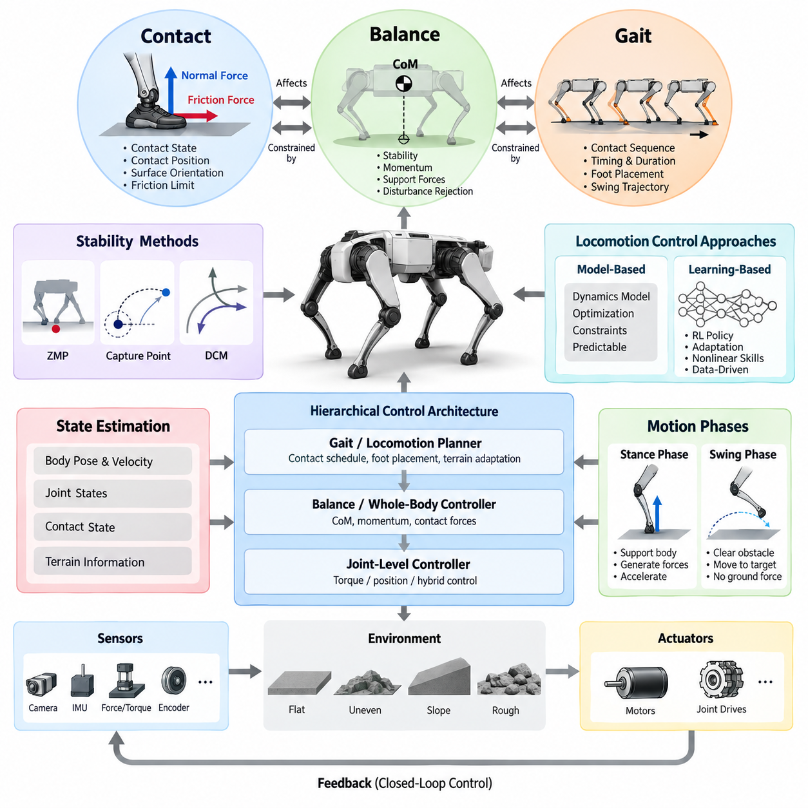
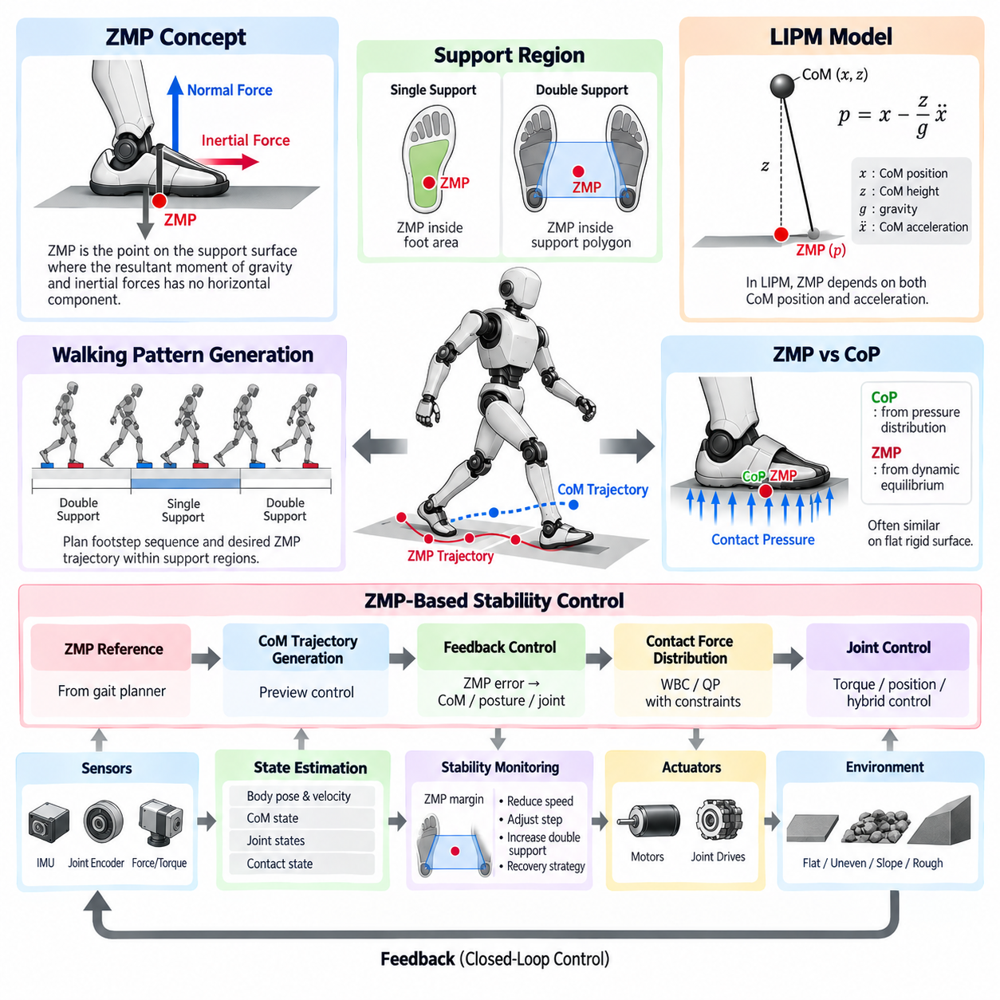
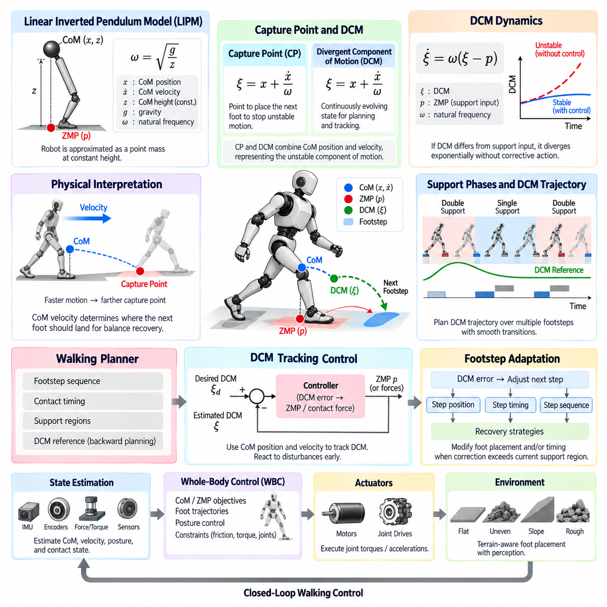
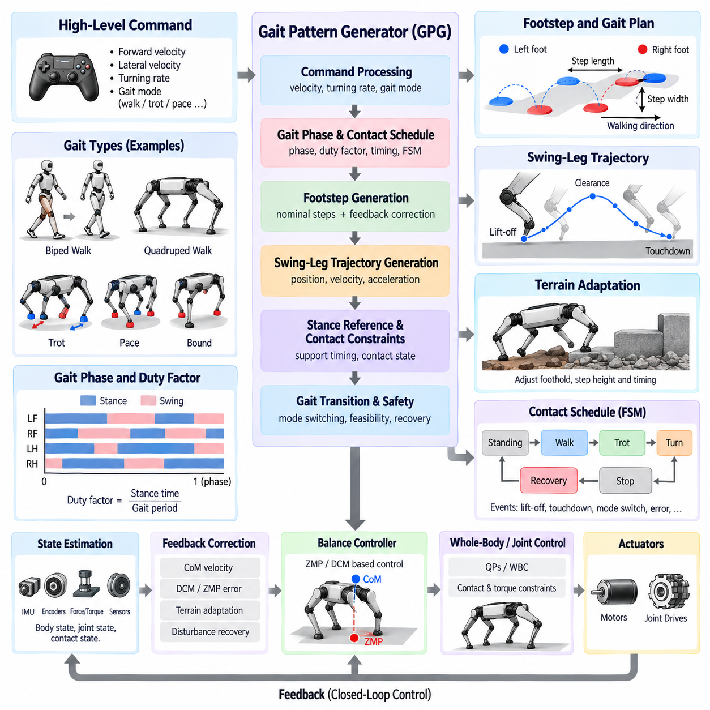
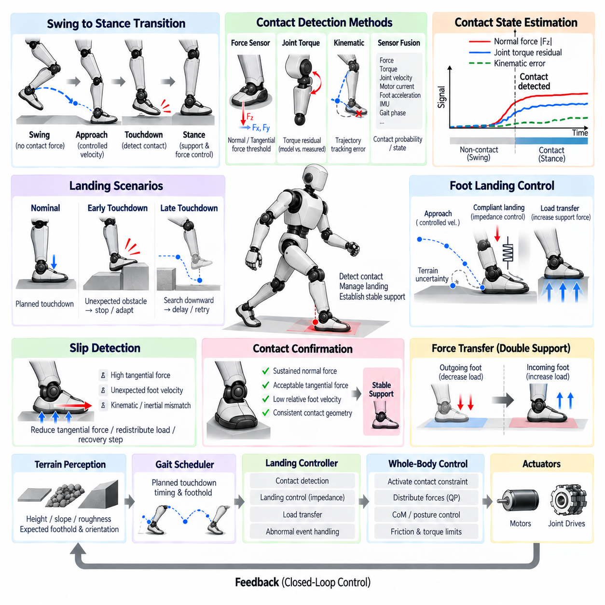
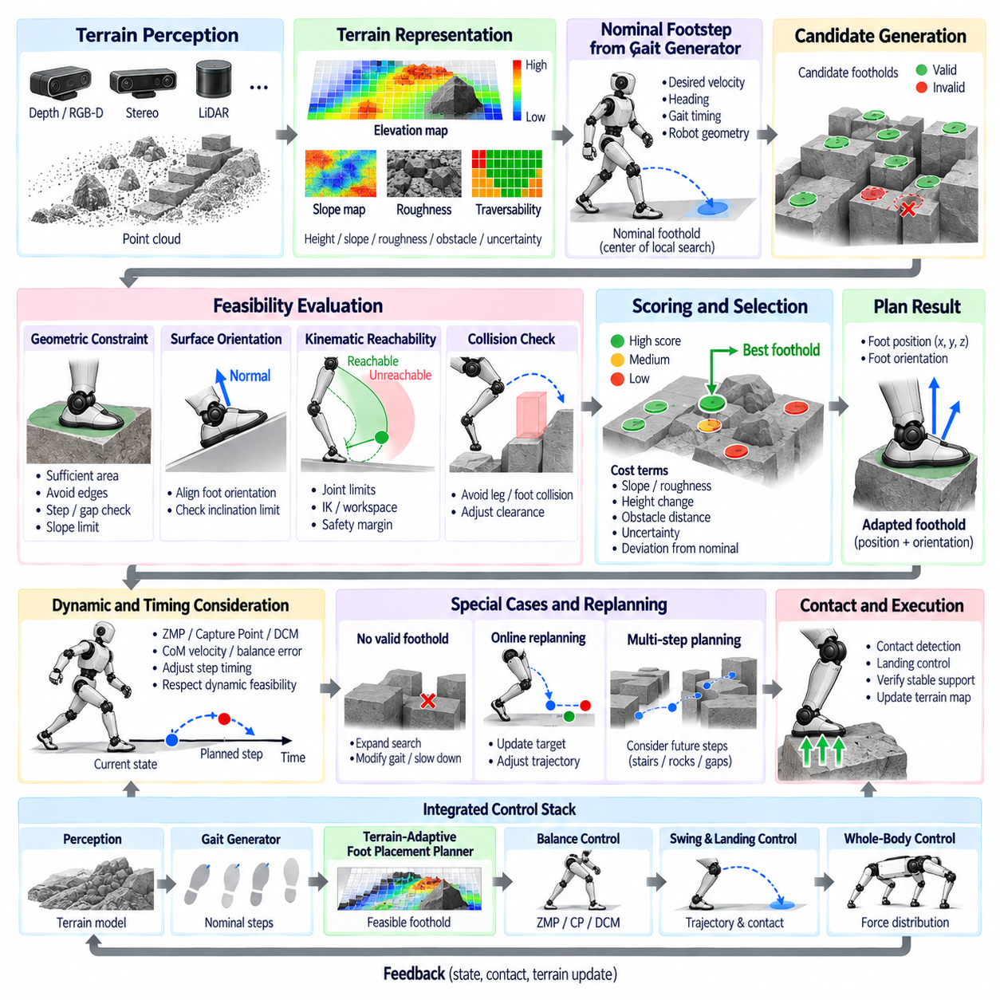
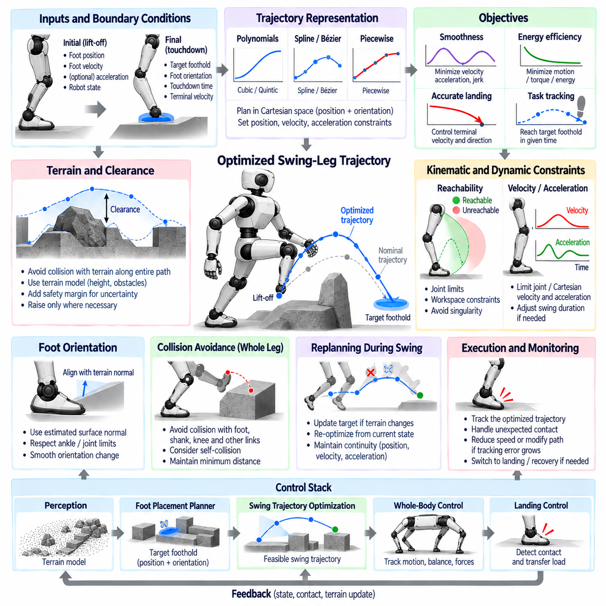
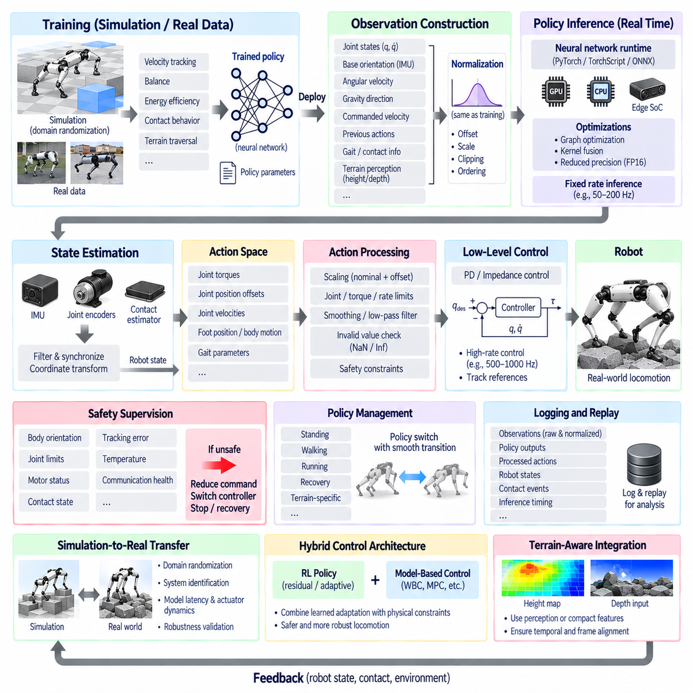
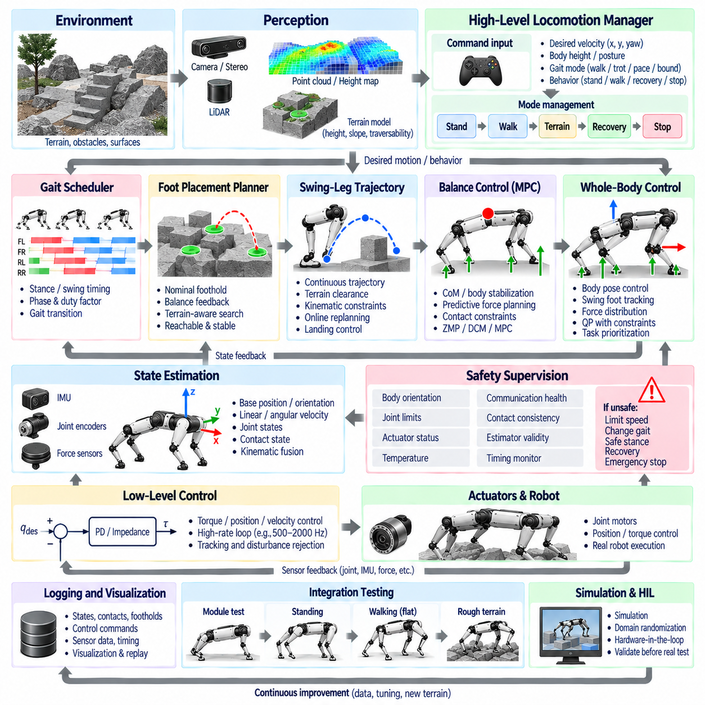
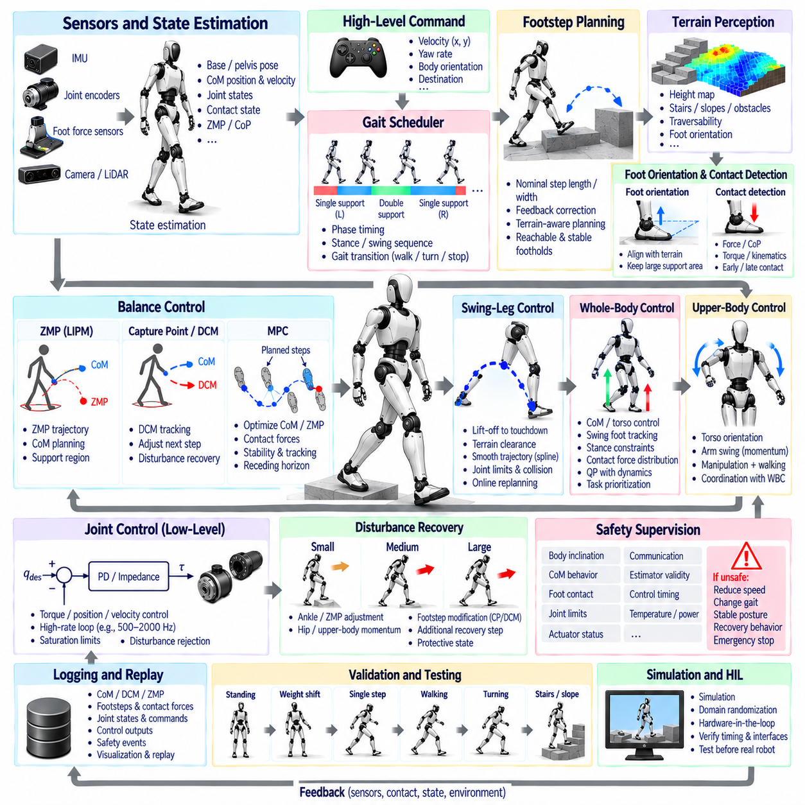

**Volume 04 Robot Control Software**

# 10. Legged Robot Control

## 10.01 Legged Robot Control Overview: Contact, Balance, Gait

{width="7.268055555555556in" height="7.268055555555556in"}

다족 보행 로봇 제어(Legged Robot Control)는 로봇과 환경 사이의 간헐적인 접촉(Intermittent Contact)을 통해 이동이 생성된다는 점에서 바퀴형 플랫폼(Wheeled Platform)의 제어와 근본적으로 다르다. 제어기는 동적 안정성(Dynamic Stability)을 유지하면서 관절 운동(Joint Motion), 지면 반력(Ground Reaction Force), 몸체 자세(Body Posture), 접촉 전환(Contact Transition)을 지속적으로 조정해야 한다. 이러한 요소는 이후 영 모멘트 점(ZMP), 발산 성분 운동(DCM), 보행 생성(Gait Generation), 접촉 감지(Contact Detection), 지형 적응(Terrain Adaptation), 학습 기반 제어(Learning-Based Control)를 이해하기 위한 기반을 형성한다.

다족 보행 이동(Legged Locomotion)을 이해하기 위한 유용한 추상화는 접촉(Contact), 균형(Balance), 보행(Gait)의 세 가지 요소로 구분하는 것이다. 접촉은 어떤 발이 환경과 힘을 교환할 수 있는지를 정의하고, 균형은 이러한 힘이 원하는 몸체 운동을 안정적으로 지지할 수 있는지를 결정하며, 보행은 이동을 생성하기 위해 접촉 상태가 시간에 따라 어떻게 변화하는지를 결정한다. 발걸음 하나의 변화도 지지 기하 구조(Support Geometry), 가능한 접촉력(Contact Force), 미래의 균형 조건을 동시에 변화시키므로 세 요소는 독립적으로 설계될 수 없다.

접촉(Contact)은 단순히 발이 지면에 닿아 있는지를 나타내는 이진 상태(Binary State) 이상의 의미를 가진다. 제어기는 접촉 위치(Contact Position), 표면 방향(Surface Orientation), 수직력(Normal Force), 접선력(Tangential Force), 마찰 한계(Friction Limit), 그리고 접촉이 안정적인지 또는 미끄러지는지를 판단해야 한다. 따라서 접촉 제약(Contact Constraint)은 로봇 동역학(Robot Dynamics)을 환경의 기하학적 특성과 직접 연결하며, 제어 소프트웨어는 추정된 접촉 상태를 기반으로 지지력을 생성할 다리와 스윙 운동(Swing Motion)을 수행할 다리를 결정한다.

지면 반력(Ground Reaction Force)은 다족 보행 로봇이 부유 베이스(Floating Base)를 제어할 수 있도록 하는 핵심적인 물리적 메커니즘이다. 고정형 매니퓰레이터(Fixed Manipulator)와 달리 로봇의 몸체는 세계 좌표계(World Frame)에 직접 고정되어 있지 않기 때문에 관절 토크(Joint Torque)만으로 베이스를 임의로 움직일 수 없다. 대신 액추에이터 토크(Actuator Torque)가 다리의 힘을 생성하고, 이 힘이 지형과 상호작용하면서 발생하는 반력이 몸체의 선형 및 각가속도(Linear and Angular Acceleration)를 만들어 낸다.

균형 제어(Balance Control)는 명령된 운동이 동역학적으로 실행 가능한 상태를 유지하도록 로봇의 질량 중심(CoM), 몸체 방향(Body Orientation), 운동량(Momentum), 지지력(Support Force)을 조절한다. 정적 균형(Static Balance)은 지지 영역(Support Region)을 이용한 기하학적 관계로 설명할 수 있지만, 걷기와 달리기에서는 운동량과 가속도를 고려하는 동적 안정성 기준(Dynamic Stability Criterion)이 필요하다. 따라서 실제 제어기는 상태 추정(State Estimation), 동역학 모델(Dynamic Model), 예측 및 피드백 제어(Predictive and Feedback Control)를 결합하여 외란과 모델 오차를 지속적으로 보상한다.

질량 중심(Center of Mass)은 로봇 전체의 병진 동역학(Translational Dynamics)을 압축하여 표현하고, 중심 동역학 운동량(Centroidal Momentum)은 로봇 전체의 선형 및 각운동(Linear and Angular Motion)을 나타낸다. 이러한 물리량을 제어하면 상위 수준의 균형 제어기가 모든 관절 궤적을 직접 지정하지 않고도 전신 운동(Whole-Body Motion)을 다룰 수 있다. 원하는 질량 중심 가속도와 운동량 변화는 접촉력 목표(Contact Force Objective)로 변환되고 최종적으로 관절 수준의 토크, 위치 또는 하이브리드 명령(Hybrid Command)으로 전달된다.

운동 조건에 따라 서로 다른 안정성 표현(Stability Representation)이 활용될 수 있다. 영 모멘트 점(Zero Moment Point, ZMP)은 보행 중 동적 지지 안정성을 분석하기 위한 전통적인 프레임워크를 제공하며, 캡처 포인트(Capture Point)와 발산 성분 운동(Divergent Component of Motion, DCM)은 불안정한 질량 중심 동역학과 복구 가능한 발 배치(Foot Placement) 사이의 관계를 설명한다. 이러한 개념은 다족 보행 제어에서 안정성 판단과 보행 복구 전략을 체계화하는 핵심적인 이론적 기반이 된다.

보행(Gait)은 다리 접촉의 시간적 및 공간적 구성(Temporal and Spatial Organization)을 의미한다. 이족 로봇(Biped Robot)은 일반적으로 단일 지지(Single Support)와 이중 지지(Double Support)를 교대로 사용하며, 사족 로봇(Quadruped Robot)은 워크(Walk), 트롯(Trot), 페이스(Pace), 바운드(Bound) 또는 동적으로 생성된 접촉 시퀀스(Contact Sequence)를 사용할 수 있다. 보행 제어기는 각 다리가 언제 몸체를 지지하고, 언제 지면에서 떨어지며, 스윙 상태를 얼마나 유지하고, 다음 접촉을 어디에 형성할지를 결정한다.

보행 생성(Gait Generation)은 위상 변수(Phase Variable), 접촉 스케줄(Contact Schedule), 유한 상태 기계(Finite-State Machine), 오실레이터(Oscillator), 궤적 생성기(Trajectory Generator), 최적화 기반 플래너(Optimization-Based Planner) 등으로 표현할 수 있다. 명목 보행(Nominal Gait)은 예측 가능한 타이밍을 제공하지만 실제 지형에서는 스케줄을 적응적으로 변경할 수 있어야 한다. 제어기는 상태 추정 결과에 따라 지지 시간을 연장하거나 스윙 시간을 단축하고, 착지 위치를 수정하거나 다음 접촉 자체를 변경할 수 있다.

지지 단계(Stance Phase)와 스윙 단계(Swing Phase)는 서로 다른 제어 목표를 가진다. 지지 단계에서 다리는 제어된 지면 반력을 통해 몸체를 지지하고 가속하는 역할을 수행한다. 반면 스윙 단계에서는 동일한 다리가 지면에 힘을 가하지 않으면서 장애물을 회피하고 목표 발 위치(Target Foothold)로 이동해야 한다. 따라서 견고한 소프트웨어 구조는 접촉 상태에 따라 제약 조건과 제어 목표를 변경하면서도 이륙(Lift-Off)과 착지(Touchdown) 전환 과정에서 제어의 연속성을 유지해야 한다.

발 착지(Foot Landing)는 예측된 접촉 시간과 실제 물리적 접촉 시간이 정확하게 일치하지 않는다는 점에서 특히 중요한 전환 과정이다. 지형 높이의 불확실성, 순응성(Compliance), 관절 추종 오차(Joint Tracking Error), 상태 추정 오차로 인해 예상보다 빠르거나 늦은 착지가 발생할 수 있다. 힘, 토크, 관절 거동, 관성 측정값 또는 융합 신호(Fused Signal)에 기반한 접촉 감지(Contact Detection)는 실제 착지를 식별하고 제어기가 안전하게 지지 상태로 전환하도록 한다.

발 배치(Foot Placement)는 보행 생성과 균형 복구(Balance Recovery)를 직접 연결한다. 명목 발 위치(Nominal Foothold)는 목표 속도와 보행 기하 구조를 이용하여 계산할 수 있지만, 피드백 보정(Feedback Correction)은 몸체 속도, 질량 중심 오차, 각운동 또는 예측된 불안정성에 따라 이 위치를 수정한다. 불규칙한 지형에서는 인지(Perception) 결과를 추가하여 표면 높이, 경사, 거칠기, 발 여유 공간(Clearance), 예상 지지 품질에 따라 후보 발 위치를 제한해야 한다.

스윙 다리 제어(Swing-Leg Control)는 연속적인 지지 구성(Support Configuration)을 연결한다. 스윙 궤적은 충분한 지면 여유 높이(Ground Clearance), 허용 가능한 관절 속도와 가속도, 정확한 최종 위치, 안정적인 지지력 형성과 호환되는 착지 조건을 제공해야 한다. 다항식 곡선(Polynomial Curve), 스플라인(Spline), 베지어 궤적(Bézier Trajectory), 최적화 기법(Optimization Method) 등을 사용할 수 있으며, 고급 제어에서는 이동 중 목표 발 위치가 변경될 경우에도 궤적을 온라인으로 수정할 수 있다.

소프트웨어 관점에서 다족 보행 제어는 자연스럽게 계층적 구조(Hierarchical Architecture)를 형성한다. 상태 추정기는 몸체 자세, 속도, 관절 상태, 접촉 상태, 지형 정보를 제공하고, 보행 또는 이동 플래너(Gait or Locomotion Planner)는 접촉 타이밍과 발 위치를 결정한다. 균형 제어기 또는 전신 제어기(Whole-Body Controller)는 실행 가능한 몸체 운동과 접촉력을 계산하며, 관절 수준 제어기(Joint-Level Controller)는 이를 실제 액추에이터 명령으로 변환한다.

모델 기반 제어(Model-Based Control)와 학습 기반 제어(Learning-Based Control)는 이러한 계층 구조에서 점차 함께 사용되고 있다. 고전적인 동역학 모델은 명시적인 물리 제약(Physical Constraint), 해석 가능한 안정성 지표, 예측 가능한 인터페이스를 제공하는 반면, 강화학습(Reinforcement Learning, RL) 정책은 대규모 시뮬레이션을 통해 복잡한 비선형 다리 협조와 환경 적응을 학습할 수 있다. 실제 시스템에서는 결정론적 상태 추정, 안전 기능, 접촉 처리, 액추에이터 인터페이스를 유지하면서 일부 이동 의사결정이나 명령 생성에 학습된 정책을 통합할 수 있다.

실시간 실행(Real-Time Execution)은 접촉과 균형의 오차가 매우 빠르게 전파되기 때문에 필수적이다. 상태 추정, 보행 위상 업데이트, 접촉력 최적화(Contact Force Optimization), 전신 제어, 관절 명령 생성은 제한된 지연 시간(Bounded Latency)과 충분히 일정한 주기로 실행되어야 한다. 센서 동기화(Sensor Synchronization)와 액추에이터 통신 역시 중요하며, 지연된 접촉 정보나 오래된 관성 측정값은 올바르게 설계된 제어기조차 이미 변화한 물리 상태에 반응하도록 만들 수 있다.

궁극적으로 접촉(Contact), 균형(Balance), 보행(Gait)은 하나의 폐루프 이동 사이클(Closed-Loop Locomotion Cycle)을 형성한다. 보행은 의도된 접촉 순서를 결정하고, 접촉은 물리적으로 생성 가능한 힘을 정의하며, 균형 제어는 이러한 힘을 이용하여 부유 몸체를 어떻게 조절할지를 결정한다. 그 결과 발생한 로봇 운동은 다시 다음 보행 결정을 위한 상태를 변화시키며, 이러한 결합된 관점은 ZMP와 DCM에서부터 보행 생성, 착지 제어, 지형 적응형 발 배치, 궤적 최적화, 강화학습 통합, 완전한 다족 보행 로봇 제어 스택(Full Legged-Robot Control Stack)으로 발전하기 위한 개념적 기반을 제공한다.

## 10.02 ZMP-Based Stability Control [w/Code]

{width="7.268055555555556in" height="7.268055555555556in"}

영 모멘트 점 기반 안정성 제어(ZMP-Based Stability Control)는 다족 보행 로봇(Legged Robot), 특히 이족 보행(Biped Walking)에서 동적 균형(Dynamic Balance)을 유지하기 위한 전통적인 제어 프레임워크이다. 질량 중심(CoM)의 투영점이 정적으로 지지 영역(Support Region) 내부에 존재하도록 요구하는 대신, ZMP는 중력(Gravity)과 관성력(Inertial Force)의 결합 효과를 고려한다. 이를 통해 로봇이 보행 중 가속, 감속, 하중 이동, 지지 접촉 변경을 수행하는 상황에서도 안정성을 판단할 수 있다.

영 모멘트 점(Zero Moment Point, ZMP)은 중력과 관성력에 의해 발생하는 합성 모멘트(Resultant Moment)의 수평 성분이 0이 되는 지지면상의 지점으로 정의된다. ZMP가 실행 가능한 지지 영역(Feasible Support Region) 내부에 유지되면 지면 반력(Ground Reaction Force)은 일반적으로 지지 발이나 접촉 구성이 경계점을 중심으로 회전하지 않으면서 필요한 균형 모멘트를 생성할 수 있다. 따라서 ZMP는 로봇 동역학(Robot Dynamics), 접촉력(Contact Force), 지지 기하 구조(Support Geometry)를 연결하는 실용적인 기준을 제공한다.

로봇이 하나의 평평한 발로 서 있는 경우 실행 가능한 ZMP 영역은 대략 해당 발의 접촉 영역(Contact Area)에 해당한다. 이중 지지(Double Support) 동안에는 두 지지 접촉의 결합된 기하 구조에 따라 허용 영역이 확장되며 일반적으로 지지 다각형(Support Polygon)으로 표현된다. 안정성 제어기는 목표 ZMP와 추정 ZMP를 이 영역과 비교하고, 외란(Disturbance), 모델링 오차(Modeling Error), 접촉 불확실성(Contact Uncertainty)에 대한 강건성(Robustness)을 높이기 위해 경계로부터 적절한 안정성 여유를 유지한다.

압력 중심(Center of Pressure, CoP)과 ZMP는 밀접한 관계가 있지만 서로 다른 관점에서 정의된다. CoP는 접촉면 아래에 분포된 압력이 실질적으로 작용하는 위치를 나타내는 반면, ZMP는 로봇의 동적 평형(Dynamic Equilibrium)으로부터 계산된다. 평평하고 정지된 표면과의 강체 접촉(Rigid Contact)과 같은 일반적인 가정에서는 두 위치가 일치할 수 있다. 따라서 실제 소프트웨어에서는 힘과 토크 측정값을 이용하여 접촉 압력 거동을 추정하고 예측된 ZMP 운동을 검증할 수 있다.

단순화된 ZMP 모델은 선형 역진자 모델(Linear Inverted Pendulum Model, LIPM)을 이용하여 유도할 수 있다. 로봇의 분포 질량(Distributed Mass)을 질량 중심에 위치한 하나의 점질량(Point Mass)으로 근사하고, 수직 방향의 CoM 높이가 거의 일정하다고 가정하며, 각운동량(Angular Momentum)의 영향을 단순화한다. 이러한 가정에서는 수평 CoM 가속도가 CoM 위치와 ZMP 위치의 차이에 직접 연결되므로 보행 패턴 생성(Walking Pattern Generation)과 실시간 피드백 제어(Real-Time Feedback Control)에 적합한 간결한 동역학 모델을 구성할 수 있다.

하나의 수평 방향에 대한 LIPM 관계식은 일반적으로 p = x - (z/g)ẍ로 표현된다. 여기서 p는 ZMP 위치, x는 수평 방향 CoM 위치, z는 가정된 CoM 높이, g는 중력 가속도(Gravitational Acceleration), ẍ는 수평 방향 CoM 가속도이다. 동일한 원리가 직교하는 다른 수평 방향에도 적용된다. 이 관계식은 ZMP가 CoM 위치뿐만 아니라 가속도에도 의존한다는 것을 보여주며, 동적 균형(Dynamic Balance)이 정적 균형(Static Balance)과 근본적으로 다른 이유를 설명한다.

ZMP 기반 보행 제어(ZMP-Based Walking Control)는 일반적으로 계획된 발걸음 시퀀스(Footstep Sequence)와 이에 대응하는 지지 단계(Support Phase)에서 시작한다. 보행 생성기(Gait Generator)는 각 발이 언제 접촉을 시작하거나 종료하는지를 정의하고, 형성된 지지 영역 내부에서 목표 ZMP 궤적(Desired ZMP Trajectory)을 생성한다. 단일 지지(Single Support)에서는 일반적으로 기준 ZMP가 지지 발 내부에 유지되고, 이중 지지에서는 두 발 사이를 이동한다. 불연속적인 ZMP 명령은 비현실적인 CoM 가속도나 급격한 접촉력 변화를 요구할 수 있으므로 부드러운 전환이 중요하다.

목표 ZMP 궤적이 정의되면 이 궤적과 동역학적으로 일관된 CoM 궤적(CoM Trajectory)을 생성해야 한다. 프리뷰 제어(Preview Control)는 계획된 발걸음으로부터 미래의 ZMP 기준을 미리 알 수 있기 때문에 널리 사용되는 방법이다. 제어기는 현재의 추종 오차에만 반응하는 대신 일정한 미래 구간의 기준값을 고려하여 이후의 지지 전환을 미리 반영한 CoM 운동을 계산한다. 이를 통해 반복적인 보행 과정에서 움직임을 부드럽게 하고 추종 오차(Tracking Error)를 감소시킬 수 있다.

실제 ZMP 피드백 루프(ZMP Feedback Loop)는 기준 궤적과 추정된 로봇 상태 및 접촉 측정값을 결합한다. 목표 ZMP는 보행 플래너(Gait Planner)가 생성하고, 실제 또는 추정 ZMP는 힘 센싱(Force Sensing), 동역학 추정(Dynamic Estimation) 또는 두 방법의 결합을 통해 계산한다. 두 값의 차이는 균형 오차(Balance Error)가 되어 CoM 가속도, 몸체 자세, 발목 토크(Ankle Torque), 관절 기준값 또는 전신 제어(Whole-Body Control) 목표를 수정하는 데 사용된다. 실제 접촉 조건을 이상적인 계획 궤적만으로 완전히 표현할 수 없기 때문에 피드백은 필수적이다.

발목 제어(Ankle Control)는 중간 수준의 ZMP 오차를 보정하기 위한 중요한 방법 중 하나이다. 발목 토크와 발-지면 압력 분포(Foot-Ground Pressure Distribution)를 변화시키면 계획된 발걸음을 즉시 변경하지 않고도 유효 지지점(Effective Support Point)을 이동시킬 수 있다. 발목의 제어 능력만으로 충분하지 않은 경우에는 엉덩이 전략(Hip Strategy)과 전신 전략(Whole-Body Strategy)을 이용하여 각운동량과 몸체 방향을 추가로 조절할 수 있다. 따라서 현대적인 구현에서는 ZMP 조절을 독립적인 발목 제어 알고리즘이 아니라 전신 운동의 일부로 취급한다.

접촉력 제약(Contact-Force Constraint)은 ZMP 목표와 물리적으로 일관되어야 한다. 수학적으로 유효한 기준이라도 음의 수직력(Negative Normal Force), 과도한 접선력(Excessive Tangential Force), 마찰 한계(Friction Limit) 위반 또는 액추에이터의 가용 범위를 초과하는 토크를 요구한다면 실제로 구현할 수 없다. 전신 제어(Whole-Body Control, WBC) 또는 이차 계획법(Quadratic Programming, QP)은 마찰 원뿔(Friction Cone), 토크 한계, 관절 제약, 운동 목표를 만족시키면서 활성 접촉 사이에 필요한 힘을 분배할 수 있다. 따라서 ZMP는 제약 기반 제어기 내부에서 상위 수준의 안정성 기준으로 활용될 수 있다.

상태 추정(State Estimation)의 품질은 ZMP 제어 성능에 직접적인 영향을 준다. 제어기는 몸체 방향, CoM 위치와 속도, 관절 구성(Joint Configuration), 접촉 상태에 대한 신뢰성 높은 추정값을 필요로 한다. 관성 측정 장치(Inertial Measurement Unit, IMU), 관절 엔코더(Joint Encoder), 발 힘 센서(Foot Force Sensor), 힘/토크 센서(Force/Torque Sensor)를 융합하여 이러한 상태를 계산할 수 있다. 센서 잡음과 통신 지연은 신중하게 필터링해야 하며, 과도한 필터링은 위상 지연(Phase Delay)을 발생시키고 부족한 필터링은 고대역폭 균형 루프에서 진동성 보정을 유발할 수 있다.

발 접촉 전환(Foot-Contact Transition)은 이륙(Lift-Off)과 착지(Touchdown) 과정에서 지지 영역이 빠르게 변화하기 때문에 특히 어렵다. 소프트웨어가 접촉 제약을 너무 빠르거나 늦게 전환하면 계산된 ZMP 영역이 실제 물리적 지지 상태를 정확하게 나타내지 못할 수 있다. 강건한 구현에서는 보행 위상(Gait Phase), 접촉 감지(Contact Detection), 측정된 수직력, 전환 로직(Transition Logic)을 함께 조정한다. 접촉 사이에서 목표 힘을 점진적으로 전달하면 이중 지지에서 단일 지지로 또는 단일 지지에서 이중 지지로 전환할 때 발생하는 불연속성을 줄일 수 있다.

ZMP 안정성 여유(ZMP Stability Margin)는 유용한 상위 수준의 감독 지표(Supervisory Measure)를 제공한다. 단순히 ZMP가 지지 다각형 내부에 있는지만 검사하는 대신, 제어기는 ZMP와 다각형 경계 사이의 거리를 평가할 수 있다. 안정성 여유가 감소한다는 것은 사용 가능한 보정 능력(Corrective Authority)이 줄어들고 있음을 의미한다. 시스템은 현재 접촉 구성이 복구 불가능한 상태에 도달하기 전에 보행 속도를 낮추거나 CoM 운동을 수정하고, 이중 지지 시간을 늘리거나 다음 발 위치를 조정하거나 다른 복구 전략(Recovery Strategy)을 실행할 수 있다.

기본적인 ZMP 제어가 사용하는 가정은 동시에 이 방법의 한계를 정의한다. 평평하고 강체인 지형, 알려진 접촉 상태, 거의 일정한 CoM 높이, 제한된 각운동량은 문제를 단순화하지만 동적인 이동에서는 이러한 가정이 위반될 수 있다. 달리기, 점프, 심하게 불규칙한 지형, 좁은 접촉 영역, 빠른 몸체 회전, 큰 수직 가속도에서는 더욱 풍부한 동역학 표현이 필요하다. 이러한 조건에서는 중심 동역학(Centroidal Dynamics), 접촉력 최적화(Contact-Force Optimization), 모델 예측 제어(Model Predictive Control, MPC), 캡처 포인트(Capture Point), 발산 성분 운동(Divergent Component of Motion, DCM) 방법이 단순화된 ZMP 기법을 보완하거나 대체할 수 있다.

완전한 다족 보행 로봇 제어 스택(Legged-Robot Control Stack)에서 ZMP는 안정성 기준(Stability Criterion)이면서 동시에 보행 계획(Gait Planning)과 동적 제어(Dynamic Control)를 연결하는 인터페이스로 이해할 수 있다. 발걸음 계획(Footstep Planning)은 미래의 지지 기하 구조를 결정하고, ZMP 플래너(ZMP Planner)는 동역학적으로 의미 있는 지지 기준을 생성하며, CoM 제어는 이에 적합한 몸체 운동을 생성한다. 이후 하위 수준의 전신 제어기와 관절 제어기가 필요한 힘과 토크를 구현하며, 이러한 계층적 구조는 캡처 포인트 및 DCM 기반 보행 제어, 보행 생성, 접촉 인식 착지, 지형 적응형 이동(Terrain-Adaptive Locomotion)으로 발전하기 위한 기반을 제공한다.

## 10.03 Capture Point and DCM-Based Walking Control [w/Code]

{width="7.268055555555556in" height="7.268055555555556in"}

캡처 포인트(Capture Point, CP) 및 발산 성분 운동(Divergent Component of Motion, DCM) 기반 보행 제어는 보행 중 다족 보행 로봇(Legged Robot)의 불안정한 운동 성분이 어떻게 변화하는지를 명시적으로 표현하는 동적 안정성 프레임워크(Dynamic Stability Framework)를 제공한다. 주로 영 모멘트 점(Zero Moment Point, ZMP)을 지지 영역 내부에서 조절하는 방법과 달리 CP와 DCM은 질량 중심(CoM)의 위치와 속도를 미래의 균형 상태와 직접 연결한다. 따라서 발걸음 조정, 외란 복구(Disturbance Recovery), 동적으로 반응하는 이족 보행(Biped Locomotion)에 특히 유용하다.

기본 개념은 일반적으로 선형 역진자 모델(Linear Inverted Pendulum Model, LIPM)에서 유도되며, 로봇은 지면으로부터 거의 일정한 CoM 높이에 위치하는 하나의 점질량(Point Mass)으로 근사된다. 각운동량(Angular Momentum)과 수직 운동을 단순화한다고 가정하면 수평 동역학에는 안정 성분(Stable Component)과 불안정 성분(Unstable Component)이 함께 존재한다. 적절한 지면 반력(Ground Reaction Force)이나 미래 접촉(Future Contact)을 선택하지 않으면 불안정 성분이 자연스럽게 발산하며, 이러한 특성으로부터 CP와 DCM의 개념이 정의된다.

일정한 CoM 높이 z에 대해 역진자의 고유 주파수(Natural Frequency)는 일반적으로 ω = √(g/z)로 정의되며, 여기서 g는 중력 가속도(Gravitational Acceleration)를 나타낸다. 하나의 수평 방향에서 캡처 포인트(Capture Point)는 ξ = x + ẋ/ω로 표현할 수 있으며, x는 CoM 위치, ẋ는 CoM 속도이다. 이 식은 위치와 속도를 하나의 상태로 결합하여 단순화된 모델에서 불안정한 CoM 운동을 정지시키기 위해 최종적으로 지지가 형성되어야 하는 위치를 나타낸다.

캡처 포인트의 물리적 의미는 보행 제어 관점에서 직관적이다. 로봇이 이동하면서 균형을 잃기 시작할 때 CoM의 수직 투영점만 확인해서는 다음 발이 어디에 착지해야 하는지를 결정할 수 없다. CoM 속도도 함께 고려해야 한다. 캡처 포인트는 불안정한 운동을 정지 상태로 유도하는 것과 관련된 지면상의 위치를 추정한다. 몸체의 이동 속도가 빠를수록 필요한 캡처 위치(Capture Location)는 진행 방향으로 더 멀리 이동하므로 균형 복구와 발 배치(Foot Placement)가 자연스럽게 연결된다.

발산 성분 운동(Divergent Component of Motion, DCM)은 이러한 개념을 지속적으로 변화하는 동적 상태(Dynamic State)로 일반화한다. 기본적인 LIPM 공식에서 DCM은 일반적으로 동일한 식 ξ = x + ẋ/ω로 정의된다. ξ를 단순히 최종적인 캡처 위치로 해석하는 대신 DCM 제어에서는 이를 이동 과정 전체에서 계획하고 추종할 수 있는 궤적(Trajectory)으로 취급한다. 따라서 DCM은 연속적인 지지 단계, 지속적인 보행, 여러 발걸음 사이의 전환을 조정하는 데 특히 적합하다.

DCM 동역학은 ZMP 또는 이에 상응하는 다른 지지 입력(Support Input)과 직접 연결할 수 있다. 기본적인 LIPM에서는 ξ̇ = ω(ξ − p)로 표현할 수 있으며, 여기서 p는 ZMP를 나타낸다. 이 식은 시스템의 발산 특성(Divergent Nature)을 보여준다. DCM과 지지 입력 사이에 차이가 존재하면 적절한 보정이 없을 경우 그 차이는 지수적으로 증가하는 경향을 가진다. 따라서 안정적인 보행을 위해서는 ZMP 거동, DCM 변화 또는 미래 접촉 위치를 의도적으로 조절해야 한다.

DCM 보행 플래너(DCM Walking Planner)는 일반적으로 목표 발걸음 시퀀스(Footstep Sequence)와 접촉 타이밍(Contact Timing)에서 시작한다. 각각의 지지 단계는 ZMP 또는 이에 상응하는 접촉력 합력(Contact-Force Resultant)을 제어할 수 있는 실행 가능 영역을 정의한다. 원하는 최종 조건에서 역방향으로 계산함으로써 플래너는 미래의 여러 지지 단계에 걸친 DCM 기준 궤적(DCM Reference Trajectory)을 생성할 수 있다. 이러한 역방향 계획(Backward Planning)은 불안정 동역학을 안정적으로 계획하기 위해 미래의 접촉 정보가 필요하다는 특성을 활용한다.

단일 지지(Single Support) 동안 DCM 기준은 선택된 지지 위치와 타이밍에 따라 변화한다. 이중 지지(Double Support)에서는 기준값을 하나의 지지 발에서 다음 지지 발 방향으로 부드럽게 전환할 수 있다. 실제 궤적 생성기(Trajectory Generator)는 접촉 전환 시 급격한 명령 변화를 발생시키는 대신 연속적인 보간(Continuous Interpolation)이나 동역학적으로 일관된 전환 모델을 사용한다. 부드러운 DCM 변화는 필요한 지면 반력의 급격한 변화를 줄이고 전신 및 관절 수준 제어기와의 연계성을 향상시킨다.

DCM 추종 제어기(DCM Tracking Controller)는 목표 DCM과 측정 또는 추정된 CoM 위치 및 속도로부터 계산된 추정 DCM을 비교한다. 이 차이로부터 발생하는 오차는 보정 ZMP 명령(Corrective ZMP Command)이나 접촉력 목표(Contact-Force Objective)로 변환할 수 있다. DCM에는 속도 정보가 포함되어 있으므로 외부 충격이나 추종 오차에 의해 발생하는 편차를 위치만 사용하는 균형 지표보다 빠르게 확인할 수 있다. 따라서 CoM 변위가 지나치게 커지기 전에 보행 제어기가 대응할 수 있다.

현재 지지 영역 내부에 충분한 제어 권한(Control Authority)이 남아 있다면 발목 및 전신 동작을 이용하여 발걸음 계획을 변경하지 않고도 ZMP를 조절하고 DCM을 기준값으로 복귀시킬 수 있다. 제어기는 접촉 압력을 재분배하거나 몸체 가속도를 수정하고 각운동량을 조절할 수 있다. 그러나 사용 가능한 ZMP는 물리적인 지지 영역에 의해 제한된다. 필요한 보정량이 이 영역의 한계에 접근하거나 초과하면 다음 발 위치를 수정하는 것이 중요한 복구 방법이 된다.

따라서 발걸음 적응(Footstep Adaptation)은 CP 및 DCM 기반 제어의 핵심적인 장점이다. 측정된 DCM 오차를 미래 방향으로 전파하여 다음 발 위치가 얼마나 변경되어야 하는지를 추정할 수 있다. 제어기는 발걸음을 전방, 후방 또는 측면으로 이동시킬 수 있으며 보폭 타이밍(Step Timing)도 수정할 수 있다. 위치 적응(Position Adaptation)은 미래의 지지 기하 구조를 변화시키고, 타이밍 적응(Timing Adaptation)은 다음 접촉까지 불안정 동역학이 발전하는 시간을 변화시킨다. 두 방법을 결합하면 각각을 독립적으로 사용하는 것보다 더 큰 복구 능력을 확보할 수 있다.

DCM의 발산은 시간에 대해 지수적인 특성을 가지므로 보폭 타이밍은 매우 큰 영향을 미친다. 지지 단계 초기에 발생한 작은 외란도 로봇이 다음 접촉을 지나치게 늦게 형성하면 크게 증가할 수 있다. 반대로 스윙 다리(Swing Leg)가 필요한 위치까지 물리적으로 도달할 수 있다면 착지(Touchdown)를 앞당겨 발산을 제한할 수 있다. 따라서 실제 제어에서는 수정된 발걸음을 적용하기 전에 스윙 다리 운동학, 관절 속도와 가속도 한계, 이용 가능한 지형, 충돌 제약(Collision Constraint), 액추에이터 성능을 함께 고려해야 한다.

캡처 포인트 기반 판단(Capture Point Reasoning)은 다단계 복구(Multi-Step Recovery)에도 적용할 수 있다. 외란의 크기가 너무 크면 현재의 지지 다각형이나 한 번의 수정된 발걸음만으로 보상하기 어려울 수 있다. 실행 불가능한 즉각적인 보정을 강제로 적용하는 대신 제어기는 여러 개의 미래 발걸음에 걸쳐 복구 동작을 분산할 수 있다. 각각의 새로운 접촉은 지지 기하 구조를 변경하고 추가적인 제어 능력을 제공하므로, 실행 가능한 보폭, 타이밍, 접촉력, 관절 운동을 유지하면서 불안정한 운동을 점진적으로 감소시킬 수 있다.

정확한 상태 추정(State Estimation)은 DCM이 CoM 속도에 명시적으로 의존하기 때문에 매우 중요하다. 일반적으로 속도는 위치보다 센서 잡음과 추정 오차에 더 민감하다. 관성 측정 장치(Inertial Measurement Unit, IMU), 관절 엔코더(Joint Encoder), 운동학 모델(Kinematic Model), 접촉 센싱(Contact Sensing), 경우에 따라 외부 인지(External Perception)를 융합하여 부유 베이스 운동(Floating-Base Motion)과 CoM 상태를 추정한다. 과도한 지연은 빠르게 변화하는 이동 과정에서 오래된 DCM 상태에 제어기가 반응하게 만들 수 있으므로 필터링에서는 잡음 억제와 지연 사이의 균형이 필요하다.

DCM 명령은 일반적으로 개별 관절에 직접 전달되지 않고 전신 제어(Whole-Body Control, WBC)와 통합된다. 보행 제어기는 원하는 CoM 거동, ZMP 또는 접촉력 목표, 발 궤적(Foot Trajectory), 자세 목표(Posture Target)를 생성한다. 이후 WBC 또는 최적화 계층(Optimization Layer)이 접촉 제약, 마찰 한계, 액추에이터 한계, 운동학적 목표를 만족하면서 실행 가능한 관절 토크나 가속도를 계산한다. 이를 통해 상위 수준의 동적 안정성 조절과 세부적인 다관절 협조(Multi-Joint Coordination)를 분리할 수 있다.

캡처 포인트 및 DCM 제어는 정상적인 보행을 넘어 외란 제거(Disturbance Rejection)와 지형 적응형 이동(Terrain-Adaptive Locomotion)으로 자연스럽게 확장된다. 인지 시스템(Perception System)은 후보 발 위치를 안정적인 지형으로 제한할 수 있으며, 균형 제어기는 어떤 후보가 동적 복구 조건을 만족하는지 판단한다. 정상적인 보행 패턴 내부에서 실행 가능한 발 위치가 존재하지 않으면 시스템은 보폭, 이동 방향, 타이밍 또는 접촉 순서를 변경할 수 있다. 이에 따라 균형 제어는 접촉 계획(Contact Planning) 및 환경 인지(Environmental Perception)와 긴밀하게 결합된다.

다족 보행 로봇 제어 스택(Legged-Robot Control Stack)에서 CP 및 DCM 기법은 ZMP 기반 안정성 개념과 보다 발전된 보행 및 발 배치 제어를 연결하는 역할을 한다. ZMP는 기존 접촉 내부에서 지지력을 어떻게 조절할 수 있는지를 설명하는 반면, CP와 DCM은 현재의 CoM 운동이 미래의 균형과 필요한 접촉에 어떤 영향을 미치는지를 명확하게 나타낸다. 이들을 결합하면 보행 패턴 생성(Gait Pattern Generation), 접촉 인식 착지(Contact-Aware Landing), 지형 적응형 발 배치(Terrain-Adaptive Foot Placement), 스윙 다리 최적화(Swing-Leg Optimization), 고급 모델 기반 또는 학습 보조 이동(Learning-Assisted Locomotion)으로 발전하기 위한 체계적인 기반을 제공한다.

## 10.04 Gait Pattern Generator (GPG) SW Design [w/Code]

{width="7.268055555555556in" height="7.268055555555556in"}

보행 패턴 생성기(Gait Pattern Generator, GPG)는 다리의 접촉과 운동 기준값을 하나의 조정된 이동 패턴으로 구성하는 소프트웨어 구성요소이다. 목표 전진 속도, 횡방향 속도, 회전 속도, 이동 모드와 같은 상위 수준 명령을 시간에 따라 변화하는 지지 단계(Support Phase), 접촉 스케줄(Contact Schedule), 발 위치 기준(Foothold Reference), 스윙 다리 궤적(Swing-Leg Trajectory)으로 변환한다. 다족 보행 제어 스택(Legged Control Stack)에서 GPG는 이동 의도와 하위 수준의 균형, 전신 및 관절 제어를 연결한다.

GPG의 핵심 역할은 매 순간 어떤 다리가 지지 상태(Stance)에 있고 어떤 다리가 스윙 상태(Swing)에 있는지를 결정하는 것이다. 접촉 스케줄(Contact Schedule)은 이러한 정보를 시간축에서 표현하며 이륙(Lift-Off), 착지(Touchdown), 단일 지지(Single Support), 이중 지지(Double Support), 다중 다리 지지(Multi-Leg Support)와 같은 이벤트를 정의한다. 균형 제어기와 접촉력 제어기는 현재 어떤 발이 환경과 힘을 교환할 수 있는지 정확하게 알아야 하므로 스케줄은 실제 로봇의 물리적 상태와 동기화되어야 한다.

보행 위상(Gait Phase)은 하나의 이동 주기에서 진행 상태를 간결하게 표현한다. 정규화된 위상 변수(Normalized Phase Variable)는 0에서 1까지 변화하고 하나의 주기가 완료되면 초기화되거나 다시 순환할 수 있다. 각각의 다리는 서로 다른 시간에 지지 및 스윙 구간이 발생하도록 위상 오프셋(Phase Offset)을 사용할 수 있다. 이러한 표현은 위상 관계, 듀티 팩터(Duty Factor), 주기 시간을 변경하여 워크(Walk), 트롯(Trot), 페이스(Pace) 등의 주기적 보행 패턴을 정의할 수 있다는 점에서 특히 유용하다.

듀티 팩터(Duty Factor)는 하나의 보행 주기 중 다리가 지면과 접촉 상태를 유지하는 시간의 비율을 정의한다. 듀티 팩터가 커지면 일반적으로 지지 시간이 길어지고 여러 지지 다리 사이의 중첩 시간이 증가하며, 작은 값은 상대적으로 긴 스윙 구간을 갖는 보다 동적인 이동을 생성한다. GPG 소프트웨어는 스윙 다리 운동에 충분한 시간을 제공하고 실행 가능한 접촉 타이밍을 유지하면서 이동 속도를 조절하기 위해 듀티 팩터를 보행 주파수(Gait Frequency) 및 보폭(Step Length)과 함께 변경할 수 있다.

이족 로봇(Biped Robot)의 경우 보행 생성기는 일반적으로 세심하게 관리되는 이중 지지 전환과 함께 왼발과 오른발의 지지를 교대로 조정한다. 하나의 보행 주기는 왼발 단일 지지, 이중 지지, 오른발 단일 지지, 다시 이중 지지 구간으로 구성될 수 있다. 생성된 타이밍 정보는 영 모멘트 점(Zero Moment Point, ZMP), 캡처 포인트(Capture Point), 발산 성분 운동(Divergent Component of Motion, DCM)의 기준값과 호환되어야 하며, 발 접촉 전환이 동적 균형 제어기가 사용하는 가정을 위반하지 않도록 해야 한다.

사족 로봇(Quadruped Robot)의 보행 생성에서는 더욱 다양한 접촉 상태 조합이 발생한다. 워크(Walk)는 일반적으로 여러 개의 지지 다리를 유지하여 정적 또는 준정적 안정성(Quasi-Static Stability)을 강조하고, 트롯(Trot)은 대각선 방향의 다리 쌍을 함께 조정한다. 페이스(Pace)는 같은 측면의 다리를 조정하며, 바운드(Bound)는 앞다리와 뒷다리 쌍을 각각 조정한다. 재사용 가능한 GPG는 각 보행을 독립적인 로직으로 구현하는 대신 위상 오프셋, 듀티 팩터, 접촉 순서, 전환 파라미터를 이용하여 이러한 패턴을 표현할 수 있다.

명령 처리(Command Processing) 역시 GPG의 중요한 기능이다. 원하는 몸체 속도를 관절 운동에 단순히 직접 대응시킬 수는 없으며, 각각의 미래 발 위치가 명령된 병진 및 회전 운동과 호환되어야 한다. 생성기는 속도 명령을 명목 보폭 변위(Nominal Step Displacement), 진행 방향 변화(Heading Change), 스트라이드 주기(Stride Period), 발 위치(Foothold Location)로 변환한다. 이후 이러한 기준값은 CoM 속도, DCM 오차, 지형 조건 또는 외란 복구 요구에 따라 균형 제어기에 의해 보정될 수 있다.

발걸음 생성(Footstep Generation)은 각각의 스윙 다리가 다음 접촉을 어디에 형성해야 하는지를 결정한다. 명목 발 위치(Nominal Foothold)는 명령된 몸체 운동, 예상 지지 시간, 로봇의 기하 구조, 현재 베이스 상태를 이용하여 계산할 수 있다. 피드백 항(Feedback Term)을 추가하여 속도 오차나 불안정성을 보상하도록 위치를 이동할 수도 있다. 따라서 GPG는 상위 수준의 균형 알고리즘이 기본적인 보행 협조를 손상시키지 않고 발걸음을 수정할 수 있도록 명목 보행 기하 구조와 보정 발 배치(Corrective Foot Placement)를 구분해야 한다.

발 위치와 스윙 구간이 정의되면 GPG는 스윙 다리 궤적 생성기(Swing-Leg Trajectory Generator)에 경계 조건(Boundary Condition)을 제공할 수 있다. 궤적은 이륙 위치 근처에서 시작하여 지형과 충분한 여유 공간을 확보하도록 상승하고 목표 발 위치 방향으로 이동한 뒤 적절한 최종 속도로 지면에 접근한다. 다항식(Polynomial), 스플라인(Spline), 베지어 곡선(Bézier Curve)은 위치, 속도, 가속도 프로파일을 부드럽게 생성할 수 있으며 목표 위치가 변경되는 경우 온라인으로 수정하기에도 적합하다.

지지 기준(Stance Reference)은 스윙 궤적과 다른 방식으로 해석해야 한다. 지지 발은 일반적으로 몸체가 상대적으로 이동하는 동안 지형에 대해 정지된 것으로 취급된다. 따라서 GPG는 지지 발에 자유 공간 궤적(Free-Space Trajectory)을 명령하는 대신 접촉 제약(Contact Constraint)과 지지 단계 타이밍을 유지한다. 하위 수준의 전신 제어(Whole-Body Control)는 이러한 제약을 사용하여 불필요한 발의 병진 이동, 회전 또는 미끄러짐을 제한하면서 관절 운동과 지면 반력(Ground Reaction Force)을 계산한다.

유한 상태 기계(Finite-State Machine, FSM)는 보행 시퀀스를 구성하기 위한 직관적인 소프트웨어 구조를 제공한다. 상태는 정지(Standing), 보행 초기화(Gait Initialization), 지지, 스윙, 전환(Transition), 정지 과정(Stopping), 복구(Recovery) 등을 표현할 수 있으며 이벤트에 의해 상태가 전환된다. FSM 로직은 결정론적 전환 규칙(Deterministic Transition Rule)을 적용하는 데 특히 유용하다. 그러나 위상 기반 표현은 더욱 부드러운 주기적 협조를 제공하므로 실제 GPG에서는 이동 모드에는 FSM을 사용하고 활성 보행 내부에서는 연속적인 위상 변수를 사용하는 방식을 결합할 수 있다.

보행 전환(Gait Transition)은 위상 관계를 직접 변경할 경우 여러 다리의 동시 이륙, 불연속적인 발 위치 또는 불충분한 지지가 발생할 수 있으므로 특별한 처리가 필요하다. 전환 관리자(Transition Manager)는 적절한 동기화 지점을 기다린 후 주파수, 듀티 팩터, 위상 오프셋 또는 접촉 순서를 점진적으로 변경할 수 있다. 예를 들어 워크에서 트롯으로 변경할 때는 현재 하중을 지지하고 있는 접촉을 유지하면서 새로운 대각선 협조를 급격한 지지 손실 없이 시작할 수 있는 구성으로 로봇을 이동시켜야 한다.

접촉 감지(Contact Detection)는 계획된 보행과 실제 물리적 실행 사이의 차이를 보완한다. GPG가 특정 위상에서 착지를 예측하더라도 지형 높이, 순응성(Compliance), 추종 오차 또는 외란으로 인해 실제 착지는 더 빠르거나 늦게 발생할 수 있다. 힘 센싱(Force Sensing), 관절 토크, 운동학적 잔차(Kinematic Residual) 또는 기타 접촉 추정기(Contact Estimator)를 이용하여 실제 접촉을 확인할 수 있다. 이후 소프트웨어는 스윙을 종료하고 지지 제약을 설정하거나 위상 정보를 재설정하고 스케줄을 일시적으로 수정하여 동기화를 유지할 수 있다.

지형 적응형 보행 생성(Terrain-Adaptive Gait Generation)은 인지(Perception) 및 국부 지형 모델(Local Terrain Model)을 사용하여 이러한 메커니즘을 확장한다. 후보 발 위치는 높이, 경사, 거칠기, 장애물 여유 공간, 예상 접촉 품질을 기준으로 평가할 수 있다. 명목 발 위치가 적합하지 않으면 지형 플래너(Terrain Planner)가 주변의 실행 가능한 목표를 제공하고 GPG는 전체적인 접촉 순서를 유지한다. 지형 변화가 큰 경우에는 보폭 높이, 스윙 시간, 몸체 자세 또는 보행 주파수도 함께 조정해야 할 수 있다.

GPG는 균형 제어(Balance Control)와 긴밀하게 상호작용해야 한다. ZMP 기반 제어기는 지지 다각형(Support Polygon)과 미래 접촉 타이밍을 필요로 하며, 캡처 포인트 및 DCM 제어기는 발 위치 또는 착지 타이밍의 변경을 요청할 수 있다. 따라서 보행 생성기를 단순한 개방 루프 궤적 재생기(Open-Loop Trajectory Player)로 취급해서는 안 된다. 안정성 제어기가 미래 접촉을 수정할 수 있는 인터페이스를 제공하면서 운동학적 도달 가능성, 최소 지지 시간, 충돌 제약, 보행 일관성을 동시에 보장해야 한다.

강건한 소프트웨어 아키텍처(Robust Software Architecture)는 보행 정의(Gait Definition), 위상 관리(Phase Management), 접촉 스케줄링(Contact Scheduling), 발 위치 생성(Foothold Generation), 궤적 생성(Trajectory Generation), 전환 관리(Transition Management), 안전 감독(Safety Supervision)을 명확한 모듈로 분리한다. 보행 주기, 듀티 팩터, 위상 오프셋, 보폭 크기, 발 여유 높이(Clearance Height), 전환 임계값 등의 파라미터는 중앙에서 관리되고 추적 가능해야 한다. 이러한 모듈성은 동일한 제어 스택을 여러 로봇 구성에 적용할 수 있도록 하며 시뮬레이션, 보정, 디버깅, 실시간 튜닝을 용이하게 한다.

실시간 구현(Real-Time Implementation)에서는 위상 오차가 직접적으로 접촉 및 균형 오차로 전파되므로 결정론적 업데이트(Deterministic Update)가 필요하다. 빠른 제어 루프는 측정 상태와 관절 명령을 갱신하며, 보행 계획은 상대적으로 낮지만 동기화된 주기로 실행할 수 있다. 타임스탬프(Time Stamp)와 명시적인 상태 전환은 계획된 접촉과 측정된 접촉 사이의 불일치를 방지하는 데 도움을 준다. 안전 로직은 실행 불가능한 스케줄, 접촉 실패, 과도한 추종 오차 또는 충분한 지지의 상실을 감지하고 복구나 제어된 정지를 요청해야 한다.

완전한 다족 보행 로봇 소프트웨어 스택(Legged-Robot Software Stack)에서 GPG는 이동의 시간적 조정자(Temporal Coordinator) 역할을 수행한다. 상위 수준의 운동 명령이 보행 생성기로 입력되면 접촉 단계, 명목 발 위치, 스윙 기준이 생성된다. 균형 및 지형 모듈은 동적 상태와 환경 조건에 따라 이러한 기준값을 수정하고, 전신 및 관절 제어기는 실행 가능한 힘과 액추에이터 명령으로 이를 구현한다. 이러한 구조는 접촉 인식 착지(Contact-Aware Landing), 지형 적응형 발 배치(Terrain-Adaptive Foot Placement), 스윙 다리 최적화(Swing-Leg Optimization), 학습 보조 이동(Learning-Assisted Locomotion)을 구현하기 위한 기반을 제공한다.

## 10.05 Contact Detection and Foot Landing Control [w/Code]

{width="7.268055555555556in" height="7.268055555555556in"}

접촉 감지 및 발 착지 제어(Contact Detection and Foot Landing Control)는 다족 보행(Legged Locomotion)에서 가장 중요한 전환 과정 중 하나인 자유롭게 움직이는 스윙 다리(Swing Leg)가 하중을 지지하는 지지 다리(Stance Leg)로 전환되는 과정을 관리한다. 보행 플래너(Gait Planner)는 착지 시점을 예측할 수 있지만 실제 착지는 지형 높이, 순응성(Compliance), 추종 오차, 몸체 운동, 외란(Disturbance)에 의해 달라진다. 따라서 신뢰성 높은 이동을 위해서는 예정된 보행 타이밍에만 의존하지 않고 실제 물리적 접촉을 감지하여 착지 과정을 적응적으로 제어해야 한다.

스윙 단계(Swing Phase)에서 발은 의도적인 지면 반력(Ground Reaction Force)을 거의 발생시키지 않으면서 목표 발 위치(Target Foothold)를 향해 자유 공간을 이동한다. 착지(Touchdown) 순간에는 발이 지지 구조의 일부가 되기 때문에 제어 목표가 빠르게 변화한다. 위치 추종(Position Tracking)은 접촉력 조절(Contact-Force Regulation)과 구속 운동(Constrained Motion)으로 전환되어야 한다. 이러한 전환이 잘못된 시점에 발생하면 제어기가 서로 양립할 수 없는 운동이나 힘을 명령하여 충격, 미끄러짐, 불안정 또는 과도한 액추에이터 하중을 발생시킬 수 있다.

접촉 감지(Contact Detection)는 발이 환경과 물리적으로 상호작용하고 있는지를 추정한다. 직접적인 방법에서는 발 힘 센서(Foot Force Sensor), 로드 셀(Load Cell), 6축 힘/토크 센서(Six-Axis Force/Torque Sensor)를 사용하여 수직력과 접선력을 측정한다. 수직력 임계값(Normal-Force Threshold)은 간단한 착지 판단 기준을 제공하지만 실제 구현에서는 일반적으로 필터링(Filtering), 히스테리시스(Hysteresis), 시간적 확인(Temporal Confirmation)을 함께 사용한다. 이를 통해 센서 잡음이나 짧은 충격 피크가 추정된 접촉 상태를 반복적으로 전환시키는 현상을 방지할 수 있다.

관절 토크 센싱(Joint Torque Sensing)은 또 다른 접촉 정보원을 제공한다. 스윙 중인 발이 지면과 접촉하면 외력이 다리를 통해 전달되어 측정되거나 추정된 관절 토크를 변화시킨다. 제어기는 로봇 모델에서 예상된 토크와 실제 측정된 액추에이터 토크를 비교하여 외부 접촉과 관련된 잔차(Residual)를 계산할 수 있다. 이 방법은 전용 발 센서에 대한 의존성을 줄일 수 있지만 모델 불확실성, 마찰, 액추에이터 동역학, 전달계(Transmission)의 영향을 함께 고려해야 한다.

운동학적 접촉 감지(Kinematic Contact Detection)는 예상 운동과 관측 운동 사이의 불일치를 이용한다. 명령된 발이 계속 아래쪽으로 움직이도록 설정되어 있지만 추정된 데카르트 위치(Cartesian Position) 또는 속도가 예상 궤적을 더 이상 따르지 않는다면 접촉이 발생했을 가능성이 있다. 관성 측정 장치(IMU) 정보와 부유 베이스 추정(Floating-Base Estimation)을 이용하면 관절 운동과 몸체 운동 모두가 발의 상대적인 움직임에 영향을 준다는 점을 반영할 수 있다. 운동학적 잔차와 힘 또는 토크 정보를 결합하면 단일 신호보다 신뢰성 높은 접촉 추정이 가능하다.

따라서 강건한 접촉 추정기(Robust Contact Estimator)는 하나의 임계값에 의존하기보다 센서 융합(Sensor Fusion)을 사용할 수 있다. 힘, 토크, 관절 속도, 모터 전류, 발 가속도, IMU 데이터, 예측된 보행 위상(Gait Phase)을 결합하여 접촉 확률(Contact Probability)이나 이산 접촉 상태(Discrete Contact State)를 계산할 수 있다. 보행 위상은 예상 착지 구간 근처에서 접촉 가능성이 높다는 사전 정보(Prior Information)를 제공한다. 그러나 조기 접촉, 지연 접촉 또는 예상하지 못한 충돌이 발생하면 물리적 측정값이 계획된 스케줄보다 우선할 수 있어야 한다.

조기 착지(Early Touchdown)는 계획된 착지 시점보다 먼저 발이 지형과 접촉할 때 발생한다. 예상하지 못한 장애물, 높은 지면 또는 잘못 추정된 지형으로 인해 발생할 수 있다. 접촉 후에도 기존의 하강 스윙 궤적을 계속 실행하면 큰 충격이나 과도한 관절 힘이 발생할 수 있다. 조기 접촉이 확인되면 제어기는 스윙 궤적을 종료하거나 수정하고 적절한 접촉 제약(Contact Constraint)을 설정하며, 하중을 점진적으로 전달하면서 변경된 타이밍을 보행 및 균형 제어 계층에 전달해야 한다.

지연 착지(Late Touchdown)는 예정된 시점에 예상했던 지면 접촉이 발생하지 않는 경우이다. 지면의 함몰, 내려가는 계단, 지형 추정 오차 또는 불충분한 다리 신장으로 인해 발생할 수 있다. 실제 접촉이 없는데도 즉시 지지 상태로 전환하면 잘못된 지지 가정(False Support Assumption)이 만들어진다. 대신 제어기는 안전한 운동학적 한계 내에서 탐색 궤적(Search Trajectory)을 아래쪽으로 연장하고 착지 속도를 낮추며 하중 전달을 지연시키고, 유효한 접촉이 감지되거나 실패 상태가 선언될 때까지 지지 상태를 갱신해야 한다.

발 착지 제어(Foot Landing Control)는 동적 균형을 유지할 수 있을 만큼 빠르게 지지를 형성하면서도 충격을 최소화해야 한다. 착지 순간의 높은 하강 속도는 큰 충격력을 발생시키는 반면 지나치게 느린 접근은 지지 형성을 지연시키고 보행 성능을 저하시킬 수 있다. 따라서 스윙 궤적은 일반적으로 예상되는 지면 근처에서 제어된 최종 위치와 속도를 사용한다. 지형의 불확실성은 정확한 하나의 수직 좌표에서 접촉이 발생한다고 가정하기보다 착지 또는 탐색 영역(Landing or Search Region)을 정의하여 처리할 수 있다.

순응 제어(Compliance Control)는 스윙에서 지지로 전환되는 과정에서 특히 유용하다. 착지 직후 강체 위치 명령(Rigid Position Command)을 적용하는 대신 임피던스 제어(Impedance Control)를 사용하여 발 변위와 접촉력 사이의 관계를 조절할 수 있다. 적절한 가상 강성(Virtual Stiffness)과 감쇠(Virtual Damping)는 다리가 충격 에너지를 흡수하고 지면에 안정적으로 안착하도록 한다. 이후 접촉이 안정되고 원하는 하중이 형성되면 제어기는 지지 강성을 증가시키거나 힘 제어(Force Control) 방향으로 전환할 수 있다.

접촉 확인(Contact Confirmation)과 하중 전달(Load Transfer)은 서로 다른 이벤트로 취급해야 한다. 초기 힘 피크가 감지되었다고 해서 반드시 발이 안정적인 지지 접촉을 형성한 것은 아니다. 착지 후 제어기는 지속적인 수직력, 허용 가능한 접선력, 낮은 상대 발 속도, 일관된 접촉 기하 구조(Contact Geometry)를 확인할 수 있다. 이러한 조건이 충족된 후에만 보행 관리자(Gait Manager)가 해당 발을 완전한 하중 지지 상태로 분류하고 균형 제어기가 이를 실제 지지 접촉으로 사용할 수 있도록 해야 한다.

미끄러짐 감지(Slip Detection)는 단순한 착지 인식을 넘어 접촉 추정을 확장한다. 발에 수직력이 작용하고 있더라도 지형에 대해 상대적으로 움직인다면 가정된 강체 접촉 제약(Rigid-Contact Constraint)은 더 이상 유효하지 않다. 마찰 한계에 접근하는 접선력, 예상하지 못한 발 속도 또는 운동학적 추정과 관성 추정 사이의 불일치는 미끄러짐을 나타낼 수 있다. 제어기는 접선력 요구를 줄이거나 몸체 운동을 수정하고 다른 발로 하중을 재분배하거나 복구 발걸음(Recovery Step)을 실행할 수 있다.

추정된 접촉 상태는 균형 제어(Balance Control)가 사용하는 지지 기하 구조를 직접 변화시킨다. 이족 보행에서는 확인된 착지가 단일 지지(Single Support)를 이중 지지(Double Support) 상태로 변경할 수 있으며, 이륙은 반대의 전환을 발생시킨다. 사족 로봇(Quadruped Robot)에서는 각각의 접촉 이벤트가 사용 가능한 지지 다각형(Support Polygon)과 힘 분배 문제를 변화시킨다. 따라서 ZMP, 캡처 포인트(Capture Point), DCM 또는 전신 제어기는 불안정한 상태 전환을 방지할 수 있을 정도의 신뢰도와 최소한의 지연으로 접촉 상태를 전달받아야 한다.

접촉 사이의 힘 전달(Force Transfer)은 가능한 경우 연속적으로 이루어져야 한다. 계획된 이중 지지 전환 동안 기존 지지 발은 수직력 기준값을 점진적으로 감소시키고 새롭게 착지한 발은 하중을 점진적으로 증가시킬 수 있다. 이를 통해 지면 반력의 급격한 재분배를 방지하고 몸체 가속도의 불연속성을 감소시킬 수 있다. 접촉 스케줄러(Contact Scheduler), 착지 제어기, 전신 제어(Whole-Body Control, WBC) 계층은 운동 제약과 힘 목표가 일관성 있게 변화하도록 동일한 전환 타이밍 정보를 공유해야 한다.

전신 제어(Whole-Body Control)는 착지 정보를 로봇 전체의 동역학과 통합한다. 착지 이전에는 스윙 발이 일반적으로 운동 태스크(Motion Task)로 표현되지만 접촉이 확인된 이후에는 지면 반력을 생성할 수 있는 접촉 제약으로 변경된다. 이차 계획법 기반 전신 제어(QP-Based WBC)는 새로운 제약을 활성화하고 마찰 한계를 적용하며 지지 발 사이에 힘을 분배하고 CoM과 자세를 조절하면서 관절 토크 한계를 만족시킬 수 있다. 태스크 가중치(Task Weight)를 부드럽게 변경하면 이러한 모드 전환 과정의 불연속성을 감소시킬 수 있다.

지형 인지(Terrain Perception)는 접촉이 발생하기 전에 표면 높이, 방향, 국부적인 기하 구조를 예측함으로써 착지 제어를 향상시킬 수 있다. 발 궤적은 적절한 방향으로 표면에 접근하고 추정된 지형 법선(Terrain Normal)에 따라 발바닥 방향을 조정할 수 있다. 그러나 인지 정보에는 항상 오차가 존재할 수 있으므로 최종적인 물리적 확인 수단으로 접촉 센싱이 필요하다. 예측적인 지형 정보와 반응형 접촉 감지(Reactive Contact Detection)를 결합하면 효율적인 접근 운동과 국부적인 모델링 오차에 대한 강건성을 동시에 확보할 수 있다.

안전 감독(Safety Supervision)은 일반적인 피드백 제어로 해결할 수 없는 비정상적인 착지 상황을 처리해야 한다. 다리 작업 공간(Leg Workspace)을 넘어선 지면 부재, 예상보다 큰 충격력, 반복적인 접촉 손실, 심각한 미끄러짐, 관절 한계 접근 또는 스윙 중 장애물 충돌 등이 이에 해당한다. 제어기는 사용 가능한 지지 구성에 따라 보행 진행을 정지하고 지지력을 재분배하거나 다리를 후퇴 또는 재배치하고, 몸체를 낮추거나 복구 발걸음을 실행하거나 제어된 정지(Controlled Stop)를 요청할 수 있다.

실시간 구현(Real-Time Implementation)에서는 센싱, 상태 추정, 보행 스케줄링, 궤적 생성, 균형 제어, 액추에이터 인터페이스 사이의 세밀한 조정이 필요하다. 접촉 이벤트는 매우 빠르게 발생하기 때문에 과도한 필터링이나 통신 지연은 상당한 충격이 이미 발생한 이후에 소프트웨어가 반응하도록 만들 수 있다. 이벤트 타임스탬프(Event Timestamp), 결정론적 상태 전환(Deterministic State Transition), 제한된 필터 지연(Bounded Filtering Delay), 고주기 힘 또는 토크 처리를 이용하면 추정된 접촉 상태와 실제 물리적 상호작용 사이의 동기화를 유지할 수 있다.

완전한 다족 보행 로봇 제어 스택(Legged-Robot Control Stack)에서 접촉 감지 및 발 착지 제어는 계획된 보행과 실제 지형 상호작용을 연결하는 물리적 동기화 계층(Physical Synchronization Layer)의 역할을 한다. 보행 생성기는 착지를 예측하고, 인지 시스템은 예상 지면을 추정하며, 센서는 실제 접촉 발생 시점을 판단한다. 착지 제어기는 충격과 하중 전달을 관리하고 균형 또는 전신 제어기는 새로운 지지 조건을 반영한다. 이러한 기반은 지형 적응형 발 배치(Terrain-Adaptive Foot Placement), 스윙 다리 최적화(Swing-Leg Optimization), 외란 복구(Disturbance Recovery), 불확실한 환경에서의 강건한 이동(Robust Locomotion)을 가능하게 한다.

## 10.06 Terrain Adaptive Foot Placement Planning [w/Code]

{width="7.268055555555556in" height="7.268055555555556in"}

지형 적응형 발 배치 계획(Terrain-Adaptive Foot Placement Planning)은 지면을 평탄하거나 균일한 환경으로 가정할 수 없는 상황에서 다족 보행 로봇(Legged Robot)이 안전하면서도 동역학적으로 유효한 발 위치(Foothold)를 선택할 수 있도록 한다. 목표 속도와 보행 기하 구조만을 이용해 생성된 명목 발걸음을 그대로 실행하는 대신, 플래너는 지형 인지(Terrain Perception), 로봇 상태, 접촉 제약(Contact Constraint), 균형 요구 조건을 함께 고려한다. 최종적으로 선택되는 발 위치는 이동 의도, 물리적 도달 가능성, 접촉 안정성, 미래 몸체 운동을 동시에 만족해야 한다.

계획 과정은 로봇 주변의 국부 지형(Local Terrain)을 표현하는 것에서 시작한다. 깊이 카메라(Depth Camera), 스테레오 비전(Stereo Vision), 라이다(LiDAR) 또는 기타 거리 측정 센서(Ranging Sensor)를 통해 획득한 3차원 측정값을 로봇 중심 좌표계(Robot-Centered Coordinate Frame) 또는 월드 고정 좌표계(World-Fixed Coordinate Frame)로 변환할 수 있다. 이러한 데이터는 포인트 클라우드(Point Cloud), 고도 지도(Elevation Map), 높이 지도(Height Map), 표면 패치(Surface Patch), 주행 가능성 격자(Traversability Grid) 등으로 표현할 수 있다. 이 표현은 사용 가능한 지지면을 틈, 장애물, 급경사 및 불규칙 영역과 구분할 수 있을 정도의 기하학적 정보를 보존해야 한다.

고도 지도(Elevation Map)는 수평 위치와 추정된 지형 높이를 연결하고 로봇이 이동하는 동안 지속적으로 갱신할 수 있기 때문에 특히 유용하다. 추가적인 계층(Layer)을 이용하여 표면 경사, 거칠기, 불확실성(Uncertainty), 장애물 거리 또는 의미론적 특성(Semantic Property)을 표현할 수도 있다. 발 위치를 평가하기 전에 센서 잡음과 고립된 이상값을 줄이도록 지형 데이터를 필터링해야 한다. 가능하다면 불확실성을 명시적으로 유지해야 하는데, 정확해 보이지만 잘못된 지형 추정값은 불확실하다는 사실이 알려진 영역보다 더 위험할 수 있기 때문이다.

보행 생성기(Gait Generator)는 목표 속도, 진행 방향, 보행 타이밍, 로봇 기하 구조를 이용하여 명목 발 위치(Nominal Foothold)를 제공한다. 평탄한 지형에서는 이러한 명목 위치를 그대로 사용할 수 있다. 그러나 불규칙한 지형에서는 이를 무조건 실행해야 하는 명령이 아니라 국부 탐색(Local Search)의 중심으로 사용한다. 지형 적응형 플래너는 명목 발 위치 주변의 후보 위치를 검사하고 의도된 보행을 지나치게 변경하지 않으면서 적절한 지지를 제공할 수 있는 위치를 결정한다.

후보 발 위치(Candidate Foothold)는 우선 기하학적 제약(Geometric Constraint)을 만족해야 한다. 표면은 발을 지지할 수 있는 충분한 면적을 제공하고 급격한 단차를 피하며 허용 가능한 경사 한계 내에 존재해야 한다. 계단 모서리, 틈 또는 바위 주변의 발 위치는 중심점 자체가 유효하더라도 발의 일부가 지지되지 않을 수 있기 때문에 제외될 수 있다. 유한한 크기의 발을 가진 로봇에서는 하나의 지형 점만 평가하는 것보다 전체 접촉 패치(Contact Patch)를 평가하는 것이 착지 신뢰성을 크게 향상시킨다.

표면 방향(Surface Orientation)도 접촉 품질에 영향을 미친다. 지형이 기울어진 경우 목표 발 방향(Desired Foot Orientation)은 사용 가능한 발목 또는 다리의 운동 범위 내에서 추정된 국부 표면 법선(Local Surface Normal)에 맞출 수 있다. 지나친 경사는 관절 한계를 초과하거나 마찰 여유(Friction Margin)를 감소시키고 불리한 하중 상태를 만들 수 있다. 따라서 플래너는 발 위치뿐만 아니라 방향도 함께 평가하여 하위 수준의 스윙 및 전신 제어기가 물리적으로 적합한 접촉을 준비할 수 있도록 한다.

운동학적 도달 가능성(Kinematic Reachability)은 현재 몸체 자세와 다리 구성에 따라 후보 영역을 제한한다. 지형상으로 매우 좋은 위치라도 관절 한계를 위반하거나 특이점(Singular Configuration)에 가까워지지 않고 다리가 도달할 수 없다면 사용할 수 없다. 실제 플래너는 작업 공간 모델(Workspace Model), 역기구학(Inverse Kinematics), 도달 가능성 지도(Reachability Map) 또는 단순화된 기하학적 경계를 이용하여 계산 비용이 높은 최적화를 수행하기 전에 이러한 후보를 제거한다. 안전 여유(Safety Margin)를 적용하면 착지 이후 외란 복구에 사용할 추가적인 관절 운동 범위를 확보할 수 있다.

보행 과정 전체에서 충돌 제약(Collision Constraint)도 고려해야 한다. 유효한 착지 위치를 선택하더라도 스윙 다리가 그 위치로 이동하는 과정에서 지형과 충돌한다면 충분하지 않다. 플래너는 발과 하부 다리 주변의 장애물을 평가하고 스윙 궤적 생성기(Swing Trajectory Generator)가 여유 높이(Clearance Height) 또는 접근 방향을 조절할 수 있도록 정보를 제공한다. 좁은 통로, 계단, 바위, 식생 등의 환경에서는 평탄한 지형에서 사용하는 일반적인 부드러운 호 형태의 궤적과 크게 다른 스윙 궤적이 필요할 수 있다.

각각의 실행 가능한 후보에는 지형 품질 비용(Terrain Quality Cost)을 부여할 수 있다. 일반적인 비용 항은 표면 경사, 거칠기, 높이 불연속, 모서리와의 거리, 장애물 거리, 인지 불확실성 또는 제한된 접촉 면적에 페널티를 부여한다. 지형 품질만을 최적화하기보다는 명목 발 위치에서 지나치게 멀어지는 경우에도 비용을 부여해야 한다. 이를 통해 가장 안전한 국부 지면을 선택하는 것과 명령된 몸체 속도를 달성하기 위해 필요한 보행 기하 구조를 유지하는 것 사이에서 균형을 확보할 수 있다.

동적 안정성(Dynamic Stability)은 또 다른 제약 조건을 추가한다. 선택된 발 위치는 미래의 지지 기하 구조를 결정하므로 ZMP, 캡처 포인트(Capture Point), DCM 및 접촉력 실행 가능성(Contact-Force Feasibility)에 영향을 준다. 명목 위치에 가까운 후보라도 로봇의 현재 운동을 안정적으로 수용할 수 없다면 적합하지 않을 수 있다. 균형 피드백(Balance Feedback)은 CoM 속도나 DCM 오차에 따라 선호 발 위치를 이동시키고, 지형 평가는 주변에서 실제로 사용할 수 있는 위치를 결정한다. 따라서 발 배치는 균형과 인지가 결합된 문제로 구성된다.

보폭 타이밍(Step Timing)은 발 위치와 함께 최적화할 수 있다. 가장 적합한 지형 패치가 조금 더 먼 곳에 존재하면 다리가 해당 위치에 안전하게 도달할 수 있도록 추가적인 스윙 시간이 필요할 수 있다. 반대로 균형 오차가 증가하는 상황에서는 지형 조건이 다소 불리하더라도 더 빠른 착지가 필요할 수 있다. 따라서 플래너는 스윙 속도와 가속도, 관절 한계, 보행 패턴이 요구하는 최소 지지 시간을 만족하면서 공간적 결정과 시간적 결정을 함께 조정해야 한다.

명목 목표 주변에서 유효한 발 위치를 찾을 수 없는 경우 시스템은 단순히 가장 덜 부적합한 후보를 선택해서는 안 된다. 플래너는 도달 가능한 범위 내에서 탐색 영역을 확장하거나 보폭을 줄이고 이동 방향을 변경하며, 보행 타이밍을 수정하거나 다른 접촉 순서(Contact Sequence)를 요청하고 명령 속도를 감소시킬 수 있다. 이러한 방법으로도 안전한 해결책을 찾을 수 없다면 실패할 것으로 예상되는 접촉을 강제로 실행하는 대신 복구(Recovery) 또는 제어된 정지(Controlled Stop) 상태로 전환해야 한다.

지형 적응(Terrain Adaptation)은 스윙 단계 동안 새롭게 획득되는 인지 정보에 지속적으로 대응할 수 있어야 한다. 이륙 시점에 선택된 발 위치가 추가적인 지형 관측이나 향상된 상태 추정으로 인해 더 이상 유효하지 않을 수 있다. 온라인 재계획(Online Replanning)은 수정된 위치가 남아 있는 스윙 시간 내에서 도달 가능한 경우 발이 이미 움직이는 동안에도 목표를 변경할 수 있다. 따라서 궤적 생성기는 목표 위치 갱신을 수용하고 위치, 속도 또는 가속도 명령에 불연속성을 발생시키지 않으면서 남은 이동 경로를 부드럽게 재구성해야 한다.

접촉 감지(Contact Detection)는 지형 모델에 대한 최종적인 검증 수단을 제공한다. 신중하게 선택된 발 위치에서도 인지 오차나 국부적인 순응성(Compliance)으로 인해 예상보다 빠르거나 늦게 지면과 접촉할 수 있다. 착지 제어기(Landing Controller)는 실제 착지를 감지하고 충격을 관리하며 새로운 접촉을 보행 시스템이 완전히 사용하기 전에 안정적인 지지를 확인한다. 예측된 지형 높이와 실제 측정된 지형 높이의 차이를 다시 국부 지형 표현에 반영하여 이후 발 위치 결정의 정확성을 향상시킬 수도 있다.

사족 로봇(Quadruped Robot)의 지형 적응형 계획에서는 여러 지지 다리와 이동 중인 다리 사이의 상호작용을 고려해야 한다. 하나의 발 위치가 변경되면 지지 다각형(Support Polygon), 몸체 자세, 이후 발걸음의 도달 가능 영역이 함께 변화한다. 순차 계획(Sequential Planning)은 한 번에 하나의 스윙 다리를 평가할 수 있으며, 최적화 기반 방법은 여러 미래 접촉을 동시에 고려할 수 있다. 계단, 디딤돌, 잔해와 같이 국부적으로 좋아 보이는 발 위치가 이후의 불리한 자세로 이어질 수 있는 지형에서는 현재 한 걸음보다 미래의 여러 접촉을 함께 고려하는 것이 특히 중요하다.

이족 로봇(Biped Robot)의 발 위치 선택은 각각의 발걸음이 다음 단계의 주요 지지 영역을 형성하는 경우가 많기 때문에 동적 균형과 강하게 결합된다. 전후 및 좌우 방향의 발 배치는 보행 속도, DCM 변화, 복구 능력에 영향을 준다. 지형 제약으로 인해 동역학적으로 선호되는 위치를 사용할 수 없다면 제어기는 CoM 운동, 보폭 타이밍 또는 이후 발걸음을 수정해야 한다. 다단계 계획(Multi-Step Planning)을 이용하면 실행 불가능한 하나의 즉각적인 발걸음을 요구하는 대신 이러한 보정을 여러 접촉에 분산할 수 있다.

실시간 구현(Real-Time Implementation)에서는 지형 처리(Terrain Processing), 후보 생성(Candidate Generation), 실행 가능성 필터링(Feasibility Filtering), 평가 점수 계산(Scoring), 궤적 갱신(Trajectory Update)을 모듈화된 단계로 분리하는 것이 효과적이다. 빠른 기하학적 검사를 통해 명백하게 부적합한 후보를 먼저 제거한 후 계산 비용이 높은 운동학적 또는 동역학적 평가를 수행할 수 있다. 여러 후보 발 위치를 병렬로 평가할 수도 있으며, 플래너는 지형 제약으로 인해 사용 가능한 이동 선택지가 감소하는 상황을 보행, 균형 및 안전 모듈이 판단할 수 있도록 신뢰도와 실패 정보를 함께 제공해야 한다.

완전한 다족 보행 로봇 제어 스택(Legged-Robot Control Stack)에서 지형 적응형 발 배치 계획은 인지(Perception)를 이동 및 균형 제어와 직접 연결한다. 인지 시스템은 국부 지형 모델을 생성하고, 보행 생성기(Gait Generator)는 명목 발걸음과 타이밍을 제공하며, 발 위치 플래너(Foothold Planner)는 실행 가능한 접촉 위치를 선택하고, 균형 제어(Balance Control)는 동적 보정을 추가한다. 이후 스윙 다리 및 착지 제어기가 선택된 접촉을 실행하고 검증하며 전신 제어(Whole-Body Control)는 결과적인 힘과 몸체 운동을 조정한다. 이러한 폐루프 구조(Closed-Loop Structure)는 경사면, 계단, 바위, 틈 및 기타 불확실한 지형에서 강건한 이동(Robust Locomotion)을 가능하게 한다.

## 10.07 Swing Leg Trajectory Optimization [w/Code]

{width="7.268055555555556in" height="7.268055555555556in"}

스윙 다리 궤적 최적화(Swing-Leg Trajectory Optimization)는 이륙(Lift-Off)부터 다음 발 위치(Foothold)까지 다리가 어떻게 이동해야 하는지를 결정하면서 이동 타이밍, 지형 여유 공간(Terrain Clearance), 운동학적 한계(Kinematic Limit), 착지 요구 조건을 만족하도록 한다. 고정된 기하학적 스윙 곡선과 달리 최적화된 궤적은 로봇 상태와 환경 제약을 함께 고려한다. 목표는 단순히 목표 위치에 도달하는 것이 아니라 신뢰성 높은 접촉을 준비하면서 부드럽고 실행 가능하며 에너지 효율적인 운동을 생성하는 것이다.

스윙 단계(Swing Phase)는 다리의 지지 역할이 제거되고 접촉 제약(Contact Constraint)이 해제될 때 시작된다. 이 순간 궤적 생성기(Trajectory Generator)는 현재 발 위치, 속도, 경우에 따라 가속도를 초기 경계 조건(Initial Boundary Condition)으로 입력받는다. 목표 발 위치, 발 방향, 착지 시간(Touchdown Time), 최종 속도는 최종 조건을 정의한다. 측정된 초기 상태와의 일관성을 유지하면 급격한 관절 가속도나 토크 명령을 발생시킬 수 있는 불연속성을 방지할 수 있다.

스윙 궤적(Swing Trajectory)은 원하는 동작을 지형에 대한 발의 위치와 방향으로 자연스럽게 표현할 수 있기 때문에 일반적으로 데카르트 공간(Cartesian Space)에서 정의된다. 수평 운동은 목표 발 위치를 향한 이동을 결정하고 수직 운동은 지형과의 여유 공간을 확보한다. 다항 함수(Polynomial Function), 3차 또는 5차 스플라인(Cubic or Quintic Spline), 베지어 곡선(Bézier Curve), 구간별 궤적(Piecewise Trajectory)을 사용하여 연속적인 프로파일을 생성할 수 있다. 고차 표현을 사용하면 주요 전환점에서 위치, 속도, 가속도 제약을 동시에 적용할 수 있다.

수직 여유 공간(Vertical Clearance)은 궤적의 핵심 요구 조건이다. 발은 지형과 충돌하지 않을 만큼 충분히 높이 올라가야 하지만 과도하게 들어 올리면 관절 운동, 에너지 소비, 필요한 스윙 속도가 증가한다. 평탄한 지형에서는 미리 정의된 여유 높이(Clearance Height)를 사용할 수 있다. 불규칙한 지형에서는 목적지의 높이만 고려해서는 충분하지 않으며, 중간의 바위, 계단 또는 표면 돌출부가 충돌 위험을 만들 수 있으므로 전체 스윙 경로의 지형 형상을 고려해야 한다.

지형 인식 최적화(Terrain-Aware Optimization)는 예측된 발 경로와 국부 지형 모델 사이의 여유 공간을 부등식 제약(Inequality Constraint)으로 구성할 수 있다. 인지 불확실성(Perception Uncertainty), 추종 오차, 유한한 발 크기를 고려하여 안전 여유(Safety Margin)를 추가한다. 전체 궤적을 일률적으로 높이는 대신 장애물을 통과하는 경로 구간만 높이도록 최적화할 수 있다. 이를 통해 충분한 여유 공간을 유지하면서 불필요한 운동을 줄이고 불규칙한 지형을 반복적으로 이동할 때 효율성을 향상시킬 수 있다.

운동학적 실행 가능성(Kinematic Feasibility)은 다리의 도달 가능한 작업 공간(Reachable Workspace)에 따라 궤적을 제한한다. 경로상의 모든 지점은 관절 위치 한계를 위반하거나 바람직하지 않은 특이점(Singularity)에 접근하지 않으면서 유효한 관절 구성을 가져야 한다. 역기구학(Inverse Kinematics)을 이용하여 후보 궤적을 평가할 수 있으며, 도달 가능성 지도(Reachability Map)나 단순화된 작업 공간 제약을 사용하면 실시간 계획을 가속할 수 있다. 관절 한계에서 일정한 여유를 유지하면 외란이나 착지 위치의 지연 수정에 대응할 수 있는 추가적인 제어 능력도 확보할 수 있다.

관절 속도와 가속도 제약(Joint Velocity and Acceleration Constraint)도 중요하다. 기하학적으로 도달 가능한 궤적이라도 액추에이터가 실행할 수 있는 속도보다 빠른 움직임을 요구할 수 있다. 짧은 스윙 시간, 큰 보폭 변위, 높은 장애물 여유 높이는 과도한 관절 속도를 발생시킬 수 있다. 최적화에서는 데카르트 공간 및 관절 공간의 속도와 가속도에 페널티를 부여하거나 명시적인 제약을 적용할 수 있다. 실행 가능한 해가 없으면 보행 플래너가 스윙 시간을 늘리거나 보폭을 줄이거나 목표 발 위치를 수정해야 한다.

부드러움 목표(Smoothness Objective)는 기계적 충격을 줄이고 추종 성능을 향상시킨다. 일반적인 비용 함수(Cost Function)는 궤적 전체에서 속도, 가속도, 저크(Jerk)의 제곱값 또는 이들의 조합에 페널티를 부여한다. 가속도를 최소화하면 동적 구동 노력을 줄일 수 있으며 저크를 최소화하면 더욱 부드러운 전환을 생성하고 기계 구조의 진동을 감소시킬 수 있다. 이러한 목적 함수의 가중치는 로봇의 형태, 액추에이터 특성, 보행 속도, 그리고 에너지 효율과 고동적 운동 중 어느 요소를 우선하는지에 따라 달라진다.

에너지 관련 목적 함수(Energy-Related Objective)를 추가하면 스윙 효율을 더욱 향상시킬 수 있다. 다리를 빠르게 움직이기 위해서는 링크 관성(Link Inertia)을 가속하고 감속하기 위한 액추에이터 토크가 필요하며 불필요한 수직 운동은 기계적 일을 증가시킨다. 단순화된 최적화기는 궤적 길이나 관절 가속도를 최소화할 수 있고, 보다 상세한 모델에서는 로봇 동역학을 이용하여 토크, 기계적 동력(Mechanical Power), 전기 에너지(Electrical Energy)를 추정할 수 있다. 그러나 에너지 최적화는 충돌 회피, 균형, 타이밍, 안전한 착지 조건보다 우선되어서는 안 된다.

지형이 수평하지 않은 경우 발 방향(Foot Orientation)도 위치와 함께 최적화해야 한다. 지형 인지(Terrain Perception)를 통해 목표 발 위치의 국부 표면 법선(Local Surface Normal)을 추정하고, 발바닥이 예상 접촉면에 적합한 방향으로 접근하도록 할 수 있다. 방향 보간(Orientation Interpolation)은 발목과 다리의 운동 한계를 만족해야 하며 착지 직전에 급격한 회전 운동이 발생하지 않도록 해야 한다. 접촉 전에 발 방향을 준비하면 모서리 충격(Edge Impact)을 줄이고 초기 지면 반력 분포를 향상시킬 수 있다.

착지 조건(Touchdown Condition)은 스윙 궤적의 마지막 구간에 큰 영향을 미친다. 높은 하강 속도는 과도한 충격력을 발생시킬 수 있지만 실제 지면보다 너무 높은 위치에서 속도를 0으로 만들면 발의 접근 효율이 저하될 수 있다. 최적화기는 지형 불확실성을 고려하여 제어된 최종 속도와 접근 방향을 설정할 수 있다. 예상 지면 근처에서는 궤적을 보다 느린 착지 또는 탐색 모드(Search Mode)로 전환하여 접촉 감지(Contact Detection)가 실제 착지 시점을 안전하게 판단하도록 할 수 있다.

스윙 타이밍(Swing Timing)은 동적 균형(Dynamic Balance)과 결합되어 있다. 캡처 포인트(Capture Point) 및 DCM 기반 제어기는 불안정성이 증가할 때 더 빠른 착지를 요구할 수 있으며, 지형 제약은 멀리 있거나 높은 발 위치에 도달하기 위해 추가적인 시간을 요구할 수 있다. 따라서 궤적 최적화기는 요청된 접촉 시간이 물리적으로 실행 가능한지를 판단해야 한다. 타이밍 적응(Timing Adaptation)은 액추에이터 성능, 관절 한계, 보행 동기화, 최소 여유 공간 요구 조건을 만족하면서 공간 최적화와 함께 수행할 수 있다.

온라인 궤적 재계획(Online Trajectory Replanning)은 스윙 도중 목표 발 위치가 변경되는 경우 필수적이다. 지형 적응형 발 배치(Terrain-Adaptive Foot Placement) 또는 외란 복구(Disturbance Recovery)는 이륙 이후에도 착지 위치를 변경할 수 있다. 원래의 초기 조건에서 궤적을 다시 시작하는 대신 플래너는 현재 측정되거나 명령된 발 상태를 새로운 경계 조건으로 사용하여 남아 있는 구간을 최적화한다. 위치, 속도, 가능하다면 가속도의 연속성을 유지하면 갱신된 궤적이 활성화될 때 급격한 명령이 발생하는 것을 방지할 수 있다.

충돌 회피(Collision Avoidance)는 발뿐만 아니라 다리 전체를 고려해야 한다. 발의 궤적 자체에는 장애물이 없더라도 정강이, 무릎 또는 다른 다리 링크가 계단, 바위, 구조물과 충돌할 수 있다. 보다 완전한 최적화기는 로봇 링크의 기하 구조와 국부 환경 사이의 최소 거리 제약(Minimum-Distance Constraint)을 포함한다. 큰 측면 보폭, 회전 운동, 다리가 교차되는 동작 또는 다리 간격이 좁은 로봇에서는 자체 충돌 제약(Self-Collision Constraint)도 필요할 수 있다.

최적화 방법(Optimization Method)은 사용 가능한 계산 자원과 제어 요구 조건에 따라 달라진다. 폐형식 다항 궤적(Closed-Form Polynomial Trajectory)은 매우 빠르고 예측 가능하지만 유연성이 제한된다. 수치 최적화(Numerical Optimization)는 비선형 운동학, 충돌 제약, 지형 형상, 동적 비용을 직접 포함할 수 있지만 계산 지연을 제한해야 한다. 실제 시스템에서는 빠른 명목 궤적 생성기와 국부 최적화(Local Optimization) 또는 제약 기반 보정(Constraint-Based Correction)을 결합하여 예측 가능한 동작과 환경 적응성을 동시에 확보할 수 있다.

최적화된 데카르트 발 궤적은 최종적으로 전신 제어(Whole-Body Control, WBC)와 호환되는 명령으로 변환되어야 한다. 스윙 다리에 대해 독립적으로 역기구학을 계산하고 로봇의 나머지 부분을 무시하는 대신 WBC는 발의 위치, 속도, 가속도를 운동 목표(Motion Objective)로 처리하면서 동시에 CoM, 자세, 지지 접촉, 지면 반력을 조절할 수 있다. 이를 통해 스윙 운동을 로봇 전체의 동적 요구 조건과 일관되게 유지할 수 있다.

실행 중에는 최적화된 기준 궤적을 실제 다리가 추종할 수 있는지를 지속적으로 감시해야 한다. 큰 위치 오차, 액추에이터 포화(Actuator Saturation), 예상하지 못한 접촉 또는 운동 지연은 남아 있는 궤적을 실행 불가능하게 만들 수 있다. 제어기는 스윙 속도를 낮추거나 경로를 수정하고 타이밍 조정을 요청하거나 착지 및 복구 로직을 시작할 수 있다. 발이 예상보다 일찍 지형과 접촉하면 접촉 감지가 자유 공간 추종(Free-Space Tracking)보다 우선하여 제어 모드를 전환해야 한다.

실시간 소프트웨어(Real-Time Software)는 명목 궤적 생성(Nominal Trajectory Generation), 제약 평가(Constraint Evaluation), 최적화, 온라인 재계획, 실행 모니터링(Execution Monitoring)을 분리하여 구성하는 것이 효과적이다. 지형 및 발 위치 모듈은 환경과 목표 정보를 제공하고, 보행 생성기(Gait Generator)는 위상과 타이밍을 제공한다. 최적화기는 실행 가능한 기준 궤적을 생성하여 WBC와 관절 제어에 전달한다. 명시적인 유효성 플래그(Validity Flag)와 실패 상태를 제공하면 필요한 모든 제약을 만족할 수 없을 때 이동 감독기(Locomotion Supervisor)가 안전하게 대응할 수 있다.

완전한 다족 보행 로봇 제어 스택(Legged-Robot Control Stack)에서 스윙 다리 궤적 최적화는 지형 적응형 발 위치 계획과 실제 접촉 실행을 연결한다. 발 위치 플래너(Foothold Planner)는 다음 지지가 어디에서 이루어져야 하는지를 결정하고, 궤적 최적화는 사용 가능한 시간 내에 다리가 해당 위치에 어떻게 안전하고 부드럽게 도달할지를 결정한다. 이후 착지 제어(Landing Control)는 접촉을 확인하고 새로운 지지점으로 하중을 전달한다. 이러한 통합 과정은 불확실하고 불규칙한 지형에서 효율적이고 충돌을 회피하며 동역학적으로 일관된 이동을 가능하게 한다.

## 10.08 RL Policy Real-Time Inference Integration [w/Code]

{width="7.268055555555556in" height="7.268055555555556in"}

강화학습(Reinforcement Learning, RL) 정책 통합은 다족 보행 로봇(Legged Robot)이 학습된 이동 행동을 실제 물리적 운용 중 실시간 액추에이터 또는 제어 기준값으로 변환할 수 있도록 한다. 학습된 정책(Policy)은 로봇과 환경의 관측값(Observation)을 관절 운동, 토크 또는 상위 수준 제어 목표에 영향을 주는 행동(Action)으로 매핑한다. 따라서 실시간 통합은 단순히 신경망을 배포하는 것 이상이며, 센싱, 전처리, 추론(Inference), 안전 감독(Safety Supervision), 결정론적 제어 인터페이스가 하나의 조정된 실행 파이프라인으로 동작해야 한다.

RL 정책은 일반적으로 시뮬레이션, 기록된 경험 또는 시뮬레이션과 실제 데이터를 조합하여 배포 전에 학습된다. 학습 과정에서 정책은 속도 추종, 균형, 에너지 효율, 접촉 거동, 자세 또는 지형 통과와 관련된 보상(Reward)을 최대화하도록 관측 벡터(Observation Vector)에서 행동 벡터(Action Vector)로의 매핑을 학습한다. 학습이 완료되면 생성된 신경망 파라미터를 내보내 로봇 소프트웨어에 통합하며, 일반적인 추론 과정에서는 온라인 경사도 갱신(Online Gradient Update)이 필요하지 않다.

관측 벡터는 각 추론 단계에서 정책이 어떤 정보를 입력받는지를 정의한다. 일반적인 입력에는 관절 위치, 관절 속도, 베이스 자세(Base Orientation), 각속도, 추정 중력 방향, 명령된 몸체 속도, 이전 행동 및 보행 관련 정보가 포함된다. 지형 인식 정책(Terrain-Aware Policy)은 높이 샘플, 깊이 특징(Depth Feature) 또는 국부 지형의 잠재 표현(Latent Representation)을 추가로 사용할 수 있다. 배포 시 사용하는 관측값 정의는 학습 시 사용된 정의와 일관되어야 하며, 그렇지 않으면 분포 불일치(Distribution Mismatch)가 발생할 수 있다.

따라서 상태 추정(State Estimation)은 RL 추론의 필수적인 상위 입력 구성 요소가 된다. 엔코더(Encoder) 측정값은 관절 상태를 제공하고, 관성 측정 장치(Inertial Measurement Unit, IMU)는 몸체 자세와 각운동 정보를 제공한다. 접촉 추정기(Contact Estimator)와 운동학 모델(Kinematic Model)은 추가적인 지지 상태 정보를 제공할 수 있다. 이러한 신호는 동기화 및 필터링된 후 정책이 요구하는 좌표계 규약으로 변환된다. 잘못된 부호 규약, 좌표계 정의, 스케일링 또는 센서 타이밍은 잘 학습된 제어기의 성능도 심각하게 저하시킬 수 있다.

관측 정규화(Observation Normalization) 역시 학습 환경의 설정을 정확하게 재현해야 한다. 신경망 정책은 서로 다른 물리 단위를 가진 값들이 수치적으로 적절한 범위에 있도록 스케일링되거나 정규화된 입력을 사용하여 학습되는 경우가 많다. 배포 소프트웨어는 추론 전에 동일한 오프셋, 스케일 계수, 클리핑 한계(Clipping Limit), 입력 순서를 적용한다. 따라서 정규화 파라미터는 검증 없이 독립적으로 수정할 수 있는 튜닝 값이 아니라 정책 산출물(Policy Artifact)의 일부로 관리해야 한다.

정책 추론 루프(Policy Inference Loop)는 사전에 정의된 제어 주기로 신경망을 실행한다. 정책 출력값을 업데이트 사이에서 유지하거나 보간할 수 있으므로 추론 주기는 저수준 액추에이터 제어 주기보다 낮을 수 있다. 예를 들어 고주파 모터 제어 루프는 토크나 위치를 계속 제어하는 동안 RL 정책은 상대적으로 낮은 주기로 새로운 기준값을 생성할 수 있다. 이러한 다중 주기 구조(Multi-Rate Architecture)는 계산량이 높은 신경망 추론과 결정론적 액추에이터 제어를 분리한다.

정책 행동(Policy Action)은 여러 형태의 제어 인터페이스를 표현할 수 있다. 정책이 목표 관절 토크를 직접 생성할 수도 있지만, 많은 실제 시스템에서는 목표 관절 위치, 위치 오프셋, 관절 속도 또는 하위 수준 임피던스 제어기(Impedance Controller)나 PD 제어기(PD Controller)가 사용하는 기준값을 출력한다. 상위 수준 정책은 목표 발 위치, 몸체 운동, 접촉 파라미터 또는 보행 명령을 생성할 수도 있다. 선택된 행동 공간(Action Space)은 학습 난이도, 제어 대역폭, 안전 아키텍처 및 시뮬레이션에서 실제 시스템으로의 전이 성능에 큰 영향을 미친다.

관절 위치 목표를 사용하는 경우 정책 출력은 일반적으로 명목 자세(Nominal Pose)를 기준으로 스케일링된 후 관절 제어기로 전달된다. 결과 명령은 개념적으로 명목 관절 구성에 제한된 정책 생성 오프셋을 더한 형태로 표현할 수 있다. 이후 PD 또는 임피던스 제어기는 측정된 위치 및 속도 피드백을 사용하여 기준값을 액추에이터 토크로 변환한다. 이러한 구조는 학습된 정책이 전신 이동을 조정하도록 하면서도 결정론적인 내부 제어 루프(Inner Control Loop)를 유지한다.

실시간 실행(Real-Time Execution)을 위해서는 제한된 추론 지연(Bounded Inference Latency)과 예측 가능한 스케줄링이 필요하다. 특정 시점에서 관측값을 샘플링했지만 행동이 과도하거나 가변적인 지연 이후 적용된다면 정책은 사실상 오래된 로봇 상태를 기반으로 동작하게 된다. 타임스탬프가 적용된 센서 데이터, 사전 할당 메모리(Preallocated Memory), 고정 텐서 크기, 비동기 로깅(Asynchronous Logging), 제어된 실행 우선순위는 지터(Jitter)를 감소시키는 데 도움이 된다. 고동적 이동에서는 간헐적인 지연이 시스템을 불안정하게 만들 수 있기 때문에 평균 추론 시간보다 최악 조건 지연(Worst-Case Latency)이 더 중요할 수 있다.

신경망 런타임(Neural Network Runtime)은 배포 프로세서와 타이밍 요구 조건에 맞게 선택해야 한다. 학습 모델은 파이토치(PyTorch)에서 생성된 후 소프트웨어 아키텍처에 따라 TorchScript 또는 ONNX와 같은 형식으로 내보낼 수 있다. 하드웨어 전용 런타임은 그래프 최적화(Graph Optimization), 커널 융합(Kernel Fusion), 저정밀도 연산(Reduced Precision) 또는 가속기 전용 컴파일을 통해 실행 성능을 더욱 향상시킬 수 있다. 수치적 차이가 정책 행동을 변경할 수 있으므로 모든 변환 단계는 반드시 검증해야 한다.

저정밀도 추론(Reduced-Precision Inference)은 처리량을 향상시키고 메모리 대역폭 사용량을 감소시킬 수 있다. FP16 또는 기타 지원되는 표현 방식은 GPU 기반 임베디드 컴퓨팅 플랫폼에서 상당한 가속 효과를 제공할 수 있지만, 정밀도 변경에 따른 결과를 원래 정책과 비교하여 평가해야 한다. 하드웨어에 배포하기 전에 대표적인 관측 시퀀스에 대해 행동 출력 차이를 측정하는 비교 시험을 수행할 수 있다. 성능 최적화는 결과 정책이 안정적이고 충분히 일관된 이동 행동을 유지할 때에만 의미가 있다.

RL 정책이 실제 액추에이터 명령에 제한 없이 접근하도록 해서는 안 된다. 행동 처리 계층(Action Processing Layer)은 명령이 로봇에 전달되기 전에 관절 위치, 속도, 토크 및 변화율 제한을 적용할 수 있다. 급격한 변화는 필터링하거나 변화율을 제한할 수 있으며, NaN 또는 무한대(Infinity)와 같은 유효하지 않은 수치 출력이 발생하면 즉시 대체 로직(Fallback Logic)을 실행해야 한다. 이러한 제약은 학습된 행동과 결정론적인 액추에이터 인터페이스 사이에 안전 경계(Safety Boundary)를 형성한다.

안전 감독(Safety Supervision)은 학습된 정책과 독립적으로 동작한다. 감독기는 몸체 자세, 관절 한계, 모터 상태, 통신 상태, 접촉 상태, 추종 오차, 온도 및 기타 주요 변수를 감시한다. 사전에 정의된 한계를 위반하면 시스템은 명령 크기를 감소시키거나 더 안전한 제어기로 전환하고, 보행 진행을 중지하거나 제어된 종료(Controlled Shutdown)를 수행할 수 있다. RL 정책은 이동 지능을 제공할 수 있지만 위험한 시스템 상태를 감지하는 유일한 메커니즘이 되어서는 안 된다.

정책 신뢰도(Policy Confidence)와 실행 유효성도 간접적으로 감시할 수 있다. 예상된 관측 범위에서 크게 벗어난 값은 로봇이 학습 과정에서 충분히 표현되지 않은 상태에 진입했음을 의미할 수 있다. 분포 외 감지(Out-of-Distribution Detection)는 단순한 관측 범위, 통계적 측정값 또는 추가적인 학습 기반 추정기를 사용할 수 있다. 비정상적인 입력이 지속되면 정책이 안정적으로 일반화할 것이라고 가정하는 대신 이동 감독기(Locomotion Supervisor)가 속도를 줄이거나 대체 모드(Fallback Mode)로 전환할 수 있다.

시뮬레이션-실환경 전이(Simulation-to-Real Transfer)는 실제 로봇과 학습 시뮬레이터 사이에 차이가 존재하기 때문에 중요한 문제이다. 질량, 관성, 관절 마찰, 모터 응답, 통신 지연, 접촉 강성, 센서 잡음, 지면 마찰 등의 차이는 정책 성능을 크게 저하시킬 수 있다. 도메인 랜덤화(Domain Randomization)는 학습 중 이러한 파라미터의 변화를 정책에 노출시키며, 시스템 식별(System Identification)은 시뮬레이터 모델의 정확도를 향상시킨다. 두 방법 모두 하나의 이상적인 시뮬레이션 구성에 대한 정책 의존성을 줄인다.

가능하다면 지연과 액추에이터 동역학(Actuator Dynamics)도 학습 과정에서 표현해야 한다. 즉각적인 액추에이터 응답을 가정하여 학습된 정책은 실제 모터와 통신 네트워크가 재현할 수 없는 동작을 활용할 수 있다. 관측 지연, 행동 지연, 액추에이터 출력, 제어 게인(Control Gain), 모터 동역학을 랜덤화하면 강건성을 향상시킬 수 있다. 따라서 실제 배포 환경에서 측정한 타이밍 특성을 시뮬레이션 설정과 후속 정책 학습에 다시 반영해야 한다.

RL 추론은 전체 이동 제어 스택을 대체하는 대신 기존의 모델 기반 제어(Model-Based Control)와 함께 사용할 수 있다. 학습된 정책은 잔차 관절 명령(Residual Joint Command), 발 위치 보정, 보행 파라미터 또는 적응형 게인(Adaptive Gain)을 생성하고, 전신 제어(Whole-Body Control, WBC)나 모델 기반 제어기는 접촉 및 동역학적 제약을 유지할 수 있다. 이러한 하이브리드 아키텍처(Hybrid Architecture)는 학습 기반 적응성과 명시적인 물리 구조를 결합하며 완전한 종단 간 액추에이터 제어보다 안전 감독 구조를 단순화할 수 있다.

지형 인식 RL 정책(Terrain-Aware RL Policy)은 인지 정보를 직접 입력받거나 별도의 인지 파이프라인에서 생성된 압축 지형 특징(Compact Terrain Feature)을 사용할 수 있다. 원시 깊이 관측(Raw Depth Observation)은 풍부한 환경 정보를 제공하지만 계산 비용과 학습 복잡도를 증가시킨다. 높이 지도(Height Map) 또는 인코딩된 지형 특징(Encoded Terrain Feature)은 입력 차원을 줄이고 인지 기능과 이동 기능을 분리할 수 있다. 추론 아키텍처는 지형 정보가 고유수용성 상태(Proprioceptive State)와 시간적으로 동기화되고 정책이 요구하는 좌표계로 표현되도록 해야 한다.

서기, 걷기, 달리기, 복구 또는 특정 지형 이동과 같이 서로 다른 행동을 여러 학습 제어기가 지원하는 경우 정책 전환(Policy Switching)이 필요하다. 하나의 정책을 다른 정책으로 직접 교체하면 행동 명령에 불연속성이 발생할 수 있다. 정책 관리자(Policy Manager)는 적절한 전환 상태를 선택하고 명령을 혼합하거나 잠재 변수(Latent Variable)를 보간하며, 일시적으로 기존의 안정화 제어기를 사용할 수 있다. 전환 로직은 상위 수준 모드 명령뿐만 아니라 현재 접촉 구성과 몸체 상태를 함께 고려해야 한다.

로깅 및 재생(Logging and Replay)은 실시간 RL 통합을 검증하는 데 필수적이다. 관측값, 정규화된 정책 입력, 신경망 원시 출력, 처리된 행동, 액추에이터 명령, 추정 상태, 접촉 이벤트 및 추론 타이밍을 동기화된 타임스탬프와 함께 기록해야 한다. 기록된 시퀀스를 이후 오프라인에서 정책에 다시 입력하면 예상하지 못한 행동의 원인이 센싱, 전처리, 추론, 행동 처리, 통신 또는 실제 물리적 실행 중 어느 단계에서 발생했는지를 분석할 수 있다.

따라서 완전한 실시간 아키텍처(Real-Time Architecture)는 센서에서 상태 추정, 관측 구성, 신경망 추론, 행동 처리, 저수준 제어, 액추에이터, 실제 로봇 동역학으로 이어지는 폐루프(Closed Loop)를 형성한다. 안전 감독은 이 전체 파이프라인을 둘러싸고 동작하며 로깅 시스템은 내부 상태를 기록한다. 학습 시 인터페이스를 유지하고 추론 지연을 제한하며 모델 변환을 검증하고 행동을 제약하며 결정론적인 대체 동작을 유지함으로써 RL 정책을 고급 다족 보행 로봇 이동 소프트웨어의 신뢰성 있는 구성 요소로 통합할 수 있다.

## 10.09 Quadruped Full SW Stack Integration Case

{width="7.268055555555556in" height="7.268055555555556in"}

사족 로봇 전체 소프트웨어 스택(Quadruped Full Software Stack)은 인지(Perception), 상태 추정(State Estimation), 이동 계획(Locomotion Planning), 균형 제어(Balance Control), 전신 제어(Whole-Body Control, WBC), 관절 제어(Joint Control), 안전 감독(Safety Supervision), 하드웨어 인터페이스(Hardware Interface)를 하나의 실시간 시스템으로 통합한다. 각 모듈은 이동 제어의 서로 다른 문제를 해결하지만 성공적인 운용을 위해서는 전체 파이프라인에서 상태, 타이밍, 좌표계, 인터페이스가 일관되어야 한다. 따라서 통합에서는 개별 제어 알고리즘뿐만 아니라 결정론적 데이터 흐름과 장애 처리도 중요하다.

소프트웨어 아키텍처(Software Architecture)는 일반적으로 하드웨어 추상화(Hardware Abstraction), 실시간 제어(Real-Time Control), 이동 제어(Locomotion), 상태 추정, 인지, 계획 및 감독 계층(Supervisory Layer)으로 구분된다. 하드웨어 추상화 계층은 모터, 엔코더, IMU, 힘 센서, 카메라, 통신 버스에 대한 표준화된 인터페이스를 제공한다. 상위 계층은 장치별 프로토콜이 아니라 명확하게 정의된 물리량을 기반으로 동작해야 하며, 이를 통해 전체 이동 소프트웨어를 재설계하지 않고도 센서나 액추에이터를 변경할 수 있다.

최하위 계층에서 액추에이터 인터페이스(Actuator Interface)는 각 관절 드라이브와 명령 및 피드백을 교환한다. 관절 위치, 속도, 토크, 모터 온도, 고장 상태, 통신 상태를 높은 주기로 수집하는 동시에 토크, 위치, 속도 또는 임피던스 기준값(Impedance Reference)을 액추에이터로 전송한다. 지연이나 명령 누락은 안정성에 직접적인 영향을 미치므로 이 루프는 결정론적으로 동작해야 한다. 하드웨어 타임스탬프와 동기화된 클록을 사용하면 분산 장치 사이의 시간적 일관성을 유지하는 데 도움이 된다.

상태 추정(State Estimation)은 원시 측정값을 일관된 로봇 상태 표현으로 변환한다. 관절 엔코더(Joint Encoder)는 다리의 구성을 나타내며, 관성 측정 장치(Inertial Measurement Unit, IMU)는 각속도와 선형 가속도를 측정한다. 운동학적 제약(Kinematic Constraint)과 감지된 발 접촉은 지면에 대한 몸체 운동 정보를 제공한다. 상태 추정기는 이동 및 균형 제어기에 필요한 베이스 위치와 자세, 선속도와 각속도, 관절 상태 및 접촉 관련 상태량을 생성한다.

접촉 추정(Contact Estimation)은 사족 보행에서 지지 다리가 지속적으로 전환되기 때문에 상태 추정과 밀접하게 결합된다. 힘 센서, 관절 토크 정보, 모터 전류, 발 속도, 운동학적 잔차(Kinematic Residual)를 융합하여 각 발이 지지(Stance), 스윙(Swing), 착지(Touchdown) 또는 불확실한 접촉 상태인지를 판단할 수 있다. 신뢰성 높은 접촉 상태는 베이스 상태 추정을 향상시키며 실제 접촉 상태가 계획된 보행과 다를 때 제어기가 부적절한 힘 또는 운동 목표를 적용하는 것을 방지한다.

보행 계층(Gait Layer)은 네 다리의 시간적 동작 구성을 결정한다. 보행 스케줄러(Gait Scheduler)는 걷기(Walk), 트로트(Trot), 페이스(Pace), 바운드(Bound) 또는 전환 동작을 위한 지지 및 스윙 구간, 위상 변수(Phase Variable), 듀티 팩터(Duty Factor), 위상 오프셋(Phase Offset)을 정의한다. 상위 수준의 속도 명령은 명목 몸체 운동과 발걸음 타이밍으로 변환된다. 또한 스케줄러는 접촉 순서가 변경될 때 갑작스러운 지지 손실이나 상충하는 명령이 발생하지 않도록 보행 전환을 조정한다.

발 배치 계획(Foot Placement Planning)은 각 스윙 다리가 다음 접촉을 어디에 형성해야 하는지를 결정한다. 명목 발 위치(Nominal Foothold)는 목표 속도, 몸체 상태, 보행 위상, 로봇 기하 구조를 기반으로 생성되며 균형 피드백은 외란을 보상하도록 발 위치를 이동시킬 수 있다. 불규칙한 지형에서는 인지 시스템이 높이, 경사, 거칠기, 장애물 정보를 제공하여 플래너가 명목 발걸음을 그대로 실행하는 대신 도달 가능하고 안정적인 발 위치를 탐색하도록 한다.

발 위치가 선택되면 스윙 다리 궤적 생성기(Swing-Leg Trajectory Generator)가 이륙(Lift-Off)에서 착지까지 연속적인 경로를 생성한다. 궤적은 관절 작업 공간, 속도, 가속도, 충돌 제약을 만족하면서 충분한 지형 여유 공간을 확보해야 한다. 온라인 재계획(Online Replanning)은 지형 정보가 변경되거나 균형 복구를 위해 다른 발걸음이 필요한 경우 스윙 도중에도 목표를 수정할 수 있다. 착지 시점에 가까워지면 운동은 제어된 착지 동작과 접촉 감지(Contact Detection)로 전환된다.

균형 제어(Balance Control)는 명령된 운동을 추종하면서 동적 안정성(Dynamic Stability)을 유지하기 위한 몸체 및 접촉 목표를 계산한다. 아키텍처에 따라 이 계층은 중심 동역학(Centroidal Dynamics), 모델 예측 제어(Model Predictive Control, MPC), ZMP, 캡처 포인트(Capture Point), DCM 또는 관련 방법을 사용할 수 있다. 사족 로봇에서는 지속적으로 변하는 지지 발의 조합을 활용하여 사용 가능한 접촉점이 CoM 운동과 몸체 자세를 제어하기 위한 힘과 모멘트를 어떻게 생성할 수 있는지를 결정해야 한다.

모델 예측 제어(Model Predictive Control, MPC)는 미래의 접촉 스케줄을 힘 계획에 포함할 수 있기 때문에 사족 보행 제어에 특히 유용하다. 예측된 몸체 운동과 알려진 지지 구간을 기반으로 MPC는 마찰 및 접촉 제약을 만족하면서 유한 예측 구간(Finite Horizon)에 걸쳐 지면 반력(Ground Reaction Force)을 최적화할 수 있다. 최적화된 해의 첫 번째 부분을 적용한 후 갱신된 상태 정보를 이용하여 문제를 다시 계산함으로써 이동 예측 구간 피드백(Receding-Horizon Feedback) 과정을 구성한다.

전신 제어(Whole-Body Control, WBC)는 이동 제어 목표를 로봇 전체의 동역학과 일관된 명령으로 변환한다. 일반적인 작업에는 몸체 위치와 자세 조절, 스윙 발 추종, 지지 접촉 유지, 힘 분배 및 자세 제어가 포함된다. 이차 계획법(Quadratic Programming, QP)을 이용하면 이러한 목표를 운동 방정식, 마찰 제약, 토크 한계, 접촉 조건과 함께 구성할 수 있다. 작업 우선순위(Task Priority) 또는 가중치(Weight)는 서로 상충하는 목표를 어떻게 조정할 것인지를 결정한다.

WBC의 출력은 관절 제어기(Joint Controller)에 의해 액추에이터 수준의 기준값으로 변환된다. 토크 제어 로봇은 피드백 항과 결합된 피드포워드 토크(Feedforward Torque)를 사용할 수 있으며, 임피던스 제어 시스템은 목표 관절 위치, 속도, 강성(Stiffness), 감쇠(Damping)를 사용한다. 높은 주기의 국부 제어는 상대적으로 느린 이동 제어 갱신 사이에서 발생하는 추종 오차를 보상한다. 계획, 동역학 제어, 액추에이터 조절을 분리하면 각 계층을 적절한 계산 주기로 동작시킬 수 있다.

인지(Perception)는 모든 고주파 제어 루프 내부에서 직접 실행되는 대신 제어 파이프라인과 병렬로 동작한다. 깊이 카메라(Depth Camera), 스테레오 시스템(Stereo System), 라이다(LiDAR)는 포인트 클라우드(Point Cloud), 고도 지도(Elevation Map), 장애물 표현, 주행 가능성 정보(Traversability Information)를 생성할 수 있다. 인지는 고유수용성 센싱(Proprioceptive Sensing)보다 지연이 크고 비결정적인 경우가 많기 때문에 지형 정보에 타임스탬프를 적용하고 일관된 좌표계로 변환한 후 이동 모듈에서 사용해야 한다. 오래된 지형 정보는 그대로 사용하지 않고 명확하게 감지해야 한다.

상위 수준 이동 관리자(High-Level Locomotion Manager)는 운영자 또는 자율주행 시스템의 명령을 제어 스택과 연결한다. 요청된 전진 속도, 횡방향 속도, 요 회전율(Yaw Rate), 몸체 높이, 보행 모드, 행동 상태는 하위 계층에 전달되기 전에 유효성을 검증한다. 이동 관리자는 명시적인 상태 전환(State Transition)을 통해 서기, 걷기, 지형 통과, 복구, 정지 및 기타 모드를 조정한다. 이를 통해 행동이 변경되는 과정에서 독립적인 모듈들이 서로 호환되지 않는 결정을 내리는 것을 방지한다.

학습 기반 모듈(Learning-Based Module)은 전체 모델 기반 스택을 대체하지 않고 통합할 수 있다. RL 정책(RL Policy)은 관절 기준값, 잔차 보정(Residual Correction), 발 위치 조정, 보행 파라미터 또는 복구 행동을 생성할 수 있다. 정책의 관측값은 동기화된 로봇 상태와 필요에 따라 지형 특징을 이용하여 구성되며 출력은 스케일링과 안전 제한을 거쳐 전달된다. 하이브리드 통합(Hybrid Integration)을 사용하면 학습 기반 적응성을 결정론적인 접촉, 동역학 및 액추에이터 제약과 함께 활용할 수 있다.

안전 감독(Safety Supervision)은 전체 이동 제어 파이프라인을 둘러싸는 형태로 구성된다. 몸체 자세, 관절 한계, 액추에이터 포화(Actuator Saturation), 통신 상태, 배터리 상태, 온도, 접촉 일관성, 상태 추정기 유효성, 제어기 실행 타이밍 등을 감시한다. 고장 심각도에 따라 시스템은 속도를 제한하거나 보행을 변경하고, 안정적인 서기 상태로 전환하거나 복구 제어기를 활성화하며, 액추에이터 명령을 비활성화하거나 비상 정지(Emergency Stop)를 수행할 수 있다. 상위 수준 모듈이 실패하더라도 안전 로직은 계속 동작해야 한다.

실시간 스케줄링(Real-Time Scheduling)은 서로 다른 모듈이 서로 다른 갱신 주기를 요구하기 때문에 시스템 수준의 설계 문제이다. 모터 및 관절 루프가 가장 높은 주기로 동작하고 그다음으로 상태 추정과 WBC가 실행될 수 있으며, MPC, 보행 계획, 인지 및 상위 수준 계획은 상대적으로 낮은 주기로 동작한다. 데이터 교환에는 타임스탬프, 제한된 큐(Bounded Queue), 공유 메모리(Shared Memory) 또는 기타 결정론적 메커니즘을 사용해야 한다. 중요한 제어 스레드에서는 블로킹 연산, 동적 메모리 할당, 동기식 로깅을 피해야 한다.

소프트웨어 통합에서는 좌표계와 단위의 명시적인 관리도 필요하다. 센서 측정값은 IMU, 몸체, 관절, 발, 오도메트리(Odometry), 지도 또는 월드 좌표계에서 생성될 수 있으며 제어기는 이들 사이에 정확하게 정의된 변환 관계를 필요로 한다. 위치, 속도, 힘, 토크, 각도, 시간 단위는 모듈 경계 전체에서 일관성을 유지해야 한다. 인터페이스 정의에는 문서화되지 않은 가정에 의존하는 대신 기준 좌표계, 부호 규약, 갱신 주기, 유효성 플래그(Validity Flag), 타임스탬프를 명확하게 규정해야 한다.

로깅, 시각화 및 재생(Logging, Visualization and Replay)은 전체 스택 내부의 동작을 관찰할 수 있도록 한다. 상태 추정값, 접촉 상태, 보행 위상, 발 위치, 스윙 궤적, 목표 및 측정 관절 상태, 지면 반력, 제어기 출력, 안전 이벤트, 계산 시간을 동기화된 타임스탬프와 함께 기록해야 한다. 오프라인 재생(Offline Replay)을 통해 장애 상황을 재현하고 문제의 원인이 인지, 상태 추정, 계획, 제어, 통신 또는 하드웨어 실행 중 어느 부분에서 발생했는지를 분석할 수 있다.

통합 시험(Integration Testing)은 개별 모듈에서 완전한 실제 시스템으로 단계적으로 진행해야 한다. 센서와 액추에이터 인터페이스를 먼저 독립적으로 검증한 후 상태 추정기 시험, 서기 제어, 단일 다리 스윙 시험, 제어된 스테핑, 트레드밀 또는 평지 보행, 그리고 점진적으로 난도가 높은 지형 시험으로 확장할 수 있다. 시뮬레이션과 하드웨어 인 더 루프(Hardware-in-the-Loop, HIL) 시험을 이용하면 실제 로봇에서 위험한 실험을 수행하기 전에 타이밍, 인터페이스, 장애 처리 문제를 발견할 수 있다.

최종적인 사족 로봇 아키텍처(Quadruped Architecture)는 환경과 센서에서 시작하여 인지 및 상태 추정, 보행 계획, 발 배치, 균형 제어, WBC, 관절 제어, 액추에이터로 이어지는 폐루프 계층 구조(Closed-Loop Hierarchy)를 형성한다. 접촉 이벤트와 실제 물리적 운동은 상태 추정기와 플래너에 지속적으로 피드백되며 안전 감독은 모든 핵심 단계를 감시한다. 강건한 사족 보행(Robust Quadruped Locomotion)은 하나의 제어기, 플래너 또는 학습 정책만으로 구현되는 것이 아니라 이러한 전체 소프트웨어 스택의 조정된 통합을 통해 구현된다.

## 10.10 Humanoid Biped Walking Control SW Case

{width="7.268055555555556in" height="7.268055555555556in"}

휴머노이드 이족 보행 제어(Humanoid Biped Walking Control)는 상태 추정(State Estimation), 보행 계획(Gait Planning), 동적 균형(Dynamic Balance), 발걸음 생성(Footstep Generation), 스윙 다리 제어(Swing-Leg Control), 전신 제어(Whole-Body Control, WBC), 관절 제어(Joint Regulation), 안전 감독(Safety Supervision)을 하나의 조정된 실시간 소프트웨어 시스템으로 통합한다. 사족 로봇과 달리 이족 로봇은 하나의 지지 발에 의존하는 경우가 많으며 단 두 개의 접촉점 사이에서 지지를 전환해야 한다. 따라서 발 배치, 운동량 또는 접촉 타이밍의 작은 오차도 전신 안정성에 큰 영향을 줄 수 있다.

제어 아키텍처(Control Architecture)는 동기화된 센싱과 상태 추정에서 시작한다. 관절 엔코더(Joint Encoder)는 사지 구성을 제공하며 관성 측정 장치(Inertial Measurement Unit, IMU)는 몸체의 각속도와 선형 가속도를 측정한다. 발 힘 센서 또는 힘-토크 센서(Force-Torque Sensor)는 접촉 상태와 압력 중심(Center of Pressure, CoP) 정보를 제공한다. 이러한 측정값을 로봇 운동학과 융합하여 골반 자세, 질량 중심(Center of Mass, CoM)의 위치와 속도, 관절 상태, 지지 단계 및 균형 제어기에 필요한 상태량을 추정한다.

보행은 단일 지지 단계(Single-Support Phase)와 이중 지지 단계(Double-Support Phase)가 교대로 반복되는 형태로 구성된다. 단일 지지 단계에서는 한쪽 발이 지면 접촉을 유지하는 동안 반대쪽 다리가 다음 발 위치를 향해 스윙한다. 이중 지지 단계에서는 양쪽 발이 지면과 접촉하고 기존 지지 발에서 새 지지 발로 하중이 전달된다. 보행 스케줄러(Gait Scheduler)는 이러한 구간을 정의하고 발걸음 플래너, 균형 제어기, 스윙 제어기 및 접촉 상태 로직에 위상 타이밍(Phase Timing)을 제공한다.

상위 수준 보행 명령(High-Level Walking Command)은 일반적으로 목표 전진 및 횡방향 속도, 회전율, 몸체 방향 또는 목적지를 지정한다. 발걸음 플래너(Footstep Planner)는 이러한 요구를 관련 타이밍이 포함된 좌우 발 위치 시퀀스로 변환한다. 명목 보폭과 보폭 폭은 휴머노이드의 운동학적 작업 공간(Kinematic Workspace)에 의해 제한되며 피드백 보정은 현재 균형 상태에 따라 발 배치를 수정한다. 플래너는 이동 의도와 미래의 복구 가능성(Recoverability)을 모두 유지해야 한다.

영 모멘트 지점(Zero Moment Point, ZMP) 제어는 동적으로 균형 잡힌 보행 운동을 생성하기 위한 전통적인 프레임워크를 제공한다. 목표 발걸음과 지지 단계는 사용 가능한 지지 영역 내부에서 실행 가능한 ZMP 궤적을 정의한다. 이후 선형 역진자 모델(Linear Inverted Pendulum Model, LIPM)과 같은 단순화된 모델을 이용하여 이에 대응하는 CoM 궤적을 생성할 수 있다. 실행 중에는 측정 또는 추정된 상태를 계획된 운동과 비교하고 동적 응답이 지지 기하 구조와 일치하도록 보정 제어를 적용한다.

캡처 포인트(Capture Point, CP)와 발산 운동 성분(Divergent Component of Motion, DCM) 방법은 이족 보행 동역학의 불안정 성분을 표현하는 추가적인 방법을 제공한다. CoM 위치와 속도를 결합하여 발산 운동을 제어하기 위해 지지가 형성되어야 하는 위치를 나타내는 상태를 구성한다. DCM 추종은 현재 지지 영역 내부에서 목표 ZMP를 조정할 수 있으며 더 큰 외란이 발생하면 다음 발걸음의 위치 또는 타이밍을 수정할 수 있다. 이를 통해 균형 복구(Balance Recovery)와 발 배치를 직접 연결할 수 있다.

모델 예측 제어(Model Predictive Control, MPC)는 유한 예측 구간(Finite Horizon)에 걸쳐 미래 CoM, ZMP, DCM, 접촉력 또는 발걸음을 최적화하여 이러한 접근 방식을 확장할 수 있다. 제어기는 계획된 왼발과 오른발의 접촉 시퀀스를 이용하면서 안정성, 운동 추종 및 물리적 제약을 고려한다. 최적화된 해의 첫 번째 부분만 적용한 후 갱신된 상태 정보를 사용하여 문제를 다시 계산하므로 보행 계획이 외란과 모델링 오차에 지속적으로 적응할 수 있다.

스윙 다리 제어기(Swing-Leg Controller)는 비지지 발을 이륙(Lift-Off) 위치에서 계획된 착지 위치까지 이동시킨다. 궤적은 지형 여유 공간을 유지하고 관절 한계를 만족하며 자체 충돌(Self-Collision)을 회피하면서 적절한 위치, 방향, 속도로 목표 지점에 도달해야 한다. 부드러운 다항식, 스플라인(Spline) 또는 최적화 궤적을 사용할 수 있다. 균형 제어기가 스윙 도중 목표 발 위치를 수정하면 온라인 재계획(Online Replanning)을 통해 연속성을 유지하면서 남은 궤적을 재구성한다.

발 방향(Foot Orientation)은 안정적인 지지를 위해 충분한 발바닥 접촉 면적이 필요한 휴머노이드 보행에서 특히 중요하다. 평탄한 지형에서는 일반적으로 착지 전에 발바닥이 지지면과 거의 평행하도록 준비한다. 경사면이나 계단에서는 지형 정보에 따라 목표 방향을 수정할 수 있다. 초기 접촉 시 과도한 방향 오차가 발생하면 모서리 하중(Edge Loading), 충격 또는 예상하지 못한 모멘트가 발생하여 안정적인 지지가 형성되기 전에 상체를 교란할 수 있다.

접촉 감지(Contact Detection)는 스윙에서 지지 상태로의 실제 전환을 결정한다. 발 힘 센서, 관절 토크 정보, 운동학적 잔차(Kinematic Residual) 또는 융합 추정기를 이용하여 실제 지형 높이가 계획된 값과 다르더라도 착지를 식별할 수 있다. 조기 접촉(Early Contact)이 발생하면 스윙 제어기가 자유 공간 추종을 종료하거나 수정해야 하며, 지연 접촉(Late Contact)에서는 제어된 하향 탐색이 필요할 수 있다. 새로운 발을 완전히 신뢰할 수 있는 지지점으로 사용하기 전에 안정적인 접촉을 확인해야 한다.

이중 지지 제어(Double-Support Control)는 두 발 사이의 하중 전달을 관리한다. 기존 지지 발의 지지력을 점진적으로 감소시키는 동시에 새로 착지한 발이 로봇 무게와 필요한 제어 렌치(Control Wrench)의 더 큰 부분을 담당하도록 한다. 급격한 힘 전달은 몸체 가속이나 발 미끄러짐을 발생시킬 수 있으므로 목표 접촉력은 부드럽게 변화해야 한다. 접촉력 최적화(Contact-Force Optimization)는 기존 지지 발의 이륙을 준비하면서 CoP 및 마찰 제약을 유지할 수 있다.

전신 제어(Whole-Body Control, WBC)는 보행 목표를 휴머노이드 전체의 동역학과 조정한다. 목표 CoM 운동, 골반 방향, 몸통 자세, 스윙 발 궤적, 지지 발 제약 및 접촉력을 계층형 제어기(Hierarchical Controller) 또는 이차 계획법(Quadratic Programming, QP)으로 결합할 수 있다. 운동 방정식, 마찰 한계, 관절 한계, 토크 한계, 접촉 제약은 실행 가능한 해의 범위를 제한한다. 모든 요구를 동시에 만족시킬 수 없는 경우 작업 우선순위(Task Priority)에 따라 유지해야 할 목표를 결정한다.

상체 제어(Upper-Body Control)는 단순히 시각적 동작이나 조작 기능을 수행하는 것이 아니라 보행 성능에도 직접적으로 기여한다. 몸통 방향과 팔 운동은 각운동량(Angular Momentum)과 전체 질량 분포에 영향을 준다. 팔 스윙은 다리 운동을 상쇄할 수 있으며 의도적인 몸통 또는 팔의 조절은 외란 복구에 기여할 수 있다. 휴머노이드가 동시에 조작 작업을 수행하는 경우 WBC는 필수적인 지지 및 균형 제약을 유지하면서 손 작업과 이동을 조정해야 한다.

WBC의 출력은 고주파 관절 제어(High-Rate Joint Control)를 통해 액추에이터 명령으로 변환된다. 토크 제어 휴머노이드는 모델 기반 피드포워드 토크(Model-Based Feedforward Torque)와 위치 및 속도 피드백을 결합할 수 있으며, 임피던스 제어(Impedance Control) 시스템은 목표 관절 위치, 속도, 강성(Stiffness), 감쇠(Damping)를 사용한다. 국부 제어 루프는 낮은 지연으로 기준값을 추종하면서 기계적 외란을 억제해야 한다. 포화 한계(Saturation Limit)는 상위 수준 명령이 물리적으로 제공할 수 없는 액추에이터 출력을 요구하지 못하도록 제한한다.

외란 복구(Disturbance Recovery)는 외란의 크기에 따라 여러 전략을 사용한다. 작은 오차는 계획된 발걸음을 변경하지 않고 발목 토크와 ZMP 조정을 통해 처리할 수 있다. 더 큰 외란은 엉덩이 또는 상체의 운동량 조절을 필요로 할 수 있으며, 더욱 큰 오차에서는 CP/DCM 기반 발걸음 수정이 필요할 수 있다. 심각한 외란이 발생하면 추가적인 복구 발걸음(Recovery Step)을 실행하거나 보호 상태로 전환할 수 있다. 감독기는 사용 가능한 지지 상태와 액추에이터 능력에 따라 대응 방법을 선택한다.

지형 적응형 보행(Terrain-Adaptive Walking)은 발걸음 및 스윙 계획 과정에 인지 기능을 추가한다. 깊이 카메라(Depth Camera), 스테레오 비전(Stereo Vision), 라이다(LiDAR)를 이용하여 고도 지도(Elevation Map)를 생성하고 계단, 경사면, 장애물, 틈 및 후보 지지면을 식별할 수 있다. 발걸음 플래너는 도달 가능한 지형 영역을 평가하고 발의 위치와 방향을 모두 조정한다. 인지 정보에는 불확실성과 지연이 존재할 수 있으므로 실제 착지 과정에서 물리적 접촉 센싱을 이용하여 실제 표면을 검증해야 한다.

실시간 스케줄링(Real-Time Scheduling)은 서로 다른 계산 요구 조건을 갖는 제어 루프를 수용해야 한다. 관절 제어와 상태 추정은 일반적으로 높은 주기로 동작하고 WBC와 균형 제어는 중간 또는 높은 주기로 실행되며, MPC, 발걸음 계획, 인지는 상대적으로 낮은 주기로 실행된다. 타임스탬프가 적용된 메시지와 결정론적 데이터 교환을 통해 시간적 일관성을 유지해야 한다. 핵심 제어 스레드에서는 예측할 수 없는 실행 지연을 유발할 수 있는 블로킹 연산, 무제한 큐(Unbounded Queue), 동기식 로깅을 피해야 한다.

안전 감독(Safety Supervision)은 몸체 기울기, CoM 거동, 발 접촉, 관절 한계, 액추에이터 상태, 통신, 상태 추정기 유효성, 제어기 실행 타이밍, 열적 및 전기적 상태를 지속적으로 감시한다. 보행 상태가 사전에 정의된 한계에 접근하면 감독기는 명령 속도를 낮추고 보폭을 줄이며 이중 지지 시간을 증가시키거나 보행을 중지하고 안정된 자세 또는 복구 동작으로 전환할 수 있다. 비상 로직(Emergency Logic)은 선택적으로 사용되는 계획 또는 학습 모듈과 독립적으로 동작해야 한다.

로깅 및 재생(Logging and Replay)은 통합된 보행 동작을 진단하는 데 필요한 정보를 제공한다. 주요 신호에는 추정 CoM과 DCM, 목표 및 측정 ZMP 또는 CoP, 지지 단계, 발걸음, 스윙 궤적, 접촉력, 관절 상태, 액추에이터 명령, 제어기 출력, 안전 이벤트, 실행 타이밍이 포함된다. 동기화된 로그를 사용하면 계획 오류와 상태 추정 오류, 접촉 실패, 제어 한계 또는 하드웨어 문제를 구분하여 분석할 수 있다.

검증(Validation)은 정적 균형에서 시작하여 점차 동적인 동작으로 확장한다. 서기와 하중 이동 시험을 통해 상태 추정과 힘 분배를 검증한 후 스테핑을 도입한다. 이후 제어된 단일 발걸음, 평지 반복 보행, 회전, 외란 복구, 경사면 및 계단을 단계적으로 평가할 수 있다. 시뮬레이션과 하드웨어 인 더 루프(Hardware-in-the-Loop, HIL) 시험을 이용하면 실제 휴머노이드에서 동일한 실험을 수행하기 전에 타이밍, 인터페이스 및 장애 시나리오를 검증할 수 있다.

완전한 휴머노이드 보행 소프트웨어 스택(Humanoid Walking Software Stack)은 센싱과 상태 추정에서 시작하여 보행 스케줄링, 발걸음 계획, ZMP/CP/DCM 또는 MPC 기반 균형 제어, 스윙 다리 생성, WBC, 관절 제어 및 실제 접촉으로 이어지는 폐루프(Closed Loop)를 형성한다. 착지와 몸체 운동 피드백은 다음 제어 결정을 지속적으로 갱신한다. 신뢰성 높은 이족 보행(Reliable Biped Walking)은 이러한 통합 아키텍처 전체에서 접촉, 균형, 타이밍, 전신 동역학 및 안전을 동기화하여 관리함으로써 구현된다.
