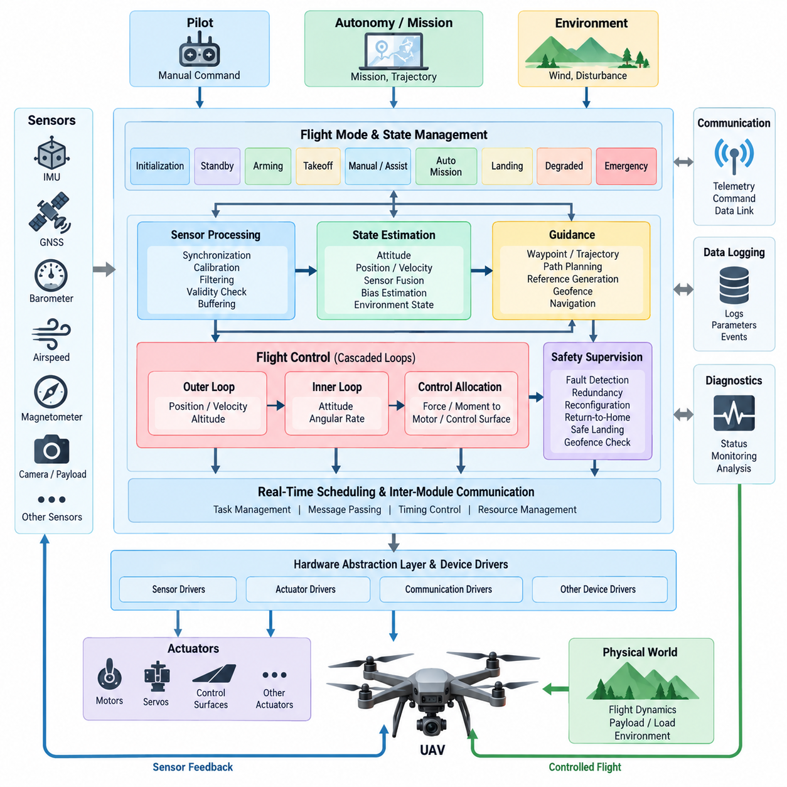
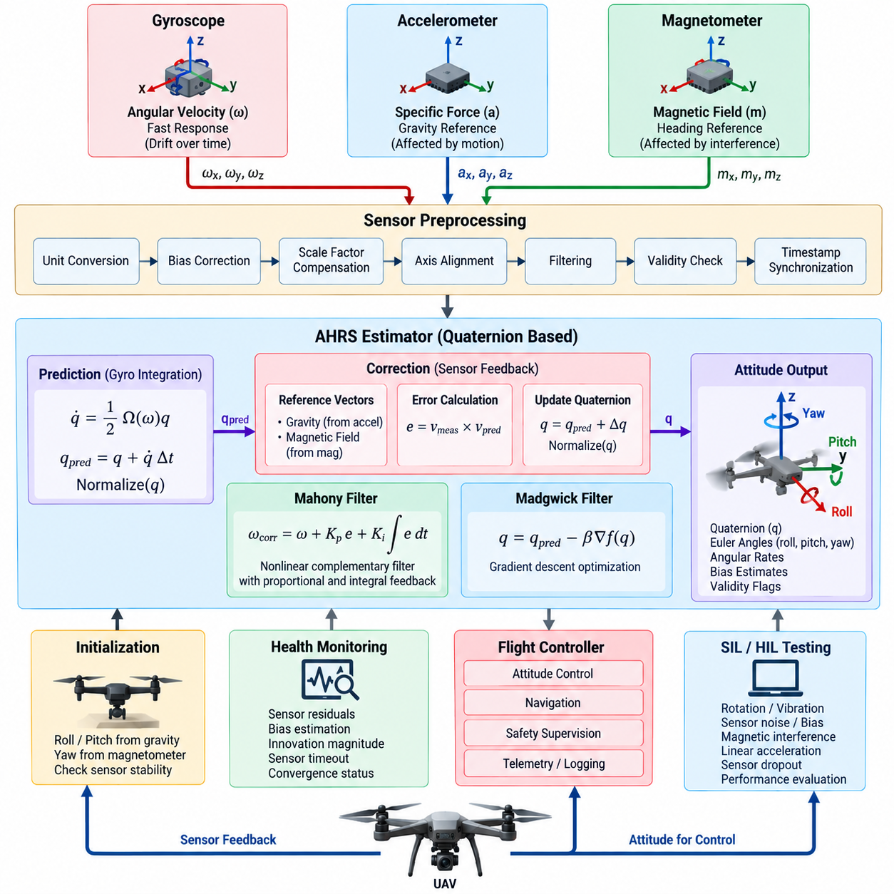
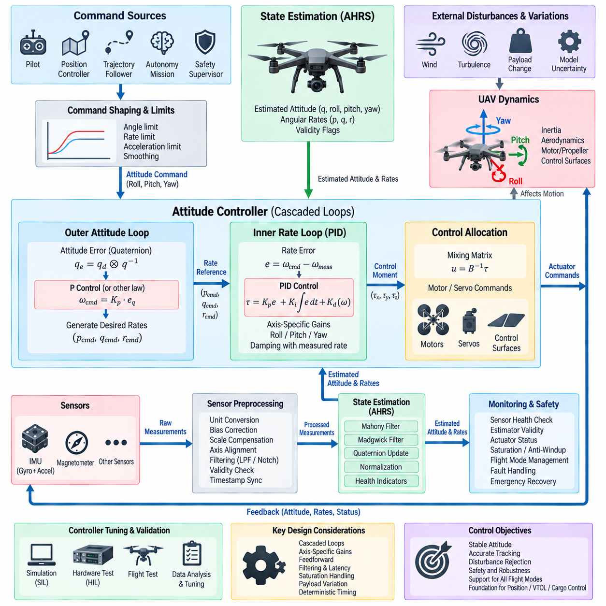
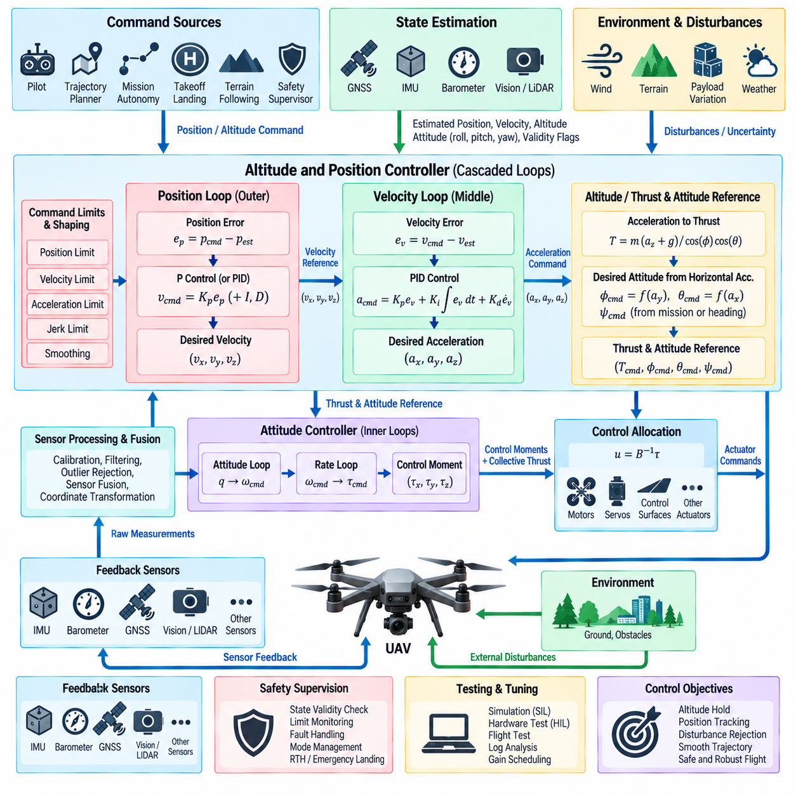
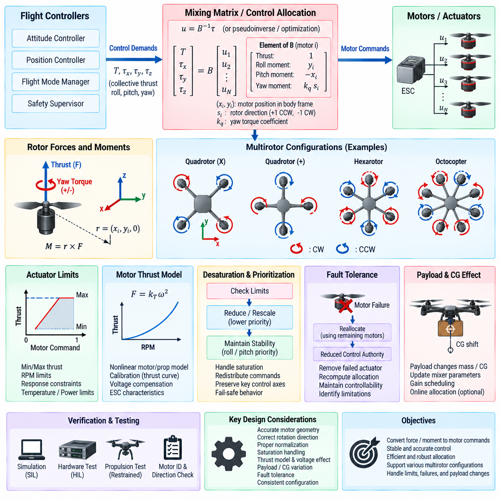
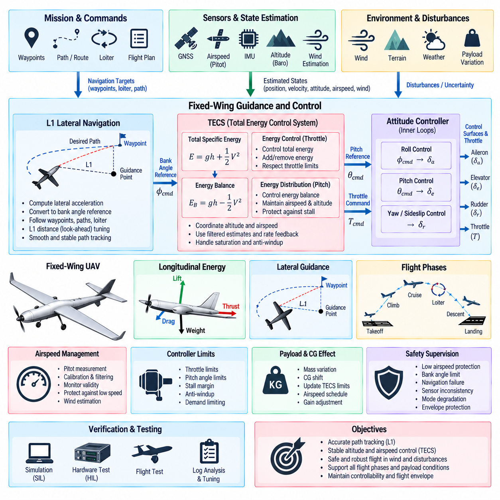
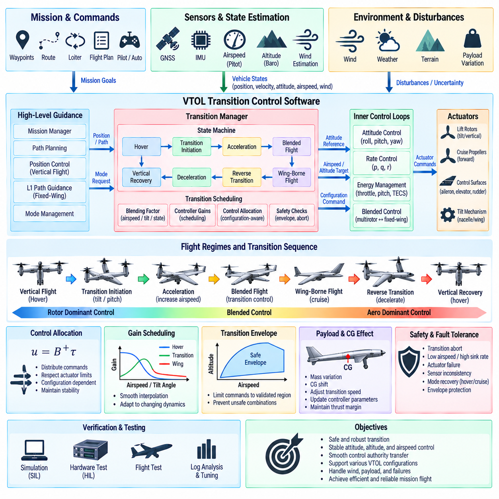
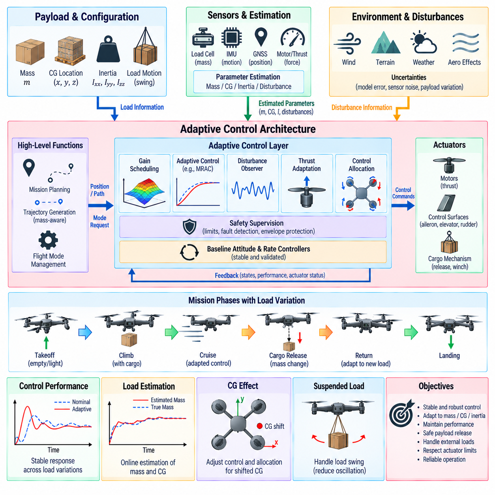
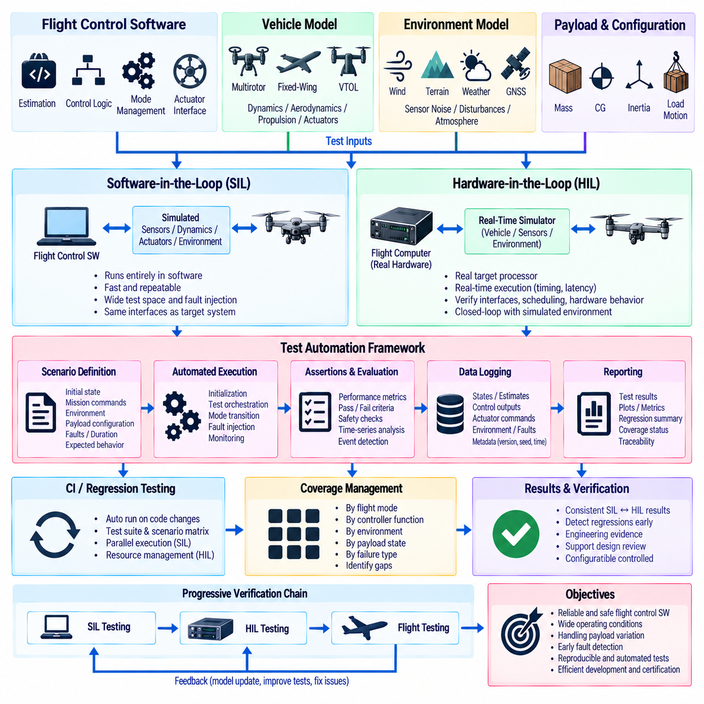
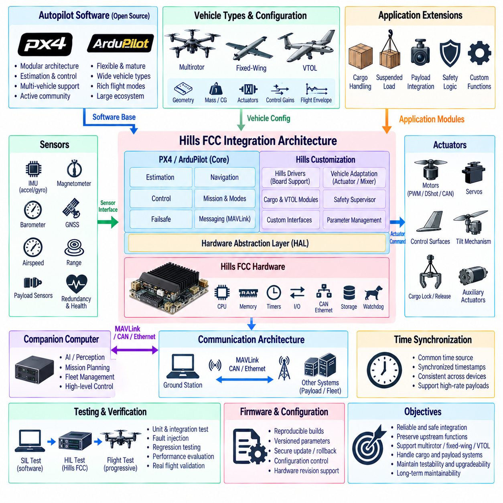

**Volume 04 Robot Control Software**

# 11. UAV Flight Control Software

## 11.01 UAV Flight Control SW Architecture Overview

{width="7.268055555555556in" height="7.268055555555556in"}

UAV 비행 제어 소프트웨어 아키텍처(UAV Flight Control Software Architecture)는 조종사 명령, 자율 임무 목표, 센서 측정값을 안전한 액추에이터 명령(Actuator Command)으로 변환하는 실시간 컴퓨팅 프레임워크(Real-Time Computational Framework)이다. 이는 항공기 하드웨어와 상위 수준 자율 소프트웨어 사이의 제어 핵심부를 구성하며, 엄격한 시간 제약 조건에서 상태 추정(Estimation), 유도(Guidance), 제어(Control), 액추에이터 할당(Actuator Allocation), 상태 감시(Health Monitoring), 안전 기능(Safety Function)을 지속적으로 조정한다.

가장 낮은 소프트웨어 경계에서는 하드웨어 추상화(Hardware Abstraction) 및 디바이스 드라이버 계층(Device-Driver Layer)이 관성 센서(Inertial Sensor), 위성항법시스템(GNSS) 수신기, 기압계(Barometer), 대기 데이터 센서(Air-Data Sensor), 자기계(Magnetometer), 모터 제어기(Motor Controller), 서보(Servo), 통신 버스(Communication Bus)와 인터페이스한다. 이 계층은 장치별 측정값을 표준화된 데이터 구조로 변환하면서 결정론적인 액추에이터 인터페이스를 제공하여 비행 제어 알고리즘이 개별 센서 및 액추에이터 구현으로부터 상당 부분 독립될 수 있도록 한다.

센서 획득(Sensor Acquisition)은 UAV 센서가 서로 크게 다른 주파수로 동작하기 때문에 일반적으로 여러 업데이트 주기(Update Rate)를 기준으로 구성된다. 관성측정장치(IMU) 데이터는 초당 수백 또는 수천 번 입력될 수 있지만 위성항법시스템(GNSS), 기압, 대기속도(Airspeed), 탑재체(Payload) 측정값은 상대적으로 낮은 주기로 동작한다. 따라서 타임스탬핑(Timestamping), 동기화(Synchronization), 보정(Calibration), 필터링(Filtering), 유효성 검사(Validity Checking), 버퍼링(Buffering)은 측정값이 상태 추정과 제어 기능에 입력되기 전에 수행되는 기본적인 아키텍처 서비스가 된다.

상태 추정 계층(State-Estimation Layer)은 이러한 이종 센서 측정값을 항공기 운동을 표현하는 일관된 상태 정보로 변환한다. 대표적인 추정 상태에는 자세(Attitude), 각속도(Angular Velocity), 위치(Position), 속도(Velocity), 고도(Altitude), 가속도(Acceleration), 센서 바이어스(Sensor Bias), 선택된 환경 변수가 포함된다. 자세 및 방위 기준 알고리즘(Attitude and Heading Reference Algorithm)과 종합적인 센서 융합 추정기(Sensor-Fusion Estimator)는 제어 루프에 필요한 피드백 정보를 제공하고 잡음이 포함된 물리적 측정값으로부터 제어에 사용할 수 있는 상태를 분리한다.

비행 제어 기능(Flight-Control Function)은 일반적으로 서로 다른 동적 대역폭(Dynamic Bandwidth)을 갖는 계단식 제어 루프(Cascaded Control Loop)로 구현된다. 빠른 내부 루프(Inner Loop)는 각속도와 자세를 제어하고, 상대적으로 느린 외부 루프(Outer Loop)는 고도, 속도, 위치를 제어한다. 각각의 외부 제어기는 하위 제어기에 기준값(Reference)을 생성함으로써 궤적 목표에서 힘(Force), 모멘트(Moment), 최종 액추에이터 명령까지 이어지는 계층적 경로를 구성하면서 제어 루프의 복잡성을 관리 가능한 수준으로 유지한다.

제어 아키텍처는 유도 목표(Guidance Objective)와 안정화(Stabilization)를 명확하게 분리해야 한다. 유도 기능은 위치, 속도, 방위각(Heading), 고도 또는 궤적 기준값을 생성하여 항공기가 어디로 이동해야 하는지를 결정한다. 안정화 기능은 공력 교란(Aerodynamic Disturbance), 모델 불확실성(Modeling Uncertainty), 액추에이터 한계, 센서 잡음에도 불구하고 항공기가 이러한 기준값을 물리적으로 추종하도록 한다. 이러한 분리를 통해 안전에 중요한 저수준 제어 로직을 불필요하게 변경하지 않고도 항법 알고리즘을 발전시킬 수 있다.

제어 할당(Control Allocation)은 요구되는 힘과 모멘트를 항공기 구성에 적합한 명령으로 변환한다. 멀티로터(Multirotor)는 믹싱 관계(Mixing Relationship)를 사용하여 추력과 토크를 각각의 추진 장치에 분배하고, 고정익 항공기(Fixed-Wing Aircraft)는 스로틀(Throttle)과 공력 제어면(Aerodynamic Control Surface)을 조정한다. 수직이착륙기(VTOL)는 두 메커니즘을 모두 필요로 하며, 호버링(Hovering), 천이 비행(Transitional Flight), 주익 비행(Wing-Borne Flight) 사이에서 액추에이터의 제어 효과가 크게 변화하기 때문에 추가적인 천이 로직(Transition Logic)이 필요하다.

비행 모드 및 상태 관리 계층(Flight Mode and State-Management Layer)은 운용 상황에 따라 이러한 제어 기능을 조정한다. 일반적인 상태에는 초기화(Initialization), 대기(Standby), 시동 허가(Arming), 이륙(Takeoff), 수동 또는 보조 비행(Manual or Assisted Flight), 자율 임무 수행(Autonomous Mission Execution), 착륙(Landing), 성능 저하 운용(Degraded Operation), 비상 대응(Emergency Handling)이 포함된다. 명시적인 상태 전환 조건(Transition Condition)은 서로 호환되지 않는 기능이 동시에 활성화되는 것을 방지하고 조종사, 자율 시스템, 안전 기능 사이에서 제어 권한을 결정론적으로 이전할 수 있도록 한다.

실시간 스케줄링(Real-Time Scheduling)은 비행 제어 소프트웨어의 핵심 요소이다. 시스템의 정확성은 계산된 값뿐만 아니라 해당 값이 언제 사용 가능한가에도 의존하기 때문이다. 고주파 상태 추정 및 자세 제어 태스크(Task)는 예측 가능한 실행 주기와 제한된 지연시간(Bounded Latency)을 필요로 하는 반면, 항법, 텔레메트리(Telemetry), 로깅(Logging), 임무 기능은 상대적으로 낮은 우선순위에서 동작할 수 있다. 따라서 아키텍처는 태스크 주기, 우선순위, 통신 경로, 실행 시간 예산(Execution Budget), 데드라인 모니터링(Deadline Monitoring)을 체계적으로 관리해야 한다.

모듈 간 통신(Inter-Module Communication)은 데이터 소유권(Data Ownership)과 명령 권한(Command Authority)을 명확하게 유지해야 한다. 센서 데이터는 상태 추정 및 항법 계층으로 상향 전달되고, 기준 명령은 제어기 방향으로 하향 전달되며, 상태 정보는 진단 및 감독 기능 전반에 전달된다. 메시지 큐(Message Queue), 공유 메모리(Shared Memory), 발행-구독 메커니즘(Publish-Subscribe Mechanism), 실시간 미들웨어(Real-Time Middleware)를 사용할 수 있지만, 모듈 사이의 통제되지 않은 결합은 타이밍 분석, 검증, 결함 격리(Fault Containment)를 어렵게 하므로 방지해야 한다.

안전 감독(Safety Supervision)은 정상 제어 경로의 마지막에 추가되는 소프트웨어 기능이 아니라 정상 제어 경로와 병렬적으로 동작해야 한다. 감독 기능은 센서 유효성, 상태 추정기 일관성, 액추에이터 상태, 배터리 및 전력 상태, 통신 건전성, 제어 포화(Control Saturation), 지오펜스(Geofence) 조건, 실행 타이밍을 감시한다. 결함이 감지되면 이중화 전환(Redundancy Switching), 제어기 재구성(Controller Reconfiguration), 비행 모드 성능 저하, 자동 복귀(Return-to-Home), 제어 착륙(Controlled Landing) 또는 사전에 정의된 비상 대응 동작을 수행할 수 있다.

UAV의 크기, 탑재 하중, 운용에 따른 위험도가 증가할수록 이중화(Redundancy)의 중요성도 증가한다. 다중 관성측정장치(IMU), 항법 소스(Navigation Source), 통신 링크, 전력 채널, 비행 컴퓨터를 일관성 검사(Consistency Check) 및 보팅 로직(Voting Logic)을 통해 감시할 수 있다. 소프트웨어 아키텍처는 어떤 구성 요소가 불일치를 감지하는지, 고장 채널을 어떻게 격리하는지, 제어 권한을 어떻게 이전하는지, 그리고 재구성 과정에서 항공기가 어떻게 안정적인 비행을 유지하는지를 정의해야 한다.

화물 UAV(Cargo UAV)는 무부하와 적재 상태 사이에서 항공기 동역학이 크게 달라질 수 있기 때문에 추가적인 제어 소프트웨어 요구사항을 갖는다. 탑재체 질량(Payload Mass), 무게중심 위치(Center-of-Gravity Location), 화물 운동(Load Motion), 연료 또는 배터리 상태, 공력 형상(Aerodynamic Configuration)은 제어 효과를 변화시킬 수 있다. 따라서 파라미터 스케줄링(Parameter Scheduling), 적응 제어(Adaptive Control), 외란 추정(Disturbance Estimation), 하중 상태 모니터링(Load-State Monitoring)을 기존 피드백 제어에 추가하면서 예측 가능한 동작을 위한 안정적인 기본 제어기(Baseline Controller)를 유지할 수 있다.

비행 제어와 자율 시스템 사이의 경계는 의도적으로 구조화되어야 한다. 임무 계획(Mission Planning), 장애물 회피(Obstacle Avoidance), 경로 최적화(Route Optimization), 인지(Perception), 인공지능 기반 의사결정(AI-Based Decision Function)은 궤적이나 제한된 기준 명령을 생성할 수 있지만, 비행 제어 계층은 이러한 요청을 동역학, 액추에이터, 안전 한계에 대해 검증해야 한다. 이를 통해 고도화된 자율 시스템이 결정론적 안정화 기능을 직접 우회하지 않으면서 항공기를 제어할 수 있는 통제된 인터페이스를 구성할 수 있다.

진단(Diagnostics)과 관측 가능성(Observability) 역시 중요한 아키텍처 요소이다. 비행 제어 소프트웨어는 센서 상태, 상태 추정기 출력, 제어기 기준값, 추종 오차(Tracking Error), 액추에이터 명령, 모드 전환, 결함, 실행 타이밍 측정값, 구성 파라미터(Configuration Parameter)를 기록해야 한다. 일관된 로깅은 비행 후 분석(Post-Flight Analysis), 제어기 튜닝, 이상 현상 조사, 회귀 시험(Regression Testing), 실제 항공기 동작과 사용된 정확한 소프트웨어 및 파라미터 구성 사이의 추적성(Traceability)을 지원한다.

개발 아키텍처는 새로운 소프트웨어를 실제 비행 하드웨어에 적용하기 전에 시뮬레이션을 지원해야 한다. 소프트웨어 인 더 루프(Software-in-the-Loop, SIL)는 항공기 모델을 이용하여 알고리즘을 검증하고, 하드웨어 인 더 루프(Hardware-in-the-Loop, HIL)는 실제 비행 소프트웨어와 대표적인 프로세서, 인터페이스, 타이밍 동작, 가상 센서 및 액추에이터를 이용하여 시스템을 평가한다. 자동화된 시험 시나리오는 정상 운용, 외란, 센서 고장, 액추에이터 고장, 통신 두절, 경계 조건을 반복적으로 검증할 수 있다.

구성 관리(Configuration Management)는 실행 소프트웨어와 동일한 수준으로 제어 파라미터를 관리해야 한다. 제어 게인(Control Gain), 필터, 액추에이터 한계, 센서 보정 상수, 공력 계수(Aerodynamic Coefficient), 믹서 파라미터(Mixer Parameter), 안전 임계값(Safety Threshold)은 소스 코드를 변경하지 않고도 비행 특성을 근본적으로 변화시킬 수 있다. 따라서 검증된 각각의 항공기 구성은 소프트웨어 버전, 하드웨어 구성, 파라미터 세트, 보정 데이터, 시험 증거(Test Evidence)를 하나의 추적 가능한 릴리스 기준선(Release Baseline)으로 연결해야 한다.

모듈화된 UAV 비행 제어 아키텍처(Modular UAV Flight-Control Architecture)는 궁극적으로 물리적 인터페이스, 상태 추정, 유도, 제어, 제어 할당, 안전 감독, 상위 자율 시스템 사이에 체계적인 역할 분리를 제공한다. 이러한 구조는 멀티로터, 고정익, 수직이착륙기(VTOL), 화물 UAV 플랫폼을 지원하면서 플랫폼별 동역학을 통제된 모듈과 파라미터를 통해 적용할 수 있게 한다. 또한 이후 다루게 될 자세 추정, 제어기 설계, 믹싱(Mixing), 천이 제어(Transition Control), 적응 제어, 소프트웨어 인 더 루프(SIL) 및 하드웨어 인 더 루프(HIL) 검증을 위한 기본 소프트웨어 아키텍처를 제공한다.

## 11.02 Attitude Estimation AHRS: Mahony / Madgwick [w/Code]

{width="7.268055555555556in" height="7.268055555555556in"}

자세 추정(Attitude Estimation)은 비행 제어기(Flight Controller)에 항법 기준 좌표계(Navigation Reference Frame) 또는 지구 고정 기준 좌표계(Earth-Fixed Reference Frame)에 대한 UAV의 방향을 연속적으로 추정하여 제공한다. 자세 및 방위 기준 시스템(Attitude and Heading Reference System, AHRS)은 일반적으로 자이로스코프(Gyroscope), 가속도계(Accelerometer), 자기계(Magnetometer)의 측정값을 결합하여 롤(Roll), 피치(Pitch), 요(Yaw)를 추정한다. 신뢰할 수 있는 자세 정보는 내부 비행 제어 루프(Inner Flight-Control Loop)가 방향 및 각속도 피드백에 직접 의존하기 때문에 필수적이다.

3축 자이로스코프(Three-Axis Gyroscope)는 항공기 동체 축(Body Axis)을 중심으로 하는 각속도(Angular Velocity)를 측정하며 회전 운동에 대한 가장 빠른 정보를 제공한다. 이러한 각속도를 적분하면 단기적으로 매우 우수한 응답성을 가진 방향 추정값을 얻을 수 있지만, 작은 센서 바이어스(Sensor Bias)와 잡음도 시간이 지나면서 누적된다. 따라서 순수한 자이로스코프 적분(Pure Gyroscope Integration)은 드리프트(Drift)가 발생하며, 장시간 비행 중 자세 오차를 제한된 범위로 유지하기 위해 추가적인 절대 기준 또는 저주파 기준이 필요하다.

가속도계(Accelerometer)는 세 개의 동체 축을 따라 비력(Specific Force)을 측정한다. 정지 상태 또는 거의 일정한 속도로 비행하는 경우 중력(Gravity)이 저주파 가속도 벡터를 지배하므로 롤과 피치를 국부 수직 방향(Local Vertical Direction)을 기준으로 보정할 수 있다. 그러나 급격한 기동 중에는 병진 가속도(Translational Acceleration)가 이러한 중력 관측값에 영향을 준다. 따라서 AHRS는 모든 순간적인 가속도계 측정값을 완벽한 자세 기준으로 간주하지 않아야 한다.

자기계(Magnetometer)는 국부 자기장 벡터(Local Magnetic-Field Vector)를 측정하여 방위각 드리프트(Heading Drift)를 제한할 수 있는 정보를 제공한다. 보정(Calibration) 및 기울기 보상(Tilt Compensation) 이후 측정된 자기 방향은 장기적인 요 기준(Yaw Reference)으로 사용할 수 있다. 자기 측정값은 경자성 효과(Hard-Iron Effect), 연자성 왜곡(Soft-Iron Distortion), 전류, 모터, 구조 재료 및 외부 자기 교란(Magnetic Disturbance)의 영향을 받을 수 있으므로 실제 UAV 소프트웨어는 방위 보정을 적용하기 전에 자기 데이터를 검증해야 한다.

따라서 센서 전처리(Sensor Preprocessing)는 AHRS 파이프라인의 중요한 부분이다. 원시 측정값(Raw Measurement)은 바이어스 보정(Bias Correction), 스케일 팩터 보상(Scale-Factor Compensation), 축 정렬(Axis Alignment), 필터링(Filtering), 유효성 검사(Validity Check)를 수행하기 전에 일관된 단위와 좌표계 규칙으로 변환된다. 정확한 타임스탬프(Timestamp) 역시 중요하며, 잘못된 샘플링 간격(Sampling Interval)은 자이로스코프 적분에 직접적인 영향을 준다. 따라서 보정 품질은 수학적 추정기 자체만큼이나 자세 추정 성능에 큰 영향을 미칠 수 있다.

방향(Orientation)은 오일러 각(Euler Angle), 회전 행렬(Rotation Matrix), 쿼터니언(Quaternion)으로 표현할 수 있다. 오일러 각은 직관적인 롤, 피치, 요 출력을 제공하지만 특이점(Singularity)이 존재하며, 회전 행렬은 더 많은 상태 변수를 필요로 하고 직교성(Orthogonality)을 유지해야 한다. 쿼터니언은 3차원 방향을 간결하게 표현하고 짐벌 락(Gimbal Lock)을 방지하며 자이로스코프 측정값으로부터 효율적인 증분 업데이트(Incremental Update)를 수행할 수 있기 때문에 UAV 자세 추정 내부 표현으로 널리 사용된다.

쿼터니언 기반 추정기(Quaternion-Based Estimator)는 측정된 각속도를 각 샘플링 간격 동안 쿼터니언 운동으로 변환하여 자세를 전파한다. 전파된 쿼터니언은 수치 오차(Numerical Error)로 인해 단위 길이 제약(Unit-Length Constraint)이 깨지는 것을 방지하기 위해 주기적으로 정규화(Normalization)해야 한다. 이러한 예측은 빠른 회전 운동을 정확하게 추종하지만 장기 정확도는 자이로스코프 바이어스에 의해 제한되므로 가속도계와 자기계 기준 벡터에서 얻은 피드백 보정이 필요하다.

Mahony 필터(Mahony Filter)는 피드백을 사용하는 비선형 상보 필터링(Nonlinear Complementary Filtering)을 통해 이러한 문제를 해결한다. 현재 자세로부터 예측된 기준 방향과 가속도계 및 사용 가능한 경우 자기계에서 측정된 방향을 비교한다. 이들 사이의 불일치는 자세 오차 벡터(Attitude-Error Vector)를 생성하며, 이 오차는 쿼터니언 적분 전에 측정된 각속도를 보정하기 위해 피드백된다. 이러한 구조는 자이로스코프의 고주파 응답 특성과 기준 센서의 저주파 보정 특성을 결합한다.

Mahony 필터링(Mahony Filtering)은 일반적으로 비례 및 적분 피드백(Proportional and Integral Feedback) 항을 포함한다. 비례 성분(Proportional Component)은 추정된 방향 오차에 비례하는 즉각적인 보정을 생성하고, 적분 성분(Integral Component)은 천천히 변화하는 자이로스코프 바이어스를 보상할 수 있다. 큰 게인은 보정 속도를 높이지만 가속도 또는 자기 교란에 더욱 민감하게 만들 수 있다. 따라서 게인 선택(Gain Selection)은 UAV 동역학, 센서 품질, 샘플링 주파수, 예상 운용 조건을 반영해야 한다.

Madgwick 필터(Madgwick Filter)는 다른 계산 방식으로 센서 융합(Sensor Fusion)에 접근한다. 측정된 기준 벡터와 추정된 방향으로부터 예측된 기준 벡터 사이의 차이를 최소화하는 최적화 문제(Optimization Problem)로 자세 보정을 구성한다. 경사하강법 단계(Gradient-Descent Step)를 통해 보정 방향을 결정하며, 이를 자이로스코프 측정값으로부터 얻은 쿼터니언 전파와 결합하여 갱신된 자세 추정값을 생성한다.

Madgwick 필터의 주요 튜닝 파라미터(Tuning Parameter)는 자이로스코프 적분에 대한 경사 기반 보정(Gradient-Based Correction)의 크기를 제어한다. 강한 보정은 자이로스코프 드리프트를 빠르게 억제할 수 있지만 가속도계 또는 자기계의 교란을 방향 추정값에 유입시킬 수 있다. 약한 보정은 단기적으로 더 부드러운 동작을 제공하지만 더 큰 드리프트를 허용한다. 따라서 이 파라미터는 동적 응답성(Dynamic Responsiveness), 잡음 억제(Noise Rejection), 장기 수렴(Long-Term Convergence) 사이의 실질적인 절충 관계를 나타낸다.

Mahony 필터와 Madgwick 필터는 모두 확장 칼만 필터(Extended Kalman Filter, EKF)의 전체적인 계산 및 모델링 복잡성을 요구하지 않으면서 쿼터니언 자세 추정을 제공할 수 있기 때문에 임베디드 UAV 비행 컴퓨터(Embedded UAV Flight Computer)에 적합하다. 두 필터의 수학적 구성은 서로 다르지만 모두 상호 보완적인 센서 특성을 활용한다. 자이로스코프는 빠른 회전 동역학을 포착하고, 가속도계는 중력 방향을 제한하며, 자기계는 자기 환경을 신뢰할 수 있을 때 방위 기준을 제공한다.

실제 AHRS 소프트웨어는 하나의 기준 센서가 일시적으로 신뢰할 수 없게 되는 상황에서도 동작할 수 있어야 한다. 과도한 가속은 중력 관측값에 대한 신뢰도를 감소시킬 수 있으며, 자기 이상(Magnetic Anomaly)은 자기계 보정값을 제거하거나 가중치를 낮추도록 요구할 수 있다. 이러한 기간에는 추정기가 자이로스코프 데이터를 이용해 자세 전파를 계속하고, 측정값이 물리적으로 타당한 범위로 복귀한 후 기준 보정을 점진적으로 다시 적용할 수 있다.

초기화(Initialization) 역시 명시적으로 처리해야 한다. 쿼터니언 전파에는 합리적인 초기 방향이 필요하기 때문이다. 항공기가 정지해 있을 때 롤과 피치는 일반적으로 측정된 중력 방향으로 초기화할 수 있으며, 방위각은 보정된 자기 데이터 또는 다른 항법 소스(Navigation Source)를 이용해 초기화할 수 있다. 소프트웨어는 초기화 전에 센서 안정성을 검증하고 자세 불확실성(Attitude Uncertainty)이나 센서 일관성이 허용 가능한 범위를 벗어난 경우 시동 허가(Arming)를 방지해야 한다.

추정기(Estimator)는 센서 드라이버와 비행 제어 루프를 연결하는 실시간 데이터 경로(Real-Time Data Path) 내에서 동작한다. 관성측정장치(IMU) 데이터 획득은 높은 주파수로 실행될 수 있으며, 자세 업데이트와 제어기 실행은 정의된 결정론적 주기(Deterministic Period)에서 수행된다. 생성된 쿼터니언, 오일러 각, 각속도, 바이어스 추정값, 유효성 플래그(Validity Flag), 추정기 상태는 자세 제어, 항법, 안전 감독, 텔레메트리(Telemetry), 진단 모듈에 제공될 수 있다.

자세 추정 시스템은 방향 값뿐만 아니라 명시적인 건전성 정보(Health Information)도 제공해야 한다. 유용한 지표에는 가속도계 및 자기계 잔차(Residual), 쿼터니언 정규화 오차(Quaternion Normalization Error), 자이로스코프 바이어스 추정값, 이노베이션 크기(Innovation Magnitude), 센서 타임아웃 상태(Sensor Timeout Status), 수렴 상태(Convergence State)가 포함된다. 비행 제어 감독 기능은 이러한 지표를 사용하여 유효하지 않은 추정값을 거부하고, 이중화 센서 또는 추정기로 전환하며, 비행 모드를 제한하거나 성능 저하 및 비상 대응을 수행할 수 있다.

소프트웨어 인 더 루프(Software-in-the-Loop, SIL) 및 하드웨어 인 더 루프(Hardware-in-the-Loop, HIL) 시험에서는 대표적인 회전 운동, 진동(Vibration), 센서 잡음, 바이어스, 자기 간섭(Magnetic Interference), 선형 가속도, 타이밍 지터(Timing Jitter), 센서 데이터 손실(Sensor Dropout)에 대한 AHRS 동작을 검증해야 한다. 기록된 비행 데이터셋은 추정기 버전을 비교하기 위해 결정론적으로 재생할 수 있다. 자동화 시험은 수렴, 드리프트, 과도 응답(Transient Response), 계산 부하(Computational Load), 기준 센서의 일시적 거부 이후 복구 성능을 평가해야 한다.

완전한 UAV 비행 제어 아키텍처에서 Mahony 또는 Madgwick AHRS는 원시 관성 측정값(Raw Inertial Measurement)과 자세 제어 피드백(Attitude-Control Feedback)을 연결하는 핵심 역할을 수행한다. 그 성능은 센서 융합 방정식뿐만 아니라 보정, 타이밍, 좌표계 규칙, 센서 검증, 튜닝, 수치 안정성(Numerical Stability), 결함 처리(Fault Handling)에 의해 결정된다. 견고하게 구현된 AHRS는 이후의 자세, 고도, 위치, 수직이착륙(VTOL), 적응 제어(Adaptive Control) 기능이 안전하게 사용할 수 있는 결정론적 방향 정보를 제공한다.

## 11.03 Attitude Controller Design [w/Code]

{width="7.268055555555556in" height="7.268055555555556in"}

자세 제어기(Attitude Controller)는 요구되는 UAV 자세를 회전 모멘트 명령(Commanded Rotational Moment) 또는 각속도 기준값(Angular-Rate Reference)으로 변환하는 핵심 안정화 기능이다. 자세 추정기(Attitude Estimator)의 하위와 제어 할당(Control Allocation)의 상위에서 동작하며, 추정된 롤(Roll), 피치(Pitch), 요(Yaw), 각속도(Angular Velocity)를 피드백으로 사용한다. 주요 목적은 공력 교란(Aerodynamic Disturbance), 모델링 오차, 탑재체 변화, 액추에이터 한계에도 불구하고 명령을 추종하면서 안정적인 자세를 유지하는 것이다.

실제 자세 제어 아키텍처(Attitude-Control Architecture)는 일반적으로 계단식 제어 루프(Cascaded Loop)로 구성된다. 외부 자세 루프(Outer Attitude Loop)는 명령된 자세와 추정된 자세를 비교하여 요구 동체 각속도(Desired Body Angular Rate)를 생성한다. 더 빠른 내부 각속도 루프(Inner Rate Loop)는 이 기준값과 자이로스코프에서 측정된 각속도를 비교하여 롤, 피치, 요 제어 입력을 생성한다. 이러한 대역폭 분리(Bandwidth Separation)를 통해 내부 루프가 빠른 외란을 먼저 억제하여 상대적으로 느린 자세 동역학에 미치는 영향을 줄일 수 있다.

자세 명령(Attitude Command)은 조종사(Pilot), 위치 제어기(Position Controller), 궤적 추종기(Trajectory Follower), 자율 임무 시스템(Autonomous Mission System), 안전 감독기(Safety Supervisor) 등에서 생성될 수 있다. 명령의 출처와 관계없이 최대 기울기 각도, 각속도, 각가속도 및 기타 플랫폼별 제한 조건을 적용해야 한다. 명령 형상화(Command Shaping)는 불연속적인 기준 명령이 구조 동역학을 가진시키거나 항공기의 물리적 능력을 초과하는 액추에이터 응답을 요구하는 것을 방지한다.

중간 수준의 자세각에서 자세 오차(Attitude Error)는 롤, 피치, 요의 차이로 해석할 수 있지만, 오일러 각(Euler Angle)을 직접 빼는 방법은 특이점(Singular Configuration) 근처와 큰 회전에서 문제가 발생한다. 쿼터니언 기반 오차 계산(Quaternion-Based Error Calculation)은 보다 일반적인 해결 방법을 제공한다. 요구 자세와 추정 자세를 결합하여 오차 쿼터니언(Error Quaternion)을 생성하며, 그 벡터 성분은 항공기를 명령된 방향과 정렬하기 위해 필요한 최단 회전 보정을 나타낸다.

자세 오차는 비례 피드백(Proportional Feedback) 또는 다른 외부 루프 제어 법칙(Outer-Loop Control Law)을 통해 요구 각속도 벡터(Desired Angular-Rate Vector)로 변환된다. 비례 게인(Proportional Gain)을 증가시키면 자세 수렴 속도가 빨라지지만, 지나치게 높은 게인은 진동을 발생시키거나 추진 시스템이 달성할 수 없는 각속도를 요구할 수 있다. 따라서 명령 각속도는 항공기 관성, 액추에이터 제어 권한(Actuator Authority), 예상 외란 수준 및 안전 기동 한계를 고려하여 제한해야 한다.

내부 각속도 제어기(Inner Angular-Rate Controller)는 회전 동역학을 직접 제어하며 일반적으로 자세 루프보다 높은 주파수에서 실행된다. 비례-적분-미분형 구조(PID-Type Structure)가 널리 사용되는데, 비례 항(Proportional Term)은 즉각적인 오차 보정을 제공하고 적분 항(Integral Term)은 지속적인 외란과 모델링 바이어스를 보상하며 미분 관련 동작(Derivative-Related Behavior)은 감쇠 성능을 향상시킬 수 있다. 실제 구현에서는 잡음이 많은 오차 신호를 미분하지 않고 측정된 각속도 자체를 이용하여 감쇠를 확보하는 경우가 많다.

롤, 피치, 요 축은 서로 다른 동적 특성을 가지므로 동일한 제어기 게인을 자동으로 적용해서는 안 된다. 멀티로터(Multirotor)의 롤과 피치 동역학은 대략 대칭적일 수 있지만, 요 제어 권한은 차등 추력 모멘트(Differential Thrust Moment)가 아닌 반작용 토크(Reaction Torque)에 의존하기 때문에 상대적으로 약한 경우가 많다. 따라서 축별 게인(Axis-Specific Gain)을 선택할 때 기체 형상, 관성 텐서(Inertia Tensor), 프로펠러 특성, 모터 응답, 공력 제어면(Aerodynamic Control Surface), 탑재체 분포를 고려해야 한다.

피드포워드 제어(Feedforward Control)는 피드백 오차가 발생하기 전에 명령된 운동에 선제적으로 대응하여 추종 성능을 향상시킬 수 있다. 특히 급격한 기동이나 궤적 추종에서는 요구 각속도, 각가속도 또는 모델 기반 토크(Model-Based Torque) 항을 피드백 출력에 추가할 수 있다. 피드백은 불확실성과 외란을 보정하는 역할을 계속 수행하고, 피드포워드는 위상 지연(Phase Lag)을 감소시켜 빠르게 변화하는 기준값을 더 작은 추종 오차로 따라갈 수 있도록 한다.

제어기 출력은 액추에이터 포화(Actuator Saturation)를 고려해야 한다. 모터, 서보(Servo), 공력 제어면은 유한한 힘, 토크, 속도 및 이동 범위를 가지므로 요구된 제어 모멘트를 항상 구현할 수 있는 것은 아니다. 포화 처리(Saturation Handling)는 내부 제어기 상태가 무한정 증가하는 것을 방지하면서 안전에 가장 중요한 제어 목표를 유지해야 한다. 특히 지속적인 액추에이터 포화가 발생하는 경우 적분 항을 위한 안티 와인드업 로직(Anti-Windup Logic)이 중요하다.

제어 할당(Control Allocation)은 롤, 피치, 요 및 집합 힘(Collective Force) 요구량을 개별 액추에이터 명령으로 변환한다. 멀티로터의 경우 믹싱 행렬(Mixing Matrix)이 로터 위치와 회전 방향에 따라 요구되는 힘과 모멘트를 모터 추력 명령으로 매핑한다. 자세 제어기는 이러한 할당 계층과 논리적으로 분리되어야 하며, 이를 통해 동일한 제어 원리를 쿼드로터(Quadrotor), 헥사로터(Hexarotor), 옥토콥터(Octocopter), 수직이착륙기(VTOL) 및 기타 구성에 적용할 수 있다.

필터링(Filtering)은 잡음 억제와 제어 지연(Control Latency) 사이의 균형을 유지해야 한다. 자이로스코프 측정값에는 각속도 제어기를 통해 전달될 수 있는 고주파 잡음과 진동이 포함되지만, 과도한 저역통과 필터링(Low-Pass Filtering)은 위상 지연을 발생시켜 안정 여유(Stability Margin)를 감소시킬 수 있다. 주요 구조 진동 또는 추진계 주파수에는 노치 필터(Notch Filter)를 적용하고 광대역 잡음에는 저역통과 필터를 적용할 수 있다. 필터 파라미터는 제어기 대역폭과 독립적으로 조정하는 것이 아니라 함께 설계해야 한다.

샘플링 주파수(Sampling Frequency)와 실행 타이밍(Execution Timing)은 기본적인 소프트웨어 설계 파라미터이다. 각속도 루프는 일반적으로 자세 루프보다 높은 업데이트 주파수를 필요로 하며, 두 루프 모두 예측 가능한 주기와 제한된 지터(Bounded Jitter)로 실행되어야 한다. 센서 샘플링, 추정기 업데이트, 제어기 계산, 액추에이터 출력은 시간적으로 조정되어야 하며, 가변 지연(Variable Latency)은 실질적으로 폐루프 동역학(Closed-Loop Dynamics)을 변화시켜 위상 여유, 외란 억제, 추종 정확도를 저하시킬 수 있다.

탑재체 변화(Payload Variation)는 질량과 무게중심(Center of Gravity)의 변화가 회전 관성과 제어 효과를 변화시키기 때문에 화물 UAV(Cargo UAV)에서 특히 중요하다. 무부하 항공기에 맞춰 튜닝된 제어기는 무겁거나 비대칭으로 배치된 탑재체를 운반할 때 다른 응답 특성을 보일 수 있다. 게인 스케줄링(Gain Scheduling), 관성 의존 파라미터(Inertia-Dependent Parameter), 외란 관측기(Disturbance Observer), 적응 메커니즘(Adaptive Mechanism)을 사용하여 이러한 변화를 보상하면서 검증된 기본 제어기(Baseline Controller)를 예측 가능한 안정화 기반으로 유지할 수 있다.

자세 제어기는 비행 모드 및 안전 로직(Flight-Mode and Safety Logic)과 협력해야 한다. 시동 허가(Arming), 이륙(Takeoff), 착륙(Landing), 수직이착륙 천이(VTOL Transition), 성능 저하 운용(Degraded Operation), 비상 복구(Emergency Recovery) 과정에서는 서로 다른 자세 한계와 제어기 파라미터가 필요할 수 있다. 모드 전환 과정에서 기준값, 게인 또는 적분기 상태가 갑작스럽게 변하지 않아야 한다. 무충격 전환 기법(Bumpless Transfer)과 제어된 상태 초기화(Controlled State Initialization)는 제어 권한이 모드 또는 제어기 사이에서 이동할 때 명령 불연속을 방지하는 데 도움이 된다.

결함 처리(Fault Handling)는 유효하지 않은 피드백이 액추에이터를 직접 구동하는 것을 방지해야 한다. 제어기는 수치적인 자세 값뿐만 아니라 추정기 유효성 플래그(Estimator Validity Flag), 센서 건전성 정보(Sensor-Health Information), 액추에이터 상태, 타이밍 감독 결과를 함께 사용해야 한다. 자세 신뢰도가 허용 수준 이하로 떨어지거나 액추에이터 제어 권한이 감소하면 감독 소프트웨어는 기동성을 제한하고 제어 할당을 재구성하며 이중화 채널로 전환하거나 성능 저하 모드 또는 비상 복구 절차를 수행할 수 있다.

제어기 튜닝(Controller Tuning)은 수학적 모델과 시뮬레이션에서 시작하여 점차 현실적인 시험 환경으로 진행해야 한다. 초기 게인은 단순화된 회전 동역학과 목표 대역폭으로부터 도출할 수 있으며, 이후 비선형 항공기 모델을 이용한 소프트웨어 인 더 루프(Software-in-the-Loop, SIL) 평가를 수행한다. 하드웨어 인 더 루프(Hardware-in-the-Loop, HIL) 시험에서는 실제 비행 시험 전에 프로세서 타이밍, 통신 지연, 액추에이터 인터페이스, 센서 모델, 포화 동작 및 주입된 결함에 제어기를 노출시켜 검증한다.

비행 시험 튜닝(Flight-Test Tuning)은 주관적인 관찰에만 의존하지 않고 기록된 정량적 데이터를 기반으로 수행해야 한다. 명령 및 추정 자세, 각속도 기준값, 측정 각속도, 제어기 오차, 비례 및 적분 성분, 액추에이터 명령, 포화 이벤트, 진동 스펙트럼(Vibration Spectrum), 타이밍 정보는 튜닝 결정을 위한 근거를 제공한다. 이를 통해 소프트웨어 버전별로 계단 응답(Step Response), 주파수 특성, 외란 복구, 오버슈트(Overshoot), 정착 시간(Settling Time), 제어 입력(Control Effort)을 비교할 수 있다.

견고한 UAV 자세 제어기(Robust UAV Attitude Controller)는 기하학적 자세 오차 계산(Geometric Attitude-Error Computation), 계단식 자세 및 각속도 루프, 적절한 피드백 및 피드포워드 항, 포화 관리, 필터링, 결정론적 타이밍(Deterministic Timing), 안전 감독을 통합한다. 이러한 설계는 상태 추정(State Estimation)과 액추에이터 할당 사이의 명확한 인터페이스를 유지하면서 고도, 위치, 항법, 수직이착륙 천이 및 화물 적응 제어(Cargo-Adaptive Control) 기능이 의존하는 안정화 기반을 제공한다.

## 11.04 Altitude and Position Controller Design [w/Code]

{width="7.268055555555556in" height="7.268055555555556in"}

고도 및 위치 제어(Altitude and Position Control)는 기준 좌표계에 대한 병진 운동(Translational Motion)을 제어함으로써 UAV 안정화 기능을 자세 제어 이상으로 확장한다. 이러한 제어기는 추정된 위치, 속도, 고도 및 자세 상태를 입력받아 항법 또는 궤적 명령을 추력(Thrust)과 자세 기준값(Attitude Reference)으로 변환한다. 일반적으로 더 빠른 자세 및 각속도 루프의 외부에서 동작하여 공간상의 목표에서 액추에이터 명령까지 이어지는 계층적 제어 구조(Hierarchical Control Structure)를 형성한다.

위치 동역학(Position Dynamics)은 자세 동역학보다 느리게 변화하기 때문에 계단식 아키텍처(Cascaded Architecture)가 일반적으로 사용된다. 외부 위치 루프(Outer Position Loop)는 명령 위치와 추정 위치를 비교하여 요구 속도(Desired Velocity)를 생성하고, 속도 루프(Velocity Loop)는 속도 오차를 요구 가속도 또는 힘으로 변환한다. 이러한 명령은 이후 집합 추력(Collective Thrust)과 요구 자세(Desired Attitude)로 변환되며, 빠른 자세 제어기가 명령된 병진 가속도를 발생시키는 데 필요한 기체 방향을 구현한다.

고도 제어(Altitude Control)는 이러한 아키텍처의 수직 방향 제어를 담당한다. 고도 기준값은 조종사 입력, 자율 궤적 생성(Autonomous Trajectory Generation), 이륙 및 착륙 로직, 지형 추종 기능(Terrain-Following Function), 안전 감독(Safety Supervision) 등에서 생성될 수 있다. 추정 고도는 기압(Barometric Pressure), 위성항법시스템(GNSS), 거리 센서(Range Sensor), 비전 또는 라이다(LiDAR) 측정값, 관성항법(Inertial Navigation)을 이용하여 얻을 수 있다. 각각의 고도 정보원은 서로 다른 잡음, 드리프트, 지연시간 및 운용 한계를 가지므로 센서 융합(Sensor Fusion)이 중요하다.

고도 위치 루프(Altitude Position Loop)는 요구되는 수직 위치와 추정 고도를 비교하여 수직 속도 기준값(Vertical-Velocity Reference)을 생성한다. 적절한 제한 및 궤적 형상화(Trajectory Shaping)와 결합하는 경우 이 계층에서는 비례 제어기(Proportional Controller)만으로도 충분할 수 있다. 명령된 상승 또는 하강 속도는 과도한 수직 운동을 방지하도록 제한되어야 하며, 가속도 및 저크(Jerk) 제한을 통해 호버링(Hover), 상승, 하강 및 착륙 단계 사이의 전환을 부드럽게 할 수 있다.

수직 속도 루프(Vertical-Velocity Loop)는 상승 및 하강 속도 오차를 수직 가속도 또는 추력 요구량으로 변환한다. 비례 및 적분 피드백(Proportional and Integral Feedback)은 추종 오차와 불확실한 항공기 질량 또는 공력 효과로 발생하는 지속적인 힘의 불균형을 보상할 수 있다. 일반적으로 중력 보상(Gravity Compensation)을 포함하여 피드백 제어기가 전체 중력 보상 항을 지속적으로 생성하는 대신 항공기 중량을 지지하는 데 필요한 추력을 기준으로 그 편차를 제어하도록 한다.

항공기가 기울어진 상태에서는 전체 로터 추력의 수직 성분이 변화하기 때문에 기체 자세에 따라 집합 추력을 조정해야 한다. 항공기가 수평 가속도를 생성하기 위해 롤 또는 피치 방향으로 기울어지면 고도를 유지하기 위해 추가적인 전체 추력이 필요할 수 있다. 따라서 실제 제어기는 수직 힘 요구량과 자세를 연계하여 제어하며, 고도 유지와 횡방향 명령을 동시에 만족시키는 것이 물리적으로 어려워질 수 있는 과도한 기울기 영역에서는 보상량을 제한해야 한다.

수평 위치 제어(Horizontal Position Control)는 일반적으로 북-동-하향(North-East-Down, NED) 또는 동-북-상향(East-North-Up, ENU)과 같은 지역 항법 좌표계(Local Navigation Frame)에서 동작한다. 수평축의 위치 오차는 요구 수평 속도를 생성하며, 이는 추정된 속도와 비교된다. 속도 제어기는 항공기가 병진 운동을 어떻게 변화시켜야 하는지를 나타내는 가속도 명령을 생성하면서 저수준 자세 안정화 구현과는 분리된 구조를 유지한다.

요구되는 3차원 가속도 벡터(Three-Dimensional Acceleration Vector)는 필요한 추력 벡터(Thrust Vector)로 변환할 수 있다. 수직 성분은 집합 추력에 기여하고 수평 성분은 항공기가 기울어져야 하는 방향을 결정한다. 이러한 추력 방향을 요구 요 또는 방위각 기준값(Heading Reference)과 결합하면 자세 제어기에 전달되는 명령 롤 및 피치 방향을 정의할 수 있다. 이러한 변환은 위치 제어와 자세 제어를 연결하는 기본적인 관계를 형성한다.

계단식 제어 구조 전체에서 명령 제한(Command Limit)은 필수적이다. 위치 오차가 무제한의 속도를 생성해서는 안 되며, 속도 오차 역시 무제한의 가속도 또는 기울기를 생성해서는 안 된다. 최대 상승률, 하강률, 수평 속도, 가속도, 저크, 기울기 각도 및 추력은 추진 시스템의 성능과 운용 안전 요구사항을 반영해야 한다. 계층적 포화(Layered Saturation)는 큰 항법 오차가 공격적이거나 물리적으로 구현할 수 없는 액추에이터 요구로 직접 전달되는 것을 방지한다.

추력 또는 자세 제한으로 요구 가속도를 구현할 수 없는 경우가 있기 때문에 적분 제어(Integral Control)에는 안티 와인드업(Anti-Windup) 보호가 필요하다. 이러한 보호가 없으면 포화 상태에서도 적분기가 계속 오차를 누적하여 제어 권한이 다시 확보되었을 때 상당한 오버슈트(Overshoot)를 발생시킬 수 있다. 조건부 적분(Conditional Integration), 적분기 클램핑(Integrator Clamping), 역계산(Back-Calculation)을 통해 이러한 내부 상태를 제한하면서 지속적인 바람이나 질량 불확실성과 같은 정상 상태 외란을 보상하는 능력을 유지할 수 있다.

궤적 생성기(Trajectory Generator)에서 요구 속도와 가속도를 사용할 수 있는 경우 피드포워드 항(Feedforward Term)은 궤적 추종 성능을 향상시킨다. 위치 오차가 발생할 때까지 기다리는 대신 제어기는 알려진 속도 및 가속도 기준값을 직접 적용할 수 있으며, 피드백은 모델링 오차와 외부 교란을 보정한다. 이러한 조합은 부드러운 자율 궤적, 고속 비행, 정밀 착륙(Precision Landing), 큰 추종 오차가 바람직하지 않은 화물 운용(Cargo Operation)에 특히 유용하다.

바람(Wind)은 수평 위치 제어에 중요한 외란으로 작용한다. 지속적인 바람은 위치를 유지하기 위해 적절한 기체 기울기와 추력 벡터로 상쇄해야 하는 힘을 발생시킨다. 적분 피드백 또는 외란 관측기(Disturbance Observer)는 필요한 정상 상태 보정량을 추정할 수 있으며, 속도 및 가속도 피드백은 과도 상태의 영향을 처리한다. 강풍 조건에서도 제어 권한은 물리적으로 제한되므로 최대 기울기 및 추력 한계를 준수해야 한다.

상태 추정(State Estimation)의 품질은 위치 제어 성능에 큰 영향을 미친다. 위성항법시스템(GNSS)은 전역 기준 위치를 제공할 수 있지만 다중경로(Multipath), 간섭, 신호 단절 또는 제한된 업데이트 속도의 영향을 받을 수 있다. 관성항법은 빠른 운동 추정값을 제공하지만 시간이 지나면서 드리프트가 누적되며, 비전, 라이다, 레이더(Radar), 거리 기반 위치추정(Range-Based Localization)은 상호 보완적인 정보를 제공할 수 있다. 따라서 제어기는 단일 위치 센서에 직접 의존하기보다 검증된 융합 상태(Validated Fused State)를 사용해야 한다.

소프트웨어 전체에서 기준 좌표계(Reference Frame)와 좌표 변환(Coordinate Transformation)은 일관되게 처리되어야 한다. 항법 명령은 세계 고정 좌표계(World-Fixed Frame)로 표현될 수 있지만 추력과 자세 명령은 최종적으로 항공기 동체 좌표계(Body Frame)에서 작용한다. 잘못된 축 정의, 부호 규칙(Sign Convention), 방위각 변환 또는 고도 규칙은 심각한 제어 오류를 발생시킬 수 있다. 따라서 좌표계 정의는 명확해야 하며 상태 추정, 항법, 제어 및 로깅 모듈 사이에서 일관되게 공유되고 시험되어야 한다.

화물 UAV(Cargo UAV)는 탑재체 질량이 호버링과 가속에 필요한 추력을 직접 변화시키기 때문에 특별한 고려가 필요하다. 무게중심(Center of Gravity)의 변화 역시 병진 명령과 자세 동작 사이의 결합을 발생시킬 수 있다. 질량 추정(Mass Estimation), 탑재체 상태 정보, 게인 스케줄링(Gain Scheduling), 적응형 추력 모델(Adaptive Thrust Model), 외란 추정(Disturbance Estimation)을 통해 다양한 적재 조건에서 성능을 향상시키면서 안정화 및 비상 기동에 충분한 추력 여유(Thrust Reserve)를 보장하는 보수적인 제한을 유지할 수 있다.

이륙 및 착륙(Takeoff and Landing)에는 모드별 고도 및 위치 제어 동작이 필요하다. 이륙 과정에서는 지면 접촉(Ground Contact)과 추정기 유효성을 고려하면서 추력을 제어된 방식으로 증가시켜야 한다. 착륙에서는 점진적으로 제어되는 하강, 수평 정렬, 지면 감지(Ground Detection), 접지 로직(Touchdown Logic)이 필요하다. 항공기가 지면 접촉 상태에 진입하거나 이탈할 때 갑작스러운 추력 변화를 방지하도록 이러한 전환 과정에서 적분기 상태와 기준 궤적을 신중하게 관리해야 한다.

안전 감독(Safety Supervision)은 위치 및 고도 명령이 실제로 달성 가능한지를 지속적으로 평가해야 한다. 항법 데이터 손실, 과도한 추정기 불확실성, 추력 포화, 지오펜스 위반(Geofence Violation), 비정상적인 수직 속도 또는 부족한 추진 여유가 발생하면 명령을 제한하거나 비행 모드를 변경해야 할 수 있다. 시스템 설계에 따라 위치 제어 성능 저하, 고도 유지(Altitude Hold), 자동 복귀(Return-to-Home), 제어 착륙(Controlled Landing) 또는 기타 사전에 정의된 비상 동작을 수행할 수 있다.

검증(Verification)은 수학적 시뮬레이션에서 시작하여 소프트웨어 인 더 루프(Software-in-the-Loop, SIL), 하드웨어 인 더 루프(Hardware-in-the-Loop, HIL), 통제된 비행 시험(Controlled Flight Testing)으로 진행해야 한다. 시험 시나리오에는 위치 계단 입력(Position Step), 궤적 추종, 상승 및 하강, 바람 외란, 센서 잡음, 위성항법시스템 신호 손실, 탑재체 변화, 추력 포화 및 모드 전환을 포함해야 한다. 기록된 위치, 속도, 가속도, 추력, 자세 기준값, 포화 상태 및 타이밍 데이터를 통해 추종 성능과 견고성을 정량적으로 평가할 수 있다.

잘 설계된 고도 및 위치 제어기(Altitude and Position Controller)는 계단식 위치 및 속도 루프, 중력 및 자세 보상, 추력 벡터 생성(Thrust-Vector Generation), 피드포워드 추종, 포화 관리, 안티 와인드업, 좌표 변환 및 안전 감독을 통합한다. 상태 추정 및 더 빠른 자세 제어기와 통합함으로써 항법 목표를 동역학적으로 실현 가능한 비행 명령으로 변환하며, 자율 항법(Autonomous Navigation), 수직이착륙(VTOL) 운용, 정밀 착륙 및 화물 임무를 위한 제어 기반을 제공한다.

## 11.05 Multirotor Mixing Matrix Design [w/Code]

{width="7.268055555555556in" height="7.268055555555556in"}

멀티로터 믹싱 행렬(Multirotor Mixing Matrix)은 비행 제어기(Flight Controller)와 개별 추진 장치(Propulsion Unit) 사이의 수학적 인터페이스를 제공한다. 제어기는 요구 집합 추력(Collective Thrust)과 롤(Roll), 피치(Pitch), 요(Yaw) 축에 대한 동체 모멘트(Body Moment)를 생성하며, 믹서(Mixer)는 이러한 요구량을 모터별 추력 명령으로 변환한다. 이러한 분리를 통해 자세 및 위치 제어기는 각 로터의 형상과 회전 방향을 직접 관리하지 않고 기체 수준 좌표계에서 동작할 수 있다.

믹서(Mixer)는 로터 추력(Rotor Thrust), 로터 위치(Rotor Location), 항공기 동체에 작용하는 힘과 모멘트 사이의 물리적 관계를 기반으로 한다. 각 로터는 수직 또는 거의 축 방향의 추력을 생성하며, 무게중심(Center of Gravity)으로부터의 거리에 의해 롤 및 피치 모멘트가 발생한다. 또한 로터의 공력 항력(Aerodynamic Drag)은 요 축을 중심으로 반작용 토크(Reaction Torque)를 생성하며, 그 방향은 프로펠러가 시계 방향(Clockwise) 또는 반시계 방향(Counterclockwise)으로 회전하는지에 따라 결정된다.

일반적인 멀티로터(Multirotor)의 제어 요구 벡터(Control-Demand Vector)는 집합 추력과 세 개의 동체 모멘트로 표현할 수 있다. 이에 대응하는 액추에이터 벡터(Actuator Vector)는 각 로터의 추력 명령을 포함한다. 이러한 값들은 각 모터가 생성하는 힘과 모멘트 기여도를 열(Column) 단위로 표현하는 할당 행렬(Allocation Matrix)을 통해 연결된다. 따라서 이 행렬은 항공기 형상과 추진 시스템 구성을 제어 소프트웨어가 직접 사용할 수 있는 형태로 표현한다.

로터 위치는 롤 및 피치 계수를 구성하는 핵심 요소이다. 로터가 기체 무게중심을 기준으로 위치 벡터 r에 존재하고 추력 F를 생성한다면, 해당 모멘트 기여도는 위치와 힘 사이의 외적 관계(Cross-Product Relationship)를 따른다. 이에 따라 결정되는 모멘트 암(Lever Arm)은 각 로터가 롤 또는 피치 토크를 얼마나 효과적으로 생성할 수 있는지를 결정하므로 정확한 모터 좌표와 일관된 동체 축 규칙(Body-Axis Convention)이 필수적이다.

요 제어 할당(Yaw Allocation)은 주로 기하학적 모멘트 암보다는 로터 반작용 토크에 의존한다. 인접한 로터는 일반적으로 시계 방향과 반시계 방향 회전을 교대로 배치하여 균형 잡힌 호버링(Hover) 상태에서 각 로터의 반작용 토크가 상쇄되도록 구성한다. 요 명령은 이러한 두 로터 그룹 사이의 균형을 의도적으로 변화시켜 요구 집합 추력과 다른 회전 모멘트를 가능한 한 유지하면서 순 동체 토크(Net Body Torque)를 생성한다.

쿼드로터(Quadrotor) 구성은 기본적인 믹싱 원리를 잘 보여준다. X 구성(X Configuration)에서는 어떤 로터도 하나의 주 동체 축에만 직접 배치되지 않기 때문에 각 로터가 롤과 피치에 동시에 기여한다. 플러스 구성(Plus Configuration)에서는 개별 로터가 롤 또는 피치 축과 보다 직접적으로 정렬된다. 이에 따라 계수 값은 서로 달라지지만 두 구성 모두 동일한 일반화된 할당 행렬(Generalized Allocation-Matrix) 형식으로 표현할 수 있다.

6개 또는 8개의 로터를 사용하는 항공기는 동일한 개념을 추가적인 액추에이터 열로 확장한다. 헥사로터(Hexarotor)와 옥토콥터(Octocopter)는 더 많은 제어 자유도(Control Degree of Freedom)를 제공하며, 모터 고장 이후에도 충분한 추진 능력이 유지된다면 이중화(Redundancy)를 제공할 수 있다. 시스템이 과잉 구동(Overactuated) 구조가 되면 여러 로터 추력 조합이 동일한 기체 힘과 모멘트를 생성할 수 있으므로 할당 알고리즘이 부가적인 목표를 최적화할 수 있다.

제어 할당기(Control Allocator)는 요구 힘 및 모멘트 벡터로부터 액추에이터 명령을 결정한다. 정방형이며 비특이적인 시스템(Square, Nonsingular System)의 경우 행렬 역변환(Matrix Inverse)을 이용하여 직접 해를 구할 수 있으며, 과잉 구동 구성에서는 일반적으로 의사역행렬(Pseudoinverse) 또는 최적화 기반 할당(Optimization-Based Allocation) 방법을 사용한다. 가중 최소제곱법(Weighted Least-Squares)이나 제약 최적화(Constrained Optimization)는 중요한 제어 축의 우선순위를 높이고 액추에이터 사용량을 최소화하며 추력 여유를 유지하거나 사용할 수 없는 모터의 명령을 다른 모터로 재분배할 수 있다.

계산된 로터 명령은 물리적인 추진 능력을 초과할 수 없으므로 수학적 믹서에는 액추에이터 제한(Actuator Limit)을 고려해야 한다. 각 모터에는 최소 및 최대 사용 가능 추력, 회전속도 한계, 과도 응답 제약, 그리고 경우에 따라 온도 또는 전력 제한이 존재한다. 단순한 클리핑(Clipping)은 명령된 힘과 모멘트를 왜곡할 수 있으므로 실제 제어 할당에서는 가능한 경우 가장 중요한 안정화 목표를 유지하면서 포화(Saturation)를 관리해야 한다.

하나 이상의 액추에이터가 한계에 접근하면 비포화 알고리즘(Desaturation Algorithm)을 통해 모터 명령을 재분배한다. 예를 들어 큰 집합 추력 요구와 롤, 피치, 요 명령이 동시에 발생하면 사용 가능한 모터 제어 권한을 초과할 수 있다. 이 경우 할당기는 우선순위가 낮은 성분을 감소시키거나 재조정하여 실현 가능한 모터 명령을 확보할 수 있다. 제어 우선순위는 플랫폼에 따라 달라지지만 자세 안정성을 유지하기 위해서는 일반적으로 롤과 피치 제어 권한을 신중하게 보호해야 한다.

비행 제어 소프트웨어는 직접적인 힘 단위 대신 정규화된 제어 변수(Normalized Control Variable)를 사용하는 경우가 많기 때문에 믹서 정규화(Mixer Normalization)가 중요하다. 행렬 계수는 집합 추력과 동체 축 명령이 정의된 수치 범위 안에서 동작하도록 스케일링할 수 있다. 정규화 규칙은 모터 모델, 제어기 출력 제한, 액추에이터 드라이버 및 로깅 시스템과 일관되어야 하며, 그렇지 않으면 수치적으로 정상적인 명령이 잘못된 물리적 힘이나 비대칭적인 제어 응답을 발생시킬 수 있다.

실제 추진 시스템은 비선형(Nonlinear)이므로 믹서 출력은 모터 제어기에 전달되기 전에 추력 모델(Thrust Model)을 통한 변환이 필요할 수 있다. 단순화된 조건에서는 로터 추력이 회전속도의 제곱에 대략 비례하지만, 모터, 프로펠러, 전압, 공기 흐름, 전자식 속도 제어기(Electronic Speed Controller, ESC)의 특성으로 인해 추가적인 비선형성이 발생한다. 보정된 추력 곡선(Calibrated Thrust Curve)은 정규화된 믹서 출력을 의도한 힘을 보다 정확하게 생성하는 명령으로 매핑할 수 있다.

배터리 전압 변화(Battery Voltage Variation)는 명령과 실제 생성 추력 사이의 관계를 추가적으로 변화시킬 수 있다. 비행 중 전압이 감소하면 추진 시스템 내부에서 이를 보상하지 않는 경우 동일한 모터 명령에서도 서로 다른 회전속도와 추력이 발생할 수 있다. 피드포워드 전압 보상(Feedforward Voltage Compensation) 또는 보정된 모터 모델은 이러한 일관성을 향상시킬 수 있으며, 특히 추력 여유와 정확한 집합 힘 생성이 고도 유지에 중요한 대형 화물 UAV(Cargo UAV)에서 중요하다.

탑재체 변화(Payload Change)는 질량, 무게중심 이동, 관성 변화 등을 통해 간접적으로 믹서 성능에 영향을 준다. 무게중심이 할당 행렬에서 가정한 기하학적 중심으로부터 이동하면 실제 무게중심에 대한 로터의 모멘트 암이 달라진다. 따라서 대형 화물 UAV는 적재 조건에 따라 구성별 믹서 파라미터(Configuration-Dependent Mixer Parameter), 무게중심 보상(Center-of-Gravity Compensation), 또는 측정 및 추정된 탑재체 상태에 기반한 온라인 제어 할당 업데이트(Online Allocation Update)가 필요할 수 있다.

결함 허용 제어(Fault-Tolerant Control)는 믹싱 행렬에 추가적인 요구사항을 부여한다. 모터 또는 추진 채널에 고장이 발생하면 해당 액추에이터의 사용 가능한 추력을 제거하거나 제한하고 나머지 액추에이터를 사용하여 제어 할당 문제를 다시 계산해야 한다. 전체 롤, 피치, 요 및 추력 제어를 계속 유지할 수 있는지는 기체 형상과 이중화 수준에 따라 달라진다. 할당기는 물리적으로 불가능한 조합을 계속 요구하기보다 감소된 제어 권한(Reduced Control Authority)을 명확하게 식별해야 한다.

소프트웨어 구현에서는 기체 형상, 로터 회전 방향, 액추에이터 번호, 믹서 계수를 추적 가능한 구성 데이터(Configuration Data)로 유지해야 한다. 논리적 모터 번호와 실제 배선 사이의 불일치는 제어 알고리즘이 수학적으로 정확하더라도 즉각적인 불안정을 발생시킬 수 있다. 따라서 제한 없는 실제 비행을 수행하기 전에 자동화된 구성 검사, 모터 식별 시험(Motor Identification Test), 회전 방향 검증, 저추력 액추에이터 시험(Low-Thrust Actuator Test)을 수행해야 한다.

시뮬레이션(Simulation)은 하드웨어 시험 전에 믹싱 행렬을 검증할 수 있는 효율적인 환경을 제공한다. 단위 시험(Unit Test)을 통해 독립적인 집합 추력, 롤, 피치, 요 명령에 대해 예상되는 모터 응답을 검증할 수 있으며, 소프트웨어 인 더 루프(Software-in-the-Loop, SIL) 시뮬레이션에서는 복합 기동과 포화 동작을 평가할 수 있다. 이후 하드웨어 인 더 루프(Hardware-in-the-Loop, HIL) 및 제한된 추진 시험(Restrained Propulsion Test)을 통해 액추에이터 매핑, 명령 스케일링, 타이밍 및 고장 처리 동작을 확인할 수 있다.

견고한 멀티로터 믹싱 설계(Robust Multirotor Mixing Design)는 항공기 형상, 로터 회전 방향, 추력 및 반작용 토크 특성, 액추에이터 제약, 정규화, 비포화 처리, 결함 처리를 명확하게 정의된 제어 할당 계층(Control-Allocation Layer)에 통합한다. 기체 수준의 힘과 모멘트 요구를 실제 구현 가능한 추진 명령으로 변환함으로써 믹서는 자세 제어와 쿼드로터, 헥사로터, 옥토콥터 및 화물 UAV 플랫폼의 물리적 액추에이터 사이를 연결하는 핵심적인 역할을 수행한다.

## 11.06 Fixed-Wing Control: TECS / L1 Navigation SW

{width="7.268055555555556in" height="7.268055555555556in"}

고정익 비행 제어 소프트웨어(Fixed-Wing Flight-Control Software)는 공력 양력(Aerodynamic Lift), 대기속도(Airspeed), 비행경로각(Flight-Path Angle), 협조 선회(Coordinated Turning)가 기체의 운동을 결정한다는 점에서 멀티로터 제어와 근본적으로 다르다. 항공기는 일반적으로 자세를 독립적으로 유지하면서 임의의 횡방향 또는 수직 방향 힘을 생성할 수 없다. 따라서 비행 제어 아키텍처는 임무 전반에서 충분한 대기속도와 허용 가능한 받음각 여유(Angle-of-Attack Margin)를 유지하면서 스로틀(Throttle), 피치(Pitch), 롤(Roll), 공력 제어면(Aerodynamic Control Surface)을 상호 조정한다.

일반적인 고정익 제어 스택(Fixed-Wing Control Stack)은 횡방향 항법(Lateral Navigation)과 종방향 에너지 관리(Longitudinal Energy Management)를 분리한다. L1 항법(L1 Navigation)은 항공기가 경로, 웨이포인트(Waypoint), 선회 대기 패턴(Loiter Pattern)을 따라가도록 횡방향 유도 명령을 생성하며, 총 에너지 제어 시스템(Total Energy Control System, TECS)은 스로틀과 피치를 통해 고도와 대기속도를 조정한다. 내부 자세 및 각속도 제어기는 이러한 상위 기준값을 에일러론(Aileron), 엘리베이터(Elevator), 러더(Rudder), 추진 시스템 명령으로 변환한다.

TECS는 고도와 대기속도를 서로 독립적으로 제어하는 대신 종방향 비행을 에너지 관리 문제(Energy-Management Problem)로 해석한다. 항공기의 총 비에너지(Total Specific Energy)는 고도와 관련된 중력 위치 에너지(Gravitational Potential Energy)와 대기속도와 관련된 운동 에너지(Kinetic Energy)를 포함한다. 상승하면 위치 에너지가 증가하고 가속하면 운동 에너지가 증가하며, 추진 시스템은 항공기에 에너지를 공급하는 반면 공력 항력(Aerodynamic Drag)은 지속적으로 시스템의 에너지 일부를 소모한다.

총 비에너지는 개념적으로 중력 에너지 항과 운동 에너지 항의 합으로 표현할 수 있으며, 이 두 항 사이의 차이는 에너지가 고도와 속도 사이에서 어떻게 분배되는지를 나타낸다. TECS는 이러한 관계를 활용하여 스로틀을 주로 총 에너지 제어(Total-Energy Control)에 할당하고 피치를 주로 에너지 분배(Energy Distribution)에 할당한다. 이러한 협조 구조는 독립적인 고도 및 대기속도 제어기가 서로 양립할 수 없는 동작을 요구할 때 발생할 수 있는 충돌을 감소시킨다.

항공기가 명령된 고도와 요구 대기속도보다 모두 낮은 경우 추가적인 추진 에너지가 필요할 수 있다. 고도는 낮지만 대기속도가 과도하게 높은 경우 제어기는 상승을 명령하여 운동 에너지를 위치 에너지로 재분배할 수 있다. 반대로 상승 중 대기속도가 위험할 정도로 낮아지면 TECS는 일시적으로 고도 추종 성능을 희생하더라도 속도를 보호하기 위해 피치 요구량을 감소시킬 수 있다.

따라서 대기속도 추정(Airspeed Estimation)은 고정익 제어에서 매우 중요하다. 피토-정압 측정(Pitot-Static Measurement)은 지시 대기속도(Indicated Airspeed) 또는 보정 대기속도(Calibrated Airspeed)를 제공할 수 있으며, 관성 정보와 위성항법시스템(GNSS) 정보는 상태 추정(State Estimation)과 바람 추정(Wind Estimation)에 활용될 수 있다. 대기속도 센서는 막힘, 결빙, 보정 오차, 압력 교란, 장착 영향에 취약하므로 제어 소프트웨어는 유효성을 감시하고 의심스러운 측정값을 검증되지 않은 제어 기준으로 사용하지 않아야 한다.

TECS는 일반적으로 고도 및 대기속도 측정값에 잡음이 포함되고 서로 다른 업데이트 주기로 동작하기 때문에 필터링된 추정값(Filtered Estimate)과 변화율 기반 제어 상태(Rate-Based Control State)를 포함한다. 고도 변화율(Height Rate), 가속도, 에너지 변화율(Energy Rate), 에너지 균형 오차(Energy-Balance Error)를 사용하여 부드러운 스로틀 및 피치 명령을 생성할 수 있다. 필터링은 측정 잡음을 억제하면서 과도한 지연을 발생시키지 않아야 하며, 지연된 에너지 추정값은 고도 및 속도 응답에 진동을 발생시킬 수 있다.

스로틀 명령은 추진 시스템 한계에 의해 제한되고 피치 명령은 항공기 성능과 실속 여유(Stall Margin)를 준수해야 한다. 포화 관리(Saturation Management)는 급격한 상승, 빠른 고도 변화, 중량 탑재 운용 또는 강한 외란 상황에서 특히 중요하다. 안티 와인드업(Anti-Windup)과 요구량 제한(Demand Limiting)은 사용 가능한 추진력 또는 공력 제어 권한이 명령된 궤적을 만족시킬 수 없을 때 내부 제어기 상태가 비현실적인 요구량을 계속 누적하는 것을 방지한다.

L1 항법은 이에 대응하는 횡방향 유도 기능(Lateral Guidance Function)을 제공한다. 단순히 횡경로 오차(Cross-Track Error)만으로 롤 각도를 직접 명령하는 대신, 유도 법칙(Guidance Law)은 항공기가 요구 경로로 부드럽게 수렴하는 데 필요한 횡가속도(Lateral Acceleration)를 결정한다. 이 가속도 요구량은 뱅크각 기준값(Bank-Angle Reference)으로 변환되며, 내부 자세 제어기가 이를 추종함으로써 협조되고 동역학적으로 실현 가능한 선회 동작을 유지한다.

L1 개념은 요구 경로를 따라 항공기 전방에 위치하는 가상 유도점(Virtual Guidance Point)을 사용한다. 항공기 속도, 유도점, 경로 형상 사이의 관계를 이용하여 횡가속도 명령을 결정한다. 전방을 미리 바라보는 방식은 순간적인 횡경로 오차에 대한 지나치게 공격적인 보정을 방지하며, 가장 가까운 경로점을 직접 향하도록 조향하는 방식보다 부드러운 경로 진입(Path Interception) 동작을 제공한다.

유효 L1 거리(Effective L1 Distance) 또는 유도 주기(Guidance Period)는 경로 추종의 응답성을 결정한다. 짧은 전방주시 특성(Look-Ahead Behavior)은 더욱 정밀한 경로 추종을 제공할 수 있지만 공격적인 뱅크 명령과 항법 잡음에 대한 높은 민감도를 발생시킬 수 있다. 반대로 긴 유도 스케일(Guidance Scale)은 더 부드러운 운동을 제공하지만 더 큰 경로 편차를 허용한다. 따라서 파라미터는 항공기의 속도 범위, 기동성, 임무 경로 형상 및 허용 가능한 횡방향 추종 오차를 반영해야 한다.

웨이포인트 항법(Waypoint Navigation)은 연속된 임무 지점 사이에 선분을 정의하고 L1 유도를 적용하여 각각의 선분에 진입하고 추종하는 방식으로 구현할 수 있다. 항공기가 웨이포인트에 접근하면 전환 로직(Transition Logic)이 언제 다음 경로 구간으로 유도를 전환할지를 결정한다. 적절한 수용 반경(Acceptance Radius)과 전환 조건(Switching Criterion)은 예측 가능한 임무 진행을 유지하면서 불필요한 오버슈트(Overshoot), 진동 또는 급격한 선회를 방지한다.

선회 대기 제어(Loiter Control)는 동일한 횡방향 유도 원리를 원형 또는 곡선 경로로 확장한다. 소프트웨어는 먼저 요구되는 선회 궤도(Orbit)를 포착한 다음 지정된 반경과 회전 방향을 유지해야 한다. 바람은 지상 기준 원형 운동(Ground-Referenced Circular Motion)에 상당한 영향을 줄 수 있으므로 유도 시스템은 필요한 뱅크각과 횡가속도를 지속적으로 조정해야 한다. 바람이나 대기속도 조건으로 인해 요구되는 지상 경로를 물리적으로 유지하기 어려운 경우에는 적절한 제한이 필요하다.

바람은 공기 상대 운동(Air-Relative Motion)과 지상 상대 운동(Ground-Relative Motion)의 차이를 명확하게 보여준다. 항공기의 공력 성능은 기체 주변의 공기 흐름에 의존하기 때문에 TECS는 대기속도를 중요하게 다루는 반면, 항법은 주로 지면을 기준으로 한 운동을 평가한다. 따라서 고정익 제어 시스템은 바람 속도(Wind Velocity)를 추정하고 대기속도, 지상속도(Groundspeed), 기수방향(Heading), 진행방향(Course), 요구 경로 형상 사이의 일관된 관계를 유지하는 것이 중요하다.

내부 자세 제어 루프(Inner Attitude-Control Loop)는 TECS와 L1 유도보다 높은 주파수로 실행된다. 횡방향 유도에서 생성된 롤 명령은 에일러론 제어로 변환되고, TECS의 피치 명령은 엘리베이터 동작으로 변환되며, 요 또는 사이드슬립 제어(Sideslip Control)는 러더 동작을 조정할 수 있다. 각속도 루프(Rate Loop)는 빠른 감쇠와 외란 억제를 제공하여 상대적으로 느린 항법 및 에너지 제어기가 안정화된 항공기 응답을 기반으로 동작하도록 한다.

비행 모드 관리(Flight-Mode Management)는 이륙, 순항, 웨이포인트 항법, 선회 대기, 접근(Approach), 착륙 및 비상 운용 과정에서 이러한 제어기들을 조정한다. 이륙 단계에서는 정상적인 TECS 제어 권한을 적용하기 전에 사전에 정의된 피치 및 스로틀 전략이 필요할 수 있으며, 착륙에서는 하강 경로, 대기속도, 플레어(Flare), 스로틀 동작을 상호 조정해야 한다. 부드러운 모드 전환은 제어기 상태를 유지하면서 피치, 뱅크 또는 추진 명령의 불연속을 방지해야 한다.

화물 고정익 UAV(Cargo Fixed-Wing UAV)는 질량, 무게중심(Center of Gravity), 공력 형상(Aerodynamic Configuration)에 대한 추가적인 고려가 필요하다. 질량 증가는 요구 양력, 실속 속도(Stall Speed), 상승 성능 및 에너지 응답을 변화시키며, 무게중심 이동은 종방향 안정성(Longitudinal Stability)과 엘리베이터 제어 권한에 영향을 준다. 따라서 검증된 탑재체 구성과 사용 가능한 추진 여유에 따라 TECS 제한, 대기속도 스케줄(Airspeed Schedule), 제어기 게인 및 항법 제약을 조정할 수 있다.

안전 감독(Safety Supervision)은 항법 목표와 에너지 목표를 동시에 달성할 수 없는 경우 항공기를 보호해야 한다. 낮은 대기속도, 과도한 뱅크각, 추진 시스템 포화, 항법 장애, 센서 불일치 또는 심각한 바람 조건에서는 명령 제한이나 비행 모드 성능 저하(Mode Degradation)가 필요할 수 있다. 실속 방지(Stall Prevention)와 조종 가능성(Controllability) 유지를 위해 항공기가 안전하지 않은 운용 경계에 접근하면 일반적인 궤적 추종보다 우선하는 명시적인 비행 영역 제한(Envelope Constraint)이 필요하다.

검증(Verification)은 실제 고정익 비행 조건을 반영하여 소프트웨어 인 더 루프(Software-in-the-Loop, SIL), 하드웨어 인 더 루프(Hardware-in-the-Loop, HIL), 비행 시험 분석(Flight-Test Analysis)을 결합해야 한다. 시험에는 고도 및 대기속도 계단 입력, 상승, 하강, 웨이포인트 진입, 측풍 경로 추종(Crosswind Tracking), 선회 대기 진입, 탑재체 변화, 센서 고장, 스로틀 포화 및 모드 전환을 포함해야 한다. 기록된 에너지 상태, TECS 출력, L1 가속도 명령, 뱅크각 기준값, 액추에이터 명령 및 추종 오차는 정량적인 튜닝을 지원한다.

통합된 TECS 및 L1 항법 아키텍처는 고정익 유도 기능을 협조된 종방향 에너지 관리와 횡방향 경로 제어로 구분한다. TECS는 피치와 스로틀을 통해 고도와 대기속도의 균형을 조정하고, L1 유도는 기하학적 경로 오차를 실현 가능한 횡가속도 및 뱅크 명령으로 변환한다. 빠른 자세 제어 루프, 상태 추정, 비행 영역 보호(Envelope Protection), 안전 감독과 함께 구성함으로써 자율 고정익 UAV 비행을 위한 실용적인 소프트웨어 기반을 제공한다.

## 11.07 VTOL Transition Control Software [w/Code]

{width="7.268055555555556in" height="7.268055555555556in"}

VTOL 천이 제어 소프트웨어(VTOL Transition Control Software)는 로터 지지 수직 비행(Rotor-Borne Vertical Flight)과 날개 지지 전진 비행(Wing-Borne Forward Flight) 사이의 연속적인 변화를 관리한다. 일반적인 멀티로터 또는 고정익 항공기와 달리 VTOL 플랫폼은 천이 과정에서 공력(Aerodynamic Force), 액추에이터 효과도(Actuator Effectiveness), 제어 권한(Control Authority)이 크게 변화한다. 소프트웨어는 이러한 강하게 결합된 비행 영역에서 안정성을 유지하면서 추진, 자세, 대기속도 및 기체 구성을 조정해야 한다.

천이 제어기(Transition Controller)는 일반적으로 상위 수준 유도(High-Level Guidance)와 하위 수준 자세, 각속도 및 액추에이터 제어 기능 사이에서 동작한다. 임무 로직(Mission Logic)은 천이가 필요한 시점을 결정하고, 천이 관리자(Transition Manager)는 중간 기준값과 기체 구성 명령을 생성한다. 내부 제어기(Inner Controller)는 항공기를 지속적으로 안정화하며, 감독 천이 로직(Supervisory Transition Logic)이 추력 분배, 자세 목표, 대기속도 목표 및 공력 제어 권한을 제어된 순서에 따라 변경할 수 있도록 한다.

VTOL 아키텍처에는 틸트로터(Tiltrotor), 틸트윙(Tilt-Wing), 테일시터(Tailsitter), 리프트 플러스 크루즈(Lift-Plus-Cruise) 및 기타 하이브리드 구성이 포함되며, 각각 서로 다른 천이 전략을 필요로 한다. 틸트로터는 추진 방향을 변경하고, 리프트 플러스 크루즈 기체는 전용 수직 로터에서 공력 날개와 전진 추진 시스템으로 양력 생성을 이전한다. 따라서 소프트웨어 아키텍처는 공통 천이 관리 로직과 기체 구성별 액추에이터 형상 및 공력 모델을 분리해야 한다.

천이는 근본적으로 제어 권한 이전(Control-Authority Transfer) 문제이다. 호버링(Hover)에서는 로터 추력이 안정화에 필요한 대부분의 힘과 모멘트를 직접 생성한다. 전진 대기속도가 증가하면 날개가 점차 더 많은 공력 양력(Aerodynamic Lift)을 생성하고 기존 공력 제어면(Control Surface)의 효과도 증가한다. 제어기는 추진 시스템과 공력 제어면 중 어느 쪽도 충분한 제어 권한을 제공하지 못하는 영역이 발생하지 않도록 두 메커니즘 사이의 역할을 점진적으로 이전해야 한다.

천이 상태 머신(Transition State Machine)은 이러한 과정을 관리하기 위한 결정론적 프레임워크(Deterministic Framework)를 제공한다. 일반적인 상태에는 호버링, 천이 시작(Transition Initiation), 가속(Acceleration), 혼합 비행(Blended Flight), 날개 지지 비행(Wing-Borne Flight), 역천이(Reverse Transition), 감속(Deceleration), 수직 비행 복구(Vertical-Flight Recovery)가 포함된다. 바람, 탑재체, 추진 성능 및 대기 조건에 따라 천이 동역학이 크게 달라질 수 있으므로 상태 진입 및 종료 조건은 단순한 경과 시간이 아니라 검증된 비행 상태(Validated Flight State)를 기반으로 해야 한다.

전진 천이(Forward Transition)는 일반적으로 충분한 수직 양력을 유지하면서 가속을 명령하는 것으로 시작한다. 항공기 구성에 따라 소프트웨어는 로터를 기울이거나 날개 또는 나셀 각도(Nacelle Angle)를 변경하고, 전진 추진력을 증가시키거나 적절한 피치 자세를 명령할 수 있다. 대기속도가 증가하여 날개 양력을 신뢰할 수 있게 되면 수직 추진 요구량을 점진적으로 감소시키면서 고정익 제어 시스템이 비행경로 조절에 대한 제어 권한을 점차 인계받을 수 있다.

역천이(Reverse Transition)는 반대 방향으로 제어 권한을 이전하지만 단순히 전진 천이 순서를 역으로 수행하는 것은 아니다. 항공기는 공력 양력이 부족해지기 전에 충분한 로터 지지 양력을 복원하면서 전진 속도를 감소시켜야 한다. 추진 시스템 회전수 증가(Propulsion Spool-Up), 로터 방향, 피치 자세, 고도 여유(Altitude Margin), 감속을 신중하게 조정해야 한다. 잘못된 순서 제어는 과도한 침하율(Sink Rate), 대기속도 여유 손실 또는 급격한 자세 및 가속도 변화를 발생시킬 수 있다.

혼합 제어(Blended Control)는 멀티로터 제어기와 고정익 제어기 사이의 급격한 전환을 방지하기 위해 일반적으로 사용된다. 혼합 계수(Blending Factor)는 대기속도, 천이 진행 상태, 틸트 각도(Tilt Angle) 또는 기타 검증된 스케줄링 변수에 따라 로터 중심 제어에서 공력 중심 제어까지 변화할 수 있다. 제어기 출력, 게인 또는 액추에이터 효과도 모델을 보간(Interpolation)하여 제어 권한이 비행 영역 사이에서 순간적으로 변경되지 않고 점진적으로 이전되도록 한다.

혼합 변수(Blending Variable)는 하나의 측정값만으로 천이 상태를 완벽하게 표현할 수 없기 때문에 신중하게 선택해야 한다. 대기속도는 공력 효과도와 직접적인 관계가 있지만 저속에서는 신뢰성이 떨어질 수 있으며, 틸트 각도는 기계적 구성을 나타내지만 충분한 날개 양력이 발생하고 있음을 보장하지 않는다. 실제 소프트웨어는 대기속도, 자세, 액추에이터 위치, 가속도 및 천이 상태 로직을 결합하여 특정 제어 메커니즘이 더 큰 제어 권한을 안전하게 담당할 수 있는지를 판단할 수 있다.

혼합 비행 중에는 여러 액추에이터 그룹이 동일한 동체 축에 동시에 영향을 줄 수 있기 때문에 제어 할당(Control Allocation)이 특히 중요하다. 리프트 로터(Lift Rotor), 순항 프로펠러(Cruise Propeller), 틸팅 추진 장치(Tilting Propulsion Unit), 에일러론(Aileron), 엘리베이터(Elevator), 러더(Rudder), 차등 추력(Differential Thrust)이 모두 힘과 모멘트 생성에 기여할 수 있다. 제어 할당기는 기체 구성에 따라 변화하는 효과도 정보를 이용하여 액추에이터 한계를 준수하고 안정 여유를 유지하면서 명령을 분배해야 한다.

게인 스케줄링(Gain Scheduling)은 내부 루프 제어기가 천이 과정에서 발생하는 큰 동적 변화에 대응할 수 있도록 한다. 호버링에 적합한 게인은 고속 날개 지지 비행에서 적절한 응답을 제공하지 못할 수 있으며, 고정익 게인은 공력 제어면에 충분한 공기 흐름이 형성되기 전에는 효과적이지 않을 수 있다. 스케줄링 파라미터는 대기속도, 틸트 각도, 동압(Dynamic Pressure), 천이 단계 등에 따라 결정할 수 있으며, 검증된 운용점 사이를 부드럽게 보간하여 불연속을 방지한다.

대기속도와 동압은 공력 제어 효과도(Aerodynamic-Control Effectiveness)를 나타내는 중요한 지표이다. 일정 수준 이하의 공기 흐름에서는 엘리베이터나 에일러론을 최대 각도로 작동시키더라도 유효한 모멘트를 거의 생성하지 못할 수 있다. 동압이 증가하면 동일한 제어면 변위에서도 훨씬 큰 힘을 생성할 수 있다. 따라서 천이 소프트웨어는 전체 비행 영역에서 일정한 액추에이터 게인을 가정하지 않고 추정된 공력 효과도에 따라 제어면의 제어 권한을 조정해야 한다.

고도 관리(Altitude Management) 역시 천이 과정에서 수직 힘의 균형이 일시적으로 변화할 수 있기 때문에 핵심적인 요구사항이다. 전진 가속 중에는 날개가 충분한 양력을 생성하기 전에 사용 가능한 추력의 일부가 수평 방향으로 전환될 수 있다. 원하지 않는 고도 저하를 방지하기 위해 제어기는 추가적인 집합 추력(Collective Thrust), 피치 조정 또는 고도 기준값 형상화(Altitude-Reference Shaping)를 사용할 수 있다. 천이 비행 영역 전체에서 충분한 추력 여유(Thrust Reserve)를 유지해야 한다.

기체가 고정익 비행 상태에 접근할수록 에너지 관리(Energy Management)의 중요성이 증가한다. 공력 양력이 지배적인 상태가 되면 대기속도를 안전 운용 한계 이상으로 유지해야 하며, 제어 전략은 점진적으로 고정익 에너지 관리 원리를 적용할 수 있다. TECS(Total Energy Control System) 또는 이에 상응하는 종방향 제어기를 혼합 로직을 통해 도입하여 충분한 공력 제어 권한이 확보된 이후 스로틀과 피치를 이용해 고도와 대기속도를 제어할 수 있다.

항법 유도(Navigation Guidance) 역시 서로 다른 기체 모델 사이에서 전환되어야 한다. 호버링과 저속 비행에서는 멀티로터와 유사하게 위치 및 속도 벡터를 추종할 수 있지만, 날개 지지 비행에서는 동역학적으로 실현 가능한 경로와 뱅크 선회(Banked Turn)가 필요하다. 천이 관리자는 방위각, 롤 요구량, 궤적 또는 제어 권한에 갑작스러운 변화가 발생하지 않도록 위치 기반 유도(Position-Based Guidance)에서 L1 항법과 같은 고정익 경로 유도(Fixed-Wing Path Guidance)로의 인계를 조정해야 한다.

탑재체 질량(Payload Mass)과 무게중심(Center of Gravity)의 변화는 천이 비행 영역(Transition Corridor)을 크게 변화시킬 수 있다. 더 무거운 항공기는 더 큰 양력과 추진력을 필요로 하며, 이동된 무게중심은 피치 평형(Pitch Equilibrium)과 액추에이터 요구량을 변화시킨다. 따라서 화물 VTOL 소프트웨어는 탑재체 구성, 추정 질량, 무게중심 정보 또는 스케줄링된 제한을 이용하여 천이 대기속도, 가속도, 피치 제한, 추력 여유 및 제어기 파라미터를 조정할 수 있다.

안전 로직(Safety Logic)은 명확한 천이 중단(Transition Abort) 및 복구 조건을 정의해야 한다. 불충분한 대기속도, 과도한 침하율, 비정상적인 자세, 액추에이터 고장, 추진 성능 저하, 센서 불일치 또는 요구 기체 구성에 도달하지 못하는 상황에서는 천이를 계속하는 것이 안전하지 않을 수 있다. 현재 상태와 사용 가능한 제어 권한에 따라 시스템은 호버링 방향으로 복귀하거나 날개 지지 비행으로 천이를 계속하고, 명령을 제한하거나 사전에 정의된 다른 복구 모드(Recovery Mode)를 수행할 수 있다.

결함 허용(Fault Tolerance)은 이중화된 액추에이터의 효과도가 비행 상태에 따라 변화하기 때문에 더욱 복잡해진다. 리프트 모터 고장은 호버링 중에는 매우 중요하지만 날개가 항공기 중량의 대부분을 지지하게 된 이후에는 영향이 감소할 수 있다. 반대로 공력 제어면의 고장은 전진 속도가 증가할수록 더 중요한 문제가 될 수 있다. 따라서 결함 관리 소프트웨어(Fault-Management Software)는 천이 상태를 고려하여 고장을 평가하고 남아 있는 액추에이터가 목표 비행 영역을 지원할 수 있는지 판단해야 한다.

천이 비행영역 보호(Transition-Envelope Protection)는 항공기가 제어 가능하다고 검증되지 않은 대기속도, 자세, 틸트 각도, 추력 또는 기체 구성의 조합으로 진입하는 것을 방지한다. 검증된 천이 비행 회랑(Validated Transition Corridor)은 이러한 변수 사이의 허용 가능한 관계를 정의할 수 있다. 감독 소프트웨어는 외란 억제와 복구에 충분한 기동 권한을 허용하면서도 조종사 또는 자율 시스템의 명령을 제한하여 항공기가 검증된 비행영역 내부에 유지되도록 할 수 있다.

천이 비행은 비선형 공기역학(Nonlinear Aerodynamics), 추진 시스템 동역학(Propulsion Dynamics), 액추에이터 스케줄링 및 변화하는 제어 효과도가 결합되기 때문에 검증에는 광범위한 시뮬레이션이 필요하다. 소프트웨어 인 더 루프(Software-in-the-Loop, SIL) 시험에서는 다양한 바람, 탑재체 및 초기 조건에서 정상 천이와 역천이를 검증해야 한다. 하드웨어 인 더 루프(Hardware-in-the-Loop, HIL) 시험에서는 액추에이터 지연, 센서 타이밍, 추진 응답, 기체 구성 변경 메커니즘, 통신 결함 및 제어기 실행 동작을 추가적으로 평가해야 한다.

비행 시험(Flight Testing)은 전체 운용 범위를 즉시 시험하기보다 검증된 천이 비행영역을 점진적으로 확장하는 방식으로 수행해야 한다. 기록된 대기속도, 고도, 자세, 각속도, 액추에이터 위치, 추력 명령, 혼합 계수, 제어기 출력 및 안전 여유(Safety Margin)는 튜닝을 위한 정량적인 근거를 제공한다. 특히 추진 시스템과 공력 제어면 사이에서 제어 권한이 이전되는 영역에 중점을 두어 평가해야 한다.

견고한 VTOL 천이 제어 소프트웨어(Robust VTOL Transition Control Software)는 상태 머신 감독(State-Machine Supervision), 혼합 제어, 게인 스케줄링, 기체 구성 의존 제어 할당(Configuration-Dependent Control Allocation), 에너지 관리, 항법 인계(Navigation Handover), 비행영역 보호 및 결함 복구(Fault Recovery)를 통합한다. 로터 지지 비행과 날개 지지 비행의 제어 권한을 연속적인 과정으로 조정함으로써 하이브리드 UAV가 안정적이고 예측 가능하며 검증 가능한 동작을 유지하면서 호버링과 효율적인 전진 비행 사이를 안전하게 전환할 수 있도록 한다.

## 11.08 Cargo UAV Adaptive Control for Load Variation

{width="7.268055555555556in" height="7.268055555555556in"}

화물 UAV 제어(Cargo UAV Control)는 임무 간 또는 비행 중 탑재체 질량(Payload Mass), 무게중심(Center of Gravity), 관성(Inertia), 하중 운동(Load Motion)이 변화할 경우 상당히 복잡해진다. 하나의 공칭 구성(Nominal Configuration)에 맞춰 튜닝된 제어기는 다른 구성에서 느린 응답, 과도한 오버슈트(Overshoot), 안정 여유(Stability Margin) 감소 또는 액추에이터 포화(Actuator Saturation)를 나타낼 수 있다. 적응 제어(Adaptive Control)는 안정적인 기본 비행 제어 구조를 유지하면서 선택된 제어 파라미터를 변경하여 이러한 변화에 대응한다.

탑재체 변화(Payload Variation)는 병진 동역학(Translational Dynamics)과 회전 동역학(Rotational Dynamics) 모두에 영향을 준다. 질량이 증가하면 호버링, 상승 및 가속에 더 큰 추력이 필요하며, 관성 텐서(Inertia Tensor)의 변화는 주어진 제어 모멘트에 의해 발생하는 각가속도를 변화시킨다. 이동된 무게중심은 힘과 모멘트 사이에 추가적인 결합을 발생시킨다. 따라서 충분한 정보를 사용할 수 있다면 제어 시스템은 전체 질량 변화와 탑재체 위치 및 분포 변화를 구분해야 한다.

실용적인 화물 UAV 아키텍처는 일반적으로 검증된 내부 자세 및 각속도 제어기(Inner Attitude and Rate Controller)를 안정화 기반으로 유지한다. 적응 기능(Adaptive Function)은 불확실한 기체 파라미터를 추정하고, 제어기 게인을 스케줄링하며, 피드포워드 항(Feedforward Term)을 조정하거나 제어 할당(Control Allocation)을 변경하는 방식으로 이러한 기본 구조 주변에서 동작한다. 이러한 계층적 접근은 전체 안정화 기능이 제한되지 않은 온라인 적응(Unconstrained Online Adaptation)에 의존하는 것을 방지하고 파라미터가 변경되는 동안에도 기존 안전 제한을 유지할 수 있도록 한다.

탑재체 정보(Payload Information)는 비행 전 구성 데이터(Preflight Configuration Data), 로드셀(Load Cell), 착륙장치 힘 센서(Landing-Gear Force Sensor), 화물 인터페이스 센서(Cargo-Interface Sensor), 모터 추력 관측값 또는 비행 중 동적 추정(Dynamic Estimation)을 통해 얻을 수 있다. 알려진 화물 질량은 이륙 전에 비행 컴퓨터에 직접 입력할 수 있으며, 알려지지 않았거나 변화하는 탑재 조건은 온라인 추정(Online Estimation)이 필요할 수 있다. 측정 정보와 추정 정보를 결합하면 신뢰도를 높이고 잘못된 적재 데이터에 대한 교차 검증(Cross-Checking)이 가능하다.

질량 추정(Mass Estimation)은 명령된 추력과 측정된 수직 가속도 사이의 관계를 활용할 수 있다. 적절한 비행 조건에서 제어기는 어느 정도의 추진력이 요구되고 있는지를 알고 있으며, 이를 실제로 발생한 기체 가속도와 비교할 수 있다. 중력, 공력, 자세 및 추진 모델 불확실성(Propulsion-Model Uncertainty)을 고려해야 하는데, 그렇지 않으면 잘못된 추력 모델이 잘못된 질량 추정으로 해석될 수 있기 때문이다.

무게중심 추정(Center-of-Gravity Estimation)은 화물이 비대칭으로 배치될 수 있는 경우 특히 중요하다. 이동된 무게중심은 추진력과 실제 질량중심 사이의 모멘트 암(Moment Arm)을 변화시켜 지속적인 자세 제어 노력이나 비대칭 모터 부하를 발생시킨다. 지속적인 트림 명령(Trim Command), 액추에이터 힘 분배, 측정된 각운동 응답 및 전용 하중 센서는 유효 무게중심 위치를 추정하거나 검증하는 정보를 제공할 수 있다.

관성 텐서(Inertia Tensor)는 회전 모멘트가 각가속도를 어떻게 발생시키는지를 결정한다. 무겁거나 공간적으로 분산된 화물은 무게중심이 공칭 위치에 가깝게 유지되더라도 롤, 피치 또는 요 관성을 크게 증가시킬 수 있다. 온라인 관성 추정(Online Inertia Estimation)은 충분한 회전 방향 가진(Rotational Excitation)이 필요하기 때문에 질량 추정보다 어렵다. 따라서 실제 시스템에서는 미리 정의된 탑재체 등급(Payload Class)이나 스케줄링된 관성 모델을 제한된 적응 보정(Bounded Adaptive Correction)과 함께 사용할 수 있다.

게인 스케줄링(Gain Scheduling)은 알려진 하중 구성에 대응하기 위한 비교적 결정론적인 방법을 제공한다. 제어기 게인, 가속도 제한, 추력 파라미터 및 필터 설정을 검증된 질량, 무게중심 또는 관성 범위에 따라 저장할 수 있다. 중간 운용점(Intermediate Operating Point)은 제어된 보간(Controlled Interpolation)을 통해 얻는다. 스케줄링은 파라미터 변화가 사전에 정의되고 시험 가능한 비행영역 내에 유지되므로 인증 또는 안전 필수 시스템(Safety-Critical System)에 특히 적합하다.

적응 제어(Adaptive Control)는 기체 파라미터를 사전에 정확하게 알 수 없는 경우 이러한 기능을 확장한다. 적응 법칙(Adaptive Law)은 관측된 추종 오차와 추정된 동적 거동에 따라 선택된 게인 또는 모델 파라미터를 변경할 수 있다. 적응은 물리적으로 의미 있는 범위 내에서 제한되어야 하며 기본 안정화 루프보다 느리게 동작해야 한다. 이러한 분리는 순간적인 센서 잡음이나 공격적인 기동으로 인해 파라미터가 빠르게 변경되어 잠재적으로 불안정해지는 것을 방지한다.

모델 기준 적응 제어(Model Reference Adaptive Control, MRAC)는 하나의 개념적 접근 방법을 제공한다. 기준 모델(Reference Model)은 원하는 폐루프 응답(Closed-Loop Response)을 정의하고, 적응 메커니즘은 실제 항공기 거동과 기준 응답 사이의 차이를 줄이도록 제어기 파라미터를 조정한다. 화물 UAV 응용에서는 질량이나 관성 변화를 보상할 수 있지만, 적응 법칙에는 신중한 안정성 분석, 파라미터 제약, 가진 조건 및 측정 잡음에 대한 강건성(Robustness)이 요구된다.

외란 관측기(Disturbance Observer)는 하중 관련 불확실성에 대응하기 위한 또 다른 유용한 메커니즘이다. 모든 물리적 파라미터를 명시적으로 식별하는 대신 관측기는 기체에 작용하는 알려지지 않은 힘과 모멘트의 결합 효과를 추정한다. 추정된 외란은 이후 피드포워드 제어(Feedforward Control)를 통해 보상할 수 있다. 이 접근법은 공칭 피드백 제어기(Nominal Feedback Controller)를 변경하지 않으면서 탑재체 불확실성, 정상 상태 바람, 공력 바이어스 및 중간 수준의 무게중심 영향을 처리할 수 있다.

추력 적응(Thrust Adaptation)은 추진 명령이 기체 중량에 직접적으로 의존하기 때문에 필수적이다. 탑재체 질량이 증가하면 호버 추력 추정값(Hover-Thrust Estimate)이 증가하고 화물을 투하한 이후에는 감소해야 한다. 정확한 호버 추력 추정은 고도 제어기에 필요한 적분 동작(Integral Action)을 줄이고 수직 응답을 향상시킨다. 잘못된 적응을 방지하기 위해 가능한 경우 전압 변화, 프로펠러 효율, 공기 밀도 및 모터 특성에 의한 영향을 질량 변화와 분리해야 한다.

화물 투하(Cargo Release)는 특히 빠른 동적 변화를 발생시킨다. UAV가 갑자기 상당한 비율의 탑재체를 잃으면 모터 명령이 그대로 유지되는 경우 추력 대 중량비(Thrust-to-Weight Ratio)가 즉시 증가한다. 제어 소프트웨어는 투하 이벤트를 감지하거나 예측하고 질량 및 호버 추력 추정값을 갱신하며 적분기 상태(Integrator State)를 관리하고 순간적인 가속도를 제한해야 한다. 알려진 투하 명령은 추정기가 수렴하기 전에 피드포워드 정보를 제공할 수 있다.

현수 하중(Suspended Load)이나 유연 하중(Flexible Load)은 단순한 질량 및 관성 변화 이상의 동역학을 발생시킨다. 케이블에 연결된 하중은 항공기에 대해 흔들리면서 시간에 따라 변화하는 힘과 모멘트를 생성할 수 있다. 공격적인 가속은 진자 운동(Pendulum Motion)을 가진하여 위치 및 자세 제어에 다시 영향을 줄 수 있다. 따라서 외부 하중 화물 임무에서는 흔들림 추정(Swing Estimation), 궤적 형상화(Trajectory Shaping), 가속도 제한, 입력 형상화(Input Shaping) 또는 전용 하중 감쇠 제어(Load-Damping Control)가 필요할 수 있다.

제어 할당(Control Allocation)은 탑재체 변화로 인해 액추에이터 부하 또는 사용 가능한 제어 여유가 변경되는 경우 적응해야 한다. 무게중심 이동은 정상 비행에서도 일부 모터나 제어면이 다른 액추에이터보다 포화 상태에 더 가깝게 동작하도록 만들 수 있다. 제어 할당 알고리즘은 추력, 전력, 열 및 구조적 한계를 준수하면서 이중화 액추에이터(Redundant Actuator) 사이에 제어 노력을 재분배할 수 있다. 외란 억제를 위한 충분한 여유를 유지하기 위해 잔여 제어 권한(Remaining Control Authority)을 지속적으로 감시해야 한다.

궤적 생성(Trajectory Generation)은 모든 임무에서 동일한 기동성을 가정하지 않고 현재 하중 상태를 고려해야 한다. 무거운 탑재체는 일반적으로 상승 능력, 가속 성능, 제동 성능 및 사용 가능한 추력 여유를 감소시킨다. 경로 계획기 또는 유도 시스템은 질량에 따라 속도, 가속도, 저크(Jerk), 뱅크각 및 상승률 제한을 적용할 수 있다. 이를 통해 상위 수준 자율 시스템이 적응된 하위 수준 제어기가 안전하게 수행할 수 없는 궤적을 요구하는 것을 방지한다.

적응 기능에는 신뢰도 관리(Confidence Management)가 필요하다. 잘못된 파라미터 추정값은 보수적인 공칭값을 사용하는 것보다 더 위험할 수 있기 때문이다. 추정된 각각의 질량, 무게중심 위치, 관성 파라미터 또는 외란 상태에는 유효성 기준과 현실적인 범위가 설정되어야 한다. 센서 품질이 저하되거나, 가진이 충분하지 않거나, 잔차(Residual)가 일관성을 잃거나, 추정 파라미터가 검증된 물리적 비행영역을 벗어나는 경우 적응을 정지, 제한 또는 초기화할 수 있다.

고장은 일반적인 탑재체 변화와 구분되어야 한다. 모터 효과도 손실, 프로펠러 손상, 센서 바이어스 또는 구조적 문제는 질량 증가나 무게중심 이동과 유사한 거동을 발생시킬 수 있다. 적응 제어기가 모든 불일치를 단순히 보상한다면 발생 중인 고장을 숨길 수 있다. 따라서 진단 로직(Diagnostic Logic)은 적응 경향을 액추에이터 상태, 센서 일관성, 추진 모델 및 알려진 탑재체 이벤트와 비교해야 한다.

안전 감독(Safety Supervision)은 모든 적응 기능에 대한 상위 제어 권한을 유지해야 한다. 자세, 각속도, 대기속도, 추력, 액추에이터 명령, 구조 하중 및 비행영역에 대한 하드 제한(Hard Limit)은 적응 알고리즘에 의해 자동으로 완화되어서는 안 된다. 추정된 기체 파라미터가 성능 여유 부족을 나타내는 경우 시스템은 기동 요구량을 줄이고 비행 모드를 제한하며 안전한 운용 상태로 복귀하거나 적절한 착륙 전략(Landing Strategy)을 수행해야 한다.

검증(Verification)은 공칭 질량에서만 수행하는 것이 아니라 검증된 전체 탑재체 비행영역(Payload Envelope)에 걸쳐 시험해야 한다. 소프트웨어 인 더 루프(Software-in-the-Loop, SIL) 시뮬레이션에서는 질량, 무게중심, 관성, 바람, 센서 오차 및 추진 효과도를 체계적으로 변화시킬 수 있다. 하드웨어 인 더 루프(Hardware-in-the-Loop, HIL) 시험에서는 추정기 타이밍, 적응 속도, 액추에이터 포화, 화물 투하 이벤트 및 주입된 고장을 평가할 수 있다. 비행 시험은 대표적인 하중 구성과 기동 조건을 점진적으로 포함해야 한다.

기록 데이터(Logged Data)에는 탑재체 구성, 추정 질량과 무게중심, 적응 파라미터, 제어기 게인, 호버 추력 추정값, 외란 추정값, 추종 오차, 액추에이터 명령, 포화 여유(Saturation Margin), 추정기 신뢰도(Estimator Confidence)가 포함되어야 한다. 반복된 기동에서 이러한 신호를 비교하면 적응이 일관되게 성능을 향상시키는지, 아니면 모델링, 보정 또는 하드웨어에서 수정해야 할 오차를 단순히 보상하고 있는지를 엔지니어가 판단할 수 있다.

강건한 화물 UAV 적응 제어 아키텍처(Robust Cargo UAV Adaptive-Control Architecture)는 검증된 기본 제어기와 탑재체 센싱(Payload Sensing), 파라미터 추정(Parameter Estimation), 게인 스케줄링, 제한된 적응(Bounded Adaptation), 외란 보상(Disturbance Compensation), 적응형 제어 할당(Adaptive Control Allocation), 안전 감독을 결합한다. 하중 변화를 기체 동역학의 측정 가능하고 관리 가능한 변화로 처리함으로써 시스템은 제어 한계나 고장 인식(Fault Awareness)을 희생하지 않으면서 다양한 화물 구성에서 예측 가능한 자세, 위치 및 궤적 성능을 유지할 수 있다.

## 11.09 Flight Control SW SIL / HIL Test Automation

{width="7.268055555555556in" height="7.268055555555556in"}

비행 제어 소프트웨어(Flight-Control Software)는 추정, 제어 로직, 타이밍, 모드 관리 또는 액추에이터 인터페이스의 결함이 기체 안정성에 직접적인 영향을 줄 수 있기 때문에 체계적인 검증(Verification)이 필요하다. 소프트웨어 인 더 루프(Software-in-the-Loop, SIL)와 하드웨어 인 더 루프(Hardware-in-the-Loop, HIL) 시험은 실제 비행 전에 이러한 동작을 검증할 수 있는 통제된 환경을 제공한다. 시험 자동화(Test Automation)는 반복 가능한 시나리오를 실행하고 검증 증거를 수집하며 수동 조작에 의존하지 않고 결과를 평가함으로써 이러한 시험 방법을 확장한다.

소프트웨어 인 더 루프(Software-in-the-Loop, SIL) 시험은 시뮬레이션된 기체 동역학, 센서, 액추에이터 및 환경 모델과 연동하여 비행 제어 소프트웨어를 실행한다. 제어기는 실제 비행 데이터와 유사한 합성 측정값(Synthetic Measurement)을 입력받고 시뮬레이션된 항공기에 영향을 주는 액추에이터 명령을 생성한다. 전체 시험이 소프트웨어에서 실행되므로 엔지니어는 시나리오를 신속하게 변경하고 고장을 주입하며 시험을 반복하고 실제 환경에서 재현하기에 비용이 높거나 위험한 운용 조건을 탐색할 수 있다.

SIL 환경은 가능한 범위에서 목표 비행 제어 아키텍처의 인터페이스와 실행 동작을 그대로 유지해야 한다. 센서 메시지, 좌표계(Coordinate Frame), 단위, 타임스탬프(Timestamp), 제어 모드, 액추에이터 명령 및 통신 프로토콜은 실제 배치 시스템과 일치해야 한다. 시뮬레이션 인터페이스와 실제 비행 인터페이스 사이의 차이가 커지면 소프트웨어가 시뮬레이션 시험은 통과하지만 실제 항공전자 시스템(Avionics)과 통합했을 때 실패할 위험이 증가한다.

기체 모델(Vehicle Model)은 SIL 시험이 실제 항공기 거동을 얼마나 효과적으로 표현할 수 있는지를 결정한다. 멀티로터 모델은 강체 동역학(Rigid-Body Dynamics), 로터 추력, 모터 응답, 공력 항력 및 지면 상호작용을 표현해야 하며, 고정익과 VTOL 모델에는 공력, 제어면 효과도(Control-Surface Effectiveness), 추진 시스템 거동 및 천이 동역학(Transition Dynamics)이 필요하다. 모델 충실도(Model Fidelity)는 측정 가능한 이점 없이 복잡성을 최대화하기보다 검증 목적에 적합한 수준으로 설정해야 한다.

환경 모델(Environmental Model)은 이상적인 비행 조건을 넘어 시험 범위를 확장한다. 바람, 난류(Turbulence), 대기 밀도, 지형, 위성항법시스템(GNSS) 조건, 자기장 교란, 센서 잡음 및 통신 지연을 체계적으로 변화시킬 수 있다. 화물 UAV 시뮬레이션에서는 탑재체 질량, 무게중심(Center of Gravity), 관성, 현수 하중 운동(Suspended-Load Motion), 화물 투하 이벤트도 추가로 변화시킬 수 있다. 파라미터 스윕(Parameter Sweep)은 소수의 수동 시험 비행에서 나타나지 않을 수 있는 조건 조합을 탐색할 수 있도록 한다.

하드웨어 인 더 루프(Hardware-in-the-Loop, HIL) 시험은 실제 비행 제어 컴퓨터(Flight-Control Computer)를 시뮬레이션 루프에 포함한다. 목표 프로세서(Target Processor)는 양산용 소프트웨어를 실행하고 실시간 시뮬레이터(Real-Time Simulator)는 기체 동역학을 계산하여 센서 신호를 생성한다. 액추에이터 출력은 다시 시뮬레이터로 전달되어 제어 루프를 폐루프(Closed Loop)로 구성한다. 이를 통해 제어 알고리즘뿐만 아니라 프로세서 타이밍, 장치 인터페이스, 통신 동작, 스케줄링 및 하드웨어 종속 소프트웨어까지 검증할 수 있다.

비행 컴퓨터는 물리적인 주기로 센서 및 액추에이터와 상호작용하기 때문에 HIL에서는 실시간 실행(Real-Time Execution)이 필수적이다. 관성측정장치(Inertial Measurement Unit, IMU) 데이터는 초당 수백 또는 수천 회 입력될 수 있는 반면, GNSS, 기압 고도, 대기속도 및 임무 메시지는 더 낮은 주기로 동작한다. HIL 시스템은 일반적인 비실시간 시뮬레이션에서 숨겨질 수 있는 결함을 발견할 수 있도록 타이밍 관계, 지터(Jitter), 지연시간(Latency), 동기화(Synchronization)를 충분히 정확하게 유지해야 한다.

시험 자동화는 기계 판독 가능한 시나리오 정의(Machine-Readable Scenario Definition)에서 시작한다. 각 시험은 초기 기체 상태, 임무 명령, 환경 조건, 탑재체 구성, 주입 고장, 실행 시간 및 예상 동작을 지정해야 한다. 시나리오 데이터를 시험 제어 소프트웨어와 분리하면 동일한 자동화 프레임워크에서 다양한 구성을 실행할 수 있으며, 엔지니어가 시뮬레이션 또는 비행 제어 소스 코드를 수정하지 않고도 시험 의도를 검토할 수 있다.

재현 가능한 결과를 위해서는 자동 초기화(Automated Initialization)가 필요하다. 프레임워크는 각 시험 실행 전에 시뮬레이터 상태, 제어기 파라미터, 추정기 상태, 비행 모드, 탑재체 구성 및 난수 시드(Random Seed)를 초기화해야 한다. 또한 시나리오를 시작하기 전에 필요한 프로세스, 통신 링크 및 하드웨어 인터페이스가 정상인지 확인해야 한다. 초기화가 실패한 경우 오해를 유발하는 성능 데이터가 생성되지 않도록 시험을 종료하거나 해당 시험 결과를 무효화해야 한다.

시험 오케스트레이터(Test Orchestrator)는 전체 실행 순서를 조정한다. 시뮬레이터 실행, 비행 제어기 시작 또는 초기화, 파라미터 구성, 가상 항공기 시동 및 무장(Arming), 임무 명령 적용, 외란 주입, 모드 전환 실행 및 시험 종료를 수행할 수 있다. 오케스트레이터는 동기화 및 실행 상태를 지속적으로 감시하여 시험 인프라 장애와 실제 비행 제어 실패를 구분할 수 있어야 한다.

고장 주입(Fault Injection)은 자동화된 SIL 및 HIL 시험의 가장 강력한 장점 중 하나이다. 프레임워크는 정확하게 정의된 시점에 GNSS 손실, IMU 바이어스, 대기속도 센서 고장, 메시지 지연, 액추에이터 성능 저하, 모터 고장, 통신 단절, 잘못된 탑재체 정보 또는 전력 관련 제한을 발생시킬 수 있다. 동일한 고장을 여러 소프트웨어 버전에서 반복하면 개발자는 복구 동작(Recovery Behavior)이 일관되게 유지되는지를 확인할 수 있다.

검증 조건(Assertion)은 예상되는 비행 동작을 측정 가능한 합격 또는 불합격 기준(Pass-or-Fail Criteria)으로 변환한다. 대표적인 기준에는 최대 자세 오차, 고도 편차, 경로 추종 오차, 정착 시간(Settling Time), 오버슈트(Overshoot), 최소 대기속도, 액추에이터 포화 지속시간, 추정기 수렴 및 모드 전환 시간이 포함된다. 안전 요구사항은 과도한 뱅크각, 제어 권한 상실, 유효하지 않은 액추에이터 출력 또는 천이 비행영역(Transition Envelope) 위반과 같은 금지 상태를 추가로 정의할 수 있다.

모든 요구사항을 하나의 임계값만으로 적절하게 표현할 수 있는 것은 아니다. 시계열 거동(Time-Series Behavior)은 오차가 지정된 시간 동안 허용 범위 내에 유지되는지, 진동이 감쇠하는지 또는 고장 이후 허용된 시간 내에 복구가 이루어지는지를 평가해야 할 수 있다. 자동 분석(Automated Analysis)은 통계적 지표, 주파수 특성, 제어 여유(Control Margin) 및 이벤트 순서를 계산하여 시각적인 로그 검사만으로는 놓칠 수 있는 미세한 성능 저하를 탐지할 수 있다.

로깅(Logging)은 각각의 시험 결과를 해당 결과를 생성한 소프트웨어 및 구성으로 추적할 수 있는 추적성(Traceability)을 제공해야 한다. 기록되는 메타데이터에는 소프트웨어 커밋(Software Commit), 펌웨어 버전, 파라미터 세트, 시뮬레이션 모델 버전, 하드웨어 식별자, 시나리오 정의, 난수 시드 및 실행 타임스탬프가 포함될 수 있다. 비행 데이터에는 추정기 상태, 제어기 출력, 액추에이터 명령, 모드 상태, 고장, 안전 플래그(Safety Flag) 및 관련 환경 변수가 포함되어야 한다.

회귀 시험(Regression Testing)은 이러한 추적성을 이용하여 소프트웨어 변경이 이전에 검증된 동작을 변화시키는지 판단한다. 표준 시험 스위트(Test Suite)는 추정기, 제어기, 항법 로직, 드라이버 또는 구성 파라미터가 업데이트된 후 자동으로 실행될 수 있다. 결과는 허용 기준 및 필요한 경우 검증된 기준 동작(Baseline Behavior)과 비교된다. 실패 결과에는 회귀를 발생시킨 시나리오, 요구사항, 신호 및 시간 구간이 식별되어야 한다.

지속적 통합(Continuous Integration, CI)은 소스 코드 변경을 자동화된 비행 제어 검증과 직접 연결할 수 있다. 경량 단위 시험(Unit Test)과 SIL 시험은 관련 커밋마다 실행할 수 있으며, 대규모 시나리오 매트릭스(Scenario Matrix)와 HIL 시험 캠페인은 예약되거나 통제된 하드웨어 자원에서 실행할 수 있다. 시험 선택은 변경된 소프트웨어 구성요소를 반영하여 사소한 변경마다 모든 고비용 HIL 시나리오를 실행하지 않으면서도 빠른 피드백을 얻을 수 있도록 해야 한다.

병렬 실행(Parallel Execution)은 SIL 시험 범위를 크게 향상시킨다. 많은 소프트웨어 시뮬레이션은 전용 물리 하드웨어가 필요하지 않으므로 여러 시나리오를 CPU 또는 GPU 자원에서 동시에 실행할 수 있다. 바람 조건, 탑재체 구성, 제어기 파라미터, 초기 상태 및 고장 조합을 독립적인 작업(Job)으로 분산할 수 있다. 대규모 파라미터 스윕은 결정론적인 공칭 시험에서 놓칠 수 있는 경계 조건(Boundary Condition)과 변수 간 상호작용을 식별하는 데 도움이 된다.

HIL 자동화는 비행 컴퓨터, 입출력 장치, 실시간 시뮬레이터 및 전원 인터페이스가 한정된 물리적 자원이기 때문에 추가적인 자원 관리(Resource Management)를 필요로 한다. 프레임워크는 하드웨어를 예약하고, 장치 식별 정보를 확인하고, 올바른 펌웨어를 로드하고, 통신을 설정하고, 시험을 실행하고, 장애에서 복구한 후 자원을 안전하게 해제해야 한다. 자동 전원 재인가(Automated Power Cycling) 또는 워치독 복구(Watchdog Recovery)를 사용하면 소프트웨어 충돌 이후에도 후속 시험 결과를 손상시키지 않고 시험 장비를 복구할 수 있다.

SIL과 HIL 결과는 서로 독립적인 검증 활동으로 취급하기보다 상호 연계해야 한다. SIL에서 성공한 시나리오는 동등한 초기 조건과 허용 기준을 사용하여 HIL 단계로 승격할 수 있다. 두 환경 사이의 차이는 타이밍 효과, 수치적 차이, 인터페이스 가정 또는 하드웨어 제한을 드러낼 수 있다. 공통 시나리오 정의와 분석 기능을 유지하면 결과 간 상관성(Correlation)을 향상시키고 중복된 검증 작업을 줄일 수 있다.

커버리지 관리(Coverage Management)는 자동화된 시험 캠페인이 목표 운용 영역을 충분히 대표하는지를 판단하는 데 도움이 된다. 시험은 비행 모드, 제어기 기능, 환경 조건, 탑재체 상태, 고장 유형 및 요구사항에 따라 분류할 수 있다. 커버리지 매트릭스(Coverage Matrix)는 측풍 조건의 중량 탑재체, 추진 성능이 저하된 상태의 VTOL 천이, 대기속도 센서 고장 중 고정익 항법과 같이 아직 시험되지 않은 조합을 식별하여 시험 스위트를 목표 지향적으로 확장할 수 있도록 한다.

자동 보고(Automated Reporting)는 원시 시뮬레이션 로그를 공학적 검증 증거(Engineering Evidence)로 변환한다. 각각의 실행은 합격 또는 불합격 상태, 요구사항 식별자, 핵심 지표, 탐지된 이상 현상, 플롯(Plot) 및 상세 로그 연결 정보를 포함하는 간결한 결과를 생성할 수 있다. 시험 캠페인 수준의 요약은 회귀 추세와 커버리지 상태를 보여줄 수 있다. 일관된 보고 체계는 수동 해석 작업을 줄이고 설계 검토, 안전성 평가 및 형상 관리된 검증 기록(Configuration-Controlled Verification Record)을 지원한다.

시뮬레이션은 공력 모델링, 센서 거동, 구조적 영향 및 환경 상호작용이 완벽하지 않기 때문에 실제 비행 시험의 필요성을 제거할 수 없다. 시뮬레이션의 가치는 검증 작업의 상당 부분을 반복 가능한 환경으로 이동시켜 위험한 조건을 실제 비행 전에 탐색할 수 있다는 데 있다. 따라서 SIL, HIL 및 비행 시험은 각 단계가 이전 단계에서 충분히 해결할 수 없었던 불확실성을 검증하는 점진적 검증 체계(Progressive Verification Chain)를 구성해야 한다.

성숙한 비행 제어 시험 자동화 아키텍처(Flight-Control Test-Automation Architecture)는 시나리오 관리, 결정론적 초기화(Deterministic Initialization), 시뮬레이션, 실시간 HIL 인터페이스, 고장 주입, 검증 조건, 로깅, 회귀 분석, 커버리지 추적 및 자동 보고를 통합한다. 이러한 기능을 형상 관리(Configuration Management) 및 지속적 통합과 연결함으로써 개발팀은 제어 소프트웨어의 회귀를 조기에 발견하고 UAV가 정상 조건, 경계 조건 및 고장 조건 전반에서 올바르게 동작한다는 재현 가능한 검증 증거를 축적할 수 있다.

## 11.10 PX4 / ArduPilot Customization: Hills FCC Integration [w/Code]

{width="7.268055555555556in" height="7.268055555555556in"}

PX4와 ArduPilot은 멀티로터(Multirotor), 고정익(Fixed-Wing), VTOL UAV 플랫폼 개발을 가속할 수 있는 성숙한 오픈소스 비행 제어 기반(Open-Source Flight-Control Foundation)을 제공한다. Hills FCC와 같은 독자적인 비행 제어 컴퓨터(Flight-Control Computer)를 통합할 때는 검증된 업스트림 기능(Upstream Function)을 유지하면서 하드웨어별 드라이버, 기체 구성, 안전 로직, 통신 인터페이스 및 응용 수준 확장 기능을 명확하게 정의된 아키텍처 경계를 통해 추가해야 한다.

첫 번째 통합 결정은 오토파일럿 소프트웨어(Autopilot Software)와 Hills FCC 하드웨어 사이의 관계에 관한 것이다. FCC는 프로세서, 메모리, 타이머, 통신 버스, 센서 인터페이스, 액추에이터 출력, 저장장치 및 워치독(Watchdog) 기능을 하드웨어 추상화 계층(Hardware Abstraction Layer)을 통해 제공해야 한다. 이를 통해 상위 수준의 추정, 항법 및 제어 모듈이 보드 수준 구현 세부사항으로부터 대부분 독립적으로 유지되며 FCC 하드웨어 개정 간의 마이그레이션(Migration)을 단순화할 수 있다.

보드 지원 커스터마이징(Board-Support Customization)은 가장 하위의 소프트웨어 계층을 구성한다. 시작 코드(Startup Code), 클록 설정, 메모리 배치, 인터럽트 처리, GPIO, SPI, I2C, UART, CAN, Ethernet, PWM 및 기타 주변장치 기능을 FCC 아키텍처에 매핑해야 한다. 또한 상위 수준 비행 기능을 통합하기 전에 부트로더(Bootloader) 동작, 펌웨어 업데이트 메커니즘, 영구 파라미터 저장(Persistent Parameter Storage), 디버깅 인터페이스 및 복구 절차를 정의해야 한다.

센서 통합(Sensor Integration)은 단순히 장치 드라이버를 연결하는 것 이상을 요구한다. 관성측정장치(Inertial Measurement Unit, IMU), 자기계(Magnetometer), 기압계(Barometer), 위성항법시스템(GNSS) 수신기, 대기속도 센서, 거리 센서 및 탑재체 관련 센서는 올바른 단위, 좌표계(Coordinate Frame), 타임스탬프(Timestamp), 보정 파라미터 및 상태 정보를 제공해야 한다. 다중 IMU 또는 이중화 센서(Redundant Sensor)는 추정기 전환과 고장 감지가 예측 가능하게 동작하도록 일관된 장치 식별 및 우선순위 관리가 필요하다.

액추에이터 통합(Actuator Integration)은 제어 할당(Control Allocation)에서 물리적 출력까지의 결정론적 경로(Deterministic Path)를 정의해야 한다. UAV 구성에 따라 Hills FCC는 PWM, DShot, CAN 또는 기타 인터페이스를 통해 모터, 서보, 제어면, 틸트 메커니즘, 화물 잠금장치 또는 보조 액추에이터를 제어할 수 있다. 출력 매핑, 업데이트 주기, 무장 동작(Arming Behavior), 페일세이프 상태(Failsafe State), 포화 제한 및 액추에이터 피드백은 분산된 응용 로직에 포함시키기보다 형상 관리(Configuration Control)되어야 한다.

PX4 커스터마이징(PX4 Customization)은 모듈형 발행-구독 아키텍처(Modular Publish-Subscribe Architecture)를 유지하면서 명확한 인터페이스에 Hills 전용 모듈을 추가할 수 있다. 하드웨어 드라이버는 표준 토픽(Standard Topic)을 통해 센서 데이터를 제공하고, 사용자 정의 모니터링, 탑재체 또는 감독 기능은 정의된 메시지를 통해 정보를 교환할 수 있다. 기체 요구사항을 파라미터, 구성 또는 외부 확장 모듈로 만족할 수 없는 경우를 제외하고 핵심 추정기와 제어기 모듈에 대한 수정은 최소화해야 한다.

ArduPilot 통합(ArduPilot Integration)도 유사한 원칙을 따르지만 자체 하드웨어 추상화 및 기체별 소프트웨어 구성을 사용한다. Hills FCC 지원은 적절한 보드 및 하드웨어 추상화 정의를 통해 구현하여 기존 자세 추정, 항법, 제어기, 임무 관리 및 페일세이프 기능이 하드웨어 계층 위에서 동작할 수 있도록 해야 한다. 플랫폼별 추가 기능은 유지보수 작업을 줄이기 위해 가능한 범위에서 독립적으로 분리해야 한다.

업스트림 소스 코드(Upstream Source Code)와 명확한 경계를 유지하는 것은 장기적인 제품 개발에서 중요하다. PX4 또는 ArduPilot 전체에 분산된 직접적인 수정은 향후 버전 업그레이드를 어렵게 만들고 숨겨진 의존성을 발생시킬 수 있다. 따라서 Hills 전용 드라이버, 파라미터, 메시지 정의, 탑재체 기능, 안전 모니터 및 기체 적응 기능은 식별 가능한 구성요소로 구성해야 하며, 업스트림 수정이 불가피한 경우에는 관리되는 패치(Controlled Patch)와 문서화된 인터페이스를 사용해야 한다.

기체 구성(Vehicle Configuration)은 공통 비행 소프트웨어와 개별 항공기 특성을 분리한다. 기체 형상, 로터 회전 방향, 제어면 배치, 액추에이터 제한, 센서 방향, 질량 특성, 제어 게인 및 비행영역 파라미터는 가능한 경우 구성 데이터(Configuration Data)를 통해 표현해야 한다. 이를 통해 멀티로터, 고정익, VTOL 및 화물 기체 변형이 공통 소프트웨어 기준선(Common Software Baseline)을 공유하면서 구성별 동작을 유지할 수 있다.

제어 할당(Control Allocation)은 비표준 Hills UAV 구성을 위한 주요 통합 지점이다. 일반적인 기체는 기존 믹서(Mixer) 또는 제어 할당 정의를 사용할 수 있지만, 화물 또는 VTOL 플랫폼은 리프트 모터, 순항 추진 시스템, 틸팅 장치, 공력 제어면 또는 이중화 액추에이터를 포함하는 사용자 정의 효과도 행렬(Effectiveness Matrix)이 필요할 수 있다. 기체 형상이 변경되더라도 전체 제어 스택을 다시 설계하지 않도록 제어 할당 계층은 자세 및 궤적 제어기와 분리되어야 한다.

화물 기능(Cargo Function) 역시 기본 안정화 로직과 분리해야 한다. 탑재체 중량 감지, 무게중심(Center of Gravity) 추정, 화물 잠금 상태, 투하 명령, 현수 하중 감시 및 탑재체 상태는 전용 응용 모듈(Dedicated Application Module)에서 처리할 수 있다. 이러한 모듈은 질량 추정값, 제약 조건 또는 모드 요청을 비행 제어 시스템에 제공할 수 있지만, 검증된 자세 및 각속도 루프는 기본적인 기체 안정화를 계속 담당해야 한다.

감독 안전 계층(Supervisory Safety Layer)은 표준 오토파일럿 페일세이프 메커니즘보다 상위 수준에서 Hills 전용 보호 기능을 제공할 수 있다. 이 계층은 FCC 상태, 이중화 센서, 추진 시스템 상태, 탑재체 상태, 통신 링크, 전원 조건, 비행영역 제한 및 임무 수준 제약을 감시할 수 있다. 서로 독립적인 보호 메커니즘이 상충되는 복구 명령을 생성하지 않도록 안전 동작은 PX4 또는 ArduPilot의 모드 관리와 조정되어야 한다.

통신 아키텍처(Communication Architecture)는 FCC가 컴패니언 컴퓨터(Companion Computer), 지상 관제 시스템(Ground Station), 탑재체 제어기 및 플릿 인프라(Fleet Infrastructure)와 상호작용하는 방식을 결정한다. MAVLink는 임무, 텔레메트리, 파라미터 및 명령 인터페이스를 제공할 수 있으며, CAN 또는 Ethernet은 고속 장치와 독자적인 서브시스템을 지원할 수 있다. 각 인터페이스에 대해 메시지 소유권, 업데이트 주기, 시간 동기화, 명령 권한 및 고장 시 동작을 명확하게 정의해야 한다.

컴패니언 컴퓨터는 비행 제어기의 결정론적 안정화 책임(Deterministic Stabilization Responsibility)을 대체해서는 안 된다. 상위 수준 인지, AI 추론, 경로 계획, 플릿 조정 또는 임무 최적화는 Jetson급 또는 기타 컴퓨팅 플랫폼에서 실행할 수 있으며, Hills FCC는 자세 안정화, 항법 안전, 액추에이터 제어 및 페일세이프 동작을 유지한다. 명확하게 정의된 명령 인터페이스는 자율 소프트웨어의 고장이 항공기를 직접 불안정하게 만드는 것을 방지한다.

FCC, 컴패니언 컴퓨터, 탑재체 센서 및 지상 시스템 사이에서 비행 데이터를 공유할 경우 시간 동기화(Time Synchronization)가 중요해진다. 센서 융합(Sensor Fusion)과 비행 후 분석은 일관된 타임스탬프에 의존하며, 고속 인지 또는 검사 탑재체는 더욱 정밀한 동기화를 요구할 수 있다. 아키텍처는 공통 시간 소스(Common Time Source) 또는 동기화 메커니즘을 정의하고 통신 게이트웨이를 통과할 때 타임스탬프를 임의로 변경하지 않고 유지해야 한다.

파라미터 관리(Parameter Management)는 개발 단계의 튜닝과 출시된 항공기의 구성을 구분해야 한다. 제어기 게인, 추정기 설정, 액추에이터 매핑, 안전 제한, 탑재체 파라미터 및 통신 설정은 해당 하드웨어 및 소프트웨어 릴리스와 함께 버전 관리되어야 한다. 시작 단계에서 파라미터 검증(Parameter Validation)을 수행하면 호환되지 않는 구성 파일이 잘못된 FCC 개정 버전이나 항공기 유형에 적용되는 것을 방지할 수 있다.

펌웨어 수명주기 관리(Firmware Lifecycle Management)는 재현 가능한 빌드(Reproducible Build)와 통제된 배포를 지원해야 한다. 출시된 각 이미지는 소스 리비전, 빌드 옵션, 보드 정의, 파라미터 세트 및 검증 결과까지 추적할 수 있어야 한다. 제품 요구사항에 따라 보안 또는 인증된 업데이트 메커니즘(Secure or Authenticated Update Mechanism)을 추가할 수 있으며, 롤백(Rollback)과 복구 경로는 중단되거나 유효하지 않은 업데이트가 비행 컴퓨터를 영구적으로 사용할 수 없게 만드는 것을 방지해야 한다.

시험은 완전한 기체 수준보다 하위 수준에서 시작해야 한다. 보드 지원 기능, 드라이버, 통신 인터페이스, 파라미터 처리 및 액추에이터 출력은 추정 및 제어 기능을 통합하기 전에 독립적으로 검증할 수 있다. 이후 소프트웨어 인 더 루프(Software-in-the-Loop, SIL) 시험을 통해 FCC 하드웨어 없이 기체 동작을 검증하고, 하드웨어 인 더 루프(Hardware-in-the-Loop, HIL) 시험에서는 Hills FCC에서 양산용 펌웨어를 실행하면서 실시간 항공기 시뮬레이션과 연동한다.

자동 회귀 시험(Automated Regression Testing)은 커스터마이징된 PX4 또는 ArduPilot 브랜치를 유지할 때 특히 중요하다. 업스트림 업데이트나 Hills 전용 개발로 인한 변경 사항은 무장, 이륙, 항법, VTOL 천이, 화물 변화, 액추에이터 포화, 센서 고장, 통신 손실 및 착륙을 포함하는 표준 시나리오를 통해 시험할 수 있다. 통합 결함을 실제 비행 시험 전에 식별할 수 있도록 시험 결과를 소프트웨어 리비전과 연결해야 한다.

비행 시험 통합(Flight-Test Integration)은 기본 하드웨어 검증에서 시작하여 점진적으로 복잡한 자율 동작으로 확장해야 한다. 초기 시험에서는 항법, 탑재체 적응, VTOL 천이 또는 고급 자율 기능을 적용하기 전에 센서 방향, 액추에이터 작동 방향, 수동 안정화 및 페일세이프 응답을 검증할 수 있다. 기록된 추정기 상태, 제어 출력, 타이밍 정보, 안전 이벤트 및 FCC 자원 사용률은 튜닝과 검증을 위한 근거를 제공한다.

장기적인 유지보수성(Long-Term Maintainability)을 위해서는 업스트림 PX4 및 ArduPilot 개발을 추적하기 위한 명확한 전략이 필요하다. 제품 브랜치는 어떤 업스트림 릴리스를 기반으로 하는지, 어떤 Hills 수정 사항이 적용되었는지, 어떤 인터페이스가 안정적으로 유지될 것으로 예상되는지를 기록해야 한다. 주기적인 통합은 자동 빌드와 회귀 시험을 통해 지원되어야 하며, 이를 통해 통제되지 않은 소프트웨어 분기(Software Divergence)를 방지하면서 보안 수정과 유용한 업스트림 개선 사항을 적용할 수 있다.

강건한 Hills FCC 통합 아키텍처(Robust Hills FCC Integration Architecture)는 안정적인 PX4 또는 ArduPilot 비행 제어 기준선과 하드웨어 추상화 계층, 보드 지원, 표준화된 센서 및 액추에이터 인터페이스, 구성 기반 기체 적응(Configuration-Driven Vehicle Adaptation), 화물 및 VTOL 확장 기능, 안전 감독, 외부 컴퓨팅 시스템과의 통제된 통신을 결합한다. 업스트림 소프트웨어, 플랫폼 전용 소프트웨어 및 응용 소프트웨어 사이를 명확하게 분리함으로써 시험 가능성(Testability), 업그레이드 가능성(Upgradeability), 제품 수준 형상 관리(Product-Level Configuration Control)를 유지하면서 신뢰성 높은 UAV 제어를 구현할 수 있다.
