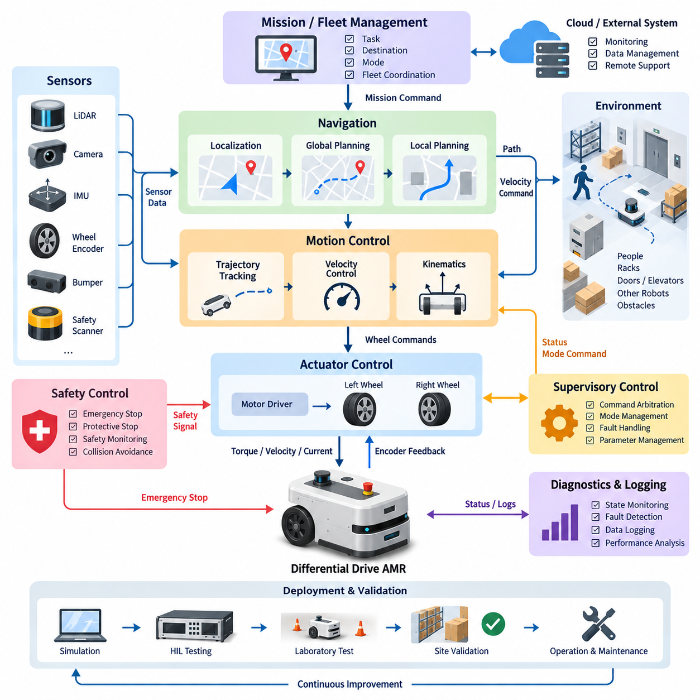
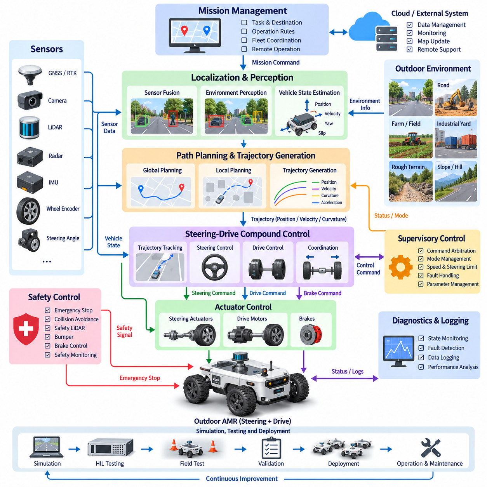
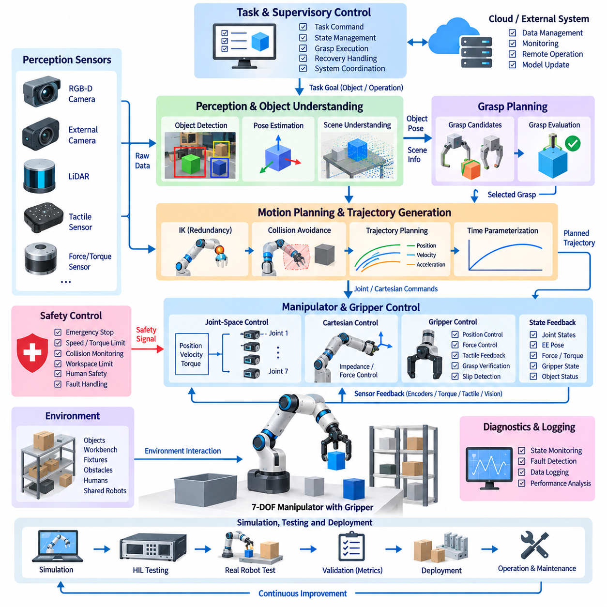
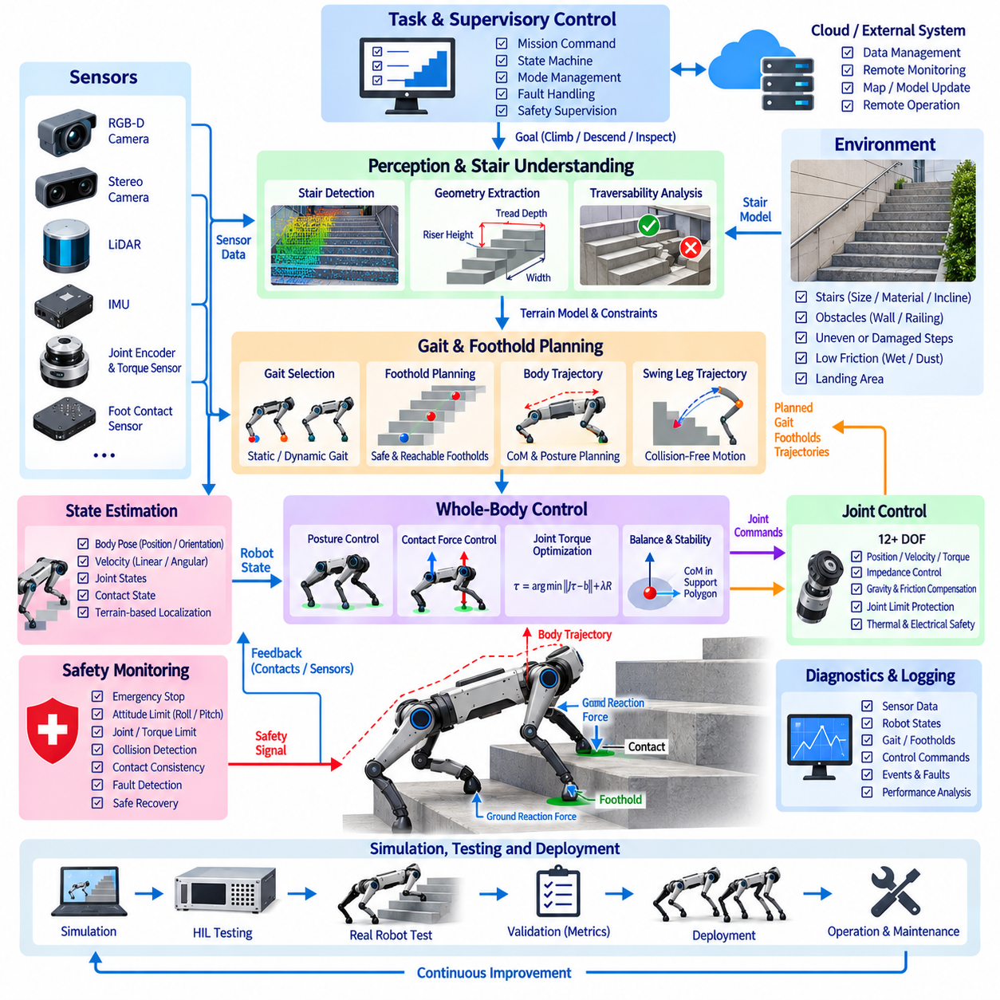
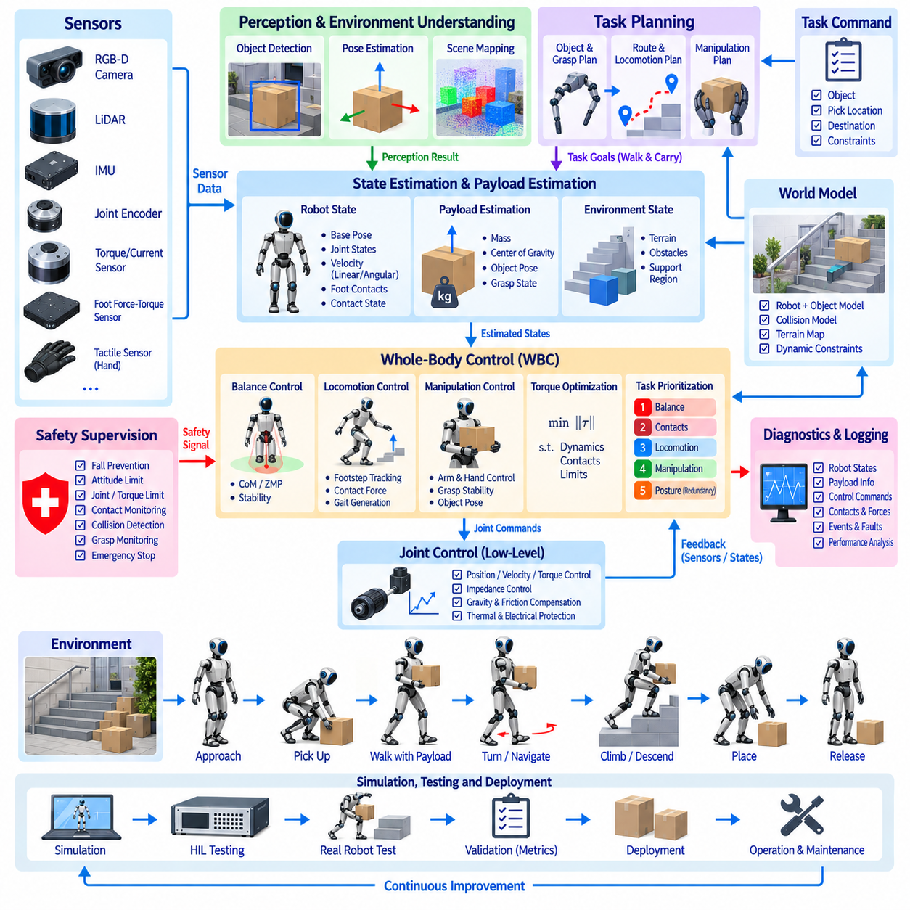
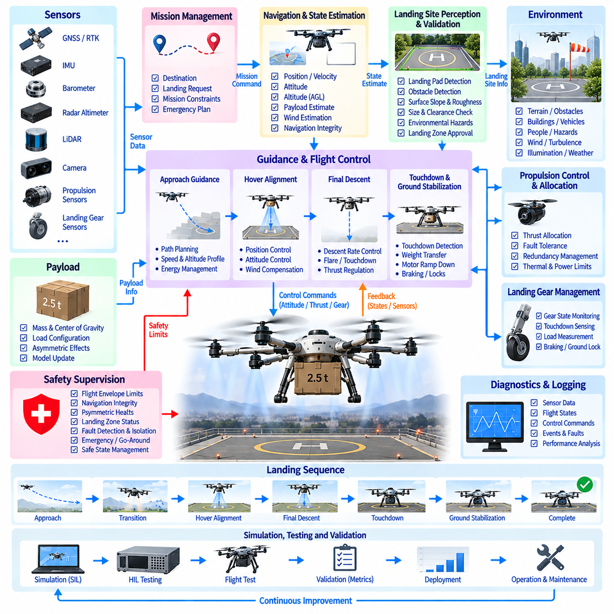
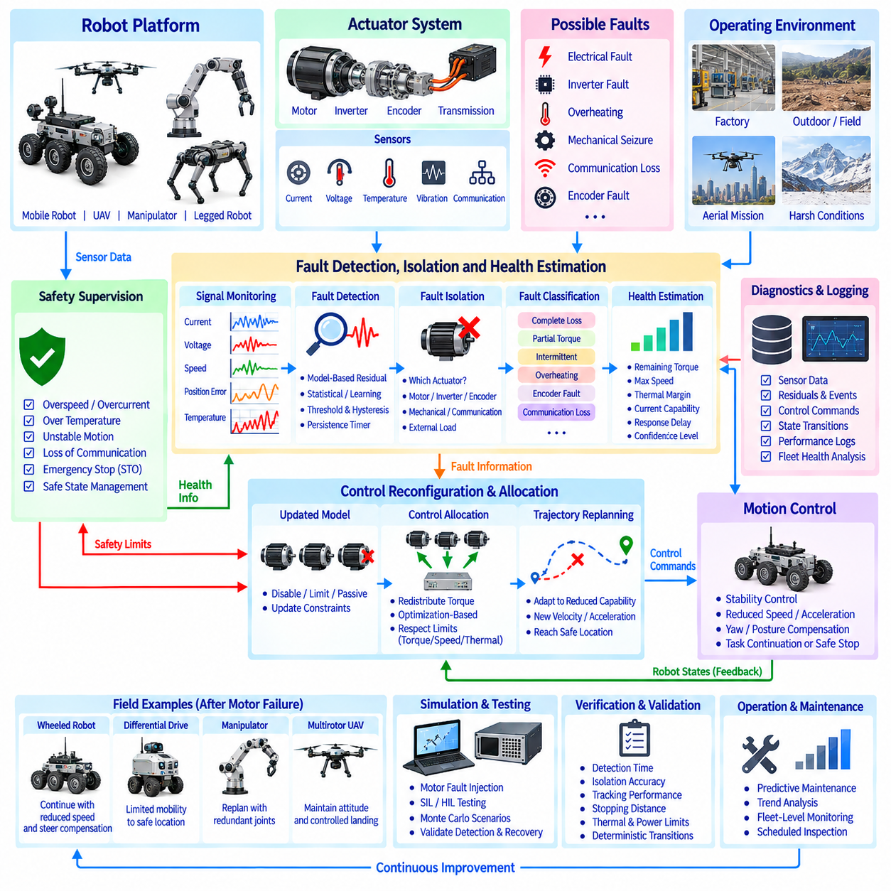
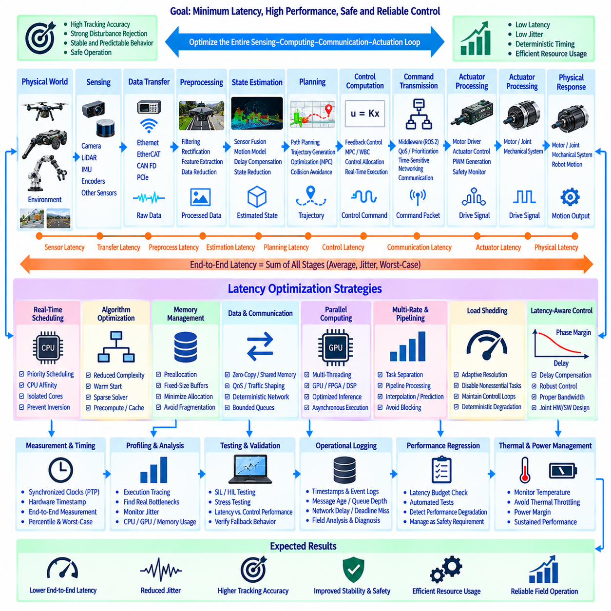
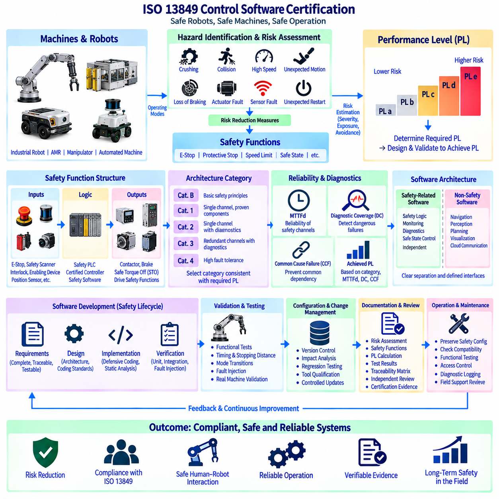
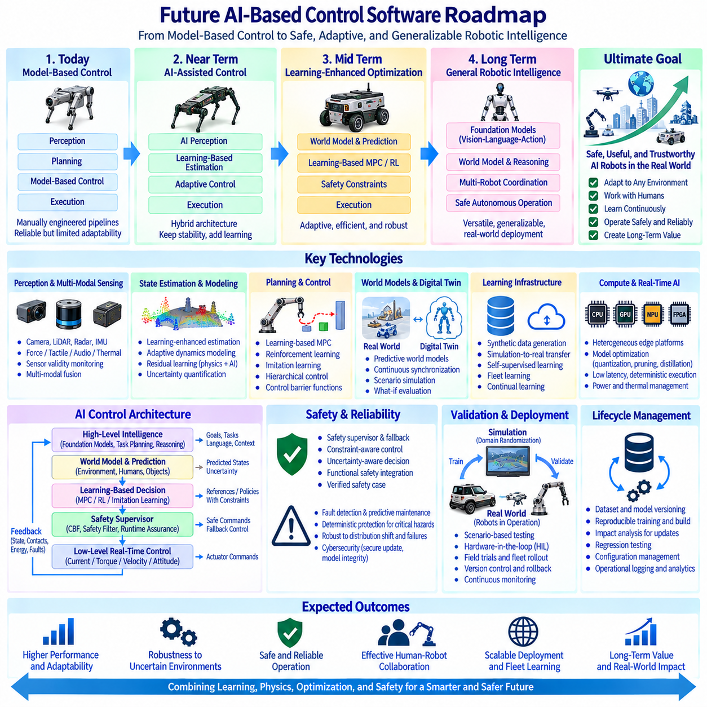

**Volume 04 Robot Control Software**

# 12. Control Case Studies

## 12.01 Indoor AMR Differential Drive Control SW Integration

{width="7.268055555555556in" height="7.268055555555556in"}

차동 구동(Differential Drive)을 사용하는 실내 자율이동로봇(Indoor Autonomous Mobile Robot, AMR)은 기계적 구조가 단순하고 소형화가 가능하며 저속에서 정밀한 기동이 가능하기 때문에 공장, 창고, 병원 및 물류센터에서 널리 활용된다. 제어 소프트웨어 통합(Control Software Integration)은 이러한 기본적인 2륜 운동학(Two-Wheel Kinematics) 구조를 위치추정(Localization), 경로계획(Planning), 속도제어(Velocity Control), 모터제어(Motor Control), 안전감시(Safety Supervision), 진단(Diagnostics), 통신(Communication)을 명확하게 정의된 실시간 인터페이스(Real-Time Interface)를 통해 조정하는 완전한 자율 시스템으로 변환한다.

일반적인 차동 구동(Differential Drive) AMR은 독립적으로 구동되는 좌측 및 우측 휠 그룹(Wheel Group), 휠 엔코더(Wheel Encoder), 모터 드라이브(Motor Drive), 관성측정장치(Inertial Measurement Unit, IMU), 안전센서(Safety Sensor), 그리고 하나 이상의 라이다(LiDAR) 또는 비전센서(Vision Sensor)로 구성된다. 소프트웨어는 로봇의 기하학적 구조(Robot Geometry)에 따라 요구되는 선속도(Linear Velocity)와 각속도(Angular Velocity)를 개별 휠 속도 기준값(Wheel-Speed Reference)으로 변환한다. 따라서 정확한 휠 반경(Wheel Radius)과 윤거(Track Width) 파라미터가 중요하며, 체계적인 보정오차(Calibration Error)는 주행거리 및 방향각 오차로 직접 이어진다.

제어 아키텍처(Control Architecture)는 일반적으로 임무(Mission), 내비게이션(Navigation), 모션제어(Motion Control), 액추에이터(Actuator) 계층으로 구분된다. 플릿 또는 임무관리자(Fleet or Mission Manager)는 목적지와 운용명령을 제공하고, 내비게이션 계층(Navigation Layer)은 로봇 자세(Pose)를 추정하여 충돌 없는 경로를 생성한다. 지역경로계획기(Local Planner)는 경로를 실행 가능한 속도명령으로 변환하고, 모션제어기(Motion Controller)는 좌우 휠 기준값을 계산한다. 마지막으로 액추에이터 계층(Actuator Layer)은 임베디드 모터 드라이브 루프(Embedded Motor-Drive Loop)를 통해 토크(Torque), 속도(Velocity) 또는 전류제어(Current Control)를 수행한다.

위치추정(Localization)은 휠 오도메트리(Wheel Odometry)를 IMU, 라이다(LiDAR), 카메라(Camera) 또는 기타 환경측정값과 통합한다. 엔코더 데이터(Encoder Data)는 높은 주기로 증분 이동정보를 제공하지만 휠 반경의 불확실성, 바닥 불균일, 미끄러짐(Slip), 기계적 공차(Mechanical Tolerance)로 인해 오차가 누적된다. IMU 측정값은 단기적인 각도 추정(Angular Estimation)을 향상시키며, 라이다 기반 위치추정(LiDAR-Based Localization) 또는 비전 기반 위치추정(Visual Localization)은 누적 드리프트(Accumulated Drift)를 제한하는 환경 기준을 제공한다. 따라서 센서융합(Sensor Fusion)은 내비게이션 및 제어루프에 필요한 안정적인 자세추정(Pose Estimation)을 제공한다.

차동 구동 운동학(Differential-Drive Kinematics)은 내비게이션 명령과 휠 액추에이터 사이에 간결한 인터페이스를 제공한다. 요구 전진속도(Commanded Forward Velocity)는 좌우 휠 움직임의 공통 성분을 결정하고, 각속도(Angular Velocity)는 두 휠 사이의 차동 성분(Differential Component)을 생성한다. 소프트웨어는 최대 휠 속도, 가속도, 감속도 및 각속도 제한도 적용해야 한다. 이러한 제약조건은 수학적으로 유효한 내비게이션 명령이 모터, 감속기(Gearbox), 타이어 마찰, 배터리 또는 적재하중(Payload)에 따른 물리적 한계를 초과하는 것을 방지한다.

속도제어 계층(Velocity-Control Layer)은 명목상 운동학 명령과 실제 차량 거동 사이의 차이를 보상해야 한다. 개별 휠 속도제어기(Wheel-Speed Controller)는 엔코더 피드백을 이용하여 각각의 모터를 제어할 수 있으며, 상위 제어기(Upper-Level Controller)는 선형 및 회전 운동을 보정한다. PID 기반 제어(PID-Based Control)는 단순성과 결정론적 실행(Deterministic Execution) 특성 때문에 널리 사용되지만, 적재하중, 바닥 마찰, 배터리 전압 및 운행속도가 크게 변화하는 경우 피드포워드(Feedforward), 게인 스케줄링(Gain Scheduling), 외란 관측기(Disturbance Observer), 모델 기반 보상(Model-Based Compensation)을 통해 성능을 향상시킬 수 있다.

궤적추종(Trajectory Tracking)은 지역경로계획기(Local Planner)와 저수준 휠 제어기(Low-Level Wheel Controller)를 연결한다. 제어기는 개별 속도명령을 독립적으로 실행하는 대신 계획된 궤적에 대한 위치, 방향각, 곡률 및 속도오차를 지속적으로 평가한다. 생성되는 보정값은 휠 미끄러짐과 진동을 방지할 수 있도록 충분히 부드러워야 한다. 특히 저속에서는 엔코더 양자화(Encoder Quantization), 구동계 백래시(Drivetrain Backlash), 정지마찰(Static Friction), 모터 데드존(Motor Dead Zone)의 상대적인 영향이 증가하므로 별도의 처리가 필요한 경우가 많다.

실내 AMR은 사람, 랙(Rack), 출입문, 엘리베이터, 생산설비 및 다른 로봇 주변에서 빈번하게 운행되므로 시스템 안전개념(System Safety Concept)에서 요구되는 경우 안전제어(Safety Control)는 일반 내비게이션 기능과 기능적으로 분리되어야 한다. 안전 스캐너(Safety Scanner), 비상정지 회로(Emergency-Stop Circuit), 범퍼센서(Bumper Sensor), 드라이브 활성화 신호(Drive Enable Signal), 안전제어기(Safety Controller)는 상위 자율주행 기능과 독립적으로 보호정지(Protective Stop)를 수행할 수 있다. 동시에 모션 소프트웨어는 일상적인 장애물 대응이 불필요하게 비상동작을 유발하지 않도록 제어된 감속과 정지를 조정해야 한다.

명령중재(Command Arbitration)는 여러 소프트웨어 구성요소가 동시에 이동을 요청할 수 있기 때문에 필수적이다. 자율 내비게이션(Autonomous Navigation), 도킹(Docking), 수동제어(Manual Control), 유지보수 기능(Maintenance Function), 복구동작(Recovery Behavior), 안전 메커니즘(Safety Mechanism)이 액추에이터 접근권한을 직접 경쟁해서는 안 된다. 감독 상태기계(Supervisory State Machine) 또는 명령 멀티플렉서(Command Multiplexer)를 통해 명확한 우선순위와 제어권을 설정해야 한다. 운전모드 사이의 전환에서는 제어기 상태를 초기화하거나 동기화하여 잔류 적분값(Residual Integrator Value)이나 오래된 속도명령(Stale Velocity Command)으로 인한 의도하지 않은 움직임을 방지해야 한다.

도킹(Docking)은 일반적인 복도 내비게이션보다 높은 정확도를 요구한다. 로봇은 전역 위치추정(Global Localization)과 경로추종(Path Following)에서 라이다 반사체(LiDAR Reflector), 기준마커(Fiducial Marker), 카메라, 근접센서(Proximity Sensor) 또는 충전스테이션 기준정보를 이용하는 전용 도킹제어기(Docking Controller)로 전환할 수 있다. 정렬 정확도가 높아질수록 속도는 단계적으로 감소한다. 접근에 실패하면 제어되지 않은 반복 보정 대신 제한된 재시도(Bounded Retry), 제어된 후진, 위치추정 검증 및 고장보고(Fault Reporting)를 수행해야 한다.

통신 아키텍처(Communication Architecture)는 제어 신뢰성에 큰 영향을 미친다. 상위 모듈은 ROS 2와 같은 미들웨어(Middleware)를 통해 자세, 경로, 상태 및 속도정보를 교환할 수 있으며, 임베디드 제어기와 모터 드라이브 사이에는 결정론적 필드버스(Deterministic Fieldbus) 또는 산업용 이더넷(Industrial Ethernet)을 사용할 수 있다. 메시지 타임스탬프(Message Timestamp), 갱신주기(Update Period), 순서정보(Sequence Information), 타임아웃 감시(Timeout Supervision), 좌표계 정의(Coordinate-Frame Definition)를 명확하게 규정해야 한다. 올바른 명령이라도 지나치게 늦게 도착하면 잘못된 명령만큼 위험하거나 효과가 없을 수 있다.

실시간 실행(Real-Time Execution)은 소프트웨어 스택(Software Stack)의 계층별로 서로 다른 타이밍 클래스를 요구한다. 모터 전류 및 속도루프는 일반적으로 차량 수준 모션제어보다 빠르게 실행되며, 위치추정, 지역경로계획, 임무관리는 점차 낮은 주기로 동작한다. 따라서 모든 모듈이 동일한 주기를 공유한다고 가정해서는 안 된다. 비동기 데이터(Asynchronous Data)를 관리하면서 결정론적 액추에이터 동작과 제한된 명령지연(Bounded Command Latency)을 유지하기 위해 버퍼(Buffer), 타임스탬프, 보간(Interpolation), 예측(Prediction), 워치독(Watchdog)을 활용한다.

고장처리(Fault Handling)는 센서 손실, 엔코더 불일치, 모터 드라이브 고장, 위치추정 성능저하, 통신 타임아웃, 과도한 추종오차, 배터리 이상 및 연산 과부하를 포함해야 한다. 각 고장은 제어가능성(Controllability)과 안전에 미치는 영향에 따라 분류된다. 감독제어기(Supervisory Controller)는 속도를 낮추거나 자율운전을 비활성화하고, 제어정지(Controlled Stop)를 수행하거나 비상정지(Emergency Shutdown)를 요청할 수 있다. 이후 분석을 위해 진단정보에는 타임스탬프, 운전상태, 명령값, 측정응답 및 고장상태 전환정보가 보존되어야 한다.

적재하중 변화(Payload Variation)는 기하학적 운동학이 변하지 않더라도 AMR의 동적 특성에 상당한 영향을 미친다. 질량 증가는 가속성능, 제동거리, 모터전류, 타이어 변형 및 바닥조건에 대한 민감도를 변화시킨다. 따라서 양산 제어시스템(Production Control System)은 적재상태에 따라 가속도 제한, 제어기 게인(Controller Gain), 정지 프로파일(Stopping Profile)을 선택할 수 있다. 적재하중 추정(Payload Estimation)이 가능하다면 검증된 운용범위(Validated Operating Envelope) 내에서 이러한 파라미터를 자동으로 조정할 수 있다.

소프트웨어 통합에는 일관된 좌표계(Coordinate System)와 단위(Unit) 관리도 필요하다. 지도(Map), 오도메트리(Odometry), 로봇 베이스(Robot Base), 센서 및 휠 프레임은 명확한 변환계층(Transformation Hierarchy)을 구성해야 하며, 양의 회전방향, 속도, 거리 및 타임스탬프 규칙은 모든 모듈에서 동일해야 한다. 많은 통합 결함은 제어 알고리즘 자체보다 좌표 프레임, 부호, 스케일링 계수(Scaling Factor), 오래된 변환정보(Stale Transform), 또는 명령이 휠, 차체, 궤적 중 어떤 물리량을 나타내는지에 대한 불일치에서 발생한다.

시뮬레이션(Simulation)과 하드웨어 인 더 루프 시험(Hardware-in-the-Loop Testing, HIL)은 실제 배치 이전의 위험을 감소시킨다. 디지털 로봇 모델(Digital Robot Model)을 이용하여 운동학, 명령중재, 궤적추종, 상태전환 및 고장대응을 반복 가능한 시나리오에서 검증할 수 있다. HIL 환경에서는 실제 제어기, 통신 인터페이스 또는 모터 드라이브를 시뮬레이션된 로봇 동역학과 연결한다. 동일한 소프트웨어 구성을 시뮬레이션, 실험실 시험, 통제된 시설시험, 실제 생산현장 검증으로 단계적으로 확장하면서 파라미터 변경이 추적 가능하도록 관리해야 한다.

성능검증(Performance Validation)은 최종 위치 정확도만 평가해서는 안 된다. 횡방향 및 방향각 추종오차, 속도오차, 제동거리, 명령지연, 위치추정 안정성, 휠 슬립, 도킹 반복정밀도(Docking Repeatability), CPU 사용률, 통신 지터(Communication Jitter), 외란 이후 복구시간 등을 측정해야 한다. 직선주행, 곡선, 좁은 통로, 교차로, 회전, 장애물 조우, 적재하중 변화, 센싱 성능저하 및 장시간 반복운전을 시험하여 짧은 시연에서는 발견하기 어려운 결함까지 확인해야 한다.

견고한 통합전략(Integration Strategy)은 구성관리(Configuration)를 제어시스템의 일부로 취급한다. 휠 형상, 엔코더 분해능, 모터 제한값, 제어기 게인, 가속도 제약조건, 안전 파라미터, 센서 변환정보, 네트워크 주소 및 소프트웨어 버전을 구성관리(Configuration Control) 대상으로 관리해야 한다. 필요한 경우 보정결과(Calibration Result)를 개별 로봇과 연계해야 한다. 이를 통해 문서화되지 않은 파라미터 변경으로 인해 동일한 사양의 AMR이 여러 고객 현장에서 서로 다른 동작을 보이는 문제를 방지할 수 있다.

운용 로깅(Operational Logging)은 개발과 현장성능 사이의 피드백 루프(Feedback Loop)를 완성한다. 시간 동기화된 로그(Time-Synchronized Log)를 이용하면 내비게이션 결정과 위치추정값, 휠 명령, 엔코더 응답, 안전 이벤트 및 모터 드라이브 진단정보를 상호 연계할 수 있다. 자동화 분석(Automated Analysis)을 통해 추종오차 증가, 비정상적인 전류소모, 반복적인 위치보정 또는 도킹 성능저하를 식별할 수 있다. 이러한 정보는 예방정비(Preventive Maintenance)를 지원하는 동시에 간헐적으로 발생하는 현장 고장을 조사할 때 엔지니어에게 재현 가능한 근거를 제공한다.

따라서 완성된 실내 차동 구동 AMR 제어 소프트웨어(Indoor Differential-Drive AMR Control Software)는 단순히 두 개의 휠 속도제어기를 내비게이션 알고리즘에 연결한 시스템이 아니다. 이는 임무명령이 검증된 궤적(Validated Trajectory)으로 변환되고, 궤적이 제약조건이 적용된 차체속도(Constrained Body Velocity)로 변환되며, 차체속도가 동기화된 휠 기준값(Synchronized Wheel Reference)으로 변환되고, 액추에이터 피드백이 다시 위치추정과 감독기능으로 반환되는 통합 계층구조(Integrated Hierarchy)이다. 신뢰성 있는 운용은 제어법칙(Control Law), 타이밍(Timing), 인터페이스, 안전 메커니즘, 진단, 보정 및 검증을 통합적으로 설계함으로써 구현된다.

## 12.02 Outdoor AMR Steering / Drive Compound Control Case

{width="7.268055555555556in" height="7.268055555555556in"}

실외 자율이동로봇(Outdoor Autonomous Mobile Robot)은 조향(Steering), 구동력(Traction), 지형 상호작용(Terrain Interaction), 차량 동역학(Vehicle Dynamics)을 동시에 제어해야 하기 때문에 실내 AMR보다 훨씬 다양한 환경조건에서 운용된다. 조향-구동 복합제어(Steering-Drive Compound Control) 아키텍처는 조향 액추에이터(Steering Actuator)와 추진 모터(Propulsion Motor)를 독립적으로 다루지 않고 하나의 통합된 모션 시스템(Motion System)으로 조정한다. 이러한 통합은 도로, 건설현장, 농장, 캠퍼스, 산업단지 및 기타 비정형 실외환경(Unstructured Outdoor Environment)에서 운용되는 로봇에 필수적이다.

차량 플랫폼(Vehicle Platform)은 전륜조향(Front-Wheel Steering), 4륜조향(Four-Wheel Steering), 독립 휠 구동(Independent Wheel Drive), 6륜구동(Six-Wheel Drive) 또는 이러한 메커니즘의 조합을 사용할 수 있다. 주로 휠 속도 차이를 이용하여 요(Yaw)를 생성하는 차동 구동(Differential Drive) 로봇과 달리, 조향 기반 플랫폼은 휠 방향을 통해 횡방향 운동(Lateral Motion)을 생성하고 추진계는 종방향 힘(Longitudinal Force)을 제어한다. 따라서 복합제어 소프트웨어(Compound Control Software)는 요구 차량속도, 곡률(Curvature), 요 거동(Yaw Behavior)을 기계적 기하구조와 일치하는 동기화된 조향각 및 휠 속도명령으로 변환해야 한다.

소프트웨어 아키텍처(Software Architecture)는 일반적으로 임무관리(Mission Management), 위치추정(Localization), 경로계획(Path Planning), 궤적생성(Trajectory Generation), 차량 모션제어(Vehicle Motion Control), 액추에이터 제어(Actuator Control), 안전감시(Safety Supervision)로 구분된다. 임무명령은 목적지와 운용 제약조건을 정의하고, 내비게이션(Navigation)은 기하학적으로 실행 가능한 경로를 생성한다. 이후 궤적계획기(Trajectory Planner)가 속도 및 곡률 프로파일을 할당한다. 복합 모션제어기(Compound Motion Controller)는 이러한 기준값을 조정된 조향 및 구동명령으로 변환하고, 임베디드 제어기(Embedded Controller)가 개별 조향 모터와 추진 액추에이터를 제어한다.

실외 위치추정(Outdoor Localization)은 일반적으로 위성항법시스템(GNSS), 실시간 이동측위 보정(RTK Correction), 관성측정장치(IMU), 휠 엔코더(Wheel Encoder), 조향각 센서(Steering-Angle Sensor), 라이다(LiDAR), 카메라(Camera), 경우에 따라 레이더(Radar)를 결합한다. GNSS는 전역 위치정보를 제공하지만 건물, 식생, 터널 또는 기타 신호차단 구조물 주변에서는 성능이 저하될 수 있다. 휠 오도메트리(Wheel Odometry)와 IMU는 높은 주기의 국부 운동추정값을 제공하고, 환경 인식(Environmental Perception)은 누적 드리프트(Accumulated Drift)를 제한한다. 센서융합(Sensor Fusion)은 개별 위치정보원이 일시적으로 불안정해지더라도 연속적인 차량상태를 유지해야 한다.

차량상태 추정(Vehicle-State Estimation)은 복합제어가 조향각, 휠 속도, 요율(Yaw Rate), 종방향 가속도(Longitudinal Acceleration), 그리고 경우에 따라 횡방향 속도 또는 타이어 슬립(Tire Slip)에 의존하므로 위치와 방향각 이상의 정보를 포함한다. 추정기(Estimator)는 예측된 차량운동과 측정응답을 비교하여 불일치를 탐지할 수 있다. 명령된 조향 기하구조가 특정 요율을 예측하지만 IMU가 크게 다른 거동을 보고한다면 시스템은 타이어 슬립, 조향오차, 불균일 지형 또는 노면 마찰저하 가능성을 식별할 수 있다.

조향 차량의 경로계획(Path Planning)은 비홀로노믹 제약조건(Nonholonomic Constraint)과 최소 회전반경(Minimum Turning Radius)을 고려해야 한다. 기하학적으로 충돌이 없는 경로라도 곡률 변화가 조향능력을 초과하면 로봇이 실제로 추종할 수 없다. 따라서 경로계획기는 차량크기, 휠베이스(Wheelbase), 조향한계(Steering Limit), 관절 특성(Articulation Characteristic), 주행방향 변경을 고려해야 한다. 대형 적재물을 운반하는 실외 AMR에서는 후륜과 차량 모서리가 조향축과 서로 다른 궤적을 따르기 때문에 스윕 경로 분석(Swept-Path Analysis)이 특히 중요하다.

궤적생성(Trajectory Generation)은 기하학적 경로를 위치, 방향각, 곡률, 속도 및 가속도를 포함하는 시간 종속 기준값(Time-Dependent Reference)으로 변환한다. 속도는 조향동작이 이미 시작된 이후가 아니라 급격한 곡선에 진입하기 전에 감소되어야 한다. 지형 경사, 적재하중(Payload), 노면상태, 장애물 근접도 및 정지거리에 따라 속도 프로파일을 추가로 조정할 수 있다. 부드러운 곡률 및 가속도 전환은 조향 액추에이터의 부하, 타이어 스크럽(Tire Scrub), 화물의 흔들림 및 과도 추종오차(Transient Tracking Error)를 감소시킨다.

조향제어(Steering Control)는 차량 구성에 따라 요구 곡률을 액추에이터 명령으로 변환한다. 애커만 방식 조향(Ackermann-Type Steering)에서는 내측 및 외측 휠의 연장축이 대략 하나의 순간회전중심(Instantaneous Center of Rotation)에서 만나도록 서로 다른 조향각이 필요하다. 4륜조향(Four-Wheel Steering)은 작은 회전반경을 위한 역상조향(Opposite-Phase Steering)과 횡방향 이동을 위한 동상조향(Same-Phase Steering) 등의 추가 모드를 제공한다. 소프트웨어는 불연속적인 휠 명령이 발생하지 않도록 이러한 조향 구성 사이의 전환을 명확하게 관리해야 한다.

구동제어(Drive Control)는 가속도와 토크 제한을 준수하면서 요구 종방향 속도를 달성하는 데 필요한 추진력을 결정한다. 독립 휠 모터(Independent Wheel Motor)는 회전 시 각 휠이 서로 다른 반경의 궤적을 이동하기 때문에 서로 다른 속도 기준값이 필요할 수 있다. 회전 중 모든 휠에 동일한 속도를 적용하면 타이어 스크럽, 전류소모 증가 및 추종오차가 발생할 수 있다. 따라서 복합제어는 조향 기하구조를 기반으로 휠 속도 기준값을 계산하고, 폐루프 모터제어기(Closed-Loop Motor Controller)는 구동계 외란과 하중변화를 보상한다.

중앙 조정계층(Central Coordination Layer)은 조향과 추진을 동기화한다. 회전 시에는 특히 저속 또는 마찰이 높은 노면에서 과도한 추진토크가 적용되기 전에 조향 액추에이터가 요구 조향각에 충분히 접근해야 한다. 고속주행에서는 안정성 제약조건에 따라 급격한 조향명령을 제한해야 한다. 명령 스케줄링(Command Scheduling)은 조향속도, 휠 가속도 및 차량속도를 조정하여 요구 기동이 단순히 기하학적 운동학 조건만 만족하는 것이 아니라 동역학적으로도 실행 가능하도록 한다.

궤적추종(Trajectory Tracking)은 추정된 차량상태와 계획된 궤적을 지속적으로 비교한다. 횡방향 오차(Lateral Error), 방향각 오차(Heading Error), 곡률오차(Curvature Error), 종방향 속도오차(Longitudinal Velocity Error)는 기하학적 제어기, PID, 모델 기반 제어(Model-Based Control), 예측제어(Predictive Control) 등을 통해 처리할 수 있다. 순수추종(Pure Pursuit)과 스탠리 방식(Stanley-Type Method)은 실용적인 기하학적 방법을 제공하며, 모델예측제어(Model Predictive Control, MPC)는 조향, 속도, 가속도 및 액추에이터 제약조건을 명시적으로 처리할 수 있다. 선택된 제어방식은 목표 속도, 적재하중 및 노면조건 범위에서 견고하게 동작해야 한다.

저속운전(Low-Speed Operation)은 일반적인 실외주행과 다른 제어 문제를 발생시킨다. 정밀 도킹 또는 협소공간 기동에서는 조향 백래시(Steering Backlash), 타이어 변형, 모터 데드존(Motor Dead Zone), 엔코더 양자화(Encoder Quantization)의 영향이 더욱 뚜렷해진다. 고속에서는 조향지연(Steering Delay), 횡방향 동역학(Lateral Dynamics), 타이어 힘(Tire Force), 안정성이 점차 중요해진다. 따라서 게인 스케줄링(Gain Scheduling) 또는 모드 종속 제어기(Mode-Dependent Controller)를 통해 속도, 적재하중, 조향구성 및 추정된 지형조건에 따라 추종 파라미터를 조정할 수 있다.

지형 상호작용(Terrain Interaction)은 실내제어와 실외제어를 구분하는 주요 요소이다. 자갈, 잔디, 진흙, 경사면, 배수로, 연석 및 불균일한 포장도로는 휠 슬립(Wheel Slip)이나 일시적인 접지손실을 발생시킬 수 있다. 제어기는 명령된 휠 속도가 차량속도를 직접 나타낸다고 가정해서는 안 된다. 휠 엔코더를 GNSS, IMU, 비전 또는 라이다 기반 운동추정값과 비교하면 슬립 지표(Slip Indicator)를 얻을 수 있으며, 접지력이 저하될 경우 가속도, 토크 또는 속도 제한을 낮출 수 있다.

다축(Multi-Axle) 또는 6륜 플랫폼(Six-Wheel Platform)에서는 하중분배(Load Distribution)와 휠-지면 상호작용(Wheel-Ground Interaction)이 복합제어를 더욱 복잡하게 만든다. 로봇이 불균일 지형을 통과하면 각 휠에 서로 다른 수직하중(Normal Force)이 작용할 수 있다. 단순한 균등토크(Equal-Torque) 전략은 하중이 작은 휠의 공회전을 유발하는 반면, 하중이 큰 휠에는 충분한 구동력을 제공하지 못할 수 있다. 액추에이터 하드웨어가 지원하는 경우 토크배분(Torque Allocation)은 차량 수준의 운동요구를 유지하면서 추정 휠 하중, 슬립상태, 모터성능 및 열적 한계를 고려할 수 있다.

적재하중 변화(Payload Variation)는 실외 AMR의 동역학에 큰 영향을 미친다. 적재하중이 증가하면 관성, 제동거리, 타이어 하중, 구동계 요구량 및 전복 민감도(Rollover Sensitivity)가 증가하는 반면 가속 여유는 감소한다. 감독제어기(Supervisory Controller)는 적재상태에 따라 검증된 속도, 가속도, 조향속도 및 제동한계를 선택할 수 있다. 하중센서(Load Sensor) 또는 서스펜션 측정값(Suspension Measurement)을 사용할 수 있다면 시스템은 조향응답과 차량안정성에 영향을 줄 수 있는 비대칭 적재(Asymmetric Loading)도 탐지할 수 있다.

경사면 제어(Slope Control)는 추진과 제동의 조정된 동작을 요구한다. 오르막에서는 목표속도를 유지하기 위해 추가적인 구동토크가 필요할 수 있으며, 내리막에서는 기준속도를 초과하는 가속을 방지하기 위해 회생제동(Regenerative Braking) 또는 기계식 제동(Mechanical Braking)이 필요할 수 있다. 경사로 출발(Hill-Start) 및 경사로 유지(Hill-Hold) 기능은 의도하지 않은 후방 밀림을 방지해야 한다. 급경사 또는 횡경사 지형에서는 과도한 횡가속도가 안정성 여유를 감소시킬 수 있으므로 조향명령에도 더 엄격한 제한이 필요할 수 있다.

장애물 회피(Obstacle Avoidance)는 조향 기하구조와 호환되는 명령을 생성해야 한다. 지역경로계획기(Local Planner)는 새롭게 확보된 방향으로 차량이 즉시 회전할 수 있다고 가정해서는 안 된다. 긴급회피(Emergency Avoidance), 일반적인 재계획(Replanning), 제어정지(Controlled Stopping)는 현재 조향각, 조향속도, 차량속도 및 가용 제동거리를 고려해야 한다. 대형 로봇에서는 장애물 확장(Obstacle Inflation)을 계산할 때 순간적인 직사각형 차체 영역만이 아니라 전체 스윕 영역(Swept Envelope)을 고려해야 한다.

안전감시(Safety Supervision)는 일반 모션제어와 병행하여 동작하며 독립적인 속도제한 또는 정지명령을 적용할 수 있다. 비상정지 회로(Emergency-Stop Circuit), 안전 라이다(Safety LiDAR), 범퍼(Bumper), 드라이브 활성화 신호(Drive Enable Signal), 브레이크 제어기(Brake Controller), 조향상태 감시(Steering-State Monitoring)가 안전 아키텍처에 포함될 수 있다. 복합제어는 충분한 시간이 존재하는 경우 예측 가능한 제어정지(Controlled Stop)를 지원하는 동시에 즉각적인 보호대응이 필요한 경우 안전 하드웨어가 독립적으로 추진력을 차단하거나 제동을 적용할 수 있도록 해야 한다.

명령중재(Command Arbitration)는 자율 내비게이션, 원격운전(Remote Operation), 도킹(Docking), 복구(Recovery), 유지보수(Maintenance), 안전기능이 서로 충돌하는 조향 또는 구동명령을 발생시키는 것을 방지한다. 감독 상태기계(Supervisory State Machine)는 명령 제어권(Command Ownership)을 설정하고 운전모드 사이의 허용 가능한 전환을 정의한다. 모드 전환 시에는 차량속도, 조향위치, 브레이크 상태, 위치추정 유효성 및 액추에이터 준비상태를 확인한 후 모션 제어권을 이전함으로써 오래되거나 호환되지 않는 명령이 차량으로 전달되는 것을 방지해야 한다.

통신 타이밍(Communication Timing)은 조향 및 추진명령이 동일한 의도 차량상태를 나타내야 하기 때문에 매우 중요하다. 분산제어기(Distributed Controller)는 CAN, CAN FD, 이더캣(EtherCAT), 산업용 이더넷(Industrial Ethernet) 또는 기타 결정론적 네트워크(Deterministic Network)를 통해 통신할 수 있으며, 상위 자율주행 기능은 ROS 2와 같은 미들웨어(Middleware)를 사용할 수 있다. 타임스탬프, 순서카운터(Sequence Counter), 워치독(Watchdog), 명령 유효기간(Command Validity Period), 동기화된 시계(Synchronized Clock)를 이용하면 지연되거나 누락된 메시지를 탐지할 수 있다. 그렇지 않으면 현재 조향명령과 오래된 속도명령의 조합으로 의도하지 않은 기동이 발생할 수 있다.

고장관리(Fault Management)는 조향 액추에이터 고장, 휠 속도 불일치, 모터 과전류, 브레이크 고장, 센서 성능저하, 위치추정 손실, 통신 타임아웃, 과도한 슬립 및 궤적추종 발산(Trajectory-Tracking Divergence)을 처리해야 한다. 고장대응은 남아 있는 제어가능성에 따라 결정된다. 시스템은 속도를 낮추거나 조향을 제한하고, 성능저하 운전(Degraded Operation)으로 전환하거나 제어정지를 수행하거나 비상상태를 활성화할 수 있다. 진단로그(Diagnostic Log)는 이후 고장의 물리적 원인을 재구성할 수 있도록 명령값과 측정응답을 모두 보존해야 한다.

시뮬레이션(Simulation)은 복합 조향-구동 거동이 초기 개발단계에서 안전하게 재현하기 어려운 상호작용을 포함하기 때문에 특히 중요하다. 차량모델(Vehicle Model)을 이용하여 조향 기하구조, 액추에이터 지연, 타이어 슬립, 경사면 거동, 적재하중 변화 및 고장조건을 평가할 수 있다. 하드웨어 인 더 루프 시험(Hardware-in-the-Loop Testing, HIL)은 실제 조향제어기, 모터 드라이브, 네트워크 인터페이스 및 감독 전자제어장치(Supervisory ECU)를 시뮬레이션된 차량 동역학과 연결하여 본격적인 실외시험 이전에 통합동작을 검증할 수 있다.

검증(Validation)은 평탄한 포장도로, 곡선, 경사면, 험지, 저마찰 노면, 좁은 통로, 장애물 회피, 도킹, 적재하중 변화 및 센서 성능저하 조건을 단계적으로 포함해야 한다. 성능지표(Performance Metric)는 횡방향 추종오차, 방향각 오차, 조향오차, 휠 속도오차, 제동거리, 슬립률(Slip Ratio), 명령지연, 에너지소비, 액추에이터 온도 및 복구거동을 포함할 수 있다. 열적 영향, 보정 드리프트(Calibration Drift), 기계적 마모 및 간헐적인 통신고장은 짧은 시연에서 나타나지 않을 수 있으므로 장시간 시험(Long-Duration Test)이 필요하다.

양산 수준의 복합제어 시스템(Production-Ready Compound Control System)은 체계적인 보정(Calibration)과 구성관리(Configuration Management)도 필요로 한다. 휠베이스, 윤거(Track Width), 조향비(Steering Ratio), 조향 오프셋(Steering Offset), 타이어 반경, 엔코더 스케일(Encoder Scale), 액추에이터 제한, 제어기 게인, 센서 변환정보(Sensor Transform), 적재하중 파라미터 및 네트워크 구성을 추적 가능하게 관리해야 한다. 차량별 보정 데이터(Vehicle-Specific Calibration Data)를 공통 소프트웨어와 분리하면 여러 로봇 파생모델이 문서화되지 않은 동작 차이를 발생시키지 않으면서 동일한 제어 아키텍처를 공유할 수 있다.

통합된 실외 AMR 제어시스템은 궁극적으로 임무의도(Mission Intent)에서 실제 타이어-지면 상호작용(Tire-Ground Interaction)에 이르는 폐루프 계층구조(Closed Hierarchy)를 형성한다. 내비게이션은 로봇이 어디로 이동해야 하는지를 정의하고, 궤적생성은 어떻게 이동해야 하는지를 정의하며, 복합제어는 조정된 조향 및 추진거동을 결정하고, 액추에이터 제어기는 명령을 실행하며, 상태추정(State Estimation)은 측정된 운동을 다시 제어루프로 반환한다. 신뢰성 있는 실외 자율주행(Reliable Outdoor Autonomy)은 기하구조, 동역학, 접지력, 타이밍, 안전, 진단 및 검증을 하나의 통합된 제어시스템으로 설계할 때 구현된다.

## 12.03 7-DOF Manipulator Grasping Control SW Case

{width="7.268055555555556in" height="7.268055555555556in"}

7자유도 매니퓰레이터(Seven-Degree-of-Freedom Manipulator)는 일반적인 6축 산업용 로봇보다 높은 운동 중복성(Motion Redundancy)을 제공하여, 원하는 엔드이펙터 자세(End-Effector Pose)를 달성하면서도 로봇의 자세를 추가로 최적화할 수 있는 자유도를 유지한다. 파지(Grasping) 응용에서는 이러한 중복성을 활용하여 장애물을 회피하고, 관절 여유도를 유지하며, 조작성(Manipulability)을 향상시키고, 물체에 유리한 방향으로 접근할 수 있다. 제어 소프트웨어는 인식(Perception), 계획(Planning), 운동학(Kinematics), 동역학(Dynamics), 궤적실행(Trajectory Execution), 파지제어(Grasp Control), 안전(Safety)을 하나의 통합 시스템으로 조정해야 한다.

매니퓰레이터는 일반적으로 7개의 구동관절(Actuated Joint), 관절 엔코더(Joint Encoder), 모터 드라이브(Motor Drive), 토크 또는 전류센싱(Torque or Current Sensing), 엔드이펙터(End-Effector), 하나 이상의 인식센서(Perception Sensor)로 구성된다. 그리퍼(Gripper)는 응용분야에 따라 위치, 힘, 촉각(Tactile) 또는 근접센싱(Proximity Sensing)을 포함할 수 있다. 손목 장착형 RGB-D 카메라는 근거리 물체정보를 제공하고 외부 카메라는 전체 작업공간을 관찰할 수 있다. 모든 센서와 액추에이터는 보정된 좌표 프레임(Coordinate Frame)과 동기화된 인터페이스를 통해 표현되어야 한다.

소프트웨어 아키텍처(Software Architecture)는 인식(Perception), 작업계획(Task Planning), 파지계획(Grasp Planning), 모션계획(Motion Planning), 매니퓰레이터 제어(Manipulator Control), 그리퍼 제어(Gripper Control), 감독계층(Supervisory Layer)으로 구분할 수 있다. 작업명령은 대상 물체와 요구작업을 식별한다. 인식시스템은 물체 자세와 주변 기하구조를 추정하고, 파지계획은 후보 접촉구성을 생성하며, 모션계획은 충돌 없는 로봇팔 궤적을 결정한다. 이후 실시간 제어기는 피드백과 운용 제약조건을 감시하면서 관절 및 그리퍼 명령을 실행한다.

물체인식(Object Perception)은 RGB, 깊이(Depth), 포인트 클라우드(Point Cloud) 또는 멀티모달 센서 데이터(Multimodal Sensor Data)에서 대상 물체를 탐지하거나 분할하는 과정으로 시작된다. 인식시스템은 물체의 위치, 방향, 크기와 파지에 필요한 의미적 또는 기하학적 특성을 추정한다. 가능하면 자세 불확실성(Pose Uncertainty)도 유지해야 한다. 불확실한 인식결과로부터 수학적으로 정밀한 파지를 생성하더라도 실제 환경에서는 실패할 수 있기 때문이다. 따라서 신뢰도 정보(Confidence Information)는 접근거리, 속도 및 파지전략에 영향을 줄 수 있다.

좌표변환(Coordinate Transformation)은 매니퓰레이터 통합의 핵심이다. 카메라 프레임(Camera Frame)에서 탐지된 물체 자세는 모션계획과 제어 전에 로봇 베이스 프레임(Robot Base Frame)으로 변환되어야 한다. 변환체인(Transformation Chain)은 월드(World), 로봇 베이스(Robot Base), 숄더(Shoulder), 손목(Wrist), 카메라(Camera), 툴(Tool), 파지 프레임(Grasp Frame)을 포함할 수 있다. 핸드-아이 보정(Hand-Eye Calibration) 오차는 파지 정확도에 직접 영향을 미치므로 응용 소프트웨어 내부에 임의의 오프셋을 삽입하여 보상하기보다는 보정 파라미터를 체계적으로 검증해야 한다.

파지계획(Grasp Planning)은 엔드이펙터가 물체의 어디에 어떤 방식으로 접촉해야 하는지를 결정한다. 후보 파지는 기하학적 모델, 포인트 클라우드, 학습 기반 파지 네트워크(Learned Grasp Network), 사전 정의된 물체 템플릿(Object Template) 또는 이들의 조합을 통해 생성할 수 있다. 각 후보는 충돌위험, 도달가능성(Reachability), 접촉품질(Contact Quality), 접근여유(Approach Clearance), 힘 폐쇄(Force Closure), 매니퓰레이터 자세 및 관절한계와의 거리를 기준으로 평가할 수 있다. 기하학적으로 가장 우수한 파지가 전체 로봇팔에서 가장 실행하기 좋은 파지와 반드시 일치하는 것은 아니다.

7자유도는 여러 관절구성이 동일한 6차원 엔드이펙터 자세를 구현할 수 있기 때문에 역기구학(Inverse Kinematics)에 중복성(Redundancy)을 제공한다. 제어기 또는 계획기는 남는 자유도를 이용하여 부가적인 목표를 최적화할 수 있다. 일반적인 목표에는 조작성 극대화(Maximizing Manipulability), 특이점 회피(Singularity Avoidance), 팔꿈치 간격 확보(Elbow Clearance), 관절 이동량 최소화, 케이블 경로 유지 및 관절을 기계적 한계에서 멀리 유지하는 것이 포함된다. 따라서 중복성 해결(Redundancy Resolution)은 부수적인 기능이 아니라 핵심적인 제어기능이다.

역기구학(Inverse Kinematics)은 요구되는 툴 자세를 위치, 속도 및 관절범위 제약조건을 만족하는 실행 가능한 관절구성으로 변환한다. 특정 로봇구조에서는 해석적 방법(Analytical Method)을 사용할 수 있지만, 수치해석 솔버(Numerical Solver)는 임의의 7축 매니퓰레이터에 더 높은 유연성을 제공한다. 반복형 솔버(Iterative Solver)는 수렴성, 초기자세, 특이점 근접도 및 해의 연속성을 고려해야 한다. 그렇지 않으면 엔드이펙터 이동량이 작더라도 서로 동등한 역기구학 해 사이에서 갑작스러운 전환이 발생하여 큰 관절 움직임이 생성될 수 있다.

모션계획(Motion Planning)은 현재 매니퓰레이터 구성에서 사전 파지 자세(Pre-Grasp Configuration)까지 로봇 자체, 주변환경 또는 대상 물체와 충돌하지 않는 경로를 연결한다. RRT 계열과 같은 샘플링 기반 계획기(Sampling-Based Planner)는 폭넓게 적용할 수 있으며, 최적화 기반 방법(Optimization-Based Method)은 복잡한 제약조건에서 더욱 부드러운 궤적을 생성할 수 있다. 계획장면(Planning Scene)은 로봇 형상, 작업대, 고정장치, 장애물, 대상 물체 및 관련 불확실성 여유를 포함해야 한다. 중복형 로봇팔은 매우 접힌 자세를 취할 수 있으므로 자기충돌 검사(Self-Collision Checking)가 특히 중요하다.

파지 시퀀스(Grasp Sequence)는 하나의 작업으로 구현되는 경우에도 일반적으로 여러 모션 단계로 분해된다. 매니퓰레이터는 먼저 충돌 없는 사전 파지 자세로 이동하고, 제어된 접근(Controlled Approach)을 수행한 후 그리퍼를 닫고 물체 획득 여부를 검증한다. 이후 원래 위치에서 후퇴하고 물체를 목적지로 운반한다. 이러한 단계분리를 통해 각 단계의 물리적 위험도에 따라 서로 다른 속도, 힘, 충돌 및 인식 정책을 적용할 수 있다.

궤적생성(Trajectory Generation)은 계획된 관절구성 또는 카테시안 웨이포인트(Cartesian Waypoint)를 시간 파라미터가 적용된 기준값(Time-Parameterized Reference)으로 변환한다. 전체 궤적에서 관절속도, 가속도, 저크(Jerk), 토크 및 액추에이터 제한을 준수해야 한다. 깨지기 쉽거나 고정상태가 불안정한 물체를 운반할 때는 부드러운 보간(Smooth Interpolation)이 특히 중요하다. 시간 스케일링(Time Scaling)을 이용하면 장애물 주변이나 최종 접근단계에서는 이동속도를 줄이고, 위치 불확실성이 파지 성공에 미치는 영향이 작은 개방된 작업공간에서는 높은 속도를 사용할 수 있다.

관절공간 제어(Joint-Space Control)는 개별 관절 위치 또는 속도를 결정론적으로 제어한다. 캐스케이드 위치, 속도 및 전류루프(Cascaded Position, Velocity, and Current Loop)는 로봇 제어기와 모터 드라이브에 걸쳐 일반적으로 구현된다. 피드포워드 속도, 가속도, 중력 및 마찰보상(Feedforward Velocity, Acceleration, Gravity, and Friction Compensation)은 기본적인 피드백 제어보다 추종정확도를 향상시킬 수 있다. 7개 관절은 시간적으로 동기화되어야 하며, 관절궤적 사이의 작은 위상차도 엔드이펙터에서 상당한 카테시안 편차(Cartesian Deviation)를 발생시킬 수 있다.

카테시안 제어(Cartesian Control)는 작업공간(Task Space)에서 엔드이펙터를 직접 제어한다. 요구 위치 및 방향오차는 매니퓰레이터 자코비안(Manipulator Jacobian)을 통해 관절속도 또는 토크로 변환할 수 있다. 중복성을 이용하면 널 공간 운동(Null-Space Motion)이 가능하여 주요 엔드이펙터 작업을 크게 방해하지 않으면서 부가적인 관절목표를 수행할 수 있다. 감쇠 의사역행렬(Damped Pseudoinverse) 방법은 특이구성 주변의 동작을 개선하며, 최적화 기반 제어기는 관절, 충돌 및 속도 제약조건을 명시적으로 포함할 수 있다.

동역학 제어(Dynamic Control)는 매니퓰레이터 속도와 적재하중이 증가할수록 중요해진다. 명령 관절토크는 관성(Inertia), 코리올리 효과(Coriolis Effect), 중력(Gravity), 마찰(Friction), 외부하중(External Load)을 보상할 수 있다. 충분히 정확한 로봇모델을 사용할 수 있다면 계산토크 제어(Computed-Torque Control) 또는 역동역학(Inverse Dynamics) 방식으로 궤적추종 성능을 향상시킬 수 있다. 그러나 실제 운용에서는 적재물 질량, 무게중심, 관절마찰, 케이블 힘 및 기계적 마모가 변할 수 있으므로 모델오차를 고려해야 한다.

최종 파지접근(Final Grasp Approach)은 자유공간 운동보다 더욱 순응적인 거동(Compliant Behavior)을 요구하는 경우가 많다. 물체 자세 또는 표면 형상이 추정모델과 조금만 달라도 순수 위치제어(Pure Position Control)는 과도한 접촉력을 발생시킬 수 있다. 임피던스 제어(Impedance Control), 어드미턴스 제어(Admittance Control), 힘제어(Force Control), 또는 위치-힘 혼합제어(Hybrid Position-Force Control)를 이용하여 제어된 순응성을 제공할 수 있다. 이를 통해 엔드이펙터는 작은 위치오차를 수용하면서 물체와 그리퍼에 적합한 범위 내에서 상호작용 힘을 제어할 수 있다.

그리퍼 제어(Gripper Control)는 단순한 이진 열림-닫힘 기능으로 처리하지 않고 매니퓰레이터 운동과 조정되어야 한다. 손가락 위치, 닫힘속도, 모터전류, 접촉력, 촉각분포(Tactile Distribution), 물체변위가 파지실행에 활용될 수 있다. 제어기는 자유공간에서는 빠르게 그리퍼를 닫다가 접촉이 감지되면 속도를 감소시킬 수 있다. 힘 또는 전류제한은 불필요한 압축을 방지하며, 촉각 피드백은 비대칭 또는 불안정한 접촉상태를 식별할 수 있다.

파지검증(Grasp Verification)은 운반을 시작하기 전에 물체가 실제로 획득되었는지를 판단한다. 검증에는 그리퍼 개방폭, 모터전류, 힘센싱, 촉각정보, 비전확인(Visual Confirmation) 또는 추정된 물체 움직임을 조합할 수 있다. 그리퍼 닫힘 명령이 성공했다고 해서 성공적인 파지가 보장되는 것은 아니다. 손가락이 대상에 접촉하지 않고 닫히거나 불안정하게 접촉할 수 있기 때문이다. 명시적인 검증절차는 실패한 파지가 이후 운반 및 배치작업으로 전파되는 것을 방지한다.

슬립탐지(Slip Detection)는 물체 운반 중 중요해진다. 촉각센서, 힘-토크 측정(Force-Torque Measurement), 모터전류 또는 비전관찰을 통해 물체와 그리퍼 사이의 상대적인 움직임을 식별할 수 있다. 초기 슬립(Incipient Slip)이 탐지되면 제어기는 검증된 범위 내에서 파지력을 증가시키거나 매니퓰레이터 가속도를 감소시키고, 물체 방향을 변경하거나 제어된 복구동작을 시작할 수 있다. 깨지기 쉽거나 변형 가능한 물체는 손상될 수 있으므로 과도한 파지력을 기본적인 대응방식으로 사용해서는 안 된다.

적재하중 추정(Payload Estimation)은 물체를 파지한 이후 동역학 보상(Dynamic Compensation)을 향상시킬 수 있다. 매니퓰레이터는 관절토크, 모터전류, 가속도 또는 힘-토크 측정값으로부터 적재물 질량과 무게중심 특성을 추정할 수 있다. 갱신된 적재하중 파라미터는 중력보상(Gravity Compensation)과 궤적제어를 개선하고, 감독 소프트웨어가 적재하중에 따른 가속도 및 자세 제한을 적용할 수 있도록 한다. 예상 적재하중과 추정 적재하중 사이의 큰 차이는 잘못된 파지 또는 예상하지 못한 물체상태를 나타낼 수도 있다.

충돌회피(Collision Avoidance)는 계획단계와 실행단계 모두에서 지속적으로 활성화된다. 오프라인 궤적검증(Offline Trajectory Validation)은 모든 환경변화를 고려할 수 없으며, 특히 사람, 이동로봇 또는 이동 가능한 물체가 작업공간을 공유하는 경우에는 더욱 그렇다. 실시간 거리감시(Real-Time Distance Monitoring)는 장애물이 보호영역에 접근하면 속도를 줄이거나 재계획을 실행할 수 있다. 중복 관절운동을 이용하면 요구되는 툴 자세를 유지하면서 팔꿈치 또는 손목을 장애물에서 멀어지게 이동시킬 수 있으며, 이는 7축 매니퓰레이터의 중요한 장점이다.

안전감시(Safety Supervision)는 시스템 안전 아키텍처에서 요구되는 경우 일반적인 조작로직(Manipulation Logic)과 분리되어야 한다. 관절한계, 속도한계, 토크 임계값, 작업공간 경계, 비상정지 신호, 보호정지(Protective Stop), 통신 워치독(Communication Watchdog)이 로봇의 동작을 제한한다. 엔코더 불일치, 과도한 추종오차, 모터 과전류, 예상하지 못한 접촉, 제어기 타임아웃 또는 인식손실 등의 고장은 심각도에 따라 제어감속, 동작금지 또는 비상정지를 발생시킬 수 있다.

감독제어(Supervisory Control)는 명시적인 운전상태를 통해 인식, 계획, 모션, 파지, 검증, 복구 및 고장처리를 조정한다. 인식실패는 재관찰을 요청할 수 있고, 도달할 수 없는 파지는 다른 후보 선택을 유발할 수 있으며, 불안정한 파지는 제어된 해제와 재시도를 수행하도록 할 수 있다. 복구동작(Recovery Behavior)은 무한 반복에 의존하지 않고 제한되고 관찰 가능한 형태로 구현되어야 한다. 각 상태전환은 진단과 작업 수준 추론(Task-Level Reasoning)에 필요한 충분한 상황정보를 보존해야 한다.

통신과 타이밍(Communication and Timing)은 인식 및 계획이 실시간 관절제어와 서로 다른 주기로 동작하기 때문에 조작성능에 큰 영향을 미친다. 상위 모듈은 ROS 2 또는 유사한 미들웨어(Middleware)를 통해 통신할 수 있으며, 임베디드 모터제어기는 이더캣(EtherCAT)과 같은 결정론적 버스(Deterministic Bus)를 사용할 수 있다. 명령에는 타임스탬프, 유효기간, 궤적 식별자(Trajectory Identifier), 실행상태가 포함되어야 한다. 빠르게 변화하는 매니퓰레이터 구성과 카메라 관찰정보를 결합할 때 시간동기화(Time Synchronization)가 특히 중요하다.

시뮬레이션(Simulation)과 디지털 모델(Digital Model)을 이용하면 실제 실행 전에 파지 소프트웨어를 평가할 수 있다. 로봇 운동학, 충돌형상, 관절한계, 그리퍼 거동, 센서 시야, 작업공간 물체를 가상환경에 재현할 수 있다. 하드웨어 인 더 루프 시험(Hardware-in-the-Loop Testing, HIL)을 통해 실제 제어기 또는 통신 하드웨어를 시뮬레이션된 로봇 동역학과 연결할 수도 있다. 시뮬레이션은 성공적인 작업뿐만 아니라 도달 불가능한 물체, 인식오차, 충돌위험, 파지실패, 통신손실 및 액추에이터 고장도 시험해야 한다.

검증(Validation)은 단순히 물체를 최종적으로 이동시키는 데 성공했는지만 측정해서는 안 된다. 주요 성능지표에는 인식정확도, 파지성공률(Grasp Success Rate), 접근오차, 관절 추종오차, 카테시안 추종오차, 계획시간, 사이클타임(Cycle Time), 접촉력, 슬립 발생빈도, 충돌여유(Collision Margin), 복구성공률 및 연산지연이 포함된다. 다양한 물체 형상, 크기, 질량, 표면특성, 방향, 클러터 수준(Clutter Level), 접근방향 및 적재조건을 시험하여 반복적인 시연만으로는 발견하기 어려운 취약점을 확인해야 한다.

동일한 조작 소프트웨어를 여러 로봇이나 엔드이펙터에 배치하려면 구성관리(Configuration Management)가 필수적이다. 관절 오프셋, 운동학 파라미터, 토크상수(Torque Constant), 툴 변환정보(Tool Transform), 카메라 보정, 그리퍼 형상, 제어기 게인, 충돌모델, 적재하중 정의 및 소프트웨어 버전을 추적 가능하게 관리해야 한다. 로봇별 보정정보(Robot-Specific Calibration)는 공통 알고리즘과 분리하여 소프트웨어 업데이트로 인해 이전에 검증된 기하학 또는 동역학 파라미터가 의도하지 않게 무효화되는 것을 방지해야 한다.

운용 로깅(Operational Logging)은 실제 배치 이후 파지성능을 개선하는 데 필요한 근거를 제공한다. 시간 동기화된 기록(Time-Synchronized Record)을 통해 이미지, 물체 자세, 파지후보, 계획기 결정, 관절궤적, 모터전류, 접촉력, 감독상태 및 실패 이벤트를 연계할 수 있다. 반복되는 실패를 분석하면 인식문제와 계획, 보정, 제어 또는 기계적 문제를 구분할 수 있다. 이를 통해 개별적인 파지실패를 체계적인 성능개선을 위한 구조화된 정보로 전환할 수 있다.

따라서 통합된 7자유도 파지시스템(Integrated Seven-DOF Grasping System)은 서로 분리된 알고리즘의 단순한 순차실행이 아니라 폐루프 인식-계획-제어 구조(Closed Perception-Planning-Control Loop)를 형성한다. 인식은 물체와 환경상태를 결정하고, 파지계획은 실행 가능한 접촉전략을 정의하며, 중복성을 고려한 모션계획(Redundancy-Aware Motion Planning)은 실행 가능한 로봇팔 자세를 선택한다. 실시간 제어는 7개의 관절과 그리퍼를 조정하고 센서 피드백은 실제 물리적 상호작용을 검증한다. 신뢰성 있는 파지는 기하구조, 동역학, 순응성(Compliance), 중복성, 타이밍, 안전, 진단 및 복구기능을 하나의 일관된 제어 소프트웨어 아키텍처로 통합할 때 구현된다.

## 12.04 Quadruped Stair Climbing Control Case

{width="7.268055555555556in" height="7.268055555555556in"}

4족 보행로봇의 계단 등반(Quadruped Stair Climbing)은 불연속적인 3차원 환경을 이동하면서 몸체 자세, 발 디딤 위치(Foothold Placement), 접촉력(Contact Force), 동적 안정성(Dynamic Stability)을 동시에 조정해야 하므로 매우 어려운 보행제어 문제이다. 평지보행과 달리 각 계단은 사용 가능한 지지 기하구조(Support Geometry)를 변화시키고 발, 다리, 몸체와 계단 구조물 사이의 충돌 가능성을 발생시킨다. 따라서 신뢰성 있는 제어를 위해서는 인식(Perception), 상태추정(State Estimation), 보행계획(Gait Planning), 전신제어(Whole-Body Control), 안전감시(Safety Supervision)가 긴밀하게 통합되어야 한다.

일반적인 4족 보행로봇 플랫폼(Quadruped Platform)은 12개 이상의 구동관절(Actuated Joint), 관절 엔코더(Joint Encoder), 모터 전류 또는 토크센싱, 관성측정장치(Inertial Measurement Unit, IMU), 발 접촉센서(Foot-Contact Sensor), 그리고 라이다(LiDAR), 스테레오 카메라(Stereo Camera), 깊이 카메라(Depth Camera) 등의 환경 인식센서로 구성된다. 계단 등반에는 로봇 구성과 주변 기하구조에 대한 정확한 정보가 필요하다. 따라서 탐지된 계단 표면이 제어기에서 사용하는 로봇 자세와 정확히 대응하도록 센서 타임스탬프와 좌표변환(Coordinate Transformation)의 일관성을 유지해야 한다.

환경인식(Environmental Perception)은 계단의 위치, 방향, 디딤판 깊이(Tread Depth), 계단 높이(Riser Height), 폭, 경사도, 모서리 및 사용 가능한 착지영역(Landing Region)을 식별한다. 깊이영상(Depth Image)이나 포인트 클라우드(Point Cloud)는 발 디딤 계획(Foothold Planning)에 적합한 기하학적 표현으로 변환할 수 있다. 인식시스템은 이동 가능한 계단 표면을 벽, 난간, 장애물 및 손상되거나 누락된 계단과 구분해야 한다. 계단 모서리 위치의 작은 오차도 발 디딤에 큰 영향을 줄 수 있으므로 기하학적 불확실성(Geometric Uncertainty)도 표현해야 한다.

로봇 상태추정(Robot State Estimation)은 IMU 측정값, 관절 엔코더 데이터, 발 접촉정보, 액추에이터 피드백 및 환경 관측정보를 결합한다. 상태추정기는 몸체 위치와 자세, 선속도와 각속도, 관절구성 및 접촉상태(Contact State)를 결정한다. 계단 등반에서는 특히 수직위치와 몸체 피치(Body Pitch)가 중요하다. 접촉 기반 오도메트리(Contact-Based Odometry)는 드리프트를 줄일 수 있으며, 반복적인 충격과 빠른 다리운동으로 관성추정 성능이 저하되는 경우 비전 또는 라이다 위치추정이 외부 기준을 제공할 수 있다.

등반을 시작하기 전에 로봇은 계단과 정렬된 접근자세(Approach Configuration)를 형성해야 한다. 정렬오차는 횡방향 발 배치 요구량을 증가시키고 사용 가능한 안정성 여유(Stability Margin)를 감소시킬 수 있다. 상위계획기(High-Level Planner)는 탐지된 계단이 최대 계단 높이, 최소 디딤판 깊이, 계단 폭 및 요구 간극과 같은 기하학적·기계적 한계를 만족하는지 판단한다. 이러한 조건을 위반하는 경우 시스템은 제어되지 않은 등반을 시도하지 않고 해당 기동을 거부해야 한다.

계단표현(Stair Representation)은 일반적인 연속 지형지도 대신 평면 지지영역(Planar Support Region)과 수직전이(Vertical Transition)의 연속으로 표현할 수 있다. 각 디딤판은 후보 접촉면(Candidate Contact Surface)을 제공하며 계단 모서리는 충돌 제약조건을 정의한다. 이러한 표현을 사용하면 계획기가 어떤 발을 어느 계단에 배치할 수 있는지 명시적으로 판단할 수 있다. 불규칙한 계단에서는 균일한 계단 기하구조를 가정하지 않고 개별 디딤판의 높이와 방향을 모델에 포함할 수 있다.

보행계획(Gait Planning)은 네 개의 다리가 지지상태(Stance State)와 스윙상태(Swing State) 사이에서 전환되는 순서를 결정한다. 정적 또는 준정적 보행(Static or Quasi-Static Gait)은 대부분의 전환과정에서 세 개의 지지다리를 유지하여 큰 안정성 여유를 제공하므로 저속 계단 등반이나 고하중 조건에 적합하다. 보다 동적인 보행(Dynamic Gait)은 속도를 높일 수 있지만 정확한 힘제어와 상태추정이 필요하다. 보행방식은 계단 기하구조, 로봇성능, 적재하중(Payload), 마찰 및 요구 안전여유에 따라 선택해야 한다.

발 디딤 계획(Foothold Planning)은 연속된 계단 디딤판에서 각 발의 접촉위치를 선택한다. 후보 발 디딤 위치는 계단 모서리로부터 충분한 거리를 유지하면서 다리 도달가능성(Leg Reachability), 관절한계, 자기충돌 제약조건 및 몸체 진행을 만족해야 한다. 계획기는 각 발 디딤 위치를 독립적으로 선택하지 않고 미래의 접촉상태도 함께 고려해야 한다. 현재는 편리한 발 위치가 몇 단계 이후에는 도달할 수 없는 자세를 만들 수 있으므로 다단계 계획(Multi-Step Planning)을 통해 긴 계단 구간에서 강건성을 높일 수 있다.

스윙 다리 궤적생성(Swing-Leg Trajectory Generation)은 현재 지지위치에서 다음 발 디딤 위치까지 발이 계단 수직면이나 모서리에 충돌하지 않도록 이동시킨다. 일반적으로 평지보행보다 높은 수직 간극이 필요하다. 계단 모서리 위에 중간 웨이포인트(Waypoint)를 설정하면 목표 디딤판을 향해 발을 내리기 전에 안전한 이동경로를 확보할 수 있다. 스윙 높이는 인식 불확실성과 추종오차를 고려해야 하지만 에너지소비 증가와 안정성 저하를 유발할 정도로 불필요하게 높아서는 안 된다.

발 착지(Foot Landing)는 스윙운동에서 하중을 지지하는 접촉상태로 제어된 전환이 필요하다. 순수 위치제어(Pure Position Control)만 사용하는 경우 추정된 계단 높이가 실제와 다르면 발이 디딤판에 과도한 충격으로 접촉할 수 있다. 힘, 토크, 모터전류 또는 운동학적 일관성을 기반으로 하는 접촉탐지(Contact Detection)는 표면에 도달했을 때 하강운동을 종료할 수 있다. 이후 순응제어(Compliant Control)를 통해 불필요하게 큰 충격력을 발생시키지 않으면서 안정적인 지지를 형성한다.

몸체 궤적계획(Body Trajectory Planning)은 질량중심(Center of Mass)과 몸통 방향을 발 디딤 순서와 조정한다. 상승 중에는 지지다리의 실행 가능한 작업영역을 유지하면서 몸체를 점진적으로 상승시켜야 한다. 계단 경사에 따라 피치를 조정할 수 있지만 과도한 몸체 회전은 관절여유를 감소시키거나 센서 시야를 제한할 수 있다. 부드러운 질량중심 운동은 하중전달 교란(Load Transfer Disturbance)을 줄이고 접촉전환 동안 예측 가능한 지면반력(Ground Reaction Force)을 유지하는 데 도움을 준다.

정적 안정성(Static Stability)은 접촉하고 있는 발이 형성하는 지지다각형(Support Polygon)에 대한 질량중심 투영위치를 이용하여 평가할 수 있다. 저속 등반에서는 다른 발을 들어 올리기 전에 몸체를 의도적으로 지지다리 방향으로 이동시킬 수 있다. 동적보행에서는 중심운동량(Centroidal Momentum)이나 캡처 관련 지표(Capture-Related Measure)와 같은 보다 일반적인 안정성 기준이 필요하다. 두 경우 모두 계단 모서리는 실제 사용할 수 있는 지지영역을 감소시키므로 정확한 접촉 기하정보가 안정성 평가에 필수적이다.

전신제어(Whole-Body Control)는 여러 목표를 동시에 만족하도록 모든 관절과 접촉력을 조정한다. 일반적인 목표에는 몸체 위치와 자세 추종, 스윙 발 궤적추종, 지지 발 접촉 유지, 지면반력 제어 및 관절 또는 토크 제한 준수가 포함된다. 최적화 기반 제어기(Optimization-Based Controller)는 이러한 목표에 우선순위 또는 가중치를 부여하면서 로봇 동역학과 일치하는 관절가속도, 토크 또는 접촉력을 계산할 수 있다.

접촉력 분배(Contact-Force Distribution)는 네 개의 발이 서로 다른 계단 높이에 위치할 때 특히 중요하다. 지지다리는 서로 다른 자세와 기계적 레버리지(Mechanical Leverage)를 가지므로 동일한 힘을 분배하는 방식은 일반적으로 적절하지 않다. 제어기는 질량중심 위치, 요구 몸체가속도, 마찰한계 및 액추에이터 성능을 고려하여 지면반력을 분배할 수 있다. 힘 제약조건은 음의 수직력(Negative Normal Force)과 슬립을 발생시킬 수 있는 과도한 접선력(Tangential Force)을 방지해야 한다.

마찰추정(Friction Estimation)은 계획된 발 디딤 위치를 실제로 사용할 수 있는지를 결정하는 데 영향을 준다. 건조한 콘크리트, 금속계단, 젖은 표면, 먼지 및 이물질은 서로 크게 다른 접지력(Traction)을 제공할 수 있다. 예상되는 지지 발 운동과 관절, IMU, 힘센서 및 외부 위치추정 측정값을 비교하여 슬립(Slip)을 탐지할 수 있다. 마찰이 감소한 것으로 판단되면 제어기는 몸체가속도를 낮추고 지지시간을 증가시키며 힘 분배를 수정하거나 보다 보수적인 보행으로 전환할 수 있다.

관절 수준 제어(Joint-Level Control)는 전신제어에서 생성된 기준값을 실행한다. 액추에이터 아키텍처에 따라 위치, 속도, 토크 또는 임피던스 루프(Impedance Loop)를 조합할 수 있다. 정확한 토크추종(Torque Tracking)은 지면반력을 제어하는 데 유용하며, 임피던스 거동(Impedance Behavior)은 지형높이 오차와 충격에 대한 강건성을 제공한다. 중력, 마찰 및 액추에이터 동역학 보상은 성능을 향상시킬 수 있지만 명령토크는 열적, 전기적 및 기계적 운용한계 내에서 유지되어야 한다.

계단 등반에서는 다리가 극단적으로 신장되거나 접힐 수 있으므로 관절한계(Joint Limit)와 운동학적 특이점(Kinematic Singularity)을 지속적으로 감시해야 한다. 발 디딤 위치는 최초 접촉시점에는 도달 가능하더라도 몸체가 위쪽으로 이동하면서 문제가 될 수 있다. 중복성을 고려한 자세최적화(Redundancy-Aware Posture Optimization)는 이후 보행단계에서도 관절여유를 유지할 수 있다. 따라서 계획기는 착지 순간의 자세만 검사하지 않고 전체 지지구간을 평가해야 한다.

충돌회피(Collision Avoidance)는 외부 장애물에만 국한되지 않는다. 앞다리가 스윙 중 계단 수직면과 충돌하거나 무릎이 계단 모서리에 부딪힐 수 있으며, 계단 높이가 전환되는 과정에서 몸체 하부가 계단과 접촉할 수도 있다. 좁거나 심하게 접힌 자세에서는 다리 사이의 자기충돌(Self-Collision)도 발생할 수 있다. 따라서 계획과 실시간 감시 모두에 충돌형상을 포함하고 모델 및 인식 불확실성을 고려한 안전여유를 적용해야 한다.

외란억제(Disturbance Rejection)는 접촉조건이 예상하지 못하게 변화할 수 있기 때문에 필요하다. 발이 계단 모서리에 부분적으로 착지하거나 하중이 전달된 이후 미끄러질 수 있으며, 인식모델과 다른 높이의 디딤판을 만날 수도 있다. 제어기는 비정상적인 힘, 위치 또는 속도응답을 탐지하고 안정성을 잃기 전에 움직임을 수정해야 한다. 복구동작(Recovery)은 스윙 발을 낮추거나 지지영역을 넓히고, 몸체를 이동시키거나 발 디딤 위치를 다시 설정하거나 안정적인 자세에서 정지하는 방법을 포함할 수 있다.

계단 상승(Ascending)과 하강(Descending)은 서로 다른 제어전략을 요구한다. 상승에서는 로봇이 중력에 대항하여 몸체를 들어 올려야 하므로 액추에이터 토크와 다리 도달가능성이 주요 제약조건이 된다. 하강에서는 중력 위치에너지(Gravitational Potential Energy)를 안전하게 소산해야 하므로 충격관리(Impact Management)와 제어된 하강이 더욱 중요하다. 또한 아래쪽 계단에 대한 센서 시야가 제한될 수 있으므로 보다 보수적인 발 배치와 근거리 센싱(Local Sensing)에 대한 높은 의존성이 필요할 수 있다.

감독제어(Supervisory Control)는 접근, 계단탐지, 정렬, 보행 초기화, 상승 또는 하강, 착지전환, 완료 및 복구를 포함하는 전체 계단 등반 상태기계(State Machine)를 관리한다. 각 상태전환에서는 위치추정 신뢰도, 유효한 계단 기하구조, 충분한 발 디딤 품질, 액추에이터 준비상태 및 안정적인 접촉과 같은 선행조건을 검증해야 한다. 명시적인 상태관리를 통해 인식이나 계획의 실패가 위험한 다리 명령으로 직접 전파되는 것을 방지할 수 있다.

안전감시(Safety Supervision)는 몸체 자세, 관절한계, 모터온도, 토크, 통신상태, 접촉 일관성 및 안정성 지표를 독립적으로 감시해야 한다. 과도한 롤(Roll)이나 피치(Pitch), 여러 접촉점의 예상하지 못한 손실, 액추에이터 고장 또는 급격하게 증가하는 추종오차는 즉각적인 대응을 요구할 수 있다. 상황에 따라 로봇은 보행을 정지시키거나 몸체를 낮추고 추가 접촉을 확보하며, 제어정지(Controlled Stop)를 수행하거나 모션을 비활성화할 수 있다.

통신 타이밍(Communication Timing)은 상태추정, 인식, 보행계획, 전신제어 및 관절제어가 서로 다른 주파수에서 동작하기 때문에 매우 중요하다. 상위 지형인식(High-Level Terrain Perception)은 상대적으로 낮은 주기로 갱신될 수 있지만 관절 및 토크제어는 훨씬 빠르고 결정론적인 실행을 요구한다. 타임스탬프, 동기화된 시계(Synchronized Clock), 버퍼(Buffer), 보간(Interpolation), 예측(Prediction), 워치독(Watchdog)을 이용하면 빠르게 변화하는 로봇상태에 오래된 지형 또는 접촉정보가 적용되지 않도록 비동기 정보를 통합할 수 있다.

시뮬레이션(Simulation)은 실제 하드웨어를 위험에 노출시키기 전에 계단 등반 동작을 개발할 수 있는 통제된 환경을 제공한다. 계단크기, 마찰, 액추에이터 한계, 적재하중, 센서노이즈, 접촉강성(Contact Stiffness), 외부 외란을 체계적으로 변화시킬 수 있다. 동역학 시뮬레이터(Dynamic Simulator)를 통해 불안정성, 충돌, 토크포화(Torque Saturation), 부적절한 발 디딤 순서를 발견할 수 있다. 하드웨어 인 더 루프 시험(Hardware-in-the-Loop Testing, HIL)을 추가하면 실제 제어기, 통신 네트워크 및 타이밍 거동을 시뮬레이션된 로봇 동역학과 함께 검증할 수 있다.

검증(Validation)은 서로 다른 계단 높이, 디딤판 깊이, 경사도, 폭, 재질 및 마찰조건을 가진 계단을 포함해야 한다. 또한 접근각 오차, 적재하중 변화, 인식노이즈, 부분적인 발 착지, 예상하지 못한 장애물, 센서 성능저하 및 액추에이터 제한조건도 시험해야 한다. 주요 성능지표에는 발 디딤 오차, 몸체 자세오차, 접촉력, 슬립률(Slip Rate), 안정성 여유, 관절토크, 에너지소비, 등반속도, 복구성공률 및 완료율(Completion Rate)이 포함된다.

운용 로깅(Operational Logging)은 인식데이터, 계단모델, 추정된 로봇상태, 계획된 발 디딤 위치, 보행단계(Gait Phase), 관절궤적, 액추에이터 토크, 접촉력, 안정성 지표 및 감독상태 전환을 시간 동기화하여 기록해야 한다. 등반에 실패했을 때 이러한 기록을 이용하면 주요 원인이 인식, 상태추정, 계획, 제어, 접촉역학(Contact Mechanics), 하드웨어 중 어디에서 발생했는지 판단할 수 있다. 반복적인 현장데이터를 이용하면 개별적인 파라미터 조정보다 체계적인 성능개선이 가능하다.

따라서 통합된 4족 보행로봇 계단 등반 제어기(Integrated Quadruped Stair-Climbing Controller)는 연속적인 인식-계획-제어-피드백 루프(Perception-Planning-Control-Feedback Loop)를 형성한다. 지형인식은 계단을 실행 가능한 지지영역으로 변환하고, 상태추정은 로봇의 현재 구성을 결정하며, 발 디딤 및 보행계획은 접촉전환을 정의한다. 전신제어는 몸체운동과 지면반력을 조정하고 관절제어기는 생성된 명령을 실행한다. 강건한 계단주행(Robust Stair Traversal)은 기하구조, 접촉동역학(Contact Dynamics), 안정성, 순응성(Compliance), 안전, 타이밍, 복구 및 검증을 하나의 일관된 보행제어 시스템(Locomotion Control System)으로 설계할 때 구현된다.

## 12.05 Humanoid Walk and Carry WBC Case

{width="7.268055555555556in" height="7.268055555555556in"}

휴머노이드 보행 및 운반 제어(Humanoid Walk-and-Carry Control)는 로봇이 한쪽 또는 양쪽 팔을 이용하여 물체를 운반하는 동안 이족보행(Biped Locomotion)과 조작(Manipulation)을 결합한다. 무부하 보행과 달리 운반되는 적재물(Payload)은 전체 질량, 질량중심(Center of Mass), 관성(Inertia), 관절하중 및 전체 로봇의 균형특성을 변화시킨다. 따라서 전신제어(Whole-Body Control, WBC)는 다리, 몸통, 팔, 접촉점 및 적재물 동역학(Payload Dynamics)을 하나의 통합된 모션제어 프레임워크에서 조정해야 한다.

휴머노이드 플랫폼(Humanoid Platform)은 일반적으로 구동되는 다리, 허리, 몸통, 팔, 손목 및 그리퍼(Gripper)와 함께 관절 엔코더(Joint Encoder), 토크 또는 전류센싱, 관성측정장치(Inertial Measurement Unit, IMU), 발 힘-토크 센서(Foot Force-Torque Sensor), 환경 인식센서(Environmental Perception Sensor)를 포함한다. 운반작업에는 추가로 파지상태(Grasp State), 적재물 질량 및 물체 자세(Object Pose)에 대한 정보가 필요하다. 보행과 조작이 동일한 추정 로봇상태를 기반으로 동작하도록 모든 센서 측정값은 보정된 좌표 프레임과 일관된 타이밍을 공유해야 한다.

소프트웨어 아키텍처(Software Architecture)는 인식(Perception), 작업계획(Task Planning), 상태추정(State Estimation), 보행계획(Locomotion Planning), 조작계획(Manipulation Planning), 전신제어(Whole-Body Control), 관절제어(Joint Control), 안전감시(Safety Supervision)를 통합한다. 작업명령은 물체, 픽업 위치, 목적지 및 운반 요구조건을 지정한다. 상위계획기는 파지 및 보행목표를 생성하며, 전신제어는 이를 균형과 액추에이터 제약조건을 만족하는 조정된 관절운동 및 접촉력(Contact Force)으로 변환한다.

상태추정(State Estimation)은 베이스 자세(Base Pose), 몸체 방향, 선속도와 각속도, 관절상태, 발 접촉상태 및 운반되는 물체의 구성을 결정한다. IMU 측정값은 관절 운동학(Joint Kinematics), 발 힘센싱, 비전(Vision), 라이다 위치추정(LiDAR Localization)과 융합할 수 있다. 보행 중에는 신뢰성 있는 접촉상태 추정(Contact-State Estimation)이 필수적이다. 어떤 발이 몸체를 지지하는지 잘못 판단하면 추정된 베이스 운동이 왜곡되고 이후의 제어계산이 불안정해질 수 있기 때문이다.

적재하중 추정(Payload Estimation)은 물체를 파지한 이후 특히 중요해진다. 제어기는 손목 힘-토크 측정(Wrist Force-Torque Measurement), 관절토크 관측값, 모터전류 또는 알려진 물체모델을 이용하여 물체의 질량과 무게중심(Center of Gravity)을 추정할 수 있다. 추정된 적재하중은 로봇 동역학 모델(Robot Dynamic Model)에 포함되어 중력보상(Gravity Compensation)과 균형계산이 무부하 휴머노이드가 아니라 로봇-물체 결합 시스템(Robot-Object System)을 반영하도록 한다.

로봇이 물체를 들어 올리면 전체 질량중심(Total Center of Mass)이 변화한다. 무거운 물체를 몸통 앞쪽에 들면 결합 질량중심이 전방으로 이동하며, 한 손을 이용한 비대칭 운반(Asymmetric Carrying)은 횡방향 및 회전방향 영향을 추가한다. 제어기는 몸통 기울기, 팔 구성, 골반운동(Pelvis Motion), 발 배치(Foot Placement)를 통해 이를 보상할 수 있다. 이러한 조정은 서로 충돌할 수 있는 독립적인 보정이 아니라 조정된 전신제어 목표에서 생성되어야 한다.

보행계획(Walking Planning)은 목적지까지 이동하기 위한 발걸음(Footstep), 타이밍, 지지단계(Support Phase), 요구 몸체 진행을 결정한다. 계획기는 적재물로 인해 변화된 동역학을 고려해야 하며 이에 따라 보폭(Step Length), 보행속도 또는 회전속도를 줄일 수 있다. 발걸음은 충분한 지지여유(Support Margin)를 유지하면서 좁은 통로, 불균일한 표면, 장애물 및 필요한 조작 여유공간과 같은 환경 제약조건을 만족해야 한다.

이족보행 균형(Biped Balance)은 제어 아키텍처에 따라 압력중심(Center of Pressure), 영모멘트점(Zero-Moment Point, ZMP), 캡처포인트(Capture Point), 발산운동성분(Divergent Component of Motion, DCM), 중심동역학(Centroidal Dynamics) 등을 이용하여 표현할 수 있다. 이러한 표현은 몸체운동과 접촉력을 사용 가능한 지지영역과 연결한다. 적재물을 운반하는 동안 팔의 움직임이나 물체 가속도가 발 위치가 변하지 않더라도 상당한 외란을 생성할 수 있으므로 균형 기준값에는 적재물의 영향을 포함해야 한다.

전신제어(Whole-Body Control)는 전체 휴머노이드 동역학을 이용하여 여러 제어목표를 조정한다. 일반적인 목표에는 균형유지, 골반 및 몸통운동 추종, 스윙 발 궤적제어, 지지 발 접촉유지, 물체 자세유지, 손의 힘제어 및 관절한계 준수가 포함된다. 이차계획법(Quadratic Programming, QP)과 같은 최적화 기반 방식은 강체동역학(Rigid-Body Dynamics), 마찰, 토크 및 접촉 제약조건을 적용하면서 이러한 목표를 동시에 해결할 수 있다.

작업 우선순위(Task Prioritization)는 원하는 모든 목표를 동시에 만족할 수 없을 때 로봇이 어떻게 동작할지를 결정한다. 일반적으로 균형 및 접촉 제약조건은 정확한 손 또는 물체 추종보다 높은 우선순위를 갖는다. 로봇이 안정성 한계에 접근하면 제어기는 지지 안정성을 희생하는 대신 작은 적재물 위치오차를 허용하거나 몸통 자세를 변경하거나 발걸음을 조정할 수 있다. 명확한 우선순위 설정은 이러한 절충관계를 예측 가능하게 하고 검증하기 쉽게 만든다.

중심제어(Centroidal Control)는 보행계획과 전신동역학 사이를 연결하는 유용한 계층을 제공한다. 보행 및 적재물 목표로부터 요구 선운동량(Linear Momentum)과 각운동량(Angular Momentum) 궤적을 생성하고, 제어기는 이를 구현하기 위해 필요한 접촉력을 결정할 수 있다. 운반되는 물체의 움직임은 각운동량을 변화시키므로 팔과 몸통의 조정된 동작을 이용하면 불필요한 회전외란을 줄이고 가속, 감속 및 회전 중 균형을 향상시킬 수 있다.

발걸음 조정(Footstep Adjustment)은 균형을 회복하는 중요한 메커니즘을 제공한다. 로봇-적재물 결합 질량중심이 예상영역을 벗어나면 다음 발 디딤 위치를 수정하여 실행 가능한 지지구성을 복원할 수 있다. 제어기는 검증된 범위 내에서 발 위치, 보폭, 스텝 폭(Step Width) 또는 타이밍을 변경할 수 있다. 이러한 전략은 원래 발걸음을 유지하면서 발목, 고관절 또는 몸통운동만으로 제거하기 어려운 큰 외란이 발생했을 때 특히 유용하다.

스윙 발 궤적생성(Swing-Foot Trajectory Generation)은 부드러운 몸체운동을 유지하면서 충분한 지면 간극을 제공해야 한다. 급격한 다리 가속은 적재물을 흔들고 불필요한 상체운동을 발생시킬 수 있다. 따라서 스윙궤적은 발 높이, 수평 진행, 착지속도 및 타이밍을 지지다리 동역학과 조정한다. 로봇이 문턱, 경사로, 불균일 바닥 또는 기타 비평탄 지형을 통과할 경우 지형정보에 따라 궤적을 수정할 수 있다.

발 접촉제어(Foot Contact Control)는 단일지지(Single Support)와 이중지지(Double Support) 사이의 전환을 관리한다. 힘-토크 센서는 착지를 확인하고 두 발 사이의 하중분배를 추정할 수 있다. 예상보다 빠르거나 늦은 접촉은 계획된 궤적을 강제로 유지하기보다 순응거동(Compliant Behavior)을 통해 처리해야 한다. 운반 중 지면반력(Ground Reaction Force)의 급격한 변화는 적재물 진동과 큰 상체 보정운동을 발생시킬 수 있으므로 부드러운 하중전달(Smooth Load Transfer)이 특히 중요하다.

팔 제어(Arm Control)는 하체가 보행하는 동안 손과 운반물체 사이의 요구 관계를 유지한다. 양손 운반(Two-Handed Carrying)의 경우 두 손은 물체를 통해 폐쇄 운동학적 관계(Closed Kinematic Relationship)를 형성하므로 위치와 힘을 조정하여 제어해야 한다. 손 명령 사이의 작은 기하학적 불일치도 내부힘(Internal Force)을 발생시킬 수 있다. 따라서 제어기는 물체 자세를 유지하면서 팔 사이에 불필요한 압축력, 비틀림 또는 서로 반대 방향의 힘이 발생하지 않도록 제한해야 한다.

파지 안정성(Grasp Stability)은 운반과정 전체에서 유지되어야 한다. 손가락 위치, 파지력, 손목 힘-토크 데이터, 촉각센싱(Tactile Sensing), 물체운동을 감시하여 슬립(Slip)이나 접촉성능 저하를 탐지할 수 있다. 불안정성이 감지되면 로봇은 안전한 범위에서 파지력을 증가시키고 보행가속도를 줄이거나 물체 방향을 변경하거나 정지할 수 있다. 따라서 조작제어와 보행제어는 파지품질(Grasp Quality) 정보를 지속적으로 교환해야 한다.

물체 궤적계획(Object Trajectory Planning)은 조작 편의성과 보행 안정성을 함께 고려해야 한다. 일반적으로 적재물을 몸통 가까이에 유지하면 중력 모멘트와 팔 토크를 감소시킬 수 있지만 물체가 몸체와 충돌하거나 다리운동 및 센서 인식을 방해해서는 안 된다. 크거나 깨지기 쉬운 물체는 방향, 가속도 또는 간극에 대한 추가 제한이 필요할 수 있다. 따라서 로봇이 서로 다른 환경조건을 통과함에 따라 운반자세(Transport Pose)를 변경할 수 있다.

휴머노이드는 하나의 엔드이펙터 또는 균형목표에 필요한 것보다 훨씬 많은 관절을 가지므로 중복성 해결(Redundancy Resolution)이 핵심적이다. 널 공간(Null Space) 또는 최적화 기반 방법을 이용하면 이러한 중복성을 활용하여 관절한계를 회피하고 에너지소비를 줄이며 조작성(Manipulability), 센서 가시성 및 충돌간격을 유지할 수 있다. 그러나 부가적인 자세목표(Secondary Posture Objective)는 높은 우선순위를 갖는 균형, 접촉 또는 적재물 제어 요구조건을 방해해서는 안 된다.

관절 수준 제어(Joint-Level Control)는 전신제어에서 생성된 위치, 속도, 가속도 또는 토크 기준값을 실행한다. 토크제어 휴머노이드(Torque-Controlled Humanoid)는 접촉력과 동적 상호작용을 직접 제어할 수 있으며, 임피던스 제어(Impedance Control)는 모델링 오차와 예상하지 못한 접촉에 대한 순응성을 제공한다. 중력, 마찰, 액추에이터 동역학 및 적재하중 보상은 추종성능을 향상시키지만 명령값은 모터전류, 토크, 속도, 온도 및 기계적 한계 내에서 유지되어야 한다.

충돌회피(Collision Avoidance)는 전체 로봇과 운반물체를 함께 고려해야 한다. 팔이 몸통과 충돌하거나 보행 중 적재물이 다리와 충돌할 수 있으며, 휴머노이드 몸체에는 충분한 간격이 있더라도 물체가 벽이나 장애물과 접촉할 수 있다. 따라서 계획장면(Planning Scene)에는 손에 부착된 최신 적재물 형상을 포함해야 한다. 실시간 거리감시(Real-Time Distance Monitoring)를 통해 간격이 부족해지면 속도를 낮추거나 자세를 수정하거나 재계획을 요청할 수 있다.

물체를 운반하면서 회전하는 동작은 적재물이 추가적인 회전관성(Rotational Inertia)을 발생시키므로 직선보행보다 어렵다. 빠른 요(Yaw) 운동은 큰 손 힘과 각운동량을 발생시키며 이를 발과 몸체를 통해 균형 있게 처리해야 한다. 제어기는 회전속도를 낮추고 스텝 폭을 증가시키거나 물체위치를 변경하거나 여러 발걸음에 걸쳐 회전을 분산시킬 수 있다. 따라서 대형 적재물은 일반적인 보행명령과 별도의 전용 회전전략을 요구할 수 있다.

가속과 제동도 적재하중을 고려해야 한다. 급격한 전진가속은 운반질량으로 인해 반대방향의 관성효과를 발생시키고, 빠른 감속은 결합 균형상태를 지지영역 전방으로 이동시킬 수 있다. 보행계획기는 적재물 특성에 따라 가속도와 저크(Jerk)를 제한할 수 있다. 이후 전신제어는 몸통, 팔, 골반 및 지면반력을 조정하여 불필요한 물체진동을 방지한다.

외란억제(Disturbance Rejection)는 외부 밀림, 예상하지 못한 발 접촉, 적재물 이동 및 파지상태 변화에 대응해야 한다. 작은 외란은 계획된 발걸음을 유지하면서 발목, 고관절, 몸통 또는 팔의 반응을 통해 보상할 수 있다. 더 큰 외란은 발걸음 조정 또는 비상 발 디딤(Emergency Foot Placement)을 요구할 수 있다. 적재물 유지와 낙상방지(Fall Prevention)가 충돌하는 경우 감독로직은 로봇과 운용환경에 적합하게 사전에 정의된 안전 우선순위를 적용해야 한다.

감독제어(Supervisory Control)는 픽업, 적재물 검증, 보행 초기화, 운반, 회전, 장애물 통과, 배치, 해제 및 복구를 조정한다. 각 상태전환에서는 안정적인 파지, 유효한 적재하중 추정값, 충분한 균형여유, 위치추정 신뢰도, 액추에이터 준비상태 및 확보된 보행공간 등의 관련조건을 검증해야 한다. 명확한 작업상태(Task State)를 이용하면 조작실패가 탐지되지 않은 상태로 동적보행에 전파되는 것을 방지할 수 있다.

안전감시(Safety Supervision)는 몸체 자세, 지지접촉, 관절한계, 액추에이터 온도, 토크, 통신상태, 파지상태 및 안정성 지표를 독립적으로 감시한다. 과도한 기울기, 지지손실, 심각한 슬립, 액추에이터 고장 또는 급격하게 증가하는 추종오차는 감속, 제어정지, 추가적인 지지 발걸음 또는 검증된 기타 보호대응을 유발할 수 있다. 적재물의 질량이나 크기가 증가함에 따라 안전 임계값(Safety Threshold)을 더욱 보수적으로 설정할 수 있다.

통신 타이밍(Communication Timing)은 인식, 보행계획, 조작, 전신 최적화(Whole-Body Optimization), 임베디드 관절제어가 서로 다른 주기로 동작하기 때문에 매우 중요하다. 시간동기화(Time Synchronization), 타임스탬프, 궤적 식별자(Trajectory Identifier), 명령 유효기간, 버퍼(Buffer), 보간(Interpolation), 워치독(Watchdog)을 이용하여 오래된 정보가 고속 제어루프에 유입되는 것을 방지해야 한다. 적재물 상태와 발 접촉정보는 모두 동적 균형계산에 직접 영향을 미치므로 특히 일관된 타이밍이 요구된다.

시뮬레이션(Simulation)을 이용하면 실제 하드웨어 시험 이전에 보행과 조작이 결합된 거동을 평가할 수 있다. 동역학 모델(Dynamic Model)에서 적재물 질량, 무게중심, 마찰, 액추에이터 한계, 보행속도, 파지구성 및 외부외란을 변화시킬 수 있다. 하드웨어 인 더 루프 시험(Hardware-in-the-Loop Testing, HIL)을 추가하여 제어기와 통신 인터페이스를 검증할 수 있다. 슬립, 예상하지 못한 물체운동, 접촉손실, 토크포화(Torque Saturation), 센서정보 지연 등의 실패 시나리오도 의도적으로 포함해야 한다.

검증(Validation)은 다양한 적재물 질량, 크기, 파지구성, 보행속도, 회전, 출발, 정지, 좁은 통로, 불균일 지형 및 외란조건을 포함해야 한다. 주요 성능지표에는 질량중심 추종, 균형여유(Balance Margin), 발 배치오차, 지면반력, 관절토크, 손 힘, 물체 자세오차, 파지 안정성, 보행속도, 에너지소비, 복구성능 및 작업완료율(Task Completion Rate)이 포함된다.

운용 로깅(Operational Logging)은 추정된 로봇상태, 적재물 파라미터, 발걸음, 지지단계, 전신제어 목표, 관절명령, 접촉력, 손 힘, 파지정보, 안정성 지표 및 감독 이벤트를 시간 동기화하여 기록해야 한다. 이러한 기록을 이용하면 실패원인을 인식, 계획, 균형, 조작, 액추에이터 또는 접촉 관련 문제로 구분할 수 있다. 이후 현장데이터(Field Data)를 활용하여 제어기를 체계적으로 개선하고 적재하중에 따른 파라미터를 정교화할 수 있다.

통합된 휴머노이드 보행 및 운반 시스템(Integrated Humanoid Walk-and-Carry System)은 궁극적으로 로봇과 적재물을 하나의 동역학적으로 결합된 시스템(Dynamically Coupled System)으로 취급한다. 보행은 변화하는 지지접촉을 결정하고, 조작은 요구되는 적재물 관계를 유지하며, 전신제어는 운동량과 접촉력을 조정하고, 관절제어기는 생성된 움직임을 실행하면서 센서 피드백을 통해 폐루프를 형성한다. 신뢰성 있는 운반은 보행, 조작, 균형, 적재물 동역학, 순응성(Compliance), 안전, 타이밍 및 복구를 하나의 일관된 전신제어 아키텍처(Whole-Body Control Architecture)로 통합할 때 구현된다.

## 12.06 2.5t Cargo UAV Auto Landing Control Case

{width="7.268055555555556in" height="7.268055555555556in"}

2.5톤 화물 무인항공기(Cargo UAV)는 소형 무인항공기보다 훨씬 큰 운동에너지와 관성을 가지므로 내비게이션(Navigation), 비행동역학(Flight Dynamics), 추진(Propulsion), 착륙지점 인식(Landing-Site Perception), 안전(Safety)을 조정하는 자동착륙 제어시스템(Automatic Landing Control System)이 필요하다. 착륙은 고도가 감소하면서 기동여유가 점진적으로 줄어드는 임무 핵심단계(Mission-Critical Phase)이다. 따라서 제어 소프트웨어는 접근 유도(Approach Guidance)를 정밀하고 안정적이며 고장허용성이 확보된 착륙동작으로 변환해야 한다.

항공기 아키텍처(Aircraft Architecture)는 멀티로터(Multirotor), 분산전기추진(Distributed Electric Propulsion), 하이브리드 전기 수직이착륙(Hybrid-Electric VTOL) 또는 중량 화물운송에 적합한 다른 수직양력 구성을 사용할 수 있다. 비행제어컴퓨터(Flight-Control Computer)는 위성항법시스템(GNSS), 실시간 이동측위(RTK), 관성측정장치(IMU), 레이더 고도계(Radar Altimeter), 기압센서(Barometric Sensor), 라이다(LiDAR), 카메라, 추진제어기 및 착륙장치 센서로부터 데이터를 수신한다. 자동착륙은 이러한 이종 측정값을 통합하여 항공기의 위치, 속도, 자세, 고도 및 착륙구역 상태를 일관되게 추정한다.

소프트웨어 아키텍처(Software Architecture)는 일반적으로 임무관리(Mission Management), 내비게이션, 착륙지점 인식, 유도(Guidance), 비행제어(Flight Control), 추진제어(Propulsion Control), 착륙장치 관리(Landing-Gear Management), 안전감시(Safety Supervision)로 구분된다. 임무로직은 목적지를 정의하고 착륙 시퀀스를 시작하며, 내비게이션은 UAV를 최종 접근영역(Terminal Approach Region)으로 유도한다. 항공기가 접근, 하강, 호버 정렬(Hover Alignment), 최종하강, 접지(Touchdown), 지상안정화(Ground Stabilization) 단계로 전환함에 따라 착륙제어는 점차 정밀한 제어권을 수행한다.

상태추정(State Estimation)은 착륙에서 기본적인 기능이다. 착륙에는 전역 항법좌표만이 아니라 착륙표면에 대한 정확한 상대운동(Relative Motion)이 필요하기 때문이다. GNSS/RTK는 양호한 조건에서 정밀한 수평위치를 제공하고 IMU 측정값은 높은 주기의 자세 및 가속도 정보를 제공한다. 레이더 또는 레이저 고도계(Laser Altimeter)는 지상고도(Height Above Ground) 추정을 향상시키며, 위성항법 성능이 저하되거나 충분한 정밀도를 제공하지 못할 때 비전 또는 라이다를 이용하여 착륙패드 상대자세를 추정할 수 있다.

센서융합(Sensor Fusion)은 서로 다른 측정주기, 지연, 노이즈 특성 및 고장모드를 명시적으로 처리해야 한다. 확장 칼만 필터(Extended Kalman Filter), 오차상태 필터(Error-State Filter), 팩터그래프 추정기(Factor-Graph Estimator) 또는 동등한 아키텍처를 이용하여 관성 기반 예측과 외부 보정값을 결합할 수 있다. 최종 수 미터의 하강구간에서는 상대고도와 수평속도가 특히 중요하다. 추정기는 유도시스템이 항법품질 저하에 적절하게 대응할 수 있도록 신뢰도 또는 무결성 정보(Integrity Information)도 제공해야 한다.

착륙지점 인식(Landing-Site Perception)은 예정된 접지영역이 안전하고 사용 가능한 상태인지 판단한다. 카메라, 라이다, 레이더 또는 멀티모달 센싱(Multimodal Sensing)을 이용하여 착륙마커, 지형경사, 장애물, 차량, 사람, 표면 불규칙성 및 일시적인 위험요소를 식별할 수 있다. 중량 화물 UAV에서는 로터 간극(Rotor Clearance), 다운워시(Downwash), 항법 불확실성 및 비상기동 여유까지 고려해야 하므로 필요한 안전영역이 실제 착륙장치의 접지면적보다 훨씬 넓다.

착륙구역 검증(Landing-Zone Validation)은 하강을 확정하기 전에 기하학적 조건과 운용 적합성을 평가한다. 시스템은 표면경사, 거칠기, 크기, 장애물 간격, 접근경로, 예상 지지하중 능력 및 위치추정 신뢰도를 확인할 수 있다. 이전에 승인된 착륙위치라도 인식시스템이 새로운 장애물이나 환경변화를 탐지하면 자동으로 계속 유효한 것으로 간주해서는 안 된다. 따라서 제어 아키텍처는 착륙지점 승인을 일회성 임무입력이 아니라 지속적으로 감시되는 조건으로 처리한다.

접근유도(Approach Guidance)는 순항 또는 천이비행(Transition Flight) 상태에서 최종 착륙영역까지 실행 가능한 경로를 생성한다. 궤적은 속도, 가속도, 자세, 상승률, 하강률 및 추진계 제약조건을 만족해야 한다. 중량 항공기는 큰 속도변화를 순간적으로 만들 수 없으므로 조기에 에너지관리(Energy Management)를 수행해야 한다. 유도시스템은 안정화 또는 실패접근(Missed Approach)을 위한 충분한 고도와 추진여유를 유지하면서 수평속도를 점진적으로 감소시켜야 한다.

최종 접근(Terminal Approach)은 제어된 수평속도와 방향을 유지하면서 항공기를 착륙지점 근처에 위치시킨다. 차량 구성에 따라 UAV는 최종하강 전에 주익 양력 기반 또는 전진비행 상태에서 수직양력 운용상태로 천이할 수 있다. 천이관리(Transition Management)는 변화하는 공력 제어효과와 추진 제어권을 고려해야 한다. 제어기는 수직착륙에 적합한 안정적인 구성을 확보하기 전에 저고도 비행영역으로 진입하지 않도록 해야 한다.

호버 정렬(Hover Alignment)은 선택된 접지 기준점 위에서 UAV의 횡방향 위치, 고도, 방향 및 속도를 제어한다. 바람과 적재물 비대칭은 지속적인 외란을 발생시킬 수 있으므로 위치제어(Position Control)는 자세 및 추진제어와 함께 동작해야 한다. 유도시스템은 수학적으로 완벽한 위치를 요구하기보다 허용 가능한 정렬영역(Alignment Envelope)을 정의해야 한다. 위치, 속도, 자세 및 항법 신뢰도가 검증된 한계 내에 유지될 때에만 하강을 시작한다.

위치제어는 수평 및 수직 궤적오차를 가속도 또는 힘 요구량으로 변환한다. 이러한 명령은 다시 차량동역학과 일치하는 자세 및 추력 기준값으로 변환된다. 중량 UAV에서는 공격적인 보정이 큰 자세변화, 화물하중 및 추진계 과도응답을 발생시킬 수 있으므로 명령형상화(Command Shaping)가 중요하다. 따라서 가속도, 저크(Jerk), 기울기각(Tilt Angle), 수직속도 제한을 착륙제어기에 명시적으로 포함해야 한다.

자세제어(Attitude Control)는 항공기가 착륙유도를 추종하는 동안 롤(Roll), 피치(Pitch), 요(Yaw)를 제어한다. 내부루프 각속도제어(Inner-Loop Angular-Rate Control)는 일반적으로 외부 위치 및 속도루프보다 빠르게 동작하여 캐스케이드 비행제어 구조(Cascaded Flight-Control Structure)를 형성한다. 지면 가까이에서는 과도한 기울기가 수직추력 여유를 감소시키고 횡방향 접지속도를 발생시킬 수 있으므로 정확한 자세안정화가 특히 중요하다. 제어기 대역폭은 액추에이터 동역학, 구조모드 및 추진계 응답을 고려해야 한다.

추력배분(Thrust Allocation)은 전체 힘과 모멘트 명령을 개별 로터, 추진기 또는 모터 명령으로 변환한다. 분산추진(Distributed Propulsion)은 중복성을 제공하지만 액추에이터별 가용추력, 효율, 온도 또는 고장상태가 서로 다를 경우 배분 제약조건이 발생한다. 최적화 기반 제어배분(Optimization-Based Control Allocation)은 액추에이터 한계를 준수하면서 명령을 재분배할 수 있다. 착륙 중에는 돌풍을 억제하거나 하강을 중단할 수 있도록 모든 추진장치를 지속적으로 포화상태 근처에서 운용하지 않고 충분한 추력여유를 유지해야 한다.

적재물 특성(Payload Characteristics)은 착륙동역학에 직접적인 영향을 준다. 2.5톤 화물 UAV는 적재 및 무적재 임무 사이에서 전체 질량과 무게중심(Center of Gravity)이 크게 변화할 수 있으며, 화물위치에 따라 비대칭 모멘트도 발생할 수 있다. 따라서 적재물 질량과 무게중심 추정값을 이용하여 동역학 모델, 호버추력(Hover Thrust), 제어배분 및 착륙한계를 갱신해야 한다. 계획된 적재조건과 추정된 실제 적재조건 사이에 예상하지 못한 차이가 있다면 최종하강 전에 추가적인 검증을 수행해야 한다.

풍속추정(Wind Estimation)은 저고도 난류, 건물 후류(Building Wake), 돌풍이 대형 항공기를 빠르게 교란할 수 있으므로 최종 착륙에서 중요하다. 제어기는 대기 기준 운동과 지상 기준 운동의 차이, 관성응답, 추진요구량 또는 전용센서를 이용하여 바람을 추정할 수 있다. 유도시스템은 정상풍(Steady Wind)을 보상하고 외란억제 루프(Disturbance-Rejection Loop)는 빠른 변화를 처리한다. 과도한 바람이나 돌풍조건에서는 접지를 확정해서는 안 된다.

지면효과(Ground Effect)는 UAV가 표면에 접근하면서 공력 및 추진거동을 변화시킨다. 로터에서 발생하는 유동과 지면의 상호작용은 필요한 추력, 수직응답 및 차량안정성을 변화시킬 수 있다. 대형 분산추진 항공기에서는 표면이 경사지거나 불균일한 경우 각 로터에 미치는 영향이 서로 다를 수 있다. 제어기는 자유공간 비행거동이 그대로 유지된다고 가정하지 않고 검증된 모델, 적응보상(Adaptive Compensation), 강건한 피드백 또는 보수적인 하강 프로파일을 이용하여 이러한 변화를 처리해야 한다.

다운워시(Downwash)는 중량 화물 UAV에서 제어뿐만 아니라 운용상의 중요한 제약조건이다. 강한 로터 유동은 이물질을 이동시키고 주변장비와 사람에게 영향을 미치며 먼지나 눈으로 인해 국부적인 시각환경을 악화시킬 수 있다. 따라서 차량이 지면에 접근하는 바로 그 시점에 착륙지점 인식성능이 저하될 수 있다. 시스템은 카메라 기반 최종항법에만 의존하지 않고 중복된 고도 및 속도센싱을 유지하며 갑작스러운 영상품질 저하를 탐지해야 한다.

최종하강(Final Descent)은 착륙구역의 유효성과 항공기 안정화 조건이 모두 만족된 이후에만 시작한다. 착륙장치와 구조물의 허용한계 내에서 접지에너지를 유지할 수 있도록 고도에 따라 수직속도를 감소시킨다. 수평속도는 검증된 작은 값으로 수렴해야 하며 자세는 허용 가능한 접지영역 내에 유지되어야 한다. 단계적인 하강 프로파일(Staged Descent Profile)을 이용하면 각 중간 게이트에서 조건을 검증한 후 추가적인 고도감소를 허용할 수 있다.

착륙 게이트(Landing Gate)는 최종하강 과정에 명시적인 의사결정 지점을 제공한다. 각 게이트에서는 항법 무결성, 착륙구역 장애물 상태, 수평오차, 수직속도, 자세, 추진여유, 풍속조건 및 시스템 상태를 검증할 수 있다. 기준을 만족하지 못하면 고도와 가용에너지에 따라 항공기는 호버링, 상승, 재정렬 또는 복행(Go-Around)을 수행할 수 있다. 이를 통해 초기의 단일 판단이 항공기를 위험한 착륙과정으로 계속 진행하도록 강제하는 것을 방지한다.

항공기 구성과 착륙장치 성능에 따라 접지 전에 플레어(Flare) 또는 하강률 형상화(Descent-Rate Shaping)가 필요할 수 있다. 제어기는 반복적인 고도진동을 방지할 수 있는 충분한 추력 제어권을 유지하면서 수직 운동에너지를 감소시킨다. 중량 항공기는 추진응답 지연으로 반복적인 오버슈트가 발생할 수 있으므로 최종단계에서 공격적인 추력변화를 피해야 한다. 부드러운 수직가속도와 저크 프로파일은 보다 예측 가능한 접지하중과 화물보호 성능을 제공한다.

접지탐지(Touchdown Detection)는 고도정보 하나에만 의존하지 않고 여러 신호를 결합해야 한다. 착륙장치 하중센서, 스트럿 압축(Strut Compression), 수직가속도, 모터응답, 휠 스위치 또는 지속적인 영고도 측정값을 이용하여 지면접촉을 판단할 수 있다. 제어기는 실제 접지와 일시적인 접촉 또는 센서노이즈를 구분해야 한다. 접지가 확인되면 비행제어 목표는 공중 안정화에서 하중전달(Weight Transfer) 및 지상안정화 방향으로 전환된다.

하중전달(Weight Transfer)은 착륙장치가 항공기를 안정적으로 지지하기 전에 추진추력이 제거되지 않도록 점진적으로 이루어져야 한다. 불균일 지형이나 비대칭 접촉으로 인해 한쪽 착륙장치가 다른 장치보다 먼저 지면에 접촉할 수 있다. 제어기는 추력을 점진적으로 감소시키면서 착륙장치 하중, 롤 및 피치 응답, 수직운동을 감시할 수 있다. 접촉기하가 비정상적으로 변하면 착륙장치 하중을 다시 줄이거나 즉각적인 복구를 수행할 수 있도록 충분한 추진 제어권을 유지해야 할 수 있다.

지상안정화(Ground Stabilization)는 부분적으로 지지되는 비행상태에서 완전히 착륙한 상태로의 전환을 관리한다. 추진명령은 검증된 순서에 따라 감소되며 자세제어 적분기와 공중제어 모드는 신중하게 초기화되거나 전환되어야 한다. 이후 착륙장치 브레이크, 잠금장치 또는 지상고정장치가 활성화될 수 있다. 너무 빠른 모드전환은 명령 불연속을 발생시킬 수 있으므로 접지 및 지상상태는 명시적인 감독 상태기계(Supervisory State Machine)를 통해 관리해야 한다.

복행(Go-Around) 기능은 자동착륙이 항공기가 다시 비행하는 것보다 접지를 계속하는 것이 더 안전한 상태에 도달하기 전까지 가역적이어야 하므로 필수적이다. 장애물 침입, 항법성능 저하, 과도한 횡방향 오차, 불안정한 하강, 풍속한계 초과, 추진계 고장 또는 착륙구역 인식의 무효화 등이 복행 조건이 될 수 있다. 복행궤적(Go-Around Trajectory)은 하강을 시작하기 전에 미리 정의되어 있어야 하며 장애물 간격과 추진여유를 확보해야 한다.

고장허용제어(Fault-Tolerant Control)는 분산추진 화물 UAV에서 특히 중요하다. 착륙 시퀀스 중 모터, 인버터(Inverter), 센서, 통신 또는 비행제어 계통의 고장이 발생할 수 있다. 고장탐지 및 격리(Fault Detection and Isolation)는 영향을 받은 하위시스템을 식별하고, 제어배분은 남아 있는 제어권이 충분한지를 판단한다. 고장의 심각도, 고도, 남은 중복성 및 검증된 비상로직에 따라 항공기는 착륙을 계속하거나 호버링, 우회 또는 비상하강을 수행할 수 있다.

안전감시(Safety Supervision)는 비행영역 한계(Flight-Envelope Limit), 항법 무결성, 추진계 상태, 배터리 또는 연료상태, 착륙구역 상태, 통신 및 비행제어 성능을 독립적으로 감시한다. 과도한 자세, 하강률, 위치오차, 액추에이터 포화(Actuator Saturation) 또는 추정기 불일치는 단계적인 대응을 발생시켜야 한다. 안전로직은 정상제어와 조정되어야 하지만 모든 보호기능을 하나의 상위 소프트웨어 구성요소에만 의존해서는 안 된다.

실시간 통신 및 동기화(Real-Time Communication and Synchronization)는 인식, 내비게이션, 유도, 비행제어, 추진계 및 착륙장치 시스템이 서로 다른 주파수에서 동작하기 때문에 매우 중요하다. 타임스탬프가 포함된 측정값, 동기화된 시계(Synchronized Clock), 순서카운터(Sequence Counter), 명령 유효기간 및 워치독(Watchdog)을 이용하여 지연된 정보가 현재상태로 잘못 해석되는 것을 방지해야 한다. 자세와 추력에 직접 영향을 미치는 빠른 내부제어 루프에서는 결정론적 통신(Deterministic Communication)이 더욱 중요하다.

시뮬레이션(Simulation)은 차량 질량특성, 추진계 동역학, 공력거동, 지면효과, 바람, 착륙장치 접촉, 센서노이즈 및 항법고장을 재현해야 한다. 몬테카를로 시험(Monte Carlo Testing)을 이용하면 다수의 착륙 시나리오에서 불확실한 파라미터를 변화시킬 수 있다. 소프트웨어 인 더 루프(Software-in-the-Loop, SIL) 및 하드웨어 인 더 루프(Hardware-in-the-Loop, HIL) 환경을 통해 실제 비행시험 전에 비행제어컴퓨터, 네트워크, 센서 및 추진계 인터페이스를 평가할 수 있다. 발생 가능성이 낮은 고장상황도 의도적으로 시험해야 한다.

비행검증(Flight Validation)은 정상 접근조건에서 시작하여 적재하중 변화, 무게중심 오프셋, 측풍(Crosswind), 돌풍, GNSS 성능저하, 인식 불확실성, 불균일한 착륙표면, 액추에이터 제한 및 복행 시나리오 등 점차 어려운 조건으로 확대해야 한다. 주요 성능지표에는 위치오차, 수평속도, 하강률, 자세오차, 추력여유, 접지하중, 항법 무결성, 제어지연, 착륙분산(Landing Dispersion) 및 성공적인 복구거동이 포함된다.

운용 로깅(Operational Logging)은 항법 추정값, 인식출력, 착륙구역 평가, 유도궤적, 비행제어 명령, 액추에이터 응답, 풍속추정, 적재물 파라미터, 착륙장치 하중, 고장정보 및 감독상태 전환을 시간 동기화하여 기록해야 한다. 비행 후 분석(Post-Flight Analysis)을 통해 전체 착륙 시퀀스를 재구성할 수 있으며, 비정상적인 거동이 발생했을 때 원인이 인식, 추정, 유도, 제어, 추진계 또는 기계시스템 중 어디에서 발생했는지를 구분할 수 있다.

따라서 통합된 2.5톤 화물 UAV 자동착륙 시스템(Integrated 2.5-Ton Cargo UAV Automatic Landing System)은 최종 접근에서 안전한 지상상태까지 이어지는 폐루프 인식-추정-유도-제어-안전 구조(Closed Perception-Estimation-Guidance-Control-Safety Loop)를 형성한다. 착륙지점 인식은 항공기가 착륙할 수 있는 위치를 검증하고, 상태추정은 상대운동을 결정하며, 유도는 접근과 하강을 형상화하고, 비행제어는 자세와 추력을 조정하며, 접지로직은 지면접촉과 하중전달을 관리한다. 신뢰성 있는 중량 UAV 착륙은 적재물 동역학, 추진여유, 항법 무결성, 지면 상호작용, 고장허용성 및 복행능력을 하나의 일관된 제어 아키텍처로 통합할 때 구현된다.

## 12.07 Motor Failure Fault Tolerant Control Field Case

{width="7.268055555555556in" height="7.268055555555556in"}

모터 고장 고장허용제어(Motor Failure Fault-Tolerant Control)는 하나 이상의 추진 또는 관절 액추에이터(Actuator)가 운용 중 성능을 상실했을 때에도 로봇의 안전하고 예측 가능한 동작을 유지하도록 설계된다. 모터 고장은 가용 힘, 토크, 제어가능성(Controllability), 동적 안정성(Dynamic Stability)을 즉각적으로 변화시킬 수 있다. 따라서 제어 소프트웨어는 비정상 동작을 신속하게 탐지하고, 잔여 액추에이터 성능을 판단하며, 제어목표를 재구성하고, 시스템을 지속운용 또는 제어된 안전상태로 유도해야 한다.

현장에 배치된 로봇 플랫폼(Field-Deployed Robotic Platform)은 일반적으로 모터, 인버터(Inverter), 엔코더(Encoder), 전류 및 전압센서, 온도센서, 통신 인터페이스, 기계식 변속장치(Mechanical Transmission), 감독제어기(Supervisory Controller)로 구성된다. 모터 고장은 전기, 전자, 열, 기계, 통신 또는 센서 문제에서 발생할 수 있다. 여러 고장이 유사한 외부 증상을 나타낼 수 있으므로 고장허용제어는 하나의 진단신호에 의존하지 않고 여러 측정값을 결합해야 한다.

제어 아키텍처(Control Architecture)는 액추에이터 감시(Actuator Monitoring), 고장탐지 및 격리(Fault Detection and Isolation), 상태건전성 추정(Health Estimation), 제어 재구성(Control Reconfiguration), 모션제어(Motion Control), 안전감시(Safety Supervision), 진단(Diagnostics)으로 구분할 수 있다. 정상운용 중 이러한 기능은 주 작업을 방해하지 않으면서 액추에이터 동작을 지속적으로 관찰한다. 비정상 상태가 나타나면 아키텍처는 사전에 정의된 한계와 동적으로 추정된 잔여성능을 이용하여 정상제어에서 성능저하 제어(Degraded Control)로 전환한다.

고장탐지(Fault Detection)는 명령된 액추에이터 동작과 실제 측정된 동작을 비교하는 것에서 시작한다. 유용한 신호에는 모터전류, 상전류 균형(Phase Current Balance), 전압, 회전자속도, 위치추종오차, 토크추정값, 온도, 진동 및 통신상태가 포함된다. 모델 기반 잔차(Model-Based Residual)를 이용하여 예상 모터응답과 실제응답을 비교할 수 있으며, 통계적 또는 학습 기반 방법을 통해 정상 운용분포에서 벗어난 패턴을 식별할 수도 있다.

고장격리(Fault Isolation)는 어떤 액추에이터 또는 하위시스템이 비정상 응답의 원인인지를 판단한다. 큰 추종오차만으로는 모터고장과 엔코더 이상, 기계적 구속(Mechanical Blockage), 통신지연 또는 과도한 외부하중을 구분할 수 없다. 따라서 격리로직은 전류, 속도, 토크, 위치, 온도 및 네트워크 정보 사이의 관계를 평가한다. 잘못된 복구명령이 원래의 고장을 더욱 악화시킬 수 있으므로 정확한 고장격리는 필수적이다.

고장분류(Fault Classification)는 성능저하의 유형과 심각도를 정의한다. 대표적인 유형에는 완전한 토크상실, 부분적인 토크감소, 간헐적 동작, 과도한 마찰, 엔코더 고장, 인버터 고장, 과열, 상손실(Phase Loss), 통신 타임아웃(Communication Timeout), 기계적 고착(Mechanical Seizure)이 포함된다. 고장분류가 즉시 모든 물리적 근본원인을 식별할 필요는 없지만, 제어기가 어떤 명령을 안전하게 사용할 수 있는지 결정하기에 충분한 정보를 제공해야 한다.

액추에이터 상태건전성 추정(Actuator Health Estimation)은 단순한 정상 또는 고장 상태 대신 잔여성능을 정량적으로 표현한다. 성능이 저하된 모터도 제한된 토크, 속도 또는 운용시간을 제공할 수 있다. 상태건전성 파라미터에는 사용 가능한 정·역방향 토크, 최대속도, 열적여유(Thermal Margin), 전류용량, 응답지연 및 신뢰수준이 포함될 수 있다. 이를 통해 제어기는 액추에이터의 저하된 한계를 초과하지 않으면서 남아 있는 성능을 활용할 수 있다.

현장 측정에는 노이즈, 과도하중, 충격 및 통신지터(Communication Jitter)가 포함되므로 탐지 임계값(Detection Threshold)을 신중하게 설계해야 한다. 지나치게 민감한 임계값은 오고장 판정(False Fault Declaration)을 발생시키고, 둔감한 임계값은 대응을 지연시킨다. 지속시간 타이머(Persistence Timer), 히스테리시스(Hysteresis), 적응형 임계값, 운전점 의존 한계 및 다중신호 투표(Multi-Signal Voting)를 통해 강건성을 향상시킬 수 있다. 고장로직은 짧은 과도현상과 지속적인 성능저하를 구분하면서 위험한 고장에는 충분히 빠르게 대응해야 한다.

고장이 확인되면 제어 재구성(Control Reconfiguration)은 시스템 모델과 가용 액추에이터 집합을 갱신한다. 고장유형에 따라 해당 액추에이터를 비활성화하거나 토크를 제한하거나 수동상태(Passive State)로 전환하거나 감소된 제어권으로 유지할 수 있다. 이후 제어기는 정상 액추에이터 사이에서 제어력을 재분배한다. 충분한 잔여 제어권이 존재하더라도 급격한 토크배분 변화가 로봇을 불안정하게 만들 수 있으므로 재구성 과정에서 명령 불연속을 방지해야 한다.

제어배분(Control Allocation)은 다륜 로봇, 멀티로터 항공기, 중복 매니퓰레이터(Redundant Manipulator)와 같은 과구동 시스템(Overactuated System)에서 특히 중요하다. 여러 액추에이터가 동일한 일반화 힘(Generalized Force) 또는 운동목표에 기여할 수 있다. 최적화 기반 제어배분은 액추에이터별 토크, 속도, 열 및 고장 제약조건을 만족하면서 추종오차를 최소화할 수 있다. 고장모터는 감소되거나 0인 제어권으로 표현되어 나머지 액추에이터가 물리적으로 가능한 범위 내에서 보상하도록 한다.

이동로봇(Mobile Robot)에서 하나의 구동모터가 상실되면 비대칭 종방향 힘과 요 모멘트(Yaw Moment)가 발생할 수 있다. 4륜 또는 6륜 플랫폼은 속도를 낮추고 정상 바퀴에 구동력을 재분배하여 계속 이동할 수 있다. 비대칭 구동성능을 보상하기 위해 조향명령(Steering Command)을 조정할 수도 있다. 제어기는 가속도와 곡률요구를 감소시켜 남아 있는 액추에이터의 접지력 및 열적한계 내에서 지속적인 이동이 가능하도록 해야 한다.

차동구동 플랫폼(Differential-Drive Platform)에서는 한쪽 구동계의 심각한 고장이 정상적인 양방향 속도제어 능력을 상실시킬 수 있다. 정상 구동측의 제어운동, 기계적 분리 또는 특수한 성능저하 모드 전략을 이용하면 제한적인 이동성이 남아 있을 수 있다. 가능한 경우 제어목표는 정상 경로추종에서 가까운 안전위치에 도달하는 것으로 변경해야 한다. 정상 궤적성능을 계속 유지하려 하면 과도한 요 운동이나 남은 구동계의 과부하가 발생할 수 있다.

매니퓰레이터(Manipulator)에서는 관절모터 고장으로 사용 가능한 자유도가 감소하거나 관절이 기계적으로 고정될 수 있다. 중복 매니퓰레이터는 고장관절을 고정된 상태로 처리하고 나머지 관절을 이용하여 엔드이펙터 제어를 유지할 수 있다. 역기구학(Inverse Kinematics)과 전신 최적화(Whole-Body Optimization)는 운동학적 제약조건을 즉시 갱신해야 한다. 이후 성능저하 구성에서 도달가능성(Reachability), 조작성(Manipulability), 충돌간격 및 적재성능을 다시 평가해야 한다.

멀티로터 또는 분산추진 항공기(Distributed-Propulsion Aircraft)에서는 모터고장이 사용 가능한 추력과 모멘트 생성능력을 직접 변화시킨다. 중복 추진구성은 하나의 추진장치가 고장난 이후에도 제어가능성을 유지할 수 있지만 달성 가능한 힘 및 모멘트 영역은 감소한다. 제어배분은 덜 중요한 목표보다 자세안정화(Attitude Stabilization)와 수직력 요구를 우선해야 한다. 항공기 아키텍처와 비행조건에 따라 지속비행, 우회 또는 즉각적인 비상착륙이 적절한 대응이 될 수 있다.

궤적 재계획(Trajectory Replanning)은 감소된 액추에이터 성능을 달성 가능한 운동목표로 변환한다. 계획기는 가속도, 속도, 회전율, 적재하중, 경사도 또는 도달 가능한 작업공간에 대한 갱신된 한계를 전달받아야 한다. 이전에 실행 가능했던 궤적도 사용할 수 없는 토크 또는 제동능력을 전제로 한다면 모터고장 이후에는 위험해질 수 있다. 따라서 재계획을 통해 모션제어기가 성능저하 시스템으로 더 이상 실행할 수 없는 명령을 반복적으로 시도하는 것을 방지해야 한다.

액추에이터 제어권이 변화할 때마다 동적 안정성(Dynamic Stability)을 다시 평가해야 한다. 추진력 또는 관절토크 감소는 외란억제(Disturbance Rejection), 제동, 추종오차 복구능력을 감소시킬 수 있다. 제어기는 안전여유를 확대하고 속도를 낮추거나 자세를 변경하고 지지시간을 증가시키거나 운용영역을 제한할 수 있다. 고장허용성은 단순히 움직임을 유지하는 것이 아니라 남아 있는 하드웨어 성능과 안정성 요구조건이 일치하는 움직임을 유지하는 것을 의미한다.

제어력이 재분배되면 정상 모터가 추가적인 하중을 부담할 수 있으므로 열관리(Thermal Management)가 중요해진다. 하나의 고장모터를 성공적으로 보상한 복구전략이 이후 주변 액추에이터를 과열시킬 수 있다. 따라서 온도, 전류, 추정손실 및 열모델(Thermal Model)을 성능저하 모드의 제어배분에 반영해야 한다. 열적여유가 감소하면 토크한계를 점진적으로 낮추어 장시간 과부하로 인한 2차 고장을 방지할 수 있다.

전력시스템 제약조건(Power-System Constraints)도 고려해야 한다. 제어력 재분배는 배터리, 컨버터(Converter), 케이블 또는 전력분배장치(Power Distribution Unit)의 최대 전류요구를 증가시킬 수 있다. 인버터 단락(Inverter Short Circuit)이나 전기적 이상으로 발생한 모터고장은 다른 액추에이터를 안전하게 운용하기 전에 해당 회로를 격리해야 할 수 있다. 감독제어기는 기계적인 성능상실과 공유 전력인프라를 통해 전파될 수 있는 전기적 고장을 구분해야 한다.

기계식 제동(Mechanical Braking)과 수동거동(Passive Behavior)은 고장복구를 지원할 수 있다. 액추에이터가 제어토크를 생성할 수 없더라도 브레이크가 정상이라면 시스템은 해당 관절이나 바퀴를 잠그고 그 제약조건을 기준으로 제어구조를 재구성할 수 있다. 반대로 고착된 모터는 자유회전하는 고장모터와 근본적으로 다른 큰 저항력을 발생시킬 수 있다. 동일한 영토크 명령이라도 매우 다른 차량응답을 만들 수 있으므로 제어모델은 실제 기계적 상태를 표현해야 한다.

고장허용제어는 고장운용(Fail-Operational) 목표와 고장안전(Fail-Safe) 목표를 구분해야 한다. 고장운용은 고장 이후에도 감소된 임무수행 능력을 유지하는 것이며, 고장안전은 허용 가능한 잔여위험을 가진 상태로 전환하는 것을 우선한다. 선택은 가용 중복성, 환경, 적재물, 고장심각도 및 시스템 안전요구사항에 따라 달라진다. 일부 움직임이 수학적으로 가능하다는 이유만으로 제어기가 계속 운용을 수행해서는 안 된다.

감독제어(Supervisory Control)는 정상(Nominal), 경고(Warning), 성능저하(Degraded), 복구(Recovery), 안전정지(Safe Stop), 비상(Emergency) 상태 사이의 전환을 관리한다. 상태전환은 확인된 고장정보, 잔여 제어권, 환경조건 및 작업 중요도를 기반으로 결정되어야 한다. 복구시도 횟수와 지속시간은 제한되어야 한다. 액추에이터 성능이 실제로 복구되었는지 확인하지 않고 고장상태를 반복적으로 초기화하면 안전하지 않은 운용상태 사이에서 진동하는 현상이 발생할 수 있다.

시스템 아키텍처에서 요구되는 경우 안전감시(Safety Supervision)는 일반적인 복구로직과 독립적으로 유지되어야 한다. 과속, 과전류, 과도한 온도, 불안정한 자세, 제어되지 않는 운동, 통신손실 또는 불충분한 제동능력은 임무명령보다 우선할 수 있다. 비상정지(Emergency Stop)와 안전토크차단(Safe Torque Off, STO) 기능은 지속적인 제어보다 정지가 더 낮은 위험을 제공할 경우 액추에이터 에너지를 차단할 수 있다. 이러한 기능은 기계식 브레이크와 중력하중을 고려하여 조정되어야 한다.

모터 피드백 손실은 물리적인 액추에이터 고장과 유사하게 나타날 수 있으므로 통신고장(Communication Fault)은 별도로 처리해야 한다. 시퀀스 카운터(Sequence Counter), 타임스탬프, 하트비트 메시지(Heartbeat Message), 순환중복검사(Cyclic Redundancy Check, CRC), 타임아웃 감시를 이용하여 오래되거나 손상된 데이터와 유효한 측정값을 구분할 수 있다. 액추에이터 상태를 알 수 없게 되면 피드백이 정상이라고 가정하여 계속 명령하기보다 사용 가능한 토크에 대해 보수적인 가정을 적용해야 한다.

고장복구(Fault Recovery)는 액추에이터가 다시 사용 가능한 상태로 돌아왔다는 증거를 필요로 한다. 온도감소, 통신복구, 안정적인 엔코더 피드백, 정상적인 전류응답 및 저토크 시험명령의 성공 등을 복구검증에 활용할 수 있다. 액추에이터의 재통합(Reintegration)은 토크 불연속을 방지하도록 점진적으로 수행해야 한다. 일부 고장은 측정값이 일시적으로 정상으로 돌아오더라도 유지보수 점검 전까지 래치상태(Latched State)를 유지해야 한다.

진단 및 이벤트 로깅(Diagnostics and Event Logging)은 간헐적인 고장이 유지보수 담당자가 로봇을 검사하기 전에 사라질 수 있으므로 현장사례에서 필수적이다. 로그에는 고장 전후의 센서이력, 명령, 잔차, 임계값, 상태전환, 제어배분, 온도, 전류, 네트워크 이벤트 및 복구동작을 보존해야 한다. 순환버퍼(Circular Buffer)를 이용하면 고장 트리거 이전의 데이터를 유지할 수 있어 결과뿐만 아니라 최초 고장발생 이벤트를 식별하는 데 중요한 근거를 제공한다.

현장검증(Field Validation)은 통제된 조건에서 대표적인 고장을 의도적으로 주입해야 한다. 시험에는 모터 비활성화, 토크 디레이팅(Torque Derating), 엔코더 데이터 손실, 통신지연, 열제한, 마찰증가, 인버터 고장 및 모의 기계적 구속이 포함될 수 있다. 각 시험에서는 탐지시간, 격리정확도, 과도상태 안정성, 잔여 추종성능, 복구거동, 정지거리, 액추에이터 하중 및 2차 고장 발생 여부를 평가해야 한다.

시뮬레이션(Simulation)과 하드웨어 인 더 루프 시험(Hardware-in-the-Loop Testing, HIL)을 이용하면 실제 현장시험 전에 위험한 고장조합을 평가할 수 있다. 모터동역학, 인버터 한계, 네트워크 지연, 기계적 하중, 센서고장 및 열적거동을 체계적으로 변화시킬 수 있다. 몬테카를로 시험(Monte Carlo Testing)을 통해 고장발생 시점과 운용조건의 불확실성을 탐색할 수 있다. HIL 환경에서는 실제 제어기의 타이밍, 통신, 진단로직 및 재구성 거동도 추가로 검증할 수 있다.

검증(Verification)은 단순히 고장이 탐지되는지만 확인하는 것이 아니라 이후의 모든 제어전환이 결정론적이고 제한된 범위에서 이루어지는지를 확인해야 한다. 요구사항에는 최대 탐지지연, 허용 추종편차, 성능저하 토크한계, 정지거리, 열적여유 및 안전상태로 전환되는 시간을 명시할 수 있다. 고장가설(Fault Hypothesis), 탐지로직, 제어대응, 시험 및 기록된 증거 사이의 추적성(Traceability)을 확보하면 고장허용 아키텍처의 감사와 유지보수가 용이해진다.

실제 운용배치(Operational Deployment)에서는 플릿 수준 상태건전성 분석(Fleet-Level Health Analysis)을 활용할 수 있다. 여러 임무에서 반복되는 전류이상, 온도상승, 토크바이어스(Torque Bias), 진동 또는 엔코더 오류는 심각한 고장이 발생하기 전에 성능저하를 나타낼 수 있다. 예지정비 모델(Predictive Maintenance Model)은 이러한 추세를 이용하여 점검 또는 교체시점을 계획할 수 있다. 그러나 예측형 상태정보는 즉각적인 고장대응에 필요한 결정론적 보호메커니즘을 대체하는 것이 아니라 보완해야 한다.

따라서 통합된 모터고장 고장허용제어 시스템(Integrated Motor-Failure Fault-Tolerant Control System)은 폐루프 감시-진단-재구성-제어-안전 구조(Closed Monitoring-Diagnosis-Reconfiguration-Control-Safety Loop)를 형성한다. 액추에이터 감시는 비정상 동작을 탐지하고, 고장격리는 영향을 받은 기능을 식별하며, 상태건전성 추정은 남아 있는 제어권을 정량화한다. 제어배분은 제어력을 재분배하고 모션계획은 임무를 달성 가능한 성능에 맞게 조정한다. 신뢰성 있는 현장운용은 고장탐지, 성능저하 제어, 열 및 전력 제약조건, 안전전환, 복구, 검증 및 진단을 하나의 일관된 제어 아키텍처로 통합할 때 구현된다.

## 12.08 Control SW Performance Improvement: Latency Minimization

{width="7.268055555555556in" height="7.268055555555556in"}

지연시간 최소화(Latency Minimization)를 위한 제어 소프트웨어 성능개선(Control Software Performance Improvement)은 물리적 상태를 센싱하고, 필요한 응답을 계산하며, 액추에이터 명령을 전달하고, 그 결과를 관측하기까지의 시간을 줄이는 데 초점을 둔다. 로봇 및 자율시스템에서 지연시간은 추종정확도(Tracking Accuracy), 안정성 여유(Stability Margin), 외란억제(Disturbance Rejection), 안전성에 직접적인 영향을 미친다. 따라서 최적화는 개별 알고리즘의 속도만 높이는 것이 아니라 전체 센싱-연산-통신-구동 루프(Sensing-Computing-Communication-Actuation Loop)를 대상으로 해야 한다.

종단간 지연시간(End-to-End Latency)은 센서획득(Sensor Acquisition), 데이터전송(Data Transfer), 전처리(Preprocessing), 상태추정(State Estimation), 계획(Planning), 제어연산(Control Computation), 명령전송(Command Transmission), 액추에이터 처리(Actuator Processing), 물리적 응답(Physical Response)으로 분해할 수 있다. 각 단계는 평균지연뿐만 아니라 타이밍 변동에도 영향을 준다. 평균지연이 낮더라도 지터(Jitter)가 큰 시스템은 측정값, 상태, 명령 사이의 예측 가능한 시간관계가 중요한 제어 알고리즘에서 약간 느리지만 결정론적인 시스템보다 낮은 성능을 보일 수 있다.

최적화의 첫 번째 단계는 정확한 지연시간 측정(Latency Measurement)이다. 모든 중요한 이벤트에 동기화된 시간기준(Synchronized Time Base)의 타임스탬프를 부여하여 전체 제어경로를 재구성할 수 있어야 한다. 센서 노출, 패킷 도착, 콜백 실행(Callback Execution), 알고리즘 완료, 명령 발행, 드라이브 수신 및 액추에이터 응답을 각각 측정할 수 있다. 실시간 제어에서는 평균 실행시간만 사용하는 것보다 백분위 지연시간(Percentile Latency)과 최악조건 지연시간(Worst-Case Latency)이 일반적으로 더 유용하다.

측정값이 프로세서, 센서, 임베디드 제어기(Embedded Controller), 네트워크 인터페이스 사이를 이동할 때 시계동기화(Clock Synchronization)가 필수적이다. 정밀시간 프로토콜(Precision Time Protocol, PTP), 하드웨어 타임스탬프(Hardware Timestamp), 동기화된 단조시계(Synchronized Monotonic Clock) 또는 동등한 메커니즘을 통해 공통 시간기준을 설정할 수 있다. 동기화가 없으면 측정된 통신지연을 시계 오프셋이나 드리프트(Drift)와 혼동할 수 있다. 따라서 정확한 타이밍 인프라는 진단을 위한 부가기능이 아니라 제어 아키텍처의 일부로 취급해야 한다.

제어루프 주파수(Control-Loop Frequency)는 분석 없이 최대화하기보다 제어대상 동역학(Plant Dynamics)에 따라 선택해야 한다. 모터 전류루프(Current Loop)는 수 kHz로 동작할 수 있으며, 속도 및 토크루프는 이보다 낮은 주파수에서, 궤적 또는 전신제어기(Whole-Body Controller)는 수백 Hz 수준에서 동작할 수 있다. 인식과 전역계획(Global Planning)은 더 낮은 주기로 수행할 수 있다. 요구 대역폭에 따라 기능을 분리하면 계산비용이 큰 작업이 고속 제어루프를 불필요하게 차단하는 것을 방지할 수 있다.

실시간 작업 스케줄링(Real-Time Task Scheduling)은 타이밍 중요도에 따라 프로세서 자원을 할당한다. 높은 우선순위의 제어 스레드(Control Thread)가 로깅, 시각화, 매핑 또는 백그라운드 통신작업 뒤에서 대기해서는 안 된다. 실시간 운영체제 정책(Real-Time Operating-System Policy), 고정 우선순위 스케줄링(Fixed-Priority Scheduling), CPU 어피니티(CPU Affinity), 프로세서 코어 격리(Isolated Processor Core)를 통해 스케줄링 불확실성을 줄일 수 있다. 높은 우선순위 작업이 낮은 우선순위 소프트웨어와 잠금 또는 자원을 공유할 때 발생하는 우선순위 역전(Priority Inversion)도 방지해야 한다.

실행시간 프로파일링(Execution-Time Profiling)은 실제로 연산시간이 어디에서 소비되는지를 식별한다. 함수 수준 타이밍(Function-Level Timing), 트레이싱(Tracing), 하드웨어 성능카운터(Hardware Performance Counter), 시스템 프로파일러(System Profiler)를 이용하면 비용이 큰 행렬연산, 메모리 복사, 직렬화(Serialization), 동기화 대기, 캐시미스(Cache Miss), 예상하지 못한 운영체제 동작을 확인할 수 있다. 최적화는 추정된 병목이 아니라 측정된 병목을 대상으로 해야 한다. 데이터 이동이나 스케줄링 지연이 제어주기의 대부분을 차지한다면 느린 알고리즘 자체가 주요 문제가 아닐 수 있다.

알고리즘 최적화(Algorithmic Optimization)는 필요한 제어성능을 유지하면서 계산복잡도(Computational Complexity)를 감소시킨다. 대규모 최적화 문제는 희소형 정식화(Sparse Formulation), 웜 스타트(Warm Start), 사전계산 행렬(Precomputed Matrix), 축소차수 모델(Reduced-Order Model), 단순화된 제약조건을 통해 줄일 수 있다. 반복적으로 사용되는 삼각함수와 좌표변환은 유효한 경우 캐시(Cache)에 저장할 수 있다. 수치해석 솔버(Numerical Solver)는 센서와 액추에이터 분해능을 넘어서는 불필요한 수학적 정밀도를 추구하지 않고 실제 물리적 제어정확도를 반영하는 종료 허용오차를 사용해야 한다.

모델예측제어(Model Predictive Control, MPC)와 최적화 기반 전신제어(Optimization-Based Whole-Body Control)는 제약조건이 있는 문제를 반복적으로 계산하기 때문에 상당한 연산지연을 발생시킬 수 있다. 이전 해를 이용한 웜 스타트, 고정된 희소성 패턴(Fixed Sparsity Pattern), 효율적인 이차계획 솔버(Quadratic-Programming Solver), 예측구간 축소(Horizon Reduction), 계층적 갱신주기(Hierarchical Update Rate)를 통해 연산시간을 줄일 수 있다. 느린 모델 갱신은 빠른 최적화루프와 분리하여 기반 물리상태가 의미 있게 변화할 때에만 비용이 큰 파라미터를 다시 계산할 수 있다.

메모리 관리(Memory Management)는 실시간 예측가능성에 큰 영향을 미친다. 고주파 제어루프 내부의 동적 메모리 할당(Dynamic Memory Allocation)은 메모리 할당, 단편화(Fragmentation), 가비지 컬렉션(Garbage Collection)으로 인해 비결정론적 지연을 발생시킬 수 있다. 따라서 가능한 경우 버퍼, 벡터, 행렬 및 메시지 객체를 사전할당(Preallocation)해야 한다. 고정크기 데이터구조(Fixed-Size Data Structure)와 제한된 큐(Bounded Queue)는 실행시간을 분석하기 쉽게 만들고 예상하지 못한 메모리 압력이 제어루프 지터로 전파되는 것을 방지한다.

고대역폭 센서는 제어연산이 시작되기도 전에 상당한 메모리 대역폭을 사용할 수 있으므로 데이터 복사(Data Copy)를 최소화해야 한다. 제로카피 전송(Zero-Copy Transport), 공유메모리(Shared Memory), 대여 메시지(Loaned Message), 직접메모리접근(Direct Memory Access, DMA), 참조 기반 인터페이스(Reference-Based Interface)를 이용하면 이미지, 포인트 클라우드(Point Cloud), 상태벡터의 불필요한 이동을 줄일 수 있다. 그러나 제로카피 구조에서는 성능개선이 경쟁조건(Race Condition)이나 오래된 데이터(Stale Data)를 발생시키지 않도록 데이터 소유권과 수명주기 관리가 필요하다.

분산 로봇시스템(Distributed Robotic System)에서는 통신 아키텍처(Communication Architecture)가 전체 지연시간을 지배할 수 있다. 이더넷(Ethernet), 이더캣(EtherCAT), CAN FD, 공유메모리, PCIe 및 미들웨어(Middleware)는 서로 다른 타이밍 특성을 제공한다. 고주파 액추에이터 제어에는 필요에 따라 결정론적 통신(Deterministic Communication)을 사용하고, 대용량 인식데이터에는 처리량 중심 네트워크를 사용할 수 있다. 두 종류의 트래픽을 우선순위 없이 혼합하면 카메라 또는 로깅 트래픽의 순간적인 증가가 안전 핵심 제어메시지를 지연시킬 수 있다.

네트워크 서비스품질(Network Quality of Service, QoS)을 이용하면 시간에 민감한 메시지의 우선순위를 높이고 낮은 우선순위 트래픽의 간섭을 제한할 수 있다. 시스템 규모에 따라 트래픽 셰이핑(Traffic Shaping), VLAN 분리, 스케줄드 이더넷(Scheduled Ethernet), 시간민감형 네트워킹(Time-Sensitive Networking, TSN), 전용 액추에이터 네트워크를 사용할 수 있다. 패킷크기, 직렬화 오버헤드, 스위치 지연, 큐 깊이 및 재전송 동작을 측정해야 한다. 명목상 네트워크 대역폭이 높더라도 큐 관리가 부적절하면 낮은 제어지연을 보장하지 못한다.

미들웨어 설정(Middleware Configuration)은 소프트웨어 타이밍에 상당한 영향을 준다. ROS 2와 같은 발행-구독 시스템(Publish-Subscribe System)은 서비스품질 정책(Quality-of-Service Policy), 실행기 설계(Executor Design), 콜백 그룹(Callback Group), 프로세스 내부 통신(Intra-Process Communication), 전송방식 선택을 통해 조정할 수 있다. 반드시 손실되지 않아야 하는 명령에는 신뢰성 전송이 적합할 수 있지만 센서 스트림에서는 지연된 과거 데이터보다 최신 데이터가 중요한 경우 제한된 큐와 최선형 전송(Best-Effort)이 유리할 수 있다. 큐 깊이는 기본설정이 아니라 제어 의미에 따라 결정해야 한다.

오래된 데이터 방지(Stale-Data Prevention)는 단순한 처리속도 향상만큼 중요하다. 인식 파이프라인이 입력 센서속도보다 느리게 결과를 생성하면 큐가 누적되어 제어기가 정확하지만 오래된 정보를 수신할 수 있다. 제한된 큐, 최신 샘플 우선방식(Latest-Sample Semantics), 프레임 드롭(Frame Dropping), 데드라인 감시(Deadline Monitoring)를 통해 지연시간이 보이지 않게 증가하는 것을 방지할 수 있다. 제어 소프트웨어는 상태추정과 명령생성에 사용하는 모든 측정값의 데이터 연령(Data Age)을 명시적으로 파악해야 한다.

상태추정(State Estimation)은 측정값을 현재 제어시점까지 전파함으로써 피할 수 없는 센서 및 통신지연을 보상할 수 있다. IMU 적분, 운동모델(Motion Model), 타임스탬프 인식 필터(Timestamp-Aware Filter)를 이용하면 지연된 관측값으로 과거상태를 보정한 후 현재시점까지 다시 예측할 수 있다. 이 방법이 지연 자체를 제거하는 것은 아니지만 오래된 상태를 기반으로 제어할 때 발생하는 오차를 줄인다. 측정값의 연령이 증가할수록 예측 불확실성도 적절하게 증가시켜야 한다.

다중주기 아키텍처(Multi-Rate Architecture)를 사용하면 각 하위시스템을 해당 동역학에 필요한 주파수에서 동작시킬 수 있다. 고속 내부 토크제어기(Inner Torque Controller)는 더 느린 전신제어기와 독립적으로 실행될 수 있으며, 궤적계획과 인식은 이보다 더 낮은 주기로 갱신할 수 있다. 보간(Interpolation)과 예측(Prediction)이 이러한 계층을 연결한다. 이러한 구조는 느린 인식 프레임이나 계획기의 한 번의 반복연산이 액추에이터 제어루프의 타이밍을 직접 결정하는 것을 방지한다.

파이프라이닝(Pipelining)은 서로 다른 처리단계를 동시에 실행하여 처리량을 향상시킨다. 하나의 센서 프레임이 처리되는 동안 상태추정기는 이전 프레임을 사용할 수 있고, 제어연산은 최신 가용 추정값을 기반으로 수행할 수 있다. 과도한 버퍼링은 전체 지연을 증가시키므로 파이프라인 깊이(Pipeline Depth)는 제한되어야 한다. 목표는 단순한 최대 처리량이 아니라 제어결정이 실행되는 시점에서 정보연령(Age of Information)을 최소화하는 것이다.

병렬연산(Parallel Computing)은 알고리즘에 독립적으로 수행할 수 있는 연산이 존재할 때 지연시간을 줄일 수 있다. CPU 멀티스레딩(Multithreading)은 인식 전처리, 충돌검사, 동역학 계산 또는 최적화 문제구성을 가속할 수 있다. GPU는 신경망, 영상처리 및 대규모 병렬 수치연산을 효율적으로 처리할 수 있다. 그러나 작은 제어연산에서는 커널 실행 오버헤드(Kernel-Launch Overhead)와 CPU-GPU 메모리 전송이 가속효과를 상쇄할 수 있으므로 하드웨어 할당은 측정된 종단간 타이밍을 기준으로 결정해야 한다.

GPU 추론 최적화(GPU Inference Optimization)는 학습 기반 인식 또는 제어모델이 피드백 루프 내부에서 동작할 때 특히 중요하다. 저정밀도 연산(Reduced Precision), 최적화된 추론엔진(Inference Engine), 그래프 컴파일(Graph Compilation), 연산자 융합(Operator Fusion), 고정 입력크기, 배치 또는 비동기 실행을 이용하여 처리시간을 줄일 수 있다. 지연시간에 민감한 제어에서는 처리량 중심의 대형 배치보다 배치크기 1(Batch Size One)이 유리한 경우가 많다. 모델크기는 예측정확도뿐만 아니라 요구 데드라인을 고려하여 선택해야 한다.

하드웨어 가속(Hardware Acceleration)에는 FPGA, 디지털신호처리기(Digital Signal Processor, DSP), 전용 비전프로세서 또는 마이크로컨트롤러 주변장치도 포함될 수 있다. 엔코더 획득, 펄스폭변조(Pulse Width Modulation, PWM) 생성, 필터링, 타임스탬프 생성 또는 안전감시 등의 기능을 하드웨어 가까이로 이동시키면 소프트웨어 경로지연을 줄일 수 있다. 목표는 모든 기능을 가속하는 것이 아니라 결정론적인 고주파 기능을 가장 작고 제한된 지연시간으로 실행할 수 있는 연산계층에 배치하는 것이다.

잠금경합(Lock Contention)은 멀티스레드 제어 소프트웨어에서 예측하기 어려운 지연을 발생시키는 대표적인 원인이다. 긴 임계영역(Critical Section), 공유 전역상태, 블로킹 동기화(Blocking Synchronization)는 높은 우선순위 제어기의 적시 실행을 방해할 수 있다. 락프리 큐(Lock-Free Queue), 이중버퍼링(Double Buffering), 읽기-복사-갱신(Read-Copy-Update) 패턴 및 제한된 뮤텍스(Mutex) 사용을 통해 경합을 줄일 수 있다. 시간에 민감한 경로에서는 프로그래밍 편의성보다 결정론적 데이터 접근을 우선해야 한다.

입출력 작업(Input/Output Operation)은 가능한 경우 고주파 제어루프에서 제거해야 한다. 파일쓰기, 콘솔출력, 데이터베이스 접근, 네트워크 진단 및 시각화는 예상하지 못한 블로킹을 발생시킬 수 있다. 실시간 스레드는 진단데이터를 제한된 버퍼에 기록하고 낮은 우선순위 작업자가 이를 비동기적으로 처리하도록 해야 한다. 로깅은 필수적이지만 타이밍 문제를 기록하는 행위 자체가 새로운 타이밍 문제를 만들지 않도록 로깅 아키텍처를 설계해야 한다.

제어연산은 하드 실시간(Hard Real-Time)과 소프트 실시간(Soft Real-Time) 구성요소로 구분할 수 있다. 모터 정류(Motor Commutation), 액추에이터 보호, 고속 안정화는 엄격한 데드라인을 요구할 수 있지만 매핑, 객체인식 및 임무계획은 실행시간 변동을 허용할 수 있다. 이러한 요구사항을 명확하게 분류하면 전체 소프트웨어 스택에 동일한 타이밍 가정을 적용하는 대신 적절한 운영체제, 프로세서, 통신버스 및 폴백동작(Fallback Behavior)을 선택할 수 있다.

데드라인 감시(Deadline Monitoring)는 런타임 감독(Runtime Supervision)에 통합되어야 한다. 각 주기작업은 실행시작, 완료, 데드라인 미스(Deadline Miss), 데이터연령을 보고할 수 있다. 반복적인 데드라인 위반이 발생하면 작업부하 감소, 제어기 주기변경, 성능저하 인식모드 또는 안전상태 전환을 실행할 수 있다. 계산과부하 상태에서 지연된 명령이 정상적인 적시 명령과 동일하다고 가정한 채 시스템을 무기한 운용해서는 안 된다.

부하차단(Load Shedding)은 계산요구가 가용 자원을 초과할 때 제어된 동작을 제공한다. 중요하지 않은 시각화, 고해상도 로깅, 보조 인식모델 또는 백그라운드 최적화를 핵심 제어루프에 영향을 주기 전에 축소하거나 비활성화할 수 있다. 인식해상도나 모델복잡도 역시 동적으로 조정할 수 있다. 과부하 대응이 통제되지 않은 자원경쟁에 의존하지 않고 결정론적으로 이루어지도록 부하차단 우선순위를 사전에 정의하고 검증해야 한다.

지연시간 인식 제어설계(Latency-Aware Control Design)는 제어기 개발과정에서 지연을 직접 고려한다. 지연시간이 증가하면 위상여유(Phase Margin)가 감소하며, 이상적인 무지연 모델에서 튜닝된 제어기는 실제 하드웨어에 배치했을 때 진동할 수 있다. 지연보상(Delay Compensation), 예측, 낮은 제어기 대역폭, 스미스 예측기(Smith Predictor) 개념 또는 강건제어(Robust Control) 기법을 통해 지연 허용성을 향상시킬 수 있다. 따라서 소프트웨어 최적화와 제어이론 기반 설계를 서로 독립적인 활동이 아니라 함께 수행해야 한다.

지터분석(Jitter Analysis)은 샘플링, 연산, 통신 및 구동 타이밍의 변동을 분석한다. 최대지연이 허용범위에 있더라도 일정하지 않은 시간간격은 수치미분, 필터링 및 피드백 안정성을 저하시킬 수 있다. 필요한 경우 제어기는 완벽하게 일정한 샘플주기를 가정하는 대신 실제 측정된 시간간격을 사용해야 한다. 지터의 원인은 스케줄링, 인터럽트(Interrupt), 네트워크 큐, 메모리 활동, 열적 스로틀링(Thermal Throttling), 경쟁 작업까지 추적해야 한다.

열 및 전력거동(Thermal and Power Behavior)은 간접적으로 지연시간을 증가시킬 수 있다. CPU와 GPU가 온도 또는 전력한계에 도달하면 클럭주파수를 낮출 수 있으며, 이로 인해 실험실 타이밍시험을 통과한 알고리즘이 장시간 운용 중 데드라인을 위반할 수 있다. 따라서 성능검증에는 실제 환경온도에서의 지속적인 작업부하를 포함해야 한다. 프로세서 사용률과 열적여유는 순간적인 연산요구 증가와 장시간 임무에 대응할 수 있는 충분한 여유를 확보해야 한다.

성능시험(Performance Testing)은 대표적인 작업부하에서 최상조건, 일반조건, 백분위 및 관측된 최악조건의 타이밍을 측정해야 한다. 시험에는 최대 센서 트래픽, 로깅, 네트워크 활동, 인식부하, 제어연산 및 고장처리 작업이 동시에 동작하는 조건을 포함해야 한다. 스트레스시험(Stress Testing)은 정상적인 시연에서는 나타나지 않는 드문 스케줄링 상호작용을 발견할 수 있다. 타이밍 측정값은 독립적으로 평가하지 않고 제어추종 및 안정성 지표와 연계하여 분석해야 한다.

하드웨어 인 더 루프 시험(Hardware-in-the-Loop Testing, HIL)은 실제 제어기, 통신 인터페이스 및 소프트웨어 스택을 시뮬레이션된 플랜트 동역학(Plant Dynamics)과 연동할 수 있으므로 지연시간 평가에 유용하다. 인위적인 지연, 지터, 패킷손실, CPU 과부하 및 센서 주기변화를 체계적으로 주입할 수 있다. 이를 통해 추종성능이나 안정성이 저하되기 시작하는 지점을 확인하고, 위험한 동작이 발생하기 전에 데드라인 감시 및 폴백전략이 활성화되는지를 검증할 수 있다.

운용 로깅(Operational Logging)은 타임스탬프, 실행시간, 큐 깊이, 메시지 연령(Message Age), CPU 및 GPU 사용률, 네트워크 지연, 데드라인 미스, 액추에이터 응답 및 제어오차를 기록해야 한다. 이러한 기록을 통해 현장문제를 알고리즘, 연산, 통신 또는 하드웨어 원인으로 구분할 수 있다. 장기간 분석을 수행하면 소프트웨어 변경, 열적거동, 인식복잡도 증가 또는 추가적인 백그라운드 서비스로 인해 지연시간이 점진적으로 증가하는 현상을 발견할 수 있다.

성능 회귀시험(Performance Regression Testing)은 이후의 소프트웨어 변경이 타이밍 성능을 보이지 않게 저하시키는 것을 방지한다. 중요한 제어 소프트웨어 릴리스마다 센싱, 추정, 계획, 제어, 통신 및 구동에 할당된 지연시간 예산(Latency Budget)을 기준으로 시험할 수 있다. 자동화 시험은 데드라인 위반뿐만 아니라 통계적으로 의미 있는 지연시간 증가도 탐지해야 한다. 따라서 타이밍 요구사항은 기능적 정확성과 안전요구사항과 동일한 수준의 체계적인 관리대상으로 취급해야 한다.

통합된 지연시간 최소화 전략(Integrated Latency-Minimization Strategy)은 궁극적으로 제어성능을 종단간 타이밍 문제(End-to-End Timing Problem)로 다룬다. 정확한 타임스탬프는 지연이 발생하는 위치를 식별하고, 실시간 스케줄링은 핵심작업을 보호하며, 효율적인 알고리즘과 메모리 경로는 연산시간을 감소시키고, 결정론적 네트워크는 통신지연을 제한하며, 다중주기 예측(Multi-Rate Prediction)은 제어를 실제 물리적 운동과 동기화한다. 신뢰성 있는 성능은 지연시간, 지터, 데드라인, 연산부하, 열적한계 및 피드백 안정성을 하나의 일관된 제어 소프트웨어 아키텍처로 통합하여 최적화할 때 구현된다.

## 12.09 Control SW ISO 13849 Certification Case

{width="7.268055555555556in" height="7.268055555555556in"}

제어 소프트웨어(Control Software)의 ISO 13849 인증(Certification)은 기계 제어시스템의 안전관련부(Safety-Related Parts)가 충분하고 검증 가능한 신뢰성을 바탕으로 위험을 감소시킨다는 것을 입증하는 데 초점을 둔다. 로봇, 자율이동로봇(AMR), 매니퓰레이터(Manipulator), 자동화 기계에서 소프트웨어는 비상정지, 운동억제, 속도제한, 보호정지 및 안전상태 전환과 같은 기능에 참여한다. 따라서 인증은 일반적인 기능성능보다 안전기능(Safety Function)을 중심으로 시작된다.

엔지니어링 프로세스(Engineering Process)는 기계 위험성평가(Risk Assessment)와 각 운용모드에서 발생할 수 있는 위험상황(Hazardous Situation)의 식별에서 시작된다. 의도하지 않은 운동, 과속, 협착, 충돌, 제동상실, 액추에이터 고장, 센서고장 또는 예상하지 못한 재시작으로 위험이 발생할 수 있다. 필요한 각각의 위험감소조치(Risk-Reduction Measure)는 입력, 로직, 출력, 활성화조건, 응답시간 및 안전상태 동작이 정의된 안전기능으로 변환된다.

ISO 13849-1은 일반적으로 PL a부터 PL e까지 표현되는 요구 성능수준(Required Performance Level)을 이용하여 안전관련 제어기능에 필요한 위험감소 수준을 나타낸다. 요구수준은 상해 심각도, 위험 노출 및 위험회피 가능성과 같은 요소를 고려하는 적용 가능한 위험추정 절차를 통해 결정된다. 이후 설계에서는 구현된 안전관련 제어시스템(Safety-Related Control System)이 최소한 요구되는 성능수준을 달성한다는 것을 입증해야 한다.

안전기능(Safety Function)은 구현방식과 독립적으로 기술되어야 한다. 예를 들어 보호정지(Protective Stop)는 위험영역 내부에서 사람이 탐지되면 정의된 시간 내에 위험한 운동을 정지시키고, 검증된 조건이 만족될 때까지 재시작을 방지하도록 규정할 수 있다. 이러한 기능적 정의를 통해 센서, 안전제어기, 통신, 드라이브 또는 소프트웨어 아키텍처를 결정하기 전에 측정 가능한 요구사항을 설정할 수 있다.

제어시스템의 안전관련부(Safety-Related Parts of Control Systems)는 입력(Input), 로직(Logic), 출력(Output) 하위시스템으로 분해할 수 있다. 입력에는 비상정지 스위치, 안전 레이저스캐너(Safety Laser Scanner), 인터록(Interlock), 인에이블링 장치(Enabling Device), 위치센서 등이 포함될 수 있다. 로직은 안전 PLC(Safety PLC) 또는 인증된 제어기에서 실행될 수 있으며, 출력은 접촉기(Contactor), 브레이크, 안전토크차단(Safe Torque Off, STO) 또는 기타 드라이브 안전기능을 제어할 수 있다. 소프트웨어는 이러한 하위시스템 경계를 통과하면서도 의도된 안전동작을 유지해야 한다.

아키텍처 카테고리(Architecture Category)는 ISO 13849 설계의 중요한 요소이다. 카테고리 B, 1, 2, 3, 4는 고장저항성(Fault Resistance), 진단 및 고장 발생 시 동작과 관련된 구조적 특성을 나타낸다. 위험도가 높은 응용에서는 하나의 감시되지 않는 제어경로보다 중복성(Redundancy)과 진단범위(Diagnostic Coverage)를 갖는 아키텍처가 요구되는 경우가 많다. 카테고리 선택은 요구 성능수준과 구현된 시스템의 정량적인 신뢰성 특성에 부합해야 한다.

위험측 고장까지의 평균시간(Mean Time To Dangerous Failure, MTTFd)은 안전관련 채널의 신뢰성 기여도를 나타낸다. 부품 고장데이터, 운용조건, 듀티사이클(Duty Cycle), 확립된 신뢰성 값을 이용하여 위험측 고장거동을 추정한다. 전기기계식 장치에서는 스위칭 빈도가 수명계산에 상당한 영향을 줄 수 있다. 소프트웨어 자체는 단순히 또 하나의 부품 고장률로 취급하지 않으며, 체계적 소프트웨어 대책(Systematic Software Measures)은 생명주기 및 설계 요구사항을 통해 다루어진다.

진단범위(Diagnostic Coverage, DC)는 위험한 고장을 탐지하는 진단기능의 효과를 나타낸다. 교차감시(Cross-Monitoring), 타당성 검사(Plausibility Check), 피드백 감시, 테스트 펄스(Test Pulse), 워치독(Watchdog), 통신감시 및 중복 비교를 통해 진단능력을 향상시킬 수 있다. 진단기능은 시스템이 안전상태에 도달하거나 이를 유지할 수 있을 만큼 충분히 빠르게 고장을 탐지해야 한다. 적절한 대응 없이 고장만 탐지하는 것으로는 요구되는 안전기능을 제공할 수 없다.

공통원인고장(Common Cause Failure, CCF)은 중복채널을 사용하는 경우 반드시 고려해야 한다. 명목상 독립적인 두 채널도 공유전원, 환경스트레스, 배선, 소프트웨어 의존성, 전자기 간섭(Electromagnetic Interference) 또는 공통 설계오류로 인해 동시에 고장날 수 있다. 물리적 분리, 다양성(Diversity), 독립적인 보호, 환경제어 및 체계적인 아키텍처를 통해 이러한 위험을 감소시킬 수 있다. 공통 의존성이 체계적으로 관리될 때에만 중복성이 실질적인 의미를 갖는다.

카테고리(Category), 위험측 고장까지의 평균시간(MTTFd), 진단범위(DC), 공통원인고장(CCF) 대책의 조합은 달성 성능수준(Achieved Performance Level)을 결정하는 데 기여한다. 안전계산은 이상적인 블록다이어그램이 아니라 실제 구현된 아키텍처와 일치해야 한다. 부품교체, 배선변경, 펌웨어 개정 또는 진단주기 변경은 계산결과에 영향을 줄 수 있으므로 형상관리(Configuration Management)와 변경관리(Change Management)를 통해 통제된 평가가 필요하다.

소프트웨어 아키텍처(Software Architecture)는 가능한 명확하게 안전관련 제어와 일반 응용기능을 분리해야 한다. 내비게이션, 인식, 시각화, 클라우드 통신 및 임무계획에는 복잡한 비안전 소프트웨어(Non-Safety Software)가 사용될 수 있으며, 독립적인 안전로직(Safety Logic)이 위험한 운동으로 이어질 수 있는 조건을 감시한다. 이러한 분리는 불필요한 결합도를 감소시키고 명확한 가정, 인터페이스, 고장대응 및 검증경계를 설정하기 쉽게 한다.

안전관련 임베디드 소프트웨어(Safety-Related Embedded Software)는 체계적인 개발방법을 필요로 한다. 요구사항은 완전하고 모호하지 않으며 추적 가능하고 시험 가능해야 한다. 소프트웨어 아키텍처는 모듈, 인터페이스, 데이터흐름, 타이밍, 초기화, 고장처리 및 안전상태 동작을 정의해야 한다. 방어적 프로그래밍(Defensive Programming), 제한된 언어 서브셋(Controlled Language Subset), 코딩표준, 정적분석(Static Analysis), 동료검토(Peer Review), 복잡한 구조의 제한적 사용을 통해 구현과정에서 발생하는 체계적 결함(Systematic Fault)을 감소시킬 수 있다.

안전관련 응용 소프트웨어(Safety-Related Application Software)는 인증된 안전 PLC 도구를 이용하여 구성되는 경우에도 생명주기 관리(Lifecycle Control)가 필요하다. 기능블록(Function Block), 파라미터, 타이머, 논리조건, 리셋동작 및 안전영역 설정은 검증된 요구사항과 일치해야 한다. 개발도구 또는 제어기의 인증이 응용로직(Application Logic)을 자동으로 인증하는 것은 아니다. 기계 제조사 또는 시스템 통합자(System Integrator)는 최종 기계에 구현된 안전기능을 검증할 책임이 있다.

추적성(Traceability)은 위험요소(Hazard)를 안전기능, 안전요구사항, 소프트웨어 요구사항, 구현요소 및 검증증거(Verification Evidence)와 연결한다. 추적성 매트릭스(Traceability Matrix)를 이용하면 각 요구사항을 어떤 시험이 입증하는지와 각각의 식별된 위험요소를 어떤 안전기능이 처리하는지를 확인할 수 있다. 양방향 추적성(Bidirectional Traceability)은 소프트웨어 변경의 영향범위를 판단하는 데도 유용하다. 추적성이 없으면 사소해 보이는 변경도 이전에 검증된 안전가정을 의도하지 않게 무효화할 수 있다.

타이밍 요구사항(Timing Requirement)은 명시적인 안전 파라미터로 취급해야 한다. 보호기능의 전체 응답시간은 센서탐지, 통신, 로직처리, 출력전환, 드라이브 반응 및 기계적 정지시간으로 구성된다. 안전거리 계산(Safety Distance Calculation)은 이 값에 직접적으로 의존할 수 있다. 따라서 소프트웨어 스케줄링, 통신지연, 필터링 및 진단주기는 최악조건 운용상태에서도 검증된 한계 내에 유지되어야 한다.

비상정지(Emergency Stop) 동작은 정상적인 운용정지(Operational Stop)와 명확하게 구분해야 한다. 비상정지 기능은 다른 보호조치를 보완하며 수동으로 활성화되었을 때 정의된 안전응답을 생성해야 한다. 소프트웨어는 상태전환, 리셋조건 및 진단을 감시할 수 있지만, 소프트웨어 고장이 요구되는 비상정지 동작을 감지되지 않은 상태로 무력화할 수 없도록 아키텍처를 구성해야 한다. 재시작은 자동으로 발생해서는 안 되며 적절하고 의도적인 조건을 요구해야 한다.

안전토크차단(Safe Torque Off, STO)은 드라이브가 위험한 운동을 발생시킬 수 있는 토크를 생성하지 못하도록 하는 데 널리 사용된다. STO는 더 큰 안전기능의 일부가 될 수 있지만 반드시 기계적 제동을 제공하거나 중력 또는 외력으로 발생하는 움직임까지 방지하는 것은 아니다. 따라서 시스템 설계에서는 STO만으로 요구되는 안전상태를 달성할 수 있는지를 판단할 때 수직축, 저장에너지(Stored Energy), 매달린 하중 및 관성주행(Coasting Motion)을 고려해야 한다.

안전속도 및 안전운동 기능(Safe Speed and Safe Motion Functions)은 위험한 움직임을 제한하면서 생산적인 운용을 가능하게 할 수 있다. 드라이브와 안전 아키텍처가 지원하는 경우 안전제한속도(Safely Limited Speed), 안전방향(Safe Direction), 안전위치(Safe Position), 감시정지(Monitored Standstill) 등이 포함될 수 있다. 소프트웨어는 정상모드와 제한모드 사이의 전환에서 감시기능을 우회할 수 없도록 해야 한다. 모드선택, 파라미터 한계, 센서 유효성 및 작업자 권한을 안전요구사항에 포함해야 한다.

이동로봇(Mobile Robot)은 위험영역이 기계와 함께 이동하기 때문에 추가적인 안전고려가 필요하다. 안전스캐너, 범퍼, 속도감시, 제동성능, 조향거동 및 위치추정 기반 응용기능이 서로 상호작용할 수 있다. 보호필드 크기(Protective Field Size)는 차량속도와 정지거리에 따라 달라질 수 있다. 일반적인 자율주행 내비게이션이 실패하더라도 안전제어는 유효해야 하며, 내비게이션 계획기(Navigation Planner)는 일반적으로 독립적으로 설계된 보호기능을 대체하지 않는다.

고장대응(Fault Reaction)은 안전 아키텍처와 탐지된 고장에 따라 정의된다. 하나의 고장이 발생하더라도 중복구조가 안전기능을 유지한다면 운용을 계속할 수 있지만, 다른 종류의 고장은 즉각적인 보호정지를 요구할 수 있다. 진단로직은 달성된 성능수준의 가정범위를 초과하여 탐지되지 않은 고장이 누적되는 것을 방지해야 한다. 고장 리셋(Fault Reset)은 요구되는 안전조건이 충족되었는지 확인하지 않은 상태에서 위험한 운동을 자동으로 복원해서는 안 된다.

검증(Verification)은 설계결과가 명시된 요구사항을 만족하는지를 확인한다. 소프트웨어 검증에는 요구사항 검토, 아키텍처 검토, 코드검토, 정적분석, 단위시험(Unit Testing), 통합시험(Integration Testing), 경계값 시험(Boundary Testing), 고장주입시험(Fault-Injection Testing)이 포함될 수 있다. 시험환경은 관련 타이밍과 인터페이스 동작을 재현해야 한다. 많은 핵심 요구사항이 고장상태의 동작과 관련되므로 안전관련 로직은 정상상태와 비정상상태 모두에 대한 증거가 필요하다.

유효성확인(Validation)은 구현된 안전기능이 완성된 기계에서 실제로 의도한 위험감소를 제공하는지를 확인한다. 시험에서는 비상정지, 가드(Guard), 스캐너, 속도제한, 드라이브 안전기능, 통신고장, 센서고장, 리셋 순서, 전원 재인가(Power Cycle) 및 대표적인 운용모드를 실행해야 한다. 측정된 정지시간과 정지거리는 위험성평가 및 안전시스템 설계에서 사용한 가정과 비교해야 한다.

고장주입(Fault Injection)은 진단 및 고장대응 메커니즘이 의도한 대로 동작한다는 직접적인 증거를 제공한다. 엔지니어는 센서 단선, 고정신호(Stuck Signal), 채널 불일치, 통신 타임아웃, 손상된 상태정보, 출력고장 또는 제어기 재시작을 모의할 수 있다. 시험에서는 고장탐지, 대응시간, 안전상태 전환, 진단보고 및 재시작 동작을 검증해야 한다. 고장조합은 아키텍처의 가정과 합리적으로 예측 가능한 고장시나리오를 반영해야 한다.

형상관리(Configuration Management)는 인증증거가 특정하게 통제된 구현에 적용되기 때문에 필수적이다. 소스코드, 컴파일러 버전, 안전제어기 펌웨어, 파라미터 세트, 네트워크 설정, 안전 PLC 프로젝트, 드라이브 설정, 하드웨어 개정판 및 시험절차를 버전관리해야 한다. 해당되는 경우 릴리스된 소프트웨어를 재현 가능하게 빌드할 수 있어야 하며, 검증된 기계에 실제로 설치된 정확한 소프트웨어를 식별할 수 있어야 한다.

변경관리(Change Management)는 변경사항이 안전요구사항 또는 기존 검증증거에 영향을 미치는지를 평가한다. 타이머, 필터, 통신주기, 모터 파라미터 또는 센서설정의 사소한 변경도 응답시간이나 진단동작을 변화시킬 수 있다. 영향분석(Impact Analysis)을 통해 어떤 요구사항, 계산, 시험 및 문서를 다시 수행해야 하는지 결정한다. 회귀시험(Regression Testing)은 변경되지 않은 안전기능도 이전에 검증된 것과 동일하게 계속 동작하는지를 확인한다.

소프트웨어 도구가 안전관련 결과물에 영향을 미칠 수 있고 그 오류를 후속 검증에서 탐지할 수 있는지에 따라 도구적격성(Tool Qualification) 또는 소프트웨어 도구에 대한 신뢰성도 고려해야 할 수 있다. 컴파일러, 코드생성기(Code Generator), 설정환경, 정적분석기 및 시험도구는 적절하게 통제되어야 한다. 생성된 바이너리와 안전설정을 제품 생명주기 전체에서 재현할 수 있도록 도구 버전과 설정을 기록해야 한다.

문서화(Documentation)는 체계적인 엔지니어링을 입증하는 데 필요한 증거를 제공한다. 대표적인 기록에는 위험성평가, 안전기능 명세(Safety-Function Specification), 성능수준 계산, 아키텍처 설명, 부품 신뢰성 정보, 소프트웨어 요구사항, 설계기록, 검토결과, 시험명세, 시험결과, 추적성, 형상기록 및 유효성확인 보고서가 포함된다. 문서는 일반적인 표준 용어를 단순히 반복하는 것이 아니라 실제 구현된 기계를 설명해야 한다.

독립검토(Independent Review)는 최초 개발팀이 놓칠 수 있는 가정을 점검함으로써 신뢰도를 높인다. 검토자는 위험요소 포함범위, 성능수준 결정, 아키텍처 가정, 진단동작, 소프트웨어 추적성, 시험완전성 및 해결되지 않은 이상사항을 검토할 수 있다. 외부 인증기관 또는 평가기관은 제품, 시장 및 적합성평가 경로(Conformity Route)에 따라 추가적인 증거를 요구할 수 있으므로 체계적으로 정리된 엔지니어링 기록은 이후의 인증노력을 크게 줄일 수 있다.

운용진단(Operational Diagnostics)은 안전기능 자체를 방해하지 않으면서 안전이벤트를 보존해야 한다. 로그에는 비상정지 활성화, 보호필드 침범, 안전제어기 고장, 드라이브 안전이벤트, 리셋요청, 통신오류 및 관련 타임스탬프가 포함될 수 있다. 이러한 기록은 유지보수 및 현장 고장분석을 지원하지만 진단로깅(Diagnostic Logging)이 결정론적 안전동작을 손상시키는 블로킹 연산이나 의존성을 발생시켜서는 안 된다.

현장 유지보수(Field Maintenance)는 검증된 안전설정을 유지해야 한다. 교체되는 센서, 드라이브, 제어기 또는 펌웨어는 인증된 아키텍처 및 파라미터 가정과의 호환성을 확인해야 한다. 유지보수 절차에는 기계를 다시 운용하기 전에 영향을 받은 안전기능에 대한 기능시험(Functional Testing)을 포함해야 한다. 승인되지 않은 파라미터 변경은 접근제어, 체크섬(Checksum), 설정서명(Configuration Signature) 또는 통제된 서비스 도구를 통해 방지하거나 탐지할 수 있어야 한다.

따라서 통합된 ISO 13849 제어 소프트웨어 인증사례(Integrated ISO 13849 Control-Software Certification Case)는 위험성평가, 안전기능, 성능수준 요구사항, 아키텍처, 신뢰성 대책, 소프트웨어 생명주기 관리, 검증 및 기계 수준 유효성확인을 하나의 체계로 연결한다. 각각의 위험상황을 구현되고 시험된 위험감소 기능까지 추적할 수 있을 때 인증증거의 신뢰성이 확보된다. 신뢰성 있는 적합성(Compliance)은 기능안전을 최종적인 소프트웨어 시험이나 문서작성 활동으로 취급하는 것이 아니라 완전한 기계의 전체 생명주기에 걸쳐 통제되는 속성으로 관리할 때 달성된다.

## 12.10 Future AI-Based Control SW Roadmap

{width="7.268055555555556in" height="7.268055555555556in"}

미래의 인공지능 기반 제어 소프트웨어(AI-Based Control Software)는 수작업으로 설계된 제어 파이프라인에서 물리모델(Physical Model), 최적화(Optimization), 학습(Learning), 런타임 적응(Runtime Adaptation)을 결합하는 하이브리드 아키텍처(Hybrid Architecture)로 발전할 것으로 예상된다. 고전적 피드백제어(Classical Feedback Control)는 안정성과 결정론적 실행을 위해 계속 중요하게 사용되며, 인공지능(AI)은 인식조건 기반 정책, 모델적응, 예측 및 의사결정 지원을 점차 담당하게 된다. 따라서 로드맵은 기존 제어기를 단순히 대체하는 과정이 아니라 여러 기술을 통합하는 발전경로이다.

단기적으로는 결정론적인 내부 제어루프(Deterministic Inner Control Loop)와 지능형 외부계층(Intelligent Outer Layer)을 분리하는 아키텍처가 확대될 것이다. 전류, 토크, 속도, 자세 및 안정화 루프는 모델 기반 실시간 제어로 유지하면서 AI는 외란을 추정하고 접촉조건을 예측하며 제어기 파라미터를 선택하거나 기준값을 생성할 수 있다. 이러한 분리를 통해 기존의 안정성과 액추에이터 보호 메커니즘을 유지하면서 학습기반 구성요소로 성능을 향상시킬 수 있다.

학습 강화 상태추정(Learning-Enhanced State Estimation)은 중요한 기반기술로 발전할 것이다. 신경망(Neural Network)은 다중모달 센서이력(Multimodal Sensor History)을 이용하여 지형특성, 적재물 특성, 휠슬립(Wheel Slip), 접촉상태, 액추에이터 성능저하, 공력외란(Aerodynamic Disturbance), 모델링되지 않은 동역학을 추정할 수 있다. 이러한 추정값은 칼만필터(Kalman Filter), 관측기(Observer), 물리모델을 보완할 수 있다. 관측조건이 학습조건과 달라질 경우 제어기가 학습추정값에 대한 의존도를 낮출 수 있도록 신뢰도와 불확실성 정보가 필요하다.

적응형 동역학 모델링(Adaptive Dynamics Modeling)은 명목 수학모델과 실제 기계 사이의 차이를 감소시킬 것이다. 학습된 잔차모델(Learned Residual Model)은 강체, 타이어, 공력 또는 액추에이터 모델이 정확하게 표현하지 못하는 힘과 모멘트를 추정할 수 있다. 물리모델을 완전히 대체하는 대신 잔차학습(Residual Learning)을 이용하여 모델 예측오차를 온라인으로 보정할 수 있다. 이러한 물리-학습 결합구조(Physics-Plus-Learning Structure)는 제약이 없는 종단간 정책보다 높은 일반화 성능과 명확한 안전경계를 제공할 수 있다.

모델예측제어(Model Predictive Control, MPC)는 학습된 모델과 비용함수(Learned Cost Function)를 점차 통합하게 될 것이다. AI는 국부동역학(Local Dynamics), 마찰, 외란분포 또는 종단비용(Terminal Cost)을 추정하고 MPC는 명시적인 제약조건을 계속 적용할 수 있다. 이러한 학습기반 MPC(Learning-Based MPC)는 적재하중, 지형, 배터리상태, 액추에이터 성능저하 및 환경변화에 적응할 수 있다. 학습된 예측이 안전 핵심 명령에 영향을 주기 전에 검증된 신뢰영역 내부에 있는지를 런타임 감시(Runtime Monitoring)를 통해 확인해야 한다.

강화학습(Reinforcement Learning, RL)은 시뮬레이션 시연을 넘어 신중하게 제한된 제어기능으로 확대될 것이다. 정책(Policy)은 해석적인 튜닝이 어려운 보행, 조작, 에너지소비, 복구동작 또는 복잡한 협조제어를 최적화할 수 있다. 그러나 제한되지 않은 강화학습 출력은 많은 안전 핵심 시스템에 적합하지 않다. 실제 아키텍처에서는 정책동작을 제약필터(Constraint Filter), 안전감독기(Safety Supervisor), 제어장벽함수(Control Barrier Function) 또는 허용상태와 액추에이터 한계를 강제하는 최적화계층 뒤에 배치하게 될 것이다.

모방학습(Imitation Learning)과 행동복제(Behavior Cloning)는 전문가 시연(Expert Demonstration)을 사용할 수 있을 때 개발을 가속할 수 있다. 인간 원격조작(Human Teleoperation), 기존 제어기, 최적화로 생성된 궤적 또는 고품질 시뮬레이션을 이용하여 복잡한 작업의 시연데이터를 제공할 수 있다. 학습된 정책은 유용한 동작을 재현하면서 온라인 연산량을 감소시킬 수 있다. 좁은 범위의 시연데이터로 학습된 정책은 환경조건, 적재물 또는 접촉상황이 변하면 갑작스럽게 실패할 수 있으므로 데이터셋 다양성(Dataset Diversity)이 매우 중요하다.

로봇 파운데이션 모델(Foundation Model for Robotics)은 인식, 언어, 계획 및 행동 전반에서 재사용 가능한 표현을 제공할 수 있다. 시각-언어-행동 모델(Vision-Language-Action Model)은 작업설명, 시각적 장면 및 로봇상태를 해석하여 상위수준 행동순서나 운동의도(Motion Intention)를 생성할 수 있다. 제어 아키텍처에서 이러한 모델은 고주파 피드백루프를 직접 대체하기보다 하위수준 제어기를 감독하거나 파라미터화할 가능성이 높다. 따라서 의미론적 추론(Semantic Reasoning)과 물리제어 사이의 명확한 인터페이스가 점점 중요해질 것이다.

월드모델(World Model)은 로봇, 객체, 사람 및 환경이 시간에 따라 어떻게 변화하는지를 나타내는 예측표현(Predictive Representation)을 제공할 것이다. 제어기는 학습된 예측모델 내부에서 후보행동의 결과를 평가한 후 실제 하드웨어에 적용할 수 있다. 이러한 기능은 계획, 충돌회피, 조작, 보행 및 고장복구를 지원한다. 잘못되었지만 높은 확신을 가진 예측은 명시적으로 불확실한 예측보다 위험할 수 있으므로 신뢰할 수 있는 월드모델은 불확실성을 표현해야 한다.

디지털트윈(Digital Twin)은 오프라인 엔지니어링 시뮬레이션에서 지속적으로 동기화되는 운용모델(Operational Model)로 발전할 것이다. 배치된 로봇의 센서데이터를 이용하여 액추에이터 파라미터, 적재물 추정값, 열상태, 배터리특성 및 환경모델을 갱신할 수 있다. 디지털트윈은 제어기 변경을 평가하고 유지보수 필요성을 예측하며 현장사고를 재현할 수 있다. 플릿 데이터(Fleet Data)를 이용하여 모델을 개선한 후 시뮬레이션에서 검증하고 통제된 절차를 거쳐 실제 로봇에 다시 배포할 수 있다.

시뮬레이션-현실 전이(Simulation-to-Real Transfer, Sim-to-Real)는 확장 가능한 AI 제어개발의 핵심으로 유지될 것이다. 도메인 랜덤화(Domain Randomization)를 통해 학습 중 질량, 마찰, 센서노이즈, 지연, 지형, 조명, 접촉특성 및 액추에이터 특성을 변화시킬 수 있다. 시스템 식별(System Identification)을 통해 실제 하드웨어 측정값을 사용하여 시뮬레이션과 현실 사이의 차이를 줄일 수 있다. 랜덤화와 보정된 물리모델을 결합하면 목표 기계와 충분한 유사성을 유지하면서 다양한 조건을 정책에 경험시킬 수 있다.

합성데이터 생성(Synthetic Data Generation)은 학습에 사용할 수 있는 희귀하거나 위험한 상황의 범위를 확대할 것이다. 시뮬레이션에서는 액추에이터 고장, 극한지형, 비정상 적재물, 충돌, 센서 성능저하, 기상조건 또는 비상상황을 생성할 수 있으며, 이러한 상황을 실제 현장에서 반복적으로 재현하는 것은 비용이 많이 들거나 위험할 수 있다. 시뮬레이션의 다양성이 모든 관련 물리현상을 정확하게 표현한다는 것을 보장하지는 않으므로 합성데이터는 실제 환경 검증(Real-World Validation)과 결합해야 한다.

다중모달 학습(Multi-Modal Learning)은 카메라, LiDAR, 레이더(Radar), IMU, 힘센서, 관절상태, 오디오, 열센싱(Thermal Sensing), 시스템 진단정보를 결합하게 될 것이다. 시간모델(Temporal Model)은 하나의 센서만으로 관측하기 어려운 잠재적인 물리상태를 추론할 수 있다. 제어정책은 이러한 표현을 이용하여 접촉력, 속도, 자세, 궤적 또는 조작전략을 적응시킬 수 있다. 그러나 센서 종류가 증가하면 추가적인 고장 및 동기화 문제가 발생하므로 센서 유효성 감시(Sensor Validity Monitoring)가 계속 필요하다.

자기지도학습(Self-Supervised Learning)은 로봇 플릿이 생성하는 대량의 비라벨 운용데이터(Unlabeled Operational Data)를 활용할 수 있다. 모델은 미래 관측값 예측, 마스킹된 센서정보 복원, 운동일관성(Motion Consistency) 추정 또는 여러 센서 모달리티 비교를 통해 표현을 학습할 수 있다. 이러한 표현은 비용이 높은 수작업 라벨에 대한 의존도를 감소시킬 수 있다. 제어 응용에서는 표현 자체의 품질뿐만 아니라 하위 제어작업의 안정성, 강건성 및 고장거동을 기준으로 학습특징을 평가해야 한다.

플릿학습(Fleet Learning)을 이용하면 다수의 배치된 로봇으로부터 지식을 축적할 수 있다. 개별 기계는 선택된 궤적, 고장, 환경관측 및 성능통계를 중앙집중형 학습 인프라로 업로드할 수 있다. 갱신된 모델은 검증 후 호환 가능한 플랫폼에 다시 배포할 수 있다. 한 하드웨어 구성에서의 모델개선이 다른 구성의 성능을 의도하지 않게 저하시키지 않도록 버전관리, 단계적 배포(Staged Rollout), 롤백(Rollback), 하드웨어별 적격성평가를 적용해야 한다.

지속학습(Continual Learning)은 배포 이후의 적응을 가능하게 하지만 통제되지 않은 온라인학습(Online Learning)은 형상관리 및 안전문제를 발생시킨다. 자신의 정책을 지속적으로 수정하는 로봇은 더 이상 시험 및 검증된 버전과 일치하지 않을 수 있다. 따라서 단기적인 시스템은 제한된 적응(Bounded Adaptation), 파라미터 추정 또는 수집된 현장데이터를 이용한 오프라인 재학습(Offline Retraining)을 우선적으로 적용할 가능성이 높다. 안전 핵심 동작에 영향을 주는 학습 업데이트는 실제 운용 전에 정의된 검증 게이트(Verification Gate)를 통과해야 한다.

AI 기반 고장탐지(AI-Based Fault Detection)와 예지정비(Predictive Maintenance)는 제어 소프트웨어와 점차 더 많은 정보를 공유하게 될 것이다. 신경망 모델은 기존 임계값을 초과하기 전에 모터전류, 진동, 온도, 네트워크 타이밍, 배터리거동 또는 추종잔차에서 미세한 이상패턴을 식별할 수 있다. 제어기는 이를 이용하여 부하를 줄이거나 임무계획을 조정할 수 있다. 통계적 예측이 모든 위험한 고장의 탐지를 보장할 수 없으므로 즉각적인 위험에는 결정론적 보호(Deterministic Protection)가 계속 제공되어야 한다.

런타임 보증(Runtime Assurance)은 첨단 AI 제어기를 배치하기 위한 핵심 아키텍처로 발전할 것이다. AI 정책이 동작하는 동안 더 단순하고 검증된 안전제어기(Verified Safety Controller)가 예측상태가 허용 가능한 운용영역 내부에 있는지를 지속적으로 평가할 수 있다. 안전조건이 위반되면 제어권을 폴백 제어기(Fallback Controller) 또는 안전상태 관리자(Safe-State Manager)로 이전한다. 이 구조는 고성능 학습기능과 최소 보장 안전동작을 분리하며 더욱 자율적인 제어로 전환하기 위한 실용적인 경로를 제공한다.

제어장벽함수(Control Barrier Function, CBF)와 안전필터(Safety Filter)는 학습정책이 생성한 명령을 제한할 수 있다. AI 명령이 액추에이터에 전달되기 전에 최적화계층이 이를 수정하여 충돌거리, 관절한계, 안정성 제약조건, 속도제한 또는 기타 안전불변조건(Safety Invariant)을 유지할 수 있다. AI 정책은 안전영역 내부에서 자유롭게 동작을 최적화할 수 있다. 이러한 감독형 수학적 제약조건은 학습기반 의사결정과 물리적 실행 사이에 해석 가능한 경계를 제공할 수 있다.

불확실성 인식 제어(Uncertainty-Aware Control)는 AI가 안전 핵심 루프에 적용되면서 더욱 중요해질 것이다. 필요한 경우 신경망은 신뢰도 추정값, 앙상블(Ensemble), 확률분포 또는 분포외 입력 탐지(Out-of-Distribution Detection) 정보를 제공해야 한다. 높은 불확실성이 탐지되면 속도감소, 안전여유 증가, 추가센싱, 인간개입 또는 폴백제어를 실행할 수 있다. 따라서 미래의 제어기는 예측된 상태뿐만 아니라 그 예측을 얼마나 신뢰할 수 있는지도 판단해야 한다.

연산 아키텍처(Compute Architecture)는 CPU, GPU, 신경망처리장치(Neural Processing Unit, NPU), FPGA 및 안전 마이크로컨트롤러(Safety Microcontroller)를 결합하는 이기종 엣지 플랫폼(Heterogeneous Edge Platform)으로 발전할 것이다. 고주파 결정론적 제어는 실시간 프로세서에서 유지하고, 신경망 추론은 가속기에서 실행하며, 독립적인 안전감시는 격리된 하드웨어에서 수행할 수 있다. 추론 데드라인을 지속적으로 만족해야 AI 성능이 의미를 가지므로 프로세서 간 스케줄링과 데이터 이동도 제어시스템 설계의 일부가 된다.

실시간 AI 최적화(Real-Time AI Optimization)는 정확도뿐만 아니라 지연시간을 고려하여 설계된 모델을 요구한다. 양자화(Quantization), 가지치기(Pruning), 지식증류(Distillation), 연산자 융합(Operator Fusion), 그래프 컴파일(Graph Compilation), 희소연산(Sparse Execution), 하드웨어별 최적화를 통해 추론시간과 전력소비를 줄일 수 있다. 빠른 피드백루프에서는 매우 큰 범용모델보다 작은 특화모델이 더 높은 실용성능을 제공할 수 있다. 모델선택에서는 작업정확도와 함께 최악조건 지연, 메모리 사용량, 열적거동 및 결정론적 실행을 고려해야 한다.

계층적 제어(Hierarchical Control)는 의미론적 계획(Semantic Planning)과 동적 실행(Dynamic Execution)을 연결한다. 파운데이션 모델 또는 작업계획기가 로봇이 수행해야 할 목표를 결정하고, 모션계획기(Motion Planner)가 실행 가능한 궤적을 생성하며, 최적화계층이 제약조건을 조정하고, 실시간 제어기가 액추에이터 명령을 생성할 수 있다. 상위수준 추론이 새로운 목표를 생성하기 전에 실행가능성, 접촉, 에너지, 고장 및 안전제약 정보를 받을 수 있도록 피드백은 하향뿐만 아니라 상향으로도 전달되어야 한다.

인간-AI 협업(Human-AI Collaboration)은 복잡하거나 불확실한 임무에서 계속 중요할 것이다. 작업자는 목표를 지정하고, 비정상적인 행동을 승인하며, 시연을 제공하거나 신뢰도가 낮을 때 개입할 수 있다. AI는 로봇상태를 요약하고 제약조건을 설명하며 복구대안을 제시하여 작업자의 부담을 줄일 수 있다. 비정상상황에서도 책임과 시스템 동작을 이해할 수 있도록 인터페이스는 자율 의사결정, 안전시스템 개입 및 인간명령을 명확하게 구분해야 한다.

AI 기반 제어의 검증(Verification)은 기존의 정상조건 시험보다 광범위한 증거를 요구한다. 시나리오 기반 시험(Scenario-Based Testing), 적대적 조건(Adversarial Condition), 분포변화(Distribution Shift), 고장주입, 몬테카를로 시뮬레이션(Monte Carlo Simulation), 하드웨어 인 더 루프 시험(Hardware-in-the-Loop Testing, HIL), 통제된 현장시험을 통해 광범위한 운용공간의 동작을 평가할 수 있다. 커버리지 지표(Coverage Metric)는 환경, 로봇상태, 모델 불확실성, 안전제약 및 고장모드를 고려해야 한다. 시험에서는 신경망 정확도만이 아니라 폐루프 동작(Closed-Loop Behavior)을 평가해야 한다.

안전사례(Safety Case)는 결정론적 증거(Deterministic Evidence)와 통계적 증거(Statistical Evidence)를 점차 결합하게 될 것이다. 기존 안전메커니즘은 특정 기능에 대해 보장된 한계를 설정할 수 있으며, AI 성능은 데이터셋, 시나리오 커버리지, 불확실성 분석 및 감시된 운용증거를 통해 뒷받침할 수 있다. 통계적 주장이 결정론적 보호기능을 암묵적으로 대체하지 않도록 명확한 아키텍처 경계가 필요하다. 인증전략은 학습과정과 런타임 제한 메커니즘 모두를 보증하는 방향으로 발전할 가능성이 높다.

AI 모델 생명주기 관리(AI Model Lifecycle Management)는 제어 소프트웨어 형상관리(Configuration Management)의 일부가 될 것이다. 학습데이터셋, 전처리, 모델 아키텍처, 가중치, 하이퍼파라미터(Hyperparameter), 컴파일러 버전, 추론엔진, 대상 하드웨어, 보정데이터 및 검증결과를 추적할 수 있어야 한다. 배포된 모델은 고유하게 식별되고 재현 가능해야 한다. 모델 업데이트 역시 기존의 안전관련 소프트웨어 변경과 마찬가지로 영향분석과 회귀시험(Regression Testing)을 거쳐야 한다.

사이버보안(Cybersecurity)은 AI 제어안전과 점차 밀접하게 결합될 것이다. 조작된 센서입력, 손상된 모델, 승인되지 않은 파라미터 업데이트, 적대적 관측(Adversarial Observation), 침해된 플릿학습 파이프라인은 실제 로봇의 물리적 동작을 변화시킬 수 있다. 보안부팅(Secure Boot), 서명된 모델(Signed Model), 인증된 업데이트, 접근제어, 네트워크 분리 및 런타임 무결성 감시(Runtime Integrity Monitoring)를 통해 AI 생명주기를 보호해야 한다. 안전분석에서는 위험한 명령의 우발적 원인뿐만 아니라 악의적인 원인도 고려해야 한다.

장기적인 로드맵(Long-Term Roadmap)은 학습된 월드모델, 적응형 동역학, 다중모달 파운데이션 모델, 최적화 및 검증된 안전감독(Verified Safety Supervision)을 하나의 통합 아키텍처로 결합할 수 있는 로봇으로 발전하는 방향을 제시한다. 이러한 시스템은 결과를 예측하고, 제어기를 적응시키며, 기술을 전이하고, 성능저하를 진단하고, 더 적은 수작업 엔지니어링으로 다수의 로봇을 협조제어할 수 있다. 이러한 자율성은 탐색적 지능(Exploratory Intelligence)과 보장된 물리적 제약조건 사이의 명시적인 경계를 유지하는 것에 달려 있다.

따라서 통합된 미래 AI 기반 제어 로드맵(Integrated Future AI-Based Control Roadmap)은 AI 지원 상태추정과 튜닝에서 시작하여 학습 강화 최적화(Learning-Enhanced Optimization)와 제한된 정책(Bounded Policy)을 거쳐 예측형 월드모델 제어(Predictive World-Model Control)와 더욱 일반화된 체화지능(Embodied Intelligence)으로 발전한다. 이러한 전환과정 전체에서 고전제어, 실시간 컴퓨팅, 안전감독, 시뮬레이션, 플릿학습 및 생명주기 보증(Lifecycle Assurance)은 핵심기반으로 유지된다. 가장 강건한 미래 아키텍처는 학습능력을 물리모델, 결정론적 제약조건, 측정 가능한 불확실성 및 검증 가능한 폴백동작과 결합하는 구조가 될 것이다.
